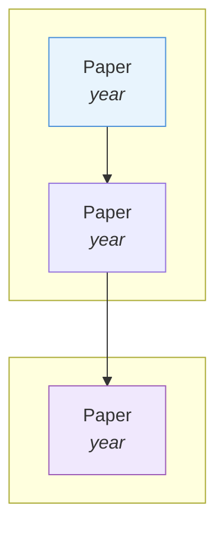

# Research Brain

An Obsidian vault augmented with Claude Code agents and skills for **full-stack AI research** — from literature discovery and paper synthesis to idea formulation, mathematical verification, and research documentation.

## Architecture

### Research Flow

```
General/ (topic overview, landscape, key papers)
  → _KnowledgeHub_/ (paper details: Problem/Method/Results)
    → alphaxiv MCP (full paper content, PDF Q&A, math understanding)
      → Code & PDFs (local repos, GitHub reader, paper PDFs)
```

### Core Components

| Component | Location | Purpose |
|-----------|----------|---------|
| **research-assistant agent** | `.claude/agents/research-assistant.md` | Full-stack research: discovery, idea formulation, math verification, synthesis, documentation, vault maintenance |
| **alphaxiv-search skill** | `.claude/skills/alphaxiv-search/` | Search guide for 6 alphaxiv MCP tools with query patterns and strategies |
| **alphaxiv-summary-extract skill** | `.claude/skills/alphaxiv-summary-extract/` | Batch scraping via Selenium → `_KnowledgeHub_/` notes, enrichment rules, tag taxonomy |
| **knowledgehub-query skill** | `.claude/skills/knowledgehub-query/` | Reads KnowledgeHub notes by arxiv ID and answers questions from their content |
| **paper-curate skill** | `.claude/skills/paper-curate/` | Assigns papers to General/ topics, audits coverage, formatting rules |
| **paper-figure-extract skill** | `.claude/skills/paper-figure-extract/` | Downloads a paper's figure from ar5iv and embeds it under the KH note's `## Method` section |
| **alphaxiv MCP** | External service | 6 tools: semantic search, full-text search, agentic retrieval, paper content, PDF Q&A, GitHub reader |

### Vault Structure

| Folder | Purpose |
|--------|---------|
| `_KnowledgeHub_/` | Individual paper notes (`{arxiv_ID}.md`) with structured summaries |
| `General/` | Topic overview files grouping papers by theme with sub-topics, callouts, mermaid graphs |
| `Embodied-AI/` | Deep-dive notes on VLAs, WAMs, JEPA/latent world models, self-evolving embodied AI |
| `_Projects_/` | Research projects; `01_FirstPublication/` has blueprint, roadmap, math formulations + code repos in `repo/` |
| `data/papers/` | Local PDF files for papers (downloaded on demand with version suffix, e.g., `2602.15922v2.pdf`) |
| `data/repo/` | Local code repositories for referenced papers (cloned on demand) |
| `graphify-out/` | Graphify pilot artifacts: `graph.json`, `GRAPH_REPORT.md`, viz cache (gitignored except the report) |
| `docs/` | Long-form notes that don't belong in `_KnowledgeHub_/`, `General/`, or `Embodied-AI/` |

### alphaxiv API Notes

- Overview page: `https://www.alphaxiv.org/overview/{PAPER_ID}` — JS-rendered HTML, scraped via Selenium + BeautifulSoup in `alphaxiv-summary-extract/scripts/run.py`
- Domain redirects from `alphaxiv.org` → `www.alphaxiv.org` (use `-L` if probing with curl)
- The `.md` suffix endpoint exists (machine-readable render) but is **not used** — static render misses JS-loaded sections this vault needs
- MCP tools (preferred over scraping when possible): `embedding_similarity_search`, `full_text_papers_search`, `agentic_paper_retrieval`, `get_paper_content`, `answer_pdf_queries`, `read_files_from_github_repository`

## Environment

- **Python**: 3.13+ (managed via `uv`)
- **Package manager**: `uv` (Rust-based, see `uv.lock`)
- **Key deps**: `selenium`, `beautifulsoup4`, `requests`, `anthropic`, `tqdm`
- **Virtual env**: `.venv/` (gitignored)

## Conventions

- Never commit to git without explicit user instruction
- KH enrichment rules (authors, tags, aliases, formatting) are in the `alphaxiv-summary-extract` skill
- General/ formatting rules (wikilinks, sorting, callouts) are in the `paper-curate` skill
- Use Edit tool + obsidian-markdown skill for KH enrichment, not custom Python scripts
- Download papers with version suffix via Selenium (Chrome + ChromeDriver) or curl as fallback

## Deep-Dive Format (`Embodied-AI/`)

### The 6-layer pattern

Every `### N. Section` contains these layers in order. **L4, L5, L6 each appear once per `### N.` section** — sub-sections (`#### N.N`) only carry L3 bullets, no callouts of their own.

1. **L1 — Framing prose** (2–4 paragraphs): why the category exists / what tension it resolves. Not a bullet-summary.
2. **L2 — `#### N.N Sub-section Title`** (0 or more per section; no upper limit): the *axis of division*. Opens with 1–2 sentence intro + L3 bullets. Use 0 sub-sections for single-paper or single-axis sections — L3 bullets go directly under `### N.` in that case.
3. **L3 — Bullet-per-paper** (four rules):
   1. **Format**: `- **[[arxiv_id|Paper Alias]]** — Description with ==highlighted methods== + **bold metrics**; significance clause.`
   2. **Bold the wikilink** at bullet start (`- **[[...]]**`).
   3. **One bullet = one paper.** Multi-sentence OK if precise — every sentence earns its place.
   4. **`==highlight==` the methods** (e.g. `==RSSM==`, `==MoE gating==`, `==flow-matching action expert==`) and **bold the metric numbers** (`**99.2%**`, `**+27pp**`, `**3–4 ms/step**`, `**>900K FPS**`). If no metric available, skip — no placeholder.
4. **L4 — Decision Matrix**: `**[Section] — Decision Matrix**` header + table. 2 columns canonical (`| Need | Recommendation |`); 3+ columns OK when the decision is an axis-comparison (e.g. `| Paradigm | Speed | Robustness | Best For |`). Decision-oriented (intent → paper/tool), not a data-dump of L3 bullets.
5. **L5 — `> [!star] Key Papers` callout**: a curated **3–5 paper shortlist** with **editorial significance** — *foundational/canonical* papers and **why they matter to the field**, not their specs. **No metric overlap with L3** (exception: when the metric IS the claim, e.g. DreamerV3's "**150+** tasks with fixed hyperparameters"). Format: `> - [[id|alias]] — significance clause` (wikilink unbolded inside callouts — the `> ` prefix provides visual weight).
   - Good clauses: "the canonical X for Y" · "established the Z paradigm" · "first proof that W" · "the reference architecture for V" · "the methodological landmark that mapped the design space".
6. **L6 — `> [!tip] [Strategic Title]` callout** (placed AFTER L5): the section's **takeaway** — the meta-trade-off, surprising finding, or strategic framing. Synthesize **across sub-sections**, not summarize one.
   - **Title** names the insight directly: `Late Fusion Beats Early Concatenation`, `When to Use WAM vs VLA`, `The Compute-Data Axis Is Now Measurable`, `Egocentric Is the New Pretraining Substrate`.
   - **Pick one of five framings** (illustrative, not exhaustive):
     - *Trade-off*: "X gives you Y at the cost of Z."
     - *Surprising-finding*: "The 2026 surprise: X is *not necessary* — Y emerges from Z."
     - *Composition-recipe*: "These compose — train with A, deploy with B."
     - *Strategic-when-to-use*: "Reach for this when X; otherwise see [[file#N. Section]]."
     - *Common-root*: "All these failures share root X" (for Open Problems sections).
   - **End with ≥1 section-anchored cross-vault link** — never whole-file. Use Obsidian heading-anchor syntax:
     - `[[NN_OtherDeepDive#N. Section Title]]` — jumps to that `### N. Section`
     - `[[NN_OtherDeepDive#N.N Sub-section Title]]` — jumps to that `#### N.N` sub-section
   - Whole-file `[[NN_OtherDeepDive]]` links only for genuine whole-document references. Pick targets where a reader who finishes THIS section would naturally want to deepen on a related topic.

**Other Obsidian callouts allowed as in-section supplements** (placed wherever they aid the reader, not constrained to the L1–L6 sequence): `[!success]` (validated recipes, "the 2026 stack"), `[!warning]` (pathologies, failure modes), `[!example]` (illustrative cases), `[!info]` (legends, side-notes), `[!question]` (open framings). `[!star]` and `[!tip]` remain the required L5/L6 callouts.

### Full deep-dive file structure (template)

```markdown
---
title: "<Topic> — Deep Dive"
tags:
  - <primary-tag>
  - <secondary-tag>
  - <secondary-tag>
aliases:
  - "<Topic>"
  - "<Alternative Name>"
---

# <Topic> — Deep Dive

> [!abstract] Overview
> <2–4 sentence top-level summary of what this deep-dive covers, the canonical papers, the key tension, and what reader gets from it.>

## Evolution Graph



<1–2 paragraph narrative summary of how the field evolved through the threads in the mermaid graph.>

| Year | Paper | Contribution |
|------|-------|-------------|
| YYYY | [[id\|alias]] | One-line key contribution |
| YYYY | [[id\|alias]] | One-line key contribution |

---

## Part A — <Conceptual / Foundational chunk title>

*<1-line italicized framing of what Part A covers.>*

### 1. <Section Title>

<L1: 1–2 paragraphs framing prose explaining WHY this category exists / what tension it resolves.>

#### 1.1 <Axis-of-Division Title>

<Brief 1–2 sentence intro on what unifies these papers.>

- **[[id|alias]]** — Compressed description with ==architectural highlight== + **bold metric**; significance clause.
- **[[id|alias]]** — Description with **bold metric**.

#### 1.2 <Axis-of-Division Title>

<Brief intro.>

- **[[id|alias]]** — Description with ==highlight== + **bold metric**.
- **[[id|alias]]** — Description.

**[<Section> — Decision Matrix]**

| Need | Recommendation |
|---|---|
| <Use case 1> | [[id\|alias]] (**metric**) |
| <Use case 2> | [[id\|alias]] |

> [!star] Key Papers
> - [[id|alias]] — Editorial significance: the canonical X for Y / established the Z paradigm / first proof that W. (No metric overlap with L3 unless the metric IS the significance.)
> - [[id|alias]] — Editorial significance clause.
> - [[id|alias]] — Editorial significance clause.

> [!tip] <Strategic Title — name the trade-off / surprising finding / composition recipe / when-to-use / common-root>
> <The one takeaway — pick one of the 5 framings (Trade-off / Surprising-finding / Composition-recipe / Strategic-when-to-use / Common-root). Synthesize across sub-sections, not summarize one.> Cross-reference [[NN_OtherDeepDive#N. Section Title]] for the related topic and [[MM_AnotherDeepDive#N.N Sub-section Title]] for the complementary view.

---

### 2. <Section Title>

<L1 framing prose.>

#### 2.1 <Axis-of-Division Title>
...
[same 6-layer structure repeats for each section]

---

## Part B — <Methods / Architecture chunk title>

*<1-line italicized framing.>*

### N. <Section Title>
... [same 6-layer structure]

---

## Part C — <Capabilities / Comparison / Open Problems chunk title>

*<1-line italicized framing.>*

### N. <Section Title>
... [same 6-layer structure]

### N+1. Open Problems & Failure Modes

<L1 framing of the open frontier.>

#### N+1.1 <Failure-Mode Cluster>
- **<Problem name>** — <description with citations>; significance clause.

**[<Section> — Decision Matrix]**

| Problem | Remediation Path |
|---|---|
| <Problem 1> | [[id\|alias]] |

> [!star] Key Papers
> - [[id|alias]] — paper that defines or solves the open problem

> [!tip] <Strategic Title — common-root framing>
> <The shared root cause across these problems + cross-vault link.> See [[NN_OtherDeepDive#N. Section Title]] for the orthogonal failure mode.

---

## Quick-Reference Matrix

| Question | Answer |
|---|---|
| Need <X>? | [[id\|alias]] (**metric**) |
| Need <Y>? | [[id\|alias]] |

---

## Cross-References

- [[02_Dataset-Benchmark-Environment]] — <how this deep-dive relates>
- [[03_VLA]] — <how this deep-dive relates>
- [[04_WAM]] — <...>
- [[NN_OtherDeepDive]] — <...>

---

*See [[OtherDeepDive]] for <related topic>, or [[01_Embodied-AI-101]] to start from the basics.*
```
