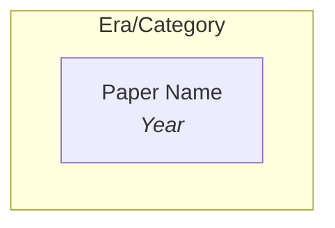

# General/ Topic Overview Maintainer

Assign new KnowledgeHub papers to the correct General/ topic overview files, placing each paper into the appropriate curated sub-topic group. Also handles refreshing callouts, updating key paper highlights, creating new topic files, and auditing coverage.

## When to Use

- After adding new papers to `_KnowledgeHub_/` (batch or single)
- User says "update General", "assign papers", "add to General"
- User wants to check coverage gaps
- User wants to create or reorganize a topic file
- User wants to refresh callouts, key papers, or insights

## Workflow

### Mode A: Assign New Papers

#### Step 1: Find unassigned papers

```bash
cd "/Users/hanchong/Documents/Obsidian Vault/ResearchBrain"
python3 -c "
import os, re
from collections import defaultdict

KH = '_KnowledgeHub_'
GEN = 'General'

# Collect all paper IDs already in General/
assigned = set()
for gf in os.listdir(GEN):
    if not gf.endswith('.md') or gf == '00_Index.md': continue
    content = open(os.path.join(GEN, gf)).read()
    assigned.update(re.findall(r'\[\[(\d{4}\.\d{4,5})', content))

# Find KH papers not in any General/ file
all_kh = set(f.replace('.md','') for f in os.listdir(KH) if f.endswith('.md'))
unassigned = sorted(all_kh - assigned)
print(f'KH papers: {len(all_kh)}')
print(f'Assigned: {len(assigned)}')
print(f'Unassigned: {len(unassigned)}')
if unassigned:
    for pid in unassigned[:20]:
        print(f'  {pid}')
    if len(unassigned) > 20:
        print(f'  ... and {len(unassigned)-20} more')
"
```

#### Step 2: Determine target topic file

Use the paper's tags from its KH note to determine which General/ topic file(s) it belongs to. A paper can appear in multiple topic files if relevant.

**Canonical Tag → Topic Mapping:**

| Tags | Topic File |
|------|-----------|
| `pre-training`, `vision-transformer`, `self-supervised-learning`, `contrastive-learning`, `scaling`, `knowledge-distillation` | `01_Foundation-Models.md` |
| `VLM`, `visual-grounding`, `in-context-learning` | `02_Vision-Language-Models.md` |
| `reasoning`, `spatial-reasoning`, `chain-of-thought`, `planning` | `03_Reasoning-and-Planning.md` |
| `reinforcement-learning`, `RLHF`, `reward-model`, `self-play`, `curriculum-learning` | `04_Reinforcement-Learning.md` |
| `object-detection`, `segmentation`, `3D-understanding`, `domain-adaptation` | `05_Computer-Vision-and-3D.md` |
| `video-understanding` | `06_Video-and-Temporal.md` |
| `robotics`, `VLA`, `world-model`, `manipulation`, `embodied-AI`, `navigation`, `imitation-learning`, `autonomous-driving` | `07_Robotics-and-Embodied-AI.md` |
| `survey`, `benchmark` | `08_Benchmarks-and-Surveys.md` |
| `LLM`, `hallucination` | `09_Multimodal-LLMs.md` |
| `agentic-AI`, `tool-use`, `code-generation` | `10_Agents-and-Tool-Use.md` |
| `continual-learning`, `meta-learning` | `11_Self-Evolving-AI.md` |
| `diffusion`, `image-generation`, `flow-matching`, `generative-model` | `12_Diffusion-and-Generation.md` |

#### Step 3: Read the paper and place it

For each unassigned paper:

1. Read the KH note's **title**, **summary**, and **tags** to understand the paper
2. Read the target General/ topic file to see existing sub-topic groups
3. Append the wikilink `[[ID|Alias]]` to the correct sub-topic group's bullet list
4. If no existing group fits, create a new **bold sub-topic group** with a 1-sentence description in the most relevant section

#### Step 4: Sort papers within each sub-topic

Within each sub-topic's bullet list, sort wikilinks by arxiv ID in **descending order** (newest first). This makes it easy to see the latest work at a glance.

```
Before: - [[2104.14294|DINO]], [[2502.10385|SimDINO]], [[2304.07193|DINOv2]]
After:  - [[2502.10385|SimDINO]], [[2304.07193|DINOv2]], [[2104.14294|DINO]]
```

#### Step 5: Update callouts if new papers are noteworthy

After placing papers, review whether any newly added paper deserves to be highlighted:

- **`[!star]` Key Papers**: If a new paper is more impactful than existing starred papers in that sub-topic (e.g., higher citation count, paradigm-shifting result, state-of-the-art), add it to the `[!star]` callout or replace a less impactful entry. Each `[!star]` should have 3-5 papers max.
- **`[!tip]` Insights**: If the new papers reveal a trend, shift, or practical takeaway not captured by the existing `[!tip]`, update the insight text to reflect the latest understanding.

#### Step 6: Update the Index

Update the paper count in `00_Index.md`:
```bash
total=$(ls _KnowledgeHub_/*.md | wc -l)
```

### Mode B: Audit Coverage

Check which papers are assigned vs unassigned, and which topic files have the most gaps.

```bash
cd "/Users/hanchong/Documents/Obsidian Vault/ResearchBrain"
python3 -c "
import os, re

KH = '_KnowledgeHub_'
GEN = 'General'

all_kh = set(f.replace('.md','') for f in os.listdir(KH) if f.endswith('.md'))

for gf in sorted(os.listdir(GEN)):
    if not gf.endswith('.md') or gf == '00_Index.md': continue
    content = open(os.path.join(GEN, gf)).read()
    papers = set(re.findall(r'\[\[(\d{4}\.\d{4,5})', content))
    print(f'{gf}: {len(papers)} papers')

assigned = set()
for gf in os.listdir(GEN):
    if not gf.endswith('.md'): continue
    content = open(os.path.join(GEN, gf)).read()
    assigned.update(re.findall(r'\[\[(\d{4}\.\d{4,5})', content))

print(f'Total KH: {len(all_kh)}, Assigned: {len(assigned)}, Unassigned: {len(all_kh - assigned)}')
"
```

### Mode C: Create New Topic File

If the user wants a new topic area, follow the template in the Formatting Rules section below. Number it as `{NN}_{Topic-Name}.md` and add it to `00_Index.md`.

### Mode D: Refresh Callouts & Insights

When the user asks to refresh or maintain quality, review each topic file's callouts:

1. **Read each `[!star]` callout** — are the highlighted papers still the most impactful? Check if newer papers (higher arxiv IDs) in the same sub-topic have superseded them.
2. **Read each `[!tip]` callout** — does the insight still reflect the current state of the field? Update with new trends from recently added papers.
3. **Check `[!success]` callouts** — if a recipe or approach has been improved by newer work, update it.
4. **Sort all paper lists** by arxiv ID descending (newest first).

### Mode E: Vault Linting & Health Checks

Run periodic health checks to maintain data integrity and discover new connections. Trigger when the user says "lint", "health check", "audit quality", or "check vault".

#### Data Quality
- **Weak notes** — find KH notes with empty or very short Problem/Method/Results sections; offer to re-fetch from alphaxiv
- **Empty frontmatter** — find notes with `authors: []`, `tags: []`, or `aliases: []` and enrich them
- **Tag consistency** — check if related papers use consistent tags (e.g., two GRPO papers where one has `reinforcement-learning` and the other doesn't)

```bash
cd "/Users/hanchong/Documents/Obsidian Vault/ResearchBrain"
python3 -c "
import os, re

KH = '_KnowledgeHub_'
issues = []
for f in sorted(os.listdir(KH)):
    if not f.endswith('.md'): continue
    content = open(os.path.join(KH, f)).read()
    pid = f.replace('.md','')
    if 'authors: []' in content: issues.append(f'  {pid}: empty authors')
    if 'tags: []' in content: issues.append(f'  {pid}: empty tags')
    if 'aliases: []' in content: issues.append(f'  {pid}: empty aliases')
    # Check for very short Method sections
    m = re.search(r'## Method\n(.*?)(\n## )', content, re.DOTALL)
    if m and len(m.group(1).strip()) < 50:
        issues.append(f'  {pid}: weak Method section ({len(m.group(1).strip())} chars)')

print(f'Issues found: {len(issues)}')
for i in issues[:30]:
    print(i)
if len(issues) > 30:
    print(f'  ... and {len(issues)-30} more')
"
```

#### Missing Connections
- **Cross-citation gaps** — find papers that reference each other (check Method/Results for mentions of other paper names/aliases) but aren't grouped together in General/
- **New sub-topic candidates** — identify clusters of 3+ related papers in a General/ sub-topic that could form their own more specific group
- **Orphan papers** — same as Mode B coverage audit

#### General/ Freshness
- **Stale `[!star]` callouts** — check if newer papers (higher arxiv IDs) in a sub-topic have superseded the currently starred papers
- **Outdated `[!tip]` insights** — check if recent papers contradict or evolve beyond the current insight text
- **Auto-refresh `00_Index.md`** — update paper counts and topic summaries to reflect current vault state

## Formatting Rules

These rules are critical — they come from user feedback and define what makes a well-maintained General/ file.

### Document Structure

```
---
title: "{Topic Title} — Topic Overview"
tags:
  - tag1
  - tag2
aliases:
  - Short Alias
---

# {Topic Title}

> [!abstract] Overview
> {2-3 sentences explaining scope and evolution}

## Evolution Graph
{mermaid graph}

{1-2 sentence evolutionary trend paragraph}

| Year | Paper | Contribution |
|------|-------|-------------|
| YYYY | [[ID\|Name]] | One-sentence contribution |

---

## 1. {Section Title}
{1-2 sentence description}

**{Sub-topic}** — {Description}
- [[newest_ID|Paper1]], [[older_ID|Paper2]], [[oldest_ID|Paper3]]

> [!star] Key Papers
> - [[ID|Paper1]] — Why it matters (1 sentence)
> - [[ID|Paper2]] — Why it matters (1 sentence)

**{Sub-topic 2}** — {Description}
- [[ID|Paper1]], [[ID|Paper2]]

> [!star] Key Papers
> - [[ID|Paper1]] — Why it matters

> [!tip] {Insight Title}
> {2-3 sentences of practical guidance or synthesis}

---

## Cross-References
- [[Related_Topic]] — How it connects

---
*Next: [[Next_Topic]] for X.*
```

### Paper Ordering

Within each sub-topic bullet list, sort wikilinks by **arxiv ID descending** (newest first). This surfaces the latest research immediately. The arxiv ID encodes the submission date (YYMM.NNNNN), so descending order = reverse chronological.

### Callout Types & Their Purpose

Each callout type serves a specific role in the topic overview. Using them consistently helps readers quickly find what they need.

| Callout | Syntax | Purpose | Frequency | Content Rules |
|---------|--------|---------|-----------|---------------|
| **Overview** | `> [!abstract] Overview` | Sets the scene for the entire topic — what it covers, why it matters, and how it connects to the rest of the vault | 1 per file (at top) | 2-3 sentences. Explain scope, evolution arc, and key threads. |
| **Key Papers** | `> [!star] Key Papers` | Highlights the 2-3 most impactful papers in a sub-topic — the ones a newcomer should read first | After each sub-topic group | Each entry: `- [[ID\|Name]] — 1-sentence justification`. Focus on impact (paradigm shift, SOTA, foundational) not content summary. |
| **Practical Insight** | `> [!tip] {Title}` | Synthesizes the section's papers into actionable guidance — the "so what?" for a practitioner | 1 per major `##` section (at end) | 2-3 sentences. Bridge from research to practice. Include concrete recommendations, trade-offs, or decision frameworks. |
| **Ideal Recipe** | `> [!success] {Title}` | Documents a proven, validated approach or recipe that emerged from multiple papers | Rare (0-1 per file) | Use `==highlights==` for key components. Only for well-established patterns with empirical backing. |

**When to update callouts:**
- `[!star]`: Update when a new paper is more impactful than an existing starred paper. Signs: it sets a new SOTA, introduces a paradigm shift, or is from a top group and addresses a key limitation of previously starred work.
- `[!tip]`: Update when new papers collectively shift the practical takeaway. If the old tip says "use X" but 3 recent papers show "Y is better", update it.
- `[!success]`: Update when the proven recipe changes (new component, better backbone, validated alternative).

### Wikilink Format

```
[[2602.15922|DreamZero]]
```
- Use the paper's alias from KH frontmatter as display text
- Arxiv ID without version suffix

### Sub-topic Groups

Each sub-topic group follows this pattern:
```
**{Descriptive Name}** — {1-2 sentence explanation of what these papers share}
- [[ID|Paper1]], [[ID|Paper2]], [[ID|Paper3]]
```

Rules:
- Name should be descriptive and specific (not "Other" or "Miscellaneous")
- Description explains the shared theme or approach
- Papers comma-separated on a single bullet line, sorted by ID descending
- When a sub-topic exceeds ~15 papers, split into two more specific sub-topics

### Mermaid Evolution Graphs



- `graph TD` (top-down directed)
- Nodes use **plain text** (not wikilinks): `["Name<br/><i>Year</i>"]`
- Colors:
  - Blue (`fill:#e8f4fd,stroke:#4a90d9`) = foundational/early work
  - Purple (`fill:#f0e8fd,stroke:#9b59b6`) = paradigm shift/novel approach
  - Green (`fill:#e8fde8,stroke:#27ae60`) = frontier/latest work
- Update the graph when a new paper represents a significant evolution milestone

### Evolution Reference Table

After the mermaid graph, add a **trend paragraph** (1-2 sentences explaining the evolutionary phases), then a **3-column reference table**:

```
The field evolved through N phases: **phase name** (years), **phase name** (years), ...

| Year | Paper | Contribution |
|------|-------|-------------|
| 2022 | [[2212.06817\|RT-1]] | Transformer policy on 130K real demos; proved Transformers work for robot control |
| 2024 | [[2410.24164\|π0]] | Flow matching action expert + VLM for dexterous manipulation |
```

- **Year**: extracted from the mermaid node label `<i>Year</i>`
- **Paper**: wikilink with escaped pipe (`\|`) inside table cells
- **Contribution**: one sentence explaining what this paper introduced or proved
- Rows sorted chronologically (oldest first — this is the one place ascending order is used, because the table tells a story of progression)

### What NOT to Do

- No "Other" or "Miscellaneous" catch-all groups — every paper belongs somewhere specific
- No truncated summaries with "..." — just wikilinks grouped by method
- No flat paper dumps — every paper goes in a named sub-topic with a description
- No content duplication — summaries live in KnowledgeHub, General/ just groups and contextualizes
- No `[!star]` without explanation — always include em-dash + 1-sentence justification
- No papers sorted randomly — always sort by arxiv ID descending within each sub-topic
- General/ files should be standalone — do not cross-reference deep-dive folders
- No wikilinks inside mermaid graph nodes — use plain text in nodes, put wikilinks in the reference table below

## Notes

- A paper can appear in multiple topic files if it spans multiple areas
- Surveys and benchmarks go in `08_Benchmarks-and-Surveys.md` AND the relevant domain file
- When >15 papers in a sub-topic, consider splitting into 2 sub-topics
- Keep the Index file's paper count updated after changes
- When adding papers, always check if they deserve `[!star]` status — a great paper buried in a list without recognition is a missed opportunity
