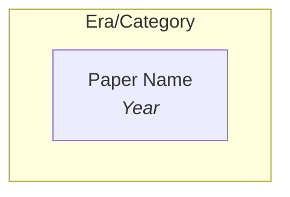

# Topic-File Formatting Reference

Read this when creating or restructuring a General/ topic overview file. Covers paper ordering, callout types, wikilink format, sub-topic groups, mermaid evolution graphs, and anti-patterns.

### Paper Ordering

Within each sub-topic bullet list, sort wikilinks by **arxiv ID descending** (newest first). This surfaces the latest research immediately. The arxiv ID encodes the submission date (YYMM.NNNNN), so descending order = reverse chronological.

### Callout Types & Their Purpose

Each callout type serves a specific role in the topic overview. Using them consistently helps readers quickly find what they need.

| Callout | Syntax | Purpose | Frequency | Content Rules |
|---------|--------|---------|-----------|---------------|
| **Overview** | `> [!abstract] Overview` | Sets the scene for the entire topic — what it covers, why it matters, and how it connects to the rest of the vault | 1 per file (at top) | 2-3 sentences. Explain scope, evolution arc, and key threads. |
| **Key Papers** | `> [!star] Key Papers` | Highlights the 2-3 most impactful papers in a sub-topic — the ones a newcomer should read first | After each sub-topic group | Each entry: `- [[ID\|Name]] — 1-sentence justification`. Focus on impact (paradigm shift, SOTA, foundational) not content summary. |
| **Practical Insight** | `> [!tip] {Title}` | Synthesizes the section's papers into actionable guidance — the "so what?" for a practitioner | 1 per major `##` section (at end) | 2-3 sentences. Bridge from research to practice. Include concrete recommendations, trade-offs, or decision frameworks. |
| **Ideal Recipe** | `> [!success] {Title}` | Documents a proven, validated approach or recipe that emerged from multiple papers | Rare (0-1 per file) | Use `==highlights==` for key components. Only for well-established patterns with empirical backing. |

**When to update callouts:**
- `[!star]`: Update when a new paper is more impactful than an existing starred paper. Signs: it sets a new SOTA, introduces a paradigm shift, or is from a top group and addresses a key limitation of previously starred work.
- `[!tip]`: Update when new papers collectively shift the practical takeaway. If the old tip says "use X" but 3 recent papers show "Y is better", update it.
- `[!success]`: Update when the proven recipe changes (new component, better backbone, validated alternative).

### Wikilink Format

```
[[2602.15922|DreamZero]]
```
- Use the paper's alias from KH frontmatter as display text
- Arxiv ID without version suffix

### Sub-topic Groups

Each sub-topic group follows this pattern:
```
**{Descriptive Name}** — {1-2 sentence explanation of what these papers share}
- [[ID|Paper1]], [[ID|Paper2]], [[ID|Paper3]]
```

Rules:
- Name should be descriptive and specific (not "Other" or "Miscellaneous")
- Description explains the shared theme or approach
- Papers comma-separated on a single bullet line, sorted by ID descending
- When a sub-topic exceeds ~15 papers, split into two more specific sub-topics

### Mermaid Evolution Graphs



- `graph TD` (top-down directed)
- Nodes use **plain text** (not wikilinks): `["Name<br/><i>Year</i>"]`
- Colors:
  - Blue (`fill:#e8f4fd,stroke:#4a90d9`) = foundational/early work
  - Purple (`fill:#f0e8fd,stroke:#9b59b6`) = paradigm shift/novel approach
  - Green (`fill:#e8fde8,stroke:#27ae60`) = frontier/latest work
- Update the graph when a new paper represents a significant evolution milestone

### Evolution Reference Table

After the mermaid graph, add a **trend paragraph** (1-2 sentences explaining the evolutionary phases), then a **3-column reference table**:

```
The field evolved through N phases: **phase name** (years), **phase name** (years), ...

| Year | Paper | Contribution |
|------|-------|-------------|
| 2022 | [[2212.06817\|RT-1]] | Transformer policy on 130K real demos; proved Transformers work for robot control |
| 2024 | [[2410.24164\|π0]] | Flow matching action expert + VLM for dexterous manipulation |
```

- **Year**: extracted from the mermaid node label `<i>Year</i>`
- **Paper**: wikilink with escaped pipe (`\|`) inside table cells
- **Contribution**: one sentence explaining what this paper introduced or proved
- Rows sorted chronologically (oldest first — this is the one place ascending order is used, because the table tells a story of progression)

### What NOT to Do

- No "Other" or "Miscellaneous" catch-all groups — every paper belongs somewhere specific
- No truncated summaries with "..." — just wikilinks grouped by method
- No flat paper dumps — every paper goes in a named sub-topic with a description
- No content duplication — summaries live in KnowledgeHub, General/ just groups and contextualizes
- No `[!star]` without explanation — always include em-dash + 1-sentence justification
- No papers sorted randomly — always sort by arxiv ID descending within each sub-topic
- General/ files should be standalone — do not cross-reference deep-dive folders
- No wikilinks inside mermaid graph nodes — use plain text in nodes, put wikilinks in the reference table below

