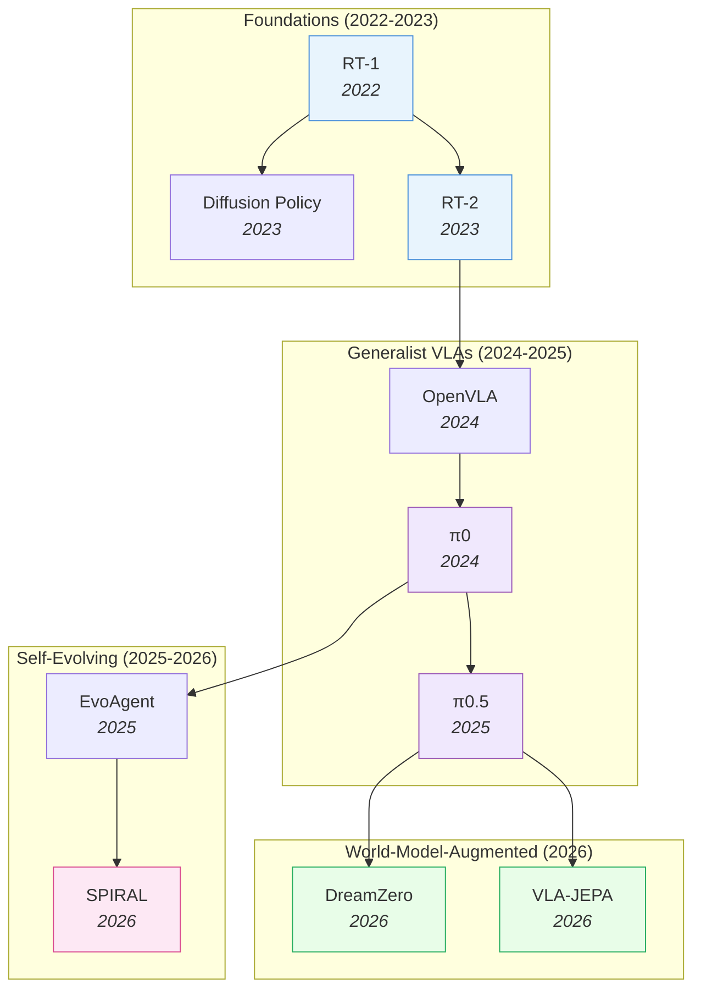

# Embodied AI — 101

Embodied AI gives intelligent systems physical presence — robots that manipulate objects, navigate environments, drive vehicles, and interact with the real world. The two core model families are **Vision-Language-Action (VLA)** models that learn from demonstrations, and **World Action Models (WAM)** that learn to predict the future. This note covers both paradigms and how they fit together.

> [!abstract] One-Line Summary
> **VLAs** copy what they've seen. **WAMs** imagine what will happen next. **Self-evolving systems** improve from experience. See [[05_VLA]], [[07_WAM]], and [[13_Self-Evolving-VLA-WAM]] for deep dives.

## Evolution Graph

The embodied-AI field evolved through four phases — from single-task imitation foundations, to generalist VLAs, to world-model-augmented systems, to self-evolving agents.



The field progressed through: **Foundations** ([[2212.06817|RT-1]], [[2303.04137|Diffusion Policy]], [[2307.15818|RT-2]]) — proving Transformers and VLMs work for robot control; **Generalist VLAs** ([[2406.09246|OpenVLA]], [[2410.24164|π0]], [[2504.16054|π0.5]]) — open-source weights, flow-matching action heads, cross-embodiment transfer; **World-Model-Augmented** ([[2602.15922|DreamZero]], [[2602.10098|VLA-JEPA]]) — adding video/latent prediction for physics grounding; **Self-Evolving** ([[2502.05907|EvoAgent]], [[2506.24119|SPIRAL]]) — agents that improve autonomously through imagination loops and curiosity.

> [!star] Canonical Papers — Start Here
> - [[2212.06817|RT-1]] — Proof that Transformers work for robot control; the foundational VLA
> - [[2307.15818|RT-2]] — Web-scale VLM knowledge transfers to robots; defined the modern VLA paradigm
> - [[2410.24164|π0]] — Flow-matching action expert + VLM; the dominant continuous-action recipe
> - [[2406.09246|OpenVLA]] — Open-source 7B VLA that democratized VLA research
> - [[2602.15922|DreamZero]] — Joint video + action prediction (14B WAM); zero-shot robot policies
> - [[2602.10098|VLA-JEPA]] — JEPA-based latent world model attached to a VLA; the bridge between VLA and WAM

---

## Part A — Concepts

*Start here. The intuitive primer, the two paradigms (VLA & WAM), and how they compare side-by-side.*

### 1. ELI5

> [!example] Catching a Ball
> Imagine you are teaching a robot how to catch a ball. Here is how the two robot brains would learn:

#### The VLA Brain (The Memorizer)

This robot learns by playing **"Simon Says."** You throw the ball exactly the same way 100 times, and you move the robot's arm to the exact right spot to catch it. The robot memorizes, "When I hear 'catch' and see the ball right *here*, I move my arm exactly like *this*."

It is really good at following instructions and recognizing the ball, but it doesn't actually understand how gravity works. If the wind blows the ball a little to the left, or you use a heavier ball, the robot will probably miss because it only knows the exact movements it memorized.

#### The WAM Brain (The Imaginer)

This robot learns by **daydreaming**. Instead of just memorizing arm movements, it watches videos of balls flying through the air and bouncing. When you throw the ball to this robot, its brain actually imagines the future. It thinks, "If the ball is moving this fast, it will land over *there* in two seconds."

Because it actually understands the rules of the world (like gravity and momentum) and can picture what is about to happen, it can figure out how to move its arm to catch the ball — even if it's a brand new bouncy ball or the wind is blowing.

> [!summary] The Short Version
> - **VLAs** learn by copying exactly what they have seen before.
> - **WAMs** learn by imagining what will happen next and acting based on that picture.

---

---

### 2. Vision-Language-Action (VLA) Models

VLAs are essentially multimodal large language models fine-tuned for robotic control. Well-known examples include [[2307.15818|RT-2]] and [[2406.09246|OpenVLA]].

**How They Work:** They ingest visual observations (images of the environment) and language instructions (the goal), and directly output a sequence of discrete ==action tokens== (motor commands or waypoints).

**The Learning Paradigm:** VLAs primarily learn through ==behavioral cloning== — dense state-action imitation. They look at what an expert did in a specific situation and learn to map that exact visual state to that exact action.

> [!success] Strengths
> Built on robust vision-language backbones, VLAs excel at **semantic generalization**. If you tell a VLA to "pick up the red apple," it deeply understands what an apple is and what red looks like, even if the apple is slightly different from training data.

> [!warning] Limitations
> VLAs are effectively **"blind" to physics**. Because they only output an action, they do not inherently understand its physical consequences. This makes them struggle in novel environments with unseen physical dynamics, and they require thousands of carefully collected, repetitive expert demonstrations to learn a single task.

---

---

### 3. World Action Models (WAM)

WAMs are an emerging class of foundation models (such as [[2602.15922|DreamZero]]) that unify action generation with a predictive "world model."

**How They Work:** Built on advanced ==video diffusion backbones== or autoregressive transformers, WAMs take in visual context and language instructions, but jointly predict ==future video frames== and the corresponding actions.

**The Learning Paradigm:** WAMs shift the learning process from imitation to ==inverse dynamics==. By forcing the model to generate the future visual state of the world (e.g., predicting exactly how an object will fall or deform when pushed), the model naturally learns "world physics priors." Motor commands are then aligned with these predicted visual futures.

> [!success] Strengths
> - **Zero-Shot Generalization:** WAMs can successfully execute unseen physical motions in novel environments on the first try.
> - **Data Efficiency:** They can learn from heterogeneous sources, including passive, video-only data (e.g., 10 minutes of a human performing a task), enabling cross-embodiment transfer without action labels.

> [!warning] Limitations
> WAMs are computationally expensive. Generating future video states alongside actions introduces high latency, requiring significant optimizations (decoupled noise schedules, KV-caching) to reach real-time control frequencies.

---

---

### 4. Head-to-Head Comparison

| Feature | Vision-Language-Action (VLA) | World Action Models (WAM) |
| --- | --- | --- |
| Primary Output | Actions | Future visual states (video) + Actions |
| Learning Objective | Imitate expert actions | Predict world evolution + inverse dynamics |
| Physical Understanding | Implicit and often brittle | Explicit, grounded in physics priors |
| Data Reliance | Repetitive, action-labeled demonstrations | Diverse data, including passive video |
| Generalization | High semantic, low physical | Zero-shot task, environment, and embodiment |

**When to Choose VLA**: Your task is language-heavy (complex instructions), you have abundant demonstration data, and inference speed matters (real-time control at 10-50Hz). VLAs inherit semantic understanding from web-scale VLM pre-training, making them strong at understanding novel instructions. **When to Choose WAM**: You need robustness to visual perturbations (lighting, camera, background changes), your task requires physics-aware planning (predicting consequences of actions), or real-world training data is limited (world model imagination compensates). **When to Combine**: The 2026 consensus is converging on integration — [[2603.16666|Fast-WAM]] and [[2602.10098|VLA-JEPA]] show you can get WAM-level robustness with VLA-level speed by using world model objectives during training only.

> [!tip] Decision Rule
> - **VLA** — language-heavy tasks, abundant demos, real-time control (10–50 Hz)
> - **WAM** — visual-perturbation robustness, physics-aware planning, data scarcity
> - **Both** — train with world-model objectives ([[2602.10098|VLA-JEPA]]), deploy without test-time imagination ([[2603.16666|Fast-WAM]])

---

## Part B — Implementation

*From taxonomy to working code: the formal architecture map, then the open-source stack you can build with today.*

### 5. Robotic Foundation Model Architectures

#### Four Learning Strategies

| Strategy | How It Works | Limitation |
| --- | --- | --- |
| ==Model-Free== | Task-specific policy network maps states → actions | Poor semantic generality |
| ==Model-Based== | Explicit dynamics models decompose the task | Requires accurate dynamics; configuration-specific |
| ==WAM== | Predicts future goal-images, derives actions via inverse dynamics | Hard to learn for complex interactions (doors, deformables) |
| ==VLA== | Pre-trained VLMs encode state, predict actions directly | High compute for history-dependent processing |

**Model-Free** approaches ([[1312.5602|DQN]], [[1801.01290|SAC]], [[1707.06347|PPO]]) learn a direct mapping from observations to actions through trial and error. They are powerful for specific tasks but require millions of environment interactions and don't transfer well to new tasks. **Model-Based** approaches (MPC, [[1906.08253|MBPO]]) learn an explicit dynamics model and use it for planning. They are sample-efficient but require accurate dynamics — errors in the model compound during long-horizon planning. **WAMs** take model-based to the extreme: learn dynamics from internet-scale video, then derive actions via inverse dynamics. The video backbone provides rich physics priors but makes the model large and slow. **VLAs** bypass explicit dynamics entirely: the VLM backbone provides implicit physical understanding from web-scale pre-training, and the model directly predicts actions. This is simpler and faster, but the physical understanding is brittle — it hasn't truly 'learned' physics, just correlated visual patterns with actions.

> [!tip] WAM vs VLA — The Key Differentiator
> WAMs predict a future goal-state then calculate actions via inverse dynamics — powerful but hard to learn for complex physics. VLAs bypass explicit world-modeling by inheriting spatial reasoning from web-scale VLM pre-training, mapping observations directly to control signals.

#### VLA Architecture Taxonomy

VLA design choices break into three axes:

**History Modeling:**
- ==One-Step== — current observation only (fast, but no temporal context)
- ==History Aggregation== — sliding window of past observations

**History Fusion:**
- ==Interleaved== — observations + actions in one multi-modal stream (effective but expensive)
- ==Policy Head== — VLM processes each step, dedicated head (Transformer/RNN) handles history (more efficient)

**Action Space:**
- ==Discrete== — action tokens predicted auto-regressively (compounding errors over long horizons)
- ==Continuous== — floating-point values via MSE, BCE, or ==Flow Matching== (better temporal coherence)

==Flow Matching== has emerged as the dominant continuous-action recipe: [[2410.24164|π0]] established it for VLAs, [[2503.20314|Wan]] scaled it for video-conditioned generation, [[2504.18471|Action Flow Matching]] adapted it for continual robot learning, and [[2505.05470|Flow-GRPO]] showed RL fine-tuning works directly on flow-matching policies — closing the loop between flow-matching SFT and RL post-training.

> [!abstract] Current SOTA Configuration (2026)
> ==Policy Head fusion + Continuous Action Space + Flow-Matching action expert + MoE backbone== — best trade-off between reasoning capacity, throughput, and zero-shot generalization. Frontier exemplars: [[2604.15483|π0.7]] (steerable generalist), [[2602.15922|DreamZero]] (joint video+action 14B WAM), [[2602.10098|VLA-JEPA]] (latent world model + flow head), and [[2603.16666|Fast-WAM]] (training-time video, deployment-time speed).

**Representative models:** [[2310.08864|RT-2-X]], [[2406.09246|OpenVLA]] (one-step/discrete) · [[2405.12213|Octo]], [[2312.13139|GR-1]] (interleaved) · [[2311.01378|RoboFlamingo]] (policy head) · [[2604.07430|HY-Embodied-0.5]] (MoT-MoE multi-embodiment)

#### Data Strategy

Three training recipes for bridging sim-to-real:

1. **Co-training** — simultaneous in-domain + cross-embodiment ([[2310.08864|OXE]]) data
2. **Post-training** — co-train on diverse data, then refine on in-domain only
3. **Fine-tuning** — in-domain data exclusively

> [!warning] In-domain data is non-negotiable
> Even task-agnostic data from the *same robot* outperforms massive cross-embodiment datasets for target tasks. ==Post-training== (diverse pre-train → in-domain refinement) yields the best generalization.

#### Key Empirical Findings

1. **Generalization** — VLAs achieved a **30.3%** improvement on 5-task chains in unseen [[2112.03227|CALVIN]] scenes
2. **Backbone matters** — [[2306.14824|KOSMOS-2]] and [[2407.07726|PaliGemma]] outperform others due to stronger vision-language alignment from larger pre-training datasets
3. **Continuous > Discrete** — continuous actions avoid compounding discretization errors; Flow Matching offers slight gains over MSE
4. **Emergent self-correction** — top VLAs re-locate handles after a missed grasp without explicit error-recovery training; ==Mixture-of-Experts (MoE)== improves zero-shot generalization. Frontier MoE/MoT examples: [[2604.07430|HY-Embodied-0.5]] (MoT for multi-embodiment), [[2603.15169|ForceVLA2]] (Cross-Scale MoE for force fusion), [[2603.07648|AtomicVLA]] (SG-MoE for skill abstraction).

> [!success] Ideal VLA Design Spec
> ==KosMos/[[2407.07726|PaliGemma]] backbone== + ==Policy Head fusion== + ==Continuous actions (Flow Matching)== + ==MoE== + ==Post-training on in-domain data==

---

---

### 6. How to Build: The Open-Source Stack

The open-source robotics ecosystem now provides every component needed to build, train, and deploy both VLAs and WAMs — from data to deployment on a $100 robot arm.

#### The Pipeline

```
Researcher → Data → Training → Simulation → Deployment
             OXE    LeRobot    Genesis       SO-100
```

| Component | Tool | Role |
|-----------|------|------|
| **Data** | [[2310.08864\|Open X-Embodiment]] | 1M+ cross-embodiment trajectories for pre-training |
| **Training Framework** | [LeRobot (HuggingFace)](https://github.com/huggingface/lerobot) | End-to-end training pipeline for VLAs ([[2406.09246\|OpenVLA]], ACT, [[2303.04137\|Diffusion Policy]]) |
| **Simulation** | [Genesis](https://genesis-world.readthedocs.io/en/latest/), [Newton (NVIDIA)](https://developer.nvidia.com/newton-physics) | Physics-accurate simulation for verification before real-world deployment |
| **Hardware** | [SO-100](https://github.com/TheRobotStudio/SO-ARM100) (~$100) | Low-cost robot arm for real-world testing and deployment |

#### Building a VLA (Quick Recipe)

1. **Pick a VLM backbone** — [[2407.07726\|PaliGemma]] or [[2306.14824\|KOSMOS-2]] (best vision-language alignment)
2. **Add an action head** — Policy Head with continuous actions via ==Flow Matching==
3. **Pre-train on [[2310.08864|OXE]]** — cross-embodiment data for broad priors
4. **Post-train on in-domain data** — fine-tune on your specific robot + tasks
5. **Deploy** — use ==[[2501.09747|FAST]]== tokenization for real-time inference

> See [[05_VLA#1. Design-Space Principles]] for the full design-space analysis.

#### Building a WAM (Quick Recipe)

1. **Choose your prediction space** — Pixel (richest but slowest), Latent (fastest), or Action-only (most efficient)
2. **Pick a backbone** — Video diffusion ([[2501.03575|Cosmos]] / [[2602.15922|DreamZero]]), JEPA ([[2506.09985|V-JEPA 2]]), or RSSM ([[1912.01603|Dreamer]] lineage)
3. **Pre-train on video** — internet-scale video teaches physics priors
4. **Decide test-time strategy** — Full imagination (robust but 4.8x slower) or training-only video ([[2603.16666|Fast-WAM]] approach)
5. **Add action decoding** — Flow matching or inverse dynamics from predicted states

> See [[07_WAM#1. The Design Space]] for the three-axis trade-off analysis.

> [!tip] Start Simple, Add Complexity
> Begin with a VLA (simpler, faster to iterate). Add world model augmentation only if you need robustness to visual perturbations or physics-aware planning. The [[2603.16666|Fast-WAM]] finding: you can get WAM-level robustness with VLA-level speed by using video objectives at training time only.

#### The Self-Evolving Frontier

Both VLAs and WAMs can be made self-evolving — autonomously discovering failure modes and improving through experience. Three paths to self-evolution:

1. **RL Fine-Tuning** (VLA path): Apply reinforcement learning after initial imitation learning. The VLA explores, receives task-success reward, and adapts its policy. Simple and effective — VLAs are naturally resistant to catastrophic forgetting ([[2603.03818|VLA Continual Learning]]). Best for: in-domain improvement.
2. **Imagination Loops** (WAM path): The world model generates synthetic "dream" rollouts. The policy trains on dreams, improving without real-world interaction. [[2506.24119|SPIRAL]] and [[2502.05907|EvoAgent]] show this creates positive feedback loops. Best for: safe exploration, data-scarce settings.
3. **Curiosity-Driven Exploration**: The agent actively seeks states where its world model is uncertain ([[2503.01584|SENSEI]]) or where an adversary finds failures ([[2412.02818|RoboMD]]). This creates a self-directed curriculum that focuses practice on the agent's weaknesses.

The critical prerequisite for all three paths: **the agent must first detect that it IS failing**. See [[13_Self-Evolving-VLA-WAM]] for how failure detection, self-correction, and active probing enable the self-evolution loop.

---

## Part C — Frontier & Open Problems

*The open problems that still bound embodied-AI progress — the load-bearing constraints any new system must address.*

### 7. Open Problems & Key Challenges

| Challenge | Why It's Hard | Current Best Approach |
|-----------|--------------|----------------------|
| **Sim-to-real gap** | Physics simulators approximate reality; policies that work in sim break on real robots | Domain randomization + real-world fine-tuning ([[2405.05941\|SimplerEnv]] for evaluation) |
| **Data scarcity** | Real robot data is expensive ([[2212.06817\|RT-1]]: 17 months, 13 robots for 130K demos) | Cross-embodiment pre-training ([[2310.08864\|OXE]]) + world model imagination |
| **Real-time control** | Robots need actions at 10-50 Hz; large models are slow | Efficient VLAs ([[2506.01844\|SmolVLA]]: 450M params), [[2603.16666\|Fast-WAM]] (strip video at deploy) |
| **Safety** | Robots operate near humans; catastrophic failures are physical | Failure prediction ([[2510.09459\|FIPER]]), uncertainty-aware planning ([[2504.16680\|RWM-U]]) |
| **Generalization** | Novel objects, new environments, unseen instructions | Self-evolving systems that adapt from deployment experience |

---

> [!tip] Use This as a Reading Compass
> Each challenge points to the deep-dive note that treats it:
> sim-to-real → [[14_Sim-to-Real-Transfer]];
> data scarcity → [[02_Dataset-Benchmark-Environment]] + [[12_Egocentric-Pretraining-and-Human-Video]];
> real-time control → [[05_VLA]] §2 (efficient VLAs) + [[07_WAM]] §6 (efficient WAMs);
> safety → [[13_Self-Evolving-VLA-WAM]] §4 (failure detection);
> generalization → [[13_Self-Evolving-VLA-WAM]] §5–7 (self-evolving systems).

## Cross-References

The Embodied-AI deep-dive collection maps the field along ten complementary axes — read each note when its question is yours.

- [[02_Dataset-Benchmark-Environment]] — Datasets, benchmarks, and simulation platforms; the data foundation for everything that follows
- [[05_VLA]] — Vision-Language-Action models deep-dive; design-space principles, efficiency frontier, 3D-awareness, RL post-training, failure modes
- [[07_WAM]] — World Action Models deep-dive; VideoGen, VLM-based, and from-scratch WAM architectures
- [[08_Latent-World-Models]] — JEPA evolution lineage; latent prediction as the bridge between video-WAMs and VLAs
- [[13_Self-Evolving-VLA-WAM]] — Self-evolving systems; failure detection, RL post-training, imagination loops, persistent memory
- [[11_Physics-Aware-Embodied-AI]] — Physics priors for embodied AI; PINN integration, contact dynamics, physics-coupled VLA pipelines
- [[06_VLA-Reasoning-and-CoT]] — Reasoning insertion points in VLA pipelines; latent CoT, MCTS, draft-and-verify
- [[12_Egocentric-Pretraining-and-Human-Video]] — Egocentric data → robot policy; scaling laws, hand→gripper transfer
- [[09_Contact-Rich-and-Whole-Body-Control]] — Multi-sensor and force-aware VLAs; tactile hardware, force-conditioned architectures
- [[14_Sim-to-Real-Transfer]] — The reality gap; learned simulators, robust policies, digital twins, evaluation benchmarks

---

*For a deep dive into VLA design, see [[05_VLA]]. For WAM papers by category, see [[07_WAM]]. For latent world models, see [[08_Latent-World-Models]]. For datasets and benchmarks, see [[02_Dataset-Benchmark-Environment]]. For self-evolving systems, see [[13_Self-Evolving-VLA-WAM]]. For physics-aware embodied AI, see [[11_Physics-Aware-Embodied-AI]]. For VLA reasoning and CoT, see [[06_VLA-Reasoning-and-CoT]]. For egocentric pretraining, see [[12_Egocentric-Pretraining-and-Human-Video]].*
