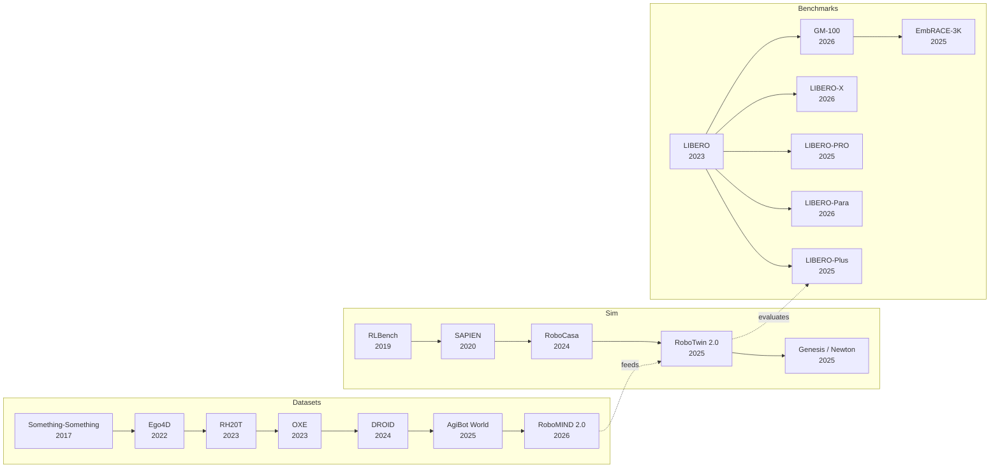

# Datasets, Benchmarks & Environments

> [!abstract] Overview
> The data and evaluation infrastructure that enables all embodied AI research. Embodied progress depends on three interlocked axes — the **data** the policy trains on, the **environment** it learns in, and the **benchmark** it is judged by. This note maps the full landscape: cross-embodiment scale datasets, multi-modal specialist data (tactile, bimanual, egocentric), simulation environments (rigid, soft-body, differentiable, household-scale), the diagnostic stack ([[2306.03310|LIBERO]] family, [[2601.11421|GM-100]], [[2507.10548|EmbRACE]]), language-conditioned long-horizon evals, sim-to-real transfer benchmarks, spatial reasoning probes, and the new generation of *interaction-centric* world model benchmarks. The field evolved from single-robot setups ([[1909.12271|RLBench]]) through million-trajectory cross-embodiment corpora ([[2310.08864|OXE]]) to household-scale simulation ([[2406.02523|RoboCasa]]), soft-body Gaussian-splat digital twins ([[2511.04665|Real-to-Sim GS]]) and diagnostic robustness evaluation ([[2510.13626|LIBERO-Plus]], [[2601.11421|GM-100]], [[2507.10548|EmbRACE-3K]]).

> [!example] How Datasets Are Used — Fuel for Every Training Stage
> Million-trajectory cross-embodiment corpora ([[2310.08864|OXE]], [[2403.12945|DROID]], [[2503.06669|AgiBot World]]) **pretrain VLA backbones** to learn task-invariant representations across robot morphologies; lab-curated single-embodiment data ([[2509.00576|G0]]) **post-trains specialists** when the deployment robot is fixed. Egocentric human video ([[2602.16710|EgoScale]], [[2605.06747|HumanNet]], [[2110.07058|Ego4D]]) supplies **finger-level supervision** that RGB-only robot data omits, while tactile and bimanual datasets ([[2604.20444|VTouch++]], [[2512.24653|RoboMIND 2.0]]) cover **modalities** (force, contact, dual-arm timing) that scale alone cannot. Hand-held collection paradigms ([[2402.10329|UMI]], [[2505.21864|DexUMI]], [[2605.03452|BifrostUMI]]) **replace teleoperation entirely**, unlocking dynamic and dexterous tasks that teleop physically cannot collect.

> [!note] How Environments & Engines Are Used — The Substrate
> Engines underwrite **both** data generation and evaluation. GPU-parallel engines ([[2511.04831|Isaac Lab]], [[2003.08515|SAPIEN]], [[2603.12185|ComFree-Sim]]) spawn thousands of environments at once to make **RL data scaling** feasible; photorealistic kitchens ([[2406.02523|RoboCasa]], [[2602.10116|SAGE]]) **close the visual reality gap** during training; bimanual sim+benchmark pairs ([[2506.18088|RoboTwin 2.0]]) ship data generator, evaluation suite, and domain randomization together so the trio stops being separable. The newer **real-to-sim wave** ([[2511.04665|Real-to-Sim GS]], [[2506.06440|Vid2Sim]], [[2510.21447|PhysWorld-Deformable]]) rebuilds the deployment scene from real video into a photorealistic digital twin that the policy can be re-evaluated against — collapsing the sim-real distinction for a specific target. Engine choice is itself a research-design decision (see §4): contact-accurate [MuJoCo](https://mujoco.org) vs throughput-optimized [PhysX](https://developer.nvidia.com/physx-sdk) shapes which experiments are even runnable.

---

> [!question] How Benchmarks Are Used — Staged Diagnostic Gates
> Modern evaluation is a *pipeline*, not a single score. A policy is pushed through ascending rigor: standard in-distribution ([[2306.03310|LIBERO]], [[2112.03227|CALVIN]]) → perturbation robustness ([[2510.13626|LIBERO-Plus]], [[2510.03827|LIBERO-PRO]], [[2603.28301|LIBERO-Para]]) → fine manipulation ([[2601.11421|GM-100]]) → embodied reasoning ([[2507.10548|EmbRACE-3K]], [[2508.13142|EASI]]) → sim-to-real correlation ([[2405.05941|SimplerEnv]], [[2605.06311|VISER]]) → distributed real-robot leaderboards ([[2506.18123|RoboArena]], [[2510.17950|RoboChallenge]]). Each tier probes a **different failure axis**: a policy that scores >90% on [[2306.03310|LIBERO]] can collapse to near-0% on [[2510.03827|LIBERO-PRO]] under minor perturbations, so passing any one tier in isolation no longer counts as evidence of generalization. World-model benchmarks ([[2603.22212|Omni-WorldBench]], [[2506.00613|WorldGym]], [[2603.23497|WildWorld]]) extend evaluation from passive video quality into **interactive action-fidelity** and **policy-transfer** measurement.

## Evolution Graph

The three axes co-evolved. Datasets grew from gesture clips through household ego-video to million-trajectory robot corpora. Simulators grew from 100-task rigid-body sandboxes through articulated-object physics to GPU-parallel + photorealistic + soft-body. Benchmarks grew from in-distribution success rates through diagnostic perturbation suites and finally to interaction-fidelity world-model evaluation. The same paper now often releases data + sim + benchmark *together* ([[2506.18088|RoboTwin 2.0]], [[2406.02523|RoboCasa]], [[2503.06669|AgiBot World]]) — the trio is no longer separable.

## Part A — Datasets

*The fuel for policy training. Cross-embodiment scale, multi-modal specialist data, and the collection-system papers behind them.*

### 1. Cross-Embodiment Scale Datasets

The biggest unlock in robot learning: training across many robot types simultaneously. Scale and diversity matter more than curation.

Cross-embodiment transfer works because diverse robot morphologies force the model to learn *task-invariant* representations — grasping a cup looks different on a [Franka](https://franka.de) vs a [UR5](https://www.universal-robots.com/products/ur5-robot/), but the semantic understanding of "grasp the cup" is shared. The mechanism: visual and language encoders learn to project morphology-specific observations into a shared task space. The field's empirical progression has been *scale + diversity*, in that order — more robots, more environments, more institutions, more trajectories — with each new corpus pushing the cross-robot generalization frontier.

#### 1.1 Million-Trajectory Foundation Corpora

The internet-scale tier of robot data. Each corpus pushed a different scaling axis (robot count, institution count, single-lab depth).

- **[[2310.08864|OXE]]** — **1M+** real-robot trajectories from **22** embodiments; the ==ImageNet moment== for robotics; first dataset to prove cross-embodiment transfer is feasible.
- **[[2403.12945|DROID]]** — In-the-wild data across **16** institutions; **+20%** SR improvement vs single-lab baselines; proved ==environmental diversity beats curation== at fixed trajectory count.
- **[[2503.06669|AgiBot World]]** — **1M+** trajectories + [[2503.06669|GO-1]] generalist policy; **+32%** vs baseline; the dominant ==single-lab== scaling proof — collaborative consortia are not the only path to million-trajectory corpora.

#### 1.2 Diverse-Skill Tier

Smaller in trajectory count but engineered for *skill diversity* — many task families per embodiment rather than many embodiments per task.

- **[[2307.00595|RH20T]]** — Comprehensive multi-task robotic dataset for ==one-shot skill learning==; complements [[2310.08864|OXE]] on the diverse-skill axis; the reference for evaluating *novel* skill transfer rather than novel embodiment transfer.

**Cross-Embodiment Datasets — Decision Matrix**

| Need | Dataset |
|---|---|
| Internet-scale generalist VLA pretraining | [[2310.08864\|OXE]] (**1M+** trajectories / **22** embodiments) |
| Maximum *environment* diversity | [[2403.12945\|DROID]] (**16** institutions / in-the-wild) |
| Single-lab depth without consortium overhead | [[2503.06669\|AgiBot World]] (**1M+** trajectories + [[2503.06669\|GO-1]] policy) |
| Few-shot / one-shot skill transfer | [[2307.00595\|RH20T]] |
| Compose multiple corpora for cross-embodiment + diversity | [[2310.08864\|OXE]] + [[2403.12945\|DROID]] mix (see §17 Recommended Stacks) |

> [!star] Key Papers
> - [[2310.08864|OXE]] — **1M+** real-robot trajectories from **22** embodiments; the ImageNet moment for robotics
> - [[2403.12945|DROID]] — In-the-wild data across **16** institutions; **+20%** SR improvement; proved diverse data beats curated data
> - [[2503.06669|AgiBot World]] — **1M+** trajectories + [[2503.06669|GO-1]] generalist policy; **+32%** improvement over baselines; largest single-lab effort

> [!tip] Data Scale vs Quality
> [[2310.08864|OXE]] proved cross-embodiment transfer works. [[2403.12945|DROID]] proved diversity beats curation. [[2503.06669|AgiBot World]] proved a single lab can match collaborative scale. The pattern: more robots, more scenes, more tasks → better generalization. The corollary appears in §2 ([[2509.00576|G0]]): when your deployment robot is fixed, single-embodiment depth beats heterogeneous breadth — *whose* scaling law applies depends on whether the test-time embodiment is open or closed. Cross-reference [[09_Egocentric-Pretraining-and-Human-Video#3. Scaling Laws for Egocentric Pretraining]] for the egocentric-data scaling-law analogue and [[03_VLA#1. Design-Space Principles]] for backbone-choice implications.

---

### 2. Multi-Modal & Specialist Datasets

Rich sensing (tactile, force, dual-arm) or specific manipulation challenges. For when scale alone isn't enough.

Standard VLA datasets capture RGB images + actions — sufficient for simple pick-and-place but inadequate for contact-rich tasks (insertion, polishing, assembly) where force feedback determines success or failure. Bimanual datasets ([[2512.24653|RoboMIND 2.0]]) must capture coordinated dual-arm trajectories with synchronization — the timing between left and right arm matters as much as the positions. Egocentric datasets capture human-perspective video that maps more naturally to robot head-mounted cameras, reducing the viewpoint gap in cross-embodiment transfer.

#### 2.1 Bimanual Manipulation

Coordinated two-arm control requires specialized data with synchronized dual-arm timing, tactile feedback, and contact-rich task variety.

- **[[2604.20444|VTouch++]]** — **120,000+** episodes, **1,000+** hours, **380+** systematically categorized bimanual tasks with synchronized fingertip tactile + multi-view RGB-D + proprioception; the modern bimanual tactile landmark.
- **[[2604.07335|TAMEn]]** — Tactile-Aware Manipulation Engine for closed-loop bimanual data collection; **75%** avg SR on 4 contact-rich tasks with online feasibility validation + AR-recovery.
- **[[2603.05687|CGP]]** — Contact-Grounded Policy uses ==coupled state+tactile diffusion trajectories== fed into a ==contact-consistency mapping== for a compliance controller; outperforms visuomotor + visuotactile diffusion baselines on **5** dexterous tasks (jar-opening, in-hand box flipping) at real-time inference latency.
- **[[2512.24653|RoboMIND 2.0]]** — **310K** dual-arm trajectories from **6** heterogeneous platforms across **759** tasks / **129** skills / **1,139** objects with ==tactile feedback== + ==Isaac Sim digital twin==; paired ==MIND-2 hierarchical dual-system== (VLM planner + IQL-optimized VLA executor) reaches **1.0** SR on multi-robot collaborative tasks.
- **[[2511.17441|RoboCOIN]]** — **180,000+** bimanual demos across **15** platforms / **421** tasks with ==hierarchical capability pyramid== (trajectory/segment/frame annotations) + ==CoRobot RTML quality control==; RTML filtering removes **35.3%** low-quality trajectories and raises [[2503.14734|GR00T N1]].5 SR by **+23%**.
- **[[2412.13877|RoboMIND]]** — **107,000** trajectories / **305.5 hours** across Franka + UR5e + AgileX + Tien Kung humanoid, **479** tasks, **5,000** failure demos, **10,000** frame-level language-annotated trajectories + ==Isaac Sim digital twin== (Pearson **0.83–0.91** sim-real correlation); precursor to RoboMIND 2.0.

> [!star] Bimanual Tactile Landmark
> [[2604.20444|VTouch++]] — 120,000+ episodes / 1,000+ hours / 380+ systematically categorized bimanual tasks with synchronized fingertip tactile + multi-view RGB-D + proprioception. Contrastive learning lifts cross-modal retrieval **7×** over baselines; diffusion policy reaches **0.022 MAE** and **0.848 Expert Similarity** on real bimanual hardware. Establishes the matrix-style "skill-axis" task design that enables fine-grained generalization analysis.

#### 2.2 Single-Embodiment High-Quality

Depth over breadth: consistent data from one robot in diverse environments. The case for *fixed-deployment-robot* specialists.

- **[[2509.00576|G0]]** — **500-hour** Galaxea Open-World single-embodiment dataset (Galaxea R1 Lite, **50** diverse scenes) + ==dual-system VLA== (G0-VLM planner + G0-VLA executor) trained via ==3-stage curriculum== (cross-embodiment → single-embodiment → task-specific); single-embodiment Stage-2 pre-training significantly improves language following + few-shot transfer; fine-tuned G0-VLM beats baseline VLMs by **+50%** in subtask-instruction accuracy.

#### 2.3 Egocentric & Motion Capture

Human-perspective video and motion data for cross-embodiment skill transfer. [[2602.16710|EgoScale]] demonstrates that egocentric *dexterous* human data scales differently than RGB-only embodiments — finger-level supervision is the bottleneck, not viewpoint. [[2605.06747|HumanNet]] pushes the scale axis to 1M hours, demonstrating that 1,000 hours of curated egocentric pretrain can match 100 hours of real-robot data. [[2605.05945|MobileEgo Anywhere]] pushes the *accessibility* axis — long-horizon (up to 108-minute) egocentric capture from commodity LiDAR-enabled smartphones, democratizing the hardware bar.

- **[[2605.06747|HumanNet]]** — 1,000,000-hour human-centric video corpus (egocentric + exocentric) with interaction-centric annotations; **1,000 hr** pretrain matches/surpasses **100 hr** real-robot CoBot pretrain
- **[[2605.05945|MobileEgo Anywhere]]** — Open infrastructure for **200-hour / 354-session** long-horizon (up to 108-min) egocentric data on commodity iPhone Pro + open-source Python pipeline; [ARKit](https://developer.apple.com/augmented-reality/arkit/) drift **<1 cm** for hour-long household activities; automated hierarchical action labels at **$1.29** for all sessions
- **[[2602.16710|EgoScale]]** — **20,854 hours** of ==egocentric human video== with ==two-stage learning== (massive human pretrain → embodiment-aligned mid-train); **+54%** task completion gain on a **22-DoF** robot hand, **log-linear scaling law** in action-prediction validation loss, **88%** one-shot shirt folding, **+30%** absolute cross-embodiment gain on a **7-DoF** tri-finger hand.
- **[[2605.09613|SABER]]** — 100+ hours of natural grocery-store activity captured with synchronized ego+exo cameras; **2.19x** SR improvement (13.4→29.3%) on [[2511.10276|RoboBenchMart]] when used as VLA post-training data
- [SEED (Bones Studio)](https://huggingface.co/datasets/bones-studio/seed) — High-quality motion capture and manipulation dataset for dexterous skill learning
- [EgoVerse (Georgia Tech)](https://github.com/gatech-rl2/egoverse) — Egocentric video dataset capturing first-person human activities for robot skill transfer

#### 2.4 Teleoperation Hardware & Hand-Held Data Collection

The data collection systems themselves. [[2402.10329|UMI]] introduced the "in-the-wild" hand-held paradigm that eliminates teleoperation entirely; subsequent work has extended it to dexterous hands and humanoid whole-body manipulation.

- **[[2402.10329|UMI]]** — Hand-held in-the-wild data collection via a wrist-mounted GoPro (Fisheye + side mirrors for ==implicit stereo==) + ==IMU-aware monocular SLAM== for absolute-scale 6-DoF end-effector tracking. The gripper geometry matches the deployment robot, so recorded actions are *directly executable* without retargeting. With ==inference-time latency matching== and ==relative end-effector== action representation: **20/20** cup-arrangement on [UR5](https://www.universal-robots.com/products/ur5-robot/) cross-embodied to **18/20** on [Franka](https://franka.de); **71.7%** unseen-env generalization; **87.5%** dynamic tossing; **>3×** faster than teleop — dynamic tasks teleop cannot collect.
- **[[2505.21864|DexUMI]]** — Dexterous extension via robot-specific wearable hand ==exoskeletons== (Inspire Hand, XHand) providing natural haptic feedback + a ==visual adaptation pipeline== that ==inpaints the human hand== with the robot hand image. **86%** SR across 4 contact-rich tasks; **3.2×** data efficiency vs teleop.
- **[[2605.03452|BifrostUMI]]** — Generalizes the gripper-cam paradigm to humanoid whole-body manipulation via ==head-and-hand pose retargeting== that maps gripper-cam pose into a humanoid frame — humanoid demos collected without ever wearing a teleop harness.
- **[[2309.13037|GELLO]]** — ==Kinematically isomorphic== 3D-printed leader replica + ==backdrivable servo motors as encoders== + ==passive joint regularizers==; **92%** avg SR across 5 bi-manual tasks (vs **63%** for 3D mouse, **72%** for VR), validated on **3** robots (UR5/xArm7/Franka) at **<$300** BOM per device.
- **[[2304.13705|ALOHA]]** — **<$20K** open-source bimanual platform + ==ACT (Action Chunking with Transformers)== — a ==Transformer CVAE== predicting multi-step action sequences with ==temporal ensembling==; the original benchmark for fine-grained tasks (zip-tie threading, cup separation, ping-pong juggling).

> [!star] Key Papers
> - [[2605.03452|BifrostUMI]] — Robot-free demonstration paradigm extended to humanoids; the dominant scaling alternative for whole-body data
> - [[2605.05945|MobileEgo Anywhere]] — Commodity-hardware long-horizon egocentric capture; **<1 cm** [ARKit](https://developer.apple.com/augmented-reality/arkit/) drift over hour-long sessions democratizes egocentric VLA data collection
> - [[2512.24653|RoboMIND 2.0]] — 310K bimanual + mobile manipulation trajectories with tactile sensing and digital twin
> - [[2602.16710|EgoScale]] — Scaling dexterous manipulation specifically via diverse egocentric *human* data — fingers, not arms, are the bottleneck
> - [[2505.21864|DexUMI]] — Dexterous extension with robot-specific exoskeletons + visual hand-inpainting; **86%** SR on contact-rich tasks across underactuated (Inspire) and fully-actuated (XHand) hands
> - [[2402.10329|UMI]] — Hand-held in-the-wild data collection; **>3x faster** than teleop, cross-robot zero-shot generalization, dynamic tasks impossible via teleop; the dominant alternative to teleoperation
> - [[2304.13705|ALOHA]] — Low-cost bimanual teleoperation; enabled fine-grained data collection for dexterous tasks

> [!tip] When Scale Doesn't Help
> [[2509.00576|G0]] showed single-embodiment in-domain data quality can outperform heterogeneous cross-embodiment scale. If your deployment robot is fixed, invest in diverse *scenes* not diverse *robots*. The corollary from [[2602.16710|EgoScale]]: if your deployment robot has *fingers*, invest in diverse *human hand* data — VLA-scale RGB does not cover the finger-control space.

---

## Part B — Simulation Environments

*The robot-learning platforms — scenes + assets + sensor models + task APIs. Where the policy actually trains and evaluates.*

### 3. Simulation Environments

The physical simulation substrate on which benchmarks are built. Choice of environment determines what you can test.

#### 3.1 Foundation Simulators

General-purpose physics platforms for robot learning. Each picks a different point on the (visual fidelity × physics accuracy × throughput) trade-off.

- **[[2003.08515|SAPIEN]]** — **2,346** articulated PartNet-Mobility objects with ==part-level kinematic/dynamic attributes==, [PhysX 4.1](https://developer.nvidia.com/physx-sdk) at **~5000 Hz** + OpenGL+OptiX renderer at **~700 Hz**; heuristic baselines reach **95.3%** drawer-pull / **81.8%** door-open; the foundational platform for articulation-heavy research.
- **[[1909.12271|RLBench]]** — **100** visually-guided manipulation tasks on [CoppeliaSim](https://www.coppeliarobotics.com/) + PyRep with ==Task/Variation/Episode hierarchy== and ==waypoint motion-planned== infinite expert demos; the few-shot evaluation standard for the Franka Panda.
- **[[2604.08258|EvoGymCM]]** — Extends EvoGym with ==continuous material stiffness== S∈[0.5, 2] as a first-class optimizable parameter via ==bi-level optimization== over morphology + material + control; **+41%** in Reactive-Material co-design on BridgeWalker (**2.10 → 2.97**) and AreaMaximizer (**0.62 → 0.74**).
- [Genesis](https://genesis-world.readthedocs.io/) — GPU-native, open-source, multi-physics (rigid + soft + cloth + fluid) in one runtime; emerging community-driven research substrate.
- **[[2502.08844|MuJoCo Playground]]** — ==JAX/MuJoCo-MJX-native== open-source RL framework standardizing reproducible robot learning on quadrupeds, humanoids, and dexterous manipulation; runs in-browser via WASM, supports ==tile-rendered visual policies== on a single GPU, and demonstrates direct sim-to-real transfer.
- [Newton (NVIDIA)](https://developer.nvidia.com/newton-physics) — Successor to [Isaac Gym](https://developer.nvidia.com/isaac-gym) physics; [PhysX-5](https://github.com/NVIDIA-Omniverse/PhysX) with full soft-body and fluid in one runtime; aims to be the "universal" sim.

#### 3.2 Household-Scale

Realistic home environments with diverse objects and tasks. Bridges the visual reality gap during training.

- **[[2406.02523|RoboCasa]]** — **120** unique kitchen scenes across **10** floor plans / **12** styles + **2,500+** ==asset library== + **100-task** benchmark (25 atomic / 75 LLM-composed); ==MimicGen== machine-generated demos generalize better than human teleop and transfer to a real Franka Panda — pioneered data-gen-as-benchmark.
- **[[2602.10116|SAGE]]** — ==Agentic LLM-orchestrated== scene-generation framework: ==Scene Initializer + Asset Placer + Mover/Remover== generators with ==Visual Critic + Physics Critic (simulator-in-the-loop)==; **99.9%** stability and **1.9%** collision in Isaac Sim (vs **63.8%/22.0%** Holodeck, **67.7%/32.8%** SceneWeaver); policies trained on SAGE data reach **39.1%** OOD SR (vs **13.2%** baseline).

#### 3.3 Photorealistic 3D Environments

Visually realistic 3D worlds for navigation, HRI, and vision-based policies.

- **[[2003.08515|SAPIEN]]** — **2,346** articulated PartNet-Mobility objects with [PhysX 4.1](https://developer.nvidia.com/physx-sdk) at **~5000 Hz** + OpenGL+OptiX rendering at **~700 Hz** *(also listed under Foundation Simulators above)*.
- **[[2406.02523|RoboCasa]]** — **120** kitchens / **10** floor plans / **2,500+** ==assets== with [MuJoCo](https://mujoco.org)+RoboSuite backend; the modern household-photorealism reference *(also listed under Household-Scale above)*.
- **[[2601.02078|Genie Sim 3.0]]** — Humanoid-targeted high-fidelity simulation platform: LLM-driven scene generation + LLM-VLM automated evaluation + ==3D Gaussian Splatting== environment reconstruction; **10,000+ hours** synthetic data and **100,000+** evaluation scenarios; **R²=0.94** sim-to-real correlation; training on **1,500 episodes** of synthetic data beats real-data baselines on zero-shot manipulation.
- [Habitat 3.0](https://aihabitat.org) — Photorealistic 3D environments + humanoid avatars; the standard for navigation + HRI research.

#### 3.4 Agentic 3D Scene Generation

Scalable scene generation as a simulation substrate.

- **[[2602.10116|SAGE]]** — ==LLM agent + Visual + Physics critic loop== over Isaac Sim; **99.9%** stability / **1.9%** collision (vs **63.8%/22.0%** Holodeck), with physics critic alone driving collision rate **7.8% → 1.9%**.

#### 3.5 Generative & Real-to-Sim Simulators

Build sim worlds *from real video*, sidestepping authoring entirely. A new category that doesn't use a hand-crafted physics engine — these synthesize the dynamics or rendering from learned video priors:

- **[[2506.06440|Vid2Sim]]** — Two-stage pipeline (==feed-forward init of Young's modulus / Poisson's ratio / LBS weights== via VideoMAE → ==Gaussian-splat== refinement + ==Neural Jacobian== implicit-Euler dynamics); **PSNR 30.17** vs **22.06** PAC-NeRF, **~15 min** per-scene refinement vs **54–120 min** baselines.
- **[[2511.04665|Real-to-Sim GS]]** — ==3D Gaussian Splatting== + ==PhysTwin== soft-body digital twins on NVIDIA Warp; Pearson **r > 0.9** sim-real correlation (vs **r = 0.649** Isaac Lab on T-block pushing); ablations confirm both color alignment + physics optimization are load-bearing.
- **[[2510.21447|PhysWorld-Deformable]]** — Three-stage MPM digital twin + ==VMP-Gen== motion synthesis + ==P³-Pert== part-aware property perturbation feeding a GNN; **799 FPS** (vs **17 FPS** PhysTwin), Chamfer **0.010**; enables MPPI model-based planning on deformables.
- **[[2501.03575|NVIDIA Cosmos]]** — ==5.6B-parameter video diffusion + autoregressive WFMs== trained on **20M hours / 100M clips**; Cosmos Tokenizer is **+4 dB** PSNR + **2x–12x** faster; autoregressive WFM runs at **10 FPS** real-time at 320×512 via Medusa speculative decoding; **<7 cm** trajectory error for autonomous-driving fine-tunes.

#### 3.6 Egocentric / Interaction Simulators

Generative simulators that produce egocentric video conditioned on action.

- **[[2604.01001|EgoSim]]** — ==Closed-loop geometry-action-aware observation simulator== + ==training-free incremental 3D-scene state updating==; **PSNR 25.056** + Depth-ERR **8.888** on EgoDex (best of class); cross-embodiment pretraining lifts AgiBot-World PSNR **15.180 → 18.670**.

#### 3.7 Teleoperation-Friendly

Environments designed for collecting human demonstrations with low-friction interaction loops.

- **[[2310.06114|UniSim]]** — ==5.6B-parameter video diffusion== + ==dataset orchestration== over heterogeneous robotic + human + panorama + internet data + ==T5-embedded unified action space==; zero-shot sim-to-real with **3–4× better** goal reduction; captioning fine-tune CIDEr **15.2 → 46.23**.

#### 3.8 Bimanual Sim + Benchmark

Sim platforms that ship with a paired benchmark and data generator.

- **[[2506.18088|RoboTwin 2.0]]** — ==Automated MLLM expert-code generation== with closed-loop simulation feedback + ==5-axis domain randomization== (clutter / texture / lighting / heights / instructions) + ==embodiment-aware grasp adaptation==; **71.3%** auto-code SR, **+24.4%** real-world few-shot SR, **+21.0%** zero-shot on unseen backgrounds.
- **[[2605.16257|DexJoCo]]** — **11 task-oriented dexterous manipulation tasks** in [MuJoCo](https://mujoco.org): fine-grained finger coordination, tool-use, bimanual, long-horizon. Includes a Rokoko-Smartgloves + HTC-Vive teleop system (with GeoRT retargeting) for low-cost demos. Exposes brittleness of modern IL policies under full visual randomization (DP-T **50.4%→20.0%**) and a lack of true language generalization in VLAs.

Simulator choice has profound implications for what you can test — articulation fidelity, task variety, photorealism, and physics accuracy each gate different research questions. The 2025-2026 frontier moves along two axes: (1) **next-gen multi-physics engines** ([Genesis](https://genesis-world.readthedocs.io/), [NVIDIA Newton](https://developer.nvidia.com/newton-physics)) aim to combine [PhysX](https://developer.nvidia.com/physx-sdk)'s parallelism with [MuJoCo](https://mujoco.org)'s contact accuracy; (2) **LLM-driven scene generation** sidesteps the 3D-artistry bottleneck — producing simulation environments at the rate of LLM prompting rather than per-scene authoring effort.

> [!star] Key Papers
> - [[2003.08515|SAPIEN]] — 2,346 articulated objects with physics-accurate simulation; foundational platform for manipulation research
> - [[1909.12271|RLBench]] — 100 tasks with infinite expert demos via motion planning; standardized few-shot and imitation learning evaluation
> - [[2406.02523|RoboCasa]] — Scaling synthetic data significantly improves generalist policy performance; data-generation platform + benchmark
> - [[2506.18088|RoboTwin 2.0]] — Bimanual sim + benchmark with strong domain randomization; the modern bimanual reference
> - [[2602.10116|SAGE]] — Agentic 3D scene generation; bypasses the scene-authoring bottleneck via LLM-driven layout + asset retrieval

#### 3.9 Physics Engines — Quick Reference

*A summary card; §4 below treats each engine as a research-design choice with paper-anchored detail.*

| Engine | Strengths | Typical Use |
|--------|-----------|-------------|
| **[PhysX](https://developer.nvidia.com/physx-sdk)** | GPU-accelerated rigid body + deformable simulation, NVIDIA ecosystem | [[2003.08515\|SAPIEN]], [Isaac Gym](https://developer.nvidia.com/isaac-gym)/[[2511.04831\|Lab]], large-scale parallel RL |
| **[MuJoCo](https://mujoco.org)** | Fast, accurate contact/tendon dynamics, low overhead | Standard RL benchmarks, OpenAI Gym, DeepMind Control |
| **[PyBullet](https://pybullet.org)** | Open-source, easy Python API, good for prototyping | [[1909.12271\|RLBench]], early robot learning pipelines |
| **[MJX (MuJoCo-JAX)](https://mujoco.readthedocs.io/en/stable/mjx.html)** | Differentiable [MuJoCo](https://mujoco.org) on GPU/TPU | Differentiable physics RL, gradient-based MPC |
| **[Brax](https://github.com/google/brax)** | JAX-native GPU rigid-body sim | Massively-parallel RL ablation studies |
| **[Taichi](https://www.taichi-lang.org) / [DiffTaichi](https://github.com/taichi-dev/difftaichi)** | Differentiable Lagrangian / MPM | Soft body, fluid, deformable manipulation |
| **[PhysX-5](https://github.com/NVIDIA-Omniverse/PhysX) / [Newton (NVIDIA)](https://developer.nvidia.com/newton-physics)** | GPU contact-rich + soft + fluid + cloth in one engine | Next-gen general-purpose sim |
| **[Genesis](https://genesis-world.readthedocs.io/)** | GPU-native, open-source, multi-physics (rigid + soft + cloth) | Emerging research substrate |

> [!tip] Sim Engine Choice
> [PhysX](https://developer.nvidia.com/physx-sdk) dominates GPU-parallel training (throughput). [MuJoCo](https://mujoco.org) is gold standard for contact-rich manipulation accuracy. [PyBullet](https://pybullet.org) enabled rapid prototyping but is increasingly replaced. For production: [PhysX](https://developer.nvidia.com/physx-sdk) if GPU-parallel, [MuJoCo](https://mujoco.org) if contact accuracy matters.

**Simulator — Decision Matrix**

| Need | Simulator |
|---|---|
| General-purpose articulated objects | [[2003.08515\|SAPIEN]] (2,346 objects + [PhysX](https://developer.nvidia.com/physx-sdk)) |
| Standardized few-shot manipulation tasks | [[1909.12271\|RLBench]] (100 tasks + motion-planned demos) |
| Photorealistic kitchens / households | [[2406.02523\|RoboCasa]] ([MuJoCo](https://mujoco.org) backend) |
| Photorealistic 3D nav + humanoid avatars | [Habitat 3.0](https://aihabitat.org) |
| Agentic LLM-driven scene generation | [[2602.10116\|SAGE]] |
| Bimanual sim + benchmark (paired) | [[2506.18088\|RoboTwin 2.0]] ([MuJoCo](https://mujoco.org) via [ManiSkill](https://github.com/haosulab/ManiSkill), domain randomization) |
| Egocentric video conditioned on action | [[2604.01001\|EgoSim]] |
| Teleoperation-friendly demonstration collection | [[2310.06114\|UniSim]] |
| Soft-body digital twin from real video | [[2511.04665\|Real-to-Sim GS]] (Gaussian splat) |
| Generative real-to-sim simulators | [[2506.06440\|Vid2Sim]], [[2510.21447\|PhysWorld-Deformable]], [[2501.03575\|NVIDIA Cosmos]] |
| Driving / wheeled robots | [CARLA](https://carla.org), [NVIDIA Drive Sim](https://developer.nvidia.com/drive/simulation) |
| GPU-parallel scaled training | See **Part C** (the engine layer); pair an engine with a §3 simulator |

---

## Part C — Physics Engines

*The dynamics solvers underneath the simulators in Part B. A physics engine answers: "given state + forces, what is the next state?" Multiple simulators often sit on the same engine.*

### 4. Physics Engines as Research Substrate

Beyond benchmark-shipped simulators, a separate category of research-grade physics engines is shaping what kinds of learning experiments are even *possible* — differentiable physics, GPU-massive parallelism, photorealistic rendering with contact, and multi-physics (rigid + soft + cloth + fluid) in one runtime.

#### 4.1 Differentiable Physics Engines

Provide gradients through dynamics, enabling system-identification, gradient-based MPC, and end-to-end policy + physics co-optimization.

- **[MJX (MuJoCo-JAX)](https://mujoco.readthedocs.io/en/stable/mjx.html)** — JAX rewrite of [MuJoCo](https://mujoco.org); differentiable, GPU/TPU-parallel; replaces [MuJoCo](https://mujoco.org) for gradient-based RL workflows.
- **[DiffTaichi](https://github.com/taichi-dev/difftaichi)** — Differentiable Lagrangian/MPM simulator; primary substrate for soft-body and fluid manipulation research (cloth, dough, soft tissue).
- **[Brax](https://github.com/google/brax)** — JAX-native GPU rigid-body engine; the standard for massively-parallel RL ablations.
- **[Drake (TRI)](https://drake.mit.edu)** — Smooth contact + differentiable trajectory optimization for grasping and contact-rich manipulation.

#### 4.2 GPU-Native Massively-Parallel Engines

Trade contact accuracy for thousands-of-environment parallelism, enabling RL data scaling that was infeasible on CPU.

- **[[2511.04831|Isaac Lab]]** — Successor to [Isaac Gym](https://developer.nvidia.com/isaac-gym); [PhysX-5](https://github.com/NVIDIA-Omniverse/PhysX) + RTX + [OpenUSD](https://openusd.org); **>900K FPS** state-based, up to **1.6M FPS** in distributed training. Foundational for **[[2503.14734|GR00T N1]]/N1.5** training and Mimic synthetic-data pipeline.
- **[Isaac Gym](https://developer.nvidia.com/isaac-gym) / [Isaac Sim](https://developer.nvidia.com/isaac-sim)** (NVIDIA, legacy) — Original [PhysX](https://developer.nvidia.com/physx-sdk)-backed parallel sims; 4,096+ envs/GPU; superseded by [[2511.04831|Isaac Lab]] for most use cases.
- **[[2603.12185|ComFree-Sim]]** — GPU-parallelized analytical contact engine (complementarity-free); **~3×** simulation speed and near-linear scaling with contact count vs [MJWarp](https://github.com/google-deepmind/mujoco_warp). Real-time MPPI on physical hardware gains **2.4×** compute speedup and **+27pp** closed-loop SR for dexterous manipulation.
- **[Genesis](https://genesis-world.readthedocs.io/)** — Open-source GPU-native, multi-physics (rigid + soft + cloth + fluid) in one runtime; community-driven alternative to Isaac.
- **[Newton (NVIDIA)](https://developer.nvidia.com/newton-physics)** — Successor to [Isaac Gym](https://developer.nvidia.com/isaac-gym) physics; [PhysX-5](https://github.com/NVIDIA-Omniverse/PhysX) with full soft-body and fluid in one runtime; aims to be the "universal" sim.

**Engine — Decision Matrix**

| Need | Engine |
|---|---|
| Differentiable gradients (for system-ID or grad-MPC) | [MJX](https://mujoco.readthedocs.io/en/stable/mjx.html), [DiffTaichi](https://github.com/taichi-dev/difftaichi), [Drake](https://drake.mit.edu) |
| Massive GPU parallelism (RL data scaling) | [[2511.04831\|Isaac Lab]]/Sim, [Genesis](https://genesis-world.readthedocs.io/), [Brax](https://github.com/google/brax) |
| Soft-body / cloth / fluid | [DiffTaichi](https://github.com/taichi-dev/difftaichi), [Genesis](https://genesis-world.readthedocs.io/), [Newton](https://developer.nvidia.com/newton-physics) |
| Contact-rich manipulation accuracy | [MuJoCo](https://mujoco.org) / [MJX](https://mujoco.readthedocs.io/en/stable/mjx.html) |
| Real-time contact + lightweight | [MuJoCo](https://mujoco.org) (CPU), [PyBullet](https://pybullet.org) (prototyping) |
| Open-source GPU multi-physics | [Genesis](https://genesis-world.readthedocs.io/), [Newton](https://developer.nvidia.com/newton-physics) |
| GPU contact-solver speed-up | [[2603.12185\|ComFree-Sim]] (3× [MJWarp](https://github.com/google-deepmind/mujoco_warp) on dense contact) |

> [!star] Key Papers
> - [[2511.04831|Isaac Lab]] — NVIDIA's GPU-accelerated framework ([PhysX-5](https://github.com/NVIDIA-Omniverse/PhysX) + RTX + [OpenUSD](https://openusd.org)); **>900K FPS** to **1.6M FPS** distributed; trains [[2503.14734|GR00T N1]]/N1.5. The dominant 2025-2026 GPU-parallel substrate
> - [[2603.12185|ComFree-Sim]] — Complementarity-free analytical contact engine; **3×** faster than [MJWarp](https://github.com/google-deepmind/mujoco_warp) with near-linear scaling on dense contact; **+27pp** hardware MPPI SR gain — proves you can drop iterative solvers without losing fidelity
> - [[2506.06440|Vid2Sim]] — Replaces 3D-asset authoring with video-driven reconstruction; the cheapest path to a custom simulator
> - [[2511.04665|Real-to-Sim GS]] — Gaussian-splat soft-body twins for policy evaluation; closes the visual + physical gap for deformables in one stack
> - [[2003.08515|SAPIEN]] — Still the foundational articulated-object benchmark, but [Genesis](https://genesis-world.readthedocs.io/) and [Newton](https://developer.nvidia.com/newton-physics) are catching up on fidelity while leading on throughput

> [!tip] Engine Choice is a Policy Decision
> Choosing an engine constrains what experiments you can run. If you commit to [MuJoCo](https://mujoco.org), you can't easily train at 4,096-env parallelism. If you commit to Isaac, you give up the cleanest contact dynamics. Modern projects ([[2406.02523|RoboCasa]], [[2506.18088|RoboTwin 2.0]], [Genesis](https://genesis-world.readthedocs.io/)) increasingly use *multiple* engines — one for fast policy training, one for accurate evaluation. Cross-reference [[11_Sim-to-Real-Transfer#1. Design-Space Principles]] for how engine choice interacts with the sim-real gap.

---

## Part D — Benchmarks

*The evaluation axes — tactile, diagnostic, long-horizon, spatial, world-model. Each tier probes a different failure mode of the policy stack.*

### 5. Diagnostic & Evaluation Datasets

Not for training — for exposing failure modes and measuring real capability.

Diagnostic benchmarks differ from training benchmarks in a crucial way: they are designed to *expose specific failure modes*, not measure overall performance. [[2601.11421|GM-100]]'s 100 detail-oriented tasks (precise insertion, fine alignment, tool manipulation) systematically test manipulation capabilities that standard benchmarks miss — current VLAs achieve very low success rates, revealing that 'grasping things' and 'precise manipulation' are fundamentally different capabilities. [[2507.10548|EmbRACE-3K]] evaluates embodied reasoning across 3,000 scenarios, testing whether models understand spatial relationships, physical causality, and task decomposition — not just whether they can pick up objects.

#### 5.1 Precision & Reasoning Probes

Diagnostics that target the *low-level skill* and *high-level reasoning* axes — what VLAs get wrong even when language and grasping work.

- **[[2601.11421|GM-100]]** — **100** detail-oriented tasks (precise insertion, fine alignment, tool manipulation); current VLAs achieve very low SR, exposing real ==precision gaps== between "grasp the cup" and "insert the peg".
- **[[2507.10548|EmbRACE-3K]]** — **3,000** scenarios testing embodied reasoning (spatial + causal + task-decomposition); reveals high [[2306.03310|LIBERO]] scores don't imply embodied intelligence.
- **[[2508.13142|EASI]]** — Holistic MLLM spatial-intelligence framework with ==unified 6-capability taxonomy== (Metric / Mental Reconstruction / Spatial Relations / Perspective-Taking / Deformation / Comprehensive) over 8 benchmarks under zero-shot CoT; GPT-5 lags human by **>30pp** on average and **>76pp** on hardest SI tasks.
- **[[2507.05258|REA]]** — **24,371 QA pairs** combining 3D point clouds + egocentric video (EPIC-KITCHENS/VISOR/EPIC-FIELDS) across 5 tasks (Relative Direction/Distance, Find My Item, Affordance, Action Planning); ==STLLM-Aligner== cross-modal alignment hits **46.50%** vs **23.85–31.46%** existing MLLMs.

#### 5.2 Capability-Disentangling & Memory Probes

Diagnostics that decompose a single "success rate" into ==capability axes== (planning vs perception vs memory) — answer the question *which* part of the policy stack is failing.

- **[[2605.10921|RoboMemArena]]** — First comprehensive robotic-memory benchmark; **26 sim + 5 real** tasks where **68.9%** of subtasks require historical information; ==PrediMem== (predictive-coding VLA with hierarchical memory) hits **38.5%** TSR vs MemER's **27.3%** — the dedicated memory-failure-axis diagnostic.
- **[[2502.09560|EmbodiedBench]]** — **1,128 tasks** across **4** environments (ALFRED, [Habitat](https://aihabitat.org), Nav, Manipulation) × **6** capabilities (commonsense, instructions, spatial, perception, planning, basic). Exposes that GPT-4o scores **>60%** on high-level planning but only **28.9%** on low-level manipulation; removing vision drops Nav from **57.7% → 17.4%**.

#### 5.3 LIBERO-Family Robustness Suite

The same parent benchmark ([[2306.03310|LIBERO]]) re-released along distinct perturbation axes — each child exposes a *different* over-fit / brittleness mode that the standard suite hides.

- **[[2510.13626|LIBERO-Plus]]** — **7-axis visual robustness** (camera, lighting, background, distractor, occlusion, texture, instruction variant); WAMs outperform VLAs by large margins (VLA-JEPA: **79.5%**).
- **[[2510.03827|LIBERO-PRO]]** — Minor task perturbations; VLAs collapse from **>90% → near 0%** under *small* changes — the most damning data point in recent VLA evaluation literature.
- **[[2602.06556|LIBERO-X]]** — Cross-task transfer; only **39.4%** at easiest level — massive unsolved cross-task gap.
- **[[2603.28301|LIBERO-Para]]** — Paraphrased instructions; **22–52pp drops** — models overfit to exact instruction phrasing.

> [!star] Key Papers
> - [[2605.10921|RoboMemArena]] — First comprehensive robotic-memory benchmark: 26 sim + 5 real-world tasks with multimodal annotations (visual keyframes + language) where **68.9%** of subtasks genuinely require historical information; **PrediMem** (predictive-coding VLA with hierarchical memory) hits **38.5%** TSR vs MemER's **27.3%** — the dedicated memory-failure-axis diagnostic
> - [[2502.09560|EmbodiedBench]] — 1,128 tasks across 4 environments (ALFRED, [Habitat](https://aihabitat.org), Nav, Manipulation) × 6 capabilities (commonsense, instructions, spatial, perception, planning, basic). Exposes that **GPT-4o** scores **>60%** on high-level planning but only **28.9%** on low-level manipulation; removing vision drops Nav from **57.7% → 17.4%** — the de-facto capability-disentangling MLLM-agent benchmark
> - [[2601.11421|GM-100]] — 100 detail-oriented tasks; current VLAs achieve very low success rates, exposing real capability gaps
> - [[2507.10548|EmbRACE-3K]] — 3,000 scenarios testing embodied reasoning (spatial + causal + task-decomposition); reveals that high [[2306.03310|LIBERO]] scores do not imply embodied intelligence
> - [[2510.03827|LIBERO-PRO]] — Minor-perturbation collapse from **>90% → ~0%**; the field's "memorization vs generalization" reference point

**Diagnostic — Decision Matrix**

| Need | Diagnostic |
|---|---|
| Baseline in-distribution skill | [[2306.03310\|LIBERO]], [[2112.03227\|CALVIN]] |
| Visual robustness (camera, lighting, occlusion) | [[2510.13626\|LIBERO-Plus]] (**7-axis**) |
| Memorization vs generalization | [[2510.03827\|LIBERO-PRO]] (**>90% → ~0%** collapse under small changes) |
| Cross-task / cross-instruction transfer | [[2602.06556\|LIBERO-X]] + [[2603.28301\|LIBERO-Para]] |
| Detail-oriented precision (insertion, alignment) | [[2601.11421\|GM-100]] |
| Embodied reasoning (spatial + causal) | [[2507.10548\|EmbRACE-3K]], [[2508.13142\|EASI]] |
| Capability decomposition (planning vs perception) | [[2502.09560\|EmbodiedBench]] (**6-axis**) |
| Long-term memory failure | [[2605.10921\|RoboMemArena]] (**68.9%** subtasks memory-dependent) |
| Robust evaluation under perturbation | [[2507.05258\|REA]] |

> [!tip] Use the Diagnostic Stack
> Each benchmark stresses one failure axis. A model can score >90% on [[2306.03310|LIBERO]] yet collapse on [[2510.13626|LIBERO-Plus]] (visual), [[2603.28301|LIBERO-Para]] (language), [[2510.03827|LIBERO-PRO]] (minor perturbations), or [[2601.11421|GM-100]] (precision). Always evaluate across the full diagnostic stack before claiming generalization. The [[2510.03827|LIBERO-PRO]] collapse from >90% to near 0% under *small* changes is the most damning data point in recent VLA evaluation literature. Cross-reference [[03_VLA#1. Design-Space Principles]] for architectural responses to these failure modes, [[05_Latent-World-Models#5. Latent vs Pixel Comparison]] for the WAM-vs-VLA robustness gap, and [[11_Sim-to-Real-Transfer#3. Policy-Side: Robustness & Domain Randomization]] for policy-side robustness recipes.

---

### 6. Tactile & Contact-Rich Benchmarks

Force-feedback, touch, and contact-rich manipulation form their own evaluation axis — orthogonal to RGB-only VLA benchmarks. A model can score perfectly on [[2306.03310|LIBERO]] and still fail at peg insertion because no part of [[2306.03310|LIBERO]]'s evaluation requires force-aware behavior. The 2024-2026 wave of tactile work created the first standardized evaluation infrastructure for touch.

#### 6.1 Tactile Representation Benchmarks

The *representation* axis: do learned tactile features beat sensor-specific end-to-end pipelines on a fixed, multi-sensor task suite? Introduced in [[2410.24090|Sparsh]], [[2410.24090|TacBench]] is the de-facto standard.

- **[[2410.24090|Sparsh]]** / [[2410.24090|TacBench]] — Evaluates **6** representative touch tasks (force estimation, slip detection, contact localization, fabric classification, dynamic pose tracking, bead maze) across ==DIGIT==, ==GelSight Mini==, ==OmniTact==, ==OptoTact== sensors. Self-supervised representations beat sensor-specific end-to-end baselines on **6/6** tasks across the **95.8K-image, 6-task** benchmark.
- **[[2506.14754|Sparsh-X]]** — Extends [[2410.24090|Sparsh]] to ==multisensory touch== (image + audio + vibration + force); **>3× improvement** on the hardest force-and-vibration tasks; defines the multisensory tactile evaluation axis.

#### 6.2 Tactile-Augmented Policy Benchmarks

The *policy* axis: full robot policies (not just representations) evaluated under contact-rich settings — does adding touch improve closed-loop SR on insertion / wiping / soft-object tasks?

- **[[2604.07335|TAMEn]]** — Tactile-Aware Manipulation Engine for closed-loop data collection; **75%** avg SR across 4 contact-rich bimanual tasks with online feasibility validation + AR-recovery + pyramid-structured data regime
- **[[2603.17851|DexViTac]]** — Visuo-tactile-kinematic human-demo system at **248 demos/hr**; **85.8%** avg SR on 4 contact-rich dexterous tasks via kinematics-grounded tactile pretraining
- **[[2603.05687|CGP]]** — ==Diffusion-predicted coupled state + tactile trajectories== + ==learned contact-consistency mapping== to compliance controller; outperforms visuomotor + visuotactile baselines on **5** dexterous tasks (jar-opening, in-hand box flipping) at real-time inference latency.
- **[[2510.25725|HumanoidVTA]]** — First humanoid visual-tactile-action dataset for *soft-object* manipulation; teleoperated Inspire Hands with **2,124 high-resolution tactile sensors**; t-SNE shows dense tactile signals separate task conditions where sparse signals collapse — establishes the dense-vs-sparse tactile evaluation axis for soft-object policies
- **[[2510.13324|FARM]]** — ==Force-Aware Robotic Manipulation== diffusion policy predicting pose+grip+force from ==high-dim tactile force distributions== + ==dual-mode position/force controller==; **100%** dynamic screw-tightening, **95%** plant-insertion + grape-picking; W1 **0.7538 N** force matching to human demos.
- **[[2509.07962|TA-VLA]]** — Systematic ==when/where/how== ablation of motor-current torque integration in pretrained VLAs; decoder-side aggregated-history token wins; π0+obs+obj lifts Charger-Plugging **0/20 → 17/20**, Button-Pushing **5/20 → 18/20**, generalizes to RDT + ROKAE SR cross-embodiment.
- **[[2509.18830|DexSkin]]** — ==Conformable capacitive parallel-plate-grid skin==, **60** taxels @ **294°** fingertip coverage at **<$10/pair**; senses to **1.7 kPa** with **6.52%** hysteresis; **19/20** perturbed pen reorientation (vs **0/20** baseline); ==pneumatic calibration== recovers transfer from **5/20 → 14/20** on swapped sensors.
- **[[2503.02881|Reactive Diffusion Policy]]** — ==Slow-fast hierarchical IL==: ==Latent Diffusion Policy== plans + ==Asymmetric Tokenizer== reacts on high-freq tactile/force; **+35%** over Diffusion-Policy baselines, **0.90–0.95** peeling SR, **0.8 vs 0.15** under perturbations; paired ==TactAR AR-teleop== improves stable-contact-force ratio **0.58 → 0.87**.
- **[[2505.22566|Universal Visuo-Tactile]]** — ==VTV-LLM== with **VTV150K** dataset (150,000 frames, 100 objects, 3 sensors: GelSight Mini / DIGIT / Tac3D) + ==optical-flow-guided masking==; **60.4%** avg high-level tactile reasoning (vs **28.0%** GPT-4o), **75.0%** individual-attribute accuracy.
- **[[2505.06451|Adaptive Wiping]]** — ==Two-step few-shot IL== with pre-trained ==VAE object encoder== + closed-loop force-torque feedback; **100%** contact + **96%** reference-force tracking across **40** unseen-height/sponge scenarios (vs **4%** open-loop IL, **42%** admittance), generalizes to wall-wiping at **104%** force.

> [!star] Contact-Rich Data Engines
> [[2603.17851|DexViTac]] solves the *human-demo* axis (248 demos/hr, kinematics-grounded tactile pretraining), and [[2604.07335|TAMEn]] solves the *closed-loop* axis (online feasibility + AR recovery). Together they form the new dual-pillar pipeline for tactile data collection: human bulk-pretrain ([[2603.17851|DexViTac]]) → robot online-recovery refinement ([[2604.07335|TAMEn]]). [[2603.17851|DexViTac]]'s **83.3% → 43.3%** Pipetting SR collapse without kinematics-grounded pretrain is the most damning ablation for naïve tactile fusion.

> [!star] Key Papers
> - [[2410.24090|Sparsh]] — Introduces [[2410.24090|TacBench]] (6 tasks, 4 sensors); first standardized tactile representation benchmark; self-supervised reps beat end-to-end on **6/6** tasks
> - [[2506.14754|Sparsh-X]] — Extends [[2410.24090|Sparsh]] to multisensory touch (image + audio + vibration + force); **>3x improvement** on force-and-vibration tasks; defines the multisensory tactile evaluation axis
> - [[2509.07962|TA-VLA]] — Torque-aware VLA design study; the de-facto reference for which torque-integration recipe matters most under contact-rich evaluation

**Tactile Benchmarks — Decision Matrix**

| Need | Benchmark |
|---|---|
| Standardized tactile representation eval | [[2410.24090\|Sparsh]] / [[2410.24090\|TacBench]] (**6/6** tasks SOTA) |
| Multisensory touch (image + audio + vibration + force) | [[2506.14754\|Sparsh-X]] (**>3×** on force-and-vibration) |
| Closed-loop bimanual policy SR | [[2604.07335\|TAMEn]] (**75%** avg SR) |
| Dexterous human-demo pretrain + eval | [[2603.17851\|DexViTac]] (**248 demos/hr**, **85.8%** avg SR) |
| Insertion / assembly contact-grounded eval | [[2603.05687\|CGP]] |
| Soft-object humanoid manipulation | [[2510.25725\|HumanoidVTA]] (**2,124** tactile sensors) |
| Tactile-vs-vision contribution isolation | [[2510.13324\|FARM]] |
| Torque-aware VLA recipe ablation | [[2509.07962\|TA-VLA]] (none / wrist-FT / per-joint grid) |
| Full-arm skin coverage | [[2509.18830\|DexSkin]] |
| Slow-fast visuotactile control | [[2503.02881\|Reactive Diffusion Policy]] |
| Force-feedback wiping / surface task | [[2505.06451\|Adaptive Wiping]] |

> [!tip] Cross-Reference
> See [[10_Force-Aware-and-Tactile-Policies#3. Force-Conditioned VLA Architectures]] for the full deep-dive on how [[2410.24090|Sparsh]]/[[2506.14754|Sparsh-X]] representations feed into VLAs ([[2509.07962|TA-VLA]], [[2510.13324|FARM]], [[2603.05687|CGP]]). The benchmarks here measure *what* you're getting from touch; the policies in 10 measure *how to use it*. The tactile axis also overlaps with §2.1 bimanual data ([[2604.20444|VTouch++]], [[2604.07335|TAMEn]]) where collection and evaluation use the same hardware.

---

### 7. Soft-Body & Deformable Benchmarks

Soft body, cloth, and deformable manipulation form an evaluation axis that almost no rigid-body benchmark covers. The wave of 2025-2026 work — Gaussian-splat soft-body twins, video-derived deformable world models, physics-aware multi-body benchmarks — moved deformables from "open problem" to "evaluable category."

#### 7.1 Real-to-Sim Soft-Body Twins

Build a deformable scene's digital twin from real video / Gaussian-splat reconstruction; evaluate policies *in the twin* rather than against hand-authored deformable assets.

- **[[2511.04665|Real-to-Sim GS]]** — Real-to-sim robot policy evaluation specifically for soft-body interactions; builds a ==Gaussian-splat twin== of the deformable scene. The first standardized soft-body evaluation pipeline that doesn't require hand-authored deformable assets.
- **[[2510.21447|PhysWorld-Deformable]]** — From real videos to world models of deformable objects via ==physics-aware demonstration synthesis==; the data-side counterpart, turning real deformable interactions into training data.

#### 7.2 Multi-Body Physics Benchmarks

Rigid + soft + fluid + cloth in a unified evaluation suite — measures whether a policy / WAM handles *every* deformable category, not just one.

- **[[2506.02794|PhysGaia]]** — Physics-aware benchmark with multi-body interactions for dynamic novel view synthesis; targets ==cloth + soft + fluid + rigid== in a unified evaluation.
- **[[2401.15318|Gaussian Splashing]]** — Unifies ==3DGS rendering kernels + Position-Based Dynamics + Position-Based Fluids== under one particle representation with ==anisotropy loss== + ==PBR materials== + ==surface tension== modeling; demonstrates robust two-way fluid-solid coupling (deformable solids in water, waves, flooding) — a single substrate for cloth + fluid + rigid in 3DGS.

#### 7.3 Deformable Scene Flow

Ground-truth scene flow for highly-deformable manipulation; the metric layer underneath soft-body benchmarks.

- **[[2312.00583|DeformGS]]** — Scene flow in highly deformable scenes for deformable object manipulation; provides ==ground-truth scene flow== for evaluation.

**Soft-Body — Decision Matrix**

| Need | Benchmark |
|---|---|
| Build a soft-body digital twin from real video | [[2511.04665\|Real-to-Sim GS]] (Gaussian-splat) |
| Generate deformable training data from real interactions | [[2510.21447\|PhysWorld-Deformable]] |
| Unified deformable + rigid + fluid eval | [[2506.02794\|PhysGaia]] |
| Fluid + rigid combination in Gaussian-splat | [[2401.15318\|Gaussian Splashing]] |
| Ground-truth scene flow for deformable scenes | [[2312.00583\|DeformGS]] |

> [!star] Key Papers
> - [[2511.04665|Real-to-Sim GS]] — Build a soft-body digital twin from real video; the dominant soft-body evaluation recipe in 2026
> - [[2506.02794|PhysGaia]] — Multi-body deformable + rigid + fluid benchmark; closes the "everything that isn't a rigid box" evaluation gap
> - [[2510.21447|PhysWorld-Deformable]] — Synthesizes deformable demonstrations from videos; the data-side complement to [[2511.04665|Real-to-Sim GS]]

> [!tip] Cross-Reference
> See [[11_Sim-to-Real-Transfer#4. Real2Sim2Real Loops & Digital Twins]] for the broader real-to-sim story (rigid + soft). The papers in this section are the soft-body *evaluation* tier — they answer "did my policy work on the towel?", not "how do I cross the sim-to-real gap?". The two literatures meet at Gaussian-splat digital twins ([[2511.04665|Real-to-Sim GS]] is the bridge paper). Cross-reference [[07_Physics-Aware-Embodied-AI#1. Design-Space Principles]] for the physics-prior side and [[04_WAM#2.4 Physics-Aligned Video Generation]] for the physics-aligned video-generation track that complements deformable simulation.

---

### 8. Bimanual & Humanoid Evaluation

Humanoid whole-body manipulation and bimanual coordination form their own evaluation axis. Single-arm benchmarks ([[2306.03310|LIBERO]], [[2112.03227|CALVIN]]) cannot test the bilateral-coordination, whole-body-balance, or human-scale workspace constraints that humanoid platforms face.

#### 8.1 Humanoid Whole-Body Benchmarks

Whole-body locomotion + manipulation evaluation on bipedal humanoid platforms — tests bilateral coordination *under* whole-body balance constraints that arm-only benchmarks ignore.

- **[[2604.17335|G1 WBC-Gen+Track]]** — Whole-body humanoid locomotion via ==diffusion motion generation + RL motion tracking==; Unitree G1 climbs **75cm** boxes, traverses stairs, vaults hurdles. Tracker+Gen achieves **0.962 SR** on 80cm box vs **0.230** for Tracker-Only. The current reference for online terrain-aware whole-body locomotion.
- **[[2506.12851|KungfuBot]]** — ==Physics-based motion-processing pipeline== (raw video → physically feasible robot reference) + ==adaptive tracking factor== + ==asymmetric actor-critic + reference state init==; **53.25 mm** mean per-body position error on easy motions (vs **>233 mm** OmniH2O/ExBody2), zero-shot martial arts + dance on Unitree G1.
- **[[2604.07993|HEX]]** — Hierarchical VLA + ==RL whole-body controller== with ==Unified Proprioceptive Predictor + morphology MoE== + ==review-and-forecast== visual cache; **79.8%** avg SR on 7 real-robot tasks (vs **70.2%** GR00T N1.5, **57.1%** ACT), **61.8%** on unseen scenes (vs **44.3%** π0.5), pretrained on **12M+** humanoid frames.
- **[[2502.20396|Humanoid Sim2Real Dex]]** — Vision-based dex-manip ==sim-to-real RL recipe==: ==autotuned robot modeling== + ==contact stickers== + ==stage-based rewards== + ==divide-and-conquer distillation==; on Fourier GR-1: **80%** box lift, **62.3%** grasp-and-reach, **52.5%** bimanual handover, **60–80%** zero-shot on unseen objects.
- **[[2512.01061|Sim-to-Real Door]]** — DoorMan ==teacher-student-bootstrap== in NVIDIA Isaac Lab with PPO teacher + ==staged-reset exploration== + DAgger student + ==GRPO== partial-observability fine-tune; **83%** SR on diverse real doors (matches **80%** human teleoperator), **23.8%** faster than human experts.
- **[[2605.03452|BifrostUMI]]** — Portable PICO-4 VR + UMI-inspired gripper for ==robot-free demos== feeding a hierarchical ==diffusion policy== + ==Spatial Keypoint Retargeting (SKR)== over **5** keypoints (pelvis + L/R TCPs + L/R feet); Unitree G1 executes cluttered tabletop pick-and-place + under-table waste-disposal with stepping + torso bending + knee flexion from sparse keypoints.
- **[[2510.25725|HumanoidVTA]]** — First humanoid visual-tactile-action dataset with **2,124-sensor** Inspire Hands and dense tactile coverage for *soft-object* contact-rich manipulation (towel, sponge under strong/weak pressure).

#### 8.2 Bimanual Benchmarks

Two-arm coordination evaluation — tests *timing*, *handover*, and *contact-rich dual-arm tasks* that single-arm benchmarks cannot probe.

- **[[2603.15469|RoCo Challenge]]** — AAAI 2026 benchmarking robotic collaborative manipulation for industrial assembly (planetary gearbox); **60+ teams**, **170+ participants**, end-to-end VLA architectures (ARC-VLA) beat modular pipelines; uncovers the "Sim-to-Real Cliff" as a quantitative drop.
- **[[2604.20444|VTouch++]]** — **120,000+** episodes / **1,000+ hours** / **~36M** image frames / **380+** bimanual tasks with ==fingertip tactile + multi-view RGB-D + proprioception==; **MAE 0.022** + Expert Similarity **0.848** on real bimanual hardware — see §2 for full description.
- **[[2604.07335|TAMEn]]** — **75%** avg SR on 4 contact-rich bimanual tasks with ==online feasibility validation== + AR-recovery — see §6.
- **[[2506.18088|RoboTwin 2.0]]** — ==MLLM expert-code generation== + ==5-axis domain randomization==; **71.3%** auto-code SR, **+24.4%** real-world few-shot SR — the modern bimanual reference (replaces RoboTwin 1.0).
- **[[2512.24653|RoboMIND 2.0]]** — **310K** trajectories / **6** platforms / **759** tasks with ==tactile feedback== + ==Isaac Sim digital twin== + MIND-2 dual-system (IQL-optimized VLA).
- **[[2603.05687|CGP]]** — ==Diffusion-predicted coupled state+tactile trajectories== + ==contact-consistency mapping== to compliance controller; outperforms visuomotor + visuotactile baselines on **5** dexterous tasks.
- **[[2511.17441|RoboCOIN]]** — **180,000+** demos / **15** platforms / **421** tasks with ==hierarchical capability pyramid==; RTML filtering yields **+23%** [[2503.14734|GR00T N1]].5 gain.
- **[[2304.13705|ALOHA]]** — **<$20K** open-source bimanual platform + ==ACT (Action Chunking with Transformers)== — Transformer CVAE + temporal ensembling; the original benchmark for fine-grained tasks.

**Bimanual & Humanoid — Decision Matrix**

| Need | Benchmark |
|---|---|
| Terrain-aware humanoid locomotion | [[2604.17335\|G1 WBC-Gen+Track]] (**0.962** SR on 80cm box) |
| Highly-dynamic humanoid skills (jump / kick / parkour) | [[2506.12851\|KungfuBot]] |
| Humanoid-centered cross-embodiment eval | [[2604.07993\|HEX]] |
| Humanoid sim-to-real dexterous transfer | [[2502.20396\|Humanoid Sim2Real Dex]], [[2512.01061\|Sim-to-Real Door]] |
| Humanoid soft-object tactile manipulation | [[2510.25725\|HumanoidVTA]] (**2,124** sensors) |
| Robot-free humanoid demos | [[2605.03452\|BifrostUMI]] |
| Bimanual collaborative-assembly competition | [[2603.15469\|RoCo Challenge]] |
| Bimanual sim + benchmark + data-gen (paired) | [[2506.18088\|RoboTwin 2.0]] |
| Large-scale bimanual + mobile trajectories | [[2512.24653\|RoboMIND 2.0]] (**310K** trajectories) |
| Dexterous bimanual visuotactile eval | [[2603.05687\|CGP]] |
| Low-cost bimanual baseline | [[2304.13705\|ALOHA]] |

> [!star] Key Papers
> - [[2604.17335|G1 WBC-Gen+Track]] — Online terrain-aware diffusion-motion-gen + RL-motion-track on Unitree G1; the dominant 2026 whole-body locomotion recipe (75cm box / vault / stairs)
> - [[2603.15469|RoCo Challenge]] — AAAI 2026 industrial-assembly challenge; first benchmark to formally quantify the "Sim-to-Real Cliff" for collaborative manipulation
> - [[2506.12851|KungfuBot]] — Dynamic-skill humanoid benchmark; the only published reference for kungfu-class moves on a humanoid
> - [[2604.07993|HEX]] — Cross-embodiment evaluation centered on humanoids; bridges humanoid + arm benchmarks
> - [[2506.18088|RoboTwin 2.0]] — The modern bimanual sim + benchmark + data-generator triple
> - [[2502.20396|Humanoid Sim2Real Dex]] — Sim-to-real RL on humanoid hands; reference baseline for visual + dynamics gap

> [!tip] Bimanual ≠ "Two LIBEROs"
> Two-arm benchmarks are not the union of two single-arm benchmarks. The novel failure modes are *coordination* (timing between arms), *bilateral handover*, and *whole-body balance* under coupled arm motion. [[2506.18088|RoboTwin 2.0]] and [[2512.24653|RoboMIND 2.0]] explicitly stress these modes; running [[2306.03310|LIBERO]] twice does not. Cross-reference [[10_Force-Aware-and-Tactile-Policies#4. Contact-Rich Manipulation Benchmarks and Visuotactile Policies]] for the tactile-policy side of bimanual contact-rich tasks, [[11_Sim-to-Real-Transfer#5. Evaluation & Reality-Gap Measurement]] for the "Sim-to-Real Cliff" diagnostic surfaced by [[2603.15469|RoCo Challenge]], and §2.1 above for the bimanual *data* side.

---

### 9. Spatial Reasoning & 3D Benchmarks

Evaluating whether robots (and their VLM backbones) actually understand 3D space, object relationships, and spatial reasoning.

Spatial reasoning evaluation tests whether models understand *where things are relative to each other* — not just what they are. The benchmark progression spans three difficulty tiers: **single-step relations** (distance, size, containment, left-of, counting), **compositional multi-step inference** ("cup on table, table in kitchen, where is cup?"), and **temporal-spatial reasoning** in video (tracking, occluded-state, trajectory prediction). Most frontier VLMs still fail tasks humans find trivial, exposing a persistent gap between language understanding and physical understanding.

#### 9.1 Single-Step Spatial Cognition

Probes the *atomic* spatial relations — distance, size, containment, left-of, counting — that compositional reasoning is built on. Failures here propagate up to the multi-step tier.

- **[[2410.06468|SPACE]]** — Systematic evaluation of spatial cognition in VLMs across **5** capabilities (distance, size, containment, relations, counting); reveals fundamental VLM-vs-human gap.
- **[[2505.05456|SITE]]** — ==Cognitive-science-derived== VLM spatial benchmark with ==Ego-exo View Association + Shuffled Frames Reordering== + ==Chance-Adjusted Accuracy (CAA)==; GPT-4o **37.8%** CAA (vs **67.5%** human), only **28.20%** on Ego-exo (vs **100%** human); SITE-CAA Pearson **0.902** with LIBERO-Spatial manipulation SR.
- **[[2602.20901|SpatiaLQA]]** — **9,605** image–text QA pairs / **241** indoor scenes with explicit ==precondition annotations== + ==Recursive Scene Graph Assisted Reasoning (RSGAR)==; GPT-5 best at **F1 76.0** content / **47.0** preconditions (vs **97.6 / 92.5** human) — reveals causal-reasoning deficiency.
- **[[2603.19231|MonoArt]]** — End-to-end ==progressive structural reasoning== (geometry-aware → part-aware → motion-aware) with ==TRELLIS 3D Generator== + ==Dual-Query Motion Decoder==; **Chamfer 0.77** (vs 1.26) + **Type Accuracy 88.26%** (vs 77.12%) on PartNet-Mobility; **4.63/5** geometric quality, **4.37/5** kinematic plausibility on in-the-wild user study at **20.5 s** per instance.

#### 9.2 Compositional Multi-Step Spatial Reasoning

Tests *chained* spatial inference (e.g., "cup on table, table in kitchen, where is cup?") — the next failure tier above atomic relations.

- **[[2603.18892|MultihopSpatial]]** — **4,500** manually annotated VQA samples with ==ground-truth bounding boxes== + ==Acc@50IoU== metric (answer + box IoU ≥ 0.5); best VLM hits **40.6%** Acc@50IoU, collapsing to **8.5%** on 3-hop ego-centric (GPT-5.2-Thinking); **59%** of correct answers lack proper grounding; RL post-training improves Libero by **+4.2pp**.
- **[[2507.18342|EgoExoBench]]** — First ==cross-view ego/exo== benchmark with **7,300+** MCQs across ==semantic alignment / view transition / temporal reasoning== (11 subtasks); Gemini 2.5 Pro **51.7%** vs **90.1%** human; perfect-human Egocentric Wearer ID exposes major cross-view ID-inference gap; CoT prompting *degrades* performance.
- **[[2601.15224|PROGRESSLM]]** — ==PROGRESS-BENCH== with answerability + viewpoint variants + ==two-stage episodic-retrieval + mental-simulation== reasoning; Qwen2.5-VL-3B + CoT-SFT + RL outperforms GPT-5 and Qwen2.5-VL-**72B** on NSE + PRC + unanswerable-case recognition.

#### 9.3 Spatial-Temporal Reasoning in Video

Extends spatial reasoning from static frames to *temporal sequences* — tracking, occlusion reasoning, trajectory prediction.

- **[[2511.04670|Cambrian-S]]** — Four-stage ==spatial supersensing hierarchy== + ==VSI-SUPER== (Visual Spatial Recall + Counting on arbitrarily-long video) + ==predictive sensing== with "surprise"-driven memory; Cambrian-S sets SOTA **67.5%** on VSI-Bench using **VSI-590K**; maintains stable VSR accuracy across arbitrary video lengths where Gemini-2.5-Flash collapses.
- **[[2601.09430|Video-MSR]]** — **4,993** dual-phase-verified video-QA pairs across 4 MSR tasks (Constrained Localization, Chain Retrieval, Route Planning, Counterfactual Physical Deduction); SOTA MLLMs only **20–44%** (Qwen3-VL-8B **43.92%**, GPT-4o **41.87%**); MSR-9K fine-tuning lifts Qwen2.5-VL-7B by **+7.82%** overall, **+48.62%** on Route Planning.
- **[[2503.23765|STI-Bench]]** — **300+** real-world videos / **2,000+** QA across ==8 tasks== (static: dimensional / spatial / 3D grounding; dynamic: displacement / speed / ego-orientation / trajectory / pose) with ground-truth 3D annotations; Gemini-2.5-Pro tops at **41.4%** avg (only **33.1%** Speed&Acceleration), exposing quantitative spatial-numerics weakness.

#### 9.4 Interactive Embodied Spatial Reasoning Benchmarks

Static VQA tells you what a VLM *recognizes*; **interactive embodied benchmarks** tell you what it can *do* in a 3D world. This tier evaluates MLLMs as agents that observe egocentric frames, choose actions, and receive environmental feedback — closing the loop between perception and action. The four entries below are the modern frontier, each targeting a different failure mode (interaction, 3D rotational geometry, EQA grounding, physics).

- **[[2501.11858|EmbodiedEval]]** — **328 tasks** on the ==LEGENT platform== covering navigation, object interaction, social interaction, attribute QA, and spatial QA. Best MLLM (GPT-4o) hits only **25.00%** overall vs **97.26%** non-expert human; interaction tasks collapse to **10–12%**. Exposes the long-horizon and ego-centric brittleness of frontier MLLMs.
- **[[2603.13033|ESPIRE]]** — Diagnostic benchmark in ==Isaac Sim== decomposing robotic tasks into ==3D localization== (2D pixel coords) and ==6-DoF execution== (goal poses). Hierarchical framework probes spatial *aspects* (attributes / distances / relationships / orientations) × reference frames × reference objects. Finding: VLMs are much stronger at localization than at execution — current models lack robust 3D rotational geometry; reflection feedback *improves* localization but *degrades* execution.
- **[[2503.11117|EXPRESS-Bench]]** — Embodied Question Answering benchmark in ==Habitat + HM3D== with **777** trajectories / **2,044** QA pairs and the novel ==Exploration-Answer Consistency (EAC)== metric. Companion model **Fine-EQA** combines ==frontier-based + goal-oriented exploration== (**40.55%** C, **16.22%** E_path; **+42%** path-length reduction on HM-EQA). Closes the gap between answer correctness and *grounded* exploration — punishes models that hallucinate answers without observing the relevant scene.
- **[[2602.21015|CHAIN]]** — Interactive 3D physics-driven benchmark with **109 levels** across interlocking mechanical puzzles + 3D stacking/packing (==Unity== for puzzles, lightweight Python engine for stacking). Closed-loop evaluation with action-and-feedback. Best VLM (GPT-5.2) hits only **22.9%** Pass@1; puzzle tasks remain near-zero even at "easy" difficulty. Also catastrophically exposes video-WM physics violations (representational collapse, object permanence failures). Cross-listed in [[07_Physics-Aware-Embodied-AI#6. Physics Commonsense Benchmarks]] as a physics-reasoning probe.

> [!tip] Static-VQA vs Interactive Gap
> The headline finding across §9.4: VLMs that score **>70%** on §9.1–9.3 static-image VQA *collapse* to **10–30%** as soon as they must act and receive feedback. The bottleneck is not perception — it's the closed-loop action-observation alignment that ==generative evaluation== ([[2603.13033|ESPIRE]]'s decomposition into localization + execution) exposes. The same model that correctly *answers* "the cup is left of the bowl" cannot reliably *pick the cup up from the left*.

**Spatial Reasoning — Decision Matrix**

| Need | Benchmark |
|---|---|
| Atomic spatial cognition (distance, size, containment, counting) | [[2410.06468\|SPACE]] |
| Comprehensive multi-axis spatial eval | [[2505.05456\|SITE]] |
| Spatial language QA | [[2602.20901\|SpatiaLQA]] |
| Monocular articulated-object reasoning | [[2603.19231\|MonoArt]] |
| Compositional multi-hop spatial inference | [[2603.18892\|MultihopSpatial]] |
| Viewpoint-invariant ego+exo reasoning | [[2507.18342\|EgoExoBench]] |
| Progress-aware spatial reasoning | [[2601.15224\|PROGRESSLM]] |
| Video-spatial / occlusion / tracking | [[2511.04670\|Cambrian-S]] |
| Multi-step video spatial reasoning | [[2601.09430\|Video-MSR]] |
| Joint spatial-temporal intelligence | [[2503.23765\|STI-Bench]] |
| Interactive embodied agent (Navigation + Interaction + QA) | [[2501.11858\|EmbodiedEval]] |
| 3D rotational geometry + 6-DoF execution probe | [[2603.13033\|ESPIRE]] |
| Exploration-grounded Embodied QA | [[2503.11117\|EXPRESS-Bench]] |
| Interactive 3D physics reasoning | [[2602.21015\|CHAIN]] |

> [!star] Key Papers
> - [[2505.05456|SITE]] — Comprehensive spatial intelligence evaluation across multiple reasoning types
> - [[2410.06468|SPACE]] — Systematic evaluation of spatial cognition in VLMs; reveals gap between VLM and human spatial reasoning
> - [[2601.09430|Video-MSR]] — Multi-step spatial reasoning benchmark for video understanding
> - [[2511.04670|Cambrian-S]] — Spatial supersensing in video; extends spatial benchmarks from static frames to temporal sequences

> [!tip] The Spatial Gap
> Current VLMs and VLAs consistently underperform on spatial reasoning benchmarks compared to object recognition tasks. [[2410.06468|SPACE]] and [[2505.05456|SITE]] show this is a fundamental representation issue, not just a data issue. Papers like [[2501.15830|SpatialVLA]] and [[2506.22242|4D-VLA]] attempt to close this gap architecturally. Cross-reference [[08_VLA-Reasoning-and-CoT#1. The Four Reasoning Insertion Slots]] for the reasoning-side responses to these failures and [[03_VLA#3. Spatial & 3D-Aware VLAs]] for 3D-aware architectures.

---

### 10. Long-Horizon Task Benchmarks

Most VLA benchmarks evaluate a single short task. Long-horizon evaluation tests whether a policy can chain skills, plan subgoals, recover from intermediate failures, and maintain task identity over minutes-long episodes.

#### 10.1 Long-Horizon Manipulation Suites

Multi-step manipulation evaluation — chained skills with episode-level success rather than per-step success.

- **[[2506.06677|RoboCerebra]]** — Large-scale long-horizon manipulation benchmark; tasks average **2,972.4 sim steps** (~**6×** prior datasets), **1,000 human-annotated trajectories**, **100 task variants**, **10,000+ step-level segments**. Hierarchical Planning + Execution (HPE) framework reaches **13.21%** in "Mix" setting where [[2406.09246|OpenVLA]] gets 0%. GPT-4o tops VLM planning with **68.33%** planning accuracy.
- **[[2305.12821|FurnitureBench]]** — Reproducible real-world furniture assembly on Franka Panda + ==3D-printable furniture models== + Dockerized stack + **200+ hours** / **5,000+ demos** + ==FurnitureSim==; **75–93%** cross-lab reproducibility; both BC + IQL **fail** to complete any full assembly (inserting **0–20%** SR, screwing **0–10%**).
- **[[2112.03227|CALVIN]]** — **7-DOF arm** in 4 environments × **34 tasks** with **~24 hours** of teleop play + 1% language-annotated by 400+ crowd workers + ==multi-task long-horizon== + ==zero-shot generalization== protocols; MCIL baseline **53.9%** single task but only **0.08%** on 5-instruction chains; **~0%** zero-shot on chains of ≥2.
- **[[2604.21924|LoHo-Manip]]** — Hierarchical ==VLM task manager + VLA executor== with ==receding-horizon== plan + ==visual-trace conditioning==; **97.5%** avg LIBERO, RoboVQA BLEU **63.1**, EgoPlan-Bench2 **56.7%**, **0.39** vs **0.24** π0.5 on VLABench.
- **[[2605.01772|Anticipation-VLA]]** — ==Anticipation Model== generates ==recursive multimodal (text+image) subgoals== adaptive in granularity + ==Optimal Value Function== for progress re-planning every K steps; **80.8%** avg LIBERO, **+107%** improvement on unseen real-world configurations vs π0.5.
- **[[2410.22689|SIRIUS-FLEET]]** — Multi-robot fleet learning + ==visual-world-model runtime monitor== with ==adaptive anomaly thresholds==; autonomous SR **+13%** sim (RoboCasa) / **+45%** real (Mutex) over 3 deployment rounds; **>95%** combined-policy performance.

#### 10.2 Mobile + Long-Horizon (Combined)

Long-horizon mobile-then-manipulate composition — tests whether navigation skills and manipulation skills chain across episodes.

- **[[2512.24653|RoboMIND 2.0]]** — **310K** trajectories include mobile-manipulation episodes covering the long-horizon ==mobile-then-manipulate== composition.

#### 10.3 Language-Conditioned Long-Horizon

Testing the harder problem: following language instructions over extended task horizons with compositional generalization. The standard `[[2306.03310|LIBERO]]` is now ceiling-saturated at **~97%**; modern work pivots to *perturbation* and *paraphrase* axes.

- **[[2306.03310|LIBERO]]** — Lifelong robot learning benchmark; 4 task suites; VLAs and WAMs both achieve ~**97%** — ceiling reached on standard manipulation.
- **[[2112.03227|CALVIN]]** — MCIL baseline **53.9%** single-task but only **0.08%** on 5-instruction chains; **~0%** zero-shot on chains of ≥2 — the most-cited compositionality benchmark.
- **[[2510.13626|LIBERO-Plus]]** — Visual perturbation diagnostic (==7-axis robustness==); WAMs outperform VLAs by large margins (VLA-JEPA: **79.5%**).
- **[[2505.15660|AGNOSTOS]]** — RLBench-based zero-shot benchmark with **23** unseen tasks; existing VLAs cap at **17.5%** SR (8+ tasks at 0%); ==X-ICM== with ==dynamics-guided in-context selection== via diffusion hits **30.1%** (+12.6pp).
- **[[2305.12821|FurnitureBench]]** — Multi-step assembly with **200+ hours** / **5,000+ demos** + ==FurnitureSim==; BC/IQL both **fail** all full assembly tasks (inserting **0–20%** SR).
- **[[2506.18088|RoboTwin 2.0]]** — ==MLLM expert-code generation== + ==5-axis domain randomization==; **+24.4%** real-world few-shot, **+21.0%** zero-shot — the modern bimanual reference.

#### 10.4 The LIBERO Family — Testing Different Failure Modes

The same parent benchmark re-released along distinct *language-conditioned long-horizon* axes — each child exposes a different over-fit / brittleness mode that the standard suite hides. (Absorbed from former §11; the precision/perturbation diagnostics in this table are also surfaced in §5.3 from the diagnostic-stack angle — same papers, different framing.)

| Benchmark | What It Tests | Key Finding |
|-----------|--------------|-------------|
| [[2306.03310\|LIBERO]] | Standard manipulation (4 suites) | VLAs and WAMs both achieve ~**97%** — ceiling reached |
| [[2510.13626\|LIBERO-Plus]] | Visual perturbations (camera, lighting, background) | WAMs outperform VLAs by large margins; VLA-JEPA: **79.5%** |
| [[2510.03827\|LIBERO-PRO]] | Minor perturbations on [[2306.03310\|LIBERO]] tasks | VLAs collapse from **>90% → near 0%** under small changes |
| [[2602.06556\|LIBERO-X]] | Cross-task generalization | Only **39.4%** at easiest level — massive unsolved gap |
| [[2603.28301\|LIBERO-Para]] | Paraphrased instructions | **22–52pp drops** — models overfit to exact instruction phrasing |

**Long-Horizon — Decision Matrix**

| Need | Benchmark |
|---|---|
| Multi-step assembly (the hardest published) | [[2305.12821\|FurnitureBench]] |
| ~6× longer than CALVIN/LIBERO trajectories | [[2506.06677\|RoboCerebra]] (**2,972.4** avg steps) |
| Trace-conditioned plan-fidelity eval | [[2604.21924\|LoHo-Manip]] |
| Subgoal-prediction eval (planning vs interpolation) | [[2605.01772\|Anticipation-VLA]] |
| Multi-robot fleet long-horizon | [[2410.22689\|SIRIUS-FLEET]] |
| Mobile + manipulation composition | [[2512.24653\|RoboMIND 2.0]] |
| Standard language-conditioned long-horizon | [[2112.03227\|CALVIN]], [[2306.03310\|LIBERO]] (saturated at ~97%) |
| Cross-task instruction transfer | [[2505.15660\|AGNOSTOS]], [[2602.06556\|LIBERO-X]] (**39.4%** easiest) |
| Visual perturbation robustness | [[2510.13626\|LIBERO-Plus]] (**79.5%** VLA-JEPA) |
| Memorization vs generalization (small-perturbation collapse) | [[2510.03827\|LIBERO-PRO]] (**>90% → ~0%**) |
| Language paraphrase overfit | [[2603.28301\|LIBERO-Para]] (**22–52pp** drops) |

> [!star] Key Papers
> - [[2306.03310|LIBERO]] — Lifelong robot learning benchmark; tests continual learning and long-horizon capability; **~97%** saturation point that anchors the family of perturbation children
> - [[2112.03227|CALVIN]] — Standard for long-horizon, language-conditioned policy evaluation; most-cited compositionality benchmark
> - [[2305.12821|FurnitureBench]] — Multi-step assembly remains the hardest published long-horizon manipulation benchmark
> - [[2604.21924|LoHo-Manip]] — Trace-conditioned long-horizon evaluation; pairs episode success with planning-trace fidelity
> - [[2605.01772|Anticipation-VLA]] — Subgoal-level evaluation; surfaces whether the model is planning vs interpolating
> - [[2510.13626|LIBERO-Plus]] — Diagnostic layer: VLAs are brittle despite high [[2306.03310|LIBERO]] scores; **7** perturbation dimensions expose real-world gaps

> [!tip] Long-Horizon Failure Modes
> Long-horizon policies fail through three distinct routes: **(a) skill drift** — the model executes the wrong skill at step N+1 even though step N succeeded; **(b) state confusion** — the model loses track of which subgoal is active; **(c) terminal collapse** — early successful steps consume the model's context budget and the final step is executed by a "forgetful" policy. Different benchmarks stress different routes — [[2604.21924|LoHo-Manip]] stresses (b), [[2605.01772|Anticipation-VLA]] stresses (c), [[2305.12821|FurnitureBench]] stresses (a). Pair them. The orthogonal failure axis is *language brittleness* — [[2510.13626|LIBERO-Plus]] and [[2510.03827|LIBERO-PRO]] show that models scoring >90% on standard [[2306.03310|LIBERO]] fail badly under perturbations, so always pair standard benchmarks with diagnostic ones. Cross-reference [[03_VLA#6. RL Post-Training for VLAs]] for the RL-post-training response to long-horizon failures, [[08_VLA-Reasoning-and-CoT#1. The Four Reasoning Insertion Slots]] for the planning-level reasoning recipes, and [[06_Self-Evolving-VLA-WAM#4. Failure Detection, Diagnosis & Recovery]] for failure-detection.

---

### 11. World Model Benchmarks

Evaluating whether learned world models generate physically plausible, action-consistent, long-horizon predictions.

- **[[2603.22212|Omni-WorldBench]]** — First ==interaction-centric== WM evaluation with ==Omni-WorldSuite== (1,068 prompts × 3 complexity levels) + ==Omni-Metrics== agent-based protocol (long-horizon consistency / causal faithfulness / event chronology); Wan2.2 + Cosmos lead at **75.92%** / **75.42%** AgenticScore; WonderWorld trades off **84.96%** long-horizon for **24.89%** non-target stability.
- **[[2506.00613|WorldGym]]** — ==Action-conditioned latent DiT== trained on robot data + ==VLM (GPT-4o) reward computation== eliminating hand-coded rewards; Pearson **r = 0.78** with real-world success on 17 Bridge tasks, mean SR differs by only **3.3%**; preserves relative rankings across RT-1-X / Octo / OpenVLA.
- **[[2603.23497|WildWorld]]** — **108M** frames from *Monster Hunter: Wilds* with **119** annotation columns / **29** monster species / **450+** actions + ==Action Following + State Alignment metrics==; AF metric **85%** human-judgment agreement; SkelCtrl reaches **92.81%** AF + **22.03%** SA.
- **[[2510.10125|CTRL-WORLD]]** — ==Stable-Video-Diffusion== adapted with ==multi-view joint prediction== + ==pose-conditioned memory retrieval== + ==frame-level action conditioning==; in-imagination fine-tuning lifts π0.5 from **38.7% → 83.4%** (**+44.7pp**) on novel-object + novel-instruction tasks.
- **[[2510.19430|GigaBrain-0]]** — ==Mixture-of-Transformers== VLA with RGBD + ==Action Diffusion Transformer== + ==Embodied CoT== supervision + ==GigaWorld synthetic data engine== (Real2Real/Sim2Real/View/Human transfers); **+30%** laundry-folding SR, **>80%** novel-viewpoint, **>90%** unseen-placement; GigaBrain-0-Small hits **80%** at **12.5%** parameters / **9×** lower latency.
- **[[2603.22078|WAM vs VLA Robustness]]** — Systematic comparison: WAMs more robust to visual perturbations but **4.8×** slower than VLAs.
- **[[2602.05986|RISE-Video]]** — **467 human-annotated samples** across 8 reasoning categories + ==4-dim eval== (Reasoning Alignment / Temporal Consistency / Physical Rationality / Visual Quality) + ==LMM (GPT-5) auto-judging==; best TI2V Hailuo 2.3 only **22.5%** across 11 models, exposing logical-reasoning collapse despite visual fidelity.
- **[[2604.11689|LARY]]** — ==Latent Action Representation== quantitative benchmark with **1.2M+** videos + **595K** trajectories from a ==automated data engine==; V-JEPA 2 + DINOv3 (no action supervision) hit **76.62%** / **68.68%** semantic accuracy vs Embodied LAMs at **17.99–20.90%**, proving general visual backbones beat specialized embodied LAMs.
- **[[2603.09030|PlayWorld]]** — ==Autonomous robot self-play data collection== via VLM ==Task Proposer + VLA Task Executer== + ==curriculum learning== on Stable-Video-Diffusion; Pearson **0.8766** with real-world policy success, up to **+65%** real-world SR via in-model fine-tuning, broader contact-rich coverage than human demos.

World model evaluation has shifted from passive video quality metrics (FVD, SSIM) to *interactive* benchmarks that test whether the model can predict consequences of actions. Two axes drive the new generation: **action-following fidelity** (given an action, does the predicted next frame match the actual outcome?) and **causal consistency** (do counterfactual actions produce counterfactual futures?). The most ambitious framing — **WM-as-environment** — replaces "is the video pretty?" with "does a policy trained inside the WM transfer to real?".

> [!star] Key Papers
> - [[2603.22212|Omni-WorldBench]] — First interaction-centric evaluation for world models; tests causal consistency and action following
> - [[2603.22078|WAM vs VLA Robustness]] — Systematic comparison: WAMs are more robust to visual perturbations but 4.8x slower
> - [[2506.00613|WorldGym]] — World model AS environment; evaluates by training policies *inside* the world model and measuring downstream transfer
> - [[2510.10125|CTRL-WORLD]] — Controllable generative world model for robot manipulation; standardizes the controllability evaluation axis
> - [[2510.19430|GigaBrain-0]] — World-model-powered VLA; integrated-stack evaluation
> - [[2603.23497|WildWorld]] — 108M frames from Monster Hunter: Wilds with explicit state annotations; Action Following and State Alignment metrics
> - [[2602.05986|RISE-Video]] — Probes whether video generators decode implicit world rules; rule-induction evaluation

> [!tip] Beyond Visual Quality
> Early world model evals focused on video quality (FID, FVD). 2026 benchmarks ([[2603.22212|Omni-WorldBench]], [[2603.23497|WildWorld]], [[2506.00613|WorldGym]]) shifted to *interaction fidelity*: does the model follow actions? Are state transitions consistent? Can a policy trained inside the world model transfer to real? This is what matters for robot control.

---

## Part E — Synthesis & Decision Aids

*Cross-cutting design studies, survey papers, evaluation hierarchies, and recommended stacks. Use these to assemble the right combination from Parts A–C.*

### 11. Sim-to-Real Transfer Evaluation

Bridging the reality gap: does simulation performance predict real-world success?

> [!info] Full Deep-Dive
> This section gives the evaluation-focused subset of the sim-to-real story. **See [[11_Sim-to-Real-Transfer]] for the full deep-dive** covering learned simulators, policy-side robustness (DR, robust RL), real2sim2real digital twins, integration patterns, and open problems.

- **[[2405.05941|SimplerEnv]]** — First reliable sim-real correlation benchmark (Pearson **r > 0.85**) via system identification + green-screening; introduces MMRV ranking metric.
- **[[2605.06311|VISER]]** — Ray-traced PBR + MLLM-driven asset generation (1,000+ assets); pushes correlation to **r = 0.92**; pinpoints specular highlights + contact shadows as load-bearing visual cues.
- **[[2604.10856|BridgeSim]]** — Decomposes open-loop vs closed-loop gap into Observational Domain Shift + Objective Mismatch; **+19.1** Driving Score via training-free TTA.
- **[[2604.24018|Sim2Real Betting]]** — Reframes sim-real estimation as a sequential-betting variance-reduction problem; **70-100%** win rates over Monte Carlo.
- **[[2511.04665|Real-to-Sim GS]]** — ==3D Gaussian Splatting== photorealistic rendering + ==PhysTwin== soft-body digital twins with material parameters optimized from interaction videos + custom ==NVIDIA Warp== physics engine; Pearson **r > 0.9** sim-real across plush toy / rope / T-block, beating IsaacLab baseline (**r=0.915** vs **r=0.649** for T-block pushing) — closes the visual + physical gap for deformables in one stack.
- **[[2506.06440|Vid2Sim]]** — two-stage pipeline: feed-forward init via ==LGM + VideoMAE== predicts Young's modulus / Poisson / ==LBS weights==, then scene-specific refinement using ==3D Gaussian Splatting== + ==mesh-free reduced-order simulation== with ==implicit Euler solver== + ==Neural Jacobian== module for differentiable speedup; **PSNR 30.17** vs PAC-NeRF's **22.06** on synthetic, **~15 min** per scene vs **54–120 min** baselines, **PSNR 25.07** future-state prediction vs PAC-NeRF's **20.11**.

The sim-to-real evaluation problem has two components: the *visual* gap (rendered vs real images) and the *dynamics* gap (simulated vs real physics). The field has converged on three attack strategies: (1) **better correlation benchmarks** that quantify how predictive sim-success is of real-success (Pearson r); (2) **better statistical estimators** that reduce variance in real-rollout count needed for a confident sim-real comparison; (3) **real-to-sim closures** that rebuild the deployment scene from video as a re-evaluable digital twin. Each new entry pushes Pearson r toward 1.0 (current best: **r = 0.92**) by closing a specific failure mode — specular highlights, contact shadows, observation-distribution shift, or asset diversity.

> [!star] Key Papers
> - [[2605.06311|VISER]] — Ray-tracing + PBR materials + MLLM-driven asset generation; **0.92** sim-to-real Pearson correlation; pinpoints specular highlights and contact shadows as the load-bearing visual cues for VLA policies
> - [[2405.05941|SimplerEnv]] — First reliable sim-real correlation benchmark (**r > 0.85**); introduces MMRV ranking metric; enables cheap, reproducible policy evaluation without hardware
> - [[2604.10856|BridgeSim]] — Decomposes OL-CL gap into observational shift + objective mismatch; **+19.1 DS** via training-free TTA; sim-to-real is a paradigm gap, not a data gap
> - [[2511.04665|Real-to-Sim GS]] — Gaussian-splat soft-body twins close the loop for deformables

---

### 11. Real-World Evaluation Infrastructure

Sim benchmarks predict sim performance. The 2025-2026 wave introduced *standardized* real-world evaluation — distributed fleets, real-robot leaderboards, and on-real-hardware diagnostic suites.

- **[[2506.18123|RoboArena]]** — ==Decentralized crowd-sourced double-blind pairwise A/B comparisons== + ==task-aware Bradley-Terry model==; **600+** episodes across **7** academic institutions on DROID; **0.98** Pearson with oracle ranking, **1.8%** Max Rank Violation, converges in **~100** pairwise comparisons; LLM/VLM qualitative pipeline reaches **95%** human-expert agreement.
- **[[2510.17950|RoboChallenge]]** — ==Remote-robot online paradigm== with async APIs + ==visual task reproduction== (overlay reference image on live camera) to standardize initial states; **Table30** benchmark (30 tasks, **up to 1000** demos/task) with ==progress score==; temporal-reasoning **3%** SR / **14%** progress, soft-body **8%/27%**, precise-3D **18%/38%** expose VLA failure axes.
- **[[2509.17057|RoboManipBaselines]]** — ==OpenAI-Gym-compatible== unified IL framework spanning MuJoCo / Isaac Gym / PyBullet + real UR5e / xArm 7; Diffusion Policy hits **52.0%** sim avg, **47.9%** real avg across **8** tasks; data-augmentation case study lifts SR **36% → 82%**.
- **[[2511.16518|MiMo-Embodied]]** — Cross-embodied VLM unifying autonomous-driving + embodied-AI via ==4-stage training== (SFT → embodied SFT → CoT → RLHF); SOTA across **17** embodied + **12** driving benchmarks (**29** total), demonstrating positive cross-domain transfer.
- **[[2603.13966|vla-eval]]** — Unified open-source evaluation harness for VLAs across [[2306.03310|LIBERO]]/[[2112.03227|CALVIN]]/[[2405.05941|SimplerEnv]]; client-server architecture decouples model inference from benchmark execution; **47x speedup on [[2306.03310|LIBERO]]** (14h → 18min for 2,000 episodes); reproduced 6 VLAs across 3 benchmarks and exposed undocumented evaluation pitfalls (incorrect proprioceptive sources cause **55pp drops**, quaternion errors **14–39pp** drops)

> [!star] Key Papers
> - [[2510.17950|RoboChallenge]] — Large-scale real-robot leaderboard; the closest thing to a "robotics ImageNet competition"
> - [[2506.18123|RoboArena]] — Distributed fleet evaluation; resolves the long-standing lab-by-lab evaluation incompatibility
> - [[2509.17057|RoboManipBaselines]] — Sim-real-unified harness; the same code evaluates both, which kills sim-real mismatch reporting bugs
> - [[2603.13966|vla-eval]] — Unified VLA eval harness; **47x [[2306.03310|LIBERO]] speedup**; exposes undocumented evaluation pitfalls that drop reported scores by **14–55 pp** — first eval-side audit framework for VLAs

> [!tip] Real-World Evaluation is a Coordination Problem
> Real robots break, fall over, and need humans to reset them. The bottleneck for real-world benchmarking has always been the *scheduling* and *coordination* of multi-lab evaluation, not the algorithms. [[2506.18123|RoboArena]] and [[2510.17950|RoboChallenge]] address this by treating evaluation as distributed infrastructure rather than per-paper effort.

---

### 11. Benchmark Surveys

The field has matured enough that several recent surveys structure the entire benchmark / dataset / sim landscape — useful when you're starting on a new sub-area.

- **[[2103.04918|Embodied AI Survey]]** — Foundational embodied-AI survey: evaluates **9** simulators across **7 technical features** + categorizes **3** core tasks (visual exploration, visual navigation, embodied QA); identifies Habitat-Sim / iGibson as graphics leaders and AI2-THOR as interaction leader.
- **[[2507.00917|Embodied Intelligence Survey]]** — Modern follow-up integrating world-model wave; proposes a ==5-level IR-L0→IR-L4 grading== for intelligent robots + identifies ==3 core WM functional roles== (neural simulators / dynamic models / reward models).
- **[[2510.16732|World Models for Embodied AI Survey]]** — Canonical WM survey with ==3-axis taxonomy== (Functionality × Temporal Modeling × Spatial Representation) under a POMDP-ELBO formalism; tracks evolution from RSSM latent vectors → Transformer token sequences → 3DGS-based explicit rendering.
- **[[2503.21765|Physics Cognition Survey]]** — Canonical video-generation physics survey: ==Piaget-inspired 3-tier taxonomy== (Basic Schema Perception / Passive / Active Cognition) + ==4-domain physical-phenomena map== (mechanics / optics / thermal / material); reviews PhyBench + VideoPhy failure modes.

> [!star] Key Papers
> - [[2510.16732|World Models for Embodied AI Survey]] — Single best entry-point for world-model evaluation taxonomy
> - [[2507.00917|Embodied Intelligence Survey]] — Modern integration of simulator + world-model literatures
> - [[2503.21765|Physics Cognition Survey]] — Frames physics-aware video generation as an evaluation problem, not just a generation problem

> [!tip] Use Surveys as Map, Not Encyclopedia
> The four surveys above structure the landscape but they're inevitably stale on the latest 6 months of work. Use them to learn the *axis* — what categories exist, what evaluation criteria are accepted — then use the per-section benchmarks above for the current frontier.

---

### 11. Benchmark Hierarchy

Use this progression to evaluate robot policies at increasing levels of rigor:

| Level | Benchmark | What It Tests | When to Use |
|-------|-----------|--------------|-------------|
| 1. Basic | [[2306.03310\|LIBERO]], [[2112.03227\|CALVIN]] | In-distribution task success | Early development |
| 2. Scale | [[2405.05941\|SimplerEnv]] | Sim-to-real correlation | Before real-world deployment |
| 3. Robustness | [[2510.13626\|LIBERO-Plus]], [[2510.03827\|LIBERO-PRO]], [[2601.11421\|GM-100]] | Perturbation robustness | Before claiming generalization |
| 4. Spatial | [[2505.05456\|SITE]], [[2410.06468\|SPACE]], [[2511.04670\|Cambrian-S]], [[2602.20901\|SpatiaLQA]] | 3D + temporal spatial reasoning | For spatial tasks |
| 5. World Model | [[2603.22212\|Omni-WorldBench]], [[2603.23497\|WildWorld]], [[2506.00613\|WorldGym]] | Dynamics prediction + policy-fidelity | For WAM-based policies |
| 6. Real-Robot | [[2506.18123\|RoboArena]], [[2510.17950\|RoboChallenge]] | Distributed real-world success | Before publication / deployment |

> [!success] The Evaluation Stack — Production-Ready 7-Item Set for WAMs
> Linked plan: [[00_Benchmark-Pipeline-WAM]] (`_Projects_/02_BenchmarkPipeline-WAM/`). Every item scores **action quality** — that's what a WAM ultimately delivers. Pick #2 is the special case: it scores actions selected via WM imagination, the WAM's coupling claim.
>
> 1. **Diagnostic gate** → ==[[2510.03827|LIBERO-PRO]]== (memorizing or generalizing?)
> 2. **Joint WM+action** → ==[[2506.00613|WorldGym]]== (Stanford, Pearson r=0.78 vs real Bridge) + ==[[2602.08971|WorldArena]]== (Tsinghua, live leaderboard on RoboTwin 2.0) + ==[[2601.04137|WoW-World-Eval]]== (PKU, IDM Turing Test for video→action executability)
> 3. **Bimanual** → ==[[2506.18088|RoboTwin 2.0]]== (two-arm coordination + data generator + live leaderboard)
> 4. **Humanoid** → ==[[2403.10506|HumanoidBench]]== (Unitree H1 + Shadow Hand, 27 tasks)
> 5. **Long-horizon** → ==[[2506.06677|RoboCerebra]]== (~6× longer than CALVIN/LIBERO)
> 6. **Sim-to-real** → ==[[2405.05941|SimplerEnv]]== (canonical sim-real correlation) + ==[[2605.06311|VISER]]== (PBR stretch goal)
> 7. **Independent bar + safety** → ==[[2506.18123|RoboArena]]== (decentralized real-robot leaderboard) + ==[[2510.17950|RoboChallenge]]== + a **collision_violation_rate** sub-metric
>
> **Tier-2 contenders** (ingested, not yet on the critical path): [[2512.22539|VLA-Arena]], [[2601.21282|WorldBench]], [[2604.19092|RoboWM-Bench]], [[2512.19562|REALM]], [[2510.17801|RoboBench]], [[2603.22212|Omni-WorldBench]] (video-faithfulness diagnostic — does not score action).
>
> **Broader waypoints** (still valid for non-WAM or wider scope): [[2306.03310|LIBERO]], [[2112.03227|CALVIN]], [[2510.13626|LIBERO-Plus]], [[2601.11421|GM-100]].

---

### 11. Picking Your Stack

> [!success] A Recommended Starting Stack
> The three axes — **data**, **environment**, and **benchmark** — are not independent. Common, well-validated triples for new projects:
>
> **Cross-embodiment generalist (research)**
> - Data: [[2310.08864|OXE]] + [[2403.12945|DROID]] for pretrain; [[2503.06669|AgiBot World]] for post-train
> - Environment: [[2003.08515|SAPIEN]] + [[2406.02523|RoboCasa]] for sim
> - Benchmark: [[2306.03310|LIBERO]] + [[2510.13626|LIBERO-Plus]] + [[2405.05941|SimplerEnv]] + [[2510.17950|RoboChallenge]]
>
> **Bimanual specialist**
> - Data: [[2304.13705|ALOHA]] + [[2512.24653|RoboMIND 2.0]]
> - Environment: [[2506.18088|RoboTwin 2.0]]
> - Benchmark: [[2506.18088|RoboTwin 2.0]] evaluation suite + [[2603.05687|CGP]] for contact-rich
>
> **Humanoid whole-body**
> - Data: [[2605.03452|BifrostUMI]] + [[2602.16710|EgoScale]]
> - Environment: [[2511.04831|Isaac Lab]] / [Genesis](https://genesis-world.readthedocs.io/) for parallelism; [[2502.20396|Humanoid Sim2Real Dex]] sim
> - Benchmark: [[2506.12851|KungfuBot]] (dynamic) + [[2604.07993|HEX]] (cross-embodiment) + [[2512.01061|Sim-to-Real Door]] (transfer)
>
> **Force-aware / contact-rich**
> - Data: [[2506.14754|Sparsh-X]] tactile pretraining + [[2509.18830|DexSkin]] for arm-skin
> - Environment: [MuJoCo](https://mujoco.org) / [MJX](https://mujoco.readthedocs.io/en/stable/mjx.html) for contact accuracy; [[2511.04665|Real-to-Sim GS]] for soft-body
> - Benchmark: [[2410.24090|TacBench]] ([[2410.24090|Sparsh]]) + [[2510.13324|FARM]] + [[2603.05687|CGP]]
>
> **World-model-powered VLA**
> - Data: any cross-embodiment + [[2503.06669|AgiBot World]]
> - Environment: [[2510.10125|CTRL-WORLD]] / [[2510.19430|GigaBrain-0]] as integrated WM-sim
> - Benchmark: [[2603.22212|Omni-WorldBench]] + [[2506.00613|WorldGym]] + [[2603.22078|WAM vs VLA Robustness]]

---

### 11. Open Problems

The evaluation stack is mature enough to expose first-order failures, but six structural gaps remain — each is a frontier in its own right.

> [!warning] Where the Evaluation Stack Still Breaks
> - **Sim-real correlation ceiling** — [[2605.06311|VISER]] reaches r=0.92, but no benchmark closes the residual gap to r=1.0. The remaining ~8% is load-bearing: it's where deployment surprises live.
> - **Cross-lab evaluation drift** — [[2506.18123|RoboArena]] and [[2510.17950|RoboChallenge]] are the first distributed real-robot leaderboards, but the data they produce is itself a moving target (different robots, different episodes, different reset protocols across labs) — not a fixed benchmark.
> - **Soft-body / deformable evaluation** — Gaussian-splat twins ([[2511.04665|Real-to-Sim GS]], [[2510.21447|PhysWorld-Deformable]]) are <12 months old; no consensus exists yet on what a "fair" deformable benchmark looks like (which materials, what failure modes count).
> - **Tactile data scaling** — [[2410.24090|Sparsh]] reached 460k images, [[2506.14754|Sparsh-X]] extended to multisensory; but tactile is still <1% the data scale of vision. Foundation-model effects observed in vision haven't been definitively demonstrated for touch.
> - **Long-horizon language-conditioned eval** — [[2604.21924|LoHo-Manip]] and [[2605.01772|Anticipation-VLA]] surface skill-chaining and subgoal failures, but no standard exists for the >10-minute task horizons real deployment increasingly requires.
> - **Failure-aware evaluation** — every benchmark above scores task *success*; none score *failure detection* or *recovery*, despite [[2510.09459|FIPER]] showing these are independently trainable capabilities. The eval stack measures what the policy gets right, not what it knows it's getting wrong.

> [!tip] Reading Compass
> Open problems on the sim-real axis → [[11_Sim-to-Real-Transfer#7. Open Problems]]; world-model evaluation gaps → [[04_WAM#9. Open Problems & Failure Modes]]; failure-aware evaluation → [[06_Self-Evolving-VLA-WAM#4. Failure Detection, Diagnosis & Recovery]] + [[10_Force-Aware-and-Tactile-Policies#5. Open Problems & Failure Modes]]; tactile scaling → [[10_Force-Aware-and-Tactile-Policies#2. Tactile Sensors as a Sensing Modality]].

---

## Quick-Start Decision Matrix

| If you need to... | Objective | Use |
|---|---|---|
| Pretrain a cross-embodiment VLA | Cross-morphology generalization | [[2310.08864\|OXE]], [[2403.12945\|DROID]], [[2503.06669\|AgiBot World]] |
| Pretrain on dexterous human data | Finger-level supervision | [[2602.16710\|EgoScale]], [[2605.09613\|SABER]], [[2402.10329\|UMI]] |
| Collect data without teleop | Scale collection beyond teleop | [[2402.10329\|UMI]], [[2505.21864\|DexUMI]], [[2605.03452\|BifrostUMI]] |
| Benchmark VLAs in-distribution | Baseline task success | [[2306.03310\|LIBERO]], [[2112.03227\|CALVIN]], [[1909.12271\|RLBench]] |
| Stress-test VLA robustness | Expose perturbation failures | [[2510.13626\|LIBERO-Plus]], [[2510.03827\|LIBERO-PRO]], [[2603.28301\|LIBERO-Para]], [[2602.06556\|LIBERO-X]] |
| Test fine manipulation | Surface precision gaps | [[2601.11421\|GM-100]] |
| Test embodied reasoning | Probe spatial + causal cognition | [[2507.10548\|EmbRACE-3K]], [[2508.13142\|EASI]] |
| Eval on a real fleet of robots | Validate at deployment scale | [[2506.18123\|RoboArena]], [[2510.17950\|RoboChallenge]] |
| Run sim with photorealistic kitchens | Bridge visual reality gap | [[2406.02523\|RoboCasa]], [[2602.10116\|SAGE]] |
| Run sim with soft bodies / deformables | Cover deformable physics | [[2511.04665\|Real-to-Sim GS]], [[2510.21447\|PhysWorld-Deformable]] |
| Run sim with massive GPU parallelism | Scale RL data throughput | [Genesis](https://genesis-world.readthedocs.io/), [Newton (NVIDIA)](https://developer.nvidia.com/newton-physics), [[2003.08515\|SAPIEN]] |
| Eval a world model | Measure dynamics + action fidelity | [[2603.22212\|Omni-WorldBench]], [[2603.23497\|WildWorld]], [[2506.00613\|WorldGym]] |
| Predict real performance from sim | Quantify sim-real correlation | [[2405.05941\|SimplerEnv]], [[2605.06311\|VISER]], [[2604.24018\|Sim2Real Betting]] |
| Test spatial reasoning | Probe 3D + spatial cognition | [[2410.06468\|SPACE]], [[2505.05456\|SITE]], [[2603.18892\|MultihopSpatial]] |
| Test long-horizon planning | Skill-chaining + subgoal recovery | [[2305.12821\|FurnitureBench]], [[2604.21924\|LoHo-Manip]], [[2605.01772\|Anticipation-VLA]] |
| Compare humanoid whole-body control | Bilateral + whole-body coordination | [[2506.12851\|KungfuBot]], [[2604.07993\|HEX]], [[2502.20396\|Humanoid Sim2Real Dex]] |
| Read a survey of the whole space | Build a structural mental map | [[2510.16732\|World Models for Embodied AI Survey]], [[2507.00917\|Embodied Intelligence Survey]], [[2103.04918\|Embodied AI Survey 2021]] |

---

---

## Cross-References

- [[03_VLA]] — VLA deep-dive (Section 2 uses [[2412.14058|RoboVLMs]] findings)
- [[04_WAM]] — WAM deep-dive (Section 8 covers failure modes found by benchmarks)
- [[05_Latent-World-Models]] — Latent world models (JEPA benchmarks, latent vs pixel comparison)
- [[06_Self-Evolving-VLA-WAM]] — Self-evolving systems (evaluation of self-improvement methods)
- [[07_Physics-Aware-Embodied-AI]] — Physics commonsense benchmarks ([[2410.05363|PhyGenBench]], [[2503.06800|VideoPhy-2]], [[2501.09038|Physics-IQ]], [[2504.02918|Morpheus]]); soft-body physics-aware data generation overlaps with §7 here
- [[08_VLA-Reasoning-and-CoT]] — VLA reasoning architectures deep-dive; complements §9 Spatial Reasoning benchmarks
- [[09_Egocentric-Pretraining-and-Human-Video]] — Egocentric datasets ([[2110.07058|Ego4D]], [[2505.11709|EgoDex]], [[1706.04261|Something-Something]], [[2602.16710|EgoScale]])
- [[10_Force-Aware-and-Tactile-Policies]] — Tactile policies ([[2410.24090|Sparsh]], [[2506.14754|Sparsh-X]], [[2510.13324|FARM]], [[2603.05687|CGP]], [[2509.07962|TA-VLA]]); §6 here is the evaluation side, 10 is the policy side
- [[11_Sim-to-Real-Transfer]] — Full sim-to-real deep-dive: learned simulators, robust RL, digital twins, evaluation
- [[01_Embodied-AI-101]] — VLA vs WAM basics

---

*See [[03_VLA]] for VLA design principles informed by these benchmarks, [[04_WAM]] for world model evaluation, or [[10_Force-Aware-and-Tactile-Policies]] for the policy side of tactile.*
