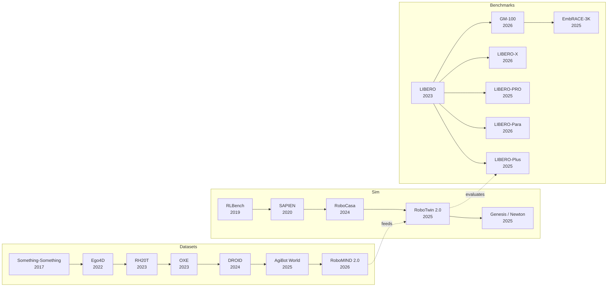

# Datasets, Benchmarks & Environments

> [!abstract] Overview
> The data and evaluation infrastructure that enables all embodied AI research. Embodied progress depends on three interlocked axes — the **data** the policy trains on, the **environment** it learns in, and the **benchmark** it is judged by. This note maps the full landscape: cross-embodiment scale datasets, multi-modal specialist data (tactile, bimanual, egocentric), simulation environments (rigid, soft-body, differentiable, household-scale), the diagnostic stack ([[2306.03310|LIBERO]] family, [[2601.11421|GM-100]], [[2507.10548|EmbRACE]]), language-conditioned long-horizon evals, sim-to-real transfer benchmarks, spatial reasoning probes, and the new generation of *interaction-centric* world model benchmarks. The field evolved from single-robot setups ([[1909.12271|RLBench]], 2019) through million-trajectory cross-embodiment corpora ([[2310.08864|OXE]], 2023) to household-scale simulation ([[2406.02523|RoboCasa]], 2024), soft-body Gaussian-splat digital twins ([[2511.04665|Real-to-Sim GS]], 2025) and diagnostic robustness evaluation ([[2510.13626|LIBERO-Plus]], [[2601.11421|GM-100]], [[2507.10548|EmbRACE-3K]]).

> [!example] How Datasets Are Used — Fuel for Every Training Stage
> Million-trajectory cross-embodiment corpora ([[2310.08864|OXE]], [[2403.12945|DROID]], [[2503.06669|AgiBot World]]) **pretrain VLA backbones** to learn task-invariant representations across robot morphologies; lab-curated single-embodiment data ([[2509.00576|G0]]) **post-trains specialists** when the deployment robot is fixed. Egocentric human video ([[2602.16710|EgoScale]], [[2605.06747|HumanNet]], [[2110.07058|Ego4D]]) supplies **finger-level supervision** that RGB-only robot data omits, while tactile and bimanual datasets ([[2604.20444|VTouch++]], [[2512.24653|RoboMIND 2.0]]) cover **modalities** (force, contact, dual-arm timing) that scale alone cannot. Hand-held collection paradigms ([[2402.10329|UMI]], [[2505.21864|DexUMI]], [[2605.03452|BifrostUMI]]) **replace teleoperation entirely**, unlocking dynamic and dexterous tasks that teleop physically cannot collect.

> [!question] How Benchmarks Are Used — Staged Diagnostic Gates
> Modern evaluation is a *pipeline*, not a single score. A policy is pushed through ascending rigor: standard in-distribution ([[2306.03310|LIBERO]], [[2112.03227|CALVIN]]) → perturbation robustness ([[2510.13626|LIBERO-Plus]], [[2510.03827|LIBERO-PRO]], [[2603.28301|LIBERO-Para]]) → fine manipulation ([[2601.11421|GM-100]]) → embodied reasoning ([[2507.10548|EmbRACE-3K]], [[2508.13142|EASI]]) → sim-to-real correlation ([[2405.05941|SimplerEnv]], [[2605.06311|VISER]]) → distributed real-robot leaderboards ([[2506.18123|RoboArena]], [[2510.17950|RoboChallenge]]). Each tier probes a **different failure axis**: a policy that scores >90% on [[2306.03310|LIBERO]] can collapse to near-0% on [[2510.03827|LIBERO-PRO]] under minor perturbations, so passing any one tier in isolation no longer counts as evidence of generalization. World-model benchmarks ([[2603.22212|Omni-WorldBench]], [[2506.00613|WorldGym]], [[2603.23497|WildWorld]]) extend evaluation from passive video quality into **interactive action-fidelity** and **policy-transfer** measurement.

> [!note] How Environments & Simulators Are Used — The Substrate
> Engines underwrite **both** data generation and evaluation. GPU-parallel engines ([[2511.04831|Isaac Lab]], [[2003.08515|SAPIEN]], [[2603.12185|ComFree-Sim]]) spawn thousands of environments at once to make **RL data scaling** feasible; photorealistic kitchens ([[2406.02523|RoboCasa]], [[2602.10116|SAGE]]) **close the visual reality gap** during training; bimanual sim+benchmark pairs ([[2506.18088|RoboTwin 2.0]]) ship data generator, evaluation suite, and domain randomization together so the trio stops being separable. The newer **real-to-sim wave** ([[2511.04665|Real-to-Sim GS]], [[2506.06440|Vid2Sim]], [[2510.21447|PhysWorld-Deformable]]) rebuilds the deployment scene from real video into a photorealistic digital twin that the policy can be re-evaluated against — collapsing the sim-real distinction for a specific target. Engine choice is itself a research-design decision (see §4): contact-accurate [MuJoCo](https://mujoco.org) vs throughput-optimized [PhysX](https://developer.nvidia.com/physx-sdk) shapes which experiments are even runnable.

---

## Evolution Graph

The three axes co-evolved. Datasets grew from gesture clips through household ego-video to million-trajectory robot corpora. Simulators grew from 100-task rigid-body sandboxes through articulated-object physics to GPU-parallel + photorealistic + soft-body. Benchmarks grew from in-distribution success rates through diagnostic perturbation suites and finally to interaction-fidelity world-model evaluation. The same paper now often releases data + sim + benchmark *together* ([[2506.18088|RoboTwin 2.0]], [[2406.02523|RoboCasa]], [[2503.06669|AgiBot World]]) — the trio is no longer separable.

## Part A — Datasets

*The fuel for policy training. Cross-embodiment scale, multi-modal specialist data, and the collection-system papers behind them.*

### 1. Cross-Embodiment Scale Datasets

The biggest unlock in robot learning: training across many robot types simultaneously. Scale and diversity matter more than curation.

Cross-embodiment transfer works because diverse robot morphologies force the model to learn *task-invariant* representations — grasping a cup looks different on a Franka vs a UR5, but the semantic understanding of 'grasp the cup' is shared. [[2310.08864|OXE]] proved that training on 22 robot types simultaneously produces better policies than training on any single type, even for that specific robot. The mechanism: visual and language encoders learn to project morphology-specific observations into a shared task space. [[2403.12945|DROID]] extended this by showing that *environmental* diversity (16 institutions, different kitchens, labs, offices) matters as much as robot diversity. [[2503.06669|AgiBot World]] pushed total trajectory count past one million from a single lab, demonstrating that consortium-scale data is achievable in-house.

- [[2503.06669|AgiBot World]], [[2403.12945|DROID]], [[2310.08864|OXE]], [[2307.00595|RH20T]]

> [!star] Key Papers
> - [[2310.08864|OXE]] — 1M+ real-robot trajectories from 22 embodiments; the ImageNet moment for robotics
> - [[2403.12945|DROID]] — In-the-wild data across 16 institutions; 20% success rate improvement; proved diverse data beats curated data
> - [[2503.06669|AgiBot World]] — 1M trajectories + [[2503.06669|GO-1]] generalist policy; 32% improvement over baselines; largest single-lab effort

> [!tip] Data Scale vs Quality
> [[2310.08864|OXE]] proved cross-embodiment transfer works. [[2403.12945|DROID]] proved diversity beats curation. [[2503.06669|AgiBot World]] proved a single lab can match collaborative scale. The pattern: more robots, more scenes, more tasks → better generalization.

---

### 2. Multi-Modal & Specialist Datasets

Rich sensing (tactile, force, dual-arm) or specific manipulation challenges. For when scale alone isn't enough.

Standard VLA datasets capture RGB images + actions — sufficient for simple pick-and-place but inadequate for contact-rich tasks (insertion, polishing, assembly) where force feedback determines success or failure. Bimanual datasets ([[2512.24653|RoboMIND 2.0]]) must capture coordinated dual-arm trajectories with synchronization — the timing between left and right arm matters as much as the positions. Egocentric datasets capture human-perspective video that maps more naturally to robot head-mounted cameras, reducing the viewpoint gap in cross-embodiment transfer.

**Bimanual Manipulation** — Coordinated two-arm control requires specialized data.
- [[2604.20444|VTouch++]], [[2604.07335|TAMEn]], [[2603.05687|CGP]], [[2512.24653|RoboMIND 2.0]], [[2511.17441|RoboCOIN]], [[2412.13877|RoboMIND]]

> [!star] Bimanual Tactile Landmark
> [[2604.20444|VTouch++]] — 120,000+ episodes / 1,000+ hours / 380+ systematically categorized bimanual tasks with synchronized fingertip tactile + multi-view RGB-D + proprioception. Contrastive learning lifts cross-modal retrieval **7×** over baselines; diffusion policy reaches **0.022 MAE** and **0.848 Expert Similarity** on real bimanual hardware. Establishes the matrix-style "skill-axis" task design that enables fine-grained generalization analysis.

**Single-Embodiment High-Quality** — Depth over breadth: consistent data from one robot in diverse environments.
- [[2509.00576|G0]]

**Egocentric & Motion Capture** — Human-perspective video and motion data for cross-embodiment skill transfer. [[2602.16710|EgoScale]] demonstrates that egocentric *dexterous* human data scales differently than RGB-only embodiments — finger-level supervision is the bottleneck, not viewpoint. [[2605.06747|HumanNet]] (2026) pushes the scale axis to 1M hours, demonstrating that 1,000 hours of curated egocentric pretrain can match 100 hours of real-robot data. [[2605.05945|MobileEgo Anywhere]] pushes the *accessibility* axis — long-horizon (up to 108-minute) egocentric capture from commodity LiDAR-enabled smartphones, democratizing the hardware bar.
- [[2605.06747|HumanNet]] — 1,000,000-hour human-centric video corpus (egocentric + exocentric) with interaction-centric annotations; **1,000 hr** pretrain matches/surpasses **100 hr** real-robot CoBot pretrain
- [[2605.05945|MobileEgo Anywhere]] — Open infrastructure for **200-hour / 354-session** long-horizon (up to 108-min) egocentric data on commodity iPhone Pro + open-source Python pipeline; ARKit drift **<1 cm** for hour-long household activities; automated hierarchical action labels at **$1.29** for all sessions
- [[2602.16710|EgoScale]] — Diverse egocentric human data is the missing primitive for dexterous manipulation; scaling fingers, not arms
- [[2605.09613|SABER]] — 100+ hours of natural grocery-store activity captured with synchronized ego+exo cameras; **2.19x** SR improvement (13.4→29.3%) on RoboBenchMart when used as VLA post-training data
- [SEED (Bones Studio)](https://huggingface.co/datasets/bones-studio/seed) — High-quality motion capture and manipulation dataset for dexterous skill learning
- [EgoVerse (Georgia Tech)](https://github.com/gatech-rl2/egoverse) — Egocentric video dataset capturing first-person human activities for robot skill transfer

**Teleoperation Hardware & Hand-Held Data Collection** — The data collection systems themselves; [[2402.10329|UMI]] introduced the "in-the-wild" hand-held paradigm that eliminates teleoperation entirely. [[2605.03452|BifrostUMI]] extends the paradigm from tabletop manipulation to *humanoid whole-body* manipulation, bridging robot-free demonstrations and humanoid execution.
- [[2605.03452|BifrostUMI]], [[2505.21864|DexUMI]], [[2402.10329|UMI]], [[2309.13037|GELLO]], [[2304.13705|ALOHA]]

**How [[2402.10329|UMI]] Eliminates the In-The-Wild Robot Constraint**: [[2402.10329|UMI]] replaces robot teleoperation with a portable, sensorized hand-held gripper carrying a wrist-mounted GoPro (Fisheye lens + side mirrors for ==implicit stereo==) and ==IMU-aware monocular SLAM== for absolute-scale 6-DoF end-effector tracking. The same gripper geometry as the deployment robot makes recorded actions *directly executable* without retargeting — the human operator IS the data-collection robot. Combined with ==inference-time latency matching== and ==relative end-effector== action representation, [[2402.10329|UMI]] achieves **20/20** cup-arrangement on UR5 cross-embodied to **18/20** on Franka, zero-shot generalization to unseen environments at **71.7%**, and dynamic tossing at **87.5%** — tasks teleoperation cannot easily collect. Data collection is **>3x faster** than Spacemouse teleop. [[2505.21864|DexUMI]] extends the paradigm to **dexterous** manipulation via robot-specific wearable hand ==exoskeletons== (Inspire Hand, XHand) that provide natural haptic feedback and a ==visual adaptation pipeline== that ==inpaints the human hand== with the corresponding robot hand image — averaging **86%** success across four contact-rich tasks with **3.2x** higher data efficiency than teleoperation. [[2605.03452|BifrostUMI]] generalizes the gripper-cam paradigm to humanoid whole-body manipulation, with a head-and-hand pose retargeting pipeline that maps gripper-cam pose into a humanoid frame — enabling humanoid demos to be collected without ever wearing a teleoperation harness.

> [!star] Key Papers
> - [[2605.03452|BifrostUMI]] — Robot-free demonstration paradigm extended to humanoids; the dominant scaling alternative for whole-body data
> - [[2605.05945|MobileEgo Anywhere]] — Commodity-hardware long-horizon egocentric capture; **<1 cm** ARKit drift over hour-long sessions democratizes egocentric VLA data collection
> - [[2512.24653|RoboMIND 2.0]] — 310K bimanual + mobile manipulation trajectories with tactile sensing and digital twin
> - [[2602.16710|EgoScale]] — Scaling dexterous manipulation specifically via diverse egocentric *human* data — fingers, not arms, are the bottleneck
> - [[2505.21864|DexUMI]] — Dexterous extension with robot-specific exoskeletons + visual hand-inpainting; **86%** SR on contact-rich tasks across underactuated (Inspire) and fully-actuated (XHand) hands
> - [[2402.10329|UMI]] — Hand-held in-the-wild data collection; **>3x faster** than teleop, cross-robot zero-shot generalization, dynamic tasks impossible via teleop; the dominant alternative to teleoperation
> - [[2304.13705|ALOHA]] — Low-cost bimanual teleoperation; enabled fine-grained data collection for dexterous tasks

> [!tip] When Scale Doesn't Help
> [[2509.00576|G0]] showed single-embodiment in-domain data quality can outperform heterogeneous cross-embodiment scale. If your deployment robot is fixed, invest in diverse *scenes* not diverse *robots*. The corollary from [[2602.16710|EgoScale]]: if your deployment robot has *fingers*, invest in diverse *human hand* data — VLA-scale RGB does not cover the finger-control space.

---

## Part B — Environments & Simulators

*The substrate that underwrites data generation and evaluation. Physics engines, photorealistic sims, real-to-sim digital twins.*

### 3. Simulation Environments

The physical simulation substrate on which benchmarks are built. Choice of environment determines what you can test.

**Foundation Simulators** — General-purpose physics platforms for robot learning.
- [[2604.08258|EvoGymCM]], [[2003.08515|SAPIEN]], [[1909.12271|RLBench]], [Genesis](https://genesis-world.readthedocs.io/en/latest/), [Newton (NVIDIA)](https://developer.nvidia.com/newton-physics)

**Household-Scale** — Realistic home environments with diverse objects and tasks.
- [[2602.10116|SAGE]], [[2406.02523|RoboCasa]]

**Agentic 3D Scene Generation** — Scalable scene generation as a simulation substrate.
- [[2602.10116|SAGE]] — Agentic 3D scene generation pipeline; LLM proposes layouts and objects, asset retrieval populates, physics-aware placement enforces feasibility

**Egocentric / Interaction Simulators** — Generative simulators that produce egocentric video conditioned on action.
- [[2604.01001|EgoSim]] — Egocentric world simulator for embodied interaction generation; complements traditional rigid-body sims with generative video

**Teleoperation-Friendly** — Environments designed for collecting human demonstrations.
- [[2310.06114|UniSim]]

**Bimanual Sim + Benchmark** — Sim platforms that ship with a paired benchmark and data generator.
- [[2506.18088|RoboTwin 2.0]] — Scalable data generator + benchmark with strong domain randomization for bimanual robotic manipulation

Simulator choice has profound implications for what you can test. [[2003.08515|SAPIEN]] provides 2,346 articulated objects with accurate joint mechanics — essential for tasks involving doors, drawers, and tools. [[1909.12271|RLBench]] offers 100 standardized tasks with infinite expert demonstrations via motion planning — making it the default for few-shot evaluation. [[2406.02523|RoboCasa]] generates photorealistic kitchen environments at scale — proving that synthetic data from realistic simulators can substitute for expensive real demonstrations. The emerging platform [Genesis](https://genesis-world.readthedocs.io/) (GPU-accelerated, open-source) and [NVIDIA Newton](https://developer.nvidia.com/newton-physics) aim to combine [PhysX](https://developer.nvidia.com/physx-sdk)'s parallelism with [MuJoCo](https://mujoco.org)'s contact accuracy. [[2602.10116|SAGE]] takes a different approach: instead of hand-authoring scenes, it uses an LLM-agentic loop to generate *scene layouts*, retrieve assets, and validate physical feasibility — producing simulation environments at the rate of LLM prompting rather than the rate of 3D artistry.

> [!star] Key Papers
> - [[2003.08515|SAPIEN]] — 2,346 articulated objects with physics-accurate simulation; foundational platform for manipulation research
> - [[1909.12271|RLBench]] — 100 tasks with infinite expert demos via motion planning; standardized few-shot and imitation learning evaluation
> - [[2406.02523|RoboCasa]] — Scaling synthetic data significantly improves generalist policy performance; data-generation platform + benchmark
> - [[2506.18088|RoboTwin 2.0]] — Bimanual sim + benchmark with strong domain randomization; the modern bimanual reference
> - [[2602.10116|SAGE]] — Agentic 3D scene generation; bypasses the scene-authoring bottleneck via LLM-driven layout + asset retrieval

#### Physics Engines — Quick Reference

*A summary card; §4 below treats each engine as a research-design choice with paper-anchored detail.*

| Engine | Strengths | Typical Use |
|--------|-----------|-------------|
| **[PhysX](https://developer.nvidia.com/physx-sdk)** | GPU-accelerated rigid body + deformable simulation, NVIDIA ecosystem | [[2003.08515\|SAPIEN]], [Isaac Gym](https://developer.nvidia.com/isaac-gym)/[[2511.04831\|Lab]], large-scale parallel RL |
| **[MuJoCo](https://mujoco.org)** | Fast, accurate contact/tendon dynamics, low overhead | Standard RL benchmarks, OpenAI Gym, DeepMind Control |
| **[PyBullet](https://pybullet.org)** | Open-source, easy Python API, good for prototyping | [[1909.12271\|RLBench]], early robot learning pipelines |
| **[MJX (MuJoCo-JAX)](https://mujoco.readthedocs.io/en/stable/mjx.html)** | Differentiable [MuJoCo](https://mujoco.org) on GPU/TPU | Differentiable physics RL, gradient-based MPC |
| **[Brax](https://github.com/google/brax)** | JAX-native GPU rigid-body sim | Massively-parallel RL ablation studies |
| **[Taichi](https://www.taichi-lang.org) / [DiffTaichi](https://github.com/taichi-dev/difftaichi)** | Differentiable Lagrangian / MPM | Soft body, fluid, deformable manipulation |
| **[PhysX](https://developer.nvidia.com/physx-sdk)-5 / [Newton (NVIDIA)](https://developer.nvidia.com/newton-physics)** | GPU contact-rich + soft + fluid + cloth in one engine | Next-gen general-purpose sim |
| **[Genesis](https://genesis-world.readthedocs.io/)** | GPU-native, open-source, multi-physics (rigid + soft + cloth) | Emerging research substrate |

> [!tip] Sim Engine Choice
> [PhysX](https://developer.nvidia.com/physx-sdk) dominates GPU-parallel training (throughput). [MuJoCo](https://mujoco.org) is gold standard for contact-rich manipulation accuracy. [PyBullet](https://pybullet.org) enabled rapid prototyping but is increasingly replaced. For production: [PhysX](https://developer.nvidia.com/physx-sdk) if GPU-parallel, [MuJoCo](https://mujoco.org) if contact accuracy matters.

---

### 4. Physics Engines as Research Substrate

Beyond benchmark-shipped simulators, a separate category of research-grade physics engines is shaping what kinds of learning experiments are even *possible* — differentiable physics, GPU-massive parallelism, photorealistic rendering with contact, and multi-physics (rigid + soft + cloth + fluid) in one runtime.

**Differentiable Physics Engines** — Provide gradients through dynamics, enabling system-identification, gradient-based MPC, and end-to-end policy + physics co-optimization.

- **[MJX](https://mujoco.readthedocs.io/en/stable/mjx.html) ([MuJoCo](https://mujoco.org)-JAX)** — JAX rewrite of [MuJoCo](https://mujoco.org); differentiable, GPU/TPU-parallel; replaces [MuJoCo](https://mujoco.org) for gradient-based RL workflows.
- **[DiffTaichi](https://github.com/taichi-dev/difftaichi)** — Differentiable Lagrangian/MPM simulator; primary substrate for soft-body and fluid manipulation research (cloth, dough, soft tissue).
- **[Brax](https://github.com/google/brax)** — JAX-native GPU rigid-body engine; the standard for massively-parallel RL ablations.
- **[Drake (TRI)](https://drake.mit.edu)** — Smooth contact + differentiable trajectory optimization for grasping and contact-rich manipulation.

**GPU-Native Massively-Parallel Engines** — Trade contact accuracy for thousands-of-environment parallelism, enabling RL data scaling that was infeasible on CPU.

- [[2511.04831|Isaac Lab]] (NVIDIA) — Successor to [Isaac Gym](https://developer.nvidia.com/isaac-gym); [PhysX](https://developer.nvidia.com/physx-sdk) 5 + RTX + OpenUSD; **>900K FPS** state-based, up to **1.6M FPS** in distributed training. Foundational for **[[2503.14734|GR00T N1]]/N1.5** training and Mimic synthetic-data pipeline.
- **[Isaac Gym](https://developer.nvidia.com/isaac-gym) / [Isaac Sim](https://developer.nvidia.com/isaac-sim)** (NVIDIA, legacy) — Original [PhysX](https://developer.nvidia.com/physx-sdk)-backed parallel sims; 4,096+ envs/GPU; superseded by [[2511.04831|Isaac Lab]] for most use cases.
- [[2603.12185|ComFree-Sim]] — GPU-parallelized analytical contact engine (complementarity-free); **~3×** simulation speed and near-linear scaling with contact count vs MJWarp. Real-time MPPI on physical hardware gains **2.4×** compute speedup and **+27pp** closed-loop SR for dexterous manipulation.
- **[Genesis](https://genesis-world.readthedocs.io/)** — Open-source GPU-native, multi-physics (rigid + soft + cloth + fluid) in one runtime; community-driven alternative to Isaac.
- **[[2501.03575|NVIDIA Cosmos]]** — World-foundation-model + GPU simulator hybrid; couples generative video with parallel physics for synthetic data scaling.
- **[Newton](https://developer.nvidia.com/newton-physics) (NVIDIA)** — Successor to [Isaac Gym](https://developer.nvidia.com/isaac-gym) physics; [PhysX](https://developer.nvidia.com/physx-sdk)-5 with full soft-body and fluid in one runtime; aims to be the "universal" sim.

**Photorealistic + Contact** — Combine visually realistic rendering with contact-accurate dynamics; essential for vision-based policies that must transfer.

- [[2003.08515|SAPIEN]] — 2,346 articulated objects; [PhysX](https://developer.nvidia.com/physx-sdk) rigid body; standard for articulation research.
- [[2406.02523|RoboCasa]] — Photorealistic kitchens at scale; [MuJoCo](https://mujoco.org) backend; pioneered data-gen-as-benchmark.
- **[Habitat 3.0](https://aihabitat.org)** — Photorealistic 3D environments + humanoid avatars; the standard for navigation + HRI research.

**Generative + Real-to-Sim** — Build sim worlds *from real video*, sidestepping authoring entirely.

- [[2506.06440|Vid2Sim]] — Generalizable, video-based reconstruction of appearance, geometry, and physics for mesh-free simulation; videos → simulators.
- [[2511.04665|Real-to-Sim GS]] — Gaussian splatting simulation of soft-body interactions; lets you build a photorealistic + soft-body twin from real video.
- [[2510.21447|PhysWorld-Deformable]] — From real videos to world models of deformable objects via physics-aware demonstration synthesis.

**Picking an Engine — Decision Matrix**

| Need | Use |
|---|---|
| Differentiable gradients (for system-ID or grad-MPC) | [MJX](https://mujoco.readthedocs.io/en/stable/mjx.html), [DiffTaichi](https://github.com/taichi-dev/difftaichi), [Drake](https://drake.mit.edu) |
| Massive GPU parallelism (RL data scaling) | [[2511.04831\|Isaac Lab]]/Sim, [Genesis](https://genesis-world.readthedocs.io/), [Brax](https://github.com/google/brax) |
| Photorealistic + articulated | [[2003.08515\|SAPIEN]], [[2406.02523\|RoboCasa]], [Habitat 3.0](https://aihabitat.org) |
| Soft-body / cloth / fluid | [DiffTaichi](https://github.com/taichi-dev/difftaichi), [Genesis](https://genesis-world.readthedocs.io/), [Newton](https://developer.nvidia.com/newton-physics) |
| Real-to-sim from video | [[2506.06440\|Vid2Sim]], [[2511.04665\|Real-to-Sim GS]], [[2510.21447\|PhysWorld-Deformable]] |
| Contact-rich manipulation accuracy | [MuJoCo](https://mujoco.org) / [MJX](https://mujoco.readthedocs.io/en/stable/mjx.html) |
| Driving / wheeled robots | [CARLA](https://carla.org), [NVIDIA Drive Sim](https://developer.nvidia.com/drive/simulation) |

> [!star] Key Papers
> - [[2511.04831|Isaac Lab]] — NVIDIA's GPU-accelerated framework ([PhysX](https://developer.nvidia.com/physx-sdk) 5 + RTX + OpenUSD); **>900K FPS** to **1.6M FPS** distributed; trains [[2503.14734|GR00T N1]]/N1.5. The dominant 2025-2026 GPU-parallel substrate
> - [[2603.12185|ComFree-Sim]] — Complementarity-free analytical contact engine; **3×** faster than MJWarp with near-linear scaling on dense contact; **+27pp** hardware MPPI SR gain — proves you can drop iterative solvers without losing fidelity
> - [[2506.06440|Vid2Sim]] — Replaces 3D-asset authoring with video-driven reconstruction; the cheapest path to a custom simulator
> - [[2511.04665|Real-to-Sim GS]] — Gaussian-splat soft-body twins for policy evaluation; closes the visual + physical gap for deformables in one stack
> - [[2003.08515|SAPIEN]] — Still the foundational articulated-object benchmark, but [Genesis](https://genesis-world.readthedocs.io/) and [Newton](https://developer.nvidia.com/newton-physics) are catching up on fidelity while leading on throughput

> [!tip] Engine Choice is a Policy Decision
> Choosing an engine constrains what experiments you can run. If you commit to [MuJoCo](https://mujoco.org), you can't easily train at 4,096-env parallelism. If you commit to Isaac, you give up the cleanest contact dynamics. Modern projects ([[2406.02523|RoboCasa]], [[2506.18088|RoboTwin 2.0]], [Genesis](https://genesis-world.readthedocs.io/)) increasingly use *multiple* engines — one for fast policy training, one for accurate evaluation. Cross-reference [[11_Sim-to-Real-Transfer]] for how engine choice interacts with the sim-real gap.

---

## Part C — Benchmarks

*The evaluation axes — tactile, diagnostic, long-horizon, spatial, world-model. Each tier probes a different failure mode of the policy stack.*

### 5. Tactile & Contact-Rich Benchmarks

Force-feedback, touch, and contact-rich manipulation form their own evaluation axis — orthogonal to RGB-only VLA benchmarks. A model can score perfectly on [[2306.03310|LIBERO]] and still fail at peg insertion because no part of [[2306.03310|LIBERO]]'s evaluation requires force-aware behavior. The 2024-2026 wave of tactile work created the first standardized evaluation infrastructure for touch.

**TacBench (the de-facto tactile benchmark)** — Introduced in [[2410.24090|Sparsh]], TacBench evaluates 6 representative touch tasks (force estimation, slip detection, contact localization, fabric classification, dynamic pose tracking, bead maze) across DIGIT, GelSight Mini, OmniTact, and OptoTact sensors. [[2410.24090|Sparsh]]'s self-supervised representations beat sensor-specific end-to-end baselines on **6/6** tasks across the **95.8K-image, 6-task** benchmark. The follow-up [[2506.14754|Sparsh-X]] extends to multisensory touch (image + audio + vibration + force) and shows **>3x improvement** on the hardest force-and-vibration tasks.

**Tactile-Augmented Policy Benchmarks** — Several recent papers evaluate full robot policies (not just representations) under contact-rich settings:
- [[2604.07335|TAMEn]] — Tactile-Aware Manipulation Engine for closed-loop data collection; **75%** avg SR across 4 contact-rich bimanual tasks with online feasibility validation + AR-recovery + pyramid-structured data regime
- [[2603.17851|DexViTac]] — Visuo-tactile-kinematic human-demo system at **248 demos/hr**; **85.8%** avg SR on 4 contact-rich dexterous tasks via kinematics-grounded tactile pretraining
- [[2603.05687|CGP]] — Contact-Grounded Policy; **dexterous visuotactile** evaluation with generative contact grounding on insertion and assembly tasks
- [[2510.25725|HumanoidVTA]] — First humanoid visual-tactile-action dataset for *soft-object* manipulation; teleoperated Inspire Hands with **2,124 high-resolution tactile sensors**; t-SNE shows dense tactile signals separate task conditions where sparse signals collapse — establishes the dense-vs-sparse tactile evaluation axis for soft-object policies
- [[2510.13324|FARM]] — Tactile-conditioned diffusion policy benchmark; isolates the contribution of tactile signal vs visual signal on force-aware manipulation
- [[2509.07962|TA-VLA]] — Elucidating the design space of torque-aware VLAs; provides a torque-input ablation grid (none / wrist-FT / per-joint torque) that is itself a benchmark of integration recipes
- [[2509.18830|DexSkin]] — High-coverage conformable robotic skin; enables full-arm contact maps as a sensor modality (vs sparse fingertip-only)
- [[2503.02881|Reactive Diffusion Policy]] — Slow-fast visuotactile policy for contact-rich manipulation
- [[2505.22566|Universal Visuo-Tactile]] — Universal visuo-tactile video understanding model and dataset for embodied interaction
- [[2505.06451|Adaptive Wiping]] — Force-feedback wiping benchmark for adaptive contact-rich behavior

> [!star] Contact-Rich Data Engines
> [[2603.17851|DexViTac]] solves the *human-demo* axis (248 demos/hr, kinematics-grounded tactile pretraining), and [[2604.07335|TAMEn]] solves the *closed-loop* axis (online feasibility + AR recovery). Together they form the new dual-pillar pipeline for tactile data collection: human bulk-pretrain ([[2603.17851|DexViTac]]) → robot online-recovery refinement ([[2604.07335|TAMEn]]). [[2603.17851|DexViTac]]'s **83.3% → 43.3%** Pipetting SR collapse without kinematics-grounded pretrain is the most damning ablation for naïve tactile fusion.

> [!star] Key Papers
> - [[2410.24090|Sparsh]] — Introduces TacBench (6 tasks, 4 sensors); first standardized tactile representation benchmark; self-supervised reps beat end-to-end on **6/6** tasks
> - [[2506.14754|Sparsh-X]] — Extends [[2410.24090|Sparsh]] to multisensory touch (image + audio + vibration + force); **>3x improvement** on force-and-vibration tasks; defines the multisensory tactile evaluation axis
> - [[2509.07962|TA-VLA]] — Torque-aware VLA design study; the de-facto reference for which torque-integration recipe matters most under contact-rich evaluation

> [!tip] Cross-Reference
> See [[10_Force-Aware-and-Tactile-Policies]] for the full deep-dive on how [[2410.24090|Sparsh]]/[[2506.14754|Sparsh-X]] representations feed into VLAs ([[2509.07962|TA-VLA]], [[2510.13324|FARM]], [[2603.05687|CGP]]). The benchmarks here measure *what* you're getting from touch; the policies in 10 measure *how to use it*.

---

### 6. Diagnostic & Evaluation Datasets

Not for training — for exposing failure modes and measuring real capability.

Diagnostic benchmarks differ from training benchmarks in a crucial way: they are designed to *expose specific failure modes*, not measure overall performance. [[2601.11421|GM-100]]'s 100 detail-oriented tasks (precise insertion, fine alignment, tool manipulation) systematically test manipulation capabilities that standard benchmarks miss — current VLAs achieve very low success rates, revealing that 'grasping things' and 'precise manipulation' are fundamentally different capabilities. [[2507.10548|EmbRACE-3K]] evaluates embodied reasoning across 3,000 scenarios, testing whether models understand spatial relationships, physical causality, and task decomposition — not just whether they can pick up objects.

- [[2605.10921|RoboMemArena]], [[2601.11421|GM-100]], [[2508.13142|EASI]], [[2507.10548|EmbRACE-3K]], [[2507.05258|REA]], [[2502.09560|EmbodiedBench]]

> [!star] Key Papers
> - [[2605.10921|RoboMemArena]] — First comprehensive robotic-memory benchmark: 26 sim + 5 real-world tasks with multimodal annotations (visual keyframes + language) where **68.9%** of subtasks genuinely require historical information; **PrediMem** (predictive-coding VLA with hierarchical memory) hits **38.5%** TSR vs MemER's **27.3%** — the dedicated memory-failure-axis diagnostic
> - [[2502.09560|EmbodiedBench]] — 1,128 tasks across 4 environments (ALFRED, [Habitat](https://aihabitat.org), Nav, Manipulation) × 6 capabilities (commonsense, instructions, spatial, perception, planning, basic). Exposes that **GPT-4o** scores **>60%** on high-level planning but only **28.9%** on low-level manipulation; removing vision drops Nav from **57.7% → 17.4%** — the de-facto capability-disentangling MLLM-agent benchmark
> - [[2601.11421|GM-100]] — 100 detail-oriented tasks; current VLAs achieve very low success rates, exposing real capability gaps
> - [[2507.10548|EmbRACE-3K]] — 3,000 scenarios testing embodied reasoning (spatial + causal + task-decomposition); reveals that high [[2306.03310|LIBERO]] scores do not imply embodied intelligence
> - [[2508.13142|EASI]] — Holistic evaluation framework for spatial intelligence in embodied agents

**Diagnostic Datasets by Failure Mode** — Each diagnostic benchmark probes a different VLA failure axis:

| Benchmark | Failure Axis | Primary Mode |
|-----------|-------------|--------------|
| [[2306.03310\|LIBERO]] | Standard manipulation | In-distribution skill |
| [[2510.13626\|LIBERO-Plus]] | Visual perturbations | 7-axis visual robustness |
| [[2510.03827\|LIBERO-PRO]] | Minor task perturbations | Memorization vs generalization |
| [[2602.06556\|LIBERO-X]] | Cross-task transfer | Cross-task generalization |
| [[2603.28301\|LIBERO-Para]] | Instruction paraphrase | Language surface-form overfit |
| [[2601.11421\|GM-100]] | Fine manipulation | Detail-oriented precision |
| [[2507.10548\|EmbRACE-3K]] | Embodied reasoning | Spatial + causal reasoning |
| [[2508.13142\|EASI]] | Spatial intelligence | Holistic spatial cognition |
| [[2502.09560\|EmbodiedBench]] | MLLM-agent capabilities | 6-axis hierarchical (high vs low level) |
| [[2605.10921\|RoboMemArena]] | Long-term memory | Memory-dependent tasks (occlusion, counting, sequencing) |

> [!tip] Use the Diagnostic Stack
> Each benchmark stresses one failure axis. A model can score >90% on [[2306.03310|LIBERO]] yet collapse on [[2510.13626|LIBERO-Plus]] (visual), [[2603.28301|LIBERO-Para]] (language), [[2510.03827|LIBERO-PRO]] (minor perturbations), or [[2601.11421|GM-100]] (precision). Always evaluate across the full diagnostic stack before claiming generalization. The [[2510.03827|LIBERO-PRO]] collapse from >90% to near 0% under *small* changes is the most damning data point in recent VLA evaluation literature.

---

### 7. Soft-Body & Deformable Benchmarks

Soft body, cloth, and deformable manipulation form an evaluation axis that almost no rigid-body benchmark covers. The wave of 2025-2026 work — Gaussian-splat soft-body twins, video-derived deformable world models, physics-aware multi-body benchmarks — moved deformables from "open problem" to "evaluable category."

**Soft-Body Evaluation Infrastructure**:
- [[2511.04665|Real-to-Sim GS]] — Real-to-sim robot policy evaluation specifically for soft-body interactions; builds a Gaussian-splat twin of the deformable scene and evaluates policies in the twin. The first standardized soft-body evaluation pipeline that doesn't require hand-authored deformable assets.
- [[2510.21447|PhysWorld-Deformable]] — From real videos to world models of deformable objects via physics-aware demonstration synthesis; the data-side counterpart, turning real deformable interactions into training data.
- [[2506.02794|PhysGaia]] — Physics-aware benchmark with multi-body interactions for dynamic novel view synthesis; targets cloth + soft + fluid + rigid in a unified evaluation.
- [[2401.15318|Gaussian Splashing]] — Unified particles for versatile motion synthesis and rendering; fluid + rigid combination in a Gaussian-splat substrate.
- [[2312.00583|DeformGS]] — Scene flow in highly deformable scenes for deformable object manipulation; provides ground-truth scene flow for evaluation.

> [!star] Key Papers
> - [[2511.04665|Real-to-Sim GS]] — Build a soft-body digital twin from real video; the dominant soft-body evaluation recipe in 2026
> - [[2506.02794|PhysGaia]] — Multi-body deformable + rigid + fluid benchmark; closes the "everything that isn't a rigid box" evaluation gap
> - [[2510.21447|PhysWorld-Deformable]] — Synthesizes deformable demonstrations from videos; the data-side complement to [[2511.04665|Real-to-Sim GS]]

> [!tip] Cross-Reference
> See [[11_Sim-to-Real-Transfer]] for the broader real-to-sim story (rigid + soft). The papers in this section are the soft-body *evaluation* tier — they answer "did my policy work on the towel?", not "how do I cross the sim-to-real gap?". The two literatures meet at Gaussian-splat digital twins ([[2511.04665|Real-to-Sim GS]] is the bridge paper).

---

### 8. Bimanual & Humanoid Evaluation

Humanoid whole-body manipulation and bimanual coordination form their own evaluation axis. Single-arm benchmarks ([[2306.03310|LIBERO]], [[2112.03227|CALVIN]]) cannot test the bilateral-coordination, whole-body-balance, or human-scale workspace constraints that humanoid platforms face.

**Humanoid Whole-Body Benchmarks**:
- [[2604.17335|G1 WBC-Gen+Track]] — Whole-body humanoid locomotion via *diffusion motion generation + RL motion tracking*; Unitree G1 climbs **75cm** boxes, traverses stairs, vaults hurdles. Tracker+Gen achieves **0.962 SR** on 80cm box vs **0.230** for Tracker-Only. The current reference for online terrain-aware whole-body locomotion.
- [[2506.12851|KungfuBot]] — Physics-based humanoid whole-body control for highly-dynamic skills; benchmark of dynamic capabilities (jumping, kicking, parkour). Sets a high-energy-task evaluation axis missing from prior humanoid work.
- [[2604.07993|HEX]] — Humanoid-aligned experts for cross-embodiment whole-body manipulation; provides a cross-embodiment evaluation framework where the *humanoid* is the reference embodiment.
- [[2502.20396|Humanoid Sim2Real Dex]] — Sim-to-real RL for vision-based dexterous manipulation on humanoids; the de-facto reference for "can we cross sim-to-real on a humanoid?"
- [[2512.01061|Sim-to-Real Door]] — Opening the sim-to-real door for humanoid pixel-to-action policy transfer; pinpoints visual + dynamics gap diagnostics specific to humanoids.
- [[2605.03452|BifrostUMI]] — Robot-free demonstration paradigm for humanoid whole-body manipulation; the data-side counterpart.
- [[2510.25725|HumanoidVTA]] — First humanoid visual-tactile-action dataset with **2,124-sensor** Inspire Hands and dense tactile coverage for *soft-object* contact-rich manipulation (towel, sponge under strong/weak pressure).

**Bimanual Benchmarks**:
- [[2603.15469|RoCo AAAI 2026]] — AAAI 2026 benchmarking robotic collaborative manipulation for industrial assembly (planetary gearbox); **60+ teams**, **170+ participants**, end-to-end VLA architectures (ARC-VLA) beat modular pipelines; uncovers the "Sim-to-Real Cliff" as a quantitative drop.
- [[2604.20444|VTouch++]] — Multimodal bimanual dataset (120K episodes, 380+ tasks) with vision-based tactile enhancement — see §2 for full description.
- [[2604.07335|TAMEn]] — Tactile-Aware Manipulation Engine for closed-loop bimanual data collection — see §5.
- [[2506.18088|RoboTwin 2.0]] — Bimanual sim + benchmark with strong domain randomization; the modern bimanual reference (replaces older RoboTwin 1.0).
- [[2512.24653|RoboMIND 2.0]] — 310K bimanual + mobile manipulation trajectories with tactile sensing and digital twin.
- [[2603.05687|CGP]] — Dexterous bimanual visuotactile evaluation under generative contact grounding.
- [[2511.17441|RoboCOIN]] — Bimanual coordination dataset.
- [[2304.13705|ALOHA]] — Low-cost bimanual teleoperation + the original bimanual benchmark suite.

> [!star] Key Papers
> - [[2604.17335|G1 WBC-Gen+Track]] — Online terrain-aware diffusion-motion-gen + RL-motion-track on Unitree G1; the dominant 2026 whole-body locomotion recipe (75cm box / vault / stairs)
> - [[2603.15469|RoCo AAAI 2026]] — AAAI 2026 industrial-assembly challenge; first benchmark to formally quantify the "Sim-to-Real Cliff" for collaborative manipulation
> - [[2506.12851|KungfuBot]] — Dynamic-skill humanoid benchmark; the only published reference for kungfu-class moves on a humanoid
> - [[2604.07993|HEX]] — Cross-embodiment evaluation centered on humanoids; bridges humanoid + arm benchmarks
> - [[2506.18088|RoboTwin 2.0]] — The modern bimanual sim + benchmark + data-generator triple
> - [[2502.20396|Humanoid Sim2Real Dex]] — Sim-to-real RL on humanoid hands; reference baseline for visual + dynamics gap

> [!tip] Bimanual ≠ "Two LIBEROs"
> Two-arm benchmarks are not the union of two single-arm benchmarks. The novel failure modes are *coordination* (timing between arms), *bilateral handover*, and *whole-body balance* under coupled arm motion. [[2506.18088|RoboTwin 2.0]] and [[2512.24653|RoboMIND 2.0]] explicitly stress these modes; running [[2306.03310|LIBERO]] twice does not.

---

### 9. Long-Horizon Task Benchmarks

Most VLA benchmarks evaluate a single short task. Long-horizon evaluation tests whether a policy can chain skills, plan subgoals, recover from intermediate failures, and maintain task identity over minutes-long episodes.

**Long-Horizon Manipulation Suites**:
- [[2506.06677|RoboCerebra]] — Large-scale long-horizon manipulation benchmark; tasks average **2,972.4 sim steps** (~**6×** prior datasets), **1,000 human-annotated trajectories**, **100 task variants**, **10,000+ step-level segments**. Hierarchical Planning + Execution (HPE) framework reaches **13.21%** in "Mix" setting where [[2406.09246|OpenVLA]] gets 0%. GPT-4o tops VLM planning with **68.33%** planning accuracy.
- [[2305.12821|FurnitureBench]] — Multi-step assembly (drawers, chairs, lamps); the original long-horizon manipulation benchmark.
- [[2112.03227|CALVIN]] — Standard for long-horizon, language-conditioned policy evaluation; chained instruction sequences with episode-level success.
- [[2604.21924|LoHo-Manip]] — Long-Horizon Manipulation via Trace-Conditioned VLA Planning; provides trace-conditioned evaluation that pairs every episode with a planning trace.
- [[2605.01772|Anticipation-VLA]] — Solving long-horizon embodied tasks via anticipation-based subgoal generation; the subgoal-evaluation pair (does the model predict the right next subgoal?).
- [[2410.22689|SIRIUS-FLEET]] — Multi-task interactive robot fleet learning with visual world models; the only published *multi-robot* long-horizon benchmark.

**Mobile + Long-Horizon (Combined)**:
- [[2512.24653|RoboMIND 2.0]] — Mobile manipulation trajectories cover the long-horizon mobile-then-manipulate composition.

> [!star] Key Papers
> - [[2305.12821|FurnitureBench]] — Multi-step assembly remains the hardest published long-horizon manipulation benchmark
> - [[2604.21924|LoHo-Manip]] — Trace-conditioned long-horizon evaluation; pairs episode success with planning-trace fidelity
> - [[2605.01772|Anticipation-VLA]] — Subgoal-level evaluation; surfaces whether the model is planning vs interpolating

> [!tip] Long-Horizon Failure Modes
> Long-horizon policies fail through three distinct routes: **(a) skill drift** — the model executes the wrong skill at step N+1 even though step N succeeded; **(b) state confusion** — the model loses track of which subgoal is active; **(c) terminal collapse** — early successful steps consume the model's context budget and the final step is executed by a "forgetful" policy. Different benchmarks stress different routes — [[2604.21924|LoHo-Manip]] stresses (b), [[2605.01772|Anticipation-VLA]] stresses (c), [[2305.12821|FurnitureBench]] stresses (a). Pair them.

---

### 10. Real-World Evaluation Infrastructure

Sim benchmarks predict sim performance. The 2025-2026 wave introduced *standardized* real-world evaluation — distributed fleets, real-robot leaderboards, and on-real-hardware diagnostic suites.

- [[2506.18123|RoboArena]] — Distributed real-world evaluation of generalist robot policies; a multi-lab evaluation fleet where the same policy is tested across remote robots.
- [[2510.17950|RoboChallenge]] — Large-scale real-robot evaluation of embodied policies; defines a real-robot leaderboard format that's reproducible across labs.
- [[2509.17057|RoboManipBaselines]] — Unified framework for imitation learning across real and simulation environments; the same harness runs in both modalities.
- [[2511.16518|MiMo-Embodied]] — X-embodied foundation model technical report; releases its evaluation harness as standalone infrastructure.
- [[2603.13966|vla-eval]] — Unified open-source evaluation harness for VLAs across [[2306.03310|LIBERO]]/[[2112.03227|CALVIN]]/[[2405.05941|SimplerEnv]]; client-server architecture decouples model inference from benchmark execution; **47x speedup on [[2306.03310|LIBERO]]** (14h → 18min for 2,000 episodes); reproduced 6 VLAs across 3 benchmarks and exposed undocumented evaluation pitfalls (incorrect proprioceptive sources cause **55pp drops**, quaternion errors **14–39pp** drops)

> [!star] Key Papers
> - [[2510.17950|RoboChallenge]] — Large-scale real-robot leaderboard; the closest thing to a "robotics ImageNet competition"
> - [[2506.18123|RoboArena]] — Distributed fleet evaluation; resolves the long-standing lab-by-lab evaluation incompatibility
> - [[2509.17057|RoboManipBaselines]] — Sim-real-unified harness; the same code evaluates both, which kills sim-real mismatch reporting bugs
> - [[2603.13966|vla-eval]] — Unified VLA eval harness; **47x [[2306.03310|LIBERO]] speedup**; exposes undocumented evaluation pitfalls that drop reported scores by **14–55 pp** — first eval-side audit framework for VLAs

> [!tip] Real-World Evaluation is a Coordination Problem
> Real robots break, fall over, and need humans to reset them. The bottleneck for real-world benchmarking has always been the *scheduling* and *coordination* of multi-lab evaluation, not the algorithms. [[2506.18123|RoboArena]] and [[2510.17950|RoboChallenge]] address this by treating evaluation as distributed infrastructure rather than per-paper effort.

---

### 11. Language-Conditioned Long-Horizon Benchmarks

Testing the harder problem: following language instructions over extended task horizons with compositional generalization.

- [[2510.13626|LIBERO-Plus]], [[2506.18088|RoboTwin 2.0]], [[2505.15660|AGNOSTOS]], [[2306.03310|LIBERO]], [[2305.12821|FurnitureBench]], [[2112.03227|CALVIN]]

**The [[2306.03310|LIBERO]] Family — Testing Different Failure Modes**:

| Benchmark | What It Tests | Key Finding |
|-----------|--------------|-------------|
| [[2306.03310\|LIBERO]] | Standard manipulation (4 suites) | VLAs and WAMs both achieve ~97% — ceiling reached |
| [[2510.13626\|LIBERO-Plus]] | Visual perturbations (camera, lighting, background) | WAMs outperform VLAs by large margins; VLA-JEPA: 79.5% |
| [[2510.03827\|LIBERO-PRO]] | Minor perturbations on [[2306.03310\|LIBERO]] tasks | VLAs collapse from >90% to near 0% under small changes |
| [[2602.06556\|LIBERO-X]] | Cross-task generalization | Only 39.4% at easiest level — massive unsolved gap |
| [[2603.28301\|LIBERO-Para]] | Paraphrased instructions | 22-52pp drops — models overfit to exact instruction phrasing |

> [!star] Key Papers
> - [[2306.03310|LIBERO]] — Lifelong robot learning benchmark; tests continual learning and long-horizon capability
> - [[2112.03227|CALVIN]] — Standard for long-horizon, language-conditioned policy evaluation; most-cited compositionality benchmark
> - [[2510.13626|LIBERO-Plus]] — Diagnostic layer: VLAs are brittle despite high [[2306.03310|LIBERO]] scores; 7 perturbation dimensions expose real-world gaps

> [!tip] Don't Trust Standard Benchmarks Alone
> [[2510.13626|LIBERO-Plus]] revealed that models scoring >90% on [[2306.03310|LIBERO]] fail badly under visual perturbations. Always pair standard benchmarks ([[2306.03310|LIBERO]], [[2112.03227|CALVIN]]) with diagnostic ones ([[2510.13626|LIBERO-Plus]], [[2601.11421|GM-100]]) to measure true robustness.

---

### 12. Sim-to-Real Transfer Evaluation

Bridging the reality gap: does simulation performance predict real-world success?

> [!info] Full Deep-Dive
> This section gives the evaluation-focused subset of the sim-to-real story. **See [[11_Sim-to-Real-Transfer]] for the full deep-dive** covering learned simulators, policy-side robustness (DR, robust RL), real2sim2real digital twins, integration patterns, and open problems.

- [[2605.06311|VISER]], [[2604.24018|Sim2Real Betting]], [[2604.10856|BridgeSim]], [[2511.04665|Real-to-Sim GS]], [[2506.06440|Vid2Sim]], [[2405.05941|SimplerEnv]]

The sim-to-real evaluation problem has two components: the *visual* gap (rendered vs real images) and the *dynamics* gap (simulated vs real physics). [[2405.05941|SimplerEnv]] addresses the visual gap via system identification + green-screening, achieving Pearson **r > 0.85**. [[2605.06311|VISER]] pushes visual realism further with ray-traced PBR + MLLM-driven asset generation (1,000+ assets) and reaches **r = 0.92** — pinpointing specular highlights and contact shadows as the load-bearing visual cues for VLA policies. [[2604.10856|BridgeSim]] decomposes the open-loop vs closed-loop gap into Observational Domain Shift and Objective Mismatch, recovering **+19.1** Driving Score via training-free TTA. [[2604.24018|Sim2Real Betting]] reframes sim-real estimation as a sequential-betting variance-reduction problem, achieving **70-100%** win rates over Monte Carlo. The newer wave — [[2511.04665|Real-to-Sim GS]] and [[2506.06440|Vid2Sim]] — closes the loop entirely: real videos become Gaussian-splat or mesh-free simulators that can be re-evaluated against the source video.

> [!star] Key Papers
> - [[2605.06311|VISER]] — Ray-tracing + PBR materials + MLLM-driven asset generation; **0.92** sim-to-real Pearson correlation; pinpoints specular highlights and contact shadows as the load-bearing visual cues for VLA policies
> - [[2405.05941|SimplerEnv]] — First reliable sim-real correlation benchmark (**r > 0.85**); introduces MMRV ranking metric; enables cheap, reproducible policy evaluation without hardware
> - [[2604.10856|BridgeSim]] — Decomposes OL-CL gap into observational shift + objective mismatch; **+19.1 DS** via training-free TTA; sim-to-real is a paradigm gap, not a data gap
> - [[2511.04665|Real-to-Sim GS]] — Gaussian-splat soft-body twins close the loop for deformables

---

### 13. Spatial Reasoning & 3D Benchmarks

Evaluating whether robots (and their VLM backbones) actually understand 3D space, object relationships, and spatial reasoning.

- [[2603.19231|MonoArt]], [[2603.18892|MultihopSpatial]], [[2602.20901|SpatiaLQA]], [[2601.15224|PROGRESSLM]], [[2601.09430|Video-MSR]], [[2511.04670|Cambrian-S]], [[2507.18342|EgoExoBench]], [[2505.05456|SITE]], [[2503.23765|STI-Bench]], [[2410.06468|SPACE]]

Spatial reasoning evaluation tests whether models understand *where things are relative to each other* — not just what they are. [[2410.06468|SPACE]] probes five spatial capabilities: distance estimation, size comparison, containment (is X inside Y?), spatial relations (X is left of Y), and counting. Most frontier VLMs fail at basic spatial tasks that humans find trivial, exposing a fundamental gap between language understanding and physical understanding. [[2603.18892|MultihopSpatial]] extends this to multi-step spatial reasoning: 'the cup is on the table, the table is in the kitchen, where is the cup?' — requiring compositional spatial inference. [[2511.04670|Cambrian-S]] pushes the frontier to *video* spatial supersensing: tracking objects, predicting trajectories, reasoning about occluded state in a temporal window.

> [!star] Key Papers
> - [[2505.05456|SITE]] — Comprehensive spatial intelligence evaluation across multiple reasoning types
> - [[2410.06468|SPACE]] — Systematic evaluation of spatial cognition in VLMs; reveals gap between VLM and human spatial reasoning
> - [[2601.09430|Video-MSR]] — Multi-step spatial reasoning benchmark for video understanding
> - [[2511.04670|Cambrian-S]] — Spatial supersensing in video; extends spatial benchmarks from static frames to temporal sequences

> [!tip] The Spatial Gap
> Current VLMs and VLAs consistently underperform on spatial reasoning benchmarks compared to object recognition tasks. [[2410.06468|SPACE]] and [[2505.05456|SITE]] show this is a fundamental representation issue, not just a data issue. Papers like [[2501.15830|SpatialVLA]] and [[2506.22242|4D-VLA]] attempt to close this gap architecturally.

---

### 14. World Model Benchmarks

Evaluating whether learned world models generate physically plausible, action-consistent, long-horizon predictions.

- [[2604.11689|LARY]], [[2603.23497|WildWorld]], [[2603.22212|Omni-WorldBench]], [[2603.22078|WAM vs VLA Robustness]], [[2603.09030|PlayWorld]], [[2602.05986|RISE-Video]], [[2510.19430|GigaBrain-0]], [[2510.10125|CTRL-WORLD]], [[2506.00613|WorldGym]]

World model evaluation has shifted from passive video quality metrics (FVD, SSIM) to *interactive* benchmarks that test whether the model can predict consequences of actions. [[2603.22212|Omni-WorldBench]] evaluates action-following fidelity: given an action, does the predicted next frame show the correct outcome? Causal consistency testing checks counterfactuals: if the action changes, does the predicted future change accordingly? [[2603.23497|WildWorld]] provides 108M frames from Monster Hunter: Wilds with explicit state annotations — enabling action following and state alignment metrics. [[2506.00613|WorldGym]] goes a step further and treats the world model itself as an *environment for policy evaluation*: rather than evaluate "is the video pretty?", it asks "does a downstream policy trained-and-tested in the world model produce performance that correlates with real?". [[2510.10125|CTRL-WORLD]] provides controllable generative world models specifically for robot manipulation; [[2510.19430|GigaBrain-0]] demonstrates that a world model can power a VLA, and provides evaluation of the integrated stack.

> [!star] Key Papers
> - [[2603.22212|Omni-WorldBench]] — First interaction-centric evaluation for world models; tests causal consistency and action following
> - [[2603.22078|WAM vs VLA Robustness]] — Systematic comparison: WAMs are more robust to visual perturbations but 4.8x slower
> - [[2506.00613|WorldGym]] — World model AS environment; evaluates by training policies *inside* the world model and measuring downstream transfer
> - [[2510.10125|CTRL-WORLD]] — Controllable generative world model for robot manipulation; standardizes the controllability evaluation axis
> - [[2510.19430|GigaBrain-0]] — World-model-powered VLA; integrated-stack evaluation
> - [[2603.23497|WildWorld]] — 108M frames from Monster Hunter: Wilds with explicit state annotations; Action Following and State Alignment metrics
> - [[2602.05986|RISE-Video]] — Probes whether video generators decode implicit world rules; rule-induction evaluation

> [!tip] Beyond Visual Quality
> Early world model evals focused on video quality (FID, FVD). 2026 benchmarks ([[2603.22212|Omni-WorldBench]], [[2603.23497|WildWorld]], [[2506.00613|WorldGym]]) shifted to *interaction fidelity*: does the model follow actions? Are state transitions consistent? Can a policy trained inside the world model transfer to real? This is what matters for robot control.

---

## Part D — Synthesis & Decision Aids

*Cross-cutting design studies, survey papers, evaluation hierarchies, and recommended stacks. Use these to assemble the right combination from Parts A–C.*

### 15. VLA Architecture & Design Studies

Systematic studies that benchmark VLA design decisions rather than individual models.

- [[2602.22663|CEBench / LLaVA-VLA]], [[2601.18692|LingBot-VLA]], [[2512.14666|EVOLVE-VLA]], [[2503.14734|GR00T N1]], [[2412.14058|RoboVLMs]]

[[2412.14058|RoboVLMs]] conducted the most systematic VLA design study to date: 600+ experiments varying backbone, fusion method, action space, training recipe, and data strategy. The key finding is that design choices *interact*: the best backbone depends on the fusion method, which depends on the action space. [[2602.22663|CEBench]] takes a different cut: it benchmarks *practicality* across embodiments (single-arm, bimanual, mobile bimanual) with domain randomization. The paired baseline [[2602.22663|LLaVA-VLA]] shows that a **0.5B** pre-training-free model can match **3B-7B** VLAs on [[2112.03227|CALVIN]] — flipping the "bigger is better" assumption.

> [!star] Key Papers
> - [[2412.14058|RoboVLMs]] — 600+ experiments systematically testing backbone, action space, history fusion, and data strategy choices — the largest published VLA design-space ablation to date
> - [[2602.22663|CEBench / LLaVA-VLA]] — Cross-embodiment practicality benchmark + 0.5B pre-training-free baseline that matches [[2406.09246|OpenVLA]]-7B / [[2311.01378|RoboFlamingo]]-3B on [[2112.03227|CALVIN]] (**50.6%** 5/5 SR); first end-to-end VLA on real-world *mobile* manipulation
> - [[2503.14734|GR00T N1]] — Open foundation model + accompanying design study for generalist humanoid policies
> - [[2512.14666|EVOLVE-VLA]] — Evolutionary VLA improvement: progressive adaptation over many task iterations

> [!tip] The [[2412.14058|RoboVLMs]] Recipe
> The most rigorous VLA design study to date: 600+ experiments converging on KosMos/[[2407.07726|PaliGemma]] backbone + Policy Head fusion + Continuous actions + MoE + Post-training. See [[03_VLA#1. Design-Space Principles]] for the full breakdown.

---

### 16. Benchmark Surveys

The field has matured enough that several recent surveys structure the entire benchmark / dataset / sim landscape — useful when you're starting on a new sub-area.

- [[2103.04918|Embodied AI Survey 2021]] — A Survey of Embodied AI: From Simulators to Research Tasks; the foundational survey that mapped the early simulator landscape ([Habitat](https://aihabitat.org), AI2-THOR, iGibson).
- [[2507.00917|Embodied Intelligence Survey]] — A Survey: Learning Embodied Intelligence from Physical Simulators and World Models; the modern follow-up that integrates the world-model wave.
- [[2510.16732|World Models for Embodied AI Survey]] — A Comprehensive Survey on World Models for Embodied AI; the canonical world-model-side survey, organized around evaluation criteria.
- [[2503.21765|Physics Cognition Survey]] — Exploring the Evolution of Physics Cognition in Video Generation; the canonical video-generation physics survey, useful for sim-from-video and world-model evaluation framing.

> [!star] Key Papers
> - [[2510.16732|World Models for Embodied AI Survey]] — Single best entry-point for world-model evaluation taxonomy
> - [[2507.00917|Embodied Intelligence Survey]] — Modern integration of simulator + world-model literatures
> - [[2503.21765|Physics Cognition Survey]] — Frames physics-aware video generation as an evaluation problem, not just a generation problem

> [!tip] Use Surveys as Map, Not Encyclopedia
> The four surveys above structure the landscape but they're inevitably stale on the latest 6 months of work. Use them to learn the *axis* — what categories exist, what evaluation criteria are accepted — then use the per-section benchmarks above for the current frontier.

---

### 17. Benchmark Hierarchy

Use this progression to evaluate robot policies at increasing levels of rigor:

| Level | Benchmark | What It Tests | When to Use |
|-------|-----------|--------------|-------------|
| 1. Basic | [[2306.03310\|LIBERO]], [[2112.03227\|CALVIN]] | In-distribution task success | Early development |
| 2. Scale | [[2405.05941\|SimplerEnv]] | Sim-to-real correlation | Before real-world deployment |
| 3. Robustness | [[2510.13626\|LIBERO-Plus]], [[2510.03827\|LIBERO-PRO]], [[2601.11421\|GM-100]] | Perturbation robustness | Before claiming generalization |
| 4. Spatial | [[2505.05456\|SITE]], [[2410.06468\|SPACE]], [[2511.04670\|Cambrian-S]], [[2602.20901\|SpatiaLQA]] | 3D + temporal spatial reasoning | For spatial tasks |
| 5. World Model | [[2603.22212\|Omni-WorldBench]], [[2603.23497\|WildWorld]], [[2506.00613\|WorldGym]] | Dynamics prediction + policy-fidelity | For WAM-based policies |
| 6. Real-Robot | [[2506.18123\|RoboArena]], [[2510.17950\|RoboChallenge]] | Distributed real-world success | Before publication / deployment |

> [!success] The Evaluation Stack
> ==[[2306.03310|LIBERO]]== (can the policy do the task?) → ==[[2405.05941|SimplerEnv]]== (does sim predict real?) → ==[[2510.13626|LIBERO-Plus]] / [[2510.03827|LIBERO-PRO]]== (is it robust?) → ==[[2601.11421|GM-100]]== (does it handle detail?) → ==[[2603.22212|Omni-WorldBench]] / [[2506.00613|WorldGym]]== (does the world model work?) → ==[[2506.18123|RoboArena]] / [[2510.17950|RoboChallenge]]== (does it run on real fleets?)

---

### 18. Picking Your Stack

> [!success] A Recommended Starting Stack
> The three axes — **data**, **environment**, and **benchmark** — are not independent. Common, well-validated triples for new projects:
>
> **Cross-embodiment generalist (research)**
> - Data: [[2310.08864|OXE]] + [[2403.12945|DROID]] for pretrain; [[2503.06669|AgiBot World]] for post-train
> - Environment: [[2003.08515|SAPIEN]] + [[2406.02523|RoboCasa]] for sim
> - Benchmark: [[2306.03310|LIBERO]] + [[2510.13626|LIBERO-Plus]] + [[2405.05941|SimplerEnv]] + [[2510.17950|RoboChallenge]]
>
> **Bimanual specialist**
> - Data: [[2304.13705|ALOHA]] + [[2512.24653|RoboMIND 2.0]]
> - Environment: [[2506.18088|RoboTwin 2.0]]
> - Benchmark: [[2506.18088|RoboTwin 2.0]] evaluation suite + [[2603.05687|CGP]] for contact-rich
>
> **Humanoid whole-body**
> - Data: [[2605.03452|BifrostUMI]] + [[2602.16710|EgoScale]]
> - Environment: [[2511.04831|Isaac Lab]] / [Genesis](https://genesis-world.readthedocs.io/) for parallelism; [[2502.20396|Humanoid Sim2Real Dex]] sim
> - Benchmark: [[2506.12851|KungfuBot]] (dynamic) + [[2604.07993|HEX]] (cross-embodiment) + [[2512.01061|Sim-to-Real Door]] (transfer)
>
> **Force-aware / contact-rich**
> - Data: [[2506.14754|Sparsh-X]] tactile pretraining + [[2509.18830|DexSkin]] for arm-skin
> - Environment: [MuJoCo](https://mujoco.org) / [MJX](https://mujoco.readthedocs.io/en/stable/mjx.html) for contact accuracy; [[2511.04665|Real-to-Sim GS]] for soft-body
> - Benchmark: TacBench ([[2410.24090|Sparsh]]) + [[2510.13324|FARM]] + [[2603.05687|CGP]]
>
> **World-model-powered VLA**
> - Data: any cross-embodiment + [[2503.06669|AgiBot World]]
> - Environment: [[2510.10125|CTRL-WORLD]] / [[2510.19430|GigaBrain-0]] as integrated WM-sim
> - Benchmark: [[2603.22212|Omni-WorldBench]] + [[2506.00613|WorldGym]] + [[2603.22078|WAM vs VLA Robustness]]

---

### 19. Open Problems

The evaluation stack is mature enough to expose first-order failures, but six structural gaps remain — each is a frontier in its own right.

> [!warning] Where the Evaluation Stack Still Breaks
> - **Sim-real correlation ceiling** — [[2605.06311|VISER]] reaches r=0.92, but no benchmark closes the residual gap to r=1.0. The remaining ~8% is load-bearing: it's where deployment surprises live.
> - **Cross-lab evaluation drift** — [[2506.18123|RoboArena]] and [[2510.17950|RoboChallenge]] are the first distributed real-robot leaderboards, but the data they produce is itself a moving target (different robots, different episodes, different reset protocols across labs) — not a fixed benchmark.
> - **Soft-body / deformable evaluation** — Gaussian-splat twins ([[2511.04665|Real-to-Sim GS]], [[2510.21447|PhysWorld-Deformable]]) are <12 months old; no consensus exists yet on what a "fair" deformable benchmark looks like (which materials, what failure modes count).
> - **Tactile data scaling** — [[2410.24090|Sparsh]] reached 460k images, [[2506.14754|Sparsh-X]] extended to multisensory; but tactile is still <1% the data scale of vision. Foundation-model effects observed in vision haven't been definitively demonstrated for touch.
> - **Long-horizon language-conditioned eval** — [[2604.21924|LoHo-Manip]] and [[2605.01772|Anticipation-VLA]] surface skill-chaining and subgoal failures, but no standard exists for the >10-minute task horizons real deployment increasingly requires.
> - **Failure-aware evaluation** — every benchmark above scores task *success*; none score *failure detection* or *recovery*, despite [[2510.09459|FIPER]] showing these are independently trainable capabilities. The eval stack measures what the policy gets right, not what it knows it's getting wrong.

> [!tip] Reading Compass
> Open problems on the sim-real axis → [[11_Sim-to-Real-Transfer]] §5–7; world-model evaluation gaps → [[04_WAM]] §9; failure-aware evaluation → [[06_Self-Evolving-VLA-WAM]] §4 (failure detection) + [[10_Force-Aware-and-Tactile-Policies]] §6; tactile scaling → [[10_Force-Aware-and-Tactile-Policies]] §2.

---

## Quick-Start Decision Matrix

| If you need to... | Objective | Use |
|---|---|---|
| Pretrain a cross-embodiment VLA | Cross-morphology generalization | [[2310.08864\|OXE]], [[2403.12945\|DROID]], [[2503.06669\|AgiBot World]] |
| Pretrain on dexterous human data | Finger-level supervision | [[2602.16710\|EgoScale]], [[2605.09613\|SABER]], [[2402.10329\|UMI]] |
| Collect data without teleop | Scale collection beyond teleop | [[2402.10329\|UMI]], [[2505.21864\|DexUMI]], [[2605.03452\|BifrostUMI]] |
| Benchmark VLAs in-distribution | Baseline task success | [[2306.03310\|LIBERO]], [[2112.03227\|CALVIN]], [[1909.12271\|RLBench]] |
| Stress-test VLA robustness | Expose perturbation failures | [[2510.13626\|LIBERO-Plus]], [[2510.03827\|LIBERO-PRO]], [[2603.28301\|LIBERO-Para]], [[2602.06556\|LIBERO-X]] |
| Test fine manipulation | Surface precision gaps | [[2601.11421\|GM-100]] |
| Test embodied reasoning | Probe spatial + causal cognition | [[2507.10548\|EmbRACE-3K]], [[2508.13142\|EASI]] |
| Eval on a real fleet of robots | Validate at deployment scale | [[2506.18123\|RoboArena]], [[2510.17950\|RoboChallenge]] |
| Run sim with photorealistic kitchens | Bridge visual reality gap | [[2406.02523\|RoboCasa]], [[2602.10116\|SAGE]] |
| Run sim with soft bodies / deformables | Cover deformable physics | [[2511.04665\|Real-to-Sim GS]], [[2510.21447\|PhysWorld-Deformable]] |
| Run sim with massive GPU parallelism | Scale RL data throughput | [Genesis](https://genesis-world.readthedocs.io/), [Newton (NVIDIA)](https://developer.nvidia.com/newton-physics), [[2003.08515\|SAPIEN]] |
| Eval a world model | Measure dynamics + action fidelity | [[2603.22212\|Omni-WorldBench]], [[2603.23497\|WildWorld]], [[2506.00613\|WorldGym]] |
| Predict real performance from sim | Quantify sim-real correlation | [[2405.05941\|SimplerEnv]], [[2605.06311\|VISER]], [[2604.24018\|Sim2Real Betting]] |
| Test spatial reasoning | Probe 3D + spatial cognition | [[2410.06468\|SPACE]], [[2505.05456\|SITE]], [[2603.18892\|MultihopSpatial]] |
| Test long-horizon planning | Skill-chaining + subgoal recovery | [[2305.12821\|FurnitureBench]], [[2604.21924\|LoHo-Manip]], [[2605.01772\|Anticipation-VLA]] |
| Compare humanoid whole-body control | Bilateral + whole-body coordination | [[2506.12851\|KungfuBot]], [[2604.07993\|HEX]], [[2502.20396\|Humanoid Sim2Real Dex]] |
| Read a survey of the whole space | Build a structural mental map | [[2510.16732\|World Models for Embodied AI Survey]], [[2507.00917\|Embodied Intelligence Survey]], [[2103.04918\|Embodied AI Survey 2021]] |

---

---

## Cross-References

- [[03_VLA]] — VLA deep-dive (Section 2 uses [[2412.14058|RoboVLMs]] findings)
- [[04_WAM]] — WAM deep-dive (Section 8 covers failure modes found by benchmarks)
- [[05_Latent-World-Models]] — Latent world models (JEPA benchmarks, latent vs pixel comparison)
- [[06_Self-Evolving-VLA-WAM]] — Self-evolving systems (evaluation of self-improvement methods)
- [[07_Physics-Aware-Embodied-AI]] — Physics commonsense benchmarks ([[2410.05363|PhyGenBench]], [[2503.06800|VideoPhy-2]], [[2501.09038|Physics-IQ]], [[2504.02918|Morpheus]]); soft-body physics-aware data generation overlaps with §7 here
- [[08_VLA-Reasoning-and-CoT]] — VLA reasoning architectures deep-dive; complements §13 Spatial Reasoning benchmarks
- [[09_Egocentric-Pretraining-and-Human-Video]] — Egocentric datasets ([[2110.07058|Ego4D]], [[2505.11709|EgoDex]], [[1706.04261|Something-Something]], [[2602.16710|EgoScale]])
- [[10_Force-Aware-and-Tactile-Policies]] — Tactile policies ([[2410.24090|Sparsh]], [[2506.14754|Sparsh-X]], [[2510.13324|FARM]], [[2603.05687|CGP]], [[2509.07962|TA-VLA]]); §5 here is the evaluation side, 10 is the policy side
- [[11_Sim-to-Real-Transfer]] — Full sim-to-real deep-dive: learned simulators, robust RL, digital twins, evaluation
- [[01_Embodied-AI-101]] — VLA vs WAM basics

---

*See [[03_VLA]] for VLA design principles informed by these benchmarks, [[04_WAM]] for world model evaluation, or [[10_Force-Aware-and-Tactile-Policies]] for the policy side of tactile.*
