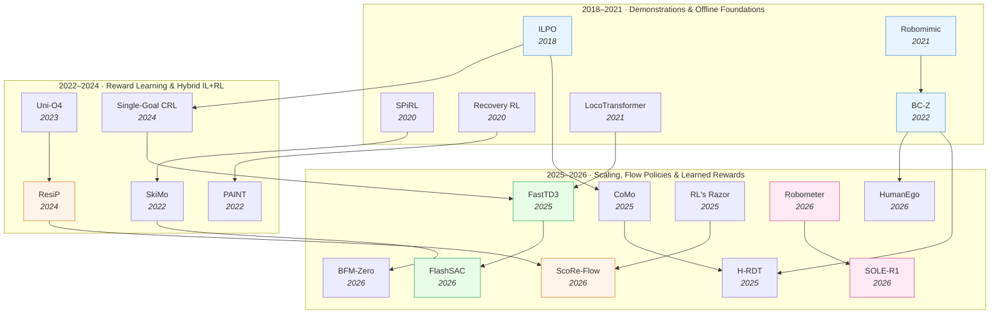

# Imitation Learning & RL for Robotics — Deep Dive

> [!abstract] Overview
> The real axis of robot policy learning is not imitation-learning versus reinforcement-learning — it is *where the learning signal comes from and how expensive it is*. **Demonstrations** are cheap but capped by the demonstrator's skill ([[2108.03298|Robomimic]], [[2202.02005|BC-Z]], [[2606.04269|Instant-Fold]]); **learned rewards** are scalable but mis-specifiable ([[2603.02115|Robometer]], [[2603.28730|SOLE-R1]], [[2511.14565|Masked IRL]]); **environment interaction** is unbounded but unsafe ([[2505.22642|FastTD3]], [[2510.22512|TRL]], [[2010.15920|Recovery RL]]). Modern recipes sit on the IL→RL bridge — clone a base policy, then refine it past the demo ceiling with a learned reward and a thin layer of interaction ([[2407.16677|ResiP]], [[2311.03351|Uni-O4]], [[2604.10962|ScoRe-Flow]]). This deep dive maps that signal-cost spectrum: foundations of learning from demonstrations (Part A), the methods that turn reward signals into optimized policies (Part B), and the capability frontier where these recipes meet locomotion, navigation, and whole-body control (Part C).

## Evolution Graph

The field evolved along the signal-cost spectrum. **Demonstration foundations** (2018→2022) established that history matters ([[2108.03298|Robomimic]]'s BC-RNN), that diverse multi-task demos enable zero-shot generalization ([[2202.02005|BC-Z]]), and that latent actions can be learned from observation alone ([[1805.07914|ILPO]]). **Reward learning & hybrid IL+RL** (2022→2024) attacked the demo ceiling — residual RL refines a frozen BC base ([[2407.16677|ResiP]]), offline-to-online unifies both phases under one objective ([[2311.03351|Uni-O4]]), and contrastive critics learn skills with a *single* goal and no reward ([[2408.05804|Single-Goal CRL]]). **Scaling, flow policies & learned rewards** (2025→2026) is the current frontier — off-policy RL trains humanoids in hours ([[2505.22642|FastTD3]], [[2604.04539|FlashSAC]]), flow/diffusion policies finally admit policy-gradient fine-tuning ([[2604.10962|ScoRe-Flow]], [[2602.02481|FPO++]]), and VLM-based reward models supply dense progress signals that make from-scratch on-robot RL viable ([[2603.02115|Robometer]], [[2603.28730|SOLE-R1]]).

| Year | Paper | Track | Contribution |
|------|-------|-------|--------------|
| 2018 | [[1805.07914\|ILPO]] | Demonstrations | Latent policies from observation; offline latent-action discovery + minimal online grounding |
| 2020 | [[2010.11944\|SPiRL]] | Skill-based | Continuous skill embedding + state-conditioned skill prior for hierarchical RL |
| 2020 | [[2010.15920\|Recovery RL]] | Safety | Dual task/recovery policy + safety critic from offline constraint data |
| 2021 | [[2108.03298\|Robomimic]] | Demonstrations | Empirical study; BC-RNN beats BC, validation loss ≠ task success |
| 2021 | [[2107.03996\|LocoTransformer]] | Locomotion | Transformer cross-modal fusion of depth + proprioception for legged locomotion |
| 2022 | [[2202.02005\|BC-Z]] | Demonstrations | 100-task shared-autonomy IL; 44% zero-shot on 24 unseen tasks |
| 2022 | [[2207.07560\|SkiMo]] | Model-based | Joint skill repertoire + skill-dynamics model for long-horizon MPC |
| 2022 | [[2210.10765\|PAINT]] | Safety | Proactive human-reset requests via learned reversibility classifier |
| 2023 | [[2311.03351\|Uni-O4]] | Hybrid IL+RL | Unified on-policy PPO across offline + online; SOTA on 14/20 D4RL |
| 2024 | [[2407.16677\|ResiP]] | Hybrid IL+RL | Residual PPO on a frozen BC base; assembly 12%→94% |
| 2024 | [[2408.05804\|Single-Goal CRL]] | Reward-free | Skills emerge from contrastive RL with one goal, no rewards/demos |
| 2025 | [[2505.22642\|FastTD3]] | Efficient RL | Parallel TD3 + large batch + distributional critic; HumanoidBench in <3h |
| 2025 | [[2505.17006\|CoMo]] | Egocentric | Continuous latent motion from internet video as pseudo actions; LIBERO +4.2pp |
| 2025 | [[2507.23523\|H-RDT]] | Egocentric | Human-data-pretrained flow-matching DiT; few-shot 41.6% vs RDT 16.0% |
| 2025 | [[2509.04259\|RL's Razor]] | Efficiency | On-policy RL forgets less than SFT; forward-KL predicts forgetting |
| 2026 | [[2604.10962\|ScoRe-Flow]] | Flow policy | Closed-form score from flow velocity field for RL fine-tuning; 22× wall-clock speedup |
| 2026 | [[2603.02115\|Robometer]] | Reward model | Trajectory-comparison reward model; 1M trajectories, 21 embodiments |
| 2026 | [[2603.28730\|SOLE-R1]] | Reward model | Video-language reasoning as the sole on-robot RL reward; 24 unseen tasks |
| 2026 | [[2605.24934\|HumanEgo]] | Egocentric | Zero-shot from 30 min of human egocentric video; 92.5% real bimanual |
| 2026 | [[2511.04131\|BFM-Zero]] | Whole-body | Promptable behavioral foundation model via unsupervised RL on G1 |
| 2026 | [[2604.04539\|FlashSAC]] | Efficient RL | Off-policy SAC with stability stack; ~10× faster than PPO sim-to-real |

---

## Part A — Foundations: Learning from Demonstrations

*Demonstrations are the cheapest learning signal, but they cap policy quality at the demonstrator's skill. Part A covers the canonical empirical studies, the policy representations that extract more from each demo, and the recipes that push past the demo ceiling.*

### 1. Behavior Cloning & Imitation Learning Foundations

Behavior cloning is the default first move in robot learning: collect demonstrations, fit a supervised map from observations to actions, deploy. It is attractive because it sidesteps reward design and unsafe exploration entirely — but it inherits three structural weaknesses. Demonstrations are *non-Markovian* (human operators act on history the observation does not capture), they are *capped* by the demonstrator's own skill, and the *training objective* (action-prediction loss) does not correlate with the *evaluation objective* (task success). Every paper here is a response to one of those three weaknesses.

The first weakness drove the move from feedforward BC to history-dependent and long-context policy representations. The second drove the IL→RL bridge — keep the demonstration as a coarse prior, then refine it with interaction. The third remains the quiet crisis of the field: offline policy selection is unsolved, because the loss you minimize is not the metric you ship on. The sections below trace each response, ordered from the canonical baselines through the representations that extract more signal per demo to the refinement recipes that break the ceiling.

#### 1.1 Canonical BC & Empirical Studies

The reference baselines and the empirical studies that established what actually matters when learning from human demonstrations.

- **[[2108.03298|Robomimic]]** — Systematic empirical study of ==offline IL + offline RL== across 8 manipulation tasks and human/machine datasets; history-dependent ==BC-RNN== beats standard BC by **10–100%** relative on long-horizon multi-human data, and image observations nearly match ground-truth object poses; the canonical finding that offline RL underperforms IL on *human* data and that validation loss ≠ task success.
- **[[2202.02005|BC-Z]]** — Large-scale ==interactive imitation learning== via shared-autonomy teleoperation over **100** tasks, conditioned on language *or* a human-demo video; **44%** zero-shot success on **24** unseen tasks (language) and **37%** (video); established that task-diversity, not per-task data, is what unlocks zero-shot generalization.
- **[[2104.10218|Episodic Memory Manipulation]]** — Decomposes the work cell into modular ==finite-state-machine elements== and synthesizes an Application State Machine from a *single* demonstration, recording semantic commands; built-in ==exception handling== lets the robot detect novel states and request human guidance; an episodic-memory framing that generalizes task logic beyond fixed coordinates.
- **[[1805.07914|ILPO]]** — ==Imitating Latent Policies from Observation==: learns a ==latent forward-dynamics model== + latent policy offline from state-only expert observations, then grounds latent actions to real ones with **<100** interaction steps; superior sample efficiency over BCO across control + visual CoinRun; the foundational proof that abstract actions can be discovered offline and grounded cheaply.

#### 1.2 Structured & Long-Context Policy Representations

The feedforward observation→action map is the weak form of BC. These papers extract more signal per demonstration by structuring the policy — long action histories, geometric SE(3) intermediates — to handle the non-Markovian nature of human demos.

- **[[2505.09561|PTP]]** — ==Past-Token Prediction== regularizes a policy to jointly predict past *and* future action tokens, fixing diffusion policies' under-use of action history, with a memory-efficient multi-stage training + test-time self-verification; **+50%** average on long-context sim tasks, **70%** real success (**>4×** over no-history) and **>5×** training speedup — temporal structure the demo already contains but BC discards.
- **[[2605.25829|OASIS]]** — Aligns the policy's intermediate representation with the action space by explicitly predicting a camera-frame ==SE(3) end-effector trajectory== via a 3D-aware encoder (vision-language + metric depth) + ==Transformer== trajectory predictor; **97.6%** LIBERO and **89.2%** real (surpassing π0.5 by **7.6%**), matching baselines with **60%** fewer demos — geometric structure as an inductive bias.

#### 1.3 Imitation Beyond the Demo Ceiling

Behavior cloning caps policy quality at the demonstrator's skill. These papers cross onto the IL→RL bridge — keep the demonstration as a coarse prior, then refine it with interaction, on-policy correction, or RL to exceed what the demonstrator could do.

- **[[2606.04269|Instant-Fold]]** — In-context ==imitation learning== for deformable folding via a ==flow-matching Transformer== conditioned on auto-extracted keyframes from a *single* demo, with ==temporal contrastive pretraining== over 3D point clouds + 3D-ALiBi attention; **95.8%** context accuracy, **58.3%** held-out folding modes, and **60.9%** zero-shot sim-to-real on 8 unseen garments beating methods that need real fine-tuning.
- **[[2606.03268|EaDex]]** — Cross-embodiment dexterous manipulation from low-cost single-RGB-D demos via ==MANO fitting + motion retargeting== plus hybrid ==RL== combining task, imitation, BC, and contact rewards; a ==contact-reward demo-annealing== mechanism decays reliance on noisy data, lifting average success **23.5→36.5%** (**+55.3%** relative) across 9 tasks — RL refining imperfect demos.
- **[[2605.27114|VR-DAgger]]** — Immersive-VR dexterous teleoperation with ==Diffusion Policy== visuomotor learning and ==uncertainty-guided active relabeling== (Monte-Carlo dropout flags failure segments for human correction); up to **97%** Drawer / **89%** Valve-Hard success, **~40%** less human supervision time, and **6–14 pp** over offline BC on hard configs — on-policy correction past the offline ceiling.
- **[[2606.03512|SPADE]]** — Sketch-guided path planning via ==Diffusion-Expert-Augmented Training== where high-capacity image-conditioned diffusion models (Cond-DBC) guide a compact BC network; **39.1%** lower pose error, **33.5%** lower FID, **60%** fewer artifacts with **93.8%** fewer parameters than a large BC baseline — distilling a diffusion expert's capability into a small deployable policy.
- **[[2407.16677|ResiP]]** — Residual RL for precise assembly: a ==frozen BC base== provides coarse plans while a lightweight ==residual Gaussian PPO== adds high-frequency closed-loop corrections, then a sim-to-real pipeline distills to a vision student; round-table **12%→94%** and peg-in-hole **5%→99%**, with only a **12%** drop under force perturbation vs **19–26%** for chunk-based BC — the canonical residual-RL refinement.
- **[[2311.03351|Uni-O4]]** — Unifies offline + online RL under one on-policy ==PPO== objective (no added conservatism), with ==ensemble BC + disagreement== and an ==AM-Q== multi-step offline evaluator; SOTA on **14/20** D4RL tasks and stable offline-to-online fine-tuning that reaches real-robot **1.62 m/s** locomotion via 180K offline + 100K online steps — the same objective across both phases.
- **[[2510.19307|RIL]]** — Unified ==reinforcement + imitation learning== for VLMs combining ==Dr.GRPO== with ==GAIL-style adversarial imitation==, using a ==dual reward== (LLM-discriminator similarity + LLM-as-judge correctness); student VLMs gain **+8.2%** MathVista / **+12.3%** ChartQA over Dr.GRPO and rival closed-source models while preserving inference speed — imitating multiple teachers via adversarial reward.

**IL Foundations — Decision Matrix**

| Need | Recommendation |
|---|---|
| Reference IL/offline-RL baselines on manipulation | [[2108.03298\|Robomimic]] — BC-RNN beats BC by **10–100%** on long-horizon |
| Zero-shot generalization from task diversity | [[2202.02005\|BC-Z]] — **44%** on 24 unseen tasks from 100-task data |
| Imitate from observation only (no action labels) | [[1805.07914\|ILPO]] — latent-action discovery + **<100**-step grounding |
| Long-context / history-dependent policy | [[2505.09561\|PTP]] — past-token prediction; **70%** real, **>4×** over no-history |
| Geometry-aligned action representation | [[2605.25829\|OASIS]] — SE(3) trajectory; **97.6%** LIBERO, **60%** fewer demos |
| Single-demo deformable manipulation | [[2606.04269\|Instant-Fold]] — in-context flow-matching; **60.9%** zero-shot |
| Refine BC past the demo ceiling (assembly) | [[2407.16677\|ResiP]] — residual PPO; **12%→94%** round-table |
| One objective across offline + online | [[2311.03351\|Uni-O4]] — unified PPO; SOTA **14/20** D4RL |
| On-policy correction of a dexterous policy | [[2605.27114\|VR-DAgger]] — uncertainty relabeling; **~40%** less supervision |

> [!star] Key Papers
> - [[2108.03298|Robomimic]] — The canonical empirical study of offline robot learning; established BC-RNN as the strong baseline and exposed that validation loss does not predict task success.
> - [[2202.02005|BC-Z]] — First convincing demonstration that *task diversity* (100 tasks) enables zero-shot generalization to entirely new tasks, not just new objects.
> - [[1805.07914|ILPO]] — The reference for imitation-from-observation; proved abstract latent actions can be learned offline and grounded with minimal interaction.
> - [[2407.16677|ResiP]] — The canonical residual-RL refinement: a frozen BC base plus a thin PPO residual breaks the demo ceiling on precise assembly.

> [!tip] The Loss You Minimize Is Not the Metric You Ship
> [[2108.03298|Robomimic]]'s most-cited finding is that BC validation loss does not correlate with task success — offline policy selection is an open problem because the supervised objective is a proxy for closed-loop performance. The two structural fixes are *temporal modeling* (BC-RNN, and the long-context policies in [[03_Imitation-Learning-and-RL#1.2 Structured & Long-Context Policy Representations]]) to handle non-Markovian demos, and *interaction* to ground the proxy in real success ([[03_Imitation-Learning-and-RL#1.3 Imitation Beyond the Demo Ceiling]]). For the dataset-scale view of what demonstrations to collect, see [[02_Dataset-Benchmark-Environment#1. Cross-Embodiment Scale Datasets]].

---

### 2. Scaling Demonstrations

*If demonstrations cap policy quality, scale the demonstrations — from cheap human and egocentric video, across embodiments via universal action representations, and through synthetic and co-training pipelines that manufacture data the real robot never collected.*

#### 2.1 Human & Egocentric Video

Human video is the cheapest demonstration source of all — orders of magnitude more abundant than teleoperation, but missing the action labels and embodiment alignment a robot policy needs. These papers bridge that gap with inverse dynamics, retargeting, and embodiment-agnostic observation spaces.

- **[[2605.24934|HumanEgo]]** — Zero-shot robot learning from minutes of human egocentric video; ==hand inpainting== + rendered virtual grippers + ==Interaction-Centric Tokens== give a viewpoint-invariant observation, fed to a ==flow-matching== transformer with dense auxiliary objectives; **92.5%** real bimanual success from **30 min** of human data, **75.0%** from 15 min — beating a 30-min robot-teleop ACT baseline (**51.2%**).
- **[[2602.11393|Visual Motion Pref Modeling]]** — Learns a ==Motion-Prediction Reward== from egocentric human video via a ==DiT== with frozen ==DINOv2==, scoring robot actions by cosine similarity of predicted vs observed object motion; plugged into ==residual RL== on a small diffusion base, reaches **76.7%** Open-Microwave and **73.3%** Fold-Cloth on Franka while VIP shows unlearning — preference from human video, not robot reward.
- **[[2604.10677|LIDEA]]** — Aligns human, pseudo-robot, and robot views via ==dual-stage 2D feature distillation== (from ==DINOv3==) plus ==explicit 3D geometric alignment== into an embodiment-agnostic space, fed to a ==3D diffusion policy== (RISE-2); human demos substitute up to **80%** of robot demos and lift OOD Fold-Towel **36%→63%**.
- **[[2604.20841|DeVI]]** — Generates 2D human-object-interaction video from text via an ==image-to-video diffusion model==, then extracts ==hybrid 3D-human + 2D-object imitation targets== for ==RL==; ==Visual HOI Alignment== cuts hand-joint pixel error **25.6→3.74** and contact distance **101→18.7 mm**; MPJPE **25–41 mm** vs baselines' **91–142 mm** on GRAB — synthetic video as the demonstration source.
- **[[2505.17006|CoMo]]** — Learns ==continuous latent motion== from internet video via an ==inverse-dynamics model== with temporal-difference cues + ==temporal contrastive learning== to suppress static background; the latents serve as pseudo-action labels for joint policy training on action-less video + robot data; **+4.2pp** LIBERO (**75.9→80.1%**), lowest action-prediction MSE.
- **[[2507.23523|H-RDT]]** — Pre-trains a ==Diffusion-Transformer== with ==flow matching== on **338K+** EgoDex human trajectories using a 48-D hand action, then modular-fine-tunes per robot; few-shot (1–5 demos) **41.6%** on dual-arm ARX5 vs RDT's **16.0%**, and **52%** real towel-folding — human pretraining as the bimanual prior.
- **[[2605.30350|DynaFLIP]]** — ==Tri-modal-dynamics== pretraining distills image transitions, language, and 3D flow into a single-image encoder via a ==simplex-guided alignment== objective with cosine + ==InfoNCE== regularizers; as a frozen backbone it tops MetaWorld/RLBench/LIBERO and improves real UR3 robustness to OOD perturbations — a control-relevant representation from multimodal supervision.

#### 2.2 Cross-Embodiment & Universal Action Representations

Demonstrations on one robot rarely transfer to another because action spaces are morphology-specific. These papers build morphology-invariant representations so a single corpus serves many embodiments.

- **[[2606.01851|PHASOR]]** — ==Phase-anchored== universal action representation: per-body-part phase parameters via a ==differentiable FFT== plus a complementary pose branch, with a human-anchored ==hierarchical InfoNCE== alignment over lightweight robot adapters; **90.3%** R@1 human→robot retrieval, **1.62 mm** next-frame MPJPE, and the only method to beat raw-kinematics teleop — an intrinsically morphology-invariant action space.
- **[[2606.03476|Human2Humanoid]]** — Cross-morphology motion retargeting via a ==CycleGAN== with ==skeleton-aware GCN== generators; a ==morphology-invariant end-effector consistency loss== normalizes displacements by body scale while ==physics-aware feasibility constraints== (foot contact/height, joint limits) suppress skating and penetration; **88.5%** success and **0.12** tracking error on Unitree G1, lowest ground penetration.
- **[[2605.20373|SUGAR]]** — Human-video-driven loco-manipulation: extracts coarse kinematic priors + VLM contact labels, a privileged ==RL refiner== turns them into physically feasible demos via a ==Progressive State Pool==, then a hierarchical ==BC/RL Command Tracker + diffusion Command Generator== distills for deployment; Kick-Box scales **32.7→76.0%** (20→100 trajectories), zero-shot on G1.

#### 2.3 Synthetic & Co-Training Data Pipelines

When real data is scarce, manufacture it — augment a single demonstration into a robust dataset, or co-train real + simulation data in one mixture.

- **[[2606.03985|Humanoid-GPT]]** — Scales a ==GPT-style causal Transformer== motion tracker on a **2-billion-frame** corpus; ==Harmonic Motion Embedding== clusters drive PPO experts, then ==DAgger== distillation into the Transformer for zero-shot generalization; **92.58%** tracking success, **40.99 mm** MPKPE, **<1.5 ms** TensorRT latency on RTX 4090 — data + structure scaling for motion tracking.
- **[[2605.21710|PGDG]]** — Physically-grounded data generation from a *single* demonstration: ==spatial randomization== + simulator control-point sampling generate recovery trajectories, a ==DPP + Goldilocks-Zone curator== selects diverse informative ones, and ==CEM local relabeling== fixes risky states; sim **38→93%** (RotateBox), real **35→82%**, and fine-tunes ==GR00T N1.6== to **77.5%** vs **40%**.
- **[[2503.24361|Sim-and-Real Co-Training]]** — A simple recipe: ==BC co-training== on a weighted mixture of real + task-agnostic "Prior" sim and task-aware "Digital Cousin" sim data; **+38%** average over real-only across Panda + Fourier GR-1, with robustness to novel objects (**10%→80%** on Humanoid CupPnP) that persists even in data-rich regimes.

**Scaling Demonstrations — Decision Matrix**

| Need | Recommendation |
|---|---|
| Zero-shot policy from minutes of human egocentric video | [[2605.24934\|HumanEgo]] — **92.5%** real bimanual from 30 min |
| Reward signal directly from human video | [[2602.11393\|Visual Motion Pref Modeling]] — motion-prediction reward + residual RL |
| Substitute robot demos with human demos | [[2604.10677\|LIDEA]] — human covers **80%** of robot data via 2D/3D alignment |
| Pseudo-action labels from internet video | [[2505.17006\|CoMo]] — continuous latent motion; LIBERO **+4.2pp** |
| Human-pretrained bimanual prior | [[2507.23523\|H-RDT]] — flow-matching DiT; few-shot **41.6%** vs RDT 16.0% |
| Morphology-invariant action space across humanoids | [[2606.01851\|PHASOR]] — phase-anchored, **90.3%** R@1 retrieval |
| Cross-morphology retargeting with feasibility | [[2606.03476\|Human2Humanoid]] — CycleGAN + EE-consistency; **88.5%** G1 |
| Augment one demo into a robust dataset | [[2605.21710\|PGDG]] — single-demo generation; **35→82%** real |
| Co-train real + simulation in one mixture | [[2503.24361\|Sim-and-Real Co-Training]] — **+38%** over real-only |

> [!star] Key Papers
> - [[2605.24934|HumanEgo]] — Landmark for zero-shot learning from human egocentric video; 30 minutes of human data beats robot teleoperation on bimanual tasks.
> - [[2507.23523|H-RDT]] — Established human-manipulation pretraining as a strong bimanual prior, with modular fine-tuning per embodiment.
> - [[2606.01851|PHASOR]] — The reference for morphology-invariant universal action representations; phase decomposition makes cross-embodiment transfer tractable.
> - [[2503.24361|Sim-and-Real Co-Training]] — The "simple recipe" that made sim+real co-training a default; co-training beats real-only even when real data is abundant.

> [!tip] Human Video Is the New Demonstration Substrate
> The 2026 shift is treating *human* video — not robot teleoperation — as the primary demonstration source, because it is abundant and cheap. The recurring recipe is embodiment-agnostic alignment ([[2605.24934|HumanEgo]]'s interaction tokens, [[2604.10677|LIDEA]]'s 2D/3D distillation) plus a flow/diffusion policy ([[2507.23523|H-RDT]], [[2505.17006|CoMo]]) that absorbs the human prior, then a thin robot-specific adapter. The signal is cheap but indirect — you pay for alignment instead of teleoperation. For the egocentric-pretraining mechanism in depth see [[12_Egocentric-Pretraining-and-Human-Video#5. Transfer Mechanisms — Hand → Gripper]]; for the synthetic-data-engine view see [[14_Sim-to-Real-Transfer#2. Sim-Side: Learned & Procedural Simulators]].

---

## Part B — Methods: From Reward Signals to Policy Optimization

*Once demonstrations are exhausted, the learning signal becomes a reward — learned, inferred, or hand-designed — and the question becomes how to optimize a policy against it efficiently, stably, and safely.*

### 3. Reward Learning & Inverse RL

Reinforcement learning needs a reward, and for most real robot tasks no one can write one. The reward-learning literature attacks this from three directions: *learn* a reward model from data (often a VLM scoring progress), *infer* a reward from demonstrations or preferences (inverse RL), or *avoid* the reward entirely with goal-conditioned and contrastive objectives. The trade-off across the three is mis-specification risk versus annotation cost — a learned reward scales but can be hacked, an inferred reward is grounded in demos but expensive to collect, and a reward-free objective sidesteps the problem but gives up dense shaping.

The 2026 frontier is the VLM-as-reward-model: a vision-language backbone that emits a dense scalar progress estimate from raw video, turning the un-writable reward into a learned one. The risk it introduces is reward hacking — the policy exploits the reward model's perceptual errors rather than solving the task — which is why the strongest entries pair the reward model with verifiable supervision or trajectory-comparison structure.

#### 3.1 Learned & VLM-Based Reward Models

Train a model to score trajectories or estimate task progress, then use it as the RL reward — scalable, but only as good as the model's robustness to hacking.

- **[[2603.02115|Robometer]]** — General-purpose reward model from ==trajectory comparisons==: a ==VLM backbone== trained with ==absolute progress + relative preference supervision== over the **1M-trajectory, 21-embodiment RBM-1M** dataset (including failures); OOD VOC Pearson **r=0.95**, lifts online RL success **2.5×** and IL **4.5×** via data filtering — reward modeling at foundation scale.
- **[[2603.28730|SOLE-R1]]** — Video-language reasoning *as the sole reward*: a VLM emits per-timestep ==spatiotemporal chain-of-thought== + dense scalar progress, trained via ==SFT then RLVR==; enables from-random-init on-robot RL reaching **≥50%** on **24** unseen tasks, with failures that are "signal-limited" rather than reward-hacked — robustness against hacking is the contribution.
- **[[2604.03037|ARM]]** — Advantage Reward Model for long-horizon manipulation: a ==Tri-state Advantage Labeling== (Progressive/Regressive/Stagnant) feeds a ==temporal Transformer== predicting relative advantage, used in ==Advantage-Weighted BC==; dense-progress MSE **0.0014**, **2.5×** faster human + **20×** faster auto labeling, and **99.4%** bimanual towel-folding vs BC's **62.1%**.
- **[[2512.20675|VLM Reward Objectives]]** — Controlled re-evaluation of reward-model *learning objectives* (TCN, VIP, R3M, LIV) under a fixed SigLIP2+LoRA backbone; a simple ==triplet-loss baseline== wins on ranking accuracy (**68.88%** avg), while all objectives collapse on multi-step tasks (door-open VOC **6.70%**) — the objective, not the backbone, decides reward quality.
- **[[2605.22123|FLORA]]** — Learns ==invariant object-centric motion-flow rewards== from a few demos via a ==PBRS-MS== potential with milestone progress tracking and ==LLM-symbolic + Bayesian-optimization== potential discovery; **0.97** Spearman ρ, **96%** Meta-World success, near-**100%** real Peg-Insert/Box-Open with zero-shot OOD robustness — distractor-invariant reward shaping.

#### 3.2 Inverse RL & Preference Learning

Recover the reward *implied* by demonstrations or preferences, then optimize it — grounded in expert behavior but historically unstable.

- **[[2511.14565|Masked IRL]]** — Uses ==LLMs to disambiguate== ambiguous language instructions and generate ==binary state-relevance masks==, plus an ==implicit masking loss== that penalizes reward changes under perturbation of irrelevant state; **4.7×** fewer demos for comparable generalization, **+16.9%** mask-F1, and **44.8–59.4%** lower reward regret on real Franka.
- **[[2605.11020|TRIRL]]** — ==Trust-Region Inverse RL== reformulates ==MCE-IRL== as ==explicit dual ascent== in reward space with ==local policy updates== inside a reverse-KL trust region, plus a ==Lagrangian reward-correction== for monotonic improvement; **2.4×** aggregate IQM over GAIL/AIRL/LSIQ with transferable rewards under altered dynamics — IRL without the adversarial instability.

#### 3.3 Reward-Free & Goal-Conditioned Signals

Skip the reward entirely: condition on goals and let contrastive or divide-and-conquer value learning supply the signal.

- **[[2408.05804|Single-Goal Contrastive RL]]** — Skills and exploration emerge from ==contrastive RL== conditioned on a *single target goal* during all data collection, with an ==InfoNCE critic==; outperforms oracle multi-goal CRL, SAC+HER, and dense-reward SAC on MetaWorld + maze, with sequential grasp-pick-place emerging *before* the first success — no rewards, demos, or subgoals.
- **[[2503.14858|CRL]]** — Scales ==self-supervised contrastive RL== to **1024-layer** actor/critic networks with residual connections + LayerNorm in JaxGCRL; depth 4→64 yields **2×–50×** gains (continuing to 1024), unlocking emergent behaviors (a depth-256 Humanoid vaulting walls) — depth, not width, enables new goal-reaching.
- **[[2510.22512|TRL]]** — ==Transitive RL== for offline goal-conditioned learning via a ==divide-and-conquer Bellman update== with ==soft expectile regression== and in-trajectory subgoals + distance re-weighting; SOTA on long-horizon humanoidmaze-giant and best average across **10** OGBench environments / **50** tasks — divide-and-conquer beats TD and MC value learning.
- **[[2111.09793|Robotic Interestingness]]** — Unsupervised online learning of "interestingness" via a ==4-D visual memory== with ==FFT translation-invariant reading== that writes novel features and loses interest in repetition; **69 FPS**, **+18.9–31.9%** from online learning, beating unsupervised + weakly-supervised baselines — a reward-free novelty signal for exploration.

**Reward Learning — Decision Matrix**

| Need | Recommendation |
|---|---|
| Foundation-scale general reward model | [[2603.02115\|Robometer]] — 1M trajectories; OOD VOC **r=0.95** |
| From-scratch on-robot RL reward (hack-resistant) | [[2603.28730\|SOLE-R1]] — video-language CoT as sole reward; 24 unseen tasks |
| Dense advantage reward for long-horizon BC | [[2604.03037\|ARM]] — tri-state advantage; **99.4%** towel-folding |
| Pick the right reward-model learning objective | [[2512.20675\|VLM Reward Objectives]] — triplet loss wins (**68.88%**) |
| Distractor-invariant reward from few demos | [[2605.22123\|FLORA]] — object-centric flow + PBRS-MS; **96%** Meta-World |
| Disambiguate language + infer reward | [[2511.14565\|Masked IRL]] — LLM masks; **4.7×** fewer demos |
| Stable inverse RL with transferable rewards | [[2605.11020\|TRIRL]] — trust-region dual ascent; **2.4×** IQM |
| Learn skills with no reward, one goal | [[2408.05804\|Single-Goal Contrastive RL]] — beats oracle multi-goal CRL |
| Scale contrastive RL with network depth | [[2503.14858\|CRL]] — 1024 layers; **2×–50×** gains |
| Offline goal-conditioned long-horizon value | [[2510.22512\|TRL]] — divide-and-conquer; SOTA OGBench |

> [!star] Key Papers
> - [[2603.02115|Robometer]] — The reference for scaling reward models; foundation-scale trajectory-comparison data makes general-purpose robot rewards viable.
> - [[2603.28730|SOLE-R1]] — Established video-language reasoning as a directly-usable RL reward and made reward-hacking resistance a first-class design target.
> - [[2408.05804|Single-Goal Contrastive RL]] — The surprising proof that exploration and skills emerge from contrastive RL with a single goal and no reward signal at all.
> - [[2510.22512|TRL]] — The divide-and-conquer value-learning landmark for offline goal-conditioned RL on long-horizon tasks.

> [!tip] The Reward Model Becomes the Bottleneck
> When you replace a hand-written reward with a learned VLM reward model ([[2603.02115|Robometer]], [[2603.28730|SOLE-R1]]), you trade reward-*design* effort for reward-*hacking* risk — the policy will exploit the reward model's perceptual blind spots unless the reward is verifiable ([[2603.28730|SOLE-R1]]'s RLVR) or structurally constrained ([[2603.02115|Robometer]]'s trajectory comparisons, [[2605.22123|FLORA]]'s object-centric invariance). The reward-free alternative ([[2408.05804|Single-Goal Contrastive RL]], [[2510.22512|TRL]]) sidesteps hacking entirely but gives up dense shaping. For how this couples to self-improvement loops where the model both acts and scores, see [[13_Self-Evolving-VLA-WAM#4. Failure Detection, Diagnosis & Recovery]]; for VLA-specific RL post-training rewards see [[05_VLA#6. RL Post-Training for VLAs]].

---

### 4. RL Algorithms, Efficiency & Policy Representations

The reward exists — now optimize against it. This section is about the *optimizer*: the algorithmic and engineering advances that make RL fast enough to train a humanoid in hours, the techniques that let expressive flow and diffusion policies admit policy gradients, and the methods that extend RL to language and multimodal agents. The unifying tension is between *expressiveness* and *optimizability* — Gaussian policies optimize trivially but cannot represent multimodal action distributions, while flow/diffusion policies are expressive but have ill-defined likelihoods that block standard policy gradients.

The 2025–2026 breakthrough on the efficiency axis is that *off-policy* RL — long considered too unstable for high-dimensional control — beats PPO in wall-clock time when paired with massive parallelism, large batches, and a distributional critic. The breakthrough on the expressiveness axis is deriving policy-gradient signals for flow policies without computing exact likelihoods, finally bringing diffusion-class policies into online RL.

#### 4.1 Efficient & Off-Policy RL

Make RL fast and stable enough for real humanoids — and safe enough to run on hardware — through parallelism, large batches, and safety filters.

- **[[2505.22642|FastTD3]]** — Parallel ==TD3== with **32,768** batch size + a ==distributional C51 critic==, optimized via mixed-precision + `torch.compile`; solves HumanoidBench tasks in **<3 h** on one A100 and transfers to a real Booster T1, beating PPO/SAC/DreamerV3 in wall-clock — off-policy RL made fast without architectural complexity.
- **[[2604.04539|FlashSAC]]** — Fast-and-stable off-policy ==SAC== with an ==inverted-residual backbone==, ==pre-activation BatchNorm==, ==cross-batch value prediction==, and a distributional critic + adaptive reward scaling; nearly **10×** faster than PPO for sim-to-real humanoid locomotion across **60+** tasks under one hyperparameter set.
- **[[2605.26478|SDPG]]** — ==Stochastic Decoupled Policy Gradient== replaces analytical trajectory Jacobians with ==stochastic smoothing==, recasting policy improvement as supervised gradient descent; matches state-based reward on visual MuJoCo at **10–11 GB** in hours on an RTX 4080, with zero-shot sim-to-real on Unitree Go2 depth navigation.
- **[[2509.04259|RL's Razor]]** — Shows on-policy ==RL forgets less== than SFT because policy gradients converge to the ==KL-minimal== solution from the base model; forward-KL between fine-tuned and base policy predicts forgetting (**R²=0.96**), giving a formal basis for preferring RL fine-tuning over SFT in robot foundation models.
- **[[2512.01996|Humanoid Loco 15min]]** — A minimalist recipe pairing efficient off-policy ==RL== (==FastSAC==/==FastTD3==) with massively parallel sim, joint-limit-aware action bounds, normalization, and a **<10-term** reward + curriculum + symmetry augmentation; trains Unitree G1 / Booster T1 locomotion in **15 minutes** on one RTX 4090, deployed for robust real walking and a 2-minute dance — off-policy efficiency taken to its sim-to-real limit.
- **[[2605.26452|Koopman-CBF SAC]]** — Combines ==SAC== with a data-driven ==Koopman Control-Barrier-Function== safety filter learned via ==EDMD==, tightening the CBF with a projected-residual margin in a robust ==QP==; **zero** violations on CartPole, **96.8%** violation reduction on quadrotor tracking — but degrades when Koopman error is large in contact-rich locomotion.
- **[[2605.09772|GP-Safe-Exploration]]** — Safe exploration via a nominal ==linear model + online Gaussian Process== residual with a ==Lyapunov probabilistic control-invariant set== and a convex ==QP== controller; **97%** GP-RMSE reduction + **27.7%** larger certified safe set, zero violations over a 2000 s identification horizon, with sparse-GP inference **>1000×** faster.
- **[[2010.15920|Recovery RL]]** — ==Dual task/recovery policy== with a ==safety critic== pre-trained on offline constraint-violation data defining ==recovery zones==, plus ==action relabeling== so the task policy learns from proposed actions; **2×–20×** better task/violation trade-off in sim, **3×** on a physical dVRK robot — separate the recovery policy from the task policy.
- **[[2210.10765|PAINT]]** — Proactive interventions in autonomous RL: penalizes ==irreversible states== via a learned ==reversibility classifier== trained with an ==O(log T) binary-search labeling==, requesting a human reset only when entering an irreversible state; **80** resets vs **3000+** for baselines in Tabletop Organization — minimal human supervision via reversibility.
- **[[2605.19924|RoHIL]]** — Robust human-in-the-loop RL against illumination shift: a ==world-model relighter== generates lighting variations (no new real data), ==Illumination-Retention Replay== mixes original/relit data, and ==Anchored Bellman-Actor Regularization== anchors the SAC objective to a frozen source policy; **1.00** success on both source + **60%**-shifted lighting on USB insertion.

#### 4.2 Flow & Diffusion Policy Optimization

Bring expressive flow/diffusion policies into RL — their multimodal action distributions are powerful but their ill-defined likelihoods block standard policy gradients.

- **[[2604.10962|ScoRe-Flow]]** — Derives a ==closed-form score function== from a pre-trained ==flow-matching== velocity field, enabling ==score-based drift modulation== + a learned ==variance predictor== as an SDE for RL fine-tuning with decoupled mean/variance control; **5100±47** on Humanoid-v3, **2.4×** faster convergence and **22×** wall-clock speedup over diffusion DPPO, **92.5%** Robomimic.
- **[[2602.02481|FPO++]]** — Stabilizes ==flow-matching policy gradients== by approximating updates via ==conditional-flow-matching loss differences== (no explicit likelihood), with a ==per-sample ratio== and an ==asymmetric trust region== (PPO-clip for positive, SPO for negative advantages); first sim-to-real of RL-trained flow policies for humanoid locomotion.
- **[[2604.10953|DRL-3DBP]]** — Online 3D bin packing as an MDP with a ==diffusion== model in the actor of an actor-critic, modeling multimodal packing-action distributions, plus a ==feasibility-mask== module constraining to valid placements; **57.9%** space utilization (RS) and **64.1%** (CUT-1), placing larger/heavier items first — diffusion for combinatorial packing.
- **[[2605.12771|PASTA]]** — Multi-objective ==PPO== with an ==Adaptive Smooth Tchebycheff== scalarization whose smoothness adapts to inter-objective gradient conflict, plus ==PCGrad== projection and an attention-aligned branched critic; **+45.5%** hypervolume and **100%** win-rate on a real stealth-search quadrotor task — principled multi-objective policy optimization.
- **[[2605.03065|OGPO]]** — sample-efficient full fine-tuning of generative control policies via a ==zeroth-order PPO== policy extraction more stable than direct backprop or AWR/FPO-style variants; ~**10×** fewer environment steps than on-policy DPPO on ROBOMIMIC and finetunes poorly-initialized BC policies to near-full success without extra expert data in the online buffer.

#### 4.3 RL & IL for Language & Multimodal Agents

Extend the same IL→RL machinery to VLM agents — where the "action" is a token or tool call and the "environment" is a benchmark or the web.

- **[[2510.25992|SRL]]** — ==Supervised Reinforcement Learning== reformulates reasoning as sequential decisions, decomposing expert solutions into step-wise actions with a ==dense sequence-similarity reward== optimized via ==GRPO==; **27.6%** math accuracy alone, **28.3%** under an SRL→RLVR curriculum, and **+74%** relative on agentic SWE — expert trajectories converted to step-wise reasoning rewards.
- **[[2505.03181|AFSFT]]** — VLM Q-Learning combines ==SFT + off-policy RL== via ==token-level advantage filtering== with an actor-critic ==VLM-policy + critic head==, enabling ==offline-to-online== learning; matches prior RL on Gym Cards, recovers policies from noisy MiniWoB data, with minimal overhead via ==LoRA== — aligning VLMs for interactive decision-making.
- **[[2510.08558|Early Experience]]** — A reward-free paradigm where the agent executes alternative actions and learns from resulting states via ==Implicit World Modeling== + ==Self-Reflection== CoT; **+2.3% to +18.4%** success across 8 language-agent environments, improved OOD generalization, and a stronger initialization for downstream RL — experience without rewards.
- **[[2601.16973|VisGym]]** — A suite of **17** visually-interactive Gymnasium environments with oracle solvers for ==SFT== and a function-conditioned action space; frontier Gemini-3-Pro reaches **46.61%** easy / **26.00%** hard, ASCII observations help symbolic tasks **3–4×**, and solver-SFT roughly doubles harder-task generalization — a diagnostic substrate for multimodal agents.

**RL Algorithms — Decision Matrix**

| Need | Recommendation |
|---|---|
| Fast off-policy RL for humanoid control | [[2505.22642\|FastTD3]] — HumanoidBench in **<3 h** |
| Stable off-policy SAC, sim-to-real | [[2604.04539\|FlashSAC]] — ~**10×** faster than PPO |
| Visual RL on a single consumer GPU | [[2605.26478\|SDPG]] — matches state-based; RTX 4080 |
| Fine-tune without catastrophic forgetting | [[2509.04259\|RL's Razor]] — RL forgets less; KL predicts forgetting |
| Safety-filtered SAC with guarantees | [[2605.26452\|Koopman-CBF SAC]] — **96.8%** violation reduction |
| Provably safe exploration | [[2605.09772\|GP-Safe-Exploration]] — zero violations, certified set |
| Minimize unsafe states with offline data | [[2010.15920\|Recovery RL]] — **2×–20×** task/violation trade-off |
| Minimize human resets in autonomous RL | [[2210.10765\|PAINT]] — **80** vs **3000+** resets |
| Robustify a policy to illumination shift | [[2605.19924\|RoHIL]] — **1.00** on **60%**-shifted lighting |
| RL fine-tune a flow-matching policy | [[2604.10962\|ScoRe-Flow]] — **22×** wall-clock speedup |
| RL flow policies for legged sim-to-real | [[2602.02481\|FPO++]] — first RL flow-policy sim-to-real |
| Multi-objective policy optimization | [[2605.12771\|PASTA]] — **+45.5%** hypervolume |
| RL for reasoning from expert trajectories | [[2510.25992\|SRL]] — step-wise rewards; **+74%** SWE |
| Align a VLM for interactive decisions | [[2505.03181\|AFSFT]] — SFT + off-policy token advantage |

> [!star] Key Papers
> - [[2505.22642|FastTD3]] — Reset the efficiency frontier: documented off-policy RL training a full-size humanoid in hours, beating PPO/DreamerV3 in wall-clock.
> - [[2604.10962|ScoRe-Flow]] — The reference for RL fine-tuning flow-matching policies via a closed-form score, removing the likelihood barrier.
> - [[2509.04259|RL's Razor]] — Established *why* on-policy RL forgets less than SFT — a KL-minimization principle now guiding foundation-model fine-tuning.
> - [[2510.08558|Early Experience]] — The bridge from imitation to RL for language agents; reward-free experience as a better initialization than pure IL.

> [!tip] Off-Policy RL Won the Efficiency War — Expressiveness Is Next
> The 2025 surprise: off-policy RL ([[2505.22642|FastTD3]], [[2604.04539|FlashSAC]]) is *not* too unstable for high-dimensional control — massive parallelism + large batches + a distributional critic make it beat PPO in wall-clock, no architectural stabilizers needed. With efficiency solved, the open axis is *expressiveness*: flow/diffusion policies represent multimodal actions Gaussians cannot, and [[2604.10962|ScoRe-Flow]]/[[2602.02481|FPO++]] finally make them RL-trainable. The composition recipe is now clone-with-flow, refine-with-off-policy-RL. For the safety filters that gate this on hardware see [[03_Imitation-Learning-and-RL#4.1 Efficient & Off-Policy RL]] above; for how these policies become VLA backbones see [[05_VLA#6. RL Post-Training for VLAs]], and for sim-to-real of RL policies see [[14_Sim-to-Real-Transfer#3. Policy-Side: Robustness & Domain Randomization]].

---

### 5. Offline, Model-Based & Skill-Based RL

This section covers the three ways RL escapes the cost of fresh environment interaction. *Offline RL* learns entirely from a fixed dataset, trading interaction for distribution-shift risk. *Model-based RL* learns a dynamics model and plans or trains inside it, trading real rollouts for model-error accumulation. *Skill-based and hierarchical RL* reuse a library of temporally-extended skills, trading low-level exploration for the cost of building the skill library. All three share a single bet: that structure — a dataset, a model, or a skill prior — can substitute for the unbounded-but-unsafe interaction that pure RL demands.

The recurring failure mode across all three is *staleness*: an offline dataset, a learned model, or a skill prior is a frozen snapshot of dynamics that may no longer hold at deployment. The strongest recent entries make the structure *adaptive* — a world model that updates toward the policy's own state distribution, or a model-based loop that tracks time-varying dynamics.

#### 5.1 Offline & Hybrid RL

Learn from a fixed dataset or transfer across robots — robust to dynamics shift, but only if the model or transfer accounts for it.

- **[[2505.13709|Policy-Driven WM Adaptation]]** — Reformulates offline MBRL as a ==maximin== over (world model, policy) solved via ==Stackelberg dynamics== where the WM leader anticipates the policy follower, dynamically adapting WM fidelity to ==policy-induced state visitation==; SOTA on **12** noisy D4RL tasks + **3** Tokamak-control tasks with robustness gains under adversarial perturbation.
- **[[2604.06943|Sustainable Transfer RL]]** — ==Hybrid motion-force control== with ==SAC== auto-tuning controller parameters for peg-in-hole, studying cross-robot transfer; native **100%** (UR5e) / **97.98%** (Panda), zero-shot transfer **78.79–93.94%**, and fine-tuning restores **97.98%** with **135** steps vs **>1M** for native convergence — transfer as a sustainability lever.
- **[[2604.02260|Time-Varying MBRL]]** — Episodic ==MBRL== for ==time-varying dynamics== via a ==variation-budget model in an RKHS==, with Full-Reset (R-OMBRL) and Sliding-Window (SW-OMBRL) data strategies + Bayesian-NN ensembles; proves sublinear ==dynamic regret== and adapts a real RC car to decaying throttle where stationary MBRL fails.

#### 5.2 Model-Based RL for Control

Learn a dynamics model and plan or adapt within it — sample-efficient, but model error compounds over the horizon.

- **[[2207.07560|SkiMo]]** — Jointly learns a ==skill repertoire== + a ==skill-dynamics model== that predicts the H-step outcome of a whole skill (not single steps), enabling ==MPC with CEM== in abstract skill space; solves long-horizon Maze + Kitchen with **~5×** fewer interactions than SPiRL and accurate prediction over **500** timesteps — abstraction cuts model-error accumulation.
- **[[2003.01239|Evolutionary Meta-Learning Legged]]** — ==ES-MAML== meta-learning with a noise-tolerant ==Batch Hill-Climbing== inner-loop operator (gradient-free) for fast legged adaptation; on a real Minitaur, **+100%** forward velocity under a mass-voltage shift within **50** rollouts (150 s), beating gradient-based PG-MAML which shows negative adaptation — black-box adaptation under real-world noise.

#### 5.3 Skill-Based & Hierarchical RL

Reuse temporally-extended skills and memory to shorten the horizon — at the cost of building and maintaining the skill library.

- **[[2010.11944|SPiRL]]** — Learns a ==continuous skill embedding== + a ==state-conditioned skill prior== offline from unstructured data via a ==latent-variable model==, then regularizes ==max-entropy SAC== toward the prior for hierarchical downstream RL; reliably solves Maze/Block-Stacking/Kitchen where flat RL fails, robust even to sub-optimal training data — the canonical skill-prior result.
- **[[2501.10395|t-DGR]]** — Lifelong learning via ==trajectory-based deep generative replay== (a ==diffusion== generator conditioned on timestep) + an ==AttentionTuner== that guides Transformer self-attention with human memory-dependency annotations; **81.9%** CW10 / **83.9%** CW20 and **99.8%** Mortar Mayhem vs **20.8%** vanilla, with **14–16×** less annotation effort.
- **[[2604.15814|Continual Hand-Eye Calibration]]** — Continual calibration for open-world manipulation via a ==Spatial-Aware Replay Strategy== (hybrid-distance Poisson-disk sampling) + ==Structure-Preserving Dual Distillation== decomposing localization into coarse topological prior + fine metric offset over a ==scene-coordinate-regression== backbone; **98.4%** accuracy at **1 cm/1°** with **1.6%** forgetting on a manipulation dataset — replay + distillation against calibration drift.
- **[[2502.10550|MIKASA]]** — A memory-RL benchmark unifying Object/Spatial/Sequential/Capacity tasks: ==MIKASA-Robo== adds **32** memory-intensive ManiSkill3 tasks; PPO-MLP with full state hits **100%** but PPO-LSTM/SAC/TD-MPC2 collapse to near-zero on 5–9-item memory tasks, and a real π0.5 gets **10%** on long-horizon occlusion — isolating memory as the limiting factor.

**Offline & Model-Based — Decision Matrix**

| Need | Recommendation |
|---|---|
| Offline MBRL robust to dynamics shift | [[2505.13709\|Policy-Driven WM Adaptation]] — Stackelberg WM-policy; SOTA D4RL |
| Cross-robot skill transfer | [[2604.06943\|Sustainable Transfer RL]] — fine-tune restores **97.98%** in 135 steps |
| Control under time-varying dynamics | [[2604.02260\|Time-Varying MBRL]] — sublinear dynamic regret |
| Long-horizon planning with skills | [[2207.07560\|SkiMo]] — skill-dynamics MPC; **5×** fewer interactions |
| Fast legged adaptation under real noise | [[2003.01239\|Evolutionary Meta-Learning Legged]] — ES-MAML; **+100%** velocity in 50 rollouts |
| Hierarchical RL with a learned skill prior | [[2010.11944\|SPiRL]] — state-conditioned skill prior |
| Lifelong learning across task sequences | [[2501.10395\|t-DGR]] — trajectory generative replay; **83.9%** CW20 |
| Benchmark memory-dependent RL | [[2502.10550\|MIKASA]] — 32 memory-intensive robotic tasks |

> [!star] Key Papers
> - [[2010.11944|SPiRL]] — The canonical skill-prior paper; established the continuous-skill-embedding + state-conditioned-prior recipe for hierarchical RL.
> - [[2207.07560|SkiMo]] — Showed that planning in *skill* space with a skill-dynamics model beats flat model-based RL on long-horizon sparse-reward tasks.
> - [[2505.13709|Policy-Driven WM Adaptation]] — The reference for making the offline world model adaptive to the policy's own state distribution rather than a frozen snapshot.

> [!tip] Structure Substitutes for Interaction — Until It Goes Stale
> Offline datasets, learned models, and skill priors all buy sample efficiency by encoding structure that replaces unbounded interaction — but each is a *frozen snapshot* of dynamics that decays at deployment. The robust entries make the structure adaptive: [[2505.13709|Policy-Driven WM Adaptation]] updates the model toward the policy's visitation, [[2604.02260|Time-Varying MBRL]] tracks drifting dynamics with bounded regret, and [[2003.01239|Evolutionary Meta-Learning Legged]] re-adapts in 50 real rollouts. The when-to-use rule: pick offline/model-based when interaction is expensive *and* dynamics are stable; add an adaptation loop the moment they drift. For online world-model adaptation as a sim-to-real mechanism see [[14_Sim-to-Real-Transfer#4. Real2Sim2Real Loops & Digital Twins]]; for the self-evolving framing where the model improves itself see [[13_Self-Evolving-VLA-WAM#5. Self-Evolving WAMs]].

---

## Part C — Capabilities & Frontier

*Where the IL→RL recipes meet hard embodied capabilities — legged locomotion, aerial navigation, and whole-body control — and where they still fail.*

### 6. RL for Locomotion, Navigation & Whole-Body Control

Locomotion and navigation are where RL most decisively beats imitation learning: the action spaces are high-frequency and contact-rich, demonstrations are hard to collect (you cannot teleoperate a backflip), and a well-shaped reward plus a fast simulator yields policies that transfer. This section organizes that capability frontier by embodiment regime — legged ground robots that must adapt online to terrain and hardware limits, aerial and navigation agents that must act under partial observability and perception loss, and whole-body humanoid controllers that must coordinate dozens of joints into stable, expressive motion.

The cross-cutting mechanism is *adaptation*: a locomotion policy is only as good as its ability to absorb a distribution it did not train on — new terrain, a damaged motor, a thermal limit, an occluded sensor. The strongest entries make adaptation a first-class architectural feature (long-context memory, residual correction, mixture-of-experts gating) rather than relying on domain randomization alone.

#### 6.1 Legged Locomotion & Adaptation

Legged policies must adapt online — to terrain, hardware limits, and morphology changes — beyond what domain randomization covers at training time.

- **[[2606.04718|CoRe-MoE]]** — Multi-terrain humanoid locomotion via a two-stage RL pipeline with an ==asymmetric actor-critic MoE==: command velocity drives gait selection, then a terrain-aware MoE refines actions, with a ==SwAV contrastive objective== forcing expert specialization; **99.13%** flat-terrain success, **94.3%** Up-Stairs (vs 84.6% without SwAV), zero-shot G1 transitions to **2.5 m/s**.
- **[[2605.27046|Thermal-Aware Residual]]** — A ==thermal-aware residual policy== over a nominal locomotion policy, with a whole-body ==lumped-parameter thermal model== giving real-time motor-temperature feedback and adaptive rewards scaling intervention with heat; overheating **70%→<10%**, a real Unitree A1 covers **650 m** with a 3 kg payload keeping motors **<50 °C** — safety as a residual.
- **[[2509.23745|LocoFormer]]** — Generalist locomotion via massive-scale RL on procedurally-generated robots + aggressive DR, with a ==Transformer-XL== long-context policy retaining memory across trials; **0.96** normalized displacement on 10 unseen morphologies (few-shot 0.98), zero-shot real adaptation to locked limbs, wheel failures, and payloads — long-context is the adaptation mechanism.
- **[[2107.03996|LocoTransformer]]** — End-to-end vision-guided quadrupedal locomotion with a ==Transformer== fusing depth + proprioception via ==cross-modal self-attention==; **290.5–663%** fewer collisions in sim and **92%** farther with fewer collisions on a real Unitree A1, with attention focusing on obstacles — the foundational cross-modal locomotion transformer.

#### 6.2 Aerial & Navigation RL

Aerial and navigation agents act under partial observability, perception loss, and tight collision constraints — demanding memory, active perception, and reward shaping beyond standard locomotion.

- **[[2606.03963|AgenticRL]]** — Self-refining agent-guided RL for UAV navigation: a ==multimodal GPT agent== generates and iteratively refines executable ==Python reward functions== from language + visual context + diagnostic feedback; **97%** sim / **91%** real success with **94%** sim-to-real accuracy across 5 tasks and **71%** reward-refinement improvement — the reward designer is an agent.
- **[[2606.03441|PerchRL]]** — Vision-based agile perching on inclined moving platforms via two-stage PPO (state pre-train → vision fine-tune) with ==B-spline trajectory randomization==, a ==TCN==, and ==visibility-aware augmentation== (EKF + reliability indicator) plus ==active-perception rewards==; real perching on a **70°** platform moving at **2.0 m/s** with zero-shot OOD generalization.
- **[[2605.14810|CaMeRL]]** — Collision-aware + memory-enhanced UAV navigation: a ==VAE== extracts safety-relevant latents from depth (supervised by collision-aware depth maps) and an ==LSTM== integrates temporal context for partial observability, trained with PPO; **0.77** success in ultra-small-obstacle vs MAVRL's **0.29**, real dense-forest flight at **1.4 m/s**.
- **[[2605.28442|COTRATE]]** — Self-supervised online robot-agnostic ==traversability estimation==: a ==VICReg VAE== produces continuous traversability scores from proprioception, a ==frozen DINOv3== visual model aligns monocular features, and ==diversity-aware feature replay== handles continual learning; cross-platform transfer where zero-shot sometimes beats platform-specific models, **+2.1–2.5pp** mIoU.

#### 6.3 Whole-Body & Bimanual Control

Coordinating dozens of joints into stable, expressive whole-body motion — the hardest control regime, where reward design and motion priors matter most.

- **[[2606.03536|Bionic Whole-Body Control]]** — Bionic human-motion style transfer for physically-executable whole-body control: a ==multi-condition latent diffusion== model (content/style/trajectory) with ==contact-consistency + temporal-smoothness== regularizers generates feasible references, distilled into a ==cluster-and-distill RL tracker==; **96.0%** real G1 success over **125** trials, lowest foot-sliding **0.004722 m/frame**.
- **[[2602.15827|PHP]]** — Perceptive humanoid parkour chaining dynamic skills via ==motion matching== for kinematic composition + a hybrid ==DAgger + PPO== distillation into a single depth-based visuomotor policy; a real Unitree G1 climbs a **1.25 m** wall (96% of its height) in 3.63 s and cat-vaults at **3.41 m/s**, chaining skills under depth-only perception.
- **[[2511.04131|BFM-Zero]]** — A promptable ==behavioral foundation model== for humanoid control via unsupervised RL extending ==FB-CPR==, learning an objective-centric latent space promptable by motions, goals, or rewards; zero-shot on a real Unitree G1 across motion tracking / goal reaching / reward optimization, with few-shot single-leg balance **>15 s** under a 4 kg payload — one model, many prompts.

**Locomotion & Whole-Body — Decision Matrix**

| Need | Recommendation |
|---|---|
| Multi-terrain humanoid gait adaptation | [[2606.04718\|CoRe-MoE]] — terrain MoE + SwAV; **99.13%** flat |
| Motor thermal safety during locomotion | [[2605.27046\|Thermal-Aware Residual]] — overheating **70%→<10%** |
| Generalist locomotion across morphologies | [[2509.23745\|LocoFormer]] — long-context; **0.96** on 10 unseen |
| Vision-guided quadruped locomotion | [[2107.03996\|LocoTransformer]] — cross-modal transformer; **92%** farther |
| Reward design for UAV navigation | [[2606.03963\|AgenticRL]] — agent-refined rewards; **91%** real |
| Agile perching on moving platforms | [[2606.03441\|PerchRL]] — active perception; **70°** at 2.0 m/s |
| UAV navigation under partial observability | [[2605.14810\|CaMeRL]] — collision VAE + LSTM memory |
| Robot-agnostic traversability estimation | [[2605.28442\|COTRATE]] — VICReg + DINOv3; cross-platform |
| Stylized executable whole-body motion | [[2606.03536\|Bionic Whole-Body Control]] — latent diffusion + RL tracker; **96.0%** G1 |
| Dynamic humanoid parkour | [[2602.15827\|PHP]] — motion matching + DAgger/PPO; **1.25 m** wall |
| Promptable humanoid behavioral foundation | [[2511.04131\|BFM-Zero]] — unsupervised RL; zero-shot multi-task G1 |

> [!star] Key Papers
> - [[2107.03996|LocoTransformer]] — The foundational cross-modal locomotion transformer; established attention-based fusion of vision and proprioception for legged control.
> - [[2509.23745|LocoFormer]] — Showed long-context memory is the generalization mechanism for locomotion — a single policy adapting zero-shot across morphologies and hardware failures.
> - [[2511.04131|BFM-Zero]] — The reference for promptable whole-body behavioral foundation models trained by unsupervised RL on real humanoids.
> - [[2602.15827|PHP]] — Landmark for dynamic humanoid parkour, chaining sparse human skills into contact-rich behaviors deployable from depth-only perception.

> [!tip] Adaptation Is the Real Capability, Not the Skill
> Across locomotion, navigation, and whole-body control, the headline skill (a backflip, a perch, a parkour vault) is impressive but the durable contribution is the *adaptation mechanism* that survives a distribution the policy never trained on — [[2509.23745|LocoFormer]]'s long-context memory, [[2605.27046|Thermal-Aware Residual]]'s residual correction, [[2606.04718|CoRe-MoE]]'s MoE gating. Domain randomization alone covers the imagined range; architectural adaptation handles the unimagined one. Reach for these when deployment conditions drift beyond your DR distribution; for the sim-to-real transfer of these locomotion policies see [[14_Sim-to-Real-Transfer#3. Policy-Side: Robustness & Domain Randomization]], and for whole-body humanoid VLAs that add language conditioning see [[05_VLA#8. Humanoid & Bimanual VLAs]].

---

### 7. Open Problems & Failure Modes

Robot policy learning has reached the point where the median manipulation and locomotion task is solvable — but the failures have moved upstream, to the *signal* itself. Where early failures were about optimization (RL would not converge), the 2026 failures are about what the policy is optimizing *toward*: a demonstration distribution that caps quality, a learned reward that can be hacked, a frozen offline dataset that goes stale, an evaluation metric that does not predict deployment. The problems below cluster into three roots — *signal mis-specification* (the reward or demonstration is the wrong target), *distribution staleness* (the structure substituting for interaction decays), and *evaluation-deployment gap* (the metric you optimize is not the outcome you ship).

#### 7.1 Signal Mis-Specification

The learning signal itself is the wrong target — demonstrations cap quality, learned rewards get hacked, and the supervised loss does not track task success.

- **==The demo ceiling==** — Behavior cloning cannot exceed the demonstrator's skill, and offline policy selection is unsolved because validation loss does not correlate with success ([[2108.03298|Robomimic]]). The IL→RL bridge ([[2407.16677|ResiP]], [[2311.03351|Uni-O4]]) breaks the ceiling but reintroduces reward design and interaction cost — there is no free lunch on the signal-cost spectrum.
- **==Reward hacking in learned reward models==** — VLM reward models ([[2603.02115|Robometer]], [[2603.28730|SOLE-R1]]) supply dense progress signals but the policy exploits their perceptual blind spots; [[2603.28730|SOLE-R1]] mitigates this with verifiable rewards and [[2512.20675|VLM Reward Objectives]] shows the learning objective decides robustness — but no reward model is hacking-proof under sustained optimization.
- **==Multi-step reward collapse==** — Every learned reward objective evaluated in [[2512.20675|VLM Reward Objectives]] collapses on multi-step tasks (door-open VOC **6.70%**), even the triplet-loss winner; dense progress estimation degrades exactly where long-horizon tasks need it most.

#### 7.2 Distribution Staleness

The structure that substitutes for interaction — an offline dataset, a learned model, a skill prior — is a frozen snapshot that decays at deployment.

- **==Offline distribution shift==** — Offline RL underperforms IL on human data ([[2108.03298|Robomimic]]) and a frozen world model drifts from the policy's own state distribution; [[2505.13709|Policy-Driven WM Adaptation]] makes the model policy-aware but adaptive MBRL is not yet a default, and the trade-off between fidelity and deployment-relevance is unresolved.
- **==Time-varying dynamics==** — Hardware wears, terrain changes, motors heat ([[2605.27046|Thermal-Aware Residual]]); [[2604.02260|Time-Varying MBRL]] gives bounded dynamic regret and [[2003.01239|Evolutionary Meta-Learning Legged]] re-adapts in 50 rollouts, but continual online adaptation without forgetting remains brittle outside narrow settings.
- **==Catastrophic forgetting==** — Lifelong policy learning forgets prior skills; [[2509.04259|RL's Razor]] shows on-policy RL forgets less (KL-minimal) and [[2501.10395|t-DGR]] uses generative replay, but the mechanism that makes RL forgetting-resistant does not transfer cleanly to the SFT and BC regimes most robot data still uses.

#### 7.3 Evaluation–Deployment Gap

The metric you optimize is not the outcome you ship — validation loss, sim success, and memory benchmarks all fail to predict real-world deployment.

- **==Validation loss ≠ task success==** — The oldest open problem ([[2108.03298|Robomimic]]): offline policy selection has no reliable proxy, so the field over-relies on expensive real-world rollouts to know which checkpoint to ship.
- **==Memory is the silent failure==** — [[2502.10550|MIKASA]] isolates memory as the limiting factor — PPO-LSTM/SAC/TD-MPC2 collapse on 5–9-item memory tasks and a real π0.5 gets **10%** on long-horizon occlusion; most benchmarks do not test memory, so policies look better than they deploy.
- **==Safety guarantees degrade in contact==** — Safety filters with formal guarantees ([[2605.26452|Koopman-CBF SAC]], [[2605.09772|GP-Safe-Exploration]]) hold in smooth dynamics but [[2605.26452|Koopman-CBF SAC]] degrades exactly in contact-rich locomotion where guarantees matter most — the certified set is fragile where deployment is hardest.

**Robot-RL Failure Modes — Decision Matrix**

| Problem | Remediation Path |
|---|---|
| BC capped by demonstrator skill | IL→RL refinement ([[2407.16677\|ResiP]], [[2311.03351\|Uni-O4]]) — reintroduces reward + interaction cost |
| Learned reward model gets hacked | Verifiable rewards ([[2603.28730\|SOLE-R1]]) or comparison structure ([[2603.02115\|Robometer]]) — not hacking-proof |
| Reward collapses on multi-step tasks | [[2512.20675\|VLM Reward Objectives]] (exposes collapse) — open; objective choice helps but does not solve |
| Frozen offline model drifts from policy | [[2505.13709\|Policy-Driven WM Adaptation]] — policy-aware WM; not yet default |
| Dynamics drift at deployment | [[2604.02260\|Time-Varying MBRL]] + [[2003.01239\|Evolutionary Meta-Learning Legged]] — narrow settings only |
| Catastrophic forgetting across tasks | [[2509.04259\|RL's Razor]] (RL) + [[2501.10395\|t-DGR]] (replay) — RL mechanism doesn't transfer to SFT/BC |
| No proxy for offline policy selection | Real-world rollouts — [[2108.03298\|Robomimic]] documents the gap; still unsolved |
| Memory failures unseen until deployment | [[2502.10550\|MIKASA]] (diagnoses) — most benchmarks omit memory |
| Safety guarantees fail in contact | [[2605.26452\|Koopman-CBF SAC]] (degrades) + [[2605.09772\|GP-Safe-Exploration]] — fragile in contact-rich regimes |

> [!star] Key Papers — Robot-RL Failure Frontier
> - [[2108.03298|Robomimic]] — Documented the founding failure of the field: validation loss does not predict task success, leaving offline policy selection unsolved.
> - [[2512.20675|VLM Reward Objectives]] — Exposed that every learned reward objective collapses on multi-step tasks, pinpointing where dense reward modeling still fails.
> - [[2502.10550|MIKASA]] — Isolated memory as a silent failure mode that standard benchmarks miss, explaining the deploy-time gap on long-horizon occluded tasks.
> - [[2509.04259|RL's Razor]] — Established the KL-minimization principle behind why on-policy RL resists forgetting — and implicitly why SFT does not.

> [!tip] The Common Root Is a Mis-Specified Learning Signal
> All three clusters trace to one root: **the learning signal is a proxy that diverges from the deployment objective.** Demonstrations proxy skill but cap it; learned rewards proxy success but get hacked; offline datasets proxy dynamics but go stale; validation loss proxies deployment but does not predict it. The IL→RL spectrum is not a hierarchy where RL "wins" — it is a menu of proxies, each cheap in one currency (annotation, interaction, safety) and expensive in another. Progress comes from making the proxy *verifiable* ([[2603.28730|SOLE-R1]]'s RLVR), *adaptive* ([[2505.13709|Policy-Driven WM Adaptation]]), or *diagnosable* ([[2502.10550|MIKASA]]). This is the same mis-specified-target root that drives the sim-to-real reality gap — sysid error ≠ transfer quality — so cross-reference [[14_Sim-to-Real-Transfer#7. Open Problems]] for the simulator-fidelity angle and [[13_Self-Evolving-VLA-WAM#8. Open Problems & Failure Modes]] for the self-improvement loop where a mis-specified signal compounds across generations.

---

## Quick-Reference Matrix

| Question | Answer |
|----------|--------|
| Reference IL baseline on manipulation? | [[2108.03298\|Robomimic]] (BC-RNN) |
| Zero-shot generalization from demos? | [[2202.02005\|BC-Z]] (100-task diversity) |
| Imitate from observation only? | [[1805.07914\|ILPO]] (latent-action grounding) |
| Long-context diffusion policy? | [[2505.09561\|PTP]] (past-token prediction) |
| Geometry-aligned action representation? | [[2605.25829\|OASIS]] (SE(3) trajectory prediction) |
| Learn from human egocentric video? | [[2605.24934\|HumanEgo]] (30 min → **92.5%** bimanual) |
| Human-pretrained bimanual prior? | [[2507.23523\|H-RDT]] (flow-matching DiT) |
| Morphology-invariant action space? | [[2606.01851\|PHASOR]] (phase-anchored) |
| Augment a single demonstration? | [[2605.21710\|PGDG]] (single-demo generation) |
| Co-train real + sim data? | [[2503.24361\|Sim-and-Real Co-Training]] (**+38%**) |
| Refine BC past the demo ceiling? | [[2407.16677\|ResiP]] (residual RL) or [[2311.03351\|Uni-O4]] (offline-to-online) |
| Foundation-scale reward model? | [[2603.02115\|Robometer]] (1M trajectories) |
| Reward from video reasoning? | [[2603.28730\|SOLE-R1]] (CoT-as-reward) |
| Inverse RL without instability? | [[2605.11020\|TRIRL]] (trust-region dual ascent) |
| Skills with no reward? | [[2408.05804\|Single-Goal Contrastive RL]] |
| Offline goal-conditioned value? | [[2510.22512\|TRL]] (divide-and-conquer) |
| Fast off-policy RL for humanoids? | [[2505.22642\|FastTD3]] or [[2604.04539\|FlashSAC]] |
| RL fine-tune a flow policy? | [[2604.10962\|ScoRe-Flow]] or [[2602.02481\|FPO++]] |
| Fine-tune without forgetting? | [[2509.04259\|RL's Razor]] (KL-minimal) |
| Safe RL with guarantees? | [[2605.26452\|Koopman-CBF SAC]] or [[2010.15920\|Recovery RL]] |
| RL for VLM agents? | [[2510.25992\|SRL]] or [[2505.03181\|AFSFT]] |
| Offline MBRL robust to shift? | [[2505.13709\|Policy-Driven WM Adaptation]] |
| Long-horizon skill planning? | [[2207.07560\|SkiMo]] (skill-dynamics MPC) |
| Hierarchical RL with skill prior? | [[2010.11944\|SPiRL]] |
| Generalist locomotion policy? | [[2509.23745\|LocoFormer]] (long-context) |
| UAV navigation under occlusion? | [[2605.14810\|CaMeRL]] (collision VAE + LSTM) |
| Promptable whole-body humanoid? | [[2511.04131\|BFM-Zero]] |
| Dynamic humanoid parkour? | [[2602.15827\|PHP]] (motion matching + DAgger/PPO) |
| Benchmark memory-dependent RL? | [[2502.10550\|MIKASA]] (32 memory tasks) |

---

## Cross-References

- [[01_Embodied-AI-101]] — Embodied AI primer; IL and RL are the two foundational policy-learning paradigms
- [[02_Dataset-Benchmark-Environment]] — Datasets and benchmarks; §1 Cross-Embodiment Scale Datasets supplies the demonstrations these methods consume
- [[05_VLA]] — VLA deep-dive; §6 RL Post-Training for VLAs applies these RL recipes to VLA backbones
- [[13_Self-Evolving-VLA-WAM]] — Self-evolving; reward models and online adaptation here become self-improvement loops there
- [[12_Egocentric-Pretraining-and-Human-Video]] — Egocentric pretraining; the human-video scaling thread (§2.1) deepens here
- [[14_Sim-to-Real-Transfer]] — Sim-to-real; §3 Policy-Side Robustness is the transfer story for the RL policies trained here

---

*See [[05_VLA]] for how these RL recipes post-train VLA backbones, [[14_Sim-to-Real-Transfer]] for transferring the policies to hardware, or [[01_Embodied-AI-101]] to start from the basics.*
