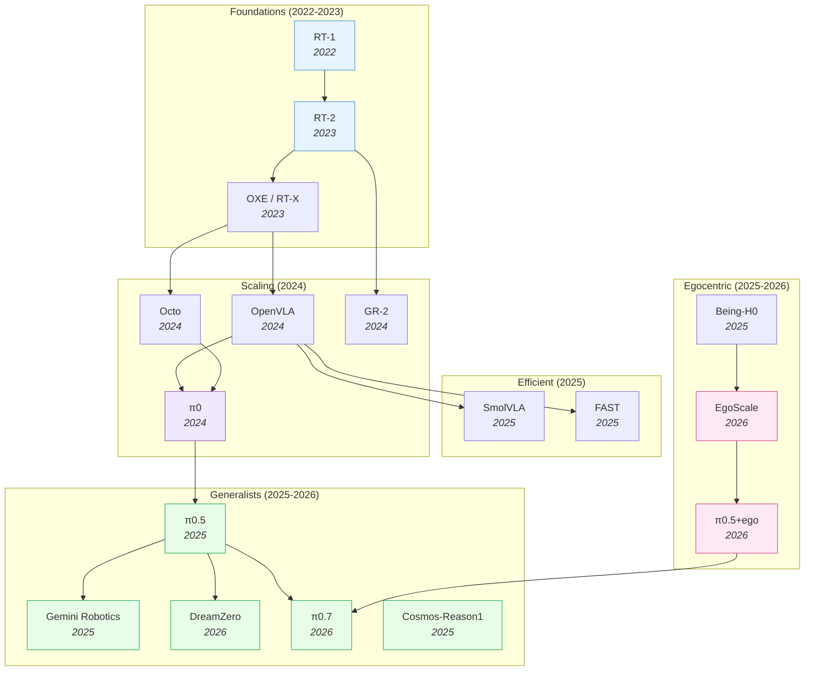

# Vision-Language-Action Models — Deep Dive

> [!abstract] Overview
> VLAs inherit robust multi-modal representations from pre-trained VLMs, giving robots semantic generalization that model-free and model-based approaches lack. From [[2212.06817|RT-1]]'s proof-of-concept (2022) to [[2504.16054|π0.5]]'s open-world household deployment (2025), VLAs have evolved from single-task imitation to general-purpose robot policies. This note maps the full VLA landscape: design principles, efficiency frontiers, spatial reasoning, world-model augmentation, RL post-training, multi-sensor integration, and failure modes.

## Evolution Graph

From Transformer-as-policy to flow-matching generalists — each step solved a specific bottleneck.

The field evolved through three phases: **proving the paradigm** (2022-2023), **scaling and opening** (2024), and **specialization** (2025-2026) — splitting into generalist, efficient, world-model-augmented, and egocentric-pretrained branches.

| Year | Model | Key Innovation | Bottleneck Solved |
|------|-------|----------------|-------------------|
| 2022 | [[2212.06817\|RT-1]] | Transformer on 130K real demos, 700 tasks | Proved Transformers work for robot control |
| 2023 | [[2307.15818\|RT-2]] | Fine-tuned PaLI-X (55B) VLM as policy | Web-scale knowledge transfers to robots |
| 2023 | [[2310.08864\|OXE]] | 1M+ trajectories from 22 robot types | Cross-embodiment positive transfer |
| 2024 | [[2405.12213\|Octo]] | Modular generalist policy | First open-source generalist robot policy |
| 2024 | [[2406.09246\|OpenVLA]] | Open-source 7B VLA | Democratized VLA research |
| 2024 | [[2410.06158\|GR-2]] | Web-scale video pre-training for actions | Video knowledge → robot manipulation |
| 2024 | [[2410.24164\|π0]] | Flow matching action expert + VLM | Continuous actions + dexterous manipulation |
| 2025 | [[2504.16054\|π0.5]] | Co-training on heterogeneous embodiments | Open-world generalization to unseen homes |
| 2025 | [[2503.20020\|Gemini Robotics]] | Gemini 2.0 extended to physical robots | Industrial-scale VLA |
| 2025 | [[2501.09747\|FAST]] | DCT+Huffman action compression | 5x faster VLA inference |
| 2025 | [[2506.01844\|SmolVLA]] | 450M param VLA | 7x less memory, 40% faster training |
| 2025 | [[2503.15558\|Cosmos-Reason1]] | Physical common-sense + embodied reasoning at WAM scale | Bridges physics priors and reasoning |
| 2025 | [[2507.15597\|Being-H0]] | VLA pretraining from large-scale human videos | Physical instruction tuning from human hands |
| 2026 | [[2602.15922\|DreamZero]] | Joint video + action prediction (14B WAM) | Zero-shot robot policies |
| 2026 | [[2602.16710\|EgoScale]] | 20,854-hour log-linear scaling law on egocentric data | Egocentric-data scaling laws |
| 2026 | [[2604.15483\|π0.7]] | Steerable generalist with emergent capabilities | Steerable open-world deployment |
| 2026 | [[2604.20100\|JoyAI-RA]] | Foundation model for robotic autonomy | Robust autonomy across embodiments |
| 2026 | [[2512.22414\|π0.5 + ego]] | Human→robot transfer via co-trained egocentric pretraining | Human-to-robot transfer emergence |

> [!tip] Three Evolutionary Phases
> **Phase 1 — Proof of concept** (2022-2023): [[2212.06817|RT-1]] proved Transformers work, [[2307.15818|RT-2]] showed VLM knowledge transfers, [[2310.08864|OXE]] built the cross-embodiment data foundation. **Phase 2 — Democratization** (2024): [[2406.09246|OpenVLA]] and [[2405.12213|Octo]] opened weights/code, [[2410.24164|π0]] introduced flow matching for continuous control. **Phase 3 — Specialization** (2025+): The field split — generalists scaled up ([[2504.16054|π0.5]] → [[2604.15483|π0.7]], Gemini, [[2604.20100|JoyAI-RA]]), efficient variants scaled down ([[2501.09747|FAST]], [[2506.01844|SmolVLA]]), WAMs added world prediction ([[2602.15922|DreamZero]]), and egocentric pretraining emerged as a fourth branch ([[2507.15597|Being-H0]], [[2602.16710|EgoScale]], [[2504.16054|π0.5]]+ego). See [[09_Egocentric-Pretraining-and-Human-Video#3. Scaling Laws for Egocentric Pretraining]] for the egocentric scaling story and [[08_VLA-Reasoning-and-CoT#1. The Four Reasoning Insertion Slots]] for reasoning-augmented variants.

---

## Part A — Design Space & Architectural Axes

*Foundations + the four axes along which VLAs vary: efficiency, spatial grounding, reasoning, world-model integration.*

### 1. Design-Space Principles

Based on [[2412.14058|RoboVLMs]]' 600+ experiments — the most systematic VLA design-space study to date.

> [!success] Ideal VLA Recipe (from [[2412.14058|RoboVLMs]])
> ==KosMos/[[2407.07726|PaliGemma]] backbone== + ==Policy Head fusion== + ==Continuous actions== + ==MoE== + ==Post-training on in-domain data==

#### Backbone Selection

| Category | Models | Finding |
|----------|--------|---------|
| ==Encoder-Decoder== | Flamingo family | Outperformed by decoder-only |
| ==Decoder-Only== | LLaVA, Qwen-VL, MoonDream, [[2407.07726\|PaliGemma]], KosMos | KosMos and [[2407.07726\|PaliGemma]] are distinctly superior |

**Why these two win**: These two architectures underwent the most extensive ==vision-language pre-training== on large-scale datasets (KosMos: 1.8B image-text pairs; [[2407.07726|PaliGemma]]: WebLI-filtered). This creates stronger alignment between visual and linguistic features — critical for understanding complex spatial instructions like "pick up the red cup to the left of the blue bowl." ==Encoder-decoder== architectures (Flamingo) underperform because they split visual and language processing into separate streams that only interact through ==cross-attention==, while ==decoder-only== models (LLaVA) process both modalities in a unified sequence but lack the scale of pre-training that KosMos and [[2407.07726|PaliGemma]] received.

#### Architecture Axes

**Action Space**: ==Continuous== (recommended) — avoids compounding ==discretization errors== that plague tokenized approaches. When you discretize a 7-DoF arm into 256 bins per dimension, you get $256^7 \approx 72$ quadrillion possible actions — most of which are physically impossible. [[2510.13054|VLA-0]] showed that even representing actions as plain text numbers works, because the VLM's tokenizer already handles numerical sequences — no custom action head needed. ==Flow matching== ([[2410.24164|π0]]) goes further: it models the action distribution as a continuous flow, enabling smooth, multi-modal action generation that captures the full diversity of valid solutions rather than collapsing to a single mode. [[2605.04678|Pixels-to-Tokens VLA]] systematically compares latent-action supervision strategies on Qwen3-VL-2B and finds the opposite for *learned* tokens: discrete latent-action token supervision (LA-Tok) beats continuous regression by **+2.2-2.7%** average, with image-based latents helping long-horizon [[2306.03310|LIBERO]]-Long (+8.4-10.8 pp) and action-based latents helping motorically complex [[2506.18088|RoboTwin 2.0]] (+17.5%) — discretization hurts when applied to *raw* joint angles, but helps when applied to a learned latent-action codebook.

**History Fusion**: ==Policy Head== (best balance) — VLM provides per-step features; separate head fuses history. [[2506.19816|CronusVLA]] extends this to multi-frame observations for temporal robustness. For truly long-horizon tasks requiring memory over minutes, [[2603.03596|MEM]] factorizes memory into ==dense short-term visual== (space-time separable attention over seconds) + ==compressed long-term language== (LLM summaries), enabling tasks requiring up to 15 minutes of memory. [[2603.12942|ReMem-VLA]] takes a different approach via ==dual-level recurrent queries== (frame-level EMA + chunk-level EMA) with gradient-free updates, hitting **94.5%** on memory-dependent simulation tasks.

**Training Loss**: ==Flow Matching== and ==MSE+BCE== achieve similar results. [[2602.18224|SimVLA]] confirmed this with a streamlined 0.5B model achieving 98.6% on [[2306.03310|LIBERO]].

#### Data Strategy

| Strategy | Impact |
|----------|--------|
| **In-domain only** | Best for task-specific performance |
| **Cross-embodiment ([[2310.08864\|OXE]])** | Improves few-shot learning (+17.2% on CALVIN few-shot) |
| **==Post-training==** ([[2310.08864\|OXE]] → in-domain fine-tune) | Best overall — highest gains for high-frequency skills |

[[2602.18532|VLANeXt]] distills [[2412.14058|RoboVLMs]]'s design-space lessons into 12 empirically-validated "recipes" — expressive policy modules with meta queries, action chunking, continuous-action objectives (flow matching), strong VLM backbones with soft VLM-policy connections, multi-view inputs, VLM-integrated proprioception, and an auxiliary frequency-domain loss. The resulting 2.5B-parameter [[2602.18532|VLANeXt]] achieves **80.1%** average on [[2510.13626|LIBERO-Plus]], **+10pp** over OpenVLA-OFT (7B). One useful negative finding: temporal observation history is often *not* beneficial, and world modeling is effective but computationally expensive — informing the §5 efficiency arguments below.

**Design-Space — Decision Matrix**

| Design axis | Recommendation (from [[2412.14058\|RoboVLMs]] / [[2602.18532\|VLANeXt]]) |
|---|---|
| Backbone family | Decoder-only KosMos / [[2407.07726\|PaliGemma]] (most VL pre-training → best instruction grounding) |
| Action space | ==Continuous== (avoids discretization errors); [[2410.24164\|π0]] flow matching for multi-modal actions |
| History fusion | ==Policy Head== (VLM features + separate fusion head); add memory ([[2603.03596\|MEM]], [[2603.12942\|ReMem-VLA]]) for >minute horizons |
| Training loss | Flow Matching ≈ MSE+BCE ([[2602.18224\|SimVLA]] confirms parity at 0.5B / 98.6% LIBERO) |
| Data strategy | ==Post-training== (cross-embodiment [[2310.08864\|OXE]] → in-domain fine-tune) beats either alone |
| Minimal-complexity baseline | [[2510.13054\|VLA-0]] (actions-as-text on an unmodified VLM — no custom head) |

> [!star] Key Papers
> - [[2412.14058|RoboVLMs]] — The 600+-experiment design-space study that anchors every recommendation in this section
> - [[2602.18532|VLANeXt]] — Distills the design space into 12 validated recipes; 2.5B model beats 7B OpenVLA-OFT on [[2510.13626|LIBERO-Plus]]
> - [[2410.24164|π0]] — Flow-matching action head; the reference continuous-action generator
> - [[2510.13054|VLA-0]] — The minimalist counter-proof: actions-as-text on an unmodified VLM is competitive
> - [[2602.18224|SimVLA]] — Streamlined 0.5B model at 98.6% LIBERO; evidence that loss-function choice is second-order

> [!tip] The [[2510.13054|VLA-0]] Surprise
> [[2510.13054|VLA-0]] showed you don't need custom action heads, special tokenizers, or architectural changes at all — just fine-tune an unmodified VLM with actions as text. Sometimes the simplest approach wins.

---

### 2. Efficient & Lightweight VLAs

Full-size VLAs (7B+) are impractical for real-time robot control because every step requires a forward pass through a multi-billion-parameter VLM. The efficiency frontier resolves this tension via four orthogonal axes — compress the action stream, distill the model, reduce the architecture, or eliminate the iterative denoising step entirely. Each strategy targets a different cost center, and they compose: e.g. a distilled small backbone with action-token compression and one-step flow stacks the savings.

#### 2.1 Compression & Tokenization

Reduce the *information* the VLA processes — action streams are highly redundant across timesteps, so frequency-domain or learned compression yields near-lossless speedups.

- **[[2501.09747|FAST]]** — DCT+Huffman action tokenization; **5x** faster inference. The foundational efficiency-via-tokenization paper: adjacent action timesteps are highly correlated, so frequency-domain compression is nearly lossless.
- **[[2604.03191|Compression Gap]]** — ==Information-theoretic data-processing-inequality framework== isolates fixed discrete codebooks as the binding bottleneck; Diffusion Policy gains **+26.0pp** swapping ResNet-18 → SigLIP vs only **+10.4pp** for OAT discrete tokenization; OAT codebook 1000→1920 reshapes encoder sensitivity (+3.6 → +15.2). Negative result motivating the one-step flow direction below.
- **[[2604.05323|VLA-InfoEntropy]]** — training-free vision-token selection via attention-entropy ranking; **1.53x** speedup with no retraining.

#### 2.2 Distillation & Small Backbones

Compress the *model* — teacher's knowledge compresses because most VLA capacity models language understanding, not motor control.

- **[[2506.01844|SmolVLA]]** (450M) — **7x** less memory, **40%** faster training than [[2406.09246|OpenVLA]]; distills a 7B VLA into 450M params with only ~2% accuracy loss. The canonical small-VLA baseline.
- **[[2509.09372|VLA-Adapter]]** (0.5B) — ==Bridge Attention== with ==learnable injection ratio== fuses all-layer raw VLM features + all-layer ActionQuery; **97.3%** LIBERO without robotic pre-training, **219.2 Hz** inference (**3×** faster than OpenVLA-OFT) at **36.5 ms** latency; **4.42** avg task length on CALVIN ABC→D zero-shot.
- **[[2409.12514|TinyVLA]]** — Compact pre-trained VLM (70M–1.4B) + ==LoRA fine-tuning== + ==Diffusion Policy action head==; **94.0%** real-world single-arm (vs **68.3%** OpenVLA), **44.5%** bimanual (vs **0%** OpenVLA), **20×** faster (**14 ms** vs **292 ms**) at **5.5×** fewer parameters — the early small-VLA recipe.

#### 2.3 Architecture Reduction

Replace expensive components with minimal ones — complex action decoders are unnecessary when the VLM backbone is strong enough.

- **[[2605.06175|VLA-GSE]]** — SVD-initialized generalized+specialized expert PEFT; **81.2%** zero-shot on [[2510.13626|LIBERO-Plus]], beating full fine-tuning by **+6.3pp** while preserving multimodal understanding.
- **[[2604.11757|StarVLA-alpha]]** — minimal MLP action head on strong VLM backbone; **98.8%** [[2306.03310|LIBERO]]. Proves complex action decoders are unnecessary.
- **[[2604.05672|A1]]** (7B) — adaptive truncated VLM + flow-matching head; **72.3%** latency reduction via early-exit.
- **[[2510.13054|VLA-0]]** — Unmodified ==Qwen-VL-2.5-3B==: actions as ==space-separated numerical text strings== via native text generation + ==masked action augmentation== + ==action ensembling==; **94.7%** LIBERO (rank **1.0** of non-pretrained), surpasses SmolVLA by **+12.5pp** on real SO-100 robot — the simplest-possible recipe.

#### 2.4 One-Step & Parallel Decoding

Eliminate the iterative denoising / autoregressive bottleneck — the *amount* of refinement should be learned or skipped, not fixed.

- **[[2605.09948|LoopVLA]]** (1.2B) — recurrent Loop Block + learned sufficiency head; **−45%** params, **1.7x** throughput while maintaining [[2306.03310|LIBERO]] performance. Dynamically allocates depth per state.
- **[[2605.08799|ElasticFlow]]** — one-step ==average velocity field== + ==elastic time abstraction==; **14ms** inference at **71Hz**, **98.5%** [[2306.03310|LIBERO]], **5x** faster than [[2303.04137|Diffusion Policy]] with smoother trajectories (Jerk **1.1×10⁻³** vs **3.2×10⁻³**).
- **[[2604.05656|SnapFlow]]** — one-step flow distillation; **3.3x** faster [[2504.16054|π0.5]] at **83ms** with minimal quality loss.
- **[[2604.04161|AAC]]** — adaptive action chunk size via predictive uncertainty; **+15%** real-world success.
- **[[2604.02965|SV-VLA]]** — speculative verification: open-loop plan + closed-loop verify; **2.17x** speedup.
- **[[2511.14148|AsyncVLA]]** — ==Asynchronous Flow Matching (AFM)== with ==confidence rater== that masks low-confidence action tokens for regeneration + ==unified SFM/AFM training== + ==KV-cache reuse==; **97.4%** LIBERO, **70.8%** WidowX, **74.9%** Google Robot visual matching.
- **[[2503.02310|PD-VLA]]** — training-free parallel decoding via Jacobi fixed-point iteration; **2.52x** speedup.

**Efficient VLA — Decision Matrix**

| Need | Recommendation |
|---|---|
| Sub-20ms real-time control | [[2605.08799\|ElasticFlow]] (one-step flow at **14ms/71Hz**) |
| Smallest deployable VLA | [[2506.01844\|SmolVLA]] (450M) or [[2509.09372\|VLA-Adapter]] (0.5B) |
| PEFT preserving foundational capabilities | [[2605.06175\|VLA-GSE]] (**+6.3pp** over FFT) |
| Zero architectural changes | [[2510.13054\|VLA-0]] (actions as text) |
| Compress an existing flow-matching VLA | [[2604.05656\|SnapFlow]] (**3.3x** faster [[2504.16054\|π0.5]]) |
| Training-free token reduction | [[2604.05323\|VLA-InfoEntropy]] (**1.53x** speedup) |
| Dynamic compute allocation | [[2605.09948\|LoopVLA]] (**−45%** params, **1.7x** throughput) |
| Action-stream compression | [[2501.09747\|FAST]] (DCT+Huffman, **5x** faster) |

> [!star] Key Papers
> - [[2605.08799|ElasticFlow]] — One-step physics-consistent policy via average velocity field; **14ms** inference at **71Hz**, **98.5%** [[2306.03310|LIBERO]], **5x** faster than [[2303.04137|Diffusion Policy]]
> - [[2501.09747|FAST]] — DCT+Huffman action compression for **5x** faster VLA inference; the foundational efficiency-via-tokenization paper
> - [[2506.01844|SmolVLA]] — 450M-param distilled VLA; **7x** less memory, **40%** faster training; the canonical small-VLA baseline

> [!tip] When Smaller Is Enough
> For structured environments with known objects, [[2506.01844|SmolVLA]] (450M) matches larger models. For open-world tasks with novel objects, you still need 3B+. The sweet spot: use [[2501.09747|FAST]] tokenization on a mid-size model, or one-step flow ([[2605.08799|ElasticFlow]]) when sub-20ms control matters. Cross-reference [[04_WAM#6. Efficient & Action-Centered WAMs]] for the WAM-side efficiency recipe (training-time video, test-time speed).

---

### 3. Spatial & 3D-Aware VLAs

Standard VLAs process 2D images and lack explicit 3D understanding — but real-world manipulation requires reasoning about depth, contact, and viewpoint-invariant geometry. The cluster splits along three orthogonal strategies for injecting 3D awareness: add explicit depth/point-cloud streams (architectural complexity), supervise implicit 3D perception during training (deploy-time efficiency), or align the encoder with a 3D-pretrained teacher (zero inference overhead). Each strategy trades a different cost — explicit approaches generalize best to novel viewpoints, implicit approaches deploy cheapest, representation alignment is the recent compromise.

#### 3.1 Explicit 3D Integration

Add depth sensors, point clouds, or 3D coordinate embeddings as additional input modalities. Strongest generalization to novel viewpoints because the geometry is *actually present* — at the cost of architectural complexity and sensor requirements.

- **[[2508.09071|GeoVLA]]** — ==dual-path== architecture: frozen VLM for 2D vision-language in parallel with a dedicated ==Point Embedding Network== (PEN) using an ==end-effector token== as spatial anchor; ==3D-enhanced Action Expert== (3DAE) Diffusion Transformer with static-routed MoE fuses both streams without disrupting VLM alignment. **97.7%** [[2306.03310|LIBERO]], **77%** ManiSkill2; robust to viewpoint/scale shifts.
- **[[2605.11832|AML-VLA]]** — ==Geometry-Guided Gated Transformer== (G³T) fusing synthesized multi-view + monocular geometric priors + Action Manifold Learning. **98.6%** [[2306.03310|LIBERO]], **85.7%** [[2510.13626|LIBERO-Plus]], **86.06%** [[2506.18088|RoboTwin 2.0]] real bimanual.
- **[[2604.12908|VGA]]** — ==VGGT== 3D world model backbone + Progressive Volumetric Modulation; vision-to-geometry mapping; **98.1%** [[2306.03310|LIBERO]] with **+6%** OOD.
- **[[2603.25399|LaMP]]** — 3D scene flow as latent motion prior; physical foresight via dense 3D flow; **98.3%** [[2306.03310|LIBERO]].
- **[[2603.24393|3D-MIX]]** — VGGT-based 3D feature plug-and-play module; **+12.51%** OOD gains via adaptive gated 3D fusion.
- **[[2506.22242|4D-VLA]]** — ==3D coordinate spatial vision tokens== + ==adaptive Memory Bank Sampling== with learnable temporal positional encodings on InternVL-4B; **+12.1pp** avg over OpenVLA on LIBERO (**+25.4pp** on LONG); **81.0%** in-view + **73.8%** cross-view on MV-Bench; **85.63%** real Franka (vs **27.70%** OpenVLA).
- **[[2501.15830|SpatialVLA]]** — ==Ego3D Position Encoding== injects depth + egocentric 3D pixel positions + ==Adaptive Action Grids== using parameterized Gaussians for non-uniform spatial tokens + ==two-stage train== on **1.1M** demos; **71.9%/68.8%** SimplerEnv Google Robot, **78.1%** LIBERO, **+12pp** over OpenVLA in instruction following — the foundational explicit-3D baseline for VLAs.
- **[[2602.11236|ABot-M0]]** — ==Action Manifold Learning (AML)== predicts clean actions on a ==low-dimensional manifold== + ==UniACT-dataset== harmonizing **6M+** trajectories + ==modular VGGT/Qwen-Image-Edit geometric priors== via cross-attention; **98.6%** LIBERO, **80.5%** LIBERO-Plus (vs **42.9%** UniVLA), **58.3%** RoboCasa GR1 (vs **47.6%** GR00T-N1.6).

#### 3.2 Implicit 3D Reasoning

Achieve spatial awareness without explicit depth input — supervise 3D understanding at training time or overlay 2D cues. Cheapest to deploy but can fail when the camera moves significantly from training distribution.

- **[[2510.12276|Spatial Forcing]]** — ==Implicit cosine-similarity alignment== of VLA causal-attention layer to ==VGGT 3D foundation model== features (24th layer); **98.5%** LIBERO at **3.8×** training + **5.9×** data efficiency, **zero inference overhead**.
- **[[2508.07917|MolmoAct]]** — ==Three-stage autoregressive pipeline==: depth-aware perception tokens → visual reasoning traces → low-level actions with ==byte-level BPE action tokenization==; **86.6%** LIBERO, **+10pp** real-world single-arm + **+22.7pp** bimanual over π0-FAST, **75%** visual-trace steering SR (**+33pp** over language steering).
- **[[2412.10345|TraceVLA]]** — ==Visual trace prompting== overlays ==Co-Tracker== multi-point historical trajectories on current observation; **47.7%** SimplerEnv (+7.5pp over OpenVLA), **74.8%** LIBERO, **6/10** on unseen "Pickplace Banana" where OpenVLA fails; **~0.03 s/step** inference overhead.

#### 3.3 Representation Alignment

Align the student VLA's visual encoder with a frozen 3D-pretrained teacher — inject spatial awareness *at the encoder* before linguistic entanglement, with zero inference overhead. The newest direction, fastest path to deployment.

- **[[2605.10485|VEGA]]** — aligns student [[2304.07193|DINOv2]] visual encoder with frozen ==DINOv2-FiT3D== teacher (fine-tuned on multi-view-consistent 3D Gaussian Splatting) via patch-cosine loss; lightweight LayerNorm+MLP projector. **[[2506.18088|RoboTwin 2.0]] SOTA** (Easy **67.5%**, Hard **30.7%**, **+3.3%** over OFT+SF) with **zero inference overhead**.

**Spatial VLA — Decision Matrix**

| Need | Recommendation |
|---|---|
| Novel-viewpoint generalization | Explicit: [[2508.09071\|GeoVLA]] or [[2605.11832\|AML-VLA]] |
| Deploy without depth sensors | Implicit: [[2510.12276\|Spatial Forcing]] or [[2412.10345\|TraceVLA]] |
| Zero inference overhead, 2D deployment | Representation alignment: [[2605.10485\|VEGA]] |
| Bimanual real-world manipulation | [[2605.11832\|AML-VLA]] (**86.06%** [[2506.18088\|RoboTwin 2.0]]) |
| 3D plug-and-play for existing VLA | [[2603.24393\|3D-MIX]] (**+12.51%** OOD) |
| Foundational adaptive 3D representation | [[2501.15830\|SpatialVLA]] |
| 4D temporal-spatial context | [[2506.22242\|4D-VLA]] |

> [!star] Key Papers
> - [[2508.09071|GeoVLA]] — Dual-path 2D-VLM + 3D point-cloud PEN with end-effector anchor + MoE 3DAE; **97.7%** [[2306.03310|LIBERO]]; the cleanest explicit-3D architecture
> - [[2605.10485|VEGA]] — DINOv2-FiT3D teacher alignment via patch-cosine loss; **[[2506.18088|RoboTwin 2.0]] SOTA** with **zero inference overhead**; representation alignment beats explicit 3D fusion
> - [[2501.15830|SpatialVLA]] — Foundational adaptive 3D spatial representations for VLAs; the canonical explicit-3D baseline

> [!tip] 3D Without 3D Sensors
> The field is split three ways: explicit ([[2501.15830|SpatialVLA]], [[2506.22242|4D-VLA]], [[2508.09071|GeoVLA]]) generalizes best to novel viewpoints but requires depth sensors; implicit ([[2510.12276|Spatial Forcing]], [[2412.10345|TraceVLA]]) deploys cheapest but degrades under camera drift; representation alignment ([[2605.10485|VEGA]]) is the 2026 compromise — 3D priors inherited at training-time, 2D-only pipeline at deployment. Cross-reference [[05_Latent-World-Models#2. JEPA Evolution: Visual-Only → Dense → Vision-Language → Vision-Language-Action]] for the JEPA-side 3D-aware predictors and [[02_Dataset-Benchmark-Environment#9. Spatial Reasoning & 3D Benchmarks]] for the 3D-grounded benchmarks that test these claims.

---

### 4. Reasoning & Planning-Augmented VLAs

Pure imitation is brittle on long-horizon tasks with novel compositions or sparse decision points. The reasoning-augmented cluster adds test-time deliberation to improve robustness, but the *where* of the reasoning insertion matters as much as the *whether*. Four insertion strategies have emerged: reason in the language/visual space before action generation (chain-of-thought), simulate forward via a world model (online MCTS), generate-then-verify (draft-and-verify), or invert the stack entirely so a VLM agent calls the VLA as a tool. See [[08_VLA-Reasoning-and-CoT#1. The Four Reasoning Insertion Slots]] for the full taxonomy of insertion points.

#### 4.1 Action & Visual Chain-of-Thought

Reason in the *action* or *visual* space before committing to the final trajectory. Reasoning is grounded in physical coordinates or image goals, not in language tokens.

- **[[2601.11404|ACoT-VLA]]** — ==Action Chain-of-Thought==: generates intermediate action waypoints as reasoning steps before final trajectory; reasoning grounded in physical coordinates, not language.
- **[[2503.22020|CoT-VLA]]** — ==visual CoT== generates intermediate visual goal frames; sub-goals act as reasoning steps.
- **[[2604.22709|Abstract-CoT]]** — ==Discrete abstract token vocabulary== + ==policy-iteration warm-up + GRPO RL== with attention-mask information bottleneck; **up to 12× fewer** reasoning tokens at comparable/superior performance on MATH, AlpacaEval, HotpotQA across Qwen3 + Granite.
- **[[2604.21396|VG-CoT]]** — ==Visual-evidence-grounded rationales== with bounding-box coords from YOLO+PaddleOCR+Grounding DINO+GPT-4o + ==3-dim eval (Rationale Quality + Answer Accuracy + Reasoning-Answer Alignment)==; LLaVA-1.5-7B RQ **72.2 → 83.4**, AA **48.7 → 62.5** after fine-tuning.
- **[[2509.25681|dVLA]]** — Unified discrete ==diffusion== over vision/language/action + ==multimodal CoT== generating visual subgoals + textual reasoning + actions; **96.4%** LIBERO + **65%** real-world (CoT adds **+6.6pp** sim, **+12.5pp** real); ==prefix attention + KV cache== for **~2×** speedup (1.3→2.9 Hz).
- **[[2503.11089|EmbodiedVSR]]** — ==dynamic scene graph== + physics-constrained CoT; **+18.4%** Arm Feasibility, **80%** real-world reassembly success.

#### 4.2 Online MCTS & World-Model Verification

Use the world model as a simulator at inference time: sample action candidates, simulate forward, score outcomes, select the best. Highest robustness on novel tasks at **3-5x** latency cost.

- **[[2509.22643|VLA-Reasoner]]** — ==Plug-in online MCTS== with learned world model + ==KDE action sampling== + ==vision-based value network==; **+19pp** absolute on OpenVLA real-world (**22% → 41%**) + **+10pp** on π0-FAST (**64% → 74%**); KDE (**91.5%**) beats Gaussian sampling (**85.0%**).
- **[[2507.16815|ThinkAct]]** — ==Dual-system MLLM + action model== with ==reinforced visual latent planning== via ==action-aligned rewards== (goal completion + trajectory consistency); **+15.5pp** SimplerEnv Google-VM, **84.4%** LIBERO, **48.2%** EgoPlan-Bench2, RoboVQA BLEU **59.8** + emergent few-shot adaptation + self-correction.
- **[[2509.25852|REVER]]** — ==LEAP dataset== from kinesthetic demos → Vision-Instruction-Plan triplets + ==verifiable reward (format + semantic similarity)== with GRPO; RoboFarseer-**7B** scores **59.3%** LEAP-L MCQ + **76%** open-ended planning (2× Gemini-2.5-Pro); **90%** real-world "Bring food & drinks" (+60pp over low-level only).
- **[[2506.00123|VeBrain]]** — Reformulates control as ==2D keypoint detection + embodied skill recognition== + ==Robotic Adapter== (Point Tracker / Movement Controller / Skill Executor / Dynamic Takeover) + ==VeBrain-600k with CoT==; **+31.5pp** avg over other unified frameworks, **+5.6pp** MMVet, **+5.2 CIDEr** ScanQAval, **+50pp** on Complex Transport.

#### 4.3 Draft-and-Verify

Generate a fast open-loop action draft, then verify it with a closed-loop check. The middle-ground latency profile between pure imitation and full MCTS.

- **[[2603.18091|ADV]]** — Action Draft-and-Verify: ==diffusion draft== + ==VLM verify==; self-verifying framework; **+19.7%** real-world success.
- **[[2604.18486|OneVL]]** — ==Dual-modal latent supervision==: visual auxiliary decoder predicts future frames (world model) + language auxiliary decoder reconstructs CoT text + ==prefill inference== for answer-only latency; **88.84 PDM-score** on NAVSIM (+2.64 over prior 8B), latency **4.46s** vs **6.58s** AR CoT — first latent CoT to outperform explicit AR CoT.
- **[[2604.17800|ReFineVLA]]** — Teacher-guided ==natural-language rationale annotations== (observation → situation analysis → spatial reasoning → task planning) via Gemini 2.0 + ==selective transfer fine-tuning== + ==multi-objective BC + LM loss==; **+5.0pp** WidowX avg (+21.4 on Spoon-on-Towel), **+2.3/+3.5pp** Google Robot, **+9.6pp** Move-Near.
- **[[2505.03500|TLI]]** — Text Latent Interpolation for skill recombination; extrapolation **9% → 83%** on OOD tasks.

#### 4.4 VLA-as-Tool Inversion

Invert the typical stack entirely — VLM agent at the top, VLAs as bounded callable executors below. Decouples high-level planning from low-level execution; redistributes the long-horizon dual burden across components.

- **[[2605.13119|VLAs-as-Tools]]** — formalizes VLAs as ==bounded, callable executors== invoked by a high-level VLM agent. ==Bidirectional VLA tool-family interface== with discrete invocation messages + continuous progress feedback for event-triggered replanning; ==Tool-Aligned Post-Training (TAPT)== adapts base VLAs via tool-family residual parameterization. **+35.5pp** for OpenVLA-OFT on RoboTwin, **+34.6pp** Faithful Rate, **+16.2pp** Non-biased Rate on LIBERO-CF-Long; VLM calls **109.5 → 1.988** per task (~**55x** reduction).

**Reasoning VLA — Decision Matrix**

| Need | Recommendation |
|---|---|
| Decouple planning from execution | [[2605.13119\|VLAs-as-Tools]] (**+35.5pp** RoboTwin, ~**55x** fewer VLM calls) |
| Long-horizon visual reasoning | [[2503.22020\|CoT-VLA]] or [[2604.22709\|Abstract-CoT]] |
| Novel-task generalization via simulation | [[2509.22643\|VLA-Reasoner]] (online MCTS) |
| Self-verification with latency budget | [[2603.18091\|ADV]] (draft-and-verify) |
| Skill recombination for OOD tasks | [[2505.03500\|TLI]] (extrapolation **9% → 83%**) |
| Physics-grounded scene reasoning | [[2503.11089\|EmbodiedVSR]] (**+18.4%** Arm Feasibility) |
| RL-trained reasoning over manipulation | [[2509.25852\|REVER]] or [[2507.16815\|ThinkAct]] |
| Reason in the action space | [[2601.11404\|ACoT-VLA]] |

> [!star] Key Architectural Inversion
> [[2605.13119|VLAs-as-Tools]] — Reframes VLAs as bounded callable tools rather than top-level policies; TAPT-trained tool-family with discrete invocation + continuous progress feedback decouples high-level VLM planning from low-level VLA execution; **+35.5pp** RoboTwin, **+34.6pp** instruction fidelity, ~**55x** reduction in VLM call frequency

> [!tip] When Reasoning Helps
> Reasoning adds latency, so it's not always worth it. Use it for: (1) long-horizon tasks with many decision points, (2) novel task compositions ([[2505.03500|TLI]]), (3) tasks requiring spatial inference. Skip it for fast pick-and-place where imitation suffices. Cross-reference [[08_VLA-Reasoning-and-CoT#1. The Four Reasoning Insertion Slots]] for the full insertion-point taxonomy and [[04_WAM#5. VLM-Integrated WAMs]] for VLM-integrated WAMs that fuse reasoning with dynamics prediction.

---

### 5. World-Model-Augmented VLAs

VLAs that incorporate learned dynamics models for planning, imagination, or co-training. The integration *style* defines the trade-off: the world model can be co-trained iteratively with the VLA, distilled into latent predictors, trained as a video-co-training auxiliary objective and stripped at deployment, used only as a rehearsal tool during post-training, or unified end-to-end with the policy under a shared backbone. See [[04_WAM#1. The Design Space]] for the full WAM taxonomy as standalone models; this section covers the *VLA-integration* angle.

#### 5.1 Iterative Co-Improvement

VLA and world model alternate training rounds — the WM generates synthetic data for the VLA, the VLA's improving actions give the WM harder scenarios. Each round improves both, but the WM is always one step behind the current policy.

- **[[2602.12063|VLAW]]** — ==Iterative co-improvement== of VLA + ==action-conditioned world model== with limited real rollouts (including failures) + ==VLM-reward-filtered synthetic trajectories==; **+39.2pp** absolute SR (**0.46 → 0.868**), WM FVD **225.13 → 64.12**, synthetic-data contribution **+11.6pp** — canonical mutual-improvement template.
- **[[2603.10448|DiT4DiT]]** — video DiT conditions action DiT via denoising features; joint video-action model; **98.6%** [[2306.03310|LIBERO]], **10x** sample efficiency.
- **[[2604.14732|WVA]]** — video generator + trajectory value + action decoder with ==MPPI latent optimization==; implicit planning via latent-space trajectory refinement; **98.1%** [[2306.03310|LIBERO]], **75.6%** real dual-arm.
- **[[2604.11135|AIM]]** — spatial value maps bridge video prediction to actions; intent-aware unified world-action model; **94%** RoboTwin.

#### 5.2 Latent World Model

Attach a JEPA-style or latent-diffusion predictor to the VLA backbone — predictions happen in embedding space (~10ms) rather than video space (~150ms). The speed-quality sweet spot.

- **[[2602.10098|VLA-JEPA]]** — ==JEPA-style latent world model== predicting future latent representations + ==leakage-free state prediction== + ==learnable state-transition + action tokens== on Qwen3-VL + flow-matching action head; **97.2%** LIBERO + **79.5%** LIBERO-Plus + **65.2%** SimplerEnv Google Robot at **~10 ms/step**.
- **[[2603.03195|CoWVLA]]** — structure-motion disentangled latent world model; ==chain-of-world reasoning== in latent motion space.
- **[[2603.29844|DIAL]]** — differentiable latent intent bottleneck; decoupled intent + action; **70.2%** RoboCasa GR1.
- **[[2505.15659|FLARE]]** — predicts future latent representations (not pixels) + diffusion policy; up to **+26%** over baselines; learns from action-free human videos.
- **[[2505.11528|LaDi-WM]]** — latent diffusion WM with [[2304.07193|DINOv2]] + SigLIP; ==imagination-guided iterative action refinement==; **68.7%** LIBERO-LONG with 10 demos (**+15.1%** over SOTA).
- **[[2604.28192|LaST-R1]]** — Continuous ==latent CoT== via DINOv3 embeddings + ==Latent-to-Action Policy Optimization (LAPO)== joint RL + ==adaptive latent CoT== with learnable stop token; **99.8%** avg LIBERO with **1-shot SFT** warm-up, **+44%** real-world avg, only **−8%** under unseen objects/backgrounds/lighting.
- **[[2604.17876|OFlow]]** — ==Shared semantic latent space== on DINOv2 + ==causally-constrained Diffusion Transformer with flow matching== for future-semantic-state prediction + ==K-means object-aware factorization== + ControlNet conditioning; **96.6%** LIBERO, **72.3%** LIBERO-Plus, **85.6%** MT50, **69%** real-world avg (**+18pp** GR00T-N1.5, **+28pp** π0) at **~30 Hz**.

#### 5.3 Video Co-Training

Train jointly with video-prediction objectives but strip the video head at deployment — WAM-level representations at VLA-level speed. The dominant 2026 efficient-WAM recipe.

- **[[2603.16666|Fast-WAM]]** — ==Mixture-of-Transformer== decouples video co-training (train) from future-imagination (inference); ==structured attention== prevents future-video leakage; **91.8%** RoboTwin + **97.6%** LIBERO at **190 ms** inference vs **810 ms** imagine-then-execute variants (**4× faster**).
- **[[2601.16163|Cosmos Policy]]** — Fine-tunes ==Cosmos-Predict2 latent video diffusion== as unified policy + world model + value function via ==latent-frame injection== (proprio + actions + states + multi-cam); SOTA **98.5%** LIBERO, **67.1%** RoboCasa, **93.6%** real ALOHA; model-based planning adds **+12.5pp** on hardest ALOHA tasks.
- **[[2604.06168|Action Images]]** — 7-DoF actions encoded as ==multi-view 2D Gaussian heatmap action images== of EE-position/up/normal + ==unified video-action joint training== with diverse masking; zero-shot **60%** RLBench reach-target + **45%** real-world close-drawer (vs **0–20%** baselines); PSNR **23.48** vs **20.83** TesserAct.
- **[[2511.07732|ViPRA]]** — motion-centric latent actions from videos + flow matching action head; learns control priors from actionless video; **69.8%** SIMPLER, **79%** LIBERO-Long, **22Hz** real-time.
- **[[2604.08168|ViVa]]** — ==Video diffusion Transformer== repurposed as value function jointly predicting scalar value + future proprioception via ==normalized episode-success labels==; **73%** real-world box-assembly SR (vs **58%** VLM-based value, **42–53%** imitation-only) + robust pants-folding novel-object generalization.
- **[[2604.19730|FASTER]]** — Models denoising as ==MDP== with ==noise-level critic (Q_dn)== for early filtering before full denoising; **8×** inference-FLOP reduction + **4.5×** training speedup + **1.7×** latency decrease; applied to **3.3B** VLA at **8×** less compute matching base performance.
- **[[2602.12099|GigaBrain-0.5M*]]** — world model predicts future states + values; ==RAMP== policy conditioned on dense predictions; **+30pts** over RL baselines on long-horizon manipulation; **51.67%** RoboChallenge.

#### 5.4 Rehearsal & Forecasting

Use the WM only during training or as a richer forecasting head — not as a runtime planner. The WM is a training tool, not a deployment component.

- **[[2509.24948|RehearseVLA]]** — ==World-model-based virtual simulator== with ==VGGT + CLIP geometry features== injected into U-Net diffusion + ==VLM-guided instant reflector== with continuous reward + dynamic task-completion termination; **79.6%** LIBERO with only **5 demos/task** (vs **74.85%** OpenVLA-OFT), real-world clean-table **20% → 30%**.
- **[[2507.04447|DreamVLA]]** — Forecasts compact ==dynamic regions + depth + semantic features== via ==block-wise structured attention + disentangled queries== + diffusion action head conditioned on world embedding; CALVIN avg length **4.44**, **92.6%** LIBERO, **76.7%** real-world (vs **50.8%** Diffusion Policy, **45.0%** Octo-Base).
- **[[2604.26848|STARRY]]** — ==Action-centric world model== jointly denoising spatial-temporal latents + action sequences + ==Geometry-Aware Selective Attention Modulation (GASAM)== biasing attention toward EE-relevant tokens; **93.82%** RoboTwin 2.0 Clean (+0.89pp over LingBot-VA), **70.8%** real bimanual (+31.7pp over π0.5 multi-step).
- **[[2604.27792|MotuBrain]]** — ==UniDiffuser three-stream Mixture-of-Transformers== over video+action+text + ==4-level data pyramid== + ==two-stage pretrain== + inference stack (DiT cache + FP8); **95.8%** RoboTwin 2.0 Clean / **96.1%** Random; **EWMScore 63.77** on WorldArena; **11 Hz** humanoid control with only **50–100** post-train trajectories.

#### 5.5 Unified VLA + WM

Single end-to-end architecture combining understanding, imagination, and action under a shared backbone or latent variable. The tightest integration — strongest semantic transfer at moderate latency.

- **[[2605.15298|PhysBrain]]** — ==dual-pathway VLA==: frozen general VLM pathway + trainable embodied pathway; egocentric-video physics commonsense pretraining. **+16.2pp** real-world single-object grasp, **+14.0pp** long-horizon; **80.2%** SimplerEnv-WidowX, **91.33%** SimplerEnv-GoogleRobot.
- **[[2605.15153|Pelican-Unified]]** — single-model unification of understanding + reasoning + imagination + action via shared ==latent variable z== + ==UFG diffusion transformer==; jointly generates future video + actions. **64.7** VLM avg, **93.5%** RoboTwin, **1st** WorldArena.
- **[[2604.26694|X-WAM]]** — unified 4D world action modeling with ==asynchronous denoising==; 4D unified WAM with async pipeline.
- **[[2506.19850|UniVLA]]** — All modalities as ==discrete tokens in 8.5B autoregressive Transformer== + ==two-stage train== (action-free video WM post-train → action-annotated fine-tune); SOTA on CALVIN, **95.5%** LIBERO avg, **94.0%** LIBERO-Long; WM pretrain enables CALVIN gains with only **10%** fine-tuning data.
- **[[2511.17502|RynnVLA-002]]** — ==Chameleon-initialized autoregressive== unified VLA+WM + ==attention masking for action gen== to mitigate error propagation + continuous ==Action Transformer head== with parallel learnable queries; **97.4%** LIBERO continuous-action, **>80%** real-world cluttered "Place the block"; integrated WM lifts real-world SR by **+50%** in ablations.

**WM-Augmented VLA — Decision Matrix**

| Need | Recommendation |
|---|---|
| Fast latent prediction (~10ms) | [[2602.10098\|VLA-JEPA]] or [[2603.03195\|CoWVLA]] |
| Production deployment (no test-time imagination) | [[2603.16666\|Fast-WAM]] or [[2601.16163\|Cosmos Policy]] |
| Iterative WM ↔ VLA co-improvement | [[2602.12063\|VLAW]] or [[2603.10448\|DiT4DiT]] |
| Unified end-to-end VLA + WM | [[2605.15153\|Pelican-Unified]] (**93.5%** RoboTwin) or [[2605.15298\|PhysBrain]] |
| Learn from action-free human video | [[2505.15659\|FLARE]] or [[2511.07732\|ViPRA]] |
| Rehearsal-only WM (training tool) | [[2509.24948\|RehearseVLA]] |
| Comprehensive forecasting auxiliary supervision | [[2507.04447\|DreamVLA]] (depth + semantics + dynamics) |
| RAMP-style dense WM conditioning | [[2602.12099\|GigaBrain-0.5M*]] (**+30pts** over RL baselines) |
| Latent diffusion WM for few-shot manipulation | [[2505.11528\|LaDi-WM]] (**+15.1%** over SOTA at 10 demos) |

> [!star] Key Papers
> - [[2602.10098|VLA-JEPA]] — Latent JEPA predictor attached to VLA; **~10ms** prediction in embedding space vs **~150ms** in video space; the right speed-quality trade-off
> - [[2603.16666|Fast-WAM]] — Video co-training without test-time imagination; WAM-level representations at VLA-level speed
> - [[2605.15153|Pelican-Unified]] — Single-model unification via shared latent z + UFG diffusion transformer; **93.5%** RoboTwin, **1st** WorldArena; the canonical unified architecture
> - [[2602.15922|DreamZero]] — Joint video + action prediction (14B WAM); the landmark zero-shot generalization paper for WAM-augmented VLAs

> [!tip] The Speed-Quality Trade-off
> WAM-augmented VLAs are more robust (spatiotemporal priors from video pretraining) but **4.8x** slower than pure VLAs ([[2603.22078|WAM vs VLA Robustness]]). [[2603.16666|Fast-WAM]] shows you can get most of the benefit without test-time imagination — use video co-training, not video generation. Cross-reference [[04_WAM#2. VideoGen WAMs]] for the full WAM taxonomy and [[05_Latent-World-Models#2. JEPA Evolution: Visual-Only → Dense → Vision-Language → Vision-Language-Action]] for the JEPA lineage these latent-WM-VLAs descend from.

---

## Part B — Training, Specialization & Continual Learning

*Post-training recipes, force/humanoid specialization, and continual / self-evolving setups.*

### 6. RL Post-Training for VLAs

Imitation learning alone leaves performance on the table — SFT only reproduces demonstrated behaviors. RL pushes beyond the demonstration ceiling by optimizing for task success, but the *risk* of RL is degrading the VLM backbone's visual understanding. The cluster organizes around three resolutions of this tension: stabilize SFT itself to prevent collapse, engineer better reward signals, or apply parameter-efficient updates that keep the VLM backbone frozen.

#### 6.1 Conservative SFT & Stable Fine-Tuning

Stabilize the SFT side of the recipe so RL doesn't start from a damaged policy. Bound parameter disruption to preserve foundational capabilities.

- **[[2605.08879|ConSFT]]** — exponentially down-weights low-confidence transitions to bound parameter disruption; **34%** [[2306.03310|LIBERO]] retention vs vanilla SFT collapse.
- **[[2501.16664|iRe-VLA]]** — ==Two-stage online RL ↔ SFT alternation== with ==LoRA== + frozen core VLM parameters; validated on Metaworld + Franka Kitchen + real Panda — the canonical stable RL recipe for VLAs.
- **[[2603.26666|VLA-OPD]]** — on-policy distillation with ==Reverse-KL== for dense token-level RL supervision; **3x** faster convergence.
- **[[2502.05450|ConRFT]]** — reinforced fine-tuning via ==Consistency Policy==; bridges flow matching and RL.

#### 6.2 Reward Design & Q-Value Engineering

Design better reward and value signals — most VLA RL fails because the reward is sparse, the value estimate is unstable, or the policy can't bootstrap from offline data efficiently.

- **[[2605.08774|ProcVLM]]** — procedure-grounded progress reward via ProcCorpus-60M frame-level annotations; **+25.0pp** real-robot Stack-Bowls vs noisy teleop baseline.
- **[[2605.05544|AQC]]** — Adaptive Q-Chunking via per-scale advantage criterion $(Q_k − V_k)/γ^k$ for offline-to-online RL; **100%** on OGBench cube-double, **63.2%** on RoboCasa-GR1 with GR00T N1.6.
- **[[2605.05172|Q2RL]]** — Q-values extracted from BC policy via ==Boltzmann assumption==; seeds online RL with Q-gating; **3.75x** improvement on real robot in 1-2 hrs without original BC data.
- **[[2604.05614|GPLA]]** — preference-based language-action alignment grounds hierarchical VLA via ==SimPO==.
- **[[2604.17706|OmniVLA-RL]]** — online VLA RL with spatial understanding via ==Flow-GSPO==.
- **[[2604.19730|FASTER]]** — frames best-of-N as an MDP and trains a lightweight ==noise-level critic (Q_dn)== that filters unpromising initial noise samples before full ==diffusion-policy denoising==; **8× FLOP reduction**, **4.5×** training-update speedup, **1.7×** lower inference latency at parity, scales to a **3.3B-parameter VLA** with **8× less compute** while matching base on most held-out tasks.
- **[[2604.27472|PRTS]]** — ==Language-Conditioned Contrastive RL== with ==temporal weighting + bidirectional contrastive objective== + ==role-aware causal mask== (custom FlashAttention); SOTA **98.4%** LIBERO, zero-shot **81.4%** LIBERO-Plus + **58.8%** LIBERO-Pro, **73.8%** real-world robustness avg.
- **[[2604.18107|PDF]]** — ==Uncertainty-Based Action Voting== + lightweight ==Perturbation head== with ==REINFORCE + KL regularizer==; **+8pp** on LIBERO over OpenVLA (**0.77** vs **0.69**), HNS **1.07** on Atari-57 (positive change on 47/57 games).

#### 6.3 Parameter-Efficient & Knowledge-Preserving Updates

Apply LoRA, freeze the VLM backbone, or insulate gradients — preserve the VLM's broad spatial and semantic knowledge while allowing the policy to specialize.

- **[[2505.23705|Knowledge Insulation VLA]]** — ==stop gradient== from action expert to VLM backbone; preserves visual representations during RL fine-tuning.
- **[[2505.17016|RIPT-VLA]]** — Third training stage with ==binary success/failure rewards== via ==REINFORCE leave-one-out (RLOO) + PPO== + ==dynamic sampling==; LIBERO-90 SR **88.6% → 94.3%** (QueST), LIBERO-LONG **+21.2pp** (**50.2% → 71.4%**), **>80%** SR with single-demo training.
- **[[2505.18719|VLA-RL]]** — Formulates manipulation as ==multi-modal multi-turn conversation== + ==trajectory-level RL== + ==vision-language robotic process reward model== + GPU-balanced vectorized envs + critic warmup; **+4.5pp** over SFT on LIBERO matching π0-FAST commercial perf.
- **[[2511.15605|SRPO]]** — ==Self-referential progress reward== from model's own successful trajectories via ==V-JEPA 2 latent world representations== + ==L2-distance clustering==; SOTA **99.2%** LIBERO (+103% rel. over 1-shot SFT) in only **200** RL steps, **+167%** rel. on LIBERO-Plus, Spearman **0.998** progress correlation.
- **[[2603.11653|VLA RL Continual Learning]]** — Simple Sequential Fine-Tuning (==LoRA== + RL); high plasticity with minimal forgetting.
- **[[2603.03818|VLA Continual Learning]]** — Pretrained π0 + GR00T N1.5 + ==Experience Replay== with tiny buffers; **2–4×** lower NBT vs non-pretrained even with **2%** replay, and apparent forgetting recovers in **<10%** of original training steps — pretraining alters the continual-learning regime.

**RL Post-Training — Decision Matrix**

| Need | Recommendation |
|---|---|
| Stable VLA RL recipe (canonical baseline) | [[2501.16664\|iRe-VLA]] (RL/SFT alternation + LoRA + frozen VLM) |
| Preserve VLM backbone capabilities | [[2505.23705\|Knowledge Insulation VLA]] (stop-gradient) or [[2605.08879\|ConSFT]] (**34%** retention) |
| Bootstrap from BC policy without retraining | [[2605.05172\|Q2RL]] (**3.75x** in 1-2 hrs) |
| Offline-to-online RL with strong final performance | [[2605.05544\|AQC]] (**100%** OGBench cube-double) |
| Procedure-grounded reward (no manual reward eng.) | [[2605.08774\|ProcVLM]] (**+25.0pp** real-robot) |
| Deployment-loop RL | [[2505.17016\|RIPT-VLA]] |
| Continual / sequential task RL | [[2603.11653\|VLA RL Continual Learning]] (LoRA + RL) |
| Preference-based alignment | [[2604.05614\|GPLA]] (SimPO) |
| Spatial-understanding-aware RL | [[2604.17706\|OmniVLA-RL]] (Flow-GSPO) |

> [!success] The RL Recipe for VLAs
> 1. ==SFT== on demonstration data (format learning) — use [[2605.08879|ConSFT]] to prevent collapse
> 2. ==RL with verifiable rewards== (task success signal) — use [[2605.08774|ProcVLM]] for dense progress reward
> 3. ==LoRA== for parameter-efficient updates ([[2501.16664|iRe-VLA]] alternation pattern)
> 4. ==Knowledge insulation==: keep VLM backbone frozen from action gradients ([[2505.23705|Knowledge Insulation VLA]])

> [!star] Key Papers
> - [[2505.23705|Knowledge Insulation VLA]] — Stop-gradient from action expert to VLM backbone preserves visual representations during RL fine-tuning
> - [[2501.16664|iRe-VLA]] — Two-stage alternation between online RL and SFT with LoRA + frozen VLM; the canonical stable RL recipe for VLAs
> - [[2505.17016|RIPT-VLA]] — Interactive post-training treats deployment trials as RL signal; closes the loop between deployment and learning

> [!tip] Why RL Works for VLAs
> VLAs pre-trained on diverse data already have good representations — RL doesn't need to learn from scratch. It just needs to *calibrate* the policy to the deployment environment. LoRA makes this cheap, and VLAs don't catastrophically forget ([[2603.03818|VLA Continual Learning]]). Cross-reference [[09_Egocentric-Pretraining-and-Human-Video#4. Pretraining Recipes — Three Generations]] for how egocentric pretraining + RL post-training compose, and [[04_WAM#5. VLM-Integrated WAMs]] for how VLM-integrated WAMs handle the same backbone-preservation problem.

---

### 7. Multi-Sensor & Force-Aware VLAs

Vision-only policies fail on contact-rich tasks (insertion, assembly, surface following) because cameras cannot see force — visual feedback is delayed and ambiguous during contact. The architectural insight that emerged across this cluster is that **force should be treated as a first-class modality routed through dedicated experts**, not concatenated naively with visual tokens. Late-fusion of force after VLM encoding outperforms early concatenation by **10-20pp** on contact-rich benchmarks because the pretrained VLM representations are preserved rather than diluted with raw F/T noise. The cluster splits into two architectural strategies: force routed through dedicated MoE experts (first-class modality), or tactile signals fused into the visual stream (augmented vision).

> See [[10_Force-Aware-and-Tactile-Policies#1. Design-Space Principles]] for the full deep-dive — covering tactile sensor hardware ([[2509.18830|DexSkin]], [[2604.28156|FlexiTac]], [[2604.20689|FingerEye]]), the three landmark force-conditioned VLA architectures, force-as-generation-conditioning ([[2505.19386|Force Prompting]]), contact-rich benchmarks, and open problems.

#### 7.1 Force as First-Class Modality

Route force through dedicated MoE experts with late fusion — preserves VLM representations while letting the policy specialize on contact dynamics.

- **[[2603.15169|ForceVLA2]]** — ==Cross-Scale MoE== + VLM force prompts; contact-rich manipulation at **66%** avg SR (**+48pp** over [[2410.24164|π0]]); current SOTA.
- **[[2505.22159|ForceVLA]]** — 6-axis force/torque via ==Force-aware MoE==; contact-rich manipulation; **+23.2%** over [[2410.24164|π0]]. The foundational late-fusion-with-phase-aware-gating pattern that defined the cluster.
- **[[2507.09160|Tactile-VLA]]** — ==force-aware action expert== + CoT failure recovery; **90%** Charger, **80%** zero-shot blackboard wiping; autonomously adjusts force (3.5N → 6.7N).

#### 7.2 Multi-Modal Memory & Tactile-Fused Vision

Treat tactile / proprioceptive history as long-horizon perceptual memory; fuse it with the visual stream rather than routing through separate experts.

- **[[2602.19764|DeMUSE]]** — deep multi-sensory fusion (vision + proprioception + force) in a ==Diffusion-Transformer== that *jointly* denoises future latent trajectories and continuous action chunks; ==Adaptive Modality-specific Normalization (AdaMN)== synthesizes per-sensor scale/offset so heterogeneous signals aren't suppressed, and a ==sparse MoE with a perennially-active shared branch== scales physical-prior capacity at low latency. **83.2%** on augmented MetaWorld MT50 (vs RDT-1B **77.9%**, RT-2 **52.2%**); the MoE-4E variant cuts compute **42.6%** while *raising* SR over the dense counterpart (**83.2%** vs **78.5%**) — sparse scaling, not dense width, is the lever for multi-sensory fusion.
- **[[2508.19236|MemoryVLA]]** — bio-inspired ==dual-memory system==; long-horizon tasks with perceptual memory.

**Multi-Sensor VLA — Decision Matrix**

| Need | Recommendation |
|---|---|
| Contact-rich manipulation SOTA | [[2603.15169\|ForceVLA2]] (**66%** SR, **+48pp** over [[2410.24164\|π0]]) |
| Foundational force-MoE baseline | [[2505.22159\|ForceVLA]] (Force-aware MoE) |
| Force in augmented action space + CoT recovery | [[2507.09160\|Tactile-VLA]] |
| Long-horizon perceptual memory | [[2508.19236\|MemoryVLA]] |
| Tactile hardware deep-dive | See [[10_Force-Aware-and-Tactile-Policies#2. Tactile Sensors as a Sensing Modality]] |

> [!star] Key Papers
> - [[2603.15169|ForceVLA2]] — Cross-Scale MoE + force prompts at VLM level; current SOTA at **66%** avg SR (**+48pp** over [[2410.24164|π0]])
> - [[2505.22159|ForceVLA]] — Foundational Force-aware MoE architecture; the late-fusion-with-phase-aware-gating pattern that defined the cluster
> - [[2507.09160|Tactile-VLA]] — Force in augmented action space + CoT failure recovery that autonomously adjusts force (3.5N→6.7N)

> [!tip] Late-Fusion Wins
> The cluster's design lesson: force must be late-fused after VLM encoding (not concatenated as another token), and routed through dedicated experts (not blended into the main attention stack). Cross-reference [[10_Force-Aware-and-Tactile-Policies#3. Force-Conditioned VLA Architectures]] for the full tactile hardware + force-conditioned VLA deep-dive, and [[02_Dataset-Benchmark-Environment#6. Tactile & Contact-Rich Benchmarks]] for the contact-rich benchmark landscape (insertion, assembly, wiping).

---

### 8. Humanoid & Bimanual VLAs

Single-arm tabletop manipulation is the default VLA setting — but real robots have two arms, legs, and whole-body coordination. The DoF jump alone is substantial (7 → 14 → 50+), and the *coordination* requirement compounds it: bimanual tasks demand synchronized timing across arms, humanoids couple every joint via balance constraints. The cluster splits along these two axes — bimanual composition (synchronize two arms) vs whole-body humanoid control (balance-aware policy) vs cross-embodiment multi-platform stacks that generalize across both.

#### 8.1 Bimanual Manipulation

The 14-DoF coordination problem: two arms must be synchronized in time and space, not just controlled independently.

- **[[2511.05275|TwinVLA]]** — Duplicates two ==pre-trained single-arm VLAs== with shared encoder + ==Joint Attention== + ==MoE== on shared inputs + ==attention re-weighting==; requires only **~50** bimanual episodes + **~25 H100-days**; **76%** real Anubis (vs **45%** RDT-1B, **80%** π0); **75.8%** Tabletop-Sim Easy vs **61.6%** RDT-1B.
- **[[2410.07864|RDT-1B]]** — **1.2B** diffusion foundation model for bimanual manipulation; the canonical scaled-bimanual baseline.

#### 8.2 Whole-Body Humanoid Control

Coordinate arms, legs, and torso in a high-dimensional action space where balance constraints couple every joint. Requires dual-process architectures (slow reasoning + fast reactive control) and proprioception-aware prediction.

- **[[2506.13751|LeVERB]]** — humanoid (whole-body, Unitree G1) via latent vision-language "verb" vector + ==dual-process control== (10Hz VLA reasoning / 50Hz reactive WBC); residual ==CVAE== for VL alignment + ==DAgger== distillation. **58.5%** sim, **7.8x** over naive hierarchical VLA, zero-shot sim-to-real.
- **[[2604.07993|HEX]]** — humanoid (whole-body) via ==MoE proprioceptive predictor== for cross-embodiment humanoid manipulation.
- **[[2603.12263|Psi0]]** — ==Triple-system==: Qwen3-VL (System-2) + ==Multi-modal Diffusion Transformer== action expert (System-1) + RL lower-body controller (System-0) + ==Real-Time Action Chunking==; **+40pp** avg over GR00T N1.6 on 8 long-horizon loco-manipulation tasks using only **800 hr** human video + **30 hr** robot data.
- **[[2502.14795|Humanoid-VLA]]** — First humanoid VLA with ==Language-Motion Pre-Alignment== + ==Vision-Conditioned Fine-Tuning== + ==self-supervised compositional motion quantization==; FID **0.467** HumanML3D (**+47.5%** vs MDM); real Unitree G1 hits **10/10** Turn-to-object + **9/10** Hold/Kick.

#### 8.3 Cross-Embodiment & Multi-Platform

Foundation models designed to generalize across embodiment classes (single-arm, bimanual, humanoid) with shared backbones or token spaces.

- **[[2604.07430|HY-Embodied-0.5]]** — foundation model family with ==MoT== (Mixture of Transformers); leads **16/22** embodied benchmarks across multi-embodiment.
- **[[2602.12062|HoloBrain-0]]** — Embodiment-prior-aware end-to-end VLA + ==RoboOrchard== open-source ecosystem + ==SimpleRTC asynchronous inference== + ==Teacher Forcing==; **0.2B** variant hits **90.8%** RoboTwin 2.0 + **74.0%** zero-shot LIBERO-Plus + **+5.65–8.02pp** over π0.5 on 10 real tasks.
- **[[2512.00975|MM-ACT]]** — Unified discrete-token text+image+action via ==mask token predictor== + ==Context-Shared Multimodal Learning== + ==one-step parallel decoding==; **96.3%** LIBERO, **72.0%** real Franka, **52.38%** RoboTwin2.0 bimanual unseen, **0.22s** for 8-chunk action at up to **40 Hz**.

**Humanoid & Bimanual — Decision Matrix**

| Need | Recommendation |
|---|---|
| Bimanual via composition (data-efficient) | [[2511.05275\|TwinVLA]] |
| Scaled bimanual foundation model | [[2410.07864\|RDT-1B]] (1.2B diffusion) |
| Whole-body humanoid (Unitree G1) | [[2506.13751\|LeVERB]] (**58.5%** sim, **7.8x** over hierarchical) |
| Cross-embodiment humanoid | [[2604.07993\|HEX]] (MoE proprioceptive predictor) |
| Humanoid loco-manipulation (open) | [[2603.12263\|Psi0]] |
| Multi-embodiment foundation | [[2604.07430\|HY-Embodied-0.5]] (**16/22** benchmark wins) |
| First-VLA-for-humanoid baseline | [[2502.14795\|Humanoid-VLA]] |
| Open-source full-stack ecosystem | [[2602.12062\|HoloBrain-0]] |

> [!star] Key Papers
> - [[2506.13751|LeVERB]] — Latent vision-language "verb" vector + dual-process control (10Hz VLA / 50Hz WBC); **58.5%** sim, **7.8x** over naive hierarchical; canonical whole-body humanoid VLA
> - [[2511.05275|TwinVLA]] — Compose two single-arm VLAs for bimanual tasks; coordination as a thin layer on top of individual skill; data-efficient
> - [[2410.07864|RDT-1B]] — 1.2B diffusion foundation model for bimanual manipulation; the canonical scaled-bimanual baseline
> - [[2604.07430|HY-Embodied-0.5]] — Foundation model family with MoT for multi-embodiment; leads **16/22** embodied benchmarks

> [!tip] Bimanual Scaling
> [[2511.05275|TwinVLA]] shows you can compose two pre-trained single-arm VLAs rather than training a bimanual model from scratch — data-efficient and surprisingly effective. The key insight: coordination can be learned as a thin layer on top of individual skill. For humanoids, the dual-process pattern ([[2506.13751|LeVERB]]'s 10Hz reasoning + 50Hz reactive WBC) is the canonical resolution of the high-DoF / balance-constraint tension. Cross-reference [[09_Egocentric-Pretraining-and-Human-Video#5. Transfer Mechanisms — Hand → Gripper]] for egocentric humanoid loco-manipulation transfer (kinematic alignment) and [[02_Dataset-Benchmark-Environment#8. Bimanual & Humanoid Evaluation]] for the humanoid benchmark landscape.

---

### 9. Self-Evolving & Continual VLAs

VLAs that autonomously improve through self-play, continual learning, or evolutionary strategies. The cluster organizes around the *source* of the improvement signal — sequential task fine-tuning (continual learning), error detection and recovery mid-task (self-correction), or evolutionary / counterfactual exploration of policy variants. The 2026 result that unites the cluster: pre-trained VLAs on diverse cross-embodiment data are *naturally* resistant to catastrophic forgetting — the opposite of the NLP literature. See [[06_Self-Evolving-VLA-WAM#2. Self-Evolving Agent vs VLA vs WAM]] for the full deep-dive comparing self-evolving VLAs, WAMs, and agents.

#### 9.1 Continual Learning Across Tasks

Sequential task fine-tuning with parameter-efficient updates (LoRA) preserves prior capabilities — the conventional NLP wisdom that "fine-tuning destroys prior knowledge" does not hold for VLAs trained on diverse data.

- **[[2605.15735|UAM]]** — Reframes catastrophic forgetting as the ==embodiment tax== (unfreezing the VLM kills understanding, freezing kills action); ==dual-stream architecture== with the original VLM as **Semantic Expert** + a parallel **Dorsal Expert** (Unified-Multimodal-Model prior + visual-dynamics objective). Retains **>95%** of MMMU/MME/MMBench/TextVQA while improving OOD bimanual ALOHA manipulation; attention maps show clean "What" vs "Where/How" decoupling.
- **[[2603.03818|VLA Continual Learning]]** — Pretrained VLAs (π0, GR00T N1.5) achieve **2–4×** lower NBT even with **2%** replay, recovering "forgotten" skills in **<10%** original training steps — simple sequential fine-tuning works.
- **[[2603.11653|VLA RL Continual Learning]]** — Sequential RL fine-tuning with ==LoRA==; minimal forgetting.
- **[[2602.03445|CRL-VLA]]** — ==Dual-critic architecture== (frozen Goal-Conditioned Value critic + trainable Monte Carlo critic) + ==asymmetric regulation== with PPO+KL; achieves positive Backward Transfer **0.17** + Final Average Return **0.74** in multi-task.
- **[[2602.10503|Long-Lived Robots]]** — ==LifeLong-RFT==: chunking-level on-policy ==GRPO== + ==Multi-Dimensional Process Reward (QACR+CTAR+FCR)==; **+8.7pp** real Franka multi-task, **+19.6pp** forward transfer on LIBERO continual + NBT **1.5 vs 6.8** SFT, using only **20%** of SFT data.
- **[[2603.09030|PlayWorld]]** — ==Autonomous robot self-play== with VLM ==Task Proposer== + ==curriculum learning== on Stable-Video-Diffusion; Pearson **0.8766** with real-world policy success, **+65%** real-world SR via in-model fine-tuning — the "free data" continual recipe.

#### 9.2 Self-Correction & Failure Recovery

Detect errors mid-task and recover — a stronger form of autonomy than continual learning. The agent monitors its own confidence or subtask completion, backtracks when it goes wrong, and avoids continuing with a doomed plan.

- **[[2601.02295|CycleVLA]]** — proactive self-correction via subtask backtracking and ==Minimum Bayes Risk (MBR) decoding==; selects robust recovery actions rather than continuing failed plans.
- **[[2602.21633|Self-Correcting VLA]]** — Two-stage ==Sparse World Imagination + Online Action Refinement== via ==residual RL== with ==intrinsic dense rewards== from SPI physical-evolution prediction; **86%** ManiSkill3 (vs **72%** GR00T N1.5, **55%** π_0), **−43%** steps to success, **71%** real ARX5 (vs **57%** GR00T N1.5).

#### 9.3 Evolutionary & Counterfactual Adaptation

Explore policy variants via evolutionary strategies or counterfactual reasoning — learn from hypothetical alternatives, not just observed failures.

- **[[2511.16166|EvoVLA]]** — first end-to-end self-evolving VLA framework; overcomes ==stage hallucination== and ==fragile memory== through evolutionary strategies.
- **[[2512.14666|EVOLVE-VLA]]** — ==Test-time training== via online ==GRPO== with ==learned task progress estimator== (no oracle rewards) + ==accumulative progress estimation== + ==progressive horizon extension==; **+6.5pp** LIBERO avg (**89.2% → 95.8%**), **+17.7pp** in 1-shot regime, breaks **0%** barrier on unseen tasks (**20.8%** zero-task-demo SR).
- **[[2512.24426|CF-VLA]]** — ==counterfactual self-reflection== with adaptive reasoning: "if I had moved left instead of right, would the outcome have been better?"

**Self-Evolving VLA — Decision Matrix**

| Need | Recommendation |
|---|---|
| Sequential task continual learning | [[2603.11653\|VLA RL Continual Learning]] (LoRA + RL) |
| Evidence that VLAs resist forgetting | [[2603.03818\|VLA Continual Learning]] |
| Proactive self-correction at runtime | [[2601.02295\|CycleVLA]] (subtask backtracking + MBR) |
| End-to-end self-evolution framework | [[2511.16166\|EvoVLA]] (overcomes stage hallucination) |
| Counterfactual reasoning over alternatives | [[2512.24426\|CF-VLA]] |
| Evolutionary progressive adaptation | [[2512.14666\|EVOLVE-VLA]] |
| Long-lived deployment continual learning | [[2602.10503\|Long-Lived Robots]] |
| Self-play world-model training | [[2603.09030\|PlayWorld]] |

> [!star] Key Papers
> - [[2511.16166|EvoVLA]] — First end-to-end self-evolving VLA; overcomes stage hallucination and fragile memory through evolutionary strategies
> - [[2603.03818|VLA Continual Learning]] — Showed pre-trained VLAs are naturally resistant to catastrophic forgetting; simple sequential fine-tuning works
> - [[2601.02295|CycleVLA]] — Proactive self-correction via subtask backtracking and MBR decoding; detects and recovers from errors without restarting

> [!tip] The Continual Learning Surprise
> Two independent studies ([[2603.11653|VLA RL Continual Learning]], [[2603.03818|VLA Continual Learning]]) found the same result: VLAs pre-trained on diverse data are *naturally* resistant to catastrophic forgetting. You don't need complex continual learning algorithms — simple sequential fine-tuning works. This is the opposite of what the NLP literature suggests. ==LoRA=='s low-rank constraint further stabilizes this: updates are confined to a low-dimensional subspace, preserving the vast majority of pre-trained parameters. Cross-reference [[06_Self-Evolving-VLA-WAM#6. Self-Evolving VLAs]] for the full self-evolution deep-dive across VLAs / WAMs / agents, and [[04_WAM#7. Self-Evolving WAMs]] for the WAM-side self-evolution mechanisms (reflective planning, self-play, RL co-evolution).

---

## Part C — Open Problems & Failure Modes

*Where VLAs break: brittleness, distribution shift, action-space failure modes.*

### 10. Open Problems & Failure Modes

Understanding when VLAs break is as important as knowing when they work.

| Failure Mode | Evidence | Implication |
|-------------|----------|-------------|
| **Spatial overfitting** | [[2505.03500\|TLI]] — VLAs map object names to *fixed training locations* instead of abstract identities | Novel object positions break policies |
| **Visual perturbation brittleness** | [[2603.22078\|WAM vs VLA Robustness]] — VLAs struggle under camera/light/background changes | WAMs are more robust (spatiotemporal priors from video pretraining) |
| **Embodiment tax (VLM degradation during VLA training)** | [[2605.15735\|UAM]] — naive VLA fine-tuning destroys **>5–30%** of the underlying VLM's multimodal capability (MMMU/MME/MMBench/TextVQA); freezing preserves understanding but kills action | Dual-stream architecture (Semantic Expert + Dorsal Expert with a generative prior) retains **>95%** VLM competence while improving OOD manipulation — control-visual features need their own parameters |
| **Detail-oriented failure** | [[2601.11421\|GM-100]] — 100 detail-oriented tasks expose very low VLA success rates | Current VLAs are coarse-grained; fine manipulation is unsolved |
| **Counterfactual failures (vision > language)** | [[2602.17659\|CAG]] — OpenVLA-OFT: 0.4% on counterfactual tasks vs 78.6% on originals; VLAs ignore language when visual cues conflict | Inference-time [[2602.17659\|CAG]] scheme with a VA prior mitigates; +15.5% grounding |
| **Instruction paraphrase brittleness** | [[2603.28301\|LIBERO-Para]] — paraphrased instructions cause 22-52pp drops | VLAs overfit to exact instruction surface form |
| **Cross-modal failure recovery** | [[2510.01642\|FailSafe]] reasons over failures and generates recoveries | Recovery requires reasoning beyond reactive policies |
| **Inference speed** | WAMs are ≥4.8x slower than VLAs ([[2504.16054\|π0.5]] at 63ms/chunk is fastest) | Real-time control needs efficient architectures |
| **Physical degradation (joint malfunction)** | [[2605.16056\|Health-VLA]] — standard VLAs assume ideal hardware; performance collapses when joints degrade (e.g., 45% → 0% as shoulder weakness rises) | Condition VLA on a 7D joint-health vector via a lightweight **Health Projector** (~900K params); recovers J1 from **45%→89%** at 0.3 weakness with **178** episodes of degraded-joint demos |

#### Failure Detection for VLAs

How does a deployed VLA know when it is failing? Multiple complementary approaches have emerged:

1. **Internal feature monitoring**: [[2506.09937|SAFE]] extracts features from the VLA's own hidden layers and uses ==conformal prediction== to flag when the model's internal state differs from its training distribution — no external sensors needed. This works because VLA representations encode task-relevant uncertainty even when the output actions look confident.
2. **Semantic misalignment**: [[2509.16072|I-FailSense]] uses a VLM to compare the expected task outcome with the observed scene — detecting failures through ==semantic reasoning== rather than numerical thresholds. This catches failures that look normal in feature space but are semantically wrong (e.g., picking up the wrong object).
3. **Predictive failure**: [[2510.09459|FIPER]] combines ==OOD detection== with ==action uncertainty== to predict failures *before* they happen, giving the system time to intervene or hand off to a human operator. This is especially valuable for safety-critical tasks where post-hoc detection is too late.
4. **Density-based OOD via normalizing flows**: [[2603.11106|RC-NF]] learns the joint distribution of successful task execution via ==robot-conditioned normalizing flows==, signaling deviations in under **100ms** for real-time intervention. [[2503.08558|FAIL-Detect]] uses a novel ==logpZO== flow-based density estimator with ==Conformal Prediction== thresholds, achieving 78% balanced accuracy without any failure data.
5. **Multi-detector ensembles**: [[2410.04640|Sentinel]] runs ==STAC== (Statistical Temporal Action Consistency via ==MMD==/KL-divergence) for erratic failures in parallel with a VLM for task progression failures — together detecting 18% more failures than either alone.
6. **Confidence calibration**: [[2507.17383|VLA Confidence Calibration]] introduces ==Action-Wise Platt Scaling== + prompt ensembles to reduce Expected Calibration Error by over **20%** — trustworthy uncertainty scores for each action dimension.
7. **Uncertainty from the policy's own loss**: [[2410.14868|Diff-DAgger]] uses the diffusion policy's training objective directly as an uncertainty signal, achieving **39%** higher F1 in failure prediction than ensemble baselines.
8. **LLM-driven reactive recovery**: [[2407.08735|AESOP]] combines a fast embedding-based LLM anomaly detector with a slow generative LLM for deliberative intervention, using latency-aware multi-contingency MPC to achieve **100%** recovery in simulated quadrotor anomalies.
9. **Human-shared-control scaling**: [[2510.02298|ARMADA]] uses ==FLOAT== (optimal-transport-based failure detection) to achieve **95%** accuracy and pool interventions across multiple robots, cutting human intervention by **23.3%**.

**Open Problems — Decision Matrix**

| Problem | Remediation Path |
|---|---|
| Spatial overfitting (names → fixed locations) | Identity-abstracting representations; diagnose with [[2505.03500\|TLI]] |
| Visual perturbation brittleness | WAM augmentation (video priors) per [[2603.22078\|WAM vs VLA Robustness]] |
| Embodiment tax (VLM degrades during VLA training) | Dual-stream Semantic + Dorsal experts ([[2605.15735\|UAM]], retains **>95%** VLM competence) |
| Counterfactual failure (vision overrides language) | Inference-time [[2602.17659\|CAG]] with VA prior (**+15.5%** grounding) |
| Instruction paraphrase brittleness | Paraphrase-augmented training; diagnose with [[2603.28301\|LIBERO-Para]] |
| Failure detection at deployment | Internal monitoring ([[2506.09937\|SAFE]]), predictive OOD ([[2510.09459\|FIPER]]), density flows ([[2503.08558\|FAIL-Detect]]) |
| Failure recovery (not just detection) | Reasoning-based recovery ([[2510.01642\|FailSafe]], [[2601.02295\|CycleVLA]]) |
| Physical hardware degradation | Condition on joint-health vector ([[2605.16056\|Health-VLA]], **45%→89%** at 0.3 weakness) |

> [!star] Key Papers — VLA Failure Frontier
> - [[2603.22078|WAM vs VLA Robustness]] — The definitive VLA-vs-WAM brittleness comparison; sets the visual-perturbation failure baseline
> - [[2605.15735|UAM]] — Names and quantifies the "embodiment tax"; dual-stream fix retains **>95%** VLM competence while improving OOD action
> - [[2510.09459|FIPER]] — Predictive failure (OOD + action uncertainty) before the failure happens; the safety-critical detection reference
> - [[2602.17659|CAG]] — Isolates the vision-overrides-language counterfactual failure (0.4% vs 78.6%); inference-time mitigation
> - [[2510.13054|VLA-0]] — Minimalist baseline whose robustness exposes how much architectural complexity is *not* buying generalization

> [!tip] The Robustness Hierarchy
> From most to least robust: (1) WAMs with video pretraining, (2) VLAs with diverse cross-embodiment training ([[2504.16054|π0.5]]), (3) VLAs with in-domain-only training. If robustness matters more than speed, consider WAM augmentation. If speed matters, use knowledge insulation + diverse training.

---

## Quick-Reference Matrix

| Question | Answer |
|----------|--------|
| Why VLAs? | Strong robustness in real scenarios via VLM pre-training |
| Which backbone? | KosMos, [[2407.07726\|PaliGemma]] (extensive multi-modal pre-training) |
| Current generalist SOTA? | [[2604.15483\|π0.7]] (steerable open-world) and [[2604.20100\|JoyAI-RA]] (multi-embodiment) |
| Egocentric pretraining? | [[2507.15597\|Being-H0]], [[2602.16710\|EgoScale]], [[2512.22414\|π0.5 + ego]] — see [[09_Egocentric-Pretraining-and-Human-Video#4. Pretraining Recipes — Three Generations]] |
| How to formulate? | ==Continuous actions== + ==Policy Head== for history fusion |
| How to train? | Flow Matching ≈ MSE; ==MoE== for zero-shot generalization |
| Data strategy? | ==Post-training==: cross-embodiment pre-train → in-domain fine-tune |
| Need efficiency? | [[2605.08799\|ElasticFlow]] (one-step FM, **14ms**), [[2501.09747\|FAST]] tokenization, or [[2506.01844\|SmolVLA]] (450M) |
| Need 3D? | [[2508.09071\|GeoVLA]] / [[2501.15830\|SpatialVLA]] (explicit), [[2510.12276\|Spatial Forcing]] (implicit), or [[2605.10485\|VEGA]] (representation alignment, zero inference cost) |
| Need parameter-efficient FT? | [[2605.06175\|VLA-GSE]] (SVD generalized+specialized experts) — beats FFT **+6.3pp** on [[2510.13626\|LIBERO-Plus]] |
| Need to preserve foundational capabilities? | [[2605.08879\|ConSFT]] (confidence-weighted SFT bounds parameter disruption) |
| Need reasoning? | [[2503.22020\|CoT-VLA]] (visual CoT), [[2507.16815\|ThinkAct]] (RL latent), or [[2509.22643\|VLA-Reasoner]] (MCTS) — full taxonomy in [[08_VLA-Reasoning-and-CoT#1. The Four Reasoning Insertion Slots]] |
| Need world model? | [[2602.12063\|VLAW]] (co-improvement), [[2603.16666\|Fast-WAM]] (no latency), or [[2604.26694\|X-WAM]] (4D unified) |
| Need RL? | [[2505.18719\|VLA-RL]], [[2505.17016\|RIPT-VLA]], or [[2511.15605\|SRPO]] + Knowledge Insulation + LoRA |
| Need physics priors? | [[2503.15558\|Cosmos-Reason1]] — see [[07_Physics-Aware-Embodied-AI#1. Design-Space Principles]] for the full physics-aware design space |
| Need bimanual? | [[2511.05275\|TwinVLA]] (compose two single-arm) or [[2410.07864\|RDT-1B]] |
| Need robustness? | WAM augmentation or diverse cross-embodiment training |

---

## Cross-References

- [[01_Embodied-AI-101]] — VLA vs WAM basics and four learning strategies
- [[04_WAM]] — Full WAM taxonomy (VideoGen, VLM-based, From Scratch)
- [[05_Latent-World-Models]] — JEPA evolution lineage ([[2506.09985|V-JEPA 2]] → [[2602.10098|VLA-JEPA]])
- [[06_Self-Evolving-VLA-WAM]] — Self-evolving VLAs, failure detection, and continual learning
- [[07_Physics-Aware-Embodied-AI]] — Physics priors for embodied AI; physics-coupled VLA pipelines
- [[08_VLA-Reasoning-and-CoT]] — Full taxonomy of where to insert reasoning into VLA pipelines
- [[09_Egocentric-Pretraining-and-Human-Video]] — Egocentric scaling laws and human→robot transfer
- [[10_Force-Aware-and-Tactile-Policies]] — Force/tactile policies deep-dive; expands §7 Multi-Sensor & Force-Aware
- [[11_Sim-to-Real-Transfer]] — Sim-to-Real Transfer deep-dive; complements VLA evaluation and deployment
- [[02_Dataset-Benchmark-Environment]] — Datasets, benchmarks, and simulation platforms

---

*See [[04_WAM]] for the world-model alternative, [[08_VLA-Reasoning-and-CoT]] for reasoning depth, or [[01_Embodied-AI-101]] to start from the basics.*
