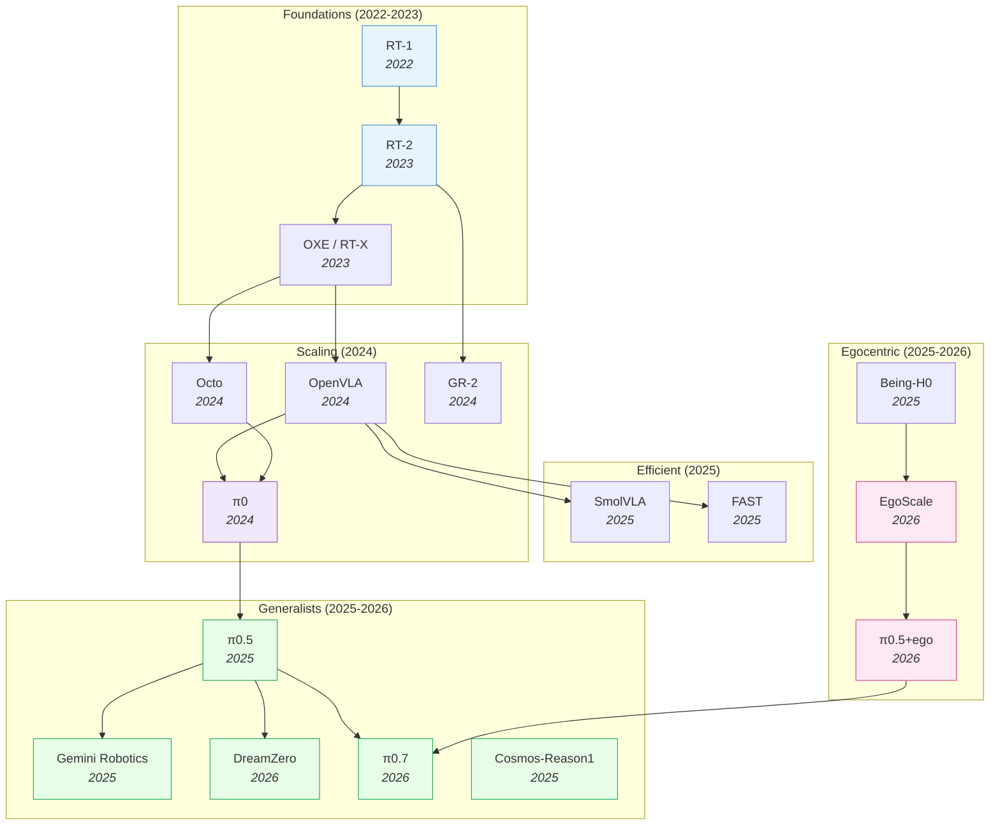

# Vision-Language-Action Models — Deep Dive

> [!abstract] Overview
> VLAs inherit robust multi-modal representations from pre-trained VLMs, giving robots semantic generalization that model-free and model-based approaches lack. From [[2212.06817|RT-1]]'s proof-of-concept (2022) to [[2504.16054|π0.5]]'s open-world household deployment (2025), VLAs have evolved from single-task imitation to general-purpose robot policies. This note maps the full VLA landscape: design principles, efficiency frontiers, spatial reasoning, world-model augmentation, RL post-training, multi-sensor integration, and failure modes.

## Evolution Graph

From Transformer-as-policy to flow-matching generalists — each step solved a specific bottleneck.

The field evolved through three phases: **proving the paradigm** (2022-2023), **scaling and opening** (2024), and **specialization** (2025-2026) — splitting into generalist, efficient, world-model-augmented, and egocentric-pretrained branches.

| Year | Model | Key Innovation | Bottleneck Solved |
|------|-------|----------------|-------------------|
| 2022 | [[2212.06817\|RT-1]] | Transformer on 130K real demos, 700 tasks | Proved Transformers work for robot control |
| 2023 | [[2307.15818\|RT-2]] | Fine-tuned PaLI-X (55B) VLM as policy | Web-scale knowledge transfers to robots |
| 2023 | [[2310.08864\|OXE]] | 1M+ trajectories from 22 robot types | Cross-embodiment positive transfer |
| 2024 | [[2405.12213\|Octo]] | Modular generalist policy | First open-source generalist robot policy |
| 2024 | [[2406.09246\|OpenVLA]] | Open-source 7B VLA | Democratized VLA research |
| 2024 | [[2410.06158\|GR-2]] | Web-scale video pre-training for actions | Video knowledge → robot manipulation |
| 2024 | [[2410.24164\|π0]] | Flow matching action expert + VLM | Continuous actions + dexterous manipulation |
| 2025 | [[2504.16054\|π0.5]] | Co-training on heterogeneous embodiments | Open-world generalization to unseen homes |
| 2025 | [[2503.20020\|Gemini Robotics]] | Gemini 2.0 extended to physical robots | Industrial-scale VLA |
| 2025 | [[2501.09747\|FAST]] | DCT+Huffman action compression | 5x faster VLA inference |
| 2025 | [[2506.01844\|SmolVLA]] | 450M param VLA | 7x less memory, 40% faster training |
| 2025 | [[2503.15558\|Cosmos-Reason1]] | Physical common-sense + embodied reasoning at WAM scale | Bridges physics priors and reasoning |
| 2025 | [[2507.15597\|Being-H0]] | VLA pretraining from large-scale human videos | Physical instruction tuning from human hands |
| 2026 | [[2602.15922\|DreamZero]] | Joint video + action prediction (14B WAM) | Zero-shot robot policies |
| 2026 | [[2602.16710\|EgoScale]] | 20,854-hour log-linear scaling law on egocentric data | Egocentric-data scaling laws |
| 2026 | [[2604.15483\|π0.7]] | Steerable generalist with emergent capabilities | Steerable open-world deployment |
| 2026 | [[2604.20100\|JoyAI-RA]] | Foundation model for robotic autonomy | Robust autonomy across embodiments |
| 2026 | [[2512.22414\|π0.5 + ego]] | Human→robot transfer via co-trained egocentric pretraining | Human-to-robot transfer emergence |

> [!tip] Three Evolutionary Phases
> **Phase 1 — Proof of concept** (2022-2023): RT-1 proved Transformers work, RT-2 showed VLM knowledge transfers, OXE built the cross-embodiment data foundation. **Phase 2 — Democratization** (2024): OpenVLA and Octo opened weights/code, π0 introduced flow matching for continuous control. **Phase 3 — Specialization** (2025+): The field split — generalists scaled up (π0.5 → π0.7, Gemini, JoyAI-RA), efficient variants scaled down (FAST, SmolVLA), WAMs added world prediction (DreamZero), and egocentric pretraining emerged as a fourth branch (Being-H0, EgoScale, π0.5+ego). See [[09_Egocentric-Pretraining-and-Human-Video]] for the egocentric scaling story and [[08_VLA-Reasoning-and-CoT]] for reasoning-augmented variants.

---

## 1. Design-Space Principles

Based on [[2412.14058|RoboVLMs]]' 600+ experiments — the most systematic VLA design-space study to date.

> [!success] Ideal VLA Recipe (from RoboVLMs)
> ==KosMos/[[2407.07726|PaliGemma]] backbone== + ==Policy Head fusion== + ==Continuous actions== + ==MoE== + ==Post-training on in-domain data==

### Backbone Selection

| Category | Models | Finding |
|----------|--------|---------|
| ==Encoder-Decoder== | Flamingo family | Outperformed by decoder-only |
| ==Decoder-Only== | LLaVA, Qwen-VL, MoonDream, [[2407.07726\|PaliGemma]], KosMos | KosMos and PaliGemma are distinctly superior |

**Why these two win**: These two architectures underwent the most extensive ==vision-language pre-training== on large-scale datasets (KosMos: 1.8B image-text pairs; PaliGemma: WebLI-filtered). This creates stronger alignment between visual and linguistic features — critical for understanding complex spatial instructions like "pick up the red cup to the left of the blue bowl." ==Encoder-decoder== architectures (Flamingo) underperform because they split visual and language processing into separate streams that only interact through ==cross-attention==, while ==decoder-only== models (LLaVA) process both modalities in a unified sequence but lack the scale of pre-training that KosMos and PaliGemma received.

### Architecture Axes

**Action Space**: ==Continuous== (recommended) — avoids compounding ==discretization errors== that plague tokenized approaches. When you discretize a 7-DoF arm into 256 bins per dimension, you get $256^7 \approx 72$ quadrillion possible actions — most of which are physically impossible. [[2510.13054|VLA-0]] showed that even representing actions as plain text numbers works, because the VLM's tokenizer already handles numerical sequences — no custom action head needed. ==Flow matching== ([[2410.24164|π0]]) goes further: it models the action distribution as a continuous flow, enabling smooth, multi-modal action generation that captures the full diversity of valid solutions rather than collapsing to a single mode. [[2605.04678|Pixels-to-Tokens VLA]] systematically compares latent-action supervision strategies on Qwen3-VL-2B and finds the opposite for *learned* tokens: discrete latent-action token supervision (LA-Tok) beats continuous regression by **+2.2-2.7%** average, with image-based latents helping long-horizon [[2306.03310|LIBERO]]-Long (+8.4-10.8 pp) and action-based latents helping motorically complex [[2506.18088|RoboTwin 2.0]] (+17.5%) — discretization hurts when applied to *raw* joint angles, but helps when applied to a learned latent-action codebook.

**History Fusion**: ==Policy Head== (best balance) — VLM provides per-step features; separate head fuses history. [[2506.19816|CronusVLA]] extends this to multi-frame observations for temporal robustness. For truly long-horizon tasks requiring memory over minutes, [[2603.03596|MEM]] factorizes memory into ==dense short-term visual== (space-time separable attention over seconds) + ==compressed long-term language== (LLM summaries), enabling tasks requiring up to 15 minutes of memory. [[2603.12942|ReMem-VLA]] takes a different approach via ==dual-level recurrent queries== (frame-level EMA + chunk-level EMA) with gradient-free updates, hitting **94.5%** on memory-dependent simulation tasks.

**Training Loss**: ==Flow Matching== and ==MSE+BCE== achieve similar results. [[2602.18224|SimVLA]] confirmed this with a streamlined 0.5B model achieving 98.6% on LIBERO.

### Data Strategy

| Strategy | Impact |
|----------|--------|
| **In-domain only** | Best for task-specific performance |
| **Cross-embodiment (OXE)** | Improves few-shot learning (+17.2% on CALVIN few-shot) |
| **==Post-training==** (OXE → in-domain fine-tune) | Best overall — highest gains for high-frequency skills |

> [!tip] The [[2510.13054|VLA-0]] Surprise
> [[2510.13054|VLA-0]] showed you don't need custom action heads, special tokenizers, or architectural changes at all — just fine-tune an unmodified VLM with actions as text. Sometimes the simplest approach wins.

---

## 2. Efficient & Lightweight VLAs

Full-size VLAs (7B+) are impractical for real-time robot control. This frontier trades model size for deployment speed.

| Model | Params | Key Innovation | Speed |
|-------|--------|---------------|-------|
| [[2605.09948\|LoopVLA]] | 1.2B | Recurrent Loop Block + learned sufficiency head; **−45% params**, **1.7x throughput** | Real-time |
| [[2605.08799\|ElasticFlow]] | Any FM-VLA | One-step average velocity field + elastic time abstraction; 71Hz, 98.5% LIBERO | **14ms** |
| [[2605.06175\|VLA-GSE]] | Any VLM | SVD-initialized generalized+specialized expert PEFT; **+6.3pp** over FFT on LIBERO-Plus | Real-time |
| [[2604.11757\|StarVLA-alpha]] | Any VLM | Minimal MLP action head on strong VLM backbone; 98.8% LIBERO | Real-time |
| [[2604.05672\|A1]] | 7B | Adaptive truncated VLM + flow-matching head; 72.3% latency reduction | Real-time |
| [[2604.05656\|SnapFlow]] | Any FM-VLA | One-step flow distillation; 3.3x faster π0.5 at 83ms | Real-time |
| [[2604.05323\|VLA-InfoEntropy]] | Any VLA | Training-free token selection via vision-attention entropy; 1.53x speedup | Real-time |
| [[2604.04161\|AAC]] | Any VLA | Adaptive action chunk size via predictive uncertainty; +15% real-world | Varies |
| [[2604.03191\|Compression Gap]] | Analysis | Discrete tokenization bottleneck limits VLA scaling | N/A |
| [[2604.02965\|SV-VLA]] | Any VLA | Speculative verification: open-loop plan + closed-loop verify; 2.17x speedup | Real-time |
| [[2511.14148\|AsyncVLA]] | Any | Asynchronous flow matching with confidence-based self-correction | Real-time |
| [[2510.13054\|VLA-0]] | Any VLM | Zero modification — actions as text strings | Varies |
| [[2509.09372\|VLA-Adapter]] | 0.5B | Lightweight adapter bridges VLM representations to actions | Fast |
| [[2506.01844\|SmolVLA]] | 450M | 7x less memory, 40% faster training than OpenVLA | Real-time |
| [[2503.02310\|PD-VLA]] | Any VLA | Training-free parallel decoding via Jacobi fixed-point iteration; 2.52x speedup | Real-time |
| [[2501.09747\|FAST]] | Compression | Action tokenization via DCT+Huffman; 5x faster inference | Real-time |
| [[2409.12514\|TinyVLA]] | Small | Diffusion action head + efficient VLM backbone | Fast |

Three efficiency strategies dominate: **compression** (FAST uses DCT+Huffman to compress action sequences, reducing token count by 5x — the insight is that adjacent action timesteps are highly correlated, so frequency-domain compression is nearly lossless); **distillation** (SmolVLA distills a 7B VLA into 450M params, losing only ~2% accuracy — the teacher's knowledge compresses because most VLA capacity models language understanding, not motor control); and **architecture reduction** (StarVLA-alpha replaces the action head with a minimal MLP, showing that complex action decoders are unnecessary when the VLM backbone is strong enough). SnapFlow takes a different approach: one-step flow distillation eliminates the iterative denoising process entirely, achieving 3.3x speedup over [[2504.16054|π0.5]] with minimal quality loss. The Compression Gap analysis reveals a fundamental finding: discrete tokenization itself is a bottleneck for VLA scaling — continuous representations avoid this. **One-step flow** ([[2605.08799|ElasticFlow]]) takes this further by reformulating action generation as an ==average velocity field== learning problem with an ==elastic time abstraction==: a single forward pass replaces iterative denoising at **14ms (71Hz)** while matching the [[2306.03310|LIBERO]] success rate (98.5%) of multi-step flow-matching VLAs. **Adaptive depth** ([[2605.09948|LoopVLA]]) shows that the *amount* of refinement should be learned rather than fixed: a recurrent Loop Block jointly predicts an action and a halting score, dynamically allocating depth per state — yielding **−45% parameters** and **1.7x throughput** while maintaining LIBERO performance. **PEFT-via-experts** ([[2605.06175|VLA-GSE]]) decomposes the frozen VLM via SVD into a generalized expert (top singular components) plus disjoint specialized experts (residual components) — achieving **81.2%** zero-shot on [[2510.13626|LIBERO-Plus]], beating full fine-tuning by **+6.3pp** while preserving multimodal understanding.

> [!star] Key Papers
> - [[2605.08799|ElasticFlow]] — One-step physics-consistent policy via average velocity field; **14ms** inference at **71Hz**, 98.5% LIBERO, **5x** faster than [[2303.04137|Diffusion Policy]] with smoother trajectories (Jerk **1.1×10⁻³** vs **3.2×10⁻³**)
> - [[2501.09747|FAST]] — DCT+Huffman action compression for **5x** faster VLA inference; the foundational efficiency-via-tokenization paper

> [!tip] When Smaller Is Enough
> For structured environments with known objects, SmolVLA (450M) matches larger models. For open-world tasks with novel objects, you still need 3B+. The sweet spot: use FAST tokenization on a mid-size model, or one-step flow ([[2605.08799|ElasticFlow]]) when sub-20ms control matters.

---

## 3. Spatial & 3D-Aware VLAs

Standard VLAs process 2D images — they lack explicit 3D understanding. These models integrate depth, point clouds, or 3D embeddings.

| Model | Spatial Feature | Result |
|-------|----------------|--------|
| [[2605.10485\|VEGA]] | DINOv2-FiT3D teacher alignment of student visual encoder via patch cosine loss | RoboTwin 2.0 SOTA (Easy **67.5%**, Hard **30.7%**, **+3.3%** over OFT+SF); no inference overhead |
| [[2604.12908\|VGA]] | VGGT 3D world model backbone + Progressive Volumetric Modulation | Vision-to-geometry mapping; 98.1% LIBERO with +6% OOD |
| [[2603.25399\|LaMP]] | 3D scene flow as latent motion prior | Physical foresight via dense 3D flow; 98.3% LIBERO |
| [[2603.24393\|3D-MIX]] | VGGT-based 3D feature plug-and-play module | +12.51% OOD gains via adaptive gated 3D fusion |
| [[2602.11236\|ABot-M0]] | Action Manifold Learning on 6M+ trajectories | Learned spatial action representations |
| [[2510.12276\|Spatial Forcing]] | Implicit 3D perception via spatial forcing | No explicit depth input needed |
| [[2508.09071\|GeoVLA]] | Dual-path 2D-VLM + 3D point-cloud PEN + MoE 3DAE with end-effector-anchored point embedding | LIBERO **97.7%**, ManiSkill2 **77%**; robust to viewpoint/scale shifts |
| [[2508.07917\|MolmoAct]] | Depth-aware perception tokens + visual reasoning traces | Spatial reasoning for manipulation |
| [[2506.22242\|4D-VLA]] | 3D coordinate embeddings + multi-frame context | Resolved ambiguous robot positioning |
| [[2501.15830\|SpatialVLA]] | Adaptive 3D spatial representations | Equipped VLAs with 3D spatial understanding |
| [[2412.10345\|TraceVLA]] | Visual trace overlays of past trajectories | Spatial-temporal awareness from 2D |

Two architectural approaches compete: **explicit 3D integration** adds depth sensors or point clouds as additional input modalities — SpatialVLA learns adaptive 3D spatial representations, while 4D-VLA uses 3D coordinate embeddings combined with multi-frame context to resolve ambiguous positioning. [[2508.09071|GeoVLA]] takes this further with a **dual-path** architecture: a frozen VLM processes 2D vision-language in parallel with a dedicated ==Point Embedding Network== (PEN) that uses an ==end-effector token== as a spatial anchor for focused 3D feature extraction; a ==3D-enhanced Action Expert== (3DAE) — a Diffusion Transformer with static-routed MoE — fuses both streams without disrupting the VLM's pretrained alignment, hitting **97.7%** on [[2306.03310|LIBERO]]. **Implicit 3D reasoning** achieves spatial awareness without explicit depth input — Spatial Forcing learns implicit 3D perception through training-time supervision, and TraceVLA overlays visual traces of past trajectories to provide spatial-temporal context from 2D images alone. [[2605.10485|VEGA]] occupies a third position — **3D-aware representation alignment**: it aligns the student VLA's [[2304.07193|DINOv2]] visual-encoder output (patch-level cosine loss) with a frozen ==DINOv2-FiT3D== teacher fine-tuned on multi-view-consistent 3D Gaussian Splatting, injecting spatial awareness *at the encoder* before linguistic entanglement, with **zero inference overhead** (a lightweight LayerNorm+MLP projector). The trade-off: explicit approaches generalize better to novel viewpoints (they have actual geometry) but require depth sensors; implicit approaches are cheaper to deploy but can fail when the camera moves significantly from training distribution; representation alignment (VEGA) keeps the deployment pipeline 2D while inheriting 3D priors from the teacher.

> [!star] Key Papers
> - [[2508.09071|GeoVLA]] — Dual-path 2D-VLM + 3D point-cloud PEN with end-effector anchor + MoE 3DAE; **97.7%** LIBERO; the cleanest explicit-3D architecture
> - [[2605.10485|VEGA]] — DINOv2-FiT3D teacher alignment via patch-cosine loss; **RoboTwin 2.0 SOTA** with **zero inference overhead**; representation alignment beats explicit 3D fusion
> - [[2501.15830|SpatialVLA]] — Foundational adaptive 3D spatial representations for VLAs; the canonical explicit-3D baseline

> [!tip] 3D Without 3D Sensors
> The field is split: [[2501.15830|SpatialVLA]] and [[2506.22242|4D-VLA]] add explicit 3D features, while [[2510.12276|Spatial Forcing]] and [[2412.10345|TraceVLA]] achieve spatial awareness *implicitly* from 2D. Implicit approaches are cheaper to deploy but explicit approaches generalize better to novel viewpoints.

---

## 4. Reasoning & Planning-Augmented VLAs

Pure imitation is brittle — these models add test-time reasoning (chain-of-thought, MCTS, subgoal prediction) to improve robustness. See [[08_VLA-Reasoning-and-CoT]] for the full taxonomy of reasoning insertion points.

| Model | Reasoning Type | Benefit |
|-------|---------------|---------|
| [[2604.22709\|Abstract-CoT]] | Latent CoT in abstract embedding space (no words) | Token-free reasoning preserves throughput |
| [[2604.21396\|VG-CoT]] | Grounded chain-of-thought tied to visual evidence | Trustworthy visual reasoning |
| [[2604.18486\|OneVL]] | One-step latent reasoning + planning + VL explanation | Reasoning, planning, action in one pass |
| [[2604.17800\|ReFineVLA]] | Multimodal reasoning-aware policy via teacher-guided fine-tuning | Reasoning as a refinement signal |
| [[2603.18091\|ADV]] | Action Draft-and-Verify (diffusion draft + VLM verify) | Self-verifying framework; +19.7% real-world success |
| [[2601.11404\|ACoT-VLA]] | Action Chain-of-Thought (reason in action space) | Explicit action-space reasoning |
| [[2509.25852\|REVER]] | Reinforced embodied planning with verifiable reward | RL-trained reasoning over real manipulation |
| [[2509.25681\|dVLA]] | Diffusion VLA with multimodal CoT | Multimodal CoT in a diffusion policy |
| [[2509.22643\|VLA-Reasoner]] | Online MCTS with world model | Simulates futures to select optimal actions |
| [[2507.16815\|ThinkAct]] | Reinforced visual latent planning between VLM and action | Visual-latent planning with RL reward |
| [[2506.00123\|VeBrain]] | Unified spatial reasoning + control | See-Think-Control pipeline |
| [[2505.03500\|TLI]] | Text Latent Interpolation for skill recombination | Extrapolation: 9% → 83% on OOD tasks |
| [[2503.22020\|CoT-VLA]] | Visual CoT generates intermediate visual goal frames | Visual sub-goals act as reasoning steps |
| [[2503.11089\|EmbodiedVSR]] | Dynamic scene graph + physics-constrained CoT | 18.4% gain in Arm Feasibility; 80% success in real-world reassembly |

**Action Chain-of-Thought** (ACoT-VLA) adds explicit reasoning in the *action* space rather than language space — the model generates intermediate action waypoints as 'reasoning steps' before committing to the final trajectory. This is fundamentally different from language CoT: the reasoning is grounded in physical coordinates, not tokens. **Online MCTS** (VLA-Reasoner) uses the world model as a simulator during inference: sample multiple action candidates, simulate each forward via the world model, score outcomes, and select the best — essentially playing 'chess' with physical actions. The latency cost is real (~3-5x slower), so ADV's draft-and-verify approach offers a middle ground: generate a fast open-loop action draft, then verify it with a closed-loop check.

> [!tip] When Reasoning Helps
> Reasoning adds latency, so it's not always worth it. Use it for: (1) long-horizon tasks with many decision points, (2) novel task compositions (TLI), (3) tasks requiring spatial inference. Skip it for: fast pick-and-place where imitation suffices.

---

## 5. World-Model-Augmented VLAs

VLAs that incorporate learned dynamics models for planning, imagination, or co-training. See [[04_WAM]] for the full WAM taxonomy.

| Model | Integration Style | Key Insight |
|-------|------------------|-------------|
| [[2604.28192\|LaST-R1]] | Reinforces action via adaptive physical latent reasoning | RL-driven latent reasoning over physical state |
| [[2604.27792\|MotuBrain]] | Advanced WAM-conditioned policy for robot control | Motion-centered WAM core |
| [[2604.26848\|STARRY]] | Spatial-temporal action-centric world modeling | Full ST-action-centric WM |
| [[2604.26694\|X-WAM]] | Unified 4D world action modeling with asynchronous denoising | 4D unified WAM with async pipeline |
| [[2604.19730\|FASTER]] | Value-guided sampling for fast RL with WM rollouts | Bridges WM rollouts and fast RL sampling |
| [[2604.17876\|OFlow]] | Object-aware temporal flow matching | Robust manipulation via object-flow priors |
| [[2604.14732\|WVA]] | Video generator + trajectory value + action decoder with MPPI latent optimization | Implicit planning via latent-space trajectory refinement; 98.1% LIBERO, 75.6% real dual-arm |
| [[2604.11135\|AIM]] | Spatial value maps bridge video prediction to actions | Intent-aware unified world-action model; 94% RoboTwin |
| [[2604.08168\|ViVa]] | Video diffusion Transformer as value function | Video-generative value model for robot RL |
| [[2604.06168\|Action Images]] | Actions as pixel-grounded multiview images | Unified video-action generation; zero-shot transfer |
| [[2603.29844\|DIAL]] | Differentiable latent intent bottleneck | Decoupled intent + action; 70.2% RoboCasa GR1 |
| [[2603.16666\|Fast-WAM]] | Video co-training without test-time imagination | WAM benefits without WAM latency |
| [[2603.10448\|DiT4DiT]] | Video DiT conditions action DiT via denoising features | Joint video-action model; 98.6% LIBERO, 10x sample efficiency |
| [[2603.03195\|CoWVLA]] | Structure-motion disentangled latent world model | Chain-of-world reasoning in latent motion space |
| [[2602.12099\|GigaBrain-0.5M*]] | World model predicts future states + values; RAMP policy conditioned on dense predictions | +30 pts over RL baselines on long-horizon manipulation; 51.67% RoboChallenge |
| [[2602.12063\|VLAW]] | Iterative co-improvement of VLA + world model | VLA and WM reinforce each other |
| [[2602.10098\|VLA-JEPA]] | JEPA-based latent world model attached to VLA | Latent prediction improves action quality |
| [[2601.16163\|Cosmos Policy]] | Video diffusion model fine-tuned as policy | Video prediction = action planning |
| [[2511.17502\|RynnVLA-002]] | Unified VLA + world model architecture | Environmental dynamics + action planning |
| [[2511.07732\|ViPRA]] | Motion-centric latent actions from videos + flow matching action head | Learns control priors from actionless video; 69.8% SIMPLER, 79% LIBERO-Long, 22 Hz real-time |
| [[2509.24948\|RehearseVLA]] | Simulated post-training with VLM-guided reflection | World model for rehearsal, not inference |
| [[2507.04447\|DreamVLA]] | Forecasts depth + semantics + dynamics | Comprehensive world knowledge |
| [[2506.19850\|UniVLA]] | All modalities as discrete tokens in one Transformer | Unified autoregressive generation |
| [[2505.15659\|FLARE]] | Predicts future latent representations (not pixels) + diffusion policy | Up to +26% over baselines; learns from action-free human videos |
| [[2505.11528\|LaDi-WM]] | Latent diffusion WM with DINOv2 + Siglip; imagination-guided iterative action refinement | 68.7% LIBERO-LONG with 10 demos; +15.1% over SOTA |

Four integration styles exist, each with different trade-offs: **Iterative co-improvement** (VLAW) alternates between training the VLA policy and the world model — the world model generates synthetic training data for the VLA, and the VLA's improving actions give the world model harder scenarios. Each round improves both, but the world model is always one step behind the current policy. **Latent world model** (VLA-JEPA) attaches a JEPA-style predictor to the VLA backbone — predictions happen in embedding space (fast, ~10ms) rather than video space (slow, ~150ms). **Video co-training** (Fast-WAM) trains jointly with video prediction objectives but strips the video head at deployment — getting WAM-level representations with VLA-level speed. **Rehearsal** (RehearseVLA) uses the world model only during post-training: simulate trajectories, have a VLM reflect on failures, and fine-tune — the world model is a training tool, not a deployment component.

> [!star] Key Papers
> - [[2602.10098|VLA-JEPA]] — Latent JEPA predictor attached to VLA; **~10ms** prediction in embedding space vs **~150ms** in video space; the right speed-quality trade-off
> - [[2603.16666|Fast-WAM]] — Video co-training without test-time imagination; WAM-level representations at VLA-level speed
> - [[2602.15922|DreamZero]] — Joint video + action prediction (14B WAM); the landmark zero-shot generalization paper for WAM-augmented VLAs

> [!tip] The Speed-Quality Trade-off
> WAM-augmented VLAs are more robust (spatiotemporal priors from video pretraining) but 4.8x slower than pure VLAs ([[2603.22078|WAM vs VLA Robustness]]). [[2603.16666|Fast-WAM]] shows you can get most of the benefit without test-time imagination — use video co-training, not video generation.

---

## 6. RL Post-Training for VLAs

Imitation learning alone leaves performance on the table. RL fine-tuning after initial SFT consistently improves task success, especially on multi-step tasks.

| Finding | Source |
|---------|--------|
| Conservative SFT exponentially down-weights low-confidence transitions to bound parameter disruption; **34%** LIBERO retention vs vanilla SFT collapse | [[2605.08879\|ConSFT]] |
| Procedure-grounded progress reward via ProcVLM; ProcCorpus-60M frame-level annotations; **+25.0pp** real-robot Stack-Bowls vs noisy teleop baseline | [[2605.08774\|ProcVLM]] |
| Adaptive Q-Chunking via per-scale advantage criterion (Q_k − V_k)/γ^k for offline-to-online RL; **100%** on OGBench cube-double, **63.2%** on RoboCasa-GR1 with GR00T N1.6 | [[2605.05544\|AQC]] |
| Q-values extracted from BC policy via Boltzmann assumption seed online RL with Q-gating; **3.75x** improvement on real robot in 1-2 hrs without original BC data | [[2605.05172\|Q2RL]] |
| Preference-based language-action alignment grounds hierarchical VLA via SimPO | [[2604.05614\|GPLA]] |
| Online VLA RL with spatial understanding via Flow-GSPO | [[2604.17706\|OmniVLA-RL]] |
| Test-time perturbation learning with delayed feedback for adaptive RL | [[2604.18107\|PDF]] |
| Value-guided sampling makes RL fast on flow-matching VLAs | [[2604.19730\|FASTER]] |
| Primitive reasoning + tasking via contrastive representations | [[2604.27472\|PRTS]] |
| On-policy distillation with Reverse-KL for dense token-level RL supervision; 3x faster convergence | [[2603.26666\|VLA-OPD]] |
| Simple Sequential Fine-Tuning (LoRA + RL) shows high plasticity with minimal forgetting | [[2603.11653\|VLA RL Continual Learning]] |
| VLAs are surprisingly resistant to catastrophic forgetting under continual RL | [[2603.03818\|VLA Continual Learning]] |
| Self-referential policy optimization for VLA models | [[2511.15605\|SRPO]] |
| Knowledge insulation: stop gradient flow from action expert to VLM backbone | [[2505.23705\|Knowledge Insulation VLA]] |
| Scalable RL framework for VLA manipulation training | [[2505.18719\|VLA-RL]] |
| Interactive post-training (RIPT-VLA) treats deployment trials as RL signal | [[2505.17016\|RIPT-VLA]] |
| Reinforced fine-tuning via Consistency Policy bridges flow matching and RL | [[2502.05450\|ConRFT]] |
| Two-stage alternation between online RL and SFT keeps VLA training stable; LoRA + frozen VLM | [[2501.16664\|iRe-VLA]] |

> [!success] The RL Recipe for VLAs
> 1. ==SFT== on demonstration data (format learning)
> 2. ==RL with verifiable rewards== (task success signal)
> 3. ==LoRA== for parameter-efficient updates
> 4. ==Knowledge insulation==: keep VLM backbone frozen from action gradients

**Why SFT then RL works for VLAs**: ==SFT== on demonstrations teaches the model the *format* of robot control — how to map observations to actions, what action dimensions mean, when to terminate. But SFT alone is limited to the demonstration distribution: the model can only reproduce actions it has seen. ==RL== pushes beyond this ceiling by optimizing for task success rather than imitation fidelity. The combination is synergistic: SFT provides a strong initialization so RL doesn't need to explore from scratch, while RL discovers better-than-demonstrated behaviors.

**The GRPO advantage**: ==Group Relative Policy Optimization== works by: (1) sampling a group of action trajectories from the current policy, (2) evaluating each against a reward signal, (3) computing advantage relative to the group mean, (4) updating the policy to increase probability of above-average trajectories. Unlike PPO, ==GRPO== needs no separate ==critic network== — the group statistics serve as the baseline. This is especially convenient for VLAs where training a separate value function over high-dimensional visual observations is expensive and unstable. [[2604.05614|GPLA]] extends this with preference-based language-action alignment, grounding the RL signal in hierarchical task structure.

**Knowledge insulation**: The critical risk of RL fine-tuning is degrading the VLM backbone's visual understanding — the very representations that give VLAs their generalization advantage. ==Knowledge insulation== ([[2505.23705|Knowledge Insulation VLA]]) prevents this by applying a ==stop gradient== from the action expert to the VLM backbone: the VLM's representations stay frozen, and only the action head adapts. This preserves the VLM's broad spatial and semantic knowledge while allowing the policy to specialize for deployment-specific dynamics.

> [!star] Key Papers
> - [[2505.23705|Knowledge Insulation VLA]] — Stop-gradient from action expert to VLM backbone preserves visual representations during RL fine-tuning
> - [[2501.16664|iRe-VLA]] — Two-stage alternation between online RL and SFT with LoRA + frozen VLM; the canonical stable RL recipe for VLAs
> - [[2505.17016|RIPT-VLA]] — Interactive post-training treats deployment trials as RL signal; closes the loop between deployment and learning

> [!tip] Why RL Works for VLAs
> VLAs pre-trained on diverse data already have good representations — RL doesn't need to learn from scratch. It just needs to *calibrate* the policy to the deployment environment. LoRA makes this cheap, and VLAs don't catastrophically forget ([[2603.03818|VLA Continual Learning]]).

---

## 7. Multi-Sensor & Force-Aware VLAs

Vision-only policies fail on contact-rich tasks (insertion, assembly, surface following) because cameras cannot see force — visual feedback is delayed and ambiguous during contact. The architectural insight that emerged across this cluster is that **force should be treated as a first-class modality routed through dedicated experts**, not concatenated naively with visual tokens. Late-fusion of force after VLM encoding outperforms early concatenation by 10-20pp on contact-rich benchmarks, because the pretrained VLM representations are preserved rather than diluted with raw F/T noise.

> See [[10_Force-Aware-and-Tactile-Policies]] for the full deep-dive — covering tactile sensor hardware ([[2509.18830|DexSkin]], [[2604.28156|FlexiTac]], [[2604.20689|FingerEye]]), the three landmark force-conditioned VLA architectures, force-as-generation-conditioning ([[2505.19386|Force Prompting]]), contact-rich benchmarks, and open problems.

| Model | Additional Modality | Task Focus |
|-------|-------------------|-----------|
| [[2603.15169\|ForceVLA2]] | Cross-Scale MoE + VLM force prompts | Contact-rich manipulation (66% avg SR; +48 over π0) |
| [[2507.09160\|Tactile-VLA]] | Force-aware action expert + CoT failure recovery | 90% Charger, 80% zero-shot blackboard wiping |
| [[2505.22159\|ForceVLA]] | 6-axis force/torque via Force-aware MoE | Contact-rich manipulation; +23.2% over π0 |
| [[2508.19236\|MemoryVLA]] | Bio-inspired dual-memory system | Long-horizon tasks with perceptual memory |

> [!star] Key Papers
> - [[2603.15169|ForceVLA2]] — Cross-Scale MoE + force prompts at VLM level; current SOTA at **66%** avg SR (**+48pp** over [[2410.24164|π0]])
> - [[2505.22159|ForceVLA]] — Foundational Force-aware MoE architecture; the late-fusion-with-phase-aware-gating pattern that defined the cluster
> - [[2507.09160|Tactile-VLA]] — Force in augmented action space + CoT failure recovery that autonomously adjusts force (3.5N→6.7N)

---

## 8. Humanoid & Bimanual VLAs

Single-arm tabletop manipulation is the default VLA setting — but real robots have two arms, legs, and whole-body coordination.

| Model | Embodiment | Key Innovation |
|-------|-----------|---------------|
| [[2604.07993\|HEX]] | Humanoid (whole-body) | MoE proprioceptive predictor for cross-embodiment humanoid manipulation |
| [[2604.07430\|HY-Embodied-0.5]] | Multi-embodiment | Foundation model family with MoT; leads 16/22 embodied benchmarks |
| [[2603.12263\|Psi0]] | Humanoid (loco-manipulation) | Open model: egocentric video pre-training + flow-matching action expert |
| [[2602.12062\|HoloBrain-0]] | Multi-platform | Full-stack open-source VLA ecosystem |
| [[2512.00975\|MM-ACT]] | Multi-modal | Unified text + image + action token space |
| [[2511.05275\|TwinVLA]] | Bimanual | Compose two single-arm VLAs for bimanual tasks |
| [[2502.14795\|Humanoid-VLA]] | Humanoid (full-body) | First VLA for humanoid robots |
| [[2410.07864\|RDT-1B]] | Bimanual | 1.2B diffusion foundation model for bimanual manipulation |

The bimanual challenge is fundamentally about *coordination*, not just control. A single-arm VLA learns 7-DoF actions (position + rotation + gripper). A bimanual VLA must learn 14-DoF+ actions where the two arms must be synchronized — the right arm holds the bowl while the left arm stirs, and the timing matters as much as the positions. TwinVLA's insight: rather than training a 14-DoF model from scratch (which requires expensive bimanual demonstrations), compose two pre-trained single-arm VLAs and learn only a thin coordination layer on top. This is data-efficient because it reuses existing single-arm capabilities. For humanoids, the challenge is even harder: Humanoid-VLA and HEX must coordinate arms, legs, and torso in a high-dimensional action space where balance constraints couple every joint.

> [!star] Key Papers
> - [[2511.05275|TwinVLA]] — Compose two single-arm VLAs for bimanual tasks; coordination as a thin layer on top of individual skill; data-efficient
> - [[2410.07864|RDT-1B]] — 1.2B diffusion foundation model for bimanual manipulation; the canonical scaled-bimanual baseline
> - [[2604.07430|HY-Embodied-0.5]] — Foundation model family with MoT for multi-embodiment; leads **16/22** embodied benchmarks

> [!tip] Bimanual Scaling
> [[2511.05275|TwinVLA]] shows you can compose two pre-trained single-arm VLAs rather than training a bimanual model from scratch — data-efficient and surprisingly effective. The key insight: coordination can be learned as a thin layer on top of individual skill.

---

## 9. Self-Evolving & Continual VLAs

VLAs that autonomously improve through self-play, continual learning, or evolutionary strategies. See [[06_Self-Evolving-VLA-WAM]] for the full deep-dive comparing self-evolving VLAs, WAMs, and agents.

| Model | Self-Improvement Mechanism |
|-------|--------------------------|
| [[2511.16166\|EvoVLA]] | Self-evolving framework: overcomes stage hallucination and fragile memory |
| [[2603.11653\|VLA RL Continual Learning]] | Sequential RL fine-tuning with LoRA; minimal forgetting |
| [[2603.03818\|VLA Continual Learning]] | Pre-trained VLAs are naturally resistant to forgetting |
| [[2603.09030\|PlayWorld]] | Autonomous self-play data collection → world model training |
| [[2602.21633\|Self-Correcting VLA]] | Self-correction mechanism for robust VLA deployment |
| [[2602.10503\|Long-Lived Robots]] | Continual learning for long-lived robot deployment |
| [[2602.03445\|CRL-VLA]] | Continual RL for VLA policies across sequential tasks |
| [[2512.14666\|EVOLVE-VLA]] | Evolutionary VLA improvement through progressive adaptation |
| [[2601.02295\|CycleVLA]] | Proactive self-correction via subtask backtracking and MBR decoding |
| [[2512.24426\|CF-VLA]] | Counterfactual self-reflection with adaptive reasoning |

**Why VLAs resist catastrophic forgetting**: The conventional wisdom from NLP is that fine-tuning destroys prior knowledge. VLAs break this pattern because their pre-training on diverse cross-embodiment data ([[2310.08864|OXE]]: 1M+ trajectories from 22 robot types) creates a broad, well-structured parameter basin. Sequential task fine-tuning stays within this basin rather than escaping it. ==LoRA=='s low-rank constraint further stabilizes this: updates are confined to a low-dimensional subspace, preserving the vast majority of pre-trained parameters. Two independent studies ([[2603.11653|VLA RL Continual Learning]], [[2603.03818|VLA Continual Learning]]) validated this empirically.

**Self-correction as continuous self-evolution**: Beyond continual learning (adapting to new tasks), self-correcting VLAs detect and fix their own errors mid-task — a stronger form of autonomy. [[2601.02295|CycleVLA]] monitors subtask completion and backtracks when a subtask goes wrong, using ==Minimum Bayes Risk decoding== to select the most robust recovery action rather than continuing with a doomed plan. [[2511.14148|AsyncVLA]] uses ==confidence estimation== during flow-matching inference: when the denoising process shows high variance, the action is uncertain and the agent re-plans asynchronously. [[2512.24426|CF-VLA]] goes further with ==counterfactual reasoning==: "if I had moved left instead of right, would the outcome have been better?" — enabling the policy to learn from hypothetical alternatives, not just observed failures.

> [!star] Key Papers
> - [[2511.16166|EvoVLA]] — First end-to-end self-evolving VLA; overcomes stage hallucination and fragile memory through evolutionary strategies
> - [[2603.03818|VLA Continual Learning]] — Showed pre-trained VLAs are naturally resistant to catastrophic forgetting; simple sequential fine-tuning works
> - [[2601.02295|CycleVLA]] — Proactive self-correction via subtask backtracking and MBR decoding; detects and recovers from errors without restarting

> [!tip] The Continual Learning Surprise
> Two independent studies ([[2603.11653|VLA RL Continual Learning]], [[2603.03818|VLA Continual Learning]]) found the same result: VLAs pre-trained on diverse data are *naturally* resistant to catastrophic forgetting. You don't need complex continual learning algorithms — simple sequential fine-tuning works. This is the opposite of what the NLP literature suggests.

---

## 10. Failure Modes & Robustness

Understanding when VLAs break is as important as knowing when they work.

| Failure Mode | Evidence | Implication |
|-------------|----------|-------------|
| **Spatial overfitting** | [[2505.03500\|TLI]] — VLAs map object names to *fixed training locations* instead of abstract identities | Novel object positions break policies |
| **Visual perturbation brittleness** | [[2603.22078\|WAM vs VLA Robustness]] — VLAs struggle under camera/light/background changes | WAMs are more robust (spatiotemporal priors from video pretraining) |
| **Detail-oriented failure** | [[2601.11421\|GM-100]] — 100 detail-oriented tasks expose very low VLA success rates | Current VLAs are coarse-grained; fine manipulation is unsolved |
| **Counterfactual failures (vision > language)** | [[2602.17659\|CAG]] — OpenVLA-OFT: 0.4% on counterfactual tasks vs 78.6% on originals; VLAs ignore language when visual cues conflict | Inference-time CAG scheme with a VA prior mitigates; +15.5% grounding |
| **Instruction paraphrase brittleness** | [[2603.28301\|LIBERO-Para]] — paraphrased instructions cause 22-52pp drops | VLAs overfit to exact instruction surface form |
| **Cross-modal failure recovery** | [[2510.01642\|FailSafe]] reasons over failures and generates recoveries | Recovery requires reasoning beyond reactive policies |
| **Inference speed** | WAMs are ≥4.8x slower than VLAs (π0.5 at 63ms/chunk is fastest) | Real-time control needs efficient architectures |

### Failure Detection for VLAs

How does a deployed VLA know when it is failing? Multiple complementary approaches have emerged:

1. **Internal feature monitoring**: [[2506.09937|SAFE]] extracts features from the VLA's own hidden layers and uses ==conformal prediction== to flag when the model's internal state differs from its training distribution — no external sensors needed. This works because VLA representations encode task-relevant uncertainty even when the output actions look confident.
2. **Semantic misalignment**: [[2509.16072|I-FailSense]] uses a VLM to compare the expected task outcome with the observed scene — detecting failures through ==semantic reasoning== rather than numerical thresholds. This catches failures that look normal in feature space but are semantically wrong (e.g., picking up the wrong object).
3. **Predictive failure**: [[2510.09459|FIPER]] combines ==OOD detection== with ==action uncertainty== to predict failures *before* they happen, giving the system time to intervene or hand off to a human operator. This is especially valuable for safety-critical tasks where post-hoc detection is too late.
4. **Density-based OOD via normalizing flows**: [[2603.11106|RC-NF]] learns the joint distribution of successful task execution via ==robot-conditioned normalizing flows==, signaling deviations in under **100ms** for real-time intervention. [[2503.08558|FAIL-Detect]] uses a novel ==logpZO== flow-based density estimator with ==Conformal Prediction== thresholds, achieving 78% balanced accuracy without any failure data.
5. **Multi-detector ensembles**: [[2410.04640|Sentinel]] runs ==STAC== (Statistical Temporal Action Consistency via ==MMD==/KL-divergence) for erratic failures in parallel with a VLM for task progression failures — together detecting 18% more failures than either alone.
6. **Confidence calibration**: [[2507.17383|VLA Confidence Calibration]] introduces ==Action-Wise Platt Scaling== + prompt ensembles to reduce Expected Calibration Error by over **20%** — trustworthy uncertainty scores for each action dimension.
7. **Uncertainty from the policy's own loss**: [[2410.14868|Diff-DAgger]] uses the diffusion policy's training objective directly as an uncertainty signal, achieving **39%** higher F1 in failure prediction than ensemble baselines.
8. **LLM-driven reactive recovery**: [[2407.08735|AESOP]] combines a fast embedding-based LLM anomaly detector with a slow generative LLM for deliberative intervention, using latency-aware multi-contingency MPC to achieve **100%** recovery in simulated quadrotor anomalies.
9. **Human-shared-control scaling**: [[2510.02298|ARMADA]] uses ==FLOAT== (optimal-transport-based failure detection) to achieve **95%** accuracy and pool interventions across multiple robots, cutting human intervention by **23.3%**.

> [!tip] The Robustness Hierarchy
> From most to least robust: (1) WAMs with video pretraining, (2) VLAs with diverse cross-embodiment training ([[2504.16054|π0.5]]), (3) VLAs with in-domain-only training. If robustness matters more than speed, consider WAM augmentation. If speed matters, use knowledge insulation + diverse training.

---

## Quick-Reference Matrix

| Question | Answer |
|----------|--------|
| Why VLAs? | Strong robustness in real scenarios via VLM pre-training |
| Which backbone? | KosMos, [[2407.07726\|PaliGemma]] (extensive multi-modal pre-training) |
| Current generalist SOTA? | [[2604.15483\|π0.7]] (steerable open-world) and [[2604.20100\|JoyAI-RA]] (multi-embodiment) |
| Egocentric pretraining? | [[2507.15597\|Being-H0]], [[2602.16710\|EgoScale]], [[2512.22414\|π0.5 + ego]] — see [[09_Egocentric-Pretraining-and-Human-Video]] |
| How to formulate? | ==Continuous actions== + ==Policy Head== for history fusion |
| How to train? | Flow Matching ≈ MSE; ==MoE== for zero-shot generalization |
| Data strategy? | ==Post-training==: cross-embodiment pre-train → in-domain fine-tune |
| Need efficiency? | [[2605.08799\|ElasticFlow]] (one-step FM, **14ms**), [[2501.09747\|FAST]] tokenization, or [[2506.01844\|SmolVLA]] (450M) |
| Need 3D? | [[2508.09071\|GeoVLA]] / [[2501.15830\|SpatialVLA]] (explicit), [[2510.12276\|Spatial Forcing]] (implicit), or [[2605.10485\|VEGA]] (representation alignment, zero inference cost) |
| Need parameter-efficient FT? | [[2605.06175\|VLA-GSE]] (SVD generalized+specialized experts) — beats FFT **+6.3pp** on LIBERO-Plus |
| Need to preserve foundational capabilities? | [[2605.08879\|ConSFT]] (confidence-weighted SFT bounds parameter disruption) |
| Need reasoning? | [[2503.22020\|CoT-VLA]] (visual CoT), [[2507.16815\|ThinkAct]] (RL latent), or [[2509.22643\|VLA-Reasoner]] (MCTS) — full taxonomy in [[08_VLA-Reasoning-and-CoT]] |
| Need world model? | [[2602.12063\|VLAW]] (co-improvement), [[2603.16666\|Fast-WAM]] (no latency), or [[2604.26694\|X-WAM]] (4D unified) |
| Need RL? | [[2505.18719\|VLA-RL]], [[2505.17016\|RIPT-VLA]], or [[2511.15605\|SRPO]] + Knowledge Insulation + LoRA |
| Need physics priors? | [[2503.15558\|Cosmos-Reason1]] — see [[07_Physics-Aware-Embodied-AI]] for the full physics-aware design space |
| Need bimanual? | [[2511.05275\|TwinVLA]] (compose two single-arm) or [[2410.07864\|RDT-1B]] |
| Need robustness? | WAM augmentation or diverse cross-embodiment training |

---

## Cross-References

- [[01_Embodied-AI-101]] — VLA vs WAM basics and four learning strategies
- [[04_WAM]] — Full WAM taxonomy (VideoGen, VLM-based, From Scratch)
- [[05_Latent-World-Models]] — JEPA evolution lineage ([[2506.09985|V-JEPA 2]] → [[2602.10098|VLA-JEPA]])
- [[06_Self-Evolving-VLA-WAM]] — Self-evolving VLAs, failure detection, and continual learning
- [[07_Physics-Aware-Embodied-AI]] — Physics priors for embodied AI; physics-coupled VLA pipelines
- [[08_VLA-Reasoning-and-CoT]] — Full taxonomy of where to insert reasoning into VLA pipelines
- [[09_Egocentric-Pretraining-and-Human-Video]] — Egocentric scaling laws and human→robot transfer
- [[10_Force-Aware-and-Tactile-Policies]] — Force/tactile policies deep-dive; expands §7 Multi-Sensor & Force-Aware
- [[11_Sim-to-Real-Transfer]] — Sim-to-Real Transfer deep-dive; complements VLA evaluation and deployment
- [[02_Dataset-Benchmark-Environment]] — Datasets, benchmarks, and simulation platforms

---

*See [[04_WAM]] for the world-model alternative, [[08_VLA-Reasoning-and-CoT]] for reasoning depth, or [[01_Embodied-AI-101]] to start from the basics.*
