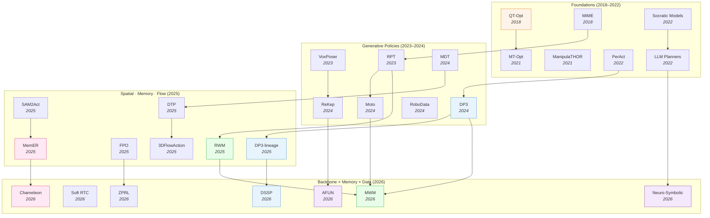

# Manipulation Skill Learning — Deep Dive

> [!abstract] Overview
> Manipulation is where embodied AI meets the unforgiving physics of contact: a policy must turn pixels and language into joint commands that grasp, insert, pour, and assemble — under occlusion, latency, and multimodal action ambiguity. This note maps the *skill-learning* substrate beneath the VLA headline: how policies **generate actions** (diffusion/flow backbones, real-time chunking, guided sampling, 3D & multi-view spatial encoders), how they **reason and remember** (world-model-as-policy, episodic memory for non-Markovian tasks, LLM/neuro-symbolic planning and affordance grounding), and what **learning signal** trains them (RL & policy-steering, demonstration/data-generation, and cross-embodiment skill transfer). The throughline: the action-generation backbone, the memory it carries, and the data it learns from are now the three independent axes a manipulation system is designed along — and the field's frontier is the *interaction* between them.

## Evolution Graph

Manipulation skill learning evolved from *monolithic value-based RL* ([[1806.10293|QT-Opt]], [[2104.08212|MT-Opt]]) and *demonstration scaling* ([[1810.07121|MIME]], [[2306.10007|RPT]]) into a **three-axis design space**. The **action-generation** axis matured from voxel-classification ([[2209.05451|PerAct]]) to 3D diffusion ([[2403.03954|DP3]]) to flow-matching and real-time chunking ([[2507.21053|FPO]], [[2605.25537|Soft RTC]]). The **memory** axis emerged once tasks went non-Markovian — from frame-stacking to learned episodic retrieval ([[2510.20328|MemER]], [[2603.24576|Chameleon]]). The **reasoning/data** axis grew from zero-shot LLM planners ([[2201.07207|LLM Zero-Shot Planners]], [[2204.00598|Socratic Models]]) into neuro-symbolic supervision ([[2604.02812|Neuro-Symbolic Robot Policies]]) and world-model-driven imagination ([[2604.19683|MWM]], [[2501.10100|RWM]]). The 2026 frontier is no longer "which backbone" but how the three axes *compose*.

| Year | Paper | Axis | Contribution |
|------|-------|------|--------------|
| 2018 | [[1806.10293\|QT-Opt]] | Learning Signal | Scalable vision-based Q-learning; 96% real grasp from 580K trials |
| 2018 | [[1810.07121\|MIME]] | Learning Signal | 8.3K human+robot demos across 20 tasks; demonstration scaling |
| 2021 | [[2104.08212\|MT-Opt]] | Learning Signal | Continuous multi-task RL at scale with shared off-policy data |
| 2022 | [[2209.05451\|PerAct]] | Action Gen | Voxel-classification 6-DoF manipulation via Perceiver Transformer |
| 2022 | [[2201.07207\|LLM Zero-Shot Planners]] | Reasoning | LLMs decompose high-level goals into executable action steps |
| 2023 | [[2307.05973\|VoxPoser]] | Reasoning | LLM-composed 3D value maps for zero-shot manipulation |
| 2024 | [[2403.03954\|DP3]] | Action Gen | 3D point-cloud diffusion policy; 74.4% over 72 tasks, 10 demos |
| 2024 | [[2412.04445\|Moto]] | Reasoning | Latent motion tokens bridge video pretraining to robot control |
| 2025 | [[2507.21053\|FPO]] | Learning Signal | Flow Policy Optimization: PPO for flow-based policies via CFM loss |
| 2025 | [[2510.20328\|MemER]] | Memory | Experience-retrieval memory scales robot control to long horizons |
| 2026 | [[2604.19683\|MWM]] | Reasoning | Mask World Model predicts task-relevant futures for robust policy |
| 2026 | [[2605.14598\|DSSP]] | Action Gen | Mamba SSM diffusion backbone; full-history encode at 44.3M params |
| 2026 | [[2604.02812\|Neuro-Symbolic Robot Policies]] | Reasoning | Synthetic neuro-symbolic supervision from VLMs structures policies |

## Part A — Generating Actions

*How a manipulation policy turns observations into motor commands — the generative backbone, the latency it must beat, and the spatial structure it encodes.*

### 1. Generative Policy Architectures

A manipulation policy must map an observation to a *distribution* over actions, not a point — the same scene admits many valid grasps, and averaging them (the failure of naive regression) produces motion that satisfies no mode. This is why generative models took over the policy backbone: diffusion and flow-matching natively represent multimodal action distributions, and they degrade gracefully under demonstration noise. The category exists because expressivity is the first-order constraint — get the distribution wrong and no amount of reasoning above it recovers.

But expressivity is bought with iteration: a denoising or integration loop runs at inference, and that loop fights the real-time control budget. The four sub-sections below are the four pressures pulling on the backbone: which *generative process* to use (diffusion vs flow vs interpolant), how to compensate for the *latency* the process introduces, how to *steer* the samples toward safe or task-consistent behavior, and how to keep the whole thing *efficient and history-aware* so it survives non-Markovian tasks. Every modern manipulation policy is a point in this 4D space.

#### 1.1 Diffusion & Flow-Matching Backbones

The generative process at the policy's core — denoising-diffusion, flow-matching, or stochastic interpolants — sets the trade-off between expressivity, sampling speed, and the stability guarantees you can prove.

- **[[2407.05996|MDT]]** — ==Transformer encoder== + ==diffusion decoder== with ==Masked Generative Foresight== and ==Contrastive Latent Alignment== self-supervision; **~85%** on CALVIN 5-instruction chains and **65%** on LIBERO with only **2** labeled demos; the multimodal-goal diffusion baseline.
- **[[2606.03834|SFMDS]]** — ==flow-matching dynamical systems== constrained by ==LaSalle's invariance principle== for provable stability; **100%** asymptotic stability on LASA vs BC's 32–40% failure, **<0.13%** non-convergent on 6D pouring; real SE(3) insertion at ~13 Hz.
- **[[2602.07322|A2A]]** — ==action-to-action flow matching== that initializes generation from past proprioceptive actions, not noise; **0.56 ms** single-step inference, **100%** success within 40 epochs and **30 trajectories**; robust to visual perturbation.
- **[[2512.22688|ARFM]]** — ==autoregressive flow matching== over sparse point tracks via ==SAMv2==+==CLIP== feature fusion with online horizon updating; outperforms regression objectives and lifts CALVIN ABC→D task success when conditioning downstream policies.
- **[[2604.03181|MV-VDP]]** — ==multi-view video diffusion== on a 5B ==Wan2.2== backbone jointly predicting future RGB + end-effector heatmaps; **89.1%** on Meta-World (5 demos) vs DP's 37.7%, **57.1%** real vs DP3's 0%; ~89% at one denoising step (5 Hz).
- **[[2606.06049|L-SDPPO]]** — ==spiking diffusion policy== with PPO fine-tuning and ==State-Dependent Latency Injection==; **97%** success on microgravity manipulation at **36.45%** of an ANN diffusion policy's energy; energy-efficient backbone for power-constrained robots.
- **[[2605.13959|WarmPrior]]** — ==straightens flow-matching policies with temporal priors==, reducing pathwise curvature and branching cost for fewer-step inference; up to **+11.2%** on Transport-MH at **NFE=1** across Robomimic/MimicGen, with consistent real Franka Research 3 gains largest on precision-demanding tasks.
- **[[2604.08418|DMBN-PTE]]** — diagnoses that modality-blending encoders *silence* temporal input, then adds ==Positional Time Encoding==; cuts time-reconstruction loss from **29.63e-3** to **0.69e-3**, restoring sequence-order awareness multimodal action predictors need.

#### 1.2 Real-Time Chunking & Latency Compensation

Action chunking trades a longer commitment horizon for fewer inference calls — but the seam between chunks (and the total system latency) is where smoothness and reactivity break. These papers attack the seam.

- **[[2605.25537|Soft RTC]]** — generalizes real-time chunking's binary prefix into a ==continuous token-wise action-prior denoising== window; matches Train-Hard-RTC solve rate (**0.809**) while cutting jerk **9.6%** and finite-difference roughness up to **52.3%**; near-naive runtime vs inference-RTC's 2.6× overhead.
- **[[2605.10051|SSIP]]** — ==streaming stochastic interpolant policy== with an optimal guidance law from the Backward Kolmogorov Equation; **74.3%** SR at **14.75 ms** vs DP's 58.5% at 91.52 ms, **30–36%** SR on dynamic-obstacle chases vs chunked baselines' 8–12%; execution-time-aligned generation.
- **[[2604.02408|F2F-AP]]** — ==flow-to-future asynchronous policy== conditioning on anticipated proprioceptive + synthesized visual futures via a ==heatmap flow predictor== and ==flow contrastive learning==; **15/20** on dynamic handover vs 7/20 and **11/20** grasping a rolling bottle vs 2/20; beats total system latency.

#### 1.3 Guided & Steered Sampling

A trained diffusion policy can be steered at inference without retraining — toward task goals, away from failures, or toward in-distribution safety — by injecting guidance into the denoising loop.

- **[[2503.15386|CCDP]]** — ==product-of-experts guided sampling== composing state/history/failure-feature denoisers from a synthesized ==recovery dataset==; **99%** Door-Opening and **96%** Button-Pressing vs DP's 70% and 10%, with no failure-type labeling required.
- **[[2503.14833|Curiosity-Diffuser]]** — ==Random Network Distillation== prediction error as a ==curiosity guidance signal== steering policies away from OOD trajectories; AntMaze-Large-Play **38%→58%** and average D4RL score **77.8**; behaviors quantifiably closer to training data.
- **[[2603.16368|SCDP]]** — post-trains a frozen ==Diffusion Policy== with lightweight ==FiLM modules== that modulate toward legibility or predictability via an ==ellipse-of-ambiguity== detector; **0.74** transparency in clear scenes and **0.43–0.47** efficiency gains in ambiguous ones, **>0.98** real SR.
- **[[2502.10040|DTP]]** — ==Diffusion Trajectory Model== generating 2D end-effector particle tracks that condition a ==causal Transformer VLA==; **+33.9%** CALVIN sequence length over GR-1, real aggregate **0.84** (doubling 2nd-best on long-horizon), strong at 10% data.
- **[[2512.21430|EVE]]** — augments frozen generative policies with an ==ensemble of zero-shot VLM verifiers== fused via ==guided diffusion action incorporator==; up to **+2.40%** task SR across diffusion and flow policies, scaling with VLM size (72B > 32B > 7B).
- **[[2605.09537|CAPS]]** — training-free ==SNR-aware power sampling== switching between greedy execution and ==Metropolis-Hastings deliberation==; **97.6%** on LIBERO-long vs OpenVLA's 49.8%, **+18.0%** real over TACO at only 2.15× latency; reframes drift as a sampling error.
- **[[2604.07084|FMP]]** — ==flow-matching motion planner== regressing a conditional vector field with ==best-of-N parallel sampling== + batched collision check; **86.7%** real UR5e at 1.4M params vs Neural-MP's 20M, **84%** TableTop in 0.58 s.

#### 1.4 Efficiency, History & Multi-Frequency Control

Once history matters, the backbone's cost scales with context length — these papers make history conditioning cheap, adaptive, or frequency-aware so non-Markovian tasks stay real-time.

- **[[2605.14598|DSSP]]** — ==Mamba SSM== as both history encoder and diffusion backbone with a ==dynamics-aware auxiliary loss==; **62.3%** on 50 RoboTwin-2.0 tasks vs DP3's 55.24% at **44.3M** params (vs 264.4M), **−45.4%** latency, real memory tasks **70%** vs 30%.
- **[[2604.18933|Gated Memory Policy]]** — a learned ==binary memory gate== activating history conditioning only when needed, with ==cross-attention== cached tokens and noise-injected histories; **+30.1%** on MemMimic non-Markovian tasks, up to **98.7%** cross-trial, no Markovian regression.
- **[[2604.06067|HiPolicy]]** — ==hierarchical multi-frequency action chunking== with ==FiLM frequency conditioning== and ==entropy-guided adaptive execution==; **+62%/+44%** relative SR over DP/DP3 on RoboTwin 1.0/2.0, **+42%** real SR and **14%** faster execution.
- **[[2604.15938|VADF]]** — model-agnostic ==Adaptive Loss Network== + ==VLM task segmenter== assigning per-subtask denoising steps; **2.46×** Push-T speedup and **+31.3%** real ARX5 SR with no architectural change; plug-and-play onto existing diffusion policies.
- **[[2511.04812|MDF]]** — ==multimodal diffusion forcing== via a 2D time-modality noise matrix letting one model act as policy / world model / inverse dynamics / anomaly detector; **100%** Nut-Thread vs DP3's 96%, **4%** vs 18% noise-induced drop, **66%** time-modality anomaly localization.
- **[[2606.06041|iCEM+TL]]** — ==sample-efficient Cross-Entropy Method== with zero-shot sampling-distribution ==transfer learning== and modular ==reward redesign==; **+23.0%** absolute on FetchStack over vanilla iCEM, beating CEE-US and PointFlowMatch; real Franka stacking transfer.

**Generative Policy Architectures — Decision Matrix**

| Need | Recommendation |
|---|---|
| Multimodal-goal diffusion baseline | [[2407.05996\|MDT]] (**85%** CALVIN) |
| Provable convergence / stability | [[2606.03834\|SFMDS]] (**100%** asymptotic stability) |
| Sub-millisecond single-step action | [[2602.07322\|A2A]] (**0.56 ms**) |
| Dynamic obstacles / reactive control | [[2605.10051\|SSIP]] (**74.3%** at 14.75 ms) |
| Smooth real-time chunking | [[2605.25537\|Soft RTC]] (**−52.3%** roughness) |
| Steer a frozen policy without retraining | [[2512.21430\|EVE]], [[2605.09537\|CAPS]] (**97.6%** LIBERO-long) |
| Failure-avoidance at inference | [[2503.15386\|CCDP]] (**99%** Door-Opening) |
| Cheap full-history non-Markovian control | [[2605.14598\|DSSP]] (**44.3M** params), [[2604.18933\|Gated Memory Policy]] |
| Energy-constrained deployment | [[2606.06049\|L-SDPPO]] (**36.45%** energy) |
| Unified policy + world-model + anomaly | [[2511.04812\|MDF]] |

> [!star] Key Papers — Backbone Design-Space Exemplars
> - [[2403.03954|DP3]] — the canonical 3D-diffusion-policy that proved a lightweight point-cloud encoder + conditional diffusion generalizes from a handful of demos (covered in §2).
> - [[2407.05996|MDT]] — the reference multimodal-goal diffusion transformer; established self-supervised foresight + latent alignment as diffusion-policy auxiliaries.
> - [[2606.03834|SFMDS]] — first to bolt provable stability guarantees onto a flow-matching policy, bridging dynamical-systems control and generative imitation.
> - [[2602.07322|A2A]] — showed action-conditioned (not noise-conditioned) flow matching collapses the iteration count to a single sub-millisecond step.
> - [[2605.25537|Soft RTC]] — reframed real-time chunking as a continuous denoising window, dissolving the chunk-seam discontinuity that plagued earlier chunked policies.

> [!tip] Expressivity Is Cheap Now — Latency Is the Real Constraint
> The 2023 question was "can a policy represent multimodal actions?" — diffusion answered yes, and by 2026 it is a solved baseline. The frontier moved to the *iteration tax*: every paper here is really fighting the inference loop, whether by collapsing steps ([[2602.07322|A2A]]'s single-step flow), hiding latency ([[2604.02408|F2F-AP]]'s future anticipation), smoothing the seam ([[2605.25537|Soft RTC]]), or making history conditioning sub-quadratic ([[2605.14598|DSSP]]'s Mamba). The lesson: pick your backbone for the *control budget*, not the benchmark number — a tighter distribution you can't sample at 30 Hz loses to a looser one you can. For the world-model variant that turns this backbone into a planner, see [[04_Manipulation-Skill-Learning#3. World-Model & Video-as-Policy]]; for how the same diffusion backbone absorbs force signals, see [[09_Contact-Rich-and-Whole-Body-Control#3. Force-Conditioned VLA Architectures]].

---

### 2. 3D & Multi-View Spatial Representation

Manipulation is a 3D problem solved, historically, with 2D inputs — a single RGB frame throws away the depth and viewpoint information a grasp actually depends on. This section is the field's answer: encode geometry explicitly (point clouds, voxels, multi-view projections, Gaussians) so the policy reasons in the space where contact happens. The payoff is sample efficiency — [[2403.03954|DP3]] learns from ten demos what a 2D policy needs hundreds for — because 3D structure is a strong inductive prior that the network no longer has to discover from pixels.

Two pressures split the work. First, *where* the 3D understanding lives: baked into the policy's perception module (3.1's 3D backbones) or supplied by a spatial-reasoning VLM that the policy queries (2.2). Second, *robustness to viewpoint and clutter* — a policy trained on one camera angle collapses when the camera moves, and an object-centric encoder that confuses two similar mugs picks the wrong one (2.3). The throughline: geometry is not a feature you add, it is the coordinate frame the whole policy should live in.

#### 2.1 3D Policy Backbones

Encoding observations as point clouds, voxels, or multi-view projections so the action decoder reasons in metric 3D — the geometric inductive prior that buys sample efficiency.

- **[[2403.03954|DP3]]** — ==point-cloud diffusion policy== with a lightweight MLP encoder on single-view depth; **74.4%** over 72 sim tasks (**+24.2%** rel.) at 10 demos and **85%** real over 4 dexterous tasks at 40 demos; the canonical 3D diffusion backbone.
- **[[2209.05451|PerAct]]** — ==Perceiver Transformer== over a 100³ ==voxel grid== predicting next-best-voxel actions, language-conditioned via ==CLIP==; up to **34×** over image-to-action baselines, 7 real tasks from **53** total demos; voxel-classification landmark.
- **[[2604.15281|R3D]]** — revisits 3D policy learning with ==LayerNorm-only Transformer== encoders + ==spatially-aware Diffusion Transformer== decoder and heavy 3D augmentation; **83.8%** RoboTwin-2.0 Easy and **64.8%** Hard vs DP3's 61.0%, **55.2%** ManiSkill2 vs DP3's 23.0%.
- **[[2602.00937|CLAMP]]** — ==contrastive 3D pretraining== over multi-view point clouds, text, and action history with ==STRING== relative position encoding; up to **+30%** sim SR (**98.0%** Screwdriver-in-Caddy), wins 4/5 real tasks; dual encoder+policy pretraining.
- **[[2605.21258|Structural Latent Points]]** — ==point-wise latent VAE== inside a PTv3 autoencoder with lightweight ==3DGS differentiable rendering== supervision; **0.56** mean SR on RLBench and **0.64** on ManiSkill2, **60×** faster pretraining, **84%** real place-mandarin.
- **[[2604.14089|UMI-3D]]** — extends the ==Universal Manipulation Interface== with wrist-mounted ==LiDAR + LiDAR-inertial odometry== for drift-resistant metric 3D; curtain-pulling **0.88–0.96** normalized, generalizes to unseen object combos; back-compatible with UMI policies.
- **[[2412.07215|RoboData]]** — ==RoboTron-Mani== multimodal model with a ==UVFormer 3D adapter== + occupancy supervision, trained on nine unified datasets; **91.7%** LIBERO, **93.8%** CALVIN, **+19.6%** over RoboFlamingo; unifies 3D space and action representations across corpora.

#### 2.2 Spatial-Reasoning VLMs for Manipulation

A complementary route: don't bake 3D into the policy — train a VLM to reason spatially, then use it as a perception oracle or VLA backbone. These papers build the spatial-reasoning competence manipulation depends on.

- **[[2406.01584|SpatialRGPT]]** — ==region-aware spatial VLM== trained on auto-generated 3D scene graphs with a ==relative-depth plugin==; **>90%** qualitative spatial accuracy and **+20%** on BLINK relative depth; serves as a dense distance-reward annotator for robot tasks.
- **[[2511.05491|VST]]** — ==Visual Spatial Tuning== with VST-P/VST-R datasets and a three-stage SFT→CoT→GRPO pipeline; **61.2%** average spatial score, **44.2%** AP@15 3D detection without a 3D encoder, and **+8.6%** LIBERO SR when used as a VLA backbone.
- **[[2603.27967|XVR]]** — a 100K ==cross-view-relations== VQA dataset built on ==Structure-from-Motion== correspondence/verification/localization tasks; Qwen3-VL-2B-XVR hits **68.06%** (beats GPT-5's 61.74%), and as a VLA backbone adds **+13%** absolute manipulation SR.
- **[[2602.19063|Direction-aware 3D LMM]]** — ==PoseRecover== + ==PoseAlign== inject mission-critical ego-pose into 3D LMMs; **+30.0%** mIoU on ScanRefer (42.6→55.4) and **+11.7%** Scan2Cap; resolves directional ambiguity that breaks 3D grounding.
- **[[2601.05172|CoV]]** — training-free ==Chain-of-View prompting== turning a passive VLM into an active viewpoint reasoner via coarse selection + iterative camera actions; **+11.56%** LLM-Match on OpenEQA, SOTA **116** CIDEr on ScanQA; scales with exploration budget.
- **[[2603.00905|pySpatial]]** — ==visual programming== that has an MLLM emit Python orchestrating spatial tools (3D reconstruction, novel-view synthesis, camera ops); **58.56%** on MINDCUBE (+12.94% over GPT-4.1-mini), zero-shot quadruped navigation.
- **[[2501.10074|SpatialCoT]]** — two-stage ==Spatial Coordinate Bi-directional Alignment== then ==Chain-of-Thought Spatial Grounding== so a VLM both reasons spatially and emits fine-grained actions; **82.57%** manipulation SR / **61.83%** navigation SR (beating GPT-4o + RoboPoint), with the largest gains on non-unique-object + crowded-scene tasks.

#### 2.3 View-Robust & Object-Centric Encoders

A policy that overfits one camera angle or confuses two similar objects fails silently — these encoders harden the perception front-end against viewpoint shift, clutter, and attribute ambiguity.

- **[[2604.21914|VistaBot]]** — ==4D geometry estimation== + ==conditional video diffusion== synthesizing training-view-aligned latents from novel cameras; lifts ACT's view-generalization score **0.24→0.67** and π₀'s **0.33→0.87** in sim, **0.21→0.72** real, at ~3 Hz.
- **[[2605.26115|TriSplat]]** — feed-forward ==oriented-triangle primitives== from sparse unposed images, geometry-anchored and surface-sharpened; **24.69 dB** PSNR on RE10K, **33–249×** faster than Gaussian baselines, meshes load directly into Isaac Sim for sim-ready robot scenes.
- **[[2605.25495|RepSAM]]** — ==CKA-guided multi-scale LoRA== allocating adaptation by layer-wise domain shift + depth-aware fusion; **89.0%** mIoU (97.9% of full fine-tune) at **158×** fewer params, **93.2%** grasp on standard / **82.1%** transparent objects.
- **[[2503.09867|OH-A-DINO]]** — augments ==DINOv2== with ==object-centric VAE latents== via PCA segmentation for attribute-level retrieval; **56.4%** Top-10 multi-object precision vs DINOv2's 13.0% and **96.6%** color precision vs 40.8%; fixes attribute-blind self-supervised features.
- **[[2210.03094|VIMA]]** — unifies diverse manipulation as ==multimodal-prompt sequence modeling== (interleaved text + visual tokens) over ==object-centric Mask-R-CNN tokens== + cross-attention; **2.9×** higher SR than transformer baselines, matching 10× more-data baselines at **1%** data, with zero-shot L1–L3 generalization — the canonical object-centric prompted manipulation agent.

**3D & Spatial Representation — Decision Matrix**

| Need | Recommendation |
|---|---|
| Sample-efficient 3D diffusion baseline | [[2403.03954\|DP3]] (**74.4%**, 10 demos) |
| High-precision 6-DoF from RGB-D | [[2209.05451\|PerAct]] (**34×** over 2D) |
| Strongest 3D policy on RoboTwin/ManiSkill | [[2604.15281\|R3D]] (**83.8%** / **55.2%**) |
| Spatial reasoning as a VLA backbone | [[2511.05491\|VST]] (**+8.6%**), [[2603.27967\|XVR]] (**+13%**) |
| Dense spatial reward annotation | [[2406.01584\|SpatialRGPT]] (**>90%**) |
| View-robust closed-loop manipulation | [[2604.21914\|VistaBot]] (VGS **0.24→0.67**) |
| Sim-ready 3D scene reconstruction | [[2605.26115\|TriSplat]] (**33–249×** faster) |
| Object-centric / attribute disambiguation | [[2503.09867\|OH-A-DINO]] (**56.4%** retrieval) |
| Parameter-efficient robotic segmentation | [[2605.25495\|RepSAM]] (**158×** fewer params) |

> [!star] Key Papers — 3D Representation Landmarks
> - [[2209.05451|PerAct]] — the voxel-classification landmark that proved discretized 6-DoF action prediction over a 3D grid beats image-to-action regression by an order of magnitude.
> - [[2403.03954|DP3]] — established that a *minimal* point-cloud encoder, not an elaborate one, is enough to make diffusion policies sample-efficient; the reference 3D-diffusion baseline.
> - [[2406.01584|SpatialRGPT]] — the canonical region-aware spatial VLM; showed automatically-mined 3D scene graphs can teach metric spatial reasoning at scale.
> - [[2604.21914|VistaBot]] — first to treat viewpoint robustness as a *generative* problem — synthesize the canonical view rather than train invariance into the policy.
> - [[2511.05491|VST]] — mapped the SFT→CoT→RL recipe that turns a general VLM into a spatial reasoner usable as a VLA backbone.

> [!tip] Two Routes to 3D — Bake It In or Query an Oracle
> The field has bifurcated. One camp ([[2403.03954|DP3]], [[2604.15281|R3D]], [[2602.00937|CLAMP]]) bakes geometry into the policy's perception module — fast, end-to-end, but the 3D competence is locked to the training distribution. The other ([[2406.01584|SpatialRGPT]], [[2511.05491|VST]], [[2603.27967|XVR]]) trains a *separate* spatial-reasoning VLM the policy queries — slower and more modular, but the spatial competence transfers across tasks and is reusable. The surprising 2026 finding is that the VLM route now *feeds* the policy route: XVR and VST report that a spatially-tuned VLM backbone adds **+13%** and **+8.6%** manipulation SR respectively — spatial reasoning learned in pixel-space transfers into action-space. For how this spatial substrate becomes a planning prior, see [[04_Manipulation-Skill-Learning#5. LLM / Neuro-Symbolic Planning & Affordance Grounding]]; for the latent-prediction lineage of 3D world models, see [[08_Latent-World-Models#3. Broader Latent Prediction Landscape]].

---

## Part B — Reasoning & Memory

*Once a task spans more than one contact, the policy must imagine futures, remember what it saw, and decompose goals — the world-model, memory, and planning layers above the backbone.*

### 3. World-Model & Video-as-Policy

A reactive policy answers "what action now?"; a world-model policy answers "what happens if?" — and for multi-step manipulation, the second question is the one that matters. Predicting a future (in pixels, latents, masks, or object flow) gives the policy a planning surface: it can roll out candidate actions, check whether the imagined outcome matches the goal, and only then commit. This section is the manipulation field's bet that *imagination is cheaper than trial-and-error*, and that internet-scale video already contains the dynamics a policy needs.

Three sub-strategies diverge on *what* to predict. World-action models (3.1) predict compact, action-conditioned latents and use them as a frozen simulator for policy optimization. Video-as-policy (3.2) generates a full task-solving video and extracts actions from it — leveraging pretrained video diffusion as a dynamics prior. Flow and motion-token bridges (3.3) predict an intermediate, embodiment-agnostic motion representation (2D/3D flow, latent tokens) that decouples *what should move* from *which robot moves it*. The tension across all three: richer prediction targets give better planning but cost more inference, and pixel-perfect futures are usually overkill — the winning systems predict only the *task-relevant* part of the future.

#### 3.1 World-Action Models for Manipulation

Predict compact, action-conditioned future latents, then use that learned dynamics model as a frozen simulator for policy optimization or as a planning surface.

- **[[2604.19683|MWM]]** — ==Mask World Model== shifts the prediction target from RGB to ==future semantic masks==, a geometric bottleneck, then fine-tunes a diffusion policy head; **0.983** LIBERO, **67.5%** real vs RGB baseline GE-ACT's 23.8%, **42.1%** OOD-SR; masks supervise but inference is RGB-only.
- **[[2604.16391|DeFI]]** — pretrains the policy backbone by ==disentangling separate forward and inverse dynamics==, the forward branch acting as the world-model objective; CALVIN ABC-D multi-view avg length **4.51** (beats OpenVLA **3.27**, VPP **4.33**) using only ~**60%** of the data, and **81.3%** real Franka Panda vs Diffusion Policy **48.2%** / OpenVLA **43.8%**.
- **[[2603.28955|WAM]]** — augments ==DreamerV2== with an ==inverse-dynamics head== regularizing latents toward action-relevant content; **+8.7×** fewer WM steps for better imagination quality, CALVIN BC **61.7%** vs DiWA's 45.8% and **92.8%** post-PPO; frozen latent simulator.
- **[[2603.12553|Structured WM Planner]]** — reformulates the generative WM as an explicit planner over ==kinematically-grounded sparse subgoal frames==; **94.8%** LIBERO and **75.0%** SimplerEnv-WidowX, **87.5%** real pick-place, **80%** on unseen objects and under human intervention.
- **[[2605.20752|GaussianDream]]** — injects ==renderable 3D Gaussian== prefix tokens with current + future Gaussian supervision, discarded at inference; **98.4%** LIBERO, real **34.4%→50.0%** on spatial/long-horizon tasks at **531 ms**/chunk via asymmetric train-infer design.
- **[[2512.23541|Act2Goal]]** — a goal-conditioned visual WM with ==Multi-Scale Temporal Hashing== (dense-proximal/sparse-distal) + reward-free online HER+LoRA improvement; RoboTwin-2.0-Hard **0.43 vs 0.06**, real plug-in **0.30→0.90** via online adaptation.
- **[[2501.10100|RWM]]** — a ==dual-autoregressive== GRU world model predicting observations + privileged contacts, paired with ==MBPO-PPO== imagination rollouts; stable hundreds-of-steps prediction on ANYmal-D, zero-shot transfer to physical ANYmal-D and Unitree-G1.
- **[[2512.24497|JEPA-WM]]** — a component-wise study isolating JEPA world-model design choices; proprioception always helps, **2-step** rollout loss optimal in sim vs **6-step** for real DROID, and tuning-free Nevergrad matches CEM; beats DINO-WM and V-JEPA-2-AC.
- **[[2510.27607|DUST]]** — ==dual-stream MMDiT== processing action and vision tokens in separate pathways with decoupled noise schedules and asynchronous sampling; **+18%** RoboCasa and **+13%** real over GR00T-N1.5, **+17%** from action-free BridgeV2 video pretraining.
- **[[2603.18336|ManiDreams]]** — a ==sample-predict-constrain== uncertainty-aware planner using a ==domain-randomized instance set== as distributional state + ==task-specific intuitive physics== forward dynamics; beats PPO under noise/delay/randomization, zero-shot to Franka with diffusion dynamics.
- **[[2606.05699|DexFuture]]** — a hierarchical ==future-state visuomotor target predictor== forecasting hand-tool-object configs that condition a high-frequency dexterous policy; **59.69%** bimanual tool-use (~90% of privileged baselines) at **60 Hz**, **250×** faster than action-conditioned WM planning.

#### 3.2 Video Generation as Policy

Generate a full task-solving video from a pretrained video diffusion model, then extract executable actions — turning internet-scale video into a zero-shot or few-shot policy.

- **[[2507.12898|Vidar]]** — factorizes into an ==embodied video diffusion== prior + ==masked inverse dynamics model==; **68.2%** seen real tasks from ~20 min of data vs VPP's 4.5%, **66.7%** unseen; one prior, many embodiments via a unified observation space.
- **[[2507.00990|RIGVid]]** — uses ==AI-generated videos== (Kling) filtered by ==GPT-4o== for plausibility, then extracts ==6D object-pose trajectories== via FoundationPose; **85%** real over 4 tasks, matching human demos and beating ReKep's 50%; no physical demonstrations.
- **[[2509.22652|DAWN]]** — a two-stage ==Motion Director== (latent diffusion over dense pixel-motion) + ==Action Expert== (diffusion policy); CALVIN ABC→D task length **4.00** vs VPP's 3.93, **65.4%** MetaWorld, **20/20** real avocado pick-place.

#### 3.3 Flow & Motion-Token Bridges

Predict an intermediate, embodiment-agnostic motion representation — 2D/3D flow or latent motion tokens — that decouples *what should move* from *which robot moves it*, enabling cross-embodiment transfer.

- **[[2412.04445|Moto]]** — a ==VQ-VAE latent motion tokenizer== + autoregressive ==Moto-GPT== pretrained on video, co-fine-tuned with action queries; **61.4%** SIMPLER vs 48.0% without tokens, **52.5%** CALVIN at **1%** action-labeled data (baseline 0%), real **23.3%→60%**.
- **[[2506.06199|3DFlowAction]]** — a ==3D-flow world model== trained on the ManiFlow-110k dataset (110K human+robot videos) bypassing latent compression; **70%** vs 2D-flow's 25%, cross-embodiment Franka↔XTrainer, **+20%** from GPT-4o closed-loop verification; no action labels.
- **[[2510.08568|NovaFlow]]** — extracts ==actionable 3D object flow== from internet-video-generated task videos as an embodiment-agnostic intermediate; beats imitation policies trained on 10–30 demos zero-shot, generalizes to rigid/articulated/deformable on Franka and Spot.

**World-Model & Video-as-Policy — Decision Matrix**

| Need | Recommendation |
|---|---|
| Frozen latent simulator for policy opt | [[2603.28955\|WAM]] (**92.8%** post-PPO) |
| Task-relevant (not pixel-perfect) futures | [[2604.19683\|MWM]] (**0.983** LIBERO, masks) |
| 3D-aware imagined planning surface | [[2605.20752\|GaussianDream]] (**98.4%**) |
| Online self-improvement, reward-free | [[2512.23541\|Act2Goal]] (real **0.30→0.90**) |
| Few-shot video-prior policy | [[2507.12898\|Vidar]] (**68.2%** from 20 min) |
| Zero-shot, no physical demos | [[2507.00990\|RIGVid]], [[2510.08568\|NovaFlow]] (**85%**) |
| Cross-embodiment motion transfer | [[2506.06199\|3DFlowAction]] (**70%**), [[2412.04445\|Moto]] |
| Decoupled vision/action denoising | [[2510.27607\|DUST]] (**+18%** RoboCasa) |
| JEPA world-model design guidance | [[2512.24497\|JEPA-WM]] |

> [!star] Key Papers — World-Model Manipulation Landmarks
> - [[2412.04445|Moto]] — the bridge that proved latent motion tokens learned from action-free video transfer into robot control with near-zero action labels.
> - [[2604.19683|MWM]] — established that predicting *task-relevant masks* rather than full RGB futures is both cheaper and more OOD-robust — the "predict less" insight.
> - [[2507.12898|Vidar]] — the canonical "one video prior, many embodiments" factorization separating a pretrained generator from a per-robot inverse-dynamics model.
> - [[2603.28955|WAM]] — showed an inverse-dynamics regularizer turns a Dreamer world model's latent space into an action-aware frozen simulator for cheap policy optimization.
> - [[2512.23541|Act2Goal]] — first manipulation world model to close a reward-free online self-improvement loop, lifting real OOD tasks 3× without new supervision.

> [!tip] Predict Less, Plan More — The Task-Relevant-Future Bet
> The naive world model predicts every pixel of the future; the 2026 winners predict *only what the policy needs*. [[2604.19683|MWM]] predicts semantic masks (geometry, not texture), [[2603.12553|Structured WM Planner]] predicts sparse kinematic keyframes (decision points, not dense rollouts), and [[2412.04445|Moto]]/[[2506.06199|3DFlowAction]] predict motion flow (what moves, not how it looks). Each "predicts less" and each generalizes *better* OOD — because the discarded detail was exactly the part that overfit. This is the same lesson the latent-world-model lineage learned: representation, not reconstruction, is the planning signal. For the JEPA-style latent-prediction theory behind this, see [[08_Latent-World-Models#1. The JEPA Principle]]; for the WAM-architecture design space these draw from, see [[07_WAM#6. Efficient & Action-Centered WAMs]].

---

### 4. Memory & Long-Horizon Non-Markovian Control

The Markov assumption — that the current observation contains everything the policy needs — is a convenient fiction that breaks the moment a task spans more than one contact. "Put the object back where it was," "count how many scoops you've done," "find the item you saw in the other room": each requires the policy to *remember* something no longer in view. This section exists because frame-stacking, the lazy answer, scales quadratically and forgets anything older than its window. Real long-horizon manipulation needs structured memory.

The two sub-sections divide on *how memory is structured*. Episodic and retrieval memory (4.1) stores a compact, queryable record of past experience — keyframes, anchors, memory banks — and retrieves the relevant slice on demand, the way human episodic memory works. Object-permanence and keyframe-history policies (4.2) take a complementary tack: maintain explicit beliefs about *objects* (including occluded ones) or distill history into a few semantically salient frames. The common enemy is *visual aliasing* — two moments that look identical but demand different actions — and the common cure is a memory representation that separates them. (The efficient history-conditioning backbones — [[2605.14598|DSSP]], [[2604.18933|Gated Memory Policy]] — live in §1.4 because their contribution is the *backbone*, not the memory structure.)

#### 4.1 Episodic & Retrieval Memory

Store a compact, queryable record of past experience and retrieve the task-relevant slice on demand — the episodic-memory analog for long-horizon robot control.

- **[[2510.20328|MemER]]** — a hierarchical ==VLM keyframe-nomination== high-level policy + generalist low-level policy with ==single-linkage-clustering experience retrieval==; **59/60** object retrievals and 1 wrong scoop on long-horizon tasks, on par with human-provided subtasks, at ~1 Hz/~2 Hz.
- **[[2603.24576|Chameleon]]** — human-episodic-memory-inspired ==spatiotemporal anchors== + ==multi-timescale episodic states== + ==HoloHead imagination objective== for goal-directed retrieval; **100.0%** episodic-recall DSR, **73.5%** spatial-tracking, **72.2%** sequential; pattern separation over aliased states.
- **[[2501.18564|SAM2Act]]** — a multi-view ==SAM2-encoder== transformer with cascaded upsampling, extended by ==SAM2Act+=='s explicit ==memory bank + attention==; **86.8%** RLBench and **94.3%** on the non-Markovian MemoryBench, smallest **4.3%** Colosseum perturbation drop.

#### 4.2 Object-Permanence & Keyframe-History Policies

Maintain explicit beliefs about objects — including occluded ones — or distill the observation history into a few semantically salient keyframes, rather than carrying raw frames.

- **[[2309.15278|Out of Sight Still in Mind]]** — ==DOOM/LOOM object-oriented memory== hallucinating point clouds or propagating latents for occluded objects, with a ==relational dynamics + CEM planner==; **0.976** relational F1, near-1.0 planning success, **19/20** real; +10–20% F1 over implicit memory.
- **[[2602.15010|BPP]]** — ==Big Picture Policies== conditioning on VLM-detected (Gemini-3-Pro) salient ==keyframes== at 1 Hz with ==latency masking==; **+70%** real bimanual SR over history-conditioned baselines, beating even the oracle on Variable-Password; robust to imperfect keyframes.

**Memory & Long-Horizon — Decision Matrix**

| Need | Recommendation |
|---|---|
| Retrieve from minutes-long visual memory | [[2510.20328\|MemER]] (**59/60** retrievals) |
| Disambiguate visually-aliased states | [[2603.24576\|Chameleon]] (**100%** recall DSR) |
| Explicit memory-bank policy + benchmark | [[2501.18564\|SAM2Act]] (**94.3%** MemoryBench) |
| Reason about occluded / out-of-view objects | [[2309.15278\|Out of Sight Still in Mind]] (**19/20** real) |
| Cheap semantic keyframe history | [[2602.15010\|BPP]] (**+70%** bimanual) |
| Sub-quadratic full-history backbone | [[2605.14598\|DSSP]], [[2604.18933\|Gated Memory Policy]] (§1.4) |

> [!star] Key Papers — Memory Architecture Landmarks
> - [[2501.18564|SAM2Act]] — paired an explicit memory-bank policy with MemoryBench, giving the field both an architecture and the non-Markovian benchmark to measure it.
> - [[2510.20328|MemER]] — showed VLM-nominated keyframes plus clustering retrieval scale robot memory to minutes, matching human-provided subtask decomposition.
> - [[2603.24576|Chameleon]] — imported the episodic-memory cognitive architecture (pattern separation/completion) into closed-loop manipulation.
> - [[2309.15278|Out of Sight Still in Mind]] — the object-permanence landmark: explicit per-object memory beats implicit recurrence when objects leave the frame.
> - [[2602.15010|BPP]] — demonstrated that semantic keyframe abstraction can be *more* robust than ground-truth state, inverting the usual oracle hierarchy.

> [!tip] Visual Aliasing Is the Real Enemy — Structure Beats Window-Length
> Every failure in this section traces to one root: two moments that look the same but require different actions. Naive frame-stacking can't separate them no matter how long the window. The winners impose *structure* — episodic anchors ([[2603.24576|Chameleon]]), per-object beliefs ([[2309.15278|Out of Sight Still in Mind]]), retrieved keyframes ([[2510.20328|MemER]]), or VLM-salient frames ([[2602.15010|BPP]]) — so aliased states cluster apart and decision-relevant history survives. The strategic read: don't ask "how long a history?" — ask "what abstraction separates my aliased states?" For the backbone side of cheap history conditioning, see [[04_Manipulation-Skill-Learning#1. Generative Policy Architectures]]; for how self-evolving agents accumulate memory across episodes, see [[13_Self-Evolving-VLA-WAM#7. Self-Evolving Embodied Agents]].

---

### 5. LLM / Neuro-Symbolic Planning & Affordance Grounding

A diffusion backbone can grasp a mug, but it can't decide *which* mug, in what order, under a free-form instruction it has never seen. That decision layer is what this section covers — and the field's dominant answer has been to borrow the reasoning of a frozen foundation model rather than train it from robot data. An LLM decomposes the goal; a VLM grounds the language to pixels and 3D; the low-level policy executes. The category exists because semantic generalization is *expensive to learn from demonstrations* but *cheap to borrow* from a model already trained on internet-scale text and images.

The three sub-sections track where the foundation model plugs in. Planners (5.1) use the LLM as the brain — decomposing tasks, writing code, designing costs, or building structured behavior trees, often with neuro-symbolic guarantees the raw LLM lacks. Affordance and value-map grounding (5.2) uses VLMs to answer *where and how to act* — turning "open the drawer" into a 3D value map, a keypoint constraint, or a contact-motion curve. Interactive perception and scene graphs (5.3) close the loop the other way: act to *reduce uncertainty*, building an explicit world representation by poking the environment. The recurring tension: foundation-model reasoning is broad but ungrounded, so every system here is really a *grounding harness* that catches the LLM's hallucinations before they reach the motors.

#### 5.1 LLM & Neuro-Symbolic Planners

Use a foundation model as the high-level brain — decomposing goals, writing code, designing costs, or synthesizing structured plans — with symbolic scaffolding that catches the model's errors before execution.

- **[[2201.07207|LLM Zero-Shot Planners]]** — extracts executable plans from frozen LLMs via ==semantic translation== + ==autoregressive correction==; lifts VirtualHome executability from **7.79%→73.05%** (GPT-3) while keeping correctness competitive with human plans; the zero-shot-planning origin.
- **[[2204.00598|Socratic Models]]** — composes LMs/VLMs/ALMs with ==language as the universal interface== and closed-loop dialogue, zero-shot; SOTA zero-shot CIDEr **44.5** captioning, enabling language-conditioned robot perception and planning by orchestration.
- **[[2604.02812|Neuro-Symbolic Robot Policies]]** — a compact VLM synthesizes executable ==Behavior Trees== from ==fully synthetic Gemini-generated== instruction-BT pairs with reactive-guarding priors; Pixtral-12B hits **100%** task/validity/schema, sim-to-real to Franka and UR5e with no real fine-tune.
- **[[2604.26569|LLM-Flax]]** — an LLM auto-generates ==PDDL relaxation/complementary rules== + zero-shot object scoring, replacing GNN training; **0.945** average over MazeNamo (+0.117 vs manual), **0.733** on Expert tasks where the manual planner scored 0.
- **[[2605.02600|CoRAL]]** — LLMs as ==MPPI cost designers== and online diagnosticians decoupled from grounded control; **+50%** average SR over OpenVLA/π0.5 on unseen contact-rich tasks, zero-shot sim-to-real with force regulation on Franka.
- **[[2603.04560|MEMO]]** — a ==retrieval-augmented skillbook== that paraphrases human corrections and clusters successful code into parameterized templates; **88%** real SR at **1.52** feedbacks/task vs π0.5's 12%; offline clustering is critical to generalization.
- **[[2602.21198|Reflective Test-Time Planning]]** — three interacting MLLMs unifying ==reflection-in-action== (candidate scoring) and ==reflection-on-action== (hindsight LoRA updates); **33.65%** on Long-Horizon Household vs 3DLLM-Mem's 11.13%, transfers to photorealistic HM3D.
- **[[2603.30022|Hybrid LLM-RL Manipulation]]** — an ==LLM task planner== + ==RL skill executor== with a continuous feedback loop; **−33.5%** completion time, **+18.1%** accuracy (78.4→92.6%), and **+36.4%** dynamic-environment adaptability over RL-only.
- **[[2606.03047|ModuLoop]]** — a ==Modular Code Synthesizer== + ==Closed-Loop Debugger== with simulation validation; **96.67%** code-gen and **86.67%** calibration success, **100%** collision-free coordinate generation, beating ProgPrompt and Code-as-Policies.
- **[[2606.02027|World-Task Factorization]]** — separates invariant ==world factors== (an AICON differentiable estimator graph) from ==task factors== (a network modulating gradient paths), justified by Bayesian model evidence; **100%** real Search/Pressure-Plate, zero-shot to 10 targets/6 robots.
- **[[2510.23763|OmniAction]]** — ==RoboOmni=='s Perceiver-Thinker-Talker-Executor unifying speech/audio/vision/action, trained on the **141,162**-episode OmniAction dataset; **85.6%** on cross-modal contextual instructions vs NORA's 25.9%, **0.49×** latency vs ASR+OpenVLA.
- **[[2506.14968|FEAST]]** — an ==LLM-powered assistive feeding== system with modular tool-changing and natural-language skill personalization grounded in a 21-user study; addresses **36/46** personalization requests, **89.27%** bite-acquisition and **93.07%** bite-transfer in a 5-day in-home study.

#### 5.2 Affordance & Value-Map Grounding

Use VLMs to answer *where and how to act* — converting free-form language into 3D value maps, keypoint constraints, contact-motion curves, or attention masks the low-level policy can execute.

- **[[2307.05973|VoxPoser]]** — an LLM writes ==Python composing 3D value maps== (affordance/avoidance/velocity) executed by an ==MPC planner==; **88%** static and **70%** disturbed real SR vs primitives' 24%/0%, and **80–91.7%** contact-rich with <3 min interaction; the value-map landmark.
- **[[2409.01652|ReKep]]** — ==Relational Keypoint Constraints== as GPT-4o-written Python cost functions over DINOv2/SAM keypoints, solved hierarchically at 10 Hz; **44.3%** over 7 real tasks vs VoxPoser's 10.0%, generalizing to 8 garment categories.
- **[[2606.02551|AFUN]]** — an ==affordance foundation model== jointly predicting ==functional segmentation masks== + ==3D Bézier post-contact motion curves== from 10 unified datasets; **+23.9** gIoU over baselines, **81.0%** contact-in-mask, **90%** real on Franka with no robot-specific fine-tune.
- **[[2506.18448|GraspMAS]]** — a ==multi-agent system== (GPT-4 Planner / Coder / GPT-4o Observer) over 9 foundation-model tools for language-driven grasping; **0.62** OCID-VLG and **0.68** GraspAnything++ zero-shot, **0.80** real single / **0.76** cluttered.
- **[[2512.13660|RoboTracer]]** — a ==spatial-trace VLM== with a metric-scale decoder, SFT then ==RFT with metric-sensitive process rewards== on the 4.5M TraceSpatial dataset; **+36%** over Gemini-2.5-Pro on real spatial tracing, collision-free traces for UR5/G1 at 1.5 Hz.
- **[[2405.19783|IVM]]** — ==Instruction-guided Visual Masking== suppressing instruction-irrelevant regions, trained on IVM-Mix-1M via ==discriminator-weighted learning==; **+26.2%** GPT-4V on V*Bench (55.0→81.2%), and hardens language-conditioned BC under visual distraction.

#### 5.3 Interactive Perception, Scene Graphs & Human Collaboration

Close the loop the other way: act to *reduce uncertainty* — poking the environment to build an explicit world representation, or estimating a human partner's intent to act *with* them rather than alone.

- **[[2402.15487|RoboEXP]]** — builds an ==Action-Conditioned 3D Scene Graph== via GPT-4V-driven interactive exploration encoding static relations + action effects; **70–90%** on interactive-exploration tasks vs 0–30% baselines, near-zero unexplored space, robust to human intervention.
- **[[2602.18374|ZS-IP]]** — a ==zero-shot interactive perception== loop pairing GPT-4o with an ==Enhanced Observation== module (pushlines, grasp keypoints, virtual grid) and ==memory-guided action==; **0.7–0.8** SR on complex multi-step tasks vs MOKA's 0.0–0.5.
- **[[2603.02511|Unveiler]]** — a decomposed ==Spatial Relationship Encoder== (IL + PPO) + ==convolutional push-grasp decoder== for retrieving fully occluded objects; **90.0%** completion in 6–9-object scenes at **260 ms** inference, zero-shot to a real Dofbot-Pro.
- **[[2409.00215|Intent-Aware Co-Manipulation]]** — ==dynamical-system intent models== + dual particle filters driving ==confidence-based variable impedance== for co-manipulation without F/T sensing; **83%** faster than admittance control with **24%** less human linear effort on a 4.5 kg object.
- **[[2311.11893|CBP]]** — a ==model-based conditional behavior prediction== framework switching between courtesy and influence modes by detecting human goal uncertainty, with long-term safe control; matches a data-intensive baseline, **99.96%** empirical safety, humans hesitate less (0.87 s vs 1.2 s).

**Planning & Affordance Grounding — Decision Matrix**

| Need | Recommendation |
|---|---|
| Zero-shot LLM task decomposition | [[2201.07207\|LLM Zero-Shot Planners]] (**73%** executability) |
| Structured, verifiable plan synthesis | [[2604.02812\|Neuro-Symbolic Robot Policies]] (**100%** schema) |
| Contact-rich cost design + diagnosis | [[2605.02600\|CoRAL]] (**+50%** unseen) |
| Learn from sparse human corrections | [[2603.04560\|MEMO]] (**88%** at 1.52 feedbacks) |
| Zero-shot 3D value-map control | [[2307.05973\|VoxPoser]] (**88%** static) |
| Keypoint-constraint manipulation | [[2409.01652\|ReKep]] (**44.3%** vs 10%) |
| Affordance mask + motion prediction | [[2606.02551\|AFUN]] (**90%** real) |
| Language-driven grasp in clutter | [[2506.18448\|GraspMAS]] (**0.76** cluttered) |
| Build a world model by interaction | [[2402.15487\|RoboEXP]] (**70–90%**) |
| Retrieve occluded objects | [[2603.02511\|Unveiler]] (**90.0%**, 260 ms) |

> [!star] Key Papers — Foundation-Model Grounding Landmarks
> - [[2201.07207|LLM Zero-Shot Planners]] — the origin paper showing a frozen LLM's plans become executable with a thin grounding harness, launching the LLM-as-planner line.
> - [[2307.05973|VoxPoser]] — the canonical demonstration that an LLM writing code over 3D value maps yields zero-shot manipulation without any robot training data.
> - [[2409.01652|ReKep]] — established relational keypoint constraints as a reusable, optimizable interface between VLM reasoning and real-time control.
> - [[2604.02812|Neuro-Symbolic Robot Policies]] — proved a small VLM trained on synthetic behavior-tree data can match large foundation models while guaranteeing structural validity.
> - [[2402.15487|RoboEXP]] — the interactive-perception landmark: an action-conditioned scene graph built by *acting to perceive*, not perceiving then acting.

> [!tip] Foundation Models Reason Broadly but Ungrounded — Everything Here Is a Grounding Harness
> The raw LLM/VLM brings generalization the policy can't learn from demos, but it hallucinates affordances, mislocalizes objects, and proposes physically impossible plans. Every system in this section is a *harness* that catches those errors: symbolic scaffolds ([[2604.26569|LLM-Flax]]'s PDDL, [[2604.02812|Neuro-Symbolic Robot Policies]]' behavior trees), optimization layers ([[2409.01652|ReKep]]'s solvers, [[2605.02600|CoRAL]]'s MPPI), retrieval memory ([[2603.04560|MEMO]]), or interaction to verify ([[2402.15487|RoboEXP]], [[2602.18374|ZS-IP]]). The 2026 read: the value isn't the foundation model — it's the grounding interface that makes its reasoning *physically committable*. For the reasoning/CoT lineage that trains this competence directly into VLAs, see [[06_VLA-Reasoning-and-CoT#5. Reasoning-Traced Training]] and the spatial substrate in [[04_Manipulation-Skill-Learning#2. 3D & Multi-View Spatial Representation]].

---

## Part C — Learning Signal

*What actually trains the backbone — reward signals and policy-steering, demonstrations and data generation, and the transfer that lets a skill cross embodiments.*

### 6. RL & Policy-Steering for Manipulation

Imitation learning gives a policy a good prior but a hard ceiling: it can only be as good as its demonstrations, and it has no mechanism to *improve* from its own experience. Reinforcement learning is how manipulation policies break that ceiling — but RL on real robots is brutally sample-inefficient, and the action space (continuous, chunked, high-dimensional) fights the algorithms designed for discrete Atari. This section is the field's effort to make RL *work* for manipulation: at scale on real fleets, with action chunking, and without destabilizing a pretrained backbone.

The split is between *training a policy from reward* and *steering an existing one*. RL algorithms (6.1) attack the core sample-efficiency and action-space problems — chunked Q-learning, flow-policy gradients, GPU-parallel multi-task RL, hierarchical task/joint decomposition. Policy-steering and residual control (6.2) take a complementary, increasingly dominant tack: freeze a capable imitation backbone and learn only a *small residual* — in latent space, action space, or impedance — so online RL gets the backbone's competence for free and only fine-tunes the last mile. The strategic lesson the field is converging on: don't RL the whole policy, RL the *correction*.

#### 6.1 RL Algorithms for Manipulation

Attack the core problems — sample efficiency, the continuous chunked action space, and multi-task scale — that make reinforcement learning hard on real manipulators.

- **[[1806.10293|QT-Opt]]** — distributed ==continuous-action Q-learning== via ==CEM== over 580K real grasps on 7 KUKA arms; **96%** grasp on unseen objects vs 78% prior, with emergent singulation and regrasping; the canonical scalable real-robot RL system.
- **[[2104.08212|MT-Opt]]** — off-policy ==multi-task Q-learning== with a learned ==success detector== and skill-based task impersonation across a 7-robot fleet; **3×** average SR over single-task baselines, learning pick-cloth to 70% in under a day; shared-representation transfer.
- **[[2508.11143|AC3]]** — off-policy ==actor-critic over action chunks== with ==intra-chunk n-step TD== and asymmetric success-only updates; robust online improvement over IL on 15 BiGym + 10 RLBench tasks from 10 demos at **2.9 ms**/chunk.
- **[[2507.07969|Q-chunking]]** — redefines the ==Q-function over action sequences== for ==unbiased n-step value backups== with behavior regularization; SOTA offline-to-online sample efficiency on long-horizon sparse-reward tasks, more temporally coherent exploration.
- **[[2507.21053|FPO]]** — ==Flow Policy Optimization== extending PPO to flow policies by proxying the likelihood ratio with the ==CFM loss==, integration-method-agnostic; wins 8/10 MuJoCo tasks and **70.6%** vs 46.5% on under-conditioned humanoid control.
- **[[2502.02316|DIME]]** — reformulates ==MaxEnt-RL for diffusion policies== via a tractable entropy lower bound with convergence guarantees; SOTA across **13** continuous-control envs, competitive with CrossQ/BRO at lower compute (4.5 h vs 8.5 h on humanoid-run).
- **[[2606.03335|DGPO]]** — ==Demonstration Guided Policy Optimization== with importance-weighted PPO + adaptive BC on the GPU-parallel MT-Libero benchmark (26,800 SPS); **85.2%** state / **69.8%** visual SR vs MT-PPO's 42.5%; adaptive BC is load-bearing.
- **[[2604.10165|MoRI]]** — ==Mixture of RL and IL experts== routing deterministic coarse motions to BC and fine-grained manipulation to RL for long-horizon tasks; **97.5%** avg over 4 tasks (vs BC **37.5%** / RL **77.5%**), with **−21.0%** training time and **−85.8%** human intervention.
- **[[2603.15789|OmniReset]]** — automates RL-problem construction for dexterous manipulation via ==diverse simulator resets== + ==large-scale on-policy training==, yielding emergent multi-phase behaviors with minimal engineering; a distilled Peg-Insertion visuomotor policy reaches **25%** zero-shot real success vs a demo-trained diffusion baseline's **4%**.
- **[[2403.13358|QUARD-Auto]]** — ==GeRM=='s decoder-only ==MoE VLA== trained with ==offline CQL== on 257K auto-collected quadruped episodes (success+failure); **71–90.5%** over 99 sub-tasks at **39.31M** active params; learns from mixed-quality data.
- **[[2605.03363|Hierarchical RL-QP Grasp]]** — decouples ==multi-agent RL task-space planning== (CTDE) from a ==GPU-parallel QP joint controller==; **81.4%** vs end-to-end RL's 13.2% on a 20-DoF hand, zero-shot grasping 22/26 unseen objects with reactive recovery.
- **[[2511.21264|MPPI-Bimanual]]** — ==GPU-MuJoCo (MJX) MPPI== with ==QP jerk-bounded projection== and phase-dependent costs; **~100%** ball-lift and **95%** handover in clutter at **<100 ms**/step, real bimanual sim-to-real via mocap pose sync; learning-free generalization.
- **[[2604.02021|Discrete-Continuous Planning Bridge]]** — bridges a discrete RL planner to continuous execution via a ==geometry layer== (26-connected actions, spline smoothing) + ==physics layer== (TP-DLS IK); **100%** SR vs baseline 56–70%, order-of-magnitude smoother joint motion.
- **[[2604.04310|frax]]** — a JAX rigid-body kinematics/dynamics library with vectorized ancestor-mask parallelism; **4.09 μs** Franka IK (kHz control), **>100M** dynamics evals/s at batch 4096, **2–5×** over Pinocchio/MuJoCo Python APIs; differentiable tooling for RL.

#### 6.2 Policy-Steering & Latent / Residual Control

Freeze a capable backbone and learn only a small correction — in latent space, action space, or impedance — so online RL gets the backbone's competence for free and fine-tunes only the last mile.

- **[[2605.19919|ZPRL]]** — freezes an IL policy and learns a ==residual perturbation in a VIB bottleneck latent==, steering behavior through a low-dimensional space; **−29%** velocity / **−39%** acceleration (smoother) and **+12.5%** real on Flip-Egg vs action-space residuals.
- **[[2605.05925|DexSynRefine]]** — a ==flow-matching HOI motion prior== refined by ==task-space residual RL== with GRU contact/dynamics adaptation; **68.1%** mean sim SR vs kinematic retargeting's 5.8%, and **+50–70pp** real (9/10 Bowl) over retargeting.
- **[[2603.10052|OmniGuide]]** — ==inference-time energy-function guidance== modulating a frozen flow-matching VLA's generation via attractive/repulsive Cartesian gradients; collision-avoidance safety **7.0%→93.5%**, **+26%** task success and **−46%** collisions, no retraining.
- **[[2605.29564|VE2VF]]** — ==HIL-RL teacher-student distillation== from a vision-enabled teacher into a ==vision-free proprioceptive student== with task-relative poses; **95.0%** overall and **100%** on OOD USB insertion where the vision teacher scored 0%.
- **[[2509.19696|Diffusion Impedance Learning]]** — a diffusion model reconstructs a ==simulated zero-force trajectory== to drive ==energy-based directional impedance adaptation==; **100%** tight-clearance peg insertion across geometries vs fixed-impedance's 0%, parkour traversal without jamming.
- **[[2509.18644|State-Free Visuomotor Policy]]** — drops ==proprioceptive state== entirely, using a ==relative-EEF action space== + dual wrist cameras for pose-invariance; **98%** height / **58%** horizontal generalization vs state-based 0%, across π0/ACT/DP and multiple embodiments.
- **[[2605.28812|CoP Tactile]]** — a physics-grounded ==Center-of-Pressure== contact representation (3D force + 3D location) with a ==differentiable taxel↔CoP mapping== and dynamics-based calibration; **0.78** peg-in-hole across 6 shapes, robust OOD, with emergent in-hand reorientation.

**RL & Policy-Steering — Decision Matrix**

| Need | Recommendation |
|---|---|
| Scalable real-robot RL from scratch | [[1806.10293\|QT-Opt]] (**96%** grasp), [[2104.08212\|MT-Opt]] |
| RL over chunked action spaces | [[2508.11143\|AC3]], [[2507.07969\|Q-chunking]] |
| RL for flow / diffusion policies | [[2507.21053\|FPO]], [[2502.02316\|DIME]] (13 envs) |
| GPU-parallel multi-task RL | [[2606.03335\|DGPO]] (**85.2%**, 26.8K SPS) |
| Dexterous high-DoF grasping | [[2605.03363\|Hierarchical RL-QP Grasp]] (**81.4%**) |
| Fine-tune a frozen backbone safely | [[2605.19919\|ZPRL]] (latent residual) |
| Steer a frozen VLA at inference | [[2603.10052\|OmniGuide]] (**93.5%** safety) |
| Contact-rich compliance / insertion | [[2509.19696\|Diffusion Impedance Learning]] (**100%**) |
| Spatial generalization without state | [[2509.18644\|State-Free Visuomotor Policy]] (**98%**) |

> [!star] Key Papers — Learning-Signal Landmarks
> - [[1806.10293|QT-Opt]] — the landmark that proved continuous-action Q-learning scales to hundreds of thousands of real grasps and produces emergent manipulation behavior.
> - [[2507.07969|Q-chunking]] — established that redefining the Q-function over action chunks gives unbiased n-step backups, reconciling RL with the chunked action spaces modern policies use.
> - [[2507.21053|FPO]] — the reference for bringing on-policy RL to flow-matching policies without abandoning their generative expressivity.
> - [[2605.19919|ZPRL]] — crystallized the "RL the correction, not the policy" paradigm via a latent-bottleneck residual that keeps the frozen backbone intact.
> - [[2509.18644|State-Free Visuomotor Policy]] — the counter-intuitive result that *removing* proprioception improves spatial generalization, reframing what a policy should condition on.

> [!tip] RL the Correction, Not the Policy — The Residual Turn
> The field is converging on a clear strategy: a pretrained imitation backbone is too valuable to destabilize with full RL, so freeze it and learn only a small residual. [[2605.19919|ZPRL]] residualizes the latent, [[2605.05925|DexSynRefine]] residualizes task-space motion, [[2603.10052|OmniGuide]] adds inference-time guidance, [[2509.19696|Diffusion Impedance Learning]] residualizes impedance. Each gets the backbone's broad competence *for free* and spends its sample budget only on the last-mile correction — which is exactly where demonstrations are weakest (contact, disturbance, OOD pose). The full-RL camp ([[2507.21053|FPO]], [[2502.02316|DIME]]) still matters when there's no good backbone to start from, but for *improving* a capable policy, residual steering is the sample-efficient default. For the sim-to-real transfer this RL ultimately has to survive, see [[14_Sim-to-Real-Transfer#3. Policy-Side: Robustness & Domain Randomization]]; for force-aware residual control, see [[09_Contact-Rich-and-Whole-Body-Control#3. Force-Conditioned VLA Architectures]].

---

### 7. Demonstration, Data-Generation & Cross-Embodiment Transfer

Every backbone, every memory module, every RL algorithm in this deep-dive is downstream of one bottleneck: *where does the training data come from?* Real-robot teleoperation is the gold standard and the most expensive — minutes of data cost hours of human time, and it doesn't transfer across robots. This final section is the field's attack on the data problem, and it is arguably the highest-leverage axis: a 10× cheaper data source moves every method above it.

Three strategies have emerged. Demonstration collection and skill extraction (7.1) makes human-to-robot data capture cheaper and richer — portable mocap, smart glasses, hindsight relabeling, and self-supervised skill libraries that amortize collected data. Generative and synthetic data pipelines (7.2) sidestep human collection entirely — billion-frame synthetic datasets, LLM-driven scene generation, and digital-twin simulation. Cross-embodiment and human-video transfer (7.3) is the dream of *learn once, deploy anywhere* — retargeting human hands to robot grippers, aligning heterogeneous action spaces, and transferring skills across robot morphologies. The unifying insight: the cheapest demonstration is the one you don't have to collect on the target robot — so the field is racing to push data collection off the robot and onto humans, simulators, and other embodiments.

#### 7.1 Demonstration Collection & Skill Extraction

Make human-to-robot data capture cheaper and richer — portable mocap, active-vision wearables, hindsight relabeling — and amortize collected data into reusable skill libraries.

- **[[1810.07121|MIME]]** — the ==MIME dataset==: 8,260 paired human-video + kinesthetic-robot demonstrations over 20 tasks; BC maps third-person human video to robot trajectories, scaling with data; an origin point for paired human-robot demonstration corpora.
- **[[2306.10007|RPT]]** — ==self-supervised sensorimotor pretraining== via masked prediction over vision/proprioception/action tokens; **2×** SR on block stacking, **68.8%** cross-lab and **50.0%** cross-robot transfer at 10 Hz; high masking ratio (0.7–0.9) critical.
- **[[2403.07788|DexCap]]** — portable ==EMF-glove + SLAM + LiDAR== mocap (**0.8 cm** drift, 3× teleop throughput) feeding a ==point-cloud diffusion policy==; **72%** from 30 min of human-only mocap, no on-robot data; HIL correction adds +10%.
- **[[2604.08534|ActiveGlasses]]** — ==smart-glasses stereo + 6-DoF head capture== of bare-hand manipulation into ==object-centric 3D== policies predicting object + head trajectories; beats π0.5 on occluded pouring, zero-shot Flexiv→UR5 deployment via active vision.
- **[[2210.06407|Language-Table]]** — ==Event-Selectable Hindsight Relabeling== turning raw teleop into a language-annotated corpus for the ==LAVA== policy; **93.5%** over 87,588 short-horizon commands, **85.0%** over 100K long-horizon goals, one operator driving four robots by speech.
- **[[2406.17768|EXTRACT]]** — ==VLM-clustered offline skill extraction== into a VAE skill space for hierarchical ==SAC==; **10×** sample efficiency over SPiRL on Franka Kitchen, beating BC/SAC across LIBERO and real FurnitureBench; semantically meaningful skills.
- **[[2605.25832|AUTO-ROBOTIST]]** — a self-evolving agent converting ==robot-design trials into a 3-level NL skill library== (archetypes/rules/observations) with ADD/DIAGNOSE/MERGE maintenance; **1.47×** convergence speedup and +1.55 cross-scale fitness over a genetic-algorithm baseline.
- **[[2104.11213|ManipulaTHOR]]** — extends AI2-THOR with a kinematic arm and the ==ArmPointNav== task/dataset over 30 scenes; **89.9%** pick-up SR (seen), depth beats RGB (39.4% vs 21.2%); the visual-mobile-manipulation simulation framework.

#### 7.2 Generative & Synthetic Data Pipelines

Sidestep human collection entirely — billion-frame synthetic datasets, LLM-driven scene and demonstration generation, and digital-twin simulation.

- **[[2505.03233|SynGrasp-1B]]** — the first ==billion-frame photorealistic synthetic grasping dataset== with heavy DR, training ==GraspVLA== via Progressive Action Generation co-trained on web semantics; **~90%** zero-shot real grasp across 5 test sets, **93.3%** language-conditioned matching AnyGrasp.
- **[[2507.00833|HumanoidGen]]** — ==LLM code-form planning== with ==MCTS + Segment-Truncate-Combine-Resume== for bimanual dexterous data generation; **>50%** over 20 tasks, MCTS lifts reasoning success up to **55%**, diffusion policies trained on HGen-Bench show few-shot scaling.
- **[[2408.14368|GR-MG]]** — leverages partial annotations via ==progress-guided goal-image generation== (InstructPix2Pix) + multimodal goal-conditioned policy; CALVIN 5-task SR **41.2%→64.4%**, real **44.4%→60.6%**, **17.5%** few-shot novel skills from 10 demos.
- **[[2605.26638|HyperSim]]** — ==constraint-aware scene synthesis + 3DGS backgrounds + adversarial trajectory generation== with sim-and-real co-training; **75%** zero-shot and **95%** with 35 real demos for π₀ on deep-bin transfer, **+35%** robustness from adversarial trajectories.

#### 7.3 Cross-Embodiment & Human-Video Transfer

Learn once, deploy anywhere — retarget human hands to robot grippers, align heterogeneous action spaces, and transfer skills across robot morphologies.

- **[[2603.22264|UniDex]]** — ==kinematic+visual retargeting== of egocentric human video into a 3D VLA over a ==Function Actuator Aligned Space==; **81%** real tool-use progress, **60%/40%** zero-shot to unseen Oymotion/Wuji hands, **5.2×** cheaper data via human-robot co-training.
- **[[2501.04693|FuSe]]** — finetunes generalist policies (Octo, PaliGemma-VLA) with ==tactile + audio encoders== aligned by ==multimodal contrastive + generative language losses==; **>60%** real SR, strongest in visual occlusion, enabling cross-modal compositional prompting.
- **[[2604.15215|HiST-AT]]** — a ==hierarchical spatiotemporal action tokenizer== with two VQ codebooks and ==Lipschitz-regularized== latents for in-context IL; **59%** RoboCasa (+6% over prior tokenizer), **62.5%** cross-dataset transfer and **11.4%** zero-shot vs LipVQ-VAE's 5.2%.
- **[[2605.05756|MaMi-HOI]]** — a ==dual-adapter diffusion== (geometry-aware proximity + kinematic-harmony) reconciling global motion fluidity with contact precision for human-object-interaction generation; **−50%** trajectory endpoint error and **+6.02pp** downstream task SR.
- **[[2604.10836|HO-Flow]]** — generalizable ==hand-object interaction generation== via an ==Interaction-aware VAE== over hand-centric object point clouds + a ==masked autoregressive transformer== with ==flow-matching==; **98.25%** physical plausibility + **~3×** semantic diversity on GRAB and **89.76%** plausibility OOD on OakInk — kinematic-aware HOI motion priors for human-to-robot transfer.
- **[[2604.06778|RichMap]]** — a GPU-accelerated ==grid-based reachability map== over SO(3) with geodesic capacity bounds; **−25–35%** false-positive rate, microsecond queries, and **+10.97%** absolute cross-embodiment diffusion-policy transfer via similarity-guided energy landscapes.

**Demonstration & Transfer — Decision Matrix**

| Need | Recommendation |
|---|---|
| Cheap human-only data collection | [[2403.07788\|DexCap]] (**0.8 cm** drift), [[2604.08534\|ActiveGlasses]] |
| Self-supervised sensorimotor pretraining | [[2306.10007\|RPT]] (**68.8%** cross-lab) |
| Language-annotated corpus at scale | [[2210.06407\|Language-Table]] (**93.5%**) |
| Skill extraction from offline data | [[2406.17768\|EXTRACT]] (**10×** efficiency) |
| Massive synthetic grasp data | [[2505.03233\|SynGrasp-1B]] (**~90%** zero-shot) |
| LLM-generated demonstration data | [[2507.00833\|HumanoidGen]] (**>50%**) |
| Sim+real co-trained transfer | [[2605.26638\|HyperSim]] (**95%** at 35 demos) |
| Human-video → dexterous-hand transfer | [[2603.22264\|UniDex]] (**81%**, 5.2× cheaper) |
| Add new sensor modalities to a generalist | [[2501.04693\|FuSe]] (**>60%**) |
| Cross-embodiment reachability transfer | [[2604.06778\|RichMap]] (**+10.97%**) |

> [!star] Key Papers — Data & Transfer Landmarks
> - [[1810.07121|MIME]] — an early large-scale paired human-video + robot-demonstration dataset that seeded the visual-imitation-from-human-video line.
> - [[2403.07788|DexCap]] — the portable-mocap landmark proving high-quality dexterous policies can be learned from human-only data with zero on-robot collection.
> - [[2505.03233|SynGrasp-1B]] — demonstrated that a billion-frame synthetic dataset plus a VLA yields ~90% zero-shot real grasping, validating synthetic-data-at-scale.
> - [[2603.22264|UniDex]] — the cross-embodiment landmark: a function-aligned action space lets one human-video-trained policy transfer zero-shot across dexterous hands.
> - [[2306.10007|RPT]] — established masked sensorimotor pretraining as a transferable representation that scales with data and encoder size.

> [!tip] The Cheapest Demonstration Is the One You Don't Collect on the Robot
> Data is the highest-leverage axis in this deep-dive — a 10× cheaper source uplifts every method above it — and the field is racing to push collection *off the target robot*. Onto humans ([[2403.07788|DexCap]], [[2604.08534|ActiveGlasses]], [[2603.22264|UniDex]]), onto simulators ([[2505.03233|SynGrasp-1B]], [[2507.00833|HumanoidGen]], [[2605.26638|HyperSim]]), and onto other embodiments ([[2604.06778|RichMap]], [[2604.15215|HiST-AT]]). Each strategy trades a fidelity gap (human-robot embodiment mismatch, sim-real gap, cross-morphology gap) for a massive cost reduction, then spends a thin layer of real data closing the residual. The strategic read: your data strategy *is* your manipulation strategy — pick the off-robot source whose fidelity gap your downstream method can absorb. For the sim-side of synthetic data, see [[14_Sim-to-Real-Transfer#2. Sim-Side: Learned & Procedural Simulators]]; for the egocentric-human-video pretraining substrate, see [[12_Egocentric-Pretraining-and-Human-Video#5. Transfer Mechanisms — Hand → Gripper]].

---

## Quick-Reference Matrix

| Question | Answer |
|---|---|
| Why is naive regression a bad policy backbone? | It averages multimodal actions into motion that satisfies no mode — diffusion/flow fix this (§1). |
| What's the real constraint on generative policies now? | Inference latency, not expressivity — every §1 paper fights the iteration loop ([[2602.07322\|A2A]] at **0.56 ms**). |
| Two routes to 3D understanding? | Bake geometry into the policy ([[2403.03954\|DP3]]) or query a spatial-reasoning VLM ([[2511.05491\|VST]]); the VLM route now feeds the policy route (§2). |
| What should a world model predict? | The *task-relevant* future (masks, keyframes, flow), not every pixel — predict-less generalizes better OOD (§3). |
| Biggest enemy in long-horizon control? | Visual aliasing — structure (episodic anchors, object beliefs) beats window-length (§4). |
| Why borrow LLM/VLM reasoning instead of training it? | Semantic generalization is expensive from demos, cheap to borrow — but needs a grounding harness (§5). |
| The dominant RL strategy for manipulation? | RL the *correction* (latent/residual/impedance), not the whole policy — keep the frozen backbone (§6). |
| Highest-leverage axis in the whole stack? | Data — push collection off the robot onto humans, sims, and other embodiments (§7). |
| Cheapest path to a dexterous policy? | Human-only mocap ([[2403.07788\|DexCap]], **72%** from 30 min) or billion-frame synthetic ([[2505.03233\|SynGrasp-1B]], **~90%** zero-shot). |
| How do the three axes relate? | Backbone (Part A) × memory/reasoning (Part B) × learning signal (Part C) are independent design axes; the frontier is their interaction. |

## Cross-References

- [[05_VLA]] — The VLA umbrella: manipulation skill learning is the substrate beneath the VLA headline; §2/§3/§6 here detail the spatial, world-model, and RL components VLAs compose. *See [[05_VLA#1. Design-Space Principles]].*
- [[07_WAM]] — World-action-model design space; §3's manipulation world models draw their architectures from the WAM lineage. *See [[07_WAM#6. Efficient & Action-Centered WAMs]].*
- [[08_Latent-World-Models]] — The JEPA/latent-prediction theory behind §3's "predict less" bet. *See [[08_Latent-World-Models#1. The JEPA Principle]].*
- [[06_VLA-Reasoning-and-CoT]] — Reasoning/CoT trained *into* VLAs, complementing §5's borrowed-foundation-model reasoning. *See [[06_VLA-Reasoning-and-CoT#5. Reasoning-Traced Training]].*
- [[12_Egocentric-Pretraining-and-Human-Video]] — The human-video pretraining substrate behind §7.3's cross-embodiment transfer. *See [[12_Egocentric-Pretraining-and-Human-Video#5. Transfer Mechanisms — Hand → Gripper]].*
- [[09_Contact-Rich-and-Whole-Body-Control]] — Force/tactile conditioning that the §1 backbones and §6 contact-rich control absorb. *See [[09_Contact-Rich-and-Whole-Body-Control#3. Force-Conditioned VLA Architectures]].*
- [[14_Sim-to-Real-Transfer]] — The sim-to-real gap that §6's RL and §7's synthetic data must survive. *See [[14_Sim-to-Real-Transfer#3. Policy-Side: Robustness & Domain Randomization]].*

---
*See [[05_VLA]] for the VLA models these skills compose into, [[09_Contact-Rich-and-Whole-Body-Control]] for the force-aware extension, or [[01_Embodied-AI-101]] to start from the basics.*
