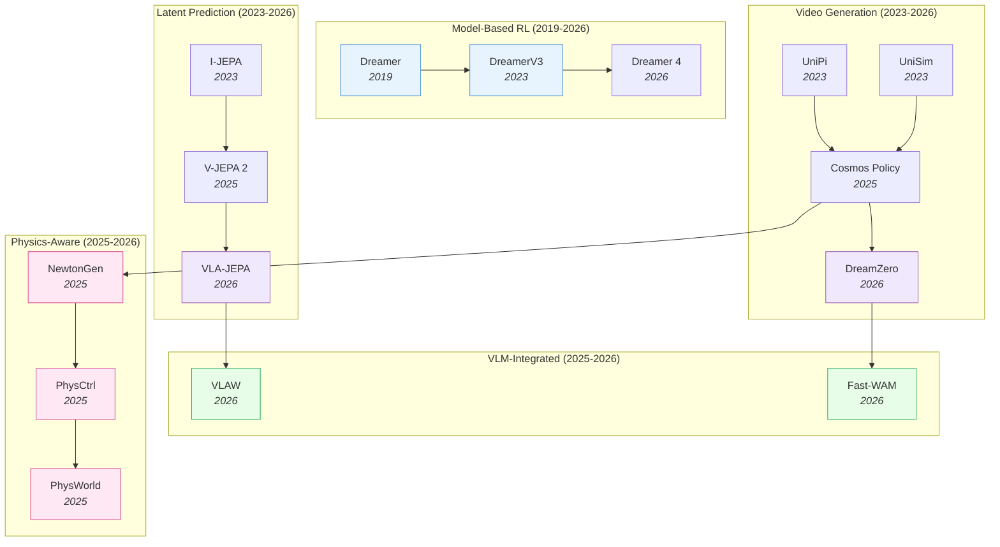

# World Action Models — Deep Dive

> [!abstract] Overview
> World Action Models (WAMs) learn to predict future states of the environment, giving robots the ability to "imagine" consequences before acting. Unlike VLAs that map observations directly to actions, WAMs explicitly model dynamics — enabling planning, robustness to perturbation, and sample-efficient learning. This note maps the full WAM landscape across five paradigms: VideoGen, latent prediction (JEPA family), model-based RL (Dreamer lineage), VLM-integrated, and efficient/action-centered designs.

## Evolution Graph

The field evolved through four threads: **model-based RL** (2019-2026) where Dreamer established latent imagination for planning; **video generation** (2023-2026) where diffusion models learned physics from internet video; **latent prediction** (2023-2026) where JEPA showed you can predict in representation space without reconstructing pixels; and **VLM integration** (2025-2026) where world models merged with VLAs for robust, efficient policies.

| Year | Paper | Contribution |
|------|-------|-------------|
| 2019 | [[1912.01603\|Dreamer]] | Latent imagination via RSSM; learned behaviors from pixels without reward |
| 2023 | [[2301.04104\|DreamerV3]] | Mastered diverse domains with fixed hyperparameters; universal model-based RL |
| 2023 | [[2302.00111\|UniPi]] | Actions as text-conditioned video; proved video generation = planning |
| 2023 | [[2310.06114\|UniSim]] | Universal simulator via video diffusion; interactive world generation |
| 2023 | [[2301.08243\|I-JEPA]] | Predict in latent space, not pixel space; avoids reconstruction artifacts |
| 2025 | [[2506.09985\|V-JEPA 2]] | Self-supervised video model enabling understanding, prediction, and planning |
| 2025 | [[2601.16163\|Cosmos Policy]] | Fine-tuned video diffusion model as visuomotor policy |
| 2026 | [[2602.15922\|DreamZero]] | 14B WAM: joint video + action prediction enables zero-shot policies |
| 2026 | [[2602.10098\|VLA-JEPA]] | JEPA world model + flow-matching action head; 97.2% LIBERO |
| 2026 | [[2602.12063\|VLAW]] | Iterative co-improvement: VLA and world model reinforce each other |
| 2026 | [[2509.24527\|Dreamer 4]] | Scalable world model training agents inside video game environments |
| 2026 | [[2603.16666\|Fast-WAM]] | WAM benefits without test-time imagination via video co-training |
| 2026 | [[2605.15153\|Pelican-Unified]] | Single-model unification of understanding + reasoning + imagination + action via shared latent z + UFG |
| 2026 | [[2605.12090\|WAM Survey]] | First formal WAM definition; Cascaded vs Joint architectural taxonomy; four-data-ecosystem analysis |
| 2026 | [[2605.10942\|HarmoWAM]] | Dual predictive+reactive experts + process-adaptive gating resolve generalization-precision trade-off |
| 2025 | [[2509.21309\|NewtonGen]] | Physics-consistent T2V via neural Newtonian dynamics |
| 2025 | [[2509.20358\|PhysCtrl]] | Generative physics for controllable video generation |
| 2025 | [[2511.07416\|PhysWorld]] | Robot learning from a physical world model |
| 2026 | [[2603.13770\|PhysAlign]] | Feature + 3D-representation alignment for physics-coherent video |
| 2026 | [[2603.26285\|PhysVid]] | Physics-aware local conditioning for generative video |

---

## 1. The Design Space

> [!star] WAM Definition & Cascaded vs Joint Taxonomy
> [[2605.12090|WAM Survey]] is the first paper to formally define WAMs and disambiguate them from VLAs (no dynamics model) and pure World Models (no action generation). It splits the architectural landscape along a single axis — ==Cascaded== (sequential: predict next state, then derive action) vs ==Joint== (unified state-action prediction) — and surveys four data-ecosystem axes (robot, human, simulation, internet-scale video) plus emerging evaluation protocols. The Cascaded/Joint distinction is the field-defining taxonomy that subsequent sections of this note implicitly use.

Three axes define where a WAM sits in the design landscape:

| Axis | Options | Trade-off |
|------|---------|-----------|
| **Where to predict** | Pixel space (DreamZero), Latent space (JEPA, UWM), Action space (Diffuser) | Pixel = rich but slow; Latent = fast but abstract; Action = efficient but no visual feedback |
| **When to predict** | Training-time only (Fast-WAM), Test-time imagination (DreamZero) | Training-time = fast inference; Test-time = more robust but 4.8x slower |
| **What to predict** | Full video (Cosmos), Optical flow (FlowVLA), Compressed latent (WoG), Future embeddings (JEPA) | Full video = interpretable but expensive; Latent = efficient but opaque |

**Where to predict** determines computational cost and expressiveness. Pixel-space prediction ([[2602.15922|DreamZero]]'s 14B DiT) generates full video frames — maximally expressive but requires iterative denoising (~150ms per frame). Latent-space prediction ([[2602.10098|VLA-JEPA]]'s V-JEPA2 predictor) operates on compressed embeddings — a single forward pass (~10ms) but loses fine visual detail. Action-space prediction ([[2205.09991|Diffuser]]) skips visual prediction entirely — fastest but provides no visual feedback for planning or debugging.

**When to predict** is the 2026 insight from [[2603.16666|Fast-WAM]]: you need video generation at training time (to learn spatiotemporal priors from internet video) but NOT at test time (where it adds 4.8x latency). The world model's value is in the representations it creates during training, not in the predictions it makes during deployment.

**What to predict** trades off between interpretability and efficiency. Full video (Cosmos) is human-readable but expensive. Optical flow ([[2508.18269|FlowVLA]]) captures motion efficiently. Future embeddings (JEPA) are opaque but compact. The choice depends on whether a human needs to inspect the predictions (development/debugging) or only the policy needs them (deployment).

> [!tip] The Core Trade-off
> VideoGen WAMs are the most robust (spatiotemporal priors from internet video) but the slowest. Latent prediction WAMs are fast and sample-efficient. [[2603.16666|Fast-WAM]] shows you can bridge this gap: train with video generation objectives but deploy without test-time imagination.

---

## 2. VideoGen WAMs

Video diffusion models repurposed as world simulators. The richest source of physics priors — trained on internet-scale video data.

**Planning as Video Generation** — The foundational insight: generating a video of the future IS a plan.

Video diffusion models learn physics by training on internet-scale video data — billions of clips showing objects falling, liquids pouring, hands manipulating. The denoising process implicitly learns the rules: 'if I push this cup, it slides; if I push it off the edge, it falls.' To generate a robot plan, you condition the diffusion model on the current observation and a language instruction, then denoise to produce a future video. The key insight ([[2302.00111|UniPi]]): the generated video IS the plan — an inverse dynamics model extracts the corresponding motor commands from the video frames. [[2602.15922|DreamZero]] scaled this to 14B parameters, jointly generating video and actions in a single forward pass, achieving zero-shot generalization to unseen tasks and embodiments.

- [[2310.06114|UniSim]], [[2302.00111|UniPi]], [[2310.10625|VLP]]

**Video Pretraining for Robot Policies** — Train on internet video, fine-tune for robot control.
- [[2605.15178|SANA-WM]], [[2605.06192|EA-WM]], [[2604.06168|Action Images]], [[2602.15922|DreamZero]], [[2602.12099|GigaBrain-0.5M*]], [[2601.16163|Cosmos Policy]], [[2601.21998|LingBot-VA]], [[2511.07732|ViPRA]], [[2508.00795|Video Policy]], [[2505.15659|FLARE]], [[2412.14803|VPP]], [[2410.06158|GR-2]], [[2312.13139|GR-1]]

**How SANA-WM Compresses Minute-Scale World Modeling**: [[2605.15178|SANA-WM]] (NVIDIA) is a **2.6B-parameter open-source** Hybrid Linear Diffusion Transformer generating **one-minute 720p videos** with precise 6-DoF camera control on a single GPU. Key architectural ingredients: a high-compression LTX2 tokenizer, a hybrid backbone fusing **frame-wise Gated DeltaNet (GDN)** (efficient recurrent context aggregation) with standard **softmax attention** (exact long-range recall), and a dual-branch camera controller (Ray-Local UCPE for coarse 6-DoF pose + Raw-Frame Plücker Mixing for fine intra-stride motion). An algebraic key-scaling factor ($1/\sqrt{D \cdot S}$) for GDN prevents state explosion over minute-scale sequences. Result: VBench Overall **80.62/81.89** at 720p single-GPU matching 480p/8-GPU baselines; **22 videos/hour** on H100, **39×** speedup distilled on RTX 5090; RotErr **4.50°** / TransErr **1.39** on simple trajectories. The first viable open-source minute-scale 720p WAM — closing the open-vs-industrial gap.

> [!star] Key Papers
> - [[2602.15922|DreamZero]] — 14B joint video+action model; 39.5% on unseen tasks, 42% cross-embodiment improvement, 7Hz real-time
> - [[2601.16163|Cosmos Policy]] — Fine-tuned Cosmos video model achieves 98.5% on [[2306.03310|LIBERO]]; proves pretrained video diffusion transfers to robot control

**Video Models as Data Engines** — Use generated video as synthetic training data instead of running the world model at test time.
- [[2512.24766|Dream2Flow]], [[2512.13644|DexWM]], [[2505.12705|DreamGen]], [[2504.15369|Inverse Probabilistic Adaptation]]

**Physics-Aligned Video Generation** — Explicitly enforce physical plausibility during video generation. See [[07_Physics-Aware-Embodied-AI]] for the full physics-aware design space (implicit/explicit/external-simulator approaches).
- [[2604.13036|Lyra 2.0]], [[2604.07348|MoRight]], [[2604.07209|INSPATIO-WORLD]], [[2603.26285|PhysVid]], [[2603.23376|ABot-PhysWorld]], [[2603.13770|PhysAlign]], [[2602.05986|RISE-Video]], [[2511.07416|PhysWorld]], [[2509.21309|NewtonGen]], [[2509.20358|PhysCtrl]], [[2503.15558|Cosmos-Reason1]], [[2409.18964|PhysGen]]

> [!star] Key Papers
> - [[2603.23376|ABot-PhysWorld]] — Diffusion-DPO for physics alignment; suppresses implausible predictions (object penetration, anti-gravity)
> - [[2509.21309|NewtonGen]] — Physics-consistent text-to-video via neural Newtonian dynamics; explicit physics constraints during generation
> - [[2509.20358|PhysCtrl]] — Generative physics for controllable video generation; control signals tied to physical priors

> [!tip] Video Generation = Physics Engine
> Video diffusion models trained on internet data implicitly learn physics. DreamZero proved joint video+action generation provides spatiotemporal priors that pure VLAs lack. But test-time video generation is expensive — consider [[2603.16666|Fast-WAM]]'s training-only approach. For an explicit physics-priors view, see [[07_Physics-Aware-Embodied-AI]].

---

## 3. Latent Prediction WAMs

Predict in representation space rather than pixel space — faster, more abstract, and avoids wasting capacity on irrelevant visual details. See [[05_Latent-World-Models]] for the detailed JEPA evolution.

Latent prediction avoids the computational expense of pixel-level video generation by operating in a compressed representation space. The JEPA family predicts future *embeddings* rather than future *pixels*: given the current state embedding and a candidate action, the predictor outputs the expected next-state embedding. This is orders of magnitude cheaper (~10ms vs ~150ms per prediction), enables real-time Model Predictive Control, and naturally filters out irrelevant visual noise (textures, lighting). The trade-off: latent predictions are opaque — a human cannot visually inspect whether the predicted future 'makes sense', complicating debugging and safety verification.

**JEPA Family** — Joint Embedding Predictive Architecture: predict future embeddings from current embeddings.
- [[2603.22281|ThinkJEPA]], [[2603.19312|LeWM]], [[2603.14482|V-JEPA 2.1]], [[2602.11832|JEPA-VLA]], [[2602.11389|Causal-JEPA]], [[2602.10098|VLA-JEPA]], [[2512.10942|VL-JEPA]], [[2511.19221|Percept-WAM]], [[2510.00739|TD-JEPA]], [[2506.09985|V-JEPA 2]]

> [!star] Key Papers
> - [[2602.10098|VLA-JEPA]] — Full VLA+JEPA pipeline: 97.2% [[2306.03310|LIBERO]] in-distribution, 79.5% [[2510.13626|LIBERO-Plus]] OOD, 65.2% SimplerEnv real robot
> - [[2506.09985|V-JEPA 2]] — 1M+ hours video pretraining; 80% pick-and-place with 62 hours unlabeled robot video
> - [[2602.11389|Causal-JEPA]] — Object-centric world model with causal reasoning via latent interventions

**Unified Latent Diffusion** — Shared diffusion transformer for both video and action in latent space.
- [[2605.06388|Semantic-LDM-WM]], [[2512.13030|Motus]], [[2505.11528|LaDi-WM]], [[2504.02792|UWM]], [[2503.18938|AdaWorld]]

> [!star] Key Papers
> - [[2605.06388|Semantic-LDM-WM]] — First systematic head-to-head of reconstruction- vs semantic-aligned latents in action-conditioned LDMs; semantic latents (V-JEPA 2.1, [[2502.14786|SigLIP 2]], Web-DINO) yield **+9.8 pp** VLA closed-loop success and **+13.6 pp** OOD robustness over reconstruction VAEs
> - [[2504.02792|UWM]] — Unified World Models: coupled video and action diffusion pretraining; clean modern approach
> - [[2505.11528|LaDi-WM]] — Latent diffusion WM on [[2304.07193|DINOv2]]+Siglip with imagination-guided iterative action refinement; +15.1% over SOTA on LIBERO-LONG with 10 demos

**Self-Supervised Latent Models** — Learn world representations from unlabeled data using self-supervised objectives.
- [[2604.10333|ZWM]], [[2604.03208|HWM]], [[2603.29090|HCLSM]], [[2511.08544|LeJEPA]], [[2509.14252|LLM-JEPA]], [[2507.19468|DINO-world]], [[2505.03176|seq-JEPA]], [[2504.16591|JEPA for RL]], [[2512.19605|KerJEPA]], [[2411.04983|DINO-WM]]

> [!star] Key Papers
> - [[2511.08544|LeJEPA]] — Provable and scalable SSL framework based on Euclidean latent geometry
> - [[2411.04983|DINO-WM]] — Task-agnostic world model on frozen DINOv2 features enables zero-shot planning

> [!tip] Latent > Pixel for Efficiency
> Latent prediction avoids the expensive pixel-level reconstruction of VideoGen WAMs. V-JEPA 2 achieves competitive manipulation performance using self-supervised video pre-training alone. The JEPA family shows that predicting in embedding space produces more semantically meaningful features — you don't waste capacity modeling textures and shadows. [[2605.06388|Semantic-LDM-WM]] formalizes this: in a controlled study within a single LDM framework, semantic-aligned latents (V-JEPA 2.1, SigLIP 2) beat reconstruction VAEs by +9.8 pp closed-loop and +13.6 pp OOD — visual fidelity is *not* the right objective for control.

---

## 4. Dreamer Lineage

Model-based RL from scratch: learn a latent dynamics model (RSSM) and plan via imagination in latent space. The oldest WAM paradigm, still evolving.

The Dreamer architecture centers on the Recurrent State-Space Model (RSSM): a recurrent neural network that maintains a compact latent state summarizing the agent's history, combined with a learned dynamics model that predicts how this state changes given an action. The key innovation: planning happens entirely in latent space — the agent 'imagines' thousands of possible action sequences by rolling forward through the RSSM, evaluates each via a learned value function, and selects the best without ever executing a physical action. [[2301.04104|DreamerV3]]'s breakthrough was proving this works with *fixed hyperparameters* across 150+ diverse domains — from Atari to robot locomotion — by using symlog normalization and KL balancing to stabilize training. This domain-agnosticism makes Dreamer the most reliable option when you don't have internet-scale video data or a pretrained VLM.

| Year | Paper | Contribution |
|------|-------|-------------|
| 2019 | [[1912.01603\|Dreamer]] | Latent imagination via RSSM; learned behaviors from pixels |
| 2020 | [[2005.05960\|Plan2Explore]] | Self-supervised exploration via world model disagreement |
| 2020 | [[2007.07853\|γ-Progress]] | Curiosity signal for active world model learning |
| 2022 | [[2206.14176\|DayDreamer]] | Adapted Dreamer to physical robots; hours-not-days learning |
| 2022 | [[2211.15944\|Continual-Dreamer]] | Explored continual RL with world models; measured forgetting |
| 2023 | [[2301.04104\|DreamerV3]] | Universal: fixed hyperparameters across 150+ diverse tasks |
| 2025 | [[2503.21047\|CBET-DreamerV3]] | Change-based intrinsic motivation for harder exploration |
| 2026 | [[2604.02911\|DreamTIP]] | Task-invariant Dreamer properties for efficient quadruped policy transfer |
| 2026 | [[2509.24527\|Dreamer 4]] | Scalable world model in complex video game environments |

**Related Model-Based Planning** — Planning algorithms that leverage learned world models.
- [[2604.08958|WOMBET]], [[2602.00475|GRASP]], [[2410.00564|JOWA]], [[2302.01877|AdaptDiffuser]], [[2205.09991|Diffuser]]

> [!star] Key Papers
> - [[2301.04104|DreamerV3]] — Fixed hyperparameters across 150+ tasks; proved model-based RL generalizes without per-task tuning
> - [[2205.09991|Diffuser]] — Denoising diffusion for trajectory optimization; unified planning and acting

> [!tip] Why Dreamer Still Matters
> Dreamer models are lean (no VLM backbone needed), sample-efficient (DayDreamer learned quadruped locomotion in 1 hour), and domain-agnostic (DreamerV3's fixed hyperparameters). When you don't have a pretrained VLM or internet video, the Dreamer approach remains the strongest option.

---

## 5. VLM-Integrated WAMs

VLMs provide semantic understanding; world models provide dynamics prediction. These papers combine both.

The integration challenge: VLMs provide semantic understanding (what objects are, what instructions mean) while world models provide dynamics prediction (what happens when you push this). Combining them requires bridging two very different representations — language-aligned token embeddings (VLM) and physics-aligned state dynamics (world model). Four integration strategies have emerged: **visual chain-of-thought** (VLM generates visual subgoals, world model plans between them), **unified architecture** (single model handles both reasoning and dynamics), **test-time imagination** (world model simulates futures, VLM evaluates them), and **compact motion** (predict condensed motion signals instead of full video). The choice depends on the bottleneck: if reasoning is hard, use VLM-dominated architectures; if physics is hard, use WM-dominated architectures.

**Visual Chain-of-Thought** — VLMs predict visual subgoals before generating actions.
- [[2604.07957|WorldMAP]], [[2603.14497|WorldVLM]], [[2509.02722|VLWM]], [[2507.23773|SimuRA]], [[2601.02456|InternVLA-A1]]

**Unified Policy + World Model** — Single framework that jointly trains policy and world model.
- [[2605.15153|Pelican-Unified]], [[2605.10942|HarmoWAM]], [[2602.12063|VLAW]], [[2511.17502|RynnVLA-002]], [[2506.21539|WorldVLA]], [[2506.19850|UniVLA]]

**How Pelican-Unified Achieves True Unification**: Where prior unified models stitch separate VLM + WM + action modules, [[2605.15153|Pelican-Unified]] integrates understanding, reasoning, imagination, and action as *interdependent dimensions* within a single end-to-end trainable loop. A ==VLM backbone== encodes multimodal context and emits a ==chain-of-thought reasoning trace== plus a dense ==shared latent variable z==; a ==Unified Future Generator== (diffusion transformer) conditions on z and *jointly* models future video and actions with shared computational resources and a combined loss. The latent z thereby acts as the central coupling point — simultaneously semantic (for reasoning), predictive (for imagination), and actionable (for control). Achieves **64.7** average on 8 multimodal VLM benchmarks (e.g., **+28.2pp** on Where2Place), **93.5%** on RoboTwin 50-task dual-arm, and ranks first on WorldArena imagination (**EWM 66.03**, 3D Accuracy **98.13**) while demonstrating unseen compositional and zero-shot generalization on real robots.

**How HarmoWAM Resolves the Generalization-Precision Trade-off**: HarmoWAM identifies a fundamental WAM dichotomy — "imagine-then-execute" architectures generalize well on transit but lack precision near contact, while "joint modeling" architectures are precise near targets but explore poorly. HarmoWAM merges both via a ==generative world model== feeding *two* action experts: a ==predictive expert== consumes current-step latent features for precise interaction, and a ==reactive expert== consumes *future predicted frames and latents* for generalizable exploration. A ==Process-Adaptive Gating Mechanism== dynamically switches between them based on visual task stage (transit vs interaction). Result: **89%** in-domain average across six real-world tasks with only **7.9%** drop on OOD — the smallest generalization gap reported among unified WAMs.

> [!star] Key Papers
> - [[2605.15153|Pelican-Unified]] — First single-model unification of understanding + reasoning + imagination + action via shared latent z + Unified Future Generator; **64.7** multimodal-VLM avg, **93.5%** RoboTwin dual-arm, **1st** on WorldArena (EWM **66.03**); real-robot zero-shot compositional generalization — the cleanest demonstration of structurally shared representations beating modular assembly
> - [[2605.10942|HarmoWAM]] — Resolves generalization-precision trade-off via dual experts + process-adaptive gating; **89%** in-domain, **−7.9%** OOD drop
> - [[2603.14497|WorldVLM]] — Hybrid: VLM for high-level reasoning + world model for low-level dynamics
> - [[2602.12063|VLAW]] — Iterative co-improvement loop: VLA and world model reinforce each other; 39% improvement

**Imagination & Test-Time Reasoning** — World models used for test-time simulation and planning.
- [[2604.11751|GWM-MPC]], [[2604.11302|3D-ALP]], [[2604.07392|ERA]], [[2602.08236|AVIC]], [[2507.12508|MindJourney]], [[2602.01960|GVP-WM]], [[2601.14514|JIT]]

> [!star] Key Papers
> - [[2602.08236|AVIC]] — Adaptive: decides *when and how much* to imagine based on task difficulty

**Compact Motion Representations** — Predict condensed motion signals instead of full video.
- [[2602.22010|WoG]]

> [!tip] The Co-Improvement Insight
> VLAW showed that VLA and world model don't just coexist — they actively improve each other through iterative training. The world model generates better synthetic data for the VLA, and the VLA's improving actions give the world model harder scenarios to learn from.

---

## 6. Efficient & Action-Centered WAMs

Full video generation at test time is 4.8x slower than pure VLAs. These models keep WAM benefits while eliminating the inference bottleneck.

| Model | Efficiency Strategy | Key Finding |
|-------|-------------------|-------------|
| [[2605.06247\|CKT-WAM]] | Parameter-efficient context transfer between WAMs | 86.1% LIBERO-Plus with **1.17%** trainable params; matches full FT |
| [[2603.16666\|Fast-WAM]] | Video co-training, no test-time imagination | WAM robustness without WAM latency |
| [[2603.17240\|GigaWorld-Policy]] | Action-centered architecture | Efficient action-focused world modeling |
| [[2512.19133\|WorldRFT]] | Latent world model + RL fine-tuning | Planning in latent space for driving |
| [[2504.16680\|RWM-U]] | Uncertainty-aware robotic world model | Offline model-based RL on real robots |
| [[2503.16806\|DyWA]] | Dynamics-adaptive world action model | Generalizable non-prehensile manipulation |
| [[2604.11351\|WM-DAgger]] | World model-based data aggregation | Eliminates need for online expert queries |
| [[2604.01985\|WAV]] | Forward-inverse asymmetry verification | Self-correcting world model verification |
| [[2410.00564\|JOWA]] | Jointly-optimized world-action pretraining | Scaled offline model-based RL |

Each efficiency strategy makes a different trade-off: **Fast-WAM** keeps the full video generation pipeline during training (learning spatiotemporal priors from internet video) but strips it at deployment — the ActionDiT runs alone at ~190ms/step while retaining the robustness benefits of video co-training. **GigaWorld-Policy** redesigns the architecture to be action-centered from the start, avoiding the need for a video branch entirely. **WorldRFT** uses a compact latent world model for RL fine-tuning — planning in latent space is fast enough for real-time driving. **RWM-U** adds epistemic uncertainty estimation to the world model, enabling the agent to know when its predictions are unreliable and fall back to cautious behavior.

> [!success] The Efficiency Recipe
> ==Train with video objectives== (to get spatiotemporal priors) → ==Deploy without video generation== (no test-time imagination). Fast-WAM proved this works: you get most of the robustness benefit without the latency penalty.

> [!tip] Training-Time vs Test-Time Video
> The critical insight from 2026: you need video generation at **training time** (to learn physics) but NOT at **test time** (where it causes latency). This decouples the benefit of VideoGen WAMs from their computational cost.

---

## 7. Self-Evolving WAMs

WAMs that autonomously improve through experience, self-play, or co-evolution. See [[06_Self-Evolving-VLA-WAM]] for the full deep-dive on self-evolving mechanisms, VLA vs WAM comparison, failure modes, and research directions.

| Model | Self-Improvement Mechanism |
|-------|--------------------------|
| [[2603.08403\|SPIRAL]] | Closed-loop self-improving action world model via reflective planning |
| [[2603.19370\|VAMPO]] | RL optimization of video action model dynamics via GRPO |
| [[2603.09030\|PlayWorld]] | Autonomous self-play data collection → world model training |
| [[2503.01584\|SENSEI]] | Semantic exploration with epistemic uncertainty + Go-Explore |
| [[2506.23468\|NavMorph]] | Self-evolving world model for VLN in continuous environments |
| [[2504.21024\|WebEvolver]] | Co-evolving web agent and world model |
| [[2502.05907\|EvoAgent]] | Continual self-evolving via world model; +105% on long-horizon tasks |

**SPIRAL's Reflective Planning Loop**: The agent generates a video plan (long-horizon action-conditioned video), then a CriticAgent evaluates it for temporal coherence and action completeness. Plans that fail the critic are rejected and regenerated with the critic's feedback incorporated. This creates a closed-loop self-improvement cycle: generate → critique → regenerate → deploy. The key insight is that judging plan quality is easier than generating good plans — the critic can leverage VLM reasoning to assess whether a video plan "makes physical sense" even if the generator can't produce perfect physics on the first try.

**EvoAgent's Three-Part Loop**: (1) Self-planning — the agent uses its world model to propose a plan for the current task; (2) Self-control — the agent executes the plan while monitoring prediction error; (3) Self-reflection — after execution, the agent compares predicted vs. actual outcomes and updates its world model and policy. The continual world model is the key enabler: it provides the prediction error signal for self-control and the training signal for self-reflection. EvoAgent showed this loop contributes 72% of total performance gain (though this was measured in Minecraft, not physical manipulation).

> [!tip] Why WAMs Enable Self-Evolution
> WAMs already have a learned dynamics model that generates synthetic experience — the agent can "rehearse" in imagination, discover failure modes, and improve without costly real-world interaction. See [[06_Self-Evolving-VLA-WAM]] for the comprehensive comparison of self-evolving VLAs, WAMs, and embodied agents.

---

## 8. Failure Modes & Robustness

| Failure Mode | Evidence | Implication |
|-------------|----------|-------------|
| **Hallucinated dynamics** | Video generation models may predict physically impossible futures | ABot-PhysWorld addresses this with Diffusion-DPO |
| **Artifact exploitation** | Agents may exploit unrealistic artifacts in generated video | Need physics-grounded training objectives |
| **Inference latency** | WAMs are ≥4.8x slower than VLAs ([[2603.22078\|WAM vs VLA Robustness]]) | Use Fast-WAM or training-only video |
| **Adversarial jailbreaking** | [[2604.05498\|JailWAM]] shows WAMs vulnerable to adversarial attacks on action generation | Need adversarial robustness training |
| **Visual perturbation robustness** | WAMs outperform VLAs on camera/light/background changes | Spatiotemporal priors from video pretraining help |
| **Object-identity entanglement** | Holistic WAMs fuse target identity with surrounding visual content; small scene changes flip target binding | [[2605.06481\|OA-WAM]] — object-addressable attention with cached identity addresses; +4.8pp LIBERO-Plus geometric robustness over π0.5 |

**OOD Detection for WAMs** — When should a WAM distrust its own predictions? Three approaches emerging:
- **Prediction error monitoring**: [[2603.04029|Self-Adapting RL]] tracks the residual between predicted and observed next states. When the residual exceeds a threshold, the world model flags the state as OOD and triggers targeted adaptation.
- **Surprise filtering**: [[2512.01119|WM Surprise Robustness]] distinguishes genuine OOD events (new physics) from sensor noise (camera glitch) by filtering prediction errors through a learned noise model.
- **Forward-inverse asymmetry**: [[2604.01985|WAV]] compares the forward model (predict next state from action) with the inverse model (infer action from state transition). When they disagree, the world model is unreliable — the asymmetry reveals states where the dynamics are poorly modeled.

> [!tip] When to Use WAM vs VLA
> **Use WAM when:** robustness to visual perturbations matters, physics-aware planning is needed, or real-world data is limited (world model enables imagination). **Use pure VLA when:** inference speed is critical, tasks are simple enough for direct imitation, or in-domain data is abundant.

---

## 9. Cross-Paradigm Comparison

| Paradigm | Speed | Robustness | Sample Efficiency | Transfer | Best For |
|----------|-------|-----------|-------------------|----------|----------|
| **VideoGen** (DreamZero) | Slow (7Hz) | Highest | Moderate | Cross-embodiment via video | Novel environments, zero-shot |
| **Latent** (VLA-JEPA) | Fast | High | High | Latent transfer | In-domain, real-time control |
| **Dreamer** (DreamerV3) | Fast | Moderate | Highest | Within-domain | Limited data, no VLM available |
| **VLM-Integrated** (VLAW) | Moderate | High | Moderate | Semantic transfer | Complex tasks needing reasoning |
| **Efficient** (Fast-WAM) | Fast | High | Moderate | VideoGen priors, fast deploy | Production deployment |

---

## Quick-Reference Matrix

| Question | Answer |
|----------|--------|
| Need physics? | VideoGen (DreamZero) or physics-aligned (ABot-PhysWorld) |
| Need speed? | Latent (VLA-JEPA) or Efficient (Fast-WAM) |
| Limited data? | Dreamer lineage (sample-efficient from scratch) |
| Need reasoning? | VLM-Integrated (VLAW, WorldVLM, AVIC) |
| Need both generalization AND precision? | [[2605.10942\|HarmoWAM]] — dual predictive+reactive experts with process-adaptive gating |
| Need self-improvement? | Self-Evolving (EvoAgent, SPIRAL) |
| Need cross-embodiment? | VideoGen (DreamZero) — video priors transfer |
| Need object-identity robustness? | [[2605.06481\|OA-WAM]] — object-addressable attention with cached identity addresses |
| Need parameter-efficient transfer? | [[2605.06247\|CKT-WAM]] — context-knowledge transfer at 1.17% trainable params |
| Production deployment? | Efficient (Fast-WAM) — training-time video, test-time speed |
| Full JEPA lineage? | [[05_Latent-World-Models]] for V-JEPA 2 → 2.1 → VL-JEPA → VLA-JEPA |

---

## Cross-References

- [[03_VLA]] — VLA deep-dive (Section 6 covers WAM-augmented VLAs)
- [[05_Latent-World-Models]] — Detailed JEPA evolution ([[2506.09985|V-JEPA 2]] → 2.1 → [[2512.10942|VL-JEPA]] → [[2602.10098|VLA-JEPA]] → [[2602.11832|JEPA-VLA]] → [[2510.00739|TD-JEPA]] → [[2511.19221|Percept-WAM]])
- [[06_Self-Evolving-VLA-WAM]] — Self-evolving VLAs & WAMs deep dive
- [[07_Physics-Aware-Embodied-AI]] — Physics-aware video generation, physics priors, and physics-coupled training
- [[08_VLA-Reasoning-and-CoT]] — Reasoning insertion patterns in WAM-augmented VLAs
- [[09_Egocentric-Pretraining-and-Human-Video]] — Egocentric video as a pretraining substrate for WAMs
- [[10_Force-Aware-and-Tactile-Policies]] — Force/tactile policies deep-dive; complements WAM action conditioning
- [[11_Sim-to-Real-Transfer]] — Sim-to-Real Transfer deep-dive; covers learned simulators as objects of study
- [[01_Embodied-AI-101]] — VLA vs WAM basics and four learning strategies
- [[02_Dataset-Benchmark-Environment]] — Datasets, benchmarks, and simulation platforms

---

*See [[03_VLA]] for the VLA alternative, [[07_Physics-Aware-Embodied-AI]] for physics-coupled training, or [[01_Embodied-AI-101]] to start from the basics.*
