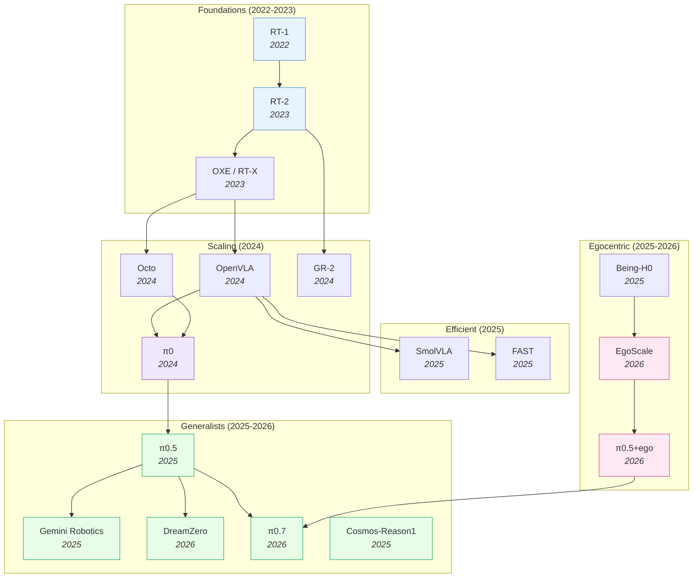

# Vision-Language-Action Models — Deep Dive

> [!abstract] Overview
> VLAs inherit robust multi-modal representations from pre-trained VLMs, giving robots semantic generalization that model-free and model-based approaches lack. From [[2212.06817|RT-1]]'s proof-of-concept (2022) to [[2504.16054|π0.5]]'s open-world household deployment (2025), VLAs have evolved from single-task imitation to general-purpose robot policies. This note maps the full VLA landscape: design principles, efficiency frontiers, spatial reasoning, world-model augmentation, RL post-training, multi-sensor integration, and failure modes.

## Evolution Graph

From Transformer-as-policy to flow-matching generalists — each step solved a specific bottleneck.

The field evolved through three phases: **proving the paradigm** (2022-2023), **scaling and opening** (2024), and **specialization** (2025-2026) — splitting into generalist, efficient, world-model-augmented, and egocentric-pretrained branches.

| Year | Model | Key Innovation | Bottleneck Solved |
|------|-------|----------------|-------------------|
| 2022 | [[2212.06817\|RT-1]] | Transformer on 130K real demos, 700 tasks | Proved Transformers work for robot control |
| 2023 | [[2307.15818\|RT-2]] | Fine-tuned PaLI-X (55B) VLM as policy | Web-scale knowledge transfers to robots |
| 2023 | [[2310.08864\|OXE]] | 1M+ trajectories from 22 robot types | Cross-embodiment positive transfer |
| 2024 | [[2405.12213\|Octo]] | Modular generalist policy | First open-source generalist robot policy |
| 2024 | [[2406.09246\|OpenVLA]] | Open-source 7B VLA | Democratized VLA research |
| 2024 | [[2410.06158\|GR-2]] | Web-scale video pre-training for actions | Video knowledge → robot manipulation |
| 2024 | [[2410.24164\|π0]] | Flow matching action expert + VLM | Continuous actions + dexterous manipulation |
| 2025 | [[2504.16054\|π0.5]] | Co-training on heterogeneous embodiments | Open-world generalization to unseen homes |
| 2025 | [[2503.20020\|Gemini Robotics]] | Gemini 2.0 extended to physical robots | Industrial-scale VLA |
| 2025 | [[2501.09747\|FAST]] | DCT+Huffman action compression | 5x faster VLA inference |
| 2025 | [[2506.01844\|SmolVLA]] | 450M param VLA | 7x less memory, 40% faster training |
| 2025 | [[2503.15558\|Cosmos-Reason1]] | Physical common-sense + embodied reasoning at WAM scale | Bridges physics priors and reasoning |
| 2025 | [[2507.15597\|Being-H0]] | VLA pretraining from large-scale human videos | Physical instruction tuning from human hands |
| 2026 | [[2602.15922\|DreamZero]] | Joint video + action prediction (14B WAM) | Zero-shot robot policies |
| 2026 | [[2602.16710\|EgoScale]] | 20,854-hour log-linear scaling law on egocentric data | Egocentric-data scaling laws |
| 2026 | [[2604.15483\|π0.7]] | Steerable generalist with emergent capabilities | Steerable open-world deployment |
| 2026 | [[2604.20100\|JoyAI-RA]] | Foundation model for robotic autonomy | Robust autonomy across embodiments |
| 2026 | [[2512.22414\|π0.5 + ego]] | Human→robot transfer via co-trained egocentric pretraining | Human-to-robot transfer emergence |

> [!tip] Three Evolutionary Phases
> **Phase 1 — Proof of concept** (2022-2023): [[2212.06817|RT-1]] proved Transformers work, [[2307.15818|RT-2]] showed VLM knowledge transfers, [[2310.08864|OXE]] built the cross-embodiment data foundation. **Phase 2 — Democratization** (2024): [[2406.09246|OpenVLA]] and [[2405.12213|Octo]] opened weights/code, [[2410.24164|π0]] introduced flow matching for continuous control. **Phase 3 — Specialization** (2025+): The field split — generalists scaled up ([[2504.16054|π0.5]] → [[2604.15483|π0.7]], Gemini, [[2604.20100|JoyAI-RA]]), efficient variants scaled down ([[2501.09747|FAST]], [[2506.01844|SmolVLA]]), WAMs added world prediction ([[2602.15922|DreamZero]]), and egocentric pretraining emerged as a fourth branch ([[2507.15597|Being-H0]], [[2602.16710|EgoScale]], [[2504.16054|π0.5]]+ego). See [[12_Egocentric-Pretraining-and-Human-Video#3. Scaling Laws for Egocentric Pretraining]] for the egocentric scaling story and [[06_VLA-Reasoning-and-CoT#1. The Four Reasoning Insertion Slots]] for reasoning-augmented variants.

---

## Part A — Design Space & Architectural Axes

*Foundations + the four axes along which VLAs vary: efficiency, spatial grounding, reasoning, world-model integration.*

### 1. Design-Space Principles

Based on [[2412.14058|RoboVLMs]]' 600+ experiments — the most systematic VLA design-space study to date.

> [!success] Ideal VLA Recipe (from [[2412.14058|RoboVLMs]])
> ==KosMos/[[2407.07726|PaliGemma]] backbone== + ==Policy Head fusion== + ==Continuous actions== + ==MoE== + ==Post-training on in-domain data==

#### Backbone Selection

| Category | Models | Finding |
|----------|--------|---------|
| ==Encoder-Decoder== | Flamingo family | Outperformed by decoder-only |
| ==Decoder-Only== | LLaVA, Qwen-VL, MoonDream, [[2407.07726\|PaliGemma]], KosMos | KosMos and [[2407.07726\|PaliGemma]] are distinctly superior |

**Why these two win**: These two architectures underwent the most extensive ==vision-language pre-training== on large-scale datasets (KosMos: 1.8B image-text pairs; [[2407.07726|PaliGemma]]: WebLI-filtered). This creates stronger alignment between visual and linguistic features — critical for understanding complex spatial instructions like "pick up the red cup to the left of the blue bowl." ==Encoder-decoder== architectures (Flamingo) underperform because they split visual and language processing into separate streams that only interact through ==cross-attention==, while ==decoder-only== models (LLaVA) process both modalities in a unified sequence but lack the scale of pre-training that KosMos and [[2407.07726|PaliGemma]] received.

#### Architecture Axes

**Action Space**: ==Continuous== (recommended) — avoids compounding ==discretization errors== that plague tokenized approaches. When you discretize a 7-DoF arm into 256 bins per dimension, you get $256^7 \approx 72$ quadrillion possible actions — most of which are physically impossible. [[2510.13054|VLA-0]] showed that even representing actions as plain text numbers works, because the VLM's tokenizer already handles numerical sequences — no custom action head needed. ==Flow matching== ([[2410.24164|π0]]) goes further: it models the action distribution as a continuous flow, enabling smooth, multi-modal action generation that captures the full diversity of valid solutions rather than collapsing to a single mode. [[2605.04678|Pixels-to-Tokens VLA]] systematically compares latent-action supervision strategies on Qwen3-VL-2B and finds the opposite for *learned* tokens: discrete latent-action token supervision (LA-Tok) beats continuous regression by **+2.2-2.7%** average, with image-based latents helping long-horizon [[2306.03310|LIBERO]]-Long (+8.4-10.8 pp) and action-based latents helping motorically complex [[2506.18088|RoboTwin 2.0]] (+17.5%) — discretization hurts when applied to *raw* joint angles, but helps when applied to a learned latent-action codebook.

**History Fusion**: ==Policy Head== (best balance) — VLM provides per-step features; separate head fuses history. [[2506.19816|CronusVLA]] extends this to multi-frame observations for temporal robustness. For truly long-horizon tasks requiring memory over minutes, [[2603.03596|MEM]] factorizes memory into ==dense short-term visual== (space-time separable attention over seconds) + ==compressed long-term language== (LLM summaries), enabling tasks requiring up to 15 minutes of memory. [[2603.12942|ReMem-VLA]] takes a different approach via ==dual-level recurrent queries== (frame-level EMA + chunk-level EMA) with gradient-free updates, hitting **94.5%** on memory-dependent simulation tasks.

**Training Loss**: ==Flow Matching== and ==MSE+BCE== achieve similar results. [[2602.18224|SimVLA]] confirmed this with a streamlined 0.5B model achieving 98.6% on [[2306.03310|LIBERO]].

#### Data Strategy

| Strategy | Impact |
|----------|--------|
| **In-domain only** | Best for task-specific performance |
| **Cross-embodiment ([[2310.08864\|OXE]])** | Improves few-shot learning (+17.2% on CALVIN few-shot) |
| **==Post-training==** ([[2310.08864\|OXE]] → in-domain fine-tune) | Best overall — highest gains for high-frequency skills |

[[2602.18532|VLANeXt]] distills [[2412.14058|RoboVLMs]]'s design-space lessons into 12 empirically-validated "recipes" — expressive policy modules with meta queries, action chunking, continuous-action objectives (flow matching), strong VLM backbones with soft VLM-policy connections, multi-view inputs, VLM-integrated proprioception, and an auxiliary frequency-domain loss. The resulting 2.5B-parameter [[2602.18532|VLANeXt]] achieves **80.1%** average on [[2510.13626|LIBERO-Plus]], **+10pp** over OpenVLA-OFT (7B). One useful negative finding: temporal observation history is often *not* beneficial, and world modeling is effective but computationally expensive — informing the §5 efficiency arguments below.

**Design-Space — Decision Matrix**

| Design axis | Recommendation (from [[2412.14058\|RoboVLMs]] / [[2602.18532\|VLANeXt]]) |
|---|---|
| Backbone family | Decoder-only KosMos / [[2407.07726\|PaliGemma]] (most VL pre-training → best instruction grounding) |
| Action space | ==Continuous== (avoids discretization errors); [[2410.24164\|π0]] flow matching for multi-modal actions |
| History fusion | ==Policy Head== (VLM features + separate fusion head); add memory ([[2603.03596\|MEM]], [[2603.12942\|ReMem-VLA]]) for >minute horizons |
| Training loss | Flow Matching ≈ MSE+BCE ([[2602.18224\|SimVLA]] confirms parity at 0.5B / 98.6% LIBERO) |
| Data strategy | ==Post-training== (cross-embodiment [[2310.08864\|OXE]] → in-domain fine-tune) beats either alone |
| Minimal-complexity baseline | [[2510.13054\|VLA-0]] (actions-as-text on an unmodified VLM — no custom head) |

#### 1.3 Latent-Action & Action-Tokenization Pretraining

A distinct design axis from the backbone/action-space choices above: *how to learn an action vocabulary before action labels exist*. Latent-action models (LAMs) infer transition codes from action-free video; tokenizers compress continuous joints into discrete codes. The shared lesson — quantize a *learned* latent, not the raw joint stream (see §1's discretization-error note).

- **[[2505.06111|UniVLA]]** — A two-stage ==task-centric latent action== framework that uses ==DINOv2== + language conditioning to decouple task-relevant motion from environment noise on a Prismatic-7B VLM; **95.2%** LIBERO (+18.7pp over OpenVLA), **47.1%** R2R navigation, **81.7%** real AgileX. The foundational action-free-video latent-action pretrain.
- **[[2511.21428|LAPS]]** — A fully ==unsupervised pipeline== that turns continuous industrial video into action primitives via ==Latent Action Energy== boundary detection + frozen-encoder k-means clustering; GTEA F1@5s **73.12**, industrial exocentric F1@5s **84.75**, ICSS **0.926** — discovers the action vocabulary upstream of segmentation.
- **[[2507.23682|villa-X]]** — A latent-action model with a proprioceptive ==Forward Dynamics Model== auxiliary decoder + ==embodiment context vector== that forces latents onto physical dynamics; **77.7%** SIMPLER Google / **62.5%** WidowX, zero-shot to unseen Realman/XArm.
- **[[2601.04061|CLAP]]** — A ==Contrastive Latent Action Pretraining== framework that aligns human-video latents with a robot-derived quantized action space via dual ==CLAP-NTP== (reasoning) + ==CLAP-RF== (high-freq control); **91.0%** LIBERO (82% LIBERO-Long), **61.0%** real bimanual Astribot.
- **[[2605.13403|RotVLA]]** — A ==continuous rotational latent action== model representing each latent as an ==SO(n)== rotation matrix via ==SoftVQ== + SVD projection + ==triplet temporal-compositionality== to avoid discrete-quantization discontinuity; **98.2%** LIBERO, **89.6%** RoboTwin 2.0 bimanual.
- **[[2512.04952|FASTer]]** — A learnable ==FASTerVQ== action tokenizer (==Action Patchifier== + Transformer-based ==Residual VQ==) that resolves the compression-vs-reconstruction trade-off of DCT tokenization; **97.9%** LIBERO, lowest OOD drop (**29%**) on VLABench, **87.9%** real Simpler-Bridge.
- **[[2602.21736|JALA]]** — A ==Jointly-Aligned Latent Actions== framework that aligns VLA-context predictive embeddings with inverse-dynamics latents (no pixel reconstruction) + ==UniHand-Mix== 7.5M lab + in-the-wild human videos; **96.9%** LIBERO Two-View / **92.3%** Single-View, robust to visual shift with human-only pretraining.
- **[[2602.10556|LAP]]** — A ==Language-Action Pre-training== method that parses continuous actions into structured natural-language tokens predicted autoregressively by PaliGemma-3B + knowledge-insulated diffusion head; **>50%** zero-shot across 3 unseen embodiments (**2×** prior), **2.5×** fewer demos to fine-tune.
- **[[2605.28634|PrimitiveVLA]]** — A ==primitive-centric disassemble-and-assemble== paradigm with 11 reusable motion primitives auto-extracted from task demos + VLM primitive planner; **+9.2%** OpenVLA on LIBERO-90, matches full-data at **50%** data, **6×** novel-task SR (to **45.5%**).
- **[[2605.22671|BehaviorVLA]]** — A ==Mamba causal three-stream== Visuomotor Behavior Encoder that distills demos into time-invariant prototypes + phase states, paired with a Phase-conditioned decoder; **98%** LIBERO, **58%** RoboTwin 2.0 Hard (+37.7% over RDT), **70%** real bimanual generalization.
- **[[2605.22183|AVP]]** — An end-to-end VLA with an explicit ==visual-primitive interface== where the VLM predicts discretized 2D spatial anchors as next-stage subtasks so the action expert offloads spatial reasoning to focus on motion; **90.28%** chess / **86.18%** pick-place, **83%** unseen board-to-board (π0.5 **0%**).

> [!star] Key Papers
> - [[2412.14058|RoboVLMs]] — The 600+-experiment design-space study that anchors every recommendation in this section
> - [[2602.18532|VLANeXt]] — Distills the design space into 12 validated recipes; 2.5B model beats 7B OpenVLA-OFT on [[2510.13626|LIBERO-Plus]]
> - [[2410.24164|π0]] — Flow-matching action head; the reference continuous-action generator
> - [[2510.13054|VLA-0]] — The minimalist counter-proof: actions-as-text on an unmodified VLM is competitive
> - [[2602.18224|SimVLA]] — Streamlined 0.5B model at 98.6% LIBERO; evidence that loss-function choice is second-order

> [!tip] The [[2510.13054|VLA-0]] Surprise
> [[2510.13054|VLA-0]] showed you don't need custom action heads, special tokenizers, or architectural changes at all — just fine-tune an unmodified VLM with actions as text. Sometimes the simplest approach wins.

---

### 2. Efficient & Lightweight VLAs

Full-size VLAs (7B+) are impractical for real-time robot control because every step requires a forward pass through a multi-billion-parameter VLM. The efficiency frontier resolves this tension via four orthogonal axes — compress the action stream, distill the model, reduce the architecture, or eliminate the iterative denoising step entirely. Each strategy targets a different cost center, and they compose: e.g. a distilled small backbone with action-token compression and one-step flow stacks the savings.

#### 2.1 Compression & Tokenization

Reduce the *information* the VLA processes — action streams are highly redundant across timesteps, so frequency-domain or learned compression yields near-lossless speedups.

- **[[2606.02735|S2-VLA]]** — A cleaner executor-conditioning interface combining ==Specify More== (hierarchical relabeling) + ==See Less== (==visual evidence budgeting== via learned gate heads); **94.0%/95.5%** on LIBERO-PRO goal/object and a real-robot jump from **54.2% → 79.0%** mean subtask success over π0.5.
- **[[2501.09747|FAST]]** — A ==DCT+Huffman action tokenization== scheme exploiting that adjacent action timesteps are highly correlated, so frequency-domain compression is nearly lossless; **5x** faster inference. The foundational efficiency-via-tokenization paper.
- **[[2604.03191|Compression Gap]]** — An ==information-theoretic data-processing-inequality framework== that isolates fixed discrete codebooks as the binding bottleneck; Diffusion Policy gains **+26.0pp** (ResNet-18 → SigLIP) vs only **+10.4pp** for OAT discrete tokenization. A negative result motivating one-step flow.
- **[[2604.05323|VLA-InfoEntropy]]** — A training-free vision-token selection method ranking tokens by ==visual entropy== + ==attention entropy==, with ==timestep-conditioned dynamic selection== and ==KV-cache== reuse of low-information tokens; **1.53x** speedup (**−39.8%** latency, **−34.9%** FLOPs) at **76.4%** LIBERO (vs OpenVLA **75.0%**).
- **[[2509.22093|Action-Aware VLA Pruning]]** — A ==text-driven anticipatory pruning== of task-relevant visual tokens from an early layer + an ==action-aware dynamic strategy== gating pruning by end-effector motion magnitude; **1.35x** LIBERO speedup at **94.4–96.3%** SR, **1.49x** real Jaco2 (76.9→**51.8 ms**) with SR rising **85.8→88.3%**.
- **[[2506.12723|SP-VLA]]** — A joint ==action-type model scheduling== (full VLA for deliberative steps, Ridge-regression generator for intuitive steps) + ==spatio-semantic dual-aware token pruning== (cumulative attention + Canny contours); **1.5x** LIBERO / **2.4x** SimplerEnv speedup at **<3%** accuracy drop.
- **[[2506.10100|EfficientVLA]]** — A ==training-free== three-axis compression that prunes inconsequential language layers, selects task-aware diverse visual tokens, and statically caches diffusion-head features across denoising steps; **1.93x** speedup at **28.9%** FLOPs (**−0.6%** SR) on SIMPLER, **2.0x** on CogACT-Large.

#### 2.2 Distillation & Small Backbones

Compress the *model* — teacher's knowledge compresses because most VLA capacity models language understanding, not motor control.

- **[[2511.04555|Evo-1]]** (0.77B) — A lightweight VLA on an InternVL3-1B backbone + cross-modulated ==flow-matching== DiT (stacked cross-attention only) with a two-stage freeze-then-finetune recipe that preserves semantic alignment; **94.8%** LIBERO, **80.6%** Meta-World, **78%** real xArm6 at **16.4 Hz** on **2.3 GB**.
- **[[2506.01844|SmolVLA]]** (450M) — A distilled small VLA that compresses a 7B VLA into 450M params with only ~2% accuracy loss; **7x** less memory, **40%** faster training than [[2406.09246|OpenVLA]]. The canonical small-VLA baseline.
- **[[2509.09372|VLA-Adapter]]** (0.5B) — A ==Bridge Attention== adapter with ==learnable injection ratio== that fuses all-layer raw VLM features + all-layer ActionQuery; **97.3%** LIBERO without robotic pre-training, **219.2 Hz** inference (**3×** faster than OpenVLA-OFT) at **36.5 ms** latency; **4.42** avg task length on CALVIN ABC→D zero-shot.
- **[[2409.12514|TinyVLA]]** — A compact pre-trained VLM (70M–1.4B) + ==LoRA fine-tuning== + ==Diffusion Policy action head==; **94.0%** real-world single-arm (vs **68.3%** OpenVLA), **44.5%** bimanual (vs **0%** OpenVLA), **20×** faster (**14 ms** vs **292 ms**) at **5.5×** fewer parameters — the early small-VLA recipe.

#### 2.3 Architecture Reduction

Replace expensive components with minimal ones — complex action decoders are unnecessary when the VLM backbone is strong enough.

- **[[2605.06175|VLA-GSE]]** — An SVD-initialized generalized+specialized expert PEFT method; **81.2%** zero-shot on [[2510.13626|LIBERO-Plus]], beating full fine-tuning by **+6.3pp** while preserving multimodal understanding.
- **[[2604.11757|StarVLA-alpha]]** — A ==lightweight MLP action head== on a strong ==pre-trained VLM backbone== with a ==minimal data pipeline== and a ==single generalist model== across embodiments; **98.8%** [[2306.03310|LIBERO]], **76.0%** SimplerEnv Google-VM, **33.6%** real RoboChallenge — continuous-action MLP matches complex action heads, proving complex action decoders are unnecessary.
- **[[2604.05672|A1]]** (7B) — A ==Molmo-7B backbone== + Qwen3 flow-matching head with ==budget-aware adaptive inference== (==multi-exit training== + action-consistency ==early-termination==) and ==Inter-Layer Truncated Flow Matching== (10→2 steps); **72.3%** latency reduction (**37.8s → 10.5s**) at **96.4%** LIBERO, plus **75.3%** LIBERO-Plus OOD (vs OpenVLA-OFT **69.6%**).
- **[[2601.03309|VLM4VLA]]** — A ==minimalist adaptation== study integrating general-purpose VLMs into VLA policies with **<1%** added params via an MLP head + Huber-loss imitation across 24 VLMs; matches OpenVLA/π0 despite simplicity, and freezing the *vision* encoder (not language) is what hurts — locating the visual semantic gap.
- **[[2510.13054|VLA-0]]** — An unmodified ==Qwen-VL-2.5-3B== that emits actions as ==space-separated numerical text strings== via native text generation + ==masked action augmentation== + ==action ensembling==; **94.7%** LIBERO (rank **1.0** of non-pretrained), surpasses SmolVLA by **+12.5pp** on real SO-100 robot — the simplest-possible recipe.
- **[[2508.21046|CogVLA]]** — An ==instruction-driven routing + sparsification== framework: 3-stage EFA-Routing (visual aggregation) + LFP-Routing (LLM pruning) + coupled ==CAtten== with parallel action-chunk decoding; **97.4%** LIBERO, **70.0%** real ALOHA at **2.79x** faster inference, **3.12x** fewer FLOPs, **2.49x** lower training cost.
- **[[2406.04339|RoboMamba]]** — A ==Mamba state-space backbone== VLA (CLIP encoder + Mamba LLM + MLP pose head) replacing quadratic Transformer attention; two-stage align-then-manipulate training updates only a **0.1%** (**3.7M**) policy head; **7×** faster inference than LLaMA-AdapterV2/ManipLLM, **+7.0%** seen / **+2.0%** unseen SR — the SSM-backbone point in the efficiency design space.
- **[[2312.01990|SARA-RT]]** — A ==Self-Adaptive Robust Attention== method: ==linear attention== with ==learnable pre-processing matrices== plus an ==up-training== step that converts pretrained quadratic-attention policies without retraining; constant-time inference (**~100ms** regardless of point-cloud size), **0.75** grasp SR (vs **0.64**), **14%** RT-2 speedup — quadratic attention made linear.

#### 2.4 One-Step & Parallel Decoding

Eliminate the iterative denoising / autoregressive bottleneck — the *amount* of refinement should be learned or skipped, not fixed.

- **[[2606.05737|One-Step VLA]]** — A distillation-free ==noise-shift strategy== in ==conditional flow matching== that biases training toward high-noise states so one decode step learns an accurate velocity field for VLA's "rich-condition, compact-target" structure; one-step matches or beats 10-step at **95.6%** LIBERO-Long, validated on real bimanual π0.5.
- **[[2605.09948|LoopVLA]]** (1.2B) — A recurrent ==Loop Block== + learned sufficiency head that dynamically allocates depth per state; **−45%** params, **1.7x** throughput while maintaining [[2306.03310|LIBERO]] performance.
- **[[2605.08799|ElasticFlow]]** — A one-step ==average velocity field== policy + ==elastic time abstraction==; **14ms** inference at **71Hz**, **98.5%** [[2306.03310|LIBERO]], **5x** faster than [[2303.04137|Diffusion Policy]] with smoother trajectories (Jerk **1.1×10⁻³** vs **3.2×10⁻³**).
- **[[2604.05656|SnapFlow]]** — A one-step flow-distillation method; **3.3x** faster [[2504.16054|π0.5]] at **83ms** with minimal quality loss.
- **[[2604.04161|AAC]]** — A training-free ==inference-time== chunk-size selector from predictive uncertainty: ==action entropy== (==Gaussian differential entropy== for continuous + ==discrete entropy== for gripper) sampled over parallel candidates, picking the size where the entropy jump peaks; **+15%** real-world success (**67.0% → 82.0%**), **+2.3%** RoboCasa, **+4%** LIBERO-Long.
- **[[2604.02965|SV-VLA]]** — A ==speculative verification== scheme that decouples a heavy ==Macro-Planner== (long action chunks + a ==planning-context feature==) from a lightweight ==Verifier== which re-plans only when execution deviates past a threshold; **2.17x** speedup over closed-loop OpenVLA-OFT and **90.9%** LIBERO (**+11.4%** over open-loop chunking).
- **[[2603.26320|DFM-VLA]]** — A ==discrete flow matching== method for iterative full-sequence action refinement that cures the "irreversible commitment" of AR/discrete-diffusion decoding via a two-stage ==stochastic-refine + greedy-validate== schedule with ==adaptive KV caching==; **4.44** CALVIN avg length, **95.7%** LIBERO, **70.8%** real bimanual (vs π0-FAST **42.5%**) at a **2.4×** speedup.
- **[[2602.20200|OptimusVLA]]** — A memory-conditioned denoising VLA that cuts NFE via a ==Global Prior Memory== (retrieves similar trajectories to adapt noise scale + NFE by retrieval confidence) + a Mamba ==Local Consistency Memory== injecting a temporal-coherence bias; **98.6%** LIBERO, NFE **10.0→3.2**, **2.9x** real / **6.5x** sim speedup.
- **[[2511.14148|AsyncVLA]]** — An ==Asynchronous Flow Matching (AFM)== policy with a ==confidence rater== that masks low-confidence action tokens for regeneration + ==unified SFM/AFM training== + ==KV-cache reuse==; **97.4%** LIBERO, **70.8%** WidowX, **74.9%** Google Robot visual matching.
- **[[2503.02310|PD-VLA]]** — A training-free ==parallel decoding== scheme that swaps ==causal attention== for ==bidirectional attention== so all action tokens update simultaneously, iterating ==Jacobi decoding== to a fixed point; **2.52x** execution-frequency gain (**4.56 Hz** vs **1.81 Hz**) at **94.7%** LIBERO, real push-button **80%** (vs **60%**), pour-water **60%** (vs **10%**).

#### 2.5 Dual-System Latency & Streaming

The other efficiency frontier targets the *control loop* rather than per-call FLOPs: skip the heavy VLM on intermediate steps, overlap generation with execution, or draft-then-verify across a fast/slow path. These compose with §2.1–2.4 and matter most when the bottleneck is wall-clock latency, not parameter count.

- **[[2605.02739|Latent Bridge]]** — A lightweight model that predicts ==temporal feature deltas== so the VLM backbone is skipped on intermediate steps via a ==feature-space bridge== (GR00T) + ==KV-cache bridge== (π0.5); cuts VLM calls **50–75%**, **1.73×** GR00T speedup at **94.5%** retention.
- **[[2603.28565|StreamingVLA]]** — A ==streaming paradigm== that overlaps all VLA stages via ==State-based Action Flow Matching== (single-action generation+execution) + ==saliency-aware adaptive early observation==; **1.57×** per-action speedup, **6.45×** halting-time cut at **94.9%** (vs 95.1%).
- **[[2605.13778|Realtime-VLA FLASH]]** — A dual-path ==speculative inference== system where a 110M ==draft model== proposes action chunks and the full path verifies/falls back; **3.04×** task-latency speedup (58.0→**19.1 ms**) at **93.8%** LIBERO (−0.3pp).
- **[[2508.20072|Discrete Diffusion VLA]]** — A ==masked-token discrete diffusion== action decoder unified in the VLM transformer + ==confidence-guided easy-first== adaptive inference; **96.3%** LIBERO, **~2×** lower latency, only **1.4%** language degradation OOD.
- **[[2603.28740|FocusVLA]]** — A ==Modality Cascaded Attention== design (sequential action-latent/query/visual integration) + dual-level ==Focus Attention== pruning action-irrelevant patches; 0.5B beats 7B models at **98.7%** LIBERO, **58%/15%** RoboTwin 2.0 easy/hard.
- **[[2603.22003|VP-VLA]]** — A dual-system VLA (System-2 Planner / System-1 Controller) using structured ==visual prompts== (crosshairs, bounding boxes) as an explicit interface + an auxiliary ==visual-grounding objective== on key frames; **53.8%** Robocasa-GR1-Tabletop (**+5.0%** over QwenOFT), **85%** real waste-sorting OOD at a **2.5%** generalization gap (vs **16.7%** drop).
- **[[2604.20834|PokeVLA]]** — A compact ==PokeVLM== (Qwen2.5-0.5B, 2.4M-sample embodied pretrain) + VL-Action post-training; the **1.22B** model hits **83.5%** LIBERO-Plus (SOTA), **79.3%** LIBERO-only transfer, **81.25%** real-world — pocket-sized dual-system.
- **[[2602.13710|HBVLA]]** — A ==1-bit post-training quantization== method via ==rectified-Hessian weight partitioning== protecting action-critical weights + ==Haar-domain group-wise binarization==; **90.3%** OpenVLA-OFT LIBERO (only **6.5%** drop vs other 1-bit PTQ), real Mobile-ALOHA.

#### 2.6 Post-Training Quantization

Shrink the *weights* without retraining — the lesson shared across this sub-section is that VLA quantization must be action-centric: protect the channels/blocks that carry motor fidelity and quantize the rest aggressively. Sits between §2.2's distillation and §2.5's 1-bit HBVLA on the precision-reduction axis.

- **[[2602.20309|QuantVLA]]** — A training-free ==selective W4A8 quantization== that integerizes the LLM backbone + DiT-head MLPs while keeping attention projections in FP, plus ==Attention Temperature Matching== + ==Output Head Balancing== per-head calibration; **70%** memory cut for π0.5 (4.27→**1.28 GB**) at **97.6%** LIBERO (vs 97.1% FP16).
- **[[2602.03782|QVLA]]** — An action-centric ==channel-wise mixed-precision quantization== with two-stage per-channel action-sensitivity estimation + a greedy bit-demotion algorithm (0/2/4/8/16-bit) that unifies quantization and structural pruning; **99.3%** of FP OpenVLA at W4A4 (**0.5%** drop) with VRAM **28.2%** and **1.47x** speedup.

**Efficient VLA — Decision Matrix**

| Need | Recommendation |
|---|---|
| Sub-20ms real-time control | [[2605.08799\|ElasticFlow]] (one-step flow at **14ms/71Hz**) |
| Smallest deployable VLA | [[2506.01844\|SmolVLA]] (450M) or [[2509.09372\|VLA-Adapter]] (0.5B) |
| PEFT preserving foundational capabilities | [[2605.06175\|VLA-GSE]] (**+6.3pp** over FFT) |
| Zero architectural changes | [[2510.13054\|VLA-0]] (actions as text) |
| Compress an existing flow-matching VLA | [[2604.05656\|SnapFlow]] (**3.3x** faster [[2504.16054\|π0.5]]) |
| Training-free token reduction | [[2604.05323\|VLA-InfoEntropy]] (**1.53x** speedup) |
| Dynamic compute allocation | [[2605.09948\|LoopVLA]] (**−45%** params, **1.7x** throughput) |
| Action-stream compression | [[2501.09747\|FAST]] (DCT+Huffman, **5x** faster) |

> [!star] Key Papers
> - [[2605.08799|ElasticFlow]] — One-step physics-consistent policy via average velocity field; **14ms** inference at **71Hz**, **98.5%** [[2306.03310|LIBERO]], **5x** faster than [[2303.04137|Diffusion Policy]]
> - [[2501.09747|FAST]] — DCT+Huffman action compression for **5x** faster VLA inference; the foundational efficiency-via-tokenization paper
> - [[2506.01844|SmolVLA]] — 450M-param distilled VLA; **7x** less memory, **40%** faster training; the canonical small-VLA baseline

> [!tip] When Smaller Is Enough
> For structured environments with known objects, [[2506.01844|SmolVLA]] (450M) matches larger models. For open-world tasks with novel objects, you still need 3B+. The sweet spot: use [[2501.09747|FAST]] tokenization on a mid-size model, or one-step flow ([[2605.08799|ElasticFlow]]) when sub-20ms control matters. Cross-reference [[07_WAM#6. Efficient & Action-Centered WAMs]] for the WAM-side efficiency recipe (training-time video, test-time speed).

---

### 3. Spatial & 3D-Aware VLAs

Standard VLAs process 2D images and lack explicit 3D understanding — but real-world manipulation requires reasoning about depth, contact, and viewpoint-invariant geometry. The cluster splits along three orthogonal strategies for injecting 3D awareness: add explicit depth/point-cloud streams (architectural complexity), supervise implicit 3D perception during training (deploy-time efficiency), or align the encoder with a 3D-pretrained teacher (zero inference overhead). Each strategy trades a different cost — explicit approaches generalize best to novel viewpoints, implicit approaches deploy cheapest, representation alignment is the recent compromise.

#### 3.1 Explicit 3D Integration

Add depth sensors, point clouds, or 3D coordinate embeddings as additional input modalities. Strongest generalization to novel viewpoints because the geometry is *actually present* — at the cost of architectural complexity and sensor requirements.

- **[[2606.03943|PointAction]]** — A ==3D-pointmap-as-universal-action== framework where a ==universal video-to-point model== predicts dynamic 3D pointmaps from embodiment-agnostic video + a lightweight ==point-to-action decoder==; **47.7%** in-distribution + **17.0%** unseen-task SR on RoboCasa365 (2–**2.5×** over baselines), **43.0%** cross-embodiment real xArm7.
- **[[2606.02274|Dexterity-BEV]]** — A 3D-aware VLA integrating per-pixel 3D into multi-view RGB-D via ==aligned vertex maps + vertex spectrums== and a canonical ==Bird's-Eye-View reference frame==; **89.9%** avg on modified-pose LIBERO where 2D baselines fall **<10%**, plus **76.7%** "Fold Mailer Box" (vs X-VLA **56.7%**) and **93.3%** "Handover Book" real bimanual.
- **[[2508.09071|GeoVLA]]** — A ==dual-path== architecture: a frozen VLM for 2D vision-language parallel to a ==Point Embedding Network== (PEN) using an ==end-effector token== as spatial anchor, fused by a ==3D-enhanced Action Expert== (3DAE) Diffusion Transformer with static-routed MoE; **97.7%** [[2306.03310|LIBERO]], **77%** ManiSkill2; robust to viewpoint/scale shifts.
- **[[2605.11832|AML-VLA]]** — A ==Geometry-Guided Gated Transformer== (G³T) fusing synthesized multi-view + monocular geometric priors with Action Manifold Learning; **98.6%** [[2306.03310|LIBERO]], **85.7%** [[2510.13626|LIBERO-Plus]], **86.06%** [[2506.18088|RoboTwin 2.0]] real bimanual.
- **[[2604.12908|VGA]]** — A ==VGGT== 3D-world-model backbone + Progressive Volumetric Modulation for vision-to-geometry mapping; **98.1%** [[2306.03310|LIBERO]] with **+6%** OOD.
- **[[2603.25399|LaMP]]** — A ==dual-expert== framework where a Motion Expert learns dense ==3D scene flow== as a latent motion prior via ==conditional flow matching==, fused into last-layer VLM features by ==gated cross-attention== to condition the Action Expert; **98.3%** [[2306.03310|LIBERO]] (**96.7%** Long), **79.3%** LIBERO-Plus OOD (**+9.7pp** over OpenVLA-OFT), **62.5%** real OOD.
- **[[2603.24393|3D-MIX]]** — A plug-and-play ==VGGT-derived 3D feature fusion== with ==semantic-conditioned adaptive gating== (==GatedFusion==) blending 3D geometry with 2D MLLM semantics into GR00T-/π-style VLAs unchanged; **98.05%** LIBERO, **68.23%** SIMPLER (**+10.42%** over baseline), **+12.51%** OOD on RynnBrain-8B.
- **[[2506.22242|4D-VLA]]** — A VLA with ==3D coordinate spatial vision tokens== + ==adaptive Memory Bank Sampling== using learnable temporal positional encodings on InternVL-4B; **+12.1pp** avg over OpenVLA on LIBERO (**+25.4pp** on LONG); **81.0%** in-view + **73.8%** cross-view on MV-Bench; **85.63%** real Franka (vs **27.70%** OpenVLA).
- **[[2501.15830|SpatialVLA]]** — A spatial VLA whose ==Ego3D Position Encoding== injects depth + egocentric 3D pixel positions + ==Adaptive Action Grids== using parameterized Gaussians for non-uniform spatial tokens, ==two-stage trained== on **1.1M** demos; **71.9%/68.8%** SimplerEnv Google Robot, **78.1%** LIBERO — the foundational explicit-3D baseline for VLAs.
- **[[2602.11236|ABot-M0]]** — An ==Action Manifold Learning (AML)== model predicting clean actions on a ==low-dimensional manifold== + ==UniACT-dataset== harmonizing **6M+** trajectories + ==modular VGGT/Qwen-Image-Edit geometric priors== via cross-attention; **98.6%** LIBERO, **80.5%** LIBERO-Plus (vs **42.9%** UniVLA), **58.3%** RoboCasa GR1 (vs **47.6%** GR00T-N1.6).
- **[[2403.09631|3D-VLA]]** — A generative VLA pairing a ==3D vision encoder== + LLM backbone with ==interaction tokens== over RGBD/point-cloud/bbox + a large 3D embodied-instruction dataset, generating multimodal goal states (RGBD + point clouds). The foundational generative 3D-VLA-as-world-model baseline.
- **[[2605.29416|3DVLA]]** — A ==plug-and-play== 3D-reasoning module for pretrained VLAs via ==multi-view spatial fusion== + ==object-centric 3D instance module== (entities in 3D, not 2D bboxes); SOTA **86.0%** LIBERO-Plus, **+6.9pp** RoboTwin 2.0 hard with π0.
- **[[2605.21414|PointACT]]** — A dual-system VLA pairing a frozen VLM + ==3D-aware action expert== with ==multi-scale point-action interaction== (bottleneck windowed self-attention over point clouds); **96.0%** LIBERO, **82.3%** RLBench, smoother contact-rich real SO-100/UR5.
- **[[2605.05126|ConsisVLA-4D]]** — A spatiotemporal-consistency VLA whose ==Cross-View Aligner== selects instruction-relevant object tokens + ==Cross-Object Fuser== aggregates spatial geometry across viewpoints; **98.1%** LIBERO (+20% over SpatialVLA), **70.0%** real long-horizon bimanual.
- **[[2603.12193|SaPaVe]]** — A decoupled ==active perception== architecture where a LoRA Camera Adapter + separate camera/manipulation decoders learn semantic viewpoint control (==ActiveViewPose-200K==) then active manipulation, with ==Universal Spatial Knowledge Injection==; **84.3%** active-perception (vs Gemini-2.5-Pro 72.7%), **85.0%** real manip (vs π0 45%).
- **[[2601.08325|ActiveVLA]]** — A coarse-to-fine ==active perception== VLA: 3D Crucial-Area Perception + ==Active Viewpoint Selection== (visibility/distance/diversity scoring) + Active 3D Zoom-in re-render feeding a 3D action-prediction head; **91.8%** RLBench, **65.9%** COLOSSEUM, **51.3%** GemBench — viewpoint control for occlusion-heavy tasks.
- **[[2512.13080|VIPA-VLA]]** — A ==dual-encoder== (2D VLM + 3D vision encoder) VLA pretrained on ==Hand3D== human videos to align 2D semantics with 3D spatial features then learn 3D motion priors from discretized wrist trajectories; **96.8%** LIBERO, **45.8%** RoboCasa, **50%** real "Wipe-Board-Unseen" where baselines hit 0–10%.
- **[[2512.07472|AFI]]** — A training-free plug-in building ==3D Spatial Affordance Fields== (VLM-parsed sub-goals + target/obstacle cost field) with ==proprioceptive memory-trap detection== that rolls back and re-ranks VLA trajectories by affordance alignment; **+17–26%** OOD over π0/π0.5 at **185 ms** (5 Hz), model-agnostic.
- **[[2511.01571|PixelVLA]]** — A pixel-grounded VLA with ==visual-prompt-aware== + ==multiscale pixel-aware== encoders + ==Pixel-160K== auto-annotated dataset; **86.7%** LIBERO, **61.4%/50.1%** SimplerEnv-Google VM/VA (+28.7%/+10.1% over OpenVLA).
- **[[2605.14950|Evo-Depth]]** — A lightweight ==Implicit Depth Encoding Module== (multi-view-depth init) + ==FiLM-style Spatial Enhancement== injecting implicit depth into 2D VL features; **95.4%** LIBERO, **84.4%** Meta-World, **90%** real xArm6 — depth without a depth sensor.
- **[[2510.17439|FALCON (Spatial VLA)]]** — An ==Embodied Spatial Model== that extracts global 3D geometric priors from RGB (+optional depth/pose) into a ==Spatial-Enhanced Action Head== preserving the 2D VLM's alignment; **62.9%** SimplerEnv-Google, **70.0%** real cluttered (**+25.6%** over SpatialVLA), lifts height-sensitive SR 60→80%.
- **[[2510.14836|QDepth-VLA]]** — An ==auxiliary quantized-depth prediction== VLA: a VQ-VAE turns depth into discrete tokens predicted by a dedicated ==depth expert== fed straight from the vision encoder + ==hybrid attention==; **+8.8%** LIBERO-Spatial over open-π0, **+29.7%** SimplerEnv long-horizon, single-view rivaling multi-view.
- **[[2506.07961|BridgeVLA]]** — A VLA that projects 3D point clouds into ==2D orthographic== images so a PaliGemma backbone processes them natively + a ==2D-heatmap pretraining== phase whose heatmaps back-project to 3D targets; **88.2%** RLBench (vs RVT-2 81.4%), **95.4%** real with only **3** demos/task.
- **[[2502.13143|SoFar]]** — A ==semantic orientation== representation (reference-frame-free, language-grounded direction) + ==OrienText300K== + ==PointSO== cross-modal 3D Transformer for zero-shot 6-DoF reasoning; **85.3%** positional / **48.9%** real 6-DoF manip, **48.7%** Open6DOR V2 — orientation bridges spatial reasoning and manipulation.
- **[[2505.05800|3D-CAVLA]]** — An ==OpenVLA-OFT== variant adding ==CoT narrative instructions== (GPT-4 decomposition) + RGB-D→point-cloud depth encoder + ==Task-Aware ROI detection==; **98.1%** LIBERO, **+8.8pp** on LIBERO-Unseen novel tasks.
- **[[2605.24642|GFM-VLA Study]]** — A diagnostic study that linear-probes GR00T-N1.5's geometric deficiency (0.73m vs VGGT 0.41m depth RMSE) and compares Early/Late-Fusion vs Spatial Forcing integration; quantifies *why* explicit 3D helps.

#### 3.2 Implicit 3D Reasoning

Achieve spatial awareness without explicit depth input — supervise 3D understanding at training time or overlay 2D cues. Cheapest to deploy but can fail when the camera moves significantly from training distribution.

- **[[2602.10109|ST4VLA]]** — A ==dual-system== VLA (Qwen2.5-VL planner + DINOv2 Diffusion-Transformer action expert) with two-stage ==spatial-grounding pretraining== then ==spatially-guided post-training==, activating internal scene-geometry reasoning via ==spatial prompting==; **95.9%** LIBERO, **84.6%** SimplerEnv-Google VM, strong unseen-object/instruction generalization.
- **[[2512.02902|VLA Generalizability Study]]** — A study decoupling ==spatial (visual encoder)== from ==physical (VLM + action expert)== modeling: ==Feature Token Modulation== (4K-param affine on visual tokens) lifts novel-viewpoint SR 48.5→**87.1%**, while ==Feature Linear Adaptation== (LoRA) hits **94.8%** on Libero-V at **99×** fewer trainable params.
- **[[2512.00903|SwiftVLA]]** — A VLA distilling frozen 4D ==VGGT== spatiotemporal features into a lightweight VLM via learnable ==Fusion Tokens== (supervised by future-EE-trajectory) + ==mask-and-reconstruct== so the 4D branch is dropped at inference; **0.53** RoboTwin 2.0 (vs SmolVLA 0.29), **94.7%** LIBERO, **18×** faster on Jetson Orin.
- **[[2510.12276|Spatial Forcing]]** — An ==implicit cosine-similarity alignment== of a VLA causal-attention layer to ==VGGT 3D foundation model== features (24th layer); **98.5%** LIBERO at **3.8×** training + **5.9×** data efficiency, **zero inference overhead**.
- **[[2508.07917|MolmoAct]]** — A ==three-stage autoregressive pipeline==: depth-aware perception tokens → visual reasoning traces → low-level actions with ==byte-level BPE action tokenization==; **86.6%** LIBERO, **+10pp** real-world single-arm + **+22.7pp** bimanual over π0-FAST, **75%** visual-trace steering SR (**+33pp** over language steering).
- **[[2412.10345|TraceVLA]]** — A ==visual trace prompting== method overlaying ==Co-Tracker== multi-point historical trajectories on the current observation; **47.7%** SimplerEnv (+7.5pp over OpenVLA), **74.8%** LIBERO, **6/10** on unseen "Pickplace Banana" where OpenVLA fails; **~0.03 s/step** inference overhead.

#### 3.3 Representation Alignment

Align the student VLA's visual encoder with a frozen 3D-pretrained teacher — inject spatial awareness *at the encoder* before linguistic entanglement, with zero inference overhead. The newest direction, fastest path to deployment.

- **[[2606.03240|GeoAlign]]** — A ==state-guided geometry alignment== method: post-training a depth model's encoder on robot-domain RGB-D yields ==Geometry-Enhanced Post-Trained (GEP) features== from RGB alone; **99.0%** LIBERO (over GR00T N1.6's **97.0%**) and **78.8%** on eight geometry-critical real ALOHA tasks (vs RGB-only **65.0%** / π0.5 **67.5%**).
- **[[2605.10485|VEGA]]** — A representation-alignment method that aligns a student [[2304.07193|DINOv2]] visual encoder with a frozen ==DINOv2-FiT3D== teacher (fine-tuned on multi-view-consistent 3D Gaussian Splatting) via patch-cosine loss + lightweight LayerNorm+MLP projector; **[[2506.18088|RoboTwin 2.0]] SOTA** (Easy **67.5%**, Hard **30.7%**) at **zero inference overhead**.

**Spatial VLA — Decision Matrix**

| Need | Recommendation |
|---|---|
| Novel-viewpoint generalization | Explicit: [[2508.09071\|GeoVLA]] or [[2605.11832\|AML-VLA]] |
| Deploy without depth sensors | Implicit: [[2510.12276\|Spatial Forcing]] or [[2412.10345\|TraceVLA]] |
| Zero inference overhead, 2D deployment | Representation alignment: [[2605.10485\|VEGA]] |
| Bimanual real-world manipulation | [[2605.11832\|AML-VLA]] (**86.06%** [[2506.18088\|RoboTwin 2.0]]) |
| 3D plug-and-play for existing VLA | [[2603.24393\|3D-MIX]] (**+12.51%** OOD) |
| Foundational adaptive 3D representation | [[2501.15830\|SpatialVLA]] |
| 4D temporal-spatial context | [[2506.22242\|4D-VLA]] |

> [!star] Key Papers
> - [[2508.09071|GeoVLA]] — Dual-path 2D-VLM + 3D point-cloud PEN with end-effector anchor + MoE 3DAE; **97.7%** [[2306.03310|LIBERO]]; the cleanest explicit-3D architecture
> - [[2605.10485|VEGA]] — DINOv2-FiT3D teacher alignment via patch-cosine loss; **[[2506.18088|RoboTwin 2.0]] SOTA** with **zero inference overhead**; representation alignment beats explicit 3D fusion
> - [[2501.15830|SpatialVLA]] — Foundational adaptive 3D spatial representations for VLAs; the canonical explicit-3D baseline

> [!tip] 3D Without 3D Sensors
> The field is split three ways: explicit ([[2501.15830|SpatialVLA]], [[2506.22242|4D-VLA]], [[2508.09071|GeoVLA]]) generalizes best to novel viewpoints but requires depth sensors; implicit ([[2510.12276|Spatial Forcing]], [[2412.10345|TraceVLA]]) deploys cheapest but degrades under camera drift; representation alignment ([[2605.10485|VEGA]]) is the 2026 compromise — 3D priors inherited at training-time, 2D-only pipeline at deployment. Cross-reference [[08_Latent-World-Models#2. JEPA Evolution: Visual-Only → Dense → Vision-Language → Vision-Language-Action]] for the JEPA-side 3D-aware predictors and [[02_Dataset-Benchmark-Environment#9. Spatial Reasoning & 3D Benchmarks]] for the 3D-grounded benchmarks that test these claims.

---

### 4. Reasoning & Planning-Augmented VLAs

Pure imitation is brittle on long-horizon tasks with novel compositions or sparse decision points. The reasoning-augmented cluster adds test-time deliberation to improve robustness, but the *where* of the reasoning insertion matters as much as the *whether*. Four insertion strategies have emerged: reason in the language/visual space before action generation (chain-of-thought), simulate forward via a world model (online MCTS), generate-then-verify (draft-and-verify), or invert the stack entirely so a VLM agent calls the VLA as a tool. See [[06_VLA-Reasoning-and-CoT#1. The Four Reasoning Insertion Slots]] for the full taxonomy of insertion points.

#### 4.1 Action & Visual Chain-of-Thought

Reason in the *action* or *visual* space before committing to the final trajectory. Reasoning is grounded in physical coordinates or image goals, not in language tokens.

- **[[2601.11404|ACoT-VLA]]** — An ==Action Chain-of-Thought== VLA where an ==Explicit Action Reasoner== generates kinematic reference trajectories + an ==Implicit Action Reasoner== extracts ==latent action priors==, fused by an ==Action-Guided Prediction head==; **98.5%** LIBERO (**+1.6%** SOTA), **84.1%** LIBERO-Plus OOD, **66.7%** real (vs π0.5 **61.0%**).
- **[[2503.22020|CoT-VLA]]** — A ==visual CoT== VLA that first predicts a future image frame as a ==visual subgoal==, then generates actions conditioned on it, on a 7B ==VILA-U== unified backbone trained two-stage over robot demos + ==action-less video==; **+17%** real-world and **+6%** simulation over SOTA VLAs, strong on multi-instruction Franka-Tabletop tasks.
- **[[2604.22709|Abstract-CoT]]** — A ==discrete abstract token vocabulary== reasoning method + ==policy-iteration warm-up + GRPO RL== with attention-mask information bottleneck; **up to 12× fewer** reasoning tokens at comparable/superior performance on MATH, AlpacaEval, HotpotQA across Qwen3 + Granite.
- **[[2604.21396|VG-CoT]]** — A ==visual-evidence-grounded rationale== method with bounding-box coords from YOLO+PaddleOCR+Grounding DINO+GPT-4o + ==3-dim eval (Rationale Quality + Answer Accuracy + Reasoning-Answer Alignment)==; LLaVA-1.5-7B RQ **72.2 → 83.4**, AA **48.7 → 62.5** after fine-tuning.
- **[[2509.25681|dVLA]]** — A unified discrete ==diffusion== VLA over vision/language/action + ==multimodal CoT== generating visual subgoals + textual reasoning + actions; **96.4%** LIBERO + **65%** real-world (CoT adds **+6.6pp** sim, **+12.5pp** real); ==prefix attention + KV cache== for **~2×** speedup (1.3→2.9 Hz).
- **[[2503.11089|EmbodiedVSR]]** — A physics-constrained CoT method grounded in a ==dynamic scene graph==; **+18.4%** Arm Feasibility, **80%** real-world reassembly success.

#### 4.2 Online MCTS & World-Model Verification

Use the world model as a simulator at inference time: sample action candidates, simulate forward, score outcomes, select the best. Highest robustness on novel tasks at **3-5x** latency cost.

- **[[2509.22643|VLA-Reasoner]]** — A ==plug-in online MCTS== method with learned world model + ==KDE action sampling== + ==vision-based value network==; **+19pp** absolute on OpenVLA real-world (**22% → 41%**) + **+10pp** on π0-FAST (**64% → 74%**); KDE (**91.5%**) beats Gaussian sampling (**85.0%**).
- **[[2507.16815|ThinkAct]]** — A ==dual-system MLLM + action model== with ==reinforced visual latent planning== via ==action-aligned rewards== (goal completion + trajectory consistency); **+15.5pp** SimplerEnv Google-VM, **84.4%** LIBERO, **48.2%** EgoPlan-Bench2, RoboVQA BLEU **59.8** + emergent few-shot adaptation + self-correction.
- **[[2509.25852|REVER]]** — A ==LEAP dataset== (kinesthetic demos → Vision-Instruction-Plan triplets) + ==verifiable reward (format + semantic similarity)== with GRPO; RoboFarseer-**7B** scores **59.3%** LEAP-L MCQ + **76%** open-ended planning (2× Gemini-2.5-Pro); **90%** real "Bring food & drinks" (+60pp over low-level only).
- **[[2506.00123|VeBrain]]** — A unified framework reformulating control as ==2D keypoint detection + embodied skill recognition== + ==Robotic Adapter== (Point Tracker / Movement Controller / Skill Executor / Dynamic Takeover) + ==VeBrain-600k with CoT==; **+31.5pp** avg over other unified frameworks, **+5.6pp** MMVet, **+5.2 CIDEr** ScanQAval, **+50pp** Complex Transport.

#### 4.3 Draft-and-Verify

Generate a fast open-loop action draft, then verify it with a closed-loop check. The middle-ground latency profile between pure imitation and full MCTS.

- **[[2603.18091|ADV]]** — An Action Draft-and-Verify framework pairing a ==diffusion draft== with a ==VLM verify== step into one self-verifying loop; **+19.7%** real-world success.
- **[[2604.18486|OneVL]]** — A ==dual-modal latent supervision== model: visual auxiliary decoder predicts future frames (world model) + language auxiliary decoder reconstructs CoT text + ==prefill inference== for answer-only latency; **88.84 PDM-score** on NAVSIM (+2.64 over prior 8B), latency **4.46s** vs **6.58s** AR CoT — first latent CoT to outperform explicit AR CoT.
- **[[2604.17800|ReFineVLA]]** — A teacher-guided ==natural-language rationale annotation== method (observation → situation analysis → spatial reasoning → task planning via Gemini 2.0) + ==selective transfer fine-tuning== + ==multi-objective BC + LM loss==; **+5.0pp** WidowX avg (+21.4 Spoon-on-Towel), **+2.3/+3.5pp** Google Robot, **+9.6pp** Move-Near.
- **[[2505.03500|TLI]]** — A ==Text Latent Interpolation== method where task-specific ==text latents== are ==linearly interpolated in the residual stream== to recombine skills, on a new `libero-ood` benchmark; extrapolation **9% → 83%** on OOD tasks, and re-injecting the text latent restores **11–28% → 81–94%** under blank prompts — named "spatial overfitting".

#### 4.4 VLA-as-Tool Inversion

Invert the typical stack entirely — VLM agent at the top, VLAs as bounded callable executors below. Decouples high-level planning from low-level execution; redistributes the long-horizon dual burden across components.

- **[[2605.13119|VLAs-as-Tools]]** — A strategy formalizing VLAs as ==bounded, callable executors== invoked by a VLM agent via a ==Bidirectional VLA tool-family interface== adapted by ==Tool-Aligned Post-Training (TAPT)==; **+35.5pp** OpenVLA-OFT on RoboTwin, **+34.6pp** Faithful Rate on LIBERO-CF-Long; VLM calls **109.5 → 1.988** per task (~**55x** reduction).

#### 4.5 Latent & Efficient Reasoning

The cost of reasoning is latency — explicit token-by-token CoT can be **80×** slower. This sub-section compresses deliberation into *continuous latent* steps or makes it *adaptive* (think only when the task is hard), recovering reasoning's robustness benefit without its real-time penalty.

- **[[2602.01166|LaRA-VLA]]** — A latent-reasoning VLA folding multi-modal CoT into ==continuous latent representations== on Qwen3-VL + ==curriculum== replacing discrete CoT with learnable latents; **97.9%** LIBERO, **68.8%** SimplerEnv-WidowX SOTA — latent reasoning at no token cost.
- **[[2602.07845|RD-VLA]]** — A ==weight-tied recurrent transformer== that iteratively refines a latent "scratchpad" with an ==adaptive stopping criterion==; **93.0%** LIBERO beating larger token-reasoning models, **−34%** compute, up to **80×** faster than explicit-CoT VLAs.
- **[[2601.09708|Fast-ThinkAct]]** — A ==teacher-student distillation== that compresses verbose textual CoT into compact ==verbalizable latent vectors== via DPO-like preference distillation; **−89.3%** latency (9.3× faster than ThinkAct-7B) while beating SOTA reasoning VLAs.
- **[[2603.05147|Act, Think or Abstain]]** — A SmolVLA backbone re-purposed as a ==task-complexity detector== for a dynamic act/think/abstain policy; **84.34%** Macro-F1 ID/OOD classification with zero fully-OOD-as-Act errors, **+6.67%** on hard tasks via selective thinking.
- **[[2605.29438|ElegantVLA]]** — A plug-in ==phase-adaptive inference== method with a lightweight RL scheduler using ==CKA semantic-stability cues== to allocate backbone compute; **3.77×** sim / **2.18×** real FLOPs speedup (16.6→35.0 Hz) while raising Google-Robot SR **71.08→75.00%**.
- **[[2510.01623|VLA-R1]]** — A ==VLA-CoT data engine== (13K auto CoT annotations aligned with affordance+trajectory) + SFT-then-RLVR; **+17.78%** affordance IoU, **−17.25%** trajectory distance on ShareRobot with robust cross-domain transfer.
- **[[2510.00600|Hybrid Training VLA]]** — A ==Hybrid Training== scheme learning three conditional action distributions (act / think / follow) under one weighted-NLL objective, so the model internalizes CoT but runs in a fast think-free 'act' mode at deployment; **63%** real (vs OpenVLA 41%), **~3 Hz** (vs ECoT 3×, hierarchical 4× slower).

#### 4.6 Affordance & Symbolic Long-Horizon Planning

When horizons span many decision points, reactive reasoning isn't enough — the policy needs an explicit *plan structure*: affordance-centric latents anticipating contact, symbolic/PDDL scene graphs, hierarchical logic world models, or value-guided search. These ground deliberation in object affordances and goal logic rather than free-form language.

- **[[2601.07060|PALM]]** — A multi-modal transformer + ==DiT== policy with a fine-grained ==affordance predictor== anticipating object relevance, contact geometry, and motion; **82.0%** CALVIN ABC→D (+17.7pp, avg length **4.48**), **94.5%** LIBERO (91.8% LONG).
- **[[2602.11291|H-WM]]** — A ==Hierarchical World Model== where a ==Logic World Model== (fine-tuned LLM, symbolic planning dynamics) + Visual WM jointly guide the VLA; **64.8%** LIBERO-LoHo vs **6.4%** unguided — logic guidance alone adds **+40pp**.
- **[[2512.05955|SIMPACT]]** — A ==multi-physics simulator== built from a single RGB-D image (VLM-inferred geometry + ==physical parameters==), with a ==VLM-driven planning loop== that proposes ==symbolic actions==, evaluates via ==simulated rollouts==, and refines before emitting 6-DoF trajectories; **80–90%** on 7 real tasks where π0.5 scores **0%**, **89%** sim-real agreement.
- **[[2511.04357|GraSP-VLA]]** — A ==Multi-Layer Continuous Scene Graph== with temporal aggregation + auto-generated ==PDDL actions== (preconditions/effects from functional-topological changes); a persistent symbolic representation for long-horizon planning.
- **[[2505.08548|FSD]]** — A VLM that generates embodiment-agnostic ==visual aids== (affordance boxes/points, object-centric traces) via ==Spatial-Relationship CoT==; avg rank **1.3** across 5 spatial benchmarks (matches GPT-4o), **61.82%** VABench affordance points.
- **[[2505.16517|ManipLVM-R1]]** — An ==RLVR== framework with rule-based rewards for affordance perception + trajectory prediction; ManipLVM-R1-3B hits **31.0** IoU (vs RoboBrain-7B **11.79**) at **50%** data and best OOD Grasp-IoU **34.65**.
- **[[2601.00969|V-VLAPS]]** — A lightweight ==MLP value function== over VLA latents trained on Monte-Carlo returns + value-guided search; **+5.2pp** spatial / **+2.8pp** object suites over VLAPS, **+31pp** on a hard spatial task.
- **[[2604.22615|GazeVLA]]** — A ==Vision-Language-Intention-Action== chain that predicts discretized ==gaze== intention tokens before continuous actions, pretrained on egocentric human video; **4.71 cm** hand-keypoint error, **+22%** relative OOD on AV-ALOHA.

**Reasoning VLA — Decision Matrix**

| Need | Recommendation |
|---|---|
| Decouple planning from execution | [[2605.13119\|VLAs-as-Tools]] (**+35.5pp** RoboTwin, ~**55x** fewer VLM calls) |
| Long-horizon visual reasoning | [[2503.22020\|CoT-VLA]] or [[2604.22709\|Abstract-CoT]] |
| Novel-task generalization via simulation | [[2509.22643\|VLA-Reasoner]] (online MCTS) |
| Self-verification with latency budget | [[2603.18091\|ADV]] (draft-and-verify) |
| Skill recombination for OOD tasks | [[2505.03500\|TLI]] (extrapolation **9% → 83%**) |
| Physics-grounded scene reasoning | [[2503.11089\|EmbodiedVSR]] (**+18.4%** Arm Feasibility) |
| RL-trained reasoning over manipulation | [[2509.25852\|REVER]] or [[2507.16815\|ThinkAct]] |
| Reason in the action space | [[2601.11404\|ACoT-VLA]] |

> [!star] Key Architectural Inversion
> [[2605.13119|VLAs-as-Tools]] — Reframes VLAs as bounded callable tools rather than top-level policies; TAPT-trained tool-family with discrete invocation + continuous progress feedback decouples high-level VLM planning from low-level VLA execution; **+35.5pp** RoboTwin, **+34.6pp** instruction fidelity, ~**55x** reduction in VLM call frequency

> [!tip] When Reasoning Helps
> Reasoning adds latency, so it's not always worth it. Use it for: (1) long-horizon tasks with many decision points, (2) novel task compositions ([[2505.03500|TLI]]), (3) tasks requiring spatial inference. Skip it for fast pick-and-place where imitation suffices. Cross-reference [[06_VLA-Reasoning-and-CoT#1. The Four Reasoning Insertion Slots]] for the full insertion-point taxonomy and [[07_WAM#5. VLM-Integrated WAMs]] for VLM-integrated WAMs that fuse reasoning with dynamics prediction.

---

### 5. World-Model-Augmented VLAs

VLAs that incorporate learned dynamics models for planning, imagination, or co-training. The integration *style* defines the trade-off: the world model can be co-trained iteratively with the VLA, distilled into latent predictors, trained as a video-co-training auxiliary objective and stripped at deployment, used only as a rehearsal tool during post-training, or unified end-to-end with the policy under a shared backbone. See [[07_WAM#1. The Design Space]] for the full WAM taxonomy as standalone models; this section covers the *VLA-integration* angle.

#### 5.1 Iterative Co-Improvement

VLA and world model alternate training rounds — the WM generates synthetic data for the VLA, the VLA's improving actions give the WM harder scenarios. Each round improves both, but the WM is always one step behind the current policy.

- **[[2602.12063|VLAW]]** — An ==iterative co-improvement== of VLA + ==action-conditioned world model== with limited real rollouts (including failures) + ==VLM-reward-filtered synthetic trajectories==; **+39.2pp** absolute SR (**0.46 → 0.868**), WM FVD **225.13 → 64.12**, synthetic-data contribution **+11.6pp** — canonical mutual-improvement template.
- **[[2603.10448|DiT4DiT]]** — A joint video-action model where a video DiT conditions an action DiT via denoising features; **98.6%** [[2306.03310|LIBERO]], **10x** sample efficiency.
- **[[2604.14732|WVA]]** — A model combining a video generator, a trajectory-value head, and an action decoder with ==MPPI latent optimization==, planning implicitly through latent-space trajectory refinement; **98.1%** [[2306.03310|LIBERO]], **75.6%** real dual-arm.
- **[[2604.11135|AIM]]** — A model jointly predicting ==Action-based Spatial Value Maps== with future RGB frames as a spatial interface, where ==intent-causal attention== forces the action branch to read the future only through those maps + a ==self-distillation RL== stage on dense map-derived rewards; **94.0%/92.1%** RoboTwin Easy/Hard (**+15.3pp** over π0.5 hard).
- **[[2602.06508|World-VLA-Loop]]** — A framework co-evolving a state-aware ==video world model== + VLA in ==closed-loop== with a ==SANS (Success/Near-Success)== dataset capturing failure modes; WM hits SSIM **0.91**, **>80%** outcome-alignment; RL post-training lifts LIBERO SR up to **+24.0%**.
- **[[2602.11075|RISE]]** — An ==RL via Imagination== method inside a learned ==Compositional World Model== (Controllable Dynamics + multi-view futures); **85–95%** on real dynamic-sorting/packing/box-closing tasks with far fewer training steps.
- **[[2602.13977|WoVR]]** — A method stabilizing the action-conditioned WM via ==dual-channel action injection + first-frame anchoring== + ==hallucination-aware policy optimization== (keyframe-initialized rollouts); **23 FPS**, improves LIBERO VLA SR while serving as a reliable simulator.
- **[[2511.09515|WMPO]]** — A pixel-space ==OpenSora video WM== + lightweight ==binary-reward model== for on-policy RL in imagination; **+15.2pp** over RL baselines with emergent self-correction — RL without real-world rollouts.
- **[[2603.16860|DreamPlan]]** — A Qwen3-VL-8B keypoint planner + ==CogVideoX-5B action-conditioned WM== trained on sub-optimal exploratory data; reliably simulates deformable dynamics (PSNR **26.25**), **0.60** real deformable-manip score.
- **[[2604.21741|Hi-WM]]** — An ==interactive WM== that moves human intervention into ==state caching, trajectory rollback, branching== for virtual corrective supervision; **+37.9pp** avg real-world SR, ~**$100K** saved at scale by avoiding physical rollouts.

#### 5.2 Latent World Model

Attach a JEPA-style or latent-diffusion predictor to the VLA backbone — predictions happen in embedding space (~10ms) rather than video space (~150ms). The speed-quality sweet spot.

- **[[2602.10098|VLA-JEPA]]** — A ==JEPA-style latent world model== predicting future latent representations + ==leakage-free state prediction== + ==learnable state-transition + action tokens== on Qwen3-VL + flow-matching action head; **97.2%** LIBERO + **79.5%** LIBERO-Plus + **65.2%** SimplerEnv Google Robot at **~10 ms/step**.
- **[[2603.03195|CoWVLA]]** — A VLA whose fine-tuned ==video VAE Latent Motion Extractor== disentangles static structure from dynamic motion, and an ==autoregressive VLA Decoder== aligns continuous ==latent motion== with discrete actions (==chain-of-world reasoning==); **95.6%** LIBERO, **76.0%** SimplerEnv-WidowX, latent-motion modeling (**0.877**) beating LAPA/villa-X.
- **[[2603.29844|DIAL]]** — A ==dual-system== VLA (System-2 VLM intent / System-1 policy) with a ==differentiable latent intent bottleneck==: System-2 predicts a future-subgoal ==latent intent== via ==latent world modeling==, System-1 decodes it through ==flow matching==; **70.2%** RoboCasa GR1 (vs GR00T-N1.6 **47.6%**), **10×** data efficiency (**58.3%** at 10% data).
- **[[2505.15659|FLARE]]** — A ==Future Latent Representation Alignment== method predicting compact future-state latents (not pixels) via an ==action-aware observation embedding== + ==diffusion transformer policy==, ==co-trained== on action-free human videos; up to **+26%** over baselines, **95%** real-world SR at just **100** trajectories/task, generalizes to novel objects from single demos.
- **[[2505.11528|LaDi-WM]]** — A latent diffusion WM with [[2304.07193|DINOv2]] + SigLIP + ==imagination-guided iterative action refinement==; **68.7%** LIBERO-LONG with 10 demos (**+15.1%** over SOTA).
- **[[2604.28192|LaST-R1]]** — A continuous ==latent CoT== VLA via DINOv3 embeddings + ==Latent-to-Action Policy Optimization (LAPO)== joint RL + ==adaptive latent CoT== with learnable stop token; **99.8%** avg LIBERO with **1-shot SFT** warm-up, **+44%** real-world avg, only **−8%** under unseen objects/backgrounds/lighting.
- **[[2604.17876|OFlow]]** — A ==shared semantic latent space== model on DINOv2 + ==causally-constrained Diffusion Transformer with flow matching== for future-semantic-state prediction + ==K-means object-aware factorization== + ControlNet; **96.6%** LIBERO, **72.3%** LIBERO-Plus, **85.6%** MT50, **69%** real avg (**+18pp** GR00T-N1.5) at **~30 Hz**.

#### 5.3 Video Co-Training

Train jointly with video-prediction objectives but strip the video head at deployment — WAM-level representations at VLA-level speed. The dominant 2026 efficient-WAM recipe.

- **[[2603.16666|Fast-WAM]]** — A ==Mixture-of-Transformer== that decouples video co-training (train) from future-imagination (inference); ==structured attention== prevents future-video leakage; **91.8%** RoboTwin + **97.6%** LIBERO at **190 ms** inference vs **810 ms** imagine-then-execute variants (**4× faster**).
- **[[2601.16163|Cosmos Policy]]** — A ==Cosmos-Predict2 latent video diffusion== fine-tuned as unified policy + world model + value function via ==latent-frame injection== (proprio + actions + states + multi-cam); SOTA **98.5%** LIBERO, **67.1%** RoboCasa, **93.6%** real ALOHA; model-based planning adds **+12.5pp** on hardest ALOHA tasks.
- **[[2604.06168|Action Images]]** — A representation encoding 7-DoF actions as ==multi-view 2D Gaussian heatmap action images== of EE-position/up/normal + ==unified video-action joint training== with diverse masking; zero-shot **60%** RLBench reach-target + **45%** real-world close-drawer (vs **0–20%** baselines); PSNR **23.48** vs **20.83** TesserAct.
- **[[2604.09330|VAG]]** — A ==dual-stream flow-matching== framework synchronously denoising video + action conditioned on an initial image + instruction, with an ==adaptive 3D pooling== module passing global video context to the action branch (no extra params); **45%** AgiBot SR (vs two-stage **29%**), and VAG-synthesized data lifts downstream VLA real SR **35%→55%**.
- **[[2511.07732|ViPRA]]** — A VLA learning motion-centric latent actions from videos + flow-matching action head, learning control priors from actionless video; **69.8%** SIMPLER, **79%** LIBERO-Long, **22Hz** real-time.
- **[[2604.08168|ViVa]]** — A ==Video diffusion Transformer== repurposed as a value function jointly predicting scalar value + future proprioception via ==normalized episode-success labels==; **73%** real-world box-assembly SR (vs **58%** VLM-based value, **42–53%** imitation-only) + robust pants-folding novel-object generalization.
- **[[2604.19730|FASTER]]** — A method modeling denoising as an ==MDP== with a ==noise-level critic (Q_dn)== for early filtering before full denoising; **8×** inference-FLOP reduction + **4.5×** training speedup + **1.7×** latency decrease; applied to **3.3B** VLA at **8×** less compute matching base performance.
- **[[2602.12099|GigaBrain-0.5M*]]** — A world model predicting future states and values, with a ==RAMP== policy conditioned on those dense predictions; **+30pts** over RL baselines on long-horizon manipulation; **51.67%** RoboChallenge.
- **[[2602.10717|SDA]]** — A ==COSMOS-Predict2 video WM== ==adversarially distilled== for few-step inference + ==length-agnostic keyframe imagination==; FVD **571→212**, **98.1%** LIBERO — say-dream-act at deployment speed.
- **[[2603.00110|MCSWIM]]** — An autoregressive video-gen backbone repurposed as a ==multimodal continuous== video-action world model in a shared physical embedding (no quantization); **90.8%** LIBERO (+8.8 over WorldVLA), **74%** ManiSkill.
- **[[2604.25859|PFD]]** — A ==Privileged Foresight Distillation== method where a teacher sees real future frames and distills the ==foresight residual== into a small adapter; **98.1%** LIBERO (+1.15 over Fast-WAM), only **+2 ms/step**, **3.0–4.2×** faster than test-time generation.
- **[[2603.16195|S-VAM]]** — A ==self-distilling== geometric+semantic decoupler (DPAv3/DINOv2-supervised) that foresees representations in one forward pass, skipping multi-step video gen; CALVIN seq **4.16**, **72.8%** MetaWorld.
- **[[2605.03821|RoboAlign-R1]]** — A ==token-based video WM== + reward-aligned post-training + ==RoboAlign-Judge== teacher on RobotWorldBench (10K video-instruction pairs); **+10.1%** over iVideoGPT, distilled student beats commercial models on 6 dimensions.
- **[[2605.01799|Embody4D]]** — A generalist ==4D world model== with ==compositional 4D data synthesis== + ==confidence-aware adaptive noise injection== in flow matching; SOTA across VBench (Subject Consistency **0.948**) for embodied video generation.
- **[[2512.06963|VideoVLA]]** — A pretrained ==CogVideoX DiT== video generator repurposed into a manipulator, jointly denoising future video + action chunks in one ==unified multi-modal sequence==; **65.2%** SIMPLER novel-object SR, **+28.2pp** over 2nd-best on 8 novel skills; imagination quality predicts action reliability.

#### 5.4 Rehearsal & Forecasting

Use the WM only during training or as a richer forecasting head — not as a runtime planner. The WM is a training tool, not a deployment component.

- **[[2509.24948|RehearseVLA]]** — A ==world-model-based virtual simulator== with ==VGGT + CLIP geometry features== injected into U-Net diffusion + ==VLM-guided instant reflector== with continuous reward + dynamic task-completion termination; **79.6%** LIBERO with only **5 demos/task** (vs **74.85%** OpenVLA-OFT), real clean-table **20% → 30%**.
- **[[2507.04447|DreamVLA]]** — A VLA that forecasts compact ==dynamic regions + depth + semantic features== via ==block-wise structured attention + disentangled queries== + a diffusion action head conditioned on world embedding; CALVIN avg length **4.44**, **92.6%** LIBERO, **76.7%** real-world (vs **50.8%** Diffusion Policy, **45.0%** Octo-Base).
- **[[2604.26848|STARRY]]** — An ==action-centric world model== jointly denoising spatial-temporal latents + action sequences + ==Geometry-Aware Selective Attention Modulation (GASAM)== biasing attention toward EE-relevant tokens; **93.82%** RoboTwin 2.0 Clean (+0.89pp over LingBot-VA), **70.8%** real bimanual (+31.7pp over π0.5).
- **[[2604.27792|MotuBrain]]** — A ==UniDiffuser three-stream Mixture-of-Transformers== over video+action+text + ==4-level data pyramid== + ==two-stage pretrain== + inference stack (DiT cache + FP8); **95.8%** RoboTwin 2.0 Clean / **96.1%** Random; **EWMScore 63.77** WorldArena; **11 Hz** humanoid control with only **50–100** post-train trajectories.

#### 5.5 Unified VLA + WM

Single end-to-end architecture combining understanding, imagination, and action under a shared backbone or latent variable. The tightest integration — strongest semantic transfer at moderate latency.

- **[[2605.15298|PhysBrain]]** — A ==dual-pathway VLA== (frozen general VLM pathway + trainable embodied pathway) with egocentric-video physics-commonsense pretraining; **+16.2pp** real-world single-object grasp, **+14.0pp** long-horizon; **80.2%** SimplerEnv-WidowX, **91.33%** SimplerEnv-GoogleRobot.
- **[[2605.15153|Pelican-Unified]]** — A single-model unification of understanding + reasoning + imagination + action via a shared ==latent variable z== + ==UFG diffusion transformer==, jointly generating future video + actions; **64.7** VLM avg, **93.5%** RoboTwin, **1st** WorldArena.
- **[[2604.26694|X-WAM]]** — A unified 4D world-action model where a ==depth adaptation module== injects 3D awareness into a ==Diffusion Transformer== and ==Asynchronous Noise Sampling== aligns noise over a ==unified denoising sequence==; **79.2%** RoboCasa (**+12.1pp** over Cosmos Policy), **+2.34 dB** PSNR, **4.5×** action-latency speedup (4665→**1033 ms**) at **15 Hz**.
- **[[2603.25406|MMaDA-VLA]]** — A native pretrained ==discrete-diffusion VLA== embedding language+vision+action in one token space, jointly predicting future ==goal observations + action chunk== via parallel iterative denoising (models dynamics without an auxiliary WM); **98.0%** LIBERO, **4.78** CALVIN ABC→D avg length, **83.3–93.3%** real AgileX Piper.
- **[[2506.19850|UniVLA]]** — An 8.5B autoregressive Transformer encoding all modalities as ==discrete tokens== + ==two-stage train== (action-free video WM post-train → action-annotated fine-tune); SOTA on CALVIN, **95.5%** LIBERO avg, **94.0%** LIBERO-Long; WM pretrain enables CALVIN gains with only **10%** fine-tuning data.
- **[[2511.17502|RynnVLA-002]]** — A ==Chameleon-initialized autoregressive== unified VLA+WM + ==attention masking for action gen== to mitigate error propagation + continuous ==Action Transformer head== with parallel learnable queries; **97.4%** LIBERO continuous-action, **>80%** real cluttered "Place the block"; integrated WM lifts real SR **+50%** in ablations.
- **[[2509.06951|F1]]** — A ==Mixture-of-Transformer== with Understanding/Generation/Action experts + ==goal-conditioned visual foresight== reframing action as ==foresight-guided inverse dynamics==; **82.2%** avg real Genie (vs π0 **65.2%**), **93.3%** handover.
- **[[2501.18867|UP-VLA]]** — A ==unified autoregressive== VLA (Phi-1.5) fusing continuous-encoder understanding + discrete-encoder future prediction + action in one sequence; CALVIN ABC→D length **4.08** (+33% SOTA), strong unseen-semantic real Franka.
- **[[2605.12167|MoLA]]** — A VLA where ==Stable Video Diffusion== imagines RGB rollouts + a ==Mixture of Inverse Dynamics Models== (modality-aware: semantic/depth/flow) infers latent actions; **92.7%** LIBERO-Plus (+13.2pp), **97.0%** LIBERO, **73.0%** real UR5e.
- **[[2603.10422|World2Act]]** — A ==latent action post-training== method aligning VLA actions to WM video-dynamics latents via contrastive matching (no pixel supervision) + LLM atomic-skill decomposition; **66.3%** RoboCasa with fewer demos, +2.5% GR00T-N1.6.
- **[[2605.21862|EvoScene-VLA]]** — A recurrent latent ==scene interface== (observation slots + action-updated prior slots) where the action decoder jointly denoises next chunk + scene state; **89.1%** RoboTwin Clean (+1.9), robust under randomized init.

**WM-Augmented VLA — Decision Matrix**

| Need | Recommendation |
|---|---|
| Fast latent prediction (~10ms) | [[2602.10098\|VLA-JEPA]] or [[2603.03195\|CoWVLA]] |
| Production deployment (no test-time imagination) | [[2603.16666\|Fast-WAM]] or [[2601.16163\|Cosmos Policy]] |
| Iterative WM ↔ VLA co-improvement | [[2602.12063\|VLAW]] or [[2603.10448\|DiT4DiT]] |
| Unified end-to-end VLA + WM | [[2605.15153\|Pelican-Unified]] (**93.5%** RoboTwin) or [[2605.15298\|PhysBrain]] |
| Learn from action-free human video | [[2505.15659\|FLARE]] or [[2511.07732\|ViPRA]] |
| Rehearsal-only WM (training tool) | [[2509.24948\|RehearseVLA]] |
| Comprehensive forecasting auxiliary supervision | [[2507.04447\|DreamVLA]] (depth + semantics + dynamics) |
| RAMP-style dense WM conditioning | [[2602.12099\|GigaBrain-0.5M*]] (**+30pts** over RL baselines) |
| Latent diffusion WM for few-shot manipulation | [[2505.11528\|LaDi-WM]] (**+15.1%** over SOTA at 10 demos) |

> [!star] Key Papers
> - [[2602.10098|VLA-JEPA]] — Latent JEPA predictor attached to VLA; **~10ms** prediction in embedding space vs **~150ms** in video space; the right speed-quality trade-off
> - [[2603.16666|Fast-WAM]] — Video co-training without test-time imagination; WAM-level representations at VLA-level speed
> - [[2605.15153|Pelican-Unified]] — Single-model unification via shared latent z + UFG diffusion transformer; **93.5%** RoboTwin, **1st** WorldArena; the canonical unified architecture
> - [[2602.15922|DreamZero]] — Joint video + action prediction (14B WAM); the landmark zero-shot generalization paper for WAM-augmented VLAs

> [!tip] The Speed-Quality Trade-off
> WAM-augmented VLAs are more robust (spatiotemporal priors from video pretraining) but **4.8x** slower than pure VLAs ([[2603.22078|WAM vs VLA Robustness]]). [[2603.16666|Fast-WAM]] shows you can get most of the benefit without test-time imagination — use video co-training, not video generation. Cross-reference [[07_WAM#2. VideoGen WAMs]] for the full WAM taxonomy and [[08_Latent-World-Models#2. JEPA Evolution: Visual-Only → Dense → Vision-Language → Vision-Language-Action]] for the JEPA lineage these latent-WM-VLAs descend from.

---

## Part B — Training, Specialization & Continual Learning

*Post-training recipes, force/humanoid specialization, and continual / self-evolving setups.*

### 6. RL Post-Training for VLAs

Imitation learning alone leaves performance on the table — SFT only reproduces demonstrated behaviors. RL pushes beyond the demonstration ceiling by optimizing for task success, but the *risk* of RL is degrading the VLM backbone's visual understanding. The cluster organizes around three resolutions of this tension: stabilize SFT itself to prevent collapse, engineer better reward signals, or apply parameter-efficient updates that keep the VLM backbone frozen.

#### 6.1 Conservative SFT & Stable Fine-Tuning

Stabilize the SFT side of the recipe so RL doesn't start from a damaged policy. Bound parameter disruption to preserve foundational capabilities.

- **[[2605.08879|ConSFT]]** — A conservative SFT method that exponentially down-weights low-confidence transitions to bound parameter disruption; **34%** [[2306.03310|LIBERO]] retention vs vanilla SFT collapse.
- **[[2501.16664|iRe-VLA]]** — A ==two-stage online RL ↔ SFT alternation== with ==LoRA== + frozen core VLM parameters; validated on Metaworld + Franka Kitchen + real Panda — the canonical stable RL recipe for VLAs.
- **[[2603.26666|VLA-OPD]]** — An on-policy distillation method with ==Reverse-KL== for dense token-level RL supervision; **3x** faster convergence.
- **[[2502.05450|ConRFT]]** — A two-stage reinforced fine-tuning on a lightweight ==Consistency Policy== head: offline ==Cal-ConRFT== (==BC== + ==Cal-QL==) initializes from small inconsistent demos, online ==HIL-ConRFT== adapts with human-in-the-loop; **96.3%** across 8 real tasks (**+144%** over SFT), beating HIL-SERL **31.9%**.
- **[[2502.19645|OpenVLA-OFT]]** — A systematic FT-recipe study (==parallel decoding + action chunking + continuous actions + L1 loss==); **97.1%** LIBERO (from 76.5%), **26×** throughput (**109.7 Hz**). The canonical optimized-fine-tuning baseline.
- **[[2604.01570|FAN Prior]]** — A ==Feasible Action Neighborhood== KL regularizer that shapes the policy toward a smooth unimodal Gaussian; **+11.7%** ID / **+5.2%** OOD on ManiSkill, OpenVLA-OFT to **98.8%** LIBERO-Spatial.
- **[[2509.11417|VLA Pretrain Preserve]]** — A ==partially-frozen dual encoder== (frozen high-level + trainable specialist) + string action tokenizer; **+40%** OpenVLA in sim, **76.6%** OOD visual robustness.
- **[[2509.02055|Align-Then-Steer]]** — An ==InfoVAE unified latent== that embeds adaptation actions into pretrain modes (reverse KL) + classifier-guidance steering; **+9.8%** RDT-1B / **+8.7%** π0 sim, **+32%** real dual-arm.
- **[[2505.19789|RL for VLA Study]]** — An empirical RL-vs-SFT study on OpenVLA across a vision/semantics/execution generalization benchmark with an efficient PPO recipe; RL beats the strongest SFT baseline by **+42.6%** on unseen objects/tables — RL's gain is semantic + execution robustness, not visual.
- **[[2605.27284|FineVLA]]** — A ==fine-grained instruction alignment== method via cleaned, clustered, human-verified annotations on 47K trajectories + RoboFine-Bench; **71.0%** VQA (+8.9 over Gemini-3.1-Pro), FG-only training lifts policy SR.

#### 6.2 Reward Design & Q-Value Engineering

Design better reward and value signals — most VLA RL fails because the reward is sparse, the value estimate is unstable, or the policy can't bootstrap from offline data efficiently.

- **[[2606.05468|FlowPRO]]** — A reward-free offline RL for flow-matching VLAs: ==RPRO== extends ==Proximalized Preference Optimization== to continuous actions with a ==proximal regularizer== anchoring implicit-reward magnitude to stop reward-hacking; highest SR / fastest completion across 4 bimanual tasks ($p<10^{-3}$); dropping the regularizer collapses to **13%/5%** SR.
- **[[2606.04968|ForesightFlow]]** — A ==potential-guided flow matching== method that augments the flow state with a ==success-potential vector==, so advantage is read off without a separate critic; matches separate-critic IDQL on BEHAVIOR-1K (**39.6%**), **35.4%** real bimanual SR while cutting training cost **38%**.
- **[[2606.02313|VLA Aerial Nav GRPO]]** — An ==Expert-Guided GRPO (EG-GRPO)== that folds few-shot expert demos into the online RL loop to stabilize sparse-reward intent alignment for UAV navigation; SR **26.1% → 55.6%** (**+29.5pp**), **+60.9%** intent-alignment, zero-shot real-UAV transfer.
- **[[2605.08774|ProcVLM]]** — A procedure-grounded progress reward via ProcCorpus-60M frame-level annotations; **+25.0pp** real-robot Stack-Bowls vs noisy teleop baseline.
- **[[2605.05544|AQC]]** — An Adaptive Q-Chunking method via a per-scale advantage criterion $(Q_k − V_k)/γ^k$ for offline-to-online RL; **100%** on OGBench cube-double, **63.2%** on RoboCasa-GR1 with GR00T N1.6.
- **[[2605.05172|Q2RL]]** — A method extracting Q-values from a BC policy via the ==Boltzmann assumption== to seed online RL with Q-gating; **3.75x** improvement on real robot in 1-2 hrs without original BC data.
- **[[2604.05614|GPLA]]** — An iterative ==preference learning (SimPO)== that refines a hierarchical VLA (high-level VLM decomposer + low-level action generator) scored by an ==action-conditioned grounding model==; near-supervised trajectory quality (MSE **0.045** vs **0.043** SmolVLA), **0.98** BERTScore coherence.
- **[[2604.17706|OmniVLA-RL]]** — An online VLA RL with spatial understanding: a ==Mixture-of-Transformers== with ==Spatial/Reasoning/Action experts== + ==Flow-GSPO== recasting deterministic ==flow matching== as an ==SDE== for stable exploration; **97.6%** LIBERO, **70%** LIBERO-Plus in the first **50 steps**, Flow-GSPO adding **+39.1%** over SFT.
- **[[2604.19730|FASTER]]** — A lightweight ==noise-level critic (Q_dn)== that filters unpromising initial noise before full ==diffusion-policy denoising==; **8× FLOP reduction**, **4.5×** training-update speedup, **1.7×** lower inference latency, scales to a **3.3B-parameter VLA** with **8× less compute**.
- **[[2604.27472|PRTS]]** — A ==Language-Conditioned Contrastive RL== with ==temporal weighting + bidirectional contrastive objective== + ==role-aware causal mask== (custom FlashAttention); SOTA **98.4%** LIBERO, zero-shot **81.4%** LIBERO-Plus + **58.8%** LIBERO-Pro, **73.8%** real-world robustness avg.
- **[[2604.18107|PDF]]** — An ==Uncertainty-Based Action Voting== + lightweight ==Perturbation head== with ==REINFORCE + KL regularizer==; **+8pp** on LIBERO over OpenVLA (**0.77** vs **0.69**), HNS **1.07** on Atari-57 (positive change on 47/57 games).
- **[[2509.15937|VLAC]]** — A model unifying actor + ==dense-reward critic== in one InternVL autoregressive model predicting pairwise progress; critic hits **0.95** VOC-F1 OOD one-shot, separates success/fail (**0.89** vs **0.44**).
- **[[2509.04063|ARFM]]** — An ==Adaptive Reinforced Flow Matching== that folds an RL advantage into the flow loss with an adaptive scaling factor; **92.1%** LIBERO (+4.5 over π0), **+11.4%** robustness to action noise.
- **[[2603.27670|ProgressVLA]]** — A frozen DINOv2+CLIP ==progress estimator== (normalized 0–1) guiding a two-stage latent ==diffusion policy==; **95.2%** CALVIN 1-in-a-row, **84.5%** LIBERO — dense progress without manual reward.
- **[[2603.15600|Active Critic RL]]** — A ==PRIMO-R1== method reframing progress estimation as generative reasoning + outcome-based ==GRPO==; MRA **82.90** (+9.10 over Qwen2.5-VL-72B) — RL elicits a progress critic.
- **[[2603.13925|SmoothVLA]]** — A ==physics-informed hybrid reward== (sparse task success + dense ==trajectory-jerk penalty==) optimized by ==GRPO== to resolve the exploration-stability paradox; **80.5%** LIBERO (**+6.6pp** over Octo), **+24.2%** LIBERO-Plus over SFT, smoothness **+4.5%** vs SFT.
- **[[2602.00743|SA-VLA]]** — A ==spatially-aware flow-matching RL==: spatial-token fusion of multi-view features + ==step-level dense rewards== over Reach/Place/Leave phases (signed geometric-distance change) + ==Spatially-Conditioned Annealed Noise== for targeted exploration; **83.75%** SR with faster, smoother convergence than ablations.
- **[[2412.09858|RLDG]]** — A method distilling task-specialized RL policies into a generalist VLA via filtered optimal rollouts; **+37%** Connector-Insertion, **+33%** FMB-Insertion over human-teleop baselines.

#### 6.3 Parameter-Efficient & Knowledge-Preserving Updates

Apply LoRA, freeze the VLM backbone, or insulate gradients — preserve the VLM's broad spatial and semantic knowledge while allowing the policy to specialize.

- **[[2505.23705|Knowledge Insulation VLA]]** — A ==stop gradient== method from the continuous ==action expert== into the VLM backbone, with a ==joint discrete + continuous action objective== and ==co-training== on general VL data to prevent ==catastrophic forgetting==; preserves visual representations during RL fine-tuning, converging up to **7.5×** faster than diffusion VLAs.
- **[[2505.17016|RIPT-VLA]]** — A third training stage with ==binary success/failure rewards== via ==REINFORCE leave-one-out (RLOO) + PPO== + ==dynamic sampling==; LIBERO-90 SR **88.6% → 94.3%** (QueST), LIBERO-LONG **+21.2pp** (**50.2% → 71.4%**), **>80%** SR with single-demo training.
- **[[2505.18719|VLA-RL]]** — A framework formulating manipulation as ==multi-modal multi-turn conversation== + ==trajectory-level RL== + ==vision-language robotic process reward model== + GPU-balanced vectorized envs + critic warmup; **+4.5pp** over SFT on LIBERO matching π0-FAST commercial perf.
- **[[2511.15605|SRPO]]** — A ==self-referential progress reward== from the model's own successful trajectories via ==V-JEPA 2 latent world representations== + ==L2-distance clustering==; SOTA **99.2%** LIBERO (+103% rel. over 1-shot SFT) in only **200** RL steps, **+167%** rel. on LIBERO-Plus, Spearman **0.998** progress correlation.
- **[[2603.11653|VLA RL Continual Learning]]** — A Simple Sequential Fine-Tuning recipe (==LoRA== + RL); high plasticity with minimal forgetting.
- **[[2603.03818|VLA Continual Learning]]** — A study of pretrained π0 + GR00T N1.5 + ==Experience Replay== with tiny buffers; **2–4×** lower NBT vs non-pretrained even with **2%** replay, and apparent forgetting recovers in **<10%** of original training steps — pretraining alters the continual-learning regime.
- **[[2510.00406|VLA-RFT]]** — A ==world-model simulator== that fine-tunes flow-matching VLAs via ==Generalized RPO== with dense WM feedback; **+4.5pp** LIBERO in only **400** iters, robust to OOD — RL without real rollouts.
- **[[2510.05580|MetaVLA]]** — A backbone-agnostic ==Context-Aware Meta Co-Training==: a lightweight Attentive-Neural-Process ==Meta-Action-Reasoner== adapts from diverse context tasks via LoRA; **79.3%** LIBERO (+4.4 over OpenVLA), **−68.75%** training steps, consolidates 4 task models into 1 at **+0.3 ms**/token.
- **[[2506.08440|TGRPO]]** — A method where an LLM auto-decomposes tasks into ==multi-stage dense rewards== + ==Trajectory-wise GRPO==; **80.7%** LIBERO over OpenVLA-SFT (76.5%) and DPO/GRAPE.
- **[[2411.19309|GRAPE]]** — A ==Trajectory-wise Preference Optimization== + ==Guided-Cost Preference Generation== that auto-synthesizes preference data; **+131.72%** Simpler-Env / **+11%** real over OpenVLA-DPO. The foundational preference-aligned VLA recipe.
- **[[2605.21854|CrossVLA]]** — A tractable ==surrogate log-probability== (velocity-MSE) that makes ==DPO== work for flow-matching VLAs + LoRA/DoRA comparison; **+10.4pp** OpenVLA mean across LIBERO suites with KV-cache.
- **[[2604.24182|M2-VLA]]** — A frozen VLM perceptual backbone + ==Mixture of Layers== extracting task-critical spatial features; **95.3%** LIBERO, **80%** real generalization while preserving VL reasoning.

#### 6.4 Scaling RL & Online / Distributed Fine-Tuning

The newest RL frontier is *systems*: distributed/asynchronous infrastructure that makes online RL tractable at fleet scale, and flow-native RL algorithms (modeling denoising as an MDP) that close the gap left by SFT. These papers are less about the reward and more about *throughput, stability, and the data flywheel*.

- **[[2509.09674|SimpleVLA-RL]]** — A method extending ==veRL== with ==GRPO== + sparse ==binary outcome reward== for online VLA RL; **91% → 99.1%** LIBERO, big data-efficiency gain from a single trajectory. The canonical scalable online-RL recipe.
- **[[2510.06710|RLinf-VLA]]** — A unified framework across VLA architectures, RL algorithms (PPO/GRPO), and simulators with ==flexible GPU allocation==; **98.11%** LIBERO-130, **+20–85%** over baselines, **2.27×** training speedup.
- **[[2510.25889|piRL]]** — An online RL method for flow-based VLAs (π0/π0.5/GR00T) via ==Flow-Noise== (learnable noise network, denoising-as-MDP) + ==Flow-SDE==; **+29.2%** π0 / **+31.0%** π0.5, **98.3%** few-shot+RL.
- **[[2510.09976|FPO]]** — A ==likelihood-free policy ratio== from per-sample ==conditional flow-matching== loss changes makes PPO-style clipped RL tractable on flow VLAs like π0, with multi-step Euler latent-space exploration; **87.2%** LIBERO, **65.3%** LIBERO-Long, lifts π0 ~40→**>65%** on ALOHA Transfer-Cube.
- **[[2605.13276|D-VLA]]** — A ==Plane Decoupling== method isolating the high-freq data plane from the low-freq weight-control plane + a ==four-thread Swimlane== async pipeline; **+86.26%** throughput for π0.5 (237 steps/s) in distributed RL.
- **[[2605.00416|LWD]]** — A ==Learning While Deploying== data flywheel + ==Distributional Implicit Value Learning==; **0.95** avg SR across 8 tasks on a **16-robot** dual-arm fleet — fleet-scale continuous improvement.
- **[[2511.14659|NORA-1.5]]** — A 3B NORA backbone + flow-matching expert with ==DPO post-training== on OXE; **95.0%** LIBERO with consistent SimplerEnv + real Galaxea gains. Scalable preference post-training.
- **[[2511.14759|RECAP]]** — An ==RL with Experience and Corrections== method (advantage-conditioned policies) iterating autonomous rollouts + human interventions on π*0.6; doubles throughput, halves failures, **>90%** real laundry/espresso.
- **[[2605.19282|Pion]]** — A ==spectral high-pass momentum optimizer== (drop-in Muon replacement) with Promotion+Suppression Newton-Schulz; **100%** LIBERO-Object, **85.6%** real (vs Muon **38.9%**), prevents RLVR collapse.
- **[[2505.03238|RobotxR1]]** — A method extending ==R1-Zero== with LLMs in a closed-loop RL pipeline + SFT-then-RLVR; **+14.03pp** decision accuracy, Qwen2.5-3B beats GPT-4o (**63.3%** vs 58.5%) control adaptability.

**RL Post-Training — Decision Matrix**

| Need | Recommendation |
|---|---|
| Stable VLA RL recipe (canonical baseline) | [[2501.16664\|iRe-VLA]] (RL/SFT alternation + LoRA + frozen VLM) |
| Preserve VLM backbone capabilities | [[2505.23705\|Knowledge Insulation VLA]] (stop-gradient) or [[2605.08879\|ConSFT]] (**34%** retention) |
| Bootstrap from BC policy without retraining | [[2605.05172\|Q2RL]] (**3.75x** in 1-2 hrs) |
| Offline-to-online RL with strong final performance | [[2605.05544\|AQC]] (**100%** OGBench cube-double) |
| Procedure-grounded reward (no manual reward eng.) | [[2605.08774\|ProcVLM]] (**+25.0pp** real-robot) |
| Deployment-loop RL | [[2505.17016\|RIPT-VLA]] |
| Continual / sequential task RL | [[2603.11653\|VLA RL Continual Learning]] (LoRA + RL) |
| Preference-based alignment | [[2604.05614\|GPLA]] (SimPO) or [[2411.19309\|GRAPE]] (trajectory-wise TPO) |
| Spatial-understanding-aware RL | [[2604.17706\|OmniVLA-RL]] (Flow-GSPO) |
| Scalable online RL infrastructure | [[2510.06710\|RLinf-VLA]] (**+20–85%**, 2.27× speedup) or [[2509.09674\|SimpleVLA-RL]] (**99.1%** LIBERO) |
| Online RL for flow-based VLAs | [[2510.25889\|piRL]] (Flow-Noise denoising-as-MDP, **+31%** π0.5) |
| Fleet-scale deployment flywheel | [[2605.00416\|LWD]] (**0.95** SR on 16-robot fleet) |

> [!success] The RL Recipe for VLAs
> 1. ==SFT== on demonstration data (format learning) — use [[2605.08879|ConSFT]] to prevent collapse
> 2. ==RL with verifiable rewards== (task success signal) — use [[2605.08774|ProcVLM]] for dense progress reward
> 3. ==LoRA== for parameter-efficient updates ([[2501.16664|iRe-VLA]] alternation pattern)
> 4. ==Knowledge insulation==: keep VLM backbone frozen from action gradients ([[2505.23705|Knowledge Insulation VLA]])

> [!star] Key Papers
> - [[2505.23705|Knowledge Insulation VLA]] — Stop-gradient from action expert to VLM backbone preserves visual representations during RL fine-tuning
> - [[2501.16664|iRe-VLA]] — Two-stage alternation between online RL and SFT with LoRA + frozen VLM; the canonical stable RL recipe for VLAs
> - [[2505.17016|RIPT-VLA]] — Interactive post-training treats deployment trials as RL signal; closes the loop between deployment and learning

> [!tip] Why RL Works for VLAs
> VLAs pre-trained on diverse data already have good representations — RL doesn't need to learn from scratch. It just needs to *calibrate* the policy to the deployment environment. LoRA makes this cheap, and VLAs don't catastrophically forget ([[2603.03818|VLA Continual Learning]]). Cross-reference [[12_Egocentric-Pretraining-and-Human-Video#4. Pretraining Recipes — Three Generations]] for how egocentric pretraining + RL post-training compose, and [[07_WAM#5. VLM-Integrated WAMs]] for how VLM-integrated WAMs handle the same backbone-preservation problem.

---

### 7. Multi-Sensor & Force-Aware VLAs

Vision-only policies fail on contact-rich tasks (insertion, assembly, surface following) because cameras cannot see force — visual feedback is delayed and ambiguous during contact. The architectural insight that emerged across this cluster is that **force should be treated as a first-class modality routed through dedicated experts**, not concatenated naively with visual tokens. Late-fusion of force after VLM encoding outperforms early concatenation by **10-20pp** on contact-rich benchmarks because the pretrained VLM representations are preserved rather than diluted with raw F/T noise. The cluster splits into two architectural strategies: force routed through dedicated MoE experts (first-class modality), or tactile signals fused into the visual stream (augmented vision).

> See [[09_Contact-Rich-and-Whole-Body-Control#1. Design-Space Principles]] for the full deep-dive — covering tactile sensor hardware ([[2509.18830|DexSkin]], [[2604.28156|FlexiTac]], [[2604.20689|FingerEye]]), the three landmark force-conditioned VLA architectures, force-as-generation-conditioning ([[2505.19386|Force Prompting]]), contact-rich benchmarks, and open problems.

#### 7.1 Force as First-Class Modality

Route force through dedicated MoE experts with late fusion — preserves VLM representations while letting the policy specialize on contact dynamics.

- **[[2603.15169|ForceVLA2]]** — A ==Cross-Scale MoE== + VLM force prompts for contact-rich manipulation at **66%** avg SR (**+48pp** over [[2410.24164|π0]]); current SOTA.
- **[[2505.22159|ForceVLA]]** — A VLA routing 6-axis force/torque through a ==Force-aware MoE== for contact-rich manipulation; **+23.2%** over [[2410.24164|π0]]. The foundational late-fusion-with-phase-aware-gating pattern that defined the cluster.
- **[[2507.09160|Tactile-VLA]]** — A ==force-aware action expert== + CoT failure recovery; **90%** Charger, **80%** zero-shot blackboard wiping; autonomously adjusts force (3.5N → 6.7N).
- **[[2512.23864|DreamTacVLA]]** — A VLA grounded in ==contact physics== via hierarchical multi-scale tactile perception + ==predictive tactile modeling== on a hybrid sim-tactile + real dataset; **95.0%** Peg-in-Hole, **85.7%** USB Insertion, **81.1%** Gear Assembly — tactile imagination for contact-rich tasks.

#### 7.2 Multi-Modal Memory & Tactile-Fused Vision

Treat tactile / proprioceptive history as long-horizon perceptual memory; fuse it with the visual stream rather than routing through separate experts.

- **[[2602.19764|DeMUSE]]** — A multi-sensory fusion in a ==Diffusion-Transformer== with ==AdaMN== + ==sparse MoE==; **83.2%** on MetaWorld MT50 (vs RDT-1B **77.9%**, RT-2 **52.2%**); MoE-4E cuts compute **42.6%** while raising SR over dense (**83.2%** vs **78.5%**).
- **[[2508.19236|MemoryVLA]]** — A bio-inspired ==Cognition-Memory-Action== framework whose ==Perceptual-Cognitive Memory Bank== stores perceptual + cognitive context, ==retrieving decision-relevant history==, ==gate==-fusing with observations, and ==consolidating==; **71.9%** SimplerEnv-Bridge (**+14.6pp** over CogACT-Large), **83%** real long-horizon (**+26pp**).

**Multi-Sensor VLA — Decision Matrix**

| Need | Recommendation |
|---|---|
| Contact-rich manipulation SOTA | [[2603.15169\|ForceVLA2]] (**66%** SR, **+48pp** over [[2410.24164\|π0]]) |
| Foundational force-MoE baseline | [[2505.22159\|ForceVLA]] (Force-aware MoE) |
| Force in augmented action space + CoT recovery | [[2507.09160\|Tactile-VLA]] |
| Long-horizon perceptual memory | [[2508.19236\|MemoryVLA]] |
| Tactile hardware deep-dive | See [[09_Contact-Rich-and-Whole-Body-Control#2. Tactile Sensors as a Sensing Modality]] |

> [!star] Key Papers
> - [[2603.15169|ForceVLA2]] — Cross-Scale MoE + force prompts at VLM level; current SOTA at **66%** avg SR (**+48pp** over [[2410.24164|π0]])
> - [[2505.22159|ForceVLA]] — Foundational Force-aware MoE architecture; the late-fusion-with-phase-aware-gating pattern that defined the cluster
> - [[2507.09160|Tactile-VLA]] — Force in augmented action space + CoT failure recovery that autonomously adjusts force (3.5N→6.7N)

> [!tip] Late-Fusion Wins
> The cluster's design lesson: force must be late-fused after VLM encoding (not concatenated as another token), and routed through dedicated experts (not blended into the main attention stack). Cross-reference [[09_Contact-Rich-and-Whole-Body-Control#3. Force-Conditioned VLA Architectures]] for the full tactile hardware + force-conditioned VLA deep-dive, and [[02_Dataset-Benchmark-Environment#6. Tactile & Contact-Rich Benchmarks]] for the contact-rich benchmark landscape (insertion, assembly, wiping).

---

### 8. Humanoid & Bimanual VLAs

Single-arm tabletop manipulation is the default VLA setting — but real robots have two arms, legs, and whole-body coordination. The DoF jump alone is substantial (7 → 14 → 50+), and the *coordination* requirement compounds it: bimanual tasks demand synchronized timing across arms, humanoids couple every joint via balance constraints. The cluster splits along these two axes — bimanual composition (synchronize two arms) vs whole-body humanoid control (balance-aware policy) vs cross-embodiment multi-platform stacks that generalize across both.

#### 8.1 Bimanual Manipulation

The 14-DoF coordination problem: two arms must be synchronized in time and space, not just controlled independently.

- **[[2605.18722|Dexora]]** — An open-source dual-arm dual-hand ==36-DoF== platform (two 6-DoF arms + two 12-DoF XHANDs) + a hybrid exoskeleton/Vision-Pro teleop pipeline + a ==discriminator-guided quality-aware== training recipe; **89.6%** basic / **66.7%** dexterous real tasks (beats GR00T N1, π0), transfers to lower-DoF embodiments.
- **[[2511.05275|TwinVLA]]** — A composition of two ==pre-trained single-arm VLAs== with shared encoder + ==Joint Attention== + ==MoE== on shared inputs + ==attention re-weighting==; requires only **~50** bimanual episodes + **~25 H100-days**; **76%** real Anubis (vs **45%** RDT-1B); **75.8%** Tabletop-Sim Easy vs **61.6%** RDT-1B.
- **[[2410.07864|RDT-1B]]** — A **1.2B** diffusion foundation model for bimanual manipulation; the canonical scaled-bimanual baseline.

#### 8.2 Whole-Body Humanoid Control

Coordinate arms, legs, and torso in a high-dimensional action space where balance constraints couple every joint. Requires dual-process architectures (slow reasoning + fast reactive control) and proprioception-aware prediction.

- **[[2506.13751|LeVERB]]** — A whole-body humanoid VLA (Unitree G1) via a latent vision-language "verb" vector + ==dual-process control== (10Hz VLA reasoning / 50Hz reactive WBC); residual ==CVAE== for VL alignment + ==DAgger== distillation; **58.5%** sim, **7.8x** over naive hierarchical VLA, zero-shot sim-to-real.
- **[[2604.07993|HEX]]** — A ==hierarchical== humanoid VLA (high-level policy + ==RL whole-body controller==) with a ==Unified Proprioceptive Predictor== using a ==morphology-based MoE== + a ==review-and-forecast== visual-history cache; **79.8%** in-distribution real (vs GR00T-N1.5 **70.2%**), **61.8%** across unseen scenes (vs π0.5 **44.3%**).
- **[[2603.12263|Psi0]]** — A ==triple-system==: Qwen3-VL (System-2) + ==Multi-modal Diffusion Transformer== action expert (System-1) + RL lower-body controller (System-0) + ==Real-Time Action Chunking==; **+40pp** avg over GR00T N1.6 on 8 long-horizon loco-manipulation tasks using only **800 hr** human video + **30 hr** robot data.
- **[[2502.14795|Humanoid-VLA]]** — A first humanoid VLA with ==Language-Motion Pre-Alignment== + ==Vision-Conditioned Fine-Tuning== + ==self-supervised compositional motion quantization==; FID **0.467** HumanML3D (**+47.5%** vs MDM); real Unitree G1 hits **10/10** Turn-to-object + **9/10** Hold/Kick.
- **[[2512.11047|WholeBodyVLA]]** — A ==unified latent learning== VLA with separate ==VQ-VAE LAMs== for manipulation + locomotion (action-free human egocentric video) + ==LMO RL policy==; **78.0%** avg on Bag-Packing/Box-Loading/Cart-Pushing whole-body loco-manipulation.
- **[[2604.19734|UniT]]** — A ==Unified Latent Action Tokenizer== that, via ==Visual Anchoring==, projects human + humanoid behaviors into a shared token space + ==tri-branch encoder== with Residual-VQ; **66.7%** RoboCasa, **10×** data efficiency, real human→humanoid transfer.
- **[[2508.16943|LHM-Humanoid]]** — A ==dual-teacher== distillation of loco-manipulation policies into a unified VLA policy; **71.14%** Success-All (vs end-to-end RL **0.00%**), generalizes to **66 unseen** long-horizon whole-body tasks.

#### 8.3 Cross-Embodiment & Multi-Platform

Foundation models designed to generalize across embodiment classes (single-arm, bimanual, humanoid) with shared backbones or token spaces.

- **[[2604.07430|HY-Embodied-0.5]]** — A foundation model family with ==MoT== (Mixture of Transformers); leads **16/22** embodied benchmarks across multi-embodiment.
- **[[2602.12062|HoloBrain-0]]** — An embodiment-prior-aware end-to-end VLA + ==RoboOrchard== open-source ecosystem + ==SimpleRTC asynchronous inference== + ==Teacher Forcing==; **0.2B** variant hits **90.8%** RoboTwin 2.0 + **74.0%** zero-shot LIBERO-Plus + **+5.65–8.02pp** over π0.5 on 10 real tasks.
- **[[2512.00975|MM-ACT]]** — A unified discrete-token text+image+action model via ==mask token predictor== + ==Context-Shared Multimodal Learning== + ==one-step parallel decoding==; **96.3%** LIBERO, **72.0%** real Franka, **52.38%** RoboTwin2.0 bimanual unseen, **0.22s** for 8-chunk action at up to **40 Hz**.

#### 8.4 Dexterous-Hand VLAs

Multi-finger dexterous hands are the highest-DoF embodiment, and the hardware varies wildly (4–24 joints, different kinematics). The shared move here is a *hand-agnostic latent action space* — train the policy on a shared code and let per-hand encoders/decoders absorb the morphology — so one VLA serves many hands and skills transfer across them.

- **[[2603.10158|XL-VLA]]** — A VLA whose per-hand ==latent encoders/decoders== form a shared, embodiment-invariant ==multi-headed VAE== action space the policy operates entirely within; **0.72** mean SR over 4 hands × 10 tasks (**+40%** rel. over π0), **57%** rel. gain co-training a Unitree G1, beating kinematic-retargeting zero-shot.
- **[[2603.00732|UniHM]]** — A ==morphology-agnostic VQ-VAE== tokenizer that gives diverse hands a shared latent + a Qwen3-0.6B VLM (progressive-masking curriculum) generating sequences refined by a ==physics-guided optimization== module; lower MPJPE on DexYCB/OakInk and higher real-world grab SR across hand setups.

**Humanoid & Bimanual — Decision Matrix**

| Need | Recommendation |
|---|---|
| Bimanual via composition (data-efficient) | [[2511.05275\|TwinVLA]] |
| Scaled bimanual foundation model | [[2410.07864\|RDT-1B]] (1.2B diffusion) |
| Whole-body humanoid (Unitree G1) | [[2506.13751\|LeVERB]] (**58.5%** sim, **7.8x** over hierarchical) |
| Cross-embodiment humanoid | [[2604.07993\|HEX]] (MoE proprioceptive predictor) |
| Humanoid loco-manipulation (open) | [[2603.12263\|Psi0]] |
| Multi-embodiment foundation | [[2604.07430\|HY-Embodied-0.5]] (**16/22** benchmark wins) |
| First-VLA-for-humanoid baseline | [[2502.14795\|Humanoid-VLA]] |
| Open-source full-stack ecosystem | [[2602.12062\|HoloBrain-0]] |

> [!star] Key Papers
> - [[2506.13751|LeVERB]] — Latent vision-language "verb" vector + dual-process control (10Hz VLA / 50Hz WBC); **58.5%** sim, **7.8x** over naive hierarchical; canonical whole-body humanoid VLA
> - [[2511.05275|TwinVLA]] — Compose two single-arm VLAs for bimanual tasks; coordination as a thin layer on top of individual skill; data-efficient
> - [[2410.07864|RDT-1B]] — 1.2B diffusion foundation model for bimanual manipulation; the canonical scaled-bimanual baseline
> - [[2604.07430|HY-Embodied-0.5]] — Foundation model family with MoT for multi-embodiment; leads **16/22** embodied benchmarks

> [!tip] Bimanual Scaling
> [[2511.05275|TwinVLA]] shows you can compose two pre-trained single-arm VLAs rather than training a bimanual model from scratch — data-efficient and surprisingly effective. The key insight: coordination can be learned as a thin layer on top of individual skill. For humanoids, the dual-process pattern ([[2506.13751|LeVERB]]'s 10Hz reasoning + 50Hz reactive WBC) is the canonical resolution of the high-DoF / balance-constraint tension. Cross-reference [[12_Egocentric-Pretraining-and-Human-Video#5. Transfer Mechanisms — Hand → Gripper]] for egocentric humanoid loco-manipulation transfer (kinematic alignment) and [[02_Dataset-Benchmark-Environment#8. Bimanual & Humanoid Evaluation]] for the humanoid benchmark landscape.

---

### 9. Self-Evolving & Continual VLAs

VLAs that autonomously improve through self-play, continual learning, or evolutionary strategies. The cluster organizes around the *source* of the improvement signal — sequential task fine-tuning (continual learning), error detection and recovery mid-task (self-correction), or evolutionary / counterfactual exploration of policy variants. The 2026 result that unites the cluster: pre-trained VLAs on diverse cross-embodiment data are *naturally* resistant to catastrophic forgetting — the opposite of the NLP literature. See [[13_Self-Evolving-VLA-WAM#2. Self-Evolving Agent vs VLA vs WAM]] for the full deep-dive comparing self-evolving VLAs, WAMs, and agents.

#### 9.1 Continual Learning Across Tasks

Sequential task fine-tuning with parameter-efficient updates (LoRA) preserves prior capabilities — the conventional NLP wisdom that "fine-tuning destroys prior knowledge" does not hold for VLAs trained on diverse data.

- **[[2605.15735|UAM]]** — A framework reframing catastrophic forgetting as the ==embodiment tax== (unfreeze kills understanding, freeze kills action); ==dual-stream== VLM **Semantic Expert** + parallel **Dorsal Expert** (UMM prior + visual-dynamics objective); retains **>95%** MMMU/MME/MMBench/TextVQA while improving OOD bimanual ALOHA.
- **[[2603.03818|VLA Continual Learning]]** — A study showing pretrained VLAs (π0, GR00T N1.5) achieve **2–4×** lower NBT even with **2%** replay, recovering "forgotten" skills in **<10%** original training steps — simple sequential fine-tuning works.
- **[[2603.11653|VLA RL Continual Learning]]** — A sequential RL fine-tuning with ==LoRA==; minimal forgetting.
- **[[2602.03445|CRL-VLA]]** — A ==dual-critic architecture== (frozen Goal-Conditioned Value critic + trainable Monte Carlo critic) + ==asymmetric regulation== with PPO+KL; achieves positive Backward Transfer **0.17** + Final Average Return **0.74** in multi-task.
- **[[2602.10503|Long-Lived Robots]]** — A ==LifeLong-RFT== recipe: chunking-level on-policy ==GRPO== + ==Multi-Dimensional Process Reward (QACR+CTAR+FCR)==; **+8.7pp** real Franka multi-task, **+19.6pp** forward transfer on LIBERO continual + NBT **1.5 vs 6.8** SFT, using only **20%** of SFT data.
- **[[2603.09030|PlayWorld]]** — An ==autonomous robot self-play== method with a VLM ==Task Proposer== + ==curriculum learning== on Stable-Video-Diffusion; Pearson **0.8766** with real-world policy success, **+65%** real-world SR via in-model fine-tuning — the "free data" continual recipe.
- **[[2605.29562|VLA-Pro]]** — A method storing ==per-task LoRA procedural-memory adapters== over a shared base + structured procedural states; **+207%** unseen RoboTwin (RDT) / **+47%** (π0.5), **+7.1pp** RLBench zero-shot — cross-task procedural transfer.
- **[[2511.18085|Stellar VLA]]** — A ==Dirichlet-Process== non-parametric model (DPMM/HDP) for an adaptively expanding knowledge space + VAE self-supervised cycle; **>50%** avg improvement on LIBERO with reduced NBT.
- **[[2601.09512|CLARE]]** — A modular ==low-rank adapters== per task (freeze old) + ==autoencoder routing==; **75.11%** AUC (DiT-Dec, +15% over exemplar baselines), near-zero NBT — autonomous continual adaptation.
- **[[2605.26820|VLA Continual Forgetting]]** — A real-world sequential 4-task study: naive FT drops avg **99.2→17.8**, but ==experience replay== at 0.2 buffer/freq keeps all tasks within **10pp** — the real-world replay-budget result.
- **[[2510.12710|Reflective Self-Adaptation]]** — A ==dual-pathway== method learning from failures + successes where VLM causal failure analysis synthesizes ==dense adaptive rewards==; **83.6%** LIBERO with faster convergence, no human intervention.
- **[[2506.06658|SILVR]]** — An ==iterative self-improvement loop== that fine-tunes an in-domain video model on online successes + optional internet video prior via ==Inverse Probabilistic Adaptation==; **+285%** on 12 unseen MetaWorld tasks.
- **[[2511.02239|LACY]]** — A unified ==Language↔Action cycle== (L2A/A2L/L2C) with a ==self-improving L2A2L loop== + filtering; **95%** L2A, **76%** A2L in sim, self-improvement boosts A2L to **85%** — language-action consistency as self-supervision.

#### 9.2 Self-Correction & Failure Recovery

Detect errors mid-task and recover — a stronger form of autonomy than continual learning. The agent monitors its own confidence or subtask completion, backtracks when it goes wrong, and avoids continuing with a doomed plan.

- **[[2601.02295|CycleVLA]]** — A proactive self-correction VLA fine-tuned with explicit ==stop/progress signals== on LLM-decomposed subtasks, where an off-the-shelf VLM does zero-shot ==failure prediction== (`transit` vs `backtrack`) and ==Minimum Bayes Risk (MBR) decoding== picks robust recovery actions; **95.3%** LIBERO (vs OpenVLA **76.5%**), MBR adding up to **+9.9%**.
- **[[2602.21633|Self-Correcting VLA]]** — A two-stage ==Sparse World Imagination + Online Action Refinement== via ==residual RL== with ==intrinsic dense rewards== from SPI physical-evolution prediction; **86%** ManiSkill3 (vs **72%** GR00T N1.5, **55%** π_0), **−43%** steps to success, **71%** real ARX5 (vs **57%** GR00T N1.5).
- **[[2605.01191|Sentinel-VLA]]** — A ==metacognitive architecture== with a ==Status Monitor Expert== for on-demand error reasoning + ==EC-Gen== error-annotation pipeline; **63.5%** seen / **51.3%** unseen RLBench (vs π0 57.8/42.0) at **13 ms/action**.
- **[[2602.01811|VLA-SCT]]** — A ==training-free== modular control layer: ==Trajectory Evaluation== + ==Grasp Perturbation== for self-correction and termination; **81.55%** LIBERO (+6.1pp over OpenVLA) without retraining.
- **[[2512.03913|VINE]]** — A hierarchical System-2 planner + System-1 executor with a ==failure-aware value estimator== (trained on successes + failures); **+17.4%** relative over VLM-as-planner on unseen plug-insertion vs π0.
- **[[2512.02787|ViFailback]]** — A method where ==seven explicit visual symbols== (arrows/crosshairs/labels) annotate failures for multimodal corrective guidance + 5.2K-sample dataset; ViFailback-8B **93.70%** closed / **72.64%** open (+39.14% over Gemini-2.5-Pro).
- **[[2509.14889|CollabVLA]]** — An InternVL2.5 + ==MoE== + ==diffusion DiT== VLA unifying reasoning, reflection, and action with a ==dream-together== self-reflective stage; **88.6** CONREF, best across all 8 Simpler-Collab subtasks while preserving VLM skills.
- **[[2405.17418|SC-VLA]]** — A dual-process ==fast 6-DoF pose + slow reflective error correction== with adaptive expert feedback; **87%** seen / **68%** unseen sim (+30%/+21% over ManipLLM). The foundational fast/slow self-correcting VLA.
- **[[2406.11548|AIC MLLM]]** — An MLLM that predicts manipulation poses + comprehends ==visual+textual correction prompts== (mask positional, highlight rotational errors); **0.75** unseen-category sim SR, strong real Franka recovery.

#### 9.3 Evolutionary & Counterfactual Adaptation

Explore policy variants via evolutionary strategies or counterfactual reasoning — learn from hypothetical alternatives, not just observed failures.

- **[[2511.16166|EvoVLA]]** — The first end-to-end self-evolving VLA framework; overcomes ==stage hallucination== and ==fragile memory== through evolutionary strategies.
- **[[2512.14666|EVOLVE-VLA]]** — A ==test-time training== method via online ==GRPO== with a ==learned task progress estimator== (no oracle rewards) + ==accumulative progress estimation== + ==progressive horizon extension==; **+6.5pp** LIBERO avg (**89.2% → 95.8%**), **+17.7pp** in 1-shot regime, breaks **0%** barrier on unseen tasks (**20.8%** zero-task-demo SR).
- **[[2512.24426|CF-VLA]]** — A ==counterfactual self-reflection== VLA: a ==self-reflective loop== anticipates consequences and revises plans, ==time-segmented meta-actions== abstract behavior, and a ==rollout-filter-label pipeline== auto-mines counterfactual scenarios; cuts collisions **25–30%** with **9–10%** lower MinADE/MinFDE and ~**50%** lower think-rate.

**Self-Evolving VLA — Decision Matrix**

| Need | Recommendation |
|---|---|
| Sequential task continual learning | [[2603.11653\|VLA RL Continual Learning]] (LoRA + RL) |
| Evidence that VLAs resist forgetting | [[2603.03818\|VLA Continual Learning]] |
| Proactive self-correction at runtime | [[2601.02295\|CycleVLA]] (subtask backtracking + MBR) |
| End-to-end self-evolution framework | [[2511.16166\|EvoVLA]] (overcomes stage hallucination) |
| Counterfactual reasoning over alternatives | [[2512.24426\|CF-VLA]] |
| Evolutionary progressive adaptation | [[2512.14666\|EVOLVE-VLA]] |
| Long-lived deployment continual learning | [[2602.10503\|Long-Lived Robots]] |
| Self-play world-model training | [[2603.09030\|PlayWorld]] |

> [!star] Key Papers
> - [[2511.16166|EvoVLA]] — First end-to-end self-evolving VLA; overcomes stage hallucination and fragile memory through evolutionary strategies
> - [[2603.03818|VLA Continual Learning]] — Showed pre-trained VLAs are naturally resistant to catastrophic forgetting; simple sequential fine-tuning works
> - [[2601.02295|CycleVLA]] — Proactive self-correction via subtask backtracking and MBR decoding; detects and recovers from errors without restarting

> [!tip] The Continual Learning Surprise
> Two independent studies ([[2603.11653|VLA RL Continual Learning]], [[2603.03818|VLA Continual Learning]]) found the same result: VLAs pre-trained on diverse data are *naturally* resistant to catastrophic forgetting. You don't need complex continual learning algorithms — simple sequential fine-tuning works. This is the opposite of what the NLP literature suggests. ==LoRA=='s low-rank constraint further stabilizes this: updates are confined to a low-dimensional subspace, preserving the vast majority of pre-trained parameters. Cross-reference [[13_Self-Evolving-VLA-WAM#6. Self-Evolving VLAs]] for the full self-evolution deep-dive across VLAs / WAMs / agents, and [[07_WAM#7. Self-Evolving WAMs]] for the WAM-side self-evolution mechanisms (reflective planning, self-play, RL co-evolution).

---

## Part C — Capabilities, Foundations & Evaluation

*Beyond the Markovian tabletop: memory and long horizons, cross-embodiment transfer, runtime adaptation, safety, the generalist foundation-model layer, embodied-VLM brains, and the evaluation methodology that keeps all of it honest.*

### 10. Memory-Augmented & Long-Horizon VLAs

Most VLAs assume the Markov property — the next action depends only on the current frame. This breaks on long-horizon tasks where the right action depends on *what already happened*: which drawer was opened, which object was already placed, where a now-occluded target used to be. The cluster splits along *what is remembered*: persistent spatial/object memory that survives occlusion and viewpoint change, vs. progress/hindsight state that tracks how far the task has advanced. The shared move is to break the single-frame assumption with an explicit, compressed memory the policy can attend over.

#### 10.1 Persistent Spatial & Object Memory

Maintain a durable representation of the scene — a 3D voxel map, an episodic keyframe store, or object slots — so the policy can act on objects that have left the camera view or whose identity must persist across time.

- **[[2605.22283|SOMA]]** — A persistent ==spatial-semantic 3D memory== built by multi-view head-camera scanning (2D detections lifted to a unified 3D frame) + dynamic refinement; **30%/25%** pick/place on "Invisible-to-Invisible" out-of-vision PnP where 2D VLAs fail.
- **[[2511.18112|EchoVLA]]** — A biologically-inspired ==declarative memory==: persistent voxelized ==Scene Memory== + time-indexed ==Episodic Memory== with coarse-to-fine retrieval; **0.31** RoboCasa mobile manip (vs π0.5 0.20), **0.44** real TidyBot++.
- **[[2604.18791|HELM]]** — An ==Episodic Memory Module== (CLIP-retrieved keyframe key-value store) + learned ==State Verifier==; **81.5%** LIBERO-LONG (+23.1pp over OpenVLA), **54.2%** LIBERO-Recovery (vs 12.3%) — memory + verification compose.
- **[[2510.00695|HAMLET]]** — A ==History-Aware Memory with Learned Tokens== where per-timestep "moment tokens" compress history into a fine-tunable module; **+47.2%** real history-dependent SR (66.7% vs 12.5%) at ~**1%** overhead.
- **[[2511.11478|LIBERO-Mem]]** — A non-Markovian benchmark (10 tasks: object memory, temporal dependency, identity ambiguity) + ==Embodied-SlotSSM== slot-centric VLA; exposes that current VLAs hit only **14.8%** subgoal completion on memory-critical tasks.
- **[[2605.14712|IntentVLA]]** — A VLA modeling ==short-horizon intent== from recent visual history via a frozen ==VGGT-1B== geometry-aware encoder over past head-cam frames; **45.8%** on AliasBench (vs **9.0%** baseline), **−17.6%** inter-chunk consistency error.

#### 10.2 Progress-Aware & Hindsight Control

Track *task progress* explicitly — a scalar or structured estimate of how far the task has advanced — and use past dynamics (hindsight) to disambiguate the current step. This corrects error accumulation that pure reactive policies suffer on long horizons.

- **[[2603.09292|See Plan Rewind]]** — A ==See-Plan-Rewind== cycle that decomposes tasks into spatially-grounded 2D subgoals with explicit ==error-recovery rewind==; **91.8%** LIBERO (+5.0 over MolmoAct), SOTA OOD robustness on LIBERO-Plus.
- **[[2604.17880|ST-π]]** — A ==Spatiotemporal VLM== that decomposes tasks into ==causally-ordered chunk-level prompts== (semantic + spatial + temporal) + ==Spatiotemporal Action Expert==; highest SR and shortest completion across LIBERO suites, leads real STAR dataset.
- **[[2512.09928|HiF-VLA]]** — A ==Hindsight-Insight-Foresight== bidirectional temporal reasoning over compact codec ==motion vectors== (past/current/future dynamics); **94.4%/96.4%** LIBERO-Long third/multi-view at negligible overhead.

**Memory-Augmented VLA — Decision Matrix**

| Need | Recommendation |
|---|---|
| Act on out-of-vision objects | [[2605.22283\|SOMA]] (persistent 3D spatial memory) or [[2511.18112\|EchoVLA]] |
| Long-horizon with error recovery | [[2604.18791\|HELM]] (**81.5%** LIBERO-LONG + verifier) |
| Lightweight history retrofit for a pretrained VLA | [[2510.00695\|HAMLET]] (**+47.2%**, ~1% overhead) |
| Object-identity / non-Markovian diagnosis | [[2511.11478\|LIBERO-Mem]] (benchmark + Embodied-SlotSSM) |
| Explicit progress tracking | [[2603.09292\|See Plan Rewind]] or [[2604.17880\|ST-π]] |
| Efficient past+future dynamics | [[2512.09928\|HiF-VLA]] (codec motion vectors) |

> [!star] Key Papers
> - [[2604.18791|HELM]] — The cleanest memory + verification pairing; episodic keyframe store plus a learned state verifier, each contributing measurable LIBERO-LONG gains
> - [[2605.22283|SOMA]] — Reframes long-horizon failure as *out-of-vision* failure and solves it with a persistent 3D spatial-semantic memory
> - [[2511.11478|LIBERO-Mem]] — The diagnostic that proves the problem is real: standard VLAs collapse on object-centric non-Markovian tasks

> [!tip] Memory Is the Cure for Markovian Myopia
> Every paper here starts from the same observation: the single-frame assumption silently caps long-horizon performance, and naively stacking raw frames is too expensive. The winning move is a *compressed, attendable* memory — a 3D voxel map ([[2605.22283|SOMA]]), an episodic keyframe store ([[2604.18791|HELM]]), learned moment tokens ([[2510.00695|HAMLET]]), or codec motion vectors ([[2512.09928|HiF-VLA]]) — diagnosed by [[2511.11478|LIBERO-Mem]]. Cross-reference [[08_Latent-World-Models#3. Broader Latent Prediction Landscape]] for the latent-world-model side of long-horizon memory and [[02_Dataset-Benchmark-Environment#10. Long-Horizon Task Benchmarks]] for the benchmarks that test these claims.

---

### 11. Cross-Embodiment & Domain-Transfer VLAs

A policy trained on one robot rarely transfers to another: action spaces differ (7-DoF arm vs parallel-jaw vs dexterous hand), kinematics differ, and the appearance gap between sim and real, or between video and robot, is large. This cluster tackles *the transfer itself* — either by abstracting the action space so embodiment differences vanish, or by closing the visual/physical domain gap that blocks sim-to-real and video-to-robot transfer. The unifying insight: heterogeneity is the bottleneck, and the fix is a shared representation (action or visual) that absorbs the variation.

#### 11.1 Embodiment-Agnostic Action Spaces

Define an action representation that is invariant to the specific gripper, hand, or base — so a single policy serves many embodiments, and knowledge transfers across them rather than being relearned per robot.

- **[[2510.10274|X-VLA]]** — A ==soft-prompt mechanism== assigning learnable embeddings per hardware configuration for heterogeneity-aware guidance on a flow-matching backbone; X-VLA-0.9B is SOTA on **5/6** benchmarks (LIBERO, Simpler, VLABench, RoboTwin-2.0, NAVSIM), 3 real platforms.
- **[[2605.25044|X-DiffVLA]]** — A unified ==diffusion action head== over a standardized action space across bases/grippers/dexterous hands + ==Embodied Forcing==; **64.5%** RoboCasa across embodiments (+15.3pp over π0.5), **71.0%** Isaac Gym.
- **[[2605.30280|Qwen-VLA]]** — A Qwen3.5-4B + ==flow-matching DiT policy== with ==embodiment-aware prompt conditioning== (textual platform/control descriptions); **97.9%** LIBERO, **56.7%** RoboCasa-GR1, **83.6%** real ALOHA — unifying tasks/environments/embodiments.
- **[[2605.10903|CapVector]]** — A method extracting ==capability vectors== (param difference between standard-SFT and auxiliary-objective-SFT models) and merging them into the base; matches Spatial-Forcing on LIBERO with fewer steps and transferable OOD gains.
- **[[2505.02152|Interleave-VLA]]** — A method adapting VLAs to ==interleaved image-text instructions== via a lightweight module + special tokens + the auto-generated ==Open Interleaved X-Embodiment Dataset==; **2×** sim OOD / **2–3×** real generalization over text-only VLAs, zero-shot following cropped/web/sketch visual instructions.
- **[[2409.03299|RT-1-X SCARA Transfer]]** — A case study fine-tuning ==RT-1-X== onto a 40-year-old kidney-workspace SCARA absent from training; zero-shot fails, **100** teleop demos reach **23%** (80% near-miss) — quantifies the kinematic-novelty transfer cost.

#### 11.2 Sim-to-Real & Video-Transfer Adaptation

Close the appearance/physics gap so policies learned in simulation or from video survive on real hardware — via video augmentation, robot-centric inverse-dynamics stabilization, physics-conditioned real-to-sim-to-real, or inference-time physics guidance.

- **[[2605.02757|VideoTransfer-VLA]]** — A ==video augmentation== framework where LLM-rewritten captions + depth-controlled conditional video diffusion synthesize visually diverse training videos; **+10.0%** RDT-1B RoboTwin 2.0 Hard, **+5.1%** LIBERO-Plus, real AgileX gains.
- **[[2510.11689|Phys2Real]]** — A ==real-to-sim-to-real== method with 3D reconstruction + ==physics-conditioned== policy + uncertainty-aware transfer; **100%** weighted T-block push (vs Domain-Randomization 79.17%) — physics conditioning beats blind randomization.
- **[[2604.17887|StableIDM]]** — A method stabilizing inverse-dynamics against manipulator truncation via ==robot-centric masking== + ==directional feature aggregation== + ==temporal dynamics refinement==; **30.7%** AgiBot truncated subset (vs Vidar 18.6%) for video-to-action transfer.
- **[[2603.25038|AirVLA]]** — A method adapting ==π0== to an aerial manipulator with real-time chunking + ==physics-aware inference-time guidance== (payload-aware action modification); **50%** aerial pick-place (vs **0%** naive π0), **62.5%** zero-shot navigate-then-grasp.
- **[[2605.11564|RIO]]** — An open-source ==Node + Middleware== robot I/O framework with ==asynchronous inference== for cross-embodiment deployment; **130.3 ms** observation-to-action latency (vs LeRobot 581.2 ms), runs VLAs / Diffusion Policy / RL.

**Cross-Embodiment VLA — Decision Matrix**

| Need | Recommendation |
|---|---|
| One policy across many robots (SOTA) | [[2510.10274\|X-VLA]] (soft-prompt, 5/6 benchmarks) |
| Unified action space incl. dexterous hands | [[2605.25044\|X-DiffVLA]] (**+15.3pp** RoboCasa) |
| Transfer capabilities without retraining | [[2605.10903\|CapVector]] (capability-vector merging) |
| Sim-to-real via physics conditioning | [[2510.11689\|Phys2Real]] (**100%** weighted T-block) |
| Video-to-robot transfer | [[2605.02757\|VideoTransfer-VLA]] or [[2604.17887\|StableIDM]] |
| Cross-embodiment deployment infrastructure | [[2605.11564\|RIO]] (**130 ms** latency) |

> [!star] Key Papers
> - [[2510.10274|X-VLA]] — The reference embodiment-agnostic architecture: a soft-prompt per hardware config absorbs heterogeneity while one backbone serves all
> - [[2510.11689|Phys2Real]] — Establishes that *physics conditioning* beats blind domain randomization for sim-to-real on physically-distinct objects
> - [[2409.03299|RT-1-X SCARA Transfer]] — The honest negative result that quantifies how badly cross-embodiment transfer fails on truly novel kinematics

> [!tip] Heterogeneity Is the Real Bottleneck
> Whether the gap is *action-space* (gripper vs dexterous hand) or *domain* (sim vs real, video vs robot), the winning recipe is the same: absorb the variation into a shared representation rather than relearning per embodiment. Soft prompts ([[2510.10274|X-VLA]]), unified diffusion heads ([[2605.25044|X-DiffVLA]]), and physics conditioning ([[2510.11689|Phys2Real]]) all instantiate this. Cross-reference [[14_Sim-to-Real-Transfer#1. Design-Space Principles]] for the full sim-to-real deep-dive and [[12_Egocentric-Pretraining-and-Human-Video#5. Transfer Mechanisms — Hand → Gripper]] for human-video-to-robot kinematic transfer.

---

### 12. Runtime Adaptation & Inference-Time Steering

A pretrained VLA is a *fixed* policy — but the deployment world is not the training world. This cluster keeps the weights (mostly) frozen and improves behavior *at inference time*: either by adapting online from sparse reward without resets, or by steering the action distribution through verification, guidance, or auxiliary signals. The dividing line is whether adaptation updates parameters online (test-time RL) or leaves them frozen and reshapes sampling (steering). Both buy robustness without the cost — and risk — of a full retraining loop.

#### 12.1 Test-Time RL & On-the-Fly Adaptation

Adapt the policy *during deployment* from sparse outcome signals, intervention data, or pseudo-counts — no environment resets, no offline retraining. The policy calibrates itself to the deployment distribution in minutes to hours.

- **[[2601.06748|TT-VLA]]** — A ==test-time RL== method with a ==dense step-wise reward== that adapts the policy online during inference (no fine-tuning, resets, or human help); **+44%** relative across 15 unseen tasks for Nora/OpenVLA. The canonical reset-free test-time-RL recipe.
- **[[2512.02834|TACO]]** — A ==test-time anti-exploration via pseudo-counts== method: generate candidates, verify with a ==Coin Flipping Network== that penalizes OOD actions; **+9.1%** RoboTwin, **+16%** real dual-arm — steers toward in-distribution actions.
- **[[2605.13105|PAIR-VLA]]** — A method augmenting PPO with ==paired-view auxiliary objectives== (task-preserving + task-altering) for explicit behavior-level guidance under visual shift; **+9.10pp** OpenVLA (87.00%), **+16.62pp** π0.5 OOD.
- **[[2510.26406|Hi-ORS]]** — A ==rejection sampling== method with an outcome-reward filter selecting only successful real rollouts (no unstable Q-function); masters contact-rich tasks in **1.5 hours** of real-world RL, beating HIL-SERL.
- **[[2605.25477|EXPO-FT]]** — An off-policy RL via a lightweight ==edit policy== refining a frozen VLA's actions (no backprop through the VLA); perfect **30/30** real-world SR across 8 tasks (vs HG-DAgger 22.1/30).
- **[[2605.09410|RePO-VLA]]** — A method where ==Recovery-Aware Initialization== + ==Value-Conditioned Refinement== structurally reuse successful/failed/recovered trajectories; recovery SR **15→37%** (clean) / **15.4→43%** (randomized) under injected failures.
- **[[2605.30226|BORA]]** — An ==offline RL== consistency policy (1–3 denoise steps) + action-conditioned critic, then online ==Residual Chunk Actor==; **+14pt** SR / **+25pt** unseen-object generalization over imitation baseline.
- **[[2604.23073|RLT]]** — A compact learned ==RL token== summarizing VLA features as a low-dim RL state for a lightweight online actor-critic; **3×** speedup, **20→65%** on hard screw-installation.
- **[[2506.07127|APO]]** — A ==human-robot collaboration== method labeling desirable actions and the preceding K steps as undesirable + ==prospect-theory preference optimization==; **48.0%** RoboMimic, beating DPO/KTO on fine-grained tasks.

#### 12.2 Verifier-Free Sampling & Policy Steering

Leave the policy frozen and reshape its *output distribution* at inference — via confidence-based candidate selection, classifier-free-style guidance, world-model verification, or injecting auxiliary representations. Cheap, training-free or near-so, and composable with any backbone.

- **[[2510.05681|MG-Select]]** — A ==verifier-free== test-time scaling that samples N actions and selects via ==condition-masking distributional confidence== (KL divergence); **+168%** relative π0-FAST low-data RoboCasa, **+28%** real Franka.
- **[[2603.24584|TAG]]** — A ==Target-Agnostic Guidance== method, a CFG-style inference-time residual contrasting original vs target-agnostic observations; π0.5 LIBERO-Long **89.6→97.0%**, VLABench **29.4→55.4%**.
- **[[2510.22201|ACG]]** — A training-free ==Action Coherence Guidance== that steers flow-matching policies away from an engineered incoherent vector field; **+30.8%** real strawberry-stacking (43.6→74.4%), +6.7% RoboCasa.
- **[[2602.03973|VLS]]** — A method where VLMs ground OOD inputs and ==programmatically generate differentiable rewards== to steer a frozen π0.5's denoising; **94%** CALVIN movable-object (**7.4×**) / **87%** articulated (**9.6×**) over prior steering.
- **[[2605.12369|GuidedVLA]]** — A method specializing ==attention-head subsets== in the action decoder with auxiliary supervision for ==object grounding + skill recognition==; **75.4%** LIBERO-Plus (+7.2 over π0), RoboTwin 2.0 **77.4→90.6%**.
- **[[2603.12772|PVI]]** — An encoder-agnostic ==zero-initialized projection== injecting auxiliary visual features (e.g., ==V-JEPA2== temporal) into a pretrained VLA's action expert; **+24.0pp** (35.7→59.7%) on 20 bimanual tasks over GR00T-N1.5.
- **[[2502.01828|FOREWARN]]** — A two-stage ==foresight + forethought== method: a ==DreamerV3 latent WM== predicts candidate-action futures, a VLM narrates+evaluates them; **+50%** narration accuracy, Cup-task SR 0.30→0.80 — policy steering by imagined narration.
- **[[2605.06222|FFDC-WAM]]** — A ==WAM macro-planner== + lightweight high-frequency ==Future-Forward-Dynamics-Causal verifier== gating when to trust imagination; RoboTwin Rand.hard **54.2→76.4%** while cutting WAM calls **69.1%**.
- **[[2605.22812|GesVLA]]** — A dual-VLM treating ==gesture as a first-class modality== tightly coupled with language and action via cross-attention + semi-synthetic data; **94.3%** real target identification, **83.3%** real manipulation.

**Runtime Adaptation — Decision Matrix**

| Need | Recommendation |
|---|---|
| Reset-free online adaptation at deployment | [[2601.06748\|TT-VLA]] (**+44%** unseen tasks) |
| Real-world RL in hours, not days | [[2510.26406\|Hi-ORS]] (**1.5 hr** contact-rich) or [[2605.25477\|EXPO-FT]] (**30/30**) |
| Training-free distribution steering | [[2603.24584\|TAG]] or [[2510.22201\|ACG]] (CFG-style guidance) |
| Verifier-free best-of-N selection | [[2510.05681\|MG-Select]] (**+168%** low-data) |
| Inject auxiliary representations into a frozen VLA | [[2603.12772\|PVI]] (**+24pp** via V-JEPA2) |
| World-model-verified steering | [[2502.01828\|FOREWARN]] or [[2605.06222\|FFDC-WAM]] (**−69%** WAM calls) |

> [!star] Key Papers
> - [[2601.06748|TT-VLA]] — Establishes that VLAs can adapt online at inference with no resets, fine-tuning, or human intervention — the clean test-time-RL formulation
> - [[2510.05681|MG-Select]] — The reference verifier-free steering result: a distributional-confidence criterion selects the best of N candidates with no learned verifier
> - [[2605.06222|FFDC-WAM]] — Shows runtime verification can decide *when* to invoke the expensive world model, cutting imagination calls by two-thirds

> [!tip] Frozen Weights, Better Behavior
> Two philosophies coexist: update online from sparse reward (test-time RL — [[2601.06748|TT-VLA]], [[2510.26406|Hi-ORS]]) or leave weights frozen and reshape sampling (steering — [[2510.05681|MG-Select]], [[2603.24584|TAG]], [[2502.01828|FOREWARN]]). Steering is cheaper and composable; test-time RL adapts further but risks the same instability §6 fights. Reach for steering first; escalate to test-time RL when the distribution gap is large. Cross-reference [[13_Self-Evolving-VLA-WAM#3. Core Mechanisms of Self-Evolution]] for the self-evolving view and [[07_WAM#5. VLM-Integrated WAMs]] for WAM-verified steering at the dynamics level.

---

### 13. Safety, Robustness & Adversarial VLAs

A VLA that controls a physical arm is an attack surface and a safety risk in a way a chatbot is not — a successful attack moves the world, and a silent failure can break hardware or hurt a person. This is the largest cluster in the file because the problem is three-fold: VLAs are *attackable* (adversarial patches, textures, prompts, backdoors), they are *brittle* (small OOD shifts collapse success), and they need *runtime guardrails* (detect failure before it propagates). The sub-sections track these three: offense (red-teaming/attacks), defense-by-robustness (OOD generalization), and defense-by-monitoring (runtime verification).

#### 13.1 Adversarial Attacks & Red-Teaming

Systematically *break* VLAs to map the threat surface — adversarial patches and 3D textures in the visual channel, jailbreak-style prompt attacks and backdoors in the language channel, and automated red-teaming that searches for failure-inducing instructions. The control-authority threat model (force arbitrary physical actions) is what makes these distinct from LLM attacks.

- **[[2511.12149|AttackVLA]]** — A unified ==attack+backdoor evaluation framework== + ==BackdoorVLA== bi-modal trigger; **100%** untargeted ASR and **95.4%** static-state induction (FreezeVLA) on OpenVLA, **75.35%** backdoor target rate. The standardized attack benchmark.
- **[[2411.13587|VLA Adversarial Vulnerabilities]]** — A study of three robot-specific attack objectives (==UADA==, ==UPA==, ==TMA==); untargeted attacks reach ~**100%** task-failure in sim *and* physical settings. The foundational demonstration that VLAs are catastrophically attackable.
- **[[2506.03350|GCG-VLA]]** — An attack adapting ==Greedy Coordinate Gradient== jailbreaks to optimize ==adversarial text suffixes== for ==control authority==; **77–97%** success in 3–10 min, persistence **28×** baseline, sim-to-real transfer.
- **[[2605.00880|AFM]]** — An ==Adversarial Flow Matching== attack crafting imperceptible perturbations against end-to-end driving VLAs by matching the perturbation flow to a target-trajectory distribution; induces unsafe planning while staying near-invisible, exposing the flow-matching action head as an attack surface.
- **[[2604.09651|FlowHijack]]** — A ==dynamics-aware backdoor== for flow-matching VLAs: a trigger steers the learned velocity field so denoising converges to attacker-chosen trajectories while clean behavior is preserved — the first backdoor tailored to the flow-matching action generator.
- **[[2604.01618|Tex3D]]** — An end-to-end optimization of ==physically-realizable 3D adversarial textures== with ==foreground-background decoupling==; raises task failure from 2.8–24.1% to **69.3–90.5%** across four VLAs.
- **[[2510.13237|EDPA]]** — An ==Embedding Disruption Patch Attack==, model-agnostic and needing only visual-encoder access; **+74.7%** OpenVLA failure vs clean, with an ==adversarial-fine-tuning== defense that recovers most of it.
- **[[2511.21192|UPA-RFAS]]** — A single ==universal transferable physical patch== via feature-space ℓ1+contrastive deviation + ==Patch Attention Dominance== + ==Patch Semantic Misalignment== losses; drops black-box OpenVLA-OFT 98.25→**5.75%** sim / 91.25→**40.25%** physical, transferring even to π0.
- **[[2505.16640|BadVLA]]** — A two-stage ==objective-decoupled backdoor==: inject perception-module triggers via reference-aligned latent separation, then restore clean performance by fine-tuning on clean data; near-**100%** ASR with negligible clean-accuracy loss, surviving JPEG/Gaussian noise and evading existing defenses.
- **[[2604.22591|RedVLA]]** — A two-stage ==physical red teaming== method (==Risk Scenario Synthesis== + ==Trajectory-Driven Risk Amplification==); **64.9–95.5%** ASR across six VLAs at state/cumulative/conditional levels.
- **[[2411.18676|ERT]]** — An ==Embodied Red Teaming== method framing instruction generation as feedback-driven optimization; drops 3D-Diffuser/OpenVLA from **92.9→53.0%** CALVIN. The foundational instruction-level red-teaming method.
- **[[2603.12510|Q-DIG]]** — A red-teaming method framing it as ==Quality-Diversity optimization== for diverse, human-like adversarial prompts; **0.972** archive coverage, more human-like than ERT/Rephrase.
- **[[2604.05595|DAERT]]** — A ==diversity-aware RL red-teaming== method mitigating mode collapse; drops π0 from **93.33→5.85%** with adversarial instructions while maximizing semantic diversity.

#### 13.2 Robustness & OOD Generalization

Defend by *being robust* — preserve visual grounding under low-data fine-tuning, regularize for smoothness, dual-expert designs that keep motor priors frozen, and audits that quantify how badly current VLAs degrade under realistic perturbation. The recurring finding: standard VLAs lose 50–80% success under modest OOD shift.

- **[[2604.21192|VLA Open-World Audit]]** — A BEHAVIOR-1K reproducibility audit: Q-score disparities **>27%** between reported and reproduced, grasp failure the dominant error — quantifies how perturbation-sensitive top VLAs really are.
- **[[2509.18953|Eva-VLA]]** — A method parameterizing ==3D rotations + dynamic lighting + natural adversarial placement==; OpenVLA/UniVLA failure surges from 4.0–23.5% to **>80%** under optimized physical transforms — the realistic-perturbation stress test.
- **[[2603.22126|ROBOGATE]]** — A ==two-stage adaptive sampling== (Latin-Hypercube → ==boundary-focused== on the 30–70% transition zone) + a logistic risk model yielding closed-form failure boundaries and a deployment-gate leaderboard; **all 7** SOTA VLAs score **0/68** on Isaac-Sim industrial scenes despite high LIBERO SR.
- **[[2503.03480|SafeVLA]]** — A formulation of safety as a ==Constrained MDP== with an ==Integrated Safety Approach==; **83.58%** reduction in cumulative safety cost *and* **+3.85%** task SR — safety and performance aren't a strict trade-off.
- **[[2511.01331|RobustVLA]]** — A theoretically-derived ==Jacobian + smoothness regularization== in the PPO objective; **82.5%** under observation perturbations / **54.8%** under action perturbations on LIBERO, beating all baselines.
- **[[2604.16677|ReconVLA]]** — An external ==uncertainty-aware== module (Conformal Quantile Regression action selection + SMD failure detector), no retraining; **+17%** π0 SR (0.56→0.73, up to +40% on hard tasks).
- **[[2604.23121|DeLock]]** — A ==visual-encoder weight-drift L2 regularization== + ==contrastive prompts== that preserve grounding under low-data fine-tuning; resists scene perturbation, beats lock-in probes. Diagnoses concept/spatial "lock-in".
- **[[2605.10925|PriorVLA]]** — A ==Dual Action Experts== design: frozen Prior Expert preserves motor priors + trainable Adaptation Expert specializes; **77% ID / 53% OOD** RoboTwin 2.0 (+10/+11pp over π0.5).
- **[[2512.08333|RETAIN]]** — A ==robust finetuning via parameter merging== method linearly interpolating a pretrained generalist and a task-finetuned policy with modality-specific (vision/language/action) weights; **~40%** higher real OOD SR while preserving generalist skill and enabling sequential continual-skill merging.
- **[[2511.19878|MAPS]]** — A ==Module-Wise Proximity Scheduling== that extends Selective Projection Decay with a per-submodule schedule (high regularization on early visual layers → low on late language layers); **+26.9%** SimplerEnv OOD for MiniVLA-OFT, real Franka ID 40→**72.5%** / OOD 22.5→**52.5%**, parameter-free.
- **[[2510.00037|RobustVLA (VLA)]]** — A method jointly hardening output (PGD worst-case ==action-noise== regularization) and input (==UCB bandit== adaptively selecting impactful observation/environment/language perturbations) on diffusion VLAs; **+14.0%** avg over π0 across 17 perturbations, **+65.6%** real with 25 demos, at π0-comparable speed.
- **[[2510.13778|InternVLA-M1]]** — A dual-system VLM planner (Qwen2.5-VL-3B) + diffusion action expert with ==spatially-guided two-stage training==; **+14.6%** SimplerEnv-Google, **+9.8%** WidowX, strong unseen generalization.

#### 13.3 Runtime Verification & Failure Detection

Defend by *monitoring* — detect when the policy is failing or about to fail and intervene. Approaches read the VLA's own internal embeddings, train world-model uncertainty estimators, fine-tune VLMs as failure judges, or calibrate sequential confidence. The common goal: catch failure early enough to recover or hand off.

- **[[2605.30834|Hide-and-Seek]]** — A method extracting ==internal action embeddings== into a lightweight ==LSTM sequential detector== with inter/intra-trajectory contrastive losses; SOTA balanced accuracy (**0.852** OpenVLA LIBERO-10) over 12 baselines.
- **[[2602.12281|Scaling Verification VLA]]** — A ==CoVer-VLA== hierarchical test-time ==contrastive verifier== of vision-language-action alignment (rephrase aug + bi-directional InfoNCE); **+15%** ID / **+12%** OOD over scaling policy pretraining. Verification scales better than policy.
- **[[2605.22446|Pre-VLA]]** — A ==preemptive verification== method transforming PPO-critic advantages into absolute safety constraints + failure-aware penalty; **0.83** F1, **0.02** invalid-action false-pass, improved closed-loop LIBERO SR.
- **[[2602.16182|WM Failure Classifier]]** — A hybrid ==supervised failure classification + anomaly detection== on a world-model backbone with ==conformal latent-prediction-error==; **>90%** accuracy across success/known-failure/OOD.
- **[[2603.06987|Foundational WM]]** — A ==history-conditioned probabilistic WM== trained only on nominal trajectories in Cosmos-Tokenizer latent space; uncertainty rises on OOD/anomalous inputs for bimanual-manipulator failure detection.
- **[[2602.12405|Self-Refining VLM Failure]]** — An ==ARMOR== multi-task self-refinement VLM with separate binary-detection + NL-reasoning heads; top scores across four robotic failure datasets in detection and reasoning quality.
- **[[2512.01946|FailCoT]]** — An automated cross-environment failure-data generation + ==Guardian-8B== judge; SOTA on three unseen real benchmarks (RoboFail/UR5-Fail/RoboVQA), surpassing GPT-4o. Scales failure-reasoning data.
- **[[2604.20472|TDQC]]** — A ==sequential calibration== in a POMDP via a ==sequential Brier score==; lower Brier and higher ROC-AUC for failure detection across OpenVLA/UniVLA/π0/π0-FAST. The calibration-theory grounding.
- **[[2601.07821|FARL]]** — A method pre-training task + ==recovery policy== + ==latent WM with a constraint-prediction head== forecasting future failures; **−43.6%** failure episodes on FailureBench, dramatic real Franka reduction.
- **[[2503.15202|VLM-BT Failure Handling]]** — A VLM-reasoning + reactive ==dynamic Behavior-Tree== generation for real-time failure handling; **100%** REFLECT-benchmark SR and failure detection in AI2-THOR + real ABB YuMi.
- **[[2306.15724|REFLECT]]** — A ==Hierarchical Robot Summary== that converts RGB-D/audio into scene graphs + event captions for LLM failure reasoning; **88.4%** sim / **68.8%** real explanation success. The foundational failure-explanation framework.
- **[[2303.07280|SuccessVQA]]** — A reframing of ==success detection as VQA== on a generative VLM (Flamingo-3B); **59.3%** balanced accuracy on unseen-language tasks (vs bespoke **49.9%**). The foundational VLM-as-success-detector baseline.

**Safety & Robustness — Decision Matrix**

| Need | Recommendation |
|---|---|
| Standardized attack/backdoor evaluation | [[2511.12149\|AttackVLA]] (unified framework) |
| Automated red-teaming for failure instructions | [[2411.18676\|ERT]] or [[2604.05595\|DAERT]] (π0 93→5.85%) |
| Physical-perturbation robustness stress test | [[2509.18953\|Eva-VLA]] (>80% failure under 3D transforms) |
| Safety-constrained policy (cost + success) | [[2503.03480\|SafeVLA]] (CMDP, −83.58% cost) |
| Preserve grounding under low-data FT | [[2604.23121\|DeLock]] or [[2605.10925\|PriorVLA]] (dual experts) |
| Internal-embedding failure detection | [[2605.30834\|Hide-and-Seek]] (**0.852** bal-acc) |
| World-model uncertainty monitoring | [[2602.16182\|WM Failure Classifier]] or [[2603.06987\|Foundational WM]] |
| Predict-and-recover from failure | [[2601.07821\|FARL]] (−43.6% failures) |

> [!star] Key Papers
> - [[2411.13587|VLA Adversarial Vulnerabilities]] — The foundational proof that VLAs are catastrophically attackable; defined the robot-specific attack objectives the field now uses
> - [[2503.03480|SafeVLA]] — Establishes that safety (CMDP constraints) and task success are not a strict trade-off — both improve together
> - [[2605.30834|Hide-and-Seek]] — The reference internal-embedding failure detector; reads the VLA's own representations rather than bolting on external sensors
> - [[2509.18953|Eva-VLA]] — The realistic-perturbation audit that exposes how a modest 3D shift collapses SOTA VLAs to >80% failure

> [!tip] Offense, Robustness, and Monitoring Are One Problem
> The three sub-sections are a single defense-in-depth story: red-teaming ([[2411.13587|VLA Adversarial Vulnerabilities]], [[2411.18676|ERT]]) maps the attack surface, robustness methods ([[2503.03480|SafeVLA]], [[2605.10925|PriorVLA]]) shrink it, and runtime monitors ([[2605.30834|Hide-and-Seek]], [[2601.07821|FARL]]) catch what slips through. No single layer suffices — an attacked-and-robustified policy still needs a monitor, and a monitored policy still needs robustness so the monitor isn't constantly firing. Cross-reference [[05_VLA#18. Open Problems & Failure Modes]] below for the orthogonal *intrinsic* failure modes (spatial overfitting, embodiment tax) and [[13_Self-Evolving-VLA-WAM#4. Failure Detection, Diagnosis & Recovery]] for the self-evolving recovery view.

---

### 14. VLA Foundation Models & Infrastructure

Above the per-paper innovations sits a layer of *generalist foundation models* — full systems trained at scale and released as reports, and the codebases/hardware that make VLA research reproducible. This cluster is less about a single mechanism and more about *integration and engineering*: which backbone, which action head, which tokenizer, assembled into a deployable generalist, plus the open infrastructure that lets others build on it. These are the reference systems the rest of the field benchmarks against.

#### 14.1 Generalist Foundation-Model Reports

End-to-end generalist VLAs released as system reports — the reference architectures combining a strong VLM backbone with a continuous-action head, trained on large heterogeneous corpora.

- **[[2508.21112|EO-1]]** — A unified ==decoder-only== transformer (Qwen2.5-VL init) with ==interleaved vision-text-action pretraining==; **58.5** RoboVQA BLEU-4 (beats GPT-4o 47.2), SOTA control — reasoning and control in one model.
- **[[2503.19757|Dita]]** — A ==Diffusion Transformer== policy on a LLaMA-style causal backbone with ==in-context conditioning==; **83.7%** SimplerEnv coke-can (vs OpenVLA 16.3%). The foundational scalable-DiT generalist.
- **[[2410.15959|DiT Policy]]** — An ==in-context conditional diffusion transformer== denoising 7-DoF action chunks from a single static RGB; **3.61** CALVIN avg length, **50.0%** 5-instruction SR. The DiT-policy reference.
- **[[2502.13130|Magma]]** — A ConvNeXt + LLaMA-3-8B agent foundation model with ==Set-of-Mark== action grounding + ==Trace-of-Mark== trajectory learning from video; one model spans UI navigation + robotic manipulation with strong **zero-shot** cross-domain transfer — unifies digital-agent and embodied action.
- **[[2507.05331|LBM TRI]]** — A TRI ==Large Behavior Model==: a ==Diffusion Transformer== pretrained on ~**1,695 hours** of real+sim demos, evaluated under ==blind A/B testing==; finetuned LBMs beat single-task baselines and widen the gap OOD (**10/16** vs **3/16** sim tasks under shift) — rigorous evidence that pretrain-then-finetune wins.
- **[[2503.10631|HybridVLA]]** — A VLA unifying ==diffusion + autoregressive== action generation in one LLM backbone via a ==collaborative training recipe==; **74%** RLBench (+33% over OpenVLA, +14% over CogACT).
- **[[2411.19650|CogACT]]** — A ==componentized== architecture separating cognition from action via distinct vision/language/action modules + a specialized DiT action module; **61.3%/74.8%** SIMPLER VA/VM, beats RT-2-X.
- **[[2504.19854|NORA]]** — A small generalist on Qwen-2.5-VL-3B + ==FAST+ tokenization== + FlashAttention/bf16; OpenVLA-comparable LIBERO at **57%** lower overhead, runs on consumer GPUs.
- **[[2509.04996|FLOWER]]** — A 950M VLA via ==intermediate modality fusion== (prunes VLM layers, conditions Flow Transformer on intermediate embeddings); **4.53** CALVIN ABC seq, **99%** pretraining-cost reduction.
- **[[2601.18692|LingBot-VLA]]** — A ==Mixture-of-Transformers== (Qwen2.5-VL semantic backbone + Flow Matching); **+4.28%** SR / **+7.76%** PS over π0.5 on the GM-100 real benchmark; the pragmatic foundation-model report.
- **[[2605.03269|RLDX-1]]** — A ==Multi-Stream Action Transformer== integrating vision/language/proprioception/physical signals for motion awareness + memory; **97.8%** LIBERO, **>70%** RoboCasa Kitchen.
- **[[2605.02881|MolmoAct2]]** — A ==Molmo2-ER== open embodied-reasoning VLM backbone + open robot demos (incl. bimanual); **63.8%** embodied-reasoning (+17% over Molmo2), **87.1%** MolmoAct2-DROID — open action-reasoning model.
- **[[2311.01378|RoboFlamingo]]** — A VLA adapting ==OpenFlamingo== via a ==decoupled VLM-backbone + LSTM policy head== with efficient freeze-and-finetune (perceiver resampler + cross-attention only); **2×** CALVIN avg successful-sequence length with zero-shot transfer to novel scenes + GPT-4-enriched instructions — the canonical "VLM as robot imitator".

#### 14.2 Codebases, Pipelines & Tooling

Open-source infrastructure — unified training stacks, modular codebases, and low-cost hardware — that lowers the barrier to VLA research and makes results reproducible.

- **[[2604.19728|VLA Foundry]]** — A ==unified open-source framework== integrating LLM/VLM/VLA training in one codebase with shared data-loading + modular config; near-linear DDP scaling, ships FOUNDRY-QWEN3VLA-2.1B-MT.
- **[[2604.05014|StarVLA]]** — A modular ==backbone–action-head== codebase supporting VLM *and* world-model backbones with pluggable heads + unified I/O; StarVLA-OFT **96.6%** LIBERO, StarVLA-GR00T **65.3%** SimplerEnv.
- **[[2606.03392|OpenEAI-Platform]]** — An open ==$790 6+1-DoF arm== (GA-optimized) + OpenEAI-VLA; manipulation comparable to >$8K commercial arms, **0.75** π0 SR — democratized embodied-AI hardware.

**Foundation Models — Decision Matrix**

| Need | Recommendation |
|---|---|
| Unified reasoning + control generalist | [[2508.21112\|EO-1]] (RoboVQA 58.5 BLEU-4) |
| Scalable DiT generalist baseline | [[2503.19757\|Dita]] or [[2410.15959\|DiT Policy]] |
| Hybrid diffusion + autoregressive | [[2503.10631\|HybridVLA]] (**74%** RLBench) |
| Small / consumer-GPU generalist | [[2504.19854\|NORA]] or [[2509.04996\|FLOWER]] (950M, −99% pretrain) |
| Unified LLM/VLM/VLA training codebase | [[2604.19728\|VLA Foundry]] or [[2604.05014\|StarVLA]] |
| Low-cost open hardware | [[2606.03392\|OpenEAI-Platform]] ($790 arm) |

> [!star] Key Papers
> - [[2508.21112|EO-1]] — The reference unified embodied foundation model: interleaved vision-text-action pretraining gives both strong reasoning and strong control in one decoder
> - [[2503.19757|Dita]] — Established the scalable Diffusion-Transformer generalist; the architecture much of the field's continuous-action work descends from
> - [[2604.05014|StarVLA]] — The modular codebase that made "backbone + pluggable action head" a reproducible research substrate

> [!tip] The Generalist Layer Is Now an Engineering Problem
> By 2026 the design space (§1) is largely settled — strong VLM backbone, continuous action head, heterogeneous pretraining — so the foundation-model frontier is *integration and scale*, not architecture novelty. The differentiators are tokenization efficiency ([[2504.19854|NORA]], [[2509.04996|FLOWER]]), unified training stacks ([[2604.19728|VLA Foundry]]), and open hardware ([[2606.03392|OpenEAI-Platform]]). Cross-reference [[05_VLA#1. Design-Space Principles]] for the design choices these systems instantiate and [[02_Dataset-Benchmark-Environment#1. Cross-Embodiment Scale Datasets]] for the data corpora they train on.

---

### 15. Embodied VLM Brains & Reasoning Foundation

A VLA needs a *brain* — a VLM whose spatial, temporal, and causal reasoning is grounded in embodiment, not just web images. This cluster covers the embodied-VLM foundation models that serve as the high-level reasoner (often paired with a separate low-level controller) and the domain-specialized VLAs that adapt the recipe to driving, gaming, navigation, and aerial control. The shared thesis: general-purpose VLMs confuse first/third-person, struggle with spatial relations, and lack physical grounding — so embodied pretraining is necessary before the brain can drive a body.

#### 15.1 Embodied VLM Foundation Models

VLMs purpose-built or post-trained for embodiment — 3D spatial reasoning, temporal-causal grounding, and affordance understanding — that serve as the cognitive layer of a hierarchical robot system.

- **[[2507.02029|RoboBrain 2.0]]** — A heterogeneous encoder-decoder (Qwen2.5-VL decoder) for embodied spatial reasoning; 32B variant is SOTA on BLINK (**83.63**), RoboSpatial (**72.43**), RefSpatial. The reference embodied-reasoning brain.
- **[[2601.14352|RoboBrain 2.5]]** — A brain adding precise ==3D spatial reasoning== via decoupled ==(u,v,d)== coordinate prediction + collision-free 3D keypoint sequences; **75.82** 2D spatial avg (beats Gemini-3-Pro 66.14), **44%** manipulation SR.
- **[[2601.21199|Thinker]]** — A 10B unified vision-language-time VLM for images/videos/instructions; Thinker-7B SOTA RoboVQA (**63.5** BLEU vs GPT-4V 26.8) — temporal grounding as a first-class axis.
- **[[2511.00108|Pelican-VL 1.0]]** — A 7B–72B open embodied-brain family + ==Deliberate Practice Policy Optimization==; **+20.3%** over base, beats 100B open models by **10.6%**, stable against forgetting.
- **[[2509.01106|Robix]]** — A unified high-level ==cognitive layer== generating atomic commands + verbal responses; Robix-32B **92.6%** task progress in human-in-the-loop (edges Gemini-2.5-Pro 91%) — the planning/interaction brain.
- **[[2510.11027|Vlaser]]** — An InternVL3 backbone + flow-matching action expert + ==Vlaser-6M== synergistic-reasoning corpus; SOTA across 12 embodied-reasoning benchmarks (2B avg **15.2→45.3**).
- **[[2604.19839|EUEA]]** — A method fine-tuning one VLM with ==four environmental-understanding skills== as reward-free ==POMDP== sub-skills + a ==sampling-based recovery step== + ==GRPO== refinement; **+10.96%** ALFRED SR over BC, **86.48%** via recovery, **99.40%** goal recognition — closes the action-understanding gap zero-shot VLMs lack.
- **[[2512.24125|GenieReasoner]]** — An ==ERIQ== benchmark (6,052 embodied QA) + reasoner; **82.72%** ERIQ (+41% over baselines), excelling at action understanding and human-intention comprehension.

#### 15.2 Domain-Specialized VLAs (Driving, Game, Aerial)

The VLA recipe transplanted to non-tabletop domains — autonomous driving, video games, aerial control, and navigation — where the action space and grounding differ but the vision-language-action pattern holds.

- **[[2605.21061|Driving VLA IK]]** — A driving VLA grounded with ==next-visual-state prediction== + an ==Inverse-Kinematics== objective to stop "blind planning"; 0.5B model **92.2** NAVSIM-v1 PDMS (+19.0 over OpenDriveVLA), matching 7–8B VLAs.
- **[[2604.01765|DriveDreamer-Policy]]** — A unified ==driving world-action model== (LLM + lightweight generative experts for depth/video/action) with causal modeling; SOTA **89.2** Navsim-v1 PDMS, **88.7** v2 EPDMS.
- **[[2605.22816|AwareVLN]]** — A unified VLM for ==vision-language navigation== with ==sparse self-reflective reasoning== at key nav nodes; **73.5%** SR / **65.4%** SPL on R2R-CE Val-Unseen from monocular RGB.
- **[[2601.02427|NitroGen]]** — An open vision-action foundation model (==SigLIP 2== + ==Diffusion Transformer==) ==behavior-cloned== on 40K hr of gameplay video labeled via input-overlay action extraction (R² **0.84** joystick); zero-shot **44.8%** 3D-combat / **61.5%** 2D tasks, fine-tuning beats from-scratch by up to **52%** — the game-foundation exemplar.
- **[[2503.09527|CombatVLA]]** — A VLA for real-time action-RPG combat + ==CUBench==; **63.61%** (beats GPT-4o 57.29%, Gemini-2.0 57.90%), excelling at reasoning — the game-domain VLA exemplar.

#### 15.3 Autonomous-Driving VLAs

The VLA recipe specialized to driving: trajectory planning as the action space, NAVSIM/Bench2Drive as the benchmark. The shared frontier here is *grounding* — MoE scene/skill specialization, unified language-action tokenization, and learning-from-failure RL — to stop the "blind planning" that plagues naive driving VLAs.

- **[[2604.02190|UniDriveVLA]]** — A ==Mixture-of-Transformers== with masked joint attention decoupling understanding/perception/action + a ==sparse spatial perception module== + 3-stage progressive training; **78.37** Bench2Drive Driving Score, lowest nuScenes L2 without ego-state, retaining VQA ability.
- **[[2603.25740|Drive My Way]]** — A personalized driving VLA fusing visual input, user profiles, and instructions + a ==Personalized Driving Dataset== (30 drivers) with ==GRPO== reinforcement fine-tuning + style-aware reward adaptation; **18.77%** efficiency gain for aggressive instructions (vs SimLingo 3.70%), highest user ratings ID + OOD.
- **[[2603.14851|AutoMoT]]** — A ==Mixture-of-Transformers== (frozen VLM Scene-Understanding Expert + task Action Expert) with ==asynchronous inference== sharing a KV cache + joint attention; **87.34%** Bench2Drive Driving Score, **0.07%** nuScenes collision, **86.8%** latency cut (7.6x) at only **+1.24%** L2.
- **[[2603.01441|LinkVLA]]** — A ==unified language-action tokenization== in one VLM with a ==bidirectional== understand-and-generate objective + ==coarse-to-fine== parallel waypoint generation; **91.01** Bench2Drive Driving Score / **74.55%** SR (+5.94 over SimLingo), **361→48 ms** (**86%** latency cut).
- **[[2603.01063|ELF-VLA]]** — An ==Explicit Learning from Failures== method: a VLM teacher generates ==diagnostic feedback== that, with difficult-sample curation + ==Policy Shaping==, refines trajectories during GRPO; SOTA **91.0** NAVSIMv1 / **87.1** NAVSIMv2 PDMS, total-failure rate **2.73→1.08%**.
- **[[2602.21172|NoRD]]** — A ==reasoning-free== driving VLA (Qwen2.5VL-3B) trained weak-SFT then ==Dr. GRPO== (drops the std term to fight difficulty bias); **85.6** NAVSIM PDM (BoN 92.4 beats reasoning AutoVLA-BoN), outperforming models using **12–17×** more data; Dr. GRPO adds **+11.68%** vs +0.67% standard GRPO.
- **[[2509.20109|Discrete Diffusion VLA (VLA)]]** — A ==discrete-diffusion== driving VLA (from a Diffusion LM) tokenizing 2D trajectories + a gradient-free two-stage ==reflective inference== (goal-conditioned then safety-guided regeneration via inpainting); **91.1** NAVSIM PDMS, DAC 99.3 / TTC 93.5, oracle-reflection reaches near-human 94.7.
- **[[2505.16278|DriveMoE]]** — A ==Scene-Specialized Vision MoE== (dynamic camera-view selection) + ==Skill-Specialized Action MoE== fighting mode-averaging, two-stage teacher-forcing→adaptive training; SOTA Bench2Drive (**+22.8%** Driving Score, **+62.1%** SR over Drive-π0) at competitive **260 ms** latency.

**Embodied-VLM Brain — Decision Matrix**

| Need | Recommendation |
|---|---|
| Embodied spatial-reasoning brain | [[2507.02029\|RoboBrain 2.0]] or [[2601.14352\|RoboBrain 2.5]] (3D coords) |
| High-level planning/interaction layer | [[2509.01106\|Robix]] (**92.6%** task progress) |
| Embodied reasoning + action in one | [[2510.11027\|Vlaser]] (12-benchmark SOTA) |
| Open embodied-brain weights | [[2511.00108\|Pelican-VL 1.0]] (7B–72B) |
| Game / non-tabletop foundation policy | [[2601.02427\|NitroGen]] (40K-hr gameplay) or [[2503.09527\|CombatVLA]] |
| Driving-domain VLA (planning + grounding) | [[2603.01441\|LinkVLA]] (**91.01** Bench2Drive) or [[2604.02190\|UniDriveVLA]] |
| Learning-from-failure driving RL | [[2603.01063\|ELF-VLA]] (**91.0** NAVSIMv1) |
| Navigation-domain VLA | [[2605.22816\|AwareVLN]] (**73.5%** R2R-CE) |

> [!star] Key Papers
> - [[2507.02029|RoboBrain 2.0]] — The reference embodied-reasoning brain; sets the spatial-reasoning bar that the hierarchical-robot literature builds on
> - [[2510.11027|Vlaser]] — Shows synergistic embodied-reasoning pretraining can triple a VLM's embodied-benchmark score before it ever drives an arm
> - [[2604.01765|DriveDreamer-Policy]] — The cleanest cross-domain proof that the world-action-model recipe transfers from tabletop to autonomous driving

> [!tip] The Brain Needs Embodied Pretraining
> The unifying finding across this cluster: a general-purpose VLM is *not* an embodied brain — it confuses perspectives, fumbles spatial relations, and lacks physical grounding ([[2601.21199|Thinker]], [[2510.11027|Vlaser]]). Embodied post-training (3D coordinates, temporal grounding, affordances) is the prerequisite, and once you have a strong brain it transplants across domains — driving ([[2604.01765|DriveDreamer-Policy]]), games ([[2503.09527|CombatVLA]]), navigation ([[2605.22816|AwareVLN]]). Cross-reference [[06_VLA-Reasoning-and-CoT#5. Reasoning-Traced Training]] for the reasoning-foundation deep-dive and [[05_VLA#4. Reasoning & Planning-Augmented VLAs]] above for where this reasoning plugs into the action stack.

---

### 16. VLA Evaluation & Benchmarking Methodology

How we measure VLAs shapes what we build — and the field's default metric, binary task success, hides as much as it reveals. This cluster is about *measurement honesty*: diagnostic evaluation that goes beyond pass/fail, reproducible real/sim protocols that make numbers comparable across labs, and capability benchmarks that probe spatial intelligence rather than aggregate success. The recurring lesson: binary success inflates apparent capability, and two policies with identical success rates can differ wildly in trajectory quality, robustness, and speed.

#### 16.1 Beyond-Binary & Diagnostic Evaluation

Replace the single success bit with multi-dimensional diagnostics — fine-grained constraint satisfaction, trajectory quality, uncertainty, and internal value signals — that reveal *how* and *why* a policy succeeds or fails.

- **[[2605.19986|MetaFine]]** — A ==compositional task graph== with atomic skills + three-dimensional diagnostic probe; shows binary success inflates capability up to **70%** (top policies **80%** "Grasp Part" but **12%** "Rotate Along" under fine-grained constraints).
- **[[2603.28545|ManipArena]]** — A standardized real-world ==reasoning-oriented== eval (20 tabletop+mobile tasks, server-side green-screen control); baselines max **42.7%** (640.5/1500), quantifying the generalist gap.
- **[[2507.17049|VLA Uncertainty Eval]]** — An evaluation of eight ==uncertainty== + five ==quality metrics== beyond success; SpatialVLA's **43.5–69.1%** "high-quality" successes show same-success policies differ in execution quality.
- **[[2605.28527|VLA Value Probing]]** — A ==probing-to-selection== protocol that decodes ==value-like signals== from frozen VLA features via linear ridge probes; R² **0.51–0.55** (vs scalar baseline 0.03) — frozen VLAs already know success.

#### 16.2 Reproducible Real/Sim Evaluation

Make evaluation comparable and affordable — low-cost reproducible hardware, statistically-grounded sim-to-real inference, time-to-success primitives, and structured task suites — so reported numbers mean the same thing across labs.

- **[[2605.20774|VLA-REPLICA]]** — A ~**$1050** off-the-shelf real-world benchmark for reproducible evaluation; π0.5 **0.54** vs ACT **0.18** ID, quantifying the pretraining benefit on standardized cheap hardware.
- **[[2605.29710|PhAIL]]** — A ==time-to-success CDF== as the eval primitive (jointly captures reliability + throughput); best VLAs are **~7×** slower than human teleop, **<19%** Human-Relative Throughput.
- **[[2510.04354|SureSim]]** — A policy-eval method casting it as ==Prediction-Powered Inference== over paired real/sim outcomes; **−20–25%** real-hardware effort for the same statistical confidence — cheaper honest evaluation.
- **[[2507.00435|RoboEval]]** — A structured ==bimanual== eval (8 tasks × variations, multi-dimensional metrics); same-success policies differ **4×** in Cartesian jerk, **2.7×** in path length — behavior beyond success.
- **[[2506.17561|VLA-OS]]** — A composable VLA series with ==interchangeable VLM backbone + plug-and-play planning/action heads== for controlled comparison; visually-grounded planning consistently beats language-based.
- **[[2604.09860|RoboLab]]** — An ==LLM-driven== three-stage scene/task generation + geometric solver for scalable high-fidelity sim; π0.5 **28.0%** on RoboLab-120 (13.5% on complex) — exposes the procedural-task gap.
- **[[2601.22153|DynamicVLA]]** — A 0.4B ==FastViT== VLA + ==DOM benchmark== for dynamic-object manipulation; **47.06%** DOM (vs GR00T-N1.5 13.05%) at **8.53s** — benchmark for moving targets.

#### 16.3 Spatial-Intelligence & Capability Benchmarks

Probe *specific capabilities* — 3D spatial structure, active interaction, social norms, interactive world modeling — rather than aggregate manipulation success, exposing exactly where VLMs and VLAs fall short of human competence.

- **[[2605.29074|Embodied3DBench]]** — A robot-centric ==3D spatial== benchmark (6 categories, 2D+3D); 13 SOTA VLMs all fail to combine accurate metric grounding with pre-execution interaction prediction (even GPT-5).
- **[[2605.18746|ESI-Bench]]** — An OmniGibson ==active-interaction== benchmark (3,081 tasks); active exploration lifts Gemini-3.1 View-Hallucination **39.9→68.1%** — measures embodied spatial intelligence that closes the perception loop.
- **[[2605.06234|RobotEQ]]** — The first ==active-intelligence== benchmark (social-norm adherence by unguided AI); GPT-5.5 Macro-F1 **66.45%**, all models far below human — the passive→active intelligence gap.
- **[[2602.20687|NativeEmbodied]]** — A ==native low-level primitive action space== (AI2THOR) with decoupled high/low-level task hierarchy; GPT-o3 only **34.64%** Search, strong on perception but weak on spatial — exposes the planning-execution gap.
- **[[2605.03941|iWorld-Bench]]** — An ==interactive world-model== benchmark (12 datasets + 100K clips, unified semantic annotation); evaluates memory + trajectory-following for interactive WMs (HY-World 1.5 **0.787**).

**Evaluation Methodology — Decision Matrix**

| Need | Recommendation |
|---|---|
| Diagnose beyond binary success | [[2605.19986\|MetaFine]] (binary inflates **70%**) |
| Trajectory-quality metrics | [[2507.17049\|VLA Uncertainty Eval]] or [[2507.00435\|RoboEval]] |
| Low-cost reproducible real eval | [[2605.20774\|VLA-REPLICA]] (~$1050) |
| Statistically-efficient sim-to-real eval | [[2510.04354\|SureSim]] (**−25%** real effort) |
| Reliability + throughput jointly | [[2605.29710\|PhAIL]] (time-to-success CDF) |
| 3D spatial-intelligence probe | [[2605.29074\|Embodied3DBench]] or [[2605.18746\|ESI-Bench]] |
| Composable controlled comparison | [[2506.17561\|VLA-OS]] (interchangeable heads) |

> [!star] Key Papers
> - [[2605.19986|MetaFine]] — The diagnostic that proves binary success inflates apparent VLA capability by up to 70% once fine-grained constraints are enforced
> - [[2507.00435|RoboEval]] — Shows two policies with identical success rates can differ 4× in jerk and 2.7× in path length — behavior is the missing dimension
> - [[2510.04354|SureSim]] — Brings prediction-powered inference to robot evaluation, cutting the real-hardware cost of statistically honest numbers

> [!tip] Binary Success Is a Liar
> The unifying finding: pass/fail hides most of what matters. Fine-grained constraints expose 70% inflation ([[2605.19986|MetaFine]]), same-success policies differ in jerk/path/uncertainty ([[2507.00435|RoboEval]], [[2507.17049|VLA Uncertainty Eval]]), and capability benchmarks show VLMs far below human on 3D grounding and active intelligence ([[2605.29074|Embodied3DBench]], [[2605.06234|RobotEQ]]). Report trajectory quality, time-to-success ([[2605.29710|PhAIL]]), and reproducible cheap real numbers ([[2605.20774|VLA-REPLICA]]) — not just a success bit. Cross-reference [[02_Dataset-Benchmark-Environment#5. Diagnostic & Evaluation Datasets]] for the full benchmark landscape and [[05_VLA#18. Open Problems & Failure Modes]] below for the failure modes these diagnostics surface.

---

### 17. Surveys & Open Challenges

The field has matured enough to need maps — systematic reviews that trace VLA architecture history, catalog the model/dataset/simulator landscape, and articulate the open challenges that the per-paper work is collectively chipping at. These are the orientation documents: read them to place any single paper in the larger arc.

#### 17.1 VLA Surveys

Systematic reviews of the VLA landscape — architecture taxonomies, dataset/benchmark catalogs, and consensus open-challenge lists.

- **[[2604.23775|VLA Safety Survey]]** — The first comprehensive review of VLA safety with a unified ==threat/defense taxonomy by timing==: training-time backdoors (GoBA, SilentDrift) vs inference-time jailbreaks (RoboPAIR) and physical interventions, mapped to defenses across **6** deployment domains; flags a fragmented evaluation landscape lacking real-world long-horizon safety metrics.
- **[[2507.10672|VLA Manipulation Survey]]** — A systematic review of **102** VLA models, **26** datasets, **12** simulators (2022–2025); structured taxonomy separating large generalists (RT-2, Octo) from modular specialists (DexVLA, CLIPort). The reference catalog.
- **[[2510.24795|Efficient VLA Survey]]** — The first survey dedicated to ==efficient VLAs==, taxonomizing the whole "model–training–data" stack into Efficient Model Design (linear attention, Mamba, quantization, pruning), Efficient Training (data/parameter-efficient pre/post-training), and Efficient Data Collection. The reference map for §2.
- **[[2509.19012|Pure VLA Survey]]** — A review of **300+** "pure VLA" methods with a taxonomy by ==action-generation strategy== (autoregression / diffusion / reinforcement / hybrid) plus foundational datasets and simulators; flags data scarcity, architectural heterogeneity, and real-time inference as the core open challenges.
- **[[2508.13073|Large VLM-based VLA Survey]]** — A survey defining and taxonomizing large-VLM-based VLAs into ==monolithic== (single/dual-system) vs ==hierarchical== (planner-only / planner+policy) paradigms, surveying their integration with RL, training-free optimization, human-video learning, and world models.
- **[[2510.07077|VLA Robotics Real-World Review]]** — A full-stack review tracing VLA architecture from CNN-era to transformer/diffusion; identifies the trend toward VLM-backed, hierarchically-structured models + practical gradient-insulation/PEFT considerations.
- **[[2511.05936|10 VLA Challenges]]** — An expert-consensus catalog of **10** open challenges (multimodal sensing, robust reasoning, data quality, evaluation, cross-robot generalization, efficiency, whole-body coordination, safety) + 6 emerging trends.

**Surveys — Decision Matrix**

| Need | Recommendation |
|---|---|
| Comprehensive model/dataset/simulator catalog | [[2507.10672\|VLA Manipulation Survey]] (102 models) |
| Architecture-history + practical deployment review | [[2510.07077\|VLA Robotics Real-World Review]] |
| Open-challenge orientation | [[2511.05936\|10 VLA Challenges]] |

> [!star] Key Papers
> - [[2507.10672|VLA Manipulation Survey]] — The most comprehensive landscape catalog: 102 models, 26 datasets, 12 simulators with a clean generalist-vs-specialist taxonomy
> - [[2511.05936|10 VLA Challenges]] — The consensus open-challenge map; the cleanest articulation of what the field still has to solve
> - [[2510.07077|VLA Robotics Real-World Review]] — The full-stack history that situates each architectural era against the bottleneck it solved

> [!tip] Read the Map Before the Territory
> These surveys converge on the same arc this deep-dive traces: proof-of-concept → democratization → specialization, with the open frontier now in robustness, evaluation, cross-embodiment, and whole-body coordination. The [[2511.05936|10 VLA Challenges]] list maps almost one-to-one onto this file's Part C clusters (memory, cross-embodiment, safety, evaluation) — read it to see which §10–§16 cluster attacks which named challenge. Cross-reference [[08_Benchmarks-and-Surveys]] for the vault-wide survey index and [[05_VLA#18. Open Problems & Failure Modes]] below for the failure-mode synthesis these surveys flag as the field's hardest problems.

---

## Part D — Open Problems & Failure Modes

*Where VLAs break: brittleness, distribution shift, action-space failure modes.*

### 18. Open Problems & Failure Modes

Understanding when VLAs break is as important as knowing when they work.

| Failure Mode | Evidence | Implication |
|-------------|----------|-------------|
| **Spatial overfitting** | [[2505.03500\|TLI]] — VLAs map object names to *fixed training locations* instead of abstract identities | Novel object positions break policies |
| **Visual perturbation brittleness** | [[2603.22078\|WAM vs VLA Robustness]] — VLAs struggle under camera/light/background changes | WAMs are more robust (spatiotemporal priors from video pretraining) |
| **Adversarial patch attacks** | [[2606.03556\|VLA Patch Attack]] — a static physical patch from a trajectory *prefix* reaches **90.7%** ASR on LIBERO, dropping real-robot success **72% → 12%** | A single patch causes persistent long-horizon failure under partial observability |
| **Embodiment tax (VLM degradation during VLA training)** | [[2605.15735\|UAM]] — naive VLA fine-tuning destroys **>5–30%** of the underlying VLM's multimodal capability (MMMU/MME/MMBench/TextVQA); freezing preserves understanding but kills action | Dual-stream architecture (Semantic Expert + Dorsal Expert with a generative prior) retains **>95%** VLM competence while improving OOD manipulation — control-visual features need their own parameters |
| **Detail-oriented failure** | [[2601.11421\|GM-100]] — 100 detail-oriented tasks expose very low VLA success rates | Current VLAs are coarse-grained; fine manipulation is unsolved |
| **Counterfactual failures (vision > language)** | [[2602.17659\|CAG]] — OpenVLA-OFT: 0.4% on counterfactual tasks vs 78.6% on originals; VLAs ignore language when visual cues conflict | Inference-time [[2602.17659\|CAG]] scheme with a VA prior mitigates; +15.5% grounding |
| **Instruction paraphrase brittleness** | [[2603.28301\|LIBERO-Para]] — paraphrased instructions cause 22-52pp drops | VLAs overfit to exact instruction surface form |
| **Cross-modal failure recovery** | [[2510.01642\|FailSafe]] reasons over failures and generates recoveries | Recovery requires reasoning beyond reactive policies |
| **Inference speed** | WAMs are ≥4.8x slower than VLAs ([[2504.16054\|π0.5]] at 63ms/chunk is fastest) | Real-time control needs efficient architectures |
| **Physical degradation (joint malfunction)** | [[2605.16056\|Health-VLA]] — standard VLAs assume ideal hardware; performance collapses when joints degrade (e.g., 45% → 0% as shoulder weakness rises) | Condition VLA on a 7D joint-health vector via a lightweight **Health Projector** (~900K params); recovers J1 from **45%→89%** at 0.3 weakness with **178** episodes of degraded-joint demos |

#### Failure Detection for VLAs

How does a deployed VLA know when it is failing? Multiple complementary approaches have emerged:

1. **Internal feature monitoring**: [[2506.09937|SAFE]] extracts features from the VLA's own hidden layers and uses ==conformal prediction== to flag when the model's internal state differs from its training distribution — no external sensors needed. This works because VLA representations encode task-relevant uncertainty even when the output actions look confident.
2. **Semantic misalignment**: [[2509.16072|I-FailSense]] uses a VLM to compare the expected task outcome with the observed scene — detecting failures through ==semantic reasoning== rather than numerical thresholds. This catches failures that look normal in feature space but are semantically wrong (e.g., picking up the wrong object).
3. **Predictive failure**: [[2510.09459|FIPER]] combines ==OOD detection== with ==action uncertainty== to predict failures *before* they happen, giving the system time to intervene or hand off to a human operator. This is especially valuable for safety-critical tasks where post-hoc detection is too late.
4. **Density-based OOD via normalizing flows**: [[2603.11106|RC-NF]] learns the joint distribution of successful task execution via ==robot-conditioned normalizing flows==, signaling deviations in under **100ms** for real-time intervention. [[2503.08558|FAIL-Detect]] uses a novel ==logpZO== flow-based density estimator with ==Conformal Prediction== thresholds, achieving 78% balanced accuracy without any failure data.
5. **Multi-detector ensembles**: [[2410.04640|Sentinel]] runs ==STAC== (Statistical Temporal Action Consistency via ==MMD==/KL-divergence) for erratic failures in parallel with a VLM for task progression failures — together detecting 18% more failures than either alone.
6. **Confidence calibration**: [[2507.17383|VLA Confidence Calibration]] introduces ==Action-Wise Platt Scaling== + prompt ensembles to reduce Expected Calibration Error by over **20%** — trustworthy uncertainty scores for each action dimension.
7. **Uncertainty from the policy's own loss**: [[2410.14868|Diff-DAgger]] uses the diffusion policy's training objective directly as an uncertainty signal, achieving **39%** higher F1 in failure prediction than ensemble baselines.
8. **LLM-driven reactive recovery**: [[2407.08735|AESOP]] combines a fast embedding-based LLM anomaly detector with a slow generative LLM for deliberative intervention, using latency-aware multi-contingency MPC to achieve **100%** recovery in simulated quadrotor anomalies.
9. **Human-shared-control scaling**: [[2510.02298|ARMADA]] uses ==FLOAT== (optimal-transport-based failure detection) to achieve **95%** accuracy and pool interventions across multiple robots, cutting human intervention by **23.3%**.

**Open Problems — Decision Matrix**

| Problem | Remediation Path |
|---|---|
| Spatial overfitting (names → fixed locations) | Identity-abstracting representations; diagnose with [[2505.03500\|TLI]] |
| Visual perturbation brittleness | WAM augmentation (video priors) per [[2603.22078\|WAM vs VLA Robustness]] |
| Embodiment tax (VLM degrades during VLA training) | Dual-stream Semantic + Dorsal experts ([[2605.15735\|UAM]], retains **>95%** VLM competence) |
| Counterfactual failure (vision overrides language) | Inference-time [[2602.17659\|CAG]] with VA prior (**+15.5%** grounding) |
| Instruction paraphrase brittleness | Paraphrase-augmented training; diagnose with [[2603.28301\|LIBERO-Para]] |
| Failure detection at deployment | Internal monitoring ([[2506.09937\|SAFE]]), predictive OOD ([[2510.09459\|FIPER]]), density flows ([[2503.08558\|FAIL-Detect]]) |
| Failure recovery (not just detection) | Reasoning-based recovery ([[2510.01642\|FailSafe]], [[2601.02295\|CycleVLA]]) |
| Physical hardware degradation | Condition on joint-health vector ([[2605.16056\|Health-VLA]], **45%→89%** at 0.3 weakness) |

> [!star] Key Papers — VLA Failure Frontier
> - [[2603.22078|WAM vs VLA Robustness]] — The definitive VLA-vs-WAM brittleness comparison; sets the visual-perturbation failure baseline
> - [[2605.15735|UAM]] — Names and quantifies the "embodiment tax"; dual-stream fix retains **>95%** VLM competence while improving OOD action
> - [[2510.09459|FIPER]] — Predictive failure (OOD + action uncertainty) before the failure happens; the safety-critical detection reference
> - [[2602.17659|CAG]] — Isolates the vision-overrides-language counterfactual failure (0.4% vs 78.6%); inference-time mitigation
> - [[2510.13054|VLA-0]] — Minimalist baseline whose robustness exposes how much architectural complexity is *not* buying generalization

> [!tip] The Robustness Hierarchy
> From most to least robust: (1) WAMs with video pretraining, (2) VLAs with diverse cross-embodiment training ([[2504.16054|π0.5]]), (3) VLAs with in-domain-only training. If robustness matters more than speed, consider WAM augmentation. If speed matters, use knowledge insulation + diverse training.

---

## Quick-Reference Matrix

| Question | Answer |
|----------|--------|
| Why VLAs? | Strong robustness in real scenarios via VLM pre-training |
| Which backbone? | KosMos, [[2407.07726\|PaliGemma]] (extensive multi-modal pre-training) |
| Current generalist SOTA? | [[2604.15483\|π0.7]] (steerable open-world) and [[2604.20100\|JoyAI-RA]] (multi-embodiment) |
| Egocentric pretraining? | [[2507.15597\|Being-H0]], [[2602.16710\|EgoScale]], [[2512.22414\|π0.5 + ego]] — see [[12_Egocentric-Pretraining-and-Human-Video#4. Pretraining Recipes — Three Generations]] |
| How to formulate? | ==Continuous actions== + ==Policy Head== for history fusion |
| How to train? | Flow Matching ≈ MSE; ==MoE== for zero-shot generalization |
| Data strategy? | ==Post-training==: cross-embodiment pre-train → in-domain fine-tune |
| Need efficiency? | [[2605.08799\|ElasticFlow]] (one-step FM, **14ms**), [[2501.09747\|FAST]] tokenization, or [[2506.01844\|SmolVLA]] (450M) |
| Need 3D? | [[2508.09071\|GeoVLA]] / [[2501.15830\|SpatialVLA]] (explicit), [[2510.12276\|Spatial Forcing]] (implicit), or [[2605.10485\|VEGA]] (representation alignment, zero inference cost) |
| Need parameter-efficient FT? | [[2605.06175\|VLA-GSE]] (SVD generalized+specialized experts) — beats FFT **+6.3pp** on [[2510.13626\|LIBERO-Plus]] |
| Need to preserve foundational capabilities? | [[2605.08879\|ConSFT]] (confidence-weighted SFT bounds parameter disruption) |
| Need reasoning? | [[2503.22020\|CoT-VLA]] (visual CoT), [[2507.16815\|ThinkAct]] (RL latent), or [[2509.22643\|VLA-Reasoner]] (MCTS) — full taxonomy in [[06_VLA-Reasoning-and-CoT#1. The Four Reasoning Insertion Slots]] |
| Need world model? | [[2602.12063\|VLAW]] (co-improvement), [[2603.16666\|Fast-WAM]] (no latency), or [[2604.26694\|X-WAM]] (4D unified) |
| Need RL? | [[2505.18719\|VLA-RL]], [[2505.17016\|RIPT-VLA]], or [[2511.15605\|SRPO]] + Knowledge Insulation + LoRA |
| Need physics priors? | [[2503.15558\|Cosmos-Reason1]] — see [[11_Physics-Aware-Embodied-AI#1. Design-Space Principles]] for the full physics-aware design space |
| Need bimanual? | [[2511.05275\|TwinVLA]] (compose two single-arm) or [[2410.07864\|RDT-1B]] |
| Need long-horizon memory? | [[2604.18791\|HELM]] (episodic store + verifier) or [[2510.00695\|HAMLET]] — see [[05_VLA#10. Memory-Augmented & Long-Horizon VLAs]] |
| Need cross-embodiment transfer? | [[2510.10274\|X-VLA]] (soft-prompt) — see [[05_VLA#11. Cross-Embodiment & Domain-Transfer VLAs]] |
| Need runtime adaptation (frozen weights)? | [[2601.06748\|TT-VLA]] (test-time RL) or [[2510.05681\|MG-Select]] (steering) — see [[05_VLA#12. Runtime Adaptation & Inference-Time Steering]] |
| Need safety / attack analysis? | [[2503.03480\|SafeVLA]], [[2411.13587\|VLA Adversarial Vulnerabilities]] — see [[05_VLA#13. Safety, Robustness & Adversarial VLAs]] |
| Need a generalist foundation model? | [[2508.21112\|EO-1]] or [[2503.19757\|Dita]] — see [[05_VLA#14. VLA Foundation Models & Infrastructure]] |
| Need honest evaluation? | [[2605.19986\|MetaFine]] (binary inflates **70%**) — see [[05_VLA#16. VLA Evaluation & Benchmarking Methodology]] |
| Need robustness? | WAM augmentation or diverse cross-embodiment training |

---

## Cross-References

- [[01_Embodied-AI-101]] — VLA vs WAM basics and four learning strategies
- [[07_WAM]] — Full WAM taxonomy (VideoGen, VLM-based, From Scratch)
- [[08_Latent-World-Models]] — JEPA evolution lineage ([[2506.09985|V-JEPA 2]] → [[2602.10098|VLA-JEPA]])
- [[13_Self-Evolving-VLA-WAM]] — Self-evolving VLAs, failure detection, and continual learning
- [[11_Physics-Aware-Embodied-AI]] — Physics priors for embodied AI; physics-coupled VLA pipelines
- [[06_VLA-Reasoning-and-CoT]] — Full taxonomy of where to insert reasoning into VLA pipelines
- [[12_Egocentric-Pretraining-and-Human-Video]] — Egocentric scaling laws and human→robot transfer
- [[09_Contact-Rich-and-Whole-Body-Control]] — Force/tactile policies deep-dive; expands §7 Multi-Sensor & Force-Aware
- [[14_Sim-to-Real-Transfer]] — Sim-to-Real Transfer deep-dive; complements VLA evaluation and deployment
- [[02_Dataset-Benchmark-Environment]] — Datasets, benchmarks, and simulation platforms

---

*See [[07_WAM]] for the world-model alternative, [[06_VLA-Reasoning-and-CoT]] for reasoning depth, or [[01_Embodied-AI-101]] to start from the basics.*
