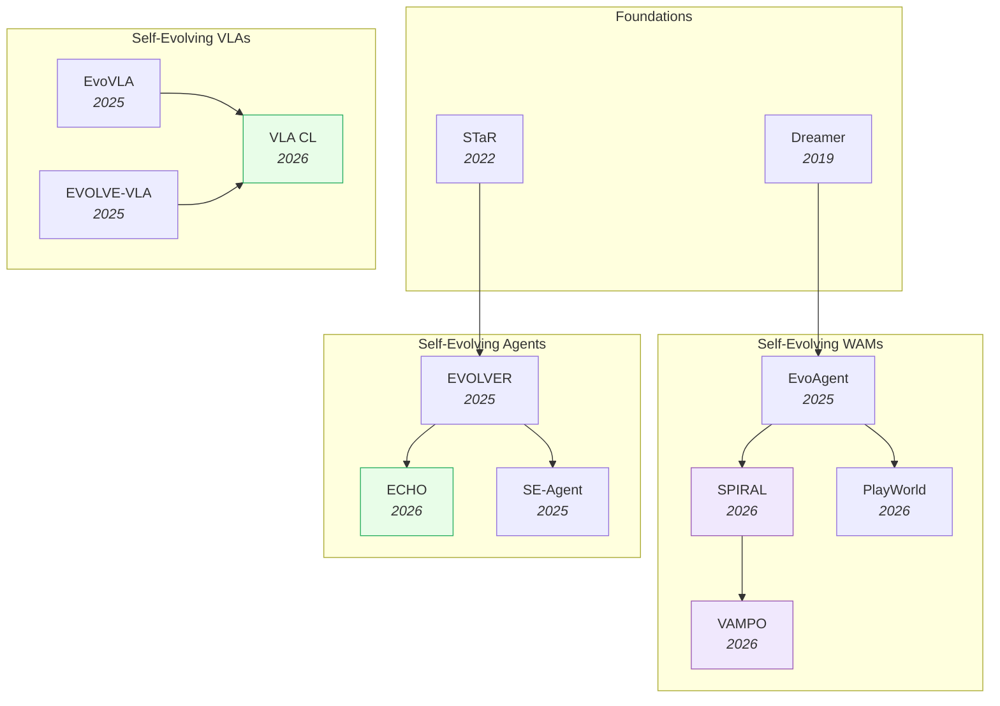
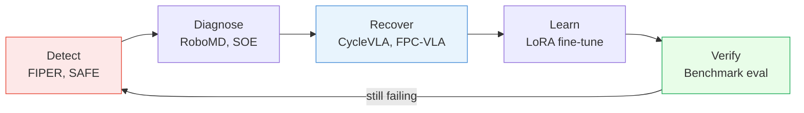

# Self-Evolving VLAs & WAMs — Deep Dive

> [!abstract] Overview
> Self-evolving embodied AI systems autonomously discover failure modes, generate new experience, and improve through real-world or simulated interaction. This note covers three paths to self-evolution: **VLAs** that self-evolve via RL fine-tuning (no world model needed), **WAMs** that self-evolve via imagination loops (world model generates synthetic experience), and **embodied agents** that combine both with persistent memory and curiosity-driven exploration. The key insight: start with a trained world model and add self-evolution — not the other way around.

## Evolution Graph

> [!info] Graph Legend
> - **Blue (foundations)** — pre-2024 foundational papers ([[2203.14465|STaR]], Dreamer)
> - **Purple (WAM thread)** — world-model-driven self-evolution; agent imagines/dreams
> - **Green (VLA + Agent threads)** — VLA RL post-training and agent-level behavior evolution
> - Arrows indicate intellectual lineage, not architectural inheritance

Three threads converge: **WAM self-evolution** (Dreamer → [[2502.05907|EvoAgent]] → [[2506.24119|SPIRAL]] → [[2603.19370|VAMPO]]) leverages world model imagination; **VLA self-evolution** ([[2511.16166|EvoVLA]] → [[2512.14666|EVOLVE-VLA]] → [[2603.03818|VLA CL]]) uses RL fine-tuning without explicit world models; **agent self-evolution** ([[2203.14465|STaR]] → [[2510.16079|EVOLVER]] → [[2601.06794|ECHO]] → [[2508.02085|SE-Agent]]) operates at the behavior level with persistent experience.

---

## Part A — Conceptual Framework

*The key question, the agent/VLA/WAM taxonomy, core mechanisms, and the failure-detection/diagnosis/recovery loop.*

### 1. The Key Question

> [!question] What's the best starting point?
> **Option 1:** Train a self-evolving agent, then add "dreaming" (future state prediction).
> **Option 2:** Take a trained [[04_WAM|world action model]], then add self-evolution.

==Option 2 wins.== A world model already has a robust latent space for generating synthetic future states. Adding memory and continual learning to a system that can already "imagine" is far easier than teaching a reactive agent to dream from scratch.

**Why?** A model-free agent's neural pathways map states → actions only. Bolting on a world model means rebuilding the architecture. A world model already generates its own training data — the challenge shifts to ==data quality within the model's own imagination== (preventing hallucinated dynamics, artifact exploitation, and catastrophic forgetting).

---

### 2. Self-Evolving Agent vs VLA vs WAM

> [!tip] The Distinction
> A self-evolving WAM is a *subset* of self-evolving agents. A self-evolving VLA sits between: it has rich representations from VLM pretraining but may or may not include a world model. ==Not all self-evolving agents can predict the future.==

| | Self-Evolving Agent | Self-Evolving VLA | Self-Evolving WAM |
|---|---|---|---|
| **Type** | Model-free (broadest) | VLM-based policy | Model-based (world model) |
| **Learns** | State → Action via trial and error | Language-conditioned manipulation via RL | Transition dynamics: $S_t, A_t \rightarrow S_{t+1}, R_{t+1}$ |
| **Can "dream"?** | No — reacts after the fact | No (unless WAM-augmented) | Yes — simulates futures in latent/pixel space |
| **Self-evolution** | Improve policy directly | RL post-training + continual learning | Minimize prediction error + policy improvement |
| **Key advantage** | General, domain-agnostic | Rich VLM priors, resistant to forgetting | Imagination for safe exploration |
| **Key papers** | [[2510.16079\|EVOLVER]], [[2601.06794\|ECHO]] | [[2511.16166\|EvoVLA]], [[2603.03818\|VLA CL]] | [[2603.08403\|SPIRAL]], [[2502.05907\|EvoAgent]] |

> [!example] The Button Test
> A model-free agent learns "pressing button → reward" but has no concept of the gears behind the button. If the button jams, it's surprised *after* pressing. A VLA might generalize from similar buttons it's seen in training. A WAM *imagines* the jam scenario and plans accordingly.

---

### 3. Core Mechanisms of Self-Evolution

A ==self-evolving world action model== simultaneously learns to predict environmental dynamics (world model) and optimize decision-making (action model) through continuous, self-supervised interaction. These are the five core mechanisms:

**World Models as Internal Simulators** — The agent maintains a learned dynamics model (e.g., ==RSSM== in Dreamer, ==V-JEPA2's latent predictor==, ==Video DiT== in [[2603.16666|Fast-WAM]]) that takes the current state and a candidate action, then predicts the next state. By chaining predictions, the agent simulates entire trajectories without executing them physically. This enables three capabilities: (1) *safe exploration* — try risky actions in imagination first; (2) *sample-efficient learning* — generate thousands of synthetic rollouts per real interaction; (3) *planning* — evaluate many action sequences and pick the best. The bottleneck is ==dream fidelity==: if the world model hallucinates physically impossible transitions, the policy learns from lies and exploits artifacts that don't exist in the real world.
- [[2502.05907|EvoAgent]], [[2005.05960|Plan2Explore]], [[2301.04104|DreamerV3]]

**Co-Evolutionary Loops** — [[2602.12063|VLAW]]'s alternating loop exemplifies the pattern: (1) the policy acts in the real world; (2) the world model trains on the policy's real trajectories; (3) the world model generates synthetic "dream" rollouts; (4) the policy trains on dreams; (5) the better policy generates richer real data — and the cycle repeats. The key insight is that each component improves the other: better world models produce more realistic training data, which trains better policies, which explore more diverse states, which in turn gives the world model better coverage. [[2506.24119|SPIRAL]] adds a ==critic== that evaluates dream quality, filtering out hallucinated dynamics before they corrupt the policy. [[2605.13775|RoboEvolve]] applies the same co-evolution principle to **planner + simulator**: a VLM planner and VGM simulator alternate roles in a Complementary-Learning-Systems-inspired "daytime exploration / nighttime consolidation" loop, learning from near-miss failures rather than only successes — achieving **+36.4 abs pts** on EB-ALFRED with only 300 unlabeled seed images (vs SFT on 25K manually-annotated trajectories). The risk is ==chasing==: the world model is always trained on the *previous* policy's data distribution, so it models a policy that no longer exists — a form of non-stationarity that can destabilize training if the policy changes too fast between world model updates.
- [[2605.13775|RoboEvolve]], [[2602.12063|VLAW]], [[2603.08403|SPIRAL]], [[2601.06794|ECHO]], [[2504.21024|WebEvolver]]

**Self-Training and Self-Critique** — [[2203.14465|STaR]]'s loop defines the pattern: generate candidate solutions, filter for correctness, retrain on successes. In embodied settings, ==[[2603.16856|OEL]]== extends this: the agent deploys in the real world, encounters tasks, evaluates its own performance, and uses successful trajectories as new training signal. [[2403.09629|Quiet-STaR]] internalizes the critique step by learning to generate reasoning traces *within* the forward pass, rather than as a separate evaluation stage. [[2510.16079|EVOLVER]] distills raw interaction trajectories into strategic principles that persist across episodes. The "correctness" criterion shifts from formal verification to task success — unlike code generation (where [[2505.03335|Absolute Zero]] can verify via execution), physical task success requires either a ground-truth reward signal or a ==learned verifier== (e.g., a VLM-as-judge). This makes the self-critique bottleneck harder in embodied AI than in language tasks.
- [[2603.16856|OEL]], [[2203.14465|STaR]], [[2403.09629|Quiet-STaR]], [[2510.16079|EVOLVER]]

**Curiosity-Driven Exploration** — The agent maintains an estimate of its own uncertainty: ==ensemble disagreement== in [[2005.05960|Plan2Explore]], ==information bottleneck== in [[2509.19292|SOE]], or ==semantic uncertainty== in [[2503.01584|SENSEI]]. States where uncertainty is high become targets for exploration — the curiosity reward is the prediction error or information gain from visiting a state. This creates a self-directed curriculum: the agent practices exactly where it is worst, rather than uniformly sampling the state space. [[2007.07853|gamma-Progress]] weights curiosity by temporal discount, focusing on uncertainties that matter for long-horizon tasks. [[2602.20057|AdaWorldPolicy]] uses world model prediction error directly as a self-improvement signal, adapting the policy where the model is least confident. The critical challenge is distinguishing ==aleatoric uncertainty== (inherent environmental randomness — don't explore, it's irreducible) from ==epistemic uncertainty== (the model's ignorance — do explore, it's reducible). Confusing the two wastes exploration budget on inherently stochastic states.
- [[2503.01584|SENSEI]], [[2005.05960|Plan2Explore]], [[2007.07853|gamma-Progress]], [[2602.20057|AdaWorldPolicy]]

**RL Post-Training** — After SFT on demonstrations (which teaches output format and basic skills), RL optimizes for actual task success. ==GRPO== (Group Relative Policy Optimization) is particularly effective for flow-matching VLAs because it works with continuous action spaces and does not require a separate critic network — it compares groups of sampled trajectories relative to each other. [[2603.19370|VAMPO]] re-frames the ==denoising process as an MDP==, enabling policy gradient estimation directly over the video generation steps, with a latent-consistency reward that ties visual quality to action quality. [[2509.19292|SOE]] uses ==variational information bottleneck== to identify which action dimensions need the most improvement, focusing RL compute where it matters. [[2505.05470|Flow-GRPO]] extends GRPO specifically for flow-matching policies, handling the continuous-time formulation. The RL signal can come from: task success (sparse but ground-truth), VLM-as-judge (dense but noisy), or world model prediction error (self-supervised, no external signal needed).
- [[2603.19370|VAMPO]], [[2509.19292|SOE]], [[2603.11653|VLA RL Continual Learning]], [[2505.05470|Flow-GRPO]]

> [!star] Key Papers
> - [[2602.12063|VLAW]] — Iterative co-improvement of VLA + world model; the canonical co-evolutionary loop
> - [[2503.01584|SENSEI]] — Semantic uncertainty + Go-Explore for curiosity-driven exploration; targets the agent's hardest states
> - [[2203.14465|STaR]] — Foundational self-training loop: generate → filter → retrain; the pattern that underlies all self-critique methods

> [!tip] The Five Levers
> Self-evolution combines all five mechanisms: the world model **imagines** scenarios, curiosity **targets** the hardest ones, RL **optimizes** the policy, self-critique **filters** bad solutions, and co-evolution **compounds** the gains. Each lever alone helps; together they create positive feedback loops.

---

### 4. Failure Detection, Diagnosis & Recovery

Self-evolution requires self-awareness. Before an agent can improve, it must first know *what* went wrong, *where* its policy is weak, and *when* to abandon a failing plan. This section covers the prerequisite layer that makes Sections 5-7 possible: the mechanisms by which agents **detect** failures, **diagnose** their root cause, and **recover** with corrective action.

#### 4.1 Runtime Failure Detection

VLMs and learned classifiers detect task failure in real-time, enabling the agent to abort early rather than waste execution time on doomed plans. Complementary approaches have emerged: (1) *internal feature monitoring* — [[2506.09937|SAFE]] uses the VLA's own hidden-state activations combined with ==conformal prediction== to flag failures without any external sensor, achieving provable false-positive guarantees; (2) *semantic misalignment* — [[2509.16072|I-FailSense]] uses VLMs to compare observed outcomes against language-described expected outcomes, detecting when the semantic meaning of the scene diverges from the task specification; (3) *OOD scoring* — [[2510.09459|FIPER]] combines out-of-distribution detection with action uncertainty estimation to produce predictive failure signals *before* the failure actually occurs, giving the agent a window to intervene; (4) *density-based OOD* — [[2603.11106|RC-NF]] learns the joint distribution of successful execution via ==robot-conditioned normalizing flows==, flagging deviations in <100ms; [[2503.08558|FAIL-Detect]] uses flow-based density (==logpZO==) + Conformal Prediction to achieve 78% balanced accuracy *without any failure data*; [[2410.14868|Diff-DAgger]] repurposes the diffusion policy's own training loss as an uncertainty signal, giving 39% higher F1 than ensemble baselines; (5) *multi-detector ensembles* — [[2410.04640|Sentinel]] runs ==STAC== (Statistical Temporal Action Consistency) for erratic failures in parallel with a VLM for task-progression failures, catching 18% more failures than either alone; (6) *calibrated confidence scores* — [[2507.17383|VLA Confidence Calibration]] introduces ==Action-Wise Platt Scaling== that reduces Expected Calibration Error by >20%; (7) *LLM-driven reactive planning* — [[2407.08735|AESOP]] combines a fast embedding-based anomaly detector with a slow generative LLM for deliberative intervention, using latency-aware MPC for 100% recovery in simulated anomalies; (8) *human-shared-control scaling* — [[2510.02298|ARMADA]]'s FLOAT detector (95% accuracy) pools interventions across multiple robots, cutting human intervention by 23.3%.
- [[2510.09459|FIPER]], [[2506.09937|SAFE]], [[2410.00371|AHA]], [[2509.16072|I-FailSense]], [[2510.01642|FailSafe]], [[2603.11106|RC-NF]], [[2503.08558|FAIL-Detect]], [[2410.14868|Diff-DAgger]], [[2410.04640|Sentinel]], [[2507.17383|VLA Confidence Calibration]], [[2407.08735|AESOP]], [[2510.02298|ARMADA]]

#### 4.2 Proactive Self-Correction

Rather than waiting for failure to occur, proactive self-correction detects and corrects errors mid-task — the agent monitors its own execution and intervenes before the failure becomes irrecoverable. Key approaches span three strategies: *subtask backtracking* — [[2601.02295|CycleVLA]] decomposes tasks into subtask cycles and detects when a subtask goes wrong, triggering automatic backtracking to the last known good state rather than restarting from scratch; *counterfactual reasoning* — [[2512.24426|CF-VLA]] imagines "what if I had done differently?" by generating counterfactual action sequences and comparing their predicted outcomes against the current trajectory; *speculative verification* — [[2604.02965|SV-VLA]] generates open-loop action plans speculatively, then closes the loop by verifying each step against reality before committing. [[2405.17418|SC-VLA]] adds a self-correction head that continuously monitors execution and suggests corrective micro-actions.
- [[2601.02295|CycleVLA]], [[2512.24426|CF-VLA]], [[2511.14148|AsyncVLA]], [[2604.02965|SV-VLA]], [[2602.21633|SC-VLA]]

#### 4.3 OOD & Surprise Detection

World model prediction error serves as a powerful failure signal: when the world model's prediction diverges significantly from observed reality, the agent is in uncharted territory where its policy is unreliable. [[2603.04029|Self-Adapting RL]] monitors ==residuals== between predicted and observed next-states; when residuals exceed a learned threshold, it triggers targeted self-adaptation of the policy for the novel region rather than global retraining. [[2512.01119|WM Surprise Robustness]] addresses the practical problem of distinguishing genuine surprises (novel states the model hasn't seen) from sensor noise and stochastic dynamics — it filters noisy prediction errors to avoid false alarms that would trigger unnecessary adaptation. [[2602.20057|AdaWorldPolicy]] uses prediction error directly as a gradient signal to guide self-improvement, focusing policy updates on states where the world model's uncertainty is highest.
- [[2603.04029|Self-Adapting RL]], [[2512.01119|WM Surprise Robustness]], [[2602.20057|AdaWorldPolicy]]

#### 4.4 Active Probing for Weaknesses

Instead of waiting passively for failures to occur during deployment, active probing deliberately searches for policy failure modes during training or evaluation. [[2412.02818|RoboMD]] trains an ==RL adversary== to find the conditions under which the target policy fails, systematically mapping the failure landscape rather than discovering failures one-by-one in production. [[2509.19292|SOE]] uses ==information bottleneck== to identify which action dimensions lack confidence, surfacing the specific skills that need improvement. [[2503.01584|SENSEI]] combines epistemic uncertainty with ==Go-Explore== to systematically cover the state space, ensuring the agent visits states where its world model predictions are worst. [[1705.05363|ICM]]'s intrinsic curiosity module drives the agent toward states where its forward model predictions are most inaccurate — effectively using prediction error as an exploration reward. [[2005.05960|Plan2Explore]] extends this to zero-shot task adaptation by pre-training a world model purely through curiosity-driven exploration.
- [[2412.02818|RoboMD]], [[2509.19292|SOE]], [[2503.01584|SENSEI]], [[2005.05960|Plan2Explore]], [[1705.05363|ICM]]

#### 4.5 Failure Recovery

After detection, the agent must generate recovery plans and — critically — learn from failures so they don't recur. [[2509.04018|FPC-VLA]] combines failure prediction with corrective action generation in a single model: when the failure predictor fires, a corrective action head takes over to steer the agent back to a recoverable state. [[2505.12224|RoboFAC]] provides a full ==failure analysis + correction framework== that classifies the failure type (perceptual, planning, execution), diagnoses the root cause, and generates targeted corrections for each category. [[2603.13528|Counterfactual Failure Synthesis]] takes a generative approach: it synthesizes *new* failure scenarios that the agent hasn't encountered, along with actionable recovery plans, creating synthetic training data that inoculates the policy against similar failures without needing to experience them in the real world.
- [[2509.04018|FPC-VLA]], [[2404.00756|Recover]], [[2505.12224|RoboFAC]], [[2409.03966|VLM Failure Recovery]], [[2603.13528|Counterfactual Failure Synthesis]]

> [!star] Key Papers
> - [[2510.09459|FIPER]] — Predictive failure detection via OOD + action uncertainty; catches failures *before* they happen, giving the agent time to intervene
> - [[2412.02818|RoboMD]] — Active adversarial probing: trains an RL adversary to systematically discover where the policy fails, mapping the failure landscape
> - [[2601.02295|CycleVLA]] — Proactive mid-task correction via subtask cycling and backtracking; detects and recovers from errors without restarting the entire task

> [!tip] Detection Before Correction
> Self-evolution requires self-awareness. An agent that can't detect failure can't improve from it. The detection mechanism determines what the agent can learn: [[2510.09459|FIPER]] detects WHEN tasks fail, [[2412.02818|RoboMD]] discovers WHERE policies are weak, and [[2503.01584|SENSEI]] finds WHAT the world model doesn't know. Together they form a complete diagnostic stack — temporal detection, spatial localization, and epistemic coverage — that feeds the self-improvement loops in Sections 5-7.

---

## Part B — Self-Evolving Systems by Subject

*Three concrete instantiations: self-evolving WAMs, VLAs, and embodied agents.*

### 5. Self-Evolving WAMs

WAMs have a unique advantage for self-evolution: they already have a learned dynamics model that can generate synthetic experience. The agent "rehearses" in imagination, discovers failure modes, and improves without costly real-world interaction.

| Model | Self-Improvement Mechanism |
|-------|--------------------------|
| [[2603.08403\|SPIRAL]] | Closed-loop self-improving action world model via reflective planning |
| [[2603.19370\|VAMPO]] | RL optimization of video action model visual dynamics via GRPO |
| [[2603.09030\|PlayWorld]] | Autonomous self-play data collection → world model training |
| [[2503.01584\|SENSEI]] | Semantic exploration with epistemic uncertainty + Go-Explore |
| [[2502.05907\|EvoAgent]] | Continual self-evolving via world model; +105% on long-horizon tasks |
| [[2506.23468\|NavMorph]] | Self-evolving world model for VLN in continuous environments |
| [[2504.21024\|WebEvolver]] | Co-evolving web agent and world model |
| [[2602.20057\|AdaWorldPolicy]] | World model prediction error as self-improvement signal |
| [[2511.18810\|MergeVLA]] | Cross-skill model merging toward a generalist VLA; merges per-skill specialists |
| [[2401.16650\|WMAR]] | Memory-efficient augmented replay (FIFO + reservoir) in [[2301.04104\|DreamerV3]] for continual RL; +0.071 vs 0.665 forgetting |

**How [[2506.24119|SPIRAL]]'s Reflective Loop Works**: [[2506.24119|SPIRAL]] generates a long-horizon video plan conditioned on semantic actions, then a CriticAgent evaluates the plan for temporal coherence (do frames flow smoothly?) and action completeness (does the video show the full task?). Plans that fail the critic are rejected and regenerated with feedback incorporated — the critic's natural-language assessment guides the next generation attempt. This creates an iterative refinement loop without human intervention.

**How [[2502.05907|EvoAgent]]'s Three-Part Loop Works**: (1) *Self-planning* — the agent uses its continual world model to propose a plan; (2) *Self-control* — during execution, the agent monitors prediction error between its world model's expectations and actual observations; (3) *Self-reflection* — after execution, the agent compares predicted vs. actual outcomes, identifies where its world model was wrong, and updates both the world model and policy.

> [!star] Key Papers
> - [[2603.08403|SPIRAL]] — Closed-loop self-improvement for action world models via reflective planning; the system critiques its own generated videos and adapts
> - [[2502.05907|EvoAgent]] — Built on [[2301.04104|DreamerV3]] with continual world model; self-planning + self-control + self-reflection loop achieves +105% improvement
> - [[2603.19370|VAMPO]] — Re-frames video denoising as an MDP and applies GRPO with latent-consistency reward; bridges world model quality and action quality

> [!tip] Why WAMs Enable Self-Evolution
> WAMs already have a learned dynamics model that generates synthetic experience. This means the agent can "rehearse" in imagination, discover failure modes, and improve without costly real-world interaction. [[2506.24119|SPIRAL]] and [[2502.05907|EvoAgent]] show this creates positive feedback loops where the world model and policy improve together.

---

### 6. Self-Evolving VLAs

VLAs can self-evolve *without* an explicit world model — their rich VLM representations from large-scale pretraining provide enough structure for RL-based self-improvement and continual learning.

| Model | Self-Improvement Mechanism |
|-------|--------------------------|
| [[2605.10993\|ECHO-VLA]] | Hierarchical hyperbolic memory (HAE) + autonomous memory consolidation; cone-tree retrieval + virtual-memory interpolation; **+12.8pp** LIBERO-Long |
| [[2605.08879\|ConSFT]] | Confidence-weighted SFT bounds parameter disruption; exponentially down-weights low-confidence transitions to retain foundational capabilities |
| [[2511.16166\|EvoVLA]] | Self-evolving framework overcoming stage hallucination and fragile memory |
| [[2511.00091\|PLD]] | Self-improving VLA via residual RL data generation |
| [[2603.11653\|VLA RL Continual Learning]] | Sequential RL fine-tuning with LoRA; minimal forgetting |
| [[2603.03818\|VLA Continual Learning]] | Pre-trained VLAs are naturally resistant to catastrophic forgetting |
| [[2603.09030\|PlayWorld]] | Autonomous self-play data collection for VLA training |
| [[2512.14666\|EVOLVE-VLA]] | Evolutionary VLA improvement through progressive adaptation |
| [[2602.10503\|Long-Lived Robots]] | Continual learning for long-lived robot deployment |
| [[2602.03445\|CRL-VLA]] | Continual RL for VLA policies across sequential tasks |
| [[2603.07648\|AtomicVLA]] | Atomic skill abstraction + SG-MoE; scalable continual learning |
| [[2602.21633\|Self-Correcting VLA]] | Self-correction mechanism for VLA deployment |
| [[2501.16664\|iRe-VLA]] | Two-stage alternation between online RL and SFT; LoRA + frozen VLM preserves prior knowledge |
| [[2510.02298\|ARMADA]] | Autonomous failure detection + multi-robot shared control; adaptive rewinding collects high-quality corrective demos |

**How [[2605.08879|ConSFT]] Emulates RL's Anti-Forgetting Property without RL Compute**: Vanilla SFT during downstream fine-tuning causes dense parameter overwrites and catastrophic forgetting in flow-matching VLAs. [[2605.08879|ConSFT]] applies an ==exponential conservative importance weight== ω(θ) = exp(−L_SFT(θ) / τ) on top of the standard SFT loss, with a ==stop-gradient operator== on the weight and an ==annealing schedule== on τ — analytically bounding parameter-disruption risk for unfamiliar high-loss transitions (which would otherwise drive the largest weight updates). Mechanistically, this induces a controlled, uniformly decaying sparsity path in updates, mimicking RL's bounded-trust-region dynamics without the cost of likelihood evaluation or trajectory integration. Result: **34%** retention on [[2306.03310|LIBERO]] and **28%** on RoboTwin vs vanilla SFT's collapse, with target-task performance matched — and crucially, **no prior data and no architectural modifications**. This is the missing complement to LoRA-based forgetting mitigation: a full-parameter SFT objective that doesn't catastrophically overwrite.

**How [[2511.16166|EvoVLA]] Overcomes Stage Hallucination**: In multi-step tasks, VLAs often 'hallucinate' task progress — reporting a subtask as complete based on superficial visual cues rather than actual completion. [[2511.16166|EvoVLA]] addresses this by maintaining an explicit stage tracker that verifies completion before advancing. The evolutionary strategy generates multiple candidate plans and selects the most reliable.

**Why VLAs Resist Catastrophic Forgetting**: Pre-training on diverse cross-embodiment data ([[2310.08864|OXE]]: 1M+ trajectories from 22 robot types) creates a broad, well-structured parameter basin. Sequential task fine-tuning with LoRA stays within this basin — the low-rank constraint confines updates to a small subspace, preserving the vast majority of pre-trained parameters.

> [!star] Key Papers
> - [[2511.16166|EvoVLA]] — First end-to-end self-evolving VLA; overcomes stage hallucination and fragile memory through evolutionary strategies
> - [[2603.03818|VLA Continual Learning]] — Showed pre-trained VLAs are naturally resistant to catastrophic forgetting; simple sequential fine-tuning works

> [!tip] The Continual Learning Surprise
> Two independent studies found the same result: VLAs pre-trained on diverse data are *naturally* resistant to catastrophic forgetting. You don't need complex continual learning algorithms — simple sequential RL fine-tuning with LoRA works. This is the opposite of what the NLP literature suggests, and makes VLA self-evolution much more practical than expected.

---

### 7. Self-Evolving Embodied Agents

Agents that go beyond weight updates to evolve their *behavior* — distilling interaction trajectories into reusable strategies, building skill libraries, and co-evolving with their environments.

| Model                                        | Self-Improvement Mechanism                                              |                                                      |
| -------------------------------------------- | ----------------------------------------------------------------------- | ---------------------------------------------------- |
| [[2604.26707\|CurEvo]]                       | Curriculum-guided self-evolution for video understanding                |                                                      |
| [[2604.18292\|Agent-World]]                  | Scaling real-world environment synthesis for evolving general agents    |                                                      |
| [[2604.18131\|Native Evolution]]             | Spontaneous reward-free self-evolution via world knowledge exploration  |                                                      |
| [[2604.11306\|Hierarchical Episodic Memory]] | Hierarchical episodic memory with relevance-based forgetting            |                                                      |
| [[2604.10892\|HECTOR]]                       | Human-centric hierarchical coordination of robotic fleets               |                                                      |
| [[2604.10096\|ABot-Claw]]                    | Persistent, cooperative, self-evolving robotic agents                   |                                                      |
| [[2604.07799\|ECM]]                          | Modular, versioned capability modules; 91.3% success, zero drift        |                                                      |
| [[2603.24350\|Emergent Self]]                | Emergent stable self-representation in continual deep RL robots         |                                                      |
| [[2510.16079\|EVOLVER]]                      | Distills raw interaction trajectories into strategic principles         |                                                      |
| [[2508.02085\|SE-Agent]]                     | Self-evolutionary framework optimizing multi-step agent behavior        |                                                      |
| [[2601.07055\|Dr. Zero]]                     | Meta's framework: search agents self-evolve without human training data |                                                      |
| [[2506.21669\|SEEA-R1]]                      | Tree-structured RL for self-evolving embodied agents; +24% via MCTS     |                                                      |
| [[2601.06794\|ECHO]]                         | Policy and environment co-evolve: harder challenges as policy improves  |                                                      |
| [[2603.04029\|Self-Adapting RL]]             | World model residuals detect OOD; triggers targeted self-adaptation     |                                                      |
| [[2509.19292\|SOE]]                          | Action-level probing via VIB for self-improvement                       |                                                      |
| [[2409.00872\|SAGE]]                         | Reflective and memory-augmented self-evolving agents                    |                                                      |

**How [[2510.16079|EVOLVER]] Distills Experience into Principles**: After each interaction episode, [[2510.16079|EVOLVER]] extracts a structured 'experience card' — a summary of what happened, what worked, what failed, and what strategic principle can be derived. These cards accumulate in a persistent experience bank. Before each new task, the agent retrieves relevant cards and conditions its behavior on the distilled principles — the agent's weights don't change, but its behavior evolves through accumulated knowledge.

**How [[2601.06794|ECHO]]'s Co-Evolution Works**: The environment generates tasks calibrated to the agent's current capability frontier — hard enough to be challenging, easy enough to be solvable. As the agent improves, the environment automatically generates harder challenges. The key mechanism is a saturation-aware reward: when success rate on a task type exceeds a threshold, that task is retired and replaced with a harder variant.

> [!star] Key Papers
> - [[2510.16079|EVOLVER]] — The experience-driven lifecycle: agents distill raw interaction trajectories into strategic principles; closes the loop between experience and behavior
> - [[2601.06794|ECHO]] — Policy and environment co-evolve: the environment generates harder challenges as the policy improves, creating an open-ended self-improvement curriculum
> - [[2604.18131|Native Evolution]] — Spontaneous reward-free self-evolution via world knowledge exploration; the recent paradigm shift away from explicit reward signals
> - [[2604.18292|Agent-World]] — Scaling real-world environment synthesis for evolving general agents; the data substrate for agent-level self-evolution

> [!tip] From Weight Updates to Behavior Evolution
> Self-improving models optimize weights; self-evolving agents optimize behavior. The key difference is persistent experience: [[2510.16079|EVOLVER]] and [[2601.06794|ECHO]] show that distilling interaction history into reusable principles is what turns a self-improving model into a self-evolving agent. [[2603.18743|Memento-Skills]] and [[2603.05218|KARL]] extend this with external skill/knowledge storage.

---

## Part C — Open Problems & Failure Modes

*Where self-evolution fails: misevolution, reward hacking, capability drift.*

### 8. Open Problems & Failure Modes

Self-evolution is not guaranteed to converge or remain aligned. These failure modes are documented in the literature:

| Failure Mode | Risk | Evidence |
|-------------|------|----------|
| **[[2509.26354\|Misevolution]]** | Self-evolving models drift from intended values during autonomous improvement | [[2509.26354\|Misevolution]] identifies this as a novel safety risk |
| **Catastrophic forgetting** | Gains from one round of self-improvement are lost in the next domain | Mitigated by LoRA ([[2603.11653\|VLA RL CL]]) and experience replay |
| **Hallucinated dynamics** | World models predict physically impossible futures; agents exploit artifacts | [[2603.23376\|ABot-PhysWorld]] addresses with Diffusion-DPO |
| **Reward hacking** | Self-play or self-reward systems find shortcuts that game the reward | [[2506.07468\|SELF-REDTEAM]] uses adversarial self-play to detect this |
| **Entropy collapse** | RL-based self-improvement converges to a narrow, brittle policy | [[2509.15194\|EVOL-RL]] balances selection pressure with novelty-driven diversity |

**How [[2509.26354|Misevolution]] Happens**: During autonomous self-improvement, the agent's reward signal may drift from the designer's intent. If the self-reward model has systematic biases (e.g., rewarding confident-looking actions over cautious ones), each improvement round amplifies these biases. Over many cycles, the agent optimizes for a proxy objective that diverges from the true goal — and the divergence is invisible until deployment failure.

**How Entropy Collapse Manifests**: RL-based self-improvement tends to converge on a narrow set of high-reward behaviors, discarding exploration of alternatives. The policy becomes increasingly deterministic — great for the specific tasks it has mastered, but brittle to any variation. [[2509.15194|EVOL-RL]]'s solution: explicitly maintain diversity by adding novelty-driven selection pressure alongside performance-based selection.

> [!star] Key Papers
> - [[2509.26354|Misevolution]] — Identifies value drift during autonomous self-improvement as a novel safety risk class
> - [[2506.07468|SELF-REDTEAM]] — Adversarial self-play for catching reward hacking; the standard pre-deployment safety check
> - [[2509.15194|EVOL-RL]] — Novelty-driven diversity prevents entropy collapse during RL-based self-improvement

> [!tip] The Safety Imperative
> Self-evolving systems need built-in safety checks. [[2509.26354|Misevolution]] shows models can drift from intended values autonomously. [[2506.07468|SELF-REDTEAM]] provides a pattern: the model red-teams itself after each improvement cycle, catching safety regressions before deployment.

---

## Quick-Reference Matrix

| Question | Answer |
|----------|--------|
| Self-evolving via imagination (WAM path)? | [[2506.24119\|SPIRAL]] + [[2502.05907\|EvoAgent]] |
| Self-evolving via RL post-training (VLA path)? | [[2511.16166\|EvoVLA]] + [[2512.14666\|EVOLVE-VLA]] |
| Self-evolving with persistent memory (Agent path)? | [[2510.16079\|EVOLVER]] + [[2601.06794\|ECHO]] |
| Need curiosity-driven exploration? | [[2503.01584\|SENSEI]] or [[2602.20057\|AdaWorldPolicy]] |
| Need denoising-as-MDP for video WAMs? | [[2603.19370\|VAMPO]] |
| Need failure detection / self-diagnosis? | [[2412.02818\|RoboMD]] + [[2510.09459\|FIPER]] |
| Need continual learning without forgetting? | [[2603.03818\|VLA Continual Learning]] (LoRA + replay) |
| Need safety red-teaming during evolution? | [[2506.07468\|SELF-REDTEAM]] |
| Need to avoid entropy collapse? | [[2509.15194\|EVOL-RL]] (novelty-driven diversity) |
| Best starting point? | Train a WAM first, *then* add self-evolution (Option 2) |

---

## Cross-References

- [[01_Embodied-AI-101]] — VLA vs WAM basics and four learning strategies
- [[03_VLA]] — VLA deep-dive (Section 9 covers self-evolving VLAs)
- [[04_WAM]] — WAM deep-dive (Section 7 covers self-evolving WAMs)
- [[05_Latent-World-Models]] — JEPA evolution lineage; latent world models as self-evolution substrate
- [[07_Physics-Aware-Embodied-AI]] — Physics priors as a stabilizer for self-evolving WAM dreams
- [[08_VLA-Reasoning-and-CoT]] — Reasoning insertion patterns relevant to self-critique and self-correction
- [[09_Egocentric-Pretraining-and-Human-Video]] — Egocentric pretraining provides robust priors that resist forgetting
- [[10_Force-Aware-and-Tactile-Policies]] — Force/tactile policies deep-dive; complements failure recovery via force feedback
- [[11_Sim-to-Real-Transfer]] — Sim-to-Real Transfer deep-dive; covers continual adaptation methods
- [[02_Dataset-Benchmark-Environment]] — Benchmarks for evaluating self-evolution

---

*See [[11_Self-Evolving-AI]] for the broader self-evolving AI landscape, or [[05_Latent-World-Models]] for how latent prediction enables imagination loops.*
