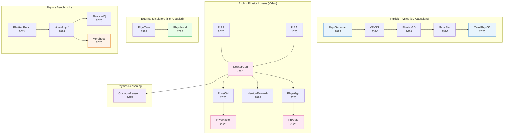

# Physics-Aware Embodied AI — Deep Dive

> [!abstract] Overview
> Most modern WAMs and VLAs learn physics *implicitly* — by training on enough internet video, the model picks up gravity, friction, and contact dynamics as side effects of next-frame or next-action prediction. Physics-aware embodied AI takes the opposite view: bake **explicit** physical priors into the model — through differentiable simulators, physics-constrained losses, RL with physics-verifiable rewards, or hybrid pipelines that hand state to an external solver. This note maps the design space (implicit / explicit-loss / external-simulator), the generation–training–inference tracks, and the physics-commonsense benchmarks that measure how well models actually obey Newton.

## Evolution Graph

The field evolved through four parallel tracks. **3D-Gaussian-based implicit physics** (2023→2025) embeds material properties directly into renderable 3D Gaussians, unifying simulation and rendering. **Explicit physics losses** for video generation (2025→2026) backpropagate physics-residual rewards or Newton's laws through diffusion models. **External-simulator coupling** (2025→2026) hands generated state to a real physics solver — [[2503.17973|PhysTwin]] reconstructs deformable digital twins from video; [[2511.07416|PhysWorld]] trains the policy against a learned physics simulator. **Physics commonsense reasoning** (2025) lifts physical priors from pixel/state-level losses into language-level reasoning ([[2503.15558|Cosmos-Reason1]]).

| Year | Paper | Track | Contribution |
|------|-------|-------|--------------|
| 2023 | [[2311.12198\|PhysGaussian]] | Implicit | First MPM-coupled 3D-Gaussian renderer; unifies sim and rendering |
| 2024 | [[2401.16663\|VR-GS]] | Implicit | Physics-aware interactive Gaussian Splatting in VR |
| 2024 | [[2406.04338\|Physics3D]] | Implicit | Learn physical properties of 3D Gaussians from video diffusion |
| 2024 | [[2412.17804\|GausSim]] | Implicit | Foreseeing reality: Gaussian simulator for elastic objects |
| 2025 | [[2501.18982\|OmniPhysGS]] | Implicit | Constitutive Gaussians for general physics-based dynamics |
| 2025 | [[2509.20570\|PIRF]] | Explicit-loss | Physics-informed reward fine-tuning of diffusion models |
| 2025 | [[2509.21309\|NewtonGen]] | Explicit-loss | Neural Newtonian dynamics for T2V |
| 2025 | [[2509.20358\|PhysCtrl]] | Explicit-loss | Generative physics for controllable video |
| 2025 | [[2503.09595\|PISA]] | Explicit-loss | Physics post-training for video diffusion via dropping experiments |
| 2025 | [[2510.13809\|PhysMaster]] | Explicit-loss | Mastering physical representation via RL fine-tuning |
| 2025 | [[2512.00425\|NewtonRewards]] | Explicit-loss | Post-training Newton's laws with verifiable rewards |
| 2026 | [[2603.13770\|PhysAlign]] | Explicit-loss | Feature + 3D representation alignment for physics-coherent I2V |
| 2026 | [[2603.26285\|PhysVid]] | Explicit-loss | Physics-aware local conditioning for generative video |
| 2026 | [[2604.17896\|Physical-Feasibility VLA]] | Explicit-loss | Differentiable geometric feasibility loss for VLA training; SSR 22→**43.50%** |
| 2026 | [[2605.05163\|PhysForge]] | Asset gen | VLM-planner + diffusion-realizer for simulation-ready 3D assets |
| 2025 | [[2503.17973\|PhysTwin]] | External-sim | Physics-informed reconstruction of deformable digital twins |
| 2025 | [[2511.07416\|PhysWorld]] | External-sim | Robot learning from a physical world model |
| 2026 | [[2605.06593\|ReActor]] | External-sim | Disney bilevel RL + physics simulation for motion retargeting; +15.22pp downstream RL |
| 2025 | [[2503.15558\|Cosmos-Reason1]] | Reasoning | Physical commonsense and embodied reasoning at WAM scale |

---

## Part A — Design Space & Physics Priors

*How to inject physics: implicit (3DGS), explicit losses, and external simulators.*

### 1. Design-Space Principles

Three orthogonal axes define every physics-aware embodied AI system. Each axis is a distinct design lever — *where* the physics signal enters the model, *what* it constrains, and *when* it acts — and any system can be located by its triple. The triple frames every downstream choice in sections 2–7.

> [!success] The Three Axes
> - **Where physics lives**: implicit (in features) / explicit (in loss) / external (in solver)
> - **What is physical**: appearance (3D Gaussians + MPM) / dynamics (video next-frame) / reward (RL)
> - **When it intervenes**: at generation / at training / at inference

#### 1.1 Where Physics Lives

Pick the slot in the stack that carries the physics signal — features, loss, or solver.

- **[[2311.12198|PhysGaussian]]** — Implicit: each scene element ==carries physical attributes== so a standard simulator can integrate them directly; representative of the in-features axis.
- **[[2501.18982|OmniPhysGS]]** — Implicit: constitutive Gaussians extend in-features physics to ==elastic, plastic, granular, viscoplastic== materials in one framework.
- **[[2509.20570|PIRF]]** — Explicit-loss: frames denoising as an MDP with ==sparse reward = negative PDE residual== back-propagated through the full trajectory; ==layer-wise truncation== restricts updates to high-resolution U-Net layers; lower PDE residual MSE on **4/5** benchmarks with **zero** test-time reward queries.
- **[[2509.21309|NewtonGen]]** — Explicit-loss: ==Neural Newtonian Dynamics== layer injected into T2V backbone; predicts trajectories under F=ma constraints.
- **[[2512.00425|NewtonRewards]]** — Explicit-loss: Newton's laws as a ==verifiable predicate== — checker function scores video against mechanics; reward used in RL post-training.
- **[[2503.17973|PhysTwin]]** — External-solver: multi-stage joint optimization of geometry + physical properties + appearance via ==spring-mass models + generative shape priors + Gaussian splats==; reconstructs interactive deformable digital twin from video in real-time and integrates with robotic motion planning.
- **[[2511.07416|PhysWorld]]** — External-solver: ==task-conditioned video generation + geometry-aligned 4D reconstruction + object-centric residual RL== over an interactable digital twin; **82%** avg SR across 10 real-world tasks (**+15pp** over RIGVid), grasping failures **18% → 3%**, object-centric variant up to **90%** SR.

#### 1.2 What Is Physical

The layer that gets constrained — appearance pixels, dynamics rollouts, or reward signal.

- **[[2311.12198|PhysGaussian]]** — Appearance: pixels respect ==material properties== (elasticity, plasticity); high render cost, pixel-level fidelity.
- **[[2501.18982|OmniPhysGS]]** — Appearance: each Gaussian carries a ==learnable neural constitutive model==; ==custom PyTorch differentiable MPM + Score Distillation Sampling== from T2V; **+3–16%** CLIPSIM over baselines and **−75%** training memory vs Warp-based MPM.
- **[[2509.21309|NewtonGen]]** — Dynamics: next-frame prediction obeys ==conservation laws==; mid cost, better visual physics than implicit-loss baselines.
- **[[2503.09595|PISA]]** — Dynamics: ==Physics Supervised Fine-Tuning (PSFT) + Object Reward Optimization (ORO)== over the PISA benchmark of real + simulated freefall videos; ORO uses ==segmentation + optical flow + depth== reward signals; reduces Open-Sora trajectory errors substantially on a small simulated dataset.
- **[[2509.20570|PIRF]]** — Reward: ==RL reward = physics consistency score==; low cost, trains generation through RL rather than direct pixel/state loss.
- **[[2512.00425|NewtonRewards]]** — Reward: ==kinematic reward== (penalty on deviation from constant acceleration via optical-flow proxies) + ==mass conservation reward== (visual-feature consistency) prevents reward hacking; **+9.75%** avg in-distribution and **+8.60%** OOD across 5 Newtonian motion primitives on NewtonBench-60K.

#### 1.3 When Physics Intervenes

The timing of the intervention — at sampling, training, or inference rejection.

- **[[2406.04338|Physics3D]]** — Generation: each ==denoising step is constrained== by physics; learns physical properties of Gaussians from video diffusion supervision.
- **[[2603.26285|PhysVid]]** — Generation: physics-aware ==local conditioning== — per-region physical priors carried as conditioning signal during sampling.
- **[[2509.20570|PIRF]]** — Training: ==PDE-residual reward== back-propagated through the full denoising trajectory with ==layer-wise truncation== on high-resolution U-Net layers; the canonical training-time intervention with **zero** test-time reward queries on **4/5** PDE benchmarks.
- **[[2510.13809|PhysMaster]]** — Training: ==PhysEncoder== refined via ==three-stage DPO== over I2V diffusion; **70×** faster than prior physics-aware methods at competitive L2 / Chamfer / IoU on free-fall, and preferred by human raters on open-world scenarios.
- **[[2512.00425|NewtonRewards]]** — Training: ==Newton-kinematic + mass-conservation== verifiable rewards (using optical-flow + frozen-feature proxies) as RL signal during post-training; **+9.75%** in-distribution / **+8.60%** OOD across 5 motion primitives on NewtonBench-60K.
- **[[2603.23376|ABot-PhysWorld]]** — Inference: ==Diffusion-DPO== with physics-rejected negatives; trains the model to suppress object-penetration and anti-gravity outputs at sample time.

**Design-Space — Decision Matrix**

| Need | Recommendation |
|---|---|
| Photorealistic deformation rendering | Implicit (3D Gaussians + MPM): [[2311.12198\|PhysGaussian]], [[2501.18982\|OmniPhysGS]] |
| Internet-scale video that respects gravity | Explicit-loss: [[2509.20570\|PIRF]], [[2509.21309\|NewtonGen]] |
| Deployable robot policy that won't violate physics | External-simulator: [[2511.07416\|PhysWorld]] or physics-grounded RL ([[2512.00425\|NewtonRewards]], [[2510.13809\|PhysMaster]]) |
| Per-region control at sample time | Generation-stage: [[2603.26285\|PhysVid]] |
| Suppress hallucinated dynamics post-hoc | Inference-stage: [[2603.23376\|ABot-PhysWorld]] (Diffusion-DPO) |
| RL post-training against verifiable predicate | Reward axis: [[2512.00425\|NewtonRewards]], [[2510.13809\|PhysMaster]] |

> [!star] Key Papers
> - [[2509.20570|PIRF]] — Defines the verifiable-reward training-time axis; PDE residual as RL signal with layer-wise truncation; lower residual on **4 of 5** PDE benchmarks
> - [[2512.00425|NewtonRewards]] — Newton's laws as ==verifiable reward==; the cleanest demonstration that explicit-loss physics scales to internet-video post-training
> - [[2311.12198|PhysGaussian]] — Foundational implicit-physics work that established the "physics-lives-in-features" axis via 3DGS + MPM
> - [[2511.07416|PhysWorld]] — Canonical external-solver axis for robot policy training; explicit physical state as learning substrate

> [!tip] Pick by Constraint
> If you need **photorealistic deformation rendering**, pick implicit (3D Gaussians + MPM). If you need **internet-scale video that respects gravity**, pick explicit-loss ([[2509.20570|PIRF]], [[2509.21309|NewtonGen]]). If you need a **deployable robot policy that won't violate physics**, pick external-simulator ([[2511.07416|PhysWorld]]) or physics-grounded RL ([[2512.00425|NewtonRewards]], [[2510.13809|PhysMaster]]). The three axes are orthogonal — most production systems combine them; see [[04_WAM#2. VideoGen WAMs]] (physics-aligned video generation) and [[03_VLA#5. World-Model-Augmented VLAs]] (WAM-augmented VLA) for end-to-end stacks.

---

### 2. Implicit Physics — 3D Gaussians as Simulation Substrate

The dominant implicit-physics paradigm fuses 3D Gaussian Splatting with continuum-mechanics solvers (typically the ==Material Point Method==). Each Gaussian is *both* a renderable primitive and a simulation particle, eliminating the geometry/render mismatch of traditional pipelines. The split below separates *scene physics* (Gaussians simulating an existing scene) from *asset physics* (generating new simulator-ready 3D assets with physics metadata baked in).

#### 2.1 3D-Gaussian + MPM as Simulation Substrate

Gaussians are differentiable, particle-like, and already compatible with rendering. ==MPM== handles arbitrary materials (elastic, plastic, granular, viscoplastic) on the same particle representation. Result: "what you see is what you simulate" — no separate mesh extraction step.

- **[[2311.12198|PhysGaussian]]** — First to couple 3D Gaussian Splatting with ==MPM==; eliminates geometry/render mismatch and unifies dynamics + appearance. The foundational substrate every subsequent paper extends.
- **[[2501.18982|OmniPhysGS]]** — ==Constitutive Gaussians== for general physics-based dynamics; covers elastic, plastic, granular, viscoplastic in one framework. Defines the material-coverage frontier.
- **[[2406.04338|Physics3D]]** — Learns physical properties of 3D Gaussians directly from ==video diffusion supervision==; bypasses manual material annotation.
- **[[2412.17804|GausSim]]** — Treats each Gaussian kernel as a ==Center of Mass System== with deformation-gradient + Polar SVD continuum mechanics; ==hierarchical clustering== cuts kernel-wise compute by **95%**; mass / momentum conservation losses; L2 error **1.85** vs **11.32** DreamGaussian4D on Mothorchids unseen-frames, **0.13s/frame** at **2.1GB** GPU memory.
- **[[2401.16663|VR-GS]]** — ==3DGS + XPBD== solver with a ==two-level deformation embedding== (local tetrahedra into global simulation mesh) eliminates spiky artifacts under stretching; **0.017–0.022s** frame times (vs **0.112–0.39s** PhysGaussian, **0.625–0.813s** PAC-NeRF); SUS **83.5** ("excellent") on user study with significantly higher immersion vs transform-based interactions.

#### 2.2 Physics-Grounded Asset Generation

Generating *simulator-ready* 3D assets with physics metadata, rather than rendering physics-consistent scenes. The output isn't a video — it's a kinematic + material-tagged 3D mesh you drop into MuJoCo or a game engine.

- **[[2605.05163|PhysForge]]** — Decoupled two-stage: Stage 1 a VLM performs ==abstract physical planning==; Stage 2 a diffusion model with ==Kinematic Voxel Injection (KVI)== realizes geometry + continuous kinematic parameters. Assets are **simulation-ready** — directly usable in robotic simulators; **0.101** Joint-Axis-Err-5 (SOTA).

**Implicit Physics — Decision Matrix**

| Need | Recommendation |
|---|---|
| Material coverage (elastic, plastic, granular) | [[2501.18982\|OmniPhysGS]] (constitutive Gaussians) |
| Foundational baseline (3DGS + MPM) | [[2311.12198\|PhysGaussian]] |
| Learn material properties from video alone | [[2406.04338\|Physics3D]] |
| Real-time interactive elastic rollout | [[2412.17804\|GausSim]] |
| VR-deployed physics-aware Gaussian Splatting | [[2401.16663\|VR-GS]] |
| Simulation-ready 3D asset generation | [[2605.05163\|PhysForge]] (**0.101** Joint-Axis-Err-5) |

> [!star] Key Papers
> - [[2311.12198|PhysGaussian]] — First to couple 3D Gaussian Splatting with MPM; eliminates geometry/render mismatch and unifies dynamics + appearance
> - [[2501.18982|OmniPhysGS]] — Constitutive Gaussians for general physics-based dynamics; covers elastic, plastic, granular, viscoplastic in one framework
> - [[2406.04338|Physics3D]] — Learns physical properties of 3D Gaussians directly from video diffusion supervision
> - [[2605.05163|PhysForge]] — Two-stage VLM-planner + diffusion-realizer for simulation-ready 3D assets; **0.101** Joint-Axis-Err-5 (SOTA) with VLM-grounded part decomposition and KVI-realized kinematics

> [!tip] When Implicit Physics Helps
> Implicit physics shines when the *appearance* matters as much as the dynamics — VR, content creation, digital twins. For pure robot control, the rendering pipeline is overhead; explicit-loss approaches are cheaper. The asset-generation track ([[2605.05163|PhysForge]]) is the bridge: it produces 3D assets that downstream robot pipelines can consume in MuJoCo / Isaac without a render loop. Cross-reference [[04_WAM#2.4 Physics-Aligned Video Generation]] for the video-side analogue.

---

### 3. Explicit Physics Losses for Video Generation

The fastest-growing track. Internet-video diffusion models (Sora, Veo, Cosmos, [[2503.20314|Wan]]) learn approximate physics implicitly but routinely violate gravity, conservation of mass, and rigid-body constraints. Explicit-loss approaches add a physics-residual term that *measures* the violation and backpropagates it. The three sub-tracks differ in *where the physics signal originates*: written-down equations (residuals), simulator-as-reward (RL), or per-region conditioning at sample time.

#### 3.1 Differentiable Physics Residuals

Write down a physics law as an equation; the ==negative residual is your reward==. The training signal is dense and verifiable — every frame can be scored against the PDE.

- **[[2509.20570|PIRF]]** — Frames diffusion denoising as an MDP with sparse reward = ==negative PDE residual==. ==Layer-wise truncation== restricts updates to high-resolution U-Net layers, preventing reward hacking and preserving global semantics. Lower PDE residual MSE on **4 of 5** benchmarks; zero reward queries at inference; works with **20** sampling steps.
- **[[2509.21309|NewtonGen]]** — Injects an explicit ==Neural Newtonian Dynamics== layer that predicts trajectories under F=ma constraints, then conditions T2V generation on those trajectories. Physics-consistent motion under user control.
- **[[2503.09595|PISA]]** — Specializes to drop dynamics via the ==PISA== benchmark (real + simulated freefall) plus ==Physics Supervised Fine-Tuning (PSFT)== and ==Object Reward Optimization (ORO)== using ==segmentation / optical flow / depth== reward signals; substantially reduces Open-Sora trajectory errors on a small simulated dataset — the dataset-as-physics-supervision approach.

#### 3.2 RL with Physics-Verifiable Rewards

Use a physics simulator as the reward signal, then train the generator with RL. Avoids the cost of dense PDE-residual computation at every frame.

- **[[2512.00425|NewtonRewards]]** — Formulates Newton's laws as a ==verifiable reward== — a checker function that evaluates whether a generated video clip is consistent with mechanics. Post-training the video generator with this reward significantly reduces gravity-violation cases.
- **[[2510.13809|PhysMaster]]** — RL fine-tuning of video diffusion against ==physical-representation rewards==, mastering material-specific dynamics. Pairs with NewtonRewards as the material-aware variant.
- **[[2509.20358|PhysCtrl]]** — Two-stage: lifts image → ==3D point cloud== → ==diffusion-based generative physics network== predicts physics-grounded 3D point trajectories conditioned on user-specified material + external forces; ==spatio-temporal attention + diffusion/velocity/physics/boundary losses== trained on 550K animations; GPT-4o I2V scores **4.5/4.5/4.3** semantic/physical/quality, vIoU **77.59%**, CD **0.0028**.

#### 3.3 Physics-Aware Conditioning at Generation Time

Constrain *during* sampling rather than during training. Useful when you can't retrain the base model and need to inject physics at deployment.

- **[[2606.02432|NDPP-Grasp]]** — Injects ==non-differentiable physical-plausibility guidance== into ==diffusion== denoising at inference via a ==gradient-free optimal control law== + amortized lookahead; consistently raises success rate + cuts penetration depth while dropping per-grasp inference from **395.8 ms → 17.7 ms** on DexTOG-80K.
- **[[2603.13770|PhysAlign]]** — Aligns the diffusion model's intermediate ==features and 3D representation== with physics targets, ensuring physics-coherent image-to-video generation. Geometric constraint at the latent level.
- **[[2603.26285|PhysVid]]** — Physics-aware ==local conditioning== — local regions of a generative video carry per-region physical priors; trades global enforcement for spatial precision.
- **[[2603.23376|ABot-PhysWorld]]** — ==Diffusion-DPO== with physics-rejected negatives; trains the diffusion model to suppress object-penetration and anti-gravity outputs at inference time.

**Explicit Physics — Decision Matrix**

| Need | Recommendation |
|---|---|
| Densest physics signal (PDE residual per frame) | [[2509.20570\|PIRF]] (**4/5** PDE benchmarks, **20** sampling steps) |
| Newtonian motion under user control (T2V) | [[2509.21309\|NewtonGen]] |
| Drop-dynamics specialization | [[2503.09595\|PISA]] |
| RL post-training with verifiable reward | [[2512.00425\|NewtonRewards]] |
| Material-aware RL fine-tuning | [[2510.13809\|PhysMaster]] |
| Physics-coherent image-to-video | [[2603.13770\|PhysAlign]] |
| Per-region physics control at sample time | [[2603.26285\|PhysVid]] |
| Suppress hallucinations without retraining | [[2603.23376\|ABot-PhysWorld]] (Diffusion-DPO) |

> [!star] Key Papers
> - [[2509.20570|PIRF]] — Lower PDE residual MSE on **4 of 5** PDE benchmarks; zero reward queries at inference; works with **20** sampling steps
> - [[2509.21309|NewtonGen]] — Neural Newtonian dynamics injected into T2V backbone; physics-consistent motion under user control
> - [[2512.00425|NewtonRewards]] — RL post-training with Newton's laws as verifiable reward; significantly reduces gravity violations
> - [[2603.13770|PhysAlign]] — Feature + 3D-representation alignment for physics-coherent image-to-video generation

> [!tip] Explicit Loss vs Implicit Physics
> Explicit losses scale to internet-video data without requiring 3D supervision — you only need a verifiable physics check, not a full simulator state. This is why explicit-loss papers dominated 2025-2026 progress. Cross-reference [[04_WAM#2.4 Physics-Aligned Video Generation]] for how these losses get composed into video-WAMs and [[04_WAM#9. Open Problems & Failure Modes]] for the open problem of reward hacking under RL.

---

### 4. External Simulator Coupling

Generative models are great at hypothesizing futures; physical simulators are great at verifying them. Coupling the two gets you the best of both — at the cost of a brittle interface between learned and analytical components. The papers below differ in *what gets handed to the simulator*: a reconstructed digital twin, a robot policy, or a retargeted human motion.

#### 4.1 Digital-Twin Reconstruction & Policy Training

Reconstruct or learn the physics substrate; train policies against it. The simulator is the *destination* of learned dynamics rather than an external verifier.

- **[[2503.17973|PhysTwin]]** — Multi-stage optimization that jointly reconstructs geometry, infers physical properties, and models appearance. ==Spring-mass models + generative shape priors + Gaussian splats== produce an interactive digital twin from videos — usable for robot motion planning. The simulator runs in real-time, allowing the robot to plan against the digital twin before acting.
- **[[2511.07416|PhysWorld]]** — Trains the robot policy against a learned physical world model. Unlike pure video-WAMs, embeds ==explicit physical state== (positions, velocities, forces) so policy gradient signals reflect physics-consistent interactions rather than visual consistency only.

#### 4.2 Bilevel RL Inside a Physics Simulator

Use the simulator as the *inner loop* of a bilevel optimization, with retargeting / policy parameters learned in the outer loop. Physics consistency comes for free because retargeting happens inside the simulator.

- **[[2605.06593|ReActor]]** — ==Bilevel optimization==: the upper level learns retargeting parameters, the lower level trains a motion-tracking policy via RL inside a physics simulator. ==Simplified gradient estimator== avoids the implicit-function-theorem cost typical of bilevel-RL. Retargeting *inside* the simulator inherits physics consistency for free — **zero** ground/self-penetration, near-zero foot sliding — and the cleaned data lifts downstream RL success by **+15.22 pp**.

**External Simulator — Decision Matrix**

| Need | Recommendation |
|---|---|
| Reconstruct a digital twin from video | [[2503.17973\|PhysTwin]] (real-time interactive simulation) |
| Train policy against learned physical world model | [[2511.07416\|PhysWorld]] (explicit physical state as substrate) |
| Human→robot motion retargeting with physics | [[2605.06593\|ReActor]] (**+15.22pp** downstream RL, zero ground penetration) |

> [!star] Key Papers
> - [[2605.06593|ReActor]] — Bilevel RL inside a physics simulator for human→robot motion retargeting; zero ground/self-penetration, +15.22pp downstream RL success on G1, generalizes to quadrupeds and physical hardware
> - [[2503.17973|PhysTwin]] — Physics-informed digital twin from video; real-time interactive simulation + robot planning integration
> - [[2511.07416|PhysWorld]] — Robot learning from a physical world model; explicit physical state as the learning substrate

> [!tip] When to Couple to a Real Simulator
> If your domain has well-understood physics (rigid-body manipulation, deformable rope, fluid pouring), a physics simulator is the cheapest way to enforce correctness. If physics is uncertain (cluttered open-world scenes), learned physics priors generalize better than analytical ones. Cross-reference [[11_Sim-to-Real-Transfer#6. Integration Patterns]] for the deployment-pattern selection and [[02_Dataset-Benchmark-Environment#4. Physics Engines as Research Substrate]] for the simulator landscape (MuJoCo, Isaac, Genesis).

---

## Part B — Reasoning, Benchmarks & Pipelines

*Physics-aware reasoning, commonsense benchmarks, and end-to-end pipelines.*

### 5. Physics-Aware Reasoning

Physical reasoning sits one level above physical generation: the model must *talk about* physics consistently, not just produce physics-compliant pixels. This section is single-paper because [[2503.15558|Cosmos-Reason1]] is currently the only published WAM-scale physics-reasoning foundation model — the sub-section will split as the field grows.

- **[[2503.15558|Cosmos-Reason1]]** — Trains a multi-modal foundation model jointly on ==physical commonsense== (object permanence, material properties, forces) and ==embodied reasoning== (planning under physical constraints). Bridges the gap between video-WAMs (which produce physics-consistent video) and reasoning VLAs (which need physics priors to plan multi-step manipulation). Lifts physics from pixel-level losses to language-level reasoning at WAM scale.

**Physics-Aware Reasoning — Decision Matrix**

| If you need physics enforced at the level of... | Reach for... |
|---|---|
| Language reasoning ("the ice melts before I carry it") | [[2503.15558\|Cosmos-Reason1]] (physical commonsense + embodied reasoning) |
| Pixel / video output looking physical | Explicit physics losses (§3) |
| Plan execution against true dynamics | Physics-reasoning-augmented planning (§7.3) |
| Verified consequences before committing | External simulator coupling (§4) |

> [!star] Key Papers
> - [[2503.15558|Cosmos-Reason1]] — Lifts physics from pixel-level losses to language-level reasoning; physical commonsense + embodied reasoning at WAM scale

> [!tip] Reasoning Is the Missing Layer
> Pixel-/state-level physics losses ensure outputs *look* physical. Reasoning-level physics ([[2503.15558|Cosmos-Reason1]]) ensures the model can *plan* under physics — "the ice cube melts before I carry it across the room" is reasoning, not pixel prediction. Pattern C in §7 below depends on a physics-reasoning planner. Cross-reference [[08_VLA-Reasoning-and-CoT#1. The Four Reasoning Insertion Slots]] for the broader reasoning-insertion taxonomy that consumes physics priors.

---

### 6. Physics Commonsense Benchmarks

You can't optimize what you can't measure. Four benchmarks define current physics-evaluation, splitting along two axes: *general video commonsense* (synthetic / scripted scenes) vs *real-experiment matching* (closes the deployment loop).

#### 6.1 General Video Commonsense

Benchmarks that test whether generated video obeys physics across a diverse set of scripted scenes. The dominant evaluation tier — most published numbers cite these.

- **[[2410.05363|PhyGenBench]]** — Physical commonsense across diverse scenes; best frontier T2V scores **0.51/3.0** PCA — far below human. First benchmark to systematically expose the visual-quality vs physics-correctness gap.
- **[[2503.06800|VideoPhy-2]]** — ==Action-centric physical reasoning==; best closed models reach only **32.6%** joint score (**22%** on the hard subset). Bridges video generation and embodied AI evaluation.
- **[[2501.09038|Physics-IQ]]** — DeepMind real-world 396-video / 66-scenario benchmark across solid mechanics / fluids / optics / thermodynamics / magnetism with 4 specialized physics metrics; best model VideoPoet hits only **29.5%**, Sora-i2v **10.0%**; ==no significant correlation== between visual realism (MLLM 55.6%) and physics understanding (Pearson r = **−0.46**, p = **0.249**) — visual fluency does not imply physics knowledge.
- **[[2602.21015|CHAIN]]** — ==Interactive 3D physics-driven benchmark== (**109 levels**: interlocking mechanical puzzles + 3D stacking/packing in ==Unity== / Python); evaluates the *agent in closed loop* rather than generated video alone. Best VLM (GPT-5.2) hits only **22.9%** Pass@1; puzzles near-zero at "easy". Also probes ==video-WM models as agents==. Cross-listed in [[02_Dataset-Benchmark-Environment#9.4 Interactive Embodied Spatial Reasoning Benchmarks]].
- **[[2406.03520|VideoPhy]]** — Original predecessor to VideoPhy-2 with **688** ==human-verified captions== covering ==solid-solid==, ==solid-fluid==, and ==fluid-fluid== interactions, each annotated for simulation difficulty by physics experts; established the benchmark axis on which all subsequent T2V-physics work positions itself.
- **[[2506.09849|IntPhys 2]]** — Successor to IntPhys via ==Unreal Engine== photorealistic environments and the ==violation-of-expectation paradigm== across **4** core principles (==Object Permanence==, ==Immutability==, ==Spatio-Temporal Continuity==, ==Solidity==); diagnostic for whether video models internalize core physical knowledge under diverse camera perspectives.
- **[[2501.16411|PhysBench]]** — ==Interleaved video-image-text== benchmark with **10,002** entries across **4 dimensions** / **19 sub-tasks** evaluating **75** VLMs; best model (GPT-4o) reaches only **49.49%** vs human, **~40%** avg across all VLMs. The ==PhysAgent== enhancement protocol lifts GPT-4o **+18.4%** overall (**+49.5%** on Scene category) — the de-facto VLM-physics probe.
- **[[2412.01800|PhysGame]]** — **880** gameplay videos categorized by ==physical anomaly== axis (mechanics / kinematics / optics / material properties) with multiple-choice probes; companion training corpora ==PhysInstruct== (**140,057** Q&A pairs) + ==PhysDPO== (**34,358** preference pairs) train ==PhysVLM== (PPLLaVA + Qwen2-7B). Exploits glitch detection as a free-form physics-violation eval source.
- **[[2507.15824|PhysVidBench]]** — ==Compositional physical commonsense== eval derived from ==PIQA==, filtered for ==secondary tool use== and ==non-obvious object affordances== with upsampled prompts; ==caption-based LLM evaluation pipeline== validated against humans (Pearson **r ≈ 0.69**) — tests novel-tool / counter-intuitive scenarios where rote pattern matching fails.
- **[[2512.19526|QuantiPhy]]** — First ==quantitative kinematic-inference== benchmark for VLMs (predicting size, velocity, acceleration in world space); best model (ChatGPT-5.1) reaches **53.1%** ==Mean Relative Accuracy (MRA)== vs human **55.6%** — moves beyond yes/no physics judgments to *numerical* prediction, the next-frontier eval axis.

#### 6.2 Real-Experiment Matching

Benchmarks that compare generated video against *recorded* real physical experiments. Higher signal for deployment readiness — closes the loop between video generation and the real world.

- **[[2504.02918|Morpheus]]** — ==Real physical experiments as benchmarks==; generative models fail real-experiment match. Tightest deployment-side evaluation in the field but covers narrow scenarios.

**Physics Benchmarks — Decision Matrix**

| Need | Recommendation |
|---|---|
| Broad physical commonsense (T2V) | [[2410.05363\|PhyGenBench]] (**0.51/3.0** PCA frontier) |
| Action-centric physical reasoning | [[2503.06800\|VideoPhy-2]] (**32.6%** joint, **22%** hard) |
| Probe whether models *understand* physics | [[2501.09038\|Physics-IQ]] |
| Closest-to-deployment real-experiment match | [[2504.02918\|Morpheus]] |
| Default evaluation suite | All four — they measure orthogonal axes |

> [!star] Key Papers
> - [[2410.05363|PhyGenBench]] — Physical-commonsense benchmark for video generation; first to systematically expose the visual-quality vs physics-correctness gap
> - [[2503.06800|VideoPhy-2]] — Action-centric physical reasoning evaluation; bridges video generation and embodied AI evaluation
> - [[2501.09038|Physics-IQ]] — Asks whether generative video models *understand* physics; finds visual fluency does not imply physics knowledge
> - [[2504.02918|Morpheus]] — Real physical experiments as benchmark; closes the loop with measurable real-world physics

> [!tip] The Visual-Quality Trap
> Models that score top-tier on FVD/SSIM frequently score below random on physics-IQ probes. Always pair appearance metrics (FVD, FID, SSIM) with physics-commonsense metrics ([[2410.05363|PhyGenBench]], [[2501.09038|Physics-IQ]], [[2504.02918|Morpheus]]) — they measure orthogonal axes. Cross-reference [[02_Dataset-Benchmark-Environment#6. Tactile & Contact-Rich Benchmarks]] for the contact-physics evaluation tier and [[04_WAM#9. Open Problems & Failure Modes]] for the broader WAM failure-mode catalogue.

---

### 7. Physics-Aware Pipelines for Embodied AI

How do these pieces connect when you build an end-to-end physics-aware robot system? Three composable patterns — each defines *where the physics prior enters the agent stack*: at backbone pretraining, at the simulator boundary, or at the planning layer. The patterns aren't mutually exclusive; production systems often compose Pattern A + B or A + C.

#### 7.1 Physics-Coupled Backbone Pretraining

Pretrain a video / VLM / egocentric backbone with explicit physics losses *before* attaching the downstream action head. The action head inherits physics-grounded representations without requiring physics supervision in the action loss.

- **Pattern A — Physics-Coupled VLA Training**: Pretrain a video diffusion backbone with explicit physics losses ([[2512.00425|NewtonRewards]] / [[2510.13809|PhysMaster]] / [[2509.20570|PIRF]]), then attach a downstream action head. See [[03_VLA#5. World-Model-Augmented VLAs]] for the WAM-augmented VLA recipe.
- **Pattern A.2 — Egocentric-Physics-Pretrained Backbone**: Couple physics into a *VLM* backbone using egocentric human-interaction video. [[2605.15298|PhysBrain]] builds a data engine that turns human egocentric videos into structured scene meta-information + physically grounded QA pairs (==physical explicitness + depth-aware spatial augmentation==), then pretrains a Qwen3-VL VLM on it. VLA-adaptation uses a ==dual-pathway architecture== — frozen general pathway + trainable embodied pathway — plus an action-conditioned language alignment objective to prevent catastrophic forgetting. Result: **45.5** ERQA / **50.2** PhysBench on the VLM tier and a **+16.2pp** real-world single-object grasping gain at the VLA tier. Pattern A makes the *visual* representation physics-aware; Pattern A.2 makes the *semantic* representation physics-aware — they compose. See [[09_Egocentric-Pretraining-and-Human-Video#4. Pretraining Recipes — Three Generations]].
- **Pattern A.1 — Geometric Feasibility Loss on Actions**: Add a differentiable geometric feasibility term [[2604.17896|Physical-Feasibility VLA]] directly to the VLA's action loss. The auxiliary ==L_geo== is a ==squared-hinge== penalty on the signed distance between robot links and obstacle geometry, activating only when clearance drops below a safety margin. No physics-aware backbone needed; geometric inductive bias supplied entirely at training time, disappears at deployment. Particularly effective in **low-data regimes** — 40-episode policies match 120-episode baselines (SSR **22.00% → 43.50%** under small perturbations).

#### 7.2 Digital-Twin-in-the-Loop

Reconstruct a physical digital twin of the workspace; train the policy against the twin; transfer to the real world. Physics consistency is enforced by the simulator, not the policy.

- **Pattern B — Digital-Twin-in-the-Loop**: Use [[2503.17973|PhysTwin]] to reconstruct a physical digital twin of the robot's workspace from video. Train the policy against the digital twin, then transfer to the real world. Physics consistency is enforced by the simulator, not the policy. See [[02_Dataset-Benchmark-Environment#12. Sim-to-Real Transfer Evaluation]] for sim-to-real evaluation.

#### 7.3 Physics-Reasoning-Augmented Planning

Use a physics-reasoning foundation model as the high-level planner; a low-level VLA executes. The planner decomposes tasks using physics commonsense; the executor handles the motor side.

- **Pattern C — Physics-Reasoning-Augmented Planning**: Use [[2503.15558|Cosmos-Reason1]] (or a successor) as the high-level planner. The planner decomposes tasks using physics commonsense ("the ice cube will melt before I can carry it across the room"), then a low-level VLA executes. See [[08_VLA-Reasoning-and-CoT#1. The Four Reasoning Insertion Slots]] for the broader reasoning insertion taxonomy.

**Pipeline — Decision Matrix**

| Need | Pattern | Recommendation |
|---|---|---|
| Robust generalist VLA via backbone pretraining | A | [[2512.00425\|NewtonRewards]] / [[2510.13809\|PhysMaster]] / [[2509.20570\|PIRF]] backbone + action head |
| Semantic physics priors via egocentric pretraining | A.2 | [[2605.15298\|PhysBrain]] (**45.5** ERQA, **+16.2pp** real-world grasping) |
| Geometric safety in low-data regime | A.1 | [[2604.17896\|Physical-Feasibility VLA]] (**22 → 43.50%** SSR) |
| Sim-to-real for a specific deployment | B | [[2503.17973\|PhysTwin]] (Digital-Twin-in-the-Loop) |
| Long-horizon physics reasoning | C | [[2503.15558\|Cosmos-Reason1]] planner + low-level VLA |

> [!star] Key Papers
> - [[2605.15298|PhysBrain]] — Egocentric-physics-pretrained VLM with dual-pathway VLA adaptation; **45.5** ERQA / **50.2** PhysBench / **+16.2pp** real-world grasping — Pattern A.2 reference implementation
> - [[2604.17896|Physical-Feasibility VLA]] — Differentiable geometric feasibility loss on actions; **22 → 43.50%** SSR in low-data regime — Pattern A.1 reference
> - [[2503.17973|PhysTwin]] — Reconstructed digital twin for Pattern B sim-to-real deployment
> - [[2503.15558|Cosmos-Reason1]] — Physics-reasoning planner for Pattern C long-horizon control

> [!success] Choose Your Pattern
> - **Need a robust generalist VLA?** Pattern A (Physics-Coupled VLA Training) — or A.2 ([[2605.15298|PhysBrain]]) for semantic-pathway physics
> - **Need geometric safety in low-data?** Pattern A.1 ([[2604.17896|Physical-Feasibility VLA]])
> - **Need sim-to-real for a specific deployment?** Pattern B (Digital-Twin-in-the-Loop)
> - **Need long-horizon physics reasoning?** Pattern C (Physics-Reasoning-Augmented Planning)

> [!tip] The Three Patterns Compose — Pick by Where the Prior Enters
> The three patterns are not competing recipes; they're three *insertion points* for the physics prior, and production systems stack them. Pattern A puts physics in the **representation** (the backbone never forgets gravity), Pattern B puts it in the **environment** (the simulator enforces it the policy never sees it), and Pattern C puts it in the **plan** (the reasoner talks about it before the executor acts). The common composition is A+C — a physics-grounded backbone whose long-horizon decisions are vetted by a physics-reasoning planner — with B layered on for a specific deployment target. The choice is governed by *which* physics failures bite: representational drift → A, sim-real dynamics gap → B, multi-step planning under physical constraints → C. Cross-reference [[04_WAM#5. VLM-Integrated WAMs]] for how Pattern A backbones become unified WAM stacks and [[06_Self-Evolving-VLA-WAM#3. Core Mechanisms of Self-Evolution]] for closing these pipelines into a self-improvement loop.

---

## Part C — Open Problems

*What physics-aware embodied AI still cannot do.*

### 8. Open Problems

Physics-aware embodied AI delivers *plausible* outputs more often than its physics-naive predecessor — but plausibility is not proof. All four open problems below stem from the same gap: methods scale faster than the verification machinery that validates them, so claimed physics-fidelity outruns demonstrable physics-fidelity in deployment.

- **==Verifiable physics scales poorly==** — [[2509.20570|PIRF]] and [[2512.00425|NewtonRewards]] work well for narrow PDEs (rigid-body, simple fluids), but writing a verifiable physics check for a cluttered kitchen with deformables, fluids, and contact is open. The next frontier is *learned* physics-verifiers that generalize beyond a single regime.
- **==Implicit-vs-explicit trade==** — 3D-Gaussian methods produce stunning rendering but cost compute and scale poorly; explicit-loss methods scale to internet video but lose 3D fidelity. Hybrid approaches ([[2603.13770|PhysAlign]] uses both) are emerging but unproven — no current system dominates the Pareto frontier.
- **==Reward hacking in physics RL==** — [[2510.13809|PhysMaster]] and [[2512.00425|NewtonRewards]] can be gamed by models that produce static (no motion = trivially physical) or trivially-physical outputs (slow drift that satisfies conservation but performs no task). ==Layer-wise truncation== ([[2509.20570|PIRF]]) helps but isn't a full solution.
- **==Benchmark-vs-deployment gap==** — Models scoring well on [[2410.05363|PhyGenBench]] / [[2501.09038|Physics-IQ]] may still fail on real robot deployment because the benchmarks evaluate *generated video* on isolated dynamics, not *closed-loop policy* under sensor noise. [[2504.02918|Morpheus]] closes part of this gap with embodied evaluation but covers narrow scenarios.

**Physics-Aware Failure Modes — Decision Matrix**

| Problem | Remediation Path |
|---|---|
| Need verifiable physics beyond narrow PDEs | [[2509.20570\|PIRF]] / [[2512.00425\|NewtonRewards]] for the in-regime; no general solution — research gap |
| Trade rendering fidelity vs. video scale | [[2603.13770\|PhysAlign]] (hybrid 3DGS + explicit loss) — pareto unproven |
| Physics RL reward gamed by static/trivial outputs | [[2509.20570\|PIRF]] (layer-wise truncation) — partial fix |
| Real-robot performance diverges from benchmark | [[2504.02918\|Morpheus]] (embodied physics-eval) for narrow scenarios; broader work pending |
| Need to evaluate physics across modalities | Stack [[2410.05363\|PhyGenBench]] + [[2503.06800\|VideoPhy-2]] + [[2501.09038\|Physics-IQ]] + [[2504.02918\|Morpheus]] for partial coverage |

> [!star] Key Papers — Physics-Aware Failure Frontier
> - [[2509.20570|PIRF]] — Layer-wise truncation against reward hacking + the strongest evidence that explicit physics rewards train better than implicit constraints in the narrow-PDE regime; canonical "how to do physics RL without hacking"
> - [[2512.00425|NewtonRewards]] — Newton's-laws-grounded reward signal; the first scalable physics critic for video diffusion models — also the canonical example of the reward-hacking failure mode
> - [[2504.02918|Morpheus]] — First *embodied* physics evaluation (deploys generated physics into a simulated robot); the load-bearing benchmark for closing the benchmark-vs-deployment gap

> [!tip] The Common Root Is Verifiability
> The four problems above share one bottleneck: physics-aware models produce *plausible* outputs but cannot *prove* their physics is correct under real-world clutter. Until learned physics-verifiers generalize beyond narrow PDEs ([[2509.20570|PIRF]], [[2512.00425|NewtonRewards]]) and resist reward hacking, both training signals and benchmarks ([[2410.05363|PhyGenBench]], [[2501.09038|Physics-IQ]]) will under-specify what deployment actually requires. Cross-reference [[11_Sim-to-Real-Transfer#7. Open Problems]] (sim-real correlation collapses under perturbation — the deployment-side echo of this verifiability gap) and [[04_WAM#9. Open Problems & Failure Modes]] (hallucinated dynamics — the upstream WAM failure mode that physics-verifiers are meant to catch but currently cannot at scale).

---

## Quick-Reference Matrix

| Question | Answer |
|----------|--------|
| Need implicit physics in 3D? | [[2501.18982\|OmniPhysGS]] (constitutive) or [[2311.12198\|PhysGaussian]] (foundational) |
| Need physics-consistent video? | [[2509.21309\|NewtonGen]], [[2509.20358\|PhysCtrl]], or [[2503.09595\|PISA]] |
| Need RL with physics rewards? | [[2512.00425\|NewtonRewards]] or [[2510.13809\|PhysMaster]] |
| Need physics-aligned generation? | [[2603.13770\|PhysAlign]] or [[2603.26285\|PhysVid]] |
| Need a digital twin? | [[2503.17973\|PhysTwin]] |
| Need physics for robot policy? | [[2511.07416\|PhysWorld]] |
| Need physics reasoning? | [[2503.15558\|Cosmos-Reason1]] |
| Need to evaluate physics? | [[2410.05363\|PhyGenBench]] + [[2503.06800\|VideoPhy-2]] + [[2501.09038\|Physics-IQ]] + [[2504.02918\|Morpheus]] |

---

## Cross-References

- [[01_Embodied-AI-101]] — Embodied AI basics; physics is one of the four learning-strategy bottlenecks
- [[03_VLA]] — VLA deep-dive; physics-coupled VLA training in §5 (WAM-augmented)
- [[04_WAM]] — WAM deep-dive; physics-aligned video generation in §2
- [[05_Latent-World-Models]] — Latent dynamics; some physics-aware models live in latent space
- [[06_Self-Evolving-VLA-WAM]] — Self-evolution; physics priors stabilize WAM dreams
- [[08_VLA-Reasoning-and-CoT]] — Reasoning; [[2503.15558|Cosmos-Reason1]] lives at the physics/reasoning intersection
- [[09_Egocentric-Pretraining-and-Human-Video]] — Egocentric pretraining deep-dive
- [[10_Force-Aware-and-Tactile-Policies]] — Force/tactile policies deep-dive; physics constraints complement force feedback
- [[11_Sim-to-Real-Transfer]] — Sim-to-Real Transfer deep-dive; physics engines as the sim substrate
- [[02_Dataset-Benchmark-Environment]] — Benchmarks; physics-commonsense evaluation suite

---

*See [[04_WAM]] for video-WAM physics, [[03_VLA]] for VLA integration, or [[08_VLA-Reasoning-and-CoT]] for reasoning patterns that consume physics priors.*
