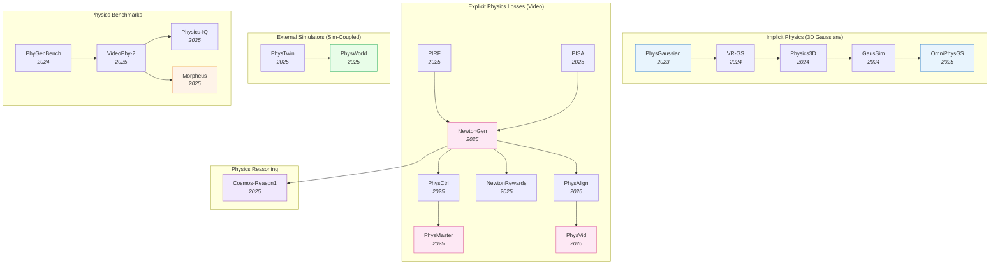

# Physics-Aware Embodied AI — Deep Dive

> [!abstract] Overview
> Most modern WAMs and VLAs learn physics *implicitly* — by training on enough internet video, the model picks up gravity, friction, and contact dynamics as side effects of next-frame or next-action prediction. Physics-aware embodied AI takes the opposite view: bake **explicit** physical priors into the model — through differentiable simulators, physics-constrained losses, RL with physics-verifiable rewards, or hybrid pipelines that hand state to an external solver. This note maps the design space (implicit / explicit-loss / external-simulator), the generation–training–inference tracks, and the physics-commonsense benchmarks that measure how well models actually obey Newton.

## Evolution Graph

The field evolved through four parallel tracks. **3D-Gaussian-based implicit physics** (2023→2025) embeds material properties directly into renderable 3D Gaussians, unifying simulation and rendering. **Explicit physics losses** for video generation (2025→2026) backpropagate physics-residual rewards or Newton's laws through diffusion models. **External-simulator coupling** (2025→2026) hands generated state to a real physics solver — [[2503.17973|PhysTwin]] reconstructs deformable digital twins from video; [[2511.07416|PhysWorld]] trains the policy against a learned physics simulator. **Physics commonsense reasoning** (2025) lifts physical priors from pixel/state-level losses into language-level reasoning ([[2503.15558|Cosmos-Reason1]]).

| Year | Paper | Track | Contribution |
|------|-------|-------|--------------|
| 2023 | [[2311.12198\|PhysGaussian]] | Implicit | First MPM-coupled 3D-Gaussian renderer; unifies sim and rendering |
| 2024 | [[2401.16663\|VR-GS]] | Implicit | Physics-aware interactive Gaussian Splatting in VR |
| 2024 | [[2406.04338\|Physics3D]] | Implicit | Learn physical properties of 3D Gaussians from video diffusion |
| 2024 | [[2412.17804\|GausSim]] | Implicit | Foreseeing reality: Gaussian simulator for elastic objects |
| 2025 | [[2501.18982\|OmniPhysGS]] | Implicit | Constitutive Gaussians for general physics-based dynamics |
| 2025 | [[2509.20570\|PIRF]] | Explicit-loss | Physics-informed reward fine-tuning of diffusion models |
| 2025 | [[2509.21309\|NewtonGen]] | Explicit-loss | Neural Newtonian dynamics for T2V |
| 2025 | [[2509.20358\|PhysCtrl]] | Explicit-loss | Generative physics for controllable video |
| 2025 | [[2503.09595\|PISA]] | Explicit-loss | Physics post-training for video diffusion via dropping experiments |
| 2025 | [[2510.13809\|PhysMaster]] | Explicit-loss | Mastering physical representation via RL fine-tuning |
| 2025 | [[2512.00425\|NewtonRewards]] | Explicit-loss | Post-training Newton's laws with verifiable rewards |
| 2026 | [[2603.13770\|PhysAlign]] | Explicit-loss | Feature + 3D representation alignment for physics-coherent I2V |
| 2026 | [[2603.26285\|PhysVid]] | Explicit-loss | Physics-aware local conditioning for generative video |
| 2026 | [[2604.17896\|Physical-Feasibility VLA]] | Explicit-loss | Differentiable geometric feasibility loss for VLA training; SSR 22→**43.50%** |
| 2026 | [[2605.05163\|PhysForge]] | Asset gen | VLM-planner + diffusion-realizer for simulation-ready 3D assets |
| 2025 | [[2503.17973\|PhysTwin]] | External-sim | Physics-informed reconstruction of deformable digital twins |
| 2025 | [[2511.07416\|PhysWorld]] | External-sim | Robot learning from a physical world model |
| 2026 | [[2605.06593\|ReActor]] | External-sim | Disney bilevel RL + physics simulation for motion retargeting; +15.22pp downstream RL |
| 2025 | [[2503.15558\|Cosmos-Reason1]] | Reasoning | Physical commonsense and embodied reasoning at WAM scale |

---

## 1. Design-Space Principles

Three orthogonal axes define every physics-aware embodied AI system.

> [!success] The Three Axes
> - **Where physics lives**: implicit (in features) / explicit (in loss) / external (in solver)
> - **What is physical**: appearance (3D Gaussians + MPM) / dynamics (video next-frame) / reward (RL)
> - **When it intervenes**: at generation / at training / at inference

### Axis 1 — Where Physics Lives

| Where | Mechanism | Example |
|-------|-----------|---------|
| **Implicit (in features)** | Each scene element carries physical attributes; standard simulator integrates them | [[2311.12198\|PhysGaussian]], [[2501.18982\|OmniPhysGS]] |
| **Explicit (in loss)** | Physics residual / Newton's laws / verifiable physical predicate as training signal | [[2509.20570\|PIRF]], [[2509.21309\|NewtonGen]], [[2512.00425\|NewtonRewards]] |
| **External (in solver)** | Generative model proposes; physics simulator (MPM, FEM, MuJoCo) verifies/refines | [[2503.17973\|PhysTwin]], [[2511.07416\|PhysWorld]] |

### Axis 2 — What Is Physical

| Layer | What Gets Physics-Constrained | Cost |
|-------|------------------------------|------|
| **Appearance** | Pixels respect material properties (elasticity, plasticity) | High render cost; pixel-level fidelity |
| **Dynamics** | Next-frame prediction obeys conservation laws | Mid cost; better visual physics |
| **Reward** | RL reward = physics consistency score | Low cost; trains generation through RL |

### Axis 3 — When Physics Intervenes

| Stage | Intervention | Example |
|-------|--------------|---------|
| **Generation** | Each denoising step is constrained by physics | [[2406.04338\|Physics3D]], [[2603.26285\|PhysVid]] |
| **Training** | Physics-residual is added to training loss / reward | [[2509.20570\|PIRF]], [[2510.13809\|PhysMaster]], [[2512.00425\|NewtonRewards]] |
| **Inference** | Sample candidates; physics solver rejects implausible ones | [[2603.23376\|ABot-PhysWorld]] (Diffusion-DPO) |

> [!tip] Pick by Constraint
> If you need **photorealistic deformation rendering**, pick implicit (3D Gaussians + MPM). If you need **internet-scale video that respects gravity**, pick explicit-loss (PIRF, [[2509.21309|NewtonGen]]). If you need a **deployable robot policy that won't violate physics**, pick external-simulator ([[2511.07416|PhysWorld]]) or physics-grounded RL (NewtonRewards, PhysMaster).

---

## 2. Implicit Physics — 3D Gaussians as Simulation Substrate

The dominant implicit-physics paradigm fuses 3D Gaussian Splatting with continuum-mechanics solvers (typically the ==Material Point Method==). Each Gaussian is *both* a renderable primitive and a simulation particle, eliminating the geometry/render mismatch of traditional pipelines.

**Why 3D Gaussians + MPM Win**: Gaussians are differentiable, particle-like, and already compatible with rendering. MPM handles arbitrary materials (elastic, plastic, granular, viscoplastic) on the same particle representation. Result: "what you see is what you simulate" — no separate mesh extraction step.

- [[2501.18982|OmniPhysGS]], [[2412.17804|GausSim]], [[2406.04338|Physics3D]], [[2401.16663|VR-GS]], [[2311.12198|PhysGaussian]]

> [!star] Key Papers
> - [[2311.12198|PhysGaussian]] — First to couple 3D Gaussian Splatting with MPM; eliminates geometry/render mismatch and unifies dynamics + appearance
> - [[2501.18982|OmniPhysGS]] — Constitutive Gaussians for general physics-based dynamics; covers elastic, plastic, granular, viscoplastic in one framework
> - [[2406.04338|Physics3D]] — Learns physical properties of 3D Gaussians directly from video diffusion supervision

**Physics-Grounded Asset Generation** — Generating simulator-ready 3D assets with physics metadata, rather than rendering physics-consistent scenes.
- [[2605.05163|PhysForge]]

**How PhysForge Works**: A decoupled two-stage framework — Stage 1: a VLM performs abstract "physical planning" (decomposing an object into parts and predicting joint types + physical properties); Stage 2: a diffusion model with a Kinematic Voxel Injection (KVI) mechanism realizes geometry + continuous kinematic parameters from the VLM's plan. Trained on PhysDB (150,000 3D objects with a four-tier hierarchical physical annotation system: holistic / static / functional / interactive). The generated assets are **simulation-ready** — directly usable in robotic simulators and game engines for embodied AI training.

> [!star] Key Papers
> - [[2605.05163|PhysForge]] — Two-stage VLM-planner + diffusion-realizer for simulation-ready 3D assets; **0.101** Joint-Axis-Err-5 (SOTA) with VLM-grounded part decomposition and KVI-realized kinematics

> [!tip] When Implicit Physics Helps
> Implicit physics shines when the *appearance* matters as much as the dynamics — VR, content creation, digital twins. For pure robot control, the rendering pipeline is overhead; explicit-loss approaches are cheaper.

---

## 3. Explicit Physics Losses for Video Generation

The fastest-growing track. Internet-video diffusion models (Sora, Veo, Cosmos, [[2503.20314|Wan]]) learn approximate physics implicitly but routinely violate gravity, conservation of mass, and rigid-body constraints. Explicit-loss approaches add a physics-residual term that *measures* the violation and backpropagates it.

### 3.1 Differentiable Physics Residuals

Write down a physics law as an equation; the negative residual is your reward.

- [[2509.20570|PIRF]], [[2509.21309|NewtonGen]], [[2503.09595|PISA]]

**How PIRF works**: Frames the diffusion denoising as a Markov Decision Process with a sparse reward — the negative PDE residual at the final state. Layer-wise truncation restricts updates to high-resolution U-Net layers, preventing reward hacking and preserving global semantics. **NewtonGen** goes further by injecting an explicit Neural-Newtonian-Dynamics layer that predicts trajectories under F=ma constraints, then conditions T2V generation on those trajectories. **PISA** specializes to drop dynamics: training on physics-verifiable "watching stuff drop" experiments aligns video diffusion with gravity.

### 3.2 RL with Physics-Verifiable Rewards

Use a physics simulator as the reward signal, then train the generator with RL.

- [[2512.00425|NewtonRewards]], [[2510.13809|PhysMaster]], [[2509.20358|PhysCtrl]]

**How NewtonRewards works**: Formulates Newton's laws as a *verifiable reward* — a checker function that evaluates whether a generated video clip is consistent with mechanics. Post-training the video generator with this reward measurably reduces gravity-violation cases. **PhysMaster** pushes the same idea: RL fine-tuning of video diffusion against physical-representation rewards, mastering material-specific dynamics.

### 3.3 Physics-Aware Conditioning at Generation Time

Constrain *during* sampling rather than during training.

- [[2603.13770|PhysAlign]], [[2603.26285|PhysVid]], [[2603.23376|ABot-PhysWorld]]

**PhysAlign** aligns the diffusion model's intermediate features and 3D representation with physics targets, ensuring physics-coherent image-to-video generation. **PhysVid** uses physics-aware local conditioning — local regions of a generative video carry per-region physical priors. **ABot-PhysWorld** uses Diffusion-DPO with physics-rejected negatives, training the diffusion model to suppress object-penetration and anti-gravity outputs.

> [!star] Key Papers
> - [[2509.20570|PIRF]] — Lower PDE residual MSE on **4 of 5** PDE benchmarks; zero reward queries at inference; works with **20** sampling steps
> - [[2509.21309|NewtonGen]] — Neural Newtonian dynamics injected into T2V backbone; physics-consistent motion under user control
> - [[2512.00425|NewtonRewards]] — RL post-training with Newton's laws as verifiable reward; significantly reduces gravity violations
> - [[2603.13770|PhysAlign]] — Feature + 3D-representation alignment for physics-coherent image-to-video generation

> [!tip] Explicit Loss vs Implicit Physics
> Explicit losses scale to internet-video data without requiring 3D supervision — you only need a verifiable physics check, not a full simulator state. This is why explicit-loss papers dominated 2025-2026 progress.

---

## 4. External Simulator Coupling

Generative models are great at hypothesizing futures; physical simulators are great at verifying them. Coupling the two gets you the best of both — at the cost of a brittle interface between learned and analytical components.

- [[2605.06593|ReActor]], [[2511.07416|PhysWorld]], [[2503.17973|PhysTwin]]

**How PhysTwin works**: Multi-stage optimization that jointly reconstructs geometry, infers physical properties, and models appearance. Spring-mass models + generative shape priors + Gaussian splats produce an interactive digital twin from videos — usable for robot motion planning. The simulator runs in real-time, allowing the robot to plan against the digital twin before acting.

**How PhysWorld works**: Trains the robot policy against a learned physical world model. Unlike pure video-WAMs, PhysWorld embeds explicit physical state (positions, velocities, forces), so policy gradient signals reflect physics-consistent interactions rather than visual consistency only.

**How ReActor works**: Bilevel optimization in which the upper level learns retargeting parameters and the lower level trains a motion-tracking policy via RL inside a physics simulator. A simplified gradient estimator avoids the implicit-function-theorem cost typical of bilevel-RL. Because retargeting happens *inside* the simulator, the produced motions inherit physics consistency for free — zero ground/self-penetration, near-zero foot sliding — and the cleaned data lifts downstream RL success by up to **+15.22 pp**.

> [!star] Key Papers
> - [[2605.06593|ReActor]] — Bilevel RL inside a physics simulator for human→robot motion retargeting; zero ground/self-penetration, +15.22pp downstream RL success on G1, generalizes to quadrupeds and physical hardware
> - [[2503.17973|PhysTwin]] — Physics-informed digital twin from video; real-time interactive simulation + robot planning integration
> - [[2511.07416|PhysWorld]] — Robot learning from a physical world model; explicit physical state as the learning substrate

> [!tip] When to Couple to a Real Simulator
> If your domain has well-understood physics (rigid-body manipulation, deformable rope, fluid pouring), a physics simulator is the cheapest way to enforce correctness. If physics is uncertain (cluttered open-world scenes), learned physics priors generalize better than analytical ones.

---

## 5. Physics-Aware Reasoning

Physical reasoning sits one level above physical generation: the model must *talk about* physics consistently, not just produce physics-compliant pixels.

- [[2503.15558|Cosmos-Reason1]]

**How Cosmos-Reason1 works**: Trains a multi-modal foundation model jointly on physical commonsense (object permanence, material properties, forces) and embodied reasoning (planning under physical constraints). Bridges the gap between video-WAMs (which produce physics-consistent video) and reasoning VLAs (which need physics priors to plan multi-step manipulation).

> [!star] Key Papers
> - [[2503.15558|Cosmos-Reason1]] — Lifts physics from pixel-level losses to language-level reasoning; physical commonsense + embodied reasoning at WAM scale

---

## 6. Physics Commonsense Benchmarks

You can't optimize what you can't measure. Four benchmarks define current physics-evaluation:

| Benchmark | What It Tests | Key Finding |
|-----------|--------------|-------------|
| [[2410.05363\|PhyGenBench]] | Physical commonsense across diverse scenes | Best frontier T2V scores **0.51/3.0** PCA — far below human |
| [[2503.06800\|VideoPhy-2]] | Action-centric physical reasoning | Best closed models reach only **32.6%** joint score (**22%** on the hard subset) |
| [[2501.09038\|Physics-IQ]] | Whether generative video models understand physical principles | Models pass visual quality, fail physical-principle probes |
| [[2504.02918\|Morpheus]] | Real physical experiments as benchmarks | Generative models fail real-experiment match |

> [!star] Key Papers
> - [[2410.05363|PhyGenBench]] — Physical-commonsense benchmark for video generation; first to systematically expose the visual-quality vs physics-correctness gap
> - [[2503.06800|VideoPhy-2]] — Action-centric physical reasoning evaluation; bridges video generation and embodied AI evaluation
> - [[2501.09038|Physics-IQ]] — Asks whether generative video models *understand* physics; finds visual fluency does not imply physics knowledge
> - [[2504.02918|Morpheus]] — Real physical experiments as benchmark; closes the loop with measurable real-world physics

> [!tip] The Visual-Quality Trap
> Models that score top-tier on FVD/SSIM frequently score below random on physics-IQ probes. Always pair appearance metrics (FVD, FID, SSIM) with physics-commonsense metrics (PhyGenBench, Physics-IQ, Morpheus) — they measure orthogonal axes.

---

## 7. Physics-Aware Pipelines for Embodied AI

How do these pieces connect when you build an end-to-end physics-aware robot system? Three composable patterns:

**Pattern A — Physics-Coupled VLA Training**: Pretrain a video diffusion backbone with explicit physics losses ([[2512.00425|NewtonRewards]] / [[2510.13809|PhysMaster]] / [[2509.20570|PIRF]]), then attach a downstream action head. The action head inherits physics-grounded representations without requiring physics supervision in the action loss. See [[03_VLA]] §5 for the WAM-augmented VLA recipe.

**Pattern A.1 — Geometric Feasibility Loss on Actions**: A complementary variant — add a differentiable geometric feasibility term [[2604.17896|Physical-Feasibility VLA]] directly to the VLA's action loss. The auxiliary loss (==L_geo==) is a ==squared-hinge== penalty on the signed distance between robot links and obstacle geometry, activating only when clearance drops below a safety margin. No physics-aware backbone needed; the geometric inductive bias is supplied entirely at training time and disappears at deployment. Particularly effective in **low-data regimes** — 40-episode policies match 120-episode baselines (Safe Success Rate **22.00% → 43.50%** under small perturbations).

**Pattern B — Digital-Twin-in-the-Loop**: Use [[2503.17973|PhysTwin]] to reconstruct a physical digital twin of the robot's workspace from video. Train the policy against the digital twin, then transfer to the real world. Physics consistency is enforced by the simulator, not the policy. See [[02_Dataset-Benchmark-Environment]] for sim-to-real evaluation.

**Pattern C — Physics-Reasoning-Augmented Planning**: Use [[2503.15558|Cosmos-Reason1]] (or a successor) as the high-level planner. The planner decomposes tasks using physics commonsense ("the ice cube will melt before I can carry it across the room"), then a low-level VLA executes. See [[08_VLA-Reasoning-and-CoT]] for the broader reasoning insertion taxonomy.

> [!success] Choose Your Pattern
> - **Need a robust generalist VLA?** Pattern A (Physics-Coupled VLA Training)
> - **Need sim-to-real for a specific deployment?** Pattern B (Digital-Twin-in-the-Loop)
> - **Need long-horizon physics reasoning?** Pattern C (Physics-Reasoning-Augmented Planning)

---

## 8. Open Problems

- **Verifiable physics scales poorly**: [[2509.20570|PIRF]] and [[2512.00425|NewtonRewards]] work well for narrow PDEs, but writing a verifiable physics check for a cluttered kitchen is open. The next frontier is *learned* physics-verifiers that generalize.
- **Implicit-vs-explicit trade**: 3D-Gaussian methods produce stunning rendering but cost compute; explicit-loss methods scale to internet video but lose 3D fidelity. Hybrid approaches ([[2603.13770|PhysAlign]] uses both) are emerging but unproven.
- **Reward hacking in physics RL**: [[2510.13809|PhysMaster]] and NewtonRewards can be gamed by models that produce static or trivially-physical outputs. Layer-wise truncation (PIRF) helps but isn't a full solution.
- **Benchmark-vs-deployment gap**: Models scoring well on [[2410.05363|PhyGenBench]] / [[2501.09038|Physics-IQ]] may still fail on real robot deployment. [[2504.02918|Morpheus]] closes part of this gap but covers narrow scenarios.

---

## Quick-Reference Matrix

| Question | Answer |
|----------|--------|
| Need implicit physics in 3D? | [[2501.18982\|OmniPhysGS]] (constitutive) or [[2311.12198\|PhysGaussian]] (foundational) |
| Need physics-consistent video? | [[2509.21309\|NewtonGen]], [[2509.20358\|PhysCtrl]], or [[2503.09595\|PISA]] |
| Need RL with physics rewards? | [[2512.00425\|NewtonRewards]] or [[2510.13809\|PhysMaster]] |
| Need physics-aligned generation? | [[2603.13770\|PhysAlign]] or [[2603.26285\|PhysVid]] |
| Need a digital twin? | [[2503.17973\|PhysTwin]] |
| Need physics for robot policy? | [[2511.07416\|PhysWorld]] |
| Need physics reasoning? | [[2503.15558\|Cosmos-Reason1]] |
| Need to evaluate physics? | [[2410.05363\|PhyGenBench]] + [[2503.06800\|VideoPhy-2]] + [[2501.09038\|Physics-IQ]] + [[2504.02918\|Morpheus]] |

---

## Cross-References

- [[01_Embodied-AI-101]] — Embodied AI basics; physics is one of the four learning-strategy bottlenecks
- [[03_VLA]] — VLA deep-dive; physics-coupled VLA training in §5 (WAM-augmented)
- [[04_WAM]] — WAM deep-dive; physics-aligned video generation in §2
- [[05_Latent-World-Models]] — Latent dynamics; some physics-aware models live in latent space
- [[06_Self-Evolving-VLA-WAM]] — Self-evolution; physics priors stabilize WAM dreams
- [[08_VLA-Reasoning-and-CoT]] — Reasoning; [[2503.15558|Cosmos-Reason1]] lives at the physics/reasoning intersection
- [[09_Egocentric-Pretraining-and-Human-Video]] — Egocentric pretraining deep-dive
- [[10_Force-Aware-and-Tactile-Policies]] — Force/tactile policies deep-dive; physics constraints complement force feedback
- [[11_Sim-to-Real-Transfer]] — Sim-to-Real Transfer deep-dive; physics engines as the sim substrate
- [[02_Dataset-Benchmark-Environment]] — Benchmarks; physics-commonsense evaluation suite

---

*See [[04_WAM]] for video-WAM physics, [[03_VLA]] for VLA integration, or [[08_VLA-Reasoning-and-CoT]] for reasoning patterns that consume physics priors.*
