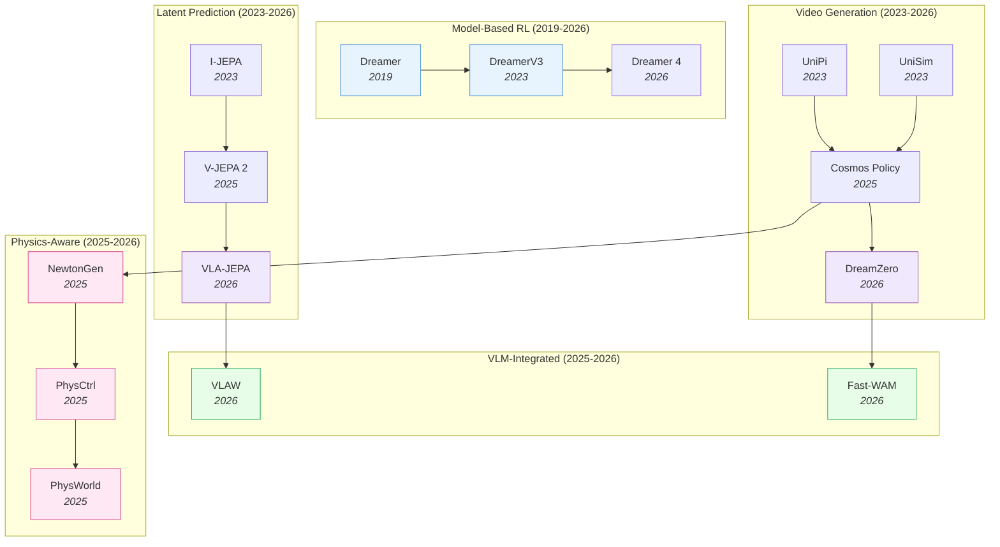

# World Action Models — Deep Dive

> [!abstract] Overview
> World Action Models (WAMs) learn to predict future states of the environment, giving robots the ability to "imagine" consequences before acting. Unlike VLAs that map observations directly to actions, WAMs explicitly model dynamics — enabling planning, robustness to perturbation, and sample-efficient learning. This note maps the full WAM landscape across five paradigms: VideoGen, latent prediction (JEPA family), model-based RL ([[1912.01603|Dreamer]] lineage), VLM-integrated, and efficient/action-centered designs.

## Evolution Graph

The field evolved through four threads: **model-based RL** (2019-2026) where [[1912.01603|Dreamer]] established latent imagination for planning; **video generation** (2023-2026) where diffusion models learned physics from internet video; **latent prediction** (2023-2026) where JEPA showed you can predict in representation space without reconstructing pixels; and **VLM integration** (2025-2026) where world models merged with VLAs for robust, efficient policies.

| Year | Paper | Contribution |
|------|-------|-------------|
| 2019 | [[1912.01603\|Dreamer]] | Latent imagination via RSSM; learned behaviors from pixels without reward |
| 2023 | [[2301.04104\|DreamerV3]] | Mastered diverse domains with fixed hyperparameters; universal model-based RL |
| 2023 | [[2302.00111\|UniPi]] | Actions as text-conditioned video; proved video generation = planning |
| 2023 | [[2310.06114\|UniSim]] | Universal simulator via video diffusion; interactive world generation |
| 2023 | [[2301.08243\|I-JEPA]] | Predict in latent space, not pixel space; avoids reconstruction artifacts |
| 2025 | [[2506.09985\|V-JEPA 2]] | Self-supervised video model enabling understanding, prediction, and planning |
| 2025 | [[2601.16163\|Cosmos Policy]] | Fine-tuned video diffusion model as visuomotor policy |
| 2026 | [[2602.15922\|DreamZero]] | 14B WAM: joint video + action prediction enables zero-shot policies |
| 2026 | [[2602.10098\|VLA-JEPA]] | JEPA world model + flow-matching action head; 97.2% [[2306.03310\|LIBERO]] |
| 2026 | [[2602.12063\|VLAW]] | Iterative co-improvement: VLA and world model reinforce each other |
| 2026 | [[2509.24527\|Dreamer 4]] | Scalable world model training agents inside video game environments |
| 2026 | [[2603.16666\|Fast-WAM]] | WAM benefits without test-time imagination via video co-training |
| 2026 | [[2605.15153\|Pelican-Unified]] | Single-model unification of understanding + reasoning + imagination + action via shared latent z + UFG |
| 2026 | [[2605.12090\|WAM Survey]] | First formal WAM definition; Cascaded vs Joint architectural taxonomy; four-data-ecosystem analysis |
| 2026 | [[2605.10942\|HarmoWAM]] | Dual predictive+reactive experts + process-adaptive gating resolve generalization-precision trade-off |
| 2025 | [[2509.21309\|NewtonGen]] | Physics-consistent T2V via neural Newtonian dynamics |
| 2025 | [[2509.20358\|PhysCtrl]] | Generative physics for controllable video generation |
| 2025 | [[2511.07416\|PhysWorld]] | Robot learning from a physical world model |
| 2026 | [[2603.13770\|PhysAlign]] | Feature + 3D-representation alignment for physics-coherent video |
| 2026 | [[2603.26285\|PhysVid]] | Physics-aware local conditioning for generative video |

---

## Part A — Design Space

*The dimensions every WAM choice sits on: where to predict, when to predict, how to condition.*

### 1. The Design Space

> [!star] WAM Definition & Cascaded vs Joint Taxonomy
> [[2605.12090|WAM Survey]] is the first paper to formally define WAMs and disambiguate them from VLAs (no dynamics model) and pure World Models (no action generation). It splits the architectural landscape along a single axis — ==Cascaded== (sequential: predict next state, then derive action) vs ==Joint== (unified state-action prediction) — and surveys four data-ecosystem axes (robot, human, simulation, internet-scale video) plus emerging evaluation protocols. The Cascaded/Joint distinction is the field-defining taxonomy that subsequent sections of this note implicitly use.

Three axes define where a WAM sits in the design landscape:

| Axis | Options | Trade-off |
|------|---------|-----------|
| **Where to predict** | Pixel space ([[2602.15922\|DreamZero]]), Latent space (JEPA, [[2504.02792\|UWM]]), Action space ([[2205.09991\|Diffuser]]) | Pixel = rich but slow; Latent = fast but abstract; Action = efficient but no visual feedback |
| **When to predict** | Training-time only ([[2603.16666\|Fast-WAM]]), Test-time imagination ([[2602.15922\|DreamZero]]) | Training-time = fast inference; Test-time = more robust but 4.8x slower |
| **What to predict** | Full video (Cosmos), Optical flow ([[2508.18269\|FlowVLA]]), Compressed latent ([[2602.22010\|WoG]]), Future embeddings (JEPA) | Full video = interpretable but expensive; Latent = efficient but opaque |

**Where to predict** determines computational cost and expressiveness. Pixel-space prediction ([[2602.15922|DreamZero]]'s 14B DiT) generates full video frames — maximally expressive but requires iterative denoising (~150ms per frame). Latent-space prediction ([[2602.10098|VLA-JEPA]]'s V-JEPA2 predictor) operates on compressed embeddings — a single forward pass (~10ms) but loses fine visual detail. Action-space prediction ([[2205.09991|Diffuser]]) skips visual prediction entirely — fastest but provides no visual feedback for planning or debugging.

**When to predict** is the 2026 insight from [[2603.16666|Fast-WAM]]: you need video generation at training time (to learn spatiotemporal priors from internet video) but NOT at test time (where it adds 4.8x latency). The world model's value is in the representations it creates during training, not in the predictions it makes during deployment.

**What to predict** trades off between interpretability and efficiency. Full video (Cosmos) is human-readable but expensive. Optical flow ([[2508.18269|FlowVLA]]) captures motion efficiently. Future embeddings (JEPA) are opaque but compact. The choice depends on whether a human needs to inspect the predictions (development/debugging) or only the policy needs them (deployment).

**Design Space — Decision Matrix**

| If you need... | Reach for... |
|---|---|
| Maximum physics priors + interpretable rollouts | Pixel-space VideoGen (§2) — [[2602.15922\|DreamZero]] (slow but robust) |
| Real-time latent prediction (~10ms/step) | Latent prediction (§3) — JEPA / [[2504.02792\|UWM]] |
| WAM robustness *without* test-time latency | Training-time-only video co-training — [[2603.16666\|Fast-WAM]] |
| Efficient motion signal, no full frames | Compact prediction — optical flow ([[2508.18269\|FlowVLA]]), latent ([[2602.22010\|WoG]]) |
| Pure planning with no visual feedback | Action-space prediction — [[2205.09991\|Diffuser]] |
| Formal cascaded-vs-joint placement | [[2605.12090\|WAM Survey]] taxonomy |

> [!tip] The Core Trade-off
> VideoGen WAMs are the most robust (spatiotemporal priors from internet video) but the slowest. Latent prediction WAMs are fast and sample-efficient. [[2603.16666|Fast-WAM]] shows you can bridge this gap: train with video generation objectives but deploy without test-time imagination.

---

## Part B — WAM Paradigms

*Five architectural families: VideoGen, latent prediction, Dreamer/RSSM, VLM-integrated, efficient/action-centered.*

### 2. VideoGen WAMs

Video diffusion models repurposed as world simulators. The richest source of physics priors — trained on internet-scale video data.

#### 2.1 Planning as Video Generation

The foundational insight: generating a video of the future IS a plan. Condition the diffusion model on the current observation and a language instruction, then denoise to produce a future video; an inverse dynamics model extracts the motor commands. This axis defines *what the WAM outputs* — a goal video, not actions directly.

- **[[2605.23993|Nano World Models]]** — A minimalist open-source ==diffusion-forcing== harness that sweeps ==generative objectives==, model scale (**39.8M–~460M**), ==action-conditioning==, and latent spaces; SD-VAE latents reach **25.0%** PushT goal-planning while V-JEPA 2.1 / Web-DINO semantic latents hit **0.0%** — reconstruction latents plan, semantic latents don't.
- **[[2604.04502|Veo-Act]]** — A ==hierarchical framework== that pairs a frontier video generator (Veo-3) for high-level visual planning with a low-level VLA, switched by a ==multi-head inverse dynamics model== whose gate value flags contact-rich interaction; **2.8×** sim and **3.2×** real task-success gain over the π0.5 baseline, robust to invisible wrist cams + distractors.
- **[[2512.15840|LV-P]]** — A **14B** ==Large Video Planner== on a curated **1.4M**-clip dataset (LVP-1M) with ==diffusion forcing== + ==history guidance==; plans are executed by 4D hand-motion reconstruction → gripper/dex-hand retargeting; **59.3%** avg "task complete" on 100 in-the-wild tasks (vs Wan-2.1 **39.3%**), **6/10** OOD real-robot gripper tasks where VLA baselines score ≤1.
- **[[2506.22007|RoboEnvision]]** — A ==hierarchical non-autoregressive== long-horizon generator: KeyframeDiff emits sub-task end-state keyframes (==3D Attention== + ==Semantics-Preserving Attention==), FillingDiff interpolates; a lightweight policy trained on its videos hits **67.4%** on 45 long-horizon LHMM tasks (vs UniPi **23.5%**, RDT-1B **34.1%**) — bypasses autoregressive drift.
- **[[2406.13301|ARDuP]]** — An ==active-region== universal video planner that conditions a ==latent video diffusion== planner + a ==task-specific latent IDM== on ==point-tracking (Co-Tracker) + SAM== region masks; **+21.3%** Place-Bowl (**86.7%** vs **65.4%** UniPi*) and **+17.2%** Pack-Object on CLIPort plus robust BridgeData-v2 real-world transfer.
- **[[2401.09985|WorldDreamer]]** — A general world model that frames video generation as ==masked visual-token prediction== via a ==Spatial-Temporal Patchwise Transformer== with spatial cross-attention for multimodal prompts; parallel sampling in ~**10 steps** yields **3–20×** faster inference than diffusion/AR, supporting image-/text-/action-to-video in one model.
- **[[2310.08576|AVDC]]** — A ==three-stage video→flow→action== pipeline that infers actions without labels: ==factorized spatial-temporal conditional diffusion== generates future frames, then ==2D optical flow== is lifted to 3D rigid transforms; **43.1%** avg on 11 Meta-World tasks (vs UniPi **6.1%**), **90%** zero-shot human→sim cross-embodiment push, real Franka transfer.
- **[[2310.06114|UniSim]]** — A ==5.6B-parameter video diffusion== simulator with ==dataset orchestration== unifying robotic + human + panorama + internet data + ==T5-embedded unified action space==; zero-shot sim-to-real **3–4× better** goal reduction; captioning fine-tune CIDEr **15.2 → 46.23** — first interactive world generator covering both human + robot agents.
- **[[2302.00111|UniPi]]** — A ==Unified Predictive Decision Process== formulation casting policy as text-conditioned video generation + ==task-specific inverse dynamics model==; **60.1%** vs **12.5%** baselines on novel "Place" tasks, **51.6%** vs **14.8%** unseen CLIPort "Place Bowl"; internet-video pretrain lifts real robots **72.6% → 77.1%** — defined the *"video is the plan"* formulation.
- **[[2310.10625|VLP]]** — A ==parallel hill-climbing tree search== planner with VLM as policy+heuristic + ==text-to-video dynamic simulator== + ==goal-conditioned receding-horizon execution==; **98%** Group-Color synthesis (vs **2–64%** baselines), **92%** robot execution (vs **0–4%** baselines), validated on 7-DoF + 14-DoF bimanual.

#### 2.2 Video Pretraining for Robot Policies

Train a video-prediction backbone on internet-scale video, then fine-tune with action heads. The video objective gives spatiotemporal priors that pure action-imitation cannot match.

- **[[2606.09813|iMaC]]** — An embodied world model translating actions into Motion Images + Scene/Robot Contact Images that drive a multi-view ==image-to-video diffusion== transformer, with a training-time rollout strategy to cut exposure bias; best task-averaged FID/PSNR/SSIM/FVD, and **0.833–0.956** WM-vs-real policy-ranking correlation on six of eight real-robot tasks.
- **[[2606.04463|OSCAR]]** — A ==skeleton-conditioned omni-embodiment WAM== finetuning a **2B** Cosmos-Predict2.5 ==Diffusion Transformer== on ==2D kinematic skeleton rendering==; **FVD 7.08 / FID 15.07 / PSNR 24.24** beating seven larger baselines, and virtual policy eval correlates with real RoboArena rankings at **Pearson r +0.852** (mean SR error **1.73 pp**).
- **[[2606.01955|WALL-WM]]** — A ==Layer-coupled video-action denoiser== shifting the atomic learning unit from action chunks to ==semantically coherent action events==; embodied video-gen Motion Quality **0.771** (vs **0.683**), Semantic Alignment **0.886** (vs **0.805**), real-robot Task Progress **75.86** / **71.60** / **53.75** beating DreamZero.
- **[[2606.03159|OmniDreams]]** — An ==Autoregressive action-conditioned generative world model== on a causal ==transformer== for real-time closed-loop AV simulation, conditioned on past frames + text + abstract scenario maps; **68 FPS** single-camera / **105 FPS** four-camera on GB300, **FVD 24.8** with driving-semantic preservation (3D-vehicle LET-AP **0.400**, lane-line F1 **0.828**).
- **[[2605.22272|Imagine2Real]]** — A method that turns ==video generative priors== into humanoid HOI policies via a ==unified 4D point-trajectory== for robot+object + a ==Behavior-Foundation-Model keypoints tracker== on sparse interaction points; it cuts action jitter **1.65→0.22**, lifts Carry-Box **0.00%→82.65%** / Push-Box **29.82%→64.91%**, and runs zero-shot on a real Unitree G1 (0.5–2 kg).
- **[[2605.15178|SANA-WM]]** — A **2.6B** open-source ==Hybrid Linear Diffusion Transformer== generating ==one-minute 720p videos== with 6-DoF camera control on a single GPU; frame-wise ==Gated DeltaNet== fused with ==softmax attention== + key-scaling $1/\sqrt{D \cdot S}$; VBench Overall **80.62/81.89**, **22 videos/hour** on H100, **39x** distilled speedup on RTX 5090.
- **[[2605.06192|EA-WM]]** — A video WAM with ==Kinematic-to-Visual Action Fields (KVAFs)== projecting 3D robot geometry to camera plane + ==Event-Aware Bidirectional Fusion (EAF)== in DiT + ==Event-Difference Latent Supervision==; **P3CScore 76.60** on WorldArena (+5.52 over CogVideoX); ablations confirm KVAFs (-5.63) + EAF (-1.80) load-bearing.
- **[[2604.06168|Action Images]]** — A model that encodes 7-DoF actions as ==multi-view 2D Gaussian heatmap action images== of EE-position/up/normal + unified video-action joint training with diverse masking; zero-shot **60%** RLBench reach-target + **45%** real-world close-drawer (vs **0–20%** baselines); PSNR **23.48** vs **20.83** TesserAct.
- **[[2602.15922|DreamZero]]** — A **14B** joint video+action model; **39.5%** on unseen tasks, **42%** cross-embodiment improvement, **7Hz** real-time; defines the robustness ceiling for VideoGen WAMs.
- **[[2602.12099|GigaBrain-0.5M*]]** — A policy built on ==RAMP== (Reinforcement learning via world-Model-conditioned Policy) + ==self-improving closed loop== with ==Human-in-the-Loop Rollout== + continual joint VLA/WM training; it hits **100%** Juice-Preparation and +30pp over RECAP on Box-Packing/Espresso, while intermediate GigaBrain-0.1 tops RoboChallenge at **51.67%**.
- **[[2602.06949|DreamDojo]]** — A generalist robot WM pretrained on **44,711 hours** of egocentric human video via ==self-supervised continuous latent actions== + chunked action injection + ==temporal consistency loss== + ==distillation==; **10.81 FPS** distilled (~**4×**), Pearson **r=0.995** with real-world policy success, up to **+17%** (**2×**) model-based planning on fruit-packing.
- **[[2601.16163|Cosmos Policy]]** — A fine-tuned Cosmos video diffusion model as visuomotor policy; **98.5%** on [[2306.03310|LIBERO]]; the cleanest demonstration that pretrained video diffusion transfers to robot control.
- **[[2601.21998|LingBot-VA]]** — An ==autoregressive diffusion== framework unifying video+action tokens in shared continuous latent + ==Mixture-of-Transformers== + ==closed-loop rollout with KV-caching== + ==asynchronous FDM-grounded inference==; **92.9%** RoboTwin 2.0 Easy / **91.6%** Hard, **98.5%** LIBERO avg.
- **[[2601.03782|PointWorld]]** — A scalable 3D world model framing action-conditioned full-scene ==3D point-flow== prediction over a shared physical space (robot point-flows as action), with a PointTransformerV3 backbone + frozen DINOv3 + movement-weighted L2 loss; a single **1B** model runs **0.12s/10-step** and does zero-shot real Franka pushing, scarf-folding, and microwave-opening.
- **[[2511.07732|ViPRA]]** — A ==three-stage pipeline==: latent action learning from actionless videos → multimodal pretraining with video-language model → continuous adaptation via ==flow matching decoder + action chunking==; **69.8%** SIMPLER discrete, **62.5%** continuous, **79%** LIBERO Long, **54.1%** real single-arm at up to **22 Hz**.
- **[[2510.26583|Emu3.5]]** — A **34.1B** decoder-only transformer doing native ==next-state prediction across vision + language== under one ==next-token objective==, pretrained on **13T** tokens from ~**63M** videos + ==Discrete Diffusion Adaptation== for **~20×** faster image generation; **67.1%** win-rate vs Gemini-2.5-Flash on embodied manipulation, **65.5%** on world exploration.
- **[[2509.15536|SAMPO]]** — A ==hybrid autoregressive== WM fusing temporal-causal decoding with ==scale-wise== coarse-to-fine spatial generation + an ==asymmetric multi-scale tokenizer== + ==trajectory-aware motion prompts==; **FVD 55.5** vs iVideoGPT **60.8** on BAIR, **+2.1%** avg on VP2 visual planning + faster Meta-World MBRL convergence, **4.4×** faster inference than AR.
- **[[2508.00795|Video Policy]]** — A ==modular Video U-Net + Action U-Net== with action prediction conditioned on intermediate hidden embeddings + ==two-stage training== with gradient stopping; SOTA RoboCasa + Libero10 with only **50** demos/task; robust to unseen objects + backgrounds in real-world.
- **[[2505.15659|FLARE]]** — A ==Future Latent Representation Alignment== model predicting compact future state representations (not pixels) + ==action-aware observation embedding== + diffusion transformer + ==co-training with action-free human videos==; up to **+26%** over baselines, **95%** real-world with only **100** trajectories/task.
- **[[2412.15109|Seer]]** — An end-to-end ==predictive inverse dynamics model== unifying ==conditional visual foresight== with action control under ==unidirectional attention== so action tokens read both past + predicted-future tokens; **+13%** LIBERO-LONG, **+21%** CALVIN ABC-D (avg length **4.28** SOTA), **+43%** real-world — future-state prediction guides action selection.
- **[[2412.14803|VPP]]** — A fine-tuned ==Stable Video Diffusion text-guided video predictor== used as ==frozen predictive visual encoder== (single forward pass) + ==Video Former== feature condensation + Diffusion Policy head; CALVIN ABC→D avg length **4.33** (**+41.5%** over GR-1), **0.682** MetaWorld-50, **0.73** Franka unseen / **0.68** dex hand.
- **[[2411.18179|PAD]]** — A ==Prediction with Action Diffuser== jointly denoising future images + robot actions in one ==Diffusion Transformer== with ==masked-attention co-training== on action-free video; **+26.3%** relative on MetaWorld, **>40%** on the hardest unseen real tasks — joint denoising captures image-action correlations behavior cloning misses.
- **[[2410.06158|GR-2]]** — A ==GPT-style transformer== with ==video-language pretrain on 38M clips== + fine-tune with ==cVAE== for diverse action trajectories; **97.7%** multi-task tabletop, **75%** at **50 demos**, **79.0%** industrial bin-picking (vs **35.9%** GR-1), **98.6%** + length **4.64** on CALVIN.
- **[[2409.16283|Gen2Act]]** — A ==factorized== approach that generates zero-shot human video (off-the-shelf VideoPoet) then trains a closed-loop policy with an ==auxiliary point-track loss==; **58%** novel-object and **30%** novel-motion generalization where baselines score **0%** — decouples "what to do" (generated video) from "how" (robot execution).
- **[[2406.16862|Dreamitate]]** — A ==synthesize-then-track-then-act== pipeline that fine-tunes a video diffusion model on human tool-use demos, generates stereo tool-use video at inference, then tracks the tool's ==6D pose trajectory== to robot EE; **92.5%** on Object-Rotation (vs **55%**) and Sweeping (vs **12.5%**), holding up at two-thirds less data.
- **[[2312.13139|GR-1]]** — A ==decoder-only GPT-style transformer== with ==CLIP+MAE encoders== + ==[ACT]/[OBS] tokens== pretrained on **800K** Ego4D clips; **94.9%** CALVIN multi-task (vs **88.9%** HULC), **85.4%** unseen-scene zero-shot (vs **53.3%**), **77.8%** with only **10%** data — pioneered the video-prediction backbone + action-decoder pattern.

#### 2.3 Video Models as Data Engines

Use generated video as synthetic training data offline, rather than running the world model at test time. Decouples WAM benefits from inference latency.

- **[[2606.02577|RoboDream]]** — A ==compositional video-diffusion data engine== that ==decouples robot motion from visual context== for zero-shot novel-object/scene/viewpoint synthesis; Gen-Mix policies reach **62.5%** avg vs Real-50 **36.3%** and raw-retrieved **0%**, and prop-free collection runs **2.2×** faster than real teleoperation.
- **[[2603.08546|Interactive World Simulator]]** — A two-stage ==consistency-model autoencoder== + ==action-conditioned latent dynamics==; **25.82 dB** PSNR / **243.20** FVD (vs **17.79–20.81** / **799–2213** baselines), **10-min** rollouts at **15 FPS**, and policies trained purely on its data reach **87.9%** vs **90.3%** on real data with **0.85–0.99** sim-real correlation.
- **[[2512.24766|Dream2Flow]]** — A pipeline chaining off-the-shelf ==image-to-video gen== → ==3D object flow== (depth + segmentation + 2D point tracking + lifted to 3D) → ==optimization-based action inference== (particle dynamics / rigid-grasp / RL); up to **8/10** real-world success on Put-Bread-in-Bowl + Open-Oven across rigid/articulated/deformable/granular objects.
- **[[2512.13644|DexWM]]** — A latent-space WM with a ==Conditional Diffusion Transformer== on frozen DINOv2 + ==3D hand-keypoint difference action repr== + ==Hand Consistency Loss==; pretrained on EgoDex → MPC planning; **83%** zero-shot real-world Franka+Allegro grasping with **0** real-world training data; Reach **72%** / Grasp **58%** vs Diffusion Policy **16% / 0%**.
- **[[2511.19861|GigaWorld-0]]** — A unified ==data-engine== pairing GigaWorld-0-Video (==MoE IT2V==) + GigaWorld-0-3D (==3D Gaussian Splatting== + physical-property inference + trajectory synthesis); **82.07** PBench (Robot Set) with only **2B** active params; GigaBrain-0 trained purely on its synthetic data does real-world laundry-folding with zero real interaction.
- **[[2512.00961|GenReward]]** — A method that turns a frozen ==video diffusion model== (CogVideoX) into a ==multi-granular reward generator== for RL: video-level ==3D-VAE latent cosine similarity== to a goal video + frame-level ==Forward-Backward== reward; beats DreamerV3 with dense rewards (Bin-Picking return **398→822**), robust in sparse-reward, distracting, and dexterous (Adroit) settings.
- **[[2505.12705|DreamGen]]** — A ==4-stage pipeline==: fine-tune image-to-video → roll out synthetic videos → IDM/LAPA pseudo-actions → train policies; scales data **333×**; GR1 humanoid **37% → 46.4%**, Franka **23% → 37%**; generalizes to **22** novel behaviors (**43.2%** vs **11.2%**) + **10** unseen environments (**28.5%** vs **0%**).
- **[[2412.14957|DREMA]]** — A ==compositional world model== building physically-grounded digital twins via object-centric ==Gaussian Splatting== + open-vocab tracking + a ==PyBullet physics engine==, generating ==equivariant-transform== demonstrations verified before training; real-world SR nearly doubles **31.7% → 62.9%**, **+9.1%** single-task / **+13.1%** multi-task in low-data sim.
- **[[2504.15369|Inverse Probabilistic Adaptation]]** — An ==Inverse Probabilistic Adaptation== recipe: freeze pretrained T2V + subtract score of a small "distractor" model trained on irrelevant content; up to **3×** task-success improvement; ==Subject Customization== with only static images is highly data-efficient.
- **[[2511.00062|Physical AI World Sim]]** — A pair of NVIDIA ==world foundation models== (Cosmos-Predict2.5/Transfer2.5) on a ==flow-matching== backbone with a ==Cosmos-Reason1 VLM text encoder== and ==SFT → Model-Soup → RL-with-VLM-reward → distillation==; synthetic-augmented policies reach **24/30** real-robot vs **1–5/30**, **14B** matching Wan2.2 **27B** at half params.

#### 2.4 Physics-Aligned Video Generation

Explicitly enforce physical plausibility during video generation. See [[11_Physics-Aware-Embodied-AI#3. Explicit Physics Losses for Video Generation]] for the full physics-aware design space (implicit/explicit/external-simulator approaches).

- **[[2604.13036|Lyra 2.0]]** — An ==autoregressive retrieve–generate–update loop== with ==incremental 3D cache + geometry-aware retrieval== + ==self-augmentation== anti-drift training + ==DAv3 reconstruction fine-tune== for generative artifacts; outperforms baselines on SSIM/LPIPS/FID + distilled model achieves **13× speedup** (4 vs 35 denoising steps).
- **[[2604.07348|MoRight]]** — A ==dual-stream DiT== with canonical (object) + target (final) streams + ==active/passive motion decomposition== + ==motion dropout==; **53.5%** controllability + **54.6%** motion realism + **55.9%** photorealism human-preference; best FID/FVD on WISA + Cooking; supports forward+inverse causal reasoning from sparse inputs.
- **[[2604.07209|INSPATIO-WORLD]]** — A ==Spatiotemporal Autoregressive (STAR)== model with implicit spatiotemporal cache + ==position-index fixing + chunk-wise BP== + ==Joint Distribution Matching Distillation== + multi-condition causal init; **24 FPS** real-time on H-series, **42.68 FID / 100.55 FVD** long-term I2V with Rotation Error **2.8762** — only open-source real-time solution.
- **[[2603.26285|PhysVid]]** — A physics-aware video model with ==chunk-aware cross-attention== + Rotary Position Embeddings + VLM-generated physics-grounded local prompts + ==counterfactual classifier-free guidance==; **PC 0.32** on VideoPhy (+33% rel. over Wan-14B at **1.7B** vs **14B** params), **PC 0.64** on VideoPhy2 (vs **0.59** Wan-14B).
- **[[2603.23376|ABot-PhysWorld]]** — A ==Diffusion-DPO==-on-physics-preference-pairs recipe for physics alignment, suppressing implausible predictions (object penetration, anti-gravity); it scores **0.8491** PBench average (Domain Score **0.9306**), SOTA zero-shot generalization on EZSbench (**0.8030**), and action-conditioned PSNR **21.09** / nDTW **0.8522** for gripper-trajectory adherence.
- **[[2603.13770|PhysAlign]]** — A ==LoRA adapter== on DiT I2V models + ==dual latent alignment== (Gram-based spatio-temporal alignment with V-JEPA2 teacher + 3D-convolution depth head) + Blender synthetic 3K-video dataset; **PIS a_x 0.632** vs **0.520** Wan2.2, VBench i2v subject **0.911** + motion smoothness **0.996**.
- **[[2602.05986|RISE-Video]]** — A reasoning-oriented T2V benchmark of **467 human-annotated samples** across 8 reasoning categories + ==4-dim eval== (Reasoning Alignment / Temporal Consistency / Physical Rationality / Visual Quality); best TI2V Hailuo 2.3 only **22.5%** across 11 models — all models fail on logical/abstract reasoning.
- **[[2511.07416|PhysWorld]]** — A framework chaining ==task-conditioned video gen== → ==4D digital twin== reconstruction (geometry-aligned 4D + textured-mesh generative priors + physical-property estimation) + ==object-centric residual RL==; **82%** real-world avg across **10** tasks (+15pp over RIGVid), grasping failures **18% → 3%**.
- **[[2509.21309|NewtonGen]]** — A physics-consistent T2V model via ==neural Newtonian dynamics== that imposes explicit physics constraints during generation; Physical Invariance Score **0.9830** (Uniform Motion) vs Sora's **0.6548** across **12** motion types; faithful trajectory/velocity controllability, and the ==residual-MLP NND== learns from as few as **100** physics-clean videos.
- **[[2509.20358|PhysCtrl]]** — A two-stage ==image → 3D point cloud → physics-grounded 3D point trajectories via diffusion-based generative physics network== with ==spatio-temporal attention + diffusion/velocity/physics/boundary losses==; trained on **550K** object animations; GPT-4o eval **4.5** semantic/physical commonsense + **4.3** video quality; vIoU **77.59%**, Chamfer **0.0028**.
- **[[2503.15558|Cosmos-Reason1]]** — A family of ==Hybrid Mamba-MLP-Transformer== (56B) MLLMs with ==two-stage SFT → RL with verifiable rule-based rewards==; **60.2%** physical-commonsense + **63.7%** embodied-reasoning (56B); 7B intuitive physics **74.5%** after SFT (+32.4pp) → **81.5%** after RL.
- **[[2409.18964|PhysGen]]** — A training-free pipeline: ==Perception (GPT-4V + Grounded-SAM)== → ==rigid-body physics simulation== → ==generative refinement via video diffusion==; perception-simulation-rendering; outperforms data-driven I2V baselines on physical realism + photorealism in human studies.
- **[[2603.05449|RealWonder]]** — A real-time physical-action-conditioned video model reconstructing a simulatable 3D scene from one image, using a ==physics engine== to turn 3D actions (forces, end-effector commands) into ==optical-flow + coarse-RGB== cues, then a ==causally-distilled diffusion model== renders at **13.2 FPS**, **0.73 s** latency, **79.7–89.6%** preference across materials.

#### 2.5 4D / Geometric WAMs

Instead of predicting flat RGB frames, these models predict *geometry-aware* futures — depth, normals, camera pose, or explicit 3D Gaussians — so the rollout carries metric scale and 3D structure the policy can act on. The axis: what 3D representation the WAM forecasts, which fixes scale ambiguity and curbs the temporal drift that plagues purely-visual autoregression.

- **[[2605.11367|3D-Belief]]** — A model that recasts world modeling as ==embodied belief inference== over explicit ==3D Gaussian Splatting== via ==diffusion== with ==multi-hypothesis belief sampling==; AI2-THOR scene-memory **PSNR 28.81** / imagination **FID 47.24**, object-completion BEV IoU **0.484** at **55%** visibility, open-vocab object-nav **59.17%** sim / **55.56%** real.
- **[[2604.14268|HY-World 2.0]]** — An open-source ==four-stage pipeline== (panorama gen → trajectory planning → world expansion → composition) unifying ==3D Gaussian Splatting== world *generation* from text/image with geometrically-consistent *reconstruction*; navigable 3DGS worlds in ~**10 min**, top panorama + single-view point-cloud **F1/AUC** scores.
- **[[2603.12639|RoboStereo]]** — A symmetric ==dual-tower Diffusion Transformer== over ==RGB video== + ==3D pointmaps== with ==bidirectional cross-attention== + a ==4D Gaussian Splatting== head + ==frame-level action conditioning==; unified policy optimization lifts sim SR by **>97%** cumulative and real-arm SR **30%→65%**, ranking 1st/2nd on most of **16** WorldArena metrics.
- **[[2506.01103|DeepVerse]]** — A ==4D autoregressive== generator with a ==composite state== (visual + depth-as-√disparity + raymap camera pose) and a ==geometry-aware memory== that retrieves spatially-relevant past states in a global frame; token-wise concatenation in MM-==DiT== beats channel-wise on autoregressive drift, leading VBench consistency from **10M** annotated game frames.
- **[[2504.20995|TesserAct]]** — A model that predicts ==RGB-DN== (RGB + depth + normal) video by fine-tuning ==CogVideoX==, then runs ==4D scene reconstruction== via normal-integration + optical-flow temporal consistency; lower Chamfer distance on reconstructed 4D point clouds and higher RLBench manipulation SR than 2D world models — RGB-DN is an information-rich 4D intermediate.
- **[[2503.18945|Aether]]** — A geometry-aware ==CogVideoX-5b== unifying 4D reconstruction + action-conditioned prediction + goal-conditioned planning, with ==raymap== camera trajectories as a global action space and a fully-synthetic RGB-D annotation pipeline; zero-shot **0.056** Abs-Rel depth on KITTI (SOTA) — adding a 4D reconstruction objective measurably improves visual planning.
- **[[2403.08321|ManiGaussian]]** — A ==Dynamic Gaussian Splatting== method with a ==Gaussian World Model== whose ==deformation predictor== forecasts per-primitive position/rotation under robot actions, trained with a ==future-scene-consistency loss==; **44.8%** avg over 10 RLBench tasks (**+13.1pp** over GNFactor) at **2.29×** faster training.
- **[[2507.01099|Geometry-aware 4D Robot Video]]** — An ==SVD-extended 4D generator== predicting future multi-view RGB + ==3D pointmaps== via a ==pointmap VAE==, a ==cross-view pointmap diffusion loss==, and multi-view ==cross-attention==, enabling 6DoF end-effector extraction without inference-time pose inputs; **0.64** avg sim SR (vs **0.12** Dreamitate / Diffusion Policy).

**VideoGen — Decision Matrix**

| Need | Approach |
|---|---|
| Zero-shot novel-task generation (cross-embodiment) | [[2602.15922\|DreamZero]] (Planning as Video Generation; **39.5%** unseen tasks) |
| Internet-video pretraining + action decoder | [[2410.06158\|GR-2]] / [[2312.13139\|GR-1]] |
| Synthetic robot training data (offline) | [[2505.12705\|DreamGen]] / [[2512.13644\|DexWM]] / [[2512.24766\|Dream2Flow]] |
| Physics-aligned video (suppress hallucinations) | [[2603.23376\|ABot-PhysWorld]] / [[2509.21309\|NewtonGen]] |
| Minute-scale 720p video on single GPU | [[2605.15178\|SANA-WM]] (**22 videos/hour**, **39×** distilled speedup) |
| Pretrained-Cosmos fine-tune (clean LIBERO baseline) | [[2601.16163\|Cosmos Policy]] (**98.5%** LIBERO) |
| Geometry-aware 4D rollout (depth/normal/3DGS) | [[2504.20995\|TesserAct]] (RGB-DN) / [[2503.18945\|Aether]] / [[2403.08321\|ManiGaussian]] (§2.5) |
| Foundational learned-sim baseline | [[2310.06114\|UniSim]] |

> [!star] Key Papers
> - [[2602.15922|DreamZero]] — **14B** joint video+action; **39.5%** unseen tasks, **42%** cross-embodiment, **7Hz** real-time; the robustness ceiling for VideoGen WAMs
> - [[2605.15178|SANA-WM]] — First viable open-source minute-scale 720p WAM; **22 videos/hour** on H100, **39×** distilled speedup
> - [[2601.16163|Cosmos Policy]] — Fine-tuned Cosmos video model hits **98.5%** [[2306.03310|LIBERO]]; the cleanest proof pretrained video diffusion transfers to control
> - [[2603.23376|ABot-PhysWorld]] — Diffusion-DPO for physics alignment; the reference recipe for suppressing object-penetration / anti-gravity hallucinations
> - [[2509.21309|NewtonGen]] — Physics-consistent T2V via neural Newtonian dynamics; explicit physics constraints during generation (Physical Invariance **0.9830** vs Sora's **0.6548**)

> [!tip] Video Generation = Physics Engine
> Video diffusion models trained on internet data implicitly learn physics. [[2602.15922|DreamZero]] proved joint video+action generation provides spatiotemporal priors that pure VLAs lack. But test-time video generation is expensive — consider [[2603.16666|Fast-WAM]]'s training-only approach. For an explicit physics-priors view, see [[11_Physics-Aware-Embodied-AI#3. Explicit Physics Losses for Video Generation]]; for the egocentric pretraining substrate these models reuse, see [[12_Egocentric-Pretraining-and-Human-Video#6. Egocentric Pretraining Meets WAMs]].

---

### 3. Latent Prediction WAMs

Predict in representation space rather than pixel space — faster, more abstract, and avoids wasting capacity on irrelevant visual details. See [[08_Latent-World-Models#2. JEPA Evolution: Visual-Only → Dense → Vision-Language → Vision-Language-Action]] for the detailed JEPA evolution.

#### 3.1 JEPA Family

Joint Embedding Predictive Architecture: predict future embeddings from current embeddings rather than reconstructing pixels. The compressed-prediction axis is what makes latent WAMs ~10ms/step vs ~150ms for VideoGen.

- **[[2603.22281|ThinkJEPA]]** — A JEPA WM with a ==VLM "thinker" branch== + ==dual-temporal perception== (dense for JEPA + sparse for VLM) + ==hierarchical pyramid feature extraction== injected via ==FiLM==; **ADE 0.061 / FDE 0.056** on EgoDex (vs **6** trajectory baselines), maintains best stability at H=**32** recursive rollout.
- **[[2603.19312|LeWM]]** — A ==Two-term objective== (MSE + ==Sketched-Isotropic-Gaussian Regularizer==) trained end-to-end on ViT-Tiny + Transformer with AdaLN and no stop-grad/EMA; it lifts Push-T SR **+18%** over PLDM and plans **48× faster** (<1 s/cycle), with temporal-latent paths straightening as an emergent effect.
- **[[2603.14482|V-JEPA 2.1]]** — A self-supervised video model with a ==Dense Predictive Loss== on masked + unmasked tokens + ==Deep Self-Supervision== + ==modality-specific tokenizers== on VisionMix-163M up to ViT-G; SOTA **7.71 mAP** Ego4D short-term anticipation (+35% rel.), **+20%** robotic arm grasp, **10×** faster nav planning, **RMSE 0.307** NYUv2 depth.
- **[[2602.23058|GeoWorld]]** — A geometric world model mapping Euclidean latents onto a hyperbolic manifold (==Hyperbolic JEPA==) with SFT + Geometric RL aligning hyperbolic energy with rewards, planning by ==CEM== over geodesic distance; **+3%** 3-step visual-planning SR over V-JEPA 2 on CrossTask/COIN and **13.81%** at T=8 vs V-JEPA 2's **4.95%** at long horizons.
- **[[2602.11832|JEPA-VLA]]** — A VLA that integrates ==V-JEPA 2== via ==Early Fusion== (scratch) or ==Gated Fusion== (pretrained); **+7.4pp** LIBERO + **+6.7pp** LIBERO-Plus, **100%** real pick-place under layout/lighting shifts, **+15.2pp** LIBERO-Long over DINOv2/SigLIP; one-fifth data beats full-data baseline.
- **[[2602.11389|Causal-JEPA]]** — An object-centric WM on frozen ==VideoSAUR/SAVi== object latents with a ==JEPA masked transformer== predictor; ==object-level masking== acts as a ==latent intervention== via an ==identity anchor==; **~20%** absolute gain in CLEVRER counterfactual VQA and **8× faster** Push-T MPC planning while operating on just **1.02%** of patch-model features.
- **[[2602.10098|VLA-JEPA]]** — A full VLA + JEPA pipeline: **97.2%** [[2306.03310|LIBERO]] in-distribution, **79.5%** [[2510.13626|LIBERO-Plus]] OOD, **65.2%** SimplerEnv real robot; defines the speed-quality Pareto frontier.
- **[[2601.00844|Value-guided JEPA Planning]]** — A method shaping a ==JEPA== state encoder with a ==value function== (negative squared embed-goal distance) trained by ==Implicit Q-Learning== on offline reward-free trajectories, optionally a quasi-distance; beats prediction-based JEPA at **0.96** planning accuracy in WB and **0.63** in Maze — value-aligned latents plan better than prediction-only.
- **[[2512.10942|VL-JEPA]]** — A ==4-component JEPA== (visual X-encoder + query-conditioned predictor + text Y-encoder + inference-only Y-decoder) + ==InfoNCE latent prediction loss==; **46.4%** avg on 8 video classification, **58.4%** R@1 on 8 text-video retrieval; **1.6B** SFT variant matches established VLMs; **~2.85×** fewer decoding ops via selective decoding.
- **[[2511.19221|Percept-WAM]]** — A ==World-Awareness-Action== framework with World-PV (2D) + World-BEV (3D) tokens + ==grid-conditioned dense perception== + ==IoU-aware scoring== + parallel AR decoding + streaming inference; **51.7 mAP** COCO + **0.589 mAP** nuScenes BEV + **0.36 m** L2 nuScenes planning + **90.2 PMDS** NAVSIM at **+40%** inference speedup.
- **[[2510.00739|TD-JEPA]]** — A ==Temporal-Difference JEPA== with asymmetric state φ + task ψ encoders + TD-based loss + ==zero-shot policies parameterized by task embeddings==; matches/outperforms SOTA across **65 tasks / 13 datasets** in ExoRL + OGBench, especially strong on pixel-based observations.
- **[[2506.09985|V-JEPA 2]]** — A self-supervised video model with **1M+ hours** of pretraining; **80%** pick-and-place with **62 hours** of unlabeled robot video; the canonical scale anchor for the JEPA family.
- **[[2605.15618|V-JEPA Robustness Study]]** — A matched-capacity ==ViT-Large== head-to-head of **V-JEPA 2.1 / V-JEPA 2 / VideoPrism / VideoMAEv2** across **5 robustness axes**; latent-prediction JEPAs dominate pixel-reconstruction + contrastive baselines, and **frozen V-JEPA 2 outperforms task-adapted fine-tuned** VideoMAE/TimeSformer.

#### 3.2 Unified Latent Diffusion

Shared diffusion transformer for both video and action in a *common* latent space. Couples generation and control under one objective.

- **[[2606.13672|WEAVER]]** — A robotic-manipulation world model with a ==latent dynamics== model over a pretrained SD3 VAE plus sparse memory, KV caching, and optional ==Rectified Flow== post-training for fast inference; **>8x** faster than Ctrl-World, Pearson **0.870** with real success, **+38%** policy improvement and **+15%** real-world SR via test-time planning.
- **[[2606.13515|MaskWAM]]** — A World-Action Model unifying ==mask prompting== and prediction by jointly predicting action chunks, future RGB frames, and future masks (rendered as RGB, encoded by one frozen 3D VAE) with input-mask dropout; **98.4%** LIBERO and **92.2%** RoboTwin 2.0, **90.4%** with distractors / **81.7%** under lighting shift zero-shot real-world.
- **[[2606.10363|HiMem-WAM]]** — A Hierarchical Memory-Gated World-Action Model combining ==hierarchical latent action== learning with a boundary-aware memory-gated module that writes compact task states at skill transitions, no test-time video gen; **97.7%** LIBERO, **76.0%** LIBERO-Plus, **26.3%** RMBench memory tasks (vs ACT **10.8%**), +**25.0%** real Hard tasks.
- **[[2606.10040|Efficient-WAM]]** — A **1B**-parameter World-Action Model with low-cost future imagination via a ==Mixture-of-Transformers== distilled video expert, multiscale video-latent layout, and ==asymmetric video-action denoising==; **98 ms/chunk** on RTX 4090 (**32x** over Motus's 3215 ms), **86.7%** clean sim, **66.25%** avg real on Astribot S1 beating heavyweight Motus.
- **[[2606.09811|AHA-WAM]]** — An asynchronous horizon-adaptive World-Action Model with a ==dual-Diffusion Transformer== (low-freq Video DiT planner + high-freq Action DiT executor) plus Observation-Guided Video-Context Routing against context staleness; **92.80%** on 50 RoboTwin 2.0 tasks, closed-loop latency **190ms→41ms** (**4.59x**), **78.33%** avg real-world.
- **[[2606.04907|WAM-Nav]]** — An ==asymmetric latent world-action model== jointly modeling action trajectories + short-horizon ==latent visual foresight== in a shared ==Diffusion Transformer==; **+15.7%** SR over NavDP on Image-Goal (**50.2%** SR / **48.2%** SPL), **0.26 s** latency at **0.7 TFLOPs/decision**, and **85%** real-world SR zero-shot on a Unitree G1.
- **[[2605.06388|Semantic-LDM-WM]]** — A systematic head-to-head of reconstruction- vs semantic-aligned latents in action-conditioned LDMs; semantic latents ([[2603.14482|V-JEPA 2.1]], [[2502.14786|SigLIP 2]], Web-DINO) yield **+9.8 pp** VLA closed-loop success and **+13.6 pp** OOD robustness over reconstruction VAEs.
- **[[2603.29409|CLaD]]** — A model that learns ==cross-modal latent dynamics== predicting grounded future latents (proprioceptive + semantic foresights via ==asymmetric cross-attention==), then conditions a ==diffusion action policy== on them; **94.7%** avg on 10 LIBERO-LONG tasks at only **0.66B** params, **25 Hz** / **4 GB**, beating OpenVLA-7B and π0.5-3.3B.
- **[[2512.16023|CoVAR]]** — A video+action co-generator extending a pretrained ==OpenSora-1.2== video diffusion with a parallel ==Action Diffusion Transformer==, coupled by a ==Bridge Attention== (separate Q/K/V per modality) under ==Multi-Modal Rectified Flow==; tops joint-model baselines on PSNR/SSIM/LPIPS/FVD on Calvin + Libero90, **1.000** Calvin Drawer, **0.74** real UR5 screw-pick.
- **[[2512.13030|Motus]]** — A ==Mixture-of-Transformer== unifying VLM + Video Gen + Action Expert via ==Tri-model Joint Attention== + ==optical-flow-derived latent actions== compressed by VAE; **88.66%** RoboTwin 2.0 Clean / **87.02%** Random (+45% over π0.5, +15% over X-VLA); +48.43pp on AC-One bimanual real-world.
- **[[2505.11528|LaDi-WM]]** — A ==latent-diffusion WM== on concatenated DINOv2 (geometry) + Siglip (semantic) latents + ==interactive diffusion with cross-attention== + ==Imagination-Guided iterative action refinement==; **68.7%** LIBERO-LONG with 10 demos (+15.1pp over SOTA), **90.7%** full data; +20pp real-world over BC.
- **[[2504.02792|UWM]]** — A ==unified video + action diffusion== model in a single Diffusion Transformer with ==independent diffusion timesteps== enabling flexible inference modes (policy / forward dyn / inverse dyn / video pred); **+20pp** SR on real DROID, action-free video co-training lifts Stack-Bowls **0.86→0.92** in-dist, **0.76→0.84** OOD.
- **[[2503.18938|AdaWorld]]** — A ==Latent Action Autoencoder== extracting context-invariant latent actions from unlabeled video + ==Stable-Video-Diffusion-initialized autoregressive WM== + ==β-VAE info bottleneck==; **FVD 767.0** on LIBERO (vs **1545.2** baseline), **70.5%** human SR vs **20%** baseline; efficient adaptation across Habitat/Minecraft/DMLab/nuScenes.
- **[[2503.00200|UVA]]** — A ==unified latent== over history obs + actions in one ==Transformer== with ==decoupled video and action diffusion heads== + ==masked training== so one model is policy / video generator / forward / inverse dynamics; **0.98** PushT, **0.90** Libero10, up to **40%** higher real-world multi-task OOD, action inference **0.23 s**.

#### 3.3 Self-Supervised Latent Models

Learn world representations from unlabeled data using self-supervised objectives — no action labels, no language captions, just raw video / image streams.

- **[[2606.12217|AGRA]]** — An ==Action-Grounded Representation Alignment== auxiliary objective regularizing the WAM's video-diffusion hidden states against frozen DINOv2 features via negative cosine similarity to make representations action-grounded; lifts in-distribution real-world SR **34%→80%** and OOD generalization **+27–32%** across semantic/instance/attribute shifts.
- **[[2606.07100|LARA]]** — A Latent Action Representation Alignment framework that explicitly aligns a VLA diffusion model's intermediate latents with an online ==Latent Action Model=='s continuous actions via cosine-similarity loss in a three-stage pipeline; **88.6%** LIBERO (+12.1% over OpenVLA), **65.2%** SIMPLER-ENV, **+5.56%** on real G1 over GR00T-N1.6.
- **[[2606.03188|GeoSem-WAM]]** — A WAM augmenting training with ==multi-modal predictive supervision== via a ==DPT-style dense prediction head== on video ==latent== tokens, discarded at test time; reaches **98.55%** avg LIBERO and **92.52%** RoboTwin 2.0 beating Fast-WAM, lifts real-world **88.9% → 95.4%** (+**6.6%**), where geometry (+**0.61%**) and semantic (+**0.51%**) combine to +**1.02%**.
- **[[2604.10333|ZWM]]** — A ==Sparse Temporally-Factored Prediction== ViT trained on uncurated egocentric child video + ==Approximate Causal Inference== + ==Compositional Prompting==; BabyZWM (**868 hours** child video) rivals supervised SOTA on optical flow (TAP-Vid-DAVIS), **>90%** relative depth, matches Mask2Former on SpelkeBench.
- **[[2604.03208|HWM]]** — A ==top-down hierarchical planning== WM: ==high-level latent macro-actions + low-level primitive actions== with ==receding-horizon MPC==; **70%** real-robot pick-place (vs **0%** single-level VJEPA2-AC), **61%** Push-T at d=75 (vs **17%** DINO-WM) at **~3×** less compute, **83%** on hard mazes (vs **44%** PLDM) at **4×** less planning compute.
- **[[2603.29090|HCLSM]]** — A five-layer ==ViT + dynamic Slot Attention + Spatial Broadcast Decoder== + ==hierarchical SSM + Event Transformer + Goal Compression== + ==causal adjacency GNN with Gumbel-softmax== + ==acyclicity constraint== + two-stage training; MSE **0.008** PushT next-state, **38.0×** speedup via custom Triton SSM kernel.
- **[[2603.12231|Temporal Straightening]]** — A geometric ==temporal-straightening== regularizer minimizing the angle between consecutive latent velocity vectors, trained jointly with a DINOv2/ResNet encoder + ViT predictor world model; **+20–60%** open-loop and **+20–30%** MPC goal-reaching across 2D envs, closing the gap to CEM as latent Euclidean distances approximate geodesics.
- **[[2602.18639|Bisimulation JEPA Planning]]** — A ==bisimulation encoder== over frozen DINOv2 features mapping visual embeddings into a control-relevant latent via a reward-free bisimulation loss + PCA-VICReg to selectively collapse nuisance features for JEPA planning; **0.76–0.86** PointMaze SR under background/distractor shifts (vs DINO-WM **0.48–0.72**) in a ~10x smaller latent.
- **[[2602.17259|FRAPPE]]** — A method that infuses implicit world modeling by aligning policy features with *multiple* visual-foundation-model future latents (no pixel reconstruction) via a ==Mixture-of-Prefix-and-LoRA== over a frozen RDT backbone; **52.3%** RoboTwin 2.0 easy / **25.5%** hard, co-training on action-free egocentric human video at only ~**20 ms** added latency.
- **[[2507.13340|LPS]]** — An ==embodiment-agnostic world model== pretrained on ==optical flow== as a universal action representation across robots/sim/human video, then steering a ==diffusion base policy== at inference with a ==latent robust value function== penalizing OOD deviations; **+70%** relative over BC with **30–50** target demos — flow beats EEF-pose pretraining.
- **[[2511.08544|LeJEPA]]** — A provable, heuristics-free SSL method proving the ==isotropic Gaussian== embedding is the unique minimizer of downstream prediction risk, enforced by ==Sketched Isotropic Gaussian Regularization (SIGReg)==; stable across **50+** architectures, scales to **1.8B** params (**78.5%** ImageNet-1K linear probe), beats DINOv2/v3 on in-domain datasets.
- **[[2509.14252|LLM-JEPA]]** — A method that combines autoregressive LM loss with ==JEPA loss on multi-view (text + code/paraphrase) data== + reuses internal transformer layers as encoder/predictor + ==loss dropout==; significant gains on NL-RX-SYNTH, GSM8K, Spider for Llama-3.2 + Gemma-2-2b-it; loss dropout cuts overhead **up to 50%**.
- **[[2507.19468|DINO-world]]** — A frozen ==DINOv2 ViT-B/14 encoder== + lightweight ==cross-attention predictor with RoPE== + smooth L1 next-frame loss; **47.0%** mIoU VSPW (vs **40.7%** COSMOS), **91.3%** IntPhys, fine-tuned plan SR **93.8%** Wall env (vs **87.1%** from-scratch).
- **[[2505.03176|seq-JEPA]]** — A ==Transformer sequence aggregator over action-observation pairs== + ==action-conditioned predictor head==; resolves invariance-equivariance trade-off (R² **0.71** 3DIEBench rotation + **86.14%** classification vs **80.40%** equivariant baselines); **83.44%** STL-10 PLS, scales with longer sequences.
- **[[2504.16591|JEPA for RL]]** — A method with ==separate context + target ViT networks== + ==JEPA loss + actor-critic gradient propagation== + ==regularization== to prevent collapse + ==learnable classification tokens==; combined JEPA-RL achieves faster learning + better performance than either alone on Cart Pole.
- **[[2512.19605|KerJEPA]]** — A method that generalizes JEPA regularization via ==kernel discrepancies (MMD + Kernel Stein Discrepancy)== with ==closed-form analytical sliced expressions== eliminating Monte Carlo variance + ==non-Gaussian priors== (Laplace + IMQ kernel); **91.90%** ImageNette (vs **91.13%** LeJEPA) with IMQ kernel.
- **[[2411.04983|DINO-WM]]** — A frozen DINOv2 + ==ViT transition model== with ==latent consistency loss==; **+45pp** avg over prior on manipulation (**0.90** PushT vs **0.32** IRIS), **0.82** SR WallRandom + **0.63** Chamfer GranularRandom on novel configurations — the canonical frozen-encoder WAM baseline.
- **[[2407.01570|Ego-Foresight]]** — A ==self-supervised agent-aware representation== that disentangles the agent from its environment without masks, via a ==future-prediction== objective prioritizing agent-induced change (adapts to tool use); bolted onto DrQ-v2 it improves **21/26** tasks, onto TD-MPC2 **8/10**, beating supervised baselines on sample efficiency.

#### 3.4 Latent-Action Models from Unlabeled Video

The data axis that makes latent WAMs scalable: when video carries no action labels, jointly learn an ==inverse dynamics model== to infer a *latent action* between frames and a ==forward dynamics model== to predict the next frame from it. The latent action becomes a pseudo-label that lets internet-scale and human video train policies — the axis here is how the latent-action space is *regularized* so it captures dynamics without leaking future appearance.

- **[[2605.15725|DiLA]]** — A ==Disentangled Latent Action== WM splitting video into dynamics-relevant ==structure== and dynamics-irrelevant ==content== pathways under a strict ==information bottleneck== (IDM infers latent actions, FDM predicts future structure; ==Mamba== content pathway); robust action transfer human→robot + virtual→real, surpassing SOTA SSIM/LPIPS on SSv2/RT-1.
- **[[2603.05815|HiLAM]]** — A ==hierarchical latent actions== model: an IDM infers low-level latent actions, an ==H-Net dynamic-chunking== module discovers variable-length high-level skills, both used as ==pseudo-labels== to pretrain a two-level policy on actionless video; **94%** LIBERO-Long, **84%** at half the expert demos — first LAM to capture long-horizon skill structure.
- **[[2602.12215|LDA-1B]]** — A **1.6B** ==latent dynamics action model== predicting ==structured DINO latent== (not pixels) in an MM-DiT, with ==universal data ingestion== assigning distinct roles to high-/low-quality/actionless data across **30K+ hours** (EI-30K); **55.4%** RoboCasa-GR1 (vs GR00T-N1.6 **47.6%**), monotonic scaling to 1.6B params.
- **[[2601.05230|Latent Action World Models]]** — A framework that learns a LAM + WM ==in the wild== on unlabeled video over a frozen ==V-JEPA 2-L== encoder, studying ==sparsity / noise / discretization== regularizers via ==future-leakage== + ==transferability== metrics; noise-added continuous latent actions plan competitively with action-labeled baselines on DROID + RECON.
- **[[2510.26433|CoLA-World]]** — A framework that co-evolves a fresh LAM with a pretrained ==OpenSora== world model in ==one stage==; a ==warm-up phase== (frozen WM as tutor) prevents the ==representational collapse== that dooms naive joint training, then end-to-end ==synergistic co-evolution== keeps a diverse latent-action codebook, matching/beating two-stage FVD with better OOD adaptation.
- **[[2510.05057|StaMo]]** — A model that compresses each image to a ==two-token latent state== via a ==Diffusion Autoencoder== (frozen DINOv2 encoder + DiT decoder), then defines ==latent actions== as the vector difference between consecutive state tokens — pseudo-labels for VLA co-training on unlabeled video; **+11.1%** OpenVLA / **+4.6%** OpenVLA-OFT on LIBERO, real-world **0.25→0.56** SR.
- **[[2312.10812|LAPO]]** — The foundational ==learning-to-act-without-actions== recipe: jointly train an IDM (latent action from observation pairs) + FDM with a ==Vector-Quantization bottleneck==, pseudo-label action-free video, then adapt via a tiny decoder or online ==RL==; matches a from-scratch PPO policy with **<256** labeled transitions, expert-level on 9/16 Procgen.
- **[[1806.09655|CLASP]]** — A ==Composable Learned Action Space Predictor==: a recurrent latent video model with a ==composability objective== + ==information-bottleneck==; first PCA dim explains **99%** of variance for a 1-DOF robot, enables action transplantation, cuts BAIR prediction error **30%**, and plans visual servoing to **1.6°** of goal.
- **[[1507.08750|Action-Conditional Video Prediction]]** — An encoder-transform-decoder net injecting actions via ==multiplicative interactions== + ==deconvolutional decoding== for action-conditioned Atari frame prediction; rollouts reach **30–500 steps**, a DQN on predicted frames scores far above random, and "informed exploration" improves DQN on **3/5** games — the seminal baseline.

**Latent WAM — Decision Matrix**

| Need | Approach |
|---|---|
| Fast latent prediction for real-time MPC | JEPA family ([[2506.09985\|V-JEPA 2]] / [[2603.14482\|V-JEPA 2.1]]) |
| Full VLA + JEPA stack | [[2602.10098\|VLA-JEPA]] (**97.2%** LIBERO, **79.5%** LIBERO-Plus OOD) |
| Unified video+action diffusion in latent space | [[2504.02792\|UWM]] or [[2505.11528\|LaDi-WM]] (**+15.1%** on LIBERO-LONG) |
| Semantic latents beat reconstruction VAEs | [[2605.06388\|Semantic-LDM-WM]] (**+9.8 pp** closed-loop, **+13.6 pp** OOD) |
| Self-supervised from frozen vision encoder | [[2411.04983\|DINO-WM]] / [[2511.08544\|LeJEPA]] |
| Latent actions from unlabeled / human video | [[2602.12215\|LDA-1B]] / [[2603.05815\|HiLAM]] / [[2312.10812\|LAPO]] (§3.4) |
| Object-centric latent reasoning | [[2602.11389\|Causal-JEPA]] |
| Massive-video pretraining for manipulation | [[2506.09985\|V-JEPA 2]] (**1M+ hours** video; **80%** pick-and-place from 62 hr unlabeled robot data) |

> [!star] Key Papers
> - [[2602.10098|VLA-JEPA]] — Full VLA+JEPA pipeline: **97.2%** [[2306.03310|LIBERO]] in-distribution, **79.5%** [[2510.13626|LIBERO-Plus]] OOD; defines the latent speed-quality Pareto frontier
> - [[2506.09985|V-JEPA 2]] — **1M+ hours** video pretraining; **80%** pick-and-place from **62 hours** unlabeled robot video; the JEPA-family scale anchor
> - [[2605.06388|Semantic-LDM-WM]] — First controlled head-to-head proving semantic latents beat reconstruction VAEs (**+9.8 pp** closed-loop, **+13.6 pp** OOD) inside one LDM framework
> - [[2504.02792|UWM]] — Unified video+action diffusion in one Diffusion Transformer; the clean modern latent-diffusion WAM
> - [[2411.04983|DINO-WM]] — Frozen-DINOv2 transition model; the canonical self-supervised zero-shot-planning baseline

> [!tip] Latent > Pixel for Efficiency
> Latent prediction avoids the expensive pixel-level reconstruction of VideoGen WAMs. [[2506.09985|V-JEPA 2]] achieves competitive manipulation performance using self-supervised video pre-training alone. The JEPA family shows that predicting in embedding space produces more semantically meaningful features — you don't waste capacity modeling textures and shadows. [[2605.06388|Semantic-LDM-WM]] formalizes this: in a controlled study within a single LDM framework, semantic-aligned latents ([[2603.14482|V-JEPA 2.1]], [[2502.14786|SigLIP 2]]) beat reconstruction VAEs by **+9.8 pp** closed-loop and **+13.6 pp** OOD — visual fidelity is *not* the right objective for control. Cross-reference [[08_Latent-World-Models#2. JEPA Evolution: Visual-Only → Dense → Vision-Language → Vision-Language-Action]] for the JEPA lineage in full and [[06_VLA-Reasoning-and-CoT#3. Latent Reasoning — Token-Free CoT]] for the latent-reasoning frontier built on top.

---

### 4. [[1912.01603|Dreamer]] Lineage

Model-based RL from scratch: learn a latent dynamics model (RSSM) and plan via imagination in latent space. The oldest WAM paradigm, still evolving — and the only one that works without internet-scale video or a pretrained VLM.

#### 4.1 RSSM & Latent Imagination

The foundational architecture: a recurrent latent state-space model (RSSM) that supports planning by rolling forward in imagination. The agent "imagines" thousands of action sequences in latent space and selects the best via a learned value function — no physical actions required during planning.

- **[[1803.10122|World Models]]** — The foundational ==V-M-C== decomposition: a ==VAE== compresses vision, an ==MDN-RNN== predicts dynamics, a tiny ==CMA-ES== controller learns the policy — trainable *entirely inside the learned "dream"*; **906** CarRacing-v0 (SOTA at the time) and a VizDoom dream-trained policy transfers to the real env — the original imagination-as-training bet.
- **[[1811.04551|PlaNet]]** — A purely ==model-based== agent learning a ==Recurrent State-Space Model== with combined deterministic + stochastic latent paths and planning via ==CEM-MPC== in latent space; matches model-free D4PG/A3C on DeepMind Control while being ~**200x** more data-efficient, with pixel-accurate 50-step latent rollouts — the RSSM foundation.
- **[[1912.01603|Dreamer]]** — A latent-imagination agent via ==RSSM==: an ==actor-critic== trained purely in imagination by propagating analytic gradients of multi-step ==lambda-returns== through the learned dynamics; **823** DMC-Suite avg at **5M** steps (beating D4PG's **786** at **100M**) with **20× greater data-efficiency** than model-free agents.
- **[[2010.02193|DreamerV2]]** — A model-based RL agent learning a ==Recurrent State-Space Model== with ==discrete categorical latents== (straight-through gradients) + ==KL balancing==, training actor-critic purely in latent imagination; first to reach human-level on the full **55**-game Atari benchmark inside a separately trained world model, beating top single-GPU model-free agents.
- **[[2206.14244|MWM (Masked WM)]]** — A decoupled visual model-based RL framework with an ==autoencoder using convolutional feature masking== + ==auxiliary reward prediction==, then an ==RSSM== on frozen latents + actor-critic trained in imagination; **81.7%** aggregate success on 50 Meta-world tasks (vs DreamerV2 **67.9%**) — decoupling representation from dynamics captures fine-grained detail.
- **[[2301.04104|DreamerV3]]** — A universal model-based RL agent with fixed hyperparameters across **150+** diverse tasks; ==symlog normalization== and ==KL balancing== stabilize training across Atari, control, and locomotion without per-task tuning. The modern domain-agnostic substrate.
- **[[2603.18202|R2-Dreamer]]** — A redundancy-reduced ==DreamerV3== variant that ==removes the image decoder== and drops external augmentation, replacing them with a Barlow-Twins-style self-supervised redundancy-reduction objective for compact latent states; competitive on 20 DMC and Meta-World MT1 tasks, a clear edge on DMC-Subtle, and **1.59x** faster training than DreamerV3.
- **[[2403.04253|R2I]]** — A ==Recall to Imagine== agent swapping the RSSM recurrence for ==State Space Models== (an S4 variant, S3M) to fix vanishing-gradient long-term memory; superhuman on **9×9–13×13** Memory Maze, new SOTA on POPGym/BSuite, and up to **9×** faster training than DreamerV3 — SSM hidden states carry the long-range memory the RNN loses.
- **[[2509.24527|Dreamer 4]]** — A three-phase scalable world model (==causal tokenizer== + ==efficient transformer== + ==shortcut forcing with x-prediction==, K=4 sampling steps); first agent to obtain Minecraft diamonds offline (**0.7%** SR), real-time **21 FPS** on a single H100, action conditioning from only **100 hr** of labeled data out of **2541 hr** total.
- **[[2601.19336|EAWM]]** — An ==Event-Aware World Model==: an automatic multi-modal event generator + event predictor + ==Generic Event Segmentor== focus prediction loss on sparse information-rich "events"; **+45%** over DreamerV3 on DMC-GB2 generalization, **1.818** Atari-100k HNS, **723.8** DMC-500k — event segmentation beats holistic pixel prediction.
- **[[2509.24804|DyMoDreamer]]** — A model that extends the ==RSSM== with a ==dynamic modulation== mechanism: lightweight ==inter-frame differencing masks== extract dynamic features that enrich recurrent state, reconstruction, and reward prediction; **156.6%** mean HNS on Atari-100k, **832** DMC-Vision (**+5.5%** over DreamerV3), **+9.5%** Crafter — separating static vs agent-controllable latents.
- **[[2508.20294|DALI]]** — A model that extends ==DreamerV3== with a self-supervised context encoder inferring ==dynamics-aligned latent context== from short histories (forward-dynamics + cross-modal alignment loss) for zero-shot generalization; up to **+96.4%** over context-unaware Dreamer-DR on Ball-in-Cup extrapolation, beating even ground-truth-context baselines by **33.8–63.9%**.

#### 4.2 Exploration & Intrinsic Motivation

Variants that bolt explicit exploration signals onto the RSSM to push the agent into rarely-visited states. The axis: *how to construct an intrinsic reward when the extrinsic one is sparse*.

- **[[2005.05960|Plan2Explore]]** — A two-phase self-supervised exploration method on a ==PlaNet/Dreamer latent dynamics model==: an intrinsic ==latent-disagreement== reward (==ensemble of predictors==) plans *in imagination* for *expected future* novelty; zero-shot matches/surpasses fully-supervised Dreamer and few-shot adapts in **100–150 episodes** after **1M** exploration steps.
- **[[2007.07853|γ-Progress]]** — A ==prediction-gain curiosity== signal comparing the current model to an ==exponentially-decaying mixture== of past models (constant memory) + ==disentangled per-agent dynamics== with DQN controller; rewards *progress* rather than uncertainty, defeats the "white noise" problem and induces emergent animate-attention matching human gaze patterns.
- **[[2503.21047|CBET-DreamerV3]]** — A ==Change-Based Exploration Transfer== adapted for [[2301.04104|DreamerV3]] via two world-model + policy instances; rewards latent-state transitions, modest gains in Crafter but *negative* in Minigrid — proving intrinsic motivation is context-dependent even with modern model-based RL. **Doubles VRAM** as a cost.

#### 4.3 Physical-Robot & Continual

Adaptations to embodied / continual deployment settings — where the agent runs on real hardware or must learn across a task stream without forgetting.

- **[[2606.05015|Quadrotor World Model Study]]** — A study of ==DreamerV3-based world models== for quadrotor navigation across four ==randomness levels (L1–L4)==, with actor policies fine-tuned ==inside latent imagination==; Sobol-sampled WM3 holds win rates **>72.0%** on OOD layouts and flies an unseen corridor (gaps as narrow as **0.67 m**) plus **12 m** open-loop traverses on imagination alone.
- **[[2206.14176|DayDreamer]]** — An adaptation of [[1912.01603|Dreamer]] to physical robots; **1 hour** of physical learning for quadruped locomotion (vs days for model-free RL). The sim-to-real-without-sim baseline.
- **[[2211.15944|Continual-Dreamer]]** — An extension of ==DreamerV2== with ==persistent FIFO replay across tasks== + ==Plan2Explore intrinsic exploration== + ==Reservoir Sampling==; robustly mitigates catastrophic forgetting on Minihack and beats model-free baselines in average return on Minigrid — first systematic study of world models for task-agnostic Continual RL.
- **[[2604.02911|DreamTIP]]** — An extension of [[1912.01603|Dreamer]] with a ==Task-Invariant Properties predictor==, LLM-extracted TIPs + ==mixed-replay real-world adaptation== + ==cosine-similarity regularization==; **+28.1%** avg over SOTA across 8 sim transfer tasks, **100%** real-world Unitree Go2 on 52 cm Climb (vs WMP **10%**) from as few as **5** real trajectories.
- **[[2505.15589|Reflexive World Models]]** — A framework separating a frozen RL policy + WM from a lightweight ==online adaptive control== module treating the WM's predicted latent states as ==implicit reference trajectories==, correcting actions not weights; **0.6003** median reward under perturbation vs **0.3600** domain-randomized TD-MPC2, adapting in **1.8 h** vs **16.5 h**.
- **[[2408.14472|DWL]]** — A ==Denoising World Model Learning== method filtering noisy proprioceptive history to estimate true state + terrain, paired with a ==closed-kinematic-chain active-ankle mechanism==; zero-shot sim-to-real humanoid locomotion on snow, stairs, and irregular ground from proprioception alone, robust to pushes, mass shifts, and partial motor failure.
- **[[2405.18418|Puppeteer]]** — A ==hierarchical world model== on two ==TD-MPC2== instances for **56-DoF** visual whole-body control: a low-level ==tracking agent== pretrained on ==MoCap==, a high-level ==puppeteering agent== plans from vision; matches direct TD-MPC2 on 8 tasks with **97.8%** human preference for naturalness, zero-shot to **3×** larger gaps.

#### 4.4 Evolution Timeline

Chronological view — the lineage spans 2019–2026, with each entry adding a distinct capability the bullets above describe in isolation.

| Year | Paper | Contribution |
|------|-------|-------------|
| 2019 | [[1912.01603\|Dreamer]] | Latent imagination via RSSM; learned behaviors from pixels |
| 2020 | [[2005.05960\|Plan2Explore]] | Self-supervised exploration via world model disagreement |
| 2020 | [[2007.07853\|γ-Progress]] | Curiosity signal for active world model learning |
| 2022 | [[2206.14176\|DayDreamer]] | Adapted [[1912.01603\|Dreamer]] to physical robots; hours-not-days learning |
| 2022 | [[2211.15944\|Continual-Dreamer]] | Explored continual RL with world models; measured forgetting |
| 2023 | [[2301.04104\|DreamerV3]] | Universal: fixed hyperparameters across 150+ diverse tasks |
| 2025 | [[2503.21047\|CBET-DreamerV3]] | Change-based intrinsic motivation for harder exploration |
| 2026 | [[2604.02911\|DreamTIP]] | Task-invariant [[1912.01603\|Dreamer]] properties for efficient quadruped policy transfer |
| 2026 | [[2509.24527\|Dreamer 4]] | Scalable world model in complex video game environments |

#### 4.5 Related Model-Based Planning

Planning algorithms that leverage learned world models — not strict [[1912.01603|Dreamer]]/RSSM derivatives, but the same imagination-as-planning bet expressed in a different architecture.

- **[[2606.08775|WorldDP]]** — A hierarchical framework pairing an upper-tier ==object-centric== world model (SAM2-guided Object-Centric Encoder + Particle-Filter MPC with a contact predictor) with a lower-tier goal-conditioned diffusion policy for multi-stage robot tasks; **30%** Cube-Triple and **20%** Scene-Single-Composite full completion, **72–74%** on simpler subtasks, beating all baselines.
- **[[2605.09196|RigidFormer]]** — An ==object-centric Transformer== for multi-object ==rigid-body dynamics== from point clouds via ==Anchor-Vertex Pooling== + ==differentiable Kabsch rigid projection==; **0.161 m / 15.33°** translation/orientation error on MOVi-B (vs HopNet **0.176 m / 17.91°**) at **23.9 FPS** (**8×** faster than FIGNet, **101×** than HopNet), scaling to **217** objects.
- **[[2605.04709|ELVIS]]** — An ==Ensemble-Calibrated Latent Imagination== method coupling an ==RSSM== belief state with ==GMM-MPPI== + an ==ensemble-UCB-gated λ-return==; SOTA across **14** DMC visual tasks beating TD-MPC2/DreamerV3, zero-shot sim-to-real sand-spraying at **2.2 mm** Rrms under occlusion.
- **[[2605.04568|Dream-MPC]]** — A ==gradient-based MPC== warm-started by rolling a ==stochastic policy network== in latent space + an ==uncertainty-regularization== term; plugged into TD-MPC2/BMPC/Dreamer, lifts BMPC IQM **+26.7%** and mean score **+20.5%** with only **75** WM evaluations/step (vs thousands) across **24** continuous-control tasks.
- **[[2604.08958|WOMBET]]** — An ==uncertainty-aware world-model planning== method with an ==uncertainty penalty== generating offline trajectories from a source task + ==dual-criterion filtering== (high return + low uncertainty) + ==adaptive sampling== mixing offline/online data; achieves comparable or higher asymptotic returns than SAC/PPO/TD3 on MuJoCo using **<half** the interaction budget.
- **[[2603.08118|RVL]]** — A model-based offline-RL method (ROMI) with ==Robust Value-aware== model learning characterizing one-step value error over a dynamics-uncertainty set + Implicitly Differentiable Adaptive Weighting bi-level transition prioritization, paired with SAC; tops RAMBO on 11/12 D4RL MuJoCo datasets (+**18.6%** total normalized score) and 6/9 NeoRL.
- **[[2602.23770|MAGE]]** — A ==multi-scale autoregressive generation== method for offline RL: a flexible hierarchy of temporal abstractions captures long-horizon, sparse-reward structure where flat transformers lose global context and diffusion drifts; SOTA on Adroit dexterous manipulation + Franka Kitchen + maze at **27.30 ms/step** — fast enough for real-time robot control.
- **[[2602.14351|WIMLE]]** — An ==uncertainty-aware MBRL== method using ==Implicit Maximum Likelihood Estimation== to model multi-modal dynamics (avoiding regression-to-the-mean) + uncertainty-weighted synthetic-rollout reweighting; **>50%** sample-efficiency gain on Humanoid-run (DMC) + Myo-key-turn-hard across **40** continuous-control tasks spanning DMC / MyoSuite / HumanoidBench.
- **[[2602.01270|Mixture-of-World Models]]** — A ==Mixture-of-World Models (MoW)== with task-adaptive VAEs + a hybrid Transformer dynamics model with ==expert routing== + gradient-based task clustering + harmonious/balance losses for visual MTRL; **110.4%** mean HNS on 26 Atari games at **50%** fewer params, new SOTA **74.5%** avg on Meta-World 50 tasks.
- **[[2602.00475|GRASP]]** — A ==parallel gradient-based planning== method via "virtual states" + ==Langevin-style noise injection== + ==grad-cut dynamics loss== + periodic full-rollout synchronization; **43.4%** Push-T success at 50-step horizon vs CEM **30.2%** / vanilla GD **37.6%** / Latent Collocation **4.2%** — the canonical lifted-state planner.
- **[[2512.09929|OWM]]** — A method that closes the world-model ==train-test gap== for gradient-based planning with two fixes over a frozen ==DINOv2== + ViT latent WM: ==Online WM== expands training data with environment-corrected GBP rollouts, ==Adversarial WM== finetunes on perturbed latents to smooth the loss landscape; **+30%** open-loop SR, matching CEM at **10×** less compute.
- **[[2512.08108|Action-Chunk MBRL]]** — A scalable offline MBRL method via ==action-chunk dynamics + reward models== predicting n steps at once (fewer autoregressive calls, less compounding error) + ==flow action-chunk policies== with rejection sampling + one-step distillation; SOTA on long-horizon goal-conditioned OGBench manipulation, though it struggles on erratic contact-rich locomotion.
- **[[2511.19584|MMBench (World Models)]]** — A benchmark + model pair: the **200**-task MMBench + Newt, a language-conditioned ==multitask world model== on ==TD-MPC2== with a four-pronged demo-integration strategy; **0.438** normalized score at 100M steps beating PPO/FastTD3, **16×**-horizon open-loop control (48 steps), **0.868** on 20 held-out tasks after 100k finetune steps.
- **[[2509.13095|SeqWM]]** — A multi-robot MBRL method recasting joint dynamics as ==autoregressive sequence modeling==: each agent's WM predicts its trajectory conditioned on preceding agents' predictions (explicit ==intention sharing==) + an ==MPPI== sequential planner; near-optimal in 2–4M steps, real Unitree Go2-W cooperation at **12.8 ms/step**.
- **[[2509.07945|ScaleZero]]** — A multitask world model with a ViT encoder + ==sparse Mixture-of-Experts== backbone (provably lower gradient-conflict bound) + ==Dynamic Parameter Scaling== curating active tasks via LoRA; **0.39** mean HNS on Atari-100k (vs UniZero **0.31**), **769.7** mean DMC-18, **−28.5%** environment interactions.
- **[[2506.08902|InFOM]]** — An ==intention-conditioned flow occupancy model==: a ==flow-matching== future-occupancy predictor conditioned on a latent user-intention variable + a TD-flow-matching loss + implicit GPI policy extraction; **1.8×** median return and **+36%** success over eight baselines across **40** state- and image-based RL tasks (**20×** on jaco).
- **[[2506.01622|General Agents World Models]]** — A formal ==proof by reduction== that any ==bounded goal-conditioned agent== solving multi-step (n>1) ==LTL== goals must contain an extractable predictive world model, recoverable with error **O(δ/√n)+O(1/n)**; myopic (n=1) agents need none — no model-free shortcut to general goal-directed competence.
- **[[2502.19544|Generalist-to-Specialist]]** — A ==GSA== adaptation: a scaled ==RSSM== pretrained on diverse reward-free multi-embodiment offline data, then RL-finetuned with ==Experience Rehearsal== + ==Execution Guidance==; **+102.8%** aggregate over from-scratch DrQ-v2/DreamerV3 across **72** visuomotor tasks at 150k online samples, matching baselines needing **3.3–6.7×** more.
- **[[2502.14819|PLDM]]** — A planner using a ==reconstruction-free JEPA== latent dynamics model learned from ==reward-free offline data==, then ==MPPI-MPC== at test time; beats model-free RL on unseen maze layouts, zero-shot inverts the objective for state-avoidance, ~**80%** SR from a few thousand transitions — outperforms reconstruction-based DreamerV3/TD-MPC2 offline.
- **[[2502.00466|EDELINE]]** — A diffusion-based world model adding a ==Mamba== Recurrent Embedding Module for unbounded history feeding a U-Net next-frame predictor (AdaGN + cross-attention) with dynamic loss harmonization; **1.87** mean HNS Atari-100k, **11.5** Crafter return at 1M steps (vs DreamerV3-XL **9.2**), **4.1x** over DIAMOND, robust in 3D ViZDoom.
- **[[2501.16443|OC-STORM]]** — An ==object-centric== world model using few-shot video segmentation (Cutie/SAM2) + a categorical VAE over object and visual latents + a spatial-temporal dynamics model for sample-efficient RL; **134.8%** mean HNS Atari-100k over STORM's **107.2%**, and **48.0%** Hollow Knight Mage-Lord win rate vs STORM's **5.0%**.
- **[[2410.11234|BA-MCTS]]** — A ==Bayes-Adaptive Monte Carlo Tree Search== for offline model-based RL combining deep-ensemble world models, a pessimistic Bayes-Adaptive MDP, and Continuous BAMCP planning with double progressive widening; **80.25** avg across D4RL MuJoCo, belief adaptation improving prediction on 10/12 tasks, validated on tokamak control.
- **[[2410.00564|JOWA]]** — A ==shared transformer backbone== for world dynamics + Q-value via ==distributional CQL== + ==parallelizable inference planning==; **78.9%** IQM human-normalized on 15 Atari games (+**71.4%** over baselines), steepest scaling curve **40M→150M** params, **64.7%** IQM on 5 novel games with only **5k** fine-tuning transitions — the action-centered scaling baseline.
- **[[2406.09976|RMBPO]]** — A ==Robust MBPO== that adds an ==adversarial auxiliary model== learning ==pessimistic transitions== within a ==KL uncertainty set== around the nominal model, solving a two-player zero-sum game; outperforms MBPO across MuJoCo tasks under distorted physics (mass/friction) and varying action-noise scales — worst-case-robust model-based RL.
- **[[2405.12399|DIAMOND]]** — A ==diffusion-based world model== operating directly in image space (EDM formulation, ~3 denoising steps) to preserve visual detail, with actor-critic trained entirely in imagined rollouts; new SOTA **1.46** mean HNS on Atari-100k (superhuman on 11/26 games) and scales to an interactive CS:GO neural game engine.
- **[[2310.06253|Objective Mismatch MBRL Survey]]** — A survey taxonomizing the ==objective-mismatch== problem (WM accuracy fails to track policy quality) into ==distribution correction==, ==value-equivalence==, ==control-as-inference==, and ==differentiable planning== as four corners of one decision-aware MBRL design space — the conceptual map for "train pixel, deploy latent".
- **[[2302.01877|AdaptDiffuser]]** — A ==self-evolving diffusion planner== that generates ==reward-guided synthetic trajectories==, filtered by an ==inverse-dynamics discriminator== for dynamics consistency + reward; **+20.8%** over [[2205.09991|Diffuser]] on Maze2D, **+27.9%** zero-shot on unseen KUKA pick-and-place — proves diffusion planners can refine themselves without new expert data.
- **[[2206.02072|VSRL]]** — A ==value-equivalent sampling== method marrying ==rate-distortion theory== with approximate value-equivalence so a PSRL agent plans with a lossy, ==compressed value-equivalent MDP==; yields capacity-sensitive Bayesian regret bounds matching best-known PSRL state-dependence — the information-theoretic case for *deciding what to model*.
- **[[2205.09991|Diffuser]]** — A ==denoising diffusion== planner over entire ==state-action trajectories== with non-autoregressive ==U-Net== + ==classifier-guided sampling== for rewards; **>100** Maze2D scores beating MPPI/CQL/IQL on long-horizon sparse-reward tasks, adapts to new objectives by swapping only the guidance — the canonical diffusion-planning baseline.
- **[[2103.10369|RH-UCRL]]** — A model-based deep RL method modeling agent + adversary jointly with a ==calibrated dynamics model== separating epistemic/aleatoric uncertainty + ==optimistic-agent / pessimistic-adversary== hallucinated control; sublinear robust regret + sample-complexity guarantees, beating RARL/RAP on worst-case return across adversarial MuJoCo — the robust-MBRL theory anchor.
- **[[1911.10601|Scaling Active Inference]]** — A method that scales ==active inference== to high-dim continuous control via ==amortized recognition networks== + ==CEM== over ==expected free energy== + ==particle-based trajectory sampling==; reaches optimal Pendulum in **<100 epochs** (vs **>1000** for DDPG) and converges with an order of magnitude fewer samples.
- **[[1906.08253|MBPO]]** — A method using ==branched short-horizon rollouts== (k-step) from real replay states with a ==probabilistic dynamics ensemble== feeding SAC; an order of magnitude better sample efficiency than SAC/PPO at matched asymptotic performance on Humanoid/Ant — the canonical "when to trust your model" recipe the robust variants extend.
- **[[1903.00374|SimPLe]]** — A ==Simulated Policy Learning== loop alternating real data collection, training a stochastic discrete-latent video-prediction ==world model==, and PPO policy training inside it from real-state rollout starts; beats Rainbow/PPO on over half of 26 Atari games under a 100k-interaction budget, up to **10x** more sample-efficient on Freeway.

**Dreamer Variant — Decision Matrix**

| Need | Variant |
|---|---|
| Foundational RSSM + latent imagination | [[1912.01603\|Dreamer]] / [[2301.04104\|DreamerV3]] |
| Multi-task universal (fixed hyperparameters) | [[2301.04104\|DreamerV3]] (**150+** tasks, no per-task tuning) |
| Sim-to-real fast learning on physical robot | [[2206.14176\|DayDreamer]] (**1 hour** quadruped locomotion) |
| Exploration in sparse-reward domains | [[2005.05960\|Plan2Explore]] / [[2503.21047\|CBET-DreamerV3]] |
| Continual / task-invariant transfer | [[2211.15944\|Continual-Dreamer]] / [[2604.02911\|DreamTIP]] |
| Complex video-game-scale dynamics | [[2509.24527\|Dreamer 4]] |
| Trajectory-level diffusion planning | [[2205.09991\|Diffuser]] / [[2302.01877\|AdaptDiffuser]] |

> [!star] Key Papers
> - [[2301.04104|DreamerV3]] — Fixed hyperparameters across **150+** tasks; proved model-based RL generalizes without per-task tuning — the modern domain-agnostic substrate
> - [[2206.14176|DayDreamer]] — Adapted [[1912.01603|Dreamer]] to physical robots; **1 hour** of physical learning for quadruped locomotion (vs days for model-free RL)
> - [[2205.09991|Diffuser]] — Denoising diffusion for trajectory optimization; unified planning and acting under one objective

> [!tip] Why [[1912.01603|Dreamer]] Still Matters
> [[1912.01603|Dreamer]] models are lean (no VLM backbone needed), sample-efficient ([[2206.14176|DayDreamer]] learned quadruped locomotion in 1 hour), and domain-agnostic ([[2301.04104|DreamerV3]]'s fixed hyperparameters). When you don't have a pretrained VLM or internet video, the [[1912.01603|Dreamer]] approach remains the strongest option.

---

### 5. VLM-Integrated WAMs

VLMs provide semantic understanding; world models provide dynamics prediction. These papers combine both, with the integration strategy determining which capability dominates — reasoning, unified action, test-time imagination, or compact motion.

#### 5.1 Visual Chain-of-Thought

VLM predicts *visual* subgoals (future frames or scene states) before generating actions; the world model plans between subgoals. Reasoning happens at the image-token level rather than the action level.

- **[[2604.07957|WorldMAP]]** — A ==teacher-student distillation== framework: world-model teacher builds ==3D semantic-spatial memory== from imagined futures + ==Fast Marching Method on BEV cost map==, then trains a ==VLM trajectory student== on quality-filtered pseudo-labels; **ADE 42.06** / **FDE 38.87** on Target-Bench, **−18.0% ADE** and **−42.1% FDE** vs Gemini-3-Pro.
- **[[2603.14497|WorldVLM]]** — A hybrid driving stack where a ==VLM emits behavioral commands + justifications== conditioning the ==LAW== trajectory-predicting world model via a ==motion vector==; **+24% BERTScore F1 (0.67)** on justifications vs zero-shot, **L2 1.03m @3s**; ground-truth motion-vector conditioning drops L2 to **0.27m** and collisions to **0.10%**.
- **[[2602.12322|ForeAct]]** — A hierarchical ==visual foresight planner==: a VLM decomposes instructions into subtasks while a linear ==Diffusion Transformer== (32× compression, pretrained on **1M+** cross-embodiment episodes) imagines goal images that dual-guide a base VLA; **0.33 s** 640×480 foresight, **87.4%** avg over 11 real tasks (**+40.9%** vs vanilla VLA, **+30.3%** vs VLM-augmented).
- **[[2509.02722|VLWM]]** — A ==natural-language world state representation== trained on a ==Tree of Captions== from natural videos + ==dual-system planning==; **+3.2 SR / +3.9 MeanAcc** on VPA, **Elo 1261** in PlannerArena human eval (**+27%** S2 over S1), **BLEU-4 55.6** on RoboVQA, critic hits **98.4%** goal-achievement accuracy.
- **[[2507.23773|SimuRA]]** — A ==Policy + World Model + Critic== triplet orchestrated by LLMs, using ==natural language as discrete hierarchical latent space==; **32.2%** on FlightQA (**+124%** over autoregressive baseline), **+47.5%** fact-level accuracy on FanOutQA multi-hop, **23.0%** on WebArena (**+91.7%** over BrowsingAgent).
- **[[2601.02456|InternVLA-A1]]** — A ==Mixture-of-Transformers== fusing Understanding Expert + Generation Expert (==VAE tokenization + non-autoregressive parallel decoding==, ~**13 Hz** on RTX 4090) + Action Expert; **75.1%** real-world static (vs **60.6%** π0 / **70.7%** π0.5), **86.7%** dynamic (**+26.7%** over π0.5 on Express Sorting); removing generation expert drops **20%**.

#### 5.2 Unified Policy + World Model

Single framework that *jointly* trains policy and world model under a shared objective or shared latent — not a stitched pipeline.

- **[[2606.12690|EWAM]]** — An Enhanced World-Action Model for ==closed-loop online adaptation== inserting four trainable layers (Neural Experience Memory, Anomaly Detection, Policy Routing, Action Correction) into a frozen Cosmos3-Nano-Policy-DROID backbone with a qualified-trajectory experience filter; cuts task time **63.8%**, faults **83.7%**, and lifts BlockStacking SR **87.2%→94.4%**.
- **[[2606.12403|World Pilot]]** — A method steering VLAs with ==World-Action priors== via Latent Steering (scene-evolution latent into VLM hidden states by cross-attention) + Action Steering (trajectory hypothesis as a prior token on the action denoiser); **84.7%** LIBERO-Plus zero-shot OOD (+4.2pp over ABot-M0), **70%** on a geometry-sensitive OOD real task where baselines stay below **30%**.
- **[[2606.05979|WLA]]** — An ==autoregressive Transformer== (VLM-initialized) predicting next-state as both ==textual subtasks (World Expert)== and ==latent actions (Action Expert)== under one joint action+world+language loss, no test-time image prediction; **56.5%** on RMBench bimanual, **92.94%** RoboTwin 2.0, **98.6%** LIBERO at ~**40 ms** latency (~**40×** faster than prior WAMs).
- **[[2606.05645|Discrete-WAM]]** — A model that unifies world model, world-action policy, and hierarchical decision in a shared ==discrete token space== via ==discrete diffusion== token editing; **90.4 EPDMS** on NAVSIM-v2 (**+2.7** vs WAM-Flow, **+3.1** vs DreamerAD), FID **6.6** / FVD **80.0** world generation, with ==LoRA== adaptation preserving **90.0 EPDMS**.
- **[[2606.02800|Cosmos 3]]** — An ==omnimodal Mixture-of-Transformers== jointly processing + generating language/image/video/audio/action, with distinct Reasoner (autoregressive) and Generator (==diffusion==) pathways; strong across **48** Physical-AI benchmarks, SOTA open-source video gen, and Cosmos3-Nano-Policy-DROID hits **39.7%** on RoboLab while ranking **#1** on real-world RoboArena.
- **[[2606.01027|τ0-WM]]** — A unified video-action WM on a shared video ==diffusion== backbone fusing a Video Action Model (policy) + an ==Action-Conditioned Video Simulator== (evaluator), pretrained on ~**27,300 hours** of data; a coarse-to-fine ==test-time computation== lifts SR **0.43→0.60** and up to **+17%** on unseen tasks — imagine-and-critique actions before execution.
- **[[2605.15153|Pelican-Unified]]** — A first single-model unification of understanding + reasoning + imagination + action via shared ==latent variable z== + ==Unified Future Generator==; **64.7** multimodal-VLM avg (**+28.2pp** Where2Place), **93.5%** RoboTwin 50-task dual-arm, **1st** on WorldArena imagination (EWM **66.03**, 3D Accuracy **98.13**); zero-shot on real robots.
- **[[2605.10942|HarmoWAM]]** — A model that resolves the generalization-precision trade-off via ==dual action experts==: a ==predictive expert== on current-step latents and a ==reactive expert== on *future predicted frames*, with a ==Process-Adaptive Gating Mechanism==; **89%** in-domain average across six real-world tasks with only **7.9%** OOD drop — smallest gap among unified WAMs.
- **[[2603.08572|MetaWorld-X]]** — A hierarchical world model handling ==negative interference== via ==Specialized Expert Policies (SEPs)== + a VLM-guided ==Intelligent Routing Mechanism (IRM)==, SEPs trained via ==energy-based imitation rewards==; 'Walk' converges in **0.5M steps** vs TD-MPC2's **1.8M**; **9/10** Walk/Run/Carry; **470.0** 'Door' return vs TD-MPC2's **285.0**.
- **[[2512.06628|MIND-V]]** — A hierarchical WM coupling a ==Semantic Reasoning Hub== + a ==Motor Video Generator== linked by a domain-invariant ==Behavioral Semantic Bridge==, with two-stage SFT→==GRPO RL== under a ==Physical Foresight Coherence reward==; **+76.7%** task SR and **+172.2%** user preference over the second-best baseline, and as guidance lifts OpenVLA-OFT **27.7%→43.5%**.
- **[[2602.15549|VLM-DEWM]]** — A framework decoupling VLM reasoning from a ==Dynamic External World Model== under a ==Database-Transaction-Verification== loop with an ==Externalizable Reasoning Trace== validated pre-execution; **94.0%** assembly TSR + **100%** state-tracking, **95.0%** real-world dynamic recovery where baselines hit **0%** — persistent external state beats transient VLM context.
- **[[2602.12063|VLAW]]** — An ==iterative co-improvement== loop alternating between fine-tuning a pre-trained ==action-conditioned WM== on ==real-world rollouts== then generating ==synthetic trajectories== filtered by a ==VL reward model==; world-model FVD drops **225.13→64.12**, VLA success **0.46→0.868** (**+39.2pp**) on contact-rich tasks; synthetic data alone contributes **+11.6pp**.
- **[[2511.17502|RynnVLA-002]]** — An ==autoregressive VLA+WM unification== initialized from ==Chameleon== LLM + ==attention masking for discrete actions== + compact continuous ==Action Transformer head==; **97.4%** LIBERO without large-scale pretraining, **>80%** real-world "Place the block" in clutter; integrating WM training data lifts real-world SR by **+50%**.
- **[[2506.21539|WorldVLA]]** — An ==autoregressive action + world-state forecasting== model on a ==Chameleon-initialized VLM== with discrete tokenizers for image/text/action + ==action-attention masking==; **81.8%** LIBERO grasp success at 512×512 (vs **76.5%** discrete OpenVLA); WM data lifts SR **62.8%→67.2%** while action masking lifts naive chunking **54.0%→76.6%**.
- **[[2506.19850|UniVLA]]** — A ==discrete-token unification== of vision/language/action in a shared 8.5B-param ==autoregressive Transformer== with two-stage training (==action-free video WM pretraining== then policy fine-tune); SOTA on CALVIN, **95.5%** avg on LIBERO (LIBERO-Long **94.0%**); WM pretraining matches full-data CALVIN with only **10%** fine-tuning data.
- **[[2503.00761|TRACE]]** — A self-improving behavior forecaster: a VLM proposes trajectories via ==Tree-of-Thought==, a ==Counterfactual Critic== perturbs them, and a ==World Model== enforces kinematic/domain rules driving ==inference-time VLM self-improvement==; **83–93%** ground-truth coverage (vs **57–64%**), valid-hypothesis generation **+31.8%** with no weight updates.

#### 5.3 Imagination & Test-Time Reasoning

World model used for *test-time* simulation: the agent runs imagined rollouts during deployment to evaluate candidate plans. Expensive but maximally flexible — the imagination budget adapts to task difficulty.

- **[[2606.09827|MemoryVLA++]]** — A VLA adding a Vision-Language-Cognition ==working memory== module, a Perceptual-Cognitive Memory Bank for long-term history, and a Stable-Video-Diffusion ==World-Model imagination== module fused by memory-guided attention to anticipate future latents; **98.4%** Libero, **73.9%** SimplerEnv (+16.6pp over CogACT), **+26/+28pp** on real memory/imagination tasks.
- **[[2604.11751|GWM-MPC]]** — A ==Grounded World Model== predicting in a ==frozen Qwen3-VL-Embedding latent space== + ==Rendering-based Action Tokenization (RAT)== + ==KNN trajectory proposal==; **87%** on WISER semantic-generalization benchmark vs **22%** VLA average / **47%** best VLA, **83%** zero-shot cross-embodiment on xArm6 trained only on Panda.
- **[[2604.11302|3D-ALP]]** — A ==persistent 3D camera-to-world anchor== + ==MCTS over a 3D-consistent generative WM== + ==hybrid VLM-semantic + kinematic-depth scorer==; **0.650** SR on memory-required steps vs **0.006** greedy reactive (**+0.645**), **0.822** on chained 2-position memory vs **0.000** baseline; persistent tree-search memory alone accounts for **82%** of the gain.
- **[[2604.07392|ERA]]** — An ==Event-Centric Retrieval-Based Action== framework: dynamic envs abstracted to ==semantic events== + ==memory-augmented retrieval (ANN)== over a physics-informed knowledge bank + ==Clustered Bayesian Selection== + ==Lyapunov stability constraints==; **100%** SR with zero collisions across 5 adversarial UAV curricula, **sub-millisecond** decisions on Jetson Orin Nano.
- **[[2602.08236|AVIC]]** — An ==Adaptive Visual Imagination Control== framework with a ==policy-model gatekeeper== deciding whether to skip/invoke the WM + ==trajectory-level verification==; GPT-4.1 on SAT-Real **74.0%→79.3%** with ~**17×** fewer WM calls and ~**9×** fewer language tokens than always-on imagination — the budget-aware test-time baseline.
- **[[2512.07733|SpatialDreamer]]** — An agentic ==think-imagine-answer loop== where an MLLM queries an external WM (Stable Virtual Camera) for novel egocentric views, trained by ==Geometric Policy Optimization==; **93.9%** SAT-Real, **84.9%** MindCube-Tiny (**+55.6pp** over Qwen2.5-VL-7B), **+5.5%** over GRPO.
- **[[2502.00622|GPC]]** — A ==Generative Predictive Control== augmenting a frozen ==diffusion behavior-cloning== policy at inference with a learned ==action-conditioned diffusion world model== + lightweight online planning under a ==frozen-noise== gradient trick; up to **+25%** IoU over the diffusion-policy baseline (**0.882** vs **0.642**), **0.8** real Push-T.
- **[[2507.12508|MindJourney]]** — A method that couples VLMs with ==controllable video-diffusion world models== via a ==Spatial Beam Search== that plans exploratory trajectories then accumulates multi-view evidence — training-free; **+7.7%** avg top-1 across diverse VLMs on SAT, OpenAI o1 on SAT-Real **74.6%→84.7%**.
- **[[2602.01960|GVP-WM]]** — A method that converts physically-inconsistent video plans into feasible actions via ==video-guided latent collocation== on an ==action-conditioned WM== using the ==Augmented Lagrangian Method== + a ==scale-invariant alignment loss==; **0.80** Push-T SR with domain-adapted videos, holds **0.82** under MB-10 motion blur vs UniPi collapse **0.52→0.03**.
- **[[2601.14514|JIT]]** — A ==Just-in-Time== cognitive model interleaving ==simulation + visual search + dynamic representation modification== on a ==representational sketchpad==; explains human memory (**r=0.95**) and attention (**r=0.88**) during grid-world planning + physical reasoning (**r=0.87** recall / **r=0.96** confidence), beats Value-Guided Construal in dissociation tests.

#### 5.4 Compact Motion Representations

Predict condensed motion signals (optical flow, motion tokens) instead of full video frames. Trades visual richness for inference speed.

- **[[2602.22010|WoG]]** — A ==World Guidance== framework compressing future observations into a compact ==condition space== via a ==Q-Former encoder== over frozen vision features + ==two-stage curriculum==; **69.4%** avg on Google Robot in sim (vs **60.5%** π0-FAST), real-world "Pick and Place" lifts **60%→85%** with UMI data — resolves the redundancy-precision trade-off.
- **[[2511.16175|Mantis]]** — A ==Disentangled Visual Foresight== head separate from the VLA backbone that uses ==latent-action queries== + a residual connection to capture inter-frame dynamics without burdening the model + language-supervised mix training to preserve VLM reasoning + ==Adaptive Temporal Ensemble==; **96.7%** avg LIBERO, strong OOD instructions, **~50%** fewer inference calls.

**VLM-Integrated WAM — Decision Matrix**

| Need | Approach |
|---|---|
| Single end-to-end unified model (shared latent z) | [[2605.15153\|Pelican-Unified]] (**64.7** VLM avg, **93.5%** RoboTwin, **1st** on WorldArena) |
| Generalization-precision dual experts | [[2605.10942\|HarmoWAM]] (**89%** in-domain, **−7.9%** OOD drop) |
| Hierarchical humanoid loco-manipulation | [[2603.08572\|MetaWorld-X]] (**0.5M** steps vs **1.8M** TD-MPC2) |
| Visual chain-of-thought subgoal planning | [[2604.07957\|WorldMAP]] / [[2509.02722\|VLWM]] |
| Iterative co-improvement (VLA ↔ WM) | [[2602.12063\|VLAW]] (**+39%** improvement loop) |
| Adaptive test-time imagination budget | [[2602.08236\|AVIC]] (decides when/how much to imagine) |
| Compact motion representation (no full video) | [[2602.22010\|WoG]] |
| Unified VLA + WM under one loss | [[2506.21539\|WorldVLA]] / [[2506.19850\|UniVLA]] |

> [!star] Key Papers
> - [[2605.15153|Pelican-Unified]] — First single-model unification of understanding + reasoning + imagination + action via shared latent z; **64.7** VLM avg, **93.5%** RoboTwin dual-arm, **1st** on WorldArena — structurally shared representations beat modular assembly
> - [[2605.10942|HarmoWAM]] — Resolves the generalization-precision trade-off via dual experts + process-adaptive gating; **89%** in-domain, smallest reported OOD drop (**−7.9%**)
> - [[2602.12063|VLAW]] — The canonical iterative co-improvement loop: VLA and WM reinforce each other; **+39.2pp** on contact-rich tasks
> - [[2602.08236|AVIC]] — Adaptive test-time imagination: decides *when and how much* to imagine, **17×** fewer WM calls than always-on
> - [[2506.19850|UniVLA]] — Discrete-token VLA+WM unification; WM pretraining matches full-data CALVIN with only **10%** fine-tuning data

> [!tip] The Co-Improvement Insight
> [[2602.12063|VLAW]] showed that VLA and world model don't just coexist — they actively improve each other through iterative training. The world model generates better synthetic data for the VLA, and the VLA's improving actions give the world model harder scenarios to learn from. Cross-reference [[05_VLA#5. World-Model-Augmented VLAs]] for the VLA-side framing of the same architectures and [[06_VLA-Reasoning-and-CoT#2. Visual Chain-of-Thought]] for how visual chain-of-thought composes with WAM-integrated VLAs.

---

### 6. Efficient & Action-Centered WAMs

Full video generation at test time is **4.8x slower** than pure VLAs. These models keep WAM benefits while eliminating the inference bottleneck via three architectural strategies — train with video then strip it at deployment, plan in compact latent / action spaces, or add uncertainty layers so the agent knows when to fall back to cautious behavior.

#### 6.1 Training-Time Video, Test-Time Speed

Train with video co-training to absorb spatiotemporal priors; deploy with a slim action head — *no test-time video generation*. The dominant efficient-WAM recipe of 2026.

- **[[2606.08962|C3ache]]** — A training-free ==Cross Inference Chunk Cache== that caches and reuses the accumulated DiT-block residual from a prior inference chunk to skip block computation on early denoising steps of World-Action Models; up to **2.5x** LIBERO and **1.84x** RoboTwin wall-clock speedup with negligible (+**0.20%**) success-rate change.
- **[[2606.05254|Flash-WAM]]** — A ==modality-aware distillation== method with distinct ==consistency functions== per stream (linear-gradient actions, standard LCM video); **23×** speedup (8.1 s → **348 ms**/chunk on L40S, under the **500 ms** real-time budget) retaining **81.41%** RoboTwin 2.0 vs **91.25%** teacher (naive joint LCM only **36.32%**), **50.0%** real-world on a Unitree G1.
- **[[2603.16666|Fast-WAM]]** — A ==Mixture-of-Transformer== that trains an action expert + video backbone under ==joint flow-matching== with ==structured attention==, then *removes* the video branch at deployment (~**190 ms/step**, **>4×** faster); it scores **97.6%** LIBERO and **91.8%** RoboTwin, and removing video co-training drops RoboTwin to **83.8%** — the canonical production recipe.
- **[[2603.17240|GigaWorld-Policy]]** — A ==unified diffusion Transformer== over action chunks + sparse future observations under ==flow matching==; action-only inference + ==curriculum pretraining==; **360 ms/step** on A100 (~**9× speedup** vs Motus's 3231 ms), **0.83** avg real-world SR (**+7%** over Motus, **+14%** over VLM-based VLAs), comparable with **10%** training data.
- **[[2512.15692|mimic-video]]** — A ==Video-Action Model== pairing a ==Cosmos-Predict2== generative video backbone with a lightweight ==action decoder== reading ==partially-denoised latent states==, trained via ==Conditional Flow Matching==; **56.3%** SIMPLER-Bridge / **93.9%** LIBERO, **10×** sample efficiency and **2×** faster convergence than VLA-conditioned decoders.
- **[[2502.01784|VILP]]** — A model that compresses observations into a ==VQGAN latent== then plans with a ==latent video diffusion== (3D U-Net) at ~**17 Hz**, mapping generated future frames to actions under ==receding-horizon control==; **84.0%** Arrange-Blocks (vs Diffusion Policy **22.7%**) and better FID/FVD + speed than UniPi.

#### 6.2 Latent Planning & Parameter-Efficient Transfer

Compact latent representations for fast planning, or LoRA-scale adaptation that swaps in a new WAM without retraining the backbone.

- **[[2605.06247|CKT-WAM]]** — A parameter-efficient context-transfer method between WAMs; **86.1%** [[2510.13626|LIBERO-Plus]] with only **1.17%** trainable params; matches full fine-tune. The LoRA-scale baseline for WAM-to-WAM transfer.
- **[[2604.26182|LWM]]** — A method that *lifts* planning by composing a lightweight ==goal-conditioned policy== onto a ==frozen low-level world model== via a low-dimensional ==2D image-space waypoint== action space tractable for ==CEM search==; **3.8×** lower mean joint error (all-MJE **0.704m → 0.374m** vs PEVA-CEM **0.616m**), waypoint masking reaching **0.226m**.
- **[[2512.19133|WorldRFT]]** — A ==Spatial-aware World Encoder== injecting frozen ==VGGT== 3D priors + ==Hierarchical Planning Refinement== + ==GRPO RL fine-tuning==; **−21% L2** and **−83% collision rate** (**0.30%→0.05%**) over LAW on nuScenes, **PDMS 87.8** vision-only on NavSim closed-loop, **96.8% Drivable Area Compliance** — safety as active objective.
- **[[2603.15759|SimDist]]** — A ==Simulation Distillation== method pretraining a latent WM in sim, then ==freezes the encoder/reward/value== and finetunes only the ==latent dynamics== on limited real data under ==MPPI== control; **1.5–2×** higher throughput than model-free RL on manipulation + quadruped, closing the sim-to-real dynamics gap in **15–30 min** of real interaction.
- **[[2506.01392|Sparse Imagination]]** — A ==sparsely-trained== ViT-token WM (frozen image encoder + ==randomized grouped attention==) that dynamically samples a random token subset per MPC iteration, cutting quadratic planning cost; **52.6%** PushT planning speedup at matched SR, lifts a real VLA PickPlace **60%→80%** — random token coverage beats importance-based selection.
- **[[2503.16806|DyWA]]** — A ==teacher-student distillation== method with student jointly predicting actions + future object states from single-view point cloud + ==Dynamics Adaptation Module== via ==FiLM conditioning==; **+31.5%** SR over SOTA, **82.2%** seen / **75.0%** unseen objects in sim, **68%** zero-shot real with no external pose tracking vs CORN **36%**.
- **[[2410.00564|JOWA]]** — A ==shared transformer backbone== for world dynamics + Q-value via ==distributional CQL== + ==parallelizable planning at inference==; **78.9%** IQM on 15 Atari (+**71.4%** over baselines), steepest scaling curve **40M→150M** params, **64.7%** IQM on 5 novel games with only **5k** fine-tune transitions — the action-centered scaling baseline.

#### 6.3 Uncertainty-Aware & Self-Verifying

Introspection layers so the agent knows when to *distrust* its own predictions — and falls back to cautious behavior or queries an oracle.

- **[[2606.09803|Echo-Memory]]** — A controlled study of ==memory in action world models== that fixes the video DiT backbone and sweeps four memory families (Context, Compression, Spatial, State-Space) under a three-branch replay/in-domain/open-domain protocol; block-wise State-Space recurrence tops open-domain VLM score at **69.00** vs raw Context **58.63** and Spatial max **17.12**.
- **[[2606.05773|PiL-World]]** — A ==chunk-wise world model== for closed-loop VLA evaluation: a ==deterministic Action-to-Control Projection== + a ==Latent History Memory==; cuts the imagined-vs-real success gap **63.2% → 12.0%**, hits **0.94** Pearson with real policy ranking, lifts Hallucination-Free Ratio **41.5% → 70.1%** — evaluate policies in imagination, not on hardware.
- **[[2605.27491|GE-Sim 2.0]]** — A closed-loop ==action-conditioned multi-view diffusion== robot-manipulation simulator adding a Proprioceptive State Expert and a VLM World-Judge reward, with step-distillation for 100-frame rollouts in ~2.3s; tops the WorldArena leaderboard (+3.96 dB PSNR over Ctrl-World), **0.81** episode success-prediction accuracy, and **+15%** real-robot SR via filtered BC.
- **[[2605.19957|WEM]]** — A ==World-Ego Modeling== method splitting future prediction into a persistent "world" stream + a robot-centric "ego" stream + ==cascade-parallel MoE diffusion== with ==full disentanglement==; **61.48** EWMScore on the new HTEWorld nav-manip benchmark, gains across all 16 WorldArena + 6 HTEWorld metrics — disentangling world vs ego curbs long-horizon hallucination.
- **[[2504.16680|RWM-U]]** — An ==ensemble-based== Robotic World Model quantifying aleatoric + ==epistemic uncertainty==, paired with ==MOPO-PPO== penalizing PPO rewards by that uncertainty; trained fully offline, beats CQL/MBPO baselines and reaches **0.91** normalized reward on real ANYmal D, deploying on physical ANYmal D + Unitree G1.
- **[[2604.01985|WAV]]** — A World Action Verifier splitting checking into ==state plausibility== (a ==subgoal generator== on action-free video) + ==action reachability== (a ==sparse inverse dynamics model==), then a ==verification-guided self-improving cycle==; **2×** WM-learning sample-efficiency, **>22%** higher downstream reward across six tasks. Self-correcting WAM.
- **[[2604.11351|WM-DAgger]]** — An ==Eye-in-Hand Action-Conditioned World Model== that synthesizes OOD *recovery* trajectories via a ==Corrective Action Synthesis== module + ==DINOv2-embedding consistency filtering==, automating ==DAgger==; **96.7%** soft-bag pushing (vs BC's **30.0%**) and **63.3–76.7%** pick-and-place on unseen objects (vs BC's **0–10%**).
- **[[2511.11520|Video WM Policy Eval]]** — A method using an ==action-conditional video diffusion model== to evaluate policies without real-robot rollouts: roll out inside the video WM, then an ==off-the-shelf VLM== judges success; rollout-augmented training (**PSNR 18.7 → 20.6**), **Pearson r = 0.833–0.879** policy-ranking correlation in RoboMimic sim and **r = 0.687** against real-world Bridge.

**Efficient WAM — Decision Matrix**

| Need | Recommendation |
|---|---|
| Production deployment with WAM robustness | [[2603.16666\|Fast-WAM]] |
| Parameter-efficient transfer (LoRA-scale) | [[2605.06247\|CKT-WAM]] (**1.17%** trainable params) |
| Action-centered training from scratch | [[2603.17240\|GigaWorld-Policy]] |
| Real-time latent planning (driving / control) | [[2512.19133\|WorldRFT]] |
| Offline model-based RL with uncertainty | [[2504.16680\|RWM-U]] |
| Self-correction via forward-inverse check | [[2604.01985\|WAV]] |
| Eliminate online expert queries | [[2604.11351\|WM-DAgger]] |

> [!star] Key Papers
> - [[2603.16666|Fast-WAM]] — proves the **training-time video, test-time speed** recipe; WAM robustness without WAM latency penalty
> - [[2605.06247|CKT-WAM]] — **86.1%** [[2510.13626|LIBERO-Plus]] with only **1.17%** trainable params; the parameter-efficient transfer baseline
> - [[2410.00564|JOWA]] — jointly-optimized world-action pretraining; the action-centered scaling baseline

> [!success] The Efficiency Recipe
> ==Train with video objectives== (to get spatiotemporal priors) → ==Deploy without video generation== (no test-time imagination). [[2603.16666|Fast-WAM]] proved this works: you get most of the robustness benefit without the latency penalty.

> [!tip] Training-Time vs Test-Time Video
> The critical insight from 2026: you need video generation at **training time** (to learn physics) but NOT at **test time** (where it causes latency). This decouples the benefit of VideoGen WAMs from their computational cost. Cross-reference [[05_VLA#2. Efficient & Lightweight VLAs]] for the efficient-VLA design space (parameter-light models that pair well with these efficient WAMs) and [[14_Sim-to-Real-Transfer#6. Integration Patterns]] for the learned-sim deployment recipe.

---

## Part C — Capabilities, Comparison & Open Problems

*Self-evolution, cross-paradigm comparison, and the open problems / failure modes that still bound WAM progress.*

### 7. Self-Evolving WAMs

WAMs that autonomously improve through experience, self-play, or co-evolution. See [[13_Self-Evolving-VLA-WAM#5. Self-Evolving WAMs]] for the full deep-dive on self-evolving mechanisms, VLA vs WAM comparison, failure modes, and research directions.

#### 7.1 Reflective Planning Loops

Generate, critique, regenerate. The agent improves through self-assessment of its own predictions — judging plan quality turns out to be easier than generating perfect plans first try.

- **[[2603.08403|SPIRAL]]** — A closed-loop reflective planner: agent generates a long-horizon action-conditioned video plan; ==CriticAgent== evaluates temporal coherence + action completeness; failed plans regenerate with critic feedback. The canonical generate → critique → regenerate template — *judging* plan quality is easier than *generating* perfect plans.
- **[[2502.05907|EvoAgent]]** — A three-part loop with continual world model: ==self-planning== proposes a plan via the WM, ==self-control== executes while monitoring prediction error, ==self-reflection== compares predicted vs actual outcomes and updates WM + policy. **+105%** on long-horizon tasks; the loop contributes **72%** of total gain (Minecraft).

#### 7.2 Self-Play & Autonomous Exploration

Agent generates its own training data via play or epistemic curiosity — no human demonstrations required. The "free data" recipe.

- **[[2603.09030|PlayWorld]]** — An ==autonomous self-play data collection== framework with ==VLM Task Proposer + VLA Executer== + ==Stable-Video-Diffusion== finetuned via ==curriculum learning== on contact-rich play; captures failure modes absent in human data, **Pearson 0.8766** between predicted and real-world success, **+65%** real-world SR via in-model fine-tune.
- **[[2503.01584|SENSEI]]** — A method distilling a ==semantic intrinsic reward== from ==VLM== pairwise "interestingness" annotations into a ==DreamerV3== recurrent WM, combined with ==epistemic uncertainty== via a ==Go-Explore==-style adaptive policy; discovers meaningful interactions beating Plan2Explore and learns downstream tasks **orders of magnitude faster** on MiniHack/Robodesk.
- **[[2506.23468|NavMorph]]** — An ==RSSM-based WM== with ==Contextual Evolution Memory== for gradient-free online adaptation + feature-level (not pixel) future prediction; **+4.1% SR / +2.73% SPL** on RxR-CE unseen, **2.1× faster** test-time adaptation than gradient-based alternatives — navigation-specialized self-play in continuous 3D environments.

#### 7.3 RL-Driven & Co-Evolving

Continual RL on world-model dynamics; agent and environment co-evolve. The world model is itself a learning target, not just a frozen simulator.

- **[[2603.25685|Persistent Robot World Models]]** — An ==RL post-training== of action-conditioned video-diffusion WMs to fix ==exposure bias==: ==reward-contrasted denoising== for x0-prediction + an ==autoregressive protocol==; **+4.09 dB** PSNR / **−46.6%** LPIPS on external cameras (DROID), human-preferred **80%** of the time, stabilizes multi-step rollouts to **11 s**.
- **[[2603.19370|VAMPO]]** — A method that reframes the Video Prediction Model's multi-step ==denoising== as an ==MDP==, post-trained with ==GRPO== under a verifiable ==latent-consistency reward== + an ==Euler Hybrid sampler==; best task-completion + avg trajectory length on CALVIN ABC→D / L-CALVIN over VLM- and VPM-based SOTA. The canonical GRPO-on-WAM recipe.
- **[[2603.17808|EVA]]** — A ==GRPO post-training== aligning a video diffusion WM with robot ==executability==: a pretrained ==Inverse Dynamics Model== bridges generated frames to actions, building a ==dense reward== penalizing jerk + embodiment-limit violations (LoRA); kinematic plausibility **+20.9%** (to **91.4%**), **52.6%** sim avg over 21 bimanual tasks, real **64.0%** seen / **60.0%** OOD.
- **[[2602.09022|WorldCompass]]** — An ==RL post-training== of autoregressive video WMs via a ==clip-level rollout== + dual rewards (==Interaction-Following Score== from 3D foundation models + ==HPSv3 Visual-Quality Score==) under a DiffusionNFT-inspired optimizer; lifts composite-action following from ~**20%→55%** across HunyuanVideo-1.5 + Wan2.2 up to **381**-frame horizons.
- **[[2602.05842|RWML]]** — A ==Reinforcement World Model Learning== method: self-supervised ==GRPO== with a ==sim-to-real-gap reward== gives LLM agents an action-conditioned WM as a mid-training step; **+19.6pp** ALFWorld / **+7.9pp** τ2Bench self-supervised, **+6.9pp** on top of policy RL, far less catastrophic forgetting than SFT — semantic rewards beat token-fidelity SFT.
- **[[2509.23958|RLIR]]** — An ==RL with Inverse Rewards== method post-training WMs using an ==Inverse Dynamics Model== + a ==frame-level reward== optimized via ==GRPO== for both autoregressive (MineWorld) + diffusion (NFD) WMs; **+5–10%** action-classification accuracy and up to **+10%** visual quality (FVD/PSNR/VBench) — IDM rewards beat human-preference + pixel rewards.
- **[[2509.19080|World4RL]]** — A method that refines a BC policy by ==PPO inside imagined rollouts== of a frozen high-fidelity ==diffusion transition WM== (==two-hot action encoding==, sparse reward classifier); lowest FVD/FID/LPIPS vs NWM/iVideoGPT/DiWA, **67.5%** Meta-World avg and **93.3%** real Franka (**+25pp** over the BC start) — diffusion WMs give sharper imagined rollouts than RSSMs.
- **[[2508.03645|DiWA]]** — A method that fine-tunes ==diffusion policies entirely offline== via ==PPO== in a ==Dream Diffusion MDP== that embeds the denoising chain into a WM latent learned from play data, regularized with behavior cloning; first ==zero-shot real-world transfer== of an offline-WM-tuned diffusion policy, e.g. close-drawer **59.14%→91.95%** with zero physical interaction.
- **[[2507.09177|Online Agent (OA)]]** — A continual-RL method by ==MPC planning== over an ==online-learned world model== using ==Follow-The-Leader shallow models== with sparse-feature analytical updates (no replay, no forgetting) + ==CEM==; highest avg **72.93%** and lowest regret **27.62%** on the new Continual Bench, with no-regret guarantees.
- **[[2505.13934|RLVR-World]]** — A method that post-trains language + video WMs with ==Reinforcement Learning with Verifiable Rewards== over ==autoregressive token== predictions via ==GRPO==, directly optimizing task metrics; **+44.8%** text-game state accuracy, **+30.3 F1** web-page prediction, **−9.2%** robot-video LPIPS, cutting video repetition **48.6%→9.9%** in a few hundred steps.
- **[[2504.21024|WebEvolver]]** — A method co-training a web agent policy + ==dedicated world-model LLM== generating synthetic multi-step trajectories + ==WMLA inference-time multi-step lookahead==; **+10%** over OpenWebVoyager baseline, **51.37%** SR on WebVoyager and **24.53%** on Mind2Web-Live (from **18.86%**) at WMLA depth 2 — overcoming self-improvement plateaus via WM-generated diversity.

**Self-Evolving WAM — Decision Matrix**

| Need | Mechanism |
|---|---|
| Plan-then-critique improvement loop | [[2603.08403\|SPIRAL]] |
| Continual 3-part loop (plan / control / reflect) | [[2502.05907\|EvoAgent]] (**+105%** on long-horizon) |
| Autonomous self-play data collection | [[2603.09030\|PlayWorld]] |
| Epistemic-driven exploration | [[2503.01584\|SENSEI]] |
| Visual-language-navigation self-evolution | [[2506.23468\|NavMorph]] |
| RL on video action-model dynamics | [[2603.19370\|VAMPO]] (GRPO-based) |
| Co-evolving agent + world model | [[2504.21024\|WebEvolver]] |

> [!star] Key Papers
> - [[2603.08403|SPIRAL]] — closed-loop reflective planning (generate → critique → regenerate) is the canonical self-improving WAM template; judging plan quality is easier than generating perfect plans
> - [[2502.05907|EvoAgent]] — three-part loop with continual world model; **+105%** on long-horizon tasks; loop contributes **72%** of total gain — proves continual world models are the key enabler for self-evolution
> - [[2603.09030|PlayWorld]] — autonomous self-play data collection scales WAM training without human demonstrations; the "free data" recipe

> [!tip] Why WAMs Enable Self-Evolution
> WAMs already have a learned dynamics model that generates synthetic experience — the agent can "rehearse" in imagination, discover failure modes, and improve without costly real-world interaction. See [[13_Self-Evolving-VLA-WAM#2. Self-Evolving Agent vs VLA vs WAM]] for the comprehensive comparison of self-evolving VLAs, WAMs, and embodied agents, and [[05_VLA#9. Self-Evolving & Continual VLAs]] for the VLA-side continual-learning landscape that pairs with these WAM mechanisms.

---

### 8. Cross-Paradigm Comparison

WAM paradigms encode different bets on the speed–robustness–sample-efficiency frontier. The five families don't compete on a single axis — they occupy orthogonal points in the design space, each dominating one constraint at the cost of others. This section frames the trade-offs so practitioners can pick the right paradigm for the deployment constraint that *actually binds*.

The 2026 frontier is hybridization: train with VideoGen objectives to absorb spatiotemporal priors, then deploy without test-time imagination (the [[2603.16666|Fast-WAM]] / [[2602.10098|VLA-JEPA]] recipe). The choice of paradigm has become a choice of *which axis to optimize at deployment*, not which is "best".

#### 8.1 Robustness-Optimized Paradigms

Maximize physics fidelity and zero-shot generalization at the cost of inference latency. The frontier when the bottleneck is *out-of-distribution* generalization, not throughput.

- **[[2602.15922|DreamZero]]** (VideoGen) — The slowest (~**7Hz**) but most robust WAM; **39.5%** on unseen tasks via cross-embodiment video priors. Defines the robustness ceiling.
- **[[2605.15153|Pelican-Unified]]** (VLM-Integrated) — A moderate-speed, high-robustness unified VLM + WAM; **64.7** VLM avg, **93.5%** RoboTwin; the unified-architecture entry on the robustness frontier.

#### 8.2 Speed-Optimized Paradigms

Maximize inference throughput for real-time control and production deployment. The frontier when the bottleneck is *latency per decision*, not absolute robustness.

- **[[2602.10098|VLA-JEPA]]** (Latent) — A fast latent-prediction WAM (~**10ms/step**); **97.2%** [[2306.03310|LIBERO]] in-distribution; the speed-quality Pareto baseline.
- **[[2603.16666|Fast-WAM]]** (Efficient) — A training-time-video, test-time-action-only WAM; ~**190ms/step** at deployment; the canonical production-ready recipe.

#### 8.3 Sample-Efficient Paradigms

Maximize what's learnable from *limited* data without VLM priors. The frontier when neither internet-scale video nor a pretrained VLM is available.

- **[[2301.04104|DreamerV3]]** ([[1912.01603|Dreamer]] Lineage) — The highest-sample-efficiency WAM; **150+** tasks with *fixed hyperparameters*; works without internet-scale data. The substrate when the data axis collapses to zero.

**Paradigm — Decision Matrix**

| Paradigm | Speed | Robustness | Sample Efficiency | Transfer | Best For |
|----------|-------|-----------|-------------------|----------|----------|
| **VideoGen** ([[2602.15922\|DreamZero]]) | Slow (7Hz) | Highest | Moderate | Cross-embodiment via video | Novel environments, zero-shot |
| **Latent** ([[2602.10098\|VLA-JEPA]]) | Fast | High | High | Latent transfer | In-domain, real-time control |
| **[[1912.01603\|Dreamer]]** ([[2301.04104\|DreamerV3]]) | Fast | Moderate | Highest | Within-domain | Limited data, no VLM available |
| **VLM-Integrated** ([[2602.12063\|VLAW]]) | Moderate | High | Moderate | Semantic transfer | Complex tasks needing reasoning |
| **Efficient** ([[2603.16666\|Fast-WAM]]) | Fast | High | Moderate | VideoGen priors, fast deploy | Production deployment |

> [!star] Key Papers (one canonical per paradigm)
> - [[2602.15922|DreamZero]] — canonical **VideoGen** WAM; 14B joint video+action model; **39.5%** unseen tasks; defines the robustness ceiling
> - [[2602.10098|VLA-JEPA]] — canonical **Latent** WAM; **97.2%** LIBERO at ~**10ms/step**; defines the speed-quality Pareto frontier
> - [[2301.04104|DreamerV3]] — canonical **Dreamer** paradigm; **150+** tasks with fixed HP; the limited-data substrate
> - [[2605.15153|Pelican-Unified]] — canonical **VLM-Integrated** WAM; unified understanding + imagination + action; **93.5%** RoboTwin
> - [[2603.16666|Fast-WAM]] — canonical **Efficient** WAM; proves training-time video + test-time speed; the production recipe

> [!tip] No Single Winner — Match Paradigm to Constraint
> Each paradigm dominates one axis: **VideoGen** maximizes robustness at the cost of speed (~7Hz); **Latent** ([[2602.10098|VLA-JEPA]]) maximizes speed and sample efficiency; **[[1912.01603|Dreamer]]** lineage maximizes sample efficiency for limited-data regimes; **VLM-Integrated** maximizes semantic transfer for complex tasks; **Efficient** ([[2603.16666|Fast-WAM]]) wins for production deployment. The 2026 frontier hybridizes — train with VideoGen objectives, deploy without test-time imagination ([[2603.16666|Fast-WAM]], [[2602.10098|VLA-JEPA]]) — extracting robustness without paying the latency cost. Cross-reference [[08_Latent-World-Models#1. The JEPA Principle]] for the JEPA design space in depth, [[13_Self-Evolving-VLA-WAM#2. Self-Evolving Agent vs VLA vs WAM]] for the agent-VLA-WAM comparison axis, and [[14_Sim-to-Real-Transfer#6. Integration Patterns]] for deployment-pattern selection.

---

### 9. Open Problems & Failure Modes

WAMs convert visual or latent prediction into actionable policy — but their failure modes cluster into three distinct categories: *generative pathologies* (the model predicts physically impossible or trivially exploitable futures), *deployment-side weaknesses* (inference latency, adversarial robustness), and *uncertainty handling* (the model doesn't know when its own predictions are unreliable). Each category needs a different remediation path; conflating them leads to chasing the wrong fix.

#### 9.1 Generative & Prediction Pathologies

The cluster of failures rooted in the WAM's own prediction quality — hallucinated dynamics, exploited artifacts, and the coupled dynamics-reward bottleneck.

- **==Hallucinated dynamics==** — VideoGen WAMs can predict physically impossible futures (object teleportation, mass non-conservation). [[2603.23376|ABot-PhysWorld]] addresses this with ==Diffusion-DPO== over preference pairs scored by a physics critic.
- **==Artifact exploitation==** — Agents trained on WAM rollouts may exploit unrealistic visual artifacts in generated video (smooth gradients that don't exist in real cameras), leading to policies that fail at deployment. Physics-grounded training objectives mitigate but don't eliminate.
- **==Object-identity entanglement==** — Holistic WAMs fuse target identity with surrounding visual content; small scene changes flip target binding. [[2605.06481|OA-WAM]] — object-addressable attention with cached identity addresses; **+4.8pp** [[2510.13626|LIBERO-Plus]] geometric robustness over π0.5.
- **==Coupled dynamics-reward error==** — Existing return-gap theory treats learned dynamics + reward as one entity, hiding which is the bottleneck. [[2605.06732|Training in Imagination]] — decomposes the bound into separate dynamics and reward error terms; reward error decays much faster (exponent **0.96**) than dynamics error (**0.11**), so for fixed budgets the dominant residual is dynamics — invest there.

#### 9.2 Deployment-Side Weaknesses

Problems exposed once a WAM leaves the training loop — inference latency, adversarial vulnerability, and the perturbation-robustness asymmetry vs. VLAs.

- **==Inference latency==** — WAMs are **≥4.8x** slower than VLAs ([[2603.22078|WAM vs VLA Robustness]]); naive deployment misses real-time control loops. Use [[2603.16666|Fast-WAM]] for ==training-only video== (test-time speed) or latent-prediction variants (§3) to amortize cost.
- **==Adversarial jailbreaking==** — [[2604.05498|JailWAM]] shows WAMs are vulnerable to adversarial perturbations on action generation; small input shifts induce safety-violating rollouts. Need adversarial robustness training, currently underdeveloped relative to vision-only adversarial work.
- **==Visual perturbation robustness (positive)==** — Conversely, WAMs *outperform* VLAs on camera/light/background changes ([[2603.22078|WAM vs VLA Robustness]]); spatiotemporal priors from video pretraining act as a regularizer. This asymmetry — robust to vision shift, vulnerable to action-space adversarial — suggests the two failure modes have orthogonal roots.

#### 9.3 OOD Detection & Uncertainty Handling

When should a WAM distrust its own predictions? Three complementary signals are emerging — each cheap on its own, but none yet integrated into a unified abstention policy.

- **==Prediction error monitoring==** — [[2603.04029|Self-Adapting RL]] tracks the residual between predicted and observed next states; when the residual exceeds a threshold, the WAM flags the state as OOD and triggers targeted adaptation.
- **==Surprise filtering==** — [[2512.01119|WM Surprise Robustness]] distinguishes genuine OOD events (new physics) from sensor noise (camera glitch) by filtering prediction errors through a learned noise model.
- **==Forward-inverse asymmetry==** — [[2604.01985|WAV]] compares the forward model (predict next state from action) with the inverse model (infer action from state transition); disagreement reveals states where dynamics are poorly modeled.

#### 9.4 Adversarial & Poisoning Attacks

The attack surface unique to WAMs: because policies train on or read from world-model predictions, an adversary who corrupts those predictions — at data-collection time or at inference — propagates the fault straight into behavior. The axis: where the perturbation enters (poisoned training data vs. inference-time physical-condition channels) and what it compromises (synthetic-data quality, backdoored DRL policies, downstream planning safety).

- **[[2606.09499|World Model Poisoning]]** — A stealthy ==data poisoning== threat on robot-learning world models: Visual Prompt Hijacking injects malicious image-frame prompts so text-conditioned WMs emit dangerous trajectories, while Visual Transition Hijacking implants DRL backdoors; VPH hits **100%** target-class success at OOD angles, VTH backdoors persist in Dino-WM and Cosmos-Predict 2.5.
- **[[2602.18739|PhysAtt]]** — A white-box inference-time ==adversarial attack== (PhysCond-WMA) perturbing physical-condition channels (HDMap, 3D-box) of generative driving world models in two stages, steering reverse ==diffusion== via EMA target gradients; up to **0.55** attack success on DriveDreamer2 and **+26.7%** open-loop planning collision rate while preserving FID/FVD.

**WAM Failure Modes — Decision Matrix**

| Problem | Remediation Path |
|---|---|
| Hallucinated / physically impossible rollouts | [[2603.23376\|ABot-PhysWorld]] (Diffusion-DPO with physics critic) |
| Artifact exploitation by trained policy | Physics-grounded training objectives — see [[11_Physics-Aware-Embodied-AI#3. Explicit Physics Losses for Video Generation]] |
| Object-identity confusion under scene shift | [[2605.06481\|OA-WAM]] (object-addressable attention) |
| Don't know whether dynamics or reward is the bottleneck | [[2605.06732\|Training in Imagination]] (decomposed return-gap bound) |
| WAM too slow for real-time loop | [[2603.16666\|Fast-WAM]] (training-only video) or latent WAMs (§3) |
| Action-space adversarial robustness | [[2604.05498\|JailWAM]] (exposes attack surface; no fix yet) |
| WAM should abstain on OOD state | [[2603.04029\|Self-Adapting RL]] + [[2512.01119\|WM Surprise Robustness]] + [[2604.01985\|WAV]] (combine signals) |

> [!star] Key Papers — WAM Failure Frontier
> - [[2605.06732|Training in Imagination]] — Decomposes return-gap into separate dynamics + reward error terms; the canonical evidence that dynamics-error (exponent **0.11**) dominates reward-error (**0.96**) at scale — invest the data budget in dynamics
> - [[2605.06481|OA-WAM]] — Object-addressable attention with cached identity; **+4.8pp** [[2510.13626|LIBERO-Plus]] geometric robustness — the first principled fix for holistic-WAM identity entanglement
> - [[2604.05498|JailWAM]] — Exposes adversarial attack surface on WAM action generation; the canonical "WAMs are not yet safe" evidence and the open-problem benchmark for robustness research

> [!tip] When to Use WAM vs VLA — and the Common Root of WAM Failures
> **Use WAM when** robustness to visual perturbations matters, physics-aware planning is needed, or real-world data is limited (world model enables imagination). **Use pure VLA when** inference speed is critical, tasks are simple enough for direct imitation, or in-domain data is abundant. The common root across §9.1–§9.3 failures is **calibration**: WAMs predict confidently in regimes where the prediction is unreliable. Three of seven problems above (hallucination, artifact exploitation, identity entanglement) are *training-time* miscalibration — the WAM doesn't know it's outside its training distribution. The remaining four (latency, adversarial, OOD detection, dynamics-reward decomposition) are *deployment-time* miscalibration — the WAM doesn't know when to abstain or hand off. Cross-reference [[08_Latent-World-Models#6. Open Problems]] (latent-space failure modes with the same calibration root) and [[11_Physics-Aware-Embodied-AI#8. Open Problems]] (physics-verifiability as the upstream constraint that *would* fix many of these if it generalized).

---

## Quick-Reference Matrix

| Question | Answer |
|----------|--------|
| Need physics? | VideoGen ([[2602.15922\|DreamZero]]) or physics-aligned ([[2603.23376\|ABot-PhysWorld]]) |
| Need speed? | Latent ([[2602.10098\|VLA-JEPA]]) or Efficient ([[2603.16666\|Fast-WAM]]) |
| Limited data? | [[1912.01603\|Dreamer]] lineage (sample-efficient from scratch) |
| Need reasoning? | VLM-Integrated ([[2602.12063\|VLAW]], [[2603.14497\|WorldVLM]], [[2602.08236\|AVIC]]) |
| Need both generalization AND precision? | [[2605.10942\|HarmoWAM]] — dual predictive+reactive experts with process-adaptive gating |
| Need self-improvement? | Self-Evolving ([[2502.05907\|EvoAgent]], [[2603.08403\|SPIRAL]]) |
| Need cross-embodiment? | VideoGen ([[2602.15922\|DreamZero]]) — video priors transfer |
| Need object-identity robustness? | [[2605.06481\|OA-WAM]] — object-addressable attention with cached identity addresses |
| Need parameter-efficient transfer? | [[2605.06247\|CKT-WAM]] — context-knowledge transfer at 1.17% trainable params |
| Production deployment? | Efficient ([[2603.16666\|Fast-WAM]]) — training-time video, test-time speed |
| Full JEPA lineage? | [[08_Latent-World-Models#2. JEPA Evolution: Visual-Only → Dense → Vision-Language → Vision-Language-Action]] for [[2506.09985\|V-JEPA 2]] → 2.1 → [[2512.10942\|VL-JEPA]] → [[2602.10098\|VLA-JEPA]] |

---

## Cross-References

- [[05_VLA]] — VLA deep-dive (Section 6 covers WAM-augmented VLAs)
- [[08_Latent-World-Models]] — Detailed JEPA evolution ([[2506.09985|V-JEPA 2]] → 2.1 → [[2512.10942|VL-JEPA]] → [[2602.10098|VLA-JEPA]] → [[2602.11832|JEPA-VLA]] → [[2510.00739|TD-JEPA]] → [[2511.19221|Percept-WAM]])
- [[13_Self-Evolving-VLA-WAM]] — Self-evolving VLAs & WAMs deep dive
- [[11_Physics-Aware-Embodied-AI]] — Physics-aware video generation, physics priors, and physics-coupled training
- [[06_VLA-Reasoning-and-CoT]] — Reasoning insertion patterns in WAM-augmented VLAs
- [[12_Egocentric-Pretraining-and-Human-Video]] — Egocentric video as a pretraining substrate for WAMs
- [[09_Contact-Rich-and-Whole-Body-Control]] — Force/tactile policies deep-dive; complements WAM action conditioning
- [[14_Sim-to-Real-Transfer]] — Sim-to-Real Transfer deep-dive; covers learned simulators as objects of study
- [[01_Embodied-AI-101]] — VLA vs WAM basics and four learning strategies
- [[02_Dataset-Benchmark-Environment]] — Datasets, benchmarks, and simulation platforms

---

*See [[05_VLA]] for the VLA alternative, [[11_Physics-Aware-Embodied-AI]] for physics-coupled training, or [[01_Embodied-AI-101]] to start from the basics.*
