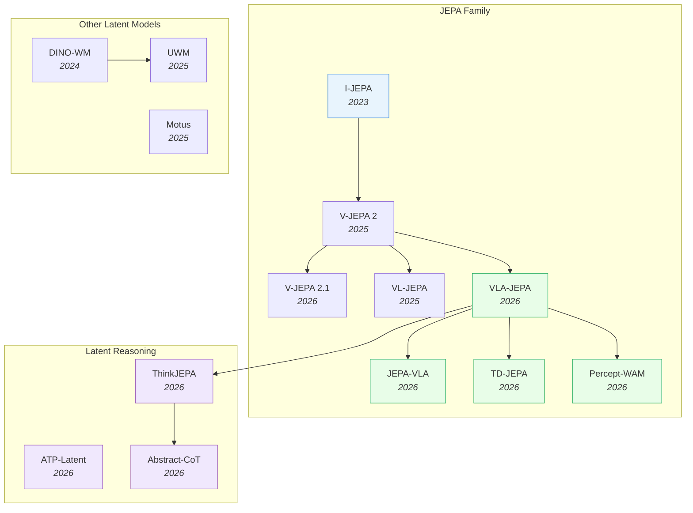
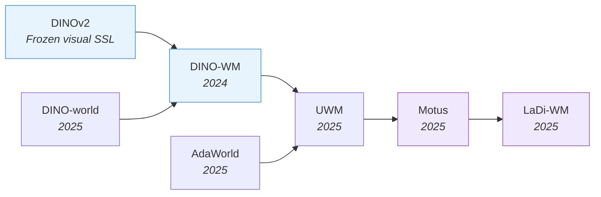
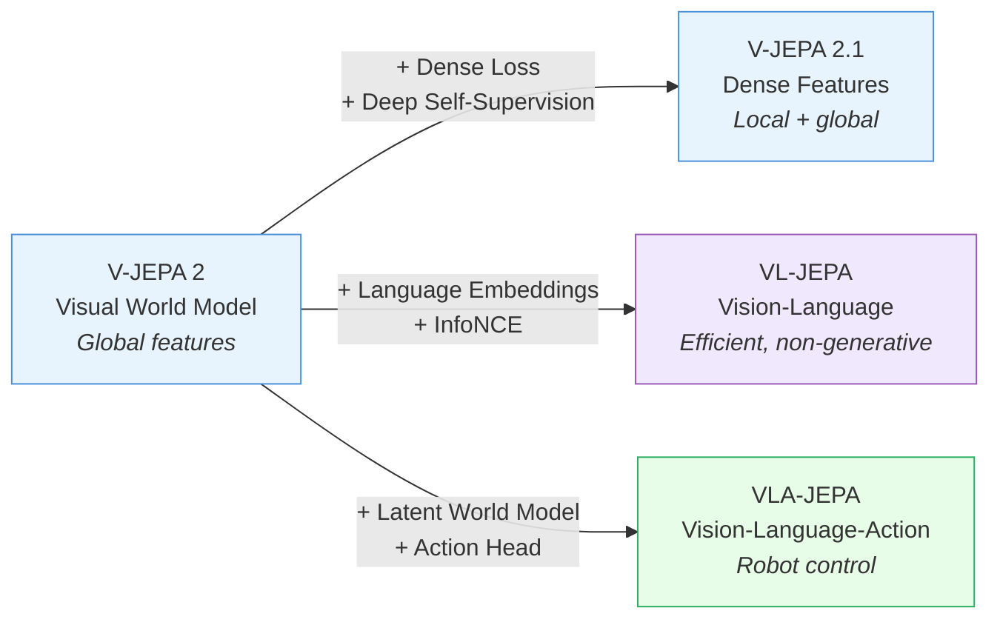

# Latent World Models — Deep Dive

> [!abstract] Overview
> Latent world models predict future states in representation space rather than pixel space — faster, more robust to visual noise, and better suited for real-time robot control. This note covers the JEPA family (the dominant latent prediction architecture), other latent approaches ([[2411.04983|DINO-WM]], [[2504.02792|UWM]], [[2512.13030|Motus]]), and **latent reasoning for embodied AI** — using continuous thought and latent planning to enable smarter, faster robot decision-making.

## Evolution Graph

The field evolved through three threads: **JEPA** (2023-2026) where [[2301.08243|I-JEPA]] established latent prediction and [[2506.09985|V-JEPA 2]] scaled it to 1M+ hours of video; **alternative latent models** (2024-2025) where [[2411.04983|DINO-WM]] and [[2504.02792|UWM]] showed other self-supervised features work too; and **latent reasoning** (2026) where [[2603.22281|ThinkJEPA]] and [[2601.21598|ATP-Latent]] brought reasoning into latent planning for embodied agents.

---

## Part A — The JEPA Family

*The foundational principle and its evolution across V-JEPA 2 → 2.1 → VL-JEPA → VLA-JEPA — the dominant latent-world-model lineage.*

### 1. The JEPA Principle

The Joint Embedding Predictive Architecture (JEPA) was proposed by Yann LeCun as an alternative to both contrastive learning and generative models. The core insight — *predict in representation space, not pixel space* — sits in opposition to both other self-supervised paradigms: generative models pay the full cost of pixel reconstruction; contrastive models only learn similarity invariances; JEPA splits the difference by learning forward dynamics in a compressed embedding.

The three families correspond to three different bets on *what is worth predicting*: rendering quality (generative), pair distinctness (contrastive), or future-state semantics (JEPA). For robot control where the bottleneck is "what matters for manipulation, not how it looks", the JEPA bet pays off — but at the cost of opacity and a learned target that can collapse without careful design.

#### 1.1 Generative Self-Supervision

==Reconstruct pixels or tokens== from a corrupted input. Maximally rich and human-interpretable but wastes capacity modeling textures, shadows, and lighting irrelevant to control.

- **[[2602.15922|DreamZero]]** (14B Video DiT) — canonical pixel-space generative WM; ~**150 ms/forward**; spends most capacity on visual fidelity that the policy never uses for action selection.
- **MAE / latent-diffusion family** — masked-autoencoder reconstruction; produces strong visual features but no dynamics signal.

#### 1.2 Contrastive Self-Supervision

==Pull positive pairs together, push negatives apart== via InfoNCE / SimCLR / DINO objectives. Learns view-invariant features cheaply but contains no forward-dynamics signal — useless on its own for prediction-based planning.

- **[[2304.07193|DINOv2]]** — ==discriminative SSL with Sinkhorn-Knopp centering + KoLeo regularizer== trained on automatically-curated ==LVD-142M== (**142M** images) with ViT-g/14 reaching **86.5%** ImageNet linear probe (**+4.2%** over prior SSL) and **+34% mAP** on Oxford-Hard retrieval; the canonical "no dynamics, but rich invariances" substrate that [[2411.04983|DINO-WM]] later layered dynamics on top of.
- **CLIP / SigLIP** — vision-language contrastive alignment; pairs naturally with JEPA targets in [[2605.06388|Semantic-LDM-WM]] (see [[07_WAM#3.2 Unified Latent Diffusion]]).

#### 1.3 JEPA (Joint Embedding Predictive Architecture)

==Predict future embeddings of an EMA-updated target encoder== from a partial-view context encoder. Splits the difference: dynamics signal without pixel cost, semantic compression without losing forward-prediction structure.

- **[[2301.08243|I-JEPA]]** — foundational: predict masked image-patch embeddings from visible-patch context. Three-part architecture: ==context encoder== on visible patches, ==predictor== on positional masks, ==target encoder== (EMA of context) supplying prediction targets. The EMA asymmetry blocks representation collapse without needing negative pairs.
- **[[2506.09985|V-JEPA 2]]** — scales I-JEPA to **1M+ hours** of video with a mask-denoising objective; **80%** pick-and-place from **62 hours** of unlabeled robot video proves the latent space captures action-relevant structure (object positions, orientations, dynamics) without ever reconstructing a pixel.
- **[[2602.10098|VLA-JEPA]]** (2026) — full Vision-Language-Action stack built on the JEPA principle; **97.2%** [[2306.03310|LIBERO]] in-distribution, **79.5%** [[2510.13626|LIBERO-Plus]] OOD, **65.2%** SimplerEnv real robot.
- **[[2601.14354|VJEPA-Probabilistic]]** — gives the deterministic JEPA explicit ==probabilistic semantics==: a ==variational objective== over future-latent distributions (no observation likelihood) acting as a ==predictive information bottleneck==, plus a ==Bayesian Product-of-Experts== (BJEPA) for modular priors; holds signal **R²>0.84** under a noisy-TV distractor where VAE/pixel-AR collapse to ~**0.50** — JEPA as a nonlinear CCA that filters nuisance.

**Paradigm — Decision Matrix**

| Need | Paradigm | Exemplar |
|---|---|---|
| Visual fidelity / human-inspectable rollouts | Generative | [[2602.15922\|DreamZero]] (~150 ms/forward) |
| Frozen visual features for downstream stacks | Contrastive | [[2304.07193\|DINOv2]] |
| Forward dynamics without pixel cost | JEPA | [[2301.08243\|I-JEPA]] / [[2506.09985\|V-JEPA 2]] |
| Real-time robot control (MPC at 10–20 Hz) | JEPA | [[2602.10098\|VLA-JEPA]] (**~10 ms/step** vs **~150 ms** for pixel-space) |
| Cross-embodiment video priors | Generative | [[2602.15922\|DreamZero]] (**+42%** cross-embodiment, see [[07_WAM#2. VideoGen WAMs]]) |
| Compose with VLM for reasoning | JEPA (+VLM) | [[2603.22281\|ThinkJEPA]] (see §4) |
| Learn from limited robot data | JEPA | [[2506.09985\|V-JEPA 2]] (**62 hr** unlabeled → **80%** pick-and-place) |

> [!star] Key Papers
> - [[2301.08243|I-JEPA]] — Foundational masked-embedding-prediction architecture; the EMA target trick that blocks collapse without negative pairs and inspires every downstream JEPA variant
> - [[2506.09985|V-JEPA 2]] — Scales JEPA to **1M+ hours** video; **80%** pick-and-place with only **62 hours** of unlabeled robot data — proves latent prediction captures manipulation-relevant structure end-to-end
> - [[2602.10098|VLA-JEPA]] — Full VLA + JEPA stack: **97.2%** [[2306.03310|LIBERO]], **79.5%** [[2510.13626|LIBERO-Plus]] OOD, **65.2%** real robot — turns the JEPA principle into a deployable controller

> [!tip] Why JEPA Wins for Robots
> Generative world models ([[2602.15922|DreamZero]], Cosmos) produce inspectable video but spend ~150 ms/forward modeling textures and shadows that the policy never uses for action selection. JEPA's latent prediction filters those out at ~10 ms/step ([[2602.10098|VLA-JEPA]]) — fast enough for real-time MPC. The choice is between *interpretable but slow* (generative — see [[07_WAM#2. VideoGen WAMs]] for the VideoGen lineage and [[07_WAM#5. VLM-Integrated WAMs]] for VLM-integrated hybrids) and *opaque but fast* (JEPA — used as backbone for the WAM-augmented VLA stack in [[05_VLA#5. World-Model-Augmented VLAs]] and for reasoning insertion in [[06_VLA-Reasoning-and-CoT#3. Latent Reasoning — Token-Free CoT]]). For physics-aware deployment ([[11_Physics-Aware-Embodied-AI#5. Physics-Aware Reasoning]]), the latent opacity becomes a verification problem covered in §6.

---

### 2. JEPA Evolution: Visual-Only → Dense → Vision-Language → Vision-Language-Action

The JEPA lineage walks a four-step ladder: visual-only self-supervision → dense local features → vision-language alignment → full action conditioning. Each step adds one missing capability needed for robot control, and each step is a single architectural change to its predecessor — not a from-scratch redesign. This matters because it makes the ladder *composable*: you can pick the rung that matches your deployment constraint without inheriting irrelevant complexity from the higher rungs.

The progression is also a story of *what JEPA loses and re-acquires*: V-JEPA 2's global pooling sacrifices local detail (re-acquired by V-JEPA 2.1's dense loss); the vision-only objective sacrifices language grounding (re-acquired by VL-JEPA's InfoNCE); the action-free supervision sacrifices control signal (re-acquired by VLA-JEPA's flow-matching head).

#### 2.1 Visual-Only JEPA (Pretraining Substrate)

==Internet-scale video pretraining without robot data or language==. Establishes the "predict future embeddings from masked context" recipe and re-acquires local detail via dense supervision when downstream tasks need it. Both members keep encoder-only training; neither conditions on action.

- **[[2506.09985|V-JEPA 2]]** — scales JEPA to video with a ==mask-denoising objective== on **1M+ hours** internet video; **77.3%** SSv2, **84.0%** PerceptionTest; ==zero-shot MPC== achieves **80%** pick-and-place from only **62 hours** of unlabeled robot video. Limitation: ==global== feature pooling fragments local spatial structure — dense tasks (depth, segmentation) lag behind. The lineage's scale anchor.
- **[[2603.14482|V-JEPA 2.1]]** — re-acquires local detail via three additions: ==dense predictive loss== (supervises both masked and unmasked tokens), ==deep self-supervision== (predictive objective at multiple intermediate encoder layers), and ==modality-specific tokenizers== (2D images, 3D videos, learnable modality tokens; **ViT-G**, VisionMix-163M). **RMSE 0.307** depth on NYUv2 (SOTA), **+20%** grasping over V-JEPA 2, **10× faster** navigation planning.

> [!success] V-JEPA's Latent-Prediction Advantage is Now Empirically Established
> [[2605.15618|V-JEPA Robustness Study]] runs a matched-capacity ViT-Large head-to-head — **V-JEPA 2.1 vs V-JEPA 2 vs VideoPrism vs VideoMAEv2** — across **5 robustness axes** (feature discriminability, corruption, fine-grained action discrimination, occlusion, temporal). Findings:
> - Latent-prediction JEPAs ==consistently dominate== pixel-reconstruction (VideoMAE) and contrastive (VideoPrism) under perturbation
> - V-JEPA models achieve a ==Directional Semantic Coherence Score several times higher== than the others under video reversal — a direct probe of internalized temporal causality
> - ==Frozen V-JEPA 2 backbones outperform task-adapted fine-tuned== VideoMAE / TimeSformer on corruption + occlusion robustness
> - But: high representational stability ≠ downstream utility — geometrically stable features are not automatically functionally useful
>
> This is the first independent, capacity-matched empirical validation of the rung-2.1 design choice. It says: *predicting in latent space isn't just faster — it builds qualitatively better world models.* It also bounds the claim: stability under corruption is a necessary but not sufficient condition for downstream task performance.

#### 2.2 Multi-Modal JEPA (Language and Action Conditioning)

==Add language alignment, then action conditioning, to the visual JEPA substrate==. Both members extend the prediction-not-generation bet across modalities: VL-JEPA via InfoNCE-aligned text embeddings, VLA-JEPA via a flow-matching action head on a VLM backbone. Together they close the loop from "JEPA understands video" to "JEPA controls robots".

- **[[2512.10942|VL-JEPA]]** — extends JEPA to vision-language by predicting ==abstract semantic embeddings== via ==InfoNCE loss==; selective decoding reduces operations by **~2.85×** for video streams. Excels at discriminative tasks (classification, retrieval, real-time streaming); **does not generate open-ended text** by design — the price of the prediction-not-generation bet.
- **[[2602.10098|VLA-JEPA]]** — full VLA stack: ==JEPA-style latent world model== (predicts future latents, never pixels), ==leakage-free state prediction== (future frames used *only* as supervision targets), ==unified two-stage pretraining== (action-free human videos + action-labeled robot data), and a ==flow-matching action head== on Qwen3-VL. **97.2%** [[2306.03310|LIBERO]] in-distribution, **79.5%** [[2510.13626|LIBERO-Plus]] OOD, **65.2%** SimplerEnv Google Robot (SOTA).
- **[[2605.25313|UWM-JEPA]]** — adds an explicit ==belief== to the JEPA latent: a ==density-matrix== state evolved by a ==learned unitary predictor== that preserves spectrum / purity / von-Neumann entropy during blind rollout (drift **<2.4e-7**), plus ==counterfactual targets== for action sensitivity; **0.770** hidden-velocity accuracy where matched LSTM-JEPA is at chance — imagining under partial observability without dissipating uncertainty.
- **[[2605.20811|Demo-JEPA]]** — turns the JEPA into a *one-shot cross-embodiment* imitator: an action-conditioned ==world model== plus a ==Dreamer Predictor== that translates a single source visual demonstration into target-compatible future latent goals, decoupling intent from embodiment; **0.36** sim / **0.25** real zero-shot SR (vs VPP **0.04/0.00**, XSkill **0.03/0.05**), approaching an oracle (**0.45** vs **0.55** sim).

**Evolution Step — Decision Matrix**

| Need | Rung | Rationale |
|---|---|---|
| Self-supervised video pretraining (no robots, no language) | [[2506.09985\|V-JEPA 2]] | Largest pretraining corpus (**1M+ hours**); cheapest entry to JEPA family |
| Dense per-token features for depth/segmentation | [[2603.14482\|V-JEPA 2.1]] | Dense predictive loss + deep self-supervision; SOTA **RMSE 0.307** NYUv2 |
| Real-time discriminative vision-language (retrieval, streaming) | [[2512.10942\|VL-JEPA]] | InfoNCE objective; **~2.85x** operation reduction vs autoregressive VLMs |
| Cannot give up open-ended text generation | Skip JEPA → use generative VLM | [[2512.10942\|VL-JEPA]] is discriminative-only by design |
| Full robot control with language conditioning | [[2602.10098\|VLA-JEPA]] | Adds flow-matching action head on Qwen3-VL; SOTA across [[2306.03310\|LIBERO]] + OOD + real robot |
| Few-step in-domain fine-tune from a strong starting point | [[2506.09985\|V-JEPA 2]] → action head | Skip rungs 2.2-2.4 if dense features and language are not needed |

> [!star] Key Papers
> - [[2506.09985|V-JEPA 2]] — **1M+ hours** video pretraining; **80%** pick-and-place with only **62 hours** unlabeled robot video — anchors the scale tier of the JEPA family
> - [[2603.14482|V-JEPA 2.1]] — Dense predictive loss + deep self-supervision; unlocks depth (**RMSE 0.307** NYUv2), grasping (**+20%**), navigation planning (**10x faster**)
> - [[2602.10098|VLA-JEPA]] — Full VLA + JEPA stack: **97.2%** [[2306.03310|LIBERO]], **79.5%** [[2510.13626|LIBERO-Plus]] OOD, **65.2%** SimplerEnv — closes the loop from understanding to control

> [!tip] Each Rung Pays For One Capability
> The ladder is composable: pick the lowest rung that meets your deployment constraint. [[2506.09985|V-JEPA 2]] alone is enough for zero-shot MPC ([[07_WAM#3.1 JEPA Family]]); [[2603.14482|V-JEPA 2.1]] is the right pick when you need dense features for depth/segmentation; [[2512.10942|VL-JEPA]] adds language only at the price of losing generation; [[2602.10098|VLA-JEPA]] is the full controller. The lineage also pairs naturally with the WAM-augmented VLA stack in [[05_VLA#5. World-Model-Augmented VLAs]] and with the latent reasoning insertion patterns in [[06_VLA-Reasoning-and-CoT#3. Latent Reasoning — Token-Free CoT]] — both use the JEPA encoder as the latent substrate. For the broader non-JEPA latent landscape (DINO-WM, UWM, Motus), see §3.

---

## Part B — Beyond JEPA

*The wider latent-prediction landscape (DINO-WM, UWM, Motus, …) and latent reasoning for embodied AI.*

### 3. Broader Latent Prediction Landscape

Beyond the JEPA lineage, other architectures also predict in latent space for embodied AI.

#### 3.1 JEPA Extensions

Papers that build on or extend the JEPA framework for new capabilities — each adds one missing axis (action conditioning, causal reasoning, multi-camera, RL value, kernel structure).

- **[[2605.26379|LeJEPA World Model]]** — proves *when* a JEPA is a world model: LeJEPA achieves ==linear identifiability== of the true latents (up to orthogonal transform) ==iff== the latents are ==isotropic Gaussian== — the exact distribution its ==SIGReg== regularizer targets; **R²>0.999** recovery to 1024 dims (Lean-4-verified), and identifiable encoders plan at oracle-level cost — the formal justification for [[2603.19312|LeWM]]'s regularizer.
- **[[2603.22281|ThinkJEPA]]** — VLM "thinker" branch + JEPA latent WM with ==dual-temporal perception== + ==hierarchical pyramid feature injection==; stable recursive rollouts at **H=32**.
- **[[2603.19312|LeWM]]** — ==Two-term end-to-end JEPA== (==MSE prediction + Sketched-Isotropic-Gaussian Regularizer==) on a ViT-Tiny encoder with ==AdaLN Transformer predictor==; trained without stop-gradients or EMA, **+18%** Push-T over PLDM and **48×** faster MPC-CEM planning than foundation-model WMs; provable anti-collapse guarantees with one tunable hyperparameter.
- **[[2603.15381|Autonomous Learning Framework]]** — LeCun-Malik-Dupoux cognitive-science blueprint for self-improving AI: ==System A== (learning from observation, providing the JEPA-style world model) + ==System B== (learning from action) + ==System M== (meta-control), bootstrapped by an ==Evolutionary-Developmental bilevel optimization==; positions latent world models as the abstract substrate that action-learning consumes.
- **[[2602.11832|JEPA-VLA]]** — Demonstrates ==video predictive embedding is necessary== for VLA models; closes the JEPA → VLA loop with action-conditioned latent prediction.
- **[[2602.11389|Causal-JEPA]]** — ==Object-centric world model== with ==latent interventions== for causal reasoning; disentangles objects for counterfactual planning.
- **[[2511.19221|Percept-WAM]]** — ==Perception-enhanced world-awareness-action model== for end-to-end autonomous driving; multi-camera + action conditioning on JEPA backbone.
- **[[2511.08544|LeJEPA]]** — ==Provable and scalable SSL== framework based on ==Euclidean latent geometry==; gives JEPA a theoretical convergence story.
- **[[2510.00739|TD-JEPA]]** — Latent-predictive representations for ==zero-shot RL==; bridges JEPA to value learning via temporal-difference targets in embedding space.
- **[[2509.14252|LLM-JEPA]]** — Adds a ==JEPA loss on multi-view text-code pairs== alongside standard autoregressive LM loss, with a ==`[PRED]` token + custom attention mask== reusing the LLM's own transformer layers as encoder/predictor; ==loss dropout== cuts compute up to **50%**; consistent gains across Llama-3.2/Gemma-2/OpenELM on NL-RX-SYNTH, GSM8K, Spider with reduced overfitting.
- **[[2505.03176|seq-JEPA]]** — ==Action-conditioned sequence JEPA== with a ==transformer sequence aggregator==: aggregate output is invariant, encoder is equivariant; resolves the invariance-equivariance trade-off without dual losses, reaching **R² 0.71** on 3DIEBench rotation and **86.14%** classification (vs. **80.40%** equivariant baseline) plus **83.44%** STL-10 saccade-prediction.
- **[[2504.16591|JEPA for RL]]** — Adapts JEPA for image-based RL: ==separate context/target ViT encoders== combined with ==actor-critic gradient back-propagation through the encoder== plus regularization to prevent collapse; ==learnable classification tokens== compress to low-dim representations; demonstrates joint JEPA+RL beats either alone on Cart Pole from pixels.
- **[[2512.19605|KerJEPA]]** — ==Kernel-based JEPA== with structured similarity in latent space; tighter convergence bounds than vanilla JEPA.

#### 3.2 Non-JEPA Latent Models

Alternative architectures achieving latent prediction without the JEPA framework — divided across algebraic-structured LAMs, dual-branch training, frozen-feature dynamics, and unified diffusion.

- **[[2606.04130|CLAW]]** — End-to-end ==self-supervised== framework jointly training a ==Latent Action Model== and a ==diffusion world model== from action-free video, with an ==adversarial latent regularization== preventing the LAM from leaking future visual information into latent actions; wins **7/10** visual-planning tasks across VP2/Crafter/Procgen.
- **[[2606.02486|AHEAD]]** — Lightweight (**4.9M**-param) ==latent-space world model== wrapping a frozen VLA via ==language-and-motion saliency masking== + conditional ==flow matching== at **158 ms/step**; **87–93.7%** SR in high-acceleration regimes (vs **30.7–48%**), **>95%** on fast conveyor tasks, and 19/30 on projectile-catching where all baselines score **0/30**.
- **[[2606.02280|LDG]]** — Outcome-centric ==semi-supervised discovery of latent dynamics geometries== from interaction histories (no physical-parameter supervision) via ==multi-positive contrastive learning==; highest mean reward on Hopper (**3239.2**) / Walker2d (**4883.7**), and uniquely survives structural-failure scenarios (disabled actuator) where parameter-centric methods fail.
- **[[2605.10819|ALAM]]** — Imposes ==algebraic structure on latent actions== via ==composition== and ==reversal== constraints, with latent transitions as auxiliary targets in a joint ==flow-matching policy==. Additivity/reversibility errors **25–85×** smaller than baselines; MetaWorld MT50 **47.9% → 85.0%** (**+37.1 pp**), [[2306.03310|LIBERO]] **94.1% → 98.1%**, real-world **+45 pp**.
- **[[2605.03413|NEO Theorizer]]** — learns ==executable compositional programs== ("theories") directly from raw observation pairs via a ==Neural Theorizer== with a ==VQ-VAE Language of Thought== + ==Minimum Description Length== prior + state-grounding loss; **0.933** compositional / **0.845** length OOD on GridWorld, recovering ground-truth primitives — latent world modeling as explanation, not reconstruction.
- **[[2605.01694|Latent State Design WM]]** — reframes world modeling as ==latent-state design under sufficiency constraints==, giving a ==functional taxonomy== of six latent-state roles + a seven-axis evaluation and a Preserve/Discard/Enable matrix; proves ==predictive sufficiency ≠ control sufficiency== and that passive prediction can't identify counterfactuals — strategic compression, not maximal preservation, is what makes a latent state actionable.
- **[[2605.00078|Being-H0.7]]** — ==Dual-branch latent world-action model== with ==Mixture-of-Transformers==; deployable "prior" branch's hidden states aligned at training to "posterior" branch receiving privileged future embeddings. **99.2%** [[2306.03310|LIBERO]], **62.1%** [[2406.02523|RoboCasa]], **3–4 ms/step**.
- **[[2604.10333|ZWM]]** — ==Sparse Temporally-Factored Prediction== ViT trained on **868 hours** of uncurated egocentric child video (BabyZWM) disentangles appearance from motion; ==Approximate Causal Inference + Compositional Prompting== extract zero-shot optical flow (rivals supervised SOTA on TAP-Vid-DAVIS), **>90%** relative depth, and object discovery matching Mask2Former on SpelkeBench; representations align with human fMRI and macaque electrophysiology.
- **[[2603.29090|HCLSM]]** — ==Hierarchical conditional latent state model==; multi-level latent prediction for compositional tasks.
- **[[2512.13030|Motus]]** — Pushes ==unified latent diffusion== further with motion-prior pretraining; latent action modeling from action-free video at scale.
- **[[2507.19468|DINO-world]]** — Two-stage video WM on frozen ==[[2304.07193|DINOv2]] ViT-B/14== features with a ==lightweight cross-attention predictor + RoPE==: **47.0%** mIoU on VSPW dense forecasting (vs. **40.7%** for COSMOS), **91.3%** IntPhys intuitive physics, and action-conditioned planning lifts Wall environment from **87.1%** (scratch) to **93.8%** (pretrained).
- **[[2505.15659|FLARE]]** — ==Future Latent Representation Alignment==: predicts compact future state embeddings rather than full frames via an ==action-aware observation embedding + diffusion transformer policy==; ==co-training mechanism== ingests action-free human video; **+26%** over baselines on multitask IL and **95%** real-world SR with only **100** trajectories/task, with minimal architectural changes to existing VLAs.
- **[[2505.13696|ESWM]]** — ==Episodic Spatial World Model== meta-trained to infer missing components of sparse one-step (state, action, end-state) tuples from an ==external editable memory bank==; the Transformer ESWM-T explores **+16.8%** more unique states than EPN, navigates at **96.8%** SR (**+18%** vs EPN) with **99.2%** path optimality, and rapidly adapts to new obstacles (**93%** vs **72%** EPN, **56%** RL) without retraining.
- **[[2505.11528|LaDi-WM]]** — Combines [[2304.07193|DINOv2]]+SigLIP features with ==imagination-guided iterative action refinement==; **68.7%** on LIBERO-LONG with only **10 demos**.
- **[[2504.02792|UWM]]** — ==Unified World Models==: single ==diffusion transformer== handling action-conditioned, action-free, and video prediction tasks via shared backbone for richer dynamics.
- **[[2503.18938|AdaWorld]]** — ==Latent Action Autoencoder== extracts context-invariant latent actions from action-free videos via ==beta-VAE information bottleneck==; autoregressive WM (initialized from ==Stable Video Diffusion==) is pretrained on these latent actions; **FVD 767.0** vs **1545.2** action-agnostic baseline and **70.5%** vs **20%** human SR on LIBERO; transfers efficiently to Habitat / Minecraft / DMLab / nuScenes / Procgen / VP2.
- **[[2411.04983|DINO-WM]]** — Task-agnostic world model on ==frozen [[2304.07193|DINOv2]] features==; lightweight dynamics module learns how frozen features change given an action, enabling ==zero-shot planning== via goal-feature search without per-environment retraining.

#### 3.3 Latent-WM Surveys

Field-defining surveys that taxonomize the latent-prediction landscape — one architectural (decoupled vs unified), one cognitive (perception vs meta-cognition).

- **[[2605.00080|WM Robot Learning Survey]]** — ==Multi-dimensional taxonomy== of world models for robot learning; documents the architectural evolution from decoupled "predict-then-act" to ==unified VLA/MoE/MoT backbones==, with **latent-space world modeling** as the dominant integration pattern.
- **[[2604.16592|Cognition WM Survey]]** — ==Cognitive-Architecture-Theory taxonomy== spanning Video, Embodied, and Epistemic WMs; identifies ==motivation== and ==meta-cognition== as the most under-developed cognitive functions in current latent WMs.
- **[[2601.15533|Actionable Simulators]]** — argues current generative WMs suffer ==dynamical hallucinations== (visual fidelity mistaken for understanding) and should be reframed as ==actionable simulators== built on four imperatives — ==structured 4D interfaces==, ==self-evolution==, ==physical anchoring==, ==structured imagination== — evaluated by ==closed-loop decision metrics==, not pixel fidelity; the physical-grounding mandate for safety-critical latent WMs.

#### 3.4 JEPA Variant Design-Space Matrix

JEPA-family models trade off three axes: encoder freezing, modality count, and action conditioning. Choose by deployment constraints.

**Latent Landscape — Decision Matrix**

| Variant | Encoder | Modalities | Action-Conditioned | Best For |
|---------|---------|-----------|-------------------|----------|
| [[2301.08243\|I-JEPA]] | Trainable | Image | No | Image SSL pretraining |
| [[2506.09985\|V-JEPA 2]] | Trainable | Video | No | Video SSL + zero-shot MPC |
| [[2603.14482\|V-JEPA 2.1]] | Trainable | Video (dense) | No | Depth, navigation, dense tasks |
| [[2512.10942\|VL-JEPA]] | Trainable | Vision + Lang | No | Discriminative VL retrieval |
| [[2602.10098\|VLA-JEPA]] | Trainable | Vision + Lang + Action | Yes | Full robot control via latent prediction |
| [[2602.11832\|JEPA-VLA]] | Trainable | Vision + Action | Yes | Action-conditioned video embedding |
| [[2510.00739\|TD-JEPA]] | Trainable | Vision + Reward | Yes (zero-shot RL) | Value learning in latent space |
| [[2511.19221\|Percept-WAM]] | Trainable | Vision (multi-cam) + Action | Yes | End-to-end autonomous driving |
| [[2411.04983\|DINO-WM]] | Frozen ([[2304.07193\|DINOv2]]) | Vision + Action | Yes | Zero-shot planning, transfer |
| [[2602.11389\|Causal-JEPA]] | Trainable | Object-centric | Yes | Counterfactual reasoning |

#### 3.5 Alternative-Latent-Models Thread

Beyond the JEPA lineage, a parallel thread builds latent world models on different SSL substrates. The threads converge on the same insight (predict in latent space) via different routes.

The thread walks four convergent steps — each substituting a different missing capability into the same latent-prediction skeleton.

- **[[2411.04983|DINO-WM]]** — Establishes that ==frozen== [[2304.07193|DINOv2]] features are rich enough for world modeling; lightweight dynamics module operates entirely in the frozen feature space, enabling ==zero-shot planning== via goal-feature search without per-environment retraining.
- **[[2504.02792|UWM]]** — Single ==diffusion transformer== unifies three tasks (action-conditioned, action-free, video prediction) via a shared backbone; richer dynamics than any single-task model.
- **[[2512.13030|Motus]]** — Pushes ==unified latent diffusion== further with motion priors; latent action modeling from action-free video at scale.
- **[[2505.11528|LaDi-WM]]** — Combines [[2304.07193|DINOv2]]+SigLIP features with ==imagination-guided iterative action refinement==; **68.7%** on LIBERO-LONG with only **10 demos**.
- **[[2602.10102|VideoWorld 2]]** — ==dynamics-enhanced Latent Dynamics Model (dLDM)== ==decoupling action dynamics from visual appearance==: a pretrained ==Video Diffusion Model== handles appearance while compact latent codes carry only task-relevant dynamics, planned by an ==autoregressive transformer==; **72.3%** step-7 paper-folding (~**70%** gain) + **2.88** CALVIN cross-domain length — disentanglement enables transferable knowledge from real video.

> [!star] Key Papers
> - [[2602.11832|JEPA-VLA]] — Closes the JEPA → VLA loop; demonstrates action-conditioned video predictive embedding is *necessary* for VLA models
> - [[2411.04983|DINO-WM]] — The frozen-[[2304.07193|DINOv2]] baseline; proves a lightweight dynamics module on frozen features enables zero-shot planning without retraining
> - [[2605.00078|Being-H0.7]] — Dual-branch latent world-action model; deployable prior aligned to a future-informed posterior; **99.2%** [[2306.03310|LIBERO]] at 3–4 ms/step
> - [[2504.02792|UWM]] — Unified diffusion transformer spanning action-conditioned / action-free / video prediction in one backbone
> - [[2605.00080|WM Robot Learning Survey]] — The field map: documents the shift from decoupled "predict-then-act" to unified latent-space backbones

> [!tip] Frozen Features Are Powerful — and the Variant Choice Follows Your Constraint
> [[2411.04983|DINO-WM]] showed you don't even need to train a new encoder — frozen [[2304.07193|DINOv2]] features are rich enough for world modeling, with the dynamics model operating entirely in frozen feature space for zero-shot planning. From there the variant choice is constraint-driven: need **action conditioning** → [[2602.10098|VLA-JEPA]] / [[2602.11832|JEPA-VLA]] / [[2411.04983|DINO-WM]]; need **zero-shot transfer** → freeze the encoder ([[2411.04983|DINO-WM]]); need **dense local features** → [[2603.14482|V-JEPA 2.1]]; need **multi-camera driving** → [[2511.19221|Percept-WAM]]; need **value learning** → [[2510.00739|TD-JEPA]]. The non-JEPA thread ([[2504.02792|UWM]] → [[2512.13030|Motus]] → [[2505.11528|LaDi-WM]]) reaches the same latent-prediction insight by a different route.

---

### 4. Latent Reasoning for Embodied AI

The frontier: combining latent world models with *reasoning in representation space* — enabling robots to plan, reason about spatial relationships, and "think ahead" without generating explicit text or video. This is where latent prediction meets the broader "continuous thought" paradigm ([[2412.06769|Coconut]], [[2502.05171|Huginn]]), applied specifically to physical agents.

The space splits along *where the reasoning happens*: in the planning loop (substitute amortized inverse dynamics for online search), in the spatial representation (reason on metric cognitive maps rather than raw embeddings), or in the autoregressive token stream itself (continuous visual / abstract tokens replacing discrete text). Each axis trades expressiveness for latency, and each maps to a different bottleneck in the VLA stack.

#### 4.1 Latent Planning

==Plan trajectories in embedding space rather than generating video or running iterative search==. Orders of magnitude faster than pixel-space MPC ([[2602.15922|DreamZero]]: ~150 ms/forward; [[2602.10098|VLA-JEPA]]: ~10 ms/step), enabling real-time control at 10–20 Hz.

- **[[2605.08732|GC-IDM]]** — amortizes the planning tax: a **1.5M-parameter 3-layer MLP** maps (current latent, goal latent, remaining horizon) directly to next action, replacing iterative CEM/MPPI search. ==Multi-step horizon supervision== (not single-step BC) is the critical training detail. **100–130× faster** than CEM at matched/superior SR in 7/8 settings; action jerk **15–36× lower** — proves search is amortizable in well-organized latent spaces.
- **[[2605.00078|Being-H0.7]]** — ==dual-branch latent world-action model==: deployable "prior" branch's hidden states aligned at training to a "posterior" branch receiving privileged future embeddings (Mixture-of-Transformers, per-branch attention masks). Posterior dropped at deploy time. **99.2%** [[2306.03310|LIBERO]], **62.1%** [[2406.02523|RoboCasa]], **67.5%** real-world Dynamic Scene at **3–4 ms/step**.
- **[[2603.22281|ThinkJEPA]]** — VLM "thinker" branch + JEPA latent WM with ==dual-temporal perception== (dense for JEPA, sparse for VLM) + ==hierarchical pyramid feature injection== via FiLM. **ADE 0.061 / FDE 0.056** on EgoDex; maintains best performance at recursive rollout horizons up to **H=32** — VLM semantic conditioning stabilizes long-horizon latent rollouts.
- **[[2601.21598|ATP-Latent]]** — two-stage: VAE produces smooth probabilistic latent tokens + stop head, then ==GRPO== with ==unsupervised coherence reward== plans in that space. **47.7%** avg / **8.4 tokens** across four math benchmarks (**+4.1%** SR / **−3.3%** tokens vs SIM-CoT) — RL beats imitation in latent space when the space is well-conditioned.
- **[[2604.03208|HWM]]** — ==Top-down hierarchical planning in shared latent space==: high-level planner uses ==latent macro-actions== to generate subgoals, low-level planner uses primitive actions under ==receding-horizon MPC==; **70%** real-robot pick-and-place (vs **0%** single-level VJEPA2-AC), **61%** Push-T at d=75 (vs **17%** flat DINO-WM) with **~3×** less compute, and **83%** hard maze SR (vs **44%** flat PLDM) at **4×** less planning compute.
- **[[2411.04983|DINO-WM]]** — Task-agnostic dynamics on ==frozen [[2304.07193|DINOv2]] features== with a ==ViT transition model trained via latent consistency loss==; ==MPC + CEM== searches over actions whose predicted feature trajectory ends at goal-image features. **+56%** LPIPS over prior SOTA (e.g., **0.007** PushT), **+45%** avg planning over IRIS (e.g., **0.90** PushT SR vs **0.32** IRIS), and **0.82** WallRandom SR — the zero-shot-planning baseline for the §3 latent-WM landscape.

#### 4.2 Spatial Latent Reasoning

==Reason about 3D space and physical relationships in latent representations== rather than running explicit geometric computation. Bridges perception and action through a spatial substrate the policy can directly consume.

- **[[2601.11442|Map2Thought]]** — ==Metric Cognitive Map==: dual-format representation unifying ==discrete symbolic grids== (for relational understanding) with ==continuous metric-scale data== (for precise geometry); ==Cognitive Chain-of-Thought== runs deterministic geometric computations on the map producing verifiable inference traces. **61.0%** average on VSI-Bench (top open-source VLM, beats proprietary); **59.9%** at half the training data.
- **[[2510.00855|DyVA]]** — injects ==dynamics-aware latents== from a frozen ==Stable Video Diffusion== "Generative Encoder" (a single Euler denoising step, no full video) alongside SigLIP static features into a frozen LLM; trained only on single images it shows ==emergent zero-shot multi-frame reasoning==, **+28.3%** on MindCube subtasks over GPT-4o — generative WM priors give VLMs spatial dynamics a static encoder lacks.
- **[[2504.12680|Embodied-R]]** — collaborative framework: large VLM perceives, small LM reasons via RL with ==logical consistency reward==; ==key frame extractor== reduces compute. **Matches or beats** OpenAI-o1 / Gemini-2.5-Pro on spatial reasoning while generalizing OOD to EgoSchema / MVBench — proves small LMs match large via RL + consistency.

#### 4.3 Continuous Thought for Embodied Agents

==Reason by iterating on continuous embeddings== rather than generating discrete text tokens. Extends the [[2412.06769|Coconut]] / [[2502.05171|Huginn]] "thinking in latent space" paradigm to physical agents. For the full reasoning-insertion taxonomy see [[06_VLA-Reasoning-and-CoT#3. Latent Reasoning — Token-Free CoT]].

- **[[2604.22709|Abstract-CoT]]** — discrete ==abstract tokens== from a reserved vocabulary replace verbalized rationales; two-stage post-training (==policy iteration warm-up== + ==warm-started GRPO==) with an attention-mask information bottleneck. **Up to 12x fewer reasoning tokens** vs verbalized CoT at comparable / superior performance on MATH / AlpacaEval / HotpotQA; generalizes across Qwen3 / Granite families.
- **[[2509.25681|dVLA]]** — unified discrete ==diffusion== over vision + language + action tokens with ==multimodal CoT== (visual subgoals + textual reasoning + action interleaved). **96.4%** [[2306.03310|LIBERO]] avg, **65%** real-world; CoT adds **+6.6 pp** sim / **+12.5 pp** real; **~2×** speedup via prefix attention mask + dLLM-Cache.
- **[[2511.19418|COVT]]** — ==continuous visual tokens== distilled from vision experts (SAM, DepthAnything v2, PIDINet, [[2304.07193|DINOv2]]) into the VLM's autoregressive stream; four-stage training pipeline. **+5.5%** CV-Bench / **+14.0%** Depth sub-task with Qwen2.5-VL-7B; **+26.6%** BLINK count on LLaVA-v1.5-13B — continuous visual reasoning beats text-only CoT on vision-centric tasks.
- **[[2601.05877|iReasoner]]** — ==trajectory-aware intrinsic reasoning supervision==: cross-rollout step agreement quantified via embedding-space cosine similarity to dynamic prototypes acts as a self-supervised step-level reward. **+1.32** general visual / **+1.64** visual math across 8 benchmarks (beats outcome-only EvoLMM).
- **[[2503.15558|Cosmos-Reason1]]** — multimodal LLM family (**7B + 56B** with hybrid Mamba-MLP-Transformer for 56B) with two-stage SFT + ==RL with rule-based verifiable rewards==; ~**4M** annotations. 56B hits **60.2%** physical commonsense / **63.7%** embodied reasoning; 7B reaches **81.5%** intuitive physics post-RL (**+32.4%** over backbone). Bridges physics-aware reasoning at WAM scale.

**Latent Reasoning — Decision Matrix**

| Need | Mechanism | Exemplar |
|---|---|---|
| Eliminate planning-loop search (real-time MPC) | Amortized inverse dynamics | [[2605.08732\|GC-IDM]] (**100–130×** vs CEM) |
| Long-horizon latent rollout stability | VLM-guided JEPA prediction | [[2603.22281\|ThinkJEPA]] (**H=32** stable) |
| Future-informed training, fast deployment | Dual-branch privileged-future | [[2605.00078\|Being-H0.7]] (**3–4 ms/step**) |
| RL beyond imitation in latent space | VAE + GRPO + coherence reward | [[2601.21598\|ATP-Latent]] (**+4.1%** SR, **−3.3%** tokens) |
| 3D spatial reasoning with verifiable traces | Metric cognitive map + Cog-CoT | [[2601.11442\|Map2Thought]] (**61.0%** VSI-Bench) |
| Small-LM spatial reasoning via RL | VLM perceives, small LM reasons | [[2504.12680\|Embodied-R]] (matches o1 / Gemini-2.5-Pro) |
| Replace verbal CoT with compact tokens | Discrete abstract tokens | [[2604.22709\|Abstract-CoT]] (**12×** token reduction) |
| Visual reasoning without text bottleneck | Continuous visual tokens | [[2511.19418\|COVT]] (**+5.5%** CV-Bench) |
| Multimodal CoT inside diffusion policy | Discrete unified diffusion + CoT | [[2509.25681\|dVLA]] (**96.4%** LIBERO, **+12.5 pp** real) |
| Self-supervised step-level reasoning reward | Cross-rollout agreement | [[2601.05877\|iReasoner]] (**+1.32 / +1.64** avg) |
| Physics-grounded embodied reasoning | SFT + RL with verifiable rewards | [[2503.15558\|Cosmos-Reason1]] (**81.5%** intuitive physics, 7B) |

> [!star] Key Papers
> - [[2605.08732|GC-IDM]] — Amortized goal-conditioned inverse dynamics in a frozen latent world model; **100–130×** faster planning than CEM at matched/superior SR — proves search is amortizable in well-organized latent spaces
> - [[2605.00078|Being-H0.7]] — Future-informed dual-branch latent reasoning: privileged-future supervision at training, implicit prediction at deployment; SOTA on [[2306.03310|LIBERO]]/[[2406.02523|RoboCasa]] at **3–4 ms/step**
> - [[2601.11442|Map2Thought]] — Unifies discrete symbolic grids with continuous metric-scale data for explicit 3D latent reasoning; metric cognitive maps yield verifiable inference traces (**61.0%** VSI-Bench)
> - [[2604.22709|Abstract-CoT]] — Token-free latent CoT in abstract embedding space; eliminates the discrete-token bottleneck (**12×** token reduction) while preserving reasoning quality
> - [[2511.19418|COVT]] — Chain-of-Visual-Thought: continuous visual tokens let VLMs reason about vision without the text bottleneck (**+5.5%** CV-Bench)

> [!tip] Why Latent Reasoning Matters for Robots
> Pixel-level reasoning is expensive: [[2602.15922|DreamZero]]'s 14B Video DiT takes ~150 ms per forward pass. Latent reasoning removes the generation bottleneck — plan in embedding space, act in real-time. [[2602.10098|VLA-JEPA]]'s MPC uses [[2506.09985|V-JEPA 2]]'s latent predictor in a single forward pass; [[2605.08732|GC-IDM]] amortizes the search loop itself (**100–130×** faster than CEM); [[2605.00078|Being-H0.7]] eliminates the pixel-WAM tax entirely with **3–4 ms/step**. Each row above swaps one form of expensive computation for a learned latent shortcut — the constraint determines which shortcut to use. Cross-reference [[06_VLA-Reasoning-and-CoT#3. Latent Reasoning — Token-Free CoT]] for the full reasoning-insertion taxonomy these papers exemplify, [[05_VLA#5. World-Model-Augmented VLAs]] for how latent reasoning composes with WAM-augmented VLAs, and [[13_Self-Evolving-VLA-WAM#3. Core Mechanisms of Self-Evolution]] for how amortized planning enables self-evolution loops in latent space.

---

## Part C — Analysis & Open Problems

*Latent-vs-pixel trade-offs and what the latent-world-model program has not yet solved.*

### 5. Latent vs Pixel Comparison

The central tension that organizes this whole note: *predict in pixels (rich but slow) or in embeddings (fast but opaque)?* Every architectural choice in §1–§4 sits somewhere on that axis. The 2026 frontier is hybridization — train with pixel objectives to absorb spatiotemporal priors, then deploy without test-time imagination ([[2603.16666|Fast-WAM]], [[2602.10098|VLA-JEPA]]) — but the underlying trade-off remains: each paradigm dominates one axis and loses the others.

This section frames the binary so that the right paradigm gets chosen for the constraint that *actually binds at deployment*. Speed-bottlenecked tasks (real-time control, dense MPC) pull toward latent; robustness-bottlenecked tasks (zero-shot novel environments, cross-embodiment) pull toward pixel; the rest hybridize. The choice is now less "which is best" and more "which axis is sacrificed least cheaply".

#### 5.1 Latent Side

==Predict in embedding space. Single forward pass per prediction. Opaque but fast.== Wins when inference latency is the binding constraint (real-time MPC, 10–20 Hz control loops, dense planning queries).

- **[[2602.10098|VLA-JEPA]]** — defines the speed-quality Pareto frontier; **~10 ms/step** at **97.2%** [[2306.03310|LIBERO]] in-distribution, **79.5%** [[2510.13626|LIBERO-Plus]] OOD, **65.2%** real robot.
- **[[2506.09985|V-JEPA 2]]** — self-supervised on **1M+ hours** internet video; **80%** pick-and-place from only **62 hours** unlabeled robot video — the sample-efficiency anchor.
- **[[2411.04983|DINO-WM]]** — Task-agnostic latent dynamics on ==frozen [[2304.07193|DINOv2]] features== via ==latent consistency loss==; ==MPC+CEM== over feature-space rollouts achieves **+45%** average planning improvement (e.g., **0.90** PushT SR vs **0.32** IRIS) and **0.82** WallRandom OOD SR — no per-task retraining.
- **[[2603.14482|V-JEPA 2.1]]** — ==Dense Predictive Loss== supervising both masked and unmasked tokens + ==Deep Self-Supervision== applied at multiple intermediate encoder layers + ==modality-specific tokenizers== (2D image / 3D video) scaled to ViT-G on VisionMix-163M; restores local detail JEPA traditionally loses — **RMSE 0.307** depth on NYUv2 (SOTA), **7.71 mAP** Ego4D STA (**~35%** relative gain), **+20%** robotic arm grasp SR, **10× faster** navigation planning.
- **[[2605.00078|Being-H0.7]]** — dual-branch privileged-future latent reasoning at **3–4 ms/step**; **99.2%** [[2306.03310|LIBERO]] — proves latent prediction matches pixel-WAM SR at orders-of-magnitude lower latency.

#### 5.2 Pixel Side

==Predict full video frames via iterative denoising. Rich and human-inspectable but slow (~150 ms/forward) and expensive.== Wins when robustness or cross-embodiment transfer is the binding constraint (zero-shot novel environments, internet-scale video priors needed).

- **[[2602.15922|DreamZero]]** — defines the robustness ceiling: **14B** joint video+action; **39.5%** unseen tasks, **42%** cross-embodiment improvement, **7 Hz** real-time at deployment cost.
- **Cosmos / [[2601.16163|Cosmos Policy]]** — NVIDIA's pretrained video diffusion fine-tuned as visuomotor policy; **98.5%** [[2306.03310|LIBERO]] proves pixel-space pretraining transfers cleanly to control.
- **[[2310.06114|UniSim]]** — ==Conditional video diffusion== (**5.6B** params) with ==dataset orchestration== over robot logs + human activity + panoramas + internet text/video, plus a ==unified T5-embedding action space==; policies trained entirely in UniSim achieve **3-4×** better goal reduction for VLMs with zero-shot sim-to-real transfer; the foundational learned-sim baseline.
- **[[2302.00111|UniPi]]** — ==Unified Predictive Decision Process== formulates actions as ==text-to-video diffusion== over image observations, paired with a small ==task-specific inverse-dynamics model==; **60.1%** vs **12.5%** novel-language "Place" SR and **51.6%** vs **14.8%** "Place Bowl" CLIPort transfer; **77.1%** real-robot SR with internet pretraining (vs **72.6%** without) — introduced the "video IS the plan" formulation that all subsequent VideoGen WAMs inherit.

**Latent vs Pixel — Decision Matrix**

| Axis | Latent | Pixel | Best For |
|---|---|---|---|
| **Speed** | Fast (**~10 ms/step**, [[2602.10098\|VLA-JEPA]]) | Slow (**~150 ms/forward**, [[2602.15922\|DreamZero]]; **7 Hz** at deploy) | **Latent** when real-time control is the constraint |
| **Interpretability** | Opaque embeddings; needs learned evaluators | Visual video; human-inspectable rollouts | **Pixel** when debugging, safety verification, or oracle review matters |
| **Sample Efficiency** | High (**62 hr** unlabeled → **80%** pick-and-place, [[2506.09985\|V-JEPA 2]]) | Moderate (needs internet-scale video to converge) | **Latent** when robot data is scarce |
| **Physics Priors** | Learned from video SSL targets | Learned from internet-video generation; strongest internet-video → robot transfer | **Pixel** when physics fidelity matters and latency is acceptable |
| **Fine-Grained Detail** | Moderate ([[2603.14482\|V-JEPA 2.1]] adds dense loss to recover local structure) | High (pixel-level by construction) | **Pixel** for dense tasks (depth from pixels, fine geometry); **Latent + dense loss** for compressed alternative |
| **Cross-Embodiment** | Limited (latent space tied to encoder) | Strong (video priors transfer across robot platforms, **+42%** in [[2602.15922\|DreamZero]]) | **Pixel** when targeting new embodiments not in robot pretraining data |
| **Deployment Cost** | Single forward pass; fits real-time MPC | Iterative denoising; needs distillation or test-time skipping ([[2603.16666\|Fast-WAM]]) | **Latent** for production deployment; **Pixel** for offline planning |
| **Reasoning Insertion** | Continuous-thought CoT in embedding stream ([[2604.22709\|Abstract-CoT]], [[2511.19418\|COVT]]) | VLM-guided pixel critic ([[2603.08403\|SPIRAL]] in [[07_WAM#7. Self-Evolving WAMs]]) | **Latent** for tight VLA reasoning loops; **Pixel** for plan-then-critique |

> [!star] Key Papers
> - [[2602.10098|VLA-JEPA]] — Latent-side anchor; **97.2%** [[2306.03310|LIBERO]] at **~10 ms/step** defines the speed-quality Pareto frontier — proves latent rivals pixel SR at orders-of-magnitude lower latency
> - [[2506.09985|V-JEPA 2]] — Latent-side scale anchor; **80%** pick-and-place from only **62 hours** unlabeled robot video shows latent prediction transfers from internet video without per-task retraining
> - [[2411.04983|DINO-WM]] — Latent-side zero-shot baseline; frozen [[2304.07193|DINOv2]] + lightweight dynamics enables planning in new environments without retraining
> - [[2602.15922|DreamZero]] — Pixel-side anchor; **14B** joint video+action defines the robustness ceiling; **39.5%** unseen tasks, **42%** cross-embodiment, **7 Hz** real-time at deployment cost
> - [[2601.16163|Cosmos Policy]] — Pixel-side proof point; **98.5%** [[2306.03310|LIBERO]] from fine-tuned video diffusion shows pretrained pixel models transfer cleanly to control
> - [[2603.16666|Fast-WAM]] — The hybridization recipe — train with video objectives, deploy without test-time imagination — that resolves the binary by ==training pixel, deploying latent==

> [!tip] The 2026 Consensus — Train Pixel, Deploy Latent
> The binary collapses at deployment but not at training. You need video generation at **training time** (to absorb spatiotemporal priors and physics fidelity that internet video provides) but NOT at **test time** (where it adds **~150 ms/forward** of latency that breaks real-time control). [[2603.16666|Fast-WAM]] proved this works: train with video objectives, deploy with a slim action expert. [[2602.10098|VLA-JEPA]] takes the same insight further — operate entirely in latent space at deployment while still benefiting from video-SSL pretraining targets. The 2026 frontier is no longer "latent vs pixel" but "*which* pixel objective stays at training and *which* latent shortcut runs at deployment". Cross-reference [[07_WAM#6. Efficient & Action-Centered WAMs]] for the broader train-with-video, deploy-without-video recipe, [[07_WAM#8. Cross-Paradigm Comparison]] for the five-paradigm framing that places latent and pixel as two of the five, [[05_VLA#6. RL Post-Training for VLAs]] for how the train-pixel-deploy-latent split shapes the WAM-augmented VLA stack, and [[11_Physics-Aware-Embodied-AI#5. Physics-Aware Reasoning]] for the physics-fidelity dimension that pixel training is uniquely positioned to absorb.

---

### Evolution Summary

> [!abstract] The JEPA Principle
> All models in this note share a core idea: ==predict in representation space, not pixel space==. This filters out unpredictable visual noise and focuses learning on the underlying dynamics and semantics — whether that's estimating depth, planning a trajectory, or controlling a robot.

---

### 6. Open Problems

Latent world models are powerful but face fundamental limitations that remain unsolved. All four problems below share a common compression-opacity root — but they manifest at different levels of the stack (sensor, representation, evaluation, trust), and the remediation papers attack different levels.

- **==Fine-grained contact physics==** — Latent prediction excels at predicting object trajectories and coarse dynamics, but struggles with contact-rich manipulation (insertion, assembly, surface following) where sub-millimeter accuracy matters. Pixel-space models capture contact details better, but at prohibitive computational cost. The right fix is likely hybrid (latent for global, local pixel-attention for contact) — currently undemonstrated at scale.
- **==Novel object generalization==** — JEPA models trained on internet video encode priors about common objects, but struggle with novel materials (deformable, transparent, articulated) not well-represented in training data. [[2411.04983|DINO-WM]]'s ==frozen DINO features== partially address this for geometry, but material properties remain challenging.
- **==Interpretability gap==** — Latent predictions are opaque — a human cannot inspect whether the model's "imagined future" makes physical sense, limiting debugging and safety verification. [[2603.22281|ThinkJEPA]]'s ==VLM-guided latent grounding== partially bridges this by grounding latent predictions in natural language descriptions.
- **==Latent-pixel alignment / trust==** — When is a latent prediction "wrong enough" to warrant concern? Unlike pixel-space models where humans can visually inspect dreams, latent-space errors require learned evaluators — creating a recursive trust problem (the evaluator itself may be miscalibrated).

**Latent World Model Failure Modes — Decision Matrix**

| Problem | Remediation Path |
|---|---|
| Contact-rich manipulation needs sub-mm accuracy | Hybrid latent + local pixel attention — currently undemonstrated; fall back to pixel WAMs for the contact stage ([[07_WAM#2. VideoGen WAMs]]) |
| Novel-object / novel-material generalization | [[2411.04983\|DINO-WM]] (frozen DINO for geometry); material properties still open |
| Need to inspect latent rollouts for plausibility | [[2603.22281\|ThinkJEPA]] (VLM grounds latent state in language) |
| Need calibrated uncertainty on latent predictions | No clean solution — closest is [[2603.22281\|ThinkJEPA]] + a latent-space [[2410.05363\|PhyGenBench]] equivalent (research gap) |
| Want a higher-level latent reasoning substrate | See [[06_VLA-Reasoning-and-CoT#3. Latent Reasoning — Token-Free CoT]] for the reasoning-side companion |

> [!star] Key Papers — Latent Failure Frontier
> - [[2603.22281|ThinkJEPA]] — First system to ground latent rollouts in natural language via VLM; the canonical interpretability bridge for opaque JEPA dynamics
> - [[2411.04983|DINO-WM]] — Demonstrates that *frozen* pretrained features (DINO) can substitute for learned latent dynamics on novel-object geometry; the strongest evidence that the JEPA-style latent space generalizes when the encoder is held fixed
> - [[2602.10098|VLA-JEPA]] — Production JEPA-based VLA that exposes the contact-physics gap concretely (excels at trajectory, weakens on insertion); the load-bearing benchmark for "does latent prediction work for robots?"

> [!tip] The Common Root Is Opacity — Not Compression
> Three of the four problems (contact physics, interpretability, latent-pixel alignment) trace to the same root: latent prediction *compresses away* the very details — contact transients, material textures, fine geometry — that humans use to verify "is this physically plausible?". The fix is *not* reverting to pixel space (too expensive) but building learned evaluators that operate in latent space and report calibrated uncertainty. [[2603.22281|ThinkJEPA]] is the first step; the harder problem is a latent-space [[2410.05363|PhyGenBench]] equivalent — currently absent from the literature. Cross-reference [[07_WAM#9. Open Problems & Failure Modes]] (the pixel-space companion failure modes — same calibration root, different surface) and [[06_VLA-Reasoning-and-CoT#7. Open Problems]] (latent reasoning faithfulness, which has identical opacity-to-the-human-inspector dynamics).

---

## Quick-Reference Matrix

| Question | Answer |
|----------|--------|
| Need self-supervised video pretraining? | [[2506.09985\|V-JEPA 2]] (or [[2301.08243\|I-JEPA]] for static images) |
| Need dense local + global features? | [[2603.14482\|V-JEPA 2.1]] (deep self-supervision) |
| Need vision-language without generation? | [[2512.10942\|VL-JEPA]] (efficient InfoNCE alignment) |
| Need a full robot controller in latent space? | [[2602.10098\|VLA-JEPA]] or [[2602.11832\|JEPA-VLA]] |
| Need world model as planning substrate? | [[2510.00739\|TD-JEPA]] or [[2511.19221\|Percept-WAM]] |
| Need latent reasoning / continuous thought? | [[2603.22281\|ThinkJEPA]] or [[2601.21598\|ATP-Latent]] |
| Need non-JEPA latent dynamics? | [[2411.04983\|DINO-WM]] (frozen DINO) or [[2504.02792\|UWM]] |
| Need probabilistic / belief-space latent prediction? | [[2601.14354\|VJEPA-Probabilistic]] or [[2605.25313\|UWM-JEPA]] (uncertainty-aware) |
| Need pretraining without action labels? | [[2512.13030\|Motus]] (latent motion priors) |
| Want pixel-space WAM instead? | See [[07_WAM#2. VideoGen WAMs]] for VideoGen lineage |

---

## Cross-References

- [[07_WAM]] — WAM deep-dive (Section 3 covers latent prediction WAMs)
- [[05_VLA]] — VLA deep-dive (Section 5 covers WAM-augmented VLAs)
- [[02_Dataset-Benchmark-Environment]] — Benchmarks for evaluating latent world models
- [[13_Self-Evolving-VLA-WAM]] — Self-evolving VLAs & WAMs ([[2602.10098|VLA-JEPA]] as a self-evolving target)
- [[11_Physics-Aware-Embodied-AI]] — Physics-aware latent dynamics and physical commonsense
- [[06_VLA-Reasoning-and-CoT]] — Latent reasoning insertion patterns ([[2604.22709|Abstract-CoT]], [[2509.25681|dVLA]])
- [[12_Egocentric-Pretraining-and-Human-Video]] — Egocentric pretraining substrates for latent models
- [[09_Contact-Rich-and-Whole-Body-Control]] — Force/tactile policies deep-dive; complements latent representation for multi-sensor inputs
- [[01_Embodied-AI-101]] — Embodied AI basics

---

*See [[07_WAM]] for the full WAM taxonomy, [[06_VLA-Reasoning-and-CoT]] for latent reasoning insertion, or [[13_Self-Evolving-VLA-WAM]] for how latent world models enable self-evolution.*
