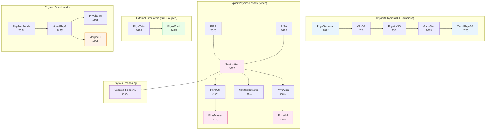

# Physics-Aware Embodied AI — Deep Dive

> [!abstract] Overview
> Most modern WAMs and VLAs learn physics *implicitly* — by training on enough internet video, the model picks up gravity, friction, and contact dynamics as side effects of next-frame or next-action prediction. Physics-aware embodied AI takes the opposite view: bake **explicit** physical priors into the model — through differentiable simulators, physics-constrained losses, RL with physics-verifiable rewards, or hybrid pipelines that hand state to an external solver. This note maps the design space (implicit / explicit-loss / external-simulator), the generation–training–inference tracks, and the physics-commonsense benchmarks that measure how well models actually obey Newton.

## Evolution Graph

The field evolved through four parallel tracks. **3D-Gaussian-based implicit physics** (2023→2025) embeds material properties directly into renderable 3D Gaussians, unifying simulation and rendering. **Explicit physics losses** for video generation (2025→2026) backpropagate physics-residual rewards or Newton's laws through diffusion models. **External-simulator coupling** (2025→2026) hands generated state to a real physics solver — [[2503.17973|PhysTwin]] reconstructs deformable digital twins from video; [[2511.07416|PhysWorld]] trains the policy against a learned physics simulator. **Physics commonsense reasoning** (2025) lifts physical priors from pixel/state-level losses into language-level reasoning ([[2503.15558|Cosmos-Reason1]]).

| Year | Paper | Track | Contribution |
|------|-------|-------|--------------|
| 2023 | [[2311.12198\|PhysGaussian]] | Implicit | First MPM-coupled 3D-Gaussian renderer; unifies sim and rendering |
| 2024 | [[2401.16663\|VR-GS]] | Implicit | Physics-aware interactive Gaussian Splatting in VR |
| 2024 | [[2406.04338\|Physics3D]] | Implicit | Learn physical properties of 3D Gaussians from video diffusion |
| 2024 | [[2412.17804\|GausSim]] | Implicit | Foreseeing reality: Gaussian simulator for elastic objects |
| 2025 | [[2501.18982\|OmniPhysGS]] | Implicit | Constitutive Gaussians for general physics-based dynamics |
| 2025 | [[2509.20570\|PIRF]] | Explicit-loss | Physics-informed reward fine-tuning of diffusion models |
| 2025 | [[2509.21309\|NewtonGen]] | Explicit-loss | Neural Newtonian dynamics for T2V |
| 2025 | [[2509.20358\|PhysCtrl]] | Explicit-loss | Generative physics for controllable video |
| 2025 | [[2503.09595\|PISA]] | Explicit-loss | Physics post-training for video diffusion via dropping experiments |
| 2025 | [[2510.13809\|PhysMaster]] | Explicit-loss | Mastering physical representation via RL fine-tuning |
| 2025 | [[2512.00425\|NewtonRewards]] | Explicit-loss | Post-training Newton's laws with verifiable rewards |
| 2026 | [[2603.13770\|PhysAlign]] | Explicit-loss | Feature + 3D representation alignment for physics-coherent I2V |
| 2026 | [[2603.26285\|PhysVid]] | Explicit-loss | Physics-aware local conditioning for generative video |
| 2026 | [[2604.17896\|Physical-Feasibility-VLA]] | Explicit-loss | Differentiable geometric feasibility loss for VLA training; SSR 22→**43.50%** |
| 2026 | [[2605.05163\|PhysForge]] | Asset gen | VLM-planner + diffusion-realizer for simulation-ready 3D assets |
| 2025 | [[2503.17973\|PhysTwin]] | External-sim | Physics-informed reconstruction of deformable digital twins |
| 2025 | [[2511.07416\|PhysWorld]] | External-sim | Robot learning from a physical world model |
| 2026 | [[2605.06593\|ReActor]] | External-sim | Disney bilevel RL + physics simulation for motion retargeting; +15.22pp downstream RL |
| 2025 | [[2503.15558\|Cosmos-Reason1]] | Reasoning | Physical commonsense and embodied reasoning at WAM scale |

---

## Part A — Design Space & Physics Priors

*How to inject physics: implicit (3DGS), explicit losses, and external simulators.*

### 1. Design-Space Principles

Three orthogonal axes define every physics-aware embodied AI system. Each axis is a distinct design lever — *where* the physics signal enters the model, *what* it constrains, and *when* it acts — and any system can be located by its triple. The triple frames every downstream choice in sections 2–7.

> [!success] The Three Axes
> - **Where physics lives**: implicit (in features) / explicit (in loss) / external (in solver)
> - **What is physical**: appearance (3D Gaussians + MPM) / dynamics (video next-frame) / reward (RL)
> - **When it intervenes**: at generation / at training / at inference

#### 1.1 Where Physics Lives

Pick the slot in the stack that carries the physics signal — features, loss, or solver.

- **[[2311.12198|PhysGaussian]]** — Implicit: each scene element ==carries physical attributes== so a ==custom MPM== integrates Gaussian particles directly, with deformation-gradient rotation evolving the spherical harmonics; representative of the in-features axis.
- **[[2501.18982|OmniPhysGS]]** — Implicit: ==constitutive Gaussians== (a learnable neural constitutive model per particle, chosen from a 12-combination ensemble) extend in-features physics to ==elastic, plastic, granular, viscoplastic== materials in one framework.
- **[[2509.20570|PIRF]]** — Explicit-loss: frames denoising as an MDP with ==sparse reward = negative PDE residual== back-propagated through the full trajectory; ==layer-wise truncation== restricts updates to high-resolution U-Net layers; lower PDE residual MSE on **4/5** benchmarks with **zero** test-time reward queries.
- **[[2509.21309|NewtonGen]]** — Explicit-loss: a ==Neural Newtonian Dynamics== layer (==physics-informed neural ODEs==) injected into the T2V backbone predicts future states under F=ma constraints, reaching **0.983** PIS-v on uniform motion (vs Sora's **0.655**).
- **[[2512.00425|NewtonRewards]]** — Explicit-loss: Newton's laws as a ==verifiable predicate== — a checker scores video against mechanics via ==optical-flow + frozen-feature proxies==; reward used in RL post-training (**+9.75%** in-distribution / **+8.60%** OOD on NewtonBench-60K).
- **[[2503.17973|PhysTwin]]** — External-solver: multi-stage joint optimization of geometry + physical properties + appearance via ==spring-mass models + generative shape priors + Gaussian splats==; reconstructs interactive deformable digital twin from video in real-time and integrates with robotic motion planning.
- **[[2511.07416|PhysWorld]]** — External-solver: ==task-conditioned video generation + geometry-aligned 4D reconstruction + object-centric residual RL== over an interactable digital twin; **82%** avg SR across 10 real-world tasks (**+15pp** over RIGVid), grasping failures **18% → 3%**, object-centric variant up to **90%** SR.
- **[[2504.04170|Digital-Gene]]** — Symbolic: physics lives in ==analytic concepts== — programmatic, mathematical-procedure representations grounding perception, reasoning, and interaction with strict ==physical-law compliance==; supports procedural data generation, giving interpretability + generalization where feature- and loss-level physics stay opaque — the in-program axis.

#### 1.2 What Is Physical

The layer that gets constrained — appearance pixels, dynamics rollouts, or reward signal.

- **[[2311.12198|PhysGaussian]]** — Appearance: pixels respect ==material properties== (elasticity, plasticity, fracture, granular, viscoplastic) via a ==custom MPM== over Gaussian particles, with deformation-gradient rotation evolving the spherical harmonics; higher PSNR than NeRF-deformation baselines but high render cost.
- **[[2501.18982|OmniPhysGS]]** — Appearance: each Gaussian carries a ==learnable neural constitutive model==; ==custom PyTorch differentiable MPM + Score Distillation Sampling== from T2V; **+3–16%** CLIPSIM over baselines and **−75%** training memory vs Warp-based MPM.
- **[[2509.21309|NewtonGen]]** — Dynamics: next-frame prediction obeys ==conservation laws== via a neural-ODE NND module (linear ODE + residual MLP) learned from as few as **100** "physics-clean" simulated videos; mid cost, **0.983** PIS-v on uniform motion, better visual physics than implicit-loss baselines.
- **[[2506.10778|SlotPi]]** — Dynamics: an ==object-centric== predictor whose rollouts respect universal physics via an ==attention-based Hamiltonian== module; SOTA on CLEVRER (+**1.6–3.02** FG-ARI) and predictive VQA, beating FNO/U-Net on Navier-Stokes and simulating coupled fluid-object systems — a physics prior constraining learned dynamics (ablated strongest at λ=1).
- **[[2503.09595|PISA]]** — Dynamics: ==Physics Supervised Fine-Tuning (PSFT) + Object Reward Optimization (ORO)== over the PISA benchmark of real + simulated freefall videos; ORO uses ==segmentation + optical flow + depth== reward signals; reduces Open-Sora trajectory errors substantially on a small simulated dataset.
- **[[2509.20570|PIRF]]** — Reward: ==RL reward = physics consistency score== (negative PDE residual) with ==layer-wise truncation== against reward hacking; low cost, trains generation through RL with **zero** test-time reward queries (lower residual on **4/5** PDE benchmarks).
- **[[2512.00425|NewtonRewards]]** — Reward: ==kinematic reward== (penalty on deviation from constant acceleration via optical-flow proxies) + ==mass conservation reward== (visual-feature consistency) prevents reward hacking; **+9.75%** avg in-distribution and **+8.60%** OOD across 5 Newtonian motion primitives on NewtonBench-60K.

#### 1.3 When Physics Intervenes

The timing of the intervention — at sampling, training, or inference rejection.

- **[[2406.04338|Physics3D]]** — Generation: each ==denoising step is constrained== by physics; an ==MLS-MPM viscoelastic== solver learns optimal physical parameters by ==Score Distillation Sampling== from a video-diffusion prior, distilling material properties without manual annotation.
- **[[2603.26285|PhysVid]]** — Generation: physics-aware ==local conditioning== via ==chunk-aware cross-attention== over VLM-generated per-chunk descriptions, steered at sample time by ==counterfactual classifier-free guidance== (positive + negative local physics prompts).
- **[[2509.20570|PIRF]]** — Training: ==PDE-residual reward== back-propagated through the full denoising trajectory with ==layer-wise truncation== on high-resolution U-Net layers; the canonical training-time intervention with **zero** test-time reward queries on **4/5** PDE benchmarks.
- **[[2510.13809|PhysMaster]]** — Training: ==PhysEncoder== refined via ==three-stage DPO== over I2V diffusion; **70×** faster than prior physics-aware methods at competitive L2 / Chamfer / IoU on free-fall, and preferred by human raters on open-world scenarios.
- **[[2512.00425|NewtonRewards]]** — Training: ==Newton-kinematic + mass-conservation== verifiable rewards (using optical-flow + frozen-feature proxies) as RL signal during post-training; **+9.75%** in-distribution / **+8.60%** OOD across 5 motion primitives on NewtonBench-60K.
- **[[2603.23376|ABot-PhysWorld]]** — Inference: a 14B ==Diffusion Transformer== with ==Diffusion-DPO== over a decoupled-VLM-discriminator's physics-rejected negatives, suppressing object-penetration and anti-gravity outputs; **0.931** PBench Domain Score and **0.803** zero-shot on the new EZSbench.

**Design-Space — Decision Matrix**

| Need | Recommendation |
|---|---|
| Photorealistic deformation rendering | Implicit (3D Gaussians + MPM): [[2311.12198\|PhysGaussian]], [[2501.18982\|OmniPhysGS]] |
| Internet-scale video that respects gravity | Explicit-loss: [[2509.20570\|PIRF]], [[2509.21309\|NewtonGen]] |
| Deployable robot policy that won't violate physics | External-simulator: [[2511.07416\|PhysWorld]] or physics-grounded RL ([[2512.00425\|NewtonRewards]], [[2510.13809\|PhysMaster]]) |
| Per-region control at sample time | Generation-stage: [[2603.26285\|PhysVid]] |
| Suppress hallucinated dynamics post-hoc | Inference-stage: [[2603.23376\|ABot-PhysWorld]] (Diffusion-DPO) |
| RL post-training against verifiable predicate | Reward axis: [[2512.00425\|NewtonRewards]], [[2510.13809\|PhysMaster]] |

> [!star] Key Papers
> - [[2509.20570|PIRF]] — Defines the verifiable-reward training-time axis; PDE residual as RL signal with layer-wise truncation; lower residual on **4 of 5** PDE benchmarks
> - [[2512.00425|NewtonRewards]] — Newton's laws as ==verifiable reward==; the cleanest demonstration that explicit-loss physics scales to internet-video post-training
> - [[2311.12198|PhysGaussian]] — Foundational implicit-physics work that established the "physics-lives-in-features" axis via 3DGS + MPM
> - [[2511.07416|PhysWorld]] — Canonical external-solver axis for robot policy training; explicit physical state as learning substrate

> [!tip] Pick by Constraint
> If you need **photorealistic deformation rendering**, pick implicit (3D Gaussians + MPM). If you need **internet-scale video that respects gravity**, pick explicit-loss ([[2509.20570|PIRF]], [[2509.21309|NewtonGen]]). If you need a **deployable robot policy that won't violate physics**, pick external-simulator ([[2511.07416|PhysWorld]]) or physics-grounded RL ([[2512.00425|NewtonRewards]], [[2510.13809|PhysMaster]]). The three axes are orthogonal — most production systems combine them; see [[06_WAM#2. VideoGen WAMs]] (physics-aligned video generation) and [[04_VLA#5. World-Model-Augmented VLAs]] (WAM-augmented VLA) for end-to-end stacks.

---

### 2. Implicit Physics — 3D Gaussians as Simulation Substrate

The dominant implicit-physics paradigm fuses 3D Gaussian Splatting with continuum-mechanics solvers (typically the ==Material Point Method==). Each Gaussian is *both* a renderable primitive and a simulation particle, eliminating the geometry/render mismatch of traditional pipelines. The split below separates *scene physics* (Gaussians simulating an existing scene) from *asset physics* (generating new simulator-ready 3D assets with physics metadata baked in).

#### 2.1 3D-Gaussian + MPM as Simulation Substrate

Gaussians are differentiable, particle-like, and already compatible with rendering. ==MPM== handles arbitrary materials (elastic, plastic, granular, viscoplastic) on the same particle representation. Result: "what you see is what you simulate" — no separate mesh extraction step.

- **[[2511.06299|Physics-Informed-Deformable-GS]]** — A method unifying explicit ==3D Gaussian Splatting== with ==continuum mechanics== for physically consistent dynamic novel-view synthesis from monocular video: each Gaussian is a ==Lagrangian material particle== with a time-evolving constitutive field, regularized by the ==Cauchy momentum equation== + a ==Lagrangian flow-matching loss==.
- **[[2505.16971|UniPhy]]** — A unified neural ==constitutive model== for inverse physics simulation that swaps two material-dependent ==MPM== functions for ==latent-conditioned networks==, then freezes them and optimizes a per-scene latent to infer material from observed trajectories; elastic reconstruction error **5.2e-6** vs **2.4e-4** (NCLaw) — material-agnostic, no preset material type.
- **[[2311.12198|PhysGaussian]]** — The first method coupling 3D Gaussian Splatting with a ==custom MPM== treating Gaussians as Lagrangian particles, with ==deformation-gradient rotation== evolving the spherical harmonics + an optional ==internal-filling step==; elastic / plastic / fracture / granular / viscoplastic at higher PSNR than NeRF baselines — the substrate every paper extends.
- **[[2501.18982|OmniPhysGS]]** — A ==Constitutive Gaussians== framework where each particle carries a ==learnable neural constitutive model== from a **12**-combination ensemble; a memory-optimized ==differentiable MPM== + ==Score Distillation Sampling== covers elastic / plastic / granular / viscoplastic at once, **+3–16%** CLIPSIM, **−75%** memory vs Warp-MPM — material-coverage frontier.
- **[[2406.04338|Physics3D]]** — A method learning physical properties of 3D Gaussians from ==video diffusion supervision== via an ==MLS-MPM viscoelastic== solver (deformation gradient split into elastoplastic + viscoelastic) distilled by ==Score Distillation Sampling==; PSNR **14.72** / SSIM **0.59** with strong user-study preference for motion realism, bypassing manual material annotation.
- **[[2406.10788|Embodied-Gaussians]]** — A real-time *correctable* world model coupling ==3D Gaussians== (rendering) with ==particles== (physics) in a ==prediction-correction loop==: ==Position-Based Dynamics== predicts, then ==visual optimization== re-anchors particles to camera observations; **30 Hz** on three cameras, lower tracking error than physics-only and CoTracker on dynamic tasks.
- **[[2412.17804|GausSim]]** — A continuum simulator treating each Gaussian kernel as a ==Center of Mass System== with deformation-gradient + Polar SVD continuum mechanics; ==hierarchical clustering== cuts kernel-wise compute by **95%**, with mass / momentum conservation losses; L2 error **1.85** vs **11.32** DreamGaussian4D on Mothorchids unseen-frames, **0.13s/frame** at **2.1GB** GPU memory.
- **[[2401.16663|VR-GS]]** — A ==3DGS + XPBD== solver with a ==two-level deformation embedding== (local tetrahedra into global simulation mesh) eliminating spiky artifacts under stretching; **0.017–0.022s** frame times (vs **0.112–0.39s** PhysGaussian, **0.625–0.813s** PAC-NeRF); SUS **83.5** ("excellent") on user study with significantly higher immersion vs transform-based interactions.
- **[[2412.11258|GaussianProperty]]** — A training-free pipeline combining ==SAM== part-segmentation + ==LMM== material-property reasoning under a global-to-local prompt scheme, projected to ==3D Gaussians== via frequency voting; **55.83%** mIoU material seg on ABO (vs Nerf2Physics **25.59%**) and **100%** robotic-grasping success on 16 real objects — property tagging for adaptive grasping.
- **[[2411.12789|Sim-GS]]** — An ==open-vocab 3DGS segmentation== pipeline (RAM + Grounding-DINO + SAM) + an ==MLLM== module (GPT-4V/BLIP/CLIP) predicting per-object density / Young's modulus / Poisson's ratio for ==MPM== physical simulation; physics-based 4D generation in **~2 min** on a 3090 (vs 0.1–1.5 hr baselines) — zero-shot material inference for scene-level dynamics.
- **[[2601.17251|EMPM]]** — An Embodied MPM framework fusing a ==differentiable Material Point Method== with ==3D Gaussian Splatting== plus an ==online adaptive material-ID scheme== refining parameters from live sensory feedback; Chamfer **0.0082** for elastoplastic objects (vs **0.0177** PhysTwin), modeling fracture + permanent deformation — a real-to-sim-to-real deformable twin.
- **[[2508.17437|Pixie]]** — A supervised learner inferring explicit per-voxel 3D physical properties (Young's modulus, Poisson's ratio, density) from ==CLIP-distilled 3D features== + a ==3D U-Net==, trained on the **1624**-asset PIXIEVERSE dataset; **~2 s/scene** (orders faster than per-scene optimization), **1.46–4.39×** realism gain, zero-shot to real scenes.
- **[[2508.01112|MASIV]]** — A material-agnostic system-ID framework recovering object dynamics from multi-view video with no priors via ==dynamic 3D-Gaussian reconstruction== + dense trajectory estimation feeding ==learnable neural constitutive models== in a ==differentiable MPM==; Chamfer **0.210** on PAC-NeRF with strong intra-/inter-class generalization — constitutive law from pixels.
- **[[2505.16456|PhyMAGIC]]** — A training-free pipeline synthesizing physically consistent 3D motion from a single image by closing an ==LLM (GPT-4o) physics-perception loop== over a ==differentiable MPM== solver atop a ==3D Gaussian Splatting== reconstruction; **+16.1%** CLIP similarity over physics-aware baselines, **>10×** faster at **14 GB** — confidence-guided inference, no training.
- **[[2311.13099|PIE-NeRF]]** — A meshless framework for interactive elastodynamic simulation of ==NeRF== scenes using Poisson-disk particles + ==quadratic Generalized Moving Least Squares== kernels and a ==quadratic ray-warping== scheme preserving render quality under large deformation; up to **2 orders** faster than PAC-NeRF — implicit-physics substrate without explicit meshes.
- **[[2601.00504|MotionPhysics]]** — A text-guided 3D-simulation framework coupling ==MLLM== material-parameter inference with a ==differentiable MPM== solver on ==3D Gaussian Splatting==, supervised by a ==Learnable Motion Distillation== loss that pulls motion priors from video diffusion while suppressing appearance bias; **>80%** user preference for physical realism on human + AI objects.
- **[[2411.16800|Phys4DGen]]** — A physics-compliant 4D generator segmenting ==3D Gaussian Splatting== into material groups + discovering internal structure, with an ==MLLM (GPT-4o)== inferring per-component density / Young's modulus / Poisson's ratio for ==MPM== simulation; PR **7.87** / OQ **7.97** (SOTA), material ID in **~14.88 s** vs hours — multi-material heterogeneous deformation.
- **[[2404.01223|Feature-Splatting]]** — A method augmenting ==3D Gaussian== primitives with ==CLIP / DINOv2== latent features for language-driven scene decomposition, then assigning material properties for ==MPM== physics-based simulation; realistic elastic / granular / rigid-body behavior under language commands at real-time rasterization — semantics + physics on one Gaussian substrate.
- **[[2502.07007|Grounding-Creativity-in-Physics]]** — A survey of ==physical priors in AIGC==, taxonomizing physics-grounded 3D/4D generation by spatiotemporal granularity (static-3D / dynamic-3D / 4D) and representation (vision / NeRF / ==Gaussian Splatting==); argues differentiable engines (MPM, FEM) are essential and no single method excels across all material types.

Generating *simulator-ready* 3D assets with physics metadata, rather than rendering physics-consistent scenes. The output isn't a video — it's a kinematic + material-tagged 3D mesh you drop into MuJoCo or a game engine.

- **[[2605.09954|JODA]]** — A framework inferring structured joint-level dynamics (==position-dependent force, friction, damping fields==) for articulated assets, where a ==VLM proposes semantic effect compositions== realized by a compiler + ==differentiable-simulation== refinement against real trajectories; RMSE **0.121 vs 0.240** on a refrigerator door, capturing detents and soft-closing.
- **[[2605.05163|PhysForge]]** — A decoupled two-stage asset generator: Stage 1 a VLM performs ==abstract physical planning==, Stage 2 a diffusion model with ==Kinematic Voxel Injection (KVI)== realizes geometry + continuous kinematic parameters; assets are **simulation-ready**, directly usable in robotic simulators; **0.101** Joint-Axis-Err-5 (SOTA).
- **[[2603.23973|SLAT-Phys]]** — An end-to-end feedforward net predicting ==per-voxel mechanical-property fields== (Young's modulus, density, Poisson's ratio) for simulation from a single RGB image via ==frozen TRELLIS structured latents== + a ==sparse Swin physics decoder== that bypasses 3D reconstruction; **~121×** faster than NeRF2Physics (**~9.9 s**/object) at **0.9453** material accuracy.
- **[[2603.01142|ArtLLM]]** — A 3D-articulation generator reformulating kinematics as language modeling: a ==3D multimodal LLM== predicts parts/joints/hierarchy tokens, conditions a part-aware geometry synthesizer, then applies ==physics-based joint-limit correction==; **0.9084** joint-type accuracy on PartNet-Mobility at **19 s**, producing URDF assets that reproduce real articulation in sim.
- **[[2511.13648|PhysX-Anything]]** — A VLM-based generator producing simulation-ready physical 3D assets (geometry + articulation + physical attributes) from a single image via a ==coarse-voxel sparse-index serialization== cutting VLM tokens **193×** plus a global-to-local VLM pipeline; scale error **43.44 → 0.30** on PhysX-Mobility, assets drive contact-rich policy learning in MuJoCo.
- **[[2511.21887|UniArt]]** — A ==diffusion-based== generator of articulated 3D objects from a single image via a ==unified latent== encoding geometry, appearance, segmentation, and kinematics with a reversible ==joint-to-voxel embedding==; **28.52** PSNR on PartNet-Mobility, retains **>85%** on unseen categories (baselines below **60%**), deployed in MuJoCo/PyBullet.
- **[[2507.12465|PhysX-3D]]** — A physics-grounded 3D-asset generator pairing ==PhysXNet== (26K objects with part-level scale/material/affordance/kinematics) with ==PhysXGen==, a dual-branch ==diffusion== model jointly synthesizing geometry + physical properties from one image; scale error **7.24 vs 13.21** and improved material/affordance over baselines — physics grounding aids appearance.
- **[[2508.13911|PhysGM]]** — A transformer-based feed-forward model inferring ==3D Gaussian Splatting== + physical properties from a single image, with ==MPM== dynamics (one material point per Gaussian) refined by ==Direct Preference Optimization== over a non-differentiable simulator; 4D content in **<1 min**, **0.2748** CLIP_sim / **42.8%** UPR, beating optimization baselines.
- **[[2503.20746|PhysGen3D]]** — A pipeline turning a single image into an interactive 3D world via GPT-4o + Grounded-==SAM== + InstantMesh reconstruction, then ==Taichi-Elements MPM== dynamics for user-controlled 'what-if' physical interactions; human evaluators preferred its physical realism + photorealism over Pika / Kling / Gen-3 — a digital twin from one image.

**Implicit Physics — Decision Matrix**

| Need | Recommendation |
|---|---|
| Material coverage (elastic, plastic, granular) | [[2501.18982\|OmniPhysGS]] (constitutive Gaussians) |
| Foundational baseline (3DGS + MPM) | [[2311.12198\|PhysGaussian]] |
| Learn material properties from video alone | [[2406.04338\|Physics3D]] |
| Real-time interactive elastic rollout | [[2412.17804\|GausSim]] |
| VR-deployed physics-aware Gaussian Splatting | [[2401.16663\|VR-GS]] |
| Simulation-ready 3D asset generation | [[2605.05163\|PhysForge]] (**0.101** Joint-Axis-Err-5) |

> [!star] Key Papers
> - [[2311.12198|PhysGaussian]] — First to couple 3D Gaussian Splatting with MPM; eliminates geometry/render mismatch and unifies dynamics + appearance
> - [[2501.18982|OmniPhysGS]] — Constitutive Gaussians for general physics-based dynamics; covers elastic, plastic, granular, viscoplastic in one framework
> - [[2406.04338|Physics3D]] — Learns physical properties of 3D Gaussians directly from video diffusion supervision
> - [[2605.05163|PhysForge]] — Two-stage VLM-planner + diffusion-realizer for simulation-ready 3D assets; **0.101** Joint-Axis-Err-5 (SOTA) with VLM-grounded part decomposition and KVI-realized kinematics

> [!tip] When Implicit Physics Helps
> Implicit physics shines when the *appearance* matters as much as the dynamics — VR, content creation, digital twins. For pure robot control, the rendering pipeline is overhead; explicit-loss approaches are cheaper. The asset-generation track ([[2605.05163|PhysForge]]) is the bridge: it produces 3D assets that downstream robot pipelines can consume in MuJoCo / Isaac without a render loop. Cross-reference [[06_WAM#2.4 Physics-Aligned Video Generation]] for the video-side analogue.

---

### 3. Explicit Physics Losses for Video Generation

The fastest-growing track. Internet-video diffusion models (Sora, Veo, Cosmos, [[2503.20314|Wan]]) learn approximate physics implicitly but routinely violate gravity, conservation of mass, and rigid-body constraints. Explicit-loss approaches add a physics-residual term that *measures* the violation and backpropagates it. The three sub-tracks differ in *where the physics signal originates*: written-down equations (residuals), simulator-as-reward (RL), or per-region conditioning at sample time.

#### 3.1 Differentiable Physics Residuals

Write down a physics law as an equation; the ==negative residual is your reward==. The training signal is dense and verifiable — every frame can be scored against the PDE. The same residual mechanism extends past video to robot RL, where the equation is the manipulator's Lagrangian rather than a PDE.

- **[[2603.14469|PIPER]]** — A physics-informed policy-optimization method adding a ==differentiable Lagrangian residual== as a regularizer on the RL actor objective: an ==Automated Dynamics Oracle== reads exact inertial properties (M, C, G) and a ==PINN== predicts joint accelerations to penalize inconsistent actions; **+20–45%** sample efficiency, up to **47%** stability on Gymnasium-Robotics.
- **[[2509.20570|PIRF]]** — A reward-finetuning method framing diffusion denoising as an MDP with sparse reward = ==negative PDE residual==, where ==layer-wise truncation== restricts updates to high-resolution U-Net layers, preventing reward hacking; lower PDE residual MSE on **4 of 5** benchmarks, zero reward queries at inference, works with **20** sampling steps.
- **[[2509.21309|NewtonGen]]** — A two-stage T2V method whose explicit ==Neural Newtonian Dynamics== layer (==physics-informed neural ODEs==: linear ODE + residual MLP) learns motion from "physics-clean" data, then predicts future states to condition a ==Go-with-the-Flow== T2V model; **0.983** PIS-v on uniform motion (vs Sora **0.655**), precise parameter control, from as few as **100** clips.
- **[[2503.09595|PISA]]** — A drop-dynamics specialization via the ==PISA== benchmark (real + simulated freefall) plus ==Physics Supervised Fine-Tuning (PSFT)== and ==Object Reward Optimization (ORO)== using ==segmentation / optical flow / depth== reward signals; substantially reduces Open-Sora trajectory errors on a small simulated dataset — the dataset-as-physics-supervision approach.

#### 3.2 RL with Physics-Verifiable Rewards

Use a physics simulator as the reward signal, then train the generator with RL. Avoids the cost of dense PDE-residual computation at every frame.

- **[[2512.00425|NewtonRewards]]** — A post-training method casting Newton's laws as a ==verifiable reward== via ==optical-flow== and ==frozen-feature== ("mass") proxies: a ==kinematic reward== penalizes non-constant acceleration, a ==mass-conservation reward== blocks reward hacking. Yields **+9.75%** in-distribution / **+8.60%** OOD across 5 motion primitives on NewtonBench-60K.
- **[[2510.13809|PhysMaster]]** — A ==PhysEncoder== (==DINOv2== + trainable physical head) refined by a ==three-stage DPO== pipeline over an I2V diffusion model; SOTA on the free-fall proxy (competitive L2 / Chamfer, higher IoU), **70×** faster than prior physics-aware methods, human-preferred open-world output. Pairs with NewtonRewards as the material-aware variant.
- **[[2509.20358|PhysCtrl]]** — A two-stage method lifting image → ==3D point cloud== → a ==diffusion-based generative physics network== predicting 3D point trajectories under user-specified material + forces; ==spatio-temporal attention + diffusion/velocity/physics/boundary losses== over 550K animations; GPT-4o I2V **4.5/4.5/4.3** semantic/physical/quality, vIoU **77.59%**, CD **0.0028**.
- **[[2309.01909|PIRL-Survey]]** — A survey of ==Physics-Informed Reinforcement Learning== with a taxonomy by form of physics information and where it enters the RL pipeline (==state design==, ==reward functions==, ==action regulation==, policy/value augmentation); finds simulators and barrier-certificate constraints dominate, with **~85%** of work in controller/policy design.

#### 3.3 Physics-Aware Conditioning at Generation Time

Constrain *during* sampling rather than during training. Useful when you can't retrain the base model and need to inject physics at deployment.

- **[[2606.27146|PhysReflect-VLA]]** — A plug-and-play closed-loop wrapper augmenting any frozen VLA with a ==Bidirectional Physical Consistency Model== (feasibility filter) plus a teacher-annotated ==Reflection Model== for post-execution corrective replanning; lifts five contact-rich real tasks **+5.4%** avg (OpenVLA **74.2%→79.6%**) — feasibility + self-reflection at inference.
- **[[2606.13886|PhysVLA]]** — A plug-and-play inference-time module wrapping any frozen VLA, correcting implausible actions via a ==phase-aware finite-state machine== plus a ==selective Euler-Lagrange gate== that corrects only when the kinodynamic residual exceeds a threshold; LIBERO-Spatial SR **+17%** (OpenVLA **36%→53%**), real pick-and-place **45%→95%**; physics at deployment, no retraining.
- **[[2606.11277|LAPG]]** — A least-action-guided diffusion framework adding physical consistency at inference: a score model emits an in-distribution proposal, then a ==physics-guided refinement== stage augments the reverse-time SDE with an ==action-functional gradient== steering samples to valid states; lower nRMSE than training-time PINN baselines on **5** ODE/PDE systems under OOD.
- **[[2606.02432|NDPP-Grasp]]** — A grasp method injecting ==non-differentiable physical-plausibility guidance== into ==diffusion== denoising at inference via a ==gradient-free optimal control law== + amortized lookahead; consistently raises success rate + cuts penetration depth while dropping per-grasp inference from **395.8 ms → 17.7 ms** on DexTOG-80K.
- **[[2603.16151|EFF-Grasp]]** — A ==Flow-Matching== dexterous-grasp generator recast as a deterministic ODE with ==training-free physics-aware energy guidance== at inference, from three ==explicit energy functions== (penetration-repulsion + surface-pulling); **67.2%** Suc.6 on DexGraspNet (**+13.6%**), lower penetration, strong quality at **10** function evaluations vs 100+.
- **[[2503.04123|GAGrasp]]** — A ==conditional diffusion== dexterous-grasp generator using ==projective geometric algebra== for SE(3) equivariance plus a ==differentiable physics-informed refinement layer== folding a stability + joint-limit loss into denoising; the physics layer adds **5–10%** grasp success and generalizes to OOD poses — the differentiable-physics guided-grasp member.
- **[[2505.01399|Physics-Conditioned]]** — A grasp-selection method conditioning grasps on predicted interaction wrench via ==inverse Tool-use Planning (iTuP)==; a learned ==SDG-Net== surrogate scores trajectory-induced torque/slip/alignment from rigid-body mechanics, cutting peak wrist torque **17.6%** and lifting real tool-use SR to **77.5%** (**+17.5%**) — physics at grasp time, not semantics.
- **[[2603.13770|PhysAlign]]** — A ==LoRA adapter== for DiT-based I2V using ==dual latent-space alignment==: ==Gram-based spatio-temporal alignment== to a ==V-JEPA2== teacher + a lightweight ==3D-conv depth head==, trained on **3,000** Blender rigid-body videos; **0.632** PIS-a_x (vs Wan2.2 **0.520**), **0.928** i2v-background — geometric constraint at the latent level.
- **[[2603.26285|PhysVid]]** — A physics-aware ==local conditioning== method using ==chunk-aware cross-attention== (with RoPE) over VLM-generated per-chunk descriptions, plus inference-time ==counterfactual classifier-free guidance==; at **1.7B** params reaches PC **0.64** on VideoPhy2, beating Wan-14B's **0.59** — spatial precision over global enforcement.
- **[[2603.23376|ABot-PhysWorld]]** — A 14B ==Diffusion Transformer== fine-tuned on **3M** real manipulation clips with ==Diffusion-DPO== over a decoupled-VLM-discriminator's physics-rejected negatives + ==action-map injection== via parallel context blocks; suppresses penetration/anti-gravity outputs, hitting **0.931** PBench Domain Score and **0.803** zero-shot EZSbench.
- **[[2601.05848|Goal-Force]]** — A method teaching video diffusion to act as an implicit neural physics planner, generating an antecedent causal chain to reach a user-specified ==goal-force vector== via a multi-channel (force / goal-force / mass) ==ControlNet== signal; **73.4%** human-preferred goal-force adherence, **97.96%** valid-initiator accuracy — force goals, no external engine.
- **[[2505.05469|LegoGPT]]** — An ==autoregressive LLaMA== recast of brick assembly as next-brick prediction, with ==physics-aware rejection sampling== (brick-by-brick validity) + a ==rollback mechanism== enforcing structural stability during decoding; **98.8%** stability (vs 25.2-75.2% baselines), structures assembled by a dual-robot-arm system — physics constraint inside generation.
- **[[2504.01204|Articulated-Kinematics-Distillation]]** — A method distilling video-diffusion guidance into skeleton-driven character animation via ==dual mesh-3D-Gaussian== representation + ==Score Distillation Sampling== over joint angles, with ground-rendering cues + physics-based motion tracking cutting foot-skating / penetration; beats TC4D on VideoPhy, output physics-simulator compatible.
- **[[2512.05564|ProPhy]]** — A Progressive Physical Alignment framework adding a ==Physical Branch== to a latent video-diffusion backbone via a two-stage ==Mixture-of-Physics-Experts== (semantic + token-level refinement) under VLM-guided fine-grained supervision; **+19.7%** Joint metric on VideoPhy2 (CogVideoX 22.3→26.7) — anisotropic physics guidance over global enforcement.
- **[[2505.09723|EnerVerse-AC]]** — A ==chunk-wise autoregressive diffusion== model with sparse memory + ==multi-level action injection== (spatial-aware pose + Delta Action Attention) + multi-view ==spatial cross-attention==; action-faithful long-horizon embodied video whose assessments correlate with real policy success and whose augmented trajectories lift downstream SR.
- **[[2503.07404|Safe-Robot-Foundation-Models]]** — A modular safety layer projecting any ==VLA=='s proposed actions onto a ==differentiable constraint manifold== via an ==extended ATACOM== over a control-affine dynamics model, as a final action-processing step needing robot state; **zero** constraint violations on hardware while preserving task success as the unconstrained baseline degrades.
- **[[2603.06408|PSIVG]]** — A training-free framework coupling a ==physical simulator into video diffusion==: it reconstructs 3D/4D scene geometry, an ==MPM simulator== produces accurate trajectories converted to ==optical-flow guidance==, plus ==Test-Time Texture Consistency Optimization==; preferred for plausibility in **82.3%** of comparisons, **0.84** SAM mIoU, **0.95** VBench consistency.

#### 3.4 Control-Theoretic Constraints in Generative Planners

Flow-matching trajectory planners are expressive but give no formal guarantee that generated states are safe, dynamically consistent, or actuator-admissible. This track folds classical control-theory machinery (control barrier / Lyapunov functions, polytope projection) *into* the generative process — turning constraint satisfaction from a post-hoc fix into a property of the sampler itself, enforced at test time without retraining.

- **[[2606.13400|PolyFlow]]** — A polytope-constrained flow-matching planner with a ==projection-free architecture== (a ==Ray Shooting operator== + learned gating, Frank-Wolfe-inspired) and a ==Constraint Encoding Block== fusing linear-inequality constraints into the latent; **100%** safety with competitive fidelity, faster than projection methods — zero-shot to dynamic quadruped limits.
- **[[2511.05355|SAD-Flower]]** — A control-augmented flow-matching planner enforcing state/action constraints via ==Control Barrier Functions== + dynamic consistency via a ==Control Lyapunov Function==, solved as a per-step ==Quadratic Program== with two-phase activation; perfect constraint satisfaction across Maze2d/Hopper/Walker2d/Kuka at test time, no retraining — prevents local traps.

**Explicit Physics — Decision Matrix**

| Need | Recommendation |
|---|---|
| Densest physics signal (PDE residual per frame) | [[2509.20570\|PIRF]] (**4/5** PDE benchmarks, **20** sampling steps) |
| Newtonian motion under user control (T2V) | [[2509.21309\|NewtonGen]] |
| Drop-dynamics specialization | [[2503.09595\|PISA]] |
| RL post-training with verifiable reward | [[2512.00425\|NewtonRewards]] |
| Material-aware RL fine-tuning | [[2510.13809\|PhysMaster]] |
| Physics-coherent image-to-video | [[2603.13770\|PhysAlign]] |
| Per-region physics control at sample time | [[2603.26285\|PhysVid]] |
| Suppress hallucinations without retraining | [[2603.23376\|ABot-PhysWorld]] (Diffusion-DPO) |

> [!star] Key Papers
> - [[2509.20570|PIRF]] — Lower PDE residual MSE on **4 of 5** PDE benchmarks; zero reward queries at inference; works with **20** sampling steps
> - [[2509.21309|NewtonGen]] — Neural Newtonian dynamics injected into T2V backbone; physics-consistent motion under user control
> - [[2512.00425|NewtonRewards]] — RL post-training with Newton's laws as verifiable reward; significantly reduces gravity violations
> - [[2603.13770|PhysAlign]] — Feature + 3D-representation alignment for physics-coherent image-to-video generation

> [!tip] Explicit Loss vs Implicit Physics
> Explicit losses scale to internet-video data without requiring 3D supervision — you only need a verifiable physics check, not a full simulator state. This is why explicit-loss papers dominated 2025-2026 progress. Cross-reference [[06_WAM#2.4 Physics-Aligned Video Generation]] for how these losses get composed into video-WAMs and [[06_WAM#9. Open Problems & Failure Modes]] for the open problem of reward hacking under RL.

---

### 4. External Simulator Coupling

Generative models are great at hypothesizing futures; physical simulators are great at verifying them. Coupling the two gets you the best of both — at the cost of a brittle interface between learned and analytical components. The papers below differ in *what gets handed to the simulator*: a reconstructed digital twin, a robot policy, or a retargeted human motion.

#### 4.1 Digital-Twin Reconstruction & Policy Training

Reconstruct or learn the physics substrate; train policies against it. The simulator is the *destination* of learned dynamics rather than an external verifier.

- **[[2606.09640|Physics-Aware-Sparse-EL]]** — A physics-aware learner for Euler-Lagrange robot dynamics using a structure-preserving ==residual decomposition== (inertia kept symmetric positive-definite), a ==sparse history-dependent latent==, and ==selective Bayesian online adaptation== of the force residual; **lowest** prediction error and **best** figure-eight tracking RMSE across **5** robots.
- **[[2603.27313|MetaTune]]** — An adjoint-based meta-learning framework jointly auto-tuning robotic feedback-controller gains and disturbance-observer parameters via ==differentiable dynamics==, using a ==neural policy== for time-varying gains and a ==discrete adjoint method== for linear-complexity meta-gradients; **>50%** faster gradients than forward-mode, **15-20%** RMSE cut on a quadrotor.
- **[[2503.17973|PhysTwin]]** — A multi-stage optimization that jointly reconstructs geometry, infers physical properties, and models appearance. ==Spring-mass models + generative shape priors + Gaussian splats== produce an interactive digital twin from videos — usable for robot motion planning. The simulator runs in real-time, allowing the robot to plan against the digital twin before acting.
- **[[2511.07416|PhysWorld]]** — A digital-twin pipeline generating ==task-conditioned video==, reconstructing a twin via ==geometry-aligned 4D reconstruction==, then training policies by ==object-centric residual RL== inside it; **82%** avg SR over 10 real tasks (**+15pp** over RIGVid), grasp fails **18% → 3%**, object-centric up to **90%**.
- **[[2605.09538|PhysHanDI]]** — A reconstructor building dense hand–*deformable*-object twins from sparse-view RGB-D via a ==physics-based interaction model== (==MANO== hands + ==spring-mass== objects via ==virtual springs==); the dense-mesh object ==reciprocally refines== the hand fit (Hand Chamfer **7.57 → 7.17 mm**), with **~2×** / **>7×** lower spring RRD than [[2503.17973|PhysTwin]].
- **[[2604.16484|DexWorldModel]]** — A ==Causal Latent World Model== over ==DINOv3== latent targets + a ==Dual-State Test-Time-Training memory== (O(1) footprint over 2,000 steps) + ==Speculative Asynchronous Inference== masking ODE pre-denoising behind robot execution; **94.00%** RoboTwin dual-arm SOTA with **~50%** lower blocking latency — a deployable embodied physics WM.
- **[[2512.03556|RoboScape-R]]** — A dual-WM pipeline (==Action World Model== for observation/done + ==Text World Model== for goal observations) with an ==endogenous reward== (LPIPS-to-goal + predicted done) so policies train inside the WM with no hand reward; matches in-domain physical-sim SR with fewer resources and **+37.5%** average OOD generalization.
- **[[2602.09878|MVISTA-4D]]** — A ==view-consistent 4D WM== (latent video diffusion with ==spherical camera embedding== + ==geometry-aware deformable cross-view attention==) emitting RGB-D futures with ==test-time action inference== over a low-dim latent trajectory; **72.6%** RLBench manipulation with lower depth error / Chamfer than baselines on real + synthetic scenes.
- **[[2512.13214|Differentiable-MPM-Control]]** — A ==differentiable MPM simulator== (FLIP with ==RK4 integration==, ==JAX== autodiff) conserving mechanical energy at coarse resolution, used for ==gradient-based trajectory optimization== of deformable objects; standard FLIP loses **88%** energy in 10s while RK4 conserves it; active-damping cuts kinetic energy **80%** ~**2.7×** faster than MPPI.
- **[[2510.24673|Differentiable-Rheometry]]** — A ==differentiable JAX fluid solver== embedding a frame-invariant ==Tensor Basis Neural Network== to learn constitutive laws from local flow, then distilling them into classical models by ==BIC selection==; near-perfect velocity reconstruction, generalizes to unseen geometries, robust to **10×** lower resolution and **4%** noise.
- **[[2506.23135|RoboScape]]** — A physics-informed embodied WM: a ==Dual-branch Co-autoregressive Transformer== jointly generating RGB + temporal depth + ==adaptive keypoint dynamics==; **0.1259** LPIPS, policies trained on **200** synthetic trajectories hit **91%** Robomimic, predicts real success at **0.953** Pearson — a policy-training-and-eval substrate.
- **[[2510.05560|HoloScene]]** — A framework reconstructing simulation-ready interactive 3D digital twins from one video via an ==interactive 3D scene graph== (neural SDFs + Gaussians + physics) solved as ==energy minimization== with generative priors + a ==physics-aware tree search==; **100%** object-reconstruction, **81.7%** stable on Replica — unifies geometry, plausibility, photorealism.
- **[[2604.07882|ReconPhys]]** — A feedforward framework reconstructing appearance, geometry, and physical attributes of non-rigid objects from one monocular video by binding a ==differentiable spring-mass system== to ==3D Gaussians== and self-supervising via ==self-forcing==; **21.64** future-prediction PSNR (**+8.37 dB**) at **<1 s** inference — physics-property recovery without labels.
- **[[2509.17647|VideoArtGS]]** — A pipeline reconstructing interactable digital twins of articulated objects from a single monocular video via ==motion-prior-guided 3D-track clustering== feeding an ==articulation-aware 3D Gaussian Splatting== model; revolute-axis error **0.32°** (vs **13.83°** prior best), ~**2 orders** error reduction — controllable twin from video.
- **[[2202.09834|Differentiable-Physics-Online-MPC+SysID]]** — A ==dual-threaded== framework running ==differentiable-physics== MPC (==iLQR==) alongside ==real-time system-ID==, with confidence-scored excitation + ==active exploration== when observations are uninformative; **2 cm** tracking error (vs **7 cm** offline) on a 7-DOF arm after a payload change — online adaptation post-deployment.

#### 4.2 Bilevel RL Inside a Physics Simulator

Use the simulator as the *inner loop* of a bilevel optimization, with retargeting / policy parameters learned in the outer loop. Physics consistency comes for free because retargeting happens inside the simulator.

- **[[2605.06593|ReActor]]** — A ==Bilevel optimization== retargeter: the upper level learns retargeting parameters, the lower trains a motion-tracking policy via RL in a physics simulator, and a ==simplified gradient estimator== cuts the bilevel cost; retargeting *inside* the simulator inherits physics consistency — **zero** ground/self-penetration — cleaned data lifts RL **+15.22 pp**.
- **[[2602.02454|World-Gymnast]]** — An imagined-rollout RL method fine-tuning VLA policies via ==RL inside an action-conditioned video WM== (WorldGym), a ==VLM (GPT-4o)== assigning binary task-completion rewards under ==GRPO== with KV-caching; up to **18×** real-robot SR over SFT (**72%** vs **4%**), **81%** held-out SR with synthesized distractors — beats software simulators on 3/4 tasks.
- **[[2506.14763|RobotSmith]]** — A generative tool-design framework where ==VLM agents== propose ==Constructive-Solid-Geometry== tool parameters and a ==CMA-ES optimizer inside a physics simulator== co-optimizes tool geometry + manipulation trajectory; **0.94** P_best / **50.0%** SR across 9 rigid/deformable/fluid tasks (vs **11.1%** retrieval) — simulator-as-inner-loop with a VLM optimizer.
- **[[2411.08027|LLMPhy]]** — An LLM-optimizer framework coupling an ==LLM== with a ==physics engine==: the LLM does ==zero-shot black-box optimization==, iteratively refining physical parameters from simulator feedback; **62.0%** mIoU on the new ==TraySim== QA (vs **32.1%** pure-LLM, **59.6–59.7%** Bayesian/CMA-ES), full trace adding **+5%** — simulator-as-inner-loop with an LLM optimizer.
- **[[2212.00541|Predictive-Sampling]]** — A real-time MPC framework (==MuJoCo MPC / MJPC==) using the physics engine as the rollout inner loop: an asynchronous agent-planner runs derivative-free ==zero-order Predictive Sampling== over spline-parameterized controls, synthesizing 27-DoF humanoid, quadruped, and Shadow-Hand behaviors in **1–20 ms** — simulator-as-optimizer, no learned model.

#### 4.3 Learned Linear Dynamics as a Control Substrate

Replace the analytical nonlinear dynamics model inside a predictive / sampling-based controller with a *learned* linear surrogate. A ==Deep Koopman Operator== lifts nonlinear state into a higher-dimensional space where dynamics are linear, so trajectory rollouts reduce to matrix multiplication — turning the learned model into a computational accelerator for the same physics-engine-in-the-loop control loop.

- **[[2603.05385|Koopman-Sampling-Control]]** — A control framework (MPPI-DK) embedding learned linear ==Deep Koopman Operator== dynamics into ==MPPI== so rollouts propagate by matrix multiplication in a lifted space, not nonlinear dynamics; matches classic MPPI accuracy while cutting per-step compute to **8.8 ms** vs **11.7 ms** (GPU) at **100%** success on a Unitree Go1 quadruped.
- **[[2505.00354|Koopman-Soft-Robot-MPC]]** — A ==Deep Koopman==-based MPC (DK-MPC) linearizing multi-segment soft-robot dynamics via an ==auto-encoder== that learns lifting functions and the Koopman operator from state-action data, then plans inputs under MPC; **3.11 mm** average trajectory-tracking error on a physical soft robot vs **22.49 mm** for RBF-based K-MPC.

#### 4.4 Probabilistic Safety Layers for Predictive Control

Sampling-based and predictive controllers (MPPI, MPC) plan against an explicit dynamics model but handle hard constraints brittlely — penalty terms are fragile, and exact distributional knowledge of disturbances is rarely available. This track wraps the controller in a *statistical* safety layer (Bayesian, conformal, distribution-free) that bounds constraint-violation risk without assuming a known noise model, keeping the physics-engine-in-the-loop control loop certifiable.

- **[[2606.04185|CSRC-MPC]]** — A Conformal Spectral Risk Control layer extending ==distribution-free conformal methods== to ==spectral risk measures== (CVaR, Wang) reformulated as weighted expectations, integrated into ==MPC== via Lipschitz-bounded prediction sets; **100%** obstacle-avoidance, violations **52.9%→6.0%** under misspecification — safety without a known noise model.
- **[[2510.00272|BC-MPPI]]** — A probabilistic constraint layer for ==Model-Predictive Path-Integral== control using ==Bayesian Neural Networks== to model each constraint's satisfaction probability + uncertainty, reshaping MPPI weights to down-weight (not reject) unsafe rollouts; fewer collisions + larger clearance than penalty/classic MPPI at a lower rejection rate — gradient-free safety.
- **[[2501.04823|Conformal-Safety-from-Feedback]]** — A method learning subjective unsafe regions from sparse human-flagged trajectories via ==full conformal prediction== with a ==nearest-neighbor score==, enforced via a warning system + ==MPC backup mode==; collision rate **52%→14%** on a simulated quadcopter with finite-sample guarantees — safety from feedback, not a hand-coded constraint.

**External Simulator — Decision Matrix**

| Need | Recommendation |
|---|---|
| Reconstruct a digital twin from video | [[2503.17973\|PhysTwin]] (real-time interactive simulation) |
| Train policy against learned physical world model | [[2511.07416\|PhysWorld]] (explicit physical state as substrate) |
| Human→robot motion retargeting with physics | [[2605.06593\|ReActor]] (**+15.22pp** downstream RL, zero ground penetration) |

> [!star] Key Papers
> - [[2605.06593|ReActor]] — Bilevel RL inside a physics simulator for human→robot motion retargeting; zero ground/self-penetration, +15.22pp downstream RL success on G1, generalizes to quadrupeds and physical hardware
> - [[2503.17973|PhysTwin]] — Physics-informed digital twin from video; real-time interactive simulation + robot planning integration
> - [[2511.07416|PhysWorld]] — Robot learning from a physical world model; explicit physical state as the learning substrate

> [!tip] When to Couple to a Real Simulator
> If your domain has well-understood physics (rigid-body manipulation, deformable rope, fluid pouring), a physics simulator is the cheapest way to enforce correctness. If physics is uncertain (cluttered open-world scenes), learned physics priors generalize better than analytical ones. Cross-reference [[14_Sim-to-Real-Transfer#6. Integration Patterns]] for the deployment-pattern selection and [[02_Dataset-Benchmark-Environment#4. Physics Engines as Research Substrate]] for the simulator landscape (MuJoCo, Isaac, Genesis).

---

## Part B — Reasoning, Benchmarks & Pipelines

*Physics-aware reasoning, commonsense benchmarks, and end-to-end pipelines.*

### 5. Physics-Aware Reasoning

Physical reasoning sits one level above physical generation: the model must *talk about* physics consistently, not just produce physics-compliant pixels. This section is single-paper because [[2503.15558|Cosmos-Reason1]] is currently the only published WAM-scale physics-reasoning foundation model — the sub-section will split as the field grows.

- **[[2503.15558|Cosmos-Reason1]]** — A multi-modal foundation model trained jointly on ==physical commonsense== (object permanence, material properties, forces) and ==embodied reasoning== (planning under physical constraints); bridges video-WAMs and reasoning VLAs, lifting physics from pixel-level losses to language-level reasoning at WAM scale.

**Physics-Aware Reasoning — Decision Matrix**

| If you need physics enforced at the level of... | Reach for... |
|---|---|
| Language reasoning ("the ice melts before I carry it") | [[2503.15558\|Cosmos-Reason1]] (physical commonsense + embodied reasoning) |
| Pixel / video output looking physical | Explicit physics losses (§3) |
| Plan execution against true dynamics | Physics-reasoning-augmented planning (§7.3) |
| Verified consequences before committing | External simulator coupling (§4) |

> [!star] Key Papers
> - [[2503.15558|Cosmos-Reason1]] — Lifts physics from pixel-level losses to language-level reasoning; physical commonsense + embodied reasoning at WAM scale

> [!tip] Reasoning Is the Missing Layer
> Pixel-/state-level physics losses ensure outputs *look* physical. Reasoning-level physics ([[2503.15558|Cosmos-Reason1]]) ensures the model can *plan* under physics — "the ice cube melts before I carry it across the room" is reasoning, not pixel prediction. Pattern C in §7 below depends on a physics-reasoning planner. Cross-reference [[05_VLA-Reasoning-and-CoT#1. The Four Reasoning Insertion Slots]] for the broader reasoning-insertion taxonomy that consumes physics priors.

---

### 6. Physics Commonsense Benchmarks

You can't optimize what you can't measure. Four benchmarks define current physics-evaluation, splitting along two axes: *general video commonsense* (synthetic / scripted scenes) vs *real-experiment matching* (closes the deployment loop).

#### 6.1 General Video Commonsense

Benchmarks that test whether generated video obeys physics across a diverse set of scripted scenes. The dominant evaluation tier — most published numbers cite these.

- **[[2410.05363|PhyGenBench]]** — A T2V physics benchmark of **160** prompts across ==Mechanics / Optics / Thermal / Material== scored by automated ==PhyGenEval== (Semantic Alignment + a ==three-tier PCA==), hitting Spearman **0.81** with human judgment; the best T2V (Gen-3) scores only **0.51/3.0** PCA — first to systematically expose the visual-quality vs physics-correctness gap.
- **[[2503.06800|VideoPhy-2]]** — An ==action-centric physical commonsense== benchmark paired with **VideoPhy-2-AutoEval**, an ==automatic evaluator== trained on human annotations (**+47.4%** / **+49%** relative gains on unseen prompts / models); best models reach only **32.6%** joint score (**22%** on the hard subset) — bridges video generation and embodied AI evaluation.
- **[[2501.09038|Physics-IQ]]** — A DeepMind real-world 396-video / 66-scenario benchmark across mechanics / fluids / optics / thermo / magnetism, scored by 4 metrics; best model VideoPoet reaches only **29.5%**, Sora-i2v **10.0%**, with ==no significant correlation== between visual realism and physics understanding (Pearson r = **−0.46**, p = **0.249**) — visual fluency ≠ physics knowledge.
- **[[2602.21015|CHAIN]]** — An ==interactive 3D physics-driven benchmark== (**109 levels**: mechanical puzzles + 3D stacking/packing in ==Unity==) evaluating the *agent in closed loop*; best VLM (GPT-5.2) only **22.9%** Pass@1, near-zero on puzzles. Cross-listed in [[02_Dataset-Benchmark-Environment#9.4 Interactive Embodied Spatial Reasoning Benchmarks]].
- **[[2406.03520|VideoPhy]]** — The original predecessor to VideoPhy-2, a physical-commonsense benchmark of **688** ==human-verified captions== covering ==solid-solid==, ==solid-fluid==, and ==fluid-fluid== interactions, each annotated for simulation difficulty by physics experts; established the benchmark axis on which all subsequent T2V-physics work positions itself.
- **[[2306.15668|Physion++]]** — A benchmark testing ==online inference of latent mechanical properties== (mass, friction, elasticity) from dynamic interactions via visual prediction; all models sit near chance (**~50–55%**) below human (**60%**), gain *nothing* from a property-cue phase, and correlate poorly with humans (best **r=0.12** vs **0.37**) — models don't infer hidden physics.
- **[[2506.09849|IntPhys-2]]** — The successor to IntPhys, a benchmark using ==Unreal Engine== photorealistic environments and the ==violation-of-expectation paradigm== across **4** core principles (==Object Permanence==, ==Immutability==, ==Spatio-Temporal Continuity==, ==Solidity==); diagnostic for whether video models internalize core physical knowledge under diverse camera perspectives.
- **[[2506.09987|MVP-Video-QA]]** — A shortcut-aware video-QA benchmark using ==Minimal Video Pairs==: each question pairs with a minimally-different counter-video so single-frame / text-prior shortcuts fail; humans hit **92.9%** but the best VideoLLM only **40.2%**, most near the **25%** chance floor — random-pairing ablation drops **18.1%**, overstating true understanding.
- **[[2501.16411|PhysBench]]** — An ==interleaved video-image-text== benchmark of **10,002** human-annotated entries evaluating **75** VLMs; best model (GPT-4o) reaches only **49.49%** vs human **95.87%**, **~40%** avg across all VLMs; the ==PhysAgent== protocol (==VFMs + physical-knowledge memory==) lifts GPT-4o **+18.4%** overall (**+49.5%** on Scene) — the de-facto VLM-physics probe.
- **[[2412.01800|PhysGame]]** — A benchmark of **880** gameplay videos by ==physical anomaly== axis (mechanics / kinematics / optics / material) with MC probes; companion ==PhysInstruct== (**140,057** Q&A pairs) + ==PhysDPO== (**34,358** preference pairs) train ==PhysVLM== (PPLLaVA + Qwen2-7B); exploits glitch detection as a free physics-violation eval source.
- **[[2507.15824|PhysVidBench]]** — A ==Compositional physical commonsense== eval derived from ==PIQA==, filtered for ==secondary tool use== and ==non-obvious object affordances== with upsampled prompts; ==caption-based LLM evaluation pipeline== validated against humans (Pearson **r ≈ 0.69**) — tests novel-tool / counter-intuitive scenarios where rote pattern matching fails.
- **[[2512.19526|QuantiPhy]]** — The first ==quantitative kinematic-inference== benchmark for VLMs (predicting size, velocity, acceleration in world space); best model (ChatGPT-5.1) reaches **53.1%** ==Mean Relative Accuracy (MRA)== vs human **55.6%** — moves beyond yes/no physics judgments to *numerical* prediction, the next-frontier eval axis.

#### 6.2 Real-Experiment Matching

Benchmarks that compare generated video against *recorded* real physical experiments. Higher signal for deployment readiness — closes the loop between video generation and the real world.

- **[[2504.02918|Morpheus]]** — A ==physics-informed benchmark== of **130** real videos of **9** Newtonian experiments, scored by a ==hierarchical PINN-based== Dynamical + Physical-Invariance metric; real videos set a **0.98–0.99** upper bound while best generators (WAN-2.1 **0.55**, COSMOS-predict2 **0.52**) violate conservation laws — closes the real-experiment loop on narrow scenarios.

#### 6.3 Embodied Physical-Interaction Benchmarks

Benchmarks that evaluate the *agent's* physical reasoning and manipulation under physics, not generated-video commonsense. The object of evaluation is closed-loop interaction (kinematic/dynamic reasoning, soft-body and deformable manipulation), so physics is the measured capability rather than a rendering target.

- **[[2604.25788|KinDER]]** — A physical-reasoning benchmark for robot learning and planning isolating ==five core kinematic/dynamic challenges== over **25** procedural environments (==KinDERGarden==) with a Gymnasium-API library and **13** baselines; Bilevel Planning tops at **0.57** SR, in-context foundation models reach **0.43** (vs **0.34** zero-shot), RL/MBRL collapse to **0.02–0.13**.
- **[[2403.09227|BEHAVIOR-1K]]** — A human-survey-selected embodied benchmark of **1,000** everyday activities in ==OMNIGIBSON== (Omniverse, with rigid/deformable/fluid/thermal physics + a commonsense knowledge base); SOTA RL (PPO, SAC) reaches very low success on these long-horizon tasks, and ablations show simplified "magnet" grasping severely degrades performance.
- **[[2104.03311|PlasticineLab]]** — A soft-body manipulation benchmark of **50** scenarios on a ==differentiable elastoplastic MLS-MPM== engine (von Mises yield, ==softened contact model== for smooth gradients); gradient-based optimization solves many tasks within **tens of iterations** at higher precision than RL, while SAC/TD3/PPO struggle — differentiable physics as the contribution.
- **[[2011.07215|SoftGym]]** — A deformable-object manipulation benchmark on the ==Nvidia FleX== engine with a unified ==OpenAI Gym API== over cloth/rope/fluid tasks, evaluating RL under full-state, reduced-state, and image observations; the ==Dynamics Oracle (CEM)== sets the upper bound while image-based RL lags badly on cloth/rope — exposing the visual-dynamics gap.

**Physics Benchmarks — Decision Matrix**

| Need | Recommendation |
|---|---|
| Broad physical commonsense (T2V) | [[2410.05363\|PhyGenBench]] (**0.51/3.0** PCA frontier) |
| Action-centric physical reasoning | [[2503.06800\|VideoPhy-2]] (**32.6%** joint, **22%** hard) |
| Probe whether models *understand* physics | [[2501.09038\|Physics-IQ]] |
| Closest-to-deployment real-experiment match | [[2504.02918\|Morpheus]] |
| Default evaluation suite | All four — they measure orthogonal axes |

> [!star] Key Papers
> - [[2410.05363|PhyGenBench]] — Physical-commonsense benchmark for video generation; first to systematically expose the visual-quality vs physics-correctness gap
> - [[2503.06800|VideoPhy-2]] — Action-centric physical reasoning evaluation; bridges video generation and embodied AI evaluation
> - [[2501.09038|Physics-IQ]] — Asks whether generative video models *understand* physics; finds visual fluency does not imply physics knowledge
> - [[2504.02918|Morpheus]] — Real physical experiments as benchmark; closes the loop with measurable real-world physics

> [!tip] The Visual-Quality Trap
> Models that score top-tier on FVD/SSIM frequently score below random on physics-IQ probes. Always pair appearance metrics (FVD, FID, SSIM) with physics-commonsense metrics ([[2410.05363|PhyGenBench]], [[2501.09038|Physics-IQ]], [[2504.02918|Morpheus]]) — they measure orthogonal axes. Cross-reference [[02_Dataset-Benchmark-Environment#6. Tactile & Contact-Rich Benchmarks]] for the contact-physics evaluation tier and [[06_WAM#9. Open Problems & Failure Modes]] for the broader WAM failure-mode catalogue.

---

### 7. Physics-Aware Pipelines for Embodied AI

How do these pieces connect when you build an end-to-end physics-aware robot system? Three composable patterns — each defines *where the physics prior enters the agent stack*: at backbone pretraining, at the simulator boundary, or at the planning layer. The patterns aren't mutually exclusive; production systems often compose Pattern A + B or A + C.

#### 7.1 Physics-Coupled Backbone Pretraining

Pretrain a video / VLM / egocentric backbone with explicit physics losses *before* attaching the downstream action head. The action head inherits physics-grounded representations without requiring physics supervision in the action loss.

- **Pattern A — Physics-Coupled VLA Training**: Pretrain a video diffusion backbone with explicit physics losses ([[2512.00425|NewtonRewards]] / [[2510.13809|PhysMaster]] / [[2509.20570|PIRF]]), then attach a downstream action head. See [[04_VLA#5. World-Model-Augmented VLAs]] for the WAM-augmented VLA recipe.
- **Pattern A.2 — Egocentric-Physics-Pretrained Backbone**: [[2605.15298|PhysBrain]] pretrains a Qwen3-VL VLM on egocentric grounded QA (==depth-aware spatial augmentation==), then VLA-adapts via a ==dual-pathway architecture==: **45.5** ERQA / **50.2** PhysBench, **+16.2pp** real grasping. See [[13_Egocentric-Pretraining-and-Human-Video#4. Pretraining Recipes — Three Generations]].
- **Pattern A.1 — Geometric Feasibility Loss on Actions**: Add [[2604.17896|Physical-Feasibility-VLA]]'s differentiable feasibility term as an auxiliary action-loss ==L_geo==: a ==squared-hinge== penalty on link-to-obstacle signed distance — training-time bias, gone at deployment. Effective in **low-data regimes**: 40-episode policies match 120-episode baselines (SSR **22.00% → 43.50%**).

#### 7.2 Digital-Twin-in-the-Loop

Reconstruct a physical digital twin of the workspace; train the policy against the twin; transfer to the real world. Physics consistency is enforced by the simulator, not the policy.

- **Pattern B — Digital-Twin-in-the-Loop**: Use [[2503.17973|PhysTwin]] to reconstruct a physical digital twin of the robot's workspace from video. Train the policy against the digital twin, then transfer to the real world. Physics consistency is enforced by the simulator, not the policy. See [[02_Dataset-Benchmark-Environment#12. Sim-to-Real Transfer Evaluation]] for sim-to-real evaluation.
- **[[2512.10675|Veo-Robotics]]** — A ==generative digital twin== fine-tuning ==Veo2== for action-conditioning + multi-view consistency, synthesizing OOD/safety-critical variations to evaluate VLA policies; predicts policy ranking at **MMRV 0.03** / **Pearson 0.88** with real success, **0.91** on background-change OOD — a learned twin substituting for physical eval rollouts.

#### 7.3 Physics-Reasoning-Augmented Planning

Use a physics-reasoning foundation model as the high-level planner; a low-level VLA executes. The planner decomposes tasks using physics commonsense; the executor handles the motor side.

- **Pattern C — Physics-Reasoning-Augmented Planning**: Use [[2503.15558|Cosmos-Reason1]] (or a successor) as the high-level planner. It decomposes tasks via physics commonsense ("the ice cube melts before I carry it across the room"), then a low-level VLA executes. See [[05_VLA-Reasoning-and-CoT#1. The Four Reasoning Insertion Slots]] for the broader reasoning insertion taxonomy.
- **[[2604.04664|ROSClaw]]** — A planner-robot gate inserting an ==e-URDF physical-feasibility gate==: a "physical firewall" runs ==digital-twin simulation== + collision detection to validate every command *before* execution, blocking infeasible or unsafe plans; validated multi-gimbal choreographies in **~3 min** across heterogeneous mobile-arm / humanoid / fixed-arm agents.
- **[[2602.06572|Law-of-Task-Achieving-Body-Motion]]** — An ==axiomatic correctness specification== certifying manipulation by decomposing success into three ==verifiable predicates== (`SatisfiesRequest` semantic, `Causes` causal under a scoped physics model, `CanPerform` feasibility), scoped by ==Task–Environment–Embodiment classes== over ==Semantic Digital Twins==; diagnoses typed failures.

**Pipeline — Decision Matrix**

| Need | Pattern | Recommendation |
|---|---|---|
| Robust generalist VLA via backbone pretraining | A | [[2512.00425\|NewtonRewards]] / [[2510.13809\|PhysMaster]] / [[2509.20570\|PIRF]] backbone + action head |
| Semantic physics priors via egocentric pretraining | A.2 | [[2605.15298\|PhysBrain]] (**45.5** ERQA, **+16.2pp** real-world grasping) |
| Geometric safety in low-data regime | A.1 | [[2604.17896\|Physical-Feasibility-VLA]] (**22 → 43.50%** SSR) |
| Sim-to-real for a specific deployment | B | [[2503.17973\|PhysTwin]] (Digital-Twin-in-the-Loop) |
| Long-horizon physics reasoning | C | [[2503.15558\|Cosmos-Reason1]] planner + low-level VLA |

> [!star] Key Papers
> - [[2605.15298|PhysBrain]] — Egocentric-physics-pretrained VLM with dual-pathway VLA adaptation; **45.5** ERQA / **50.2** PhysBench / **+16.2pp** real-world grasping — Pattern A.2 reference implementation
> - [[2604.17896|Physical-Feasibility-VLA]] — Differentiable geometric feasibility loss on actions; **22 → 43.50%** SSR in low-data regime — Pattern A.1 reference
> - [[2503.17973|PhysTwin]] — Reconstructed digital twin for Pattern B sim-to-real deployment
> - [[2503.15558|Cosmos-Reason1]] — Physics-reasoning planner for Pattern C long-horizon control

> [!success] Choose Your Pattern
> - **Need a robust generalist VLA?** Pattern A (Physics-Coupled VLA Training) — or A.2 ([[2605.15298|PhysBrain]]) for semantic-pathway physics
> - **Need geometric safety in low-data?** Pattern A.1 ([[2604.17896|Physical-Feasibility-VLA]])
> - **Need sim-to-real for a specific deployment?** Pattern B (Digital-Twin-in-the-Loop)
> - **Need long-horizon physics reasoning?** Pattern C (Physics-Reasoning-Augmented Planning)

> [!tip] The Three Patterns Compose — Pick by Where the Prior Enters
> The three patterns are not competing recipes; they're three *insertion points* for the physics prior, and production systems stack them. Pattern A puts physics in the **representation** (the backbone never forgets gravity), Pattern B puts it in the **environment** (the simulator enforces it the policy never sees it), and Pattern C puts it in the **plan** (the reasoner talks about it before the executor acts). The common composition is A+C — a physics-grounded backbone whose long-horizon decisions are vetted by a physics-reasoning planner — with B layered on for a specific deployment target. The choice is governed by *which* physics failures bite: representational drift → A, sim-real dynamics gap → B, multi-step planning under physical constraints → C. Cross-reference [[06_WAM#5. VLM-Integrated WAMs]] for how Pattern A backbones become unified WAM stacks and [[15_Self-Evolving-VLA-WAM#3. Core Mechanisms of Self-Evolution]] for closing these pipelines into a self-improvement loop.

---

## Part C — Open Problems

*What physics-aware embodied AI still cannot do.*

### 8. Open Problems

Physics-aware embodied AI delivers *plausible* outputs more often than its physics-naive predecessor — but plausibility is not proof. All four open problems below stem from the same gap: methods scale faster than the verification machinery that validates them, so claimed physics-fidelity outruns demonstrable physics-fidelity in deployment.

- **==Verifiable physics scales poorly==** — [[2509.20570|PIRF]] and [[2512.00425|NewtonRewards]] work well for narrow PDEs (rigid-body, simple fluids), but writing a verifiable physics check for a cluttered kitchen with deformables, fluids, and contact is open. The next frontier is *learned* physics-verifiers that generalize beyond a single regime.
- **==Implicit-vs-explicit trade==** — 3D-Gaussian methods produce stunning rendering but cost compute and scale poorly; explicit-loss methods scale to internet video but lose 3D fidelity. Hybrid approaches ([[2603.13770|PhysAlign]] uses both) are emerging but unproven — no current system dominates the Pareto frontier.
- **==Reward hacking in physics RL==** — [[2510.13809|PhysMaster]] and [[2512.00425|NewtonRewards]] can be gamed by models that produce static (no motion = trivially physical) or trivially-physical outputs (slow drift that satisfies conservation but performs no task). ==Layer-wise truncation== ([[2509.20570|PIRF]]) helps but isn't a full solution.
- **==Benchmark-vs-deployment gap==** — Models scoring well on [[2410.05363|PhyGenBench]] / [[2501.09038|Physics-IQ]] may still fail on real robot deployment because the benchmarks evaluate *generated video* on isolated dynamics, not *closed-loop policy* under sensor noise. [[2504.02918|Morpheus]] closes part of this gap with embodied evaluation but covers narrow scenarios.

**Physics-Aware Failure Modes — Decision Matrix**

| Problem | Remediation Path |
|---|---|
| Need verifiable physics beyond narrow PDEs | [[2509.20570\|PIRF]] / [[2512.00425\|NewtonRewards]] for the in-regime; no general solution — research gap |
| Trade rendering fidelity vs. video scale | [[2603.13770\|PhysAlign]] (hybrid 3DGS + explicit loss) — pareto unproven |
| Physics RL reward gamed by static/trivial outputs | [[2509.20570\|PIRF]] (layer-wise truncation) — partial fix |
| Real-robot performance diverges from benchmark | [[2504.02918\|Morpheus]] (embodied physics-eval) for narrow scenarios; broader work pending |
| Need to evaluate physics across modalities | Stack [[2410.05363\|PhyGenBench]] + [[2503.06800\|VideoPhy-2]] + [[2501.09038\|Physics-IQ]] + [[2504.02918\|Morpheus]] for partial coverage |

> [!star] Key Papers — Physics-Aware Failure Frontier
> - [[2509.20570|PIRF]] — Layer-wise truncation against reward hacking + the strongest evidence that explicit physics rewards train better than implicit constraints in the narrow-PDE regime; canonical "how to do physics RL without hacking"
> - [[2512.00425|NewtonRewards]] — Newton's-laws-grounded reward signal; the first scalable physics critic for video diffusion models — also the canonical example of the reward-hacking failure mode
> - [[2504.02918|Morpheus]] — First *embodied* physics evaluation (deploys generated physics into a simulated robot); the load-bearing benchmark for closing the benchmark-vs-deployment gap

> [!tip] The Common Root Is Verifiability
> The four problems above share one bottleneck: physics-aware models produce *plausible* outputs but cannot *prove* their physics is correct under real-world clutter. Until learned physics-verifiers generalize beyond narrow PDEs ([[2509.20570|PIRF]], [[2512.00425|NewtonRewards]]) and resist reward hacking, both training signals and benchmarks ([[2410.05363|PhyGenBench]], [[2501.09038|Physics-IQ]]) will under-specify what deployment actually requires. Cross-reference [[14_Sim-to-Real-Transfer#7. Open Problems]] (sim-real correlation collapses under perturbation — the deployment-side echo of this verifiability gap) and [[06_WAM#9. Open Problems & Failure Modes]] (hallucinated dynamics — the upstream WAM failure mode that physics-verifiers are meant to catch but currently cannot at scale).

---

## Quick-Reference Matrix

| Question | Answer |
|----------|--------|
| Need implicit physics in 3D? | [[2501.18982\|OmniPhysGS]] (constitutive) or [[2311.12198\|PhysGaussian]] (foundational) |
| Need physics-consistent video? | [[2509.21309\|NewtonGen]], [[2509.20358\|PhysCtrl]], or [[2503.09595\|PISA]] |
| Need RL with physics rewards? | [[2512.00425\|NewtonRewards]] or [[2510.13809\|PhysMaster]] |
| Need physics-aligned generation? | [[2603.13770\|PhysAlign]] or [[2603.26285\|PhysVid]] |
| Need a digital twin? | [[2503.17973\|PhysTwin]] |
| Need physics for robot policy? | [[2511.07416\|PhysWorld]] |
| Need physics reasoning? | [[2503.15558\|Cosmos-Reason1]] |
| Need to evaluate physics? | [[2410.05363\|PhyGenBench]] + [[2503.06800\|VideoPhy-2]] + [[2501.09038\|Physics-IQ]] + [[2504.02918\|Morpheus]] |

---

## Cross-References

- [[01_Embodied-AI-101]] — Embodied AI basics; physics is one of the four learning-strategy bottlenecks
- [[04_VLA]] — VLA deep-dive; physics-coupled VLA training in §5 (WAM-augmented)
- [[06_WAM]] — WAM deep-dive; physics-aligned video generation in §2
- [[07_Latent-World-Models]] — Latent dynamics; some physics-aware models live in latent space
- [[15_Self-Evolving-VLA-WAM]] — Self-evolution; physics priors stabilize WAM dreams
- [[05_VLA-Reasoning-and-CoT]] — Reasoning; [[2503.15558|Cosmos-Reason1]] lives at the physics/reasoning intersection
- [[13_Egocentric-Pretraining-and-Human-Video]] — Egocentric pretraining deep-dive
- [[10_Contact-Rich-and-Tactile-Control]] — Force/tactile policies deep-dive; physics constraints complement force feedback
- [[14_Sim-to-Real-Transfer]] — Sim-to-Real Transfer deep-dive; physics engines as the sim substrate
- [[02_Dataset-Benchmark-Environment]] — Benchmarks; physics-commonsense evaluation suite

---

*See [[06_WAM]] for video-WAM physics, [[04_VLA]] for VLA integration, or [[05_VLA-Reasoning-and-CoT]] for reasoning patterns that consume physics priors.*
