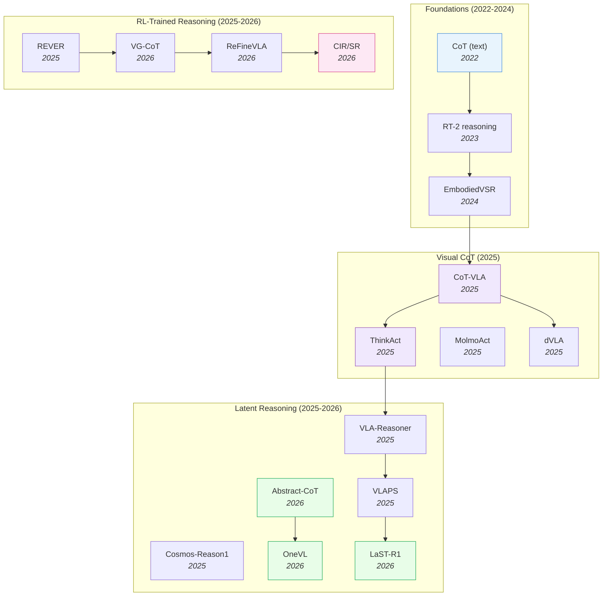

# VLA Reasoning & Chain-of-Thought — Deep Dive

> [!abstract] Overview
> Pure imitation collapses on long-horizon, novel, or counterfactual tasks. Reasoning-augmented VLAs add explicit deliberation — visual chain-of-thought, latent reasoning, test-time search, or reasoning-traced training — to recover robustness. The design question is not *whether* to reason, but *where in the pipeline* to insert reasoning: at input prompting, in latent space, at the output head, or via external search. This note maps the four architectural slots, the trade-offs (latency vs accuracy vs interpretability), and the 2026 frontier where latent reasoning matches explicit CoT at answer-only latency.

## Evolution Graph

The field evolved through three phases. **Visual CoT** (2025) ported language CoT to visual subgoals — [[2503.22020|CoT-VLA]] predicts future frames as reasoning steps, [[2507.16815|ThinkAct]] and [[2508.07917|MolmoAct]] add visual latent planning. **Latent reasoning** (2025-2026) collapsed the explicit text trace into compact embeddings — [[2604.22709|Abstract-CoT]] eliminates words entirely, [[2604.18486|OneVL]] achieves answer-only latency while beating explicit CoT, [[2604.28192|LaST-R1]] reinforces action via adaptive physical latent reasoning. **RL-trained reasoning** (2025-2026) trains the reasoning trace itself with verifiable rewards — [[2509.25852|REVER]] (embodied planning), [[2604.21396|VG-CoT]] (grounded), [[2604.17800|ReFineVLA]] (teacher-guided), CIR/SR (causally important reasoning).

| Year | Model | Reasoning Slot | Contribution |
|------|-------|---------------|--------------|
| 2024 | [[2503.11089\|EmbodiedVSR]] | Output head + CoT | Dynamic scene graph + physics-constrained CoT |
| 2025 | [[2503.22020\|CoT-VLA]] | Input/Latent | Visual subgoals as CoT steps; +17% real-world |
| 2025 | [[2507.16815\|ThinkAct]] | Latent + RL | Reinforced visual latent planning |
| 2025 | [[2508.07917\|MolmoAct]] | Output head | Depth-aware tokens + visual reasoning traces |
| 2025 | [[2509.22643\|VLA-Reasoner]] | External search | Online MCTS with world model |
| 2025 | [[2509.25681\|dVLA]] | Output head | Diffusion VLA + multimodal CoT |
| 2025 | [[2509.25852\|REVER]] | RL training | Reinforced embodied planning with verifiable reward |
| 2025 | [[2503.15558\|Cosmos-Reason1]] | Latent + reasoning | Physical commonsense + embodied reasoning |
| 2025 | [[2508.12211\|VLAPS]] | External search | Model-based search for pre-trained VLA |
| 2026 | [[2604.22709\|Abstract-CoT]] | Latent (token-free) | Latent CoT in abstract embedding space |
| 2026 | [[2604.21396\|VG-CoT]] | RL training | Grounded chain-of-thought via visual evidence |
| 2026 | [[2604.18486\|OneVL]] | Latent (answer-only) | One-step latent CoT > explicit CoT, with answer-only latency |
| 2026 | [[2604.17800\|ReFineVLA]] | RL training | Multimodal reasoning-aware policy via teacher distillation |
| 2026 | [[2604.28192\|LaST-R1]] | Latent + RL | Adaptive physical latent reasoning |
| 2026 | [[2604.27998\|Latent-GRPO]] | Latent + RL | GRPO stabilization for continuous latent reasoning; 3-4× shorter chains |
| 2026 | [[2604.20328\|HyLaR]] | Latent + RL | vMF-distribution DePO for hybrid discrete-continuous reasoning |
| 2026 | [[2605.02735\|Silenced Visual Latents]] | Latent (utilization) | Identifies and fixes the latent-shortcut pathology via inference-time NES |
| 2026 | [[2604.22074\|CIR/SR Reasoning]] | RL training | Outcome rewards do not guarantee verifiable reasoning |
| 2026 | [[2604.14125\|HiVLA]] | Output head | Visual-grounded-centric hierarchical embodied manipulation |
| 2026 | [[2605.13119\|VLAs-as-Tools]] | External agent (hierarchical) | VLAs as bounded callable tools under high-level VLM agent; TAPT post-training |

---

## Part A — Framework

*The four reasoning insertion slots — the taxonomy that organizes everything below.*

### 1. The Four Reasoning Insertion Slots

> [!success] Where to Reason
> Every VLA pipeline has four candidate slots for inserting reasoning. Picking the wrong slot makes reasoning a latency burden; picking the right one is a free accuracy win.

#### Slot 1 — Input Prompting

The cheapest slot: ask the VLM to reason about the task in natural language *before* generating actions. The reasoning is generated by the same backbone that produces the actions, in the same forward pass.

**Pros**: Zero new parameters; works with any VLM.
**Cons**: Reasoning is a token-level afterthought; no guarantee it grounds the action distribution. Adds the full reasoning length to inference latency.

#### Slot 2 — Latent Reasoning

Reason inside the model's hidden state without emitting text. Either pre-allocate latent tokens for reasoning ([[2604.22709|Abstract-CoT]]) or supervise the latent space with auxiliary decoders ([[2604.18486|OneVL]]).

**Pros**: Fast (no extra autoregressive steps); preserves answer-only latency; can outperform explicit CoT ([[2604.18486|OneVL]]).
**Cons**: Opaque — debugging requires auxiliary decoders or probing.

#### Slot 3 — Output Head Reasoning

Generate reasoning *as part of the output* alongside actions: visual subgoal frames ([[2503.22020|CoT-VLA]]), reasoning traces ([[2508.07917|MolmoAct]]), multimodal CoT tokens ([[2509.25681|dVLA]]).

**Pros**: Reasoning is grounded — the visual subgoal *is* the plan, not a description of it. Interpretable.
**Cons**: Generation cost scales with visual complexity (full subgoal frames are expensive).

#### Slot 4 — External Search

Treat the VLA as a policy *prior* and search at test time using a world model. MCTS rolls out candidate actions, scores via the world model, picks the best.

**Pros**: Maximally robust; can recover from a poorly-trained policy.
**Cons**: 3-5x slower; requires a usable world model.

| Slot | Cost | Interpretability | Best For |
|------|------|------------------|----------|
| Input Prompting | High latency | High | Prototyping, language-heavy tasks |
| Latent Reasoning | Low latency | Low (without aux decoders) | Real-time deployment |
| Output Head | Medium latency | High (visual subgoals) | Multi-stage manipulation |
| External Search | Highest latency | Medium (per-rollout) | Safety-critical / novel tasks |

---

## Part B — Reasoning Methods

*Visual CoT, latent reasoning, test-time search, reasoning-traced training.*

### 2. Visual Chain-of-Thought

The first wave of VLA reasoning ported language CoT to *visual* subgoals. The model first predicts a future image (the "subgoal") then generates actions conditioned on that image.

- [[2605.13632|GTA-VLA]], [[2604.14125|HiVLA]], [[2509.25681|dVLA]], [[2508.07917|MolmoAct]], [[2507.16815|ThinkAct]], [[2503.22020|CoT-VLA]], [[2503.11089|EmbodiedVSR]]

**How [[2605.13632|GTA-VLA]] Adds Interactive Spatial Guidance**: [[2605.13632|GTA-VLA]] extends Visual CoT with **interactive** human spatial guidance — points, boxes, and traces can be optionally injected into a structured "Guide-Think-Act" reasoning process, letting humans correct visual ambiguities mid-task. An ==asynchronous "slow reasoning, fast action" design== separates VLM-based reasoning from continuous action generation so interactive control remains real-time. The Interact-306K dataset is auto-synthesized from existing robot datasets, enabling scalable training of the interactive CoT. Results: **98.6%** LIBERO in-domain, **+22pp** on SimplerEnv-Plus unseen-object generalization, and human guidance recovers **+20%** of policy failures (raising SimplerEnv-Bridge from **81.2% → 86.1%**) — the cleanest demonstration that human spatial intent can be a first-class CoT modality.

**How [[2503.22020|CoT-VLA]] Works**: A [[2409.04429|VILA-U]] backbone is jointly trained on two objectives — robot demonstrations (visual + action tokens) and action-less video (EPIC-KITCHENS, predicting visual subgoals). At inference, the model emits a future-frame token *first*, then conditions actions on the predicted subgoal. Achieved **+17%** real-world and **+6%** simulation gains over baseline VLAs.

**How [[2507.16815|ThinkAct]] Works**: Adds RL-driven visual latent planning. Between the VLM and action head, a planning module produces visual latent plans, supervised by a reinforced reward signal tied to task success. Bridges visual CoT (interpretable) with latent reasoning (efficient).

**How [[2508.07917|MolmoAct]] Works**: Emits depth-aware perception tokens + visual reasoning traces alongside actions. The reasoning trace is a sequence of visual attention regions plus depth annotations, providing an interpretable explanation of *what* the model attended to and *why*.

> [!star] Key Papers
> - [[2503.22020|CoT-VLA]] — Foundational visual CoT for VLA; **+17%** real-world and **+6%** simulation; leverages action-less video for subgoal training
> - [[2507.16815|ThinkAct]] — RL-driven visual latent planning that bridges CoT and latent reasoning
> - [[2508.07917|MolmoAct]] — Depth-aware perception tokens + visual reasoning traces; interpretable manipulation reasoning
> - [[2509.25681|dVLA]] — Diffusion VLA with multimodal CoT; reasoning interleaved with diffusion action generation

> [!tip] When Visual CoT Helps
> Visual CoT shines for **multi-stage manipulation** where each stage has a visually distinct goal state ("first the cup is grasped, then it's at the lip of the kettle, then it's pouring"). For continuous skills (polishing a surface), visual subgoals are too abrupt — use latent reasoning instead.

---

### 3. Latent Reasoning — Token-Free CoT

The 2026 frontier. Instead of emitting a long text trace and paying its inference cost, reason in the model's hidden state. Two recipes have emerged.

#### 3.1 Pre-allocated Latent Reasoning Tokens

Reserve a fixed budget of "reasoning slots" in the input sequence; let the model use them however it wants. The training objective shapes the slot usage without forcing words.

- [[2604.22709|Abstract-CoT]]

**How [[2604.22709|Abstract-CoT]] Works**: Pre-allocates K reasoning tokens in the latent space. During training, those tokens are supervised to encode whatever computation an *equivalent* explicit CoT would have done — but in continuous embeddings. The K tokens are processed in parallel, eliminating the autoregressive penalty of explicit CoT. Token-free reasoning preserves throughput.

#### 3.2 Auxiliary-Decoder-Supervised Latent Reasoning

Same idea as 3.1 but with explicit auxiliary decoders that *can* recover the reasoning trace if needed (interpretability) — without paying the cost at inference.

- [[2604.18486|OneVL]]

**How [[2604.18486|OneVL]] Works**: VLM with specialized language and visual latent tokens, supervised by **dual auxiliary decoders**: a language decoder reconstructs human-readable CoT text; a visual decoder predicts future frames as a world-model auxiliary. Both decoders exist *only at training time*. At inference, a **prefill mechanism** processes all latent tokens in a single parallel pass — achieving **answer-only latency** while *exceeding* explicit autoregressive CoT performance. **88.84 PDM-score** on NAVSIM, **+2.64 pts** over prior 8B models, **0.24s** real-time variant.

#### 3.3 RL-Trained Latent Reasoning

Reinforce the latent reasoning with a verifiable reward signal that ties latent quality to downstream action quality.

- [[2604.28192|LaST-R1]], [[2604.27998|Latent-GRPO]], [[2604.20328|HyLaR]]

**How [[2604.28192|LaST-R1]] Works**: Adaptive physical latent reasoning, RL-supervised against task success. The "physical" part: the latent is grounded in DINOv3 visual embeddings, then RL-shaped to encode task-relevant physical structure. The "adaptive" part: reasoning depth is variable per task — easy tasks reason briefly, hard tasks reason longer.

**How [[2604.27998|Latent-GRPO]] Stabilizes Latent RL**: Naively applying GRPO to a continuous latent reasoning space causes ==model collapse== — unbounded exploration drives the policy off-manifold. [[2604.27998|Latent-GRPO]] identifies three failure modes and patches each: (1) ==Invalid Sample Advantage Masking== zeros advantages for non-terminating trajectories, bounding exploration; (2) ==One-Sided Noise Sampling== ensures a strictly positive perturbation margin so gradient direction aligns with trajectory-level advantage; (3) ==Optimal Correct Path First-Token Selection== reinforces only the highest-scoring correct path's first step, eliminating harmful mode averaging when multiple correct latent paths exist. Result: **+7.86 pp** Pass@1 over Latent-SFT on low-difficulty, **+14.77 pp** on high-difficulty tasks, with **3-4× shorter reasoning chains** than explicit GRPO.

**How [[2604.20328|HyLaR]] Fixes the Hybrid Discrete-Continuous Action Space**: Standard PPO/GRPO assume Euclidean policy geometry, but MLLM latent representations live on a hypersphere — and the hybrid discrete-text + continuous-latent action space causes ==variance mismatch== in importance-sampling ratios. [[2604.20328|HyLaR]]'s ==Decoupled Policy Optimization (DePO)== fixes both: latent actions are modeled as a ==von Mises–Fisher (vMF) distribution== (the natural hyperspherical analog of a Gaussian), and PPO surrogate losses use ==separate, tighter clipping ranges== for the continuous branch with ==closed-form KL regularization== respecting hyperspherical geometry. Combined with an internal "canvas mode" (<|canvas_start|>…<|canvas_end|> tokens demarcating continuous visual latents interleaved with discrete text). Gains on Qwen2.5-VL-7B: **+7.33%** [[2312.14135|V*]], **+14.50%** HRBench-8K ([[2509.22638|FCP]]), **-7.11%** HallusionBench (reduced hallucination).

> [!star] Key Papers
> - [[2604.18486|OneVL]] — First latent CoT to *beat* explicit CoT while preserving answer-only latency; **88.84 PDM-score** on NAVSIM
> - [[2604.22709|Abstract-CoT]] — Token-free reasoning in abstract embedding space; eliminates the discrete-token bottleneck
> - [[2604.28192|LaST-R1]] — Adaptive physical latent reasoning; RL-trained with task-success reward
> - [[2604.27998|Latent-GRPO]] — GRPO for latent reasoning: three failure-mode fixes (invalid-sample masking, one-sided noise, first-token selection); **+14.77 pp** on hard tasks, 3-4× shorter chains than explicit GRPO
> - [[2604.20328|HyLaR]] — Decoupled PPO with vMF latent distribution + tight hyperspherical clipping; **canvas mode** for interleaved discrete-continuous reasoning; **+14.50%** HRBench-8K
> - [[2503.15558|Cosmos-Reason1]] — Physical commonsense + embodied reasoning at WAM scale; a complementary substrate for physics-grounded reasoning

> [!tip] The Latent Reasoning Surprise
> The conventional wisdom was that explicit text CoT works because it forces sequential, decompose-then-act reasoning. [[2604.18486|OneVL]] falsified this: with the right training (dual-modal latent supervision), latent reasoning *outperforms* explicit CoT while running at answer-only latency. This is the most important VLA-reasoning result of 2026.

> [!warning] Stability Is Not Free in Latent RL
> Both [[2604.27998|Latent-GRPO]] and [[2604.20328|HyLaR]] document the same root cause from different angles: naive policy-gradient methods in continuous latent space cause model collapse. The fixes converge on three principles — (1) bound exploration off-manifold (advantage masking / vMF distribution), (2) align gradient direction with advantage sign (one-sided noise / decoupled clipping), (3) avoid mode averaging across alternate correct paths (first-token selection). Any new RL-for-latent-reasoning method should be checked against these three failure modes.

#### 3.4 The Silenced-Latents Pathology

A diagnostic result orthogonal to architecture: MLLM latent reasoning can be **semantically rich but functionally ignored** during answer prediction — the autoregressive decoder takes a "shortcut" through the raw visual input rather than routing through the latent reasoning slots. Improving latent quality alone does *not* fix this.

- [[2605.02735|Silenced Visual Latents]]

**How Unsilencing Works**: A frozen-backbone, two-stage inference-time optimization. Stage I (==Visual Latent Warm-Up==): a ==chunk-wise contrastive alignment== loss with query-guided relevance scoring assigns each latent token its own positive/negative visual evidence, enriching latent semantic quality. Stage II (==Latent-to-Answer Reinforcement==): a ==confidence-progression reward== forces the answer-prediction pathway to *use* the warmed-up latents, optimized via ==Native Evolutionary Strategy (NES)== gradient estimation. Crucially the MLLM parameters never change — the latents are optimized at inference. Gains on Qwen2.5-VL-7B: **+8.66%** IQTest, **+5.00%** MM-Vista, with utilization scaling: MMVP **72.33% → 73.67%** as the latent budget grows from K=2 to K=10.

> [!star] Key Papers
> - [[2605.02735|Silenced Visual Latents]] — Identifies that joint optimization of latent quality + answer prediction creates a shortcut bypassing latents; fixes via two-stage inference-time optimization (chunk-wise contrastive warm-up + NES-driven utilization reward) without touching backbone parameters

> [!tip] Latent Quality vs Latent Utilization
> [[2605.02735|Silenced Visual Latents]] exposes a hidden failure mode: a latent reasoning system can score well on intrinsic latent-quality probes while the downstream answer head learns to ignore those latents entirely. Any latent-reasoning ablation should measure *utilization* (does perturbing the latents change the answer?) alongside quality (do the latents encode the right information?). The two metrics can diverge.

---

### 4. Test-Time Search

When the policy is uncertain, search for a better action. The world model serves as a simulator; a tree-search algorithm rolls out candidates.

- [[2605.13119|VLAs-as-Tools]], [[2510.16281|SEAL]], [[2509.22643|VLA-Reasoner]], [[2508.12211|VLAPS]]

**How [[2605.13119|VLAs-as-Tools]] Works**: A distinct flavor of external orchestration — instead of searching candidate actions, [[2605.13119|VLAs-as-Tools]] **delegates** subtasks to specialized VLA tools under a high-level VLM agent. The VLM emits discrete tool-invocation messages (each VLA tool corresponds to a bounded sub-skill), receives continuous progress feedback, and triggers event-driven replanning only when needed. ==Tool-Aligned Post-Training (TAPT)== trains the base VLA on bounded invocations with ==tool-family residual parameterization== (distinct execution paths per tool, shared base representation). Latency-efficient — VLM calls drop from **109.5 → 1.988** per task — while delivering **+35.5pp** RoboTwin and **+34.6pp** invocation fidelity. Distinct from MCTS in that the policy hierarchy itself supplies the reasoning structure rather than a tree-search rollout.

**How [[2509.22643|VLA-Reasoner]] Works**: Online MCTS with the world model as the simulator. At each step: (1) sample N action candidates from the VLA; (2) for each, roll forward through the world model to predict the resulting state trajectory; (3) score each trajectory via a learned value function; (4) execute the best action; (5) re-observe and repeat. Latency: ~3-5x slower than the base VLA, but recovers from poorly-calibrated policies.

**How [[2508.12211|VLAPS]] Works**: Model-based search wrapped around a *pre-trained* VLA. Improves performance without retraining the policy — a deployment-time tool. Particularly useful for legacy VLAs that need a robustness boost.

**How [[2510.16281|SEAL]] Works**: A different flavor of test-time search — instead of rolling out and scoring trajectories, [[2510.16281|SEAL]] **verifies semantic alignment** between the VLA's self-generated textual plan and the predicted outcomes of its candidate actions. The pipeline is three-stage: **Hypothesize** (sample K candidate action sequences from the reasoning VLA), **Predict** (roll each forward through a learned dynamics model), **Verify** (use an off-the-shelf VLM like GPT-4o to check which predicted outcome best matches the VLA's own text plan). The action sequence with the highest semantic-alignment score is executed. This targets the **"embodied Chain-of-Thought faithfulness gap"** — the failure mode where a reasoning VLA generates a sensible text plan but produces actions inconsistent with that plan. Training-free; works with any reasoning VLA backbone. Achieves **94-97%** in-distribution, **+15pp** (to 53%) on novel behavior compositions, **+17pp** under viewpoint shifts, at **347ms/step** with K=10. Conceptually closer to constrained-decoding than tree-search — uses action *diversity* as a robustness mechanism rather than a search-tree.

> [!star] Key Papers
> - [[2605.13119|VLAs-as-Tools]] — Inverts VLA-as-top-level stack: VLAs become bounded callable tools under a high-level VLM agent via TAPT; VLM calls per task drop **109.5 → 1.988**; **+35.5pp** RoboTwin and **+34.6pp** instruction fidelity — the cleanest hierarchical-reasoning win
> - [[2509.22643|VLA-Reasoner]] — Online MCTS with world model; recovers from policy mistakes via tree-search
> - [[2508.12211|VLAPS]] — Model-based search wrapping pre-trained VLAs; improves performance without retraining
> - [[2510.16281|SEAL]] — Runtime reasoning-action alignment verification; targets the **CoT faithfulness gap** by checking that predicted action outcomes match the VLA's own text plan; training-free, **+15pp** on novel compositional tasks

> [!tip] When Test-Time Search Pays
> Use search when (1) the task is **safety-critical** (medical, autonomous driving), (2) the **policy is known to be miscalibrated** under distribution shift, or (3) **inference latency is acceptable** (planning, not real-time control). Skip it for fast pick-and-place where imitation suffices. [[2510.16281|SEAL]] specifically helps when **CoT and actions disagree** — the failure mode for reasoning VLAs in novel scenarios.

---

### 5. Reasoning-Traced Training

The 2026 trend: don't just *use* reasoning at test time — *train* the reasoning trace itself with verifiable rewards. The reasoning becomes part of the model's parameters, not a separate module.

- [[2604.21396|VG-CoT]], [[2604.17800|ReFineVLA]], [[2604.22074|CIR/SR Reasoning]], [[2509.25852|REVER]]

#### 5.1 Verifiable-Reward Reasoning

Use a programmatic checker (or a strong VLM) to verify each reasoning step; train via RL on verified traces.

**How [[2509.25852|REVER]] Works**: Reinforced embodied planning with verifiable reward. The reward function checks each intermediate planning step against a verifiable predicate (object position correct, action precondition met). Forces the model's reasoning trace to be *causally* correct, not just textually plausible.

#### 5.2 Grounded CoT

Tie each reasoning step to *visual evidence*; reject ungrounded reasoning.

**How [[2604.21396|VG-CoT]] Works**: Each reasoning step in the chain must point to a specific visual region; if it can't, the step is rejected during training. Trustworthy visual reasoning via grounded chain-of-thought. Eliminates the "hallucinated reasoning" failure mode.

#### 5.3 Teacher-Guided Reasoning

Use a strong reasoning model as a teacher; distill its reasoning traces into the VLA.

**How [[2604.17800|ReFineVLA]] Works**: Multimodal reasoning-aware policy trained with teacher-guided fine-tuning. The teacher model produces reasoning traces; the student VLA learns to produce similar traces *and* better actions, jointly.

#### 5.4 The Outcome-Reward Trap

A 2026 result with broad implications.

**How CIR/SR Works**: Demonstrates that **outcome rewards alone do not guarantee verifiable or causally important reasoning**. Models can produce factually correct outcomes via reasoning traces that are *not* causally connected to the answer. The fix: explicit **Causally Important Reasoning** (CIR) and **Step-Reward** (SR) supervision that target the reasoning *process*, not just the outcome.

> [!star] Key Papers
> - [[2509.25852|REVER]] — Reinforced embodied planning with verifiable reward; first to RL-train reasoning traces with causality
> - [[2604.21396|VG-CoT]] — Grounded CoT tied to visual evidence; eliminates hallucinated reasoning
> - [[2604.17800|ReFineVLA]] — Teacher-guided reasoning distillation into VLAs
> - [[2604.22074|CIR/SR Reasoning]] — Outcome rewards alone insufficient; need causally-important step rewards

> [!tip] Outcome Rewards Are Not Enough
> CIR/SR's finding is sobering: a VLA trained to maximize task success can develop reasoning traces that *look* correct but are causally disconnected from the final action. Step-level rewards on the *reasoning process* are required for trustworthy reasoning.

---

## Part C — Trade-offs & Open Problems

*Reasoning quality vs inference latency; what remains unsolved.*

### 6. Reasoning Quality vs Inference Latency

The fundamental trade-off, with 2026 data points:

| Approach | Reasoning Quality | Inference Latency | Source |
|----------|-------------------|-------------------|--------|
| No reasoning (vanilla VLA) | Low | 1.0x | π0, OpenVLA |
| Input-prompt CoT | Medium | 2-3x | RT-2 |
| Output-head visual CoT | High | 1.5-2.5x | [[2503.22020\|CoT-VLA]] |
| Latent reasoning ([[2604.22709\|Abstract-CoT]]) | High | 1.0-1.1x | [[2604.22709\|Abstract-CoT]] |
| Latent reasoning ([[2604.18486\|OneVL]]) | **Highest** | **1.0x** | [[2604.18486\|OneVL]] |
| Runtime alignment verification ([[2510.16281\|SEAL]]) | High | ~1.5-2x (K=10, 347ms/step) | [[2510.16281\|SEAL]] |
| Test-time search (MCTS) | Highest | 3-5x | [[2509.22643\|VLA-Reasoner]] |

> [!success] The 2026 Recipe
> If latency matters: ==Latent reasoning + dual-modal auxiliary supervision== ([[2604.18486|OneVL]] pattern). If interpretability matters: ==Output-head visual CoT== ([[2503.22020|CoT-VLA]] pattern). If recovery from miscalibration matters: ==Test-time MCTS== ([[2509.22643|VLA-Reasoner]] pattern). RL-train the reasoning trace with verifiable step rewards ([[2509.25852|REVER]] + CIR/SR).

---

### 7. Open Problems

- **Reasoning vs reflex**: When should the VLA reason, and when should it act reflexively? Static "always reason" is slow; static "never reason" is brittle. Adaptive reasoning depth ([[2604.28192|LaST-R1]]) is promising but not solved.
- **Causality verification at scale**: CIR/SR works for narrow predicates. Scaling causally-important step rewards to general manipulation is an open problem.
- **The CoT faithfulness gap**: [[2510.16281|SEAL]] documents that reasoning VLAs often generate sensible text plans but produce actions *inconsistent* with those plans — especially under OOD shifts. [[2510.16281|SEAL]] verifies alignment at runtime, but the deeper question is *why* training fails to enforce alignment in the first place. RL with action-alignment rewards is a natural fix but unproven at scale.
- **Cross-modal reasoning**: Most VLA reasoning is vision-centric. Reasoning over force, tactile, and audio modalities (relevant for contact-rich tasks) is underexplored.
- **Reasoning generalization**: Does a model that reasons well on [[2510.13626|LIBERO-Plus]] also reason well on real-world novel tasks? Diagnostic benchmarks for reasoning robustness are missing.

> [!tip] The Faithfulness Gap Is the Common Root
> Four of the five problems above (reasoning vs reflex, causality verification, the [[2510.16281|SEAL]] alignment gap, reasoning generalization) trace to the same root: VLAs can *describe* a plan and *execute* an action, but no current method *enforces* that the action follows from the plan under OOD shift. Process-level rewards ([[2509.25852|REVER]] CIR/SR) and runtime alignment verification ([[2510.16281|SEAL]]) attack the symptom; the deeper fix likely requires action-aligned RL objectives that haven't been demonstrated at VLA scale. Cross-modal reasoning (force, tactile) is the orthogonal frontier — see [[10_Force-Aware-and-Tactile-Policies]] §3.

---

## Quick-Reference Matrix

| Question | Answer |
|----------|--------|
| Need fastest reasoning? | [[2604.18486\|OneVL]] (latent + dual aux) or [[2604.22709\|Abstract-CoT]] (token-free) |
| Need interpretable reasoning? | [[2503.22020\|CoT-VLA]] (visual subgoals) or [[2508.07917\|MolmoAct]] (visual traces) |
| Need most robust reasoning? | [[2509.22643\|VLA-Reasoner]] (MCTS) or [[2508.12211\|VLAPS]] (model-based search) |
| Need runtime alignment verification (CoT-faithful actions)? | [[2510.16281\|SEAL]] (training-free, K-candidate verification via VLM critic) |
| Need RL-trained reasoning? | [[2509.25852\|REVER]], [[2604.17800\|ReFineVLA]], or [[2604.28192\|LaST-R1]] |
| Need physics reasoning? | [[2503.15558\|Cosmos-Reason1]] — see [[07_Physics-Aware-Embodied-AI]] |
| Need driving reasoning? | [[2604.18486\|OneVL]] (88.84 PDM-score on NAVSIM) |
| Beware: outcome rewards alone? | [[2604.22074\|CIR/SR Reasoning]] — use step rewards, not just outcome rewards |
| Need latent + diffusion? | [[2509.25681\|dVLA]] |

---

## Cross-References

- [[01_Embodied-AI-101]] — Embodied AI basics; reasoning is one of the four learning-strategy axes
- [[03_VLA]] — VLA deep-dive; §4 covers the broader Reasoning & Planning landscape and feeds into this note
- [[04_WAM]] — WAM deep-dive; §5 VLM-Integrated WAMs cover the world-model side of reasoning-augmented planning
- [[05_Latent-World-Models]] — §4 latent reasoning for embodied AI; complements this note's latent slot
- [[06_Self-Evolving-VLA-WAM]] — Self-evolution; reasoning enables self-critique and proactive correction
- [[07_Physics-Aware-Embodied-AI]] — Physics priors as the substrate for [[2503.15558|Cosmos-Reason1]] and physical latent reasoning ([[2604.28192|LaST-R1]])
- [[09_Egocentric-Pretraining-and-Human-Video]] — Egocentric pretraining deep-dive
- [[10_Force-Aware-and-Tactile-Policies]] — Force/tactile policies deep-dive; reasoning over multi-sensor context
- [[02_Dataset-Benchmark-Environment]] — Reasoning benchmarks ([[2507.10548|EmbRACE-3K]], [[2505.05456|SITE]])

---

*See [[03_VLA]] for the full VLA design space, [[05_Latent-World-Models]] for the broader latent-prediction landscape, or [[07_Physics-Aware-Embodied-AI]] for physics-aware reasoning.*
