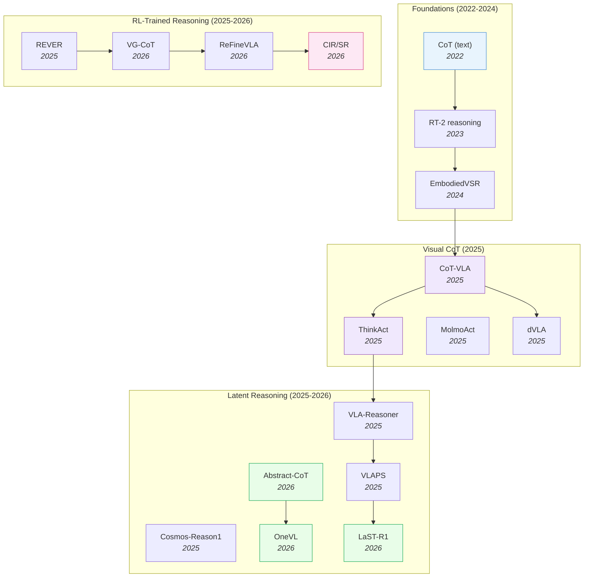

# VLA Reasoning & Chain-of-Thought — Deep Dive

> [!abstract] Overview
> Pure imitation collapses on long-horizon, novel, or counterfactual tasks. Reasoning-augmented VLAs add explicit deliberation — visual chain-of-thought, latent reasoning, test-time search, or reasoning-traced training — to recover robustness. The design question is not *whether* to reason, but *where in the pipeline* to insert reasoning: at input prompting, in latent space, at the output head, or via external search. This note maps the four architectural slots, the trade-offs (latency vs accuracy vs interpretability), and the 2026 frontier where latent reasoning matches explicit CoT at answer-only latency.

## Evolution Graph

The field evolved through three phases. **Visual CoT** (2025) ported language CoT to visual subgoals — [[2503.22020|CoT-VLA]] predicts future frames as reasoning steps, [[2507.16815|ThinkAct]] and [[2508.07917|MolmoAct]] add visual latent planning. **Latent reasoning** (2025-2026) collapsed the explicit text trace into compact embeddings — [[2604.22709|Abstract-CoT]] eliminates words entirely, [[2604.18486|OneVL]] achieves answer-only latency while beating explicit CoT, [[2604.28192|LaST-R1]] reinforces action via adaptive physical latent reasoning. **RL-trained reasoning** (2025-2026) trains the reasoning trace itself with verifiable rewards — [[2509.25852|REVER]] (embodied planning), [[2604.21396|VG-CoT]] (grounded), [[2604.17800|ReFineVLA]] (teacher-guided), CIR/SR (causally important reasoning).

| Year | Model | Reasoning Slot | Contribution |
|------|-------|---------------|--------------|
| 2024 | [[2503.11089\|EmbodiedVSR]] | Output head + CoT | Dynamic scene graph + physics-constrained CoT |
| 2025 | [[2503.22020\|CoT-VLA]] | Input/Latent | Visual subgoals as CoT steps; +17% real-world |
| 2025 | [[2507.16815\|ThinkAct]] | Latent + RL | Reinforced visual latent planning |
| 2025 | [[2508.07917\|MolmoAct]] | Output head | Depth-aware tokens + visual reasoning traces |
| 2025 | [[2509.22643\|VLA-Reasoner]] | External search | Online MCTS with world model |
| 2025 | [[2509.25681\|dVLA]] | Output head | Diffusion VLA + multimodal CoT |
| 2025 | [[2509.25852\|REVER]] | RL training | Reinforced embodied planning with verifiable reward |
| 2025 | [[2503.15558\|Cosmos-Reason1]] | Latent + reasoning | Physical commonsense + embodied reasoning |
| 2025 | [[2508.12211\|VLAPS]] | External search | Model-based search for pre-trained VLA |
| 2026 | [[2604.22709\|Abstract-CoT]] | Latent (token-free) | Latent CoT in abstract embedding space |
| 2026 | [[2604.21396\|VG-CoT]] | RL training | Grounded chain-of-thought via visual evidence |
| 2026 | [[2604.18486\|OneVL]] | Latent (answer-only) | One-step latent CoT > explicit CoT, with answer-only latency |
| 2026 | [[2604.17800\|ReFineVLA]] | RL training | Multimodal reasoning-aware policy via teacher distillation |
| 2026 | [[2604.28192\|LaST-R1]] | Latent + RL | Adaptive physical latent reasoning |
| 2026 | [[2604.27998\|Latent-GRPO]] | Latent + RL | GRPO stabilization for continuous latent reasoning; 3-4× shorter chains |
| 2026 | [[2604.20328\|HyLaR]] | Latent + RL | vMF-distribution DePO for hybrid discrete-continuous reasoning |
| 2026 | [[2605.02735\|Silenced Visual Latents]] | Latent (utilization) | Identifies and fixes the latent-shortcut pathology via inference-time NES |
| 2026 | [[2604.22074\|CIR/SR Reasoning]] | RL training | Outcome rewards do not guarantee verifiable reasoning |
| 2026 | [[2604.14125\|HiVLA]] | Output head | Visual-grounded-centric hierarchical embodied manipulation |
| 2026 | [[2605.13119\|VLAs-as-Tools]] | External agent (hierarchical) | VLAs as bounded callable tools under high-level VLM agent; TAPT post-training |

---

## Part A — Framework

*The four reasoning insertion slots — the taxonomy that organizes everything below.*

### 1. The Four Reasoning Insertion Slots

Every VLA pipeline has four candidate slots where reasoning can be inserted, and the slot choice — not the reasoning content — determines whether reasoning becomes a latency burden or a free accuracy win. The four slots sit on orthogonal axes: ==input prompting== reasons *before* the model runs, ==latent reasoning== reasons *inside* the model's hidden state, ==output head== reasoning emits reasoning *alongside* actions, and ==external search== reasons *around* the policy via test-time rollouts. Each absorbs a different cost — inference latency, opacity, generation expense, or search overhead — so the design question is which constraint binds your deployment.

#### 1.1 Input Prompting

The cheapest slot: ask the VLM to reason about the task in natural language *before* generating actions. The reasoning is generated by the same backbone that produces the actions, in the same forward pass.

- **Architecture** — Zero new parameters; works with any pretrained VLM as a drop-in prompting strategy.
- **Cost trade-off** — Reasoning is a token-level afterthought; no guarantee it grounds the action distribution. Adds the full reasoning length to inference latency.
- **Canonical example** — RT-2-style "let me think step by step" prompting before action generation.

#### 1.2 Latent Reasoning

Reason inside the model's hidden state without emitting text. Either pre-allocate latent tokens for reasoning ([[2604.22709|Abstract-CoT]]) or supervise the latent space with auxiliary decoders ([[2604.18486|OneVL]]).

- **[[2604.18486|OneVL]]** — Fast (no extra autoregressive steps); preserves ==answer-only latency==; can *outperform* explicit CoT. The 2026 frontier result.
- **[[2604.22709|Abstract-CoT]]** — Replaces verbose verbal CoT with a short sequence of ==discrete abstract tokens== from a ==reserved vocabulary== under a two-stage post-training (==policy-iteration warm-up + warm-started GRPO==) and an ==attention-mask information bottleneck==; up to **12×** fewer reasoning tokens at comparable/superior MATH/AlpacaEval/HotpotQA scores across Qwen3 and Granite — eliminates the discrete-token bottleneck entirely.
- **Cost trade-off** — Opaque — debugging requires auxiliary decoders or probing.

#### 1.3 Output Head Reasoning

Generate reasoning *as part of the output* alongside actions: visual subgoal frames ([[2503.22020|CoT-VLA]]), reasoning traces ([[2508.07917|MolmoAct]]), multimodal CoT tokens ([[2509.25681|dVLA]]).

- **[[2503.22020|CoT-VLA]]** — ==Visual subgoals as CoT steps==: predicts a future-frame token first, then conditions actions on the predicted subgoal via a **7B** ==VILA-U== unified backbone trained jointly on robot demos and action-less EPIC-KITCHENS video; **+17%** real-world and **+6%** simulation gains — the subgoal *is* the plan, not a description of it.
- **[[2508.07917|MolmoAct]]** — Three-stage autoregressive pipeline emitting ==depth-aware perception tokens==, ==mid-level visual reasoning traces==, then byte-level BPE-tokenized actions; **86.6%** LIBERO, **72.1%** SimplerEnv variant-aggregation (**+7.8pp** over RT-2-X), and visual-trace user steering reaches **75%** SR (**+33pp** over natural-language steering) — interpretable explanation of *what* the model attended to.
- **Cost trade-off** — Reasoning is grounded and interpretable, but generation cost scales with visual complexity (full subgoal frames are expensive).

#### 1.4 External Search

Treat the VLA as a policy *prior* and search at test time using a world model. MCTS rolls out candidate actions, scores via the world model, picks the best.

- **[[2509.22643|VLA-Reasoner]]** — Plug-in framework wrapping any pretrained VLA with ==online MCTS== over a learned ==world model==, using ==Kernel Density Estimation== for action candidates and a ==vision-based value network== for dense intermediate state scoring; **+19pp** absolute on OpenVLA real-world (**22% → 41%**) and **+10pp** on π0-FAST — recovers from policy mistakes via tree-search.
- **[[2605.13119|VLAs-as-Tools]]** — Hierarchical orchestration via a ==bidirectional VLA tool-family interface== (discrete invocation messages + continuous progress feedback) plus ==Tool-Aligned Post-Training (TAPT)== with ==tool-family residual parameterization==; high-level VLM calls per task drop **109.5 → 1.988** while **+35.5pp** RoboTwin SR and **+34.6pp** invocation fidelity on OpenVLA-OFT.
- **Cost trade-off** — Maximally robust; can recover from a poorly-trained policy. **3-5×** slower; requires a usable world model.

**[Reasoning Slot] — Decision Matrix**

| Need | Recommendation |
|---|---|
| Prototyping or language-heavy tasks | ==Input Prompting== (zero new params) |
| Real-time deployment (answer-only latency) | ==Latent Reasoning== ([[2604.18486\|OneVL]] / [[2604.22709\|Abstract-CoT]]) |
| Multi-stage manipulation needing interpretability | ==Output Head== ([[2503.22020\|CoT-VLA]] / [[2508.07917\|MolmoAct]]) |
| Safety-critical / novel tasks (acceptable latency) | ==External Search== ([[2509.22643\|VLA-Reasoner]] / [[2605.13119\|VLAs-as-Tools]]) |

> [!star] Key Papers
> - [[2604.18486|OneVL]] — Latent slot, beats explicit CoT at answer-only latency; **88.84 PDM-score** on NAVSIM; the 2026 latent-reasoning frontier
> - [[2503.22020|CoT-VLA]] — Output-head slot, visual subgoals as CoT steps; **+17%** real-world and **+6%** simulation
> - [[2509.22643|VLA-Reasoner]] — External-search slot, online MCTS with world model; the canonical search-augmented VLA
> - [[2605.13119|VLAs-as-Tools]] — Hierarchical external-search slot; VLM calls per task drop **109.5 → 1.988** via TAPT

> [!success] Where to Reason
> Every VLA pipeline has four candidate slots for inserting reasoning. Picking the wrong slot makes reasoning a latency burden; picking the right one is a free accuracy win. The 2026 default — latent + auxiliary decoder supervision — extracts CoT-quality reasoning at answer-only latency, but legacy deployments may still favor output-head visual CoT when interpretability dominates.

---

## Part B — Reasoning Methods

*Visual CoT, latent reasoning, test-time search, reasoning-traced training.*

### 2. Visual Chain-of-Thought

The first wave of VLA reasoning ported language CoT to *visual* subgoals — instead of "thinking in words," the model first predicts a future image (the subgoal) then generates actions conditioned on that image. The fundamental design choice is whether subgoals are ==stage-based== (discrete future-frame snapshots at goal states — "first the cup is grasped, then it's at the kettle lip") or ==continuous== (interactive spatial guidance threaded through every step). Stage-based subgoals are interpretable and cheap; continuous guidance enables human-in-the-loop correction at the cost of synchronization complexity.

#### 2.1 Stage-Based Visual Subgoal Generation

Predict discrete future-frame snapshots at goal states; condition actions on the predicted subgoal. The standard "subgoal-then-act" loop.

- **[[2503.22020|CoT-VLA]]** — A **7B** [[2409.04429|VILA-U]] ==unified multimodal foundation model== jointly trained on robot demonstrations (visual + action tokens) and action-less video (EPIC-KITCHENS, predicting visual subgoals); at inference emits a future-frame token *first*, then conditions actions on the predicted subgoal through a ==hybrid attention mechanism== and ==action chunking==. **+17%** real-world and **+6%** simulation gains over baseline VLAs, with strong LIBERO instruction following and Franka-Tabletop OOD adaptation — the foundational stage-based recipe.
- **[[2507.16815|ThinkAct]]** — Adds ==RL-driven visual latent planning==; a planning module between VLM and action head produces visual latent plans supervised by reinforced task-success reward; bridges visual CoT (interpretable) with latent reasoning (efficient).
- **[[2508.07917|MolmoAct]]** — Emits ==depth-aware perception tokens== + visual reasoning traces alongside actions; the reasoning trace is a sequence of visual attention regions plus depth annotations, providing interpretable *what-and-why* explanations.
- **[[2509.25681|dVLA]]** — Unified discrete ==diffusion VLA== converting vision/language/continuous actions to discrete tokens under a single diffusion objective, with ==multimodal CoT== that jointly generates visual subgoals + textual reasoning + actions via cross-modal masking. **96.4%** LIBERO and **65%** real-world (Bin Picking), with multimodal CoT adding **+6.6pp** sim / **+12.5pp** real; ==prefix attention mask + dLLM-Cache== yield ~**2×** speedup at <**1%** SR drop.
- **[[2503.11089|EmbodiedVSR]]** — ==Dynamic scene graphs== generating and updating explicit spatial-relationship structure feed a ==physics-constrained chain-of-thought== so each reasoning step is geometrically consistent; introduces the ==eSpatial-Benchmark== and beats GPT-4o by **+18.4%** Arm Feasibility / **+6.7%** Success Judgment on eSpatial-RoboMIND, **100%** block assembly description, **80%** real-world reassembly — earliest output-head CoT with explicit physical-feasibility filtering.
- **[[2604.14125|HiVLA]]** — ==Hierarchical system== with a ==High-Level VLM Planner== emitting ==structured JSON plans== (semantic subtasks + high-resolution bounding boxes for ==object-centric image crops==) feeding a ==DiT Action Expert== via ==cascaded cross-attention== (global context → local crop → language skill); operates asynchronously and achieves **83.3%** avg SR on **9** RoboTwin tasks (**+17.7pp** vs H-RDT, **+42.7pp** vs π0) with emergent VLM-supervised error correction.

#### 2.2 Interactive & Continuous Spatial Guidance

Subgoals threaded through continuous interaction — humans can inject points, boxes, or traces mid-task to correct visual ambiguities.

- **[[2605.13632|GTA-VLA]]** — Structured ==Guide-Think-Act== reasoning with optional human spatial guidance (points, boxes, traces); ==asynchronous "slow reasoning, fast action" design== separates VLM reasoning from continuous action generation so interactive control remains real-time. Interact-306K dataset auto-synthesized from existing robot data. **98.6%** LIBERO in-domain, **+22pp** on SimplerEnv-Plus unseen-object generalization, and human guidance recovers **+20%** of policy failures (raising SimplerEnv-Bridge from **81.2% → 86.1%**) — the cleanest demonstration that human spatial intent can be a first-class CoT modality.

**[Visual CoT] — Decision Matrix**

| Need | Recommendation |
|---|---|
| Multi-stage manipulation with distinct goal states | [[2503.22020\|CoT-VLA]] (stage-based subgoals) |
| Interpretable depth-aware reasoning traces | [[2508.07917\|MolmoAct]] (depth tokens + attention regions) |
| Human-in-the-loop spatial correction | [[2605.13632\|GTA-VLA]] (interactive guidance) |
| RL-trained visual latent planning | [[2507.16815\|ThinkAct]] (reinforced planning module) |
| Diffusion-based action with multimodal CoT | [[2509.25681\|dVLA]] |
| Physics-constrained scene-graph CoT | [[2503.11089\|EmbodiedVSR]] |

> [!star] Key Papers
> - [[2503.22020|CoT-VLA]] — Foundational visual CoT for VLA; **+17%** real-world and **+6%** simulation; leverages action-less video for subgoal training
> - [[2605.13632|GTA-VLA]] — Interactive spatial guidance as first-class CoT modality; **98.6%** LIBERO, **+22pp** SimplerEnv-Plus, **+20%** human-recovery rate
> - [[2507.16815|ThinkAct]] — RL-driven visual latent planning that bridges CoT and latent reasoning
> - [[2508.07917|MolmoAct]] — Depth-aware perception tokens + visual reasoning traces; interpretable manipulation reasoning

> [!tip] When Visual CoT Helps
> Visual CoT shines for **multi-stage manipulation** where each stage has a visually distinct goal state ("first the cup is grasped, then it's at the lip of the kettle, then it's pouring"). For continuous skills (polishing a surface), visual subgoals are too abrupt — use latent reasoning instead (§3). Cross-reference [[03_VLA#4. Reasoning & Planning-Augmented VLAs]] for the broader reasoning-and-planning landscape that feeds into visual CoT, and [[04_WAM#5.1 Visual Chain-of-Thought]] for how WAM-integrated visual subgoal generation composes with world-model-augmented VLAs.

---

### 3. Latent Reasoning — Token-Free CoT

The 2026 frontier. Instead of emitting a long text trace and paying its inference cost, reason in the model's hidden state. Two recipes have emerged.

#### 3.1 Pre-allocated Latent Reasoning Tokens

Reserve a fixed budget of "reasoning slots" in the input sequence; let the model use them however it wants. The training objective shapes the slot usage without forcing words.

- **[[2604.22709|Abstract-CoT]]** — Replaces verbalized rationales with a short sequence of ==discrete abstract tokens== from a ==reserved vocabulary==; two-stage post-training of ==policy-iteration warm-up== + ==warm-started GRPO== with an ==attention-mask information bottleneck== that forces the answer to depend on the abstract tokens rather than explicit CoT. Reduces reasoning-token usage **up to 12×** with comparable or improved accuracy across benchmarks — token-free reasoning that preserves throughput.

#### 3.2 Auxiliary-Decoder-Supervised Latent Reasoning

Same idea as 3.1 but with explicit auxiliary decoders that *can* recover the reasoning trace if needed (interpretability) — without paying the cost at inference.

- **[[2604.18486|OneVL]]** — VLM with specialized language + visual latent tokens supervised by ==dual auxiliary decoders== (language decoder reconstructs human-readable CoT text; visual decoder predicts future frames as world-model auxiliary), both ==present only at training time==. At inference a ==prefill mechanism== processes all latent tokens in a single parallel pass, achieving ==answer-only latency== while *exceeding* explicit autoregressive CoT. **88.84 PDM-score** on NAVSIM, **+2.64 pts** over prior 8B models, **0.24s** real-time variant.

#### 3.3 RL-Trained Latent Reasoning

Reinforce the latent reasoning with a verifiable reward signal that ties latent quality to downstream action quality.

- **[[2604.28192|LaST-R1]]** — ==Adaptive physical latent reasoning== RL-supervised against task success: latent ==grounded in DINOv3== visual embeddings then RL-shaped to encode physical structure, with ==variable reasoning depth== per task (easy tasks reason briefly, hard tasks longer).
- **[[2604.27998|Latent-GRPO]]** — Patches three GRPO-on-latent failure modes that cause ==model collapse==: (1) ==Invalid Sample Advantage Masking== zeros advantages for non-terminating trajectories; (2) ==One-Sided Noise Sampling== ensures positive perturbation margin so gradient direction aligns with trajectory advantage; (3) ==Optimal Correct Path First-Token Selection== reinforces only the highest-scoring correct path's first step, eliminating mode averaging. **+7.86 pp** Pass@1 over Latent-SFT (low-difficulty), **+14.77 pp** (high-difficulty), with **3-4× shorter chains** than explicit GRPO.
- **[[2604.20328|HyLaR]]** — Fixes hybrid discrete-text + continuous-latent ==variance mismatch== via ==Decoupled Policy Optimization (DePO)==: latent actions as ==von Mises–Fisher (vMF) distribution== (hyperspherical Gaussian analog), ==separate tighter clipping== for continuous branch, ==closed-form KL== respecting hyperspherical geometry, plus an internal ==canvas mode== (<|canvas_start|>…<|canvas_end|> tokens interleaving continuous visual latents with discrete text). On Qwen2.5-VL-7B: **+7.33%** [[2312.14135|V*]], **+14.50%** HRBench-8K, **-7.11%** HallusionBench.

**Latent Reasoning — Decision Matrix**

| Need | Recommendation |
|---|---|
| Beat explicit CoT at answer-only latency | [[2604.18486\|OneVL]] (dual auxiliary decoders + prefill mechanism) |
| Token-free reasoning in abstract embedding space | [[2604.22709\|Abstract-CoT]] (K pre-allocated slots, parallel processing) |
| Adaptive reasoning depth tied to task success | [[2604.28192\|LaST-R1]] (RL-shaped DINOv3-grounded latent) |
| Stabilize GRPO on continuous latent space | [[2604.27998\|Latent-GRPO]] (advantage masking + one-sided noise + first-token selection) |
| Hybrid discrete-continuous reasoning (hyperspherical) | [[2604.20328\|HyLaR]] (vMF DePO + canvas-mode tokens) |
| Physical-commonsense substrate at WAM scale | [[2503.15558\|Cosmos-Reason1]] |

> [!star] Key Papers
> - [[2604.18486|OneVL]] — First latent CoT to *beat* explicit CoT while preserving answer-only latency; **88.84 PDM-score** on NAVSIM
> - [[2604.22709|Abstract-CoT]] — Token-free reasoning in abstract embedding space; eliminates the discrete-token bottleneck
> - [[2604.28192|LaST-R1]] — Adaptive physical latent reasoning; RL-trained with task-success reward
> - [[2604.27998|Latent-GRPO]] — GRPO for latent reasoning: three failure-mode fixes (invalid-sample masking, one-sided noise, first-token selection); **+14.77 pp** on hard tasks, 3-4× shorter chains than explicit GRPO
> - [[2604.20328|HyLaR]] — Decoupled PPO with vMF latent distribution + tight hyperspherical clipping; **canvas mode** for interleaved discrete-continuous reasoning; **+14.50%** HRBench-8K
> - [[2503.15558|Cosmos-Reason1]] — Physical commonsense + embodied reasoning at WAM scale; a complementary substrate for physics-grounded reasoning

> [!tip] The Latent Reasoning Surprise
> The conventional wisdom was that explicit text CoT works because it forces sequential, decompose-then-act reasoning. [[2604.18486|OneVL]] falsified this: with the right training (dual-modal latent supervision), latent reasoning *outperforms* explicit CoT while running at answer-only latency. This is the most important VLA-reasoning result of 2026.

> [!warning] Stability Is Not Free in Latent RL
> Both [[2604.27998|Latent-GRPO]] and [[2604.20328|HyLaR]] document the same root cause from different angles: naive policy-gradient methods in continuous latent space cause model collapse. The fixes converge on three principles — (1) bound exploration off-manifold (advantage masking / vMF distribution), (2) align gradient direction with advantage sign (one-sided noise / decoupled clipping), (3) avoid mode averaging across alternate correct paths (first-token selection). Any new RL-for-latent-reasoning method should be checked against these three failure modes.

#### 3.4 The Silenced-Latents Pathology

A diagnostic result orthogonal to architecture: MLLM latent reasoning can be **semantically rich but functionally ignored** during answer prediction — the autoregressive decoder takes a "shortcut" through the raw visual input rather than routing through the latent reasoning slots. Improving latent quality alone does *not* fix this.

- **[[2605.02735|Silenced Visual Latents]]** — ==Frozen-backbone, two-stage inference-time optimization== that never touches MLLM parameters. Stage I (==Visual Latent Warm-Up==) uses ==chunk-wise contrastive alignment== with query-guided relevance scoring, assigning each latent token its own positive/negative visual evidence. Stage II (==Latent-to-Answer Reinforcement==) applies a ==confidence-progression reward== optimized via ==Native Evolutionary Strategy (NES)== gradient estimation, forcing the answer pathway to *use* the warmed-up latents. On Qwen2.5-VL-7B: **+8.66%** IQTest, **+5.00%** MM-Vista; utilization scales (MMVP **72.33% → 73.67%** as K=2 → K=10).

> [!star] Key Papers
> - [[2605.02735|Silenced Visual Latents]] — Identifies that joint optimization of latent quality + answer prediction creates a shortcut bypassing latents; fixes via two-stage inference-time optimization (chunk-wise contrastive warm-up + NES-driven utilization reward) without touching backbone parameters

> [!tip] Latent Quality vs Latent Utilization
> [[2605.02735|Silenced Visual Latents]] exposes a hidden failure mode: a latent reasoning system can score well on intrinsic latent-quality probes while the downstream answer head learns to ignore those latents entirely. Any latent-reasoning ablation should measure *utilization* (does perturbing the latents change the answer?) alongside quality (do the latents encode the right information?). The two metrics can diverge.

---

### 4. Test-Time Search

When the policy is uncertain, search for a better action at deployment time. Four flavors have emerged, each making a different bet on *what to search over*: roll forward candidate actions through a world model and pick the highest-scoring trajectory ([[2509.22643|VLA-Reasoner]]), wrap that search around a pre-trained policy without retraining ([[2508.12211|VLAPS]]), verify semantic alignment between the VLA's text plan and predicted action outcomes ([[2510.16281|SEAL]]), or delegate subtasks to specialized VLA tools under a high-level VLM agent ([[2605.13119|VLAs-as-Tools]]). The first three search over action *space*; the fourth searches over policy *hierarchy*.

#### 4.1 World-Model MCTS Rollouts

Sample candidate actions from the VLA, roll each forward through a learned world model, score the resulting trajectories, execute the best. The canonical "search by simulation" pattern.

- **[[2509.22643|VLA-Reasoner]]** — Online MCTS with the world model as the simulator: (1) sample N action candidates from the VLA; (2) for each, roll forward through the world model to predict the resulting state trajectory; (3) score each trajectory via a learned value function; (4) execute the best action; (5) re-observe and repeat. Latency ==3-5× slower== than the base VLA, but recovers from poorly-calibrated policies.

#### 4.2 Model-Based Search Wrapped Around Pre-Trained VLAs

Same MCTS skeleton but treats the VLA as a fixed prior; no retraining. A deployment-time robustness boost for legacy policies.

- **[[2508.12211|VLAPS]]** — ==MCTS-inspired model-based search== over temporally-abstract ==action chunks==, with the pretrained VLA supplying a ==prior distribution== that biases candidate sampling and tree traversal (no value function needed); **+42pp** absolute SR on a 50k-step VLA across LIBERO suites, and lifts a **93M** Octo to **99%** Libero-Spatial — matching **3.3B** π0-FAST without retraining the policy. Particularly useful for legacy VLAs that need a robustness boost.

#### 4.3 Runtime Semantic Alignment Verification

Search over candidate actions via *semantic verification* rather than world-model rollout — check whether predicted action outcomes match the VLA's own text plan. Targets the CoT-faithfulness gap.

- **[[2510.16281|SEAL]]** — Three-stage pipeline targeting the ==CoT faithfulness gap==: **Hypothesize** (sample K candidate action sequences from the reasoning VLA), **Predict** (roll each forward through a learned dynamics model), **Verify** (use an off-the-shelf VLM like GPT-4o to check which predicted outcome best matches the VLA's own text plan). Action diversity used as a robustness mechanism rather than tree-search. Training-free; works with any reasoning VLA backbone. **94-97%** in-distribution, **+15pp** (to 53%) on novel behavior compositions, **+17pp** under viewpoint shifts, at **347ms/step** with K=10.

#### 4.4 Hierarchical Agent Orchestration

Search over policy *hierarchy* — a high-level VLM agent delegates subtasks to specialized VLA tools instead of searching candidate actions. The "policy hierarchy supplies the reasoning structure" alternative.

- **[[2605.13119|VLAs-as-Tools]]** — VLM emits discrete tool-invocation messages (each VLA tool corresponds to a bounded sub-skill), receives continuous progress feedback, triggers event-driven replanning only when needed. ==Tool-Aligned Post-Training (TAPT)== trains the base VLA on bounded invocations with ==tool-family residual parameterization== (distinct execution paths per tool, shared base representation). Latency-efficient — VLM calls drop from **109.5 → 1.988** per task — while delivering **+35.5pp** RoboTwin and **+34.6pp** invocation fidelity.

**[Test-Time Search] — Decision Matrix**

| Need | Recommendation |
|---|---|
| Recover from poorly-calibrated policy via tree-search | [[2509.22643\|VLA-Reasoner]] (online MCTS + world model) |
| Robustness boost for legacy VLA without retraining | [[2508.12211\|VLAPS]] (model-based search wrapper) |
| Fix CoT-action disagreement at runtime | [[2510.16281\|SEAL]] (training-free K-candidate verification) |
| Hierarchical multi-skill orchestration | [[2605.13119\|VLAs-as-Tools]] (TAPT + tool-family residuals) |

> [!star] Key Papers
> - [[2605.13119|VLAs-as-Tools]] — Inverts VLA-as-top-level stack: VLAs become bounded callable tools under a high-level VLM agent via TAPT; VLM calls per task drop **109.5 → 1.988**; **+35.5pp** RoboTwin and **+34.6pp** instruction fidelity — the cleanest hierarchical-reasoning win
> - [[2509.22643|VLA-Reasoner]] — Online MCTS with world model; recovers from policy mistakes via tree-search
> - [[2508.12211|VLAPS]] — Model-based search wrapping pre-trained VLAs; improves performance without retraining
> - [[2510.16281|SEAL]] — Runtime reasoning-action alignment verification; targets the **CoT faithfulness gap** by checking that predicted action outcomes match the VLA's own text plan; training-free, **+15pp** on novel compositional tasks

> [!tip] When Test-Time Search Pays
> Use search when (1) the task is **safety-critical** (medical, autonomous driving), (2) the **policy is known to be miscalibrated** under distribution shift, or (3) **inference latency is acceptable** (planning, not real-time control). Skip it for fast pick-and-place where imitation suffices. [[2510.16281|SEAL]] specifically helps when **CoT and actions disagree** — the failure mode for reasoning VLAs in novel scenarios. Cross-reference [[04_WAM#5.3 Imagination & Test-Time Reasoning]] for adaptive test-time imagination budget patterns ([[2602.08236|AVIC]]).

---

### 5. Reasoning-Traced Training

The 2026 trend: don't just *use* reasoning at test time — *train* the reasoning trace itself with verifiable rewards. The reasoning becomes part of the model's parameters, not a separate module. Four supervision strategies have emerged, each targeting a different failure mode: ==verifiable-reward== reasoning checks intermediate steps against programmatic predicates, ==grounded CoT== ties each step to visual evidence, ==teacher-guided== reasoning distills traces from strong reasoning models, and the ==outcome-reward trap== shows what happens when *none* of these process-level supervisions are applied.

#### 5.1 Verifiable-Reward Reasoning

Use a programmatic checker (or a strong VLM) to verify each reasoning step; train via RL on verified traces.

- **[[2509.25852|REVER]]** — Three-component framework (==data synthesis + VLM fine-tuning + hierarchical execution==): the ==LEAP dataset== synthesizes Vision-Instruction-Plan triplets from kinesthetic demos, and a ==grammar-aware verifiable reward== over plan format + semantic similarity is optimized with ==GRPO== to train the **7B** ==RoboFarseer== planner. **76%** open-ended planning (**2×** Gemini-2.5-Pro), **90%** real-world 'Bring food & drinks' (**+60pp** over low-level-only) — forces the reasoning trace to be *causally* correct, not just textually plausible.

#### 5.2 Grounded CoT

Tie each reasoning step to *visual evidence*; reject ungrounded reasoning.

- **[[2604.21396|VG-CoT]]** — Each reasoning step in the chain must point to a specific visual region; if it can't, the step is rejected during training. Trustworthy visual reasoning via grounded chain-of-thought. Eliminates the ==hallucinated reasoning== failure mode.

#### 5.3 Teacher-Guided Reasoning

Use a strong reasoning model as a teacher; distill its reasoning traces into the VLA.

- **[[2604.17800|ReFineVLA]]** — Augments robotic datasets with ==natural-language reasoning annotations== (observation, situation, spatial reasoning, task planning) generated by a ==Gemini 2.0 teacher==; ==selective transfer fine-tuning== freezes lower layers of SpatialVLA while jointly optimizing ==behavioral cloning + language modeling==. **+5.0pp** SpatialVLA on WidowX (**+21.4pp** on Put Spoon on Towel), **+2.3pp / +3.5pp** visual-matching / variant-aggregation on Google Robot, **+9.6pp** Move Near.

#### 5.4 The Outcome-Reward Trap

A 2026 diagnostic with broad implications — what fails when none of the process-level supervisions above are applied.

- **[[2604.22074|CIR/SR Reasoning]]** — Demonstrates that **outcome rewards alone do not guarantee verifiable or causally important reasoning**. Models can produce factually correct outcomes via reasoning traces that are *not* causally connected to the answer. The fix: explicit ==Causally Important Reasoning (CIR)== and ==Step-Reward (SR)== supervision that target the reasoning *process*, not just the outcome.

**[Reasoning-Traced Training] — Decision Matrix**

| Need | Recommendation |
|---|---|
| Verifiable per-step predicate checking | [[2509.25852\|REVER]] (programmatic step verification) |
| Eliminate hallucinated reasoning | [[2604.21396\|VG-CoT]] (visual-evidence grounding) |
| Distill strong-model reasoning into VLA | [[2604.17800\|ReFineVLA]] (teacher-guided fine-tuning) |
| Diagnose causally-disconnected reasoning | [[2604.22074\|CIR/SR Reasoning]] (CIR + step rewards) |

> [!star] Key Papers
> - [[2509.25852|REVER]] — Reinforced embodied planning with verifiable reward; first to RL-train reasoning traces with causality
> - [[2604.21396|VG-CoT]] — Grounded CoT tied to visual evidence; eliminates hallucinated reasoning
> - [[2604.17800|ReFineVLA]] — Teacher-guided reasoning distillation into VLAs
> - [[2604.22074|CIR/SR Reasoning]] — Outcome rewards alone insufficient; need causally-important step rewards

> [!tip] Outcome Rewards Are Not Enough
> CIR/SR's finding is sobering: a VLA trained to maximize task success can develop reasoning traces that *look* correct but are causally disconnected from the final action. Step-level rewards on the *reasoning process* are required for trustworthy reasoning. Cross-reference [[04_WAM#7.3 RL-Driven & Co-Evolving]] for RL-driven WAM co-evolution patterns ([[2603.19370|VAMPO]]) and [[06_Self-Evolving-VLA-WAM#3. Core Mechanisms of Self-Evolution]] for how reasoning-traced training composes with self-evolution loops.

---

## Part C — Trade-offs & Open Problems

*Reasoning quality vs inference latency; what remains unsolved.*

### 6. Reasoning Quality vs Inference Latency

The fundamental trade-off in reasoning-augmented VLAs is that *every* slot from §1 absorbs latency differently — input prompting pays for token generation, latent reasoning hides cost inside a single forward pass, output-head reasoning scales with visual complexity, external search multiplies inference by the rollout count. The 2026 frontier collapsed the previously-strict Pareto frontier: latent reasoning now matches or beats explicit CoT *at answer-only latency*, while runtime alignment verification ([[2510.16281|SEAL]]) and test-time MCTS retain their place when robustness dominates throughput. The recipe choice is no longer "which approach is best" but "which constraint binds at deployment" — latency, interpretability, or recovery from miscalibration.

#### 6.1 Latency-Optimized Recipes

Achieve answer-only or near-base-VLA latency without sacrificing reasoning quality. The 2026 frontier when the bottleneck is *throughput* — real-time control, on-robot deployment, mobile manipulation.

- **[[2604.18486|OneVL]]** — Latent + dual auxiliary decoders + prefill mechanism; **88.84 PDM-score** on NAVSIM at **1.0×** base-VLA latency. The cleanest "best of both worlds" result.
- **[[2604.22709|Abstract-CoT]]** — Token-free reasoning at **1.0-1.1×** base-VLA latency via K pre-allocated parallel-processed slots.

#### 6.2 Quality-Optimized Recipes

Maximize reasoning robustness when latency budget is generous. The frontier when the bottleneck is *recovery from policy miscalibration* under OOD shift, novel compositions, or safety-critical decisions.

- **[[2509.22643|VLA-Reasoner]]** — Online MCTS + world model; **3-5×** base-VLA latency for maximally-robust action selection.
- **[[2510.16281|SEAL]]** — ==Training-free Hypothesize→Predict→Verify== loop using K candidate action sequences + a dynamics model + a GPT-4o critic to enforce ==CoT-action alignment== at runtime; **~1.5-2×** latency (K=10, **347 ms/step**) for **+15pp** SR on novel compositional tasks (to **53%**) and **+17pp** under viewpoint shifts (to **45%**).

#### 6.3 Interpretability-Optimized Recipes

Preserve human-readable reasoning traces alongside actions. The frontier when the bottleneck is *debugging*, multi-stage manipulation, or human-in-the-loop oversight.

- **[[2503.22020|CoT-VLA]]** — Output-head visual subgoals; **1.5-2.5×** base-VLA latency; the subgoal *is* the plan, fully inspectable.
- **[[2508.07917|MolmoAct]]** — ==Depth-aware perception tokens + visual reasoning traces== at **1.5-2.5×** base-VLA latency; **86.6%** LIBERO and **+22.7%** real-world bimanual task progression over π0-FAST, with visual-trace user steering at **75%** SR — interpretable explanation of attention regions and depth annotations.

**[Reasoning Latency] — Decision Matrix**

| Approach | Reasoning Quality | Inference Latency | Best For | Source |
|----------|-------------------|-------------------|----------|--------|
| No reasoning (vanilla VLA) | Low | 1.0× | Latency-critical pick-and-place | π0, OpenVLA |
| Input-prompt CoT | Medium | 2-3× | Prototyping, language-heavy tasks | RT-2 |
| Output-head visual CoT | High | 1.5-2.5× | Multi-stage manipulation, debugging | [[2503.22020\|CoT-VLA]] |
| Latent reasoning ([[2604.22709\|Abstract-CoT]]) | High | 1.0-1.1× | Real-time control, throughput | [[2604.22709\|Abstract-CoT]] |
| Latent reasoning ([[2604.18486\|OneVL]]) | **Highest** | **1.0×** | Real-time + best accuracy | [[2604.18486\|OneVL]] |
| Runtime alignment verification ([[2510.16281\|SEAL]]) | High | ~1.5-2× (K=10, 347ms/step) | CoT-action disagreement under OOD | [[2510.16281\|SEAL]] |
| Test-time search (MCTS) | Highest | 3-5× | Safety-critical, novel tasks | [[2509.22643\|VLA-Reasoner]] |

> [!star] Key Papers
> - [[2604.18486|OneVL]] — Anchors the latency-optimized frontier; latent + dual auxiliary decoders beats explicit CoT at answer-only latency
> - [[2503.22020|CoT-VLA]] — Anchors the interpretability-optimized frontier; visual subgoals are inspectable plans
> - [[2509.22643|VLA-Reasoner]] — Anchors the quality-optimized frontier; MCTS + world model maximally robust at **3-5×** latency
> - [[2510.16281|SEAL]] — Hybrid quality + interpretability; runtime CoT-action alignment verification at moderate latency

> [!success] The 2026 Recipe
> If latency matters: ==Latent reasoning + dual-modal auxiliary supervision== ([[2604.18486|OneVL]] pattern). If interpretability matters: ==Output-head visual CoT== ([[2503.22020|CoT-VLA]] pattern). If recovery from miscalibration matters: ==Test-time MCTS== ([[2509.22643|VLA-Reasoner]] pattern). RL-train the reasoning trace with verifiable step rewards ([[2509.25852|REVER]] + CIR/SR). Cross-reference [[04_WAM#6.1 Training-Time Video, Test-Time Speed]] for the analogous training-time-video / test-time-speed efficiency recipe in WAMs ([[2603.16666|Fast-WAM]]) — the same train-rich-deploy-slim principle generalizes.

---

### 7. Open Problems

VLA reasoning sits between "VLM that talks about plans" and "policy that executes them" — the gap is where current methods fail. The five open problems below split along an explicit axis: four are facets of the same *faithfulness* root (does the executed action actually follow from the stated plan?), and one is the orthogonal *modality coverage* gap (most reasoning is vision-only; force/tactile/audio are absent).

- **==Reasoning vs reflex==** — When should the VLA reason, and when should it act reflexively? Static "always reason" is slow; static "never reason" is brittle. ==Adaptive reasoning depth== ([[2604.28192|LaST-R1]]) is promising but not solved — no current method has a principled gate.
- **==Causality verification at scale==** — ==CIR/SR== ([[2604.22074|CIR/SR Reasoning]], [[2509.25852|REVER]]) works for narrow predicates (graspability, contact). Scaling causally-important step rewards to general manipulation is an open problem; ground-truth causal structure is rarely annotated.
- **==The CoT faithfulness gap==** — [[2510.16281|SEAL]] documents that reasoning VLAs often generate sensible text plans but produce actions *inconsistent* with those plans, especially under OOD shifts. [[2510.16281|SEAL]] verifies alignment at runtime, but the deeper question is *why* training fails to enforce alignment in the first place. RL with action-alignment rewards is a natural fix but unproven at VLA scale.
- **==Cross-modal reasoning==** — Most VLA reasoning is vision-centric; reasoning over force, tactile, and audio modalities (relevant for contact-rich tasks) is underexplored. This is the orthogonal frontier to the faithfulness cluster — see [[10_Force-Aware-and-Tactile-Policies#3. Force-Conditioned VLA Architectures]].
- **==Reasoning generalization==** — Does a model that reasons well on [[2510.13626|LIBERO-Plus]] also reason well on real-world novel tasks? Diagnostic benchmarks for reasoning robustness are missing; current benchmarks reward in-domain CoT, not OOD-transfer CoT.

**[VLA Reasoning Failure Modes — Decision Matrix]**

| Problem | Remediation Path |
|---|---|
| Need adaptive reason-vs-reflex gating | [[2604.28192\|LaST-R1]] (latent adaptive depth) — partial; no principled gate yet |
| Need step-wise causal reward beyond narrow predicates | [[2509.25852\|REVER]] / [[2604.22074\|CIR/SR Reasoning]] (process-level rewards) — works for in-regime only |
| Runtime check that action matches stated plan | [[2510.16281\|SEAL]] (K-candidate VLM critic, training-free) |
| Training-time enforcement of plan-action alignment | Action-aligned RL — unproven at VLA scale; research gap |
| Reasoning over force / tactile / audio | Cross-modal reasoning — research gap; see [[10_Force-Aware-and-Tactile-Policies#3. Force-Conditioned VLA Architectures]] for the contact-modality bridge |
| Diagnose OOD reasoning robustness | No diagnostic benchmark exists; partial coverage via [[2510.13626\|LIBERO-Plus]] geometric perturbations |

> [!star] Key Papers — Reasoning Failure Frontier
> - [[2510.16281|SEAL]] — Canonical documentation of the *CoT faithfulness gap*: VLAs generate good plans then execute *inconsistent* actions under OOD; the load-bearing evidence that reasoning ≠ faithful execution
> - [[2509.25852|REVER]] — Process-level CIR/SR rewards as the first scalable causal-step training signal; the strongest current attack on the causality-verification problem
> - [[2604.28192|LaST-R1]] — Adaptive reasoning depth via latent state classifiers; the most credible step toward the reflex-vs-reason gate

> [!tip] The Faithfulness Gap Is the Common Root
> Four of the five problems above (reasoning vs reflex, causality verification, the [[2510.16281|SEAL]] alignment gap, reasoning generalization) trace to the same root: VLAs can *describe* a plan and *execute* an action, but no current method *enforces* that the action follows from the plan under OOD shift. Process-level rewards ([[2509.25852|REVER]] CIR/SR) and runtime alignment verification ([[2510.16281|SEAL]]) attack the symptom; the deeper fix likely requires action-aligned RL objectives that haven't been demonstrated at VLA scale. Cross-modal reasoning (force, tactile) is the orthogonal frontier. Cross-reference [[05_Latent-World-Models#6. Open Problems]] (the same opacity / latent-pixel alignment problem appearing in pure world-model form) and [[03_VLA#10. Open Problems & Failure Modes]] (VLA-side failure modes where reasoning faithfulness shows up as policy-execution drift).

---

## Quick-Reference Matrix

| Question | Answer |
|----------|--------|
| Need fastest reasoning? | [[2604.18486\|OneVL]] (latent + dual aux) or [[2604.22709\|Abstract-CoT]] (token-free) |
| Need interpretable reasoning? | [[2503.22020\|CoT-VLA]] (visual subgoals) or [[2508.07917\|MolmoAct]] (visual traces) |
| Need most robust reasoning? | [[2509.22643\|VLA-Reasoner]] (MCTS) or [[2508.12211\|VLAPS]] (model-based search) |
| Need runtime alignment verification (CoT-faithful actions)? | [[2510.16281\|SEAL]] (training-free, K-candidate verification via VLM critic) |
| Need RL-trained reasoning? | [[2509.25852\|REVER]], [[2604.17800\|ReFineVLA]], or [[2604.28192\|LaST-R1]] |
| Need physics reasoning? | [[2503.15558\|Cosmos-Reason1]] — see [[07_Physics-Aware-Embodied-AI#5. Physics-Aware Reasoning]] |
| Need driving reasoning? | [[2604.18486\|OneVL]] (88.84 PDM-score on NAVSIM) |
| Beware: outcome rewards alone? | [[2604.22074\|CIR/SR Reasoning]] — use step rewards, not just outcome rewards |
| Need latent + diffusion? | [[2509.25681\|dVLA]] |

---

## Cross-References

- [[01_Embodied-AI-101]] — Embodied AI basics; reasoning is one of the four learning-strategy axes
- [[03_VLA]] — VLA deep-dive; §4 covers the broader Reasoning & Planning landscape and feeds into this note
- [[04_WAM]] — WAM deep-dive; §5 VLM-Integrated WAMs cover the world-model side of reasoning-augmented planning
- [[05_Latent-World-Models]] — §4 latent reasoning for embodied AI; complements this note's latent slot
- [[06_Self-Evolving-VLA-WAM]] — Self-evolution; reasoning enables self-critique and proactive correction
- [[07_Physics-Aware-Embodied-AI]] — Physics priors as the substrate for [[2503.15558|Cosmos-Reason1]] and physical latent reasoning ([[2604.28192|LaST-R1]])
- [[09_Egocentric-Pretraining-and-Human-Video]] — Egocentric pretraining deep-dive
- [[10_Force-Aware-and-Tactile-Policies]] — Force/tactile policies deep-dive; reasoning over multi-sensor context
- [[02_Dataset-Benchmark-Environment]] — Reasoning benchmarks ([[2507.10548|EmbRACE-3K]], [[2505.05456|SITE]])

---

*See [[03_VLA]] for the full VLA design space, [[05_Latent-World-Models]] for the broader latent-prediction landscape, or [[07_Physics-Aware-Embodied-AI]] for physics-aware reasoning.*
