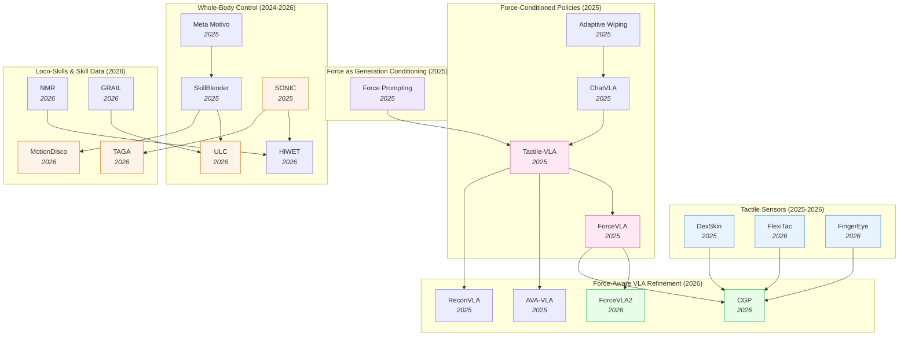

# Contact-Rich & Whole-Body Control — Deep Dive

> [!abstract] Overview
> Physical interaction — governed by forces, contact, balance, and compliance — is the axis this note unifies. A fingertip pressing a fragile object and a humanoid shifting its base under a 6 kg load are the *same problem at different scales*: both regulate contact wrenches the camera cannot see, and both fail when the policy treats force as an afterthought rather than a first-class signal. The note spans two halves of that axis. **Contact sensing & force-conditioned manipulation** (Parts A–C): tactile sensor hardware (capacitive skins, FPC pads, binocular vision-tactile fingertips), force-conditioned VLA architectures (force prompts, force-aware MoE, hybrid force-position control), force-as-generation-conditioning ([[2505.19386|Force Prompting]]), and contact-rich benchmarks. **Whole-body & locomotion control** (Part D): unified whole-body controllers, balance and load-aware adaptation, behavioral/motion-tracking foundation models, terrain-aware agile locomotion, motion retargeting, and generative skill data for humanoids. The recurring architectural insight holds at both scales — **force/contact must be a first-class modality with its own parameters** (dedicated experts for fingertip force, factorized load-context for whole-body balance), never naively concatenated. For the RL-*methods* underpinning the control side, see [[03_Imitation-Learning-and-RL#6. RL for Locomotion, Navigation & Whole-Body Control]]; this note covers the contact-dynamics *substrate*.

## Evolution Graph

Two threads on one contact-dynamics axis: the *fingertip* thread (bolt-on force sensors → force-aware MoE VLAs) and the *whole-body* thread (task-specific gait controllers → motion-tracking foundation models for humanoid loco-manipulation), both converging on force/contact as a first-class signal.

**The fingertip thread** evolved through three overlapping phases. **Phase 1 — Force as auxiliary signal** (early 2025): [[2505.06451|Adaptive Wiping]] and [[2502.14420|ChatVLA]] used force feedback as a closed-loop sensor reading, treated as one input among many. **Phase 2 — Force as first-class modality** (mid 2025): [[2507.09160|Tactile-VLA]] and [[2505.22159|ForceVLA]] elevated force/torque to a primary modality with dedicated experts and force-aware MoE routing — these are the cluster's two landmark papers. **Phase 3 — Hybrid force-position control and contact grounding** (2026): [[2603.15169|ForceVLA2]] introduces cross-scale MoE with force prompts at the VLM level; [[2603.05687|CGP]] grounds policies in predicted multi-point contact trajectories; [[2604.28156|FlexiTac]] and [[2604.20689|FingerEye]] attack the hardware bottleneck with sub-$30 conformable skins and binocular vision-tactile fingertips.

**The whole-body thread** runs in parallel (Part D). Unsupervised behavioral foundation models ([[2504.11054|Meta Motivo]]) and skill-blending hierarchies ([[2506.09366|SkillBlender]]) established that a *single* policy could absorb many whole-body tasks; unified fine-grained controllers ([[2507.06905|ULC]]) and world-frame end-effector tracking ([[2602.06341|HiWET]]) then sharpened precision under the locomotion–manipulation coupling. By 2026 the thread mirrors the fingertip lesson exactly: massive motion-tracking pretraining ([[2511.07820|SONIC]], **100M** frames) plays the role tactile-SSL played for touch, factorized load-context ([[2606.03297|SplitAdapter]]) plays the role of phase-aware force experts, and generative skill data ([[2606.05160|GRAIL]], [[2605.27724|HumanoidMimicGen]]) attacks the same data-scarcity bottleneck that throttles force-instrumented manipulation.

| Year | Paper | Track | Contribution |
|------|-------|-------|--------------|
| 2024 | [[2410.24090\|Sparsh]] | Touch foundation model | First SSL touch representations across [[2111.06377\|MAE]]/[[2104.14294\|DINO]]/JEPA; **460k** unlabeled tactile images + TacBench |
| 2025 | [[2502.14420\|ChatVLA]] | Force-conditioned policy | Unified VLM with MoE: control-expert + understanding-expert (foundation for later force-MoEs) |
| 2025 | [[2505.06451\|Adaptive Wiping]] | Contact-rich benchmark | Few-shot IL + F/T feedback + VAE object representation; 100% contact, 96% reference force |
| 2025 | [[2505.19386\|Force Prompting]] | Force as generation conditioning | First to use physics-based force signals (pokes, wind) as video-generation control |
| 2025 | [[2505.22159\|ForceVLA]] | Force-conditioned VLA | Force-aware MoE (FVLMoE) treats 6-axis F/T as first-class modality; +23.2% over [[2410.24164\|π0]] |
| 2025 | [[2506.14754\|Sparsh-X]] | Touch foundation model | Multisensory (image+audio+motion+pressure) SSL on **~1M** contacts; **+500%** plug insertion |
| 2025 | [[2507.09160\|Tactile-VLA]] | Force-conditioned VLA | Force-aware action expert + hybrid position-force controller + CoT failure recovery |
| 2025 | [[2508.10333\|ReconVLA]] | Refinement (sensor-precursor) | Reconstructive gaze-region pretraining; precursor for visuotactile grounding |
| 2025 | [[2508.19236\|MemoryVLA]] | Refinement (memory) | Dual-memory PCMB; supports tactile-history accumulation over long horizons |
| 2025 | [[2509.18830\|DexSkin]] | Tactile sensor | Conformable capacitive skin, 294° coverage, $10/pair, 19/20 perturbed reorient |
| 2025 | [[2510.13324\|FARM]] | Force-conditioned policy | Tactile-conditioned diffusion policy predicting pose+grip+force; **100%** dynamic screw-tightening |
| 2025 | [[2511.18960\|AVA-VLA]] | Refinement (attention) | POMDP + recurrent state + active visual attention — applicable to force history |
| 2026 | [[2603.15257\|HapticVLA]] | Force-conditioned VLA | Tactile distillation enables force-aware VLA **without** inference-time tactile sensors |
| 2026 | [[2603.12665\|TacVLA]] | Force-conditioned VLA | Contact-aware gating: tactile tokens only activated during contact phases |
| 2026 | [[2603.05687\|CGP]] | Visuotactile policy | Contact-grounded policy: diffusion over coupled state+tactile trajectories |
| 2026 | [[2603.15169\|ForceVLA2]] | Force-conditioned VLA | Cross-Scale MoE + force prompts; 66% avg SR, **+48pp** over [[2410.24164\|π0]] |
| 2026 | [[2602.23648\|FAVLA]] | Force-conditioned VLA | Fast-slow VLA: slow VLM + force-injected fast action expert with adaptive frequency |
| 2026 | [[2601.20321\|TaF-VLA]] | Tactile-force alignment | **10M** synchronized tactile-force pairs + VQ-VAE force latent; **64.8%** avg SR |
| 2026 | [[2604.20689\|FingerEye]] | Tactile sensor | Continuous vision→tactile binocular fingertip; +30% over wrist-only baselines |
| 2026 | [[2604.28156\|FlexiTac]] | Tactile sensor | $30 FPC piezoresistive plug-in skin; 8×16 to 32×32 layouts at 100Hz |
| 2024 | [[2408.00342\|MuJoCo MPC HumanoidBench]] | Whole-body control | Dense-cost MPC beats SOTA RL on HumanoidBench; surfaces long-horizon balance instabilities |
| 2025 | [[2504.11054\|Meta Motivo]] | Whole-body control | Behavioral foundation model; ==FB-CPR== unsupervised RL → zero-shot human-like whole-body control |
| 2025 | [[2506.09366\|SkillBlender]] | Whole-body control | Hierarchical RL blends frozen primitives via per-joint softmax weights; **8** loco-manip tasks |
| 2025 | [[2511.07820\|SONIC]] | Whole-body control | Supersized motion tracking (**100M** frames, **32k** GPU-hr); **99.6%** OOD-motion tracking |
| 2026 | [[2507.06905\|ULC]] | Whole-body control | Single unified policy: locomotion + 3-DoF torso + dual-arm; widest operational workspace |
| 2026 | [[2602.06341\|HiWET]] | Whole-body control | Hierarchical world-frame EE tracking; **12.4 mm** sim error compensating base disturbance |
| 2026 | [[2606.03297\|SplitAdapter]] | Balance / load-aware | Factorized load + dynamics contexts; **26/27** real tasks under OOD loads vs **16/27** base |
| 2026 | [[2606.05880\|TAGA]] | Agile locomotion | Emergent active gaze; **120 cm** gap (**+50%** over prior perceptive humanoids) |
| 2026 | [[2603.22201\|NMR]] | Motion retargeting | Transformer neural retargeting; zero joint jumps, **54%** fewer self-collisions |
| 2026 | [[2606.05160\|GRAIL]] | Skill data | 4D HOI from 3D assets + video priors; **20K+** sequences → **90%** real stair-climbing |

> [!tip] Three Phases, One Architectural Convergence
> Across all three phases, the field converged on the same architectural pattern: **force gets its own encoder, its own attention path, and its own gated expert** — never naive concatenation with visual tokens. From [[2507.09160|Tactile-VLA]]'s force-aware action expert to [[2505.22159|ForceVLA]]'s FVLMoE to [[2603.15169|ForceVLA2]]'s Cross-Scale MoE, the consistent finding is that contact dynamics require dedicated parameters that activate phase-aware (free-space vs in-contact). See [[05_VLA#7. Multi-Sensor & Force-Aware VLAs]] for how this fits the broader VLA design space.

---

## Part A — Foundations & Sensing

*The design space (where force enters, what sensors deliver what) and the tactile sensors themselves as a sensing modality.*

### 1. Design-Space Principles

> [!info] Survey Anchor
> [[2504.03515|Dexterous IL Survey]] (2025) is the standing reference for the broader landscape this note carves out: it systematically reviews Behavioral Cloning, IRL, GAIL, Hierarchical IL, and Continual IL applied to dexterous manipulation; surveys end-effector hardware (simple grippers → multi-fingered anthropomorphic hands) and emphasises tactile sensing as a critical modality; details teleoperation systems and learning-from-video data acquisition; and catalogues the persistent open problems (data sparsity, generalization gaps, sim-to-real, real-time control, safety). When the present note discusses where force/tactile enters a *contact-rich VLA*, the survey covers the parallel question of how IL methods *more broadly* incorporate the same sensing modality.

Every force-aware/tactile policy commits to three orthogonal choices — *what sensor*, *where the force signal enters the model*, and *how the model is pretrained*. The interesting work in the cluster lives at the intersection of these axes; the axes themselves are *almost* independent (e.g. you can pair any sensor with any entry point), but specific combinations win specific contact regimes. The sub-sections below treat each axis as a separate decision dimension.

#### 1.1 Sensor Modality — What Force Signal You Can Even Measure

==The upstream choice that bounds everything downstream.== Sensors range from coarse aggregated F/T at the wrist (cheap, ubiquitous) to dense per-taxel skin (rich, hardware-bound). The richer the sensor, the higher the data-scale floor before a policy generalizes.

- **[[2505.06451|Adaptive Wiping]]**, **[[2505.22159|ForceVLA]]**, **[[2603.15169|ForceVLA2]]** — ==6-axis F/T at wrist==: aggregated force/torque vector, **$200–2k** off-the-shelf; coarse spatial info but immediately deployable.
- **[[2509.18830|DexSkin]]**, **[[2604.28156|FlexiTac]]** — ==high-coverage tactile skin==: dense contact pressure map across end-effector; **$10–30 DIY** to **thousands** for high-fidelity capacitive variants.
- **[[2604.20689|FingerEye]]** — ==vision-tactile fingertip==: continuous pre-contact vision + post-contact deformation in one sensor; mid-range cost (~$100s) but closes the contact-discontinuity gap.
- **[[2603.05687|CGP]]** — ==predicted tactile, no sensor==: diffusion-generated tactile trajectory translated to controller targets; compute-only, but adds long-horizon drift risk.

#### 1.2 Where Force Enters the Model — The Integration Axis

==The architectural choice that determines whether force is a first-class modality or a bolted-on side-channel.== The same F/T stream can be injected at the controller, the action head, the MoE gating, or the VLM prompt — and the field has converged on *late fusion above the visual backbone* as the canonical recipe.

- **[[2505.06451|Adaptive Wiping]]**, **[[2507.09160|Tactile-VLA]]**, **[[2510.13324|FARM]]** — ==at low-level controller==: hybrid position-force / admittance control regulates the policy's output; simplest and most data-efficient when reference force is known.
- **[[2507.09160|Tactile-VLA]]**, **[[2505.22159|ForceVLA]]**, **[[2602.23648|FAVLA]]** — ==at action head==: dedicated F/T encoder feeds a force-aware action expert; preserves pretrained VLM representations.
- **[[2505.22159|ForceVLA]]**, **[[2603.15169|ForceVLA2]]** — ==at MoE gating==: force-aware MoE / Cross-Scale MoE routes between phase-specialized experts (free-space vs in-contact).
- **[[2603.12665|TacVLA]]** — ==at contact-aware token gating==: tactile tokens activated *only* on contact onset; prevents free-space noise injection.
- **[[2601.20321|TaF-VLA]]** — ==at force-grounded latent==: tactile sequence aligned to force latent via VQ-VAE codebook; plug-and-play across sensors.
- **[[2603.15169|ForceVLA2]]** — ==at VLM (as prompt)==: force readings tokenized as linguistic prompts feeding the VLM for long-horizon force-aware planning.
- **[[2603.15257|HapticVLA]]** — ==as predicted/distilled signal==: tactile token predicted from vision/state — no sensor needed at inference.
- **[[2505.19386|Force Prompting]]** — ==at video backbone==: force conditioning of video generator at the pre-action stage; force-aware *world modeling* rather than control.

#### 1.3 Pretraining Strategy — Where Generalization Comes From

==The data-axis choice that determines whether a contact policy survives task variation.== Options run from per-task from-scratch (sample-efficient, brittle) to SSL touch foundation models pretrained on **460k–1M** unlabeled contacts (data-hungry, transferable).

- **[[2505.06451|Adaptive Wiping]]** — ==from-scratch on contact demos==: sample-efficient per task; brittle across tasks.
- **[[2505.06451|Adaptive Wiping]] (VAE)**, **[[2603.05687|CGP]] (KL-VAE)** — ==unsupervised tactile encoder pretrain==: VAE/contrastive on exploratory contact; reusable representation within a task family.
- **[[2410.24090|Sparsh]]**, **[[2506.14754|Sparsh-X]]** — ==SSL touch foundation model==: frozen/finetuned encoder reusable across tasks via [[2111.06377|MAE]] / [[2104.14294|DINO]] / JEPA over **460k–1M** unlabeled contacts.
- **[[2507.09160|Tactile-VLA]]**, **[[2505.22159|ForceVLA]]**, **[[2603.15169|ForceVLA2]]**, **[[2602.23648|FAVLA]]**, **[[2603.12665|TacVLA]]** — ==VLA fine-tune with force expert==: inherits VLM generalization + adds force capacity via dedicated parameters.
- **[[2601.20321|TaF-VLA]]** — ==force-grounded latent alignment==: VQ-VAE binds tactile streams to a force codebook; plug-and-play across sensors and student backbones.
- **[[2603.15257|HapticVLA]]** — ==sensor-free distillation==: teacher uses tactile sensors during training, student distills to inference without them.
- **[[2505.19386|Force Prompting]]** — ==force-conditioned video pretraining==: latent physical understanding from video; transfers to control via downstream action head.

**Design-Space — Decision Matrix**

| Need | Recommendation |
|---|---|
| Known reference force, single contact-rich task (wiping, polishing, insertion) | Closed-loop admittance at controller — [[2505.06451\|Adaptive Wiping]] |
| Multi-stage task with free-space → contact transitions | Force-aware MoE — [[2505.22159\|ForceVLA]], [[2603.15169\|ForceVLA2]] |
| Dense per-taxel contact info (in-hand reorient, fragile grasp) | Hardware first — [[2509.18830\|DexSkin]], [[2604.28156\|FlexiTac]] before policy architecture |
| Continuous pre→post-contact perception (alignment, insertion approach) | Vision-tactile fingertip — [[2604.20689\|FingerEye]] |
| Reusable tactile encoder across tasks | SSL touch foundation — [[2410.24090\|Sparsh]] / [[2506.14754\|Sparsh-X]] |
| Inference-time deployment without tactile sensor | Sensor-free distillation — [[2603.15257\|HapticVLA]] |
| Cross-sensor portability for tactile signal | Force-grounded latent — [[2601.20321\|TaF-VLA]] |
| Bootstrap physical priors from video pretraining | Force-conditioned video generator — [[2505.19386\|Force Prompting]] |

> [!star] Key Design-Space Papers
> - [[2603.15169|ForceVLA2]] — The only architecture to integrate force at *all three* axis-2 entry points simultaneously (controller + MoE + VLM prompt); demonstrates the cluster's architectural ceiling at **66%** avg SR, **+48pp** over [[2410.24164|π0]]
> - [[2505.22159|ForceVLA]] — The canonical late-fusion design — the field's most-copied template for treating F/T as a first-class modality through a dedicated expert and phase-aware gating
> - [[2410.24090|Sparsh]] — The cluster's pretraining-axis founder; **460k** unlabeled tactile images + ==TacBench== established that the touch analog of [[2304.07193|DINOv2]] beats end-to-end training by **~95.1%** average

> [!tip] Picking by Constraint
> If your task has a known reference force (wiping, polishing, insertion with known tolerance), use **closed-loop admittance over the action head** ([[2505.06451|Adaptive Wiping]]) — simplest and most data-efficient. If the task is multi-stage with free-space → contact transitions, use a **force-aware MoE** ([[2505.22159|ForceVLA]], [[2603.15169|ForceVLA2]]) so the gating switches experts at contact onset. If the task requires dense per-taxel contact info (in-hand reorientation, fragile grasping), the bottleneck is **sensor hardware** ([[2509.18830|DexSkin]], [[2604.28156|FlexiTac]]) before the policy architecture matters. See [[05_VLA#7. Multi-Sensor & Force-Aware VLAs]] for how the multi-modal entry-point taxonomy fits the broader VLA design space, and [[14_Sim-to-Real-Transfer#3. Policy-Side: Robustness & Domain Randomization]] for sensor-side calibration needed before any of these axes generalize.

---

### 2. Tactile Sensors as a Sensing Modality

Hardware is the upstream bottleneck. Until 2025, dense tactile sensing meant expensive GelSight-style optical sensors (slow, bulky, single-fingertip) or hand-rolled piezoresistive arrays (brittle, inconsistent). Three sensor papers attack this bottleneck on different fronts — high-coverage skin, affordable open-source FPC, and continuous vision-tactile.

- **[[2509.18830|DexSkin]]** — A ==Conformable capacitive skin== on a parallel-plate grid delivering **294° coverage** across 60 taxels at **1.7 kPa** sensitivity, **6.52%** hysteresis, **2.09%** drift/500 cycles; ==Pneumatic calibration== lifts cross-instance transfer **5/20 → 14/20** SR; **19/20** perturbed pen reorient (baselines **0/20**), **90%** berry pressure cut via residual RL.
- **[[2604.28156|FlexiTac]]** — An ==open-source plug-in tactile platform== pairing thin ==FPC piezoresistive sensor pads== with an Arduino Nano + multiplexer readout at **100 Hz**, layouts **8×16 to 32×32**; ==direct electrode integration== lifts manufacturing throughput, and visuo-tactile fusion + sim-to-real fine-tune enable nut-and-bolt assembly; **~$30/unit**.
- **[[2604.20689|FingerEye]]** — A ==Continuous vision-tactile fingertip== (28×25.4×26 mm) with ==binocular RGB cameras==, compliant soft ring, AprilTag cover; PnP-tracked AprilTag pose proxies 6D wrench: force **[4.30, 4.22, 9.93] mN**, torque **[0.32, 0.13, 8.55] mN-m**; vision sees alignment *before* contact, tactile deformation *after*; **+30%** SR over wrist-camera-only.

**Tactile Sensors — Decision Matrix**

| Need | Recommendation |
|---|---|
| High-coverage skin for in-hand reorientation / fragile grasping | [[2509.18830\|DexSkin]] — capacitive grid, **294° coverage**, pneumatic calibration required for cross-instance transfer |
| Open-source, budget-friendly piezoresistive pad with sim-to-real path | [[2604.28156\|FlexiTac]] — **$30/unit** FPC + Kelvin-Voigt calibration; lowest barrier for community adoption |
| Continuous pre→post-contact sensing for alignment-then-contact tasks | [[2604.20689\|FingerEye]] — binocular vision-tactile fingertip; **+30%** SR over wrist-cam-only |
| Frozen tactile encoder for label-scarce downstream tasks (unimodal) | [[2410.24090\|Sparsh]] — SSL on **460k** tactile images; latent-SSL beats pixel reconstruction; ships with TacBench |
| Multisensory tactile fusion (image + audio + IMU + pressure) | [[2506.14754\|Sparsh-X]] — attention-bottleneck fusion at **~1M** contacts; **+500%** plug-insertion vs vision-only |
| Coarse aggregated F/T only (wrist-mounted) — sensor secondary | Pair with [[2505.22159\|ForceVLA]]-style policy compensation; sensor sets the eventual ceiling |

#### 2.1 Touch Foundation Models — SSL Representations on Tactile Streams

A parallel thread to better sensors: learn ==general-purpose tactile representations== via SSL on large unlabeled tactile data, then reuse the frozen encoder downstream. The touch analog of [[2304.07193|DINOv2]] — and the same lesson holds: pretrained frozen encoder beats end-to-end task-specific training by a wide margin once labels are scarce.

- **[[2410.24090|Sparsh]]** — A ==self-supervised touch encoder== that pretrains ViTs on **~460k** unlabeled tactile images across vision-based sensors under ==[[2111.06377|MAE]]==, ==[[2104.14294|DINO]]/[[2304.07193|DINOv2]]==, and ==JEPA==, introducing ==TacBench== (6 tasks); beats end-to-end by **~95.1%** avg, latent-SSL beats pixel reconstruction, **+20–53%** bead-maze traversal.
- **[[2506.14754|Sparsh-X]]** — A multisensory touch encoder jointly encoding **4 tactile modalities** (image + audio + IMU + pressure) from Digit 360 via ==attention bottlenecks==; **~1M** unlabeled contacts, teacher-student SSL; **+17%** physical-property estimation, **+500%** plug-insertion (to **90%**) vs vision-only, **+63%** vs tactile-image-only, **90%** in-hand rotation drift cut.
- **[[2505.18361|Tactile CRNN]]** — A ==task-optimized convolutional recurrent network== (from an ==Encoder-Attender-Decoder== sweep) that aligns with rodent ==somatosensory cortex==, *saturating* explainable neural variance and beating feedforward / state-space encoders; ==contrastive SSL== (SimCLR) matches top supervised models — evidence that *recurrence* is the right touch bias.

#### 2.2 Cross-Sensor Tactile Representation Transfer

The sensor-fragmentation problem: every tactile sensor (GelSight, DIGIT, uSkin, PapillArray) speaks a different signal format, so a policy or encoder trained on one rarely transfers to another. This thread learns a *sensor-invariant* tactile representation — via shared latents, marker-image canonicalization, contrastive cross-sensor pairing, or generative signal translation — so touch knowledge amortizes across the hardware zoo rather than re-collecting per sensor.

- **[[2606.13102|FTP-1]]** — A ==generalist foundation tactile policy== integrating language, RGB, proprioception, and diverse tactile sensors into one action space via a ==Morphology-Aware Tactile Token Space== with sensor-specific encoders and a 300M-param ==tactile expert== pretrained on a **3,000-hr** corpus; **+17.2%** SR on seen sensors, **+31.6%** on unseen sensor setups.
- **[[2506.19699|UniTac-NV]]** — A ==cross-sensor tactile autoencoder== with per-sensor encoders feeding a ==single shared decoder==, trained on ==sample-matched== paired contacts with self- and cross-reconstruction losses into a **16-D** latent; SSIM **>0.95** seen-object reconstruction, **0.353–0.397 mm** self-latent geometry error rising to **~0.6 mm** cross-sensor.
- **[[2502.19638|SITR]]** — A ==sensor-invariant tactile representation== transformer combining tactile images with sensor-specific calibration images, pretrained on **1M** physics-rendered examples (100 sensor configs) under normal-map reconstruction + geometry-contrastive losses; **81.94%** inter-sensor classification (**+33pp** over ViT), **0.80 mm** pose RMSE (~50% lower).
- **[[2502.12191|AnyTouch]]** — A ==unified static-dynamic tactile representation== over the multi-sensor ==TacQuad== dataset, combining masked-modeling pixel detail with multi-modal alignment + cross-sensor matching, and a ==universal sensor token== for unseen-sensor generalization; SOTA on material/hardness/grasp prediction and lowest fine-grained pouring error.
- **[[2410.11834|CTTP]]** — A ==contrastive touch-to-touch pretraining== framework using ==InfoNCE== to pull together tactile signals from different sensors viewing the same interaction, on a ResNet-50 encoder over paired GelSlim/Soft-Bubble data; near-random baselines beaten on cross-sensor classification, **±5°** pose error (vs ±18–38°), **18/30** real peg insertions.
- **[[2406.13640|T3]]** — A ==Transferable Tactile Transformer== (T3) with sensor-specific ViT encoders, a shared trunk, and task decoders, pretrained MAE-then-distilled on ==FoTa== (**3M+** images, 13 sensors, 11 tasks); **+24%** median classification over scratch, near-optimal pose from **2,000** points, **+25%** sub-mm insertion SR over tactile baselines.
- **[[2503.01058|GenForce]]** — A ==cross-sensor force generation== method canonicalizing raw tactile into ==marker images==, performing ==Marker-to-Marker diffusion== translation across sensors, then training a spatiotemporal force predictor with material-hardness compensation; **~100×** lower FID, **<0.92 N** normal / **<0.3 N** shear MAE across heterogeneous sensors, damage-free grasping.

> [!star] Key Papers
> - [[2509.18830|DexSkin]] — High-coverage conformable capacitive skin; the **pneumatic calibration → policy transfer** insight (5/20 → 14/20 cross-instance) is the deployment breakthrough beyond single-instance demos
> - [[2604.28156|FlexiTac]] — $30 open-source FPC piezoresistive skin with a documented Kelvin-Voigt sim-to-real path; the hardware bottleneck-breaker for the community
> - [[2604.20689|FingerEye]] — Binocular vision-tactile fingertip with continuous pre→post-contact sensing; closes the contact-discontinuity gap (**+30%** SR)
> - [[2410.24090|Sparsh]] — Foundational SSL touch encoder across [[2111.06377|MAE]]/[[2104.14294|DINO]]/JEPA on **460k** tactile images; introduces ==TacBench==; established latent-space SSL beats pixel reconstruction for touch
> - [[2506.14754|Sparsh-X]] — Multisensory touch foundation model (image + audio + IMU + pressure) at **~1M** contacts; **+500%** plug insertion over vision-only — the multimodal extension of [[2410.24090|Sparsh]]

> [!tip] Sensor Bottleneck vs Policy Bottleneck — and Why You Should Pretrain the Encoder
> The binding bottleneck dictates the fix: tasks failing at *contact onset* (alignment, insertion approach) need **continuous vision-tactile** ([[2604.20689|FingerEye]]); tasks failing during *sustained contact* (perturbed reorientation, fragile grasping) need **high-coverage skin** ([[2509.18830|DexSkin]]); tasks limited by *coarse aggregated F/T* can be compensated in policy ([[2505.22159|ForceVLA]]) but the sensor sets the ceiling. Whatever the sensor, the *encoder* should be pretrained: the [[2410.24090|Sparsh]]/[[2506.14754|Sparsh-X]] result is the touch analog of the [[2304.07193|DINOv2]] lesson — a frozen SSL tactile encoder amortizes labeling cost across the whole downstream task family, and JEPA-style objectives generalize from RGB to tactile and from unimodal to multisensory. Most VLAs in §3 still train tactile encoders from scratch per task — an obvious upgrade path. Cross-reference [[08_Latent-World-Models#3. Broader Latent Prediction Landscape]] for the latent-prediction lineage this reuses and [[02_Dataset-Benchmark-Environment#6. Tactile & Contact-Rich Benchmarks]] for the evaluation side.

---

## Part B — Force-Conditioned Policy Architectures

*How force gets injected into VLAs (Tactile-VLA, ForceVLA, TaF-VLA) and how it conditions generation models.*

### 3. Force-Conditioned VLA Architectures

The core of the cluster. Force-aware VLAs cluster along *where* force enters the network — the action head, an MoE gating module, a latent-aligned adapter, a refinement layer that handles the human/recovery loop, or upstream as video-generation conditioning. The sub-sections below treat each entry-point as a distinct architectural axis, with the bullet-per-paper detail showing how multiple groups have explored the same axis with different design choices.

#### 3.1 Force-Aware Action Heads

The most direct integration: force enters at the action expert (or its controller), giving the policy a hybrid position-force output space. These papers preserve the pretrained VLM backbone and add force capacity through dedicated parameters at the action stage.

- **[[2606.12406|FACTR 2]]** — A ==sensorless external force-sensing== method for commodity arms where ==NEXT== learns free-space inverse dynamics to estimate external joint torques as a residual, and ==FIRST== behavior cloning up-samples pre-contact/contact phases; **0.547 Nm** L1 torque error (**87.6%** below FILIC), highest avg task progress across **5** long-horizon contact-rich tasks.
- **[[2606.11743|TacCoRL]]** — A ==sim-to-real tactile-into-VLA== method augmenting a pretrained VLA with a ==dual-path tactile fusion== + ==contact-aware gate==, warm-started by sim-real co-training then refined via ==RL post-training== on simulated near-failure states; sim SR **40.5% → 78.5%**, real-world **50.0% → 72.5%** across **4** bimanual contact-rich tasks.
- **[[2605.07308|AT-VLA]]** — An ==Adaptive Tactile Injection== VLA adding tactile feedback while *preserving pretrained knowledge* (**+17%**), plus a ==Tactile Reaction Dual-Stream== for real-time contact response (**+11%**); beats SOTA VLA + tactile baselines on contact-rich tasks (Unzip Bag, Stamp, Wipe Vase) yet stays robust — reliable even when tactile input is *absent* at inference.
- **[[2604.13015|Touch Dreaming]]** — A ==Humanoid Transformer with Touch Dreaming (HTD)== policy paired with an ==RL teacher-student lower-body controller==, whose ==touch dreaming== objective predicts future hand forces and tactile latents for contact-aware representations; **+30.0pp** avg SR over ACT across **5** real contact-rich tasks, **+30%** relative gain from latent tactile supervision.
- **[[2604.01414|Adaptive Vision-Torque Fusion]]** — An ==adaptive vision-torque diffusion policy== whose ==Contact Gating== injects joint-torque features only on detected contact (a learnable token in free space), fused via a ==CFG-style== dual-U-Net blend with a learned torque-guidance scale; **82.0%** avg SR (**+14%**), torque gating alone lifting **30% → 68%**.
- **[[2603.08342|PhaForce]]** — A ==slow-fast visual-force policy== coordinating chunk-level diffusion planning with high-rate residual correction under a ==Contact-Aware Phase Predictor==, where ==Orthogonal Residual Injection== preserves vision semantics and a fast corrector applies phase-routed force adjustments; **86%** avg SR (**+40pp** over diffusion), **85%** OOD raised-board wiping.
- **[[2602.13689|Symmetry-Aware VT Fusion]]** — A ==Cross-Modal Transformer== fusing global vision with local tactile via hierarchical self-attention + cross-attention, regularized by a physics-informed ==bilateral force-symmetry== loss and processing tactile as ==residual forces== off a pre-insertion reference; **96.59%** insertion SR (vs 93.23% vision-only, 92.97% naive fusion), at **153 fps**.
- **[[2602.10013|Force-Regulated Manipulation]]** — A ==tactile-force-controlled gripper== ($150, 0.45–45 N) with direct force-teleoperation data plus ==RETAF==, decoupling a low-frequency base policy from a high-frequency (**80 Hz+**) force-adaptation policy; **68%** avg stable-grasp (vs 38% diffusion), **60%** task SR, lifting a VLA base's tomato-pick grasp **30% → 90%**.
- **[[2602.02142|FD-VLA]]** — A ==Force-Distilled VLA== predicting a latent force token from vision + proprioception (L2-supervised by raw force, **no inference-time sensor**) and fusing it through ==directional attention masking== that preserves VLM priors; **61.1%** mean SR over 3 contact-rich tasks vs **23.3%** SmolVLA and **38.9%** with raw force, the FDM lifting **38.9% → 61.1%**.
- **[[2505.09577|VTLA]]** — A ==Vision-Tactile-Language-Action== model for insertion built on ==Qwen2-VL== with ==Vision-Guided Temporally Enhanced (VGTE) tokens== for temporal tactile and ==Direct Preference Optimization== bridging language modeling to continuous control; **>90%** SR on unseen peg shapes in sim, beating IL + multimodal baselines, transferring to a real UR3 from sim-only.
- **[[2507.09160|Tactile-VLA]]** — A ==Multi-modal transformer== fusing vision + language + ==tactile== on a ==pre-trained VLM backbone==, with a ==force-aware action expert== outputting position *and* force under a ==hybrid position-force controller==; CoT recovery adjusts force **3.5N → 6.7N**: **90%** Charger, **90%** OOD fragile paper-box, **80%** zero-shot wiping.
- **[[2602.23648|FAVLA]]** — A ==Fast-slow VLA==: slow VLM + high-frequency ==Force-Injected Action Expert== with force adapters across transformer layers, where a VLM-predicted ==force variance head== raises execution frequency during contact; **80.8%** avg SR (**+38pp** over vision-only, **+13.8pp** over the strongest force-aware baseline); peak contact force to **7.7N** on Gear Assembly.
- **[[2510.13324|FARM]]** — A ==Diffusion policy== with explicit force action predicting robot pose, grip width, *and* target grip force, conditioned on tactile force distributions; a dual-mode controller switches position-control in free space and closed-loop force-control during contact; **100%** success on dynamic screw-tightening and superior human-demonstration force matching.
- **[[2603.15257|HapticVLA]]** — A ==Sensor-free deployment== method via ==Safety-Aware Reward-Weighted Flow Matching==: a tactile-equipped teacher distills into a student predicting a compact tactile token from vision+state at inference — **no tactile sensor needed**; **86.7%** mean SR on fragile-object pick-and-place, **+45pp** on egg manipulation over [[2506.01844|SmolVLA]].
- **[[2603.12665|TacVLA]]** — A ==Contact-aware token gating== VLA where tactile tokens activate *only* on contact onset, preventing free-space noise injection, and a lightweight MLP tactile encoder keeps the architecture compact; **83.75%** avg SR on disassembly, **>60%** SR under severe visual occlusion (vs ~30% for vision-only).

#### 3.2 Force-Aware Mixture-of-Experts

Force-aware MoE goes beyond a single force-aware action head: a learned gating module routes between phase-specialized experts (free-space vs in-contact), so the network *switches* parameters as the task transitions. This is the field's core architectural recipe for multi-stage contact-rich tasks.

- **[[2603.15169|ForceVLA2]]** — The current SOTA force-aware VLA pushing force up to the VLM via ==force-based prompts== and down to a ==Cross-Scale MoE== fusing VLM guidance with real-time F/T for ==hybrid force-position regulation==; **66%** avg SR over 5 tasks (**+48pp** over [[2410.24164|π0]], **+31pp** over [[2505.22159|ForceVLA]]); MoE alone **+26%**.
- **[[2505.22159|ForceVLA]]** — A canonical late-fusion VLA whose ==Force-aware MoE (FVLMoE)== routes 6-axis F/T into separate experts, gating learning force-vs-visual reliance; **60.5%** avg SR (vs **37.3%** [[2410.24164|π0]]+force), **90%** under occlusion, **20%** socket insertion; full FVLMoE **80%** vs **60%** concat. Ships **ForceVLA-Data** (**244** trajectories).

#### 3.3 Force-Grounded Tactile Alignment

A distinct architectural slot: rather than aligning tactile signals to *visual* embeddings (treating touch as visual texture), these papers ground tactile observations directly in *physical interaction forces* via a learned latent space. The result is a plug-and-play adapter that ports across tactile sensors and downstream policies.

- **[[2606.11767|Blind Dexterous Grasping]]** — A ==tactile-only Real2Sim2Real== grasping policy with no vision or pose, where a ==Real2Sim== binary-contact calibration aligns onset/offset timing and a ==privileged-supervised layout-aware tactile encoder== feeds an expert-to-==Diffusion Policy==; **27%** real SR over **20** objects on LEAP Hand; pretraining lifts sim seen **36.2% → 60.4%**.
- **[[2603.04531|PTLD]]** — A ==Privileged tactile latent distillation== method for sim-to-real: an ==Asymmetric Actor-Critic== trains a ==privileged-sensor policy== (external-camera pose) in *one* sim stage, then a ==tactile encoder== matches real tactile + proprioception via ==DAgger==; **+182%** in-hand rotation, **+57%** reorient goals, ~**50%** lower 6D pose error (**0.43 → 0.21** rad).
- **[[2602.13579|TactAlign]]** — A ==human-to-robot tactile alignment== method self-supervising modality-specific human/robot touch encoders, mining noisy ==pseudo-pairs== from unpaired demos via pose + binary-contact filtering, then aligning via ==rectified flow==; **72–76%** SR on pivoting/insertion/lid-closing, **100%** zero-shot light-bulb screwing, **93–99%** lower cross-sensor force error.
- **[[2602.01153|UniForce]]** — A ==unified latent force model== whose ==CVAE== learns inverse dynamics (tactile→latent force) + forward reconstruction, supervised label-free by ==quasi-static force equilibrium== during bilateral grasps over a ==unified marker-image== canonicalization + causal transformer; **r = −0.74** latent–normal-force, SOTA zero-shot cross-sensor, VLA wiping **20% → 80%**.
- **[[2601.20321|TaF-VLA]]** — A force-grounded tactile adapter: TaF-Device collects a **>10M**-pair tactile-force corpus, a ==TaF-Adapter== aligns tactile to force via ==VQ-VAE== + ==temporal encoding==, frozen and plugging into any VLA; **64.8%** avg SR (vs **37.1%** vision-only, **42.8%** tactile-vision-aligned), **60.3%** zero-shot on unseen sensors, **+6.7–33.3%** on ACT/Diffusion Policy.
- **[[2605.14571|MTNet]]** — A ==dual-stream visuo-tactile alignment network== that projects vision and touch into a ==unified latent== under cross-modal constraints, predicting contact location and force from RGB; CKA **~0.74** between modalities; ==AMTNet== extends to *human* hands *without human tactile ground truth* — structural supervision, not pressure regression.
- **[[2503.08548|TLA]]** — A ==Tactile-Language-Action model== that integrates ==sequential tactile-image streams== with NL via ==Qwen2-VL== + ==LoRA== on **24,000** peg-in-hole tactile-action pairs; **>85%** SR on unseen clearances (**0.3–1.2mm**) and peg geometries, **+50%** over the next baseline; cleanest tactile-grounded-language proof for high-precision assembly.

#### 3.4 Force-Aware Human-Intervention & Refinement Layers

A complementary architectural layer: rather than redesigning the action head, these papers wrap a VLA backbone with a refinement loop — human-in-the-loop intervention, recurrent belief state, reconstructive supervision, or phased curriculum — whose mechanism plugs cleanly into force-aware settings even when the original paper targets vision.

- **[[2606.09337|TORL-VLA]]** — A ==tactile-guided online-RL== refinement layer feeding ==tactile-derived wrench== into a ==MoE== wrench-aware VLA that emits action + future-wrench references, refined live by an RL module with an ==intervention-censored critic== removing credit-assignment bias; full-task SR **12/30 → 28/30**, beating TA-VLA and ForceVLA on a real latch-box.
- **[[2605.15157|HandITL]]** — An ==interventional correction== layer for a bimanual 56-DoF hand-arm VLA via VR controllers + data gloves, where ==relative hand retargeting== tracks configuration *changes* from the intervention onset and ==velocity-based shared arm control== smooths wrist residuals; **99.8%** gesture-jump cut on Bread Clip; on-policy intervention fine-tuning beats teleop.
- **[[2511.18960|AVA-VLA]]** — A ==POMDP reformulation== of VLA whose ==recurrent state== encodes belief over past observations + actions and drives an ==Active Visual Attention== module prioritizing task-relevant visual tokens; SOTA on LIBERO/CALVIN, best avg on **four** real Mobile ALOHA tasks. The recurrent state directly accommodates *force history*; "active force attention" is unbuilt.
- **[[2508.10333|ReconVLA]]** — A ==gaze-region reconstructive== VLA where a ==diffusion-transformer denoiser== on the visual tokens predicts noise on latent ==scene tokens== of the gaze region (==Grounding DINO==); **3.95** avg subtask length on CALVIN ABC→D, stack-block **59.3% → 79.5%**; the denoiser generalizes to contact regions — close to [[2603.05687|CGP]]'s denoiser.
- **[[2502.14420|ChatVLA]]** — A ==Phased Alignment Training== VLA (control first, then understanding) over ==Qwen2-VL-2B== with an MLP ==MoE== splitting a ==Control-Expert== from an ==Understanding-Expert==; recovers VQA (**71.2%** TextVQA, **9.2×** over ECoT) without sacrificing control across **25** tasks at **3.5×** fewer params; the MoE split parents [[2505.22159|ForceVLA]]'s FVLMoE.

#### 3.5 Force as Video-Generation Conditioning

A category-of-one frontier: rather than feeding force *into* a policy, force is used to *condition video generation*, then video predictions bootstrap downstream policies. This is force-aware *world modeling* rather than force-aware control — the entry-point lives upstream of the action stack entirely. Single-paper sub-section here because no other published work has attempted force-as-generation-conditioning; explicitly a frontier slot.

- **[[2505.19386|Force Prompting]]** — A force-conditioned video generator adapting ==CogVideoX== via [[2302.05543|ControlNet]] to accept ==physics-based force prompts== (wind + pokes), trained on **15–23k** synthetic Blender + [[2404.13026|PhysDreamer]] videos; emergent ==intuitive mass understanding==, beats text-only/trajectory baselines. *Open*: force-pretrain → action head unbuilt.

**Force-Conditioned Architectures — Decision Matrix**

| Need | Recommendation |
|---|---|
| Hybrid position-force action expert, simplest integration | [[2507.09160\|Tactile-VLA]] — force in augmented action space + hybrid controller |
| Adaptive execution frequency under contact | [[2602.23648\|FAVLA]] — fast-slow VLA with force-variance-triggered cadence |
| Force-aware diffusion with explicit force output | [[2510.13324\|FARM]] — predicts pose+grip+force; **100%** dynamic screw-tightening |
| Inference-time deployment *without* tactile sensor | [[2603.15257\|HapticVLA]] — flow-matching distillation; **86.7%** fragile-object SR |
| Gate tactile tokens *only* on contact onset | [[2603.12665\|TacVLA]] — contact-aware token gating; **83.75%** disassembly SR |
| Multi-stage task with free-space → contact transitions | [[2603.15169\|ForceVLA2]] (SOTA, **66%** SR) or [[2505.22159\|ForceVLA]] (canonical, **60.5%** SR) |
| Cross-sensor portability via force-grounded latent | [[2601.20321\|TaF-VLA]] — VQ-VAE on **10M** tactile-force pairs; **60.3%** zero-shot |
| Cross-domain (robot ↔ human) visuo-tactile alignment | [[2605.14571\|MTNet]] + AMTNet — CKA **~0.74**; vision-only human-touch response |
| Human-in-the-loop intervention + on-policy refinement | [[2605.15157\|HandITL]] — relative retargeting, **99.8%** gesture-jump reduction |
| Recurrent belief over force history | [[2511.18960\|AVA-VLA]] — POMDP recurrent state (force-specific variant pending) |
| Phased curriculum to avoid VLM forgetting under force fine-tuning | [[2502.14420\|ChatVLA]] — control-first, then understanding |
| Force-as-pretraining-signal for downstream policy | [[2505.19386\|Force Prompting]] — only force-conditioned video generator extant |

> [!star] Key Papers
> - [[2603.15169|ForceVLA2]] — Cross-Scale MoE + force prompts; current SOTA for force-aware VLA at **66%** avg SR, **+48pp** over [[2410.24164|π0]]
> - [[2505.22159|ForceVLA]] — Force-aware MoE; the foundational late-fusion-with-phase-aware-gating architecture; **+23.2%** over force-concat baselines
> - [[2507.09160|Tactile-VLA]] — Force in augmented action space + Chain-of-Thought failure recovery; **90%** Charger, **80%** zero-shot blackboard wiping via autonomous force adjustment
> - [[2601.20321|TaF-VLA]] — Force-grounded tactile alignment via VQ-VAE on **10M** tactile-force pairs; the cleanest demonstration that *grounding tactile in physical force* (not visual texture) is what unlocks VLA contact-rich performance; plug-and-play with **6.7-33.3%** gain on ACT/Diffusion Policy baselines
> - [[2502.14420|ChatVLA]] — Phased Alignment Training + control/understanding MoE; the architectural parent of force-aware MoE designs

> [!tip] Generation vs Control — The Unbuilt Pipeline
> [[2505.19386|Force Prompting]] answers *"what would happen if I applied this force?"*; [[2507.09160|Tactile-VLA]] and [[2505.22159|ForceVLA]] answer *"what force should I apply right now?"*. The two halves compose: pretrain on force-conditioned generation to absorb mass/dynamics priors, then attach a force-aware action head for control. No published work has executed this end-to-end yet. See [[11_Physics-Aware-Embodied-AI#3. Explicit Physics Losses for Video Generation]] for the broader physics-conditioned video-generation track and [[07_WAM#5. VLM-Integrated WAMs]] for the WAM augmentation patterns that would host the action head.

---

## Part C — Evaluation

*Contact-rich manipulation benchmarks — the downstream targets the force-conditioned policies of Part B race against.*

### 4. Contact-Rich Manipulation Benchmarks and Visuotactile Policies

The downstream targets of all this work. Contact-rich tasks — wiping, polishing, insertion, in-hand reorientation, fragile grasping, multi-finger jar opening — define the benchmarks the field is racing against. The papers below cluster along three contribution axes: ==vision-to-tactile prediction== from egocentric data (closes the tactile-supervision bottleneck), ==contact-grounded policies== built around generative tactile forecasts, and ==long-horizon memory== that turns single-contact policies into sustained-contact ones.

#### 4.1 Vision-to-Tactile Prediction — Closing the Supervision Bottleneck

==The pretraining-axis breakthrough for the benchmark frontier.== Contact-rich tasks have been data-starved because instrumented teleoperation rigs are expensive; predicting tactile from RGB unlocks egocentric-scale supervision.

- **[[2605.13083|TouchAnything]] (EgoTouch)** — A ==vision-to-tactile prediction== framework from egocentric video alone; **20 hr** multi-view ego + bimanual 3D hand pose + dense pressure maps from RGB; ==view dropout== cuts the ego-only penalty **−27.20% → −5.78%** Volumetric IoU (**+6.1%** over ego-only) — first bridge from egocentric VLA pretraining to *dense* tactile supervision.
- **[[2512.04884|Hoi!]]** — A large-scale ==force-grounded multimodal dataset== of articulated-object interaction (synced vision, pose, force, tactile) exposing how badly in-the-wild estimation degrades: Sparsh tactile-force RMSE jumps to **3.86–4.11 N** (from millinewtons), ForceSight visual-force to **2.23 N** (from **0.404 N**) — the reality-check for force prediction.

#### 4.2 Contact-Grounded Policies — Generative Tactile Forecasts as Policy Anchors

==The architectural answer to "how do you ground a contact-rich policy without an OXE-scale corpus".== Three complementary strategies: pretrained encoder + closed-loop F/T (sample-efficient), diffusion over coupled state+tactile (long-horizon), and MoE-with-curriculum (generalist coverage).

- **[[2510.14930|VT-Refine]]** — A ==real-to-sim-to-real bimanual assembly== policy pretraining a diffusion policy on limited real demos then ==RL-finetuning== in parallel sim, with a custom ==FlexiTac== sensor + GPU viscoelastic tactile sim and a ==unified point-cloud== fusing vision, tactile, proprioception; RL lifts real visuo-tactile SR **~40%** over vision-only, up to **0.98** sim SR.
- **[[2509.23075|In-Hand Articulated Tools]]** — A ==privileged-oracle-to-student== in-hand articulation policy trained with curriculum force-torque perturbations, then ==Cross-Attention Tactile Force Adaptation (CATFA)== fuses whole-hand tactile + motor torque with action intent online; **100%** SR across **5** articulated tools, **0.0 mm** clamp gap, lower pose deviation.
- **[[2506.15953|ViTacFormer]]** — A ==cross-modal visuo-tactile CVAE== on the ==ACT== architecture fusing high-res vision + tactile via ==cross-attention== with an ==autoregressive tactile prediction head== forecasting future contact, stabilized by ==two-phase curriculum==; **~50%** higher SR on short-horizon dexterous tasks, **80%** on an 11-stage hamburger task (**0.88** HNS).
- **[[2505.06451|Adaptive Wiping]]** — A ==VAE-pretrained-on-exploratory-F/T + few-shot IL + closed-loop F/T== policy for deformable-sponge wiping under unseen heights/stiffnesses; **100%** contact, **96%** reference force across 40 scenarios; vs **4%** open-loop IL and **42%** admittance baselines — the cleanest data-efficient contact-rich benchmark, bounded to tightly-scoped tasks.
- **[[2603.05687|CGP]]** — A ==Conditional diffusion over coupled state + tactile trajectories== policy: a ==KL-regularized VAE== compresses tactile, then a learned ==contact-consistency mapping== (needs *both* state + tactile) translates predictions into ==compliance-controller== targets; beats visuomotor + visuotactile diffusion on **5** tasks (jar opening, in-hand box flipping).
- **[[2502.14420|ChatVLA]]** — A ==MoE + Phased Alignment Training== *generalist* contact-rich baseline with strong results across **25** real-world tasks, showing that even general-purpose VLAs can absorb a substantial fraction of contact-rich tasks with the right training curriculum.
- **[[2603.19201|OmniVTA]]** — A ==hierarchical slow-fast visuo-tactile framework== stacking a ==TactileVAE==, a ==Visuo-Tactile World Model==, an ==Adaptive Fusion Policy==, and a **60 Hz** ==Reflexive Latent Tactile Controller (RLTC)==; trained on **OmniViTac** (**21,000+** trajectories, **86** tasks); SOTA on 6 real tasks; RLTC lifts SR to **60%** Wipe / **63%** Peel under perturbation.

#### 4.3 Long-Horizon Memory — Sustained-Contact Reasoning

==The temporal-axis missing piece for force-aware tasks.== Current force is meaningless without history ("am I still pressing, or did I just transition into free space?"). Memory architectures from broader VLA work plug in directly.

- **[[2508.19236|MemoryVLA]]** — A ==Perceptual-Cognitive Memory Bank (PCMB)== dual-memory VLA: low-level perceptual details (recent F/T, contact events) + high-level cognitive semantics (task progress); **+26pp** over [[2503.22020|CogACT]] on real-world long-horizon temporal tasks (**83%**) at only **+3.6%** latency, **+0.8 GB** GPU; not force-specialized, but maps cleanly onto force history.

#### 4.4 Tactile World Models — Forecasting Future Contact State

==The world-modeling answer to reactive contact policies.== Rather than acting on current tactile readings, these models *predict* future tactile/contact state in a compact latent — turning a reactive policy into an anticipatory one. Force precedes tactile change, so a force-conditioned forecast gives the policy a head-start on the contact transition.

- **[[2606.11184|TacForeSight]]** — A ==force-guided tactile world model== (TacForceWM) forecasting short-horizon tactile latents from high-frequency wrist ==force/torque== as a leading indicator (~**200 ms** lead), feeding a ==flow-matching== policy via cross-attention + tactile-guided gating; **79.0%** avg completion, **86.7%** under perturbation, MSE **0.017** at **20 Hz**.
- **[[2606.08737|Dream-Tac]]** — A ==unified tactile world action model== on a ==video Diffusion Transformer== jointly predicting future vision, tactile, and action, with ==Contact-Aware Self-Attention (CASA)== amplifying sparse tactile during contact plus FlashBias + step-caching for speed; **83.3%** avg SR over **6** tasks (**+31.6%** over Cosmos-Policy), **2.9×** train / **1.8×** inference.
- **[[2603.23481|VTAM]]** — A ==visuo-tactile world action model== projecting multi-view vision + tactile into a shared VAE latent under a ==multi-view diffusion== video transformer, with ==deformation-aware regularization== (a 3D virtual-force proxy from tactile optical flow) preventing modality collapse; **90/85/95%** SR on chip-pick / cucumber-peel / wipe, 0% without virtual-force reg.
- **[[2602.06001|VT-WM]]** — A multi-task ==Visuo-Tactile World Model== fusing pretrained ==Cosmos== vision + ==Sparsh-X== tactile encoders through a 12-layer autoregressive transformer predicting future visuo-tactile states; **~33%/29%** lower Fréchet distance (moving/static), **+35%** zero-shot planning SR, **77%** after 20-demo finetune.
- **[[2601.12796|Contact-Aware Neural Dynamics]]** — A ==two-stage neural dynamics model== first predicting future contacts with a ==contact predictor==, then object-pose trajectories with a ==diffusion pose predictor== conditioned on them, grounded in binary tactile signals + ==implicit sim-to-real alignment==; MSE **0.0082**, ADD-S **88.23%**, **73.7%/64.7%** single/multi-object SR.

#### 4.5 Dexterous & In-Hand Tactile Manipulation

Where the rest of §4 treats tabletop contact, this thread pushes touch into the *hand*: multi-finger reorientation, fragile grasping, and dexterous insertion where the fingertips, not the camera, carry the contact signal. The recurring move is to make tactile primary — vision-free or vision-secondary — and let force/contact feedback regulate grip and rotation, often distilled from a privileged-state sim teacher.

- **[[2606.17055|T-Rex]]** — A ==tactile-reactive dexterous manipulation== framework pairing a 100-hr tactile-synced bimanual dataset with a ==Mixture-of-Transformer-Experts== splitting low-frequency visuomotor planning from high-frequency tactile refinement via ==asynchronous cascaded flow matching==; **65%** avg SR over 12 tasks (+30pp over EgoScale), **−23%** without tactile.
- **[[2602.07326|Blind Grasping]]** — A ==vision-free multifingered grasping== teacher-student method where an ==RL teacher== with a ==force-incentive reward== learns blind grasping from privileged state, distilled to an IL ==Transformer== student on only 9-DoF joints + **3 uniaxial fingertip forces**; **98.3%** real grasp SR over 18 objects (97.5% OOD) vs 37.2% partial-obs RL.
- **[[2602.05468|TaSA]]** — A two-phase ==tactile sensory attenuation== framework where a ==Self-Touch FCN== predicts self-generated tactile from joint positions, then a frozen-FCN-conditioned ==LSTM== attenuates predictable self-touch from raw tactile; r **0.96–0.98** self-touch prediction, **95% vs 70%** paper-clip / **92% vs 68%** coin insertion over a raw-tactile baseline.
- **[[2509.07445|Text2Touch]]** — An ==LLM-designed-reward== tactile in-hand manipulation method (Eureka-adapted) generating + refining reward functions from task/environment context, with teacher-student sim-to-real to a real Allegro Hand + ==TacTip== sensors; LLM rewards are ~10× simpler yet **+38%** rotations/episode and 25% longer episodes over a human-engineered baseline.
- **[[2407.18834|Shape-Conditioned Tactile Agent]]** — A single ==shape-conditioned RL== in-hand reorientation agent on tactile-only (torque + position) feedback, encoding shape via pose-transformed ==Basis Point Sets== and co-training a recurrent state estimator via ==Estimator-Coupled RL==; OOD novel-object reorient matching object-specific SOTA, zero-shot sim-to-real, **−30%** SR without shape.
- **[[2309.09979|RotateIt]]** — A ==vision+touch in-hand rotation== method training a sim oracle on ground-truth object properties then a ==visuotactile transformer== inferring them from depth + discretized contact locations; continuous multi-axis rotation on a real AllegroHand, OOD gap cut **41% → 15%** with vision+touch (shape encoding 22%→8%).
- **[[2307.06423|Bi-Touch]]** — An affordable ==bimanual tactile manipulation== platform (two MG400 arms + ==TacTip== sensors) extending Tactile Gym 2.0 for bimanual tasks, trained via PPO with ==GAN tactile image translation== + a ==Goal-Update Mechanism== for sim-to-real; robust Bi-Pushing/Bi-Reorienting/Bi-Gathering on unseen objects, recovers from perturbations via touch.
- **[[2504.16649|PP-Tac]]** — A ==tactile paper-picking== method integrating a fabricable monochrome vision-based ==R-Tac== fingertip sensor into an Allegro hand with a ==diffusion policy== executing sliding/pinching to buckle paper, plus slip-based force control + randomization; **0.35 mm** depth MAE, **87.5%** grasp SR across paper-likes on flat/sloped/uneven terrain.
- **[[2504.15595|Cross-Modal Visuo-Tactile Grasping]]** — A ==SAC== deformable-object grasping method with a ==Cross-modal Spatio-Channel Attention== module fusing segmentation masks + tactile pressure images, under a reward encouraging stable contact-area grip and penalizing breakage; highest SR across basic/random/unseen settings, all multimodal variants beating a failing visual-only baseline.
- **[[2112.06442|Deep Predictive Vision-Tactile]]** — A ==deep predictive learning== model fusing vision (CNN), tactile, and joint angles to predict future states/actions with a ==point-based attention== robust to occlusion + ==Softmax Transformation== for fine joint prediction; **93.3%** bag-unzip SR (vs 16.7% vision-only), **86.7%** under heavy occlusion (0% vision-only), lower fingertip loads.
- **[[2405.08576|Hearing Touch]]** — A ==contact-audio pretraining== method reframing tactile as an audio signal from cheap ==piezo contact microphones==, pretraining an audio encoder on AudioSet via ==Audio-Visual Instance Discrimination== then fusing with R3M visual features for BC; **+23%** SR and **+76%** reward over the best baseline, ~20% (vs 60%) train-test drop on flipping.

#### 4.6 Contact-Safe Force Control

The safety-critical face of contact: regulating interaction force so fragile objects survive and unexpected collisions don't damage the robot or scene. These methods wrap a force/contact controller with explicit safety machinery — control-barrier functions, momentum-observer collision detection, or hybrid contact-mode models — rather than trusting an end-to-end policy to stay gentle.

- **[[2411.07833|DOBCBF Grasping]]** — A ==tactile + CBF-safety== grasping framework with a fingertip contact-force controller and ==disturbance-observer-based CBF== filters enforcing force-bound + force-closure constraints under a ==Kelvin-Voigt== contact model from electromagnetic tactile; safe grasping of fragile glassware where standard CBF fails, **83.5%** less conservatism than robust CBFs.
- **[[2207.13438|Contact-Safe RL]]** — A ==hierarchical contact-safe== framework pairing a 60 Hz image-based RL policy with a 1 kHz ==contact-aware controller==, using a ==momentum observer== to estimate arm contact torques and switching free-space/contact modes via ==variable impedance== + null-space projection; wiping forces **<5N**, **~3×** lower collision force, **<1 cm** error under pushes.
- **[[1909.04915|Hybrid-GP Contact Model]]** — A ==hybrid-automaton contact dynamics model== identifying discrete modes + reset maps via ==Dirichlet-Process GMM== with ==Gaussian-Process== mode dynamics, propagating uncertainty by Unscented Transform + Monte-Carlo over guard functions; lowest NLL/RMSE on a 7-DOF YuMi contact task, capturing velocity jumps during slip from only **15** trials.

**Contact-Rich Benchmarks — Decision Matrix**

| Need | Recommendation |
|---|---|
| Pretraining tactile supervision *without* instrumented teleoperation | [[2605.13083\|TouchAnything]] — vision-to-tactile prediction from egocentric RGB |
| Single contact-rich task with known reference force | [[2505.06451\|Adaptive Wiping]] — closed-loop F/T + VAE; **96%** reference force |
| Long-horizon multi-contact task (jar opening, in-hand flip) | [[2603.05687\|CGP]] — diffusion over coupled state + tactile |
| Generalist VLA covering many contact-rich tasks at once | [[2502.14420\|ChatVLA]] — MoE + Phased Alignment across **25** tasks |
| Sustained contact requiring force-history reasoning | [[2508.19236\|MemoryVLA]] — PCMB dual-memory (force-history specialization pending) |
| Bench against OXE-scale corpus for contact-rich tasks | **(no such benchmark exists yet)** — see [[02_Dataset-Benchmark-Environment#6. Tactile & Contact-Rich Benchmarks]] |

> [!star] Key Papers
> - [[2605.13083|TouchAnything]] — Multi-view egocentric + dense bimanual tactile dataset (**20 hr**) and vision-to-tactile prediction framework; **+6.1%** Volumetric IoU over ego-only; view dropout closes ego-only inference gap to **−5.78%**; first bridge between egocentric video pretraining and dense tactile supervision
> - [[2603.05687|CGP]] — Generative contact grounding via diffusion over coupled state+tactile trajectories; outperforms visuomotor/visuotactile diffusion baselines on **5** complex contact-rich tasks (jar opening, in-hand box flipping)
> - [[2505.06451|Adaptive Wiping]] — Few-shot IL + F/T feedback + VAE object representation; **100% contact**, **96% reference force** under unseen heights/sponges; the cleanest contact-rich benchmark to date

> [!tip] Benchmark Frontier
> Most contact-rich benchmarks today (ForceVLA-Data, ForceVLA2-Dataset, [[2505.06451|Adaptive Wiping]] scenarios) involve hundreds to ~1k trajectories on 5–25 task variants. None approach the scale of [[2310.08864|OXE]] (**1M+** trajectories). Until an "[[2310.08864|OXE]] for contact-rich tasks" exists, force-aware policy performance is bounded by *data scale*, not *architecture* — which is why [[2605.13083|TouchAnything]]'s vision-to-tactile prediction path matters disproportionately: it bypasses the instrumented-teleoperation cost ceiling. See [[02_Dataset-Benchmark-Environment#6. Tactile & Contact-Rich Benchmarks]] for the broader benchmark landscape and [[12_Egocentric-Pretraining-and-Human-Video#3. Scaling Laws for Egocentric Pretraining]] for the scaling-law evidence underwriting this argument.

---

## Part D — Whole-Body & Locomotion Control

*The whole-body half of the contact-dynamics axis: regulating balance, base–arm coupling, terrain contact, and human-to-humanoid motion transfer. Where Parts A–C treat contact at the fingertip, Part D treats it at the body scale — but the architectural lesson is the same (force/contact as a first-class, dedicated signal). For the RL-methods underpinning these controllers, see [[03_Imitation-Learning-and-RL#6. RL for Locomotion, Navigation & Whole-Body Control]].*

### 5. Whole-Body Control & Coordination

The defining tension of humanoid loco-manipulation is *coupling*: an aggressive arm reach destabilizes the gait, and a moving base drags the end-effector off target. A decoupled "walk, then manipulate" controller cannot resolve this — the two subsystems share a contact budget (ground-reaction forces, center-of-mass, angular momentum) that only a whole-body policy can allocate. This section tracks how the field stopped treating locomotion and manipulation as separate controllers and started learning a single policy that regulates the coupled contact dynamics.

Three axes of division emerge. **Unified and hierarchical controllers** decide whether to fuse everything into one policy or decompose into a high-level commander + low-level tracker. **Balance and load-aware adaptation** confronts the disturbances — external payloads, base oscillation — that the coupling injects. **Behavioral and motion-tracking foundation models** ask whether whole-body control, like vision-language before it, has a scalable pretraining objective that replaces per-task reward engineering.

#### 5.1 Unified & Hierarchical Whole-Body Controllers

The core architectural fork: a single end-to-end policy that jointly outputs locomotion + torso + arm commands, versus a two-level commander/tracker split that decouples global spatial reasoning from dynamic execution.

- **[[2606.18772|HALOMI]]** — A ==humanoid loco-manipulation== system learning from robot-free human demos with bimanual grippers + an active neck, driven by a ==manifold-constrained whole-body controller== (BFM-Zero latent) generating stable motion from sparse head/hand targets + controller-aware reference adaptation; **90/85/80%** real SR, ego-alignment lifting bag **10% → 90%**.
- **[[2606.13232|WT-UMI]]** — A ==wearable whole-body tactile== interface plus ==force-supervised contact-aware planner== for humanoid whole-body manipulation: a force-conditioned target-pose-correction module converts force-rich human demos into action labels, and a tactile ==admittance controller== regulates contact; force RMSE **1.05 N**, Bucket SR **60% → 80%**, **11%** less off-center drift.
- **[[2606.06493|HANDOFF]]** — A unified whole-body controller on a compact ==10-D command vector== built by ==context-based multi-teacher distillation== from motion-tracking, locomotion, and fall-recovery teachers into a soft ==MoE== head with action-sliced KL distillation; **0.31 m³** workspace at **97.7%** feasibility (vs 0.06 FALCON, 0.26 SONIC), **0.06 m/s** velocity error.
- **[[2603.05410|PhysiFlow]]** — A ==bio-inspired multi-brain whole-body VLA==: a Neocortical Brain (semantic ==CVAE==), a Basal Ganglionic Brain (==conditional flow matching== at 50 Hz), and a Cerebellar Brain (==physics-aware tracking==), jointly fine-tuned by backpropagating tracking error into flow; **74.9%** avg SR over 9 tasks (**+9.9pp** over LeVERB), **5.3×** faster than DDPM, real G1.
- **[[2602.16705|HERO (Humanoid EE Control)]]** — A modular ==loco-manipulation== system decoupling scene understanding + grasp planning from a learned ==residual-aware EE tracking policy==, with neural models correcting analytical forward kinematics + base odometry for sim-to-real; **90%** grasp on 10 objects, **73.3%** over 10 novel scenes, **2.44 cm** EE error (5.5× better translation).
- **[[2602.06643|HMI]]** — A ==robot-free whole-body demonstration== system capturing human motion via Vive trackers with human-in-the-loop IK preview, paired with a hierarchical ==Diffusion Policy== (task-space trajectories) over an ==RL whole-body controller==; **85%** kneeling / **85%** bimanual / **75%** tossing on Unitree G1, **70%** unseen-env squat-pick, 96.7% data acceptance.
- **[[2601.17440|PILOT]]** — A ==perceptive integrated low-level controller== single-stage PPO emitting 29-D joint torques, fusing proprioceptive history with egocentric elevation maps via attention to find steppable areas, with a ==MoE== actor + residual upper-body parameterization switching skills by demand; lowest loco+manip command-tracking error, zero-shot G1 stair object-transport.
- **[[2512.04381|FALCON-LocoMan]]** — An ==actively-decoupled visuomotor policy== pairing a quadruped-locomotion and an arm-manipulation diffusion policy, each in its optimal space, coordinated by a frozen ==CLIP VLM== embedding, a language-defined phase/progress head, and a ==coordination-aware contrastive loss==; **87%** precise-manip / **100%** mobile-manip SR over CDP/ACT.
- **[[2511.21169|Kinematics-Aware Multi-Policy]]** — A ==decoupled three-stage RL== loco-manipulation framework with upper-body, force-capable lower-body, and a high-level ==delta-command policy== compensating EE drift in the world frame, upper-body reward embedding FK priors + lower-body force curriculum; **0.03 m** pose error, **57%** less EE oscillation, real G1 pushes a **112.8 kg** cart.
- **[[2510.11258|DemoHLM]]** — A ==one-demo-to-generalizable== humanoid loco-manipulation method pairing a robust low-level ==WBC== with a high-level BC policy, where a sim data-generation pipeline synthesizes a large object/proprioception-centric dataset from a single teleoperated demo; zero-shot sim-to-real on **6** G1 tasks, ACT/Diffusion beating MLP, 5/5 LiftBox/PressCube.
- **[[2509.21231|SEEC]]** — A ==model-enhanced residual learning== upper-body controller distilling analytical compensation from a simplified dynamics model into an RL policy, exposed to diverse ==locomotion-induced base accelerations== during training; **2.26 m/s²** EE acceleration (vs 5.73 IK), only **34.4%** degradation under unseen controllers, stable Booster T1 plate-carrying.
- **[[2507.08656|Multi-Critic Twist Tracking]]** — A ==multi-critic actor== for whole-body end-effector twist tracking with decoupled locomotion / manipulation / contact-schedule critics summing normalized advantages, using a ==twist-based EE command== in a robot-centric task frame; smooth trajectory tracking on real ANYmal D, generalizes to an unseen trotting gait, beats RL + WBC-MPC baselines.
- **[[2412.03012|Omni WBLM]]** — A unified teacher-student PPO policy for a ==wheeled-quadrupedal-manipulator== driven by a single 6D EE-pose target, whose ==Reward Fusion Module== blends locomotion + manipulation rewards by a distance-phase variable with prioritization + precision enhancement; **99.0%** sim SR, **0.022 m / 0.041 rad** error, real long-horizon teleoperated garbage collection.
- **[[2409.16048|WB-EE Pose Tracking]]** — A whole-body PPO controller for a quadrupedal mobile manipulator using a ==keypoint-based 6-DoF EE-pose representation== (three virtual keypoints, not position+orientation), with terrain-aware command sampling + game curriculum; best tracking (16.03 cm / 3.87° better than 6D vector), **2.03 cm / 2.86°** real ALMA, beats MPC on flat terrain.
- **[[2305.04866|Causal WBMM]]** — A two-step ==Causal MoMa== whole-body mobile-manipulation framework first discovering action-reward causal dependencies via ==conditional mutual information==, then a causal ==policy gradient== multiplying per-reward advantages by the discovered matrix to cut variance; **93.6%** SR (vs 74.3% vanilla PPO), zero-shot transfer to a real Toyota HSR.
- **[[2606.09215|MotionWAM]]** — A real-time ==dual-DiT World Action Model== unifying humanoid whole-body control into one motion latent, where a Video DiT reuses intermediate denoising features for ==one-shot imagination== and a Motion DiT emits whole-body tokens, trained egocentric→cross-embodiment→whole-body; **76.1%** SR over **9** real tasks (**+32pp** over GR00T-N1.7) at **4.9 Hz**.
- **[[2605.25546|ISSf-CBF WBC]]** — A hierarchical safety-critical WBC chaining ==KinWBC → ISSf-CBF safety filter → DynWBC==, treating the reduced-order/full-order mismatch as a bounded disturbance to transfer kinematic safety to full dynamics; **~0% vs ~50%** collision under 20% mass mismatch, validated on real TOCABI.
- **[[2507.06905|ULC]]** — A ==Single unified policy== trained with parallel ==PPO==, integrating locomotion, full 3-DoF torso, and dual-arm control via a sequential ==adaptive curriculum== (quintic interpolation + stochastic delay + CoM tracking); widest workspace (root height **0.30–0.75 m**), low arm error (**0.06±0.01 rad** under command mutation) even under **2 kg** wrist loads.
- **[[2602.06341|HiWET]]** — A ==Hierarchical world-frame end-effector tracking== controller: a high-level Commander reasons in the world frame, a low-level Tracker executes whole-body motion, decoupling drift-prone body-centric control, and a ==Kinematic Manifold Prior== halves hand error; **12.4 mm** EE error in sim, **12–15 mm** RMSE real on Unitree G1, compensating base oscillation.
- **[[2512.13093|PvP]]** — A ==Proprioceptive-privileged contrastive learning== method exploiting the complementary structure of proprioceptive vs privileged states for compact WBC representations; on the LimX Oli humanoid it accelerates learning and beats vanilla PPO + SRL on velocity tracking and motion imitation, validated on real hardware — data-efficient whole-body representations.
- **[[2506.09366|SkillBlender]]** — A ==two-stage hierarchical RL== controller that pre-trains ==goal-conditioned primitive skills== (walk, reach, squat, step), then blends ==frozen primitives== via per-joint ==softmax weight vectors==; beats vanilla RL on **8** loco-manip tasks across H1/G1/H1-2, with the softmax non-linearity ablated as critical for preventing reward hacking.
- **[[2504.09532|Humanoid-COA]]** — An ==Embodied Chain-of-Action reasoning== framework over multimodal foundation models (GPT-4V perception, GPT-4 reasoning), decomposing language into action sequences via object affordance + spatial + whole-body movement inference for *zero-shot* loco-manipulation; **96.6%** SR on simple tasks, **>60%** on long-horizon occlusion-aware scenarios on H1-2/G1.
- **[[2605.26006|MIND]]** — An end-to-end ==diffusion== controller for text-driven physics-based humanoids modeling ==multi-scale behavioral intent== (Holistic + Immediate predictors in a ==VAE== latent) as a semantic bridge, with an ==Action Diffusion Transformer== emitting low-level actions jointly with the intents; **0.4679** R-precision, **0.1184** FID, **17.12 mm** floating error.
- **[[2509.20322|VisualMimic]]** — A hierarchical ==visual humanoid loco-manipulation== framework with a low-level task-agnostic ==keypoint-tracking policy== and a high-level visuomotor policy emitting keypoint commands, distilled teacher-student with keypoint-noise injection + ==Human-Motion-Space== clipping; zero-shot real G1 lift/kick/push, pushing a 3.8 kg box 37 m/min.
- **[[2506.01185|HoMeR]]** — An ==in-the-wild mobile manipulation== framework offloading joint coordination to a kinematic ==WBC== so a hybrid IL agent acts in 6-DoF EE space, with a keypose sub-policy (absolute) + dense sub-policy (relative) and learned mode switching, plus VLM-keypoint conditioning; **79.17%** avg SR over 6 tasks (**+29.17%** over the next baseline).
- **[[2504.16843|Latent Diffusion LocoMan]]** — A ==physically-consistent loco-manipulation== method using ==latent diffusion== to generate human-object-interaction images, extracting contact locations + robot configs via semantic correspondence to guide ==whole-body trajectory optimization==; physically-plausible long-horizon trajectories with better collision avoidance than baselines.
- **[[2409.20514|Opt2Skill]]** — A ==whole-body trajectory-optimization + RL== framework where ==DDP== with full-order dynamics generates dynamically-feasible references *including joint torques + contact forces*, tracked by asymmetric PPO with randomization; **2.00 cm** hand / 5.23 cm foot tracking, force-reference rewards critical for contact tasks, real Digit wiping + door-opening.
- **[[2407.10353|UMI-on-Legs]]** — A bi-level ==manipulation-centric whole-body controller== where a high-level ==diffusion policy== infers task-frame EE trajectories from robot-agnostic ==UMI== human demos and a sim-RL ==whole-body controller== tracks them, with iPhone ARKit odometry; **70%** dynamic tossing / **90%** kettlebell push, **80%** zero-shot cross-embodiment cup rearrange.
- **[[2201.03871|ALMA (Wrench-Prediction)]]** — A ==decoupled MPC + RL== legged mobile-manipulator controller where whole-body MPC for the arm feeds ==predicted external wrench sequences== as ==anticipatory observations== to the RL base policy; robust real ALMA tracking on rough terrain, zero-shot to varied arm weights, stabilizes a **150 N** push (+208%).

#### 5.2 Balance & Load-Aware Adaptation

Coupling means external disturbance is the norm, not the exception. These papers confront the payloads and dynamic mismatch that destabilize whole-body control, and the classical baseline that exposes how brittle naive policies remain.

- **[[2606.16542|ADAPT (Locomotion)]]** — A whole-body locomotion policy fed an ==analytical disturbance observer== estimating residual forces/torques online from proprioception + nominal dynamics, integrated as an observation modality and for reward shaping; cuts velocity/drift error under **60 N** torso pulls and **4 kg** asymmetric loads, ==light-step== reward yielding a tiptoeing gait.
- **[[2606.03297|SplitAdapter]]** — A ==Factorized adaptation== method augmenting a frozen policy with *separate* object/load and dynamics-mismatch contexts (unified latents conflate the two), injected via hierarchical ==FiLM== with ==GRL cross-adversarial regularization==; **86/90** sim, **26/27** real full-task SR under OOD loads (vs **16/27** base); clean mass-dependent latents.
- **[[2603.14308|Load-Aware Loco-Manipulation]]** — A ==decoupled yet coordinated== framework with RL lower-body + a perception-driven kinematic upper-body, using a ==height-conditioned joint-space offset==, a kinematics reference, and a ==history-based state estimator== inferring manipulation disturbances; base velocity MSE **~10⁻³**, real Tiangong carries a **5 kg** box, no fine-tuning.
- **[[2603.08961|FAME]]** — A ==force-adaptive RL== balance framework coupling an upper-body context encoder with a base standing policy, trained on a curriculum of diverse poses + spherically sampled hand forces, estimating wrist forces from proprioception (no F/T sensor); **73.84%** standing SR (vs 29.44% base), stable under asymmetric/bimanual loads on a Unitree H12 where baselines fail.
- **[[2603.02443|Safe WBLM]]** — A ==combined model + learning== safe loco-manipulation controller pairing a model-based admittance arm for compliant 6-DoF force tracking with an RL base, a ==neural-enhanced Kalman filter==, and a ==Reference Governor== giving formal constraint guarantees; EE velocity MSE **≤0.005 m²/s²**, enforced wrench/position limits in human collaboration.
- **[[2511.20275|HAFO]]** — A ==dual-agent force-adaptive== controller decoupling robust lower-body locomotion from precise upper-body manipulation over a ==constrained residual action space==, modeling external tension via a ==virtual spring-damper== for force-adaptive responses; robust under **10–50 N** disturbances, real G1 stable under **1 kg** loads and rope-suspended high-altitude work.
- **[[2510.26280|Thor]]** — A ==decoupled lower/waist/upper== whole-body controller (multi-agent RL, human-biomechanics-inspired) with a ==Force-Adaptive Torso-Tilt (FAT2)== reward encouraging torso tilt beyond the CoM-support constraint for force generation; **167.7 N** peak pull (**48%** body weight, **+68.9%** over SOTA), opens a fire door (~60 N), pulls a **70 kg** cart.
- **[[2510.10851|Preference-Conditioned MORL]]** — A ==preference-conditioned multi-objective RL== locomotion policy trading command tracking against force compliance by user weights, with a ==velocity–resistance model== unifying force/velocity rewards and a ==privileged reconstruction== inferring forces sensor-free; **~10 N** for human guidance (vs >25 N), **50%** SR under 50 N impacts.
- **[[2507.04140|Centroidal Arm Motion]]** — A ==limb-level multi-agent RL== (CTDE) with separate arm/leg actor-critics, rewarding vertical ==centroidal angular momentum== tracking + horizontal damping to induce anti-phase arm swing canceling whole-body angular momentum; emergent coordination, **~23%** higher torque-disturbance recovery, real humanoid at **1.3 m/s** + vision-free stairs.
- **[[2408.00342|MuJoCo MPC HumanoidBench]]** — A ==Dense-cost Model Predictive Control== baseline (==iLQG== for Stand/Walk, ==Sampling Planner== for Push) beating SOTA RL (DreamerV3, TD-MPC2, SAC, PPO) on HumanoidBench with smoother, lower-energy trajectories; exposes that short-episode sparse-reward benchmarks *mask* long-horizon balance instabilities — visible only over **8 s** episodes.

#### 5.3 Behavioral & Motion-Tracking Foundation Models

The whole-body analog of the touch-SSL story in §2.1: a scalable, reward-free pretraining objective (motion tracking, unsupervised behavior) that yields a generalist controller, replacing per-task reward engineering.

- **[[2511.07820|SONIC]]** — A motion-tracking foundation model supersizing ==motion tracking== as a foundational task: dense supervision from **100M** frames, **700 hours**, **32k GPU-hours**, **42M** params, via an ==encoder-quantizer-decoder== + kinematic planner; **99.6%** OOD tracking, zero-shot to physical G1 on all **50** trajectories, **95%** mobile manip fronted by a GR00T N1.5 VLA.
- **[[2504.11054|Meta Motivo]]** — A ==Behavioral foundation model== via ==FB-CPR== (Forward-Backward reps + Conditional Policy Regularization), an online ==unsupervised RL== method learning from *unlabeled* MoCap; zero-shot whole-body control matching task-specific TD3, evaluators preferring its naturalness over higher-reward agents — the reward-free pretraining proof for whole-body behavior.

#### 5.4 Cross-Embodiment & Generalist Whole-Body Control

If §5.3 asks whether one *task-general* policy can absorb many behaviors, this thread asks whether one *embodiment-general* policy can control many robots. The data-scaling escape hatch is morphology randomization at training time: expose the policy to hundreds of procedurally-varied bodies (or unified embodiment descriptors), and a single controller transfers zero-shot across humanoids, quadrupeds, and hexapods — turning the per-robot retraining cost into a few-shot adapter.

- **[[2602.05791|XHugWBC]]** — A ==cross-humanoid whole-body controller== using ==physics-consistent morphological randomization== over inertial/joint spaces, a ==universal cross-embodiment representation== via graph morphology descriptions, and ==Transformer-GCN== policies; **100%** survival zero-shot on **19** sim + **7** real humanoids (~**85%** of specialist), **+10%** peak after finetune.
- **[[2602.02960|Embodiment-Aware Distillation]]** — An ==iterative generalist-specialist distillation== (EAGLE) refining a generalist by distilling actions + latents from robot-specific specialists, over a unified 5-D command + ==embodiment-aware observation== (mass/CoM/inertia) with zero-pad action alignment; beats generalist PPO + Kickstarting, zero-shot sim2real on H1/G1/N1/T1.
- **[[2601.15419|Unified Latent Cross-Embodiment]]** — A two-stage ==unified decoupled latent space== learned by contrastive learning across human + multiple robots, ==decoupled into five body segments==, with new robots integrated via lightweight embedding layers only; NDS **0.1325 → 0.0401** retargeting, new robots added in ~15 min, sub-cm reaching at 100 Hz on real TIAGo/Kinova.
- **[[2512.12230|Get-Up Across Morphologies]]** — A unified DRL ==get-up policy across seven humanoid morphologies== with a morphology-agnostic interface (no explicit IDs) + heavy domain randomization for zero-shot transfer; **72%** SR zero-shot on an unseen robot (17–42% on others), **+61%** over specialist on NUGUS, scaling with more training morphologies (to 86%).
- **[[2512.00971|H-Zero]]** — A ==cross-humanoid locomotion pretraining== pipeline exposing a policy to diverse humanoid + quadruped models via ==unified control semantics + embodiment descriptors== (privileged to the critic), with extended randomization + dynamic loss reweighting; **81%** mean episode length on unseen robots, few-shot transfer in **~30 min** vs from-scratch.
- **[[2509.02815|URMAv2]]** — An ==embodiment-aware URMAv2== architecture with attention-based action decoder + WeightNorm, trained with ==extreme online embodiment randomization== (millions of morphology variants) and a performance-based curriculum over **50** legged robots; higher curriculum coefficient + faster learning than URMA, zero-shot sim2real on Go2, Silver Badger, H1.
- **[[2506.12779|Experts-to-Generalist]]** — A ==BumbleBee== generalist controller clustering a human-motion dataset by a self-supervised autoencoder, training per-cluster experts refined by ==cluster-specific delta action models== on real data, then distilling into one Transformer via DAgger; **66.84%** MuJoCo SR (vs <51%), clustering lifting it from 35.36%, expert delta **51% → 70%**.
- **[[2505.05753|Embodiment Scaling Laws]]** — A study of ==embodiment scaling laws== using ==GENBOT-1K== (~1,000 procedural humanoids/quadrupeds/hexapods) and an extended URMA with multi-head attention, training PPO experts then distilling a generalist via behavior cloning; generalization improves with more training embodiments (up to **5×** reward), zero-shot sim2real on Go2 + H1.

#### 5.5 Fall Recovery & Stand-Up

The failure mode whole-body control must survive: when balance is lost, the policy has to predict the unavoidable fall, brace to protect vulnerable hardware, and then stand back up. This thread unifies what were once three separate controllers (prevention, impact mitigation, recovery) into single adaptive policies, increasingly conditioned on vision and seeded from sparse human demonstrations rather than hand-tuned per posture.

- **[[2603.08619|Classical Balance RL]]** — An RL ==humanoid recovery== framework embedding classical balance metrics (==capture point==, CoM state, ==centroidal momentum==) into the reward + an asymmetric critic, trained via multi-stage curriculum to pick recovery from ankle/hip to corrective stepping to multi-contact stand-up; **93.4%** sim recovery, zero-shot **10/10** on real H1-2.
- **[[2602.16511|VIGOR]]** — A ==unified fall-safety policy== integrating fall mitigation, impact management, and stand-up recovery conditioned on ==egocentric depth==, factorizing data via ==sparse human pose priors== + RL and distilling a ==visual goal-in-context== latent; **89.5%** stand-up / **90.5%** fall-recovery (up to 5× over HOST/FIRM), zero-shot **19/20** safe on stones.
- **[[2511.18509|SafeFall]]** — A ==protective fall-control== framework pairing a GRU ==fall predictor== with a ==damage-aware RL== mitigation policy whose reward weights component vulnerability, joint reaction forces, and torques (two-stage curriculum + randomization); **0.06%** false-alarm at **410 ms** lead, **78.4%/68.3%** peak torque/contact-force cut, **22.1%** real impulse reduction.
- **[[2511.07407|Fall-Safety Policy]]** — A ==unified fall-safety policy from a few demos== (FIRM) seeding fall prevention/mitigation/recovery from sparse retargeted human video, then augmenting via RL + ==trajectory stitching== and a ==diffusion model with an online adapter==; lowest peak impulse, **93.20%** uneven-terrain recovery, real G1 **8/10** on slippery surfaces.
- **[[2502.20061|HiFAR]]** — A ==multi-stage curriculum== high-dynamics fall-recovery framework progressing 2D→3D with ==Key State Initialization== stabilizing convergence + a weighted reward, mirror loss, and network expansion for transfer; **100%** supine/prone recovery on Booster T1 (~2.7–2.9 s), robust to **150–200 N** pushes, 80% torso-mass increase, and a 5 kg load.
- **[[2502.08378|HoST]]** — A PPO ==humanoid standing-up control== framework with a ==Multi-Critic== architecture splitting critics across reward groups, a curriculum vertical-pulling force, and a progressive action rescaler; **100%** stand-up SR on Unitree G1 across flat/platform/wall/slope terrains, robust to **12 kg** payloads, with emergent fall recovery — multi-critic essential (0% without).
- **[[2410.08655|FRASA]]** — An end-to-end ==CrossQ + SAC== agent unifying fall recovery and stand-up that maps raw sensors to motor commands, exploiting bilateral symmetry to control only **5** symmetric DoF for fast learning, with domain randomization + sensor-delay modeling; trains in **13–37 min**, recovers supine in 2.678 s, beating the RoboCup 2023 champion's KFB.

#### 5.6 Safe & Robust Whole-Body Control

Beyond recovering from a single fall, deployment demands *guarantees*: the controller should provably keep contact forces, collisions, and balance within bounds, and know when it can safely stop. This thread wraps learned whole-body policies in formal safety machinery — control-barrier functions over learned dynamics residuals, robust constrained RL, and learned stoppability monitors — to certify behavior the bare policy cannot.

- **[[2603.22703|Safe-Stoppability Monitor]]** — A learned ==safe-stoppability monitor== formalizing it as a policy-dependent stochastic reach-avoid condition with a ==stoppability value function==, approximated by ==PRISM==, an importance-sampling sim framework concentrating data near the boundary; matches uniform baselines with **40%** less data, **94.1%** real-G1 unsafe-prediction accuracy.
- **[[2505.11494|SHIELD-Humanoid]]** — A layered ==safety architecture== modulating a nominal learned controller's reference signals, learning a ==CVAE== over dynamics residuals (reduced-order vs real) and enforcing a ==Stochastic DTCBF== as an online QP for K-step exit-probability guarantees; adaptive collision rates below target, real G1 pedestrian avoidance outdoors.
- **[[2503.00923|HWC-Loco]]** — A hierarchical ==robust whole-body locomotion== controller with a goal-tracking policy, a ==Safety Recovery Policy== under an extreme-case uncertainty set with ZMP constraints, and a high-level planner selecting between them, trained as robust constrained RL; **99.98%** stair SR, **95.88%** under low-frequency forces, real H1/G1 push/kick recovery.

**Whole-Body Control — Decision Matrix**

| Need | Recommendation |
|---|---|
| Single policy for locomotion + torso + dual-arm in one command space | [[2507.06905\|ULC]] (widest workspace, robust to loads/delay) |
| World-frame EE precision under locomotion disturbance | [[2602.06341\|HiWET]] (**12.4 mm** sim, hierarchical commander/tracker) |
| Compose complex loco-manip from reusable primitives | [[2506.09366\|SkillBlender]] (per-joint softmax blending of frozen skills) |
| Zero-shot language → loco-manipulation without training | [[2504.09532\|Humanoid-COA]] (Chain-of-Action over foundation models) |
| Robustness to OOD payloads / dynamic mismatch | [[2606.03297\|SplitAdapter]] (factorized load + dynamics contexts) |
| Stable classical baseline + long-horizon stability audit | [[2408.00342\|MuJoCo MPC HumanoidBench]] (dense-cost MPC) |
| Reward-free generalist whole-body controller | [[2511.07820\|SONIC]] (motion-tracking FM) or [[2504.11054\|Meta Motivo]] (behavioral FM) |

> [!star] Key Papers
> - [[2504.11054|Meta Motivo]] — The behavioral-foundation-model landmark: first to show unsupervised RL on unlabeled MoCap yields a zero-shot, human-natural whole-body controller — the whole-body analog of self-supervised pretraining
> - [[2511.07820|SONIC]] — Established that motion tracking is the scalable, reward-free pretraining task for humanoid control; the 100M-frame scaling result is the field's clearest "foundation-model recipe works for whole-body" proof
> - [[2507.06905|ULC]] — The reference unified controller: a single policy covering the full locomotion + torso + dual-arm command space, ending the decoupled-controller era for fine-grained loco-manipulation
> - [[2606.03297|SplitAdapter]] — The cleanest demonstration that *factorizing* contact-relevant context (load vs dynamics) beats a unified latent — the whole-body echo of "force needs its own expert"

> [!tip] The Coupling Is the Substrate — Factorize It, Don't Average It
> The whole-body thread re-derives the fingertip thread's central lesson at body scale: contact-relevant signals demand *dedicated* parameters, not a shared average. [[2606.03297|SplitAdapter]] splits load-context from dynamics-context exactly as [[2505.22159|ForceVLA]]'s FVLMoE splits force-expert from visual-expert; [[2602.06341|HiWET]]'s commander/tracker split mirrors the controller-vs-action-head fork of §3.1. And the scaling escape hatch is identical — [[2511.07820|SONIC]]'s motion-tracking pretraining plays the role [[2410.24090|Sparsh]]'s touch-SSL plays for tactile. The surprise is *how exactly* the two scales rhyme: whenever you are tempted to fuse a contact signal into a shared representation, the body-scale evidence says factorize. Cross-reference [[05_VLA#8. Humanoid & Bimanual VLAs]] for the VLA-side of whole-body action generation and [[14_Sim-to-Real-Transfer#3. Policy-Side: Robustness & Domain Randomization]] for the domain-randomization these controllers depend on to survive deployment.

---

### 6. Legged Locomotion & Agile Skills

If §5 is about *coordinating* the body, §6 is about *pushing it to the dynamic edge* — gaps wider than a stride, table-tennis smashes, under-table contact plans. Agile skills expose a tension the static loco-manipulation controllers can defer: when the maneuver is at the limit of feasibility, the policy must *anticipate* the contact (where to look, where to plant, how to pre-load momentum) rather than react to it. This section tracks how perception, generative motion priors, and autonomous search push humanoid skills past the demonstration-limited frontier.

The papers divide by *how the agile skill is acquired*. **Terrain-aware perception** learns where to attend before committing a foothold. **Dynamic whole-body skills** scale sparse demonstrations into a generative motion library and add anticipatory intent. **Autonomous skill discovery** removes the human demonstrator entirely, searching the contact-mode space for feasible long-horizon plans.

#### 6.1 Terrain-Aware Agile Locomotion

The perception bottleneck for agile locomotion: broad coverage for anticipatory planning versus precise local geometry for foot placement. The breakthrough is letting attention *emerge* rather than processing the full scan.

- **[[2606.05880|TAGA]]** — A terrain-aware agile-locomotion policy fusing egocentric depth, height scans, and proprioception, where an emergent ==active gaze== module predicts a ==Region of Interest== in the scan, trained with ==PPO== + AMP + a ==MoE== action decoder; **120 cm** gap on G1 (**+50%** over prior perceptive humanoids), **70 cm** stepping-stone spacing, **65.2%** lower train cost.
- **[[2606.05873|LadderMan]]** — A ==perceptive humanoid ladder-climbing== visuomotor policy distilling state-based ==motion-tracking== experts into a depth policy via ==hybrid DAgger + RL==, bridging sim-to-real with a ==Fast-FoundationStereo== VFM + ==Rung-Focused Masking== and a ==dual-agent== stabilize/manipulate split; **>95%** sim SR (vs **49%** tracking), **3.4 s/rung** on Unitree G1.
- **[[2602.15733|MeshMimic]]** — A ==geometry-aware motion-learning== pipeline reconstructing human motion + 3D scene geometry from monocular video, jointly optimizing for metric scale + human-scene non-penetration, then ==terrain-aware MeshRetargeting== with TSDF collision correction feeding asymmetric PPO; **−15.9%** WA-MPJPE, **−18.7%** Chamfer vs VideoMimic, higher real terrain-interaction SR.
- **[[2602.03002|RPL]]** — A two-stage ==robust perceptive locomotion== framework distilling terrain-specialized privileged experts into a unified ==multi-view depth== policy via a Warp multi-depth renderer, robustified by ==Depth Feature Scaling== + ==Random Side Masking==; **5×** rendering speedup, real G1 over 20° slopes, staircases, 60 cm stepping-stone gaps with 2 kg at 50 Hz.
- **[[2601.07718|Hiking-in-the-Wild]]** — A single-stage end-to-end ==perceptive parkour== PPO mapping raw depth + proprioception to joint actions, with bidirectionally-aligned ego-depth simulation + a ==Terrain Edge Detector== with volumetric penetration penalization and flat-patch sampling against reward hacking; real G1 zero-shot on stairs, 32 cm platforms, 50 cm gaps at up to **2.5 m/s**.
- **[[2601.07701|Deep WB Parkour]]** — A deep-RL ==whole-body parkour== framework integrating exteroceptive depth into a motion-tracking policy over a curated human-parkour dataset retargeted to the robot, trained with a massively parallel grouped ray-caster + adaptive stuck-detection curriculum; real G1 'kneel climb' and 'dive roll', **100%** SR in a 1.2 m OOD start range.
- **[[2510.07152|DPL]]** — A ==depth-only perceptive locomotion== controller pairing a ray-cast ==realistic depth synthesizer== with a ==multi-modality cross-attention Transformer== reconstructing terrain heightmaps (inferring hidden geometry), atop a teacher-student blind backbone + vision modulator; **3.25 cm** terrain MAE, **~20 ms** perception delay, zero-shot agile full-size traversal.
- **[[2503.00692|Perceptive Humanoid Terrain]]** — A ==Humanoid Perception Controller== using teacher-student distillation with a learned world model + ==Variational Information Bottleneck== denoising noisy terrain observations into privileged states; lowest velocity-tracking error, **74.3%** performance retained under 200% noise, **~2 km** autonomous outdoor traversal.
- **[[2411.14386|Perceptive Internal Model]]** — A ==Perceptive Internal Model== incorporating onboard continuously-updated elevation maps into state estimation, optimized jointly with a PPO policy under an action curriculum + symmetry regularization; continuous **15 cm** stair climbing + dynamic jumps on Unitree H1, zero-shot to real H1 + Fourier GR-1, trained in ~3 h on one RTX 4090.
- **[[2406.10759|Humanoid Parkour]]** — A three-stage ==parkour RL== framework (forward parkour from planar walking → parallel oracle with auto-curriculum → visual distillation) using ==fractal terrain noise== to induce diverse gaits without air-time rewards or references, distilled via DAgger to a depth student; H1 jumps onto 0.42 m platforms, leaps 0.8 m gaps, robust to teleoperated arms.
- **[[2409.16784|World Model Visual Loco]]** — A ==World Model-based Perception== framework training a ==Recurrent State-Space Model== to predict future depth + proprioception, whose recurrent state + proprioception drives a PPO policy with domain randomization; sim-trained world model accurately predicts real depth, robust real Unitree A1 over gaps/climbs/tilts beating blind/student baselines.

#### 6.2 Dynamic Whole-Body Skills

Agile, dynamic tasks need a richer motion repertoire than sparse MoCap provides, and they need the policy to prepare for transitions *before* they happen. These papers attack both — generative augmentation of strike motions and anticipatory joint-intent latents.

- **[[2604.01158|SMASH]]** — A ==humanoid table-tennis system== driven by *onboard egocentric vision only*: ==dual-modality stereo perception== + ==AprilTag== self-localization, an autoregressive ==Motion-VAE== augmenting sparse MoCap into a strike library, and ==task-oriented motion-matching== RL; first outdoor consecutive striking, **93.7%** contact rate, **59.7%** returns over 642 launches.
- **[[2605.14417|DAJI]]** — An anticipatory controller learning a compact **64D** ==anticipatory joint-intent latent== encoding future transitions; ==DAJI-Act== distills from a future-aware privileged teacher, ==DAJI-Flow== is a language-conditioned ==flow-matching DiT==; **94.42%** rollout SR on HumanML3D-style benchmarks, **4.71 ms** CPU latency, lower transition jerk.
- **[[2603.25902|Chasing Autonomy]]** — A ==dynamic-retargeting + control-guided RL== running system whose ==multiple-shooting optimization== retargets human running into a dynamically-feasible periodic gait library, trained with ==CLF-guided rewards== + goal conditioning and deployed under an MPC+CBF avoidance layer; **3.3 m/s** treadmill running, **250 m** outdoor, real obstacle dodging.
- **[[2510.14454|AdaMimic]]** — A two-stage RL motion-imitation framework generating an augmented dataset from a *single* human reference by ==sparse keyframe editing== (preserving local joint trajectories), with jointly-learned ==phase + tracking adapters== for adaptive time-warping; higher SR + lower tracking error than SOTA across **7** agile tasks, robust real G1 where baselines fail.
- **[[2602.02473|HumanX]]** — An ==agile humanoid-interaction== framework synthesizing physically-plausible human-object interaction data from monocular video (==XGen==) and a unified teacher-student ==XMimic== imitation framework with an interaction-imitation reward; **>80%** avg generalization SR (~8× SOTA), zero-shot single-video transfer of **5** basketball skills to real G1 at **70–100%**.
- **[[2410.01968|Bi-Level Motion Imitation]]** — A ==bi-level motion imitation== framework alternately optimizing policy + motion generator, where a ==Self-Consistent Auto-Encoder== learns sparse structured latent dynamics from retargeted MoCap and iterative decoder fine-tuning makes references physically consistent; acquires kick/jump where baselines struggle, sparser latents than FLD.

#### 6.3 Autonomous Contact-Rich Skill Discovery

Removing the human demonstrator: search the discrete contact-mode space (or a generative motion prior) for novel, physically feasible long-horizon skills, then execute them zero-shot.

- **[[2606.06139|MotionDisco]]** — An autonomous skill-discovery method coupling ==LLM-guided evolutionary search== over discrete contact-mode sequences with ==contact-explicit kinodynamic planning==: the LLM mutates Python contact-plan programs, the planner returns scores + failure feedback; solves all **8** extreme long-horizon scenarios within minutes, deploying zero-shot on real hardware.
- **[[2604.00202|DreamControl-v2]]** — A generative motion-prior method training a ==guided diffusion model directly in G1 motion space== (not human space), aggregating pre-retargeted human (AMASS/HumanML3D/GRAB) + robot (OmniRetarget) data; **68%** valid-trajectory rate (vs **8%** for inference-time prompting), FID **0.265**, **0.925** SR on complex tasks; **8** loco-manip skills on real G1.
- **[[2503.01842|DHAL]]** — A ==Discrete Neural Hybrid Automata== framework identifying the active discrete contact mode online via an unsupervised ==β-VAE== state/contact predictor, paired with ==multi-critic RL== (gliding/pushing/sim-to-real critics) and a ==Beta-distribution policy==; **3** modes capture skateboarding, **100%** indoor / 80% slope SR on a real quadruped.

#### 6.4 Constraint-Aware Locomotion — Energy, Noise & Thermal

A locomotion controller that only tracks velocity ignores the physical costs of every footfall: power draw, acoustic impact, and motor heat. This thread folds those costs into the objective as explicit constraints (Lagrangian penalties, control-barrier functions, tunable preference knobs), trading a sliver of tracking accuracy for gaits that are quieter, cooler, and more energy-efficient — the deployment-realism axis of legged control.

- **[[2603.01631|Thermal-Aware Locomotion]]** — A ==thermal-aware locomotion RL== framework giving the policy a whole-body ==motor-thermal model== and a ==CBF thermal-constraint reward== penalizing high motor temperatures, with randomized temperatures + eccentric payloads; a Unitree A1 with a 3 kg load runs **27 min** without thermal stop (4× the 7-min baseline) via lower peak/RMS torques.
- **[[2602.06445|ECO]]** — An ==energy-constrained RL== humanoid-walking framework formulating motor power |τ·q̇| as an explicit ==PPO-Lagrangian== inequality constraint plus a mirror-symmetry constraint for natural gait; **~6×** lower energy than MPC and **2.3×** lower than PPO on a real BRUCE humanoid at comparable speed, faster + more stable convergence than other constrained-RL.
- **[[2506.23114|Quiet Quadruped]]** — A ==quiet-locomotion RL== framework (MUTE) minimizing foot-ground impact velocity via an ==asymmetric actor-critic== PPO with a continuous phase variable + forward contact-prediction and a tunable ==quiet factor β==; **~8 dBA** average noise reduction, β trading noise (77.85→73.18 dBA) against tracking, staying below 70 dBA over a 91.7 m mixed-surface run.
- **[[2503.05035|QuietPaw]]** — A ==noise-constrained safe-RL== quadruped framework (CNCP) conditioning behavior on a desired noise threshold ε via ==Successor Features== factorizing state from condition weights, trained with ==PPO-Lagrangian== per constraint; lowest cost violation + tracking error among conditioned policies, superior Pareto front, continuous real Go2 noise reduction as ε rises.
- **[[2502.10983|Quiet Walking]]** — A sim-to-real ==quiet-gait RL== framework for a small home robot integrating ==adaptive PD gains== for joint damping, foot-switch contact feedback, and a two-phase curriculum with foot-contact-velocity/acceleration penalties; lower average sound than baseline RL and commercial aibo controllers, with a tunable quietness-robustness trade via domain randomization.

**Legged Locomotion & Agile Skills — Decision Matrix**

| Need | Recommendation |
|---|---|
| Agile terrain traversal (gaps, stepping stones) with efficient perception | [[2606.05880\|TAGA]] (emergent active gaze; **120 cm** gap) |
| Dynamic striking / sports skill from onboard vision | [[2604.01158\|SMASH]] (Motion-VAE augmentation + egocentric perception) |
| Anticipatory, streaming language-conditioned motion | [[2605.14417\|DAJI]] (64D joint-intent latent + flow-matching) |
| Discover novel long-horizon contact plans without demos | [[2606.06139\|MotionDisco]] (LLM-guided evolutionary contact search) |
| Scalable skill acquisition via generative motion priors | [[2604.00202\|DreamControl-v2]] (guided diffusion in robot motion space) |

> [!star] Key Papers
> - [[2606.06139|MotionDisco]] — First to discover extreme loco-manipulation skills autonomously by coupling LLM-guided evolutionary search with kinodynamic planning — removing the human demonstrator from contact-rich skill acquisition
> - [[2606.05880|TAGA]] — Showed an anticipatory active-gaze policy can *emerge* from RL without supervision, setting the perceptive-humanoid agility frontier
> - [[2604.01158|SMASH]] — The egocentric-vision agility landmark: first consecutive humanoid table tennis from onboard sensing alone, proving generative motion augmentation scales dynamic skills

> [!tip] Anticipation Beats Reaction at the Dynamic Edge
> Across this section the winning move is the same: *anticipate the contact before it happens.* [[2606.05880|TAGA]]'s gaze predicts where to look for the next foothold; [[2605.14417|DAJI]]'s 64D latent encodes the future physical transition before the body moves; [[2606.06139|MotionDisco]]'s search reasons over the whole contact-mode sequence rather than the next step. Reactive control suffices for quasi-static loco-manipulation (§5), but at the dynamic limit the latency of "sense → decide → act" is fatal — the maneuver is over before reaction completes. This is the locomotion echo of [[09_Contact-Rich-and-Whole-Body-Control#8.3 Deployment & Failure Recovery|§8.3]]'s millisecond-contact problem: when contact transitions outrun the reasoning loop, you must predict, not react. Cross-reference [[03_Imitation-Learning-and-RL#6. RL for Locomotion, Navigation & Whole-Body Control]] for the RL-method machinery and [[07_WAM#2. VideoGen WAMs]] for the imagination substrate that anticipatory control increasingly relies on.

---

### 7. Humanoid Manipulation, Retargeting & Skill Data

The binding constraint on whole-body control is not architecture — it is *data*. Humanoid loco-manipulation demonstrations are extraordinarily expensive: teleoperating a high-DoF balancing robot is slow, dangerous, and embodiment-specific. This section tracks the three ways the field manufactures whole-body skill data without scaling teleoperation: retarget human motion into the robot's feasible manifold, generate physically-grounded trajectories synthetically, and standardize the learning workflow so policies actually transfer.

The axes are *where the data comes from*. **Motion retargeting** translates human (or human-demonstration) motion to the humanoid while respecting kinematics and dynamics. **Generative skill data** synthesizes whole-body trajectories from priors — diffusion, video-foundation-models, or composable primitives. **Learning workflows** wrap the whole loop so the manufactured data yields deployable controllers.

#### 7.1 Motion Retargeting & Human-to-Humanoid Transfer

The upstream data axis: cleanly map human motion onto the humanoid's feasible manifold. Naive optimization propagates jitter and self-collisions; these papers learn or constrain the mapping to produce policy-ready references.

- **[[2603.22201|NMR]]** — A neural retargeting method framing retargeting as a ==dynamic mapping between motion distributions==: a ==Transformer== maps human motion to the robot manifold, trained on a ==Clustered-Expert Physics Refinement== pipeline making consistent pairs via clustering + RL; **zero** joint jumps, **54%** fewer self-collisions (**0.87%**); WBC policies train faster.
- **[[2603.09956|Kinodynamic Retargeting]]** — A ==multi-contact whole-body trajectory-optimization== retargeting method jointly optimizing kinematics + dynamics, estimating ==heel-toe contact patterns== and rescaling ground-reaction forces from human biomechanics under friction-cone constraints; eliminates foot-floating/penetration, recovers contact timing + GRF magnitude, faster IL convergence.
- **[[2603.03243|HoMMI]]** — A ==whole-body mobile-manipulation system== learned from *robot-free* human demos: extends bimanual ==UMI== with an egocentric iPhone (==ARKit==), a ==cross-embodiment hand-eye Diffusion Policy== with an embodiment-agnostic 3D rep + relaxed "look-at point" head action, and ==constraint-aware whole-body IK==; **90%** laundry, **85%** delivery, **80%** tablescaping.
- **[[2602.06827|DynaRetarget]]** — A ==dynamically-feasible retargeting== pipeline refining IK retargeting via ==Sampling-Based Trajectory Optimization== (incremental horizon growth + warm-starting), with an SBTO-skip variant caching converged segments; **76.8%** feasible-trajectory rate (vs 37.9% SPIDER), **97.09%** downstream tracking SR (vs 79.41% raw), 3× cheaper.
- **[[2601.09518|Human-Humanoid Interaction]]** — A whole-body human-humanoid interaction framework pairing ==Physics-Aware Interaction Retargeting== (preserving contact semantics from human-human data) with a hierarchical ==D-STAR== policy disentangling *when* (Phase Attention) from *where* (multi-scale spatial); contact F1 **0.841** (+67.5%), **75.4%** avg SR over 6 tasks, real G1 Hug/Handshake.
- **[[2510.02252|GMR]]** — A ==General Motion Retargeting== two-stage optimization pipeline with non-uniform local scaling + robust constraint handling, evaluated by suppressing excessive reward tuning to isolate retargeting quality; higher SR + lower tracking error than PHC/ProtoMotions (matching closed-source Unitree), 0%→robust on dynamic 'Dance'/'Run' sequences, perceptually faithful.
- **[[2509.15443|Implicit Kinodynamic Retargeting]]** — A two-stage ==kinematics-aware pretrain + dynamics-aware fine-tune== retargeting method using ==skeleton-based GCN== dual encoder-decoders for a unified human/humanoid latent, then a sim tracker refining only the humanoid decoder; **5000 fps** (~100× faster than optimization), lower acceleration/jerk, real G1 tracking.

#### 7.2 Generative Skill Data for Whole-Body Control

The synthetic-data axis: manufacture large, physically-plausible whole-body trajectory corpora from generative priors — diffusion, video-foundation-models, or composable primitives — directly in the robot's embodiment.

- **[[2606.10340|OMG]]** — An ==omni-modal motion generation== framework mapping language, audio, and reference motion into G1 whole-body trajectories via the ==OMG-DiT== Diffusion Transformer in a generator-tracker hierarchy, trained on **1000+ hr** retargeted, sim-filtered ==OMG-Data==; FID **6.03** text-to-motion, **0.00%** audio fall rate, **51.7 ms** sampling, **1%**-data finetune parity.
- **[[2606.05160|GRAIL]]** — A ==digital data pipeline== producing robot-compatible ==4D human-object-interaction== trajectories: assemble a 3D scene, generate video via a ==Video Foundation Model==, then ==interaction-aware 4D HOI reconstruction== with contact/depth/keypoint losses; **20K+** sequences; synthetic-only policies hit **90%** real stair-climb, **84%/80%** seen/unseen pick-up.
- **[[2605.27724|HumanoidMimicGen]]** — A demo-augmentation method adapting a few human whole-body skills into thousands of demos via structured ==skill planning== over a ==hierarchical hybrid action space== (RL locomotion + joint-space upper-body), with motion-noise + init randomization; **0.89** PSR across **9** tasks (vs **0.33** DexMimicGen+); co-training lifts real **0.51 → 0.71**.
- **[[2604.27711|ExoActor]]** — An ==exocentric-video-generation-as-control== pipeline: robot-to-human transfer → prompt decomposition → ==task-consistent video generation== (Kling 3) → ==3D whole-body + hand motion estimation== fed straight to a motion-tracking controller (no retargeting); reliable on basic + coordinated-interaction tasks; fine-grained manipulation with minor scene tweaks.
- **[[2604.18557|SynAgent]]** — A ==cooperative humanoid manipulation== framework with interaction-preserving retargeting + a ==train-to-filter== physics-validated HOHI dataset, then a ==solo-to-cooperative agent synergy== pretraining decentralized policies before multi-agent adaptation, distilled into a ==CVAE==; **45.0%** SR (vs 7.26% InterMimic), better cooperative transport.
- **[[2604.11251|CLAW]]** — A motion-data generator producing ==language-annotated whole-body motion== by composing ==parameterized motion primitives== from a kinematic planner inside ==MuJoCo physics==, with a template engine yielding **8** description styles from the same parameters; stitches walk→squat→crawl into long-horizon sequences directly G1-compatible, no error-prone retargeting.
- **[[2503.10626|NIL]]** — A ==No-data imitation learning== method where robots learn locomotion from videos *generated* by pre-trained ==video diffusion models==, bridging 2D video to 3D control with **zero** expert demos; matches or exceeds real motion-capture training for both humanoid and quadruped, improving as the video model improves — generative video as the skill-data source.

#### 7.3 End-to-End Loco-Manipulation Learning Workflows

The integration axis: the manufactured data and learned controllers only matter if the full pipeline — verify, train, evaluate, deploy — transfers. A workflow paper standardizes the loop that the rest of this note's methods plug into.

- **[[2606.14218|UME]]** — A ==Universal Manipulation Exoskeleton== capturing whole-arm demos with real-time joint-torque signals via ==quasi-direct-drive motors== (3D-printed, transparent haptics) plus a universal retargeting algorithm decoupling kinematic chains for cross-embodiment compliant policies; **90/85/95/95%** SR (box-push/flip/GPU/fridge), UMI baseline **0%** on flip/GPU.
- **[[2603.20147|AGILE]]** — A ==four-stage config-driven workflow== (==Prepare/Train/Evaluate/Deploy==) over Isaac Lab + RSL-RL with verification GUIs, ==L2C2 regularization==, a virtual harness, and ==TorchScript== deployment; sim-to-real for **5** G1/Booster-T1 skills (**6–25 hr**/task on one L40); frozen locomotion + GR00T N1.5 fine-tune hits **90%** pick-and-place.
- **[[2511.02832|TWIST2]]** — A ==portable holistic data-collection system== replacing MoCap with a ==VR headset + ankle trackers== for full-body pose plus a custom ==2-DoF active-neck stereo head==, feeding a two-level hierarchy of an ==RL motion tracker== + high-level command generator; ~100 bimanual pick-place demos in 18.5 min at 100% SR, autonomous whole-body dexterous pick-place.
- **[[2511.00153|EgoMI]]** — An ==egocentric whole-body data system== capturing synchronized human head + hand trajectories for a semi-humanoid with a fully-actuated camera head, plus ==SPARKS==, a training-free spatial-memory keyframe selector for dynamic head motion; active-head policy **36/40** vs 29/40 wrist-only on tabletop search, **35/40** vs 0/40 on shelf search.
- **[[2510.03022|HumanoidExo]]** — A ==wearable-exoskeleton whole-body data system== with a back-mounted LiDAR + cameras and a fused arm-LiDAR retargeting pipeline, paired with ==HE-VLA== combining a pretrained VLA with an RL balance component; **5 → 80%** manipulation SR by adding 195 exo demos, a new walking skill at **100%** SR from exo data alone, robust to disturbances.

**Manipulation, Retargeting & Skill Data — Decision Matrix**

| Need | Recommendation |
|---|---|
| Jitter-free, collision-free human→humanoid retargeting | [[2603.22201\|NMR]] (Transformer + physics-refined data) |
| Whole-body mobile manipulation from robot-free human demos | [[2603.03243\|HoMMI]] (UMI + cross-embodiment hand-eye policy) |
| Synthetic 4D HOI skill data from 3D assets + video | [[2606.05160\|GRAIL]] (**90%** real stair-climbing from synthetic-only) |
| Scale sparse demos into thousands of loco-manip trajectories | [[2605.27724\|HumanoidMimicGen]] (whole-body planning + randomization) |
| Video-generation-as-control without retargeting | [[2604.27711\|ExoActor]] (exocentric video → motion estimation) |
| Language-annotated whole-body motion data | [[2604.11251\|CLAW]] (composable primitives + template annotation) |
| Standardized verify→train→eval→deploy loco-manip workflow | [[2603.20147\|AGILE]] (config-driven Isaac Lab pipeline) |

> [!star] Key Papers
> - [[2606.05160|GRAIL]] — The strongest proof that fully-synthetic 4D HOI data transfers: egocentric policies trained *only* on generated trajectories reach 90% real-world success, attacking the whole-body data bottleneck head-on
> - [[2603.22201|NMR]] — Reframed retargeting from brittle optimization to a learned distribution-mapping, producing policy-ready references that downstream whole-body controllers can actually track
> - [[2605.27724|HumanoidMimicGen]] — The MimicGen analog for humanoids: whole-body planning over a hybrid action space turns a handful of demos into a robust loco-manipulation corpus
> - [[2603.20147|AGILE]] — The reference workflow that makes the rest of the cluster deployable — standardizing the verify→train→eval→deploy loop that ad-hoc pipelines kept re-inventing

> [!tip] Data Scarcity Is the Real Whole-Body Bottleneck — and It Is Manufacturable
> The whole-body cluster's binding constraint mirrors the fingertip cluster's exactly (§8.1): there is no OXE-scale corpus for humanoid loco-manipulation, and teleoperating a balancing high-DoF robot is the most expensive data-collection regime in robotics. The 2026 answer is *manufacture the data* — retarget it ([[2603.22201|NMR]]), generate it from video priors ([[2606.05160|GRAIL]], [[2604.27711|ExoActor]]), or plan it from a seed set ([[2605.27724|HumanoidMimicGen]]) — exactly as [[2605.13083|TouchAnything]] manufactures tactile supervision from egocentric RGB. The lesson is that the bottleneck is *manufacturable*: synthetic 4D HOI now transfers at 90% real-world SR, which would have been implausible a year earlier. Cross-reference [[12_Egocentric-Pretraining-and-Human-Video#3. Scaling Laws for Egocentric Pretraining]] for the scaling-law evidence underwriting the manufacture-the-data strategy and [[02_Dataset-Benchmark-Environment#8. Bimanual & Humanoid Evaluation]] for the humanoid-evaluation side. EgoVLA-style human-video VLAs ([[2507.12440|EgoVLA]]) sit at the boundary — see [[05_VLA#8. Humanoid & Bimanual VLAs]] and [[12_Egocentric-Pretraining-and-Human-Video]].

---

## Part E — Open Problems

*Where both halves of the contact-dynamics axis still fail.*

### 8. Open Problems & Failure Modes

Despite the architectural convergence in §3, the force-aware cluster has unresolved bottlenecks. The seven problems split cleanly into three categories: *data & calibration* (the corpora and sensor-calibration infrastructure that doesn't yet exist), *architecture & tokenization* (how to feed continuous F/T into VLM-scale backbones), and *deployment & failure recovery* (millisecond-fast contact transitions that current reasoning latencies can't match).

#### 8.1 Data & Calibration

The data scarcity is the dominant root cause: no force-aware OXE, no cross-sensor calibration protocol, and no vision-tactile-language pretraining corpus at web scale.

- **==Cross-sensor transfer remains brittle==** — A policy on one [[2509.18830|DexSkin]] needs ==pneumatic calibration== to reach another; cross-modality transfer ([[2509.18830|DexSkin]] → [[2604.28156|FlexiTac]]) is untested. [[2410.24090|Sparsh]]/[[2506.14754|Sparsh-X]] add SSL portability; [[2601.20321|TaF-VLA]] reports **60.3%** zero-shot cross-sensor transfer via ==force alignment==.
- **==No "[[2310.08864|OXE]] for force-aware tasks"==** — [[2505.22159|ForceVLA]]'s ForceVLA-Data (**244 trajectories**) and [[2603.15169|ForceVLA2]]'s **1,000-trajectory** dataset are the largest publicly available force-instrumented datasets — orders of magnitude smaller than cross-embodiment visual datasets. The bottleneck is the cost of force-instrumented teleoperation rigs.
- **==Vision-tactile temporal alignment==** — Vision and tactile streams run at different rates (vision **30Hz**; tactile **100Hz-1kHz**), so naive concatenation injects phase errors at contact onset. Continuous sensors like [[2604.20689|FingerEye]] sidestep this by ==unifying modalities at the sensor level==, but discrete vision+tactile pairs still need careful temporal calibration.

#### 8.2 Architecture & Tokenization

How should continuous force / tactile signal enter a VLM-scale backbone? The literature has bifurcated into prompts-vs-signals, with neither winning, and contact prediction itself drifts over long horizons.

- **==Force prompts vs force signals as VLM input==** — [[2603.15169|ForceVLA2]] uses force *prompts* (linguistic descriptions of force at the VLM); [[2507.09160|Tactile-VLA]] feeds raw tactile signals into the VLM through ==tokenization==. Neither approach is clearly superior across all tasks. The right tokenization scheme for continuous F/T at VLM scale is unresolved.
- **==Contact prediction stability==** — [[2603.05687|CGP]] grounds policies on predicted tactile trajectories, but diffusion-predicted tactile signals can drift over long horizons. ==Closed-loop re-grounding== (predict, execute, re-predict) is the natural fix but adds latency and hasn't been systematically studied.

#### 8.3 Deployment & Failure Recovery

Contact-rich deployment exposes a sharper latency-quality trade than vision-only VLAs face. Failure-recovery coverage is also narrow because failure datasets are small.

- **==Failure recovery from tactile signals==** — [[2507.09160|Tactile-VLA]]'s ==CoT-from-tactile== covers only **~3-5 failure modes**. Open-set recovery needs either larger failure datasets or reasoning models that synthesize strategies without failure-mode supervision — see [[13_Self-Evolving-VLA-WAM#4. Failure Detection, Diagnosis & Recovery]] for the broader self-correction landscape.
- **==Force-aware reasoning latency==** — [[2507.09160|Tactile-VLA]]'s CoT recovery adds **1-3s** per recovery — fine for blackboard wiping, too slow for fast pick-and-place. The latency-quality trade-off in [[06_VLA-Reasoning-and-CoT#6. Reasoning Quality vs Inference Latency]] is *sharper* under contact because contact transitions are millisecond-fast.

**Force-Aware Failure Modes — Decision Matrix**

| Problem | Remediation Path |
|---|---|
| Need to transfer policy across tactile sensor instances | [[2509.18830\|DexSkin]] (pneumatic calibration) — instance-level only |
| Need cross-sensor-type transfer | [[2410.24090\|Sparsh]] / [[2506.14754\|Sparsh-X]] (SSL portability) + [[2601.20321\|TaF-VLA]] (force-grounded alignment, **60.3%** zero-shot) |
| Need larger force-instrumented dataset | [[2603.15169\|ForceVLA2]] (1K trajectories) — best public option; community-scale OXE-for-force still missing |
| How to feed continuous F/T into VLM | [[2603.15169\|ForceVLA2]] (prompts) vs. [[2507.09160\|Tactile-VLA]] (raw tokenization) — task-dependent; no winner |
| Predicted tactile trajectory drifts over horizon | [[2603.05687\|CGP]] (diffusion grounding) + closed-loop re-grounding (latency cost) |
| Vision-tactile sampling-rate mismatch | [[2604.20689\|FingerEye]] (unified sensor) or careful temporal calibration for discrete pairs |
| Need open-set failure recovery | [[2507.09160\|Tactile-VLA]] (CoT-from-tactile, narrow); [[13_Self-Evolving-VLA-WAM#4. Failure Detection, Diagnosis & Recovery]] for broader self-correction |
| Need fast reasoning under millisecond contact | Latency budget constraint — no current solution; use [[2602.23648\|FAVLA]] (fast-slow) as architectural workaround |

> [!star] Key Papers — Force-Aware Failure Frontier
> - [[2601.20321|TaF-VLA]] — **60.3%** zero-shot transfer across unseen tactile sensors via force-grounded alignment; the strongest current evidence that cross-sensor transfer is *possible* — but the residual gap remains large
> - [[2603.15169|ForceVLA2]] — Largest public force-instrumented dataset (**1K trajectories**) + the canonical "force prompts at the VLM" architecture; exposes both the data-scale gap and the prompts-vs-signals open question
> - [[2507.09160|Tactile-VLA]] — Raw tactile signal tokenization + CoT-from-tactile failure recovery; the load-bearing evidence for both the tokenization camp and the reasoning-latency-too-slow-for-contact problem

> [!tip] Force-Aware Bottlenecks Are Data-Scale + Integration-Scale
> Six of the seven problems above (cross-sensor transfer, no-OXE-for-force, prompts-vs-signals, failure recovery scarcity, contact prediction drift, vision-tactile alignment) trace to two roots: **(1) data scale** — the largest force-instrumented dataset ([[2603.15169|ForceVLA2]], ~1K trajectories) is **1000×** smaller than [[2310.08864|OXE]]; **(2) integration scale** — VLA backbones learned vision-language alignment at web scale, but have no equivalent pretraining corpus for vision-tactile-language. The seventh problem (reasoning latency) is sharper than in [[06_VLA-Reasoning-and-CoT#6. Reasoning Quality vs Inference Latency]] because contact transitions are millisecond-fast. Cross-reference [[02_Dataset-Benchmark-Environment#6. Tactile & Contact-Rich Benchmarks]] (Tactile & Contact-Rich Benchmarks — the evaluation-side echo of the data-scale gap) and [[06_VLA-Reasoning-and-CoT#7. Open Problems]] (the cross-modal reasoning gap — where reasoning over force/tactile is the underexplored frontier that meets §8.3 here from the other direction).

---

## Quick-Reference Matrix

| Need | Use |
|------|-----|
| Cheap high-coverage tactile skin (DIY) | [[2604.28156\|FlexiTac]] ($30, FPC piezoresistive, 100Hz, 8×16-32×32) |
| High-quality conformable skin + sim-to-real | [[2509.18830\|DexSkin]] (capacitive, 294° coverage, pneumatic calibration) |
| Continuous pre→post-contact sensing | [[2604.20689\|FingerEye]] (binocular vision-tactile fingertip) |
| Pretrained tactile encoder (foundation model) | [[2410.24090\|Sparsh]] ([[2111.06377\|MAE]]/[[2104.14294\|DINO]]/JEPA over **460k** images + TacBench) or [[2506.14754\|Sparsh-X]] (multisensory: image+audio+IMU+pressure) |
| Force-conditioned VLA, simplest formulation | [[2507.09160\|Tactile-VLA]] (force-augmented action space + hybrid controller) |
| Force-aware MoE, late-fusion best-practice | [[2505.22159\|ForceVLA]] (FVLMoE; 60.5% avg SR) |
| SOTA force-aware VLA (force prompts + Cross-Scale MoE) | [[2603.15169\|ForceVLA2]] (66% avg SR; +48pp over [[2410.24164\|π0]]) |
| Fast-slow VLA with adaptive force-trigger frequency | [[2602.23648\|FAVLA]] (80.8% avg SR; reduces peak contact forces) |
| Contact-aware tactile gating in VLA | [[2603.12665\|TacVLA]] (83.75% disassembly; robust to occlusion) |
| Tactile-aware VLA *without* inference-time tactile sensor | [[2603.15257\|HapticVLA]] (distilled tactile token; 86.7% on fragile-object tasks) |
| Force-grounded tactile alignment (plug-and-play VLA adapter) | [[2601.20321\|TaF-VLA]] (VQ-VAE on 10M tactile-force pairs; cross-sensor zero-shot) |
| Force-aware diffusion policy with explicit force action | [[2510.13324\|FARM]] (predicts pose+grip+force; 100% dynamic screw-tightening) |
| Visuotactile policy via diffusion-grounded contact prediction | [[2603.05687\|CGP]] (diffusion over coupled state+tactile trajectories) |
| Contact-rich task with known reference force | [[2505.06451\|Adaptive Wiping]] (few-shot IL + closed-loop F/T) |
| Force-conditioned video generation (for pretraining) | [[2505.19386\|Force Prompting]] (ControlNet-style force conditioning of CogVideoX) |
| Long-horizon memory for force history | [[2508.19236\|MemoryVLA]] (PCMB dual-memory; +26pp on long-horizon) |
| Failure recovery from tactile signals | [[2507.09160\|Tactile-VLA]] (CoT-from-tactile, 3.5N→6.7N adaptive adjustment) |
| Phased curriculum to avoid VLM forgetting | [[2502.14420\|ChatVLA]] (control-first, then understanding) |
| Unified whole-body controller (locomotion + torso + dual-arm) | [[2507.06905\|ULC]] (widest workspace, single policy) |
| World-frame EE precision under base disturbance | [[2602.06341\|HiWET]] (**12.4 mm** sim, commander/tracker) |
| Compose loco-manip from frozen primitives | [[2506.09366\|SkillBlender]] (per-joint softmax blending) |
| Zero-shot language → loco-manipulation | [[2504.09532\|Humanoid-COA]] (Chain-of-Action reasoning) |
| Robust whole-body control under OOD payloads | [[2606.03297\|SplitAdapter]] (factorized load/dynamics contexts) |
| Reward-free generalist whole-body foundation model | [[2511.07820\|SONIC]] (motion-tracking, 100M frames) or [[2504.11054\|Meta Motivo]] (behavioral FM) |
| Agile terrain locomotion (gaps, stepping stones) | [[2606.05880\|TAGA]] (emergent active gaze, **120 cm** gap) |
| Dynamic sports/striking skill from onboard vision | [[2604.01158\|SMASH]] (Motion-VAE + egocentric perception) |
| Anticipatory streaming language-conditioned control | [[2605.14417\|DAJI]] (64D joint-intent latent) |
| Discover novel long-horizon skills without demos | [[2606.06139\|MotionDisco]] (LLM-guided contact search) |
| Generative skill priors in robot motion space | [[2604.00202\|DreamControl-v2]] (guided diffusion) |
| Jitter-free human→humanoid retargeting | [[2603.22201\|NMR]] (Transformer + physics-refined data) |
| Whole-body mobile manip from robot-free human demos | [[2603.03243\|HoMMI]] (UMI + cross-embodiment hand-eye) |
| Synthetic 4D HOI whole-body skill data | [[2606.05160\|GRAIL]] (90% real from synthetic-only) or [[2605.27724\|HumanoidMimicGen]] |
| Standardized loco-manip learning workflow | [[2603.20147\|AGILE]] (config-driven Isaac Lab pipeline) |

---

## Cross-References

- [[05_VLA]] — §7 Multi-Sensor & Force-Aware is the parent section the Parts A–C force-conditioned cluster expands; [[05_VLA#8. Humanoid & Bimanual VLAs]] is the VLA-side companion to Part D's whole-body control (and where [[2507.12440|EgoVLA]]-style human-video VLAs belong)
- [[03_Imitation-Learning-and-RL]] — The RL-*methods* side of whole-body control; [[03_Imitation-Learning-and-RL#6. RL for Locomotion, Navigation & Whole-Body Control]] holds the policy-optimization machinery (legged RL, whole-body/bimanual control) that Part D's controllers instantiate as contact-dynamics substrate
- [[13_Self-Evolving-VLA-WAM]] — Self-correcting VLAs and failure-recovery mechanisms ([[2601.02295|CycleVLA]], [[2512.24426|CF-VLA]], [[2511.14148|AsyncVLA]]) that complement [[2507.09160|Tactile-VLA]]'s CoT-from-tactile
- [[11_Physics-Aware-Embodied-AI]] — Physics priors and physics-conditioned video generation ([[2509.20358|PhysCtrl]], [[2505.19386|Force Prompting]]); the natural pretraining backbone for force-aware VLAs
- [[02_Dataset-Benchmark-Environment]] — Contact-rich benchmarks (§6 Tactile & Contact-Rich) plus the humanoid-evaluation home for the simulators and datasets adjacent to Part D ([[2506.16012|DualTHOR]], [[2505.12748|TeleOpBench]], [[2510.08807|Humanoid Everyday]], [[2412.17730|Mimicking-Bench]]); see [[02_Dataset-Benchmark-Environment#8. Bimanual & Humanoid Evaluation]]
- [[12_Egocentric-Pretraining-and-Human-Video]] — Egocentric/human-video pretraining underwriting the manufacture-the-data strategy of §7 ([[2606.05160|GRAIL]], [[2604.27711|ExoActor]], [[2507.12440|EgoVLA]]); see [[12_Egocentric-Pretraining-and-Human-Video#3. Scaling Laws for Egocentric Pretraining]]
- [[14_Sim-to-Real-Transfer]] — Sim-to-Real Transfer deep-dive; tactile sim-to-real plus the whole-body OOD-detection/failure-diagnosis side ([[2602.01515|RAPT]]) and domain randomization Part D controllers depend on
- [[01_Embodied-AI-101]] — Primer on embodied AI and the four learning strategies; both contact sensing and whole-body control sit at the intersection of imitation learning and physical interaction
- [[07_WAM]] — World-model augmentation patterns; [[2505.19386|Force Prompting]] fits the video-WAM track with explicit force conditioning, and §6 anticipatory control increasingly relies on the imagination substrate
- [[08_Latent-World-Models]] — Latent representation for multi-sensor inputs including tactile streams
- [[06_VLA-Reasoning-and-CoT]] — Reasoning architectures; tactile-driven CoT and Chain-of-Action loco-manipulation ([[2504.09532|Humanoid-COA]]) are slots here

---

*See [[05_VLA]] §7 for the VLA-design-space context this deep-dive expands, [[11_Physics-Aware-Embodied-AI]] for force-conditioned generation pretraining, or [[13_Self-Evolving-VLA-WAM]] for failure-recovery patterns that complement [[2507.09160|Tactile-VLA]]'s CoT.*
