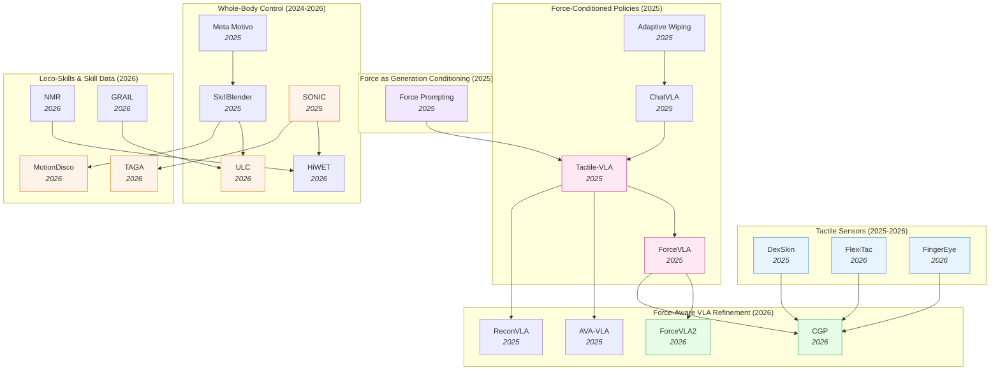

# Contact-Rich & Whole-Body Control — Deep Dive

> [!abstract] Overview
> Physical interaction — governed by forces, contact, balance, and compliance — is the axis this note unifies. A fingertip pressing a fragile object and a humanoid shifting its base under a 6 kg load are the *same problem at different scales*: both regulate contact wrenches the camera cannot see, and both fail when the policy treats force as an afterthought rather than a first-class signal. The note spans two halves of that axis. **Contact sensing & force-conditioned manipulation** (Parts A–C): tactile sensor hardware (capacitive skins, FPC pads, binocular vision-tactile fingertips), force-conditioned VLA architectures (force prompts, force-aware MoE, hybrid force-position control), force-as-generation-conditioning ([[2505.19386|Force Prompting]]), and contact-rich benchmarks. **Whole-body & locomotion control** (Part D): unified whole-body controllers, balance and load-aware adaptation, behavioral/motion-tracking foundation models, terrain-aware agile locomotion, motion retargeting, and generative skill data for humanoids. The recurring architectural insight holds at both scales — **force/contact must be a first-class modality with its own parameters** (dedicated experts for fingertip force, factorized load-context for whole-body balance), never naively concatenated. For the RL-*methods* underpinning the control side, see [[03_Imitation-Learning-and-RL#6. RL for Locomotion, Navigation & Whole-Body Control]]; this note covers the contact-dynamics *substrate*.

## Evolution Graph

Two threads on one contact-dynamics axis: the *fingertip* thread (bolt-on force sensors → force-aware MoE VLAs) and the *whole-body* thread (task-specific gait controllers → motion-tracking foundation models for humanoid loco-manipulation), both converging on force/contact as a first-class signal.

**The fingertip thread** evolved through three overlapping phases. **Phase 1 — Force as auxiliary signal** (early 2025): [[2505.06451|Adaptive Wiping]] and [[2502.14420|ChatVLA]] used force feedback as a closed-loop sensor reading, treated as one input among many. **Phase 2 — Force as first-class modality** (mid 2025): [[2507.09160|Tactile-VLA]] and [[2505.22159|ForceVLA]] elevated force/torque to a primary modality with dedicated experts and force-aware MoE routing — these are the cluster's two landmark papers. **Phase 3 — Hybrid force-position control and contact grounding** (2026): [[2603.15169|ForceVLA2]] introduces cross-scale MoE with force prompts at the VLM level; [[2603.05687|CGP]] grounds policies in predicted multi-point contact trajectories; [[2604.28156|FlexiTac]] and [[2604.20689|FingerEye]] attack the hardware bottleneck with sub-$30 conformable skins and binocular vision-tactile fingertips.

**The whole-body thread** runs in parallel (Part D). Unsupervised behavioral foundation models ([[2504.11054|Meta Motivo]]) and skill-blending hierarchies ([[2506.09366|SkillBlender]]) established that a *single* policy could absorb many whole-body tasks; unified fine-grained controllers ([[2507.06905|ULC]]) and world-frame end-effector tracking ([[2602.06341|HiWET]]) then sharpened precision under the locomotion–manipulation coupling. By 2026 the thread mirrors the fingertip lesson exactly: massive motion-tracking pretraining ([[2511.07820|SONIC]], **100M** frames) plays the role tactile-SSL played for touch, factorized load-context ([[2606.03297|SplitAdapter]]) plays the role of phase-aware force experts, and generative skill data ([[2606.05160|GRAIL]], [[2605.27724|HumanoidMimicGen]]) attacks the same data-scarcity bottleneck that throttles force-instrumented manipulation.

| Year | Paper | Track | Contribution |
|------|-------|-------|--------------|
| 2024 | [[2410.24090\|Sparsh]] | Touch foundation model | First SSL touch representations across [[2111.06377\|MAE]]/[[2104.14294\|DINO]]/JEPA; **460k** unlabeled tactile images + TacBench |
| 2025 | [[2502.14420\|ChatVLA]] | Force-conditioned policy | Unified VLM with MoE: control-expert + understanding-expert (foundation for later force-MoEs) |
| 2025 | [[2505.06451\|Adaptive Wiping]] | Contact-rich benchmark | Few-shot IL + F/T feedback + VAE object representation; 100% contact, 96% reference force |
| 2025 | [[2505.19386\|Force Prompting]] | Force as generation conditioning | First to use physics-based force signals (pokes, wind) as video-generation control |
| 2025 | [[2505.22159\|ForceVLA]] | Force-conditioned VLA | Force-aware MoE (FVLMoE) treats 6-axis F/T as first-class modality; +23.2% over [[2410.24164\|π0]] |
| 2025 | [[2506.14754\|Sparsh-X]] | Touch foundation model | Multisensory (image+audio+motion+pressure) SSL on **~1M** contacts; **+500%** plug insertion |
| 2025 | [[2507.09160\|Tactile-VLA]] | Force-conditioned VLA | Force-aware action expert + hybrid position-force controller + CoT failure recovery |
| 2025 | [[2508.10333\|ReconVLA]] | Refinement (sensor-precursor) | Reconstructive gaze-region pretraining; precursor for visuotactile grounding |
| 2025 | [[2508.19236\|MemoryVLA]] | Refinement (memory) | Dual-memory PCMB; supports tactile-history accumulation over long horizons |
| 2025 | [[2509.18830\|DexSkin]] | Tactile sensor | Conformable capacitive skin, 294° coverage, $10/pair, 19/20 perturbed reorient |
| 2025 | [[2510.13324\|FARM]] | Force-conditioned policy | Tactile-conditioned diffusion policy predicting pose+grip+force; **100%** dynamic screw-tightening |
| 2025 | [[2511.18960\|AVA-VLA]] | Refinement (attention) | POMDP + recurrent state + active visual attention — applicable to force history |
| 2026 | [[2603.15257\|HapticVLA]] | Force-conditioned VLA | Tactile distillation enables force-aware VLA **without** inference-time tactile sensors |
| 2026 | [[2603.12665\|TacVLA]] | Force-conditioned VLA | Contact-aware gating: tactile tokens only activated during contact phases |
| 2026 | [[2603.05687\|CGP]] | Visuotactile policy | Contact-grounded policy: diffusion over coupled state+tactile trajectories |
| 2026 | [[2603.15169\|ForceVLA2]] | Force-conditioned VLA | Cross-Scale MoE + force prompts; 66% avg SR, **+48pp** over [[2410.24164\|π0]] |
| 2026 | [[2602.23648\|FAVLA]] | Force-conditioned VLA | Fast-slow VLA: slow VLM + force-injected fast action expert with adaptive frequency |
| 2026 | [[2601.20321\|TaF-VLA]] | Tactile-force alignment | **10M** synchronized tactile-force pairs + VQ-VAE force latent; **64.8%** avg SR |
| 2026 | [[2604.20689\|FingerEye]] | Tactile sensor | Continuous vision→tactile binocular fingertip; +30% over wrist-only baselines |
| 2026 | [[2604.28156\|FlexiTac]] | Tactile sensor | $30 FPC piezoresistive plug-in skin; 8×16 to 32×32 layouts at 100Hz |
| 2024 | [[2408.00342\|MuJoCo MPC HumanoidBench]] | Whole-body control | Dense-cost MPC beats SOTA RL on HumanoidBench; surfaces long-horizon balance instabilities |
| 2025 | [[2504.11054\|Meta Motivo]] | Whole-body control | Behavioral foundation model; ==FB-CPR== unsupervised RL → zero-shot human-like whole-body control |
| 2025 | [[2506.09366\|SkillBlender]] | Whole-body control | Hierarchical RL blends frozen primitives via per-joint softmax weights; **8** loco-manip tasks |
| 2025 | [[2511.07820\|SONIC]] | Whole-body control | Supersized motion tracking (**100M** frames, **32k** GPU-hr); **99.6%** OOD-motion tracking |
| 2026 | [[2507.06905\|ULC]] | Whole-body control | Single unified policy: locomotion + 3-DoF torso + dual-arm; widest operational workspace |
| 2026 | [[2602.06341\|HiWET]] | Whole-body control | Hierarchical world-frame EE tracking; **12.4 mm** sim error compensating base disturbance |
| 2026 | [[2606.03297\|SplitAdapter]] | Balance / load-aware | Factorized load + dynamics contexts; **26/27** real tasks under OOD loads vs **16/27** base |
| 2026 | [[2606.05880\|TAGA]] | Agile locomotion | Emergent active gaze; **120 cm** gap (**+50%** over prior perceptive humanoids) |
| 2026 | [[2603.22201\|NMR]] | Motion retargeting | Transformer neural retargeting; zero joint jumps, **54%** fewer self-collisions |
| 2026 | [[2606.05160\|GRAIL]] | Skill data | 4D HOI from 3D assets + video priors; **20K+** sequences → **90%** real stair-climbing |

> [!tip] Three Phases, One Architectural Convergence
> Across all three phases, the field converged on the same architectural pattern: **force gets its own encoder, its own attention path, and its own gated expert** — never naive concatenation with visual tokens. From [[2507.09160|Tactile-VLA]]'s force-aware action expert to [[2505.22159|ForceVLA]]'s FVLMoE to [[2603.15169|ForceVLA2]]'s Cross-Scale MoE, the consistent finding is that contact dynamics require dedicated parameters that activate phase-aware (free-space vs in-contact). See [[05_VLA#7. Multi-Sensor & Force-Aware VLAs]] for how this fits the broader VLA design space.

---

## Part A — Foundations & Sensing

*The design space (where force enters, what sensors deliver what) and the tactile sensors themselves as a sensing modality.*

### 1. Design-Space Principles

> [!info] Survey Anchor
> [[2504.03515|Dexterous IL Survey]] (2025) is the standing reference for the broader landscape this note carves out: it systematically reviews Behavioral Cloning, IRL, GAIL, Hierarchical IL, and Continual IL applied to dexterous manipulation; surveys end-effector hardware (simple grippers → multi-fingered anthropomorphic hands) and emphasises tactile sensing as a critical modality; details teleoperation systems and learning-from-video data acquisition; and catalogues the persistent open problems (data sparsity, generalization gaps, sim-to-real, real-time control, safety). When the present note discusses where force/tactile enters a *contact-rich VLA*, the survey covers the parallel question of how IL methods *more broadly* incorporate the same sensing modality.

Every force-aware/tactile policy commits to three orthogonal choices — *what sensor*, *where the force signal enters the model*, and *how the model is pretrained*. The interesting work in the cluster lives at the intersection of these axes; the axes themselves are *almost* independent (e.g. you can pair any sensor with any entry point), but specific combinations win specific contact regimes. The sub-sections below treat each axis as a separate decision dimension.

#### 1.1 Sensor Modality — What Force Signal You Can Even Measure

==The upstream choice that bounds everything downstream.== Sensors range from coarse aggregated F/T at the wrist (cheap, ubiquitous) to dense per-taxel skin (rich, hardware-bound). The richer the sensor, the higher the data-scale floor before a policy generalizes.

- **[[2505.06451|Adaptive Wiping]]**, **[[2505.22159|ForceVLA]]**, **[[2603.15169|ForceVLA2]]** — ==6-axis F/T at wrist==: aggregated force/torque vector, **$200–2k** off-the-shelf; coarse spatial info but immediately deployable.
- **[[2509.18830|DexSkin]]**, **[[2604.28156|FlexiTac]]** — ==high-coverage tactile skin==: dense contact pressure map across end-effector; **$10–30 DIY** to **thousands** for high-fidelity capacitive variants.
- **[[2604.20689|FingerEye]]** — ==vision-tactile fingertip==: continuous pre-contact vision + post-contact deformation in one sensor; mid-range cost (~$100s) but closes the contact-discontinuity gap.
- **[[2603.05687|CGP]]** — ==predicted tactile, no sensor==: diffusion-generated tactile trajectory translated to controller targets; compute-only, but adds long-horizon drift risk.

#### 1.2 Where Force Enters the Model — The Integration Axis

==The architectural choice that determines whether force is a first-class modality or a bolted-on side-channel.== The same F/T stream can be injected at the controller, the action head, the MoE gating, or the VLM prompt — and the field has converged on *late fusion above the visual backbone* as the canonical recipe.

- **[[2505.06451|Adaptive Wiping]]**, **[[2507.09160|Tactile-VLA]]**, **[[2510.13324|FARM]]** — ==at low-level controller==: hybrid position-force / admittance control regulates the policy's output; simplest and most data-efficient when reference force is known.
- **[[2507.09160|Tactile-VLA]]**, **[[2505.22159|ForceVLA]]**, **[[2602.23648|FAVLA]]** — ==at action head==: dedicated F/T encoder feeds a force-aware action expert; preserves pretrained VLM representations.
- **[[2505.22159|ForceVLA]]**, **[[2603.15169|ForceVLA2]]** — ==at MoE gating==: force-aware MoE / Cross-Scale MoE routes between phase-specialized experts (free-space vs in-contact).
- **[[2603.12665|TacVLA]]** — ==at contact-aware token gating==: tactile tokens activated *only* on contact onset; prevents free-space noise injection.
- **[[2601.20321|TaF-VLA]]** — ==at force-grounded latent==: tactile sequence aligned to force latent via VQ-VAE codebook; plug-and-play across sensors.
- **[[2603.15169|ForceVLA2]]** — ==at VLM (as prompt)==: force readings tokenized as linguistic prompts feeding the VLM for long-horizon force-aware planning.
- **[[2603.15257|HapticVLA]]** — ==as predicted/distilled signal==: tactile token predicted from vision/state — no sensor needed at inference.
- **[[2505.19386|Force Prompting]]** — ==at video backbone==: force conditioning of video generator at the pre-action stage; force-aware *world modeling* rather than control.

#### 1.3 Pretraining Strategy — Where Generalization Comes From

==The data-axis choice that determines whether a contact policy survives task variation.== Options run from per-task from-scratch (sample-efficient, brittle) to SSL touch foundation models pretrained on **460k–1M** unlabeled contacts (data-hungry, transferable).

- **[[2505.06451|Adaptive Wiping]]** — ==from-scratch on contact demos==: sample-efficient per task; brittle across tasks.
- **[[2505.06451|Adaptive Wiping]] (VAE)**, **[[2603.05687|CGP]] (KL-VAE)** — ==unsupervised tactile encoder pretrain==: VAE/contrastive on exploratory contact; reusable representation within a task family.
- **[[2410.24090|Sparsh]]**, **[[2506.14754|Sparsh-X]]** — ==SSL touch foundation model==: frozen/finetuned encoder reusable across tasks via [[2111.06377|MAE]] / [[2104.14294|DINO]] / JEPA over **460k–1M** unlabeled contacts.
- **[[2507.09160|Tactile-VLA]]**, **[[2505.22159|ForceVLA]]**, **[[2603.15169|ForceVLA2]]**, **[[2602.23648|FAVLA]]**, **[[2603.12665|TacVLA]]** — ==VLA fine-tune with force expert==: inherits VLM generalization + adds force capacity via dedicated parameters.
- **[[2601.20321|TaF-VLA]]** — ==force-grounded latent alignment==: VQ-VAE binds tactile streams to a force codebook; plug-and-play across sensors and student backbones.
- **[[2603.15257|HapticVLA]]** — ==sensor-free distillation==: teacher uses tactile sensors during training, student distills to inference without them.
- **[[2505.19386|Force Prompting]]** — ==force-conditioned video pretraining==: latent physical understanding from video; transfers to control via downstream action head.

**Design-Space — Decision Matrix**

| Need | Recommendation |
|---|---|
| Known reference force, single contact-rich task (wiping, polishing, insertion) | Closed-loop admittance at controller — [[2505.06451\|Adaptive Wiping]] |
| Multi-stage task with free-space → contact transitions | Force-aware MoE — [[2505.22159\|ForceVLA]], [[2603.15169\|ForceVLA2]] |
| Dense per-taxel contact info (in-hand reorient, fragile grasp) | Hardware first — [[2509.18830\|DexSkin]], [[2604.28156\|FlexiTac]] before policy architecture |
| Continuous pre→post-contact perception (alignment, insertion approach) | Vision-tactile fingertip — [[2604.20689\|FingerEye]] |
| Reusable tactile encoder across tasks | SSL touch foundation — [[2410.24090\|Sparsh]] / [[2506.14754\|Sparsh-X]] |
| Inference-time deployment without tactile sensor | Sensor-free distillation — [[2603.15257\|HapticVLA]] |
| Cross-sensor portability for tactile signal | Force-grounded latent — [[2601.20321\|TaF-VLA]] |
| Bootstrap physical priors from video pretraining | Force-conditioned video generator — [[2505.19386\|Force Prompting]] |

> [!star] Key Design-Space Papers
> - [[2603.15169|ForceVLA2]] — The only architecture to integrate force at *all three* axis-2 entry points simultaneously (controller + MoE + VLM prompt); demonstrates the cluster's architectural ceiling at **66%** avg SR, **+48pp** over [[2410.24164|π0]]
> - [[2505.22159|ForceVLA]] — The canonical late-fusion design — the field's most-copied template for treating F/T as a first-class modality through a dedicated expert and phase-aware gating
> - [[2410.24090|Sparsh]] — The cluster's pretraining-axis founder; **460k** unlabeled tactile images + ==TacBench== established that the touch analog of [[2304.07193|DINOv2]] beats end-to-end training by **~95.1%** average

> [!tip] Picking by Constraint
> If your task has a known reference force (wiping, polishing, insertion with known tolerance), use **closed-loop admittance over the action head** ([[2505.06451|Adaptive Wiping]]) — simplest and most data-efficient. If the task is multi-stage with free-space → contact transitions, use a **force-aware MoE** ([[2505.22159|ForceVLA]], [[2603.15169|ForceVLA2]]) so the gating switches experts at contact onset. If the task requires dense per-taxel contact info (in-hand reorientation, fragile grasping), the bottleneck is **sensor hardware** ([[2509.18830|DexSkin]], [[2604.28156|FlexiTac]]) before the policy architecture matters. See [[05_VLA#7. Multi-Sensor & Force-Aware VLAs]] for how the multi-modal entry-point taxonomy fits the broader VLA design space, and [[14_Sim-to-Real-Transfer#3. Policy-Side: Robustness & Domain Randomization]] for sensor-side calibration needed before any of these axes generalize.

---

### 2. Tactile Sensors as a Sensing Modality

Hardware is the upstream bottleneck. Until 2025, dense tactile sensing meant expensive GelSight-style optical sensors (slow, bulky, single-fingertip) or hand-rolled piezoresistive arrays (brittle, inconsistent). Three sensor papers attack this bottleneck on different fronts — high-coverage skin, affordable open-source FPC, and continuous vision-tactile.

- **[[2509.18830|DexSkin]]** — A ==Conformable capacitive skin== on a parallel-plate grid delivering **294° coverage** across 60 taxels at **1.7 kPa** sensitivity, **6.52%** hysteresis, **2.09%** drift/500 cycles; ==Pneumatic calibration== lifts cross-instance transfer **5/20 → 14/20** SR; **19/20** perturbed pen reorient (baselines **0/20**), **90%** berry pressure cut via residual RL.
- **[[2604.28156|FlexiTac]]** — An ==open-source plug-in tactile platform== pairing thin ==FPC piezoresistive sensor pads== with an Arduino Nano + multiplexer readout at **100 Hz**, layouts **8×16 to 32×32**; ==direct electrode integration== lifts manufacturing throughput, and visuo-tactile fusion + sim-to-real fine-tune enable nut-and-bolt assembly; **~$30/unit**.
- **[[2604.20689|FingerEye]]** — A ==Continuous vision-tactile fingertip== (28×25.4×26 mm) with ==binocular RGB cameras==, compliant soft ring, AprilTag cover; PnP-tracked AprilTag pose proxies 6D wrench: force **[4.30, 4.22, 9.93] mN**, torque **[0.32, 0.13, 8.55] mN-m**; vision sees alignment *before* contact, tactile deformation *after*; **+30%** SR over wrist-camera-only.

**Tactile Sensors — Decision Matrix**

| Need | Recommendation |
|---|---|
| High-coverage skin for in-hand reorientation / fragile grasping | [[2509.18830\|DexSkin]] — capacitive grid, **294° coverage**, pneumatic calibration required for cross-instance transfer |
| Open-source, budget-friendly piezoresistive pad with sim-to-real path | [[2604.28156\|FlexiTac]] — **$30/unit** FPC + Kelvin-Voigt calibration; lowest barrier for community adoption |
| Continuous pre→post-contact sensing for alignment-then-contact tasks | [[2604.20689\|FingerEye]] — binocular vision-tactile fingertip; **+30%** SR over wrist-cam-only |
| Frozen tactile encoder for label-scarce downstream tasks (unimodal) | [[2410.24090\|Sparsh]] — SSL on **460k** tactile images; latent-SSL beats pixel reconstruction; ships with TacBench |
| Multisensory tactile fusion (image + audio + IMU + pressure) | [[2506.14754\|Sparsh-X]] — attention-bottleneck fusion at **~1M** contacts; **+500%** plug-insertion vs vision-only |
| Coarse aggregated F/T only (wrist-mounted) — sensor secondary | Pair with [[2505.22159\|ForceVLA]]-style policy compensation; sensor sets the eventual ceiling |

#### 2.1 Touch Foundation Models — SSL Representations on Tactile Streams

A parallel thread to better sensors: learn ==general-purpose tactile representations== via SSL on large unlabeled tactile data, then reuse the frozen encoder downstream. The touch analog of [[2304.07193|DINOv2]] — and the same lesson holds: pretrained frozen encoder beats end-to-end task-specific training by a wide margin once labels are scarce.

- **[[2410.24090|Sparsh]]** — A ==self-supervised touch encoder== that pretrains ViTs on **~460k** unlabeled tactile images across vision-based sensors under ==[[2111.06377|MAE]]==, ==[[2104.14294|DINO]]/[[2304.07193|DINOv2]]==, and ==JEPA==, introducing ==TacBench== (6 tasks); beats end-to-end by **~95.1%** avg, latent-SSL beats pixel reconstruction, **+20–53%** bead-maze traversal.
- **[[2506.14754|Sparsh-X]]** — A multisensory touch encoder jointly encoding **4 tactile modalities** (image + audio + IMU + pressure) from Digit 360 via ==attention bottlenecks==; **~1M** unlabeled contacts, teacher-student SSL; **+17%** physical-property estimation, **+500%** plug-insertion (to **90%**) vs vision-only, **+63%** vs tactile-image-only, **90%** in-hand rotation drift cut.
- **[[2505.18361|Tactile CRNN]]** — A ==task-optimized convolutional recurrent network== (from an ==Encoder-Attender-Decoder== sweep) that aligns with rodent ==somatosensory cortex==, *saturating* explainable neural variance and beating feedforward / state-space encoders; ==contrastive SSL== (SimCLR) matches top supervised models — evidence that *recurrence* is the right touch bias.

> [!star] Key Papers
> - [[2509.18830|DexSkin]] — High-coverage conformable capacitive skin; the **pneumatic calibration → policy transfer** insight (5/20 → 14/20 cross-instance) is the deployment breakthrough beyond single-instance demos
> - [[2604.28156|FlexiTac]] — $30 open-source FPC piezoresistive skin with a documented Kelvin-Voigt sim-to-real path; the hardware bottleneck-breaker for the community
> - [[2604.20689|FingerEye]] — Binocular vision-tactile fingertip with continuous pre→post-contact sensing; closes the contact-discontinuity gap (**+30%** SR)
> - [[2410.24090|Sparsh]] — Foundational SSL touch encoder across [[2111.06377|MAE]]/[[2104.14294|DINO]]/JEPA on **460k** tactile images; introduces ==TacBench==; established latent-space SSL beats pixel reconstruction for touch
> - [[2506.14754|Sparsh-X]] — Multisensory touch foundation model (image + audio + IMU + pressure) at **~1M** contacts; **+500%** plug insertion over vision-only — the multimodal extension of [[2410.24090|Sparsh]]

> [!tip] Sensor Bottleneck vs Policy Bottleneck — and Why You Should Pretrain the Encoder
> The binding bottleneck dictates the fix: tasks failing at *contact onset* (alignment, insertion approach) need **continuous vision-tactile** ([[2604.20689|FingerEye]]); tasks failing during *sustained contact* (perturbed reorientation, fragile grasping) need **high-coverage skin** ([[2509.18830|DexSkin]]); tasks limited by *coarse aggregated F/T* can be compensated in policy ([[2505.22159|ForceVLA]]) but the sensor sets the ceiling. Whatever the sensor, the *encoder* should be pretrained: the [[2410.24090|Sparsh]]/[[2506.14754|Sparsh-X]] result is the touch analog of the [[2304.07193|DINOv2]] lesson — a frozen SSL tactile encoder amortizes labeling cost across the whole downstream task family, and JEPA-style objectives generalize from RGB to tactile and from unimodal to multisensory. Most VLAs in §3 still train tactile encoders from scratch per task — an obvious upgrade path. Cross-reference [[08_Latent-World-Models#3. Broader Latent Prediction Landscape]] for the latent-prediction lineage this reuses and [[02_Dataset-Benchmark-Environment#6. Tactile & Contact-Rich Benchmarks]] for the evaluation side.

---

## Part B — Force-Conditioned Policy Architectures

*How force gets injected into VLAs (Tactile-VLA, ForceVLA, TaF-VLA) and how it conditions generation models.*

### 3. Force-Conditioned VLA Architectures

The core of the cluster. Force-aware VLAs cluster along *where* force enters the network — the action head, an MoE gating module, a latent-aligned adapter, a refinement layer that handles the human/recovery loop, or upstream as video-generation conditioning. The sub-sections below treat each entry-point as a distinct architectural axis, with the bullet-per-paper detail showing how multiple groups have explored the same axis with different design choices.

#### 3.1 Force-Aware Action Heads

The most direct integration: force enters at the action expert (or its controller), giving the policy a hybrid position-force output space. These papers preserve the pretrained VLM backbone and add force capacity through dedicated parameters at the action stage.

- **[[2605.07308|AT-VLA]]** — An ==Adaptive Tactile Injection== VLA adding tactile feedback while *preserving pretrained knowledge* (**+17%**), plus a ==Tactile Reaction Dual-Stream== for real-time contact response (**+11%**); beats SOTA VLA + tactile baselines on contact-rich tasks (Unzip Bag, Stamp, Wipe Vase) yet stays robust — reliable even when tactile input is *absent* at inference.
- **[[2507.09160|Tactile-VLA]]** — A ==Multi-modal transformer== fusing vision + language + ==tactile== on a ==pre-trained VLM backbone==, with a ==force-aware action expert== outputting position *and* force under a ==hybrid position-force controller==; CoT recovery adjusts force **3.5N → 6.7N**: **90%** Charger, **90%** OOD fragile paper-box, **80%** zero-shot wiping.
- **[[2602.23648|FAVLA]]** — A ==Fast-slow VLA==: slow VLM + high-frequency ==Force-Injected Action Expert== with force adapters across transformer layers, where a VLM-predicted ==force variance head== raises execution frequency during contact; **80.8%** avg SR (**+38pp** over vision-only, **+13.8pp** over the strongest force-aware baseline); peak contact force to **7.7N** on Gear Assembly.
- **[[2510.13324|FARM]]** — A ==Diffusion policy== with explicit force action predicting robot pose, grip width, *and* target grip force, conditioned on tactile force distributions; a dual-mode controller switches position-control in free space and closed-loop force-control during contact; **100%** success on dynamic screw-tightening and superior human-demonstration force matching.
- **[[2603.15257|HapticVLA]]** — A ==Sensor-free deployment== method via ==Safety-Aware Reward-Weighted Flow Matching==: a tactile-equipped teacher distills into a student predicting a compact tactile token from vision+state at inference — **no tactile sensor needed**; **86.7%** mean SR on fragile-object pick-and-place, **+45pp** on egg manipulation over [[2506.01844|SmolVLA]].
- **[[2603.12665|TacVLA]]** — A ==Contact-aware token gating== VLA where tactile tokens activate *only* on contact onset, preventing free-space noise injection, and a lightweight MLP tactile encoder keeps the architecture compact; **83.75%** avg SR on disassembly, **>60%** SR under severe visual occlusion (vs ~30% for vision-only).

#### 3.2 Force-Aware Mixture-of-Experts

Force-aware MoE goes beyond a single force-aware action head: a learned gating module routes between phase-specialized experts (free-space vs in-contact), so the network *switches* parameters as the task transitions. This is the field's core architectural recipe for multi-stage contact-rich tasks.

- **[[2603.15169|ForceVLA2]]** — The current SOTA force-aware VLA pushing force up to the VLM via ==force-based prompts== and down to a ==Cross-Scale MoE== fusing VLM guidance with real-time F/T for ==hybrid force-position regulation==; **66%** avg SR over 5 tasks (**+48pp** over [[2410.24164|π0]], **+31pp** over [[2505.22159|ForceVLA]]); MoE alone **+26%**.
- **[[2505.22159|ForceVLA]]** — A canonical late-fusion VLA whose ==Force-aware MoE (FVLMoE)== routes 6-axis F/T into separate experts, gating learning force-vs-visual reliance; **60.5%** avg SR (vs **37.3%** [[2410.24164|π0]]+force), **90%** under occlusion, **20%** socket insertion; full FVLMoE **80%** vs **60%** concat. Ships **ForceVLA-Data** (**244** trajectories).

#### 3.3 Force-Grounded Tactile Alignment

A distinct architectural slot: rather than aligning tactile signals to *visual* embeddings (treating touch as visual texture), these papers ground tactile observations directly in *physical interaction forces* via a learned latent space. The result is a plug-and-play adapter that ports across tactile sensors and downstream policies.

- **[[2603.04531|PTLD]]** — A ==Privileged tactile latent distillation== method for sim-to-real: an ==Asymmetric Actor-Critic== trains a ==privileged-sensor policy== (external-camera pose) in *one* sim stage, then a ==tactile encoder== matches real tactile + proprioception via ==DAgger==; **+182%** in-hand rotation, **+57%** reorient goals, ~**50%** lower 6D pose error (**0.43 → 0.21** rad).
- **[[2601.20321|TaF-VLA]]** — A force-grounded tactile adapter: TaF-Device collects a **>10M**-pair tactile-force corpus, a ==TaF-Adapter== aligns tactile to force via ==VQ-VAE== + ==temporal encoding==, frozen and plugging into any VLA; **64.8%** avg SR (vs **37.1%** vision-only, **42.8%** tactile-vision-aligned), **60.3%** zero-shot on unseen sensors, **+6.7–33.3%** on ACT/Diffusion Policy.
- **[[2605.14571|MTNet]]** — A ==dual-stream visuo-tactile alignment network== that projects vision and touch into a ==unified latent== under cross-modal constraints, predicting contact location and force from RGB; CKA **~0.74** between modalities; ==AMTNet== extends to *human* hands *without human tactile ground truth* — structural supervision, not pressure regression.
- **[[2503.08548|TLA]]** — A ==Tactile-Language-Action model== that integrates ==sequential tactile-image streams== with NL via ==Qwen2-VL== + ==LoRA== on **24,000** peg-in-hole tactile-action pairs; **>85%** SR on unseen clearances (**0.3–1.2mm**) and peg geometries, **+50%** over the next baseline; cleanest tactile-grounded-language proof for high-precision assembly.

#### 3.4 Force-Aware Human-Intervention & Refinement Layers

A complementary architectural layer: rather than redesigning the action head, these papers wrap a VLA backbone with a refinement loop — human-in-the-loop intervention, recurrent belief state, reconstructive supervision, or phased curriculum — whose mechanism plugs cleanly into force-aware settings even when the original paper targets vision.

- **[[2605.15157|HandITL]]** — An ==interventional correction== layer for a bimanual 56-DoF hand-arm VLA via VR controllers + data gloves, where ==relative hand retargeting== tracks configuration *changes* from the intervention onset and ==velocity-based shared arm control== smooths wrist residuals; **99.8%** gesture-jump cut on Bread Clip; on-policy intervention fine-tuning beats teleop.
- **[[2511.18960|AVA-VLA]]** — A ==POMDP reformulation== of VLA whose ==recurrent state== encodes belief over past observations + actions and drives an ==Active Visual Attention== module prioritizing task-relevant visual tokens; SOTA on LIBERO/CALVIN, best avg on **four** real Mobile ALOHA tasks. The recurrent state directly accommodates *force history*; "active force attention" is unbuilt.
- **[[2508.10333|ReconVLA]]** — A ==gaze-region reconstructive== VLA where a ==diffusion-transformer denoiser== on the visual tokens predicts noise on latent ==scene tokens== of the gaze region (==Grounding DINO==); **3.95** avg subtask length on CALVIN ABC→D, stack-block **59.3% → 79.5%**; the denoiser generalizes to contact regions — close to [[2603.05687|CGP]]'s denoiser.
- **[[2502.14420|ChatVLA]]** — A ==Phased Alignment Training== VLA (control first, then understanding) over ==Qwen2-VL-2B== with an MLP ==MoE== splitting a ==Control-Expert== from an ==Understanding-Expert==; recovers VQA (**71.2%** TextVQA, **9.2×** over ECoT) without sacrificing control across **25** tasks at **3.5×** fewer params; the MoE split parents [[2505.22159|ForceVLA]]'s FVLMoE.

#### 3.5 Force as Video-Generation Conditioning

A category-of-one frontier: rather than feeding force *into* a policy, force is used to *condition video generation*, then video predictions bootstrap downstream policies. This is force-aware *world modeling* rather than force-aware control — the entry-point lives upstream of the action stack entirely. Single-paper sub-section here because no other published work has attempted force-as-generation-conditioning; explicitly a frontier slot.

- **[[2505.19386|Force Prompting]]** — A force-conditioned video generator adapting ==CogVideoX== via [[2302.05543|ControlNet]] to accept ==physics-based force prompts== (wind + pokes), trained on **15–23k** synthetic Blender + [[2404.13026|PhysDreamer]] videos; emergent ==intuitive mass understanding==, beats text-only/trajectory baselines. *Open*: force-pretrain → action head unbuilt.

**Force-Conditioned Architectures — Decision Matrix**

| Need | Recommendation |
|---|---|
| Hybrid position-force action expert, simplest integration | [[2507.09160\|Tactile-VLA]] — force in augmented action space + hybrid controller |
| Adaptive execution frequency under contact | [[2602.23648\|FAVLA]] — fast-slow VLA with force-variance-triggered cadence |
| Force-aware diffusion with explicit force output | [[2510.13324\|FARM]] — predicts pose+grip+force; **100%** dynamic screw-tightening |
| Inference-time deployment *without* tactile sensor | [[2603.15257\|HapticVLA]] — flow-matching distillation; **86.7%** fragile-object SR |
| Gate tactile tokens *only* on contact onset | [[2603.12665\|TacVLA]] — contact-aware token gating; **83.75%** disassembly SR |
| Multi-stage task with free-space → contact transitions | [[2603.15169\|ForceVLA2]] (SOTA, **66%** SR) or [[2505.22159\|ForceVLA]] (canonical, **60.5%** SR) |
| Cross-sensor portability via force-grounded latent | [[2601.20321\|TaF-VLA]] — VQ-VAE on **10M** tactile-force pairs; **60.3%** zero-shot |
| Cross-domain (robot ↔ human) visuo-tactile alignment | [[2605.14571\|MTNet]] + AMTNet — CKA **~0.74**; vision-only human-touch response |
| Human-in-the-loop intervention + on-policy refinement | [[2605.15157\|HandITL]] — relative retargeting, **99.8%** gesture-jump reduction |
| Recurrent belief over force history | [[2511.18960\|AVA-VLA]] — POMDP recurrent state (force-specific variant pending) |
| Phased curriculum to avoid VLM forgetting under force fine-tuning | [[2502.14420\|ChatVLA]] — control-first, then understanding |
| Force-as-pretraining-signal for downstream policy | [[2505.19386\|Force Prompting]] — only force-conditioned video generator extant |

> [!star] Key Papers
> - [[2603.15169|ForceVLA2]] — Cross-Scale MoE + force prompts; current SOTA for force-aware VLA at **66%** avg SR, **+48pp** over [[2410.24164|π0]]
> - [[2505.22159|ForceVLA]] — Force-aware MoE; the foundational late-fusion-with-phase-aware-gating architecture; **+23.2%** over force-concat baselines
> - [[2507.09160|Tactile-VLA]] — Force in augmented action space + Chain-of-Thought failure recovery; **90%** Charger, **80%** zero-shot blackboard wiping via autonomous force adjustment
> - [[2601.20321|TaF-VLA]] — Force-grounded tactile alignment via VQ-VAE on **10M** tactile-force pairs; the cleanest demonstration that *grounding tactile in physical force* (not visual texture) is what unlocks VLA contact-rich performance; plug-and-play with **6.7-33.3%** gain on ACT/Diffusion Policy baselines
> - [[2502.14420|ChatVLA]] — Phased Alignment Training + control/understanding MoE; the architectural parent of force-aware MoE designs

> [!tip] Generation vs Control — The Unbuilt Pipeline
> [[2505.19386|Force Prompting]] answers *"what would happen if I applied this force?"*; [[2507.09160|Tactile-VLA]] and [[2505.22159|ForceVLA]] answer *"what force should I apply right now?"*. The two halves compose: pretrain on force-conditioned generation to absorb mass/dynamics priors, then attach a force-aware action head for control. No published work has executed this end-to-end yet. See [[11_Physics-Aware-Embodied-AI#3. Explicit Physics Losses for Video Generation]] for the broader physics-conditioned video-generation track and [[07_WAM#5. VLM-Integrated WAMs]] for the WAM augmentation patterns that would host the action head.

---

## Part C — Evaluation

*Contact-rich manipulation benchmarks — the downstream targets the force-conditioned policies of Part B race against.*

### 4. Contact-Rich Manipulation Benchmarks and Visuotactile Policies

The downstream targets of all this work. Contact-rich tasks — wiping, polishing, insertion, in-hand reorientation, fragile grasping, multi-finger jar opening — define the benchmarks the field is racing against. The papers below cluster along three contribution axes: ==vision-to-tactile prediction== from egocentric data (closes the tactile-supervision bottleneck), ==contact-grounded policies== built around generative tactile forecasts, and ==long-horizon memory== that turns single-contact policies into sustained-contact ones.

#### 4.1 Vision-to-Tactile Prediction — Closing the Supervision Bottleneck

==The pretraining-axis breakthrough for the benchmark frontier.== Contact-rich tasks have been data-starved because instrumented teleoperation rigs are expensive; predicting tactile from RGB unlocks egocentric-scale supervision.

- **[[2605.13083|TouchAnything]] (EgoTouch)** — A ==vision-to-tactile prediction== framework from egocentric video alone; **20 hr** multi-view ego + bimanual 3D hand pose + dense pressure maps from RGB; ==view dropout== cuts the ego-only penalty **−27.20% → −5.78%** Volumetric IoU (**+6.1%** over ego-only) — first bridge from egocentric VLA pretraining to *dense* tactile supervision.
- **[[2512.04884|Hoi!]]** — A large-scale ==force-grounded multimodal dataset== of articulated-object interaction (synced vision, pose, force, tactile) exposing how badly in-the-wild estimation degrades: Sparsh tactile-force RMSE jumps to **3.86–4.11 N** (from millinewtons), ForceSight visual-force to **2.23 N** (from **0.404 N**) — the reality-check for force prediction.

#### 4.2 Contact-Grounded Policies — Generative Tactile Forecasts as Policy Anchors

==The architectural answer to "how do you ground a contact-rich policy without an OXE-scale corpus".== Three complementary strategies: pretrained encoder + closed-loop F/T (sample-efficient), diffusion over coupled state+tactile (long-horizon), and MoE-with-curriculum (generalist coverage).

- **[[2505.06451|Adaptive Wiping]]** — A ==VAE-pretrained-on-exploratory-F/T + few-shot IL + closed-loop F/T== policy for deformable-sponge wiping under unseen heights/stiffnesses; **100%** contact, **96%** reference force across 40 scenarios; vs **4%** open-loop IL and **42%** admittance baselines — the cleanest data-efficient contact-rich benchmark, bounded to tightly-scoped tasks.
- **[[2603.05687|CGP]]** — A ==Conditional diffusion over coupled state + tactile trajectories== policy: a ==KL-regularized VAE== compresses tactile, then a learned ==contact-consistency mapping== (needs *both* state + tactile) translates predictions into ==compliance-controller== targets; beats visuomotor + visuotactile diffusion on **5** tasks (jar opening, in-hand box flipping).
- **[[2502.14420|ChatVLA]]** — A ==MoE + Phased Alignment Training== *generalist* contact-rich baseline with strong results across **25** real-world tasks, showing that even general-purpose VLAs can absorb a substantial fraction of contact-rich tasks with the right training curriculum.
- **[[2603.19201|OmniVTA]]** — A ==hierarchical slow-fast visuo-tactile framework== stacking a ==TactileVAE==, a ==Visuo-Tactile World Model==, an ==Adaptive Fusion Policy==, and a **60 Hz** ==Reflexive Latent Tactile Controller (RLTC)==; trained on **OmniViTac** (**21,000+** trajectories, **86** tasks); SOTA on 6 real tasks; RLTC lifts SR to **60%** Wipe / **63%** Peel under perturbation.

#### 4.3 Long-Horizon Memory — Sustained-Contact Reasoning

==The temporal-axis missing piece for force-aware tasks.== Current force is meaningless without history ("am I still pressing, or did I just transition into free space?"). Memory architectures from broader VLA work plug in directly.

- **[[2508.19236|MemoryVLA]]** — A ==Perceptual-Cognitive Memory Bank (PCMB)== dual-memory VLA: low-level perceptual details (recent F/T, contact events) + high-level cognitive semantics (task progress); **+26pp** over [[2503.22020|CogACT]] on real-world long-horizon temporal tasks (**83%**) at only **+3.6%** latency, **+0.8 GB** GPU; not force-specialized, but maps cleanly onto force history.

**Contact-Rich Benchmarks — Decision Matrix**

| Need | Recommendation |
|---|---|
| Pretraining tactile supervision *without* instrumented teleoperation | [[2605.13083\|TouchAnything]] — vision-to-tactile prediction from egocentric RGB |
| Single contact-rich task with known reference force | [[2505.06451\|Adaptive Wiping]] — closed-loop F/T + VAE; **96%** reference force |
| Long-horizon multi-contact task (jar opening, in-hand flip) | [[2603.05687\|CGP]] — diffusion over coupled state + tactile |
| Generalist VLA covering many contact-rich tasks at once | [[2502.14420\|ChatVLA]] — MoE + Phased Alignment across **25** tasks |
| Sustained contact requiring force-history reasoning | [[2508.19236\|MemoryVLA]] — PCMB dual-memory (force-history specialization pending) |
| Bench against OXE-scale corpus for contact-rich tasks | **(no such benchmark exists yet)** — see [[02_Dataset-Benchmark-Environment#6. Tactile & Contact-Rich Benchmarks]] |

> [!star] Key Papers
> - [[2605.13083|TouchAnything]] — Multi-view egocentric + dense bimanual tactile dataset (**20 hr**) and vision-to-tactile prediction framework; **+6.1%** Volumetric IoU over ego-only; view dropout closes ego-only inference gap to **−5.78%**; first bridge between egocentric video pretraining and dense tactile supervision
> - [[2603.05687|CGP]] — Generative contact grounding via diffusion over coupled state+tactile trajectories; outperforms visuomotor/visuotactile diffusion baselines on **5** complex contact-rich tasks (jar opening, in-hand box flipping)
> - [[2505.06451|Adaptive Wiping]] — Few-shot IL + F/T feedback + VAE object representation; **100% contact**, **96% reference force** under unseen heights/sponges; the cleanest contact-rich benchmark to date

> [!tip] Benchmark Frontier
> Most contact-rich benchmarks today (ForceVLA-Data, ForceVLA2-Dataset, [[2505.06451|Adaptive Wiping]] scenarios) involve hundreds to ~1k trajectories on 5–25 task variants. None approach the scale of [[2310.08864|OXE]] (**1M+** trajectories). Until an "[[2310.08864|OXE]] for contact-rich tasks" exists, force-aware policy performance is bounded by *data scale*, not *architecture* — which is why [[2605.13083|TouchAnything]]'s vision-to-tactile prediction path matters disproportionately: it bypasses the instrumented-teleoperation cost ceiling. See [[02_Dataset-Benchmark-Environment#6. Tactile & Contact-Rich Benchmarks]] for the broader benchmark landscape and [[12_Egocentric-Pretraining-and-Human-Video#3. Scaling Laws for Egocentric Pretraining]] for the scaling-law evidence underwriting this argument.

---

## Part D — Whole-Body & Locomotion Control

*The whole-body half of the contact-dynamics axis: regulating balance, base–arm coupling, terrain contact, and human-to-humanoid motion transfer. Where Parts A–C treat contact at the fingertip, Part D treats it at the body scale — but the architectural lesson is the same (force/contact as a first-class, dedicated signal). For the RL-methods underpinning these controllers, see [[03_Imitation-Learning-and-RL#6. RL for Locomotion, Navigation & Whole-Body Control]].*

### 5. Whole-Body Control & Coordination

The defining tension of humanoid loco-manipulation is *coupling*: an aggressive arm reach destabilizes the gait, and a moving base drags the end-effector off target. A decoupled "walk, then manipulate" controller cannot resolve this — the two subsystems share a contact budget (ground-reaction forces, center-of-mass, angular momentum) that only a whole-body policy can allocate. This section tracks how the field stopped treating locomotion and manipulation as separate controllers and started learning a single policy that regulates the coupled contact dynamics.

Three axes of division emerge. **Unified and hierarchical controllers** decide whether to fuse everything into one policy or decompose into a high-level commander + low-level tracker. **Balance and load-aware adaptation** confronts the disturbances — external payloads, base oscillation — that the coupling injects. **Behavioral and motion-tracking foundation models** ask whether whole-body control, like vision-language before it, has a scalable pretraining objective that replaces per-task reward engineering.

#### 5.1 Unified & Hierarchical Whole-Body Controllers

The core architectural fork: a single end-to-end policy that jointly outputs locomotion + torso + arm commands, versus a two-level commander/tracker split that decouples global spatial reasoning from dynamic execution.

- **[[2605.25546|ISSf-CBF WBC]]** — A hierarchical safety-critical WBC chaining ==KinWBC → ISSf-CBF safety filter → DynWBC==, treating the reduced-order/full-order mismatch as a bounded disturbance to transfer kinematic safety to full dynamics; **~0% vs ~50%** collision under 20% mass mismatch, validated on real TOCABI.
- **[[2507.06905|ULC]]** — A ==Single unified policy== trained with parallel ==PPO==, integrating locomotion, full 3-DoF torso, and dual-arm control via a sequential ==adaptive curriculum== (quintic interpolation + stochastic delay + CoM tracking); widest workspace (root height **0.30–0.75 m**), low arm error (**0.06±0.01 rad** under command mutation) even under **2 kg** wrist loads.
- **[[2602.06341|HiWET]]** — A ==Hierarchical world-frame end-effector tracking== controller: a high-level Commander reasons in the world frame, a low-level Tracker executes whole-body motion, decoupling drift-prone body-centric control, and a ==Kinematic Manifold Prior== halves hand error; **12.4 mm** EE error in sim, **12–15 mm** RMSE real on Unitree G1, compensating base oscillation.
- **[[2512.13093|PvP]]** — A ==Proprioceptive-privileged contrastive learning== method exploiting the complementary structure of proprioceptive vs privileged states for compact WBC representations; on the LimX Oli humanoid it accelerates learning and beats vanilla PPO + SRL on velocity tracking and motion imitation, validated on real hardware — data-efficient whole-body representations.
- **[[2506.09366|SkillBlender]]** — A ==two-stage hierarchical RL== controller that pre-trains ==goal-conditioned primitive skills== (walk, reach, squat, step), then blends ==frozen primitives== via per-joint ==softmax weight vectors==; beats vanilla RL on **8** loco-manip tasks across H1/G1/H1-2, with the softmax non-linearity ablated as critical for preventing reward hacking.
- **[[2504.09532|Humanoid-COA]]** — An ==Embodied Chain-of-Action reasoning== framework over multimodal foundation models (GPT-4V perception, GPT-4 reasoning), decomposing language into action sequences via object affordance + spatial + whole-body movement inference for *zero-shot* loco-manipulation; **96.6%** SR on simple tasks, **>60%** on long-horizon occlusion-aware scenarios on H1-2/G1.

#### 5.2 Balance & Load-Aware Adaptation

Coupling means external disturbance is the norm, not the exception. These papers confront the payloads and dynamic mismatch that destabilize whole-body control, and the classical baseline that exposes how brittle naive policies remain.

- **[[2606.03297|SplitAdapter]]** — A ==Factorized adaptation== method augmenting a frozen policy with *separate* object/load and dynamics-mismatch contexts (unified latents conflate the two), injected via hierarchical ==FiLM== with ==GRL cross-adversarial regularization==; **86/90** sim, **26/27** real full-task SR under OOD loads (vs **16/27** base); clean mass-dependent latents.
- **[[2408.00342|MuJoCo MPC HumanoidBench]]** — A ==Dense-cost Model Predictive Control== baseline (==iLQG== for Stand/Walk, ==Sampling Planner== for Push) beating SOTA RL (DreamerV3, TD-MPC2, SAC, PPO) on HumanoidBench with smoother, lower-energy trajectories; exposes that short-episode sparse-reward benchmarks *mask* long-horizon balance instabilities — visible only over **8 s** episodes.

#### 5.3 Behavioral & Motion-Tracking Foundation Models

The whole-body analog of the touch-SSL story in §2.1: a scalable, reward-free pretraining objective (motion tracking, unsupervised behavior) that yields a generalist controller, replacing per-task reward engineering.

- **[[2511.07820|SONIC]]** — A motion-tracking foundation model supersizing ==motion tracking== as a foundational task: dense supervision from **100M** frames, **700 hours**, **32k GPU-hours**, **42M** params, via an ==encoder-quantizer-decoder== + kinematic planner; **99.6%** OOD tracking, zero-shot to physical G1 on all **50** trajectories, **95%** mobile manip fronted by a GR00T N1.5 VLA.
- **[[2504.11054|Meta Motivo]]** — A ==Behavioral foundation model== via ==FB-CPR== (Forward-Backward reps + Conditional Policy Regularization), an online ==unsupervised RL== method learning from *unlabeled* MoCap; zero-shot whole-body control matching task-specific TD3, evaluators preferring its naturalness over higher-reward agents — the reward-free pretraining proof for whole-body behavior.

**Whole-Body Control — Decision Matrix**

| Need | Recommendation |
|---|---|
| Single policy for locomotion + torso + dual-arm in one command space | [[2507.06905\|ULC]] (widest workspace, robust to loads/delay) |
| World-frame EE precision under locomotion disturbance | [[2602.06341\|HiWET]] (**12.4 mm** sim, hierarchical commander/tracker) |
| Compose complex loco-manip from reusable primitives | [[2506.09366\|SkillBlender]] (per-joint softmax blending of frozen skills) |
| Zero-shot language → loco-manipulation without training | [[2504.09532\|Humanoid-COA]] (Chain-of-Action over foundation models) |
| Robustness to OOD payloads / dynamic mismatch | [[2606.03297\|SplitAdapter]] (factorized load + dynamics contexts) |
| Stable classical baseline + long-horizon stability audit | [[2408.00342\|MuJoCo MPC HumanoidBench]] (dense-cost MPC) |
| Reward-free generalist whole-body controller | [[2511.07820\|SONIC]] (motion-tracking FM) or [[2504.11054\|Meta Motivo]] (behavioral FM) |

> [!star] Key Papers
> - [[2504.11054|Meta Motivo]] — The behavioral-foundation-model landmark: first to show unsupervised RL on unlabeled MoCap yields a zero-shot, human-natural whole-body controller — the whole-body analog of self-supervised pretraining
> - [[2511.07820|SONIC]] — Established that motion tracking is the scalable, reward-free pretraining task for humanoid control; the 100M-frame scaling result is the field's clearest "foundation-model recipe works for whole-body" proof
> - [[2507.06905|ULC]] — The reference unified controller: a single policy covering the full locomotion + torso + dual-arm command space, ending the decoupled-controller era for fine-grained loco-manipulation
> - [[2606.03297|SplitAdapter]] — The cleanest demonstration that *factorizing* contact-relevant context (load vs dynamics) beats a unified latent — the whole-body echo of "force needs its own expert"

> [!tip] The Coupling Is the Substrate — Factorize It, Don't Average It
> The whole-body thread re-derives the fingertip thread's central lesson at body scale: contact-relevant signals demand *dedicated* parameters, not a shared average. [[2606.03297|SplitAdapter]] splits load-context from dynamics-context exactly as [[2505.22159|ForceVLA]]'s FVLMoE splits force-expert from visual-expert; [[2602.06341|HiWET]]'s commander/tracker split mirrors the controller-vs-action-head fork of §3.1. And the scaling escape hatch is identical — [[2511.07820|SONIC]]'s motion-tracking pretraining plays the role [[2410.24090|Sparsh]]'s touch-SSL plays for tactile. The surprise is *how exactly* the two scales rhyme: whenever you are tempted to fuse a contact signal into a shared representation, the body-scale evidence says factorize. Cross-reference [[05_VLA#8. Humanoid & Bimanual VLAs]] for the VLA-side of whole-body action generation and [[14_Sim-to-Real-Transfer#3. Policy-Side: Robustness & Domain Randomization]] for the domain-randomization these controllers depend on to survive deployment.

---

### 6. Legged Locomotion & Agile Skills

If §5 is about *coordinating* the body, §6 is about *pushing it to the dynamic edge* — gaps wider than a stride, table-tennis smashes, under-table contact plans. Agile skills expose a tension the static loco-manipulation controllers can defer: when the maneuver is at the limit of feasibility, the policy must *anticipate* the contact (where to look, where to plant, how to pre-load momentum) rather than react to it. This section tracks how perception, generative motion priors, and autonomous search push humanoid skills past the demonstration-limited frontier.

The papers divide by *how the agile skill is acquired*. **Terrain-aware perception** learns where to attend before committing a foothold. **Dynamic whole-body skills** scale sparse demonstrations into a generative motion library and add anticipatory intent. **Autonomous skill discovery** removes the human demonstrator entirely, searching the contact-mode space for feasible long-horizon plans.

#### 6.1 Terrain-Aware Agile Locomotion

The perception bottleneck for agile locomotion: broad coverage for anticipatory planning versus precise local geometry for foot placement. The breakthrough is letting attention *emerge* rather than processing the full scan.

- **[[2606.05880|TAGA]]** — A terrain-aware agile-locomotion policy fusing egocentric depth, height scans, and proprioception, where an emergent ==active gaze== module predicts a ==Region of Interest== in the scan, trained with ==PPO== + AMP + a ==MoE== action decoder; **120 cm** gap on G1 (**+50%** over prior perceptive humanoids), **70 cm** stepping-stone spacing, **65.2%** lower train cost.

#### 6.2 Dynamic Whole-Body Skills

Agile, dynamic tasks need a richer motion repertoire than sparse MoCap provides, and they need the policy to prepare for transitions *before* they happen. These papers attack both — generative augmentation of strike motions and anticipatory joint-intent latents.

- **[[2604.01158|SMASH]]** — A ==humanoid table-tennis system== driven by *onboard egocentric vision only*: ==dual-modality stereo perception== + ==AprilTag== self-localization, an autoregressive ==Motion-VAE== augmenting sparse MoCap into a strike library, and ==task-oriented motion-matching== RL; first outdoor consecutive striking, **93.7%** contact rate, **59.7%** returns over 642 launches.
- **[[2605.14417|DAJI]]** — An anticipatory controller learning a compact **64D** ==anticipatory joint-intent latent== encoding future transitions; ==DAJI-Act== distills from a future-aware privileged teacher, ==DAJI-Flow== is a language-conditioned ==flow-matching DiT==; **94.42%** rollout SR on HumanML3D-style benchmarks, **4.71 ms** CPU latency, lower transition jerk.

#### 6.3 Autonomous Contact-Rich Skill Discovery

Removing the human demonstrator: search the discrete contact-mode space (or a generative motion prior) for novel, physically feasible long-horizon skills, then execute them zero-shot.

- **[[2606.06139|MotionDisco]]** — An autonomous skill-discovery method coupling ==LLM-guided evolutionary search== over discrete contact-mode sequences with ==contact-explicit kinodynamic planning==: the LLM mutates Python contact-plan programs, the planner returns scores + failure feedback; solves all **8** extreme long-horizon scenarios within minutes, deploying zero-shot on real hardware.
- **[[2604.00202|DreamControl-v2]]** — A generative motion-prior method training a ==guided diffusion model directly in G1 motion space== (not human space), aggregating pre-retargeted human (AMASS/HumanML3D/GRAB) + robot (OmniRetarget) data; **68%** valid-trajectory rate (vs **8%** for inference-time prompting), FID **0.265**, **0.925** SR on complex tasks; **8** loco-manip skills on real G1.

**Legged Locomotion & Agile Skills — Decision Matrix**

| Need | Recommendation |
|---|---|
| Agile terrain traversal (gaps, stepping stones) with efficient perception | [[2606.05880\|TAGA]] (emergent active gaze; **120 cm** gap) |
| Dynamic striking / sports skill from onboard vision | [[2604.01158\|SMASH]] (Motion-VAE augmentation + egocentric perception) |
| Anticipatory, streaming language-conditioned motion | [[2605.14417\|DAJI]] (64D joint-intent latent + flow-matching) |
| Discover novel long-horizon contact plans without demos | [[2606.06139\|MotionDisco]] (LLM-guided evolutionary contact search) |
| Scalable skill acquisition via generative motion priors | [[2604.00202\|DreamControl-v2]] (guided diffusion in robot motion space) |

> [!star] Key Papers
> - [[2606.06139|MotionDisco]] — First to discover extreme loco-manipulation skills autonomously by coupling LLM-guided evolutionary search with kinodynamic planning — removing the human demonstrator from contact-rich skill acquisition
> - [[2606.05880|TAGA]] — Showed an anticipatory active-gaze policy can *emerge* from RL without supervision, setting the perceptive-humanoid agility frontier
> - [[2604.01158|SMASH]] — The egocentric-vision agility landmark: first consecutive humanoid table tennis from onboard sensing alone, proving generative motion augmentation scales dynamic skills

> [!tip] Anticipation Beats Reaction at the Dynamic Edge
> Across this section the winning move is the same: *anticipate the contact before it happens.* [[2606.05880|TAGA]]'s gaze predicts where to look for the next foothold; [[2605.14417|DAJI]]'s 64D latent encodes the future physical transition before the body moves; [[2606.06139|MotionDisco]]'s search reasons over the whole contact-mode sequence rather than the next step. Reactive control suffices for quasi-static loco-manipulation (§5), but at the dynamic limit the latency of "sense → decide → act" is fatal — the maneuver is over before reaction completes. This is the locomotion echo of [[09_Contact-Rich-and-Whole-Body-Control#8.3 Deployment & Failure Recovery|§8.3]]'s millisecond-contact problem: when contact transitions outrun the reasoning loop, you must predict, not react. Cross-reference [[03_Imitation-Learning-and-RL#6. RL for Locomotion, Navigation & Whole-Body Control]] for the RL-method machinery and [[07_WAM#2. VideoGen WAMs]] for the imagination substrate that anticipatory control increasingly relies on.

---

### 7. Humanoid Manipulation, Retargeting & Skill Data

The binding constraint on whole-body control is not architecture — it is *data*. Humanoid loco-manipulation demonstrations are extraordinarily expensive: teleoperating a high-DoF balancing robot is slow, dangerous, and embodiment-specific. This section tracks the three ways the field manufactures whole-body skill data without scaling teleoperation: retarget human motion into the robot's feasible manifold, generate physically-grounded trajectories synthetically, and standardize the learning workflow so policies actually transfer.

The axes are *where the data comes from*. **Motion retargeting** translates human (or human-demonstration) motion to the humanoid while respecting kinematics and dynamics. **Generative skill data** synthesizes whole-body trajectories from priors — diffusion, video-foundation-models, or composable primitives. **Learning workflows** wrap the whole loop so the manufactured data yields deployable controllers.

#### 7.1 Motion Retargeting & Human-to-Humanoid Transfer

The upstream data axis: cleanly map human motion onto the humanoid's feasible manifold. Naive optimization propagates jitter and self-collisions; these papers learn or constrain the mapping to produce policy-ready references.

- **[[2603.22201|NMR]]** — A neural retargeting method framing retargeting as a ==dynamic mapping between motion distributions==: a ==Transformer== maps human motion to the robot manifold, trained on a ==Clustered-Expert Physics Refinement== pipeline making consistent pairs via clustering + RL; **zero** joint jumps, **54%** fewer self-collisions (**0.87%**); WBC policies train faster.
- **[[2603.03243|HoMMI]]** — A ==whole-body mobile-manipulation system== learned from *robot-free* human demos: extends bimanual ==UMI== with an egocentric iPhone (==ARKit==), a ==cross-embodiment hand-eye Diffusion Policy== with an embodiment-agnostic 3D rep + relaxed "look-at point" head action, and ==constraint-aware whole-body IK==; **90%** laundry, **85%** delivery, **80%** tablescaping.

#### 7.2 Generative Skill Data for Whole-Body Control

The synthetic-data axis: manufacture large, physically-plausible whole-body trajectory corpora from generative priors — diffusion, video-foundation-models, or composable primitives — directly in the robot's embodiment.

- **[[2606.05160|GRAIL]]** — A ==digital data pipeline== producing robot-compatible ==4D human-object-interaction== trajectories: assemble a 3D scene, generate video via a ==Video Foundation Model==, then ==interaction-aware 4D HOI reconstruction== with contact/depth/keypoint losses; **20K+** sequences; synthetic-only policies hit **90%** real stair-climb, **84%/80%** seen/unseen pick-up.
- **[[2605.27724|HumanoidMimicGen]]** — A demo-augmentation method adapting a few human whole-body skills into thousands of demos via structured ==skill planning== over a ==hierarchical hybrid action space== (RL locomotion + joint-space upper-body), with motion-noise + init randomization; **0.89** PSR across **9** tasks (vs **0.33** DexMimicGen+); co-training lifts real **0.51 → 0.71**.
- **[[2604.27711|ExoActor]]** — An ==exocentric-video-generation-as-control== pipeline: robot-to-human transfer → prompt decomposition → ==task-consistent video generation== (Kling 3) → ==3D whole-body + hand motion estimation== fed straight to a motion-tracking controller (no retargeting); reliable on basic + coordinated-interaction tasks; fine-grained manipulation with minor scene tweaks.
- **[[2604.11251|CLAW]]** — A motion-data generator producing ==language-annotated whole-body motion== by composing ==parameterized motion primitives== from a kinematic planner inside ==MuJoCo physics==, with a template engine yielding **8** description styles from the same parameters; stitches walk→squat→crawl into long-horizon sequences directly G1-compatible, no error-prone retargeting.
- **[[2503.10626|NIL]]** — A ==No-data imitation learning== method where robots learn locomotion from videos *generated* by pre-trained ==video diffusion models==, bridging 2D video to 3D control with **zero** expert demos; matches or exceeds real motion-capture training for both humanoid and quadruped, improving as the video model improves — generative video as the skill-data source.

#### 7.3 End-to-End Loco-Manipulation Learning Workflows

The integration axis: the manufactured data and learned controllers only matter if the full pipeline — verify, train, evaluate, deploy — transfers. A workflow paper standardizes the loop that the rest of this note's methods plug into.

- **[[2603.20147|AGILE]]** — A ==four-stage config-driven workflow== (==Prepare/Train/Evaluate/Deploy==) over Isaac Lab + RSL-RL with verification GUIs, ==L2C2 regularization==, a virtual harness, and ==TorchScript== deployment; sim-to-real for **5** G1/Booster-T1 skills (**6–25 hr**/task on one L40); frozen locomotion + GR00T N1.5 fine-tune hits **90%** pick-and-place.

**Manipulation, Retargeting & Skill Data — Decision Matrix**

| Need | Recommendation |
|---|---|
| Jitter-free, collision-free human→humanoid retargeting | [[2603.22201\|NMR]] (Transformer + physics-refined data) |
| Whole-body mobile manipulation from robot-free human demos | [[2603.03243\|HoMMI]] (UMI + cross-embodiment hand-eye policy) |
| Synthetic 4D HOI skill data from 3D assets + video | [[2606.05160\|GRAIL]] (**90%** real stair-climbing from synthetic-only) |
| Scale sparse demos into thousands of loco-manip trajectories | [[2605.27724\|HumanoidMimicGen]] (whole-body planning + randomization) |
| Video-generation-as-control without retargeting | [[2604.27711\|ExoActor]] (exocentric video → motion estimation) |
| Language-annotated whole-body motion data | [[2604.11251\|CLAW]] (composable primitives + template annotation) |
| Standardized verify→train→eval→deploy loco-manip workflow | [[2603.20147\|AGILE]] (config-driven Isaac Lab pipeline) |

> [!star] Key Papers
> - [[2606.05160|GRAIL]] — The strongest proof that fully-synthetic 4D HOI data transfers: egocentric policies trained *only* on generated trajectories reach 90% real-world success, attacking the whole-body data bottleneck head-on
> - [[2603.22201|NMR]] — Reframed retargeting from brittle optimization to a learned distribution-mapping, producing policy-ready references that downstream whole-body controllers can actually track
> - [[2605.27724|HumanoidMimicGen]] — The MimicGen analog for humanoids: whole-body planning over a hybrid action space turns a handful of demos into a robust loco-manipulation corpus
> - [[2603.20147|AGILE]] — The reference workflow that makes the rest of the cluster deployable — standardizing the verify→train→eval→deploy loop that ad-hoc pipelines kept re-inventing

> [!tip] Data Scarcity Is the Real Whole-Body Bottleneck — and It Is Manufacturable
> The whole-body cluster's binding constraint mirrors the fingertip cluster's exactly (§8.1): there is no OXE-scale corpus for humanoid loco-manipulation, and teleoperating a balancing high-DoF robot is the most expensive data-collection regime in robotics. The 2026 answer is *manufacture the data* — retarget it ([[2603.22201|NMR]]), generate it from video priors ([[2606.05160|GRAIL]], [[2604.27711|ExoActor]]), or plan it from a seed set ([[2605.27724|HumanoidMimicGen]]) — exactly as [[2605.13083|TouchAnything]] manufactures tactile supervision from egocentric RGB. The lesson is that the bottleneck is *manufacturable*: synthetic 4D HOI now transfers at 90% real-world SR, which would have been implausible a year earlier. Cross-reference [[12_Egocentric-Pretraining-and-Human-Video#3. Scaling Laws for Egocentric Pretraining]] for the scaling-law evidence underwriting the manufacture-the-data strategy and [[02_Dataset-Benchmark-Environment#8. Bimanual & Humanoid Evaluation]] for the humanoid-evaluation side. EgoVLA-style human-video VLAs ([[2507.12440|EgoVLA]]) sit at the boundary — see [[05_VLA#8. Humanoid & Bimanual VLAs]] and [[12_Egocentric-Pretraining-and-Human-Video]].

---

## Part E — Open Problems

*Where both halves of the contact-dynamics axis still fail.*

### 8. Open Problems & Failure Modes

Despite the architectural convergence in §3, the force-aware cluster has unresolved bottlenecks. The seven problems split cleanly into three categories: *data & calibration* (the corpora and sensor-calibration infrastructure that doesn't yet exist), *architecture & tokenization* (how to feed continuous F/T into VLM-scale backbones), and *deployment & failure recovery* (millisecond-fast contact transitions that current reasoning latencies can't match).

#### 8.1 Data & Calibration

The data scarcity is the dominant root cause: no force-aware OXE, no cross-sensor calibration protocol, and no vision-tactile-language pretraining corpus at web scale.

- **==Cross-sensor transfer remains brittle==** — A policy trained with one [[2509.18830|DexSkin]] instance needs ==pneumatic calibration== to transfer to another — and that's the *good* case. Cross-sensor-modality transfer ([[2509.18830|DexSkin]] → [[2604.28156|FlexiTac]]) is essentially untested. [[2410.24090|Sparsh]]/[[2506.14754|Sparsh-X]] address representation-level portability via SSL, and [[2601.20321|TaF-VLA]] reports **60.3%** zero-shot transfer across unseen tactile sensors via ==force-grounded alignment== — early signs, not solutions.
- **==No "[[2310.08864|OXE]] for force-aware tasks"==** — [[2505.22159|ForceVLA]]'s ForceVLA-Data (**244 trajectories**) and [[2603.15169|ForceVLA2]]'s **1,000-trajectory** dataset are the largest publicly available force-instrumented datasets — orders of magnitude smaller than cross-embodiment visual datasets. The bottleneck is the cost of force-instrumented teleoperation rigs.
- **==Vision-tactile temporal alignment==** — [[2604.20689|FingerEye]] highlights a subtle issue — vision and tactile streams have different latencies and sampling rates (vision: **30Hz**; tactile: **100Hz-1kHz**). Naive concatenation introduces phase errors at contact onset. Continuous sensors like [[2604.20689|FingerEye]] sidestep this by ==unifying modalities at the sensor level==, but discrete vision+tactile pairs need careful temporal calibration.

#### 8.2 Architecture & Tokenization

How should continuous force / tactile signal enter a VLM-scale backbone? The literature has bifurcated into prompts-vs-signals, with neither winning, and contact prediction itself drifts over long horizons.

- **==Force prompts vs force signals as VLM input==** — [[2603.15169|ForceVLA2]] uses force *prompts* (linguistic descriptions of force at the VLM); [[2507.09160|Tactile-VLA]] feeds raw tactile signals into the VLM through ==tokenization==. Neither approach is clearly superior across all tasks. The right tokenization scheme for continuous F/T at VLM scale is unresolved.
- **==Contact prediction stability==** — [[2603.05687|CGP]] grounds policies on predicted tactile trajectories, but diffusion-predicted tactile signals can drift over long horizons. ==Closed-loop re-grounding== (predict, execute, re-predict) is the natural fix but adds latency and hasn't been systematically studied.

#### 8.3 Deployment & Failure Recovery

Contact-rich deployment exposes a sharper latency-quality trade than vision-only VLAs face. Failure-recovery coverage is also narrow because failure datasets are small.

- **==Failure recovery from tactile signals==** — [[2507.09160|Tactile-VLA]]'s ==CoT-from-tactile== is impressive but covers only **~3-5 failure modes** in the published work. Generalizing to open-set failure recovery requires either (a) larger failure datasets or (b) reasoning models that synthesize recovery strategies without explicit failure-mode supervision — see [[13_Self-Evolving-VLA-WAM#4. Failure Detection, Diagnosis & Recovery]] for the broader self-correction landscape.
- **==Force-aware reasoning latency==** — [[2507.09160|Tactile-VLA]]'s CoT failure recovery adds **1-3s** of inference latency per recovery — fine for blackboard wiping (slow task), too slow for fast pick-and-place. The latency-quality trade-off in [[06_VLA-Reasoning-and-CoT#6. Reasoning Quality vs Inference Latency]] is *sharper* in contact-rich settings because contact transitions are millisecond-fast.

**Force-Aware Failure Modes — Decision Matrix**

| Problem | Remediation Path |
|---|---|
| Need to transfer policy across tactile sensor instances | [[2509.18830\|DexSkin]] (pneumatic calibration) — instance-level only |
| Need cross-sensor-type transfer | [[2410.24090\|Sparsh]] / [[2506.14754\|Sparsh-X]] (SSL portability) + [[2601.20321\|TaF-VLA]] (force-grounded alignment, **60.3%** zero-shot) |
| Need larger force-instrumented dataset | [[2603.15169\|ForceVLA2]] (1K trajectories) — best public option; community-scale OXE-for-force still missing |
| How to feed continuous F/T into VLM | [[2603.15169\|ForceVLA2]] (prompts) vs. [[2507.09160\|Tactile-VLA]] (raw tokenization) — task-dependent; no winner |
| Predicted tactile trajectory drifts over horizon | [[2603.05687\|CGP]] (diffusion grounding) + closed-loop re-grounding (latency cost) |
| Vision-tactile sampling-rate mismatch | [[2604.20689\|FingerEye]] (unified sensor) or careful temporal calibration for discrete pairs |
| Need open-set failure recovery | [[2507.09160\|Tactile-VLA]] (CoT-from-tactile, narrow); [[13_Self-Evolving-VLA-WAM#4. Failure Detection, Diagnosis & Recovery]] for broader self-correction |
| Need fast reasoning under millisecond contact | Latency budget constraint — no current solution; use [[2602.23648\|FAVLA]] (fast-slow) as architectural workaround |

> [!star] Key Papers — Force-Aware Failure Frontier
> - [[2601.20321|TaF-VLA]] — **60.3%** zero-shot transfer across unseen tactile sensors via force-grounded alignment; the strongest current evidence that cross-sensor transfer is *possible* — but the residual gap remains large
> - [[2603.15169|ForceVLA2]] — Largest public force-instrumented dataset (**1K trajectories**) + the canonical "force prompts at the VLM" architecture; exposes both the data-scale gap and the prompts-vs-signals open question
> - [[2507.09160|Tactile-VLA]] — Raw tactile signal tokenization + CoT-from-tactile failure recovery; the load-bearing evidence for both the tokenization camp and the reasoning-latency-too-slow-for-contact problem

> [!tip] Force-Aware Bottlenecks Are Data-Scale + Integration-Scale
> Six of the seven problems above (cross-sensor transfer, no-OXE-for-force, prompts-vs-signals, failure recovery scarcity, contact prediction drift, vision-tactile alignment) trace to two roots: **(1) data scale** — the largest force-instrumented dataset ([[2603.15169|ForceVLA2]], ~1K trajectories) is **1000×** smaller than [[2310.08864|OXE]]; **(2) integration scale** — VLA backbones learned vision-language alignment at web scale, but have no equivalent pretraining corpus for vision-tactile-language. The seventh problem (reasoning latency) is sharper than in [[06_VLA-Reasoning-and-CoT#6. Reasoning Quality vs Inference Latency]] because contact transitions are millisecond-fast. Cross-reference [[02_Dataset-Benchmark-Environment#6. Tactile & Contact-Rich Benchmarks]] (Tactile & Contact-Rich Benchmarks — the evaluation-side echo of the data-scale gap) and [[06_VLA-Reasoning-and-CoT#7. Open Problems]] (the cross-modal reasoning gap — where reasoning over force/tactile is the underexplored frontier that meets §8.3 here from the other direction).

---

## Quick-Reference Matrix

| Need | Use |
|------|-----|
| Cheap high-coverage tactile skin (DIY) | [[2604.28156\|FlexiTac]] ($30, FPC piezoresistive, 100Hz, 8×16-32×32) |
| High-quality conformable skin + sim-to-real | [[2509.18830\|DexSkin]] (capacitive, 294° coverage, pneumatic calibration) |
| Continuous pre→post-contact sensing | [[2604.20689\|FingerEye]] (binocular vision-tactile fingertip) |
| Pretrained tactile encoder (foundation model) | [[2410.24090\|Sparsh]] ([[2111.06377\|MAE]]/[[2104.14294\|DINO]]/JEPA over **460k** images + TacBench) or [[2506.14754\|Sparsh-X]] (multisensory: image+audio+IMU+pressure) |
| Force-conditioned VLA, simplest formulation | [[2507.09160\|Tactile-VLA]] (force-augmented action space + hybrid controller) |
| Force-aware MoE, late-fusion best-practice | [[2505.22159\|ForceVLA]] (FVLMoE; 60.5% avg SR) |
| SOTA force-aware VLA (force prompts + Cross-Scale MoE) | [[2603.15169\|ForceVLA2]] (66% avg SR; +48pp over [[2410.24164\|π0]]) |
| Fast-slow VLA with adaptive force-trigger frequency | [[2602.23648\|FAVLA]] (80.8% avg SR; reduces peak contact forces) |
| Contact-aware tactile gating in VLA | [[2603.12665\|TacVLA]] (83.75% disassembly; robust to occlusion) |
| Tactile-aware VLA *without* inference-time tactile sensor | [[2603.15257\|HapticVLA]] (distilled tactile token; 86.7% on fragile-object tasks) |
| Force-grounded tactile alignment (plug-and-play VLA adapter) | [[2601.20321\|TaF-VLA]] (VQ-VAE on 10M tactile-force pairs; cross-sensor zero-shot) |
| Force-aware diffusion policy with explicit force action | [[2510.13324\|FARM]] (predicts pose+grip+force; 100% dynamic screw-tightening) |
| Visuotactile policy via diffusion-grounded contact prediction | [[2603.05687\|CGP]] (diffusion over coupled state+tactile trajectories) |
| Contact-rich task with known reference force | [[2505.06451\|Adaptive Wiping]] (few-shot IL + closed-loop F/T) |
| Force-conditioned video generation (for pretraining) | [[2505.19386\|Force Prompting]] (ControlNet-style force conditioning of CogVideoX) |
| Long-horizon memory for force history | [[2508.19236\|MemoryVLA]] (PCMB dual-memory; +26pp on long-horizon) |
| Failure recovery from tactile signals | [[2507.09160\|Tactile-VLA]] (CoT-from-tactile, 3.5N→6.7N adaptive adjustment) |
| Phased curriculum to avoid VLM forgetting | [[2502.14420\|ChatVLA]] (control-first, then understanding) |
| Unified whole-body controller (locomotion + torso + dual-arm) | [[2507.06905\|ULC]] (widest workspace, single policy) |
| World-frame EE precision under base disturbance | [[2602.06341\|HiWET]] (**12.4 mm** sim, commander/tracker) |
| Compose loco-manip from frozen primitives | [[2506.09366\|SkillBlender]] (per-joint softmax blending) |
| Zero-shot language → loco-manipulation | [[2504.09532\|Humanoid-COA]] (Chain-of-Action reasoning) |
| Robust whole-body control under OOD payloads | [[2606.03297\|SplitAdapter]] (factorized load/dynamics contexts) |
| Reward-free generalist whole-body foundation model | [[2511.07820\|SONIC]] (motion-tracking, 100M frames) or [[2504.11054\|Meta Motivo]] (behavioral FM) |
| Agile terrain locomotion (gaps, stepping stones) | [[2606.05880\|TAGA]] (emergent active gaze, **120 cm** gap) |
| Dynamic sports/striking skill from onboard vision | [[2604.01158\|SMASH]] (Motion-VAE + egocentric perception) |
| Anticipatory streaming language-conditioned control | [[2605.14417\|DAJI]] (64D joint-intent latent) |
| Discover novel long-horizon skills without demos | [[2606.06139\|MotionDisco]] (LLM-guided contact search) |
| Generative skill priors in robot motion space | [[2604.00202\|DreamControl-v2]] (guided diffusion) |
| Jitter-free human→humanoid retargeting | [[2603.22201\|NMR]] (Transformer + physics-refined data) |
| Whole-body mobile manip from robot-free human demos | [[2603.03243\|HoMMI]] (UMI + cross-embodiment hand-eye) |
| Synthetic 4D HOI whole-body skill data | [[2606.05160\|GRAIL]] (90% real from synthetic-only) or [[2605.27724\|HumanoidMimicGen]] |
| Standardized loco-manip learning workflow | [[2603.20147\|AGILE]] (config-driven Isaac Lab pipeline) |

---

## Cross-References

- [[05_VLA]] — §7 Multi-Sensor & Force-Aware is the parent section the Parts A–C force-conditioned cluster expands; [[05_VLA#8. Humanoid & Bimanual VLAs]] is the VLA-side companion to Part D's whole-body control (and where [[2507.12440|EgoVLA]]-style human-video VLAs belong)
- [[03_Imitation-Learning-and-RL]] — The RL-*methods* side of whole-body control; [[03_Imitation-Learning-and-RL#6. RL for Locomotion, Navigation & Whole-Body Control]] holds the policy-optimization machinery (legged RL, whole-body/bimanual control) that Part D's controllers instantiate as contact-dynamics substrate
- [[13_Self-Evolving-VLA-WAM]] — Self-correcting VLAs and failure-recovery mechanisms ([[2601.02295|CycleVLA]], [[2512.24426|CF-VLA]], [[2511.14148|AsyncVLA]]) that complement [[2507.09160|Tactile-VLA]]'s CoT-from-tactile
- [[11_Physics-Aware-Embodied-AI]] — Physics priors and physics-conditioned video generation ([[2509.20358|PhysCtrl]], [[2505.19386|Force Prompting]]); the natural pretraining backbone for force-aware VLAs
- [[02_Dataset-Benchmark-Environment]] — Contact-rich benchmarks (§6 Tactile & Contact-Rich) plus the humanoid-evaluation home for the simulators and datasets adjacent to Part D ([[2506.16012|DualTHOR]], [[2505.12748|TeleOpBench]], [[2510.08807|Humanoid Everyday]], [[2412.17730|Mimicking-Bench]]); see [[02_Dataset-Benchmark-Environment#8. Bimanual & Humanoid Evaluation]]
- [[12_Egocentric-Pretraining-and-Human-Video]] — Egocentric/human-video pretraining underwriting the manufacture-the-data strategy of §7 ([[2606.05160|GRAIL]], [[2604.27711|ExoActor]], [[2507.12440|EgoVLA]]); see [[12_Egocentric-Pretraining-and-Human-Video#3. Scaling Laws for Egocentric Pretraining]]
- [[14_Sim-to-Real-Transfer]] — Sim-to-Real Transfer deep-dive; tactile sim-to-real plus the whole-body OOD-detection/failure-diagnosis side ([[2602.01515|RAPT]]) and domain randomization Part D controllers depend on
- [[01_Embodied-AI-101]] — Primer on embodied AI and the four learning strategies; both contact sensing and whole-body control sit at the intersection of imitation learning and physical interaction
- [[07_WAM]] — World-model augmentation patterns; [[2505.19386|Force Prompting]] fits the video-WAM track with explicit force conditioning, and §6 anticipatory control increasingly relies on the imagination substrate
- [[08_Latent-World-Models]] — Latent representation for multi-sensor inputs including tactile streams
- [[06_VLA-Reasoning-and-CoT]] — Reasoning architectures; tactile-driven CoT and Chain-of-Action loco-manipulation ([[2504.09532|Humanoid-COA]]) are slots here

---

*See [[05_VLA]] §7 for the VLA-design-space context this deep-dive expands, [[11_Physics-Aware-Embodied-AI]] for force-conditioned generation pretraining, or [[13_Self-Evolving-VLA-WAM]] for failure-recovery patterns that complement [[2507.09160|Tactile-VLA]]'s CoT.*
