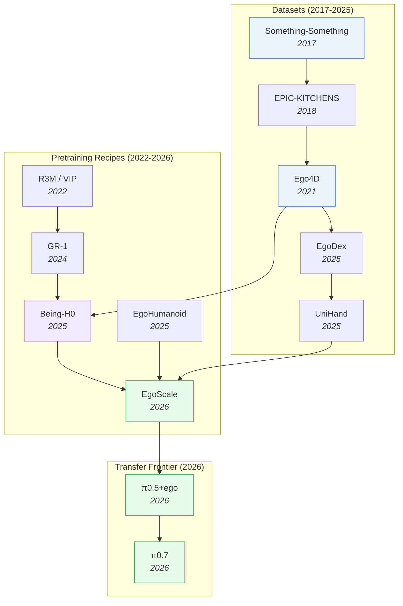

# Egocentric Pretraining & Human Video — Deep Dive

> [!abstract] Overview
> Robot teleoperation data is expensive ([[2212.06817|RT-1]]: 17 months, 13 robots, 130K demos). Egocentric human video is abundant ([[2110.07058|Ego4D]]: 3,670 hours; UniHand: 150M instruction-motion pairs). The 2026 frontier — [[2604.15483|π0.7]], [[2602.16710|EgoScale]], [[2507.15597|Being-H0]], [[2512.22414|π0.5+ego]] — converges on egocentric human video as the dominant pretraining substrate. EgoScale establishes a measurable scaling law (20,854-hour log-linear validation-loss curve), Being-H0 introduces explicit physical instruction tuning, and π0.5+ego shows that human-to-robot transfer can **emerge** as a property of diverse pretraining mixtures without explicit kinematic alignment. This note maps the egocentric data → robot pretraining pipeline: datasets, scaling laws, transfer mechanisms (hand→gripper, viewpoint alignment), and the pretraining recipes that turn human video into robot policy.

## Evolution Graph

The field evolved through three phases. **Egocentric datasets** (2017-2025) scaled from [[1706.04261|Something-Something]]'s 108K clips to UniHand's 150M instruction-motion pairs. **Pretraining recipes** (2022-2026) progressed from frozen-encoder transfer (R3M/VIP) to full VLA pretraining on human videos ([[2507.15597|Being-H0]]) to scaling-law-validated egocentric pretraining ([[2602.16710|EgoScale]]). **Transfer frontier** (2026) treats humans as another embodiment in the VLA's pretraining mixture ([[2512.22414|π0.5+ego]]), letting transfer *emerge* without explicit alignment.

| Year | Paper | Contribution |
|------|-------|-------------|
| 2017 | [[1706.04261\|Something-Something]] | First common-sense visual reasoning video benchmark |
| 2021 | [[2110.07058\|Ego4D]] | 3,670 hours egocentric video; first internet-scale ego dataset |
| 2025 | [[2505.11709\|EgoDex]] | Large-scale egocentric video for dexterous manipulation |
| 2025 | [[2507.15597\|Being-H0]] | VLA pretrained on UniHand (150M pairs) via Physical Instruction Tuning |
| 2026 | [[2605.00078\|Being-H0.7]] | Latent World-Action Model: dual-branch future-informed training replaces pixel-space WAM; **99.2%** LIBERO |
| 2026 | [[2604.27621\|Robot Learning from Human Videos Survey]] | Taxonomy of LfHV transfer: task / observation / action-oriented; **49–52%** egocentric in modern methods |
| 2025 | [[2602.10106\|EgoHumanoid]] | Robot-free egocentric demonstration → loco-manipulation; **2x** faster than teleop |
| 2026 | [[2602.16710\|EgoScale]] | 20,854-hour log-linear scaling law; **+54%** dexterous manipulation |
| 2026 | [[2512.22414\|π0.5 + ego]] | Human-to-robot transfer emerges in VLAs given diverse pretraining |
| 2026 | [[2604.15483\|π0.7]] | Steerable generalist building on egocentric pretraining frontier |
| 2026 | [[2604.18564\|MultiWorld]] | Multi-agent multi-view video world models for cross-embodiment |
| 2026 | [[2604.07457\|CMP]] | Competence-manifold projection for safe loco-manipulation transfer |
| 2026 | [[2605.09613\|SABER]] | Domain-specific ego+exo retail dataset → VLA post-training; **2.19x** SR gain on RoboBenchMart |

---

## 1. Why Egocentric Pretraining Now

> [!success] The Three Forces
> - **Data abundance**: 100x more egocentric video exists than robot data, and grows daily
> - **Embodiment alignment**: First-person hand-on-object video matches robot wrist-mounted cameras far better than third-person video
> - **Scaling laws hold**: [[2602.16710|EgoScale]] established a log-linear scaling curve over 20,854 hours; the field now has a *measurable* compute-data axis

The fundamental observation is that egocentric video captures *exactly* what a robot's wrist-mounted camera sees during manipulation: hands entering the frame from below, objects manipulated near the body, viewpoint moving with the actor's head. This kinematic alignment makes egocentric data a near drop-in replacement for robot teleoperation data — without the cost.

The most comprehensive synthesis of the field comes from [[2604.27621|Robot Learning from Human Videos Survey]] — a hierarchical taxonomy of LfHV methods organized by **what the human video supervises**: ==task-oriented== (high-level structure), ==observation-oriented== (visual embeddings, affordances), ==action-oriented== (latent actions, executable interfaces). Headline finding: the field crossed the egocentric tipping point around 2024 — **49%** of observation-oriented methods and **52%** of action-oriented methods now use egocentric viewpoints, with **44%** of action-oriented methods deployable from human videos alone via executable interfaces.

---

## 2. Egocentric Datasets

The data foundation. Each dataset specializes in a different scale-modality-coverage trade-off.

### 2.1 Foundational Visual-Reasoning Datasets

- [[1706.04261|Something-Something]]

**Something-Something** established that even simple common-sense actions ("putting something next to something else") are hard for visual reasoning. Most egocentric pretraining recipes use it as a verification benchmark for low-level common sense.

### 2.2 Internet-Scale Egocentric Video

- [[2110.07058|Ego4D]]

**Ego4D** (Meta, 2021) provides **3,670 hours** of egocentric video across 9 countries, 74 locations, with extensive narration and benchmarks for episodic memory, hands-and-objects, social interaction, and forecasting. The first dataset large enough to support VLA pretraining.

### 2.3 Dexterous-Manipulation-Focused Egocentric Data

- [[2505.11709|EgoDex]], UniHand (in [[2507.15597|Being-H0]])

**EgoDex** focuses specifically on dexterous manipulation — hand poses, object affordances, fine motor actions. **UniHand** (Being-H0's curated dataset) extends this with **150M** human hand motion-instruction pairs in standardized MANO parameters with LLM-generated task descriptions — purpose-built for VLA training.

### 2.4 Cross-Embodiment Egocentric Demonstrations

- [[2602.10106|EgoHumanoid]]

**EgoHumanoid** captures *robot-free* egocentric demonstrations specifically aligned to humanoid loco-manipulation tasks. The dataset is **~2x faster** to collect than teleoperation, and bridges the human-robot embodiment gap via a dedicated alignment pipeline.

### 2.5 Domain-Specific Egocentric+Exocentric for VLA Post-Training

- [[2605.13083|TouchAnything]], [[2605.09613|SABER]]

**TouchAnything (EgoTouch)** introduces the **first multi-view egocentric + bimanual dense tactile** dataset: **20 hours** of synchronized head-mounted + wrist-mounted egocentric video with bimanual 3D hand pose *and* dense tactile pressure maps. The accompanying **TouchAnything** framework fuses head + wrist views via a shared encoder + cross-view fusion module and uses ==view dropout training== to handle occluded contact regions — pushing Volumetric IoU **+6.1%** over egocentric-only baselines and reducing the all-view → ego-only drop from **−27.20% → −5.78%**. This is the first dataset that bridges egocentric video pretraining and *dense tactile supervision*, opening a new axis: egocentric VLAs that learn force prediction from human hand video alone.

**SABER** captures **100+ hours** of natural human activity in real grocery stores with synchronized ==egocentric== (head-worn) and ==exocentric== (stationary) cameras, then processes raw footage into **three complementary action representation streams** — ==[[2410.11758|LAPA]] latent actions==, ==Dex-Retargeting== for hand poses, ==Body Pose Retargets== for whole-body humanoid poses. Used as a domain-specific post-training layer (SABER-MM with batch-level weighting + conditional flow matching loss), it lifts NVIDIA [[2503.14734|GR00T N1.6]] on RoboBenchMart from **13.4%** to **29.3%** mean SR — a **2.19x** gain — with `close_fridge` hitting **100%** and `open_fridge` jumping from **12%** to **82%**. The result generalizes the egocentric-pretraining-then-post-training recipe from generic pretraining datasets ([[2110.07058|Ego4D]], UniHand) to *domain-specialized* datasets that target a deployment vertical.

> [!star] Key Datasets
> - [[2605.13083|TouchAnything]] — First multi-view egocentric + dense bimanual tactile dataset (**20 hr**, head + wrist + pressure maps); view dropout cuts the ego-only generalization drop from **−27.20% → −5.78%**; bridges egocentric video pretraining and tactile supervision
> - [[2605.09613|SABER]] — Domain-specific egocentric+exocentric data for retail VLA post-training; **2.19x** SR gain on RoboBenchMart
> - [[2507.15597|Being-H0]] — Introduces UniHand: 150M instruction-motion pairs in standardized MANO
> - [[2505.11709|EgoDex]] — Egocentric dexterous-manipulation video
> - [[2110.07058|Ego4D]] — 3,670-hour internet-scale egocentric video; the modern foundation

---

## 3. Scaling Laws for Egocentric Pretraining

The most important 2026 result: egocentric pretraining **obeys a scaling law**.

- [[2602.16710|EgoScale]]

**How EgoScale Established the Scaling Law**: Trained VLAs on egocentric data volumes ranging from a few hours up to **20,854 hours**. Plotted action-prediction validation loss against data scale on a log axis. The result: a **log-linear** curve — predictable improvement with each doubling of data, with strong correlation to real-robot performance. This makes egocentric data the *first* robot-pretraining substrate with provable scaling — analogous to LLM scaling laws.

**Concrete Numbers**:
- **+54%** average task completion + success rate boost on a 22-DoF dexterous robot hand
- **88%** success on shirt folding with **a single** robot demonstration
- **55%** success on bottle unscrewing with **a single** robot demonstration
- **+30%** absolute improvement on cross-embodiment 7-DoF tri-finger transfer
- Log-linear loss curve up to **20,854 hours** of pretraining data

> [!star] Key Result
> [[2602.16710|EgoScale]] — 20,854-hour log-linear scaling law for human-to-robot transfer; the first *predictable* scaling axis for robot pretraining. Future generalists will be planned against this curve.

> [!tip] The Compute-Data Axis Is Now Measurable
> Before EgoScale, robot pretraining had no scaling law — practitioners gathered "as much data as they could" without a principled stop point. EgoScale's log-linear curve enables compute-optimal training: pick the data-compute trade-off that maximizes downstream performance per dollar.

---

## 4. Pretraining Recipes — Three Generations

How the recipe evolved.

### 4.1 Generation 1: Frozen-Feature Transfer (2022)

R3M / VIP / VC-1: train a frozen visual encoder on egocentric video, then attach a separate policy head for robot tasks. Cheap and modular but loses task-relevant information. Largely superseded by 2024.

### 4.2 Generation 2: Video Pretraining + Action Decoder (2024-2025)

[[2312.13139|GR-1]] and [[2410.06158|GR-2]] pretrain a video-prediction backbone on internet video (including egocentric), then fine-tune with action heads. The video objective gives the backbone spatiotemporal priors; the action head specializes for control.

- [[2312.13139|GR-1]], [[2410.06158|GR-2]]

### 4.3 Generation 3: Full VLA Pretraining on Human Videos (2025-2026)

The 2026 frontier. Pretrain the entire VLA — vision, language, *and* action — on human videos by treating human hand motions as an action modality.

- [[2605.00078|Being-H0.7]], [[2602.16710|EgoScale]], [[2602.10106|EgoHumanoid]], [[2507.15597|Being-H0]], [[2512.22414|π0.5 + ego]], [[2604.15483|π0.7]]

**How Being-H0 Works (Physical Instruction Tuning)**: Three-stage paradigm. Stage 1: VLA pretraining on UniHand (human videos) using **Grouped Residual Quantization (GRQ-VAE)** for part-level motion tokenization — wrist and finger motions tokenized separately. Stage 2: physical-space alignment (weak-perspective projection alignment + view-invariant motion distribution balancing) unifies heterogeneous video sources. Stage 3: post-training on robot data adapts the human-hand actions to robot end-effectors. Result: **99.8-100%** valid generation rate, beating [[2503.14734|GR00T N1.5]] on MPJPE; **25%** of teleop data matches **50-100%** baselines.

**How π0.5+ego Works (Co-Training Recipe)**: The simplest possible recipe: integrate egocentric human video directly into a pre-trained VLA's training mixture. **Treat humans as another embodiment** — same low-level action and high-level subtask prediction objectives, **no explicit kinematic alignment**. A scalable data pipeline uses head-worn + optional wrist-mounted cameras with 6D pose + 3D hand keypoint estimation. Result: scene generalization (Spice) **32→71%**, Dresser **25→50%**, egg-sorting **57→78%**. Critically: transfer **emerges** as a property of diverse pretraining — analogous to LLM emergent abilities.

**How EgoHumanoid Works (Cross-Embodiment Loco-Manipulation)**: Designed for humanoid robots in the wild. Robot-free egocentric demos are collected via a head-worn camera; an alignment pipeline retargets human body motion to humanoid joint trajectories. Training is **2x faster** than teleoperation while yielding superior generalization across diverse real-world environments.

**How EgoScale Works (Two-Stage with Mid-Training)**: Stage 1: extensive human pretraining on **20,854 hours**. Stage 2: **mid-training** on a smaller embodiment-aligned human-robot dataset — bridges the embodiment gap before final fine-tuning. The mid-training phase is the secret to log-linear scaling holding at large data volumes.

**How Being-H0.7 Pushes Egocentric Pretraining into Latent Reasoning**: The egocentric successor to Being-H0 replaces the pixel-space WAM prediction with a **latent world-action model**: a dual-branch transformer where a deployable "prior" branch is aligned at training time to a "posterior" branch that receives privileged future embeddings from egocentric video. The posterior branch effectively says "given that this is what happens next, what should the latent state look like now?" — and the prior branch is regularized to match it. Implemented as a Mixture-of-Transformers with shared context and per-branch attention masks. Net effect: egocentric pretraining still teaches *what humans do with their hands*, but the latent space now also encodes *anticipated future evolution* — and at deployment the heavy posterior branch is dropped, leaving a 3-4 ms/step policy that achieves **99.2%** [[2306.03310|LIBERO]], **62.1%** [[2406.02523|RoboCasa]], and **67.5%** in real-world Dynamic Scene suites.

> [!star] Key Recipes
> - [[2507.15597|Being-H0]] — Physical Instruction Tuning + GRQ-VAE part-level motion tokens; **99.8-100%** valid generation
> - [[2605.00078|Being-H0.7]] — Egocentric pretraining + latent dual-branch reasoning; replaces pixel WAM with implicit latent prediction; SOTA on LIBERO/RoboCasa at 3-4 ms/step
> - [[2602.16710|EgoScale]] — Log-linear scaling law via two-stage human-pretraining + mid-training; **+54%** on 22-DoF dexterous hand
> - [[2512.22414|π0.5 + ego]] — Co-training recipe: humans as another embodiment, transfer emerges from diverse pretraining
> - [[2602.10106|EgoHumanoid]] — Robot-free egocentric demos for humanoid loco-manipulation; **~2x** faster than teleop
> - [[2604.15483|π0.7]] — Steerable generalist VLA building on egocentric pretraining frontier

> [!tip] Co-Train, Don't Align
> The 2026 surprise: explicit kinematic alignment between human and robot hands is *not necessary*. π0.5+ego's "treat humans as another embodiment" recipe — feeding human videos into the training mixture with the same loss as robot data — achieves better transfer than aligned approaches. The VLA's diverse pretraining produces embodiment-agnostic representations on its own.

---

## 5. Transfer Mechanisms — Hand → Gripper

The kinematic gap is real: human hands have 22+ DoF; most grippers have 1-7. How does training on hand-rich data help control simple grippers?

| Mechanism | What It Does | Used In |
|-----------|--------------|---------|
| **Part-level tokenization** | Tokenize wrist + fingers separately; lower DoF for gripper inherited from wrist tokens | [[2507.15597\|Being-H0]] |
| **MANO parameterization** | Standardize human hand on a 51-parameter MANO model; project to gripper actions | [[2507.15597\|Being-H0]] |
| **6D pose + keypoint estimation** | Reduce hand video to 6D pose + 3D keypoints; align across embodiments | [[2512.22414\|π0.5 + ego]] |
| **Treat as another embodiment** | No explicit projection; let the VLA's pretraining absorb the gap | [[2512.22414\|π0.5 + ego]] |
| **Embodiment-aligned mid-training** | Small dataset on the target embodiment to bridge the final gap | [[2602.16710\|EgoScale]] |
| **Robot-free egocentric retargeting** | Capture egocentric demos; retarget at policy time via competence-manifold projection | [[2602.10106\|EgoHumanoid]], [[2604.07457\|CMP]] |

> [!star] Key Papers
> - [[2512.22414|π0.5 + ego]] — "Treat humans as another embodiment" recipe; transfer **emerges** from diverse pretraining without explicit kinematic alignment
> - [[2507.15597|Being-H0]] — MANO + GRQ-VAE part-level motion tokens; the canonical explicit-projection approach for hand→gripper transfer
> - [[2604.07457|CMP]] — Competence-manifold projection for safe loco-manipulation transfer; the safety-critical projection method

> [!tip] Three Strategies, One Insight
> All transfer mechanisms ultimately do the same thing: project the high-DoF human hand into a representation the robot policy can consume. Whether the projection is explicit (MANO, keypoints) or learned (treat-as-embodiment), the *amount* of data matters more than the *form* of the projection. EgoScale's log-linear law holds across multiple projection schemes.

---

## 6. Egocentric Pretraining Meets WAMs

Egocentric video is also the dominant pretraining substrate for video-WAMs. The pipelines converge in 2026.

- [[2604.18564|MultiWorld]], [[2603.16666|Fast-WAM]], [[2602.15922|DreamZero]], [[2410.06158|GR-2]], [[2312.13139|GR-1]]

**How MultiWorld Bridges Egocentric and Multi-View**: Multi-agent multi-view video world models can ingest both egocentric (single-view, head-worn) and exocentric (multi-camera) video. The Multi-Agent Condition Module (MACM) and Global State Encoder (GSE) handle variable view counts — making egocentric video a strict subset of the model's input space rather than a special case.

**The Convergence Pattern**: Modern generalist VLAs ([[2604.15483|π0.7]], [[2604.20100|JoyAI-RA]]) use *both* egocentric pretraining (for action priors) and video-WAM pretraining (for spatiotemporal priors). The two pretraining objectives are orthogonal: egocentric data teaches *what humans do with their hands*; video-WAM data teaches *how the world responds*.

> [!star] Key Papers
> - [[2604.18564|MultiWorld]] — Multi-agent multi-view video world models; egocentric video is a strict subset of the model's input space
> - [[2604.15483|π0.7]] — Steerable generalist combining egocentric pretraining + video-WAM pretraining; the current generalist SOTA

> [!success] The 2026 Stack
> Diverse cross-embodiment pretraining ([[2310.08864|OXE]]) + egocentric human pretraining ([[2110.07058|Ego4D]], [[2505.11709|EgoDex]], UniHand) + video-WAM pretraining (Cosmos, DreamZero) → flow-matching action head → in-domain post-training. This is the recipe behind π0.7, JoyAI-RA, and the next generation of generalist VLAs.

---

## 7. Open Problems

- **Long-tail egocentric distribution**: [[2110.07058|Ego4D]] / [[1706.04261|Something-Something]] / [[2505.11709|EgoDex]] over-represent kitchen + tabletop tasks. Egocentric data for industrial assembly, surgery, outdoor manipulation is scarce.
- **Annotation gap**: Pretraining is unsupervised, but evaluation needs ground-truth action labels. Diagnostic egocentric benchmarks (LIBERO-Para-Ego?) don't yet exist.
- **Embodiment-specific scaling laws**: [[2602.16710|EgoScale]]'s 20,854-hour log-linear holds for 22-DoF dexterous hands. Does it hold for humanoid full-body, mobile manipulators, or quadrupeds? Open.
- **Privacy and bias**: Egocentric video contains personally identifying information and reflects collector demographics. Trustworthy, privacy-respecting egocentric pretraining is unsolved.
- **Reasoning vs reflex from human video**: Most egocentric pretraining teaches motor patterns. Learning *reasoning* from human video (planning, error recovery) is a separate, less-studied problem.

---

## Quick-Reference Matrix

| Question | Answer |
|----------|--------|
| Need an egocentric dataset? | [[2110.07058\|Ego4D]] (general), [[2505.11709\|EgoDex]] (dexterous), or [[2605.09613\|SABER]] (domain-specific retail) |
| Need scaling-law-grade pretraining? | [[2602.16710\|EgoScale]] (20,854-hour log-linear) |
| Need full-VLA human pretraining? | [[2507.15597\|Being-H0]] (Physical Instruction Tuning) or [[2605.00078\|Being-H0.7]] (latent dual-branch reasoning) |
| Need a survey of human→robot transfer? | [[2604.27621\|Robot Learning from Human Videos Survey]] (task/observation/action-oriented taxonomy) |
| Need a co-training recipe? | [[2512.22414\|π0.5 + ego]] (treat humans as another embodiment) |
| Need humanoid loco-manipulation? | [[2602.10106\|EgoHumanoid]] (~2x faster than teleop) |
| Need multi-view + egocentric? | [[2604.18564\|MultiWorld]] |
| Need the current generalist SOTA? | [[2604.15483\|π0.7]] (egocentric-pretrained) |
| Need safe loco-manipulation transfer? | [[2604.07457\|CMP]] |

---

## Cross-References

- [[01_Embodied-AI-101]] — Embodied AI basics; egocentric pretraining is a fourth branch alongside VLA / WAM / self-evolving
- [[02_Dataset-Benchmark-Environment]] — Dataset deep-dive ([[2110.07058|Ego4D]], [[2505.11709|EgoDex]], [[1706.04261|Something-Something]] all live here)
- [[03_VLA]] — VLA deep-dive; §1 generalist VLAs ([[2604.15483|π0.7]], [[2512.22414|π0.5+ego]]) build on egocentric pretraining
- [[04_WAM]] — WAM deep-dive; §2 video pretraining for robot policies overlaps egocentric pretraining
- [[05_Latent-World-Models]] — Latent world models; some egocentric-pretrained VLAs use latent prediction
- [[06_Self-Evolving-VLA-WAM]] — Self-evolution; egocentric pretraining provides robust priors that resist forgetting
- [[07_Physics-Aware-Embodied-AI]] — Physics priors complement egocentric pretraining for the 2026 generalist stack
- [[08_VLA-Reasoning-and-CoT]] — Reasoning-augmented VLAs that consume egocentric pretraining

---

*See [[03_VLA]] for the broader VLA design space, [[02_Dataset-Benchmark-Environment]] for dataset details, or [[01_Embodied-AI-101]] to start from the basics.*
