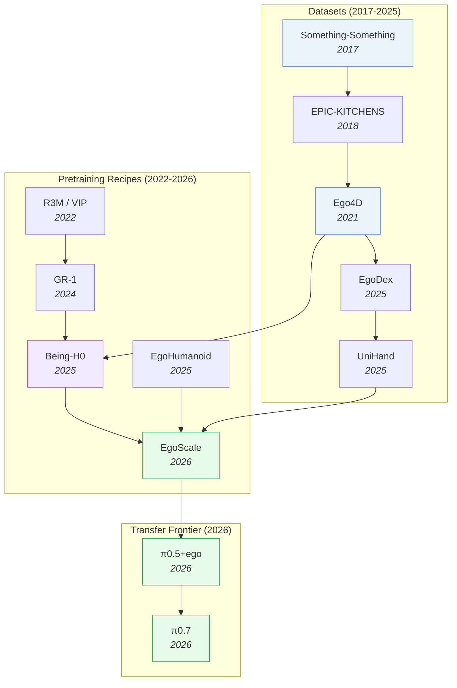

# Egocentric Pretraining & Human Video — Deep Dive

> [!abstract] Overview
> Robot teleoperation data is expensive ([[2212.06817|RT-1]]: 17 months, 13 robots, 130K demos). Egocentric human video is abundant ([[2110.07058|Ego4D]]: 3,670 hours; UniHand: 150M instruction-motion pairs). The 2026 frontier — [[2604.15483|π0.7]], [[2602.16710|EgoScale]], [[2507.15597|Being-H0]], [[2512.22414|π0.5+ego]] — converges on egocentric human video as the dominant pretraining substrate. [[2602.16710|EgoScale]] establishes a measurable scaling law (20,854-hour log-linear validation-loss curve), [[2507.15597|Being-H0]] introduces explicit physical instruction tuning, and [[2512.22414|π0.5+ego]] shows that human-to-robot transfer can **emerge** as a property of diverse pretraining mixtures without explicit kinematic alignment. This note maps the egocentric data → robot pretraining pipeline: datasets, scaling laws, transfer mechanisms (hand→gripper, viewpoint alignment), and the pretraining recipes that turn human video into robot policy.

## Evolution Graph

The field evolved through three phases. **Egocentric datasets** (2017-2025) scaled from [[1706.04261|Something-Something]]'s 108K clips to UniHand's 150M instruction-motion pairs. **Pretraining recipes** (2022-2026) progressed from frozen-encoder transfer (R3M/VIP) to full VLA pretraining on human videos ([[2507.15597|Being-H0]]) to scaling-law-validated egocentric pretraining ([[2602.16710|EgoScale]]). **Transfer frontier** (2026) treats humans as another embodiment in the VLA's pretraining mixture ([[2512.22414|π0.5+ego]]), letting transfer *emerge* without explicit alignment.

| Year | Paper | Contribution |
|------|-------|-------------|
| 2017 | [[1706.04261\|Something-Something]] | First common-sense visual reasoning video benchmark |
| 2021 | [[2110.07058\|Ego4D]] | 3,670 hours egocentric video; first internet-scale ego dataset |
| 2025 | [[2505.11709\|EgoDex]] | Large-scale egocentric video for dexterous manipulation |
| 2025 | [[2507.15597\|Being-H0]] | VLA pretrained on UniHand (150M pairs) via Physical Instruction Tuning |
| 2026 | [[2605.00078\|Being-H0.7]] | Latent World-Action Model: dual-branch future-informed training replaces pixel-space WAM; **99.2%** [[2306.03310\|LIBERO]] |
| 2026 | [[2604.27621\|Robot Learning from Human Videos Survey]] | Taxonomy of LfHV transfer: task / observation / action-oriented; **49–52%** egocentric in modern methods |
| 2025 | [[2602.10106\|EgoHumanoid]] | Robot-free egocentric demonstration → loco-manipulation; **2x** faster than teleop |
| 2026 | [[2602.16710\|EgoScale]] | 20,854-hour log-linear scaling law; **+54%** dexterous manipulation |
| 2026 | [[2512.22414\|π0.5 + ego]] | Human-to-robot transfer emerges in VLAs given diverse pretraining |
| 2026 | [[2604.15483\|π0.7]] | Steerable generalist building on egocentric pretraining frontier |
| 2026 | [[2604.18564\|MultiWorld]] | Multi-agent multi-view video world models for cross-embodiment |
| 2026 | [[2604.07457\|CMP]] | Competence-manifold projection for safe loco-manipulation transfer |
| 2026 | [[2605.09613\|SABER]] | Domain-specific ego+exo retail dataset → VLA post-training; **2.19x** SR gain on [[2511.10276|RoboBenchMart]] |

---

## Part A — Motivation & Data

*Why egocentric pretraining now, the dataset landscape, and the scaling laws that govern it.*

### 1. Why Egocentric Pretraining Now

Egocentric video captures *exactly* what a robot's wrist-mounted camera sees during manipulation: hands entering the frame from below, objects manipulated near the body, viewpoint moving with the actor's head. This kinematic alignment makes egocentric data a near drop-in replacement for robot teleoperation data — without the cost. The 2024–2026 transition wasn't simply "adding egocentric to the pretraining mix" — it redefined *what kind of data scales*: teleoperation produces minutes-per-dollar, egocentric video produces hours-per-dollar.

Three converging forces — **data abundance**, **embodiment alignment**, and **provable scaling** — make egocentric the dominant pretraining substrate for VLAs going into 2026. The field has crossed a measurable tipping point, quantified by [[2604.27621|Robot Learning from Human Videos Survey]] (the hierarchical LfHV taxonomy: ==task-oriented==, ==observation-oriented==, ==action-oriented==).

#### 1.1 Data Abundance

Egocentric video outscales every teleoperation pipeline by orders of magnitude and grows autonomously from internet head-cam footage. The abundance changes the economics of robot foundation models — the data-axis now dominates the architectural one.

- **[[2110.07058|Ego4D]]** — **3,670 hours** of egocentric video across 9 countries / 74 locations with extensive narration; benchmarks for episodic memory, hands-and-objects, social interaction, forecasting. First dataset large enough to anchor VLA pretraining at internet scale; now a default first stage for generalist VLAs ([[2604.15483|π0.7]], [[2604.20100|JoyAI-RA]]).
- **[[2604.27621|Robot Learning from Human Videos Survey]]** — hierarchical taxonomy organized by *what the human video supervises*: ==task-oriented==, ==observation-oriented==, ==action-oriented==. Quantifies the 2024 tipping point: **49%** of observation-oriented and **52%** of action-oriented methods now use egocentric viewpoints; **44%** of action-oriented methods deployable from human video alone via executable interfaces. The field-wide accounting of the shift.
- **Internet-scale corpora** (YouTube head-cam, body-worn datasets) — orders of magnitude larger than [[2310.08864|OXE]]-scale robot data; grow autonomously without curation pipelines. Compound with the [[2602.16710|EgoScale]] curve (§1.3): each doubling of human-video hours yields predictable robot-policy improvement at zero marginal data-collection cost.

#### 1.2 Embodiment Alignment

First-person hand-on-object video matches robot wrist-mounted cameras far better than third-person video, making the pretraining → deployment hop a *fine-tune* rather than a domain shift. This alignment is *why* egocentric pretraining transfers cleanly where pure third-person internet-video pretraining does not.

- **[[2602.10106|EgoHumanoid]]** — *Robot-free* egocentric demonstrations aligned to humanoid loco-manipulation via a portable ==VR-based collection rig==, ==depth-based view alignment==, and ==unified 6-DoF delta end-effector poses== with discrete locomotion commands; a single co-trained VLA omits proprioception. **+19pp** in-domain SR (**78% vs 59%**) and **+51pp** novel-environment generalization (**82% vs 31%**) over robot-only, at **~2×** collection speed — proves embodiment-alignment can be solved at *data-collection time* (cheaper than policy-layer retargeting).
- **[[2512.22414|π0.5+ego]]** — co-training recipe: integrates egocentric human video directly into a pre-trained VLA's training mixture with the same loss objectives as robot data. No explicit kinematic alignment; the "treat humans as another embodiment" approach. Scene generalization **32 → 71%**, Dresser **25 → 50%**, egg-sorting **57 → 78%**.
- **[[2604.15483|π0.7]]** — Current generalist SOTA: a **5B**-parameter VLA with ==multimodal context conditioning== over subtask instructions, ==multi-view subgoal images== (learned WM-generated), and ==episode metadata==, trained on diverse robot + autonomous + egocentric human + auxiliary data under a ==Knowledge Insulation== recipe with ==prompt dropout==. Out-of-the-box matches task-specific fine-tunes on espresso/box-building/laundry-folding and inherits egocentric pretraining as a near-native modality via wrist-mounted-camera architecture matching the head/wrist-mounted egocentric pretraining corpora — no separate alignment stage.
- **[[2604.27621|LfHV Survey]] finding** — **44%** of action-oriented LfHV methods are deployable from human video alone via executable interfaces, requiring zero robot trajectory data. Confirms the structural depth of the alignment convergence.

#### 1.3 Scaling Laws Hold

Egocentric pretraining obeys a *log-linear* scaling curve, making it the first robot-pretraining substrate with a measurable compute-data axis. Before 2026, robot pretraining had no scaling law — the shift changes how the field budgets pretraining runs.

- **[[2602.16710|EgoScale]]** — first log-linear scaling curve for any robot-pretraining substrate, validated up to **20,854 hours**; **+54%** task SR on 22-DoF dexterous hand; **88%** shirt-folding from a *single* robot demo; **55%** bottle-unscrewing from a single demo; **+30%** cross-embodiment improvement on 7-DoF tri-finger transfer. Two-stage recipe (broad human pretraining → embodiment-aligned mid-training) keeps the curve flat at scale; strong correlation with real-robot performance makes it *deployment-predictive*. See §3 for open frontiers the curve doesn't yet cover.

**Egocentric Substrate — Decision Matrix**

| Need | Recommended substrate |
|---|---|
| Largest available pretraining corpus | [[2110.07058\|Ego4D]] (**3,670 hr**) |
| Predictable scale-loss curve for budgeting | [[2602.16710\|EgoScale]] recipe over multi-source egocentric |
| Humanoid loco-manipulation transfer | [[2602.10106\|EgoHumanoid]] |
| Dexterous-hand priors (MANO-standardized) | UniHand in [[2507.15597\|Being-H0]] (**150M** pairs) |
| Tactile + egocentric vision in one stack | [[2605.13083\|TouchAnything]] (EgoTouch) |
| Domain-vertical post-training (retail, kitchen) | [[2605.09613\|SABER]] (**2.19×** SR gain on [[2511.10276\|RoboBenchMart]]) |
| Field-wide synthesis & taxonomy | [[2604.27621\|LfHV Survey]] |

> [!star] Key Papers
> - [[2604.27621|LfHV Survey]] — hierarchical taxonomy of human-video supervision (task / observation / action); quantifies the 2024 egocentric tipping point with **49% / 52% / 44%** adoption metrics — the first principled accounting of the shift
> - [[2602.16710|EgoScale]] — establishes log-linear scaling over **20,854 hours**; **+54%** task SR on 22-DoF dexterous hand; first proof that egocentric pretraining has a *measurable* compute-data axis (the field's "Chinchilla moment")
> - [[2110.07058|Ego4D]] — **3,670 hours** canonical foundation across 9 countries; defines the internet-scale tier every subsequent dataset benchmarks against
> - [[2507.15597|Being-H0]] — introduces UniHand: **150M** MANO-standardized motion-instruction pairs purpose-built for VLA training; turns raw egocentric video into trainable action priors
> - [[2602.10106|EgoHumanoid]] — first robot-free egocentric corpus targeting humanoid embodiment alignment; **~2×** collection-speed advantage over teleoperation

> [!tip] Egocentric Is the New Pretraining Substrate
> The economic shift is the load-bearing claim: teleoperation produces minutes-per-dollar, egocentric video produces hours-per-dollar, and [[2602.16710|EgoScale]]'s log-linear curve guarantees that the additional hours actually compound into capability. This is why every 2026 generalist VLA includes egocentric pretraining as a default stage — not as a niche augmentation. Cross-reference [[03_VLA#6. RL Post-Training for VLAs]] for how egocentric pretraining + RL post-training compose, [[04_WAM#2. VideoGen WAMs]] for the WAM-side reuse of the same corpora as video-prediction substrate, and [[10_Force-Aware-and-Tactile-Policies#4.1 Vision-to-Tactile Prediction — Closing the Supervision Bottleneck]] for the tactile axis being added on top via [[2605.13083|TouchAnything]].

---

### 2. Egocentric Datasets

The data foundation. Each dataset specializes in a different scale-modality-coverage trade-off.

#### 2.1 Foundational Visual-Reasoning Datasets

Common-sense action recognition substrates used as low-level verification benchmarks for egocentric pretraining.

- **[[1706.04261|Something-Something]]** — **108,499** crowd-acted clips across **174** fine-grained ==human-object interaction== classes (e.g. "putting something next to something else") built via ==natural-language caption-templates== with ==contrastive "pretending" examples==; standard 2D+3D-CNN baselines top out at **44.9%** top-1 error on 10 classes and **88.5%** on all 174 — established that even simple actions are hard for visual reasoning, and remains a verification benchmark for low-level common sense in most egocentric pretraining recipes.

#### 2.2 Internet-Scale Egocentric Video

Large, diverse first-person video corpora that anchor the *scale* tier of egocentric pretraining.

- **[[2110.07058|Ego4D]]** — **3,670 hours** of egocentric video across 9 countries / 74 locations with extensive narration; benchmarks for episodic memory, hands-and-objects, social interaction, and forecasting. The first dataset large enough to support VLA pretraining at internet scale.

#### 2.3 Dexterous-Manipulation-Focused Egocentric Data

Specialist egocentric datasets that target fine motor / dexterous-hand action priors rather than general activity.

- **[[2505.11709|EgoDex]]** — **829 hr** ==Apple Vision Pro== egocentric video with **338,000** demos across **194** tabletop manipulation tasks, annotated at **30 Hz** with ==SE(3) poses== for head, shoulders, arms, and **25** finger joints via ==ARKit==; benchmarks ==dexterous trajectory prediction== and ==visually goal-conditioned inverse dynamics==. Flow-matching + diffusion policies beat BC when K>1, performance scales with data, and visual goal-conditioning gives **22%** average-distance reduction — specialist substrate for dexterity-focused action-decoder training.
- **UniHand** (curated dataset in **[[2507.15597|Being-H0]]**) — **150M** human-hand motion-instruction pairs in standardized MANO parameters with LLM-generated task descriptions. Purpose-built for VLA training; turns raw egocentric video into trainable action priors.

#### 2.4 Cross-Embodiment Egocentric Demonstrations

Robot-free egocentric corpora collected specifically to bridge the human-robot embodiment gap.

- **[[2602.10106|EgoHumanoid]]** — *Robot-free* egocentric demonstrations aligned to humanoid loco-manipulation via ==depth-based view alignment== + ==unified 6-DoF delta end-effector poses==; **~2×** faster to collect than teleoperation and **+51pp** generalization to novel environments (**82% vs 31%**) for the co-trained VLA. Dedicated alignment pipeline bridges the human-robot embodiment gap at *data-collection time* rather than at training or policy time.
- **[[2503.13441|PH2D]]** — Large-scale task-oriented egocentric demo dataset via *consumer-grade VR* (**~3.02M** frames / **~27k** demos); paired with ==Human Action Transformer (HAT)== — a unified behavior policy co-trained on mixed human/robot data over a **54-dim** state-action space common to humans and humanoids; co-training with PH2D delivers **~100%** relative OOD generalization on novel objects/backgrounds/placements vs robot-only; consumer-VR data collection **~5×** faster than teleop (**4.09s** vs **19.72s** grasping). The cleanest "treat humans as another embodiment" recipe at scale.

#### 2.5 Domain-Specific Egocentric+Exocentric for VLA Post-Training

Domain-vertical egocentric (+ exocentric) corpora used as a post-training layer to specialize generalist VLAs.

- **[[2605.13083|TouchAnything]]** (EgoTouch) — **first multi-view egocentric + bimanual dense tactile** dataset: **20 hours** of synchronized head + wrist egocentric video with bimanual 3D hand pose *and* dense tactile pressure maps. The accompanying framework fuses head + wrist via shared encoder + cross-view fusion with ==view dropout training==; pushes Volumetric IoU **+6.1%** over egocentric-only baselines and reduces the all-view → ego-only drop from **−27.20% → −5.78%**. First dataset bridging egocentric video pretraining and *dense tactile supervision*.
- **[[2605.09613|SABER]]** — **100+ hours** of real grocery-store human activity with synchronized ==egocentric== + ==exocentric== cameras; processed into three action streams (==[[2410.11758|LAPA]] latent actions==, ==Dex-Retargeting==, ==Body Pose Retargets==). Used as a domain-specific post-training layer (SABER-MM with conditional flow matching loss), lifts NVIDIA [[2503.14734|GR00T N1.6]] on [[2511.10276|RoboBenchMart]] from **13.4% → 29.3%** mean SR (**2.19×** gain); `close_fridge` **100%**, `open_fridge` **12% → 82%**. Generalizes the egocentric-pretraining-then-post-training recipe to deployment verticals.

**Dataset — Decision Matrix**

| Need | Dataset |
|---|---|
| Internet-scale general egocentric pretraining | [[2110.07058\|Ego4D]] (**3,670 hr**) |
| Low-level visual common-sense verification | [[1706.04261\|Something-Something]] |
| Dexterous-manipulation priors (MANO-aligned) | [[2505.11709\|EgoDex]] + UniHand in [[2507.15597\|Being-H0]] (**150M** pairs) |
| Humanoid embodiment alignment | [[2602.10106\|EgoHumanoid]] |
| Multi-view bimanual + dense tactile | [[2605.13083\|TouchAnything]] (EgoTouch) |
| Retail/grocery vertical post-training | [[2605.09613\|SABER]] (**2.19×** SR gain on [[2511.10276\|RoboBenchMart]]) |

> [!star] Key Datasets
> - [[2605.13083|TouchAnything]] — First multi-view egocentric + dense bimanual tactile dataset (**20 hr**, head + wrist + pressure maps); view dropout cuts the ego-only generalization drop from **−27.20% → −5.78%**; bridges egocentric video pretraining and tactile supervision
> - [[2605.09613|SABER]] — Domain-specific egocentric+exocentric data for retail VLA post-training; **2.19x** SR gain on [[2511.10276|RoboBenchMart]]
> - [[2507.15597|Being-H0]] — Introduces UniHand: 150M instruction-motion pairs in standardized MANO
> - [[2505.11709|EgoDex]] — Egocentric dexterous-manipulation video
> - [[2110.07058|Ego4D]] — 3,670-hour internet-scale egocentric video; the modern foundation

> [!tip] Dataset Choice Drives Recipe Choice
> Choosing between [[2110.07058|Ego4D]]'s scale and [[2505.11709|EgoDex]]'s dexterity isn't just a data decision — it constrains the *downstream recipe*. Internet-scale corpora support frozen-feature pretraining and broad VLA generalization; dexterity-focused corpora (UniHand, EgoDex) support action-decoder training; tactile-augmented corpora ([[2605.13083|TouchAnything]]) open a separate force-aware track. Cross-reference [[02_Dataset-Benchmark-Environment#1. Cross-Embodiment Scale Datasets]] for the broader cross-embodiment landscape (Ego4D alongside [[2310.08864|OXE]], DROID, AgiBot), and [[03_VLA#1. Design-Space Principles]] for how dataset choice constrains backbone selection per the [[2412.14058|RoboVLMs]] 600-experiment study.

---

### 3. Scaling Laws for Egocentric Pretraining

The 2026 result that anchors egocentric pretraining as a foundation-model strategy: it obeys a **log-linear scaling law** — the first such curve established for *any* robot-pretraining substrate. This makes the field's compute-data trade-off a tractable optimization for the first time: practitioners can plan against a predictable curve rather than gather "as much as possible" without a stopping rule.

The curve was established by [[2602.16710|EgoScale]] using a two-stage recipe (broad human pretraining → embodiment-aligned mid-training) on **20,854 hours** of heterogeneous egocentric data. Two open questions follow naturally: *how far does this curve extend?*, and *which axes (embodiment, modality, domain) preserve its slope?*

#### 3.1 The Established Curve

[[2602.16710|EgoScale]] proves log-linear scaling on heterogeneous human-video data with predictable real-robot transfer — the result that turns egocentric pretraining from a research curiosity into a *planned* foundation-model stage.

- **[[2602.16710|EgoScale]]** — log-linear loss curve over **20,854 hours** of heterogeneous egocentric data; strong correlation with real-robot performance (not just validation loss) makes it *deployment-predictive*. **+54%** task SR on 22-DoF dexterous hand; **88%** shirt-folding from a single robot demo; **55%** bottle-unscrewing from a single demo; **+30%** cross-embodiment improvement on 7-DoF tri-finger transfer. Two-stage recipe (broad human pretraining → embodiment-aligned mid-training) keeps the curve flat at scale; without mid-training the slope collapses earlier. Methodological contribution: gives the field a *predictable* axis to plan compute against rather than gathering data without a stopping rule.

#### 3.2 Open Scaling Frontiers

Questions the [[2602.16710|EgoScale]] curve doesn't yet answer — the next research agenda for egocentric scaling beyond the established 22-DoF dexterous-hand regime.

- **Embodiment-specific curves** — does humanoid loco-manipulation scale at the same slope as dexterous hand manipulation, or does each embodiment need its own curve?
- **Modality-mixed scaling** — adding tactile inputs ([[2605.13083|TouchAnything]]) or force telemetry to the pretraining mix may shift the curve; not yet quantified
- **Long-tail domain coverage** — most egocentric data is kitchen / tabletop; scaling on outdoor, industrial, or healthcare environments is unmeasured
- **Distillation efficiency** — can the EgoScale curve be reproduced with **<20K hours** of higher-quality curated data? (analogous to LLM data-quality scaling laws)

**Scaling — Decision Matrix**

| Need | Recommendation |
|---|---|
| Budget egocentric pretraining (predictable ROI) | [[2602.16710\|EgoScale]] two-stage recipe |
| Maximize cross-embodiment transfer | Broad human pretraining → embodiment-aligned mid-training |
| Single-demo task specialization | [[2602.16710\|EgoScale]]-pretrained backbone + 1-demo fine-tune (**88%** shirt-folding precedent) |
| Push past 20K hours | Open question — no published data beyond the [[2602.16710\|EgoScale]] curve |
| Compute-optimal data sizing | Pick the point on the log-linear curve matching available compute |

> [!star] Key Papers
> - [[2602.16710|EgoScale]] — **20,854-hour** log-linear scaling law for human-to-robot transfer; **+54%** task SR on 22-DoF hand; **88%** shirt-folding from a *single* demo; the first *predictable* scaling axis for robot pretraining — every future generalist will be planned against this curve
> - [[2604.27621|LfHV Survey]] — provides the field-wide context: scaling-law adoption is one prong of the broader 2024 egocentric tipping point, not an isolated result
> - [[2110.07058|Ego4D]] — anchors the lower end of the EgoScale curve with **3,670 hours**; without it the scaling axis would have no foundation tier to start from

> [!tip] The Compute-Data Axis Is Now Measurable
> Before [[2602.16710|EgoScale]], robot pretraining had no scaling law — practitioners gathered "as much data as they could" without a principled stop point. [[2602.16710|EgoScale]]'s log-linear curve enables *compute-optimal* training: pick the data-compute trade-off that maximizes downstream performance per dollar. The open frontier — embodiment-specific curves, modality-mixed scaling, long-tail domain coverage — is now framed as a tractable research agenda. Cross-reference [[03_VLA#1. Design-Space Principles]] for how the [[2412.14058|RoboVLMs]] 600-experiment study mapped the design-space empirically, and [[06_Self-Evolving-VLA-WAM#3. Core Mechanisms of Self-Evolution]] for how self-evolution might *extend* the scaling curve via synthetic-data generation.

---

## Part B — Methods & Integration

*Three generations of pretraining recipes, hand→gripper transfer mechanisms, and integration with WAMs.*

### 4. Pretraining Recipes — Three Generations

How the recipe evolved — from frozen-feature transfer through video pretraining to full VLA-on-human-video.

#### 4.1 Generation 1: Frozen-Feature Transfer (2022)

Train a frozen visual encoder on egocentric video, then attach a separate policy head for robot tasks. Cheap and modular but loses task-relevant information — largely superseded by 2024.

- **R3M / VIP / VC-1** — canonical Generation-1 frozen-encoder recipes. Visual representations only; no action awareness in the pretraining stage. Effective baseline for low-data robot tasks but capped well below modern recipes.

#### 4.2 Generation 2: Video Pretraining + Action Decoder (2024–2025)

Pretrain a video-prediction backbone on internet video (including egocentric), then fine-tune with action heads. The video objective gives spatiotemporal priors; the action head specializes for control.

- **[[2312.13139|GR-1]]** — Pioneer ==GPT-style decoder-only transformer== with two-phase training: ==language-conditioned video generative pre-training== on **800k** Ego4D clips, then finetune on CALVIN + real-robot data using frozen ==CLIP text== + ==MAE ViT== encoders and jointly-predicted actions/future frames via ==[ACT]/[OBS] tokens==. **94.9%** CALVIN multi-task (vs HULC **88.9%**), **+32.1pp** zero-shot unseen-scene generalization, **0.79** real-world transport SR (vs RT-1 **0.27**) — demonstrates spatiotemporal pretraining transfers to robot control.
- **[[2410.06158|GR-2]]** — Generation-2 ==GPT-style transformer== over tokenized text/video/actions with two-stage training: ==video-language pre-training on 38M== diverse clips, then fine-tune with a ==conditional VAE== for diverse action trajectories. **97.7%** multi-task tabletop SR, **79.0%** industrial bin-picking (vs GR-1 **35.9%**), **98.6%** CALVIN single-task with **4.64** task-sequence length — the foundational architecture the modern co-pretraining recipe extends.

#### 4.3 Generation 3: Full VLA Pretraining on Human Videos (2025–2026)

The 2026 frontier. Pretrain the entire VLA — vision, language, *and* action — on human videos by treating human hand motions as an action modality.

- **[[2507.15597|Being-H0]]** (Physical Instruction Tuning) — three-stage paradigm: Stage 1 VLA pretraining on UniHand via **Grouped Residual Quantization (GRQ-VAE)** for part-level (wrist + finger separate) motion tokenization; Stage 2 physical-space alignment (weak-perspective projection + view-invariant motion distribution balancing); Stage 3 post-training on robot data. **99.8–100%** valid generation rate, beating [[2503.14734|GR00T N1.5]] on MPJPE; **25%** of teleop data matches **50–100%** baselines.
- **[[2605.00078|Being-H0.7]]** (Latent Dual-Branch) — egocentric successor that replaces pixel WAM with a **latent world-action model**: dual-branch transformer where a deployable "prior" branch is aligned at training to a "posterior" branch receiving privileged future embeddings from egocentric video. Mixture-of-Transformers with per-branch attention masks; deploy-time heavy posterior is dropped. **3–4 ms/step** policy; **99.2%** [[2306.03310|LIBERO]], **62.1%** [[2406.02523|RoboCasa]], **67.5%** real-world Dynamic Scene.
- **[[2602.16710|EgoScale]]** (Two-Stage Mid-Training) — Stage 1 extensive human pretraining on **20,854 hours**; Stage 2 mid-training on smaller embodiment-aligned human-robot dataset bridges the embodiment gap before final fine-tuning. Mid-training is the mechanism keeping the log-linear scaling curve flat at large data volumes.
- **[[2512.22414|π0.5 + ego]]** (Co-Training Recipe) — simplest possible recipe: integrate egocentric human video directly into a pre-trained VLA's training mixture with the same loss as robot data; **no explicit kinematic alignment**. Head-worn + optional wrist-mounted cameras with 6D pose + 3D hand-keypoint estimation. Scene gen **32 → 71%**, Dresser **25 → 50%**, egg-sorting **57 → 78%** — transfer **emerges** from diverse pretraining (LLM-style emergence).
- **[[2602.10106|EgoHumanoid]]** (Cross-Embodiment Loco-Manipulation) — Robot-free egocentric demos via head-worn camera; ==depth-based view alignment== + ==unified 6-DoF delta EE poses== retarget human body motion to humanoid joint trajectories. **~2×** faster to collect than teleoperation with **+19pp** in-domain (**78%**) and **+51pp** novel-env (**82%**) SR over robot-only; human-only models reach **100%** on navigation-dominated subtasks.
- **[[2604.15483|π0.7]]** — Current steerable-generalist SOTA: a **5B**-parameter VLA with ==multimodal context conditioning== (subtask instructions + multi-view subgoal images + episode metadata), ==Knowledge Insulation== training, and ==prompt dropout==; out-of-the-box matches task-specific fine-tunes on dexterous long-horizon tasks (espresso making, box building, laundry folding) and demonstrates cross-embodiment transfer to bimanual UR5e with no platform-specific data — flow-matching action expert atop the co-pretraining stack.

> [!star] Key Recipes
> - [[2507.15597|Being-H0]] — Physical Instruction Tuning + GRQ-VAE part-level motion tokens; **99.8-100%** valid generation
> - [[2605.00078|Being-H0.7]] — Egocentric pretraining + latent dual-branch reasoning; replaces pixel WAM with implicit latent prediction; SOTA on [[2306.03310|LIBERO]]/[[2406.02523|RoboCasa]] at 3-4 ms/step
> - [[2602.16710|EgoScale]] — Log-linear scaling law via two-stage human-pretraining + mid-training; **+54%** on 22-DoF dexterous hand
> - [[2512.22414|π0.5 + ego]] — Co-training recipe: humans as another embodiment, transfer emerges from diverse pretraining
> - [[2602.10106|EgoHumanoid]] — Robot-free egocentric demos for humanoid loco-manipulation; **~2x** faster than teleop
> - [[2604.15483|π0.7]] — Steerable generalist VLA building on egocentric pretraining frontier

> [!tip] Co-Train, Don't Align
> The 2026 surprise: explicit kinematic alignment between human and robot hands is *not necessary*. [[2512.22414|π0.5+ego]]'s "treat humans as another embodiment" recipe — feeding human videos into the training mixture with the same loss as robot data — achieves better transfer than aligned approaches. The VLA's diverse pretraining produces embodiment-agnostic representations on its own.

---

### 5. Transfer Mechanisms — Hand → Gripper

The kinematic gap is real: human hands have 22+ DoF; most grippers have 1–7. **Transfer mechanisms** are the bridge — the layer that converts a human-hand action prediction into something a robot end-effector can execute. The field has converged on three architectural strategies, each making a different bet on *where* to absorb the kinematic mismatch: project it explicitly via retargeting and parameterization, learn it implicitly by treating humans as another embodiment, or amortize it across a dedicated mid-training stage.

#### 5.1 Explicit Projection

Map human-hand outputs into gripper space via differentiable retargeting, MANO parameterization, hand-keypoint estimation, or 3D hand-object reconstruction. The kinematic mismatch is solved *at the projection layer* — the policy never sees the raw human hand.

- **[[2507.15597|Being-H0]]** — **part-level tokenization** via GRQ-VAE: wrist and finger motions tokenized *separately* so the lower-DoF gripper inherits action structure from the wrist-token stream. Standardizes on 51-parameter MANO before tokenization. **99.8–100%** valid generation rate, beating [[2503.14734|GR00T N1.5]] on MPJPE; **63.75%** grasping SR with **3-shot** post-training.
- **[[2602.09013|VIDEOMANIP]]** — **3D hand-object trajectory reconstruction** from monocular RGB human video (3D meshes + hand poses + metric depth), refined with ==contact optimization==; synthesizes multiple demos per video. RGB human video as the *only* data source — no teleop hardware, no MoCap. Dexterous LEAP Hand: **63.75%** grasping (20 objects in IsaacGym), **62.86%** real-world (7 tasks).
- **[[2602.10106|EgoHumanoid]]** — **Robot-free egocentric retargeting**: head-worn egocentric demos + ==depth-based view alignment== + ==unified 6-DoF delta EE poses== with discrete locomotion commands retarget human body motion to humanoid joint trajectories, omitting proprioception in the co-trained VLA; **+51pp** novel-environment SR (**82% vs 31%**) over robot-only — solves the embodiment hop at *data-collection time*.
- **[[2604.07457|CMP]]** — **Competence-manifold projection** for safety-critical loco-manipulation: a ==hierarchical latent space== with a ==Lower-Bounded Safety Estimator== (TD-learned ==Maximum Probability of Perpetual Safety==) and an ==Isomorphic Latent Space== enabling ==O(1) projection== of unsafe commands onto the closest safe hypersphere. Up to **10×** survival-rate gain in OOD-Geometry sim (**46.9% vs 4.7%**), **100%** real-world in-distribution survival, **86.7%** under extreme OOD at **2.99 ms** latency — no unsafe extrapolations slip through at policy time.

#### 5.2 Learned Gap (Treat-as-Embodiment)

No explicit projection layer; let the VLA absorb the kinematic difference through diverse pretraining. The bet is that architectural simplicity wins — emergent embodiment-agnostic representations arise from pretraining diversity when data scale is large enough.

- **[[2512.22414|π0.5 + ego]]** — **"treat humans as another embodiment"** recipe: egocentric human video integrated into the pre-trained VLA's training mixture with the *same* loss as robot data; no MANO projection, no kinematic alignment, no separate stage. Head-worn + optional wrist-mounted cameras with 6D pose + 3D hand-keypoint estimation. Scene generalization **32 → 71%**, Dresser **25 → 50%**, egg-sorting **57 → 78%**; cross-embodiment transfer **emerges** from diverse pretraining (LLM-style emergence).

#### 5.3 Embodiment-Aligned Mid-Training

Insert a dedicated training stage *between* broad human pretraining and final robot fine-tuning. Amortizes the embodiment hop across a smaller human-robot bridge dataset specifically designed for the kinematic alignment.

- **[[2602.16710|EgoScale]]** — mid-training is the mechanism that keeps the log-linear scaling curve flat at scale: Stage 1 broad human pretraining (**20,854 hours**), Stage 2 mid-training on a smaller embodiment-aligned human-robot dataset bridges the kinematic gap *before* final fine-tuning. Without mid-training the slope collapses earlier. **+54%** task SR on 22-DoF hand; **88%** shirt-folding from a single robot demo; **+30%** cross-embodiment improvement. See §3 for the scaling-law framing of the same paper.

**Transfer Mechanism — Decision Matrix**

| Need | Mechanism |
|---|---|
| Cheapest baseline (post-training stage only) | Direct prediction: [[2507.15597\|Being-H0]] |
| Cross-embodiment via shared latents | Latent action: [[2410.11758\|LAPA]] (in [[2605.09613\|SABER]]) |
| Humanoid loco-manipulation transfer | Trajectory retargeting: [[2602.10106\|EgoHumanoid]] |
| Maximum scaling-law extension | Mid-training alignment: [[2602.16710\|EgoScale]] |
| Emergent transfer (no explicit alignment) | Co-training as embodiment: [[2512.22414\|π0.5 + ego]] |
| RGB-only dexterous training (no teleop hardware) | 3D hand-object reconstruction: [[2602.09013\|VIDEOMANIP]] |
| Safety-critical loco-manipulation transfer | Competence-manifold projection: [[2604.07457\|CMP]] |

> [!star] Key Papers
> - [[2512.22414|π0.5 + ego]] — "Treat humans as another embodiment" recipe; transfer **emerges** from diverse pretraining without explicit kinematic alignment
> - [[2507.15597|Being-H0]] — MANO + GRQ-VAE part-level motion tokens; the canonical explicit-projection approach for hand→gripper transfer
> - [[2604.07457|CMP]] — Competence-manifold projection for safe loco-manipulation transfer; the safety-critical projection method
> - [[2602.09013|VIDEOMANIP]] — 3D hand-object trajectory reconstruction + contact optimization on dexterous LEAP Hand; **63.75%** grasping (20 objects in IsaacGym) and **62.86%** real-world (7 tasks) without any teleoperation hardware — RGB human video as the *only* data source

> [!tip] Three Strategies, One Insight
> All transfer mechanisms ultimately do the same thing: project the high-DoF human hand into a representation the robot policy can consume. Whether the projection is explicit (MANO, keypoints, 3D reconstruction) or learned (treat-as-embodiment), the *amount* of data matters more than the *form* of the projection. [[2602.16710|EgoScale]]'s log-linear law holds across multiple projection schemes — the data axis dominates the architectural one. Cross-reference [[03_VLA#1. Design-Space Principles]] for the data-recipe design space ([[2412.14058|RoboVLMs]] 600-experiment findings) and [[06_Self-Evolving-VLA-WAM#3. Core Mechanisms of Self-Evolution]] for how transfer mechanisms compose with self-evolution loops.

---

### 6. Egocentric Pretraining Meets WAMs

Egocentric video is also the dominant pretraining substrate for video-WAMs (world-action models that predict pixel-space futures). The two pipelines — egocentric VLA pretraining and video-WAM pretraining — converge in 2026 around a shared insight: the same human-video corpora support *both* action priors (egocentric) and spatiotemporal priors (video-WAM), and the most capable generalist VLAs use them as orthogonal objectives on the same data.

This convergence has two architectural patterns: **multi-view models** that absorb egocentric video alongside exocentric streams as a unified input space, and the **co-pretraining recipe** that runs both objectives during VLA training.

#### 6.1 Multi-View Egocentric Models

Video-WAMs designed to ingest egocentric and exocentric video as a unified input space — no special-casing for the head-mounted-camera view. Egocentric video is a *strict subset* of multi-view input, so single-view egocentric is just a degenerate case of the same model.

- **[[2604.18564|MultiWorld]]** — Multi-agent multi-view video world model on an ==action-conditioned diffusion== + ==Flow Matching== backbone with two ingredients: ==Multi-Agent Condition Module (MACM)== combining ==Agent Identity Embedding (RoPE)== + ==Adaptive Action Weighting==, and a ==Global State Encoder== over pretrained ==VGGT== handling variable view counts (single egocentric, multi-camera exocentric, mixed). **FVD 179** vs baselines' **207–245** and **RPE 0.67** vs **0.72–0.75** with the same checkpoint covering single-view and multi-view inference.
- **[[2410.06158|GR-2]]** — Generation-2 ==GPT-style video-pretraining backbone== pretrained on **38M** diverse video clips that ingests egocentric streams as part of its general video corpus, then fine-tunes with action heads + ==conditional VAE== for trajectory diversity. **97.7%** multi-task tabletop SR and **75%** with only **50 demos/task** — the foundational architecture the modern co-pretraining recipe (§6.2) extends.

#### 6.2 Co-Pretraining Recipe (Egocentric + Video-WAM)

Modern generalist VLAs run *both* pretraining objectives — egocentric action priors + video-WAM spatiotemporal priors — on overlapping corpora. The objectives are orthogonal: egocentric data teaches *what humans do with their hands*; video-WAM data teaches *how the world responds*. Combining them is now the default first-stage recipe.

- **[[2604.15483|π0.7]]** — Current generalist SOTA combining egocentric pretraining (action priors) + video-WAM pretraining (spatiotemporal priors) atop a **5B** ==flow-matching action expert==; ==multimodal context conditioning== over subtask instructions, ==multi-view subgoal images== (WM-regenerated asynchronously), and ==episode metadata== with ==Knowledge Insulation== keeps suboptimal data from degrading performance. Demonstrates the two objectives compose cleanly on overlapping data — neither degrades the other.
- **[[2604.20100|JoyAI-RA]]** — Independent replication of the egocentric + video-WAM co-pretraining recipe under a ==multi-source pretraining framework== (web data + ==EgoLive egocentric== + simulation + real-robot) with a ==unified camera-frame end-effector action space== (6-DoF + dimensionality masking) and three-stage ==VLM co-pretraining → VLA co-pretraining → VLA post-training==. **90.48%** / **89.28%** RoboTwin 2.0 Easy/Hard, **63.2%** RoboCasa GR1, **0.74** real AgiBot G1 (vs π0.5 **0.62**) — confirms the convergence pattern is not a single-lab artifact and elevates the recipe to default-by-2026 architecture.
- **[[2312.13139|GR-1]]** / **[[2410.06158|GR-2]]** — Generation-2 ==GPT-style video-pretraining + action-decoder== pattern: GR-1 pretrains on **800k** Ego4D clips with joint [ACT]/[OBS] tokens (**94.9%** CALVIN), and GR-2 scales pretraining to **38M** clips with a ==cVAE action head== (**97.7%** multi-task tabletop SR). The architectural anchor: every modern generalist VLA descends from this two-stage idea with more pretraining objectives stacked on top.
- **[[2602.15922|DreamZero]]** — Canonical **14B** pixel-space WAM trained partly on egocentric corpora: ==autoregressive diffusion transformer== with a ==flow-matching objective== that jointly predicts future video frames and robot actions, and a ==DreamZero-Flash== variant using ==asynchronous execution + decoupled noise schedules== for **7 Hz** real-time control. **62.2%** task progress on seen tasks in unseen environments, **39.5%** on entirely unseen tasks, **+42%** relative cross-embodiment transfer from 10–20 min of video-only demos — demonstrates the corpora compiled for egocentric VLA pretraining transfer directly to video-WAM training without curation changes.
- **[[2603.16666|Fast-WAM]]** — Action-conditioned ==Mixture-of-Transformer== WAM decoupling video co-training from inference: ==joint flow-matching== over an action expert + video backbone with ==structured attention== preventing future-video leakage, then *removes* the future-video branch at deploy time for a single forward pass. **97.6%** LIBERO, **91.8%** RoboTwin at **190 ms** latency (**4×** faster than imagine-then-execute) — training-time-only video co-training pairs naturally with the co-pretraining stack (train with full video objectives, deploy with slim action expert).

**Stack Choice — Decision Matrix**

| Need | Recommendation |
|---|---|
| Multi-view (ego + exo) WAM input | [[2604.18564\|MultiWorld]] |
| Generalist VLA combining both pretraining stages | [[2604.15483\|π0.7]] or [[2604.20100\|JoyAI-RA]] |
| Foundational video-pretraining + action decoder | [[2312.13139\|GR-1]] / [[2410.06158\|GR-2]] |
| Pixel-space WAM using egocentric corpora | [[2602.15922\|DreamZero]] |
| Real-time action-conditioned WAM | [[2603.16666\|Fast-WAM]] |

> [!star] Key Papers
> - [[2604.18564|MultiWorld]] — Multi-agent multi-view video world models; egocentric video is a strict subset of the model's input space (not a special case)
> - [[2604.15483|π0.7]] — Steerable generalist combining egocentric pretraining + video-WAM pretraining; the current generalist SOTA
> - [[2604.20100|JoyAI-RA]] — Independent replication of the egocentric + video-WAM recipe; confirms the convergence pattern is not a single-lab artifact

> [!tip] The 2026 Stack
> Diverse cross-embodiment pretraining ([[2310.08864|OXE]]) + egocentric human pretraining ([[2110.07058|Ego4D]], [[2505.11709|EgoDex]], UniHand) + video-WAM pretraining (Cosmos, [[2602.15922|DreamZero]]) → flow-matching action head → in-domain post-training. This is the recipe behind [[2604.15483|π0.7]], [[2604.20100|JoyAI-RA]], and the next generation of generalist VLAs. Cross-reference [[04_WAM#2. VideoGen WAMs]] for the video-WAM side of the pipeline (where the same egocentric corpora are reused as pixel-prediction substrate) and [[03_VLA#5. World-Model-Augmented VLAs]] for how world-model-augmented VLAs compose this stack with planning and reasoning layers.

---

## Part C — Open Problems

*Where egocentric pretraining still falls short.*

### 7. Open Problems

Egocentric pretraining has crossed the "it works" threshold ([[2602.16710|EgoScale]]'s log-linear scaling proves the recipe) but coverage outside the 22-DoF kitchen/tabletop regime is sparse. All five problems below trace to the same axis: *distribution coverage*. Each one is what the current pretraining recipe doesn't yet generalize across — embodiments, domains, supervision modes, demographics, or evaluation setups.

- **==Long-tail egocentric distribution==** — [[2110.07058|Ego4D]] / [[1706.04261|Something-Something]] / [[2505.11709|EgoDex]] over-represent ==kitchen + tabletop== tasks. Egocentric data for industrial assembly, surgery, outdoor manipulation is scarce; the long tail is where deployment value lives but training signal doesn't.
- **==Annotation gap for evaluation==** — Pretraining is unsupervised, but evaluation needs ground-truth action labels. ==Diagnostic egocentric benchmarks== (LIBERO-Para-Ego?) don't yet exist; current evaluations conflate pretraining quality with downstream fine-tuning compute.
- **==Embodiment-specific scaling laws==** — [[2602.16710|EgoScale]]'s **20,854-hour** log-linear holds for **22-DoF dexterous hands**. Does it hold for humanoid full-body, mobile manipulators, or quadrupeds? Open. [[2602.10106|EgoHumanoid]] is the closest data point for humanoid loco-manipulation but not a controlled scaling-law study.
- **==Privacy and bias==** — Egocentric video contains personally identifying information (faces in mirrors, screen contents, surroundings) and reflects collector demographics. Trustworthy, privacy-respecting egocentric pretraining is unsolved; no current dataset has rigorous PII removal at scale.
- **==Reasoning vs reflex from human video==** — Most egocentric pretraining teaches motor patterns (reach, grasp, place). Learning *reasoning* from human video (planning sequences, error recovery, tool selection) is a separate, less-studied problem; the action labels rarely include the *intent* annotations needed for reasoning supervision.

**[Egocentric Pretraining Failure Modes — Decision Matrix]**

| Problem | Remediation Path |
|---|---|
| Need egocentric data outside kitchen/tabletop | Domain-specific collection (e.g. [[2605.09613\|SABER]] for retail); no general solution |
| Need diagnostic eval for egocentric pretraining quality | Research gap — no LIBERO-Para-Ego equivalent exists |
| Need scaling-law evidence for humanoid / mobile / quadruped | [[2602.10106\|EgoHumanoid]] (humanoid loco-manip, not controlled study); [[2604.07457\|CMP]] (safe loco-manip transfer) |
| Need PII-safe egocentric pretraining | No published solution; rely on consent-gated collection per project |
| Need reasoning (not just motor) from human video | [[2605.00078\|Being-H0.7]] (latent dual-branch reasoning, early) — research gap remains |
| Need broader specialist-dataset coverage | See [[02_Dataset-Benchmark-Environment#2. Multi-Modal & Specialist Datasets]] for the dataset landscape |

> [!star] Key Papers — Egocentric Failure Frontier
> - [[2602.16710|EgoScale]] — Canonical log-linear scaling proof at **20,854 hours** for 22-DoF dexterous; also the load-bearing evidence that *current* scaling laws don't extend beyond this regime
> - [[2602.10106|EgoHumanoid]] — Closest humanoid loco-manipulation pretraining at scale; **~2x faster** than teleop and the seed for any future humanoid scaling-law study
> - [[2605.00078|Being-H0.7]] — Latent dual-branch reasoning over human video; the first credible attempt to extract *reasoning* (not just motor patterns) from egocentric pretraining

> [!tip] Distribution Coverage Is the Bottleneck
> [[2602.16710|EgoScale]] proved log-linear scaling holds *within* the 22-DoF dexterous regime on kitchen/tabletop data. The five open problems above cluster around extending that result to *new embodiments* (humanoid, mobile, quadruped), *new domains* (industrial assembly, surgical, outdoor), *new supervision modes* (reasoning, not just motor patterns), and *new collector populations* (demographic diversity + privacy-respecting collection). Each extension likely requires its own diagnostic dataset — and none of those exist yet. Cross-reference [[02_Dataset-Benchmark-Environment#2. Multi-Modal & Specialist Datasets]] (the broader specialist-dataset landscape, where the long-tail gap is also the dominant theme) and [[03_VLA#1. Design-Space Principles]] (where the generalist-VLA recipe consumes egocentric pretraining; the embodiment-specific scaling gap is the bottleneck for the next generation of generalist policies).

---

## Quick-Reference Matrix

| Question | Answer |
|----------|--------|
| Need an egocentric dataset? | [[2110.07058\|Ego4D]] (general), [[2505.11709\|EgoDex]] (dexterous), or [[2605.09613\|SABER]] (domain-specific retail) |
| Need scaling-law-grade pretraining? | [[2602.16710\|EgoScale]] (20,854-hour log-linear) |
| Need full-VLA human pretraining? | [[2507.15597\|Being-H0]] (Physical Instruction Tuning) or [[2605.00078\|Being-H0.7]] (latent dual-branch reasoning) |
| Need a survey of human→robot transfer? | [[2604.27621\|Robot Learning from Human Videos Survey]] (task/observation/action-oriented taxonomy) |
| Need a co-training recipe? | [[2512.22414\|π0.5 + ego]] (treat humans as another embodiment) |
| Need humanoid loco-manipulation? | [[2602.10106\|EgoHumanoid]] (~2x faster than teleop) |
| Need multi-view + egocentric? | [[2604.18564\|MultiWorld]] |
| Need the current generalist SOTA? | [[2604.15483\|π0.7]] (egocentric-pretrained) |
| Need safe loco-manipulation transfer? | [[2604.07457\|CMP]] |

---

## Cross-References

- [[01_Embodied-AI-101]] — Embodied AI basics; egocentric pretraining is a fourth branch alongside VLA / WAM / self-evolving
- [[02_Dataset-Benchmark-Environment]] — Dataset deep-dive ([[2110.07058|Ego4D]], [[2505.11709|EgoDex]], [[1706.04261|Something-Something]] all live here)
- [[03_VLA]] — VLA deep-dive; §1 generalist VLAs ([[2604.15483|π0.7]], [[2512.22414|π0.5+ego]]) build on egocentric pretraining
- [[04_WAM]] — WAM deep-dive; §2 video pretraining for robot policies overlaps egocentric pretraining
- [[05_Latent-World-Models]] — Latent world models; some egocentric-pretrained VLAs use latent prediction
- [[06_Self-Evolving-VLA-WAM]] — Self-evolution; egocentric pretraining provides robust priors that resist forgetting
- [[07_Physics-Aware-Embodied-AI]] — Physics priors complement egocentric pretraining for the 2026 generalist stack
- [[08_VLA-Reasoning-and-CoT]] — Reasoning-augmented VLAs that consume egocentric pretraining

---

*See [[03_VLA]] for the broader VLA design space, [[02_Dataset-Benchmark-Environment]] for dataset details, or [[01_Embodied-AI-101]] to start from the basics.*
