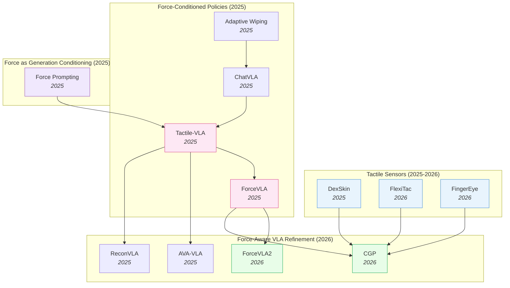

# Contact-Rich & Tactile Control — Deep Dive

> [!abstract] Overview
> Physical interaction at the fingertip — governed by forces, contact, and compliance the camera cannot see — is the axis this note unifies. A force-aware policy fails the moment it treats force as an afterthought rather than a first-class signal, and the field's central finding is that contact dynamics deserve their *own* encoder, attention path, and gated expert, never naive concatenation with visual tokens. The note spans three threads of that axis. **Foundations & sensing** (Part A): the design-space of where force enters a policy and how it's pretrained, plus tactile sensor hardware (capacitive skins, FPC pads, binocular vision-tactile fingertips) and the touch-SSL foundation models that amortize labeling cost. **Force-conditioned policy architectures** (Part B): force-conditioned VLAs (force-aware action heads, force-aware MoE, force-grounded tactile alignment, human-intervention refinement) and force-as-generation-conditioning ([[2505.19386|Force Prompting]]). **Evaluation** (Part C): contact-rich manipulation benchmarks, vision-to-tactile prediction, contact-grounded policies, tactile world models, and dexterous in-hand manipulation. The recurring architectural insight — **force/contact must be a first-class modality with its own parameters** — lifts to the body scale too: for whole-body and locomotion control (unified controllers, balance under load, humanoid skill data), see the sibling deep-dive [[11_Whole-Body-and-Locomotion-Control]]. For the RL-*methods* underpinning the control side, see [[03_Imitation-Learning-and-RL#6. RL for Locomotion, Navigation & Whole-Body Control]]; this note covers the contact-dynamics *substrate*.

## Evolution Graph

The *fingertip* thread of the contact-dynamics axis: bolt-on force sensors and per-task contact policies gave way to force-aware MoE VLAs that treat force/torque as a first-class modality, then to hybrid force-position control, contact grounding, and affordable open-source sensing hardware — all converging on force/contact as a dedicated signal rather than a concatenated input.

**The fingertip thread** evolved through three overlapping phases. **Phase 1 — Force as auxiliary signal** (early 2025): [[2505.06451|Adaptive Wiping]] and [[2502.14420|ChatVLA]] used force feedback as a closed-loop sensor reading, treated as one input among many. **Phase 2 — Force as first-class modality** (mid 2025): [[2507.09160|Tactile-VLA]] and [[2505.22159|ForceVLA]] elevated force/torque to a primary modality with dedicated experts and force-aware MoE routing — these are the cluster's two landmark papers. **Phase 3 — Hybrid force-position control and contact grounding** (2026): [[2603.15169|ForceVLA2]] introduces cross-scale MoE with force prompts at the VLM level; [[2603.05687|CGP]] grounds policies in predicted multi-point contact trajectories; [[2604.28156|FlexiTac]] and [[2604.20689|FingerEye]] attack the hardware bottleneck with sub-$30 conformable skins and binocular vision-tactile fingertips. The body-scale echo of this exact lesson — force/contact as a dedicated, factorized signal for whole-body balance and locomotion — runs in parallel in the sibling deep-dive [[11_Whole-Body-and-Locomotion-Control]].

| Year | Paper | Track | Contribution |
|------|-------|-------|--------------|
| 2024 | [[2410.24090\|Sparsh]] | Touch foundation model | First SSL touch representations across [[2111.06377\|MAE]]/[[2104.14294\|DINO]]/JEPA; **460k** unlabeled tactile images + TacBench |
| 2025 | [[2502.14420\|ChatVLA]] | Force-conditioned policy | Unified VLM with MoE: control-expert + understanding-expert (foundation for later force-MoEs) |
| 2025 | [[2505.06451\|Adaptive Wiping]] | Contact-rich benchmark | Few-shot IL + F/T feedback + VAE object representation; 100% contact, 96% reference force |
| 2025 | [[2505.19386\|Force Prompting]] | Force as generation conditioning | First to use physics-based force signals (pokes, wind) as video-generation control |
| 2025 | [[2505.22159\|ForceVLA]] | Force-conditioned VLA | Force-aware MoE (FVLMoE) treats 6-axis F/T as first-class modality; +23.2% over [[2410.24164\|π0]] |
| 2025 | [[2506.14754\|Sparsh-X]] | Touch foundation model | Multisensory (image+audio+motion+pressure) SSL on **~1M** contacts; **+500%** plug insertion |
| 2025 | [[2507.09160\|Tactile-VLA]] | Force-conditioned VLA | Force-aware action expert + hybrid position-force controller + CoT failure recovery |
| 2025 | [[2508.10333\|ReconVLA]] | Refinement (sensor-precursor) | Reconstructive gaze-region pretraining; precursor for visuotactile grounding |
| 2025 | [[2508.19236\|MemoryVLA]] | Refinement (memory) | Dual-memory PCMB; supports tactile-history accumulation over long horizons |
| 2025 | [[2509.18830\|DexSkin]] | Tactile sensor | Conformable capacitive skin, 294° coverage, $10/pair, 19/20 perturbed reorient |
| 2025 | [[2510.13324\|FARM]] | Force-conditioned policy | Tactile-conditioned diffusion policy predicting pose+grip+force; **100%** dynamic screw-tightening |
| 2025 | [[2511.18960\|AVA-VLA]] | Refinement (attention) | POMDP + recurrent state + active visual attention — applicable to force history |
| 2026 | [[2603.15257\|HapticVLA]] | Force-conditioned VLA | Tactile distillation enables force-aware VLA **without** inference-time tactile sensors |
| 2026 | [[2603.12665\|TacVLA]] | Force-conditioned VLA | Contact-aware gating: tactile tokens only activated during contact phases |
| 2026 | [[2603.05687\|CGP]] | Visuotactile policy | Contact-grounded policy: diffusion over coupled state+tactile trajectories |
| 2026 | [[2603.15169\|ForceVLA2]] | Force-conditioned VLA | Cross-Scale MoE + force prompts; 66% avg SR, **+48pp** over [[2410.24164\|π0]] |
| 2026 | [[2602.23648\|FAVLA]] | Force-conditioned VLA | Fast-slow VLA: slow VLM + force-injected fast action expert with adaptive frequency |
| 2026 | [[2601.20321\|TaF-VLA]] | Tactile-force alignment | **10M** synchronized tactile-force pairs + VQ-VAE force latent; **64.8%** avg SR |
| 2026 | [[2604.20689\|FingerEye]] | Tactile sensor | Continuous vision→tactile binocular fingertip; +30% over wrist-only baselines |
| 2026 | [[2604.28156\|FlexiTac]] | Tactile sensor | $30 FPC piezoresistive plug-in skin; 8×16 to 32×32 layouts at 100Hz |

> [!tip] Three Phases, One Architectural Convergence
> Across all three phases, the field converged on the same architectural pattern: **force gets its own encoder, its own attention path, and its own gated expert** — never naive concatenation with visual tokens. From [[2507.09160|Tactile-VLA]]'s force-aware action expert to [[2505.22159|ForceVLA]]'s FVLMoE to [[2603.15169|ForceVLA2]]'s Cross-Scale MoE, the consistent finding is that contact dynamics require dedicated parameters that activate phase-aware (free-space vs in-contact). See [[04_VLA#7. Multi-Sensor & Force-Aware VLAs]] for how this fits the broader VLA design space.

---

## Part A — Foundations & Sensing

*The design space (where force enters, what sensors deliver what) and the tactile sensors themselves as a sensing modality.*

### 1. Design-Space Principles

> [!info] Survey Anchor
> [[2504.03515|Dexterous IL Survey]] (2025) is the standing reference for the broader landscape this note carves out: it systematically reviews Behavioral Cloning, IRL, GAIL, Hierarchical IL, and Continual IL applied to dexterous manipulation; surveys end-effector hardware (simple grippers → multi-fingered anthropomorphic hands) and emphasises tactile sensing as a critical modality; details teleoperation systems and learning-from-video data acquisition; and catalogues the persistent open problems (data sparsity, generalization gaps, sim-to-real, real-time control, safety). When the present note discusses where force/tactile enters a *contact-rich VLA*, the survey covers the parallel question of how IL methods *more broadly* incorporate the same sensing modality.

Every force-aware/tactile policy commits to three orthogonal choices — *what sensor*, *where the force signal enters the model*, and *how the model is pretrained*. The interesting work in the cluster lives at the intersection of these axes; the axes themselves are *almost* independent (e.g. you can pair any sensor with any entry point), but specific combinations win specific contact regimes. The sub-sections below treat each axis as a separate decision dimension.

#### 1.1 Sensor Modality — What Force Signal You Can Even Measure

==The upstream choice that bounds everything downstream.== Sensors range from coarse aggregated F/T at the wrist (cheap, ubiquitous) to dense per-taxel skin (rich, hardware-bound). The richer the sensor, the higher the data-scale floor before a policy generalizes.

- **[[2505.06451|Adaptive Wiping]]**, **[[2505.22159|ForceVLA]]**, **[[2603.15169|ForceVLA2]]** — ==6-axis F/T at wrist==: aggregated force/torque vector, **$200–2k** off-the-shelf; coarse spatial info but immediately deployable.
- **[[2509.18830|DexSkin]]**, **[[2604.28156|FlexiTac]]** — ==high-coverage tactile skin==: dense contact pressure map across end-effector; **$10–30 DIY** to **thousands** for high-fidelity capacitive variants.
- **[[2604.20689|FingerEye]]** — ==vision-tactile fingertip==: continuous pre-contact vision + post-contact deformation in one sensor; mid-range cost (~$100s) but closes the contact-discontinuity gap.
- **[[2603.05687|CGP]]** — ==predicted tactile, no sensor==: diffusion-generated tactile trajectory translated to controller targets; compute-only, but adds long-horizon drift risk.

#### 1.2 Where Force Enters the Model — The Integration Axis

==The architectural choice that determines whether force is a first-class modality or a bolted-on side-channel.== The same F/T stream can be injected at the controller, the action head, the MoE gating, or the VLM prompt — and the field has converged on *late fusion above the visual backbone* as the canonical recipe.

- **[[2505.06451|Adaptive Wiping]]**, **[[2507.09160|Tactile-VLA]]**, **[[2510.13324|FARM]]** — ==at low-level controller==: hybrid position-force / admittance control regulates the policy's output; simplest and most data-efficient when reference force is known.
- **[[2507.09160|Tactile-VLA]]**, **[[2505.22159|ForceVLA]]**, **[[2602.23648|FAVLA]]** — ==at action head==: dedicated F/T encoder feeds a force-aware action expert; preserves pretrained VLM representations.
- **[[2505.22159|ForceVLA]]**, **[[2603.15169|ForceVLA2]]** — ==at MoE gating==: force-aware MoE / Cross-Scale MoE routes between phase-specialized experts (free-space vs in-contact).
- **[[2603.12665|TacVLA]]** — ==at contact-aware token gating==: tactile tokens activated *only* on contact onset; prevents free-space noise injection.
- **[[2601.20321|TaF-VLA]]** — ==at force-grounded latent==: tactile sequence aligned to force latent via VQ-VAE codebook; plug-and-play across sensors.
- **[[2603.15169|ForceVLA2]]** — ==at VLM (as prompt)==: force readings tokenized as linguistic prompts feeding the VLM for long-horizon force-aware planning.
- **[[2603.15257|HapticVLA]]** — ==as predicted/distilled signal==: tactile token predicted from vision/state — no sensor needed at inference.
- **[[2505.19386|Force Prompting]]** — ==at video backbone==: force conditioning of video generator at the pre-action stage; force-aware *world modeling* rather than control.

#### 1.3 Pretraining Strategy — Where Generalization Comes From

==The data-axis choice that determines whether a contact policy survives task variation.== Options run from per-task from-scratch (sample-efficient, brittle) to SSL touch foundation models pretrained on **460k–1M** unlabeled contacts (data-hungry, transferable).

- **[[2505.06451|Adaptive Wiping]]** — ==from-scratch on contact demos==: sample-efficient per task; brittle across tasks.
- **[[2505.06451|Adaptive Wiping]] (VAE)**, **[[2603.05687|CGP]] (KL-VAE)** — ==unsupervised tactile encoder pretrain==: VAE/contrastive on exploratory contact; reusable representation within a task family.
- **[[2410.24090|Sparsh]]**, **[[2506.14754|Sparsh-X]]** — ==SSL touch foundation model==: frozen/finetuned encoder reusable across tasks via [[2111.06377|MAE]] / [[2104.14294|DINO]] / JEPA over **460k–1M** unlabeled contacts.
- **[[2507.09160|Tactile-VLA]]**, **[[2505.22159|ForceVLA]]**, **[[2603.15169|ForceVLA2]]**, **[[2602.23648|FAVLA]]**, **[[2603.12665|TacVLA]]** — ==VLA fine-tune with force expert==: inherits VLM generalization + adds force capacity via dedicated parameters.
- **[[2601.20321|TaF-VLA]]** — ==force-grounded latent alignment==: VQ-VAE binds tactile streams to a force codebook; plug-and-play across sensors and student backbones.
- **[[2603.15257|HapticVLA]]** — ==sensor-free distillation==: teacher uses tactile sensors during training, student distills to inference without them.
- **[[2505.19386|Force Prompting]]** — ==force-conditioned video pretraining==: latent physical understanding from video; transfers to control via downstream action head.

**Design-Space — Decision Matrix**

| Need | Recommendation |
|---|---|
| Known reference force, single contact-rich task (wiping, polishing, insertion) | Closed-loop admittance at controller — [[2505.06451\|Adaptive Wiping]] |
| Multi-stage task with free-space → contact transitions | Force-aware MoE — [[2505.22159\|ForceVLA]], [[2603.15169\|ForceVLA2]] |
| Dense per-taxel contact info (in-hand reorient, fragile grasp) | Hardware first — [[2509.18830\|DexSkin]], [[2604.28156\|FlexiTac]] before policy architecture |
| Continuous pre→post-contact perception (alignment, insertion approach) | Vision-tactile fingertip — [[2604.20689\|FingerEye]] |
| Reusable tactile encoder across tasks | SSL touch foundation — [[2410.24090\|Sparsh]] / [[2506.14754\|Sparsh-X]] |
| Inference-time deployment without tactile sensor | Sensor-free distillation — [[2603.15257\|HapticVLA]] |
| Cross-sensor portability for tactile signal | Force-grounded latent — [[2601.20321\|TaF-VLA]] |
| Bootstrap physical priors from video pretraining | Force-conditioned video generator — [[2505.19386\|Force Prompting]] |

> [!star] Key Design-Space Papers
> - [[2603.15169|ForceVLA2]] — The only architecture to integrate force at *all three* axis-2 entry points simultaneously (controller + MoE + VLM prompt); demonstrates the cluster's architectural ceiling at **66%** avg SR, **+48pp** over [[2410.24164|π0]]
> - [[2505.22159|ForceVLA]] — The canonical late-fusion design — the field's most-copied template for treating F/T as a first-class modality through a dedicated expert and phase-aware gating
> - [[2410.24090|Sparsh]] — The cluster's pretraining-axis founder; **460k** unlabeled tactile images + ==TacBench== established that the touch analog of [[2304.07193|DINOv2]] beats end-to-end training by **~95.1%** average

> [!tip] Picking by Constraint
> If your task has a known reference force (wiping, polishing, insertion with known tolerance), use **closed-loop admittance over the action head** ([[2505.06451|Adaptive Wiping]]) — simplest and most data-efficient. If the task is multi-stage with free-space → contact transitions, use a **force-aware MoE** ([[2505.22159|ForceVLA]], [[2603.15169|ForceVLA2]]) so the gating switches experts at contact onset. If the task requires dense per-taxel contact info (in-hand reorientation, fragile grasping), the bottleneck is **sensor hardware** ([[2509.18830|DexSkin]], [[2604.28156|FlexiTac]]) before the policy architecture matters. See [[04_VLA#7. Multi-Sensor & Force-Aware VLAs]] for how the multi-modal entry-point taxonomy fits the broader VLA design space, and [[14_Sim-to-Real-Transfer#3. Policy-Side: Robustness & Domain Randomization]] for sensor-side calibration needed before any of these axes generalize.

---

### 2. Tactile Sensors as a Sensing Modality

Hardware is the upstream bottleneck. Until 2025, dense tactile sensing meant expensive GelSight-style optical sensors (slow, bulky, single-fingertip) or hand-rolled piezoresistive arrays (brittle, inconsistent). Three sensor papers attack this bottleneck on different fronts — high-coverage skin, affordable open-source FPC, and continuous vision-tactile.

- **[[2509.18830|DexSkin]]** — A ==Conformable capacitive skin== on a parallel-plate grid delivering **294° coverage** across 60 taxels at **1.7 kPa** sensitivity, **6.52%** hysteresis, **2.09%** drift/500 cycles; ==Pneumatic calibration== lifts cross-instance transfer **5/20 → 14/20** SR; **19/20** perturbed pen reorient (baselines **0/20**), **90%** berry pressure cut via residual RL.
- **[[2604.28156|FlexiTac]]** — An ==open-source plug-in tactile platform== pairing thin ==FPC piezoresistive sensor pads== with an Arduino Nano + multiplexer readout at **100 Hz**, layouts **8×16 to 32×32**; ==direct electrode integration== lifts manufacturing throughput, and visuo-tactile fusion + sim-to-real fine-tune enable nut-and-bolt assembly; **~$30/unit**.
- **[[2604.20689|FingerEye]]** — A ==Continuous vision-tactile fingertip== (28×25.4×26 mm) with ==binocular RGB cameras==, compliant soft ring, AprilTag cover; PnP-tracked AprilTag pose proxies 6D wrench: force **[4.30, 4.22, 9.93] mN**, torque **[0.32, 0.13, 8.55] mN-m**; vision sees alignment *before* contact, tactile deformation *after*; **+30%** SR over wrist-camera-only.
- **[[2503.19225|CoinFT]]** — A ==coin-sized capacitive 6-axis force/torque sensor== (20 mm, 2 g, ~$11) joining two rigid PCBs by silicone-pillar arrays with ==dual-mode electrode switching== for normal+shear sensing; **0.16 N** force / **1.08 mNm** moment RMSE, **97 Hz** bandwidth, survives a 180 N impact — a robust cheap F/T sensor for fingers and drones.

**Tactile Sensors — Decision Matrix**

| Need | Recommendation |
|---|---|
| High-coverage skin for in-hand reorientation / fragile grasping | [[2509.18830\|DexSkin]] — capacitive grid, **294° coverage**, pneumatic calibration required for cross-instance transfer |
| Open-source, budget-friendly piezoresistive pad with sim-to-real path | [[2604.28156\|FlexiTac]] — **$30/unit** FPC + Kelvin-Voigt calibration; lowest barrier for community adoption |
| Continuous pre→post-contact sensing for alignment-then-contact tasks | [[2604.20689\|FingerEye]] — binocular vision-tactile fingertip; **+30%** SR over wrist-cam-only |
| Frozen tactile encoder for label-scarce downstream tasks (unimodal) | [[2410.24090\|Sparsh]] — SSL on **460k** tactile images; latent-SSL beats pixel reconstruction; ships with TacBench |
| Multisensory tactile fusion (image + audio + IMU + pressure) | [[2506.14754\|Sparsh-X]] — attention-bottleneck fusion at **~1M** contacts; **+500%** plug-insertion vs vision-only |
| Coarse aggregated F/T only (wrist-mounted) — sensor secondary | Pair with [[2505.22159\|ForceVLA]]-style policy compensation; sensor sets the eventual ceiling |

#### 2.1 Touch Foundation Models — SSL Representations on Tactile Streams

A parallel thread to better sensors: learn ==general-purpose tactile representations== via SSL on large unlabeled tactile data, then reuse the frozen encoder downstream. The touch analog of [[2304.07193|DINOv2]] — and the same lesson holds: pretrained frozen encoder beats end-to-end task-specific training by a wide margin once labels are scarce.

- **[[2606.19161|HT-Bench]]** — A ==dexterous full-hand tactile benchmark== pairing ~**10M** RGB + **7.8M** synchronized full-hand tactile frames with an egocentric-vision ==HandTouch== VQ encoder trained in three stages (spatial topology → vision-tactile alignment → temporal dynamics); **99.27%** Hit@1 retrieval, **0.010** RMSE / **0.911** cIoU tactile inpainting.
- **[[2410.24090|Sparsh]]** — A ==self-supervised touch encoder== that pretrains ViTs on **~460k** unlabeled tactile images across vision-based sensors under ==[[2111.06377|MAE]]==, ==[[2104.14294|DINO]]/[[2304.07193|DINOv2]]==, and ==JEPA==, introducing ==TacBench== (6 tasks); beats end-to-end by **~95.1%** avg, latent-SSL beats pixel reconstruction, **+20–53%** bead-maze traversal.
- **[[2506.14754|Sparsh-X]]** — A multisensory touch encoder jointly encoding **4 tactile modalities** (image + audio + IMU + pressure) from Digit 360 via ==attention bottlenecks==; **~1M** unlabeled contacts, teacher-student SSL; **+17%** physical-property estimation, **+500%** plug-insertion (to **90%**) vs vision-only, **+63%** vs tactile-image-only, **90%** in-hand rotation drift cut.
- **[[2505.18361|Tactile CRNN]]** — A ==task-optimized convolutional recurrent network== (from an ==Encoder-Attender-Decoder== sweep) that aligns with rodent ==somatosensory cortex==, *saturating* explainable neural variance and beating feedforward / state-space encoders; ==contrastive SSL== (SimCLR) matches top supervised models — evidence that *recurrence* is the right touch bias.

#### 2.2 Cross-Sensor Tactile Representation Transfer

The sensor-fragmentation problem: every tactile sensor (GelSight, DIGIT, uSkin, PapillArray) speaks a different signal format, so a policy or encoder trained on one rarely transfers to another. This thread learns a *sensor-invariant* tactile representation — via shared latents, marker-image canonicalization, contrastive cross-sensor pairing, or generative signal translation — so touch knowledge amortizes across the hardware zoo rather than re-collecting per sensor.

- **[[2606.18959|TactSpace]]** — A ==physics-enriched shared latent space== projecting real tactile, rigid-body sim, and finite-element data through ViT encoders aligned by ==InfoNCE contrastive== + cross-modal reconstruction loss, fed by a GPU Isaac Lab tactile plugin; zero-shot sim-to-real on in- and out-of-distribution contact tasks, InfoNCE beating MSE-aligned and unaligned baselines.
- **[[2606.13102|FTP-1]]** — A ==generalist foundation tactile policy== integrating language, RGB, proprioception, and diverse tactile sensors into one action space via a ==Morphology-Aware Tactile Token Space== with sensor-specific encoders and a 300M-param ==tactile expert== pretrained on a **3,000-hr** corpus; **+17.2%** SR on seen sensors, **+31.6%** on unseen sensor setups.
- **[[2510.09817|Cross-Sensor Touch Generation]]** — A ==cross-sensor tactile signal translation== pair: ==Touch2Touch (T2T)== conditional diffusion maps signals between sensors with paired data, and ==Touch-to-Depth-to-Touch (T2D2)== routes through a sensor-agnostic depth intermediate to drop the paired-data need; **21/30** zero-shot peg insertion, **15/20** DIGIT marble-rolling.
- **[[2506.19699|UniTac-NV]]** — A ==cross-sensor tactile autoencoder== with per-sensor encoders feeding a ==single shared decoder==, trained on ==sample-matched== paired contacts with self- and cross-reconstruction losses into a **16-D** latent; SSIM **>0.95** seen-object reconstruction, **0.353–0.397 mm** self-latent geometry error rising to **~0.6 mm** cross-sensor.
- **[[2502.19638|SITR]]** — A ==sensor-invariant tactile representation== transformer combining tactile images with sensor-specific calibration images, pretrained on **1M** physics-rendered examples (100 sensor configs) under normal-map reconstruction + geometry-contrastive losses; **81.94%** inter-sensor classification (**+33pp** over ViT), **0.80 mm** pose RMSE (~50% lower).
- **[[2502.12191|AnyTouch]]** — A ==unified static-dynamic tactile representation== over the multi-sensor ==TacQuad== dataset, combining masked-modeling pixel detail with multi-modal alignment + cross-sensor matching, and a ==universal sensor token== for unseen-sensor generalization; SOTA on material/hardness/grasp prediction and lowest fine-grained pouring error.
- **[[2410.11834|CTTP]]** — A ==contrastive touch-to-touch pretraining== framework using ==InfoNCE== to pull together tactile signals from different sensors viewing the same interaction, on a ResNet-50 encoder over paired GelSlim/Soft-Bubble data; near-random baselines beaten on cross-sensor classification, **±5°** pose error (vs ±18–38°), **18/30** real peg insertions.
- **[[2406.13640|T3]]** — A ==Transferable Tactile Transformer== (T3) with sensor-specific ViT encoders, a shared trunk, and task decoders, pretrained MAE-then-distilled on ==FoTa== (**3M+** images, 13 sensors, 11 tasks); **+24%** median classification over scratch, near-optimal pose from **2,000** points, **+25%** sub-mm insertion SR over tactile baselines.
- **[[2503.01058|GenForce]]** — A ==cross-sensor force generation== method canonicalizing raw tactile into ==marker images==, performing ==Marker-to-Marker diffusion== translation across sensors, then training a spatiotemporal force predictor with material-hardness compensation; **~100×** lower FID, **<0.92 N** normal / **<0.3 N** shear MAE across heterogeneous sensors, damage-free grasping.

#### 2.3 Tactile Data-Capture Hardware — Gloves & Teleop Rigs

The sensor papers above deliver the *signal*; this thread delivers the *capture rig* — wearable gloves and teleoperation interfaces whose contribution is hardware that records human (or teleoperated) tactile interaction at scale, closing the demonstration-data bottleneck upstream of any policy architecture. The recurring move is to put rich shear+normal sensing on the human hand (or a teleop fingertip) and stream it, with the haptic loop, into a downstream imitation policy.

- **[[2602.09888|TriPilot-FF]]** — An ==open-source whole-body teleoperation rig with force feedback== where a 3-DoF ==force-feedback foot pedal== drives the mobile base and ==arm-side force reflection== conveys contact, collecting ==torque-augmented demos== feeding joint-torque into an ACT policy; **100%** BlindCarry SR (vs 55%), torque co-training lifts BasketPack **12% → 60%**.
- **[[2512.08920|OSMO]]** — An ==open-source tactile glove== using magnetic sensors to capture 3-axis normal *and* shear forces from human hands, with ==MuMetal shielding + dual-magnetometer differential sensing== cutting crosstalk (RMS noise **−57%**) and a ==Glove2Robot diffusion== pipeline; **71.69%** wiping SR vs **55.75%** vision-only, eliminating contact-failure modes.
- **[[2506.07490|RAPID Hand]]** — A ==20-DoF anthropomorphic hand platform== with a spur-bevel gear module (7N fingertip force) and whole-hand perception fusing wrist RGBD + **96-taxel** piezoresistive fingertips + proprioception under hard **≤7 ms** sync, with an ==Apple Vision Pro== teleop interface; **50/50** in-hand rolling/translation, **2.3×** MCP load tolerance over a commercial hand.
- **[[2407.03162|Bunny-VisionPro]]** — A ==real-time bimanual teleoperation system== on ==Apple Vision Pro== with online hand retargeting + arm collision/singularity handling and low-cost ==FSR fingertip → ERM haptic feedback== for contact perception; **+11%** SR and **−45%** completion time over prior rigs, IL policies reaching **80-95%** seen / **50-75%** unseen-object SR.

#### 2.4 Dexterous Hand Platforms — The End-Effector Hardware

Upstream of any tactile sensor or force-conditioned policy sits the *hand itself*: a high-DoF anthropomorphic end-effector whose actuation scheme (remote cable-drive, hybrid SMA-motor, in-palm linkage, learned tendon control) sets the achievable fingertip force, distal mass, and grasp repertoire. These platform papers are the mechanical substrate the contact-dynamics axis runs on — the hands that *deliver* the forces the rest of this note measures and regulates.

- **[[2512.24657|Antagonistic Bowden-Cable Actuation Lightweight]]** — A ==remotely-actuated lightweight anthropomorphic hand== (ABCDL) using 15 ==antagonistic Bowden-cable pairs== and ==Rolling Contact Joints== so one motor drives flexion+extension; **236 g** distal mass, **20 DoF**/15 motors, **21.9 N** fingertip force, lifts a 25 kg dumbbell (100× its mass).
- **[[2507.14538|21-DOF Humanoid Dexterous Hand]]** — A ==1:1 biomimetic 21-DOF dexterous hand== (CYJ Hand-0) with ==hybrid SMA-motor actuation== (15 DC-motor flexion + 17 SMA extension modules) and fishing-line tendons on a 3D-printed AlSi10Mg skeleton; **380 g**, passes all 10 Kapandji tests, **32** human gestures, **1.2 kgf** single-finger / 8 kgf hand load.
- **[[2507.03227|Dexterous Teleoperation 20-DoF ByteDexter]]** — A compact ==20-DoF linkage-driven anthropomorphic hand== (ByteDexter) with a 3-actuator 4-DoF thumb and a microsecond ==kinematic solver==, paired with ==optimization-based motion retargeting== of human-robot keyvectors; closer pinch fingertips and fewer collisions than DexPilot, organizing 9 cluttered items in under 5 min.
- **[[2504.13165|RUKA]]** — A ==3D-printed tendon-driven humanoid hand== with ==learning-based control== (LSTM+MLP trained on MANUS-glove motion capture) replacing joint encoders, built from open-source off-the-shelf parts; **10/10** Kapandji score, **2.74 N** pinch, **6.03 kg** payload, 40 Hz direct / 25 Hz learned control, cube-flipping demonstrated.

> [!star] Key Papers
> - [[2509.18830|DexSkin]] — High-coverage conformable capacitive skin; the **pneumatic calibration → policy transfer** insight (5/20 → 14/20 cross-instance) is the deployment breakthrough beyond single-instance demos
> - [[2604.28156|FlexiTac]] — $30 open-source FPC piezoresistive skin with a documented Kelvin-Voigt sim-to-real path; the hardware bottleneck-breaker for the community
> - [[2604.20689|FingerEye]] — Binocular vision-tactile fingertip with continuous pre→post-contact sensing; closes the contact-discontinuity gap (**+30%** SR)
> - [[2410.24090|Sparsh]] — Foundational SSL touch encoder across [[2111.06377|MAE]]/[[2104.14294|DINO]]/JEPA on **460k** tactile images; introduces ==TacBench==; established latent-space SSL beats pixel reconstruction for touch
> - [[2506.14754|Sparsh-X]] — Multisensory touch foundation model (image + audio + IMU + pressure) at **~1M** contacts; **+500%** plug insertion over vision-only — the multimodal extension of [[2410.24090|Sparsh]]

> [!tip] Sensor Bottleneck vs Policy Bottleneck — and Why You Should Pretrain the Encoder
> The binding bottleneck dictates the fix: tasks failing at *contact onset* (alignment, insertion approach) need **continuous vision-tactile** ([[2604.20689|FingerEye]]); tasks failing during *sustained contact* (perturbed reorientation, fragile grasping) need **high-coverage skin** ([[2509.18830|DexSkin]]); tasks limited by *coarse aggregated F/T* can be compensated in policy ([[2505.22159|ForceVLA]]) but the sensor sets the ceiling. Whatever the sensor, the *encoder* should be pretrained: the [[2410.24090|Sparsh]]/[[2506.14754|Sparsh-X]] result is the touch analog of the [[2304.07193|DINOv2]] lesson — a frozen SSL tactile encoder amortizes labeling cost across the whole downstream task family, and JEPA-style objectives generalize from RGB to tactile and from unimodal to multisensory. Most VLAs in §3 still train tactile encoders from scratch per task — an obvious upgrade path. Cross-reference [[07_Latent-World-Models#3. Broader Latent Prediction Landscape]] for the latent-prediction lineage this reuses and [[02_Dataset-Benchmark-Environment#6. Tactile & Contact-Rich Benchmarks]] for the evaluation side.

---

## Part B — Force-Conditioned Policy Architectures

*How force gets injected into VLAs (Tactile-VLA, ForceVLA, TaF-VLA) and how it conditions generation models.*

### 3. Force-Conditioned VLA Architectures

The core of the cluster. Force-aware VLAs cluster along *where* force enters the network — the action head, an MoE gating module, a latent-aligned adapter, a refinement layer that handles the human/recovery loop, or upstream as video-generation conditioning. The sub-sections below treat each entry-point as a distinct architectural axis, with the bullet-per-paper detail showing how multiple groups have explored the same axis with different design choices.

#### 3.1 Force-Aware Action Heads

The most direct integration: force enters at the action expert (or its controller), giving the policy a hybrid position-force output space. These papers preserve the pretrained VLM backbone and add force capacity through dedicated parameters at the action stage.

- **[[2606.12406|FACTR 2]]** — A ==sensorless external force-sensing== method for commodity arms where ==NEXT== learns free-space inverse dynamics to estimate external joint torques as a residual, and ==FIRST== behavior cloning up-samples pre-contact/contact phases; **0.547 Nm** L1 torque error (**87.6%** below FILIC), highest avg task progress across **5** long-horizon contact-rich tasks.
- **[[2606.11743|TacCoRL]]** — A ==sim-to-real tactile-into-VLA== method augmenting a pretrained VLA with a ==dual-path tactile fusion== + ==contact-aware gate==, warm-started by sim-real co-training then refined via ==RL post-training== on simulated near-failure states; sim SR **40.5% → 78.5%**, real-world **50.0% → 72.5%** across **4** bimanual contact-rich tasks.
- **[[2605.07308|AT-VLA]]** — An ==Adaptive Tactile Injection== VLA adding tactile feedback while *preserving pretrained knowledge* (**+17%**), plus a ==Tactile Reaction Dual-Stream== for real-time contact response (**+11%**); beats SOTA VLA + tactile baselines on contact-rich tasks (Unzip Bag, Stamp, Wipe Vase) yet stays robust — reliable even when tactile input is *absent* at inference.
- **[[2605.27886|Tabero]]** — A ==vision-tactile-language gentleness== framework with a tactile-sim data pipeline, process-aware force metrics, and a ==Tabero-VTLA== with a ==decoupled force-position interface== on a hybrid controller; **0.86** firm / **0.52** gentle SR, **3.7 N** gentle grip, adverb-conditioned (firmly vs gently) force modulation.
- **[[2604.13015|Touch Dreaming]]** — A ==Humanoid Transformer with Touch Dreaming (HTD)== policy paired with an ==RL teacher-student lower-body controller==, whose ==touch dreaming== objective predicts future hand forces and tactile latents for contact-aware representations; **+30.0pp** avg SR over ACT across **5** real contact-rich tasks, **+30%** relative gain from latent tactile supervision.
- **[[2604.01414|Adaptive Vision-Torque Fusion]]** — An ==adaptive vision-torque diffusion policy== whose ==Contact Gating== injects joint-torque features only on detected contact (a learnable token in free space), fused via a ==CFG-style== dual-U-Net blend with a learned torque-guidance scale; **82.0%** avg SR (**+14%**), torque gating alone lifting **30% → 68%**.
- **[[2603.08342|PhaForce]]** — A ==slow-fast visual-force policy== coordinating chunk-level diffusion planning with high-rate residual correction under a ==Contact-Aware Phase Predictor==, where ==Orthogonal Residual Injection== preserves vision semantics and a fast corrector applies phase-routed force adjustments; **86%** avg SR (**+40pp** over diffusion), **85%** OOD raised-board wiping.
- **[[2602.13689|Symmetry-Aware VT Fusion]]** — A ==Cross-Modal Transformer== fusing global vision with local tactile via hierarchical self-attention + cross-attention, regularized by a physics-informed ==bilateral force-symmetry== loss and processing tactile as ==residual forces== off a pre-insertion reference; **96.59%** insertion SR (vs 93.23% vision-only, 92.97% naive fusion), at **153 fps**.
- **[[2602.10013|Force-Regulated Manipulation]]** — A ==tactile-force-controlled gripper== ($150, 0.45–45 N) with direct force-teleoperation data plus ==RETAF==, decoupling a low-frequency base policy from a high-frequency (**80 Hz+**) force-adaptation policy; **68%** avg stable-grasp (vs 38% diffusion), **60%** task SR, lifting a VLA base's tomato-pick grasp **30% → 90%**.
- **[[2602.02142|FD-VLA]]** — A ==Force-Distilled VLA== predicting a latent force token from vision + proprioception (L2-supervised by raw force, **no inference-time sensor**) and fusing it through ==directional attention masking== that preserves VLM priors; **61.1%** mean SR over 3 contact-rich tasks vs **23.3%** SmolVLA and **38.9%** with raw force, the FDM lifting **38.9% → 61.1%**.
- **[[2509.18865|Bi-VLA]]** — A ==bilateral-control VLA== sourcing rich force feedback ==without dedicated sensors== via a four-channel leader-follower setup with disturbance/reaction-force observers, fusing SigLIP language + EfficientNet vision by ==FiLM== into a ==CVAE-Transformer== for action; **90%** language-disambiguable SR (vs 50% vision-only), **75%** robust in an unlearned 3-ball scene.
- **[[2502.17432|FACTR]]** — A ==Force-Attending Curriculum Training== method that decays visual corruption (blur, downsampling) over training to *force* the encoder-decoder transformer to attend to external joint-torque first, paired with a mediated-force-feedback bilateral teleop rig; **87.5%** SR on unseen objects (**+43%** over vision+force), **90%** perturbation recovery.
- **[[2505.13982|Adaptive Visuo-Tactile Fusion Predictive]]** — An ==adaptive visuo-tactile fusion== diffusion policy (==AdapTac==) whose ==Force-Guided Attention Fusion (FGAF)== cross-attends force embeddings against vision + tactile to reweight modalities, plus a self-supervised ==Future Force Prediction== diffusion head; **93%** avg SR (Flip **50% → 90%**), **75%** unseen-object generalization.
- **[[2505.09577|VTLA]]** — A ==Vision-Tactile-Language-Action== model for insertion built on ==Qwen2-VL== with ==Vision-Guided Temporally Enhanced (VGTE) tokens== for temporal tactile and ==Direct Preference Optimization== bridging language modeling to continuous control; **>90%** SR on unseen peg shapes in sim, beating IL + multimodal baselines, transferring to a real UR3 from sim-only.
- **[[2507.09160|Tactile-VLA]]** — A ==Multi-modal transformer== fusing vision + language + ==tactile== on a ==pre-trained VLM backbone==, with a ==force-aware action expert== outputting position *and* force under a ==hybrid position-force controller==; CoT recovery adjusts force **3.5N → 6.7N**: **90%** Charger, **90%** OOD fragile paper-box, **80%** zero-shot wiping.
- **[[2602.23648|FAVLA]]** — A ==Fast-slow VLA==: slow VLM + high-frequency ==Force-Injected Action Expert== with force adapters across transformer layers, where a VLM-predicted ==force variance head== raises execution frequency during contact; **80.8%** avg SR (**+38pp** over vision-only, **+13.8pp** over the strongest force-aware baseline); peak contact force to **7.7N** on Gear Assembly.
- **[[2510.13324|FARM]]** — A ==Diffusion policy== with explicit force action predicting robot pose, grip width, *and* target grip force, conditioned on tactile force distributions; a dual-mode controller switches position-control in free space and closed-loop force-control during contact; **100%** success on dynamic screw-tightening and superior human-demonstration force matching.
- **[[2503.03998|Robotic Compliant Object Prying]]** — A vision-force ==diffusion policy (DP-CA)== conditioning action prediction on a joint vision-force embedding via a ==cross-attention== architecture where projected force features query image features, with force-data augmentation for robustness; **96%** prying SR (vs 39% vision-only), zero-shot transfer to unseen battery types/configs.
- **[[2603.15257|HapticVLA]]** — A ==Sensor-free deployment== method via ==Safety-Aware Reward-Weighted Flow Matching==: a tactile-equipped teacher distills into a student predicting a compact tactile token from vision+state at inference — **no tactile sensor needed**; **86.7%** mean SR on fragile-object pick-and-place, **+45pp** on egg manipulation over [[2506.01844|SmolVLA]].
- **[[2603.12665|TacVLA]]** — A ==Contact-aware token gating== VLA where tactile tokens activate *only* on contact onset, preventing free-space noise injection, and a lightweight MLP tactile encoder keeps the architecture compact; **83.75%** avg SR on disassembly, **>60%** SR under severe visual occlusion (vs ~30% for vision-only).

#### 3.2 Force-Aware Mixture-of-Experts

Force-aware MoE goes beyond a single force-aware action head: a learned gating module routes between phase-specialized experts (free-space vs in-contact), so the network *switches* parameters as the task transitions. This is the field's core architectural recipe for multi-stage contact-rich tasks.

- **[[2603.15169|ForceVLA2]]** — The current SOTA force-aware VLA pushing force up to the VLM via ==force-based prompts== and down to a ==Cross-Scale MoE== fusing VLM guidance with real-time F/T for ==hybrid force-position regulation==; **66%** avg SR over 5 tasks (**+48pp** over [[2410.24164|π0]], **+31pp** over [[2505.22159|ForceVLA]]); MoE alone **+26%**.
- **[[2505.22159|ForceVLA]]** — A canonical late-fusion VLA whose ==Force-aware MoE (FVLMoE)== routes 6-axis F/T into separate experts, gating learning force-vs-visual reliance; **60.5%** avg SR (vs **37.3%** [[2410.24164|π0]]+force), **90%** under occlusion, **20%** socket insertion; full FVLMoE **80%** vs **60%** concat. Ships **ForceVLA-Data** (**244** trajectories).

#### 3.3 Force-Grounded Tactile Alignment

A distinct architectural slot: rather than aligning tactile signals to *visual* embeddings (treating touch as visual texture), these papers ground tactile observations directly in *physical interaction forces* via a learned latent space. The result is a plug-and-play adapter that ports across tactile sensors and downstream policies.

- **[[2606.11767|Blind Dexterous Grasping]]** — A ==tactile-only Real2Sim2Real== grasping policy with no vision or pose, where a ==Real2Sim== binary-contact calibration aligns onset/offset timing and a ==privileged-supervised layout-aware tactile encoder== feeds an expert-to-==Diffusion Policy==; **27%** real SR over **20** objects on LEAP Hand; pretraining lifts sim seen **36.2% → 60.4%**.
- **[[2603.04531|PTLD]]** — A ==Privileged tactile latent distillation== method for sim-to-real: an ==Asymmetric Actor-Critic== trains a ==privileged-sensor policy== (external-camera pose) in *one* sim stage, then a ==tactile encoder== matches real tactile + proprioception via ==DAgger==; **+182%** in-hand rotation, **+57%** reorient goals, ~**50%** lower 6D pose error (**0.43 → 0.21** rad).
- **[[2602.13579|TactAlign]]** — A ==human-to-robot tactile alignment== method self-supervising modality-specific human/robot touch encoders, mining noisy ==pseudo-pairs== from unpaired demos via pose + binary-contact filtering, then aligning via ==rectified flow==; **72–76%** SR on pivoting/insertion/lid-closing, **100%** zero-shot light-bulb screwing, **93–99%** lower cross-sensor force error.
- **[[2602.01153|UniForce]]** — A ==unified latent force model== whose ==CVAE== learns inverse dynamics (tactile→latent force) + forward reconstruction, supervised label-free by ==quasi-static force equilibrium== during bilateral grasps over a ==unified marker-image== canonicalization + causal transformer; **r = −0.74** latent–normal-force, SOTA zero-shot cross-sensor, VLA wiping **20% → 80%**.
- **[[2601.20321|TaF-VLA]]** — A force-grounded tactile adapter: TaF-Device collects a **>10M**-pair tactile-force corpus, a ==TaF-Adapter== aligns tactile to force via ==VQ-VAE== + ==temporal encoding==, frozen and plugging into any VLA; **64.8%** avg SR (vs **37.1%** vision-only, **42.8%** tactile-vision-aligned), **60.3%** zero-shot on unseen sensors, **+6.7–33.3%** on ACT/Diffusion Policy.
- **[[2605.14571|MTNet]]** — A ==dual-stream visuo-tactile alignment network== that projects vision and touch into a ==unified latent== under cross-modal constraints, predicting contact location and force from RGB; CKA **~0.74** between modalities; ==AMTNet== extends to *human* hands *without human tactile ground truth* — structural supervision, not pressure regression.
- **[[2503.08548|TLA]]** — A ==Tactile-Language-Action model== that integrates ==sequential tactile-image streams== with NL via ==Qwen2-VL== + ==LoRA== on **24,000** peg-in-hole tactile-action pairs; **>85%** SR on unseen clearances (**0.3–1.2mm**) and peg geometries, **+50%** over the next baseline; cleanest tactile-grounded-language proof for high-precision assembly.

#### 3.4 Force-Aware Human-Intervention & Refinement Layers

A complementary architectural layer: rather than redesigning the action head, these papers wrap a VLA backbone with a refinement loop — human-in-the-loop intervention, recurrent belief state, reconstructive supervision, or phased curriculum — whose mechanism plugs cleanly into force-aware settings even when the original paper targets vision.

- **[[2606.09337|TORL-VLA]]** — A ==tactile-guided online-RL== refinement layer feeding ==tactile-derived wrench== into a ==MoE== wrench-aware VLA that emits action + future-wrench references, refined live by an RL module with an ==intervention-censored critic== removing credit-assignment bias; full-task SR **12/30 → 28/30**, beating TA-VLA and ForceVLA on a real latch-box.
- **[[2605.15157|HandITL]]** — An ==interventional correction== layer for a bimanual 56-DoF hand-arm VLA via VR controllers + data gloves, where ==relative hand retargeting== tracks configuration *changes* from the intervention onset and ==velocity-based shared arm control== smooths wrist residuals; **99.8%** gesture-jump cut on Bread Clip; on-policy intervention fine-tuning beats teleop.
- **[[2511.18960|AVA-VLA]]** — A ==POMDP reformulation== of VLA whose ==recurrent state== encodes belief over past observations + actions and drives an ==Active Visual Attention== module prioritizing task-relevant visual tokens; SOTA on LIBERO/CALVIN, best avg on **four** real Mobile ALOHA tasks. The recurrent state directly accommodates *force history*; "active force attention" is unbuilt.
- **[[2508.10333|ReconVLA]]** — A ==gaze-region reconstructive== VLA where a ==diffusion-transformer denoiser== on the visual tokens predicts noise on latent ==scene tokens== of the gaze region (==Grounding DINO==); **3.95** avg subtask length on CALVIN ABC→D, stack-block **59.3% → 79.5%**; the denoiser generalizes to contact regions — close to [[2603.05687|CGP]]'s denoiser.
- **[[2507.17294|VLA-Touch]]** — A ==training-free dual-level tactile wrapper== augmenting any frozen VLA: a ==Tactile-Language Model== (Octopi) feeds tactile property descriptions to a GPT-4o ==Task Planner==, while an interpolant-diffusion ==Tactile-Augmented Controller== refines actions from force signals; **90%** force / **75%** hardness inference, base-VLA SR up **+140%** (Wipe).
- **[[2502.14420|ChatVLA]]** — A ==Phased Alignment Training== VLA (control first, then understanding) over ==Qwen2-VL-2B== with an MLP ==MoE== splitting a ==Control-Expert== from an ==Understanding-Expert==; recovers VQA (**71.2%** TextVQA, **9.2×** over ECoT) without sacrificing control across **25** tasks at **3.5×** fewer params; the MoE split parents [[2505.22159|ForceVLA]]'s FVLMoE.

#### 3.5 Force as Video-Generation Conditioning

A category-of-one frontier: rather than feeding force *into* a policy, force is used to *condition video generation*, then video predictions bootstrap downstream policies. This is force-aware *world modeling* rather than force-aware control — the entry-point lives upstream of the action stack entirely. Single-paper sub-section here because no other published work has attempted force-as-generation-conditioning; explicitly a frontier slot.

- **[[2505.19386|Force Prompting]]** — A force-conditioned video generator adapting ==CogVideoX== via [[2302.05543|ControlNet]] to accept ==physics-based force prompts== (wind + pokes), trained on **15–23k** synthetic Blender + [[2404.13026|PhysDreamer]] videos; emergent ==intuitive mass understanding==, beats text-only/trajectory baselines. *Open*: force-pretrain → action head unbuilt.

**Force-Conditioned Architectures — Decision Matrix**

| Need | Recommendation |
|---|---|
| Hybrid position-force action expert, simplest integration | [[2507.09160\|Tactile-VLA]] — force in augmented action space + hybrid controller |
| Adaptive execution frequency under contact | [[2602.23648\|FAVLA]] — fast-slow VLA with force-variance-triggered cadence |
| Force-aware diffusion with explicit force output | [[2510.13324\|FARM]] — predicts pose+grip+force; **100%** dynamic screw-tightening |
| Inference-time deployment *without* tactile sensor | [[2603.15257\|HapticVLA]] — flow-matching distillation; **86.7%** fragile-object SR |
| Gate tactile tokens *only* on contact onset | [[2603.12665\|TacVLA]] — contact-aware token gating; **83.75%** disassembly SR |
| Multi-stage task with free-space → contact transitions | [[2603.15169\|ForceVLA2]] (SOTA, **66%** SR) or [[2505.22159\|ForceVLA]] (canonical, **60.5%** SR) |
| Cross-sensor portability via force-grounded latent | [[2601.20321\|TaF-VLA]] — VQ-VAE on **10M** tactile-force pairs; **60.3%** zero-shot |
| Cross-domain (robot ↔ human) visuo-tactile alignment | [[2605.14571\|MTNet]] + AMTNet — CKA **~0.74**; vision-only human-touch response |
| Human-in-the-loop intervention + on-policy refinement | [[2605.15157\|HandITL]] — relative retargeting, **99.8%** gesture-jump reduction |
| Recurrent belief over force history | [[2511.18960\|AVA-VLA]] — POMDP recurrent state (force-specific variant pending) |
| Phased curriculum to avoid VLM forgetting under force fine-tuning | [[2502.14420\|ChatVLA]] — control-first, then understanding |
| Force-as-pretraining-signal for downstream policy | [[2505.19386\|Force Prompting]] — only force-conditioned video generator extant |

> [!star] Key Papers
> - [[2603.15169|ForceVLA2]] — Cross-Scale MoE + force prompts; current SOTA for force-aware VLA at **66%** avg SR, **+48pp** over [[2410.24164|π0]]
> - [[2505.22159|ForceVLA]] — Force-aware MoE; the foundational late-fusion-with-phase-aware-gating architecture; **+23.2%** over force-concat baselines
> - [[2507.09160|Tactile-VLA]] — Force in augmented action space + Chain-of-Thought failure recovery; **90%** Charger, **80%** zero-shot blackboard wiping via autonomous force adjustment
> - [[2601.20321|TaF-VLA]] — Force-grounded tactile alignment via VQ-VAE on **10M** tactile-force pairs; the cleanest demonstration that *grounding tactile in physical force* (not visual texture) is what unlocks VLA contact-rich performance; plug-and-play with **6.7-33.3%** gain on ACT/Diffusion Policy baselines
> - [[2502.14420|ChatVLA]] — Phased Alignment Training + control/understanding MoE; the architectural parent of force-aware MoE designs

> [!tip] Generation vs Control — The Unbuilt Pipeline
> [[2505.19386|Force Prompting]] answers *"what would happen if I applied this force?"*; [[2507.09160|Tactile-VLA]] and [[2505.22159|ForceVLA]] answer *"what force should I apply right now?"*. The two halves compose: pretrain on force-conditioned generation to absorb mass/dynamics priors, then attach a force-aware action head for control. No published work has executed this end-to-end yet. See [[08_Physics-Aware-Embodied-AI#3. Explicit Physics Losses for Video Generation]] for the broader physics-conditioned video-generation track and [[06_WAM#5. VLM-Integrated WAMs]] for the WAM augmentation patterns that would host the action head.

---

## Part C — Evaluation

*Contact-rich manipulation benchmarks — the downstream targets the force-conditioned policies of Part B race against.*

### 4. Contact-Rich Manipulation Benchmarks and Visuotactile Policies

The downstream targets of all this work. Contact-rich tasks — wiping, polishing, insertion, in-hand reorientation, fragile grasping, multi-finger jar opening — define the benchmarks the field is racing against. The papers below cluster along three contribution axes: ==vision-to-tactile prediction== from egocentric data (closes the tactile-supervision bottleneck), ==contact-grounded policies== built around generative tactile forecasts, and ==long-horizon memory== that turns single-contact policies into sustained-contact ones.

#### 4.1 Vision-to-Tactile Prediction — Closing the Supervision Bottleneck

==The pretraining-axis breakthrough for the benchmark frontier.== Contact-rich tasks have been data-starved because instrumented teleoperation rigs are expensive; predicting tactile from RGB unlocks egocentric-scale supervision.

- **[[2605.13083|TouchAnything]] (EgoTouch)** — A ==vision-to-tactile prediction== framework from egocentric video alone; **20 hr** multi-view ego + bimanual 3D hand pose + dense pressure maps from RGB; ==view dropout== cuts the ego-only penalty **−27.20% → −5.78%** Volumetric IoU (**+6.1%** over ego-only) — first bridge from egocentric VLA pretraining to *dense* tactile supervision.
- **[[2603.15847|FEEL]]** — A ==force-enhanced egocentric dataset== pairing Project Aria video with a ==custom piezoresistive glove== (**~3M** force-synced frames, **27 hr**, 45% contact) and deriving per-frame contact labels from filtered force, with ==force-prediction SSL== pretraining; **95.6%** binary-contact accuracy, **+4.85/+6.26pp** EPIC-Kitchens verb/noun under frozen eval.
- **[[2512.04884|Hoi!]]** — A large-scale ==force-grounded multimodal dataset== of articulated-object interaction (synced vision, pose, force, tactile) exposing how badly in-the-wild estimation degrades: Sparsh tactile-force RMSE jumps to **3.86–4.11 N** (from millinewtons), ForceSight visual-force to **2.23 N** (from **0.404 N**) — the reality-check for force prediction.

#### 4.2 Contact-Grounded Policies — Generative Tactile Forecasts as Policy Anchors

==The architectural answer to "how do you ground a contact-rich policy without an OXE-scale corpus".== Three complementary strategies: pretrained encoder + closed-loop F/T (sample-efficient), diffusion over coupled state+tactile (long-horizon), and MoE-with-curriculum (generalist coverage).

- **[[2603.08560|CONTACT Disassembly]]** — A ==tactile-representation study for disassembly== over 5 sim + 5 real tasks comparing ==TacRGB== images vs a compact ==TacFF tactile force-field== from a GelSight R1.5 under a ==Diffusion Policy==; Vision+TacFF wins (real vertical-clip **15% → 55%**, **55%** under dim light vs 0%), while naive TacRGB+TacFF fusion *degrades*.
- **[[2602.01939|EFM-10]]** — A ==bimanual active-perception benchmark== formalizing Exploratory-and-Focused Manipulation over 10 tasks with a ==BAP strategy== using a non-operating arm for eye-in-hand vision and the operating arm's **6D F/T** for tactile compliance, plus **1850-demo BAPData**; force sensing lifts delicate tasks (Light-Plug **20% → 36.7%**) and cuts max vertical force **~29%**.
- **[[2510.14930|VT-Refine]]** — A ==real-to-sim-to-real bimanual assembly== policy pretraining a diffusion policy on limited real demos then ==RL-finetuning== in parallel sim, with a custom ==FlexiTac== sensor + GPU viscoelastic tactile sim and a ==unified point-cloud== fusing vision, tactile, proprioception; RL lifts real visuo-tactile SR **~40%** over vision-only, up to **0.98** sim SR.
- **[[2509.23075|In-Hand Articulated Tools]]** — A ==privileged-oracle-to-student== in-hand articulation policy trained with curriculum force-torque perturbations, then ==Cross-Attention Tactile Force Adaptation (CATFA)== fuses whole-hand tactile + motor torque with action intent online; **100%** SR across **5** articulated tools, **0.0 mm** clamp gap, lower pose deviation.
- **[[2506.15953|ViTacFormer]]** — A ==cross-modal visuo-tactile CVAE== on the ==ACT== architecture fusing high-res vision + tactile via ==cross-attention== with an ==autoregressive tactile prediction head== forecasting future contact, stabilized by ==two-phase curriculum==; **~50%** higher SR on short-horizon dexterous tasks, **80%** on an 11-stage hamburger task (**0.88** HNS).
- **[[2506.13762|VITAL]]** — A ==generalizable visuotactile policy== pairing few-shot visuotactile ==behavior cloning== with online ==residual RL==, a ==Segment-Anything-2 semantic augmentation== pipeline, and a ==Molmo VLM== coarse-localizer over a fine local policy; **+40%** avg over the strongest baseline, **28/30** novel-position plug-in, tactile adds **+40%**.
- **[[2505.06451|Adaptive Wiping]]** — A ==VAE-pretrained-on-exploratory-F/T + few-shot IL + closed-loop F/T== policy for deformable-sponge wiping under unseen heights/stiffnesses; **100%** contact, **96%** reference force across 40 scenarios; vs **4%** open-loop IL and **42%** admittance baselines — the cleanest data-efficient contact-rich benchmark, bounded to tightly-scoped tasks.
- **[[2603.05687|CGP]]** — A ==Conditional diffusion over coupled state + tactile trajectories== policy: a ==KL-regularized VAE== compresses tactile, then a learned ==contact-consistency mapping== (needs *both* state + tactile) translates predictions into ==compliance-controller== targets; beats visuomotor + visuotactile diffusion on **5** tasks (jar opening, in-hand box flipping).
- **[[2502.14420|ChatVLA]]** — A ==MoE + Phased Alignment Training== *generalist* contact-rich baseline with strong results across **25** real-world tasks, showing that even general-purpose VLAs can absorb a substantial fraction of contact-rich tasks with the right training curriculum.
- **[[2603.19201|OmniVTA]]** — A ==hierarchical slow-fast visuo-tactile framework== stacking a ==TactileVAE==, a ==Visuo-Tactile World Model==, an ==Adaptive Fusion Policy==, and a **60 Hz** ==Reflexive Latent Tactile Controller (RLTC)==; trained on **OmniViTac** (**21,000+** trajectories, **86** tasks); SOTA on 6 real tasks; RLTC lifts SR to **60%** Wipe / **63%** Peel under perturbation.

#### 4.3 Long-Horizon Memory — Sustained-Contact Reasoning

==The temporal-axis missing piece for force-aware tasks.== Current force is meaningless without history ("am I still pressing, or did I just transition into free space?"). Memory architectures from broader VLA work plug in directly.

- **[[2508.19236|MemoryVLA]]** — A ==Perceptual-Cognitive Memory Bank (PCMB)== dual-memory VLA: low-level perceptual details (recent F/T, contact events) + high-level cognitive semantics (task progress); **+26pp** over [[2503.22020|CogACT]] on real-world long-horizon temporal tasks (**83%**) at only **+3.6%** latency, **+0.8 GB** GPU; not force-specialized, but maps cleanly onto force history.

#### 4.4 Tactile World Models — Forecasting Future Contact State

==The world-modeling answer to reactive contact policies.== Rather than acting on current tactile readings, these models *predict* future tactile/contact state in a compact latent — turning a reactive policy into an anticipatory one. Force precedes tactile change, so a force-conditioned forecast gives the policy a head-start on the contact transition.

- **[[2606.13877|ContactWorld]]** — A ==JEPA latent world model== + 12-task benchmark studying which visuo-tactile representation (spatiality, continuity, contact-sensitivity) best supports ==receding-horizon MPC== planning; point-cloud + ==tactile force-field== reaches **36.1%** avg planning SR (vs **20.7%** wrist-image), tactile gains growing with goal offset (16.0% → **20.5%** at 48 steps).
- **[[2606.11184|TacForeSight]]** — A ==force-guided tactile world model== (TacForceWM) forecasting short-horizon tactile latents from high-frequency wrist ==force/torque== as a leading indicator (~**200 ms** lead), feeding a ==flow-matching== policy via cross-attention + tactile-guided gating; **79.0%** avg completion, **86.7%** under perturbation, MSE **0.017** at **20 Hz**.
- **[[2606.08737|Dream-Tac]]** — A ==unified tactile world action model== on a ==video Diffusion Transformer== jointly predicting future vision, tactile, and action, with ==Contact-Aware Self-Attention (CASA)== amplifying sparse tactile during contact plus FlashBias + step-caching for speed; **83.3%** avg SR over **6** tasks (**+31.6%** over Cosmos-Policy), **2.9×** train / **1.8×** inference.
- **[[2603.23481|VTAM]]** — A ==visuo-tactile world action model== projecting multi-view vision + tactile into a shared VAE latent under a ==multi-view diffusion== video transformer, with ==deformation-aware regularization== (a 3D virtual-force proxy from tactile optical flow) preventing modality collapse; **90/85/95%** SR on chip-pick / cucumber-peel / wipe, 0% without virtual-force reg.
- **[[2602.06001|VT-WM]]** — A multi-task ==Visuo-Tactile World Model== fusing pretrained ==Cosmos== vision + ==Sparsh-X== tactile encoders through a 12-layer autoregressive transformer predicting future visuo-tactile states; **~33%/29%** lower Fréchet distance (moving/static), **+35%** zero-shot planning SR, **77%** after 20-demo finetune.
- **[[2601.12796|Contact-Aware Neural Dynamics]]** — A ==two-stage neural dynamics model== first predicting future contacts with a ==contact predictor==, then object-pose trajectories with a ==diffusion pose predictor== conditioned on them, grounded in binary tactile signals + ==implicit sim-to-real alignment==; MSE **0.0082**, ADD-S **88.23%**, **73.7%/64.7%** single/multi-object SR.
- **[[2509.26642|MLA]]** — A ==multisensory language-action model== repurposing ==LLaMA-2 7B== to directly tokenize 2D images, 3D point clouds, and tactile via encoder-free shallow-layer ==token-level contrastive alignment==, with multisensory ==future-state forecasting== (image + point-cloud + tactile) in post-training; **+12%** over π₀ / **+24%** over SpatialVLA real-world, **81%** RLBench avg.

#### 4.5 Dexterous & In-Hand Tactile Manipulation

Where the rest of §4 treats tabletop contact, this thread pushes touch into the *hand*: multi-finger reorientation, fragile grasping, and dexterous insertion where the fingertips, not the camera, carry the contact signal. The recurring move is to make tactile primary — vision-free or vision-secondary — and let force/contact feedback regulate grip and rotation, often distilled from a privileged-state sim teacher.

- **[[2606.17055|T-Rex]]** — A ==tactile-reactive dexterous manipulation== framework pairing a 100-hr tactile-synced bimanual dataset with a ==Mixture-of-Transformer-Experts== splitting low-frequency visuomotor planning from high-frequency tactile refinement via ==asynchronous cascaded flow matching==; **65%** avg SR over 12 tasks (+30pp over EgoScale), **−23%** without tactile.
- **[[2602.07326|Blind Grasping]]** — A ==vision-free multifingered grasping== teacher-student method where an ==RL teacher== with a ==force-incentive reward== learns blind grasping from privileged state, distilled to an IL ==Transformer== student on only 9-DoF joints + **3 uniaxial fingertip forces**; **98.3%** real grasp SR over 18 objects (97.5% OOD) vs 37.2% partial-obs RL.
- **[[2602.05468|TaSA]]** — A two-phase ==tactile sensory attenuation== framework where a ==Self-Touch FCN== predicts self-generated tactile from joint positions, then a frozen-FCN-conditioned ==LSTM== attenuates predictable self-touch from raw tactile; r **0.96–0.98** self-touch prediction, **95% vs 70%** paper-clip / **92% vs 68%** coin insertion over a raw-tactile baseline.
- **[[2509.22421|Bimanual Tactile-Reactive MPC]]** — A ==collaborative multi-agent MPC== for bi-manual tactile-reactive grasping where each arm's ==GelSight Mini== image is compressed into a ==differentiable MPC layer== with ==learnable cross-arm coupling==; up to **10/10** stable grasps across objects vs single-agent/PD baselines, only **45%** runtime overhead.
- **[[2509.07445|Text2Touch]]** — An ==LLM-designed-reward== tactile in-hand manipulation method (Eureka-adapted) generating + refining reward functions from task/environment context, with teacher-student sim-to-real to a real Allegro Hand + ==TacTip== sensors; LLM rewards are ~10× simpler yet **+38%** rotations/episode and 25% longer episodes over a human-engineered baseline.
- **[[2508.14441|FBI]]** — A ==dynamic visuotactile shortcut policy== for in-hand manipulation modeling the tactile↔object-motion causal link via a dynamics-aware latent, whose ==Flow2Tactile== module predicts dense contact from visual flow (a sensor-free ==Vision-Only== mode) under a one-step ==flow-matching shortcut==; **66.5%** sim / **35.0%** real SR (**+16-18pp**) at **17-34 ms** inference.
- **[[2505.01974|KineDex]]** — A ==tactile kinesthetic-teaching== framework collecting force-enriched demos via ring-shaped finger straps + a modified ==PD== controller, training an ==inpainting-based visuomotor policy== that removes human-hand occlusions to prevent domain shift; **74.4%** avg SR across nine contact-rich tasks at **>2×** faster data collection than teleoperation.
- **[[2504.05287|RobustDexGrasp]]** — A ==zero-shot dynamic dexterous grasping== framework distilling a visual-tactile privileged teacher to a single-view-depth student via mixed IL+RL curriculum, with an ==LSTM tactile-contact reconstructor== from noisy proprioception substituting for direct touch; **94.6%** real SR on 512 novel objects, **84.0%** under 2.5 N external forces.
- **[[2503.19893|Visuo-Tactile]]** — A ==visuo-tactile object-pose tracker== fusing vision with **binary low-resolution** in-hand tactile via ==factor-graph optimization== under hand-configuration geometric constraints that reject impossible poses, on a 15-DoF hand with 16 tactile pads; real-time **13.3 Hz**, markedly better than vision-only accuracy under heavy occlusion.
- **[[2410.24091|3D-ViTac]]** — A ==unified 3D visuo-tactile== bimanual policy concatenating 3D visual point clouds with dense 3D tactile point clouds (16×16 ~$20/pad resistive skin) into a ==PointNet++ diffusion policy==; **85%** Egg-Steaming / **90%** Hex-Key vs 50-65% vision-only, dense+continuous tactile beating sparse/binary, tactile covering visual occlusion.
- **[[2407.18834|Shape-Conditioned Tactile Agent]]** — A single ==shape-conditioned RL== in-hand reorientation agent on tactile-only (torque + position) feedback, encoding shape via pose-transformed ==Basis Point Sets== and co-training a recurrent state estimator via ==Estimator-Coupled RL==; OOD novel-object reorient matching object-specific SOTA, zero-shot sim-to-real, **−30%** SR without shape.
- **[[2404.16823|Visuotactile Skills Two Multifingered]]** — A low-cost ==bimanual visuotactile teleoperation== system (==HATO==) repurposing ==Psyonic prosthetic hands== (60 touch sensors/hand) with Meta Quest 2 control, training ==DDPM== diffusion policies; **10/10** slippery handover & block-stacking, **9/10** pouring, removing touch fails the transfer stage (steak serving **0/10**).
- **[[2309.09979|RotateIt]]** — A ==vision+touch in-hand rotation== method training a sim oracle on ground-truth object properties then a ==visuotactile transformer== inferring them from depth + discretized contact locations; continuous multi-axis rotation on a real AllegroHand, OOD gap cut **41% → 15%** with vision+touch (shape encoding 22%→8%).
- **[[2307.06423|Bi-Touch]]** — An affordable ==bimanual tactile manipulation== platform (two MG400 arms + ==TacTip== sensors) extending Tactile Gym 2.0 for bimanual tasks, trained via PPO with ==GAN tactile image translation== + a ==Goal-Update Mechanism== for sim-to-real; robust Bi-Pushing/Bi-Reorienting/Bi-Gathering on unseen objects, recovers from perturbations via touch.
- **[[2303.03486|SBRL]]** — A ==sampling-based-exploration RL== method seeding ==Asymmetric Actor-Critic PPO== with ==G-RRT reset distributions== from full-dynamics sim so a tactile-and-proprioception-only actor learns finger-gaiting reorientation of concave objects; real-robot multi-revolution L-shape reorient (median **1.5 rev**), tactile essential on hard objects.
- **[[2504.16649|PP-Tac]]** — A ==tactile paper-picking== method integrating a fabricable monochrome vision-based ==R-Tac== fingertip sensor into an Allegro hand with a ==diffusion policy== executing sliding/pinching to buckle paper, plus slip-based force control + randomization; **0.35 mm** depth MAE, **87.5%** grasp SR across paper-likes on flat/sloped/uneven terrain.
- **[[2504.15595|Cross-Modal Visuo-Tactile Grasping]]** — A ==SAC== deformable-object grasping method with a ==Cross-modal Spatio-Channel Attention== module fusing segmentation masks + tactile pressure images, under a reward encouraging stable contact-area grip and penalizing breakage; highest SR across basic/random/unseen settings, all multimodal variants beating a failing visual-only baseline.
- **[[2112.06442|Deep Predictive Vision-Tactile]]** — A ==deep predictive learning== model fusing vision (CNN), tactile, and joint angles to predict future states/actions with a ==point-based attention== robust to occlusion + ==Softmax Transformation== for fine joint prediction; **93.3%** bag-unzip SR (vs 16.7% vision-only), **86.7%** under heavy occlusion (0% vision-only), lower fingertip loads.
- **[[2405.08576|Hearing Touch]]** — A ==contact-audio pretraining== method reframing tactile as an audio signal from cheap ==piezo contact microphones==, pretraining an audio encoder on AudioSet via ==Audio-Visual Instance Discrimination== then fusing with R3M visual features for BC; **+23%** SR and **+76%** reward over the best baseline, ~20% (vs 60%) train-test drop on flipping.

#### 4.6 Contact-Safe Force Control

The safety-critical face of contact: regulating interaction force so fragile objects survive and unexpected collisions don't damage the robot or scene. These methods wrap a force/contact controller with explicit safety machinery — control-barrier functions, momentum-observer collision detection, or hybrid contact-mode models — rather than trusting an end-to-end policy to stay gentle.

- **[[2411.07833|DOBCBF Grasping]]** — A ==tactile + CBF-safety== grasping framework with a fingertip contact-force controller and ==disturbance-observer-based CBF== filters enforcing force-bound + force-closure constraints under a ==Kelvin-Voigt== contact model from electromagnetic tactile; safe grasping of fragile glassware where standard CBF fails, **83.5%** less conservatism than robust CBFs.
- **[[2207.13438|Contact-Safe RL]]** — A ==hierarchical contact-safe== framework pairing a 60 Hz image-based RL policy with a 1 kHz ==contact-aware controller==, using a ==momentum observer== to estimate arm contact torques and switching free-space/contact modes via ==variable impedance== + null-space projection; wiping forces **<5N**, **~3×** lower collision force, **<1 cm** error under pushes.
- **[[2203.02468|Predicate State Estimation]]** — A ==Bayesian symbolic state estimator== for contact-rich tasks that classifies atomic binary ==predicates== from multimodal vision + force as ==virtual sensors== fused via GMM under conditional independence; **0.92** offline accuracy, **0.80** unseen-task accuracy (vs 0.38 direct), and **0.72** online insertion SR over a hand-tuned baseline.
- **[[1909.04915|Hybrid-GP Contact Model]]** — A ==hybrid-automaton contact dynamics model== identifying discrete modes + reset maps via ==Dirichlet-Process GMM== with ==Gaussian-Process== mode dynamics, propagating uncertainty by Unscented Transform + Monte-Carlo over guard functions; lowest NLL/RMSE on a 7-DOF YuMi contact task, capturing velocity jumps during slip from only **15** trials.

**Contact-Rich Benchmarks — Decision Matrix**

| Need | Recommendation |
|---|---|
| Pretraining tactile supervision *without* instrumented teleoperation | [[2605.13083\|TouchAnything]] — vision-to-tactile prediction from egocentric RGB |
| Single contact-rich task with known reference force | [[2505.06451\|Adaptive Wiping]] — closed-loop F/T + VAE; **96%** reference force |
| Long-horizon multi-contact task (jar opening, in-hand flip) | [[2603.05687\|CGP]] — diffusion over coupled state + tactile |
| Generalist VLA covering many contact-rich tasks at once | [[2502.14420\|ChatVLA]] — MoE + Phased Alignment across **25** tasks |
| Sustained contact requiring force-history reasoning | [[2508.19236\|MemoryVLA]] — PCMB dual-memory (force-history specialization pending) |
| Bench against OXE-scale corpus for contact-rich tasks | **(no such benchmark exists yet)** — see [[02_Dataset-Benchmark-Environment#6. Tactile & Contact-Rich Benchmarks]] |

> [!star] Key Papers
> - [[2605.13083|TouchAnything]] — Multi-view egocentric + dense bimanual tactile dataset (**20 hr**) and vision-to-tactile prediction framework; **+6.1%** Volumetric IoU over ego-only; view dropout closes ego-only inference gap to **−5.78%**; first bridge between egocentric video pretraining and dense tactile supervision
> - [[2603.05687|CGP]] — Generative contact grounding via diffusion over coupled state+tactile trajectories; outperforms visuomotor/visuotactile diffusion baselines on **5** complex contact-rich tasks (jar opening, in-hand box flipping)
> - [[2505.06451|Adaptive Wiping]] — Few-shot IL + F/T feedback + VAE object representation; **100% contact**, **96% reference force** under unseen heights/sponges; the cleanest contact-rich benchmark to date

> [!tip] Benchmark Frontier
> Most contact-rich benchmarks today (ForceVLA-Data, ForceVLA2-Dataset, [[2505.06451|Adaptive Wiping]] scenarios) involve hundreds to ~1k trajectories on 5–25 task variants. None approach the scale of [[2310.08864|OXE]] (**1M+** trajectories). Until an "[[2310.08864|OXE]] for contact-rich tasks" exists, force-aware policy performance is bounded by *data scale*, not *architecture* — which is why [[2605.13083|TouchAnything]]'s vision-to-tactile prediction path matters disproportionately: it bypasses the instrumented-teleoperation cost ceiling. See [[02_Dataset-Benchmark-Environment#6. Tactile & Contact-Rich Benchmarks]] for the broader benchmark landscape and [[13_Egocentric-Pretraining-and-Human-Video#3. Scaling Laws for Egocentric Pretraining]] for the scaling-law evidence underwriting this argument.

---
## Part D — Open Problems

*Where the contact-sensing / force-conditioned half of the axis still fails.*

### 5. Open Problems & Failure Modes

Despite the architectural convergence in §3, the force-aware cluster has unresolved bottlenecks. The seven problems split cleanly into three categories: *data & calibration* (the corpora and sensor-calibration infrastructure that doesn't yet exist), *architecture & tokenization* (how to feed continuous F/T into VLM-scale backbones), and *deployment & failure recovery* (millisecond-fast contact transitions that current reasoning latencies can't match).

#### 5.1 Data & Calibration

The data scarcity is the dominant root cause: no force-aware OXE, no cross-sensor calibration protocol, and no vision-tactile-language pretraining corpus at web scale.

- **==Cross-sensor transfer remains brittle==** — A policy on one [[2509.18830|DexSkin]] needs ==pneumatic calibration== to reach another; cross-modality transfer ([[2509.18830|DexSkin]] → [[2604.28156|FlexiTac]]) is untested. [[2410.24090|Sparsh]]/[[2506.14754|Sparsh-X]] add SSL portability; [[2601.20321|TaF-VLA]] reports **60.3%** zero-shot cross-sensor transfer via ==force alignment==.
- **==No "[[2310.08864|OXE]] for force-aware tasks"==** — [[2505.22159|ForceVLA]]'s ForceVLA-Data (**244 trajectories**) and [[2603.15169|ForceVLA2]]'s **1,000-trajectory** dataset are the largest publicly available force-instrumented datasets — orders of magnitude smaller than cross-embodiment visual datasets. The bottleneck is the cost of force-instrumented teleoperation rigs.
- **==Vision-tactile temporal alignment==** — Vision and tactile streams run at different rates (vision **30Hz**; tactile **100Hz-1kHz**), so naive concatenation injects phase errors at contact onset. Continuous sensors like [[2604.20689|FingerEye]] sidestep this by ==unifying modalities at the sensor level==, but discrete vision+tactile pairs still need careful temporal calibration.

#### 5.2 Architecture & Tokenization

How should continuous force / tactile signal enter a VLM-scale backbone? The literature has bifurcated into prompts-vs-signals, with neither winning, and contact prediction itself drifts over long horizons.

- **==Force prompts vs force signals as VLM input==** — [[2603.15169|ForceVLA2]] uses force *prompts* (linguistic descriptions of force at the VLM); [[2507.09160|Tactile-VLA]] feeds raw tactile signals into the VLM through ==tokenization==. Neither approach is clearly superior across all tasks. The right tokenization scheme for continuous F/T at VLM scale is unresolved.
- **==Contact prediction stability==** — [[2603.05687|CGP]] grounds policies on predicted tactile trajectories, but diffusion-predicted tactile signals can drift over long horizons. ==Closed-loop re-grounding== (predict, execute, re-predict) is the natural fix but adds latency and hasn't been systematically studied.

#### 5.3 Deployment & Failure Recovery

Contact-rich deployment exposes a sharper latency-quality trade than vision-only VLAs face. Failure-recovery coverage is also narrow because failure datasets are small.

- **==Failure recovery from tactile signals==** — [[2507.09160|Tactile-VLA]]'s ==CoT-from-tactile== covers only **~3-5 failure modes**. Open-set recovery needs either larger failure datasets or reasoning models that synthesize strategies without failure-mode supervision — see [[15_Self-Evolving-VLA-WAM#4. Failure Detection, Diagnosis & Recovery]] for the broader self-correction landscape.
- **==Force-aware reasoning latency==** — [[2507.09160|Tactile-VLA]]'s CoT recovery adds **1-3s** per recovery — fine for blackboard wiping, too slow for fast pick-and-place. The latency-quality trade-off in [[05_VLA-Reasoning-and-CoT#6. Reasoning Quality vs Inference Latency]] is *sharper* under contact because contact transitions are millisecond-fast.

**Force-Aware Failure Modes — Decision Matrix**

| Problem | Remediation Path |
|---|---|
| Need to transfer policy across tactile sensor instances | [[2509.18830\|DexSkin]] (pneumatic calibration) — instance-level only |
| Need cross-sensor-type transfer | [[2410.24090\|Sparsh]] / [[2506.14754\|Sparsh-X]] (SSL portability) + [[2601.20321\|TaF-VLA]] (force-grounded alignment, **60.3%** zero-shot) |
| Need larger force-instrumented dataset | [[2603.15169\|ForceVLA2]] (1K trajectories) — best public option; community-scale OXE-for-force still missing |
| How to feed continuous F/T into VLM | [[2603.15169\|ForceVLA2]] (prompts) vs. [[2507.09160\|Tactile-VLA]] (raw tokenization) — task-dependent; no winner |
| Predicted tactile trajectory drifts over horizon | [[2603.05687\|CGP]] (diffusion grounding) + closed-loop re-grounding (latency cost) |
| Vision-tactile sampling-rate mismatch | [[2604.20689\|FingerEye]] (unified sensor) or careful temporal calibration for discrete pairs |
| Need open-set failure recovery | [[2507.09160\|Tactile-VLA]] (CoT-from-tactile, narrow); [[15_Self-Evolving-VLA-WAM#4. Failure Detection, Diagnosis & Recovery]] for broader self-correction |
| Need fast reasoning under millisecond contact | Latency budget constraint — no current solution; use [[2602.23648\|FAVLA]] (fast-slow) as architectural workaround |

> [!star] Key Papers — Force-Aware Failure Frontier
> - [[2601.20321|TaF-VLA]] — **60.3%** zero-shot transfer across unseen tactile sensors via force-grounded alignment; the strongest current evidence that cross-sensor transfer is *possible* — but the residual gap remains large
> - [[2603.15169|ForceVLA2]] — Largest public force-instrumented dataset (**1K trajectories**) + the canonical "force prompts at the VLM" architecture; exposes both the data-scale gap and the prompts-vs-signals open question
> - [[2507.09160|Tactile-VLA]] — Raw tactile signal tokenization + CoT-from-tactile failure recovery; the load-bearing evidence for both the tokenization camp and the reasoning-latency-too-slow-for-contact problem

> [!tip] Force-Aware Bottlenecks Are Data-Scale + Integration-Scale
> Six of the seven problems above (cross-sensor transfer, no-OXE-for-force, prompts-vs-signals, failure recovery scarcity, contact prediction drift, vision-tactile alignment) trace to two roots: **(1) data scale** — the largest force-instrumented dataset ([[2603.15169|ForceVLA2]], ~1K trajectories) is **1000×** smaller than [[2310.08864|OXE]]; **(2) integration scale** — VLA backbones learned vision-language alignment at web scale, but have no equivalent pretraining corpus for vision-tactile-language. The seventh problem (reasoning latency) is sharper than in [[05_VLA-Reasoning-and-CoT#6. Reasoning Quality vs Inference Latency]] because contact transitions are millisecond-fast. Cross-reference [[02_Dataset-Benchmark-Environment#6. Tactile & Contact-Rich Benchmarks]] (Tactile & Contact-Rich Benchmarks — the evaluation-side echo of the data-scale gap) and [[05_VLA-Reasoning-and-CoT#7. Open Problems]] (the cross-modal reasoning gap — where reasoning over force/tactile is the underexplored frontier that meets §5.3 here from the other direction).

---

## Quick-Reference Matrix

| Need | Use |
|------|-----|
| Cheap high-coverage tactile skin (DIY) | [[2604.28156\|FlexiTac]] ($30, FPC piezoresistive, 100Hz, 8×16-32×32) |
| High-quality conformable skin + sim-to-real | [[2509.18830\|DexSkin]] (capacitive, 294° coverage, pneumatic calibration) |
| Continuous pre→post-contact sensing | [[2604.20689\|FingerEye]] (binocular vision-tactile fingertip) |
| Pretrained tactile encoder (foundation model) | [[2410.24090\|Sparsh]] ([[2111.06377\|MAE]]/[[2104.14294\|DINO]]/JEPA over **460k** images + TacBench) or [[2506.14754\|Sparsh-X]] (multisensory: image+audio+IMU+pressure) |
| Force-conditioned VLA, simplest formulation | [[2507.09160\|Tactile-VLA]] (force-augmented action space + hybrid controller) |
| Force-aware MoE, late-fusion best-practice | [[2505.22159\|ForceVLA]] (FVLMoE; 60.5% avg SR) |
| SOTA force-aware VLA (force prompts + Cross-Scale MoE) | [[2603.15169\|ForceVLA2]] (66% avg SR; +48pp over [[2410.24164\|π0]]) |
| Fast-slow VLA with adaptive force-trigger frequency | [[2602.23648\|FAVLA]] (80.8% avg SR; reduces peak contact forces) |
| Contact-aware tactile gating in VLA | [[2603.12665\|TacVLA]] (83.75% disassembly; robust to occlusion) |
| Tactile-aware VLA *without* inference-time tactile sensor | [[2603.15257\|HapticVLA]] (distilled tactile token; 86.7% on fragile-object tasks) |
| Force-grounded tactile alignment (plug-and-play VLA adapter) | [[2601.20321\|TaF-VLA]] (VQ-VAE on 10M tactile-force pairs; cross-sensor zero-shot) |
| Force-aware diffusion policy with explicit force action | [[2510.13324\|FARM]] (predicts pose+grip+force; 100% dynamic screw-tightening) |
| Visuotactile policy via diffusion-grounded contact prediction | [[2603.05687\|CGP]] (diffusion over coupled state+tactile trajectories) |
| Contact-rich task with known reference force | [[2505.06451\|Adaptive Wiping]] (few-shot IL + closed-loop F/T) |
| Force-conditioned video generation (for pretraining) | [[2505.19386\|Force Prompting]] (ControlNet-style force conditioning of CogVideoX) |
| Long-horizon memory for force history | [[2508.19236\|MemoryVLA]] (PCMB dual-memory; +26pp on long-horizon) |
| Failure recovery from tactile signals | [[2507.09160\|Tactile-VLA]] (CoT-from-tactile, 3.5N→6.7N adaptive adjustment) |
| Phased curriculum to avoid VLM forgetting | [[2502.14420\|ChatVLA]] (control-first, then understanding) |

---

## Cross-References

- [[11_Whole-Body-and-Locomotion-Control]] — The whole-body / locomotion half of the same contact-dynamics axis; the body-scale echo of force-as-first-class-modality (unified controllers, balance under load, humanoid skill data), and the home of [[2511.07820|SONIC]]/[[2504.11054|Meta Motivo]]-style motion-tracking foundation models
- [[04_VLA]] — §7 Multi-Sensor & Force-Aware is the parent section the Parts A–C force-conditioned cluster expands; [[04_VLA#7. Multi-Sensor & Force-Aware VLAs]] holds the broader VLA design-space context
- [[03_Imitation-Learning-and-RL]] — The RL-*methods* side of contact-rich control; [[03_Imitation-Learning-and-RL#6. RL for Locomotion, Navigation & Whole-Body Control]] holds the policy-optimization machinery (residual RL, force-aware fine-tuning) that the force-conditioned policies instantiate as contact-dynamics substrate
- [[15_Self-Evolving-VLA-WAM]] — Self-correcting VLAs and failure-recovery mechanisms ([[2601.02295|CycleVLA]], [[2512.24426|CF-VLA]], [[2511.14148|AsyncVLA]]) that complement [[2507.09160|Tactile-VLA]]'s CoT-from-tactile; see [[15_Self-Evolving-VLA-WAM#4. Failure Detection, Diagnosis & Recovery]]
- [[08_Physics-Aware-Embodied-AI]] — Physics priors and physics-conditioned video generation ([[2509.20358|PhysCtrl]], [[2505.19386|Force Prompting]]); the natural pretraining backbone for force-aware VLAs
- [[02_Dataset-Benchmark-Environment]] — Contact-rich benchmarks; see [[02_Dataset-Benchmark-Environment#6. Tactile & Contact-Rich Benchmarks]] for the evaluation-side echo of the §5 data-scale gap
- [[13_Egocentric-Pretraining-and-Human-Video]] — Egocentric/human-video pretraining underwriting vision-to-tactile prediction ([[2605.13083|TouchAnything]]); see [[13_Egocentric-Pretraining-and-Human-Video#3. Scaling Laws for Egocentric Pretraining]]
- [[14_Sim-to-Real-Transfer]] — Sim-to-Real Transfer deep-dive; tactile sim-to-real plus the domain randomization force-aware policies depend on; see [[14_Sim-to-Real-Transfer#3. Policy-Side: Robustness & Domain Randomization]]
- [[01_Embodied-AI-101]] — Primer on embodied AI and the four learning strategies; contact sensing sits at the intersection of imitation learning and physical interaction
- [[06_WAM]] — World-model augmentation patterns; [[2505.19386|Force Prompting]] fits the video-WAM track with explicit force conditioning ([[06_WAM#2. VideoGen WAMs]])
- [[07_Latent-World-Models]] — Latent representation for multi-sensor inputs including tactile streams
- [[05_VLA-Reasoning-and-CoT]] — Reasoning architectures; tactile-driven CoT is the underexplored cross-modal slot ([[05_VLA-Reasoning-and-CoT#6. Reasoning Quality vs Inference Latency]])

---

*See [[11_Whole-Body-and-Locomotion-Control]] for the whole-body half of the axis, [[04_VLA#7. Multi-Sensor & Force-Aware VLAs]] for the VLA-design-space context this deep-dive expands, or [[15_Self-Evolving-VLA-WAM#4. Failure Detection, Diagnosis & Recovery]] for failure-recovery patterns that complement [[2507.09160|Tactile-VLA]]'s CoT.*
