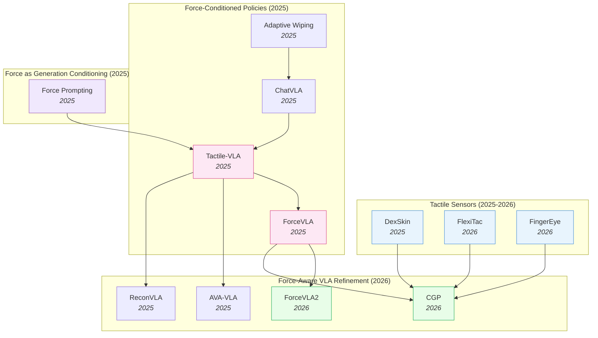

# Force-Aware and Tactile Policies — Deep Dive

> [!abstract] Overview
> Vision-only policies fail at contact-rich tasks because cameras cannot see force. Contact transitions are millisecond-fast and visually ambiguous: insertion alignment, surface polishing, fragile grasping, and delicate insertion all require fine-grained physical interaction signals that no visual feature can recover. This note tracks the force-aware/tactile cluster: from raw sensor hardware (capacitive skins, FPC piezoresistive pads, binocular vision-tactile fingertips), through force-conditioned VLA architectures (force prompts, force-aware MoE, hybrid force-position control), to force-as-generation-conditioning ([[2505.19386|Force Prompting]]), to contact-rich benchmarks. The field's central architectural insight is that **force should be treated as a first-class modality routed through dedicated experts** — not concatenated naively with visual tokens.

## Evolution Graph

From bolt-on force sensors and admittance controllers to fully-integrated force-aware MoE VLAs in under three years.

The field evolved through three overlapping phases. **Phase 1 — Force as auxiliary signal** (early 2025): [[2505.06451|Adaptive Wiping]] and [[2502.14420|ChatVLA]] used force feedback as a closed-loop sensor reading, treated as one input among many. **Phase 2 — Force as first-class modality** (mid 2025): [[2507.09160|Tactile-VLA]] and [[2505.22159|ForceVLA]] elevated force/torque to a primary modality with dedicated experts and force-aware MoE routing — these are the cluster's two landmark papers. **Phase 3 — Hybrid force-position control and contact grounding** (2026): [[2603.15169|ForceVLA2]] introduces cross-scale MoE with force prompts at the VLM level; [[2603.05687|CGP]] grounds policies in predicted multi-point contact trajectories; [[2604.28156|FlexiTac]] and [[2604.20689|FingerEye]] attack the hardware bottleneck with sub-$30 conformable skins and binocular vision-tactile fingertips.

| Year | Paper | Track | Contribution |
|------|-------|-------|--------------|
| 2024 | [[2410.24090\|Sparsh]] | Touch foundation model | First SSL touch representations across MAE/DINO/JEPA; **460k** unlabeled tactile images + TacBench |
| 2025 | [[2502.14420\|ChatVLA]] | Force-conditioned policy | Unified VLM with MoE: control-expert + understanding-expert (foundation for later force-MoEs) |
| 2025 | [[2505.06451\|Adaptive Wiping]] | Contact-rich benchmark | Few-shot IL + F/T feedback + VAE object representation; 100% contact, 96% reference force |
| 2025 | [[2505.19386\|Force Prompting]] | Force as generation conditioning | First to use physics-based force signals (pokes, wind) as video-generation control |
| 2025 | [[2505.22159\|ForceVLA]] | Force-conditioned VLA | Force-aware MoE (FVLMoE) treats 6-axis F/T as first-class modality; +23.2% over π0 |
| 2025 | [[2506.14754\|Sparsh-X]] | Touch foundation model | Multisensory (image+audio+motion+pressure) SSL on **~1M** contacts; **+500%** plug insertion |
| 2025 | [[2507.09160\|Tactile-VLA]] | Force-conditioned VLA | Force-aware action expert + hybrid position-force controller + CoT failure recovery |
| 2025 | [[2508.10333\|ReconVLA]] | Refinement (sensor-precursor) | Reconstructive gaze-region pretraining; precursor for visuotactile grounding |
| 2025 | [[2508.19236\|MemoryVLA]] | Refinement (memory) | Dual-memory PCMB; supports tactile-history accumulation over long horizons |
| 2025 | [[2509.18830\|DexSkin]] | Tactile sensor | Conformable capacitive skin, 294° coverage, $10/pair, 19/20 perturbed reorient |
| 2025 | [[2510.13324\|FARM]] | Force-conditioned policy | Tactile-conditioned diffusion policy predicting pose+grip+force; **100%** dynamic screw-tightening |
| 2025 | [[2511.18960\|AVA-VLA]] | Refinement (attention) | POMDP + recurrent state + active visual attention — applicable to force history |
| 2026 | [[2603.15257\|HapticVLA]] | Force-conditioned VLA | Tactile distillation enables force-aware VLA **without** inference-time tactile sensors |
| 2026 | [[2603.12665\|TacVLA]] | Force-conditioned VLA | Contact-aware gating: tactile tokens only activated during contact phases |
| 2026 | [[2603.05687\|CGP]] | Visuotactile policy | Contact-grounded policy: diffusion over coupled state+tactile trajectories |
| 2026 | [[2603.15169\|ForceVLA2]] | Force-conditioned VLA | Cross-Scale MoE + force prompts; 66% avg SR, **+48pp** over π0 |
| 2026 | [[2602.23648\|FAVLA]] | Force-conditioned VLA | Fast-slow VLA: slow VLM + force-injected fast action expert with adaptive frequency |
| 2026 | [[2601.20321\|TaF-VLA]] | Tactile-force alignment | **10M** synchronized tactile-force pairs + VQ-VAE force latent; **64.8%** avg SR |
| 2026 | [[2604.20689\|FingerEye]] | Tactile sensor | Continuous vision→tactile binocular fingertip; +30% over wrist-only baselines |
| 2026 | [[2604.28156\|FlexiTac]] | Tactile sensor | $30 FPC piezoresistive plug-in skin; 8×16 to 32×32 layouts at 100Hz |

> [!tip] Three Phases, One Architectural Convergence
> Across all three phases, the field converged on the same architectural pattern: **force gets its own encoder, its own attention path, and its own gated expert** — never naive concatenation with visual tokens. From Tactile-VLA's force-aware action expert to ForceVLA's FVLMoE to ForceVLA2's Cross-Scale MoE, the consistent finding is that contact dynamics require dedicated parameters that activate phase-aware (free-space vs in-contact). See [[03_VLA]] §7 for how this fits the broader VLA design space.

---

## 1. Design-Space Principles

Three orthogonal axes define every force-aware/tactile policy.

> [!success] The Three Axes
> - **Sensor modality**: extrinsic 6-axis F/T at wrist (cheap, coarse) → high-coverage tactile skin (rich, hardware-heavy) → vision-tactile fingertip (continuous pre→post contact)
> - **Where force enters the model**: at controller (admittance) / at action head (force-aware expert) / at VLM (force prompts) / at all three ([[2603.15169|ForceVLA2]])
> - **Pretraining strategy**: scratch policy on demonstrations / pretrain a tactile encoder unsupervised / pretrain a video generator with force prompts then attach action head

### Axis 1 — Sensor Modality

| Modality | Information | Cost | Example |
|----------|-------------|------|---------|
| **6-axis F/T at wrist** | Aggregated force/torque vector; coarse spatial info | $200-2k off-the-shelf | [[2505.06451\|Adaptive Wiping]], [[2505.22159\|ForceVLA]], [[2603.15169\|ForceVLA2]] |
| **High-coverage tactile skin** | Dense contact pressure map across end-effector | $10-30 (DIY) to $thousands | [[2509.18830\|DexSkin]], [[2604.28156\|FlexiTac]] |
| **Vision-tactile fingertip** | Continuous pre-contact vision + post-contact deformation | Mid-range ($100s) | [[2604.20689\|FingerEye]] |
| **Predicted tactile** (no sensor) | Diffusion-generated tactile trajectory; controller-translated | Compute-only | [[2603.05687\|CGP]] |

### Axis 2 — Where Force Enters the Model

| Entry point | Mechanism | Example |
|-------------|-----------|---------|
| **At low-level controller** | Hybrid position-force / admittance control over policy output | [[2505.06451\|Adaptive Wiping]], [[2507.09160\|Tactile-VLA]], [[2510.13324\|FARM]] |
| **At action head** | Force-aware action expert / dedicated F/T encoder feeding action expert | [[2507.09160\|Tactile-VLA]], [[2505.22159\|ForceVLA]], [[2602.23648\|FAVLA]] |
| **At MoE gating** | Force-aware MoE / Cross-Scale MoE routes between phase-specialized experts | [[2505.22159\|ForceVLA]], [[2603.15169\|ForceVLA2]] |
| **At contact-aware token gating** | Tactile tokens activated only on contact onset | [[2603.12665\|TacVLA]] |
| **At force-grounded latent (VQ-VAE)** | Tactile sequence aligned to force latent in shared codebook | [[2601.20321\|TaF-VLA]] |
| **At VLM (as prompt)** | Force readings tokenized and fed to VLM for long-horizon force-aware planning | [[2603.15169\|ForceVLA2]] |
| **As predicted/distilled signal** | Tactile token predicted from vision/state — no sensor at inference | [[2603.15257\|HapticVLA]] |
| **At video backbone** | Force conditioning of video generator (pre-action stage) | [[2505.19386\|Force Prompting]] |

### Axis 3 — Pretraining Strategy

| Strategy | Trade-off | Example |
|----------|-----------|---------|
| **From-scratch on contact demos** | Sample-efficient per task; brittle across tasks | [[2505.06451\|Adaptive Wiping]] |
| **Unsupervised tactile encoder pretrain** | VAE/contrastive on exploratory contact; reusable representation | [[2505.06451\|Adaptive Wiping]] (VAE), [[2603.05687\|CGP]] (KL-VAE) |
| **SSL touch foundation model** | Frozen/finetuned encoder reusable across tasks via MAE/DINO/JEPA over **460k–1M** unlabeled contacts | [[2410.24090\|Sparsh]], [[2506.14754\|Sparsh-X]] |
| **VLA fine-tune with force expert** | Inherits VLM generalization + adds force capacity via dedicated parameters | [[2507.09160\|Tactile-VLA]], [[2505.22159\|ForceVLA]], [[2603.15169\|ForceVLA2]], [[2602.23648\|FAVLA]], [[2603.12665\|TacVLA]] |
| **Force-grounded latent alignment** | VQ-VAE binds tactile streams to force codebook; plug-and-play across sensors | [[2601.20321\|TaF-VLA]] |
| **Sensor-free distillation** | Teacher uses tactile sensors, student distills to inference without them | [[2603.15257\|HapticVLA]] |
| **Force-conditioned video pretraining** | Latent physical understanding from video; transfers via action head | [[2505.19386\|Force Prompting]] |

> [!tip] Picking by Constraint
> If your task has a known reference force (wiping, polishing, insertion with known tolerance), use **closed-loop admittance over the action head** ([[2505.06451|Adaptive Wiping]]) — simplest and most data-efficient. If the task is multi-stage with free-space → contact transitions, use a **force-aware MoE** ([[2505.22159|ForceVLA]], [[2603.15169|ForceVLA2]]) so the gating switches experts at contact onset. If the task requires dense per-taxel contact info (in-hand reorientation, fragile grasping), the bottleneck is **sensor hardware** ([[2509.18830|DexSkin]], [[2604.28156|FlexiTac]]) before the policy architecture matters.

---

## 2. Tactile Sensors as a Sensing Modality

Hardware is the upstream bottleneck for the entire field. Until 2025, dense tactile sensing meant either expensive GelSight-style optical tactile sensors (slow, bulky, single-fingertip) or hand-rolled piezoresistive arrays (brittle, inconsistent across instances). The three sensor papers below attack this bottleneck on three different fronts.

- [[2604.28156|FlexiTac]], [[2604.20689|FingerEye]], [[2509.18830|DexSkin]]

**DexSkin** demonstrates the high-coverage frontier: a soft, conformable capacitive electronic skin with a parallel-plate grid design wrapping a fingertip with **294° coverage** at 60 taxels. The hardware story is impressive — **1.7 kPa sensitivity**, **6.52% hysteresis**, **2.09% drift over 500 cycles**, **1.48% crosstalk** — but the more important contribution is the **pneumatic pressure calibration** that enables policy transfer across hardware instances. Without consistent calibration, a policy trained on one DexSkin instance fails on a replaced sensor (5/20 success); with calibration, it recovers to 14/20. This calibration step is what makes tactile policies *deployable* rather than per-sensor research artifacts. Applied downstream: 19/20 success in perturbed in-hand pen reorientation (baselines: 0/20) and **90% reduction** in contact pressure on artificial berries via residual RL.

**FlexiTac** attacks affordability and manufacturability: a fully open-source, $30/unit FPC-based piezoresistive sensor with Arduino Nano + multiplexer readout streaming at **100 Hz**. Layouts span 8×16 to 32×32 taxels. The key engineering insight: directly etching electrodes onto Flexible Printed Circuit substrate (rather than hand-wiring) reduces fabrication time per pad to ~5 minutes and standardizes geometry. Narrow slots between FPC electrodes act as compliance hinges, improving sensitivity. The Kelvin-Voigt calibration model between real and simulated tactile signals enables sim-to-real RL fine-tuning — making FlexiTac one of the few open-source sensors with a documented sim-to-real story.

**FingerEye** takes a third path: continuous vision-tactile sensing through a compact wedge-shaped fingertip (28.0×25.4×26.0 mm) integrating **binocular RGB cameras**, a compliant soft ring, and a transparent AprilTag-laden acrylic cover. The PnP-tracked 6D pose of the AprilTag layout serves as a proxy for 6D contact wrench, giving force sensitivity down to **[4.30, 4.22, 9.93] mN** and torque to **[0.32, 0.13, 8.55] mN-m**. The crucial property is *continuity*: vision-only fingertip cameras see object alignment *before* contact, then transition seamlessly to tactile deformation *after* contact — bridging the gap that pure F/T-at-wrist sensors leave. Policies built on FingerEye achieve **+30% higher success rates** over wrist-camera-only baselines.

> [!star] Key Papers
> - [[2509.18830|DexSkin]] — High-coverage conformable capacitive skin; the **pneumatic calibration → policy transfer** insight is the breakthrough, enabling deployment beyond single-instance research demos
> - [[2604.28156|FlexiTac]] — $30 open-source FPC piezoresistive skin with documented sim-to-real via Kelvin-Voigt calibration; the hardware bottleneck-breaker for the community
> - [[2604.20689|FingerEye]] — Binocular vision-tactile fingertip with continuous pre→post-contact sensing; closes the contact-discontinuity gap

> [!tip] Sensor Bottleneck vs Policy Bottleneck
> For tasks failing at contact onset (alignment, insertion approach), the bottleneck is **continuous vision-tactile** ([[2604.20689|FingerEye]]). For tasks failing during sustained contact (perturbed reorientation, fragile grasping), the bottleneck is **high-coverage tactile skin** ([[2509.18830|DexSkin]]). For tasks failing due to coarse aggregated forces (wrist-mounted F/T), the policy can compensate ([[2505.22159|ForceVLA]]) — but the sensor will set the ultimate ceiling.

### 2.1 Touch Foundation Models — SSL Representations on Tactile Streams

A parallel research thread to better sensors: learn **general-purpose tactile representations** from large unlabeled tactile data via self-supervision, then re-use the encoder across downstream tasks. This is the touch analog of [[2304.07193|DINOv2]] for images — and the same lesson holds: a pretrained, frozen tactile encoder beats end-to-end task-specific training by a wide margin once labels are scarce.

- [[2506.14754|Sparsh-X]], [[2410.24090|Sparsh]]

[[2410.24090|Sparsh]] is the foundational paper. The team curated **~460,000 unlabeled tactile images** from heterogeneous vision-based tactile sensors and trained a family of Vision-Transformer encoders under three SSL objectives — ==[[2111.06377|MAE]]== (pixel reconstruction), ==DINO/DINOv2== (self-distillation in latent space), and ==JEPA== (joint-embedding predictive). They also introduced ==TacBench== — the first standardized benchmark over six diverse tactile tasks (force estimation, slip detection, pose estimation, grasp stability, textile recognition, manipulation planning). The headline result: Sparsh encoders outperform end-to-end trained baselines by **~95.1% on average**, with the gap widening sharply when labeled data is scarce. The structural finding mirrors V-JEPA: **latent-space SSL beats pixel reconstruction** — Sparsh ([[2104.14294|DINO]]) and Sparsh (JEPA) consistently outperform Sparsh (MAE), with policies trained on Sparsh representations achieving **20-53% greater traversal distances** on a real-robot bead-maze task than end-to-end policies.

[[2506.14754|Sparsh-X]] generalizes the recipe to **multisensory touch**. Where Sparsh fused only vision-based tactile pixels, Sparsh-X jointly encodes **four tactile modalities** (image, audio, IMU/motion, pressure) from Digit 360 sensors using ==attention bottlenecks== — a transformer architecture explicitly designed for cross-modal tactile fusion. The dataset scales to **~1 million unlabeled contact interactions** collected from a robot hand plus a manual picker tool, and training uses teacher-student distillation in the SSL spirit. Downstream impact: **+17%** higher accuracy on physical-property estimation (normal force, material-quantity), **+500%** improvement in plug-insertion success over vision-only policies (reaching 90%) and **+63%** over tactile-image-only, plus **90%** reduction in vertical drift on in-hand rotation. This is the cleanest demonstration that *multimodal* touch — not just pixel-based vision-tactile — is what unlocks the contact-rich frontier.

> [!star] Key Papers
> - [[2410.24090|Sparsh]] — Foundational SSL touch encoder family across MAE/DINO/JEPA on **460k** unlabeled tactile images; introduces ==TacBench==; outperforms end-to-end baselines by **~95.1%** on average; established that *latent-space SSL beats pixel reconstruction* for tactile representations
> - [[2506.14754|Sparsh-X]] — Multisensory touch foundation model fusing image + audio + IMU + pressure via attention bottlenecks on **~1M** contact interactions; **+500%** plug insertion over vision-only; the multimodal extension of Sparsh

> [!tip] Tactile Pretraining ≈ Visual Pretraining
> The Sparsh/Sparsh-X result is the touch analog of the DINOv2 lesson: a frozen, SSL-pretrained tactile encoder amortizes data-labeling cost across the entire downstream task family. The architectural pattern matches the broader latent-prediction wins documented in [[05_Latent-World-Models]] — JEPA-style objectives generalize from RGB to tactile streams, and from unimodal to multisensory. The implication for force-aware VLAs: tactile encoders below should be *pretrained Sparsh-X-style*, not trained from scratch per task. Most VLAs in §3 still do the latter — an obvious upgrade path.

---

## 3. Force-Conditioned VLA Architectures

The core of the cluster. Three landmark VLA architectures — **[[2507.09160|Tactile-VLA]]** (force as augmented action space), **[[2505.22159|ForceVLA]]** (force-aware MoE), **[[2603.15169|ForceVLA2]]** (cross-scale MoE + force prompts) — define the design space. Plus a fourth strand of refinement-level VLAs ([[2511.18960|AVA-VLA]], [[2508.10333|ReconVLA]], [[2502.14420|ChatVLA]]) that contribute attention, grounding, or training-curriculum innovations directly applicable to force-aware settings.

- [[2603.15257|HapticVLA]], [[2603.15169|ForceVLA2]], [[2603.12665|TacVLA]], [[2602.23648|FAVLA]], [[2601.20321|TaF-VLA]], [[2511.18960|AVA-VLA]], [[2510.13324|FARM]], [[2508.10333|ReconVLA]], [[2507.09160|Tactile-VLA]], [[2505.22159|ForceVLA]], [[2502.14420|ChatVLA]]

### 3.1 Force as Augmented Action Space — Tactile-VLA

[[2507.09160|Tactile-VLA]] is the cleanest formulation: a multi-modal transformer fuses vision, language, and 6-axis tactile inputs through a pre-trained VLM backbone, then a **force-aware action expert** outputs augmented action vectors specifying both target position *and* target contact force. A **hybrid position-force controller** below then regulates both. Crucially, Tactile-VLA also adds a **Chain-of-Thought reasoning module** fine-tuned on failure events: when force feedback indicates a physical-interaction problem ("blackboard wiping with insufficient force"), the model diagnoses the issue and autonomously generates corrective instructions, adapting force from 3.5N to 6.7N. Real-world results: **90%** on Charger task vs 25-40% baselines; **90%** OOD fragile paper-box grasping; **80%** zero-shot blackboard wiping vs 0-15% baselines.

### 3.2 Force as First-Class Modality with MoE Routing — ForceVLA

[[2505.22159|ForceVLA]] generalizes [[2507.09160|Tactile-VLA]]'s insight into a **Force-aware Mixture-of-Experts (FVLMoE)** module: 6-axis F/T readings flow into separate expert modules, then a gating network learns *when* to rely on the force expert vs the visual expert. During free-space motion the visual expert dominates; during contact (insertion, polishing) the force expert takes over — **phase-aware action generation**. This is the clearest demonstration of the field's core architectural finding: **late-fusion of force after VLM encoding outperforms early concatenation**, because the pretrained VLM representations are preserved rather than diluted with raw F/T noise. Numbers: **60.5% avg SR** across 5 contact-rich tasks (vs 37.3% for [[2410.24164|π0]] + force concat); **90% success under partial visual occlusion**; **20% success on highly unstable socket insertion**. Ablations confirm: full FVLMoE 80% on a key task, simpler concatenation 60%, early fusion much worse. The accompanying **ForceVLA-Data** (244 trajectories with synchronized vision/proprioception/F/T) is one of the first publicly available force-aware datasets.

### 3.3 Hybrid Force-Position Control + Force Prompts — ForceVLA2

[[2603.15169|ForceVLA2]] is the successor architecture and current SOTA. It pushes force awareness up to the VLM level via **force-based prompts**: the VLM expert reads explicit force prompts ("apply firm contact while inserting") and produces long-horizon, force-aware task plans. Below it, the action expert uses a **Cross-Scale MoE** that adaptively fuses high-level VLM guidance with real-time interaction forces, enabling **closed-loop hybrid force-position regulation**. The dual-level architecture explicitly separates "what should I do given the force prompt" (VLM scale) from "how should I modulate my action given the current F/T reading" (action-expert scale). Probabilistic modeling of subtask transitions + flow-matching policy for force-aware action generation gives **66% avg SR across 5 contact-rich tasks** — a striking **+48pp over [[2410.24164|π0]]** and **+31pp over [[2505.22159|ForceVLA]]**. Ablations: Cross-Scale MoE provides the largest single contribution (**+26%**), confirming that *where in the architecture* force is integrated matters more than whether it's integrated.

### 3.4 Force-Grounded Tactile Alignment — TaF-VLA

[[2601.20321|TaF-VLA]] occupies a distinct slot in the design space: most tactile VLAs align tactile signals to *visual* embeddings (treating touch as another visual texture), but TaF-VLA grounds tactile observations directly in *physical interaction forces*. The team built an automated TaF-Device to collect a **TaF-Dataset of >10M synchronized tactile-force pairs** across multiple Vision-Based Tactile Sensors — the largest synchronized tactile-force corpus to date. A ==TaF-Adapter== then aligns tactile sequences with force signals in a shared latent space via ==VQ-VAE== plus ==temporal encoding== (essential for distinguishing static deformation vs incipient slip). The adapter is frozen and plugged into a VLA backbone, where force-aligned tactile representations interleave with vision-language features and proprioception. Result: **64.8% avg SR** on contact-rich tasks vs **37.1%** for vision-only and **42.8%** for tactile-vision-aligned baselines — and the adapter generalizes zero-shot to unseen tactile sensors (**60.3%** SR) and improves ACT/Diffusion Policy baselines by **6.7–33.3%** as a drop-in module. This makes TaF-VLA the clearest demonstration that the *grounding signal* (forces, not visual textures) is what matters for tactile-VLA performance — and arguably the most-deployable tactile-VLA component currently available, since it's plug-and-play.

### 3.5 Additional Force-Aware VLA Variants

A growing cluster of follow-on VLAs explores adjacent design choices to the three landmarks above. None redefine the design space, but each contributes a focused architectural variation worth knowing.

- [[2602.23648|FAVLA]] adds a **fast-slow temporal axis**: a slow VLM backbone for semantic reasoning runs at low frequency, while a ==Force-Injected Action Expert== runs at high frequency with force adapters injected into multiple transformer layers. A VLM-predicted ==force variance head== dynamically adjusts the action-expert's execution frequency — running more often during contact. Achieves **80.8% avg SR** on contact-rich tasks (+38pp over vision-only, +13.8pp over the strongest force-aware baseline) and substantially reduces peak contact forces (e.g., 7.7N for Gear Assembly).
- [[2603.12665|TacVLA]] introduces a ==contact-aware gating module== that only activates tactile tokens when physical contact is detected, preventing noise injection during free-space phases. The lightweight MLP-based tactile encoder keeps the architecture compact. Achieves **83.75% avg SR** on disassembly tasks and remains robust under severe visual occlusion (>60% SR vs ~30% for vision-only).
- [[2603.15257|HapticVLA]] explores the sensor-free deployment direction: a ==Safety-Aware Reward-Weighted Flow Matching== teacher (which uses tactile sensors during training) distills tactile awareness into a student VLA that predicts a compact tactile token from vision and state at inference — **no physical tactile sensor needed at deployment**. Achieves **86.7% mean SR** on fragile-object pick-and-place, including a 45pp absolute gain on egg manipulation over [[2506.01844|SmolVLA]].
- [[2510.13324|FARM]] takes a different route — a ==diffusion policy== that explicitly predicts robot pose, grip width, *and* target grip force as its action space, conditioned on high-dimensional tactile force distributions. A dual-mode controller switches between position control in free space and closed-loop force control during contact. Demonstrates **100%** success on dynamic screw-tightening (challenging for any baseline) and superior force matching to human demonstrations.

### 3.6 Refinement-Level Architectures Applicable to Force-Aware Settings

Three VLAs not built specifically for force-aware tasks contribute components directly usable here:

- [[2511.18960|AVA-VLA]] reformulates VLA as a POMDP with a recurrent state encoding belief over past observations and actions. Applied to force-aware tasks, the recurrent state can encode *force history* — a natural fit for tasks where the current force is meaningless without recent context (e.g., "am I still pressing, or did I just transition into free space?"). The Active Visual Attention module also generalizes to "active force attention" — though no published paper does this yet.
- [[2508.10333|ReconVLA]] uses reconstructive learning on visual gaze regions; the same training signal generalizes to reconstructive learning on contact regions, forcing the model to encode precise tactile information. The diffusion-transformer denoiser trained on visual tokens is architecturally close to [[2603.05687|CGP]]'s tactile-trajectory denoiser.
- [[2502.14420|ChatVLA]] introduces **Phased Alignment Training** (two-stage curriculum: control first, then multimodal understanding) — directly applicable to force-aware VLAs that risk losing visual generalization when fine-tuned heavily on contact-rich demonstrations. The control-expert / understanding-expert MoE split is the conceptual parent of [[2505.22159|ForceVLA]]'s FVLMoE.

> [!star] Key Papers
> - [[2603.15169|ForceVLA2]] — Cross-Scale MoE + force prompts; current SOTA for force-aware VLA at **66%** avg SR, **+48pp** over [[2410.24164|π0]]
> - [[2505.22159|ForceVLA]] — Force-aware MoE; the foundational late-fusion-with-phase-aware-gating architecture; **+23.2%** over force-concat baselines
> - [[2507.09160|Tactile-VLA]] — Force in augmented action space + Chain-of-Thought failure recovery; **90%** Charger, **80%** zero-shot blackboard wiping via autonomous force adjustment
> - [[2601.20321|TaF-VLA]] — Force-grounded tactile alignment via VQ-VAE on **10M** tactile-force pairs; the cleanest demonstration that *grounding tactile in physical force* (not visual texture) is what unlocks VLA contact-rich performance; plug-and-play with **6.7-33.3%** gain on ACT/Diffusion Policy baselines
> - [[2502.14420|ChatVLA]] — Phased Alignment Training + control/understanding MoE; the architectural parent of force-aware MoE designs

> [!tip] Late Fusion Beats Early Concatenation
> Across Tactile-VLA, ForceVLA, and ForceVLA2, the consistent finding is that force/tactile features should be integrated **after** the VLM has produced its visual-language embedding — never as a raw concatenated stream at the input. Early concatenation dilutes the pretrained VLM representations and underperforms late fusion by 10-20pp on contact-rich benchmarks. The architectural pattern: visual+language → VLM → action expert with force-aware MoE gating that consumes a separately-encoded F/T stream.

---

## 4. Force as Generation Conditioning

A complementary track: rather than feeding force *into* a policy, use force to *condition video generation*, then use the video predictions to train downstream policies. This is force-aware *world modeling* rather than force-aware control.

- [[2505.19386|Force Prompting]]

[[2505.19386|Force Prompting]] adapts CogVideoX (a state-of-the-art video diffusion model) with a [[2302.05543|ControlNet]] architecture to accept **force prompts** as physics-based control signals — both global wind forces and localized point pokes. Trained on 15-23k synthetic videos from Blender + [[2404.13026|PhysDreamer]], the model generalizes to diverse real-world scenes. The striking emergent property: an **intuitive understanding of mass** — perceived lighter objects move farther than heavier ones under the same applied force, with displacement scaling linearly with force magnitude. Generation realism outperforms text-only and trajectory-based controls in human evaluations.

Why this matters for force-aware policies: Force Prompting demonstrates that pretrained video generators already encode latent physical understanding of forces — and that understanding can be activated with minimal synthetic data. Combined with a downstream VLA action head, force-conditioned video pretraining offers a path to bootstrap physical intuition without expensive force-instrumented teleoperation data. See [[07_Physics-Aware-Embodied-AI]] §3 for the broader physics-conditioned video-generation track and [[04_WAM]] for WAM augmentation patterns.

> [!star] Key Papers
> - [[2505.19386|Force Prompting]] — First to use physics-based force signals (point pokes + global wind) as video-generation control; trained on **15-23k** synthetic videos, generalizes to real scenes with emergent mass-awareness

> [!tip] Generation vs Control
> Force Prompting answers a different question than Tactile-VLA/ForceVLA: "what would happen if I applied this force?" rather than "what force should I apply right now?". The natural pipeline is to combine them — pretrain on force-conditioned generation, then attach a force-aware action head. No published work has executed this combination yet (open opportunity).

---

## 5. Contact-Rich Manipulation Benchmarks and Visuotactile Policies

The downstream targets of all this work. Contact-rich tasks — wiping, polishing, insertion, in-hand reorientation, fragile grasping, multi-finger jar opening — define the benchmarks the field is racing against.

- [[2603.05687|CGP]], [[2505.06451|Adaptive Wiping]], [[2508.19236|MemoryVLA]]

[[2505.06451|Adaptive Wiping]] is the cleanest contact-rich benchmark: wiping a deformable sponge across surfaces of unknown height with unknown sponge stiffness. The recipe — pretrained VAE on exploratory F/T contact + few-shot imitation + closed-loop F/T feedback — achieves **100% contact** and applies **96% of the human-demonstrated reference force** across 40 scenarios with unseen heights and sponge properties. Baselines tell the story: open-loop IL gets 4% reference force; admittance control gets 42% (constant force, no adaptation). The takeaway: closed-loop force feedback + a learned object representation is data-efficient and generalizes — but only within tightly-scoped contact-rich tasks. It does not give you a generalist policy.

[[2603.05687|CGP]] (Contact-Grounded Policy) takes a more ambitious route: predict coupled future trajectories of **both** robot state and **expected tactile feedback** via a conditional diffusion model, then translate these into controller-executable targets via a learned contact-consistency mapping. A KL-regularized VAE compresses tactile observations into a compact latent space for stable long-horizon forecasts. CGP outperforms visuomotor and visuotactile diffusion-policy baselines across 5 complex tasks including jar opening and in-hand box flipping, with tight alignment between predicted and observed tactile signals. The key architectural insight: **predicting tactile trajectories alongside state trajectories** forces the diffusion model to internalize contact dynamics, producing physically consistent rollouts.

[[2508.19236|MemoryVLA]] contributes the long-horizon piece: a **Perceptual-Cognitive Memory Bank** (PCMB) storing both low-level perceptual details (recent F/T readings, contact events) and high-level cognitive semantics (task progress) over extended horizons. On real-world long-horizon temporal tasks, MemoryVLA achieves **+26pp gain** over CogACT-Large with only **+3.6% latency** and **+0.8 GB GPU memory**. For force-aware tasks specifically, the PCMB is a natural home for force history — "did I already press this button, and how hard?" — though MemoryVLA is not yet specialized for force-aware settings.

[[2502.14420|ChatVLA]] though primarily a unified VLA, demonstrates strong contact-rich manipulation results across 25 real-world tasks via its MoE-with-Phased-Alignment recipe, suggesting that even general-purpose VLAs can handle a substantial fraction of contact-rich tasks with the right training curriculum.

> [!star] Key Papers
> - [[2603.05687|CGP]] — Generative contact grounding via diffusion over coupled state+tactile trajectories; outperforms visuomotor/visuotactile diffusion baselines on 5 complex contact-rich tasks (jar opening, in-hand box flipping)
> - [[2505.06451|Adaptive Wiping]] — Few-shot IL + F/T feedback + VAE object representation; **100% contact**, **96% reference force** under unseen heights/sponges; the cleanest contact-rich benchmark to date

> [!tip] Benchmark Frontier
> Most contact-rich benchmarks today (ForceVLA-Data, ForceVLA2-Dataset, Adaptive Wiping scenarios) involve hundreds to ~1k trajectories on 5-25 task variants. None approach the scale of [[2310.08864|OXE]] (1M+ trajectories). Until we have an "OXE for contact-rich tasks," force-aware policy performance will be bounded by data scale, not architecture. See [[02_Dataset-Benchmark-Environment]] for the broader benchmark landscape.

---

## 6. Open Problems & Failure Modes

Despite the architectural convergence, the cluster has unresolved bottlenecks:

- **Cross-sensor transfer remains brittle**: A policy trained with one [[2509.18830|DexSkin]] instance needs pneumatic calibration to transfer to another — and that's the *good* case. Cross-sensor-modality transfer (DexSkin → [[2604.28156|FlexiTac]]) is essentially untested. [[2410.24090|Sparsh]]/[[2506.14754|Sparsh-X]] address representation-level portability via SSL, and [[2601.20321|TaF-VLA]] reports **60.3%** zero-shot transfer across unseen tactile sensors via force-grounded alignment — but these are early signs, not solutions. Until calibration generalizes across sensor *types*, every new robot platform restarts data collection from scratch.

- **No "[[2310.08864|OXE]] for force-aware tasks"**: [[2505.22159|ForceVLA]]'s ForceVLA-Data (244 trajectories) and [[2603.15169|ForceVLA2]]'s 1,000-trajectory dataset are the largest publicly available force-instrumented datasets. Orders of magnitude smaller than cross-embodiment visual datasets. The bottleneck is the cost of force-instrumented teleoperation rigs.

- **Force prompts vs force signals as VLM input**: [[2603.15169|ForceVLA2]] uses force *prompts* (linguistic descriptions of force at the VLM); [[2507.09160|Tactile-VLA]] feeds raw tactile signals into the VLM through tokenization. Neither approach is clearly superior across all tasks. The right tokenization scheme for continuous F/T at VLM scale is unresolved.

- **Failure recovery from tactile signals**: [[2507.09160|Tactile-VLA]]'s CoT-from-tactile is impressive but covers only ~3-5 failure modes in the published work. Generalizing to open-set failure recovery requires either (a) larger failure datasets or (b) reasoning models that can synthesize recovery strategies without explicit failure-mode supervision — see [[06_Self-Evolving-VLA-WAM]] for the broader self-correction landscape.

- **Contact prediction stability**: [[2603.05687|CGP]] grounds policies on predicted tactile trajectories, but diffusion-predicted tactile signals can drift over long horizons. Closed-loop re-grounding (predict, execute, re-predict) is the natural fix but adds latency and hasn't been systematically studied.

- **Vision-tactile temporal alignment**: [[2604.20689|FingerEye]] highlights a subtle issue — vision and tactile streams have different latencies and sampling rates (vision: 30Hz; tactile: 100Hz-1kHz). Naive concatenation introduces phase errors at contact onset. Continuous sensors like FingerEye sidestep this by unifying modalities at the sensor level, but discrete vision+tactile pairs need careful temporal calibration.

- **Force-aware reasoning latency**: [[2507.09160|Tactile-VLA]]'s CoT failure recovery adds 1-3s of inference latency per recovery — fine for blackboard wiping (slow task), too slow for fast pick-and-place. The latency-quality trade-off seen in the broader VLA reasoning literature ([[08_VLA-Reasoning-and-CoT]]) is sharper in contact-rich settings because contact transitions are millisecond-fast.

---

## Quick-Reference Matrix

| Need | Use |
|------|-----|
| Cheap high-coverage tactile skin (DIY) | [[2604.28156\|FlexiTac]] ($30, FPC piezoresistive, 100Hz, 8×16-32×32) |
| High-quality conformable skin + sim-to-real | [[2509.18830\|DexSkin]] (capacitive, 294° coverage, pneumatic calibration) |
| Continuous pre→post-contact sensing | [[2604.20689\|FingerEye]] (binocular vision-tactile fingertip) |
| Pretrained tactile encoder (foundation model) | [[2410.24090\|Sparsh]] (MAE/DINO/JEPA over **460k** images + TacBench) or [[2506.14754\|Sparsh-X]] (multisensory: image+audio+IMU+pressure) |
| Force-conditioned VLA, simplest formulation | [[2507.09160\|Tactile-VLA]] (force-augmented action space + hybrid controller) |
| Force-aware MoE, late-fusion best-practice | [[2505.22159\|ForceVLA]] (FVLMoE; 60.5% avg SR) |
| SOTA force-aware VLA (force prompts + Cross-Scale MoE) | [[2603.15169\|ForceVLA2]] (66% avg SR; +48pp over π0) |
| Fast-slow VLA with adaptive force-trigger frequency | [[2602.23648\|FAVLA]] (80.8% avg SR; reduces peak contact forces) |
| Contact-aware tactile gating in VLA | [[2603.12665\|TacVLA]] (83.75% disassembly; robust to occlusion) |
| Tactile-aware VLA *without* inference-time tactile sensor | [[2603.15257\|HapticVLA]] (distilled tactile token; 86.7% on fragile-object tasks) |
| Force-grounded tactile alignment (plug-and-play VLA adapter) | [[2601.20321\|TaF-VLA]] (VQ-VAE on 10M tactile-force pairs; cross-sensor zero-shot) |
| Force-aware diffusion policy with explicit force action | [[2510.13324\|FARM]] (predicts pose+grip+force; 100% dynamic screw-tightening) |
| Visuotactile policy via diffusion-grounded contact prediction | [[2603.05687\|CGP]] (diffusion over coupled state+tactile trajectories) |
| Contact-rich task with known reference force | [[2505.06451\|Adaptive Wiping]] (few-shot IL + closed-loop F/T) |
| Force-conditioned video generation (for pretraining) | [[2505.19386\|Force Prompting]] (ControlNet-style force conditioning of CogVideoX) |
| Long-horizon memory for force history | [[2508.19236\|MemoryVLA]] (PCMB dual-memory; +26pp on long-horizon) |
| Failure recovery from tactile signals | [[2507.09160\|Tactile-VLA]] (CoT-from-tactile, 3.5N→6.7N adaptive adjustment) |
| Phased curriculum to avoid VLM forgetting | [[2502.14420\|ChatVLA]] (control-first, then understanding) |

---

## Cross-References

- [[03_VLA]] — §7 Multi-Sensor & Force-Aware is the parent section this deep-dive expands; see [[03_VLA]] §1 for the broader VLA design-space context and §10 for failure modes that overlap with §6 here
- [[06_Self-Evolving-VLA-WAM]] — Self-correcting VLAs and failure-recovery mechanisms ([[2601.02295|CycleVLA]], [[2512.24426|CF-VLA]], [[2511.14148|AsyncVLA]]) that complement [[2507.09160|Tactile-VLA]]'s CoT-from-tactile
- [[07_Physics-Aware-Embodied-AI]] — Physics priors and physics-conditioned video generation ([[2509.20358|PhysCtrl]], [[2505.19386|Force Prompting]]); the natural pretraining backbone for force-aware VLAs
- [[02_Dataset-Benchmark-Environment]] — Contact-rich benchmarks; §3 Tactile & Contact-Rich Benchmarks is the dedicated tactile-evaluation section (TacBench/Sparsh, [[2506.14754|Sparsh-X]], [[2603.05687|CGP]], [[2510.13324|FARM]], [[2509.07962|TA-VLA]], [[2509.18830|DexSkin]])
- [[01_Embodied-AI-101]] — Primer on embodied AI and the four learning strategies; force-aware policies sit at the intersection of imitation learning and physical interaction
- [[04_WAM]] — World-model augmentation patterns; [[2505.19386|Force Prompting]] fits the video-WAM track but with explicit force conditioning
- [[05_Latent-World-Models]] — Latent representation for multi-sensor inputs including tactile streams
- [[08_VLA-Reasoning-and-CoT]] — Reasoning architectures; tactile-driven CoT is one slot
- [[11_Sim-to-Real-Transfer]] — Sim-to-Real Transfer deep-dive; tactile sim-to-real challenges

---

*See [[03_VLA]] §7 for the VLA-design-space context this deep-dive expands, [[07_Physics-Aware-Embodied-AI]] for force-conditioned generation pretraining, or [[06_Self-Evolving-VLA-WAM]] for failure-recovery patterns that complement Tactile-VLA's CoT.*
