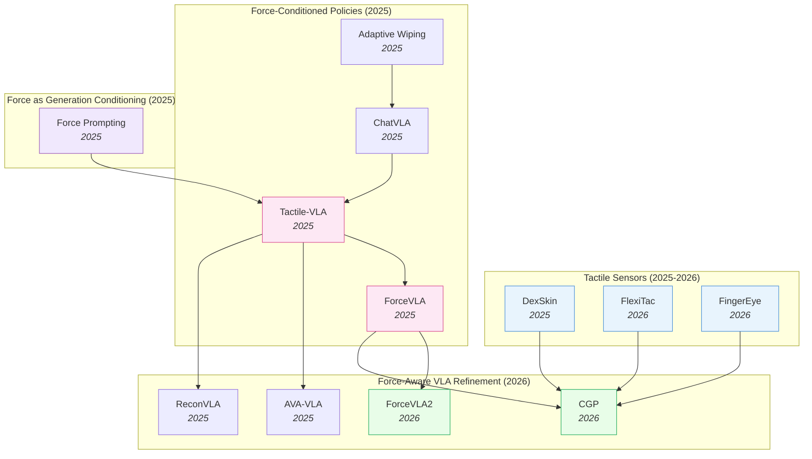

# Force-Aware and Tactile Policies — Deep Dive

> [!abstract] Overview
> Vision-only policies fail at contact-rich tasks because cameras cannot see force. Contact transitions are millisecond-fast and visually ambiguous: insertion alignment, surface polishing, fragile grasping, and delicate insertion all require fine-grained physical interaction signals that no visual feature can recover. This note tracks the force-aware/tactile cluster: from raw sensor hardware (capacitive skins, FPC piezoresistive pads, binocular vision-tactile fingertips), through force-conditioned VLA architectures (force prompts, force-aware MoE, hybrid force-position control), to force-as-generation-conditioning ([[2505.19386|Force Prompting]]), to contact-rich benchmarks. The field's central architectural insight is that **force should be treated as a first-class modality routed through dedicated experts** — not concatenated naively with visual tokens.

## Evolution Graph

From bolt-on force sensors and admittance controllers to fully-integrated force-aware MoE VLAs in under three years.

The field evolved through three overlapping phases. **Phase 1 — Force as auxiliary signal** (early 2025): [[2505.06451|Adaptive Wiping]] and [[2502.14420|ChatVLA]] used force feedback as a closed-loop sensor reading, treated as one input among many. **Phase 2 — Force as first-class modality** (mid 2025): [[2507.09160|Tactile-VLA]] and [[2505.22159|ForceVLA]] elevated force/torque to a primary modality with dedicated experts and force-aware MoE routing — these are the cluster's two landmark papers. **Phase 3 — Hybrid force-position control and contact grounding** (2026): [[2603.15169|ForceVLA2]] introduces cross-scale MoE with force prompts at the VLM level; [[2603.05687|CGP]] grounds policies in predicted multi-point contact trajectories; [[2604.28156|FlexiTac]] and [[2604.20689|FingerEye]] attack the hardware bottleneck with sub-$30 conformable skins and binocular vision-tactile fingertips.

| Year | Paper | Track | Contribution |
|------|-------|-------|--------------|
| 2024 | [[2410.24090\|Sparsh]] | Touch foundation model | First SSL touch representations across [[2111.06377\|MAE]]/[[2104.14294\|DINO]]/JEPA; **460k** unlabeled tactile images + TacBench |
| 2025 | [[2502.14420\|ChatVLA]] | Force-conditioned policy | Unified VLM with MoE: control-expert + understanding-expert (foundation for later force-MoEs) |
| 2025 | [[2505.06451\|Adaptive Wiping]] | Contact-rich benchmark | Few-shot IL + F/T feedback + VAE object representation; 100% contact, 96% reference force |
| 2025 | [[2505.19386\|Force Prompting]] | Force as generation conditioning | First to use physics-based force signals (pokes, wind) as video-generation control |
| 2025 | [[2505.22159\|ForceVLA]] | Force-conditioned VLA | Force-aware MoE (FVLMoE) treats 6-axis F/T as first-class modality; +23.2% over [[2410.24164\|π0]] |
| 2025 | [[2506.14754\|Sparsh-X]] | Touch foundation model | Multisensory (image+audio+motion+pressure) SSL on **~1M** contacts; **+500%** plug insertion |
| 2025 | [[2507.09160\|Tactile-VLA]] | Force-conditioned VLA | Force-aware action expert + hybrid position-force controller + CoT failure recovery |
| 2025 | [[2508.10333\|ReconVLA]] | Refinement (sensor-precursor) | Reconstructive gaze-region pretraining; precursor for visuotactile grounding |
| 2025 | [[2508.19236\|MemoryVLA]] | Refinement (memory) | Dual-memory PCMB; supports tactile-history accumulation over long horizons |
| 2025 | [[2509.18830\|DexSkin]] | Tactile sensor | Conformable capacitive skin, 294° coverage, $10/pair, 19/20 perturbed reorient |
| 2025 | [[2510.13324\|FARM]] | Force-conditioned policy | Tactile-conditioned diffusion policy predicting pose+grip+force; **100%** dynamic screw-tightening |
| 2025 | [[2511.18960\|AVA-VLA]] | Refinement (attention) | POMDP + recurrent state + active visual attention — applicable to force history |
| 2026 | [[2603.15257\|HapticVLA]] | Force-conditioned VLA | Tactile distillation enables force-aware VLA **without** inference-time tactile sensors |
| 2026 | [[2603.12665\|TacVLA]] | Force-conditioned VLA | Contact-aware gating: tactile tokens only activated during contact phases |
| 2026 | [[2603.05687\|CGP]] | Visuotactile policy | Contact-grounded policy: diffusion over coupled state+tactile trajectories |
| 2026 | [[2603.15169\|ForceVLA2]] | Force-conditioned VLA | Cross-Scale MoE + force prompts; 66% avg SR, **+48pp** over [[2410.24164\|π0]] |
| 2026 | [[2602.23648\|FAVLA]] | Force-conditioned VLA | Fast-slow VLA: slow VLM + force-injected fast action expert with adaptive frequency |
| 2026 | [[2601.20321\|TaF-VLA]] | Tactile-force alignment | **10M** synchronized tactile-force pairs + VQ-VAE force latent; **64.8%** avg SR |
| 2026 | [[2604.20689\|FingerEye]] | Tactile sensor | Continuous vision→tactile binocular fingertip; +30% over wrist-only baselines |
| 2026 | [[2604.28156\|FlexiTac]] | Tactile sensor | $30 FPC piezoresistive plug-in skin; 8×16 to 32×32 layouts at 100Hz |

> [!tip] Three Phases, One Architectural Convergence
> Across all three phases, the field converged on the same architectural pattern: **force gets its own encoder, its own attention path, and its own gated expert** — never naive concatenation with visual tokens. From [[2507.09160|Tactile-VLA]]'s force-aware action expert to [[2505.22159|ForceVLA]]'s FVLMoE to [[2603.15169|ForceVLA2]]'s Cross-Scale MoE, the consistent finding is that contact dynamics require dedicated parameters that activate phase-aware (free-space vs in-contact). See [[03_VLA#7. Multi-Sensor & Force-Aware VLAs]] for how this fits the broader VLA design space.

---

## Part A — Foundations & Sensing

*The design space (where force enters, what sensors deliver what) and the tactile sensors themselves as a sensing modality.*

### 1. Design-Space Principles

> [!info] Survey Anchor
> [[2504.03515|Dexterous IL Survey]] (2025) is the standing reference for the broader landscape this note carves out: it systematically reviews Behavioral Cloning, IRL, GAIL, Hierarchical IL, and Continual IL applied to dexterous manipulation; surveys end-effector hardware (simple grippers → multi-fingered anthropomorphic hands) and emphasises tactile sensing as a critical modality; details teleoperation systems and learning-from-video data acquisition; and catalogues the persistent open problems (data sparsity, generalization gaps, sim-to-real, real-time control, safety). When the present note discusses where force/tactile enters a *contact-rich VLA*, the survey covers the parallel question of how IL methods *more broadly* incorporate the same sensing modality.

Every force-aware/tactile policy commits to three orthogonal choices — *what sensor*, *where the force signal enters the model*, and *how the model is pretrained*. The interesting work in the cluster lives at the intersection of these axes; the axes themselves are *almost* independent (e.g. you can pair any sensor with any entry point), but specific combinations win specific contact regimes. The sub-sections below treat each axis as a separate decision dimension.

#### 1.1 Sensor Modality — What Force Signal You Can Even Measure

==The upstream choice that bounds everything downstream.== Sensors range from coarse aggregated F/T at the wrist (cheap, ubiquitous) to dense per-taxel skin (rich, hardware-bound). The richer the sensor, the higher the data-scale floor before a policy generalizes.

- **[[2505.06451|Adaptive Wiping]]**, **[[2505.22159|ForceVLA]]**, **[[2603.15169|ForceVLA2]]** — ==6-axis F/T at wrist==: aggregated force/torque vector, **$200–2k** off-the-shelf; coarse spatial info but immediately deployable.
- **[[2509.18830|DexSkin]]**, **[[2604.28156|FlexiTac]]** — ==high-coverage tactile skin==: dense contact pressure map across end-effector; **$10–30 DIY** to **thousands** for high-fidelity capacitive variants.
- **[[2604.20689|FingerEye]]** — ==vision-tactile fingertip==: continuous pre-contact vision + post-contact deformation in one sensor; mid-range cost (~$100s) but closes the contact-discontinuity gap.
- **[[2603.05687|CGP]]** — ==predicted tactile, no sensor==: diffusion-generated tactile trajectory translated to controller targets; compute-only, but adds long-horizon drift risk.

#### 1.2 Where Force Enters the Model — The Integration Axis

==The architectural choice that determines whether force is a first-class modality or a bolted-on side-channel.== The same F/T stream can be injected at the controller, the action head, the MoE gating, or the VLM prompt — and the field has converged on *late fusion above the visual backbone* as the canonical recipe.

- **[[2505.06451|Adaptive Wiping]]**, **[[2507.09160|Tactile-VLA]]**, **[[2510.13324|FARM]]** — ==at low-level controller==: hybrid position-force / admittance control regulates the policy's output; simplest and most data-efficient when reference force is known.
- **[[2507.09160|Tactile-VLA]]**, **[[2505.22159|ForceVLA]]**, **[[2602.23648|FAVLA]]** — ==at action head==: dedicated F/T encoder feeds a force-aware action expert; preserves pretrained VLM representations.
- **[[2505.22159|ForceVLA]]**, **[[2603.15169|ForceVLA2]]** — ==at MoE gating==: force-aware MoE / Cross-Scale MoE routes between phase-specialized experts (free-space vs in-contact).
- **[[2603.12665|TacVLA]]** — ==at contact-aware token gating==: tactile tokens activated *only* on contact onset; prevents free-space noise injection.
- **[[2601.20321|TaF-VLA]]** — ==at force-grounded latent==: tactile sequence aligned to force latent via VQ-VAE codebook; plug-and-play across sensors.
- **[[2603.15169|ForceVLA2]]** — ==at VLM (as prompt)==: force readings tokenized as linguistic prompts feeding the VLM for long-horizon force-aware planning.
- **[[2603.15257|HapticVLA]]** — ==as predicted/distilled signal==: tactile token predicted from vision/state — no sensor needed at inference.
- **[[2505.19386|Force Prompting]]** — ==at video backbone==: force conditioning of video generator at the pre-action stage; force-aware *world modeling* rather than control.

#### 1.3 Pretraining Strategy — Where Generalization Comes From

==The data-axis choice that determines whether a contact policy survives task variation.== Options run from per-task from-scratch (sample-efficient, brittle) to SSL touch foundation models pretrained on **460k–1M** unlabeled contacts (data-hungry, transferable).

- **[[2505.06451|Adaptive Wiping]]** — ==from-scratch on contact demos==: sample-efficient per task; brittle across tasks.
- **[[2505.06451|Adaptive Wiping]] (VAE)**, **[[2603.05687|CGP]] (KL-VAE)** — ==unsupervised tactile encoder pretrain==: VAE/contrastive on exploratory contact; reusable representation within a task family.
- **[[2410.24090|Sparsh]]**, **[[2506.14754|Sparsh-X]]** — ==SSL touch foundation model==: frozen/finetuned encoder reusable across tasks via [[2111.06377|MAE]] / [[2104.14294|DINO]] / JEPA over **460k–1M** unlabeled contacts.
- **[[2507.09160|Tactile-VLA]]**, **[[2505.22159|ForceVLA]]**, **[[2603.15169|ForceVLA2]]**, **[[2602.23648|FAVLA]]**, **[[2603.12665|TacVLA]]** — ==VLA fine-tune with force expert==: inherits VLM generalization + adds force capacity via dedicated parameters.
- **[[2601.20321|TaF-VLA]]** — ==force-grounded latent alignment==: VQ-VAE binds tactile streams to a force codebook; plug-and-play across sensors and student backbones.
- **[[2603.15257|HapticVLA]]** — ==sensor-free distillation==: teacher uses tactile sensors during training, student distills to inference without them.
- **[[2505.19386|Force Prompting]]** — ==force-conditioned video pretraining==: latent physical understanding from video; transfers to control via downstream action head.

**[Design-Space — Decision Matrix]**

| Need | Recommendation |
|---|---|
| Known reference force, single contact-rich task (wiping, polishing, insertion) | Closed-loop admittance at controller — [[2505.06451\|Adaptive Wiping]] |
| Multi-stage task with free-space → contact transitions | Force-aware MoE — [[2505.22159\|ForceVLA]], [[2603.15169\|ForceVLA2]] |
| Dense per-taxel contact info (in-hand reorient, fragile grasp) | Hardware first — [[2509.18830\|DexSkin]], [[2604.28156\|FlexiTac]] before policy architecture |
| Continuous pre→post-contact perception (alignment, insertion approach) | Vision-tactile fingertip — [[2604.20689\|FingerEye]] |
| Reusable tactile encoder across tasks | SSL touch foundation — [[2410.24090\|Sparsh]] / [[2506.14754\|Sparsh-X]] |
| Inference-time deployment without tactile sensor | Sensor-free distillation — [[2603.15257\|HapticVLA]] |
| Cross-sensor portability for tactile signal | Force-grounded latent — [[2601.20321\|TaF-VLA]] |
| Bootstrap physical priors from video pretraining | Force-conditioned video generator — [[2505.19386\|Force Prompting]] |

> [!star] Key Design-Space Papers
> - [[2603.15169|ForceVLA2]] — The only architecture to integrate force at *all three* axis-2 entry points simultaneously (controller + MoE + VLM prompt); demonstrates the cluster's architectural ceiling at **66%** avg SR, **+48pp** over [[2410.24164|π0]]
> - [[2505.22159|ForceVLA]] — The canonical late-fusion design — the field's most-copied template for treating F/T as a first-class modality through a dedicated expert and phase-aware gating
> - [[2410.24090|Sparsh]] — The cluster's pretraining-axis founder; **460k** unlabeled tactile images + ==TacBench== established that the touch analog of [[2304.07193|DINOv2]] beats end-to-end training by **~95.1%** average

> [!tip] Picking by Constraint
> If your task has a known reference force (wiping, polishing, insertion with known tolerance), use **closed-loop admittance over the action head** ([[2505.06451|Adaptive Wiping]]) — simplest and most data-efficient. If the task is multi-stage with free-space → contact transitions, use a **force-aware MoE** ([[2505.22159|ForceVLA]], [[2603.15169|ForceVLA2]]) so the gating switches experts at contact onset. If the task requires dense per-taxel contact info (in-hand reorientation, fragile grasping), the bottleneck is **sensor hardware** ([[2509.18830|DexSkin]], [[2604.28156|FlexiTac]]) before the policy architecture matters. See [[03_VLA#7. Multi-Sensor & Force-Aware VLAs]] for how the multi-modal entry-point taxonomy fits the broader VLA design space, and [[11_Sim-to-Real-Transfer#3. Policy-Side: Robustness & Domain Randomization]] for sensor-side calibration needed before any of these axes generalize.

---

### 2. Tactile Sensors as a Sensing Modality

Hardware is the upstream bottleneck. Until 2025, dense tactile sensing meant expensive GelSight-style optical sensors (slow, bulky, single-fingertip) or hand-rolled piezoresistive arrays (brittle, inconsistent). Three sensor papers attack this bottleneck on different fronts — high-coverage skin, affordable open-source FPC, and continuous vision-tactile.

- **[[2509.18830|DexSkin]]** — ==Conformable capacitive skin== with parallel-plate grid; **294° coverage** at 60 taxels; **1.7 kPa** sensitivity, **6.52%** hysteresis, **2.09%** drift / 500 cycles. The breakthrough is ==pneumatic pressure calibration==: without it, policy transfer across instances collapses to **5/20** SR; with it, recovers to **14/20**. Downstream: **19/20** perturbed pen reorient (baselines **0/20**), **90%** contact-pressure reduction on berries via residual RL.
- **[[2604.28156|FlexiTac]]** — Fully open-source, ==$30/unit FPC piezoresistive sensor== with Arduino Nano + multiplexer at **100 Hz**; layouts 8×16 to 32×32. Key insight: ==direct electrode etching== on FPC substrate (vs hand-wiring) drops fabrication to ~5 min/pad; narrow inter-electrode slots act as ==compliance hinges==. ==Kelvin-Voigt calibration== between real/simulated tactile signals enables sim-to-real RL fine-tune — one of the few open-source sensors with a documented sim-to-real story.
- **[[2604.20689|FingerEye]]** — ==Continuous vision-tactile fingertip== (28×25.4×26 mm) integrating ==binocular RGB cameras==, compliant soft ring, transparent AprilTag acrylic cover. PnP-tracked 6D pose of AprilTag layout proxies 6D contact wrench: force **[4.30, 4.22, 9.93] mN**, torque **[0.32, 0.13, 8.55] mN-m**. Crucial property is *continuity* — vision sees alignment *before* contact, transitions seamlessly to tactile deformation *after*; **+30%** SR over wrist-camera-only baselines.

**[Tactile Sensors — Decision Matrix]**

| Need | Recommendation |
|---|---|
| High-coverage skin for in-hand reorientation / fragile grasping | [[2509.18830\|DexSkin]] — capacitive grid, **294° coverage**, pneumatic calibration required for cross-instance transfer |
| Open-source, budget-friendly piezoresistive pad with sim-to-real path | [[2604.28156\|FlexiTac]] — **$30/unit** FPC + Kelvin-Voigt calibration; lowest barrier for community adoption |
| Continuous pre→post-contact sensing for alignment-then-contact tasks | [[2604.20689\|FingerEye]] — binocular vision-tactile fingertip; **+30%** SR over wrist-cam-only |
| Frozen tactile encoder for label-scarce downstream tasks (unimodal) | [[2410.24090\|Sparsh]] — SSL on **460k** tactile images; latent-SSL beats pixel reconstruction; ships with TacBench |
| Multisensory tactile fusion (image + audio + IMU + pressure) | [[2506.14754\|Sparsh-X]] — attention-bottleneck fusion at **~1M** contacts; **+500%** plug-insertion vs vision-only |
| Coarse aggregated F/T only (wrist-mounted) — sensor secondary | Pair with [[2505.22159\|ForceVLA]]-style policy compensation; sensor sets the eventual ceiling |

> [!star] Key Papers
> - [[2509.18830|DexSkin]] — High-coverage conformable capacitive skin; the **pneumatic calibration → policy transfer** insight is the breakthrough, enabling deployment beyond single-instance research demos
> - [[2604.28156|FlexiTac]] — $30 open-source FPC piezoresistive skin with documented sim-to-real via Kelvin-Voigt calibration; the hardware bottleneck-breaker for the community
> - [[2604.20689|FingerEye]] — Binocular vision-tactile fingertip with continuous pre→post-contact sensing; closes the contact-discontinuity gap

> [!tip] Sensor Bottleneck vs Policy Bottleneck
> For tasks failing at contact onset (alignment, insertion approach), the bottleneck is **continuous vision-tactile** ([[2604.20689|FingerEye]]). For tasks failing during sustained contact (perturbed reorientation, fragile grasping), the bottleneck is **high-coverage tactile skin** ([[2509.18830|DexSkin]]). For tasks failing due to coarse aggregated forces (wrist-mounted F/T), the policy can compensate ([[2505.22159|ForceVLA]]) — but the sensor will set the ultimate ceiling.

#### 2.1 Touch Foundation Models — SSL Representations on Tactile Streams

A parallel thread to better sensors: learn ==general-purpose tactile representations== via SSL on large unlabeled tactile data, then reuse the frozen encoder downstream. The touch analog of [[2304.07193|DINOv2]] — and the same lesson holds: pretrained frozen encoder beats end-to-end task-specific training by a wide margin once labels are scarce.

- **[[2410.24090|Sparsh]]** — Foundational SSL touch encoder family on **~460k** unlabeled tactile images across heterogeneous vision-based sensors; ViT trained under ==[[2111.06377|MAE]]== (pixel reconstruction), ==[[2104.14294|DINO]]/[[2304.07193|DINOv2]]== (self-distillation), and ==JEPA== (joint-embedding). Introduces ==TacBench== — first benchmark over 6 tactile tasks (force estimation, slip detection, pose, grasp stability, textile recognition, planning). Beats end-to-end baselines by **~95.1%** avg; latent-SSL ([[2104.14294|DINO]]/JEPA) consistently beats pixel reconstruction ([[2111.06377|MAE]]); bead-maze policies show **+20–53%** traversal vs end-to-end.
- **[[2506.14754|Sparsh-X]]** — Multisensory generalization: jointly encodes **4 tactile modalities** (image + audio + IMU + pressure) from Digit 360 via ==attention bottlenecks==; scales to **~1M** unlabeled contacts; teacher-student SSL distillation. Downstream: **+17%** physical-property estimation, **+500%** plug-insertion (reaching **90%**) vs vision-only, **+63%** vs tactile-image-only, **90%** in-hand rotation drift reduction — the cleanest demonstration that *multimodal* touch unlocks the contact-rich frontier.

> [!star] Key Papers
> - [[2410.24090|Sparsh]] — Foundational SSL touch encoder family across [[2111.06377|MAE]]/[[2104.14294|DINO]]/JEPA on **460k** unlabeled tactile images; introduces ==TacBench==; outperforms end-to-end baselines by **~95.1%** on average; established that *latent-space SSL beats pixel reconstruction* for tactile representations
> - [[2506.14754|Sparsh-X]] — Multisensory touch foundation model fusing image + audio + IMU + pressure via attention bottlenecks on **~1M** contact interactions; **+500%** plug insertion over vision-only; the multimodal extension of [[2410.24090|Sparsh]]

> [!tip] Tactile Pretraining ≈ Visual Pretraining
> The [[2410.24090|Sparsh]]/[[2506.14754|Sparsh-X]] result is the touch analog of the [[2304.07193|DINOv2]] lesson: a frozen, SSL-pretrained tactile encoder amortizes data-labeling cost across the entire downstream task family. The architectural pattern matches the broader latent-prediction wins documented in [[05_Latent-World-Models#3. Broader Latent Prediction Landscape]] — JEPA-style objectives generalize from RGB to tactile streams, and from unimodal to multisensory. The implication for force-aware VLAs: tactile encoders below should be *pretrained Sparsh-X-style*, not trained from scratch per task. Most VLAs in §3 still do the latter — an obvious upgrade path.

---

## Part B — Force-Conditioned Policy Architectures

*How force gets injected into VLAs (Tactile-VLA, ForceVLA, TaF-VLA) and how it conditions generation models.*

### 3. Force-Conditioned VLA Architectures

The core of the cluster. Force-aware VLAs cluster along *where* force enters the network — the action head, an MoE gating module, a latent-aligned adapter, a refinement layer that handles the human/recovery loop, or upstream as video-generation conditioning. The sub-sections below treat each entry-point as a distinct architectural axis, with the bullet-per-paper detail showing how multiple groups have explored the same axis with different design choices.

#### 3.1 Force-Aware Action Heads

The most direct integration: force enters at the action expert (or its controller), giving the policy a hybrid position-force output space. These papers preserve the pretrained VLM backbone and add force capacity through dedicated parameters at the action stage.

- **[[2507.09160|Tactile-VLA]]** — ==Multi-modal transformer== fusing vision + language + ==tactile inputs== via ==pre-trained VLM backbone==; ==force-aware action expert== outputs augmented action vectors (position *and* contact force) regulated by a ==hybrid position-force controller==. CoT failure recovery autonomously adjusts force **3.5N → 6.7N**: **90%** Charger (vs 25–40% baselines), **90%** OOD fragile paper-box grasping, **80%** zero-shot blackboard wiping (vs 0–15%). The cleanest formulation of the axis — the field's reference implementation.
- **[[2602.23648|FAVLA]]** — ==Fast-slow VLA==: slow VLM backbone for semantic reasoning + high-frequency ==Force-Injected Action Expert== with force adapters across multiple transformer layers. A VLM-predicted ==force variance head== dynamically raises the action-expert's execution frequency during contact. **80.8%** avg SR (**+38pp** over vision-only, **+13.8pp** over the strongest force-aware baseline); reduces peak contact force to **7.7N** on Gear Assembly.
- **[[2510.13324|FARM]]** — ==Diffusion policy== with explicit force action: predicts robot pose, grip width, *and* target grip force, conditioned on high-dimensional tactile force distributions; dual-mode controller switches position-control in free space and closed-loop force-control during contact. **100%** success on dynamic screw-tightening and superior human-demonstration force matching.
- **[[2603.15257|HapticVLA]]** — ==Sensor-free deployment== via ==Safety-Aware Reward-Weighted Flow Matching==: teacher (with tactile sensors during training) distills tactile awareness into a student that predicts a compact tactile token from vision+state at inference — **no physical tactile sensor needed**. **86.7%** mean SR on fragile-object pick-and-place; **+45pp** absolute gain on egg manipulation over [[2506.01844|SmolVLA]].
- **[[2603.12665|TacVLA]]** — ==Contact-aware token gating==: tactile tokens activated *only* on contact onset, preventing free-space noise injection; lightweight MLP tactile encoder keeps the architecture compact. **83.75%** avg SR on disassembly; **>60%** SR under severe visual occlusion (vs ~30% for vision-only).

#### 3.2 Force-Aware Mixture-of-Experts

Force-aware MoE goes beyond a single force-aware action head: a learned gating module routes between phase-specialized experts (free-space vs in-contact), so the network *switches* parameters as the task transitions. This is the field's core architectural recipe for multi-stage contact-rich tasks.

- **[[2603.15169|ForceVLA2]]** — Current SOTA. Pushes force awareness up to the VLM via ==force-based prompts== ("apply firm contact while inserting") and below to a ==Cross-Scale MoE== that adaptively fuses VLM guidance with real-time F/T for ==closed-loop hybrid force-position regulation==. Probabilistic subtask-transition modeling + flow-matching policy: **66%** avg SR across 5 contact-rich tasks (**+48pp** over [[2410.24164|π0]], **+31pp** over [[2505.22159|ForceVLA]]); Cross-Scale MoE alone contributes **+26%** — confirming *where* force is integrated matters more than whether.
- **[[2505.22159|ForceVLA]]** — The canonical late-fusion design: ==Force-aware Mixture-of-Experts (FVLMoE)== with 6-axis F/T flowing into separate expert modules; gating network learns when to rely on force vs visual expert (visual dominates free-space, force dominates contact) — ==phase-aware action generation==. **60.5%** avg SR (vs 37.3% for [[2410.24164|π0]] + force concat), **90%** under partial visual occlusion, **20%** on highly-unstable socket insertion. Full FVLMoE **80%** on key task vs **60%** for concatenation; **ForceVLA-Data** (244 trajectories with synchronized vision/proprioception/F/T) is one of the first publicly available force-aware datasets.

#### 3.3 Force-Grounded Tactile Alignment

A distinct architectural slot: rather than aligning tactile signals to *visual* embeddings (treating touch as visual texture), these papers ground tactile observations directly in *physical interaction forces* via a learned latent space. The result is a plug-and-play adapter that ports across tactile sensors and downstream policies.

- **[[2601.20321|TaF-VLA]]** — Automated TaF-Device collected a **>10M**-pair synchronized tactile-force corpus across multiple Vision-Based Tactile Sensors — the largest to date. ==TaF-Adapter== aligns tactile sequences with force signals in a shared latent via ==VQ-VAE== + ==temporal encoding== (essential for static deformation vs incipient slip); frozen adapter plugs into a VLA backbone. **64.8%** avg SR (vs **37.1%** vision-only, **42.8%** tactile-vision-aligned); **60.3%** zero-shot on unseen tactile sensors; **+6.7–33.3%** drop-in gain on ACT/Diffusion Policy baselines. The clearest evidence that *grounding tactile in physical force* (not visual texture) is what unlocks VLA contact-rich performance.
- **[[2605.14571|MTNet]]** (+ ==AMTNet== companion) — Cross-domain ==visuo-tactile alignment== via dual-stream projection into a unified latent with multi-level constraints (probabilistic + feature + geometric); Centered Kernel Alignment **~0.74** between modalities. **AMTNet** then generalizes to *human* hands by aligning human visual representations to the robot's pre-established visuo-tactile manifold *without human tactile ground truth* — enabling robots to physically respond to observed human touches (e.g., a "flick response") from vision alone. Distinct from [[2605.13083|TouchAnything]] in that the supervision is structural alignment rather than dense pressure-map regression.
- **[[2503.08548|TLA]]** — Tactile-Language-Action model integrating ==sequential tactile-image streams== with NL instructions via Qwen2-VL + ==LoRA== fine-tuning on **24,000** tactile-action pairs of fingertip peg-in-hole assembly; **>85%** SR on unseen clearances (**0.3–1.2mm**) and peg geometries (square/triangle/hex), **+50%** over the next baseline; the cleanest tactile-grounded-language proof for high-precision assembly.

#### 3.4 Force-Aware Human-Intervention & Refinement Layers

A complementary architectural layer: rather than redesigning the action head, these papers wrap a VLA backbone with a refinement loop — human-in-the-loop intervention, recurrent belief state, reconstructive supervision, or phased curriculum — whose mechanism plugs cleanly into force-aware settings even when the original paper targets vision.

- **[[2605.15157|HandITL]]** — Seamless human takeover of a bimanual 56-DoF hand-arm VLA via VR controllers + data gloves. ==Optimization-based relative hand retargeting== tracks configuration *changes* from intervention timestamp rather than absolute pose — reduces command discontinuities ("gesture jumps") by **99.8%** on Bread Clip; ==velocity-based shared arm control== smooths wrist-motion residuals. Fine-tuning the VLA on collected on-policy intervention data outperforms equivalent-volume pure teleop — *targeted corrective demos at policy-induced failure states* beat off-policy demonstrations.
- **[[2511.18960|AVA-VLA]]** — Reformulates VLA as a ==POMDP== with recurrent state encoding belief over past observations + actions. The recurrent state directly accommodates *force history* — natural fit for tasks where current force is meaningless without context ("am I still pressing, or did I just transition into free space?"). The ==Active Visual Attention== module also generalizes to "active force attention" (no published paper does this yet).
- **[[2508.10333|ReconVLA]]** — ==Reconstructive learning on visual gaze regions==; the same training signal generalizes to reconstructive learning on contact regions, forcing the model to encode precise tactile information. The diffusion-transformer denoiser trained on visual tokens is architecturally close to [[2603.05687|CGP]]'s tactile-trajectory denoiser.
- **[[2502.14420|ChatVLA]]** — ==Phased Alignment Training== (two-stage curriculum: control first, then multimodal understanding) — directly applicable to force-aware VLAs that risk losing visual generalization when fine-tuned heavily on contact-rich demonstrations. The control-expert / understanding-expert MoE split is the conceptual parent of [[2505.22159|ForceVLA]]'s FVLMoE.

#### 3.5 Force as Video-Generation Conditioning

A category-of-one frontier: rather than feeding force *into* a policy, force is used to *condition video generation*, then video predictions bootstrap downstream policies. This is force-aware *world modeling* rather than force-aware control — the entry-point lives upstream of the action stack entirely. Single-paper sub-section here because no other published work has attempted force-as-generation-conditioning; explicitly a frontier slot.

- **[[2505.19386|Force Prompting]]** — Adapts ==CogVideoX== via [[2302.05543|ControlNet]] to accept ==physics-based force prompts== (global wind + localized point pokes); trained on **15–23k** synthetic Blender + [[2404.13026|PhysDreamer]] videos. Emergent ==intuitive mass understanding== — lighter objects move farther than heavier, displacement scales linearly with force; beats text-only and trajectory baselines in human eval. Proves pretrained video generators encode latent physical force understanding activatable with minimal synthetic data. *Open opportunity*: force-conditioned video pretrain → attach force-aware action head remains unexecuted.

**[Force-Conditioned Architectures — Decision Matrix]**

| Need | Recommendation |
|---|---|
| Hybrid position-force action expert, simplest integration | [[2507.09160\|Tactile-VLA]] — force in augmented action space + hybrid controller |
| Adaptive execution frequency under contact | [[2602.23648\|FAVLA]] — fast-slow VLA with force-variance-triggered cadence |
| Force-aware diffusion with explicit force output | [[2510.13324\|FARM]] — predicts pose+grip+force; **100%** dynamic screw-tightening |
| Inference-time deployment *without* tactile sensor | [[2603.15257\|HapticVLA]] — flow-matching distillation; **86.7%** fragile-object SR |
| Gate tactile tokens *only* on contact onset | [[2603.12665\|TacVLA]] — contact-aware token gating; **83.75%** disassembly SR |
| Multi-stage task with free-space → contact transitions | [[2603.15169\|ForceVLA2]] (SOTA, **66%** SR) or [[2505.22159\|ForceVLA]] (canonical, **60.5%** SR) |
| Cross-sensor portability via force-grounded latent | [[2601.20321\|TaF-VLA]] — VQ-VAE on **10M** tactile-force pairs; **60.3%** zero-shot |
| Cross-domain (robot ↔ human) visuo-tactile alignment | [[2605.14571\|MTNet]] + AMTNet — CKA **~0.74**; vision-only human-touch response |
| Human-in-the-loop intervention + on-policy refinement | [[2605.15157\|HandITL]] — relative retargeting, **99.8%** gesture-jump reduction |
| Recurrent belief over force history | [[2511.18960\|AVA-VLA]] — POMDP recurrent state (force-specific variant pending) |
| Phased curriculum to avoid VLM forgetting under force fine-tuning | [[2502.14420\|ChatVLA]] — control-first, then understanding |
| Force-as-pretraining-signal for downstream policy | [[2505.19386\|Force Prompting]] — only force-conditioned video generator extant |

> [!star] Key Papers
> - [[2603.15169|ForceVLA2]] — Cross-Scale MoE + force prompts; current SOTA for force-aware VLA at **66%** avg SR, **+48pp** over [[2410.24164|π0]]
> - [[2505.22159|ForceVLA]] — Force-aware MoE; the foundational late-fusion-with-phase-aware-gating architecture; **+23.2%** over force-concat baselines
> - [[2507.09160|Tactile-VLA]] — Force in augmented action space + Chain-of-Thought failure recovery; **90%** Charger, **80%** zero-shot blackboard wiping via autonomous force adjustment
> - [[2601.20321|TaF-VLA]] — Force-grounded tactile alignment via VQ-VAE on **10M** tactile-force pairs; the cleanest demonstration that *grounding tactile in physical force* (not visual texture) is what unlocks VLA contact-rich performance; plug-and-play with **6.7-33.3%** gain on ACT/Diffusion Policy baselines
> - [[2502.14420|ChatVLA]] — Phased Alignment Training + control/understanding MoE; the architectural parent of force-aware MoE designs

> [!tip] Generation vs Control — The Unbuilt Pipeline
> [[2505.19386|Force Prompting]] answers *"what would happen if I applied this force?"*; [[2507.09160|Tactile-VLA]] and [[2505.22159|ForceVLA]] answer *"what force should I apply right now?"*. The two halves compose: pretrain on force-conditioned generation to absorb mass/dynamics priors, then attach a force-aware action head for control. No published work has executed this end-to-end yet. See [[07_Physics-Aware-Embodied-AI#3. Explicit Physics Losses for Video Generation]] for the broader physics-conditioned video-generation track and [[04_WAM#5. VLM-Integrated WAMs]] for the WAM augmentation patterns that would host the action head.

---

## Part C — Evaluation & Open Problems

*Contact-rich manipulation benchmarks and where force-aware policies still fail.*

### 4. Contact-Rich Manipulation Benchmarks and Visuotactile Policies

The downstream targets of all this work. Contact-rich tasks — wiping, polishing, insertion, in-hand reorientation, fragile grasping, multi-finger jar opening — define the benchmarks the field is racing against. The papers below cluster along three contribution axes: ==vision-to-tactile prediction== from egocentric data (closes the tactile-supervision bottleneck), ==contact-grounded policies== built around generative tactile forecasts, and ==long-horizon memory== that turns single-contact policies into sustained-contact ones.

#### 4.1 Vision-to-Tactile Prediction — Closing the Supervision Bottleneck

==The pretraining-axis breakthrough for the benchmark frontier.== Contact-rich tasks have been data-starved because instrumented teleoperation rigs are expensive; predicting tactile from RGB unlocks egocentric-scale supervision.

- **[[2605.13083|TouchAnything]] (EgoTouch)** — ==Vision-to-tactile prediction== from egocentric video alone; **20 hr** multi-view egocentric + bimanual 3D hand pose + dense pressure maps; multi-view fusion infers bimanual tactile pressure maps from RGB. ==View dropout training== reduces ego-only inference penalty from **−27.20% → −5.78%** Volumetric IoU. First dataset bridging egocentric VLA pretraining and *dense* tactile supervision; **+6.1%** Volumetric IoU over ego-only baseline.

#### 4.2 Contact-Grounded Policies — Generative Tactile Forecasts as Policy Anchors

==The architectural answer to "how do you ground a contact-rich policy without an OXE-scale corpus".== Three complementary strategies: pretrained encoder + closed-loop F/T (sample-efficient), diffusion over coupled state+tactile (long-horizon), and MoE-with-curriculum (generalist coverage).

- **[[2505.06451|Adaptive Wiping]]** — ==VAE-pretrained-on-exploratory-F/T + few-shot IL + closed-loop F/T==: deformable-sponge wiping under unseen heights/stiffnesses; **100%** contact, **96%** reference force across 40 scenarios; vs **4%** open-loop IL and **42%** admittance baselines. The cleanest data-efficient contact-rich benchmark — bounded to tightly-scoped tasks.
- **[[2603.05687|CGP]]** — ==Conditional diffusion over coupled state + tactile trajectories==; ==KL-regularized VAE== compresses tactile observations to a compact latent for stable long-horizon forecasts. Outperforms visuomotor and visuotactile diffusion baselines on **5** complex tasks (jar opening, in-hand box flipping); tight alignment between predicted and observed tactile signals.
- **[[2502.14420|ChatVLA]]** — ==MoE + Phased Alignment Training== as a *generalist* contact-rich baseline: strong results across **25** real-world tasks, showing that even general-purpose VLAs can absorb a substantial fraction of contact-rich tasks with the right training curriculum.
- **[[2603.19201|OmniVTA]]** — Hierarchical slow-fast visuo-tactile framework: ==self-supervised TactileVAE== representation + ==Visuo-Tactile World Model (VTWM)== for short-horizon multimodal prediction + ==Adaptive Visuo-Tactile Fusion Policy (AFP)== + **60 Hz** ==Reflexive Latent Tactile Controller (RLTC)== for high-freq closed-loop correction; trained on **OmniViTac** (21,000+ trajectories, 86 tasks, 100+ objects); SOTA on 6 real contact-rich tasks (Wipe/Peel/Cut/Assembly/Grasp/Adjustment); RLTC lifts perturbation SR to **60%** Wipe / **63%** Peel and caps avg tangential deformation at **0.35** — *world-modeling* answer to long-horizon contact-rich tasks.

#### 4.3 Long-Horizon Memory — Sustained-Contact Reasoning

==The temporal-axis missing piece for force-aware tasks.== Current force is meaningless without history ("am I still pressing, or did I just transition into free space?"). Memory architectures from broader VLA work plug in directly.

- **[[2508.19236|MemoryVLA]]** — ==Perceptual-Cognitive Memory Bank (PCMB)== dual-memory architecture: low-level perceptual details (recent F/T readings, contact events) + high-level cognitive semantics (task progress). **+26pp** gain over [[2503.22020|CogACT]]-Large on real-world long-horizon temporal tasks with only **+3.6%** latency and **+0.8 GB** GPU memory. Not yet force-specialized but the architecture maps cleanly onto force history.

**[Contact-Rich Benchmarks — Decision Matrix]**

| Need | Recommendation |
|---|---|
| Pretraining tactile supervision *without* instrumented teleoperation | [[2605.13083\|TouchAnything]] — vision-to-tactile prediction from egocentric RGB |
| Single contact-rich task with known reference force | [[2505.06451\|Adaptive Wiping]] — closed-loop F/T + VAE; **96%** reference force |
| Long-horizon multi-contact task (jar opening, in-hand flip) | [[2603.05687\|CGP]] — diffusion over coupled state + tactile |
| Generalist VLA covering many contact-rich tasks at once | [[2502.14420\|ChatVLA]] — MoE + Phased Alignment across **25** tasks |
| Sustained contact requiring force-history reasoning | [[2508.19236\|MemoryVLA]] — PCMB dual-memory (force-history specialization pending) |
| Bench against OXE-scale corpus for contact-rich tasks | **(no such benchmark exists yet)** — see [[02_Dataset-Benchmark-Environment#6. Tactile & Contact-Rich Benchmarks]] |

> [!star] Key Papers
> - [[2605.13083|TouchAnything]] — Multi-view egocentric + dense bimanual tactile dataset (**20 hr**) and vision-to-tactile prediction framework; **+6.1%** Volumetric IoU over ego-only; view dropout closes ego-only inference gap to **−5.78%**; first bridge between egocentric video pretraining and dense tactile supervision
> - [[2603.05687|CGP]] — Generative contact grounding via diffusion over coupled state+tactile trajectories; outperforms visuomotor/visuotactile diffusion baselines on **5** complex contact-rich tasks (jar opening, in-hand box flipping)
> - [[2505.06451|Adaptive Wiping]] — Few-shot IL + F/T feedback + VAE object representation; **100% contact**, **96% reference force** under unseen heights/sponges; the cleanest contact-rich benchmark to date

> [!tip] Benchmark Frontier
> Most contact-rich benchmarks today (ForceVLA-Data, ForceVLA2-Dataset, [[2505.06451|Adaptive Wiping]] scenarios) involve hundreds to ~1k trajectories on 5–25 task variants. None approach the scale of [[2310.08864|OXE]] (**1M+** trajectories). Until an "[[2310.08864|OXE]] for contact-rich tasks" exists, force-aware policy performance is bounded by *data scale*, not *architecture* — which is why [[2605.13083|TouchAnything]]'s vision-to-tactile prediction path matters disproportionately: it bypasses the instrumented-teleoperation cost ceiling. See [[02_Dataset-Benchmark-Environment#6. Tactile & Contact-Rich Benchmarks]] for the broader benchmark landscape and [[09_Egocentric-Pretraining-and-Human-Video#3. Scaling Laws for Egocentric Pretraining]] for the scaling-law evidence underwriting this argument.

---

### 5. Open Problems & Failure Modes

Despite the architectural convergence in §3, the force-aware cluster has unresolved bottlenecks. The seven problems split cleanly into three categories: *data & calibration* (the corpora and sensor-calibration infrastructure that doesn't yet exist), *architecture & tokenization* (how to feed continuous F/T into VLM-scale backbones), and *deployment & failure recovery* (millisecond-fast contact transitions that current reasoning latencies can't match).

#### 5.1 Data & Calibration

The data scarcity is the dominant root cause: no force-aware OXE, no cross-sensor calibration protocol, and no vision-tactile-language pretraining corpus at web scale.

- **==Cross-sensor transfer remains brittle==** — A policy trained with one [[2509.18830|DexSkin]] instance needs ==pneumatic calibration== to transfer to another — and that's the *good* case. Cross-sensor-modality transfer ([[2509.18830|DexSkin]] → [[2604.28156|FlexiTac]]) is essentially untested. [[2410.24090|Sparsh]]/[[2506.14754|Sparsh-X]] address representation-level portability via SSL, and [[2601.20321|TaF-VLA]] reports **60.3%** zero-shot transfer across unseen tactile sensors via ==force-grounded alignment== — early signs, not solutions.
- **==No "[[2310.08864|OXE]] for force-aware tasks"==** — [[2505.22159|ForceVLA]]'s ForceVLA-Data (**244 trajectories**) and [[2603.15169|ForceVLA2]]'s **1,000-trajectory** dataset are the largest publicly available force-instrumented datasets — orders of magnitude smaller than cross-embodiment visual datasets. The bottleneck is the cost of force-instrumented teleoperation rigs.
- **==Vision-tactile temporal alignment==** — [[2604.20689|FingerEye]] highlights a subtle issue — vision and tactile streams have different latencies and sampling rates (vision: **30Hz**; tactile: **100Hz-1kHz**). Naive concatenation introduces phase errors at contact onset. Continuous sensors like [[2604.20689|FingerEye]] sidestep this by ==unifying modalities at the sensor level==, but discrete vision+tactile pairs need careful temporal calibration.

#### 5.2 Architecture & Tokenization

How should continuous force / tactile signal enter a VLM-scale backbone? The literature has bifurcated into prompts-vs-signals, with neither winning, and contact prediction itself drifts over long horizons.

- **==Force prompts vs force signals as VLM input==** — [[2603.15169|ForceVLA2]] uses force *prompts* (linguistic descriptions of force at the VLM); [[2507.09160|Tactile-VLA]] feeds raw tactile signals into the VLM through ==tokenization==. Neither approach is clearly superior across all tasks. The right tokenization scheme for continuous F/T at VLM scale is unresolved.
- **==Contact prediction stability==** — [[2603.05687|CGP]] grounds policies on predicted tactile trajectories, but diffusion-predicted tactile signals can drift over long horizons. ==Closed-loop re-grounding== (predict, execute, re-predict) is the natural fix but adds latency and hasn't been systematically studied.

#### 5.3 Deployment & Failure Recovery

Contact-rich deployment exposes a sharper latency-quality trade than vision-only VLAs face. Failure-recovery coverage is also narrow because failure datasets are small.

- **==Failure recovery from tactile signals==** — [[2507.09160|Tactile-VLA]]'s ==CoT-from-tactile== is impressive but covers only **~3-5 failure modes** in the published work. Generalizing to open-set failure recovery requires either (a) larger failure datasets or (b) reasoning models that synthesize recovery strategies without explicit failure-mode supervision — see [[06_Self-Evolving-VLA-WAM#4. Failure Detection, Diagnosis & Recovery]] for the broader self-correction landscape.
- **==Force-aware reasoning latency==** — [[2507.09160|Tactile-VLA]]'s CoT failure recovery adds **1-3s** of inference latency per recovery — fine for blackboard wiping (slow task), too slow for fast pick-and-place. The latency-quality trade-off in [[08_VLA-Reasoning-and-CoT#6. Reasoning Quality vs Inference Latency]] is *sharper* in contact-rich settings because contact transitions are millisecond-fast.

**[Force-Aware Failure Modes — Decision Matrix]**

| Problem | Remediation Path |
|---|---|
| Need to transfer policy across tactile sensor instances | [[2509.18830\|DexSkin]] (pneumatic calibration) — instance-level only |
| Need cross-sensor-type transfer | [[2410.24090\|Sparsh]] / [[2506.14754\|Sparsh-X]] (SSL portability) + [[2601.20321\|TaF-VLA]] (force-grounded alignment, **60.3%** zero-shot) |
| Need larger force-instrumented dataset | [[2603.15169\|ForceVLA2]] (1K trajectories) — best public option; community-scale OXE-for-force still missing |
| How to feed continuous F/T into VLM | [[2603.15169\|ForceVLA2]] (prompts) vs. [[2507.09160\|Tactile-VLA]] (raw tokenization) — task-dependent; no winner |
| Predicted tactile trajectory drifts over horizon | [[2603.05687\|CGP]] (diffusion grounding) + closed-loop re-grounding (latency cost) |
| Vision-tactile sampling-rate mismatch | [[2604.20689\|FingerEye]] (unified sensor) or careful temporal calibration for discrete pairs |
| Need open-set failure recovery | [[2507.09160\|Tactile-VLA]] (CoT-from-tactile, narrow); [[06_Self-Evolving-VLA-WAM#4. Failure Detection, Diagnosis & Recovery]] for broader self-correction |
| Need fast reasoning under millisecond contact | Latency budget constraint — no current solution; use [[2602.23648\|FAVLA]] (fast-slow) as architectural workaround |

> [!star] Key Papers — Force-Aware Failure Frontier
> - [[2601.20321|TaF-VLA]] — **60.3%** zero-shot transfer across unseen tactile sensors via force-grounded alignment; the strongest current evidence that cross-sensor transfer is *possible* — but the residual gap remains large
> - [[2603.15169|ForceVLA2]] — Largest public force-instrumented dataset (**1K trajectories**) + the canonical "force prompts at the VLM" architecture; exposes both the data-scale gap and the prompts-vs-signals open question
> - [[2507.09160|Tactile-VLA]] — Raw tactile signal tokenization + CoT-from-tactile failure recovery; the load-bearing evidence for both the tokenization camp and the reasoning-latency-too-slow-for-contact problem

> [!tip] Force-Aware Bottlenecks Are Data-Scale + Integration-Scale
> Six of the seven problems above (cross-sensor transfer, no-OXE-for-force, prompts-vs-signals, failure recovery scarcity, contact prediction drift, vision-tactile alignment) trace to two roots: **(1) data scale** — the largest force-instrumented dataset ([[2603.15169|ForceVLA2]], ~1K trajectories) is **1000×** smaller than [[2310.08864|OXE]]; **(2) integration scale** — VLA backbones learned vision-language alignment at web scale, but have no equivalent pretraining corpus for vision-tactile-language. The seventh problem (reasoning latency) is sharper than in [[08_VLA-Reasoning-and-CoT#6. Reasoning Quality vs Inference Latency]] because contact transitions are millisecond-fast. Cross-reference [[02_Dataset-Benchmark-Environment#6. Tactile & Contact-Rich Benchmarks]] (Tactile & Contact-Rich Benchmarks — the evaluation-side echo of the data-scale gap) and [[08_VLA-Reasoning-and-CoT#7. Open Problems]] (the cross-modal reasoning gap — where reasoning over force/tactile is the underexplored frontier that meets §5.3 here from the other direction).

---

## Quick-Reference Matrix

| Need | Use |
|------|-----|
| Cheap high-coverage tactile skin (DIY) | [[2604.28156\|FlexiTac]] ($30, FPC piezoresistive, 100Hz, 8×16-32×32) |
| High-quality conformable skin + sim-to-real | [[2509.18830\|DexSkin]] (capacitive, 294° coverage, pneumatic calibration) |
| Continuous pre→post-contact sensing | [[2604.20689\|FingerEye]] (binocular vision-tactile fingertip) |
| Pretrained tactile encoder (foundation model) | [[2410.24090\|Sparsh]] ([[2111.06377\|MAE]]/[[2104.14294\|DINO]]/JEPA over **460k** images + TacBench) or [[2506.14754\|Sparsh-X]] (multisensory: image+audio+IMU+pressure) |
| Force-conditioned VLA, simplest formulation | [[2507.09160\|Tactile-VLA]] (force-augmented action space + hybrid controller) |
| Force-aware MoE, late-fusion best-practice | [[2505.22159\|ForceVLA]] (FVLMoE; 60.5% avg SR) |
| SOTA force-aware VLA (force prompts + Cross-Scale MoE) | [[2603.15169\|ForceVLA2]] (66% avg SR; +48pp over [[2410.24164\|π0]]) |
| Fast-slow VLA with adaptive force-trigger frequency | [[2602.23648\|FAVLA]] (80.8% avg SR; reduces peak contact forces) |
| Contact-aware tactile gating in VLA | [[2603.12665\|TacVLA]] (83.75% disassembly; robust to occlusion) |
| Tactile-aware VLA *without* inference-time tactile sensor | [[2603.15257\|HapticVLA]] (distilled tactile token; 86.7% on fragile-object tasks) |
| Force-grounded tactile alignment (plug-and-play VLA adapter) | [[2601.20321\|TaF-VLA]] (VQ-VAE on 10M tactile-force pairs; cross-sensor zero-shot) |
| Force-aware diffusion policy with explicit force action | [[2510.13324\|FARM]] (predicts pose+grip+force; 100% dynamic screw-tightening) |
| Visuotactile policy via diffusion-grounded contact prediction | [[2603.05687\|CGP]] (diffusion over coupled state+tactile trajectories) |
| Contact-rich task with known reference force | [[2505.06451\|Adaptive Wiping]] (few-shot IL + closed-loop F/T) |
| Force-conditioned video generation (for pretraining) | [[2505.19386\|Force Prompting]] (ControlNet-style force conditioning of CogVideoX) |
| Long-horizon memory for force history | [[2508.19236\|MemoryVLA]] (PCMB dual-memory; +26pp on long-horizon) |
| Failure recovery from tactile signals | [[2507.09160\|Tactile-VLA]] (CoT-from-tactile, 3.5N→6.7N adaptive adjustment) |
| Phased curriculum to avoid VLM forgetting | [[2502.14420\|ChatVLA]] (control-first, then understanding) |

---

## Cross-References

- [[03_VLA]] — §7 Multi-Sensor & Force-Aware is the parent section this deep-dive expands; see [[03_VLA]] §1 for the broader VLA design-space context and §10 for failure modes that overlap with §5 here
- [[06_Self-Evolving-VLA-WAM]] — Self-correcting VLAs and failure-recovery mechanisms ([[2601.02295|CycleVLA]], [[2512.24426|CF-VLA]], [[2511.14148|AsyncVLA]]) that complement [[2507.09160|Tactile-VLA]]'s CoT-from-tactile
- [[07_Physics-Aware-Embodied-AI]] — Physics priors and physics-conditioned video generation ([[2509.20358|PhysCtrl]], [[2505.19386|Force Prompting]]); the natural pretraining backbone for force-aware VLAs
- [[02_Dataset-Benchmark-Environment]] — Contact-rich benchmarks; §5 Tactile & Contact-Rich Benchmarks is the dedicated tactile-evaluation section (TacBench/[[2410.24090|Sparsh]], [[2506.14754|Sparsh-X]], [[2603.05687|CGP]], [[2510.13324|FARM]], [[2509.07962|TA-VLA]], [[2509.18830|DexSkin]])
- [[01_Embodied-AI-101]] — Primer on embodied AI and the four learning strategies; force-aware policies sit at the intersection of imitation learning and physical interaction
- [[04_WAM]] — World-model augmentation patterns; [[2505.19386|Force Prompting]] fits the video-WAM track but with explicit force conditioning
- [[05_Latent-World-Models]] — Latent representation for multi-sensor inputs including tactile streams
- [[08_VLA-Reasoning-and-CoT]] — Reasoning architectures; tactile-driven CoT is one slot
- [[11_Sim-to-Real-Transfer]] — Sim-to-Real Transfer deep-dive; tactile sim-to-real challenges

---

*See [[03_VLA]] §7 for the VLA-design-space context this deep-dive expands, [[07_Physics-Aware-Embodied-AI]] for force-conditioned generation pretraining, or [[06_Self-Evolving-VLA-WAM]] for failure-recovery patterns that complement [[2507.09160|Tactile-VLA]]'s CoT.*
