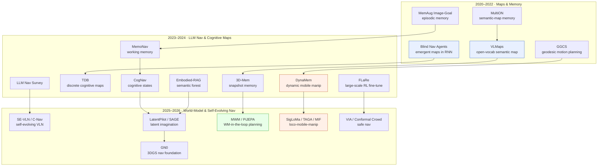

# Navigation & Mobile Manipulation — Deep Dive

> [!abstract] Overview
> Navigation is the oldest embodied task and the one where *memory* and *spatial representation* matter most: an agent that cannot remember where it has been cannot reach a goal it cannot see. This deep dive traces the field from end-to-end RL point-goal agents that grow implicit maps in their recurrent state ([[2301.13261|Blind Nav Agents]]), through open-vocabulary semantic-map navigation ([[2210.05714|VLMaps]]) and instruction-following VLN ([[2606.03682|GN0]], [[2603.29165|LatentPilot]]), to world-model-in-the-loop planning ([[2603.07799|MWM]]) and whole-body mobile manipulation ([[2411.04999|DynaMem]], [[2605.03846|SigLoMa]]). The central tension is **explicit map vs. learned representation** — metric/topological/semantic maps give interpretability and verifiable planning; end-to-end policies give generalization and sim-to-real robustness; and the 2026 frontier fuses them via persistent neural-field memory and latent imagination. The reader gets the design-space axes, the VLN benchmark landscape, the memory/mapping toolkit, the policy-learning recipes, and where mobile manipulation couples navigation to manipulation.

## Evolution Graph

Navigation research bifurcated early into two threads that this graph colours separately: the **explicit-representation thread** (blue — semantic maps, cognitive maps, scene graphs) that prizes interpretability and verifiable planning, and the **end-to-end-policy thread** (green — RL/IL agents whose spatial knowledge lives in latent state). The 2023–2024 LLM wave grafted language onto both — cognitive-map navigators that prompt an LLM over a scene graph, and RAG-style episodic memory for embodied Q&A. The 2025–2026 frontier (the bottom subgraph) is convergence: world models supply *imagined* rollouts to plan over, latent "pilot tokens" internalize anticipation inside a VLM backbone, and **mobile manipulation** (orange) closes the loop where the navigator must also act on what it reaches.

| Year | Paper | Contribution |
|------|-------|-------------|
| 2020 | [[2012.03912\|MultiON]] | Benchmarked explicit semantic-map memory vs implicit memory for multi-object navigation |
| 2021 | [[2101.05181\|MemAug Image-Goal Nav]] | Attention-based episodic memory + augmentation for RGB-only image-goal nav |
| 2022 | [[2301.13261\|Blind Nav Agents]] | Showed metric maps emerge spontaneously in a blind RL agent's recurrent memory |
| 2022 | [[2210.05714\|VLMaps]] | Fused VLM features into a spatial map for zero-shot open-vocabulary goal navigation |
| 2024 | [[2412.10439\|CogNav]] | LLM-driven cognitive-state machine over a heterogeneous cognitive map for ObjectNav |
| 2024 | [[2411.04999\|DynaMem]] | Online dynamic spatio-semantic voxel memory for open-world mobile manipulation |
| 2026 | [[2603.29165\|LatentPilot]] | Internalized action-conditioned anticipation as a latent "Pilot Token" in a VLN VLM |
| 2026 | [[2606.03682\|GN0]] | Unified 3DGS data + simulation + foundation policy for VLN with sim-to-real transfer |

## Part A — Foundations

*The design space of navigation and the language-grounded instruction-following task that defines its hardest open benchmarks.*

### 1. Navigation Paradigms & Design Space

Every navigation system answers one question — *where am I relative to my goal, and what path gets me there* — but the field has answered it three structurally different ways. **Metric/topological mapping** builds an explicit world representation (occupancy grid, semantic map, graph of places) and plans over it; it is interpretable and supports verifiable path-finding but is brittle to perception error and stale in dynamic scenes. **End-to-end learned policies** fold spatial knowledge into a recurrent or attention-based state and emit actions directly; they generalize and transfer to hardware but offer no inspectable map. **Hybrid / cognitive-map** approaches sit between — learning a *latent graph* or *discrete bottleneck* that an external solver can plan over, recovering some of the interpretability of explicit maps inside a differentiable pipeline.

The deepest result in this section is that the dichotomy is partly false: a pure end-to-end agent given only egomotion *spontaneously grows a metric map in its recurrent memory*, decodable as an allocentric occupancy grid. That reframes "explicit vs implicit" as a question of where the map lives, not whether one exists. The practical axes that remain are: how far back memory must reach (long-range vs reactive), whether the representation is metric or topological, and how much inference-time compute the policy can afford — the last now a first-class concern as VLN models grow into multi-billion-parameter VLMs.

#### 1.1 Emergent vs Explicit Spatial Memory

The core question of whether navigation *needs* a map, or whether one emerges from the task.

- **[[2510.09951|Hippocampus CA3 Nav]]** — An ==actor-critic RL== navigation agent whose ==hippocampus-inspired sequence generator== grows ==place fields== + remapping from prewired ==CA3== recurrence as a temporal memory buffer; outperforms LSTM and state-space agents on continuous maze nav under *sparse DG input* — spatial memory emerges from intrinsic circuitry, not an external map.
- **[[2301.13261|Blind Nav Agents]]** — A point-goal RL agent given *only* ==egomotion sensing== and a generic LSTM reached **95.1%** success and **62.9%** SPL in novel scenes; an external decoder recovered allocentric occupancy maps at **32.5%** IoU (vs **12.5%** untrained), memory useful out to **1,000** steps — metric maps emerge unsupervised in recurrent state.
- **[[2401.05946|TDB]]** — A ==Transformer with Discrete Bottleneck== that quantizes representations into discrete codes from which an explicit ==cognitive map (latent graph)== is built; hit **99%** planning success with near-isomorphic maps (NormGED ~**0.005–0.12**) under perceptual aliasing, generalizing to unseen environments — the interpretable middle ground between map and policy.
- **[[2101.05181|MemAug Image-Goal Nav]]** — An RGB-only RL policy augmented with an attention-based ==episodic memory== over a ==self-supervised== state-embedding network; reached **0.56** SPL / **0.69** SR on Gibson (**+13%** SPL over NTS-D), with augmentation cutting the train-test gap from ~**65%** to **40%** — episodic memory as a bolt-on to model-free policies.

#### 1.2 Mapless Long-Range & Efficient Navigation

When explicit maps are infeasible (large outdoor scenes, compute-bound deployment), the policy must carry space implicitly and cheaply.

- **[[2506.05997|SRU]]** — A ==Spatially-Enhanced Recurrent Units== architecture adding a spatial-transformation term to LSTM/GRU so ego-observations align implicitly; PPO-trained with sparse rewards, hit **+23.5%** SR over vanilla RNNs and **+105.0%** over GTRL, with zero-shot transfer to a legged-wheel robot over **100+ m** — recurrent memory made spatially aware without an explicit map.
- **[[2604.02829|STRNet]]** — A unified ==spatio-temporal representation== framework that enriches a nav policy's visual encoding via ==graph-based spatial aggregation== plus ==hybrid temporal-shift== fusion; reached **100%** SR with zero collisions on basic tasks and **98%** SR (**0.02** collisions) on long-range tasks, at real-time speed with fewer parameters than baselines.
- **[[2604.24391|FreqCache]]** — A ==Frequency-domain token caching== method with migration-aware reuse that accelerates VLN VLMs; **1.59× speedup** (per-step latency **637 ms → 401 ms**), **53.5%** token reuse, while holding **76.0%** Oracle Success — the inference-efficiency axis now matters as VLN backbones grow.
- **[[2305.06341|GGCS]]** — A ==Graph of Convex Sets== motion-planning extension to Riemannian manifolds via an atlas of local isometries, solving non-Euclidean configuration spaces (SE(2) bases, revolute joints) as a mixed-integer convex program; planned for a **15-DoF** PR2 mobile manipulator in **25–66 s** with optimality guarantees — the classical-planning anchor of the design space.

#### 1.3 Surveys

- **[[2311.00530|LLM Embodied Navigation Survey]]** — A survey categorizing LLM roles in navigation into ==grounded language understanding== and ==few-shot planning==, contrasting LLM-based vs traditional ==VLN== models, and auditing datasets; flags ==spatial reasoning== and ==computational efficiency== as the persistent gaps — the reference map of the LLM-navigation landscape.

**Navigation Paradigm — Decision Matrix**

| Need | Recommendation |
|---|---|
| Interpretable, verifiable path planning | [[2305.06341\|GGCS]] (classical) or [[2401.05946\|TDB]] (learned cognitive map) |
| RGB-only generalization with no map | [[2301.13261\|Blind Nav Agents]], [[2101.05181\|MemAug Image-Goal Nav]] |
| Large outdoor / mapless long-range | [[2506.05997\|SRU]] (**+105%** SR over GTRL) |
| Compute-bound VLN deployment | [[2604.24391\|FreqCache]] (**1.59×** speedup) |
| Survey of LLM navigation landscape | [[2311.00530\|LLM Embodied Navigation Survey]] |

> [!star] Key Papers — Design-Space Exemplars
> - [[2301.13261|Blind Nav Agents]] — The landmark result that metric maps emerge spontaneously in an end-to-end agent's memory, dissolving the explicit-vs-implicit dichotomy.
> - [[2401.05946|TDB]] — Established the discrete-bottleneck cognitive map as the interpretable middle ground between explicit maps and black-box policies.
> - [[2506.05997|SRU]] — The reference architecture for spatially-aware recurrence in mapless long-range navigation.
> - [[2311.00530|LLM Embodied Navigation Survey]] — The canonical taxonomy of how language models slot into the navigation stack.

> [!tip] The Map Never Disappears — It Just Moves
> The recurring lesson across this section is that *every* navigator carries a spatial representation; the only design choice is whether it lives in an inspectable data structure or in a recurrent/latent state. Blind agents grow occupancy maps in an LSTM; TDB makes the latent map discrete and plannable; SRU bakes spatial alignment into the recurrence. Reach for explicit maps when you need to *verify* a path or debug a failure; reach for learned latent memory when you need sim-to-real robustness and generalization. The 2026 trend (see [[10_Navigation-and-Mobile-Manipulation#4. Learning-Based Navigation Policies]]) is to keep both — a learned policy that plans over an *imagined* latent world. For the latent-world-model substrate underneath, see [[08_Latent-World-Models#1. The JEPA Principle]].

### 2. Vision-Language Navigation

Vision-Language Navigation (VLN) is the task where an agent follows a natural-language instruction — "go down the hallway, turn left at the kitchen, stop by the blue chair" — to reach a goal it was never shown. It is navigation's hardest open problem because it couples three failure surfaces: *grounding* language to visual landmarks, *spatial reasoning* over an unmapped environment, and *long-horizon* execution where one wrong turn cascades. The benchmark suite (R2R, REVERIE, RxR, SOON, and continuous-environment variants R2R-CE / RxR-CE) measures Success Rate and SPL, and the gap between val-seen and val-unseen is the field's honesty check.

Two architectural moves define the 2025–2026 VLN frontier. First, **open-vocabulary grounding without fine-tuning** — using a frozen VLM to supply weak supervision or map features rather than retraining a billion-parameter backbone for each environment. Second, **internalized anticipation** — instead of bolting an external world model onto the policy, recent agents embed action-conditioned future imagination directly inside the VLM's latent state, so a single forward pass both grounds the instruction and looks ahead. The benchmarks themselves are also evolving from grid-world graphs toward photorealistic 3DGS-rendered continuous environments that close the sim-to-real gap.

#### 2.1 Grounding & Map-Based VLN

Fusing language into a spatial representation so open-vocabulary goals become navigable.

- **[[2602.09657|AutoFly]]** — An end-to-end ==VLA for UAV navigation== in unknown outdoor scenes from *coarse* language, fusing a ==pseudo-depth encoder== (Depth Anything V2) into an LLaVA-based VLM for monocular spatial reasoning; **47.9%** sim SR (**+3.9%** over OpenVLA), **60%** indoor / **55%** outdoor real — dataset rebalancing alone lifted SR **16.6% → 47.9%**.
- **[[2210.05714|VLMaps]]** — A navigator fusing pixel-level ==visual-language embeddings== (LSeg) into a dense top-down grid from ==point cloud== data, then using an LLM to emit navigation primitives over the language-indexed map; reached **62%** SR for 1-subgoal zero-shot spatial-goal nav (baselines near **0%**) and 10/20 real-world goals — the canonical open-vocabulary semantic-map navigator.
- **[[2506.15757|WPCL]]** — A ==Weakly-supervised Partial Contrastive Learning== method using a frozen VLM to extract object lists as weak supervision, applying contrastive loss only to an object-centric feature segment for viewpoint invariance; hit **78%** SR / **70%** SPL on R2R val-unseen (SOTA on R2R/REVERIE/SOON) on a single **24GB** GPU — grounding without VLM fine-tuning.
- **[[2505.11383|Dynam3D]]** — A ==Dynamic layered 3D tokens== representation with ==online instance encoding== giving a VLM a structured, updatable spatial memory for VLN with real-time adaptation to moving objects; SOTA on R2R-CE, REVERIE-CE, and NavRAG-CE, strong in pre-exploration and lifelong-memory settings at a smaller footprint than video-based approaches — 3D-token memory for dynamic VLN.

#### 2.2 Anticipatory & Self-Evolving VLN

Internalizing future imagination or runtime self-improvement into the instruction-follower.

- **[[2606.03682|GN0]]** — A foundation model unifying ==3DGS== data generation, interactive simulation, and a multi-stage policy (SFT → ==DAgger== closed-loop → ==DAPO== → NavDP action expert); reached **67.7%** SR / **63.4%** SPL on R2R Val-Unseen (VLN-CE) and transferred sim-to-real to wheeled-arm and Unitree G1 robots with *no* real-world training — the 3DGS-grounded VLN foundation model.
- **[[2603.29165|LatentPilot]]** — A VLN agent internalizing ==anticipatory reasoning== as a continuous ==Pilot Token== propagated across steps, trained via a ==PilotLoop== with future observations as privileged supervision; hit **62.0%** SR / **58.0%** SPL on R2R-CE Val-Unseen at **130ms**/action and **22.8 GB** peak GPU — beating external world models on both accuracy and efficiency.
- **[[2511.17097|Progress-Think]]** — An annotation-free ==semantic progress reasoning== agent gauging its position within multi-step instructions, exploiting ==monotonic co-progression== between observations and instruction semantics via a ==Monotonic Ordering Loss==; **60.1%** SR / **53.6%** SPL on R2R-CE Val-Unseen and **27.5%** out-of-domain on RxR-CE, no progress labels needed.
- **[[2507.13152|SE-VLN]]** — A training-free ==self-evolving== MLLM framework with hierarchical memory (topological map + experience repository) and ==retrieval-augmented== Chain-of-Thought reasoning; **+23.9%** SR / **+15.0%** SPL over prior training-free LLM-VLN on R2R val-unseen, OSR rising **64.1% → 68.0%** — VLN that improves without weight updates.

#### 2.3 VLN Benchmarks & Embodied Agents

The environments and platforms that stress-test instruction-following.

- **[[2405.07060|Memory-Maze]]** — A CARLA-based VLN benchmark simulating a robot guiding blind people via *memory-recalled* (error-prone) instructions in maze-like public spaces; memory-based instructions failed at **25–40%** (vs **0–9%** for think-out-loud), and all SOTA models scored low — exposing the realistic-language gap VLN ignores.
- **[[2408.15511|AeroVerse]]** — A UAV-agent benchmark suite (==AeroSimulator== + ==AerialAgent-Ego15k== / ==CyberAgent-Ego500k== datasets) for aerial embodied world models; the ==SkyAgentX== baseline gained **+8.52%** average over visual-language baselines across perception, reasoning, navigation, and planning — extending embodied navigation into the aerial domain.
- **[[2604.08509|Visually-grounded Humanoid Agents]]** — A system coupling ==occlusion-aware semantic 3DGS== reconstruction (World Layer) with a two-level ==VLM planner== + ==motion-diffusion== controller (Agent Layer) for digital humans navigating from vision alone; ~**30%** higher SR than VLN baselines on a new humanoid-scene-interaction benchmark — full-body VLN for embodied avatars.
- **[[2507.13019|VLN-PE]]** — A physically-realistic VLN platform on ==GRUTopia (Isaac Sim)== supporting humanoid (H1/G1), quadruped, and wheeled robots with RL controllers; zero-shot transfer of VLN-CE models drops Success Rate **34%** relatively, and cross-embodiment co-training recovers it — exposing the physical-embodiment gap abstract VLN-CE hides.
- **[[2506.09839|OctoNav]]** — A generalist navigator unifying fragmented nav tasks under free-form multi-modal instructions via a ==Think-Before-Action== VLA (==TBA-SFT== → ==Nav-GRPO== → online RL); **OctoNav-R1** hits **19.40%** SR on the new ==OctoNav-Bench== (400+ scenes, 45k+ pairs), doubling the next baseline (**9.20%**), with sim2real on a Unitree GO2 — generalist-nav benchmark + agent.
- **[[2010.07954|RxR-CE]]** — A ==Room-Across-Room== multilingual VLN corpus (English/Hindi/Telugu) in Matterport3D with ==two-level path sampling== + ==dense spatiotemporal grounding==; **126,000** instructions over **16,500** paths, an order of magnitude larger than R2R and de-biased so go-straight shortcuts fail — the scale-and-language VLN reference.
- **[[2004.02857|R2R-CE]]** — The ==VLN in Continuous Environments (VLN-CE)== benchmark on Habitat + Matterport3D, replacing nav-graph teleport with low-level move/turn actions; best cross-modal agent reaches **0.30 SPL** (**32%** SR) on val-unseen, with depth+RGB both essential — the benchmark that grounded VLN in continuous control.

**VLN — Decision Matrix**

| Need | Recommendation |
|---|---|
| Open-vocabulary spatial-goal nav from a map | [[2210.05714\|VLMaps]] (**62%** SR zero-shot) |
| SOTA R2R/REVERIE without VLM fine-tuning | [[2506.15757\|WPCL]] (**78%** SR, single 24GB GPU) |
| Sim-to-real photorealistic VLN foundation | [[2606.03682\|GN0]] (**67.7%** SR, G1 transfer) |
| Anticipatory VLN at low latency | [[2603.29165\|LatentPilot]] (**130ms**/action) |
| Training-free self-improving VLN | [[2507.13152\|SE-VLN]] (**+23.9%** SR) |
| Realistic / aerial / humanoid benchmark | [[2405.07060\|Memory-Maze]], [[2408.15511\|AeroVerse]], [[2604.08509\|Visually-grounded Humanoid Agents]] |

> [!star] Key Papers
> - [[2210.05714|VLMaps]] — The canonical open-vocabulary semantic-map navigator; established language-indexed spatial maps as a VLN primitive.
> - [[2603.29165|LatentPilot]] — First to internalize action-conditioned anticipation inside the VLM backbone, replacing bolt-on world models.
> - [[2606.03682|GN0]] — The reference 3DGS-grounded VLN foundation model with demonstrated zero-shot sim-to-real transfer.
> - [[2405.07060|Memory-Maze]] — The benchmark that exposed how badly VLN handles realistic, memory-imperfect human instructions.

> [!tip] Anticipation Beats External World Models — When It's Internalized
> The 2026 VLN surprise is that *imagining the future* helps, but the win comes from internalizing it cheaply, not from a separate module. [[2603.29165|LatentPilot]] folds action-conditioned anticipation into a single Pilot Token and beats external world models on *both* accuracy and latency (**130ms**/action); the heavy bolt-on planner is a legacy of treating perception and prediction as separate stages. Compose this with self-evolution ([[2507.13152|SE-VLN]]) for training-free improvement and frozen-VLM grounding ([[2506.15757|WPCL]]) for cheap open-vocabulary perception. For the VLA-side treatment of reasoning-augmented action models, see [[05_VLA#4. Reasoning & Planning-Augmented VLAs]]; for the egocentric pretraining that gives these agents their visual priors, see [[12_Egocentric-Pretraining-and-Human-Video#5. Transfer Mechanisms — Hand → Gripper]].

## Part B — Methods

*The three machinery layers: how an agent remembers space, how it learns a policy, and how navigation couples to manipulation.*

### 3. Mapping, Memory & Spatial Representation

If a navigation policy is the *engine*, its spatial memory is the *fuel tank* — and the structure of that memory determines what the agent can do. This section maps the memory toolkit along two axes. The **representation axis** runs from dense metric (voxel grids, occupancy) through semantic (object-labeled maps, scene graphs) to topological (graphs of places, snapshot collections) — denser representations support precise geometry but cost storage and degrade in dynamic scenes; sparser topological memory scales to lifelong operation but loses metric precision. The **persistence axis** runs from per-episode working memory (forget on reset) through episodic memory (replay across runs) to persistent world models (a continuously-refined neural field).

The defining problem this section solves is *what to remember and what to forget*. A navigator that stores everything drowns in retrieval cost; one that stores nothing re-explores forever. The best 2024–2026 systems make forgetting a first-class mechanism — MemoNav's selective forgetting prunes goal-irrelevant nodes, DynaMem ray-casts to purge moved objects, C-Nav uses outlier detection to keep only meaningful keyframes. The complementary trend is *queryable* memory: semantic forests and 3D scene memory that an LLM/VLM can search by language, turning navigation into retrieval over a learned spatial index.

#### 3.1 Semantic & Cognitive Maps

Explicit, language-grounded spatial structures that an LLM or planner reasons over.

- **[[2012.03912|MultiON]]** — A benchmark of map-memory for sequential multi-object navigation; explicit semantic maps held **48%** SR on 3-ON tasks vs **10%** for an RNN-only agent, and learned-map agents gained up to **+25%** SR when a goal had been seen before — the foundational evidence that *explicit* semantic memory beats implicit memory as task complexity grows.
- **[[2412.10439|CogNav]]** — An ObjectNav agent building a ==heterogeneous cognitive map== (scene graph + occupancy + landmark graph) and running an LLM scheduler over ==five cognitive states== inspired by human search; SOTA ObjectNav with **+10.5%** on HM3D (**72.5%** SR), **+6.4%** MP3D, **+7.1%** RoboTHOR, validated on a quadruped — cognitive-science-structured search over a map.
- **[[2411.17735|3D-Mem]]** — A scene memory representing space as multi-view ==Memory Snapshots== (explored) + ==Frontier Snapshots== (unexplored) built via co-visibility clustering for VLM-guided exploration; **69.1%** SR on GOAT-Bench lifelong nav using only **10.94** snapshots from **39.76** observations (**3.26** after prefiltering) — compact, queryable 3D scene memory.

#### 3.2 Working & Episodic Memory

Memory that selectively retains across the horizon of a task — or across many tasks.

- **[[2402.19161|MemoNav]]** — A biologically-inspired ==working memory== (STM + LTM + dynamically-built WM) with a ==selective forgetting== module that prunes low-attention nodes; **+7.9–8.5%** SR/PR over VGM on multi-goal Gibson/MP3D tasks, with aggressive forgetting helping most on long-horizon goals — forgetting as an active navigation skill.
- **[[2507.12846|Mind Palace]]** — A ==hierarchical scene-graph== "Robotic Mind Palace" over multi-episode history, with an LLM interleaving memory recall and active exploration via Value-of-Information early stopping; **+12–28%** answer correctness and **77%** fewer retrieved images on long-term EQA, on a legged robot over a **1,000 m²** office — multi-episodic memory for embodied Q&A.
- **[[2605.22814|Remember to be Curious]]** — An explorer pairing a persistent online ==3D Gaussian Splatting== forward model (curiosity reward from prediction error) with a ==long-context transformer== whose ==global linear-attention memory== holds episodic context, trained map-free via ==PPO== on RGB alone; beat active-mapping baselines on 3D scene completeness, zero-shot to AI-generated worlds.

#### 3.3 Retrieval-Augmented & Dynamic Memory

Memory built for language-queryable retrieval or for survival in changing worlds.

- **[[2602.00551|APEX (Aerial)]]** — A ==decoupled memory-based explorer== for aerial object-goal nav: ==dynamic 3D grid maps== (Attraction / Exploration / Obstacle) give persistent spatial-semantic memory while an ==asynchronous parallel== framework decouples VLM inference from RL control; **+4.2%** SR / **+2.8%** SPL on UAV-ON at **0.97 s** latency — async dynamic memory for aerial search.
- **[[2409.18313|Embodied-RAG]]** — A system building a ==semantic forest== (hierarchical clusters of robot snapshots with hybrid spatial+semantic distance, LLM-summarized at each level) for navigation and Q&A; outperformed Naive/Graph/Light-RAG on Find and Explain queries and built memory for a 1-km environment (3,353 nodes) **7.38× faster** than GraphRAG — RAG as embodied spatial memory.
- **[[2511.14004|STAR (Memory-Action)]]** — An LLM policy unifying ==memory retrieval (search in time)== over a non-parametric timestamped/posed/embedded store with ==embodied actions (search in space)== in one decision loop; higher success on attribute-based and spatio-temporal object search, transferred to a physical Tiago robot — searching memory and the world in a single loop.
- **[[2411.04999|DynaMem]]** — A dynamic ==3D voxel memory== that ray-casts to detect and purge moved/removed objects, with two-stage VLM-feature + mLLM-QA querying that reports "not found"; **70%** pick-and-drop SR on non-stationary objects (**2×** over static baselines), cutting localization failures **53.3% → 6.7%** — dynamic memory for open-world mobile manipulation.

**Memory Representation — Decision Matrix**

| Need | Recommendation |
|---|---|
| Explicit semantic map for ObjectNav | [[2412.10439\|CogNav]] (**72.5%** SR HM3D), [[2012.03912\|MultiON]] |
| Compact queryable 3D scene memory | [[2411.17735\|3D-Mem]] (**69.1%** SR GOAT) |
| Selective working memory, long-horizon | [[2402.19161\|MemoNav]] (forgetting module) |
| Multi-episode lifelong memory | [[2507.12846\|Mind Palace]] (6-month, 1,000 m²) |
| Language-queryable retrieval memory | [[2409.18313\|Embodied-RAG]], [[2511.14004\|STAR (Memory-Action)]] |
| Dynamic / changing environments | [[2411.04999\|DynaMem]] (**70%** SR, dynamic objects) |
| Persistent neural-field exploration memory | [[2605.22814\|Remember to be Curious]] (3DGS) |

> [!star] Key Papers
> - [[2012.03912|MultiON]] — The foundational benchmark proving explicit semantic memory outperforms implicit memory, and established the multi-object navigation task.
> - [[2411.04999|DynaMem]] — The reference architecture for dynamic spatio-semantic memory that survives object motion — the link between navigation memory and mobile manipulation.
> - [[2409.18313|Embodied-RAG]] — Established retrieval-augmented generation as a scalable, language-queryable embodied memory paradigm.
> - [[2402.19161|MemoNav]] — Made *selective forgetting* a first-class navigation mechanism rather than an afterthought.

> [!tip] Forgetting Is the Hard Part, Not Remembering
> Across every memory architecture here, the binding constraint is not storage capacity but *retrieval cost and staleness* — and the systems that win make forgetting an active decision. MemoNav prunes low-attention nodes; DynaMem ray-casts to purge moved objects; C-Nav (see [[10_Navigation-and-Mobile-Manipulation#4. Learning-Based Navigation Policies]]) keeps only outlier keyframes. The composition recipe: pick a representation by your *persistence* need (working memory for a task, semantic forest for lifelong retrieval, dynamic voxels for changing scenes), then layer a forgetting/pruning mechanism so retrieval stays cheap. For the latent-prediction view of spatial memory as a learned world model, see [[08_Latent-World-Models#3. Broader Latent Prediction Landscape]]; for how manipulation handles non-Markovian long-horizon memory, see [[04_Manipulation-Skill-Learning#4. Memory & Long-Horizon Non-Markovian Control]].

### 4. Learning-Based Navigation Policies

Given a representation of space, how does an agent learn *what to do*? This section covers the policy-learning machinery, organized by what supplies the learning signal. **World-model-in-the-loop** policies plan by rolling out an imagined future and scoring candidate actions against a goal — they get sample efficiency and explicit foresight but inherit the world model's prediction errors. **Reinforcement-learning** policies optimize a reward directly — flexible and able to discover non-obvious behavior, but sample-hungry and prone to unsafe exploration. **Self-evolving / continual** policies improve at runtime from their own experience without weight updates or while avoiding catastrophic forgetting — the frontier for deployment in open, non-stationary worlds.

The 2025–2026 inflection is **safety as a constraint, not an afterthought**. As navigation policies leave the simulator for crowds, dynamic obstacles, and physical robots, the dominant research question shifts from "can it reach the goal" to "can it reach the goal *provably* without collision." That has pulled formal methods — reachability verification, CVaR-constrained RL, conformal-prediction uncertainty — into what was a pure reward-maximization field. The other frontier is **imagination quality**: world-model planners only help if their rollouts are consistent, which is why MWM and PiJEPA invest heavily in action-conditioned consistency and informed priors rather than raw generation fidelity.

#### 4.1 World-Model-in-the-Loop Planning

Policies that plan by imagining and scoring futures in a learned world model.

- **[[2603.07799|MWM]]** — A Mobile World Model training a ==diffusion== world model with ==Structure-First, Consistency-Refine== + ==Inference-Consistent State Distillation== for few-step rollouts, planned via ==MPC/CEM==; **4× speedup** (**9.6s → 2.3s**), lower LPIPS (**0.495** vs NWM **0.569**), **0.30** real goal-nav SR (vs NWM **0.20**) — fast, consistent imagination to plan over.
- **[[2512.01550|NavForesee]]** — A unified ==Vision-Language world model== couples hierarchical language planning with ==dual-horizon predictive modeling== (short + long-term future) inside one VLM for embodied nav; **66.2%** SR / **78.4%** OSR on R2R-CE Val-Unseen (**+10.9%** OSR), predicting depth to T+2 and semantics to T+3 — and VLM planning causes the largest ablation drop.
- **[[2603.25981|PiJEPA]]** — A planner integrating a finetuned ==Octo== policy (an informed action prior) with ==MPPI== planning over a ==JEPA== latent world model; with a ==V-JEPA-2== encoder hit **1.65 m** RMSE / **2.88 m** Final ATE on language-conditioned nav, beating reactive policies and uninformed WM planning, at **~2.48 s** total inference — the policy-as-prior-for-world-model recipe.
- **[[2605.10118|SAGE]]** — A three-phase ==Genesis–Evolution–Navigation== framework that synthesizes ==physics-grounded sandbox== experience rules via VLMs, then optimizes with ==Asymmetric Adaptive Clipping== GRPO; **60.2%** SR† on A-EQA and **64.8%** SR on GOAT-Bench (Qwen3-4B, beating GPT-4o), deployed on a physical robot — navigation from sandbox imagination.

#### 4.2 Self-Evolving & Continual Navigation

Policies that adapt at runtime or accumulate skills without forgetting.

- **[[2603.02772|ASER]]** — An ==Agentic Self-Evolutionary Replanning== method adapting the action model via ==In-context Learning with Auto-Differentiation== (local) and ==Global Graph Chain-of-Thought== distilling scene graphs for token-efficient replanning; **+10%** SR on complex planning and **+20–40%** token efficiency over SayPlan — runtime self-evolution of the nav policy.
- **[[2510.20685|C-Nav]]** — A continual ObjectNav method with a ==Dual-Path Anti-Forgetting== mechanism and ==Adaptive Experience Selection== (Local Outlier Factor keyframes); **+3.35%** SR on MP3D over Data Replay and a **9.7 pp** higher old-task SR on HM3D (**42.61%** vs **32.9%**) at half the stored data — learning new object categories without catastrophic forgetting.
- **[[2605.06595|CRONA]]** — A multi-agent ==cross-modal== RL framework with modality-specialized agents under CTDE and a centralized multi-modal critic; **95.72%** SR in the 'Studio' scene (vs single-agent **32.66%**) and robust **42.76%** SR even at 4×4-pixel vision — decentralized, modality-specialized cooperative navigation.

#### 4.3 Safe & Verifiable Navigation Policies

RL policies trained and certified to maintain safety margins under uncertainty.

- **[[2605.14174|VIA]]** — A ==CVaR-constrained== off-policy RL method (TD3 + ==distributional cost critic==) with ==POLAR reachability== post-training verification; **98.3%** SR / **1.7%** collision, a **99.6%** verified safety rate, and consistent sim-to-real safety (**99.1%** sim vs **99.2%** real) on a Jackal robot — formally verifiable risk-sensitive navigation.
- **[[2508.05634|Conformal Crowd Navigation]]** — A ==CMDP== with ==adaptive conformal inference== feeding human-trajectory uncertainty into a constrained RL policy (==PPO-Lagrangian==); **96.93%** in-distribution SR, **3.72×** fewer collisions / **2.43×** fewer intrusions, holding **>94%** SR out-of-distribution — uncertainty-aware safe crowd navigation.
- **[[2605.12689|3D RL-DWA]]** — A hybrid local-navigation framework that uses ==Soft Actor-Critic== to dynamically tune a ==3D Dynamic Window Approach== cost function for a **9-DoF** deformable robot; **near-100%** path completion in simulated vascular networks at **<2 ms** inference, robust to sensor noise — RL-tuned classical local planning for high-DoF navigation.

#### 4.4 Navigation Foundation Models & Cross-Embodiment Scaling

The generalist turn: scale a single navigation policy across many embodiments and scenes by pairing large-scale offline pretraining (video, geometric experts, human-walking priors) with online RL refinement, so one model transfers zero-shot rather than per-platform retraining.

- **[[2511.21135|SocialNav]]** — A hierarchical ==brain-action foundation model== for *socially-aware* nav: a high-level module comprehends social norms, a low-level module generates trajectories, unified via a multi-stage pipeline + RL; **86.1%** SR / **82.5%** distance-compliance on SocNav (**+38.3%** SR over CityWalker), **85.0%** real Unitree Go2 — social compliance as a learned objective.
- **[[2509.23203|CE-Nav]]** — A ==Cross-embodiment local navigation== method: an offline ==multi-modal geometric expert== supplies an action prior, refined online by RL; high SR (mSR **0.745–0.860**) across **5** robots (quadruped, biped, quadrotor) with **8×** less training time than end-to-end RL, beating a tuned DWA and NavRL in real-world transfer at **>10 Hz** — one policy across embodiments.
- **[[2507.22028|S2E]]** — A ==navigation foundation model== scaling recipe combining large-scale offline video pre-training with RL ("seeing → experiencing"), adding causal reactivity to dynamic scenes; **+21%** SR over BC-only on the new ==NavBench-GS== photorealistic benchmark, zero-shot to wheeled and quadruped robots — RL turns passive video priors into interactive policies.

**Policy Learning — Decision Matrix**

| Need | Recommendation |
|---|---|
| Sample-efficient planning via imagination | [[2603.07799\|MWM]] (**4×** faster), [[2603.25981\|PiJEPA]] |
| Learn nav from synthetic sandbox experience | [[2605.10118\|SAGE]] (**60.2%** A-EQA) |
| Runtime self-evolution of the policy | [[2603.02772\|ASER]] (**+10%** SR) |
| Continual learning without forgetting | [[2510.20685\|C-Nav]] (**+9.7 pp** old-task) |
| Formally verifiable safety | [[2605.14174\|VIA]] (**99.6%** verified safe) |
| Safe navigation in dynamic crowds | [[2508.05634\|Conformal Crowd Navigation]] (**3.72×** fewer collisions) |
| High-DoF / deformable local navigation | [[2605.12689\|3D RL-DWA]] (**<2 ms**) |
| Socially-compliant nav in human spaces | [[2511.21135\|SocialNav]] (**86.1%** SR, **82.5%** compliance) |
| One local policy across many embodiments | [[2509.23203\|CE-Nav]] (5 robots, **8×** less training) |
| Scale a generalist nav policy with offline video + RL | [[2507.22028\|S2E]] (**+21%** SR over BC-only) |

> [!star] Key Papers
> - [[2605.10118|SAGE]] — Showed that physics-grounded sandbox imagination plus GRPO-style optimization yields navigation that beats GPT-4o and transfers to hardware.
> - [[2605.14174|VIA]] — The reference for formally verifiable navigation: CVaR-constrained RL whose safety margins survive reachability analysis and sim-to-real.
> - [[2510.20685|C-Nav]] — Established continual object navigation as a task and the dual-path anti-forgetting recipe for open-world skill accumulation.
> - [[2507.22028|S2E]] — Showed RL on large-scale video pretraining ("seeing → experiencing") is what makes a navigation foundation model interactive and cross-embodiment, with the NavBench-GS benchmark.
> - [[2509.23203|CE-Nav]] — The reference cross-embodiment recipe: an offline geometric-expert prior plus online RL transfers one local-nav policy across quadruped, biped, and aerial platforms at 8× lower cost.

> [!tip] Safety Becomes a Constraint, Generalists Become Cross-Embodiment
> Two strategic shifts converge in 2025–2026 policy learning. **Safety** is no longer a reward penalty but a *constraint the policy is trained and certified against*: [[2605.14174|VIA]] couples CVaR-constrained RL with reachability verification for a provable safety rate, and [[2508.05634|Conformal Crowd Navigation]] turns prediction uncertainty into a constraint — trading efficiency for collision guarantees that survive OOD and sim-to-real. **Generalization** mirrors the VLA pretraining story: a broad offline prior (video for [[2507.22028|S2E]], a geometric expert for [[2509.23203|CE-Nav]], human-walking norms for [[2511.21135|SocialNav]]) supplies the inductive bias, and a thin online-RL stage adds reactivity and embodiment-specific competence — yielding cross-embodiment transfer without per-platform retraining (CE-Nav runs one policy across five robots). Compose the two: plan *around* the constrained safe set with world-model imagination ([[2603.07799|MWM]]) atop a broadly-pretrained generalist. For the RL-for-embodiment methodology underneath, see [[03_Imitation-Learning-and-RL#6. RL for Locomotion, Navigation & Whole-Body Control]]; for the egocentric pretraining that supplies these priors, see [[12_Egocentric-Pretraining-and-Human-Video#3. Scaling Laws for Egocentric Pretraining]]; for sim-to-real transfer, see [[14_Sim-to-Real-Transfer#3. Policy-Side: Robustness & Domain Randomization]].

### 5. Mobile Manipulation & Loco-Navigation

Mobile manipulation is where navigation stops being an end in itself: the agent must reach a place *and* act on what it finds there, and the two sub-problems contaminate each other. A navigator that ignores the manipulation goal arrives at a pose from which the object is unreachable; a manipulator that ignores the floating base fights its own locomotion. This section covers the systems that treat navigation and manipulation as a *coupled* control problem — whether the embodiment is a wheeled mobile base, a quadruped doing loco-manipulation, or a humanoid coordinating gaze, gait, and reach.

The coupling shows up technically as three recurring challenges. First, **the floating base** — unlike a fixed arm, a mobile manipulator's reference frame is itself moving, so perception and control must compensate for ego-motion (SigLoMa's ego-centric Kalman filter, TAGA's active gaze). Second, **open-world dynamic memory** — the manipulation target may have moved since the map was built, demanding the dynamic-memory machinery of §3 (DynaMem). Third, **whole-body safety** — a humanoid that navigates a crowd must verify not just a collision-free *path* but a collision-free *interaction pose* (MIF's interaction-pose safety, HumanFlow's social navigation). The unifying lesson: mobile manipulation is the task that forces navigation memory, locomotion, and manipulation into one differentiable loop.

#### 5.1 Mobile-Base Manipulation

Wheeled or arm-equipped mobile platforms that navigate to and act on objects.

- **[[2409.16578|FLaRe]]** — A large-scale ==RL fine-tuning== of a pre-trained ==SPOC== transformer (frozen ==DINOv2==, heavy ==domain randomization==, stabilized ==PPO==) for mobile manipulation; **79.5%** SR in unseen sim (**+23.6%**) and **80.7%** on real Stretch robots (**+30.7%**), adapting to LoCoBot in 6 hours — RL fine-tuning that masters behavior-cloned mobile-manip policies.
- **[[2411.04999|DynaMem]]** — A system coupling a dynamic ==3D voxel memory== (ray-cast purging of moved objects) with VLM+mLLM querying; **70%** pick-and-drop SR on non-stationary objects (**2×** over static), cutting localization failures **53.3% → 6.7%**. *(Cross-listed from [[10_Navigation-and-Mobile-Manipulation#3. Mapping, Memory & Spatial Representation|§3]].)*

#### 5.2 Legged & Quadruped Loco-Manipulation

Floating-base manipulation where locomotion and reaching are one control problem.

- **[[2605.03846|SigLoMa]]** — An onboard ego-centric ==loco-manipulation== method using sparse ==Sigma Points== from open-vocab tracking, an ==ego-centric Kalman filter== for vision-to-control, and ==PPO== with an ==Active Sampling Curriculum==; hint poses + curriculum lifted long-axis grasping from **12–16%** to **83–87%**, real Unitree Go2 matching teleoperation.

#### 5.3 Humanoid Whole-Body Navigation

Coordinating gaze, gait, and perception for humanoid locomotion in dynamic scenes.

- **[[2606.05880|TAGA]]** — A locomotion policy fusing egocentric depth, height scans, and proprioception with an emergent ==active gaze== module predicting a task-relevant Region of Interest, decoded by a ==Mixture-of-Experts== policy (==PPO== + Adversarial Motion Priors); a Unitree G1 traversed a **120 cm** gap (**+50%**) at **65.2%** lower training cost — active perception for agile locomotion.
- **[[2605.21935|MIF]]** — A ==Multi-modal Interactive Field== (confidence-aware semantic ==3DGS== + discrepancy-triggered scene-graph updates + ==flow-matching== mesh recovery) for humanoid navigation under gait-induced distortion; **94%** interaction-pose-safety with **0%** collisions and up to **98%** task success under object relocation — verifies interaction safety, not just path safety.
- **[[2605.25685|HumanFlow]]** — A latent ==diffusion== model for joint 3D human motion tracking + forecasting on a scene-context occupancy grid, coupled to a ==flow-matching== MAV control policy; **~47%** lower GMPJPE than RoHM in occlusion and **100%** collision avoidance across all scenarios including unseen dance motions — social navigation via coupled perception-control.

**Mobile Manipulation — Decision Matrix**

| Need | Recommendation |
|---|---|
| Wheeled mobile-manip with sparse-reward RL | [[2409.16578\|FLaRe]] (**80.7%** real-robot SR) |
| Open-world mobile manip in dynamic scenes | [[2411.04999\|DynaMem]] (**70%** SR) |
| Quadruped loco-manipulation from ego vision | [[2605.03846\|SigLoMa]] (**83–87%** grasp) |
| Agile humanoid locomotion over gaps | [[2606.05880\|TAGA]] (**120 cm** gap, **+50%**) |
| Humanoid interaction-pose safety | [[2605.21935\|MIF]] (**94%** IPS, **0%** collision) |
| Aerial social navigation among humans | [[2605.25685\|HumanFlow]] (**100%** collision-free) |

> [!star] Key Papers
> - [[2409.16578|FLaRe]] — The reference recipe for scaling RL fine-tuning to mobile manipulation, with the largest real-robot generalization gains in the class.
> - [[2411.04999|DynaMem]] — The bridge paper connecting navigation memory to manipulation: dynamic spatio-semantic memory is what makes open-world mobile manipulation possible.
> - [[2605.03846|SigLoMa]] — Established the ego-centric Kalman-filter recipe for treating quadruped locomotion and manipulation as one floating-base control problem.
> - [[2606.05880|TAGA]] — First to show emergent active gaze for agile humanoid locomotion, extending perceptive locomotion past prior gap-traversal limits.

> [!tip] Mobile Manipulation Is Navigation Memory + Floating-Base Control, Fused
> The unifying insight across embodiments is that mobile manipulation cannot be solved by stacking a navigation module on a manipulation module — the floating base couples them. SigLoMa and TAGA both invest in ego-motion compensation (Kalman filter, active gaze) precisely because the manipulation target's frame and the locomotion frame are the same moving frame; MIF verifies *interaction* poses, not just paths, because where the humanoid stops determines whether it can act. The composition recipe: take the dynamic memory of [[2411.04999|DynaMem]] (knows where the object is *now*), add floating-base control, and verify the interaction pose. For the manipulation-policy side of the coupling — grasping, dexterity, contact-rich skills — see [[04_Manipulation-Skill-Learning#1. Generative Policy Architectures]]; for the force-aware sensing that whole-body interaction needs, see [[09_Contact-Rich-and-Whole-Body-Control#5. Whole-Body Control & Coordination]].

## Part C — Frontier

*What still breaks — and why every navigation failure traces back to a representation that lied about the world.*

### 6. Open Problems & Failure Modes

Navigation looks solved on the benchmarks — success rates above 70% on R2R, near-perfect point-goal in sim — yet deployed robots still get lost, freeze in crowds, and reach poses from which they cannot act. The gap is not a modeling failure but a *representation* failure: almost every navigation breakdown traces to a spatial representation that lied about the world. The map went stale, the latent state forgot the goal, the imagined rollout diverged from reality, or the instruction grounded to the wrong landmark. This section catalogs the open problems by the representation defect that causes them.

The meta-pattern is that navigation's hardest problems are *systemic*, not modular: they emerge where representation, memory, policy, and embodiment meet. A sim-to-real gap is a representation mismatch; a continual-learning failure is a memory-management failure; an unsafe maneuver is a policy-constraint failure; a privacy violation is a perception-pipeline failure. Solving them requires reasoning across the whole loop, which is why the frontier systems in §1–§5 increasingly co-design memory, policy, and verification rather than optimizing one in isolation.

#### 6.1 Representation & Generalization Failures

- **Stale and dynamic-scene memory** — Maps built once go wrong the moment an object moves; without active purging, the agent confidently navigates to where the goal *was*. [[2411.04999|DynaMem]] cuts dynamic-object localization failure from **53.3% → 6.7%** via ray-cast purging, but persistence-vs-staleness remains unsolved for large-scale lifelong operation; significance: the binding constraint on real-world deployment.
- **Realistic-language grounding** — VLN benchmarks use clean instructions, but humans give error-prone, memory-recalled directions; [[2405.07060|Memory-Maze]] shows memory-based instructions fail at **25–40%** (vs **0–9%** clean) across all SOTA models — the grounding gap is wider than benchmarks admit.
- **Sim-to-real representation mismatch** — Policies trained on rendered observations face a domain gap; [[2606.03682|GN0]] and [[2606.05880|TAGA]] transfer to G1 humanoids without real-world training, but the photorealism-vs-physics trade-off in 3DGS rendering is unresolved; significance: determines whether sim-trained nav is deployable.

#### 6.2 Policy, Safety & Deployment Failures

- **Catastrophic forgetting in continual nav** — Agents learning new object categories overwrite old skills; [[2510.20685|C-Nav]] recovers a **9.7 pp** higher old-task SR via dual-path anti-forgetting, but the stability-plasticity trade-off worsens as category count grows; significance: open-world agents must learn forever without a reset.
- **Provable safety under uncertainty** — Reward-shaped safety gives no guarantees; [[2605.14174|VIA]] (CVaR + reachability) and [[2508.05634|Conformal Crowd Navigation]] (conformal uncertainty) achieve **99.6%** verified and **3.72×** fewer collisions respectively, but verification scales poorly to high-dimensional VLM policies; significance: the barrier between sim demos and crowd deployment.
- **Imagination divergence** — World-model planners fail when rollouts drift from reality; [[2603.07799|MWM]] enforces action-conditioned consistency and [[2605.10118|SAGE]] grounds imagination in a physics sandbox, but long-horizon imagined-vs-real divergence still compounds; significance: limits how far ahead a navigator can plan.
- **The privacy-utility trade-off** — Embodied navigators perceive private spaces, and perception-level privacy filters degrade the task; [[2605.05017|SPINE]] quantifies a *non-linear* trade-off where perceptual privacy cut SPL by **~43%** (vs SR by **~30%**), arguing privacy must be a life-cycle architectural constraint, not a perception patch; significance: an unaddressed deployment blocker for home/clinical robots.

**Open Problems — Decision Matrix**

| Problem | Remediation Path |
|---|---|
| Stale memory in dynamic scenes | Ray-cast purging + dynamic voxels ([[2411.04999\|DynaMem]]) |
| Error-prone human instructions | Realistic-language benchmarks ([[2405.07060\|Memory-Maze]]) |
| Sim-to-real representation gap | 3DGS-grounded foundation policies ([[2606.03682\|GN0]]) |
| Catastrophic forgetting | Dual-path anti-forgetting + outlier keyframes ([[2510.20685\|C-Nav]]) |
| Unprovable safety | CVaR + reachability verification ([[2605.14174\|VIA]]) |
| Imagination divergence | Consistency distillation / physics sandbox ([[2603.07799\|MWM]], [[2605.10118\|SAGE]]) |
| Privacy leakage during perception | Life-cycle privacy as a control signal ([[2605.05017\|SPINE]]) |

> [!star] Key Papers — Navigation Failure Frontier
> - [[2605.05017|SPINE]] — Reframed embodied privacy as a navigation-pipeline architectural constraint and quantified the non-linear privacy-utility trade-off.
> - [[2605.14174|VIA]] — The frontier of provable navigation safety: the first to make CVaR-constrained policies survive formal reachability verification and sim-to-real.
> - [[2405.07060|Memory-Maze]] — Exposed that VLN's grounding problem is far from solved once instructions become realistically imperfect.
> - [[2510.20685|C-Nav]] — Surfaced continual object navigation as an open problem and the stability-plasticity wall that worsens with scale.

> [!tip] Every Navigation Failure Is a Representation That Lied
> The common root beneath all these failure modes is a spatial representation that diverged from the world — stale maps, forgotten goals, divergent imagined rollouts, mis-grounded instructions, privacy-blind perception. The strategic implication is that the next gains come not from better policies over fixed representations, but from representations that *know when they are wrong* — dynamic memory that purges itself, world models that flag divergence, policies that verify their own safety, and perception pipelines that treat privacy as state. This is the same systemic-failure pattern that haunts world models generally: see [[07_WAM#9. Open Problems & Failure Modes]] for the imagination-divergence failure frontier, and [[14_Sim-to-Real-Transfer#7. Open Problems]] for the sim-to-real representation-mismatch failures that navigation shares.

## Quick-Reference Matrix

| Question | Answer |
|---|---|
| Does end-to-end navigation need an explicit map? | No — metric maps emerge spontaneously in a blind RL agent's recurrent memory ([[2301.13261\|Blind Nav Agents]], **32.5%** IoU decode). The map moves into latent state; it never disappears. |
| What's the SOTA recipe for VLN sim-to-real? | 3DGS-grounded foundation policy with multi-stage SFT→DAgger→DAPO ([[2606.03682\|GN0]], **67.7%** R2R SR, G1 transfer). |
| How do I navigate by open-vocabulary language? | Fuse VLM features into a spatial map ([[2210.05714\|VLMaps]]) or use a frozen VLM for weak supervision ([[2506.15757\|WPCL]], **78%** R2R SR). |
| What's the hardest unsolved part of memory? | Forgetting, not remembering — selective pruning keeps retrieval cheap ([[2402.19161\|MemoNav]]) and survives dynamic scenes ([[2411.04999\|DynaMem]]). |
| How do I plan with a world model? | Enforce action-conditioned consistency for fast rollouts ([[2603.07799\|MWM]], **4×** faster) or use the policy as an informed prior ([[2603.25981\|PiJEPA]]). |
| Can navigation safety be *proven*? | Yes — CVaR-constrained RL + reachability verification ([[2605.14174\|VIA]], **99.6%** verified safe), holding sim-to-real. |
| What makes mobile manipulation hard? | The floating base couples locomotion and reaching; compensate ego-motion ([[2605.03846\|SigLoMa]], [[2606.05880\|TAGA]]) and verify interaction poses ([[2605.21935\|MIF]]). |
| What's the common root of nav failures? | A spatial representation that lied — stale maps, forgotten goals, divergent imagination, mis-grounded instructions, privacy-blind perception ([[2605.05017\|SPINE]]). |

## Cross-References

- [[05_VLA]] — VLA models supply the instruction-following and reasoning backbones that VLN navigators build on; navigation is the embodiment where VLAs must plan over long horizons.
- [[08_Latent-World-Models]] — JEPA and latent-prediction world models are the substrate for world-model-in-the-loop navigation planning (PiJEPA, LatentPilot).
- [[07_WAM]] — World action models supply the imagined rollouts navigation planners score; the imagination-divergence failure frontier is shared.
- [[12_Egocentric-Pretraining-and-Human-Video]] — Egocentric pretraining gives navigation agents their visual priors and the hand→robot transfer that mobile manipulation needs.
- [[04_Manipulation-Skill-Learning]] — The manipulation half of mobile manipulation: grasping, dexterity, and contact-rich skills the navigator must execute on arrival.
- [[09_Contact-Rich-and-Whole-Body-Control]] — Force/tactile sensing for the whole-body interaction that humanoid and loco-manipulation navigators require.
- [[14_Sim-to-Real-Transfer]] — The domain-randomization and reality-gap machinery that lets sim-trained navigation policies reach hardware.
- [[03_Imitation-Learning-and-RL]] — The RL and imitation-learning methodology underneath every learned navigation policy.
- [[02_Dataset-Benchmark-Environment]] — The simulators, datasets, and benchmarks (R2R, GOAT-Bench, HM3D, AeroVerse) that train and evaluate navigators.

---
*See [[05_VLA]] for the action-model backbones, [[08_Latent-World-Models]] for the world-model substrate, or [[01_Embodied-AI-101]] to start from the basics.*
