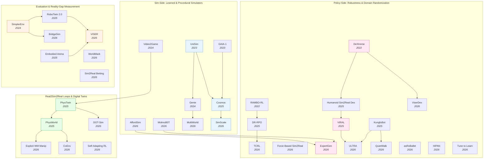

# Sim-to-Real Transfer — Deep Dive

> [!abstract] Overview
> Simulation is the only economically viable substrate for training data-hungry embodied policies — but simulators are wrong about *something*: lighting, friction, contact transients, actuator dynamics, or the long-tail of object appearance. The "reality gap" is the operational cost of those errors when the policy meets the real world. This note maps the four parallel research threads that have evolved to close it: building **better simulators** ([[2310.06114|UniSim]], Cosmos, [[2402.15391|Genie]], [[2604.18564|MultiWorld]]) that hallucinate richer worlds; designing **more robust policies** ([[2510.14246|DR-RPO]], [[2204.12581|RAMBO-RL]], [[2210.13702|DeXtreme]], [[2603.15956|ExpertGen]]) that absorb sim noise; closing **real→sim→real loops** ([[2503.17973|PhysTwin]], [[2511.07416|PhysWorld]], [[2404.09833|Video2Game]]) that rebuild the deployment scene as a digital twin; and constructing **reality-gap diagnostics** (SimplerEnv, [[2605.06311|VISER]], Sim2Real Betting) that let you measure how far you still are from real-world success.

## Evolution Graph

The field evolved through four parallel research threads. **Sim-side** (2023→2026) replaces hand-crafted simulators with *learned* world simulators that absorb internet-scale video — [[2310.06114|UniSim]] → Cosmos → [[2511.23369|SimScale]] push photorealistic, action-conditioned generation. **Policy-side** (2022→2026) trains the *policy* to be sim-noise-invariant — [[2210.13702|DeXtreme]]'s automatic domain randomization, [[2506.12851|KungfuBot]]'s physics-feasible motion retargeting, and [[2510.14246|DR-RPO]]'s distributionally robust policy optimization treat the reality gap as adversarial. **Real2sim2real** (2024→2026) reconstructs the *deployment* scene as a high-fidelity digital twin ([[2503.17973|PhysTwin]], [[2404.09833|Video2Game]], [[2511.07416|PhysWorld]]), then trains the policy against the twin before transfer. **Evaluation** (2024→2026) builds diagnostic benchmarks (SimplerEnv, [[2605.06311|VISER]]) that *measure* the sim-to-real correlation — making the reality gap quantifiable rather than mythical.

| Year | Paper | Track | Contribution |
|------|-------|-------|--------------|
| 2022 | [[2204.12581\|RAMBO-RL]] | Policy-side | Adversarial dynamics model for robust offline RL; reality gap as zero-sum game |
| 2022 | [[2210.13702\|DeXtreme]] | Policy-side | Vectorized Automatic Domain Randomization on Allegro Hand; 27.8 mean reorientations |
| 2023 | [[2309.17080\|GAIA-1]] | Sim-side | Generative world model for autonomous driving; 40s+ photoreal rollouts |
| 2023 | [[2310.06114\|UniSim]] | Sim-side | Learned interactive real-world simulator from heterogeneous video |
| 2024 | [[2402.15391\|Genie]] | Sim-side | Latent-action interactive environments from unlabeled internet video |
| 2024 | [[2404.09833\|Video2Game]] | Real2sim2real | Single-video → browser-compatible interactive 3D environment with physics |
| 2024 | [[2405.05941\|SimplerEnv]] | Evaluation | r>0.85 sim-to-real correlation via system-id + green screening |
| 2025 | [[2501.03575\|Cosmos]] | Sim-side | NVIDIA World Foundation Model platform; 100M curated clips; physical-AI digital twins |
| 2025 | [[2502.20396\|Humanoid Sim2Real Dex]] | Policy-side | Autotuned modeling + hybrid object reps; 80% box-lift on GR-1 humanoid |
| 2025 | [[2503.17973\|PhysTwin]] | Real2sim2real | Physics-informed deformable digital twin from video; real-time interactive sim |
| 2025 | [[2504.03597\|Real-is-Sim]] | Real2sim2real | Embodied-Gaussians digital twin as policy's *sole* interface; real robot mirrors sim |
| 2025 | [[2506.12851\|KungfuBot]] | Policy-side | Physics-based motion processing; zero-shot transfer of martial arts on G1 |
| 2025 | [[2506.18088\|RoboTwin 2.0]] | Evaluation | Domain-randomized data generator; +24.4% real-world few-shot |
| 2025 | [[2509.15273\|Embodied Arena]] | Evaluation | 22+ benchmarks unified; capability taxonomy |
| 2025 | [[2510.14246\|DR-RPO]] | Policy-side | Distributionally robust regularized policy optimization with linear FA |
| 2025 | [[2511.04665\|Real-to-Sim GS]] | Evaluation | 3DGS + soft-body PhysTwin for deformable-policy evaluation; **r > 0.9** sim-real correlation |
| 2025 | [[2511.07416\|PhysWorld]] | Real2sim2real | Robot learning from physical world model; 82% real success across 10 tasks |
| 2025 | [[2511.15200\|VIRAL]] | Policy-side | Visual sim-to-real at scale for humanoid loco-manipulation; 54/59 on Unitree G1 |
| 2026 | [[2511.23369\|SimScale]] | Sim-side | 3DGS sim data engine + sim-real co-training; +20% weak-baseline gains |
| 2026 | [[2602.23253\|SPARR]] | Policy-side | Sim-trained base + vision-conditioned real residual; 95-100% AutoMate assembly without human supervision |
| 2026 | [[2601.02778\|Force-Based Sim2Real]] | Policy-side | Tactile distance-field sim + actuator calibration for force-aware grasping |
| 2026 | [[2602.13040\|TCRL]] | Policy-side | Temporal-coupled adversarial training for constrained RL; up to 19,077% cost reduction |
| 2026 | [[2603.04029\|Self-Adapting RL]] | Real2sim2real | DreamerV3 world-model feedback for online sim-to-real adaptation |
| 2026 | [[2603.15956\|ExpertGen]] | Policy-side | Generative prior + DSRL + visuomotor distillation; 90.5% AutoMate assembly |
| 2026 | [[2603.16861\|MolmoBot]] | Sim-side | 232K-environment procedural MuJoCo; 79.2% real Franka FR3 — no real-world data |
| 2026 | [[2604.10856\|BridgeSim]] | Evaluation | Decomposes OL-CL gap; observational shift + objective mismatch; +19.1 DS via TTA |
| 2026 | [[2604.11138\|ViserDex]] | Policy-side | 3DGS pre-rasterization augmentation + monocular RGB; 37.6 reorientations |
| 2026 | [[2604.11674\|AffordSim]] | Sim-side | Affordance-aware data generator + 3DGS backgrounds for sim-to-real |
| 2026 | [[2604.18564\|MultiWorld]] | Sim-side | Multi-agent multi-view video world models; agent-identity + global state encoder |
| 2026 | [[2604.21686\|WorldMark]] | Evaluation | Unified benchmark suite for interactive video WMs; ρ>0.9 with human |
| 2026 | [[2604.24018\|Sim2Real Betting]] | Evaluation | Sequential-betting estimator; 70-100% win rate vs Monte Carlo |
| 2026 | [[2604.24916\|asRoBallet]] | Policy-side | Friction-aware MuJoCo + RL; zero-shot ballbot whole-body locomotion |
| 2026 | [[2604.27367\|DOT-Sim]] | Real2sim2real | Differentiable MPM + residual rendering; 90.5% indenter, 96.6% tumor detection |
| 2026 | [[2604.23702\|QuietWalk]] | Policy-side | PINN GRF predictor + curriculum; 7.17 dBA noise reduction across footwear |
| 2026 | [[2605.06311\|VISER]] | Evaluation | Ray-traced PBR + MLLM asset pipeline; r=0.92 Pearson sim-real correlation |

---

## 1. Design-Space Principles

Three orthogonal axes determine every sim-to-real strategy. Choose your point on each axis — *what* you simulate, *where* the adaptation happens, and *how* you measure success — and the rest of the design is forced.

> [!success] The Three Axes
> - **Sim quality**: hand-crafted MPM/PhysX (precise, narrow) vs. learned video simulator (broad, blurry) vs. real2sim digital twin (precise + deployable)
> - **Adaptation locus**: in the simulator (domain randomization, system-id) vs. in the policy (robust RL, distillation) vs. at deployment (TTA, online adaptation)
> - **Evaluation grounding**: sim-only proxy metrics vs. sim-real correlation (Pearson r, MMRV) vs. real-only ground truth

### Axis 1 — Sim Quality

| Approach | Mechanism | Example |
|----------|-----------|---------|
| **Hand-crafted physics** | PhysX / MuJoCo / Isaac Lab with explicit constitutive laws | [[2210.13702\|DeXtreme]], [[2603.16861\|MolmoBot]] |
| **Learned video simulator** | Diffusion-based video model conditioned on actions | [[2310.06114\|UniSim]], [[2501.03575\|Cosmos]], [[2402.15391\|Genie]] |
| **Hybrid (sim + neural rendering)** | Physics sim + 3DGS / NeRF-rendered visuals | [[2604.11138\|ViserDex]], [[2604.11674\|AffordSim]] |
| **Digital twin from video** | Reconstruct deployment scene as interactable sim | [[2503.17973\|PhysTwin]], [[2404.09833\|Video2Game]], [[2511.07416\|PhysWorld]] |

### Axis 2 — Adaptation Locus

| Where adaptation happens | Cost | Generalization |
|--------------------------|------|----------------|
| **In simulator** (domain randomization) | High training compute | Broad — covers the *imagined* range |
| **In policy** (robust RL, distillation) | High RL stability cost | Tight — robust to the *trained* perturbations |
| **At deployment** (TTA, world-model online adaptation) | Latency at deployment | Adaptive — handles new distribution shifts |

### Axis 3 — Evaluation Grounding

| Metric | What it measures | Failure mode |
|--------|------------------|--------------|
| **Sim-only proxy** (success rate in sim) | Cheap, fast | Fails to predict real (see [[2604.10856\|BridgeSim]] OL-CL gap) |
| **Sim-real correlation** (Pearson r) | Sim's predictive value | Fragile to OOD perturbations |
| **MMRV / Kelly betting** (rank reliability) | Whether sim ranks policies correctly | Requires bank of diverse sims |
| **Real-only ground truth** | Authoritative | Expensive, slow, unsafe |

> [!tip] Pick by Constraint
> If you need to **scale to internet video data**, pick learned sim (UniSim/Cosmos). If you need **physical accuracy on contact**, pick hand-crafted physics (MuJoCo + DR). If you need **fast deployment-specific transfer**, pick a digital twin (PhysTwin/PhysWorld). If you need **publishable rigor**, pair any of these with a correlation benchmark (SimplerEnv/VISER).

---

## 2. Sim-Side: Learned & Procedural Simulators

The first sim-to-real strategy is to make the simulator richer than reality — through learned video generation, procedural environment scale, or photorealistic rendering. The trade-off: learned simulators handle visual diversity well but blur on physical contact; hand-crafted simulators handle contact well but require enormous procedural-asset effort to cover the visual long tail.

### 2.1 Generative Video World Simulators

Learn the simulator from internet-scale video; the model itself becomes the simulator.

- [[2604.18564|MultiWorld]], [[2511.23369|SimScale]], [[2501.03575|Cosmos]], [[2402.15391|Genie]], [[2310.06114|UniSim]], [[2309.17080|GAIA-1]]

**How UniSim works**: Formulates real-world simulation as ==conditional video generation== via a ==5.6B-parameter video diffusion model==. Orchestrates heterogeneous datasets (robotics, human activity, panoramas, internet video) into a unified format with a ==unified action space==: high-level language instructions and low-level robot controls both map to ==T5 embeddings== and normalized values. Policies trained *only* in UniSim achieve zero-shot sim-to-real on physical robots — **3-4x** better goal reduction for vision-language models than baselines.

**How Cosmos works**: NVIDIA's open-source ==World Foundation Model Platform== — a ==scalable video data curation pipeline== processes **20M** hours of raw video into **100M** high-quality clips. Pre-trained diffusion and autoregressive ==World Foundation Models== are fine-tuned for camera-controlled navigation, robotic manipulation, and autonomous driving. The Cosmos Tokenizer suite achieves **+4 dB** PSNR with **2-12x** faster inference than prior tokenizers. Cosmos repositions WFMs as a foundation-model category analogous to LLMs.

**How SimScale works**: Bridges the sim-real visual gap for autonomous driving via ==3D Gaussian Splatting== reconstruction of real-world assets, generating photorealistic multi-view RGB observations with dynamic foreground placement. A ==pseudo-expert scene simulation pipeline== couples reactive ==Intelligent Driver Model== agents with ==LQR== ego and trajectory perturbation. Weaker baselines (LTF, DiffusionDrive) achieve **>20%** relative gains under sim-real co-training; GTRS-Dense achieves **EPDMS 48.0** on navhard.

### 2.2 Procedural Environment Generation

Hand-crafted physics + massive procedural scale; no learned visual model.

- [[2603.16861|MolmoBot]], [[2604.11674|AffordSim]]

**How MolmoBot works**: ==MolmoBot-Engine== — open-source procedural data generation in ==MuJoCo== — leverages **232,000** indoor environments and **48,000** manipulable objects to generate **1.8M** expert trajectories. Extensive ==domain randomization== over visual and physical parameters + diverse referring expressions enables zero-shot sim-to-real *without real-world fine-tuning or photorealistic rendering*. Achieves **79.2%** success on real Franka FR3 tabletop pick-and-place — outperforming π0.5-DROID (**39.2%**) which was trained on real-world data. Critically: absolute joint-position action representation transferred better than delta-action despite similar sim performance.

**How AffordSim works**: Integrates ==VoxAfford== for per-point open-vocabulary 3D affordance detection into simulation data generation. ==3DGS-rendered photorealistic backgrounds== as domain randomization improve average real-world success from **17%** (no DR) to **27%**. Reveals the affordance-task difficulty: simple grasping reaches **60%** zero-shot, but pouring/hanging only **10-20%** — fine-grained semantic affordance is still the bottleneck for sim-to-real.

### 2.3 Multi-Agent & Multi-View Extensions

- [[2604.18564|MultiWorld]]

**How MultiWorld works**: ==Action-conditioned diffusion== with ==Flow Matching== for multi-agent, multi-view video world modeling. A ==Multi-Agent Condition Module== uses ==Agent Identity Embedding== (RoPE-based) for identity distinction and ==Adaptive Action Weighting== to prioritize influential actions. A ==Global State Encoder== leverages pretrained ==VGGT== for shared 3D-aware state. On multi-robot manipulation: FVD **179** vs baselines' **207-245**; RPE **0.67** vs **0.72-0.75** — proving that the simulator's representational scaffolding (not just video quality) is what enables consistent multi-agent rollouts.

> [!star] Key Papers
> - [[2310.06114|UniSim]] — Learned interactive real-world simulator; **3-4x** better zero-shot policy transfer than baselines; foundational learned-sim paper
> - [[2501.03575|Cosmos]] — NVIDIA WFM platform: **100M** curated clips, **+4 dB** PSNR tokenizer, **10 FPS** real-time autoregressive generation; defines the WFM category
> - [[2603.16861|MolmoBot]] — **79.2%** real Franka FR3 success trained *exclusively* on procedural MuJoCo data; proves sim-only can outperform real-data baselines (π0.5-DROID **39.2%**)
> - [[2511.23369|SimScale]] — 3DGS sim-real co-training for autonomous driving; weak baselines see **>20%** relative gains; new **EPDMS 48.0** on navhard

> [!tip] Sim-Side Trade-Off
> Learned video simulators (UniSim, Cosmos) scale to internet video and capture visual diversity but blur on contact dynamics. Procedural physics simulators (MolmoBot) handle contact accurately but require massive procedural-asset effort to cover the visual long tail. Hybrid 3DGS-augmented physics (SimScale, [[2604.11674|AffordSim]], [[2604.11138|ViserDex]]) is the emerging sweet spot.

---

## 3. Policy-Side: Robustness & Domain Randomization

Instead of making the simulator perfect, make the *policy* invariant to sim imperfections. This is the dominant industrial-scale recipe — domain randomization remains the de-facto sim-to-real method in 2026.

### 3.1 Domain Randomization Foundations

- [[2603.15956|ExpertGen]], [[2602.23253|SPARR]], [[2502.20396|Humanoid Sim2Real Dex]], [[2210.13702|DeXtreme]]

**How DeXtreme works**: Trains a deep RL policy via ==PPO== in ==Isaac Gym== on the affordable Allegro Hand. The crucial ingredient is ==Vectorized Automatic Domain Randomization== (VADR) — dynamically adjusting simulation parameters based on policy capability. VADR-trained policies achieved **27.8 mean** real reorientations vs **14.8** for hand-tuned DR — auto-DR almost doubles transfer. A Mask-RCNN vision-based pose estimator trained on synthetic Isaac Sim images operates at **15 Hz** under occlusion.

**How ExpertGen works**: Three-phase framework for scalable sim-to-real from *imperfect* behavior priors. (1) Generative behavior prior via state-based ==diffusion policy== on rough demos. (2) Expert policy acquisition via ==Diffusion Steering RL (DSRL)== — optimizes *only* the diffusion's initial noise input, preserving the motion manifold while maximizing sparse rewards via FastTD3 in parallel sim. (3) Visuomotor distillation via ==DAgger== with extensive visual DR. **90.5%** average on 8 AutoMate industrial assembly tasks; **80%** real-world success on Franka Lift Banana from RGB.

**How Humanoid Sim2Real Dex works**: Full vision-based dexterous manipulation sim-to-real recipe on Fourier GR-1. ==Autotuned robot modeling== bridges the dynamics gap via minimal real-world calibration data. ==Contact stickers== + ==stage-based rewards== structure bimanual task rewards. ==Task-aware hand pose initialization== from human priors + ==divide-and-conquer distillation== scale to generalist policies. **80%** box-lift, **62.3%** grasp-and-reach, **52.5%** bimanual handover with **60-80%** zero-shot unseen-object generalization.

**How SPARR works**: A sister recipe to ExpertGen for *industrial assembly*. The base policy is pre-trained in simulation with ==PPO + dense imitation rewards== under domain randomization. The key contribution is the **real-world residual policy**: the base policy is deployed in the real world with Gaussian noise injection to autonomously generate demonstrations, and a **vision-conditioned residual** is then learned via ==RLPD== with a dynamically updated demo buffer — *no human supervision required*. Result: **95-100% success** on 10 AutoMate assembly tasks (**+38.4%** relative over AutoMate, matching human-supervised [[2410.21845|HIL-SERL]]), **+74.5%** on unseen NIST tasks, robust to **±N**-mm pose noise. The structural finding: a residual policy that consumes *visual* observations corrects rotational/positional errors that the state-based base policy cannot see — vision is what makes the residual work, not just being learned in the real world.

### 3.2 Robust RL Foundations

Treat the sim-real gap as adversarial; train against the worst-case dynamics.

- [[2204.12581|RAMBO-RL]], [[2602.13040|TCRL]], [[2510.14246|DR-RPO]]

**How RAMBO-RL works**: Formulates offline RL as a ==two-player zero-sum game== — the agent maximizes value, an adversarial environment model minimizes it by modifying transitions. An ==ensemble of neural networks== represents the dynamics, updated adversarially via a ==Model Gradient== while constrained to remain accurate on observed data. Alternating optimization with an off-policy actor-critic achieves the highest total D4RL MuJoCo locomotion score. The insight: *adversarial training of the dynamics model itself* introduces conservatism *without* requiring explicit uncertainty estimation.

**How DR-RPO works**: First provably efficient *online* policy optimization for robust MDPs with ==linear function approximation==. Defines policy-regularized d-rectangular ==DRMDPs== and ==RRMDPs== that incorporate a ==KL-divergence== term toward a reference policy. The model-free algorithm uses ==softmax-based policy updates==, ridge linear regression for robust Q-functions, and ==UCB== bonuses for optimism. Achieves ==Õ(d²H²/√K)== average suboptimality — matching value-based robust methods while supporting *stochastic* policies and scalability to continuous action spaces.

**How TCRL works**: Defends *constrained* RL against ==temporal-coupled adversarial perturbations== (cumulative attacks evolving over time). A ==worst-case-perceived cost constraint function== implicitly estimates safety costs under temporally coupled attacks without explicit adversarial-policy modeling. A ==dual-constraint defense== with autocorrelation and entropy stability constraints on rewards mitigates reward degradation. Achieves **559-19,077%** safety-cost reduction and **8.36-34.76%** reward improvement vs baselines under worst-case attacks.

### 3.3 Physics-Informed Policy Robustness

Bake physics priors *into* the policy via curriculum, reward shaping, or motion processing.

- [[2605.10063|EFGCL]], [[2604.24916|asRoBallet]], [[2604.23702|QuietWalk]], [[2506.12851|KungfuBot]], [[2603.03279|ULTRA]]

**How EFGCL Uses Physical Assistance as Curriculum**: [[2605.10063|EFGCL]] tackles the high-risk dynamic-motion learning problem (backflips, lateral flips, jumps) for legged robots via ==spotting-inspired external forces== — physical assistance modeled after a gymnastics spotter. Transient external forces help the robot complete the motion during early training; an ==adaptive curriculum== decays the assistance based on success rate, transitioning to fully autonomous execution. Combined with PPO + teacher-student sim-to-real, EFGCL acquires motions (backflip, lateral flip) that PPO baselines *cannot learn at all*, accelerates jumping by **~2×**, and transfers zero-shot to a real KLEIYN quadruped. The method's robustness to heuristic choice of assistive-force application point/magnitude/timing makes it deployable without per-skill tuning — a rare property for high-risk motor-skill curricula.

**How asRoBallet works**: Reconfigurable humanoid ballbot via ==subtractive reconfiguration== of an open-source quadruped — democratizes ballbot research. The critical sim-to-real ingredient: ==friction-aware MuJoCo simulation== explicitly modeling ==tribological phenomena== (rolling, lateral, torsional friction, discrete omni-roller mechanics) + actuator friction. Combined with domain randomization, achieves **zero-shot sim-to-real** with **100%** velocity-tracking success in sim and **0.05 m/s** real-world MAE; recovers from pushes up to **0.3 m**.

**How QuietWalk works**: Physics-informed RL for low-noise humanoid locomotion under diverse footwear. An ==inverse-dynamics-constrained PINN== estimates per-foot vertical GRFs from proprioception alone — no force sensors. The frozen, physics-consistent GRF predictor is integrated *into the RL reward function*, directly penalizing impact forces. Combined with footwear-asset parameterization and curriculum learning, achieves **7.17 dBA** mean-noise-level reduction across four indoor surfaces while generalizing across **4** footwear types (barefoot → high heels) and outdoor terrains. The PINN reduces GRF errors **82-86%** vs purely supervised baselines — physical consistency is what enables sim-to-real transfer of the reward signal.

**How KungfuBot works**: Closes the reality gap for *highly-dynamic* humanoid skills (martial arts, dancing). A ==physics-based motion processing pipeline== filters untrackable mocap sequences and corrects contact issues — only physically feasible references enter training. An ==adaptive motion tracking mechanism== dynamically adjusts the reward's tracking factor during RL, progressively refining precision. With ==asymmetric actor-critic==, ==reward vectorization==, ==reference state initialization==, and extensive domain randomization, achieves zero-shot sim-to-real on Unitree G1 — global mean per-body-position error **53.25 mm** on easy motions vs **>233 mm** for OmniH2O/ExBody2 baselines.

### 3.4 Vision-Aware Sim-to-Real

Close the *visual* gap explicitly via neural rendering, teacher-student distillation, or controller-aware system-id.

- [[2511.15200|VIRAL]], [[2604.11138|ViserDex]], [[2604.02523|Tune to Learn]], [[2601.02778|Force-Based Sim2Real]]

**How VIRAL works**: Visual sim-to-real at scale for humanoid loco-manipulation. ==Two-phase teacher-student== — privileged RL teacher (16 GPUs) → vision-based student via DAgger + behavior cloning (up to 64 GPUs with ==tiled rendering==). Extensive ==camera alignment==, ==system identification== for dexterous hands, and visual+simulation DR. **54/59** continuous loco-manipulation cycles on real Unitree G1 — matching expert teleop (**20.2** vs **21.4** s cycle). ==Reference State Initialization== (RSI) from teleop demos is critical: removing it drops success from **95%** to **<10%**. The lesson: compute scale + RSI + delta-action space + extensive DR are *all* required.

**How ViserDex works**: Closes the visual sim-to-real gap for monocular RGB-only dexterous in-hand reorientation. Integrates ==3D Gaussian Splatting== rendering *directly into the simulation loop*. The novel ingredient is ==pre-rasterization augmentation== — applies structured domain randomization to 3DGS attributes (spherical harmonic coefficients), simulating diverse lighting and materials *within a static Gaussian representation*. Achieves **37.6** consecutive reorientations on real Allegro Hand under nominal lighting, **~25** under adversarial. Trains on a single consumer-grade GPU in **26-90 hours** — **1.6x** faster than tiled rendering.

**How Tune to Learn works**: Systematic study of how *controller gains* shape sim-to-real. Counterintuitive finding: ==stiff gains== yield the *lowest* system-identification errors but the *worst* sim-to-real transfer — stiff control amplifies modeling errors into real-world oscillations. For behavior cloning, ==compliant overdamped gains== (low Kₚ, high K_d) give significantly higher closed-loop success despite higher training loss. For RL, *any* gain regime works given task-specific hyperparameter tuning. The takeaway: traditional sim-fidelity metrics (low sysid error) do *not* correlate with successful policy transfer.

**How Force-Based Sim2Real works**: Holistic recipe for zero-shot force-aware dexterous manipulation on a real 5-finger hand. Trained via ==asymmetric actor-critic PPO== in ==IsaacLab==. Two key ingredients: (1) ==computationally efficient distance-field-based tactile simulation== — abstracts raw tactile data into compact force + contact-position features, avoiding slow soft-body physics; (2) ==one-time current-to-torque calibration== aligns real motor signals with simulated joint torques, combined with a ==randomized actuator model== to account for backlash and saturation. In-hand rotation policies achieve **25.1** average consecutive rotations *with* tactile feedback vs **1.1** *without* — contact sensing is dispositive for force-aware sim-to-real.

### 3.5 Hierarchical & Generalist Sim-to-Real

- [[2604.26504|HiPAN]], [[2603.03279|ULTRA]]

**How HiPAN works**: Hierarchical RL for quadruped navigation in unstructured 3D environments via a teacher-student paradigm + extensive DR. ==Path-Guided Curriculum Learning== overcomes myopia in long-horizon goal-directed motion. Achieves **94.7%** success on Complex-2 simulation and validates on Unitree Go1 in cluttered indoor, dead-end, and outdoor scenarios using only onboard depth — sim-to-real from a depth-only teacher is feasible *because* the student observes the same modality as the deployment robot.

**How ULTRA works**: ==Physics-driven neural retargeting== translates MoCap data into contact-aware humanoid demonstrations. A single ==multimodal controller== with ==transformer encoder== + ==availability masking== handles both dense motion references and sparse goal following. ==Teacher-student distillation== + RL fine-tuning lifts OOD-goal success by up to **200%** for position-only observations. **73%** dense-tracking and **50-90%** sparse-following success on real Unitree G1.

> [!star] Key Papers
> - [[2210.13702|DeXtreme]] — Foundational VADR result: automatic DR doubles real-world transfer (**27.8** vs **14.8** reorientations); the canonical industrial sim-to-real recipe
> - [[2511.15200|VIRAL]] — Visual sim-to-real at scale for humanoid loco-manipulation; **54/59** real Unitree G1 success matching expert human teleop; RSI is critical
> - [[2506.12851|KungfuBot]] — Physics-feasible motion processing + adaptive tracking; **53.25 mm** error vs **>233 mm** baselines; first to zero-shot transfer highly-dynamic skills
> - [[2604.24916|asRoBallet]] — Friction-aware MuJoCo + RL closes sim2real gap for underactuated dynamics; **zero-shot** ballbot whole-body control with **0.05 m/s** real-world MAE

> [!tip] Domain Randomization is the Default — But Has Limits
> Every paper in this section uses DR, but [[2604.11674|AffordSim]] showed DR alone only lifts real-world success from **17%** to **27%** on affordance-demanding tasks — fine-grained semantic transfer still fails. DR works for *dynamics* gaps (DeXtreme, KungfuBot) but is *brittle* for *semantic* gaps (manipulating novel categories). Combine DR with neural rendering ([[2604.11138|ViserDex]]) or learned simulators ([[2310.06114|UniSim]]) when the visual gap dominates.

> [!success] The Modern Policy-Side Recipe
> ==Auto domain randomization== + ==teacher-student distillation== + ==reference state initialization== + ==system identification== + ==privileged-info asymmetric actor-critic== — proven across [[2210.13702|DeXtreme]], [[2511.15200|VIRAL]], [[2506.12851|KungfuBot]], and [[2603.15956|ExpertGen]]. Pick a subset based on which gap (dynamics, visual, kinematic) dominates your deployment.

---

## 4. Real2Sim2Real Loops & Digital Twins

Reverse the direction: reconstruct the *deployment* scene as a high-fidelity interactive simulator, train the policy *against the twin*, then execute on the real robot. Eliminates the visual long tail because the simulator is *grounded* in the deployment environment from the start.

### 4.1 Video → Interactable Sim

- [[2511.07416|PhysWorld]], [[2504.03597|Real-is-Sim]], [[2503.17973|PhysTwin]], [[2404.09833|Video2Game]]

**How Video2Game works**: Single real-world video → real-time browser-compatible interactive 3D environment with physics. Three components: enhanced ==Instant-NGP== for large-scale unbounded scenes (with contraction function + semantic and normal prediction), distilled into a ==game-engine-compatible mesh with neural texture map==, decomposed into entities with ==rigid-body physics==. Achieves **>100 FPS** browser rendering. Critically: monocular 2D priors (depth, normals, semantics) regularize NeRF training, enabling robust geometry from sparse video.

**How PhysTwin works**: Reconstructs ==physics-informed interactive digital twins== of *deformable* objects from videos. Multi-stage optimization jointly recovers geometry, infers physical properties (Young's modulus, Poisson's ratio), and models appearance via ==spring-mass models== + ==generative shape priors== + ==Gaussian splats==. Real-time interactive simulation enables robot motion planning against the twin. Generalizes to unseen interactions beyond training scenarios — the physical-prior structure (springs + masses) is what lifts videos beyond visual reconstruction into simulatable physics.

**How PhysWorld works**: ==Task-conditioned video generation== → ==geometry-aligned 4D reconstruction== → physical digital twin with material-property estimation → ==object-centric residual RL== inside the twin. **82%** average success across **10** real-world manipulation tasks; **+15 pp** over RIGVid; reduces grasping failures from **18%** to **3%** and eliminates tracking failures entirely. The critical insight: video generation alone produces visually plausible but physically infeasible motions — the explicit physical world model is what makes generated video actionable.

**How Real-is-Sim works**: Flips the conventional sim-to-real flow — instead of trying to make sim match real, *make the digital twin the policy's sole interface and have the real robot mirror it*. The framework builds a **dynamic digital twin** on the ==Embodied Gaussians== simulator, continuously synchronizing its state with the real world via **RGB visual feedback at 60Hz**. The learned policy (trained with ==Conditional Flow Matching==) always reads from and writes to the simulator — never directly from real-world sensors. The physical robot operates as a **"follower"**, mirroring the simulated robot's joint states. This eliminates the sim-to-real gap from the policy's perspective because the policy never sees the real world. Concrete impact: augmenting 30 real demos with 30 simulated ones lifts state-based PushT success from **57% → 80%**, matching the 60-real-demo baseline; gripper-mounted virtual cameras reach **82%** with emergent search behaviors. The conceptual move — "synchronize the sim instead of the policy" — is what makes this distinct from PhysTwin/PhysWorld, which still treat sim and real as separate.

### 4.2 Differentiable Real2Sim Calibration

- [[2604.27367|DOT-Sim]]

**How DOT-Sim works**: Differentiable optical tactile simulation calibrated to real soft sensors. ==Material Point Method== models nonlinear soft-gel deformation. ==Differentiable physics== rapidly calibrates Young's modulus and Poisson's ratio from few real demos + FEA pseudo-ground-truth. A neural ==residual image== (contact − idle) is added to a real idle image for high optical fidelity. Achieves **PSNR 30.48** in challenging optical regimes, **17.34%** average improvement over baselines. Zero-shot sim-to-real: **90.5%** indenter classification, **96.6%** tumor detection, **0.896 mm** trajectory error. Differentiable calibration removes manual sysid effort — sim-to-real becomes a gradient-descent problem.

### 4.3 World-Model-Driven Online Adaptation

- [[2603.04029|Self-Adapting RL]], [[2603.13825|Explicit World Model Manipulation]]

**How Self-Adapting RL works**: Online continual RL with world-model feedback. Built on ==[[2301.04104|DreamerV3]]==, monitors prediction residuals: ==Observation Prediction Residual== and ==Reward Prediction Residual== exceed a threshold → OOD event triggers online world-model + policy fine-tuning. Selective replay-buffer management excludes pre-change data. Walker adapts to simulated actuator damage in **10,000** steps (**2 minutes** sim time). F1Tenth vehicle adapts to *both* a real sim-to-real transfer gap *and* subsequent friction reduction within **10,000** real steps (**8 minutes**). The reality gap is treated as just another OOD shift the world model detects and corrects for.

**How Explicit World Model works**: Zero-shot open-world manipulation by constructing physically-grounded digital twins on demand. ==Open-set segmentation== (GPT-4o, Grounded-SAM) + ==grasp pose prediction== (AnyGrasp) → ==digital twin construction== via Hunyuan 3D 2.0 + ==two-stage pose alignment== ([[2304.07193|DINOv2]] coarse + RANSAC/ICP fine) → physics-enabled sampling in Isaac Sim → VLM-based evaluation. **6/9** tasks succeed at ≥75% on a real robot. Two-stage alignment lifts mug-handling from **27%** to **91%** — coarse-appearance + fine-geometric matching is necessary for robust sim-to-real of category-novel objects.

### 4.4 Compositional Sim-Real Environments

- [[2604.05484|CoEnv]]

**How CoEnv works**: Multi-agent collaboration via ==compositional environment== unifying real-world scene reconstruction with a physics simulator. A ==VLM-based hierarchical planner== decomposes tasks. ==Collision-aware sim-to-real transfer== verifies swept collision volumes for interpolated trajectories before real-world execution. Achieves **49%** overall success across **5** real multi-agent benchmarks with up to **3** heterogeneous robots. The pattern: sim acts as a *safety filter* for real-world execution, not a source of training data.

> [!star] Key Papers
> - [[2503.17973|PhysTwin]] — Physics-informed deformable digital twins from videos; real-time interactive sim + motion planning integration
> - [[2511.07416|PhysWorld]] — **82%** real-world success across 10 tasks via task-conditioned video → physical digital twin → object-centric residual RL; explicit physics is what makes generated video actionable
> - [[2504.03597|Real-is-Sim]] — Embodied-Gaussians digital twin as the policy's **sole interface**; the real robot mirrors the sim instead of vice-versa, eliminating the sim-real gap from the policy's perspective; +23pp PushT with 30+30 demos
> - [[2404.09833|Video2Game]] — Single video → **100+ FPS** browser-compatible interactive environment with rigid-body physics; foundational real2sim pipeline
> - [[2604.27367|DOT-Sim]] — Differentiable MPM + residual rendering for optical tactile sensors; **96.6%** tumor detection zero-shot

> [!tip] When Real2Sim2Real Wins
> Digital twins win when your *deployment scene matters most* — a specific robot, a specific workspace, a specific deformable target. They lose when you need *broad generalization across scenes*, where learned simulators ([[2310.06114|UniSim]], Cosmos) or large-scale procedural generation ([[2603.16861|MolmoBot]]) scale better. The decision: how variable is your deployment environment?

---

## 5. Evaluation & Reality-Gap Measurement

You cannot optimize what you cannot measure. The reality-gap evaluation stack went from absent (pre-2024) to the determining factor for whether a sim-to-real claim is publishable (2026).

### 5.1 Sim-Real Correlation Benchmarks

- [[2605.06311|VISER]], [[2511.04665|Real-to-Sim GS]], [[2405.05941|SimplerEnv]]

**How SimplerEnv works**: First benchmark designed for *reliable* sim-real correlation. Open-source simulated environments replicate Google Robot and BridgeData V2 setups. The control gap is closed via ==system identification== fine-tuning of simulated controller parameters. The visual gap is closed via ==green screening== (real backgrounds onto simulated scenes), ==texture baking== (real object textures onto simulated assets), and result aggregation across visual variants. Achieves Pearson **r > 0.85** for Google Robot, **r = 0.890** for BridgeData V2. Introduces ==Mean Maximum Rank Violation (MMRV)== — quantifies whether sim correctly *ranks* policies, not just predicts absolute success.

**How VISER works**: Pushes visual realism further. ==Ray tracing== for plausible lighting + ==physically-based rendering (PBR)== materials. An ==MLLM-driven asset pipeline== generates **>1,000** 3D assets with high-fidelity PBR textures *without* baked-lighting artifacts. Achieves **r = 0.92** average Pearson sim-real correlation. The diagnostic finding: ==specular highlights== are critical for cavity localization (their absence causes large drops); ==contact shadows== are essential for spatial grounding. VISER pinpoints the *load-bearing visual cues* that current VLAs depend on — a structural finding about sim-to-real, not just a benchmark.

**How Real-to-Sim GS works**: Tackles the *deformable-object* sim-real correlation problem — where SimplerEnv and VISER both lose fidelity. Combines ==3D Gaussian Splatting== for photorealistic rendering with **physics-informed soft-body digital twins** ([[2503.17973|PhysTwin]]) for dynamic object modeling. Digital twins of the workspace and objects are reconstructed from video, and physical parameters (Young's modulus, Poisson's ratio) for deformable objects are optimized from interaction videos. Critical engineering steps: ==positional and color alignment== for visual consistency with robot cameras, plus a custom **NVIDIA Warp**-based physics engine for accurate soft-body deformation. Achieves Pearson **r > 0.9** across plush-toy packing, rope routing, and T-block pushing for state-of-the-art policies — substantially higher than NVIDIA IsaacLab baseline (r = 0.649 for T-block pushing). The structural finding: *both* high-fidelity appearance (color alignment) *and* accurate dynamics (physics optimization) are required for trustworthy correlation; removing either component collapses r. This is the missing soft-body counterpart to SimplerEnv/VISER's rigid-object correlation work.

### 5.2 Diagnostic Benchmarks for Specific Sim-to-Real Failures

- [[2604.10856|BridgeSim]], [[2506.18088|RoboTwin 2.0]], [[2509.15273|Embodied Arena]]

**How BridgeSim works**: Cross-simulator closed-loop evaluation platform decomposing the OL-CL (Open-Loop vs Closed-Loop) gap into ==Observational Domain Shift== (perception degradation) and ==Objective Mismatch== (biased Q-value estimation + compounding errors). A training-free ==Test-Time Adaptation== framework combines a ==flow-matching observational calibrator==, ==truncated Q-value estimator==, and ==adaptive replan==. Flattens long-horizon reliability decay in CL simulation — **+19.1** Driving Score improvement with [[2305.14992|RAP]] in IDM mode. Crucially shows that *merely scaling OL training does not improve CL performance* — sim-to-real failure is a *paradigm* gap, not a *data* gap.

**How RoboTwin 2.0 works**: ==Automated expert data generation== leveraging ==MLLMs== + ==closed-loop simulation-in-the-loop feedback== to synthesize and refine high-quality task execution code. Comprehensive ==domain randomization== across **5** dimensions (scene clutter, background textures, lighting, tabletop heights, language paraphrases) + ==embodiment-aware grasp adaptation==. Policies trained with RoboTwin 2.0 data show **+24.4%** real-world few-shot improvement and **+21.0%** zero-shot unseen-background generalization.

**How Embodied Arena works**: Unified platform integrating **22+** benchmarks and **30+** models. Establishes a systematic ==Embodied Capability Taxonomy== with **7** core capabilities and **25** fine-grained dimensions. An ==LLM-driven automated data generation pipeline== prevents overfitting. Findings: specialized embodied models outperform massive closed-source generalists on domain benchmarks; object and spatial perception are the dominant bottlenecks — *not* high-level reasoning.

### 5.3 Sim-Real Estimation as a Statistical Problem

- [[2604.24018|Sim2Real Betting]]

**How Sim2Real Betting works**: Treats sim-real estimation as a ==sequential betting framework== — simulators inform strategic "wagers" on real-world outcomes, driving a ==bet-weighted estimator==. Adopts ==Cover's universal portfolio== with ==Kelly-style bet sizes== combining predictions from a bank of diverse simulators. A ==double betting mechanism== explicitly tolerates simulator bias when an informative predictive edge is present. Achieves **70-100%** win rates (lower error than Monte Carlo) across synthetic and sim-to-sim locomotion examples. The conceptual shift: sim-to-real is a *variance reduction* problem, not a *fidelity* problem — wrong-but-informative simulators contribute statistical signal.

### 5.4 Interactive World-Model Evaluation

- [[2604.21686|WorldMark]]

**How WorldMark works**: Unified benchmark suite for *interactive* I2V world models. A ==unified action-mapping layer== translates a common WASD-style vocabulary to each model's native control format — making heterogeneous models comparable. A hierarchical test suite of **500** cases across **3** difficulty tiers with **8** metrics in **3** dimensions (Visual Quality, Control Alignment, World Consistency). Achieves Spearman **ρ > 0.9** with human perceptual judgments. Findings: visual quality and world consistency are *uncorrelated* — models excelling in one often lack the other. [[2402.15391|Genie]] 3 leads on consistency, YUME 1.5 on quality. Crucially: domain-specific models *fail badly* outside their training domains — a structural sim-to-real evaluation finding for learned simulators.

> [!star] Key Papers
> - [[2405.05941|SimplerEnv]] — First reliable sim-real correlation benchmark (**r > 0.85**, **r = 0.890**); introduces MMRV ranking metric; foundational evaluation paper
> - [[2605.06311|VISER]] — **r = 0.92** sim-real correlation via ray-traced PBR + MLLM asset pipeline; identifies specular highlights and contact shadows as load-bearing visual cues
> - [[2511.04665|Real-to-Sim GS]] — **r > 0.9** sim-real correlation on *deformable* tasks (plush, rope, T-block) via 3DGS + [[2503.17973|PhysTwin]]; the soft-body counterpart to SimplerEnv/VISER's rigid-object work; identifies color alignment + physics optimization as jointly required
> - [[2604.10856|BridgeSim]] — Decomposes OL-CL gap into observational shift + objective mismatch; **+19.1 DS** via training-free TTA; sim-to-real is paradigm gap, not data gap
> - [[2604.24018|Sim2Real Betting]] — Sequential-betting estimator achieving **70-100%** win rate vs Monte Carlo; reframes sim-to-real as variance reduction

> [!tip] The Evaluation Stack
> ==SimplerEnv== (does sim correlate with real?) → ==VISER== (which visual cues drive correlation?) → ==BridgeSim== (where does OL-CL diverge?) → ==Sim2Real Betting== (how to combine multiple imperfect sims?). Use the stack — single-metric evaluation now reads as inadequate.

---

## 6. Integration Patterns

How these pieces compose into deployable sim-to-real pipelines:

**Pattern A — Massive DR + Procedural Sim**: Combine procedural environment generation ([[2603.16861|MolmoBot]]) with extensive domain randomization ([[2210.13702|DeXtreme]] VADR) + teacher-student distillation ([[2511.15200|VIRAL]]). The industrial-scale recipe for general-purpose VLA training. Expensive in compute, broad in generalization. See [[03_VLA#1. Design-Space Principles]] for the data strategy.

**Pattern B — Learned-Sim Foundation + Policy Fine-Tune**: Pre-train against a learned world simulator ([[2310.06114|UniSim]] / [[2501.03575|Cosmos]]), then policy-side fine-tune on deployment-specific dynamics. Tradeoff: cheap visual diversity, but learned simulators blur contact — pair with hand-crafted physics for contact-heavy tasks. See [[04_WAM]] for the WAM architectures.

**Pattern C — Digital-Twin-in-the-Loop**: Reconstruct deployment scene as a digital twin ([[2503.17973|PhysTwin]] / [[2511.07416|PhysWorld]]), train RL inside the twin, transfer. Deployment-specific but cheap *per deployment*. Best for narrow, high-precision applications (specific assembly task, specific deformable target). See [[07_Physics-Aware-Embodied-AI]] §4 for the external-simulator coupling perspective.

**Pattern D — Online Adaptation with World-Model Feedback**: Treat the sim-real gap as an OOD shift the world model detects and corrects for ([[2603.04029|Self-Adapting RL]]). Cheapest at deployment time but requires a continually-trained world model. Good fit for long-deployment robots that face slow distribution shift (e.g., wear over months).

> [!success] Choose Your Pattern
> - **Generalist robot foundation?** Pattern A (Procedural + DR + Distillation)
> - **Need visual diversity + actions?** Pattern B (Learned sim + policy fine-tune)
> - **Narrow high-precision deployment?** Pattern C (Digital twin)
> - **Long-deployment continual adaptation?** Pattern D (Online world-model)

> [!star] Key Papers — Integration Pattern Exemplars
> - [[2603.16861|MolmoBot]] — Pattern A exemplar: **79.2%** real Franka FR3 from 232K procedural environments, no real data
> - [[2501.03575|Cosmos]] — Pattern B exemplar: WFM platform with 100M curated clips for learned-sim foundation
> - [[2511.07416|PhysWorld]] — Pattern C exemplar: **82%** real success across 10 tasks via task-conditioned video → physical twin → residual RL
> - [[2603.04029|Self-Adapting RL]] — Pattern D exemplar: DreamerV3 prediction residuals trigger online world-model + policy fine-tuning

---

## 7. Open Problems

- **Sim-real correlation collapses on OOD perturbations**: [[2405.05941|SimplerEnv]] and [[2605.06311|VISER]] achieve high correlation on *in-distribution* tasks but neither has shown the correlation survives intentional visual or dynamics perturbations. The next frontier is *robust* sim-real correlation under deliberate domain shift.
- **DR has limits**: [[2604.11674|AffordSim]] reveals that DR lifts simple-grasping zero-shot success only to **27%** on affordance-demanding tasks — fine-grained semantic transfer is still unsolved. Combining DR with learned-sim foundations or digital twins is plausible but unproven at scale.
- **Learned sims blur on contact**: [[2310.06114|UniSim]] and Cosmos produce stunning visuals but physical contact regions (collisions, friction transients) look implausible to robots. Hybrid pipelines ([[2604.11138|ViserDex]]: 3DGS rendering + MuJoCo physics) are emerging but compute-expensive.
- **Sim-to-real evaluation is fragmented**: [[2509.15273|Embodied Arena]] unifies **22+** benchmarks but the *correlation* benchmarks (SimplerEnv, VISER) and *generalization* benchmarks ([[2506.18088|RoboTwin 2.0]]) and *world-model* benchmarks ([[2604.21686|WorldMark]]) remain separate stacks. A unified meta-benchmark would expose where current methods are weakest.
- **Reward-signal sim-to-real**: Most sim-to-real research transfers *actions*. [[2604.23702|QuietWalk]] shows you can also transfer *reward signals* (a PINN-estimated GRF as RL reward generalizes across footwear). The reward-side sim-to-real problem is underexplored.
- **Statistical sim-to-real**: [[2604.24018|Sim2Real Betting]] proposes treating sim-real as variance reduction with biased predictors — but the practical impact of running banks of cheap, biased sims vs one expensive accurate sim is open.
- **Online controller-gain interaction**: [[2604.02523|Tune to Learn]] shows controller gains are an unrecognized hyperparameter for sim-to-real, with stiff gains *worsening* transfer despite lower sysid errors. Whether this generalizes beyond proportional-derivative position control is unknown.

> [!star] Key Papers — Frontier Problems
> - [[2604.11674|AffordSim]] — Exposes DR's ceiling: lifts simple grasping to **27%** but fine-grained affordance tasks (pouring/hanging) stay at **10-20%**; the canonical evidence that DR is insufficient for semantic transfer
> - [[2604.02523|Tune to Learn]] — Counterintuitive finding: stiff gains minimize sysid error but worsen sim-to-real; controller gains are an unrecognized hyperparameter
> - [[2604.24018|Sim2Real Betting]] — Reframes sim-to-real as a statistical variance-reduction problem; opens the frontier of combining multiple biased simulators

---

## Quick-Reference Matrix

| Question | Answer |
|----------|--------|
| Need a learned video simulator? | [[2310.06114\|UniSim]] (foundational), [[2501.03575\|Cosmos]] (platform), or [[2402.15391\|Genie]] (latent actions) |
| Need procedural sim at scale? | [[2603.16861\|MolmoBot]] (232K environments, 79.2% real Franka) |
| Need photoreal autonomous driving sim? | [[2511.23369\|SimScale]] (3DGS + sim-real co-training) or [[2309.17080\|GAIA-1]] |
| Need multi-agent sim? | [[2604.18564\|MultiWorld]] (action-identity + global state encoder) |
| Need domain randomization? | [[2210.13702\|DeXtreme]] (VADR) — auto-DR doubles transfer over hand-tuned |
| Need robust RL? | [[2510.14246\|DR-RPO]] (linear FA), [[2204.12581\|RAMBO-RL]] (adversarial offline), or [[2602.13040\|TCRL]] (temporal-coupled constrained) |
| Need humanoid sim-to-real? | [[2511.15200\|VIRAL]] (loco-manipulation), [[2506.12851\|KungfuBot]] (highly-dynamic), or [[2502.20396\|Humanoid Sim2Real Dex]] (dexterous) |
| Need force-aware sim-to-real? | [[2601.02778\|Force-Based Sim2Real]] or [[2604.27367\|DOT-Sim]] — see [[10_Force-Aware-and-Tactile-Policies]] for tactile depth |
| Need a digital twin? | [[2503.17973\|PhysTwin]] (deformable) or [[2511.07416\|PhysWorld]] (robot policy) — see [[07_Physics-Aware-Embodied-AI]] §4 |
| Need policy that runs *only* in the twin (real robot mirrors sim)? | [[2504.03597\|Real-is-Sim]] (Embodied-Gaussians + 60Hz visual sync; +23pp PushT) |
| Need real2sim from video? | [[2404.09833\|Video2Game]] (rigid-body, browser-compatible) |
| Need vision-residual on top of sim-trained base for industrial assembly? | [[2602.23253\|SPARR]] (95-100% AutoMate without human supervision) |
| Need controller-gain awareness? | [[2604.02523\|Tune to Learn]] — compliant overdamped gains beat stiff for BC; stiff gains *worsen* sim-to-real |
| Need to evaluate sim-real correlation? | [[2405.05941\|SimplerEnv]] (r > 0.85) + [[2605.06311\|VISER]] (r = 0.92) — or [[2511.04665\|Real-to-Sim GS]] (r > 0.9) for **deformable-object** tasks |
| Need to diagnose OL-CL gap? | [[2604.10856\|BridgeSim]] (observational shift + objective mismatch) |
| Need to combine multiple sims? | [[2604.24018\|Sim2Real Betting]] (Kelly portfolio of sims) |
| Need a unified evaluation platform? | [[2509.15273\|Embodied Arena]] (22+ benchmarks) or [[2604.21686\|WorldMark]] (interactive WMs) |
| Need physics-informed reward shaping? | [[2604.23702\|QuietWalk]] (PINN GRF predictor as reward) |
| Need friction modeling for sim-to-real? | [[2604.24916\|asRoBallet]] (multi-channel tribology in MuJoCo) |

---

## Cross-References

- [[01_Embodied-AI-101]] — Embodied AI primer; sim-to-real is the bridge between training and deployment
- [[02_Dataset-Benchmark-Environment]] — Datasets and benchmarks; §12 Sim-to-Real Transfer Evaluation + §6 Physics Engines + §7 Soft-Body Benchmarks expand here
- [[03_VLA]] — VLA deep-dive; sim-to-real is the bottleneck for the in-domain post-training recipe (§1)
- [[04_WAM]] — WAM deep-dive; learned world simulators ([[2310.06114|UniSim]], Cosmos) are WAMs deployed as simulators
- [[06_Self-Evolving-VLA-WAM]] — Self-evolving; world-model feedback for online sim-to-real adaptation
- [[07_Physics-Aware-Embodied-AI]] — Physics priors; §4 External Simulator Coupling overlaps real2sim2real
- [[10_Force-Aware-and-Tactile-Policies]] — Force-aware policies; tactile sim-to-real ([[2604.27367|DOT-Sim]], Force-Based)

---

*See [[04_WAM]] for world-model architectures used as simulators, [[07_Physics-Aware-Embodied-AI]] for physics-coupled sim-real loops, or [[02_Dataset-Benchmark-Environment]] for the broader benchmark ecosystem.*
