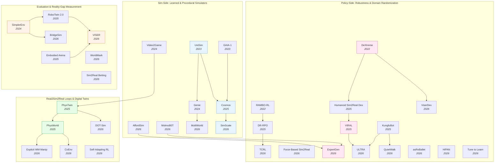

# Sim-to-Real Transfer — Deep Dive

> [!abstract] Overview
> Simulation is the only economically viable substrate for training data-hungry embodied policies — but simulators are wrong about *something*: lighting, friction, contact transients, actuator dynamics, or the long-tail of object appearance. The "reality gap" is the operational cost of those errors when the policy meets the real world. This note maps the four parallel research threads that have evolved to close it: building **better simulators** ([[2310.06114|UniSim]], [[2501.03575|Cosmos]], [[2402.15391|Genie]], [[2604.18564|MultiWorld]]) that hallucinate richer worlds; designing **more robust policies** ([[2510.14246|DR-RPO]], [[2204.12581|RAMBO-RL]], [[2210.13702|DeXtreme]], [[2603.15956|ExpertGen]]) that absorb sim noise; closing **real→sim→real loops** ([[2503.17973|PhysTwin]], [[2511.07416|PhysWorld]], [[2404.09833|Video2Game]]) that rebuild the deployment scene as a digital twin; and constructing **reality-gap diagnostics** ([[2405.05941|SimplerEnv]], [[2605.06311|VISER]], [[2604.24018|Sim2Real Betting]]) that let you measure how far you still are from real-world success.

## Evolution Graph

The field evolved through four parallel research threads. **Sim-side** (2023→2026) replaces hand-crafted simulators with *learned* world simulators that absorb internet-scale video — [[2310.06114|UniSim]] → [[2501.03575|Cosmos]] → [[2511.23369|SimScale]] push photorealistic, action-conditioned generation. **Policy-side** (2022→2026) trains the *policy* to be sim-noise-invariant — [[2210.13702|DeXtreme]]'s automatic domain randomization, [[2506.12851|KungfuBot]]'s physics-feasible motion retargeting, and [[2510.14246|DR-RPO]]'s distributionally robust policy optimization treat the reality gap as adversarial. **Real2sim2real** (2024→2026) reconstructs the *deployment* scene as a high-fidelity digital twin ([[2503.17973|PhysTwin]], [[2404.09833|Video2Game]], [[2511.07416|PhysWorld]]), then trains the policy against the twin before transfer. **Evaluation** (2024→2026) builds diagnostic benchmarks ([[2405.05941|SimplerEnv]], [[2605.06311|VISER]]) that *measure* the sim-to-real correlation — making the reality gap quantifiable rather than mythical.

| Year | Paper | Track | Contribution |
|------|-------|-------|--------------|
| 2022 | [[2204.12581\|RAMBO-RL]] | Policy-side | Adversarial dynamics model for robust offline RL; reality gap as zero-sum game |
| 2022 | [[2210.13702\|DeXtreme]] | Policy-side | Vectorized Automatic Domain Randomization on Allegro Hand; 27.8 mean reorientations |
| 2023 | [[2309.17080\|GAIA-1]] | Sim-side | Generative world model for autonomous driving; 40s+ photoreal rollouts |
| 2023 | [[2310.06114\|UniSim]] | Sim-side | Learned interactive real-world simulator from heterogeneous video |
| 2024 | [[2402.15391\|Genie]] | Sim-side | Latent-action interactive environments from unlabeled internet video |
| 2024 | [[2404.09833\|Video2Game]] | Real2sim2real | Single-video → browser-compatible interactive 3D environment with physics |
| 2024 | [[2405.05941\|SimplerEnv]] | Evaluation | r>0.85 sim-to-real correlation via system-id + green screening |
| 2025 | [[2501.03575\|Cosmos]] | Sim-side | NVIDIA World Foundation Model platform; 100M curated clips; physical-AI digital twins |
| 2025 | [[2502.20396\|Humanoid Sim2Real Dex]] | Policy-side | Autotuned modeling + hybrid object reps; 80% box-lift on GR-1 humanoid |
| 2025 | [[2503.17973\|PhysTwin]] | Real2sim2real | Physics-informed deformable digital twin from video; real-time interactive sim |
| 2025 | [[2504.03597\|Real-is-Sim]] | Real2sim2real | Embodied-Gaussians digital twin as policy's *sole* interface; real robot mirrors sim |
| 2025 | [[2506.12851\|KungfuBot]] | Policy-side | Physics-based motion processing; zero-shot transfer of martial arts on G1 |
| 2025 | [[2506.18088\|RoboTwin 2.0]] | Evaluation | Domain-randomized data generator; +24.4% real-world few-shot |
| 2025 | [[2509.15273\|Embodied Arena]] | Evaluation | 22+ benchmarks unified; capability taxonomy |
| 2025 | [[2510.14246\|DR-RPO]] | Policy-side | Distributionally robust regularized policy optimization with linear FA |
| 2025 | [[2511.04665\|Real-to-Sim GS]] | Evaluation | 3DGS + soft-body [[2503.17973\|PhysTwin]] for deformable-policy evaluation; **r > 0.9** sim-real correlation |
| 2025 | [[2511.07416\|PhysWorld]] | Real2sim2real | Robot learning from physical world model; 82% real success across 10 tasks |
| 2025 | [[2511.15200\|VIRAL]] | Policy-side | Visual sim-to-real at scale for humanoid loco-manipulation; 54/59 on Unitree G1 |
| 2026 | [[2511.23369\|SimScale]] | Sim-side | 3DGS sim data engine + sim-real co-training; +20% weak-baseline gains |
| 2026 | [[2602.23253\|SPARR]] | Policy-side | Sim-trained base + vision-conditioned real residual; 95-100% AutoMate assembly without human supervision |
| 2026 | [[2601.02778\|Force-Based Sim2Real]] | Policy-side | Tactile distance-field sim + actuator calibration for force-aware grasping |
| 2026 | [[2602.13040\|TCRL]] | Policy-side | Temporal-coupled adversarial training for constrained RL; up to 19,077% cost reduction |
| 2026 | [[2603.04029\|Self-Adapting RL]] | Real2sim2real | [[2301.04104\|DreamerV3]] world-model feedback for online sim-to-real adaptation |
| 2026 | [[2603.15956\|ExpertGen]] | Policy-side | Generative prior + DSRL + visuomotor distillation; 90.5% AutoMate assembly |
| 2026 | [[2603.16861\|MolmoBot]] | Sim-side | 232K-environment procedural [MuJoCo](https://mujoco.org); 79.2% real [Franka FR3](https://franka.de) — no real-world data |
| 2026 | [[2604.10856\|BridgeSim]] | Evaluation | Decomposes OL-CL gap; observational shift + objective mismatch; +19.1 DS via TTA |
| 2026 | [[2604.11138\|ViserDex]] | Policy-side | 3DGS pre-rasterization augmentation + monocular RGB; 37.6 reorientations |
| 2026 | [[2604.11674\|AffordSim]] | Sim-side | Affordance-aware data generator + 3DGS backgrounds for sim-to-real |
| 2026 | [[2604.18564\|MultiWorld]] | Sim-side | Multi-agent multi-view video world models; agent-identity + global state encoder |
| 2026 | [[2604.21686\|WorldMark]] | Evaluation | Unified benchmark suite for interactive video WMs; ρ>0.9 with human |
| 2026 | [[2604.24018\|Sim2Real Betting]] | Evaluation | Sequential-betting estimator; 70-100% win rate vs Monte Carlo |
| 2026 | [[2604.24916\|asRoBallet]] | Policy-side | Friction-aware [MuJoCo](https://mujoco.org) + RL; zero-shot ballbot whole-body locomotion |
| 2026 | [[2604.27367\|DOT-Sim]] | Real2sim2real | Differentiable MPM + residual rendering; 90.5% indenter, 96.6% tumor detection |
| 2026 | [[2604.23702\|QuietWalk]] | Policy-side | PINN GRF predictor + curriculum; 7.17 dBA noise reduction across footwear |
| 2026 | [[2605.06311\|VISER]] | Evaluation | Ray-traced PBR + MLLM asset pipeline; r=0.92 Pearson sim-real correlation |

---

## Part A — Foundations

*Design-space principles: three axes (sim quality / adaptation locus / evaluation grounding) that classify every sim-real strategy.*

### 1. Design-Space Principles

Three orthogonal axes determine every sim-to-real strategy. Choose your point on each axis — *what* you simulate, *where* the adaptation happens, and *how* you measure success — and the rest of the design is forced. Most papers in §2–§5 are interpretable as points in this 3-D space; the trade-offs are not soluble individually because each axis has a cost on the others.

> [!success] The Three Axes
> - **Sim quality**: hand-crafted MPM/[PhysX](https://developer.nvidia.com/physx-sdk) (precise, narrow) vs. learned video simulator (broad, blurry) vs. real2sim digital twin (precise + deployable)
> - **Adaptation locus**: in the simulator (domain randomization, system-id) vs. in the policy (robust RL, distillation) vs. at deployment (TTA, online adaptation)
> - **Evaluation grounding**: sim-only proxy metrics vs. sim-real correlation (Pearson r, MMRV) vs. real-only ground truth

#### 1.1 Axis 1 — Sim Quality

How accurate or rich is the simulator itself? Four families, ordered from narrowest-precise to broadest-blurry to deployment-specific.

| Approach | Mechanism | Example |
|----------|-----------|---------|
| **Hand-crafted physics** | [PhysX](https://developer.nvidia.com/physx-sdk) / [MuJoCo](https://mujoco.org) / [[2511.04831\|Isaac Lab]] with explicit constitutive laws | [[2210.13702\|DeXtreme]], [[2603.16861\|MolmoBot]] |
| **Learned video simulator** | Diffusion-based video model conditioned on actions | [[2310.06114\|UniSim]], [[2501.03575\|Cosmos]], [[2402.15391\|Genie]] |
| **Hybrid (sim + neural rendering)** | Physics sim + 3DGS / NeRF-rendered visuals | [[2604.11138\|ViserDex]], [[2604.11674\|AffordSim]] |
| **Digital twin from video** | Reconstruct deployment scene as interactable sim | [[2503.17973\|PhysTwin]], [[2404.09833\|Video2Game]], [[2511.07416\|PhysWorld]] |

#### 1.2 Axis 2 — Adaptation Locus

*Where* in the pipeline does the system absorb the sim-real gap? Trade compute against deployment latency against generalization breadth.

| Where adaptation happens | Cost | Generalization |
|--------------------------|------|----------------|
| **In simulator** (domain randomization) | High training compute | Broad — covers the *imagined* range |
| **In policy** (robust RL, distillation) | High RL stability cost | Tight — robust to the *trained* perturbations |
| **At deployment** (TTA, world-model online adaptation) | Latency at deployment | Adaptive — handles new distribution shifts |

#### 1.3 Axis 3 — Evaluation Grounding

How do you *know* your sim-to-real strategy works before you ship? The metric you pick determines what you can claim.

| Metric | What it measures | Failure mode |
|--------|------------------|--------------|
| **Sim-only proxy** (success rate in sim) | Cheap, fast | Fails to predict real (see [[2604.10856\|BridgeSim]] OL-CL gap) |
| **Sim-real correlation** (Pearson r) | Sim's predictive value | Fragile to OOD perturbations |
| **MMRV / Kelly betting** (rank reliability) | Whether sim ranks policies correctly | Requires bank of diverse sims |
| **Real-only ground truth** | Authoritative | Expensive, slow, unsafe |

**[Design-Space — Decision Matrix]**

| Need | Recommendation |
|------|---------------|
| Scale to internet-video data | Learned sim: [[2310.06114\|UniSim]] / [[2501.03575\|Cosmos]] / [[2402.15391\|Genie]] |
| Physical accuracy on contact | Hand-crafted physics ([MuJoCo](https://mujoco.org) / [[2511.04831\|Isaac Lab]]) + DR ([[2210.13702\|DeXtreme]]) |
| Fast deployment-specific transfer | Digital twin: [[2503.17973\|PhysTwin]] / [[2511.07416\|PhysWorld]] / [[2504.03597\|Real-is-Sim]] |
| Cheap visual diversity + physical contact | Hybrid 3DGS + physics: [[2604.11138\|ViserDex]] / [[2511.23369\|SimScale]] / [[2604.11674\|AffordSim]] |
| Publishable rigor on sim claims | Pair with correlation benchmark: [[2405.05941\|SimplerEnv]] (r > 0.85) or [[2605.06311\|VISER]] (r = 0.92) |
| Long-deployment continual shift | Adaptation-at-deployment: [[2603.04029\|Self-Adapting RL]] with [[2301.04104\|DreamerV3]] feedback |
| Combine many imperfect sims | Statistical estimator: [[2604.24018\|Sim2Real Betting]] (Kelly portfolio) |

> [!star] Key Papers — Design-Space Exemplars
> - [[2310.06114|UniSim]] — Pure Axis-1 learned-sim exemplar; **3-4×** zero-shot policy gain via ==conditional video generation== with a **5.6B**-parameter diffusion model
> - [[2210.13702|DeXtreme]] — Pure Axis-2 in-simulator-adaptation exemplar; ==Vectorized Automatic Domain Randomization== doubles transfer (**27.8** vs **14.8** reorientations on Allegro Hand)
> - [[2405.05941|SimplerEnv]] — Pure Axis-3 evaluation exemplar; first reliable correlation benchmark (**r > 0.85**) with ==MMRV== rank metric
> - [[2511.07416|PhysWorld]] — All-three-axes integrated; digital twin (Axis 1) + residual RL (Axis 2) + 10-task real-world ground truth (Axis 3), **82%** average success
> - [[2604.24018|Sim2Real Betting]] — Reframes Axis 3 as variance reduction; **70-100%** win rate vs Monte Carlo using a ==Kelly portfolio== of biased simulators

> [!tip] Pick by Constraint
> If you need to **scale to internet video data**, pick learned sim ([[2310.06114|UniSim]]/[[2501.03575|Cosmos]]). If you need **physical accuracy on contact**, pick hand-crafted physics ([MuJoCo](https://mujoco.org) + DR). If you need **fast deployment-specific transfer**, pick a digital twin ([[2503.17973|PhysTwin]]/[[2511.07416|PhysWorld]]). If you need **publishable rigor**, pair any of these with a correlation benchmark ([[2405.05941|SimplerEnv]]/[[2605.06311|VISER]]). The three axes are *not* independent in practice — better sim quality (Axis 1) reduces the burden on policy-side robustness (Axis 2), and tighter correlation benchmarks (Axis 3) force investment in both. See [[04_WAM#2. VideoGen WAMs]] for the WAM-as-simulator perspective on Axis 1, and [[07_Physics-Aware-Embodied-AI#4. External Simulator Coupling]] for the digital-twin coupling that bridges Axes 1 and 2.

---

## Part B — Closing the Gap

*Three complementary attack surfaces: sim-side (better simulators), policy-side (robustness), and real2sim2real (digital twins).*

### 2. Sim-Side: Learned & Procedural Simulators

The first sim-to-real strategy is to make the simulator richer than reality — through learned video generation, procedural environment scale, or photorealistic rendering. The trade-off: learned simulators handle visual diversity well but blur on physical contact; hand-crafted simulators handle contact well but require enormous procedural-asset effort to cover the visual long tail.

#### 2.1 Generative Video World Simulators

Learn the simulator from internet-scale video; the model itself becomes the simulator. A complementary hand-crafted-but-LLM-driven track ([[2601.02078|Genie Sim 3.0]]) converges on the same goal — cheap, scalable, photorealistic, evaluable — from the opposite direction.

- **[[2604.18564|MultiWorld]]** — Multi-agent multi-view video world model with ==action-conditioned diffusion== + ==Flow Matching==; ==Agent Identity Embedding== (RoPE) + ==Adaptive Action Weighting== + ==Global State Encoder== over pretrained ==VGGT==; **FVD 179** vs baselines' 207–245, **RPE 0.67** vs 0.72–0.75.
- **[[2511.23369|SimScale]]** — Bridges sim-real visual gap for autonomous driving via ==3D Gaussian Splatting== reconstruction; ==pseudo-expert pipeline== couples reactive ==Intelligent Driver Model== agents with ==LQR== ego + trajectory perturbation; weak baselines (LTF, DiffusionDrive) see **>20%** relative gains under sim-real co-training; **EPDMS 48.0** on navhard.
- **[[2501.03575|Cosmos]]** — NVIDIA's open-source ==World Foundation Model Platform==; **20M hr** raw video → **100M** curated clips; pre-trained diffusion + autoregressive ==WFMs== fine-tuned for navigation/manipulation/driving; Tokenizer suite +**4 dB** PSNR, **2-12×** faster inference; repositions WFMs as foundation-model category analogous to LLMs.
- **[[2402.15391|Genie]]** — ==Latent-action interactive environments== from unlabeled internet video via ==Video Tokenizer + Latent Action Model (LAM) + Dynamics Model==; ==ST-transformer== separates spatial/temporal attention for linear-in-frames scaling. Learns discrete latent action codes in an unsupervised way and supports frame-by-frame text/image/sketch-prompted control; foundational unsupervised-action-discovery learned simulator.
- **[[2310.06114|UniSim]]** — ==Conditional video generation== via ==5.6B-parameter video diffusion==; orchestrates heterogeneous data (robotics, human activity, panoramas, internet video) into ==unified action space== (high-level lang + low-level control → ==T5 embeddings== + normalized values); zero-shot sim-to-real on physical robots, **3-4×** better goal reduction for VLMs vs baselines.
- **[[2309.17080|GAIA-1]]** — Two-stage ==autoregressive world model + video diffusion decoder== framing world modeling as ==next-token prediction== over a common token space (video + text + actions); generates **40s+** photorealistic action-conditioned rollouts with fine-grained multimodal conditioning, demonstrating LLM-style scaling for driving WMs and an early proof that learned simulators could model long-horizon driving dynamics.
- **[[2601.02078|Genie Sim 3.0]]** — Hand-crafted-but-LLM-driven humanoid simulation platform (orthogonal route to learned-from-video); ==Genie Sim Generator== composes scenes from natural-language instructions over a managed asset repository; LLM-VLM auto-evaluation; ==3D Gaussian Splatting== environment reconstruction; **10,000+ hr** synthetic data, **100,000+** eval scenarios, **R²=0.94** sim-to-real correlation; **1,500 episodes** synthetic beats real-data baselines on zero-shot manipulation.

#### 2.2 Procedural Environment Generation

Hand-crafted physics + massive procedural scale; no learned visual model.

- **[[2603.16861|MolmoBot]]** — ==MolmoBot-Engine== procedural data generation in ==[MuJoCo](https://mujoco.org)==; **232K** indoor environments, **48K** manipulable objects, **1.8M** expert trajectories; extensive ==domain randomization== over visual + physical params + diverse referring expressions enables zero-shot sim-to-real *without real-world fine-tuning or photoreal rendering*; **79.2%** real [Franka FR3](https://franka.de) tabletop pick-and-place — beats π0.5-DROID (**39.2%**) which was trained on real data; absolute joint-position actions transferred better than delta-action despite similar sim perf.
- **[[2604.11674|AffordSim]]** — Integrates ==VoxAfford== per-point open-vocabulary 3D affordance detection into sim data generation; ==3DGS-rendered photorealistic backgrounds== as DR lift average real-world success **17% → 27%**; simple grasping reaches **60%** zero-shot but pouring/hanging stays at **10-20%** — canonical evidence that fine-grained semantic affordance is the DR ceiling.

**[Sim-Side — Decision Matrix]**

| Need | Recommendation |
|---|---|
| Scale to internet-video diversity, blur-tolerant on contact | [[2501.03575\|Cosmos]] or [[2310.06114\|UniSim]] — learned video-WFMs; **100M** clips / **3-4×** zero-shot gain |
| Multi-agent multi-view interactive simulator | [[2604.18564\|MultiWorld]] — action-conditioned diffusion + Flow Matching; **FVD 179**, **RPE 0.67** |
| Sim-real visual gap closure for autonomous driving | [[2511.23369\|SimScale]] — 3DGS reconstruction + sim-real co-training; **EPDMS 48.0** on navhard |
| Latent-action interactive environments from unlabeled web video | [[2402.15391\|Genie]] — unsupervised action discovery; foundational learned-sim |
| Long-horizon photorealistic driving rollouts | [[2309.17080\|GAIA-1]] — generative WM; 40s+ action-conditioned rollouts |
| LLM-driven scene composition + auto-evaluation for humanoid | [[2601.02078\|Genie Sim 3.0]] — **R²=0.94** sim-to-real correlation, **10K+ hr** synthetic |
| Procedural physics scale, no learned visual model, real-data-free | [[2603.16861\|MolmoBot]] — **232K** environments + [MuJoCo](https://mujoco.org); **79.2%** real Franka beats π0.5-DROID |
| Affordance-aware procedural sim for grasp/pour/hang | [[2604.11674\|AffordSim]] — VoxAfford + 3DGS DR; **+10pp** average, exposes the semantic-DR ceiling |
| Hybrid 3DGS-augmented physics (visual + contact accuracy) | [[2511.23369\|SimScale]] / [[2604.11674\|AffordSim]] / [[2604.11138\|ViserDex]] — the emerging sweet spot |

> [!star] Key Papers
> - [[2310.06114|UniSim]] — Learned interactive real-world simulator; **3-4x** better zero-shot policy transfer than baselines; foundational learned-sim paper
> - [[2501.03575|Cosmos]] — NVIDIA WFM platform: **100M** curated clips, **+4 dB** PSNR tokenizer, **10 FPS** real-time autoregressive generation; defines the WFM category
> - [[2603.16861|MolmoBot]] — **79.2%** real [Franka FR3](https://franka.de) success trained *exclusively* on procedural [MuJoCo](https://mujoco.org) data; proves sim-only can outperform real-data baselines (π0.5-DROID **39.2%**)
> - [[2511.23369|SimScale]] — 3DGS sim-real co-training for autonomous driving; weak baselines see **>20%** relative gains; new **EPDMS 48.0** on navhard

> [!tip] Sim-Side Trade-Off
> Learned video simulators ([[2310.06114|UniSim]], [[2501.03575|Cosmos]]) scale to internet video and capture visual diversity but blur on contact dynamics. Procedural physics simulators ([[2603.16861|MolmoBot]]) handle contact accurately but require massive procedural-asset effort to cover the visual long tail. Hybrid 3DGS-augmented physics ([[2511.23369|SimScale]], [[2604.11674|AffordSim]], [[2604.11138|ViserDex]]) is the emerging sweet spot.

---

### 3. Policy-Side: Robustness & Domain Randomization

Instead of making the simulator perfect, make the *policy* invariant to sim imperfections. This is the dominant industrial-scale recipe — domain randomization remains the de-facto sim-to-real method in 2026.

#### 3.1 Domain Randomization Foundations

The canonical industrial recipe: train in sim with extensive randomization, then either distill to vision or layer a real-world residual on top.

- **[[2210.13702|DeXtreme]]** — ==[[1707.06347|PPO]]== in ==[Isaac Gym](https://developer.nvidia.com/isaac-gym)== on Allegro Hand; the foundational ==Vectorized Automatic Domain Randomization== (VADR) dynamically adjusts sim params based on policy capability; **27.8** mean real reorientations vs **14.8** hand-tuned DR — auto-DR nearly doubles transfer; Mask-RCNN vision-based pose estimator on synthetic [Isaac Sim](https://developer.nvidia.com/isaac-sim) images at **15 Hz** under occlusion.
- **[[2603.15956|ExpertGen]]** — Three-phase scalable sim-to-real from *imperfect* behavior priors: (1) generative ==diffusion policy== prior on rough demos; (2) ==Diffusion Steering RL (DSRL)== optimizes only the diffusion's initial noise (preserves motion manifold, max sparse rewards via FastTD3); (3) ==DAgger== visuomotor distillation with visual DR; **90.5%** avg on 8 AutoMate assembly tasks, **80%** real [Franka](https://franka.de) Lift Banana from RGB.
- **[[2502.20396|Humanoid Sim2Real Dex]]** — Full vision-based dexterous recipe on Fourier GR-1; ==autotuned robot modeling== bridges dynamics gap from minimal real calibration; ==contact stickers== + ==stage-based rewards== structure bimanual rewards; ==task-aware hand pose init== + ==divide-and-conquer distillation== scale to generalist policies; **80%** box-lift, **62.3%** grasp-and-reach, **52.5%** bimanual handover with **60-80%** zero-shot unseen-object generalization.
- **[[2506.13751|LeVERB]]** — Vision-language-action whole-body humanoid recipe with zero-shot sim-to-real on Unitree G1; learned latent "verb" vector bridges high-level VLA (LeVERB-VL, 10 Hz, ==residual CVAE== aligning vision+language) and low-level reactive controller (LeVERB-A, 50 Hz, distilled from privileged teachers via ==DAgger== sampling the verb distribution); LeVERB-Bench produces photorealistic+dynamically accurate synthetic VL whole-body data from human MoCap; **58.5%** mean success across 10 task categories (**7.8×** over naive hierarchical VLA's 7.5%); the lesson: align a *latent intermediate*, not *actions*, across the policy-frequency gap.
- **[[2602.23253|SPARR]]** — Sister recipe to [[2603.15956|ExpertGen]] for industrial assembly; sim base via ==PPO + dense imitation rewards== under DR; the key contribution is a **real-world residual** — base policy deployed with Gaussian-noise injection to autonomously generate demos, then a ==vision-conditioned residual== learned via ==RLPD== with dynamic demo buffer, *no human supervision*; **95-100%** on 10 AutoMate tasks (**+38.4%** over AutoMate, matching human-supervised [[2410.21845|HIL-SERL]]); **+74.5%** on unseen NIST; robust to ±mm pose noise; finding — vision is what makes the residual correct rotational/positional errors the state-based base cannot see.

#### 3.2 Robust RL Foundations

Treat the sim-real gap as adversarial; train against the worst-case dynamics.

- **[[2204.12581|RAMBO-RL]]** — Formulates offline RL as a ==two-player zero-sum game== — agent maximizes value, adversarial environment model minimizes it by modifying transitions; ==ensemble of neural networks== represents dynamics, updated adversarially via ==Model Gradient== while constrained to stay accurate on observed data; alternating optimization with off-policy actor-critic achieves highest total D4RL [MuJoCo](https://mujoco.org) locomotion score; insight — adversarial training of the *dynamics model itself* introduces conservatism without explicit uncertainty estimation.
- **[[2510.14246|DR-RPO]]** — First provably efficient *online* policy optimization for robust MDPs with ==linear function approximation==; defines policy-regularized d-rectangular ==DRMDPs== / ==RRMDPs== with ==KL-divergence== term to a reference policy; model-free algorithm uses ==softmax-based policy updates==, ridge linear regression for robust Q-functions, ==UCB== optimism bonuses; achieves ==Õ(d²H²/√K)== average suboptimality — matches value-based robust methods while supporting *stochastic* policies and scaling to continuous actions.
- **[[2602.13040|TCRL]]** — Defends *constrained* RL against ==temporal-coupled adversarial perturbations== (cumulative attacks evolving over time); ==worst-case-perceived cost constraint== implicitly estimates safety costs under temporally coupled attacks without explicit adversarial-policy modeling; ==dual-constraint defense== with autocorrelation + entropy stability constraints mitigates reward degradation; **559-19,077%** safety-cost reduction, **8.36-34.76%** reward improvement vs baselines under worst-case attacks.

#### 3.3 Physics-Informed Policy Robustness

Bake physics priors *into* the policy via curriculum, reward shaping, or motion processing.

- **[[2605.10063|EFGCL]]** — Tackles high-risk dynamic-motion learning (backflips, lateral flips, jumps) for legged robots via ==spotting-inspired external forces== modeled on a gymnastics spotter; transient forces help complete motion during early training; ==adaptive curriculum== decays assistance based on success rate; with PPO + teacher-student sim-to-real, acquires motions (backflip, lateral flip) that PPO baselines *cannot learn at all*; accelerates jumping **~2×**, zero-shot transfer to real KLEIYN quadruped; robustness to heuristic choice of force point/magnitude/timing makes it deployable without per-skill tuning.
- **[[2604.24916|asRoBallet]]** — Reconfigurable humanoid ballbot via ==subtractive reconfiguration== of an open-source quadruped; critical sim-to-real ingredient is ==friction-aware [MuJoCo](https://mujoco.org)== explicitly modeling ==tribological phenomena== (rolling, lateral, torsional friction, discrete omni-roller mechanics) + actuator friction; with DR, achieves **zero-shot sim-to-real**, **100%** velocity-tracking success in sim, **0.05 m/s** real-world MAE; recovers from pushes up to **0.3 m**.
- **[[2604.23702|QuietWalk]]** — Physics-informed RL for low-noise humanoid locomotion under diverse footwear; ==inverse-dynamics-constrained PINN== estimates per-foot vertical GRFs from proprioception alone (no force sensors); frozen physics-consistent GRF predictor integrated *into the RL reward* to penalize impact forces; with footwear-asset parameterization + curriculum, achieves **7.17 dBA** mean-noise reduction across 4 indoor surfaces, generalizes across **4** footwear types (barefoot → high heels) + outdoor terrains; PINN reduces GRF errors **82-86%** vs supervised baselines — physical consistency is what enables sim-to-real transfer of the *reward signal*.
- **[[2506.12851|KungfuBot]]** — Closes reality gap for *highly-dynamic* humanoid skills (martial arts, dancing); ==physics-based motion processing pipeline== filters untrackable mocap and corrects contact (only feasible references enter training); ==adaptive motion tracking== dynamically adjusts reward's tracking factor during RL; with ==asymmetric actor-critic==, ==reward vectorization==, ==reference state initialization==, extensive DR, achieves zero-shot sim-to-real on Unitree G1 — global mean per-body-position error **53.25 mm** on easy motions vs **>233 mm** for OmniH2O/ExBody2.

#### 3.4 Vision-Aware Sim-to-Real

Close the *visual* gap explicitly via neural rendering, teacher-student distillation, or controller-aware system-id.

- **[[2511.15200|VIRAL]]** — Visual sim-to-real at scale for humanoid loco-manipulation; ==two-phase teacher-student== — privileged RL teacher (16 GPUs) → vision-based student via DAgger + behavior cloning (up to **64 GPUs** with ==tiled rendering==); extensive ==camera alignment==, ==system identification== for dexterous hands, visual+sim DR; **54/59** continuous loco-manipulation cycles on real Unitree G1, matching expert teleop (**20.2** vs **21.4 s** cycle); ==Reference State Initialization== from teleop is critical — removing it drops success **95% → <10%**; lesson — compute scale + RSI + delta-action space + extensive DR are *all* required.
- **[[2604.11138|ViserDex]]** — Closes visual sim-to-real gap for monocular RGB-only dexterous in-hand reorientation; integrates ==3D Gaussian Splatting== rendering *directly into the simulation loop*; novel ingredient is ==pre-rasterization augmentation== — structured DR applied to 3DGS attributes (spherical harmonic coefficients) simulating diverse lighting + materials within a static Gaussian; **37.6** consecutive reorientations on real Allegro Hand under nominal lighting, **~25** under adversarial; trains on a single consumer GPU in **26-90 hr**, **1.6×** faster than tiled rendering.
- **[[2604.02523|Tune to Learn]]** — Systematic study of how *controller gains* shape sim-to-real; counterintuitive finding — ==stiff gains== yield *lowest* system-id errors but *worst* sim-to-real transfer (stiff control amplifies modeling errors into oscillations); for BC, ==compliant overdamped gains== (low Kₚ, high K_d) give significantly higher closed-loop success despite higher training loss; for RL, any gain regime works given task-specific tuning; lesson — traditional sim-fidelity metrics (low sysid error) do *not* correlate with successful policy transfer.
- **[[2601.02778|Force-Based Sim2Real]]** — Holistic recipe for zero-shot force-aware dexterous manipulation on real 5-finger hand; ==asymmetric actor-critic PPO== in ==IsaacLab==; two ingredients: (1) ==computationally efficient distance-field-based tactile simulation== abstracts raw tactile into compact force + contact-position features (avoids slow soft-body physics); (2) ==one-time current-to-torque calibration== aligns real motor signals with sim joint torques + ==randomized actuator model== for backlash/saturation; in-hand rotation policies achieve **25.1** avg consecutive rotations *with* tactile vs **1.1** *without* — contact sensing is dispositive.

#### 3.5 Hierarchical & Generalist Sim-to-Real

Decouple high-level goal selection from low-level control, then sim-to-real the depth-conditioned student.

- **[[2604.26504|HiPAN]]** — Hierarchical RL for quadruped navigation in unstructured 3D environments via teacher-student + extensive DR; ==Path-Guided Curriculum Learning== overcomes myopia in long-horizon goal-directed motion; **94.7%** success on Complex-2 sim, validates on Unitree Go1 in cluttered indoor / dead-end / outdoor scenarios using only onboard depth — sim-to-real from a depth-only teacher is feasible *because* the student observes the same modality as the deployment robot.
- **[[2603.03279|ULTRA]]** — ==Physics-driven neural retargeting== translates MoCap into contact-aware humanoid demos; single ==multimodal controller== with ==transformer encoder== + ==availability masking== handles dense motion references and sparse goal following; ==teacher-student distillation== + RL fine-tuning lifts OOD-goal success up to **200%** for position-only observations; **73%** dense-tracking, **50-90%** sparse-following success on real Unitree G1.
- **[[2502.12152|HUMANUP]]** — ==Two-stage RL curriculum== for humanoid fall recovery: Stage I Discovery Policy on simplified sim, Stage II Deployable Policy on full ==URDF== with **20,000** initial postures + diverse-terrain DR + strong control regularization; Unitree G1 recovers from supine at **78.3%** SR / rolls over at **98.3%** across **6 terrains** (concrete, mud, snow) in **~6s** (vs **11s** manufacturer); demonstrates that *separating motion discovery from deployable refinement* is critical — single-stage training failed to converge.

**[Policy-Side — Decision Matrix]**

| Need | Recommendation |
|---|---|
| Industrial-default dexterous reorientation (DR baseline) | [[2210.13702\|DeXtreme]] — VADR doubles real-world transfer (**27.8** vs **14.8**) |
| Train from imperfect demo priors at industrial assembly scale | [[2603.15956\|ExpertGen]] — diffusion prior + DSRL + DAgger; **90.5%** avg AutoMate |
| Real-world residual learning without human supervision | [[2602.23253\|SPARR]] — Pattern A+C hybrid; **95-100%** AutoMate, **+74.5%** unseen NIST |
| Full-stack dexterous humanoid recipe (Fourier GR-1) | [[2502.20396\|Humanoid Sim2Real Dex]] — autotuned modeling + contact stickers; **80%** box-lift |
| Whole-body humanoid VLA with latent-intermediate alignment | [[2506.13751\|LeVERB]] — CVAE verb-vector bridges 10Hz VLA ↔ 50Hz controller; **58.5%** mean SR |
| Adversarial robust offline RL against worst-case dynamics | [[2204.12581\|RAMBO-RL]] — two-player zero-sum dynamics ensemble; top D4RL [MuJoCo](https://mujoco.org) score |
| Provably efficient online robust RL with linear function approx | [[2510.14246\|DR-RPO]] — softmax policy + KL-regularized DRMDP; **Õ(d²H²/√K)** suboptimality |
| Defend constrained RL against temporally-coupled attacks | [[2602.13040\|TCRL]] — dual-constraint defense; **559-19,077%** safety-cost reduction |
| Learn previously-unlearnable dynamic skills (flips, jumps) | [[2605.10063\|EFGCL]] — spotting-inspired external forces + adaptive curriculum |
| Bridge underactuated dynamics with friction-aware physics | [[2604.24916\|asRoBallet]] — friction-aware [MuJoCo](https://mujoco.org) + DR; zero-shot ballbot, **0.05 m/s** MAE |
| Low-noise humanoid locomotion across diverse footwear | [[2604.23702\|QuietWalk]] — PINN GRF predictor in reward; **7.17 dBA** noise reduction |
| Highly-dynamic humanoid skills (martial arts, dance) | [[2506.12851\|KungfuBot]] — physics-feasible motion processing + adaptive tracking; **53.25 mm** error |
| Visual sim-to-real at scale for loco-manipulation | [[2511.15200\|VIRAL]] — two-phase teacher-student + 64-GPU tiled rendering; **54/59** real G1 |
| Visual sim-to-real on a single consumer GPU | [[2604.11138\|ViserDex]] — 3DGS in the sim loop + pre-rasterization aug; **37.6** reorientations |
| Question whether stiff/compliant gains improve transfer | [[2604.02523\|Tune to Learn]] — compliant overdamped gains beat stiff for BC; sysid ≠ transfer |
| Zero-shot force-aware dexterous in-hand rotation | [[2601.02778\|Force-Based Sim2Real]] — distance-field tactile + current-to-torque cal; **25.1** rotations w/ tactile |
| Quadruped navigation in unstructured 3D from depth-only | [[2604.26504\|HiPAN]] — hierarchical RL + path-guided curriculum; **94.7%** Complex-2 |
| MoCap-to-humanoid retargeting with sparse/dense goal support | [[2603.03279\|ULTRA]] — multimodal controller + availability masking; **73%** dense-tracking G1 |

> [!star] Key Papers
> - [[2210.13702|DeXtreme]] — Foundational VADR result: automatic DR doubles real-world transfer (**27.8** vs **14.8** reorientations); the canonical industrial sim-to-real recipe
> - [[2511.15200|VIRAL]] — Visual sim-to-real at scale for humanoid loco-manipulation; **54/59** real Unitree G1 success matching expert human teleop; RSI is critical
> - [[2506.12851|KungfuBot]] — Physics-feasible motion processing + adaptive tracking; **53.25 mm** error vs **>233 mm** baselines; first to zero-shot transfer highly-dynamic skills
> - [[2604.24916|asRoBallet]] — Friction-aware [MuJoCo](https://mujoco.org) + RL closes sim2real gap for underactuated dynamics; **zero-shot** ballbot whole-body control with **0.05 m/s** real-world MAE

> [!tip] Domain Randomization is the Default — But Has Limits
> Every paper in this section uses DR, but [[2604.11674|AffordSim]] showed DR alone only lifts real-world success from **17%** to **27%** on affordance-demanding tasks — fine-grained semantic transfer still fails. DR works for *dynamics* gaps ([[2210.13702|DeXtreme]], [[2506.12851|KungfuBot]]) but is *brittle* for *semantic* gaps (manipulating novel categories). Combine DR with neural rendering ([[2604.11138|ViserDex]]) or learned simulators ([[2310.06114|UniSim]]) when the visual gap dominates.

> [!success] The Modern Policy-Side Recipe
> ==Auto domain randomization== + ==teacher-student distillation== + ==reference state initialization== + ==system identification== + ==privileged-info asymmetric actor-critic== — proven across [[2210.13702|DeXtreme]], [[2511.15200|VIRAL]], [[2506.12851|KungfuBot]], and [[2603.15956|ExpertGen]]. Pick a subset based on which gap (dynamics, visual, kinematic) dominates your deployment.

---

### 4. Real2Sim2Real Loops & Digital Twins

Reverse the direction: reconstruct the *deployment* scene as a high-fidelity interactive simulator, train the policy *against the twin*, then execute on the real robot. Eliminates the visual long tail because the simulator is *grounded* in the deployment environment from the start.

#### 4.1 Video → Interactable Sim

Reconstruct the *deployment* scene as a simulatable twin from one or a few real videos.

- **[[2511.07416|PhysWorld]]** — ==Task-conditioned video generation== → ==geometry-aligned 4D reconstruction== → physical digital twin with material-property estimation → ==object-centric residual RL== inside the twin; **82%** avg success across **10** real-world manipulation tasks, **+15 pp** over RIGVid; reduces grasping failures **18% → 3%** and eliminates tracking failures entirely; insight — video generation alone produces physically infeasible motions; the explicit physical world model is what makes generated video actionable.
- **[[2504.03597|Real-is-Sim]]** — Flips conventional sim-to-real: make the digital twin the policy's *sole interface* and have the real robot mirror it; ==Embodied Gaussians== twin continuously sync'd to real via **60 Hz** RGB visual feedback; policy (trained with ==Conditional Flow Matching==) reads/writes *only* the sim, real robot follows sim joint states; eliminates sim-to-real gap from the policy's perspective; 30 real + 30 sim demos lift state-based PushT **57% → 80%** (matches 60-real-demo baseline); gripper-mounted virtual cameras reach **82%** with emergent search; distinct from [[2503.17973|PhysTwin]]/[[2511.07416|PhysWorld]] which still treat sim and real as separate.
- **[[2503.17973|PhysTwin]]** — Reconstructs ==physics-informed interactive digital twins== of *deformable* objects from videos; multi-stage optimization jointly recovers geometry, infers physical properties (Young's modulus, Poisson's ratio), models appearance via ==spring-mass models== + ==generative shape priors== + ==Gaussian splats==; real-time interactive sim drives motion planning; generalizes to unseen interactions — the physical-prior structure (springs + masses) is what lifts videos beyond visual reconstruction into simulatable physics.
- **[[2404.09833|Video2Game]]** — Single real-world video → real-time browser-compatible interactive 3D environment with physics; three components — enhanced ==Instant-NGP== for large-scale unbounded scenes (contraction function + semantic/normal prediction), distilled to ==game-engine-compatible mesh + neural texture map==, decomposed into entities with ==rigid-body physics==; **>100 FPS** browser rendering; monocular 2D priors (depth, normals, semantics) regularize NeRF training for robust geometry from sparse video.

- **[[2403.03949|RialTo]]** — Four-step ==real-to-sim-to-real pipeline== building task-specific digital twins of articulated real scenes; ==inverse distillation== transfers real perception-based imitation policies into sim to produce privileged state trajectories for ==PPO+IL== fine-tuning, then ==teacher-student distillation== co-trained with **small real-world data**; **91%** SR object-pose randomization, **77%** visual distractors, **75%** physical disturbances vs imitation baselines (**2.5×**); target-specific twins give **90%** vs generic-asset **10%** on real drawers — proves digital-twin specificity pays.

#### 4.2 Differentiable Real2Sim Calibration

Replace manual system-id with gradient descent on simulator parameters.

- **[[2604.27367|DOT-Sim]]** — Differentiable optical tactile sim calibrated to real soft sensors; ==Material Point Method== models nonlinear soft-gel deformation; ==differentiable physics== rapidly calibrates Young's modulus + Poisson's ratio from few real demos + FEA pseudo-ground-truth; neural ==residual image== (contact − idle) added to real idle image for high optical fidelity; **PSNR 30.48** in challenging optical regimes (**17.34%** avg improvement over baselines); zero-shot sim-to-real — **90.5%** indenter classification, **96.6%** tumor detection, **0.896 mm** trajectory error; differentiable calibration turns sim-to-real into a gradient-descent problem.

#### 4.3 World-Model-Driven Online Adaptation

Treat the sim-real gap as an OOD shift the world model detects, then fine-tune online.

- **[[2603.04029|Self-Adapting RL]]** — Online continual RL with world-model feedback; built on ==[[2301.04104|DreamerV3]]==, monitors ==Observation Prediction Residual== + ==Reward Prediction Residual== — exceeding threshold → OOD event triggers online world-model + policy fine-tuning; selective replay-buffer excludes pre-change data; Walker adapts to simulated actuator damage in **10,000 steps** (**2 min** sim); F1Tenth adapts to *both* real sim-to-real gap *and* subsequent friction reduction within **10,000 real steps** (**8 min**); reality gap treated as just another OOD shift the WM detects and corrects.
- **[[2603.13825|Explicit-WM Manipulation]]** — Zero-shot open-world manipulation via on-demand physically-grounded digital twins; ==open-set segmentation== (GPT-4o, Grounded-SAM) + ==grasp pose prediction== (AnyGrasp) → ==digital twin construction== via Hunyuan 3D 2.0 + ==two-stage pose alignment== ([[2304.07193|DINOv2]] coarse + RANSAC/ICP fine) → physics-enabled sampling in [Isaac Sim](https://developer.nvidia.com/isaac-sim) → VLM-based evaluation; **6/9** tasks succeed at **≥75%** on real robot; two-stage alignment lifts mug-handling **27% → 91%** — coarse-appearance + fine-geometric matching is necessary for sim-to-real of category-novel objects.

#### 4.4 Compositional Sim-Real Environments

Use sim as a safety filter, not a training source.

- **[[2604.05484|CoEnv]]** — Multi-agent collaboration via ==compositional environment== unifying real-world scene reconstruction with a physics simulator; ==VLM-based hierarchical planner== decomposes tasks; ==collision-aware sim-to-real transfer== verifies swept collision volumes for interpolated trajectories before real-world execution; **49%** overall success across **5** real multi-agent benchmarks with up to **3** heterogeneous robots; pattern — sim is the *safety filter* for real-world execution, not the source of training data.

**[Real2Sim2Real — Decision Matrix]**

| Need | Recommendation |
|---|---|
| Generate physical digital twin from a single task-conditioned video | [[2511.07416\|PhysWorld]] — video → 4D recon → physical twin → residual RL; **82%** real across 10 tasks |
| Make the sim the policy's **sole** interface, real robot mirrors sim | [[2504.03597\|Real-is-Sim]] — Embodied Gaussians + 60Hz visual sync; eliminates sim-real gap from policy POV |
| Deformable-object twin from video (cloth, rope, soft objects) | [[2503.17973\|PhysTwin]] — spring-mass + Gaussian splats; real-time interactive sim |
| Browser-deployable interactive 3D environment from one video | [[2404.09833\|Video2Game]] — Instant-NGP + neural texture + rigid-body physics; **>100 FPS** browser |
| Calibrate optical tactile sim to real sensor via gradients | [[2604.27367\|DOT-Sim]] — differentiable MPM + residual rendering; **96.6%** zero-shot tumor detection |
| Online continual RL adapting to sim-real gap as OOD shift | [[2603.04029\|Self-Adapting RL]] — [[2301.04104\|DreamerV3]] residual triggers; **2 min** Walker, **8 min** F1Tenth |
| Zero-shot open-world manipulation via on-demand twins | [[2603.13825\|Explicit-WM Manipulation]] — Grounded-SAM + Hunyuan + [[2304.07193\|DINOv2]] two-stage alignment; **27→91%** mug-handling |
| Multi-agent collaboration with sim as safety filter | [[2604.05484\|CoEnv]] — compositional env + collision-aware verification; **49%** across 5 multi-agent benchmarks |

> [!star] Key Papers
> - [[2503.17973|PhysTwin]] — Physics-informed deformable digital twins from videos; real-time interactive sim + motion planning integration
> - [[2511.07416|PhysWorld]] — **82%** real-world success across 10 tasks via task-conditioned video → physical digital twin → object-centric residual RL; explicit physics is what makes generated video actionable
> - [[2504.03597|Real-is-Sim]] — Embodied-Gaussians digital twin as the policy's **sole interface**; the real robot mirrors the sim instead of vice-versa, eliminating the sim-real gap from the policy's perspective; +23pp PushT with 30+30 demos
> - [[2404.09833|Video2Game]] — Single video → **100+ FPS** browser-compatible interactive environment with rigid-body physics; foundational real2sim pipeline
> - [[2604.27367|DOT-Sim]] — Differentiable MPM + residual rendering for optical tactile sensors; **96.6%** tumor detection zero-shot

> [!tip] When Real2Sim2Real Wins
> Digital twins win when your *deployment scene matters most* — a specific robot, a specific workspace, a specific deformable target. They lose when you need *broad generalization across scenes*, where learned simulators ([[2310.06114|UniSim]], [[2501.03575|Cosmos]]) or large-scale procedural generation ([[2603.16861|MolmoBot]]) scale better. The decision: how variable is your deployment environment?

---

## Part C — Evaluation, Integration & Open Problems

*Measuring the gap, combining the three strategies, and what is still unsolved.*

### 5. Evaluation & Reality-Gap Measurement

You cannot optimize what you cannot measure. The reality-gap evaluation stack went from absent (pre-2024) to the determining factor for whether a sim-to-real claim is publishable (2026).

#### 5.1 Sim-Real Correlation Benchmarks

Quantify how well sim predicts real — the prerequisite for any publishable sim-to-real claim.

- **[[2605.06311|VISER]]** — Pushes visual realism further; ==ray tracing== for plausible lighting + ==physically-based rendering (PBR)== materials; ==MLLM-driven asset pipeline== generates **>1,000** 3D assets with high-fidelity PBR textures *without* baked-lighting artifacts; **r = 0.92** avg Pearson sim-real correlation; diagnostic finding — ==specular highlights== critical for cavity localization (absence causes large drops), ==contact shadows== essential for spatial grounding; pinpoints the *load-bearing visual cues* current VLAs depend on.
- **[[2511.04665|Real-to-Sim GS]]** — Tackles *deformable-object* sim-real correlation problem (where [[2405.05941|SimplerEnv]] and [[2605.06311|VISER]] both lose fidelity); combines ==3D Gaussian Splatting== for photoreal rendering with physics-informed soft-body digital twins ([[2503.17973|PhysTwin]]) for dynamic object modeling; reconstructs workspace + objects from video, optimizes physical params (Young's modulus, Poisson's ratio) from interaction videos; ==positional + color alignment== for visual consistency + custom **NVIDIA Warp**-based physics for soft-body deformation; **r > 0.9** Pearson across plush-toy packing, rope routing, T-block pushing — substantially higher than NVIDIA IsaacLab baseline (r=0.649 for T-block pushing); both high-fidelity appearance + accurate dynamics jointly required.
- **[[2405.05941|SimplerEnv]]** — First benchmark designed for *reliable* sim-real correlation; open-source sim environments replicate Google Robot + BridgeData V2; control gap closed via ==system identification== fine-tuning of sim controller params; visual gap closed via ==green screening== (real backgrounds onto sim scenes) + ==texture baking== (real object textures onto sim assets) + result aggregation across visual variants; Pearson **r > 0.85** Google Robot, **r = 0.890** BridgeData V2; introduces ==Mean Maximum Rank Violation (MMRV)== — quantifies whether sim correctly *ranks* policies, not just predicts absolute success.

#### 5.2 Diagnostic Benchmarks for Specific Sim-to-Real Failures

Decompose the gap into specific failure modes that single-metric benchmarks miss.

- **[[2604.10856|BridgeSim]]** — Cross-simulator closed-loop evaluation; decomposes the OL-CL (Open-Loop vs Closed-Loop) gap into ==Observational Domain Shift== (perception degradation) + ==Objective Mismatch== (biased Q-value estimation + compounding errors); training-free ==Test-Time Adaptation== combines ==flow-matching observational calibrator==, ==truncated Q-value estimator==, ==adaptive replan==; **+19.1** Driving Score improvement with [[2305.14992|RAP]] in IDM mode; crucially shows *scaling OL training does not improve CL performance* — sim-to-real failure is a *paradigm* gap, not a *data* gap.
- **[[2506.18088|RoboTwin 2.0]]** — ==Automated expert data generation== via ==MLLMs== + ==closed-loop simulation-in-the-loop feedback== synthesizing/refining task execution code; comprehensive ==domain randomization== across **5** dimensions (scene clutter, background textures, lighting, tabletop heights, language paraphrases) + ==embodiment-aware grasp adaptation==; policies trained on [[2506.18088|RoboTwin 2.0]] data show **+24.4%** real-world few-shot improvement, **+21.0%** zero-shot unseen-background generalization.
- **[[2509.15273|Embodied Arena]]** — Unified platform integrating **22+** benchmarks and **30+** models; establishes systematic ==Embodied Capability Taxonomy== with **7** core capabilities and **25** fine-grained dimensions; ==LLM-driven automated data generation== prevents overfitting; finding — specialized embodied models outperform massive closed-source generalists on domain benchmarks; *object and spatial perception are the dominant bottlenecks*, not high-level reasoning.

#### 5.3 Sim-Real Estimation as a Statistical Problem

Reframe sim-to-real as variance reduction across a portfolio of biased simulators.

- **[[2604.24018|Sim2Real Betting]]** — Treats sim-real estimation as ==sequential betting framework== — simulators inform strategic wagers on real-world outcomes, driving a ==bet-weighted estimator==; adopts ==Cover's universal portfolio== with ==Kelly-style bet sizes== combining predictions from a bank of diverse simulators; ==double betting mechanism== explicitly tolerates simulator bias when informative predictive edge is present; **70-100%** win rates (lower error than Monte Carlo) across synthetic + sim-to-sim locomotion; conceptual shift — sim-to-real is *variance reduction*, not *fidelity* — wrong-but-informative simulators contribute statistical signal.

#### 5.4 Interactive World-Model Evaluation

Make heterogeneous interactive simulators comparable on the same axis.

- **[[2604.21686|WorldMark]]** — Unified benchmark suite for *interactive* I2V world models; ==unified action-mapping layer== translates common WASD-style vocabulary to each model's native control format; hierarchical test suite of **500** cases across **3** difficulty tiers with **8** metrics in **3** dimensions (Visual Quality, Control Alignment, World Consistency); Spearman **ρ > 0.9** with human perceptual judgments; finding — visual quality and world consistency are *uncorrelated*, models excelling in one often lack the other ([[2402.15391|Genie]] 3 leads on consistency, YUME 1.5 on quality); domain-specific models *fail badly* outside training domains — structural sim-to-real eval finding for learned simulators.

**[Evaluation — Decision Matrix]**

| Need | Recommendation |
|---|---|
| Reliable rigid-object sim-real correlation + policy *ranking* | [[2405.05941\|SimplerEnv]] — Pearson **r > 0.85**, **MMRV** for rank-violation diagnostics |
| Pinpoint *which visual cues* drive sim-real correlation | [[2605.06311\|VISER]] — ray-traced PBR; **r = 0.92**; identifies specular highlights / contact shadows |
| Deformable-object (cloth, rope, soft) sim-real correlation | [[2511.04665\|Real-to-Sim GS]] — 3DGS + [[2503.17973\|PhysTwin]]; **r > 0.9** across plush / rope / T-block |
| Decompose OL-CL gap into observation shift vs Q-mismatch | [[2604.10856\|BridgeSim]] — flow-matching TTA + truncated Q + adaptive replan; **+19.1 DS** |
| Automated expert-data generation with DR across 5 dims | [[2506.18088\|RoboTwin 2.0]] — MLLM + closed-loop sim-in-the-loop; **+24.4%** few-shot real |
| Unified embodied-AI capability evaluation across 22+ benchmarks | [[2509.15273\|Embodied Arena]] — 7 capabilities × 25 dimensions; LLM-driven anti-overfitting data gen |
| Combine predictions from multiple imperfect simulators | [[2604.24018\|Sim2Real Betting]] — Cover's universal portfolio + Kelly bets; **70-100%** win rate vs MC |
| Evaluate *interactive* I2V world models against each other | [[2604.21686\|WorldMark]] — unified action mapping + 500 cases; **ρ > 0.9** with human judgments |

> [!star] Key Papers
> - [[2405.05941|SimplerEnv]] — First reliable sim-real correlation benchmark (**r > 0.85**, **r = 0.890**); introduces MMRV ranking metric; foundational evaluation paper
> - [[2605.06311|VISER]] — **r = 0.92** sim-real correlation via ray-traced PBR + MLLM asset pipeline; identifies specular highlights and contact shadows as load-bearing visual cues
> - [[2511.04665|Real-to-Sim GS]] — **r > 0.9** sim-real correlation on *deformable* tasks (plush, rope, T-block) via 3DGS + [[2503.17973|PhysTwin]]; the soft-body counterpart to [[2405.05941|SimplerEnv]]/[[2605.06311|VISER]]'s rigid-object work; identifies color alignment + physics optimization as jointly required
> - [[2604.10856|BridgeSim]] — Decomposes OL-CL gap into observational shift + objective mismatch; **+19.1 DS** via training-free TTA; sim-to-real is paradigm gap, not data gap
> - [[2604.24018|Sim2Real Betting]] — Sequential-betting estimator achieving **70-100%** win rate vs Monte Carlo; reframes sim-to-real as variance reduction

> [!tip] The Evaluation Stack
> ==[[2405.05941|SimplerEnv]]== (does sim correlate with real?) → ==[[2605.06311|VISER]]== (which visual cues drive correlation?) → ==[[2604.10856|BridgeSim]]== (where does OL-CL diverge?) → ==[[2604.24018|Sim2Real Betting]]== (how to combine multiple imperfect sims?). Use the stack — single-metric evaluation now reads as inadequate.

---

### 6. Integration Patterns

The §2–§5 components are not standalone recipes — they compose into four canonical deployable pipelines. Each pattern picks a primary point on the §1 design-space axes, then layers complementary elements to plug the gaps. The pattern you pick is determined by your *deployment regime* (one robot vs. fleet, narrow task vs. open world) far more than by your favorite paper.

#### 6.1 Pattern A — Massive DR + Procedural Sim

Combine procedural environment generation ([[2603.16861|MolmoBot]]) with extensive domain randomization ([[2210.13702|DeXtreme]] VADR) + teacher-student distillation ([[2511.15200|VIRAL]]). The industrial-scale recipe for general-purpose VLA training. Expensive in compute, broad in generalization.

- **[[2603.16861|MolmoBot]]** (Allen AI) — Procedural [MuJoCo](https://mujoco.org) at scale: ==232K environments==, ==48K objects==, ==1.8M trajectories==; **79.2%** real [Franka FR3](https://franka.de) zero-shot vs π0.5-DROID's **39.2%** *with* real data.
- **[[2210.13702|DeXtreme]]** — Foundational ==Vectorized Automatic Domain Randomization== on Allegro Hand; **27.8** real reorientations vs **14.8** hand-tuned — auto-DR roughly doubles transfer.
- **[[2511.15200|VIRAL]]** (Unitree) — Visual sim-to-real at scale; ==tiled-renderer DAgger== student up to **64 GPUs**; **54/59** real G1 loco-manipulation cycles, matching expert teleop.

See [[03_VLA#1. Design-Space Principles]] for the upstream data strategy.

#### 6.2 Pattern B — Learned-Sim Foundation + Policy Fine-Tune

Pre-train against a learned world simulator ([[2310.06114|UniSim]] / [[2501.03575|Cosmos]]), then policy-side fine-tune on deployment-specific dynamics. Tradeoff: cheap visual diversity, but learned simulators ==blur on contact== — pair with hand-crafted physics for contact-heavy tasks.

- **[[2501.03575|Cosmos]]** — ==World Foundation Model Platform==: **100M** curated clips, **+4 dB** PSNR tokenizer, ==10 FPS== autoregressive generation; defines the WFM category.
- **[[2310.06114|UniSim]]** — ==Conditional video generation== via ==5.6B-parameter diffusion==; **3-4×** zero-shot policy gain vs baselines on vision-language tasks.
- **[[2511.23369|SimScale]]** (driving) — ==3DGS reconstruction== + sim-real co-training for autonomous driving; **>20%** relative gain for weak baselines, **EPDMS 48.0** on navhard.

See [[04_WAM#2. VideoGen WAMs]] for the upstream WAM architectures used as simulators.

#### 6.3 Pattern C — Digital-Twin-in-the-Loop

Reconstruct deployment scene as a digital twin ([[2503.17973|PhysTwin]] / [[2511.07416|PhysWorld]]), train RL inside the twin, transfer. Deployment-specific but cheap *per deployment*. Best for narrow, high-precision applications (specific assembly task, specific deformable target).

- **[[2511.07416|PhysWorld]]** — Task-conditioned video → ==4D reconstruction== → physical twin → ==object-centric residual RL==; **82%** real success across 10 tasks; **+15pp** over RIGVid.
- **[[2503.17973|PhysTwin]]** — ==Spring-mass models== + ==Gaussian splats== for *deformable* digital twins from video; real-time interactive sim drives motion planning.
- **[[2504.03597|Real-is-Sim]]** — ==Embodied Gaussians== twin as policy's ==sole interface==; real robot mirrors sim via **60Hz** visual sync; **+23pp** PushT with 30+30 demos.

See [[07_Physics-Aware-Embodied-AI#4. External Simulator Coupling]] for the external-simulator coupling perspective.

#### 6.4 Pattern D — Online Adaptation with World-Model Feedback

Treat the sim-real gap as an OOD shift the world model detects and corrects for ([[2603.04029|Self-Adapting RL]]). Cheapest at deployment time but requires a continually-trained world model. Good fit for long-deployment robots that face slow distribution shift (e.g., wear over months).

- **[[2603.04029|Self-Adapting RL]]** — ==[[2301.04104|DreamerV3]]==-based online continual RL; ==Observation== + ==Reward Prediction Residuals== trigger fine-tuning; Walker recovers from actuator damage in **2 min**; F1Tenth adapts to combined sim-real + friction shift in **8 min**.

> [!success] Choose Your Pattern
> - **Generalist robot foundation?** Pattern A (Procedural + DR + Distillation)
> - **Need visual diversity + actions?** Pattern B (Learned sim + policy fine-tune)
> - **Narrow high-precision deployment?** Pattern C (Digital twin)
> - **Long-deployment continual adaptation?** Pattern D (Online world-model)

**[Integration Patterns — Decision Matrix]**

| Deployment regime | Pattern | Why |
|---|---|---|
| Open-world generalist robot fleet | **Pattern A** (Procedural + DR) | [[2603.16861\|MolmoBot]] proves real-data-free training can beat real-data baselines at scale |
| Pre-trained VLA, broad visual coverage | **Pattern B** (Learned sim) | [[2501.03575\|Cosmos]]/[[2310.06114\|UniSim]] absorb internet video at sub-sim asset cost |
| One robot, one workspace, deformable or precise contact | **Pattern C** (Digital twin) | [[2511.07416\|PhysWorld]]/[[2503.17973\|PhysTwin]] win when the deployment scene is the same as training |
| Multi-month deployed robot with slow drift | **Pattern D** (Online WM) | [[2603.04029\|Self-Adapting RL]] treats deployment drift as just-another-OOD event |
| Industrial assembly with imperfect demos | **Pattern A + C hybrid** | [[2603.15956\|ExpertGen]]/[[2602.23253\|SPARR]] layer real residual on sim-trained base (**95-100%** AutoMate) |
| Force-aware dexterous tasks | **Pattern A + tactile sim** | [[2601.02778\|Force-Based Sim2Real]] / [[2604.27367\|DOT-Sim]] add ==distance-field tactile== + ==MPM== to the recipe |

> [!star] Key Papers — Integration Pattern Exemplars
> - [[2603.16861|MolmoBot]] — Pattern A exemplar: **79.2%** real [Franka FR3](https://franka.de) from 232K procedural environments, no real data
> - [[2501.03575|Cosmos]] — Pattern B exemplar: WFM platform with 100M curated clips for learned-sim foundation
> - [[2511.07416|PhysWorld]] — Pattern C exemplar: **82%** real success across 10 tasks via task-conditioned video → physical twin → residual RL
> - [[2603.04029|Self-Adapting RL]] — Pattern D exemplar: [[2301.04104|DreamerV3]] prediction residuals trigger online world-model + policy fine-tuning
> - [[2602.23253|SPARR]] — Pattern A+C hybrid exemplar: sim-trained base + ==vision-conditioned real residual==; **95-100%** AutoMate assembly without human supervision

> [!tip] Patterns Compose — Pure Recipes Are Rare
> The 2026 frontier is *hybrid* patterns, not pure ones. [[2602.23253|SPARR]] layers a real-world residual (Pattern C-ish) on top of a procedurally-trained sim base (Pattern A). [[2603.15956|ExpertGen]] combines generative priors (Pattern B-ish) with DR (Pattern A) and visuomotor distillation. The discipline that wins is *picking the right primary pattern* for your deployment regime, then layering the secondary elements based on which sim-real gap (dynamics, visual, semantic) is dominant. For a learned-WAM-as-simulator deep dive, see [[04_WAM#2. VideoGen WAMs]]; for physics-grounded digital-twin coupling, see [[07_Physics-Aware-Embodied-AI#4. External Simulator Coupling]]; for force-aware tactile integration, see [[10_Force-Aware-and-Tactile-Policies#3. Force-Conditioned VLA Architectures]].

---

### 7. Open Problems

Sim-to-real has reached the point where the *median* lab-task transfers with reasonable success — but the failure modes have moved upstream. The seven open problems below cluster into three categories: *evaluation & generalization* (correlation benchmarks collapse under perturbation; benchmarks are fragmented), *simulator fidelity* (DR ceilings, learned-sim contact failures), and *methodological / orthogonal frontiers* (reward-signal transfer, statistical sim-stacking, controller-gain interaction). Each cluster needs a different research bet.

#### 7.1 Evaluation & Generalization

The benchmarks that currently certify sim-to-real are unstable: high correlation holds in-distribution but collapses under perturbation, and the benchmark stack itself is fragmented across correlation, generalization, and world-model evaluations.

- **==Sim-real correlation collapses on OOD perturbations==** — [[2405.05941|SimplerEnv]] and [[2605.06311|VISER]] achieve high correlation on *in-distribution* tasks but neither has shown the correlation survives intentional visual or dynamics perturbations. The next frontier is *robust* sim-real correlation under deliberate domain shift.
- **==Sim-to-real evaluation is fragmented==** — [[2509.15273|Embodied Arena]] unifies **22+** benchmarks but the *correlation* benchmarks ([[2405.05941|SimplerEnv]], [[2605.06311|VISER]]), *generalization* benchmarks ([[2506.18088|RoboTwin 2.0]]), and *world-model* benchmarks ([[2604.21686|WorldMark]]) remain separate stacks. A unified meta-benchmark would expose where current methods are weakest.

#### 7.2 Simulator Fidelity

The simulator side of the loop is fundamentally limited by either DR's semantic ceiling or learned-sim contact-physics failures — neither yet generalizes.

- **==DR has limits==** — [[2604.11674|AffordSim]] reveals that domain randomization lifts simple-grasping zero-shot success only to **27%** on affordance-demanding tasks (pouring, hanging) — fine-grained semantic transfer is still unsolved. Combining DR with learned-sim foundations or digital twins is plausible but unproven at scale.
- **==Learned sims blur on contact==** — [[2310.06114|UniSim]] and [[2501.03575|Cosmos]] produce stunning visuals but physical contact regions (collisions, friction transients) look implausible to robots. Hybrid pipelines ([[2604.11138|ViserDex]]: ==3DGS rendering + MuJoCo physics==) are emerging but compute-expensive.

#### 7.3 Methodological & Orthogonal Frontiers

These three problems sit orthogonal to the mainstream "transfer actions across the sim-real gap" framing — they suggest reframings of the problem itself.

- **==Reward-signal sim-to-real==** — Most sim-to-real research transfers *actions*. [[2604.23702|QuietWalk]] shows you can also transfer *reward signals* (a ==PINN-estimated GRF== as RL reward generalizes across footwear). The reward-side sim-to-real problem is underexplored.
- **==Statistical sim-to-real==** — [[2604.24018|Sim2Real Betting]] proposes treating sim-real as ==variance reduction with biased predictors== — but the practical impact of running banks of cheap biased sims vs. one expensive accurate sim is open.
- **==Online controller-gain interaction==** — [[2604.02523|Tune to Learn]] shows controller gains are an unrecognized hyperparameter for sim-to-real, with ==stiff gains *worsening*== transfer despite lower sysid errors. Whether this generalizes beyond proportional-derivative position control is unknown.

**[Sim-to-Real Failure Modes — Decision Matrix]**

| Problem | Remediation Path |
|---|---|
| Sim-real correlation breaks under OOD perturbation | Stack [[2405.05941\|SimplerEnv]] + [[2605.06311\|VISER]] + perturbation harness — no single robust benchmark yet |
| Need unified meta-benchmark across correlation / generalization / WM | [[2509.15273\|Embodied Arena]] (22+ benchmarks unified) — partial; correlation stack still separate |
| DR ceiling on affordance-demanding tasks | [[2604.11674\|AffordSim]] (exposes ceiling) + DR-on-top-of-learned-sim — research gap |
| Learned simulator blurs on contact | [[2604.11138\|ViserDex]] (3DGS render + [MuJoCo](https://mujoco.org) physics hybrid) — compute-expensive |
| Need reward signals to cross the gap, not just actions | [[2604.23702\|QuietWalk]] (PINN GRF as RL reward) — underexplored |
| Want to combine multiple cheap biased simulators | [[2604.24018\|Sim2Real Betting]] (Kelly portfolio of sims) — early framing |
| Controller gains worsen sim-to-real despite low sysid | [[2604.02523\|Tune to Learn]] (compliant overdamped > stiff) — narrow to PD position control |

> [!star] Key Papers — Sim-to-Real Frontier
> - [[2604.11674|AffordSim]] — Exposes DR's ceiling: lifts simple grasping to **27%** but fine-grained affordance tasks (pouring/hanging) stay at **10-20%**; the canonical evidence that DR is insufficient for semantic transfer
> - [[2604.02523|Tune to Learn]] — Counterintuitive finding: stiff gains minimize sysid error but *worsen* sim-to-real; controller gains are an unrecognized hyperparameter — load-bearing evidence that the sysid metric is the wrong target
> - [[2604.24018|Sim2Real Betting]] — Reframes sim-to-real as a statistical variance-reduction problem; opens the frontier of combining multiple biased simulators rather than chasing a single accurate one

> [!tip] The Common Root Is Mis-Specified Targets
> Six of the seven problems above (correlation collapse, fragmented eval, DR ceiling, learned-sim contact blur, controller-gain interaction, and the implicit assumption that *actions* are what should transfer) trace to the same root: **sim-to-real research has been targeting the wrong proxies**. Sysid error ≠ transfer quality ([[2604.02523|Tune to Learn]]); DR coverage ≠ semantic generalization ([[2604.11674|AffordSim]]); visual realism ≠ contact fidelity (UniSim/Cosmos); in-distribution correlation ≠ OOD correlation (SimplerEnv/VISER under perturbation). The methodological reframings ([[2604.23702|QuietWalk]] reward-side, [[2604.24018|Sim2Real Betting]] statistical) suggest the next decade's progress will come from changing what we measure, not pushing harder on current metrics. Cross-reference [[04_WAM#9. Open Problems & Failure Modes]] (WAMs deployed as simulators inherit the same correlation-under-perturbation failures) and [[07_Physics-Aware-Embodied-AI#8. Open Problems]] (the benchmark-vs-deployment gap is the same problem from the physics-fidelity angle — verifiability gap upstream of the sim-real gap).

---

## Quick-Reference Matrix

| Question | Answer |
|----------|--------|
| Need a learned video simulator? | [[2310.06114\|UniSim]] (foundational), [[2501.03575\|Cosmos]] (platform), or [[2402.15391\|Genie]] (latent actions) |
| Need procedural sim at scale? | [[2603.16861\|MolmoBot]] (232K environments, 79.2% real [Franka](https://franka.de)) |
| Need photoreal autonomous driving sim? | [[2511.23369\|SimScale]] (3DGS + sim-real co-training) or [[2309.17080\|GAIA-1]] |
| Need multi-agent sim? | [[2604.18564\|MultiWorld]] (action-identity + global state encoder) |
| Need domain randomization? | [[2210.13702\|DeXtreme]] (VADR) — auto-DR doubles transfer over hand-tuned |
| Need robust RL? | [[2510.14246\|DR-RPO]] (linear FA), [[2204.12581\|RAMBO-RL]] (adversarial offline), or [[2602.13040\|TCRL]] (temporal-coupled constrained) |
| Need humanoid sim-to-real? | [[2511.15200\|VIRAL]] (loco-manipulation), [[2506.12851\|KungfuBot]] (highly-dynamic), or [[2502.20396\|Humanoid Sim2Real Dex]] (dexterous) |
| Need force-aware sim-to-real? | [[2601.02778\|Force-Based Sim2Real]] or [[2604.27367\|DOT-Sim]] — see [[10_Force-Aware-and-Tactile-Policies#2. Tactile Sensors as a Sensing Modality]] for tactile depth |
| Need a digital twin? | [[2503.17973\|PhysTwin]] (deformable) or [[2511.07416\|PhysWorld]] (robot policy) — see [[07_Physics-Aware-Embodied-AI#4. External Simulator Coupling]] |
| Need policy that runs *only* in the twin (real robot mirrors sim)? | [[2504.03597\|Real-is-Sim]] (Embodied-Gaussians + 60Hz visual sync; +23pp PushT) |
| Need real2sim from video? | [[2404.09833\|Video2Game]] (rigid-body, browser-compatible) |
| Need vision-residual on top of sim-trained base for industrial assembly? | [[2602.23253\|SPARR]] (95-100% AutoMate without human supervision) |
| Need controller-gain awareness? | [[2604.02523\|Tune to Learn]] — compliant overdamped gains beat stiff for BC; stiff gains *worsen* sim-to-real |
| Need to evaluate sim-real correlation? | [[2405.05941\|SimplerEnv]] (r > 0.85) + [[2605.06311\|VISER]] (r = 0.92) — or [[2511.04665\|Real-to-Sim GS]] (r > 0.9) for **deformable-object** tasks |
| Need to diagnose OL-CL gap? | [[2604.10856\|BridgeSim]] (observational shift + objective mismatch) |
| Need to combine multiple sims? | [[2604.24018\|Sim2Real Betting]] (Kelly portfolio of sims) |
| Need a unified evaluation platform? | [[2509.15273\|Embodied Arena]] (22+ benchmarks) or [[2604.21686\|WorldMark]] (interactive WMs) |
| Need physics-informed reward shaping? | [[2604.23702\|QuietWalk]] (PINN GRF predictor as reward) |
| Need friction modeling for sim-to-real? | [[2604.24916\|asRoBallet]] (multi-channel tribology in [MuJoCo](https://mujoco.org)) |

---

## Cross-References

- [[01_Embodied-AI-101]] — Embodied AI primer; sim-to-real is the bridge between training and deployment
- [[02_Dataset-Benchmark-Environment]] — Datasets and benchmarks; §12 Sim-to-Real Transfer Evaluation + §4 Physics Engines + §7 Soft-Body Benchmarks expand here
- [[03_VLA]] — VLA deep-dive; sim-to-real is the bottleneck for the in-domain post-training recipe (§1)
- [[04_WAM]] — WAM deep-dive; learned world simulators ([[2310.06114|UniSim]], [[2501.03575|Cosmos]]) are WAMs deployed as simulators
- [[06_Self-Evolving-VLA-WAM]] — Self-evolving; world-model feedback for online sim-to-real adaptation
- [[07_Physics-Aware-Embodied-AI]] — Physics priors; §4 External Simulator Coupling overlaps real2sim2real
- [[10_Force-Aware-and-Tactile-Policies]] — Force-aware policies; tactile sim-to-real ([[2604.27367|DOT-Sim]], Force-Based)

---

*See [[04_WAM]] for world-model architectures used as simulators, [[07_Physics-Aware-Embodied-AI]] for physics-coupled sim-real loops, or [[02_Dataset-Benchmark-Environment]] for the broader benchmark ecosystem.*
