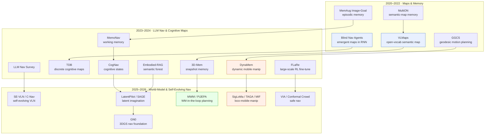

# Navigation & Mobile Manipulation — Deep Dive

> [!abstract] Overview
> Navigation is the oldest embodied task and the one where *memory* and *spatial representation* matter most: an agent that cannot remember where it has been cannot reach a goal it cannot see. This deep dive traces the field from end-to-end RL point-goal agents that grow implicit maps in their recurrent state ([[2301.13261|Blind-Nav-Agents]]), through open-vocabulary semantic-map navigation ([[2210.05714|VLMaps]]) and instruction-following VLN ([[2606.03682|GN0]], [[2603.29165|LatentPilot]]), to world-model-in-the-loop planning ([[2603.07799|MWM]]) and whole-body mobile manipulation ([[2411.04999|DynaMem]], [[2605.03846|SigLoMa]]). The central tension is **explicit map vs. learned representation** — metric/topological/semantic maps give interpretability and verifiable planning; end-to-end policies give generalization and sim-to-real robustness; and the 2026 frontier fuses them via persistent neural-field memory and latent imagination. The reader gets the design-space axes, the VLN benchmark landscape, the memory/mapping toolkit, the policy-learning recipes, and where mobile manipulation couples navigation to manipulation.

## Evolution Graph

Navigation research bifurcated early into two threads that this graph colours separately: the **explicit-representation thread** (blue — semantic maps, cognitive maps, scene graphs) that prizes interpretability and verifiable planning, and the **end-to-end-policy thread** (green — RL/IL agents whose spatial knowledge lives in latent state). The 2023–2024 LLM wave grafted language onto both — cognitive-map navigators that prompt an LLM over a scene graph, and RAG-style episodic memory for embodied Q&A. The 2025–2026 frontier (the bottom subgraph) is convergence: world models supply *imagined* rollouts to plan over, latent "pilot tokens" internalize anticipation inside a VLM backbone, and **mobile manipulation** (orange) closes the loop where the navigator must also act on what it reaches.

| Year | Paper | Contribution |
|------|-------|-------------|
| 2020 | [[2012.03912\|MultiON]] | Benchmarked explicit semantic-map memory vs implicit memory for multi-object navigation |
| 2021 | [[2101.05181\|MemAug-Image-Goal-Nav]] | Attention-based episodic memory + augmentation for RGB-only image-goal nav |
| 2022 | [[2301.13261\|Blind-Nav-Agents]] | Showed metric maps emerge spontaneously in a blind RL agent's recurrent memory |
| 2022 | [[2210.05714\|VLMaps]] | Fused VLM features into a spatial map for zero-shot open-vocabulary goal navigation |
| 2024 | [[2412.10439\|CogNav]] | LLM-driven cognitive-state machine over a heterogeneous cognitive map for ObjectNav |
| 2024 | [[2411.04999\|DynaMem]] | Online dynamic spatio-semantic voxel memory for open-world mobile manipulation |
| 2026 | [[2603.29165\|LatentPilot]] | Internalized action-conditioned anticipation as a latent "Pilot Token" in a VLN VLM |
| 2026 | [[2606.03682\|GN0]] | Unified 3DGS data + simulation + foundation policy for VLN with sim-to-real transfer |

## Part A — Foundations

*The design space of navigation and the language-grounded instruction-following task that defines its hardest open benchmarks.*

### 1. Navigation Paradigms & Design Space

Every navigation system answers one question — *where am I relative to my goal, and what path gets me there* — but the field has answered it three structurally different ways. **Metric/topological mapping** builds an explicit world representation (occupancy grid, semantic map, graph of places) and plans over it; it is interpretable and supports verifiable path-finding but is brittle to perception error and stale in dynamic scenes. **End-to-end learned policies** fold spatial knowledge into a recurrent or attention-based state and emit actions directly; they generalize and transfer to hardware but offer no inspectable map. **Hybrid / cognitive-map** approaches sit between — learning a *latent graph* or *discrete bottleneck* that an external solver can plan over, recovering some of the interpretability of explicit maps inside a differentiable pipeline.

The deepest result in this section is that the dichotomy is partly false: a pure end-to-end agent given only egomotion *spontaneously grows a metric map in its recurrent memory*, decodable as an allocentric occupancy grid. That reframes "explicit vs implicit" as a question of where the map lives, not whether one exists. The practical axes that remain are: how far back memory must reach (long-range vs reactive), whether the representation is metric or topological, and how much inference-time compute the policy can afford — the last now a first-class concern as VLN models grow into multi-billion-parameter VLMs.

#### 1.1 Emergent vs Explicit Spatial Memory

The core question of whether navigation *needs* a map, or whether one emerges from the task.

- **[[2510.09951|Hippocampus-CA3-Nav]]** — An ==actor-critic RL== navigation agent whose ==hippocampus-inspired sequence generator== grows ==place fields== + remapping from prewired ==CA3== recurrence as a temporal memory buffer; outperforms LSTM and state-space agents on continuous maze nav under *sparse DG input* — spatial memory emerges from intrinsic circuitry, not an external map.
- **[[2301.13261|Blind-Nav-Agents]]** — A point-goal RL agent given *only* ==egomotion sensing== and a generic LSTM reached **95.1%** success and **62.9%** SPL in novel scenes; an external decoder recovered allocentric occupancy maps at **32.5%** IoU (vs **12.5%** untrained), memory useful out to **1,000** steps — metric maps emerge unsupervised in recurrent state.
- **[[2401.05946|TDB]]** — A ==Transformer with Discrete Bottleneck== that quantizes representations into discrete codes from which an explicit ==cognitive map (latent graph)== is built; hit **99%** planning success with near-isomorphic maps (NormGED ~**0.005–0.12**) under perceptual aliasing, generalizing to unseen environments — the interpretable middle ground between map and policy.
- **[[2308.05602|RIM]]** — An object-goal navigation policy encoding history as a ==Recursive Implicit Map== (grid of latent vectors) ==recursively updated by a transformer==, trained by behavior cloning with ==visual/map/semantic auxiliary tasks==; beats both implicit and explicit-mapping baselines on Matterport3D ObjectNav and deploys to a real robot — the implicit-map middle ground.
- **[[2101.05181|MemAug-Image-Goal-Nav]]** — An RGB-only RL policy augmented with an attention-based ==episodic memory== over a ==self-supervised== state-embedding network; reached **0.56** SPL / **0.69** SR on Gibson (**+13%** SPL over NTS-D), with augmentation cutting the train-test gap from ~**65%** to **40%** — episodic memory as a bolt-on to model-free policies.

#### 1.2 Mapless Long-Range & Efficient Navigation

When explicit maps are infeasible (large outdoor scenes, compute-bound deployment), the policy must carry space implicitly and cheaply.

- **[[2606.14763|BayesOpt-NMPC]]** — A map-free quadruped-navigation stack pairing a ==LiDAR Gaussian occupancy grid== + A* with a ==nonlinear MPC== tracker whose 11 cost weights are auto-tuned offline by ==Tree-structured Parzen Estimator Bayesian Optimization==; **-38.7%** path length, **-53.0%** time-to-goal, SR **65%→90%**, zero-shot Go2 transfer — learning to tune MPC for nav.
- **[[2508.17971|LLM-NAR]]** — A multi-agent-path-finding planner fusing an ==LLM== with a ==GNN Neural Algorithmic Reasoner== (pretrained on ==CBS== optimal paths) via ==cross-attention==; higher SR with fewer steps than LLM baselines, **5k** training steps (vs 300k RL) and **~2.0s vs ~32.3s** CBS at 16 agents, real LIMO transfer — algorithmic reasoning for collision-free LLM path planning.
- **[[2508.11849|LocoMamba]]** — A vision-driven quadruped locomotion DRL framework fusing depth + proprioception via a ==Mamba selective state-space model== for near-linear-time fusion, ==PPO== with domain randomization + obstacle curriculum; **+48.9%** return / **48.9%** fewer collisions vs Transformer fusion, **+126.8%** return zero-shot on unseen terrain — mapless proactive obstacle avoidance.
- **[[2506.05997|SRU]]** — A ==Spatially-Enhanced Recurrent Units== architecture adding a spatial-transformation term to LSTM/GRU so ego-observations align implicitly; PPO-trained with sparse rewards, hit **+23.5%** SR over vanilla RNNs and **+105.0%** over GTRL, with zero-shot transfer to a legged-wheel robot over **100+ m** — recurrent memory made spatially aware without an explicit map.
- **[[2604.02829|STRNet]]** — A unified ==spatio-temporal representation== framework that enriches a nav policy's visual encoding via ==graph-based spatial aggregation== plus ==hybrid temporal-shift== fusion; reached **100%** SR with zero collisions on basic tasks and **98%** SR (**0.02** collisions) on long-range tasks, at real-time speed with fewer parameters than baselines.
- **[[2604.24391|FreqCache]]** — A ==Frequency-domain token caching== method with migration-aware reuse that accelerates VLN VLMs; **1.59× speedup** (per-step latency **637 ms → 401 ms**), **53.5%** token reuse, while holding **76.0%** Oracle Success — the inference-efficiency axis now matters as VLN backbones grow.
- **[[2603.13888|Path-Conditioned-Local-Planner]]** — An ==RL local-planning policy== conditioned on an ==encoded full global path== rather than immediate waypoints, trained over ==optimal/suboptimal/perturbed paths== with a ==shortcut reward==; **+7.02%** SPL (0.82) with optimal paths and SR 0.83 under degraded guidance, transferred to a Unitree B2W — path as flexible hint, not mandate.
- **[[2503.24065|COSMO]]** — A low-cost ==VLN== architecture interleaving selective ==State Space Models== for memorization with Transformer modules for action decisions, via a Round Selective Scan over panoramas and a Cross-modal Selective SSM; **+3.83%** SR over DUET on REVERIE at **15%** of its params and **9.3%** of its FLOPs, with **+7.42%** SR on long instructions — selective-memory VLN.
- **[[2605.13748|TinySDP]]** — A real-time ==semidefinite-optimization== MPC for certifiable obstacle avoidance on microcontrollers, lifting nonconvex disk constraints into a per-stage ==convex SDP relaxation== with an a-posteriori ==rank-1 trace-gap certificate==; ran onboard a Crazyflie (STM32, **139 KB** RAM) at 25 Hz, paths 31-**73%** shorter than baselines — certifiable agile nav on the edge.
- **[[2605.09939|Distance-Guided-Path-Integral]]** — A map-free local planner for articulated tractor-trailers fusing a ==geometric neural encoder== approximating point-to-polygon signed distance from raw LiDAR with an ==MPPI== controller using those distances as cost; collision-free feasible trajectories at ~**30 Hz** in agricultural sim — neural signed-distance for multi-body avoidance.
- **[[2511.21312|NMPC]]** — A mapless aerial-navigation framework encoding a single range observation into a differentiable ==Signed Distance Function== via a VAE+MLP, used as a position constraint in a ==Nonlinear MPC== with recursive feasibility; **100%** collision-free in Flightmare and real forest flight resilient to ~**3%** odometry drift — instantaneous neural SDF for map-free flight.
- **[[2509.14978|PA-MPPI]]** — A perception-aware ==MPPI== quadrotor planner coupling real-time depth + ==occupancy mapping (ROG-Map)== with an adaptive cost that switches to an exploration phase rewarding ==ray-traced== frontier coverage when the goal is occluded; **100%** SR in C-wall/hole sim + hardware-in-loop, and corrects NoMaD's infeasible goals — reference-free mapless exploration.
- **[[2305.06341|GGCS]]** — A ==Graph of Convex Sets== motion-planning extension to Riemannian manifolds via an atlas of local isometries, solving non-Euclidean configuration spaces (SE(2) bases, revolute joints) as a mixed-integer convex program; planned for a **15-DoF** PR2 mobile manipulator in **25–66 s** with optimality guarantees — the classical-planning anchor of the design space.

#### 1.3 Surveys

- **[[2311.00530|LLM-Embodied-Navigation-Survey]]** — A survey categorizing LLM roles in navigation into ==grounded language understanding== and ==few-shot planning==, contrasting LLM-based vs traditional ==VLN== models, and auditing datasets; flags ==spatial reasoning== and ==computational efficiency== as the persistent gaps — the reference map of the LLM-navigation landscape.

**Navigation Paradigm — Decision Matrix**

| Need | Recommendation |
|---|---|
| Interpretable, verifiable path planning | [[2305.06341\|GGCS]] (classical) or [[2401.05946\|TDB]] (learned cognitive map) |
| RGB-only generalization with no map | [[2301.13261\|Blind-Nav-Agents]], [[2101.05181\|MemAug-Image-Goal-Nav]] |
| Large outdoor / mapless long-range | [[2506.05997\|SRU]] (**+105%** SR over GTRL) |
| Compute-bound VLN deployment | [[2604.24391\|FreqCache]] (**1.59×** speedup) |
| Survey of LLM navigation landscape | [[2311.00530\|LLM-Embodied-Navigation-Survey]] |

> [!star] Key Papers — Design-Space Exemplars
> - [[2301.13261|Blind-Nav-Agents]] — The landmark result that metric maps emerge spontaneously in an end-to-end agent's memory, dissolving the explicit-vs-implicit dichotomy.
> - [[2401.05946|TDB]] — Established the discrete-bottleneck cognitive map as the interpretable middle ground between explicit maps and black-box policies.
> - [[2506.05997|SRU]] — The reference architecture for spatially-aware recurrence in mapless long-range navigation.
> - [[2311.00530|LLM-Embodied-Navigation-Survey]] — The canonical taxonomy of how language models slot into the navigation stack.

> [!tip] The Map Never Disappears — It Just Moves
> The recurring lesson across this section is that *every* navigator carries a spatial representation; the only design choice is whether it lives in an inspectable data structure or in a recurrent/latent state. Blind agents grow occupancy maps in an LSTM; TDB makes the latent map discrete and plannable; SRU bakes spatial alignment into the recurrence. Reach for explicit maps when you need to *verify* a path or debug a failure; reach for learned latent memory when you need sim-to-real robustness and generalization. The 2026 trend (see [[12_Navigation-and-Mobile-Manipulation#4. Learning-Based Navigation Policies]]) is to keep both — a learned policy that plans over an *imagined* latent world. For the latent-world-model substrate underneath, see [[07_Latent-World-Models#1. The JEPA Principle]].

### 2. Vision-Language Navigation

Vision-Language Navigation (VLN) is the task where an agent follows a natural-language instruction — "go down the hallway, turn left at the kitchen, stop by the blue chair" — to reach a goal it was never shown. It is navigation's hardest open problem because it couples three failure surfaces: *grounding* language to visual landmarks, *spatial reasoning* over an unmapped environment, and *long-horizon* execution where one wrong turn cascades. The benchmark suite (R2R, REVERIE, RxR, SOON, and continuous-environment variants R2R-CE / RxR-CE) measures Success Rate and SPL, and the gap between val-seen and val-unseen is the field's honesty check.

Two architectural moves define the 2025–2026 VLN frontier. First, **open-vocabulary grounding without fine-tuning** — using a frozen VLM to supply weak supervision or map features rather than retraining a billion-parameter backbone for each environment. Second, **internalized anticipation** — instead of bolting an external world model onto the policy, recent agents embed action-conditioned future imagination directly inside the VLM's latent state, so a single forward pass both grounds the instruction and looks ahead. The benchmarks themselves are also evolving from grid-world graphs toward photorealistic 3DGS-rendered continuous environments that close the sim-to-real gap.

#### 2.1 Grounding & Map-Based VLN

Fusing language into a spatial representation so open-vocabulary goals become navigable.

- **[[2604.08883|HTNav]]** — A hybrid ==IL+RL== urban aerial VLN framework with a tiered ==MacroPlanner/MicroActor== decision split and a ==map representation learning== module (residual encoders + SCConv) for spatial grounding; **25.49%** SR / **40.3 m** NE on the revised CityNav Test-Unseen split, doubling the MGP* baseline (**9.70%** SR) — tiered planning for long-range aerial navigation.
- **[[2602.09657|AutoFly]]** — An end-to-end ==VLA for UAV navigation== in unknown outdoor scenes from *coarse* language, fusing a ==pseudo-depth encoder== (Depth Anything V2) into an LLaVA-based VLM for monocular spatial reasoning; **47.9%** sim SR (**+3.9%** over OpenVLA), **60%** indoor / **55%** outdoor real — dataset rebalancing alone lifted SR **16.6% → 47.9%**.
- **[[2602.12159|3DGSNav]]** — An object-navigation framework giving a VLM a dense, persistent ==3D Gaussian Splatting memory== with ==active opacity-based panoramic perception== and ==free-viewpoint CoT prompting==, re-verifying targets from rendered novel views without moving; **+13.5%** SR / **+32.08%** SPL across HM3D/MP3D, **69.44%** real quadruped SR — 3DGS as ObjectNav reasoning substrate.
- **[[2602.09972|Hydra-Nav]]** — An ObjectNav agent unifying a deliberative ==slow system== and reactive ==fast system== in one VLM with ==adaptive switching== that self-triggers reasoning at ==stagnation points==, trained via ==Iterative Rejection Fine-tuning==; SOTA SR (**+21.1%** on OVON Val-Unseen) at a **3.0%** reasoning ratio on HM3D, zero-shot to a real Go2 — reasoning only when stuck.
- **[[2509.22548|JanusVLN]]** — A VLN agent with ==dual implicit neural memory== that decouples visual semantics from 3D spatial geometry (a ==VGGT== encoder extracting 3D priors from RGB video) into fixed-size representations; **60.5%** SR / **56.8%** SPL on R2R-CE Val-Unseen (up to +10.8% over explicit memory), **69-90%** less inference overhead — implicit 3D memory without depth.
- **[[2509.10454|GC-VLN]]** — A training-free VLN-CE framework decomposing instructions into a ==Directed Acyclic Graph== of waypoint/object nodes with spatial constraints, solving for coordinates via ==nonlinear constrained optimization== plus a Navigation Tree + backtracking; SOTA training-free R2R-CE (**+2%** SR) and zero-shot RxR-CE, deployed real-world — instruction as solvable constraints.
- **[[2507.06747|LOVON]]** — A legged ==open-vocabulary object navigator== unifying an ==LLM Task Planner==, ==YOLO-11== detection with ==Laplacian-variance motion-blur filtering==, and a transformer ==Language-to-Motion Model== for motion + adaptive search states; **1.00** avg Gym-Unreal SR at **1.5 h** training (vs 360 h TrackVLA), real Go2/B2/H1-2 — long-horizon open-world object nav for legs.
- **[[2210.05714|VLMaps]]** — A navigator fusing pixel-level ==visual-language embeddings== (LSeg) into a dense top-down grid from ==point cloud== data, then using an LLM to emit navigation primitives over the language-indexed map; reached **62%** SR for 1-subgoal zero-shot spatial-goal nav (baselines near **0%**) and 10/20 real-world goals — the canonical open-vocabulary semantic-map navigator.
- **[[2506.15757|WPCL]]** — A ==Weakly-supervised Partial Contrastive Learning== method using a frozen VLM to extract object lists as weak supervision, applying contrastive loss only to an object-centric feature segment for viewpoint invariance; hit **78%** SR / **70%** SPL on R2R val-unseen (SOTA on R2R/REVERIE/SOON) on a single **24GB** GPU — grounding without VLM fine-tuning.
- **[[2506.06862|Multimodal-Spatial-Language-Maps]]** — A persistent map framework fusing ==pre-trained VLM/ALM features== into 3D reconstructions as ==VLMaps + AVLMaps==, with an LLM planning over visual, audio, and language goals via cross-modal heatmap reasoning; **62%** spatial-subgoal and **77.5%** sound-goal SR in sim, **50%** real multimodal nav — audio-visual-language spatial maps.
- **[[2505.11383|Dynam3D]]** — A ==Dynamic layered 3D tokens== representation with ==online instance encoding== giving a VLM a structured, updatable spatial memory for VLN with real-time adaptation to moving objects; SOTA on R2R-CE, REVERIE-CE, and NavRAG-CE, strong in pre-exploration and lifelong-memory settings at a smaller footprint than video-based approaches — 3D-token memory for dynamic VLN.
- **[[2503.10630|UniGoal]]** — A universal zero-shot goal navigator that represents the dynamic 3D scene and object/instance-image/text goals as ==uniform graphs==, exploring via a ==graph-matching score== with a blacklist against repeated failures; SOTA zero-shot across object-, instance-image-, and text-goal nav on MP3D/HM3D/RoboTHOR (**+4.1%** SR IIN) — one framework for all goal types.
- **[[2502.13451|MapNav]]** — A VLN memory replacing history frames with ==Annotated Semantic Maps== — a compact top-down map incrementally built from RGB-D+pose, with explicit VLM-readable textual labels for end-to-end action prediction; **+8.8%** SR / **+6.5%** SPL on RxR-CE at a **99.9%** smaller (0.17 MB) memory footprint and **79.5%** faster per-step — annotated map as memory.
- **[[2410.01273|CANVAS]]** — A commonsense-aware nav system where a ==VLM== reads front-view images plus a ==composite canvas map== (sketch + hindsight trajectory) and language, trained by imitation on the COMMAND dataset of precise *and* misleading instructions; **67%** orchard SR (vs 0% for NavStack) under misleading input and **69%** real sim2real — learning to override bad instructions.
- **[[2407.07775|Mobility-VLA]]** — A hierarchical VLA for multimodal instruction nav (MINT) that builds a ==topological graph== offline from a demonstration tour video, then uses a ==long-context VLM== (Gemini 1.5 Pro) for high-level goal-frame finding and the graph for low-level waypoints; **80-100%** real-world SR and **90%** multimodal goal-finding (vs 30% text-only) — tour video as prior.
- **[[2402.15852|NaVid]]** — An end-to-end video-based ==VLM== for VLN-CE operating solely on monocular RGB video and language (==LLaMA-VID== with instruction-queried + density-varying history tokens), trained with DAgger + auxiliary VQA; SOTA VLN-CE R2R Val-Unseen (**37.4%** SR) without depth/odometry and **66%** real-world SR — monocular video VLM that needs no maps.
- **[[2507.18033|OpenNav]]** — A zero-shot open-world ==VLN== framework where an ==MLLM== (GPT-4o) reasons over an open-vocabulary perception system and emits dense code-generated trajectories, refined by ==classical A* planning over dynamic BEV value maps==; **84%** ambiguous-object SR (vs 26% text-only) at **1.68** NE, 2/30 collisions — MLLM reasoning fused with geometry-compliant planning.
- **[[2503.18525|RoboTron-Nav]]** — A unified embodied-navigation framework fusing 2D/3D visual features, ==adaptive 3D-aware history sampling==, and an ==MPT LLM== for joint action and EQA prediction via ==multitask collaboration==; new SOTA **81.1%** SR (**+9%**) on CHORES-S ObjectNav, avoiding repetitive re-exploration on long-horizon tasks — perception, planning, and prediction in one LLM.
- **[[2503.13966|FlexVLN]]** — A hierarchical ==VLN== framework pairing an ==LLM planner== for high-level reasoning with an instruction follower for low-level execution, plus a verification mechanism and multi-model ensemble; outperforms prior methods on REVERIE, first LLM method on SOON, and cuts LLM calls **52%** vs NavGPT — flexible adaptation across instruction types without retraining.
- **[[2503.10069|SmartWay]]** — A zero-shot ==VLN-CE== system pairing an ==occupancy-aware waypoint predictor== (DINOv2 + masked cross-attention) with an ==MLLM navigator== (GPT-4o) given an explicit ==backtracking== action to recover from failures; **51%** OSR / **29%** SR on R2R-CE (zero-shot SOTA) and **24%→36%** real Turtlebot4 SR with backtracking — waypoint quality plus error recovery.
- **[[2503.07323|Navigating-Motion-Agents]]** — A training-free framework encoding maps, states, and trajectories as text tokens so an ==LLM acts as a spatial reasoner==, with closed-loop ==additive/compositional replanning== over anchor-based sparse-keypoint paths; o3-mini reached **0.781→0.882** single-agent SR over four turns and **0.720** two-agent SR — LLM reasoning for collision-free motion.
- **[[2502.19024|GVNav]]** — A ground-level-viewpoint ==VLN-CE== framework for low-height robots augmenting ==waypoint prediction== with low-perspective data and depth-aware training, plus an ==adaptive information-gathering module== weighting historical observations via attention; beat baselines in sim and on a Xiaomi Cyberdog despite visual obstruction — bridging the viewpoint gap.
- **[[2502.07306|TRAVEL]]** — A fully training-free ==VLN== framework decomposing the task into instruction parsing, landmark retrieval (==SigLIP== zero-shot grounding), ==BFS path generation==, and path-instruction alignment (GPT-4o); **70.0%** Precision@10 last-landmark localization (vs VLMaps **34.4%**) and **88.92%** nDTW on R2R-Habitat — retrieval-and-alignment VLN with no training.
- **[[2411.16425|TopV-Nav]]** — An ==MLLM==-driven zero-shot ObjectNav framework reasoning directly over ==top-view semantic maps== via ==Adaptive Visual Prompt Generation==, with Dynamic Map Scaling to zoom dense regions and a Potential Target Driven module for target inference; **52.0%** SR / **28.6%** SPL on HM3D (beating VoroNav) and **35.2%** SR on MP3D — top-view spatial reasoning for nav.
- **[[2410.02730|DivScene]]** — A large open-vocabulary ObjectNav dataset (4,614 houses, 81 scene types, ~23k episodes) plus ==NatVLM==, a fine-tuned Idefics-2 VLM trained by imitation on BFS shortest paths with ==Chain-of-Thought== action reasoning; **56.17%** SR (beating GPT-4o by >20 pp) and zero-shot **72.79%** SR on unseen iTHOR — CoT-driven open-vocab object navigation.
- **[[2309.10309|PixNav]]** — A hierarchical zero-shot ObjectNav system pairing a low-level ==pixel-guided navigation policy== (transformer over RGB history toward a target pixel) with a high-level ==LLM planner== that summarizes room layouts and proposes exploration; **37.9%** SR / **20.5%** SPL on HM3D from RGB alone, competitive with map-based methods — pixels as the goal interface.

**Aerial VLN** — Outdoor city- and sky-scale instruction-following where a UAV grounds coarse language to satellite or first-person views.

- **[[2505.05622|CityNavAgent]]** — An aerial ==VLN== agent pairing an ==open-vocabulary perception module== (GPT-4V + GroundingDINO) with a ==hierarchical semantic planner== decomposing instructions into landmark/object/motion subgoals over a ==global topological memory==; **63.8%** SR / **48.7%** SPL on AirVLN-S, zero-shot across urban scenes — semantic planning for city-scale aerial nav.
- **[[2503.02572|RaceVLA]]** — A ==VLA== fine-tuned from OpenVLA (LLaMA2-7B) for autonomous racing-drone navigation that maps FPV video + language to a 4D velocity/yaw action for end-to-end control; flew **1.04 m/s** average through single/square/multi-gate tracks, beating OpenVLA on motion (**75.0%** vs 60.0%) and semantic (**45.5%** vs 36.3%) generalization — VLA control for agile aerial nav.
- **[[2503.02465|UAV-VLRR]]** — An aerial search-and-rescue system fusing ==ChatGPT-4o== language parsing + ==Molmo-7B== VLM aerial-image interpretation to identify targets/obstacles, feeding pixel-to-Cartesian coordinates into an onboard point-to-point ==NMPC== for safe rapid trajectories; **33.75%** faster than autopilot / **54.6%** faster than human pilot, 23 cm max coordinate error.
- **[[2503.02454|UAV-VLPA*]]** — A vision-language-path-action system where a ==VLM== extracts waypoints and obstacles from satellite imagery, a ==TSP 2-opt heuristic== orders them globally, and ==A*== refines obstacle-avoiding segments; generated **51.27 km** routes (**18.5%** shorter than human) and cut planning from 35 min to <3 min — global route optimization for large-scale UAV missions.

**VLN Data Augmentation** — Synthesizing observation-instruction pairs with foundation models to lift generalization without new human annotation.

- **[[2503.18065|Unseen-from-Seen]]** — A ==Rewriting-driven AugMentation (RAM)== paradigm using ==VLMs + LLMs + text-to-image models== to rewrite human-annotated VLN data via object-enriched observation rewriting and observation-contrast instruction rewriting, integrated by a ==Mixing-then-Focusing== schedule; **+3.1%** SR / **+2.2%** RGS on REVERIE Val-Unseen and full-data parity from 60% data.
- **[[2503.09938|PanoGen++]]** — A VLN data-augmentation framework adapting a ==text-to-image diffusion model== to the nav domain via ==LoRA== on attention layers, generating panoramic environments by masked inpainting and recursive outpainting; **+2.44%** SR on the R2R test leaderboard and **+0.75 m** goal progress on CVDN Val-Unseen — domain-adapted panorama generation for training.

#### 2.2 Anticipatory & Self-Evolving VLN

Internalizing future imagination or runtime self-improvement into the instruction-follower.

- **[[2606.10577|AgenticNav]]** — A zero-shot VLN-CE agent reframing navigation as ==tool-calling==: a VLM invokes an Action Tool for pixel-level target selection (bypassing waypoint predictors), a Depth Tool for metric depth, and an ==Agentic Memory== Recall Tool; **55%** SR / **48.41%** SPL on R2R-CE val-unseen (zero-shot SOTA), **46.7%** real-robot SR — VLN as a tool harness.
- **[[2606.08992|SpaceVLN]]** — A zero-shot VLN agent pairing online ==Spatial Cognitive Memory== (hierarchical Spatial-Waypoint graph + landmark memory) with ==Spatial-CoT== reasoning in a stagewise ==closed-loop== plan-execute framework; **53.3%** SR on R2R-CE, **48.9%** on RxR-CE, **51.6%** SR on HM3D-OVON, **48%** real-robot SR (vs Open-Nav **34%**) — training-free spatial cognition for VLN.
- **[[2606.03682|GN0]]** — A foundation model unifying ==3DGS== data generation, interactive simulation, and a multi-stage policy (SFT → ==DAgger== closed-loop → ==DAPO== → NavDP action expert); reached **67.7%** SR / **63.4%** SPL on R2R Val-Unseen (VLN-CE) and transferred sim-to-real to wheeled-arm and Unitree G1 robots with *no* real-world training — the 3DGS-grounded VLN foundation model.
- **[[2605.23257|Cross-Domain]]** — An online-VLN test-time-adaptation framework (IDEA) reframing adaptation as accumulating composable ==soft-visual-prompt assets==, optimized by ==Fisher-guided alignment== and composed via a training-free ==convex-hull projection== bridge; **+2.5%** SR / **+2.8%** SPL on REVERIE and ~**20×** faster than FeedTTA — adaptation as reusable knowledge assets.
- **[[2603.29165|LatentPilot]]** — A VLN agent internalizing ==anticipatory reasoning== as a continuous ==Pilot Token== propagated across steps, trained via a ==PilotLoop== with future observations as privileged supervision; hit **62.0%** SR / **58.0%** SPL on R2R-CE Val-Unseen at **130ms**/action and **22.8 GB** peak GPU — beating external world models on both accuracy and efficiency.
- **[[2602.02459|TIC-VLA]]** — A dual-system "Think-in-Control" ==VLA== for dynamic-environment nav that asynchronously runs slow VLM reasoning and fast control, conditioning the policy on cached semantic states plus ==latency metadata== and ==ego-motion offsets==; **55.29%** sim SR / **28.24%** collision on DynaNav, **85%** real Go2 SR despite multi-second delays — compensating for VLM latency.
- **[[2512.08186|Ground-Slow,-Move-Fast]]** — A dual-system VLN foundation model that asynchronously pairs a ==slow VLM planner== (QwenVL-2.5, 2 Hz pixel-goal grounding) with a ==fast diffusion-transformer local controller== (30 Hz); **64.3%** SR on R2R-CE Val-Unseen and **37.2%** SR on the new Social-VLN with real dynamic obstacle avoidance — decoupling reasoning from agile control.
- **[[2511.17097|Progress-Think]]** — An annotation-free ==semantic progress reasoning== agent gauging its position within multi-step instructions, exploiting ==monotonic co-progression== between observations and instruction semantics via a ==Monotonic Ordering Loss==; **60.1%** SR / **53.6%** SPL on R2R-CE Val-Unseen and **27.5%** out-of-domain on RxR-CE, no progress labels needed.
- **[[2507.13152|SE-VLN]]** — A training-free ==self-evolving== MLLM framework with hierarchical memory (topological map + experience repository) and ==retrieval-augmented== Chain-of-Thought reasoning; **+23.9%** SR / **+15.0%** SPL over prior training-free LLM-VLN on R2R val-unseen, OSR rising **64.1% → 68.0%** — VLN that improves without weight updates.
- **[[2509.11197|DreamNav]]** — A trajectory-based imaginative zero-shot VLN-CE framework with an ==EgoView Corrector==, a ==diffusion trajectory predictor==, and active imagination reformulating visual rollouts into ==LLM semantic narratives==; **32.79%** SR / **28.95%** SPL on R2R-CE Val-Unseen (panoramic SOTA), 12/20 real trials vs Open-Nav 6/20 — imagination from cheap egocentric RGB-D.
- **[[2508.10416|CorrectNav]]** — A VLA navigation model given error recovery by a ==Self-correction Flywheel== post-training paradigm that mines deviations from oracle paths to auto-generate error-correcting trajectory + perception data (LLaVA-Video 7B, monocular RGB); SOTA **65.1%** SR on R2R-CE and **69.3%** on RxR-CE, beating multi-sensor methods — self-generated errors as a training resource.
- **[[2508.02549|MonoDream]]** — A lightweight monocular ==VLA== learning a ==Unified Navigation Representation== supervised by ==Latent Panoramic Dreaming== that aligns it to future panoramic RGB+depth, with the dreaming module disengaged at inference; **49.4%** SR / **40.9%** SPL on RxR-CE and **55.8%** SR on R2R-CE Val-Unseen — panoramic foresight without a panoramic camera.
- **[[2505.20897|ATD]]** — An ==Adaptive Text Dreamer== splitting a 1.5B LLM into a ==left-brain state estimator== and a ==right-brain imagination LLM== that predicts future semantics in abstract language, injected via ==State-Grounded Cross-Attention==; beat NaviLLM by **+6%** SR / **+3%** SPL on R2R test at 1.5B vs 7B params — language-based imagination for VLN.
- **[[2506.06630|Active-Test-time-Vision-Language-Navigation]]** — An active test-time-adaptation framework (==ATENA==) turning sparse episodic success/failure feedback into ==Mixture Entropy Optimization== (minimize entropy on wins, maximize on losses) plus self-active learning; up to **+44.98%** SR for DUET on REVERIE Val-Unseen at low latency — runtime adaptation without dense supervision.
- **[[2505.11886|Aux-Think]]** — A data-efficient VLN strategy that co-trains ==auxiliary Chain-of-Thought== reasoning + instruction reconstruction but does *direct* action prediction at inference, dodging "Test-time Reasoning Collapse"; **46.0%** SR on R2R-CE Val-Unseen with only 320K data (beating explicit-reasoning baselines), plus the R2R-CoT-320k dataset — reason in training, act at test.
- **[[2505.07868|VISTA]]** — A closed-loop ==VLN== framework pairing a ==Visual Imagination Module== with a Perceptual Alignment Filter and Navigational ==Chain-of-Thought== reasoning, plus an Adaptive Imagination Scheduler switching instruction- vs observation-driven goal prediction; **77.8%** SR / **68.3** SPL on R2R Val-Unseen (**+3.2%** SR) — generative visual imagination for proactive nav.
- **[[2503.16394|Visual-Imaginations-VLN]]** — A study of whether ==text-to-image diffusion imaginations== of instruction noun-phrases help VLN, fusing imagination embeddings into HAMT/DUET via a ==cosine-alignment auxiliary loss==; **+2.0** SR on R2R test (DUET) and **+1.3** SR / **+0.82** RGS on REVERIE, sequential per-landmark imaginations beating goal-only — imagination as a bolt-on.
- **[[2412.01857|SALI]]** — A Space-Aware Long-term Imaginer for VLN pairing a ==reality-imagination hybrid memory== over a ==topological map== of visited/navigable/imagination nodes with a ==recurrent tree-structured imagination module== generating future RGB/depth/waypoints; **+6-8%** SPL (SPL 74) on R2R Test-Unseen and SOTA REVERIE RGS 34 — episodic simulation fused with episodic memory.

#### 2.3 VLN Benchmarks & Embodied Agents

The environments and platforms that stress-test instruction-following.

- **[[2511.20351|HVS]]** — An embodied ==Humanoid Visual Search== task + the **3,000**-instance ==H*Bench== where an MLLM actively rotates a virtual head over 360° panoramas for object/path finding, adapted via ==SFT+RL post-training==; HVS-3B lifts object-search SR **14.83%→47.38%**, beating Gemini2.5-Pro (**31.96%**) — active panoramic search beats passive 2D reasoning.
- **[[2510.21307|Physically-Executable-3DGS-Nav]]** — A ==SAGE-3D== paradigm augmenting ==3DGS== with semantic + physics layers (==3DGS-Mesh hybrid== collision bodies) into executable VLN scenes, plus the **1,000-scene** InteriorGS dataset and SAGE-Bench; NaVILA scores **0.39 SR** (vs 0.54 on R2R), yet training on its 3DGS data adds **+34%** OSR on unseen R2R — harder physically-grounded 3DGS VLN.
- **[[2405.07060|Memory-Maze]]** — A CARLA-based VLN benchmark simulating a robot guiding blind people via *memory-recalled* (error-prone) instructions in maze-like public spaces; memory-based instructions failed at **25–40%** (vs **0–9%** for think-out-loud), and all SOTA models scored low — exposing the realistic-language gap VLN ignores.
- **[[2408.15511|AeroVerse]]** — A UAV-agent benchmark suite (==AeroSimulator== + ==AerialAgent-Ego15k== / ==CyberAgent-Ego500k== datasets) for aerial embodied world models; the ==SkyAgentX== baseline gained **+8.52%** average over visual-language baselines across perception, reasoning, navigation, and planning — extending embodied navigation into the aerial domain.
- **[[2604.08509|Visually-grounded-Humanoid-Agents]]** — A system coupling ==occlusion-aware semantic 3DGS== reconstruction (World Layer) with a two-level ==VLM planner== + ==motion-diffusion== controller (Agent Layer) for digital humans navigating from vision alone; ~**30%** higher SR than VLN baselines on a new humanoid-scene-interaction benchmark — full-body VLN for embodied avatars.
- **[[2507.13019|VLN-PE]]** — A physically-realistic VLN platform on ==GRUTopia (Isaac Sim)== supporting humanoid (H1/G1), quadruped, and wheeled robots with RL controllers; zero-shot transfer of VLN-CE models drops Success Rate **34%** relatively, and cross-embodiment co-training recovers it — exposing the physical-embodiment gap abstract VLN-CE hides.
- **[[2506.09839|OctoNav]]** — A generalist navigator unifying fragmented nav tasks under free-form multi-modal instructions via a ==Think-Before-Action== VLA (==TBA-SFT== → ==Nav-GRPO== → online RL); **OctoNav-R1** hits **19.40%** SR on the new ==OctoNav-Bench== (400+ scenes, 45k+ pairs), doubling the next baseline (**9.20%**), with sim2real on a Unitree GO2 — generalist-nav benchmark + agent.
- **[[2503.14229|HA-VLN-2.0]]** — A human-aware ==VLN== benchmark and leaderboard unifying discrete and continuous paradigms with social-awareness constraints, built on SMPL-based ==HAPS 2.0== motions and the ==HA-R2R== corpus of 16,844 socially grounded instructions; up to **+28.6%** SR on human-aware sets and **0.18** real SR (vs VLN-CE 0.12) — social grounding as a benchmark.
- **[[2502.18041|Openfly]]** — An aerial ==VLN== platform integrating ==Unreal Engine, GTA V, Google Earth, and 3DGS== rendering with a VLM/LLM toolchain auto-generating 100,000 trajectories across 18 scenes, plus the keyframe-aware ==OpenFly-Agent==; **34.3%** SR / **24.9%** SPL test-seen (**+14.0%** SR over NaVila) and **26.09%** real SR — the largest aerial-VLN dataset and platform.
- **[[2502.09238|OpenBench]]** — A semantic-navigation benchmark for smart logistics with last-mile metrics (SRTP, LSR, LSPL), plus the ==OPEN== baseline combining LLM instruction parsing, VLM localization, and ==OpenStreetMap== as a lightweight map; **100%** SR in small/medium sim (vs 20-40% baselines) and **75.58%** LSR at ~1% of a point-cloud map's storage — outdoor last-mile delivery nav.
- **[[2210.03087|IVLN]]** — The ==Iterative VLN== paradigm where agents navigate ==tours== of many episodes inside one ==persistent 3D environment==, with IR2R / IR2R-CE benchmarks and a ==tour-normalized DTW== metric; map-based agents reach **47-48%** t-nDTW (vs **~38%** unstructured) and updated maps add **3-4%** — proving long-term spatial memory pays off across episodes.
- **[[2010.07954|RxR-CE]]** — A ==Room-Across-Room== multilingual VLN corpus (English/Hindi/Telugu) in Matterport3D with ==two-level path sampling== + ==dense spatiotemporal grounding==; **126,000** instructions over **16,500** paths, an order of magnitude larger than R2R and de-biased so go-straight shortcuts fail — the scale-and-language VLN reference.
- **[[2004.02857|R2R-CE]]** — The ==VLN in Continuous Environments (VLN-CE)== benchmark on Habitat + Matterport3D, replacing nav-graph teleport with low-level move/turn actions; best cross-modal agent reaches **0.30 SPL** (**32%** SR) on val-unseen, with depth+RGB both essential — the benchmark that grounded VLN in continuous control.

**VLN — Decision Matrix**

| Need | Recommendation |
|---|---|
| Open-vocabulary spatial-goal nav from a map | [[2210.05714\|VLMaps]] (**62%** SR zero-shot) |
| SOTA R2R/REVERIE without VLM fine-tuning | [[2506.15757\|WPCL]] (**78%** SR, single 24GB GPU) |
| Sim-to-real photorealistic VLN foundation | [[2606.03682\|GN0]] (**67.7%** SR, G1 transfer) |
| Anticipatory VLN at low latency | [[2603.29165\|LatentPilot]] (**130ms**/action) |
| Training-free self-improving VLN | [[2507.13152\|SE-VLN]] (**+23.9%** SR) |
| Realistic / aerial / humanoid benchmark | [[2405.07060\|Memory-Maze]], [[2408.15511\|AeroVerse]], [[2604.08509\|Visually-grounded-Humanoid-Agents]] |

> [!star] Key Papers
> - [[2210.05714|VLMaps]] — The canonical open-vocabulary semantic-map navigator; established language-indexed spatial maps as a VLN primitive.
> - [[2603.29165|LatentPilot]] — First to internalize action-conditioned anticipation inside the VLM backbone, replacing bolt-on world models.
> - [[2606.03682|GN0]] — The reference 3DGS-grounded VLN foundation model with demonstrated zero-shot sim-to-real transfer.
> - [[2405.07060|Memory-Maze]] — The benchmark that exposed how badly VLN handles realistic, memory-imperfect human instructions.

> [!tip] Anticipation Beats External World Models — When It's Internalized
> The 2026 VLN surprise is that *imagining the future* helps, but the win comes from internalizing it cheaply, not from a separate module. [[2603.29165|LatentPilot]] folds action-conditioned anticipation into a single Pilot Token and beats external world models on *both* accuracy and latency (**130ms**/action); the heavy bolt-on planner is a legacy of treating perception and prediction as separate stages. Compose this with self-evolution ([[2507.13152|SE-VLN]]) for training-free improvement and frozen-VLM grounding ([[2506.15757|WPCL]]) for cheap open-vocabulary perception. For the VLA-side treatment of reasoning-augmented action models, see [[04_VLA#4. Reasoning & Planning-Augmented VLAs]]; for the egocentric pretraining that gives these agents their visual priors, see [[13_Egocentric-Pretraining-and-Human-Video#5. Transfer Mechanisms — Hand → Gripper]].

## Part B — Methods

*The three machinery layers: how an agent remembers space, how it learns a policy, and how navigation couples to manipulation.*

### 3. Mapping, Memory & Spatial Representation

If a navigation policy is the *engine*, its spatial memory is the *fuel tank* — and the structure of that memory determines what the agent can do. This section maps the memory toolkit along two axes. The **representation axis** runs from dense metric (voxel grids, occupancy) through semantic (object-labeled maps, scene graphs) to topological (graphs of places, snapshot collections) — denser representations support precise geometry but cost storage and degrade in dynamic scenes; sparser topological memory scales to lifelong operation but loses metric precision. The **persistence axis** runs from per-episode working memory (forget on reset) through episodic memory (replay across runs) to persistent world models (a continuously-refined neural field).

The defining problem this section solves is *what to remember and what to forget*. A navigator that stores everything drowns in retrieval cost; one that stores nothing re-explores forever. The best 2024–2026 systems make forgetting a first-class mechanism — MemoNav's selective forgetting prunes goal-irrelevant nodes, DynaMem ray-casts to purge moved objects, C-Nav uses outlier detection to keep only meaningful keyframes. The complementary trend is *queryable* memory: semantic forests and 3D scene memory that an LLM/VLM can search by language, turning navigation into retrieval over a learned spatial index.

#### 3.1 Semantic & Cognitive Maps

Explicit, language-grounded spatial structures that an LLM or planner reasons over.

- **[[2606.26046|RoboAtlas]]** — A contextual ==Active SLAM== framework coordinating frontier exploration, global-map LLM reasoning, and an egocentric VLM via a ==Contextual Multi-Armed Bandit== policy over a real-time ==open-vocabulary 3D semantic map== (OpenRoboVox); **90.6%** SR on GOAT-Bench (SOTA), deployed on-robot — adaptive exploration-vs-semantics for language-conditioned search.
- **[[2606.24068|ObsGraph]]** — An observation-centric ==hierarchical scene graph== (object / view / room layers) giving an LLM task-aware retrieval plus an adaptive ==multi-scale exploration== that structures room/view/frontier options by information gaps; **61.5%** LLM-Match on EM-EQA, **54.5%** on A-EQA, **72.7%** SR on GOAT-Bench — reasoning over known and missing information.
- **[[2606.23565|HoloAgent-0]]** — A unified embodied-agent framework grounding LLM planning in a persistent ==3D Spatial Memory Layer== and a ==typed embodied-skill interface== for closed-loop feedback-driven re-planning; **97.70%** Top-1 SR in real long-horizon apartment nav and **31.58%** / **29.93%** mIoU mapping on ScanNet / Replica — memory-centric agent for nav + mobile manipulation.
- **[[2606.01313|PSG-Nav]]** — An ObjectNav framework preserving perception uncertainty in a ==3D Probabilistic Scene Graph== with a ==Multiverse Decision== sampler over consistent "possible worlds," plus an RAG ==Evidential Experience Calibrator==; **66.1%** SR / **32.1%** SPL on HM3D (**+12.1%** SR over SG-Nav), intercepting **76.9%** false-positive stops — uncertainty-aware scene-graph nav.
- **[[2605.05960|Label-Map-Diffusion]]** — A plug-and-play ==DDPM== (PLMD) completing partial BEV label maps via two coupled diffusion nets where a semantic-map net is ==obstacle-conditioned== through ==SPADE==, restoring maps for existing navigators without retraining; **+5.4%** SR ObjectNav, **+7%** Instance-ImageNav, SOTA Multi-Robot ObjectNav — obstacle-guided map completion as a module.
- **[[2602.00222|MapDream]]** — A ==map-in-the-loop== VLN framework autoregressively generating compact ==task-driven BEV maps== jointly with the policy, optimized by SFT then ==GRPO==; SOTA monocular **59.8%** SR / **54.4%** SPL on R2R-CE and **59.4%** / **49.2%** on RxR-CE, with 36-token maps cutting per-step latency **12.7s → 1.3s** on a Unitree G1 — maps learned by the downstream objective.
- **[[2509.20739|Semantic-Object-Exploration]]** — A legged-robot object-exploration method pairing ==confidence-calibrated semantic arbitration== over scene+object cues with a ==controlled-growth topological memory== and ==LLM utility-driven subgoal selection==; **90.1%** semantic accuracy (**+4.8 pp**) and **85.8%** node-selection accuracy on a Unitree Go1 — topological memory over dense maps.
- **[[2506.06487|BeliefMapNav]]** — A zero-shot ObjectNav system building a ==3D voxel belief map== that fuses multi-scale visual semantics with LLM commonsense priors, refined by frontier visibility and planned via ==GPU simulated annealing== over expected search distance; **61.4%** SR / **30.6%** SPL on HM3D (**+46.4%** SPL over InstructNav) — probabilistic 3D belief over coarse maps.
- **[[2504.14478|ApexNav]]** — A zero-shot ObjectNav explorer adaptively switching between ==semantic ATSP planning== and nearest-frontier expansion by semantic-score strength, with ==target-centric semantic fusion== accumulating multi-frame detections under adaptive confidence; **+19.8%** SR / **+16.9%** SPL on HM3Dv2 and **100%** real SR over 6 LIMO trials — false-positive-robust exploration.
- **[[2503.02106|OVAMOS]]** — An open-vocabulary multi-object search framework integrating ==VLM== semantic understanding, frontier-based exploration, and a ==VLM-guided POMDP== (POUCT solver + Bayesian value-decay) to manage observation uncertainty and replan after failed detections; **55.0%** SR / **0.497** MSPL (vs Finder's 28.3%), robust occlusion recovery on a real TurtleBot.
- **[[2502.00931|VL-Nav]]** — A ==neuro-symbolic== VLN agent pairing a NeSy task planner over a ==symbolic 3D scene graph== + object-centric memory (Qwen3-VL) with a NeSy exploration system fusing neural semantic cues, geometric heuristics, and curiosity; **86.3%** real-world SR over long (483 m) multi-floor routes and **79.2%** in DARPA TIAMAT sim — symbolic memory for reasoning-based nav.
- **[[2012.03912|MultiON]]** — A benchmark of map-memory for sequential multi-object navigation; explicit semantic maps held **48%** SR on 3-ON tasks vs **10%** for an RNN-only agent, and learned-map agents gained up to **+25%** SR when a goal had been seen before — the foundational evidence that *explicit* semantic memory beats implicit memory as task complexity grows.
- **[[2412.10439|CogNav]]** — An ObjectNav agent building a ==heterogeneous cognitive map== (scene graph + occupancy + landmark graph) and running an LLM scheduler over ==five cognitive states== inspired by human search; SOTA ObjectNav with **+10.5%** on HM3D (**72.5%** SR), **+6.4%** MP3D, **+7.1%** RoboTHOR, validated on a quadruped — cognitive-science-structured search over a map.
- **[[2411.17735|3D-Mem]]** — A scene memory representing space as multi-view ==Memory Snapshots== (explored) + ==Frontier Snapshots== (unexplored) built via co-visibility clustering for VLM-guided exploration; **69.1%** SR on GOAT-Bench lifelong nav using only **10.94** snapshots from **39.76** observations (**3.26** after prefiltering) — compact, queryable 3D scene memory.

#### 3.2 Working & Episodic Memory

Memory that selectively retains across the horizon of a task — or across many tasks.

- **[[2402.19161|MemoNav]]** — A biologically-inspired ==working memory== (STM + LTM + dynamically-built WM) with a ==selective forgetting== module that prunes low-attention nodes; **+7.9–8.5%** SR/PR over VGM on multi-goal Gibson/MP3D tasks, with aggressive forgetting helping most on long-horizon goals — forgetting as an active navigation skill.
- **[[2507.12846|Mind-Palace]]** — A ==hierarchical scene-graph== "Robotic Mind Palace" over multi-episode history, with an LLM interleaving memory recall and active exploration via Value-of-Information early stopping; **+12–28%** answer correctness and **77%** fewer retrieved images on long-term EQA, on a legged robot over a **1,000 m²** office — multi-episodic memory for embodied Q&A.
- **[[2605.22814|Remember-to-be-Curious]]** — An explorer pairing a persistent online ==3D Gaussian Splatting== forward model (curiosity reward from prediction error) with a ==long-context transformer== whose ==global linear-attention memory== holds episodic context, trained map-free via ==PPO== on RGB alone; beat active-mapping baselines on 3D scene completeness, zero-shot to AI-generated worlds.
- **[[2601.10744|LMEE]]** — A ==Long-term Memory Embodied Exploration== paradigm + LMEE-Bench unifying multi-goal nav with memory-based QA, where ==MemoryExplorer== (Qwen2.5-VL-7B, RL-tuned with a multi-task reward) actively recalls episodic memory; **23.53** SR / **43.62** MLLM-Score on LMEE-Bench, **46.40** SR on GOAT-Bench, real X3 transfer — active memory for exploration.

#### 3.3 Retrieval-Augmented & Dynamic Memory

Memory built for language-queryable retrieval or for survival in changing worlds.

- **[[2606.25206|RAVEN]]** — A training-free ==visuo-spatio-temporal memory== storing compact ==visual embeddings== (pose + timestamp) in a ==vector database==, queried by a VLM agent via text-/time-/position-based ==retrieval tools== to bypass captioning; widened the gap over caption memory to **30%** on hard queries at **>250×** compression, **97.1%** real Go1 SR — embeddings over captions.
- **[[2603.19137|GSMem]]** — A persistent ==3D Gaussian Splatting spatial memory== re-rendering explored areas for VLM re-observation, via ==multi-level retrieval-rendering== (object scene graphs + an optimization-free 3D language field) and hybrid semantic-geometric exploration; **67.2%** SR / **46.9%** SPL on GOAT-Bench, SOTA on A-EQA — spatial recollection over object/view-based memory.
- **[[2602.00551|APEX-Aerial]]** — A ==decoupled memory-based explorer== for aerial object-goal nav: ==dynamic 3D grid maps== (Attraction / Exploration / Obstacle) give persistent spatial-semantic memory while an ==asynchronous parallel== framework decouples VLM inference from RL control; **+4.2%** SR / **+2.8%** SPL on UAV-ON at **0.97 s** latency — async dynamic memory for aerial search.
- **[[2506.15096|DyNaVLM]]** — A zero-shot VLN system giving a ==VLM== a ==dynamic continuous action space== (spatially-sampled, safety-filtered targets from RGB-D) and a ==self-refining graph memory== of object instances + topological relations built online; **45.0%** SR on ObjectNav and best-among-VLM **25.5%** SR on GOAT-Bench, real Go2 deployment — graph memory that refines itself.
- **[[2409.18313|Embodied-RAG]]** — A system building a ==semantic forest== (hierarchical clusters of robot snapshots with hybrid spatial+semantic distance, LLM-summarized at each level) for navigation and Q&A; outperformed Naive/Graph/Light-RAG on Find and Explain queries and built memory for a 1-km environment (3,353 nodes) **7.38× faster** than GraphRAG — RAG as embodied spatial memory.
- **[[2511.14004|STAR-Memory-Action]]** — An LLM policy unifying ==memory retrieval (search in time)== over a non-parametric timestamped/posed/embedded store with ==embodied actions (search in space)== in one decision loop; higher success on attribute-based and spatio-temporal object search, transferred to a physical Tiago robot — searching memory and the world in a single loop.
- **[[2510.08553|Memoir]]** — A memory-persistent VLN agent using a ==language-conditioned world model== to imagine future states as ==retrieval queries== over a ==Hybrid Viewpoint-Level Memory== of observations and behaviors on a persistent graph; **+5.4%** SPL on unseen IR2R (73.3% vs 67.9%) at an **8.3× training speedup** and **74%** less inference memory — imagination-guided experience recall.
- **[[2411.04999|DynaMem]]** — A dynamic ==3D voxel memory== that ray-casts to detect and purge moved/removed objects, with two-stage VLM-feature + mLLM-QA querying that reports "not found"; **70%** pick-and-drop SR on non-stationary objects (**2×** over static baselines), cutting localization failures **53.3% → 6.7%** — dynamic memory for open-world mobile manipulation.

#### 3.4 Humanoid Panoramic & Occupancy Perception

Building the BEV / occupancy spatial representation a humanoid navigator plans over, under self-occlusion and gait-induced sensor distortion.

- **[[2507.20217|Humanoid-Occupancy]]** — A multimodal ==3D occupancy perception== system for humanoids fusing 6 RGB cameras + 40-line 360° LiDAR via a ==BEV== pipeline with ==distortion-aware cross-attention== + temporal fusion, plus the first panoramic humanoid occupancy dataset; **55.73%** mIoU / **61.32%** rayIoU (vs camera-only **50.37%**) — occupancy as humanoid nav perception.
- **[[2503.09010|HumanoidPano]]** — A hybrid spherical-panoramic + LiDAR perception framework producing real-time ==BEV semantic maps== for humanoid navigation via ==Panoramic-Distortion-aware Attention== (spherical-geometry constraints + spatial deformable attention) under self-occlusion and joint drift; **+4.66 pp** mIoU (**40.12%** vs **35.46%**) on 360BEV-Matterport, real Tiangong humanoid.

#### 3.5 SLAM, Visual Odometry & Localization

The metric state-estimation backbone underneath navigation: jointly recovering pose and a dense (often 3DGS) map from raw sensor streams.

- **[[2604.12942|RMGS-SLAM]]** — A real-time tightly-coupled ==LiDAR-Inertial-Visual== SLAM building photorealistic ==3D Gaussian Splatting== maps via ==non-blocking dense mapping==, ==cascaded Gaussian init== (feed-forward + voxel-PCA priors), and ==Gaussian-GICP loop closure==; best ATE RMSE and rendering on large-scale outdoor sequences at near-real-time — loop closure for drift-free 3DGS maps.
- **[[2604.12837|GGD-SLAM]]** — A monocular ==3DGS SLAM== for dynamic scenes whose ==Generalizable Motion Model== (attention over a FIFO feature queue) extracts dynamic priors without labels or depth, plus a ==static-Gaussian KD-tree== + ==distractor-adaptive SSIM loss==; best monocular-GS PSNR (**23.03**) / SSIM (**0.859**) on TUM/Bonn dynamic — prior-free dynamic SLAM.
- **[[2604.11992|ReefMapGS]]** — An underwater reconstruction framework closing the loop between ==multimodal pose-graph SLAM== and ==incremental 3DGS==, bypassing SfM via a ==fine-tuned monocular depth== initializer and refining poses through ==differentiable rendering==; **0.135 m** ATE RMSE on Tektite (**+58.8%**) at a **70-80%** time cut vs COLMAP — SLAM-3DGS mutual refinement underwater.
- **[[2604.10598|AWARE]]** — A whole-body active-rotating UAV controller exploiting yaw agility as a ==virtual gimbal== to enhance ==LiDAR-Inertial Odometry== observability, hybridizing ==MPC== with an ==RL== agent that tunes Fisher-Information cost weights under human-in-the-loop input; **-27.8%** APE in sim, **0.2124%** real drift rate at **46.90ms** — active sensing against LIO degeneracy.
- **[[2604.09445|AsymLoc]]** — An ==asymmetric visual-localization== distillation where a heavy Teacher maps the database offline and a lightweight Student processes queries online, made compatible via a ==joint detector-descriptor distillation loss== + homography ==matching loss==; retains **>95%** of Teacher accuracy on Aachen at **8×** fewer params — near-Teacher 6-DoF localization on the edge.
- **[[2604.04055|DINO-VO]]** — An end-to-end monocular ==visual odometry== pairing a ==DINOv2 + Depth-Anything-v2== feature extractor with a differentiable ==Adaptive Patch Selector== and a ==sparse bundle-adjustment layer==; **0.18 m** ATE RMSE on TartanAir (**+14%** over DPVO), SOTA on TUM-RGBD (**0.081 m**) / EuRoC (**0.113 m**) — learning which patches to track.
- **[[2604.02696|VBGS-SLAM]]** — A fully probabilistic RGB-D ==3DGS SLAM== fusing Gaussian Splatting with ==Variational Bayesian Inference==, treating camera pose as a latent variable with ==closed-form variational updates== for map and pose; **0.33 cm** ATE on Replica (**+8.3%** over SplaTAM), **5×** faster rendering on AR-TABLE — uncertainty-aware joint pose-map inference.
- **[[2008.01655|Adaptive-Memory-VO]]** — A deep ==visual odometry== framework adding an ==Adaptive Remembering module== (hierarchical global map of selected ConvLSTM states) and a ==Recurrent Refining module== with two-level spatio-temporal attention; lower RMSE drift than learned VO on KITTI and superior stability on texture-less / abrupt-motion TUM-RGBD — global memory against VO drift.

**Memory Representation — Decision Matrix**

| Need | Recommendation |
|---|---|
| Explicit semantic map for ObjectNav | [[2412.10439\|CogNav]] (**72.5%** SR HM3D), [[2012.03912\|MultiON]] |
| Compact queryable 3D scene memory | [[2411.17735\|3D-Mem]] (**69.1%** SR GOAT) |
| Selective working memory, long-horizon | [[2402.19161\|MemoNav]] (forgetting module) |
| Multi-episode lifelong memory | [[2507.12846\|Mind-Palace]] (6-month, 1,000 m²) |
| Language-queryable retrieval memory | [[2409.18313\|Embodied-RAG]], [[2511.14004\|STAR-Memory-Action]] |
| Dynamic / changing environments | [[2411.04999\|DynaMem]] (**70%** SR, dynamic objects) |
| Persistent neural-field exploration memory | [[2605.22814\|Remember-to-be-Curious]] (3DGS) |

> [!star] Key Papers
> - [[2012.03912|MultiON]] — The foundational benchmark proving explicit semantic memory outperforms implicit memory, and established the multi-object navigation task.
> - [[2411.04999|DynaMem]] — The reference architecture for dynamic spatio-semantic memory that survives object motion — the link between navigation memory and mobile manipulation.
> - [[2409.18313|Embodied-RAG]] — Established retrieval-augmented generation as a scalable, language-queryable embodied memory paradigm.
> - [[2402.19161|MemoNav]] — Made *selective forgetting* a first-class navigation mechanism rather than an afterthought.

> [!tip] Forgetting Is the Hard Part, Not Remembering
> Across every memory architecture here, the binding constraint is not storage capacity but *retrieval cost and staleness* — and the systems that win make forgetting an active decision. MemoNav prunes low-attention nodes; DynaMem ray-casts to purge moved objects; C-Nav (see [[12_Navigation-and-Mobile-Manipulation#4. Learning-Based Navigation Policies]]) keeps only outlier keyframes. The composition recipe: pick a representation by your *persistence* need (working memory for a task, semantic forest for lifelong retrieval, dynamic voxels for changing scenes), then layer a forgetting/pruning mechanism so retrieval stays cheap. For the latent-prediction view of spatial memory as a learned world model, see [[07_Latent-World-Models#3. Broader Latent Prediction Landscape]]; for how manipulation handles non-Markovian long-horizon memory, see [[09_Manipulation-Skill-Learning#4. Memory & Long-Horizon Non-Markovian Control]].

### 4. Learning-Based Navigation Policies

Given a representation of space, how does an agent learn *what to do*? This section covers the policy-learning machinery, organized by what supplies the learning signal. **World-model-in-the-loop** policies plan by rolling out an imagined future and scoring candidate actions against a goal — they get sample efficiency and explicit foresight but inherit the world model's prediction errors. **Reinforcement-learning** policies optimize a reward directly — flexible and able to discover non-obvious behavior, but sample-hungry and prone to unsafe exploration. **Self-evolving / continual** policies improve at runtime from their own experience without weight updates or while avoiding catastrophic forgetting — the frontier for deployment in open, non-stationary worlds.

The 2025–2026 inflection is **safety as a constraint, not an afterthought**. As navigation policies leave the simulator for crowds, dynamic obstacles, and physical robots, the dominant research question shifts from "can it reach the goal" to "can it reach the goal *provably* without collision." That has pulled formal methods — reachability verification, CVaR-constrained RL, conformal-prediction uncertainty — into what was a pure reward-maximization field. The other frontier is **imagination quality**: world-model planners only help if their rollouts are consistent, which is why MWM and PiJEPA invest heavily in action-conditioned consistency and informed priors rather than raw generation fidelity.

#### 4.1 World-Model-in-the-Loop Planning

Policies that plan by imagining and scoring futures in a learned world model.

- **[[2606.13494|NavWAM]]** — A ==navigation world action model== fusing visual foresight, ==goal-progress estimation==, and action generation into one ==diffusion-transformer== policy (Cosmos Predict2, multi-mode policy/world-model/value training) so control needs no external CEM planner; **79.2%** real image-goal SR (vs NWM **16.7%**) at **~5 Hz** — foresight that plans inside the policy.
- **[[2604.27450|RAY-TOLD]]** — A dense dynamic-obstacle planner embedding a ==LiDAR-centric latent dynamics model== + ==policy-mixture sampling== into ==MPPI==, with a ==learned terminal value== extending foresight past the horizon; **94.0%** SR / **6.0%** collision (a **45.45%** cut over MPPI) with a structured risk-clustering latent — latent-WM rollouts for reactive avoidance.
- **[[2603.07799|MWM]]** — A Mobile World Model training a ==diffusion== world model with ==Structure-First, Consistency-Refine== + ==Inference-Consistent State Distillation== for few-step rollouts, planned via ==MPC/CEM==; **4× speedup** (**9.6s → 2.3s**), lower LPIPS (**0.495** vs NWM **0.569**), **0.30** real goal-nav SR (vs NWM **0.20**) — fast, consistent imagination to plan over.
- **[[2512.01550|NavForesee]]** — A unified ==Vision-Language world model== couples hierarchical language planning with ==dual-horizon predictive modeling== (short + long-term future) inside one VLM for embodied nav; **66.2%** SR / **78.4%** OSR on R2R-CE Val-Unseen (**+10.9%** OSR), predicting depth to T+2 and semantics to T+3 — and VLM planning causes the largest ablation drop.
- **[[2603.25981|PiJEPA]]** — A planner integrating a finetuned ==Octo== policy (an informed action prior) with ==MPPI== planning over a ==JEPA== latent world model; with a ==V-JEPA-2== encoder hit **1.65 m** RMSE / **2.88 m** Final ATE on language-conditioned nav, beating reactive policies and uninformed WM planning, at **~2.48 s** total inference — the policy-as-prior-for-world-model recipe.
- **[[2605.10118|SAGE]]** — A three-phase ==Genesis–Evolution–Navigation== framework that synthesizes ==physics-grounded sandbox== experience rules via VLMs, then optimizes with ==Asymmetric Adaptive Clipping== GRPO; **60.2%** SR† on A-EQA and **64.8%** SR on GOAT-Bench (Qwen3-4B, beating GPT-4o), deployed on a physical robot — navigation from sandbox imagination.
- **[[2603.15359|NavThinker]]** — A social-navigation framework coupling an ==action-conditioned world model== forecasting scene geometry and human trajectories in latent features with an ==imagination-augmented DD-PPO policy== shaped by a ==predictive social cost==; **59.46%** SR / **55.00%** SPL on Social-HM3D, zero-shot to Social-MP3D and a real Go2 — foresight for social compliance.
- **[[2512.21714|AstraNav-World]]** — A unified generative world model coupling a ==diffusion video generator== and a ==VLA policy== under one probabilistic framework with a VLM planner and ==Sparse Foresight Scheduling==; **67.9%** SR on R2R-CE and **72.9%** on RxR-CE Val-Unseen (**45.7%** HM3D-OVON), zero-shot real transfer, with SFS giving up to **6.7× speedup** — joint visual-action foresight.
- **[[2511.18845|UNeMo]]** — A VLN method whose ==CVAE Multimodal World Model== predicts future visual states from observation, instruction, and candidate action, fed to a ==Hierarchical Prediction-Feedback Navigator== with ==bidirectional policy-WM promotion==; **72.1%** SR / **61.1%** SPL on R2R Val-Unseen and **+5.6%** SR on ≥7-step paths — WM and policy refining each other.
- **[[2511.11011|ReL-NWM]]** — A lightweight ==reconstruction-free latent world model== for image-goal nav in a ==DINOv3 feature space== with ==FiLM action conditioning== and ==spatio-temporal cross-attention==, planned by latent MPC; **60%** SR / **48.5%** SPL in Habitat at a **36× speedup** over NWM (1.49s vs 55.31s), real G1 deployment — planning without pixel reconstruction.
- **[[2603.05438|CompACT]]** — A ==compact discrete tokenizer== encoding observations into 8–16 tokens (==frozen DINOv3== + ==Finite Scalar Quantization==) so an action-conditioned latent world model plans by ==MPC== over a tiny latent space; **40×** planning speedup (**5.78s** vs **178.78s**) at competitive nav ATE **1.330** — planning-critical semantics over photorealism.
- **[[2602.12385|ZLIK]]** — A ==Zero-shot Language-Informed Kinodynamics== model letting a damaged mobile robot adapt without new data, aligning ==natural-language damage descriptions== to kinodynamics via ==VICReg== in a 6-DoF-decomposed ==Transformer==; **0.50 ± 1.29 MSE** prediction (vs adaptive baselines **2.59**), sim-to-real to a 1/10-scale robot — language as the damage-adaptation prior.
- **[[2504.19322|Learned-Perceptive-Forward-Dynamics]]** — A safe-nav method learning a ==perceptive forward dynamics model== predicting future pose + ==failure probability== from height scans + proprioception, plugged into ==MPPI== so the cost is just goal + learned risk; **0.9** collision-prediction F1 and **88.3%** 2D SR — failure prediction replaces handcrafted cost maps.
- **[[2504.16062|ForesightNav]]** — An exploration method storing a ==GeoSem Map== (occupancy + CLIP semantics) whose ==imagination module== predicts the *complete* scene map from partial observations to extract long-term goals; **100%** PointNav completion at ~1.5x speedup and **0.73** SR / **0.67** SPL ObjectNav on Structured3D — imagining unseen geometry to guide search.
- **[[2503.02247|WMNav]]** — An ObjectNav framework integrating a ==VLM into a world model== to predict action outcomes without acting, with a ==Curiosity Value Map== tracking target-presence likelihood and subtask decomposition to curb hallucination; SOTA ZSON **58.1%** SR / **31.2%** SPL on HM3D and **45.4%** SR on MP3D — VLM-as-world-model for zero-shot search.
- **[[2502.13894|NavigateDiff]]** — A zero-shot navigation assistant pairing ==MLLM-based visual prediction== with a ==diffusion frame predictor== fused with current observations via a Hybrid Fusion Policy Network; **91.0%** SR / **64.8%** SPL on Gibson with cross-domain transfer to MP3D and no environment-specific training, deployed real-world — predicted future frames as zero-shot guidance.
- **[[2308.07498|DREAMWALKER]]** — A continuous-VLN agent abstracting the world into a ==discrete environment graph + scene synthesizer== world model and running ==Monte Carlo Tree Search== mental planning guided by a ==GAT distance function== before acting; **+7%** SR over the prior model-free VLN-CE SOTA on the test split, with MCTS essential in ablations — imagine-then-act for VLN.
- **[[2412.03572|NWM]]** — A ==controllable video== world model predicting future egocentric observations conditioned on actions and a ==time-shift== parameter via a ==Conditional Diffusion Transformer (CDiT)==, planning by ==MPC/CEM== or ranking external-policy trajectories; SOTA goal-conditioned ATE/RPE over GNM and NoMaD, coherent to **16 s** at **4×** fewer FLOPs — the foundational nav WM.

#### 4.2 Self-Evolving & Continual Navigation

Policies that adapt at runtime or accumulate skills without forgetting.

- **[[2603.02772|ASER]]** — An ==Agentic Self-Evolutionary Replanning== method adapting the action model via ==In-context Learning with Auto-Differentiation== (local) and ==Global Graph Chain-of-Thought== distilling scene graphs for token-efficient replanning; **+10%** SR on complex planning and **+20–40%** token efficiency over SayPlan — runtime self-evolution of the nav policy.
- **[[2512.00076|Arcadia]]** — A full-lifecycle embodied lifelong-learning framework pairing ==self-evolving frontier exploration==, ==generative scene reconstruction== into editable sim assets, and a ==shared VLM backbone co-trained on VLN+VLA==; **50.1%** SR on VLN-CE-Isaac (vs NaVILA 45.1%) and **46%** real-robot nav (vs 13%) on a Unitree G1 — one backbone for navigation and manipulation.
- **[[2510.20685|C-Nav]]** — A continual ObjectNav method with a ==Dual-Path Anti-Forgetting== mechanism and ==Adaptive Experience Selection== (Local Outlier Factor keyframes); **+3.35%** SR on MP3D over Data Replay and a **9.7 pp** higher old-task SR on HM3D (**42.61%** vs **32.9%**) at half the stored data — learning new object categories without catastrophic forgetting.
- **[[2605.06595|CRONA]]** — A multi-agent ==cross-modal== RL framework with modality-specialized agents under CTDE and a centralized multi-modal critic; **95.72%** SR in the 'Studio' scene (vs single-agent **32.66%**) and robust **42.76%** SR even at 4×4-pixel vision — decentralized, modality-specialized cooperative navigation.
- **[[2409.02561|VLNCL]]** — The ==VLN with Continual Learning== paradigm where an agent learns task domains sequentially, via a ==brain-inspired Dual-loop Scenario Replay== (inner immediate + outer consolidation loop) over a ==cross-modal transformer==; **+16%** SR / **+8%** OSR on unseen environments with far less forgetting (ST -6.00 vs -10.59) — replay against catastrophic forgetting.

#### 4.3 Safe & Verifiable Navigation Policies

RL policies trained and certified to maintain safety margins under uncertainty.

- **[[2606.20479|GroundControl]]** — A policy-agnostic ==uncertainty estimator== anticipating VLN-agent failures by modeling distance-to-goal dynamics with a ==constant-velocity Kalman filter==, fusing innovation statistics with trajectory features under a ==Selective Risk-Coverage== protocol; lowest AURC across five EB-Navigation splits and three VLM backbones — anticipating failure mid-episode.
- **[[2606.12042|KinematicRL]]** — A sim-to-real ==deep RL== social-navigation framework using ==higher-order (acceleration) control== warm-started by a ==stochastic iLQR== prior, a LiDAR-only human-tracking pipeline, and a ==gated spatio-temporal transformer==; **0.84** sim SR with zero velocity-oscillation, **0.11 m/s** tracking MSE, transferred to a real differential-drive robot.
- **[[2605.14174|VIA]]** — A ==CVaR-constrained== off-policy RL method (TD3 + ==distributional cost critic==) with ==POLAR reachability== post-training verification; **98.3%** SR / **1.7%** collision, a **99.6%** verified safety rate, and consistent sim-to-real safety (**99.1%** sim vs **99.2%** real) on a Jackal robot — formally verifiable risk-sensitive navigation.
- **[[2604.08036|PriPG-RL]]** — A privileged ==planner-guided RL== scheme where an ==anytime-feasible MPC== teacher guides a reactive ==SAC== agent (P2P-SAC) under partial observability via a dual replay buffer, logit-space imitation anchor, and advantage-gated guidance; **100%** SR / **0.0%** crash in sim where SAC/PPO fail, surpassing the planner's path optimality, real Go2 transfer.
- **[[2510.14959|CBF-RL]]** — A safe-RL training scheme combining a closed-form ==Control Barrier Function safety filter== with a ==barrier-inspired reward== so safety is internalized into the weights; the dual variant held **99.0%** success with no runtime filter (vs **38.7%** filter-only) on 2D navigation, giving zero-shot safe obstacle avoidance on a Unitree G1 — safety baked in, not bolted on.
- **[[2508.05634|Conformal-Crowd-Navigation]]** — A ==CMDP== with ==adaptive conformal inference== feeding human-trajectory uncertainty into a constrained RL policy (==PPO-Lagrangian==); **96.93%** in-distribution SR, **3.72×** fewer collisions / **2.43×** fewer intrusions, holding **>94%** SR out-of-distribution — uncertainty-aware safe crowd navigation.
- **[[2605.12689|3D-RL-DWA]]** — A hybrid local-navigation framework that uses ==Soft Actor-Critic== to dynamically tune a ==3D Dynamic Window Approach== cost function for a **9-DoF** deformable robot; **near-100%** path completion in simulated vascular networks at **<2 ms** inference, robust to sensor noise — RL-tuned classical local planning for high-DoF navigation.

#### 4.4 Navigation Foundation Models & Cross-Embodiment Scaling

The generalist turn: scale a single navigation policy across many embodiments and scenes by pairing large-scale offline pretraining (video, geometric experts, human-walking priors) with online RL refinement, so one model transfers zero-shot rather than per-platform retraining.

- **[[2606.18112|Qwen-RobotNav]]** — A scalable Qwen3-VL navigation model with a ==parameterised observation-encoding interface== (dynamic token budget, temporal decay, camera weights) ==co-trained on trajectories + nav VL-reasoning==; **72.1%** SR on VLN-CE R2R, **91.4** NAVSIM PDMS, **76.7** HM-EQA in an agentic system, zero-shot real transfer — observation context as the design axis.
- **[[2606.15846|FlashNav]]** — A GPU-first navigation-RL framework with a ==vectorized bitmap simulator== and ==fully GPU-resident off-policy DRL== (FastTD3/SAC/DSAC) that trains a deployable policy in seconds; **14.9s** TurtleBot2 / **16.2s** Unitree Go2 to **100%** SR on an RTX 5090, with direct sim-to-real obstacle avoidance — nav training collapsed to under 20 seconds.
- **[[2512.02851|SwarmDiffusion]]** — An embodiment-agnostic ==traversability-guided diffusion model== jointly inferring a traversability map and trajectory from one RGB image + proprioception, trained on ==planner-free synthetic trajectories==; **80-100%** SR across quadruped and aerial robots at **0.09s** latency, generalizing to new embodiments from a few hundred samples.
- **[[2605.11762|NavOL]]** — An ==online imitation-learning== nav policy scaling DAgger-style refinement to a ==multimodal diffusion policy== via GPU-parallel rollout-update in IsaacLab, mixing policy and expert-planner actions to kill distribution shift; **69.0** mSR / **63.7** mSPL zero-shot (vs NavDP **42.2**/**37.7**), **8/10** real Go2 — online IL without reward engineering.
- **[[2511.21135|SocialNav]]** — A hierarchical ==brain-action foundation model== for *socially-aware* nav: a high-level module comprehends social norms, a low-level module generates trajectories, unified via a multi-stage pipeline + RL; **86.1%** SR / **82.5%** distance-compliance on SocNav (**+38.3%** SR over CityWalker), **85.0%** real Unitree Go2 — social compliance as a learned objective.
- **[[2509.23203|CE-Nav]]** — A ==Cross-embodiment local navigation== method: an offline ==multi-modal geometric expert== supplies an action prior, refined online by RL; high SR (mSR **0.745–0.860**) across **5** robots (quadruped, biped, quadrotor) with **8×** less training time than end-to-end RL, beating a tuned DWA and NavRL in real-world transfer at **>10 Hz** — one policy across embodiments.
- **[[2509.19480|OmniVLA]]** — An omni-modal navigation VLA extending a 7B ==OpenVLA== backbone to fuse language, 2D-pose, and egocentric-image goals via randomized modality sampling, trained on **9,500+ hours** across 10 robots; **73%** language- and **95%** pose-conditioned SR, **80%** on compositional goals, zero-shot to new embodiments — one model for any goal specification.
- **[[2509.12129|Embodied-Navigation-Foundation-Model]]** — A cross-task cross-embodiment nav foundation model (==NavFoM==) whose ==Temporal-Viewpoint Indicator tokens== encode camera setup + horizon and budget-aware sampling caps token cost; SOTA across 7 benchmarks (VLN-CE RxR **51.8→57.4%**), **78%** real SR on quadrupeds/humanoids/drones — one model across tasks and bodies.
- **[[2507.22028|S2E]]** — A ==navigation foundation model== scaling recipe combining large-scale offline video pre-training with RL ("seeing → experiencing"), adding causal reactivity to dynamic scenes; **+21%** SR over BC-only on the new ==NavBench-GS== photorealistic benchmark, zero-shot to wheeled and quadruped robots — RL turns passive video priors into interactive policies.
- **[[2505.08712|NavDP]]** — A sim-to-real ==navigation diffusion policy== trained on 200K+ trajectories from a DataEngine, with an actor-critic head whose ==ESDF-privileged critic== scores trajectory safety; **76.7%** average real-world point-goal SR across Turtlebot4, Go2, and G1 (**+23.4%** over SOTA) and 100 m outdoor zero-shot — privileged safety critic for cross-embodiment transfer.
- **[[2412.14401|One-RING-Robotic-Indoor]]** — An embodiment-agnostic nav generalist (==RING==) trained purely in sim across **1 million** random body/sensor configurations with a causal-transformer memory, IL then DD-PPO; **72.1%** zero-shot SR across 5 unseen sim embodiments and **78.9%** on 4 real robots, even adapting to humans as embodiments — one policy for any indoor body.
- **[[2412.04453|NaVILA]]** — A legged-robot navigation VLA decoupling a high-level ==VLA reasoner== (VILA, mid-level language commands) from a low-level ==RL visual-locomotion policy==; **+17%** SR on R2R-CE from single-view RGB, **88%** real Go2 SR with zero-shot transfer to a Booster T1 humanoid, plus the VLN-CE-Isaac benchmark — language as the nav-to-locomotion interface.
- **[[2310.07896|NoMaD]]** — A unified nav + exploration policy extending ==ViNT== with a ==goal-masked conditional diffusion== decoder, where a binary attention mask toggles between goal-seeking and undirected exploration; **98%** exploration SR (0.2 collisions/episode, beating Subgoal Diffusion) at **15x** fewer parameters for Jetson deployment — one diffusion policy for goals or exploration.

#### 4.5 Social & Human-Aware Navigation

Policies that read human intent and social norms to move through crowds, shared spaces, and multi-robot scenes without being purely reward-driven.

- **[[2606.26047|iCrowdNav]]** — A DRL crowd-navigation method building ==intention-aware scene representations== by fusing multi-view RGB-D into ego-centric ==BEV features== with 3D human poses, inferring intent and interactions via an ==Intent-Interact Former==; higher SR and lower time-in-private-zone than SOTA, zero-shot real deployment in subways/malls — proactive socially-compliant nav.
- **[[2606.25629|Event-Adaptive]]** — A safety-critical planner (EAMP) where a ==distilled lightweight VLM== asynchronously monitors clips for ==behavioral anomalies== and reconfigures a ==semantic MPC== only when needed; **96%** strategy accuracy (vs cloud teacher **86%**), a **32%** safety-margin gain (TTC **1.77 s**), lifting SR **60% → 95%** — event-driven VLM adaptation for pedestrian safety.
- **[[2603.05497|Safe-SAGE]]** — A social-semantic safety filter synthesizing ==Laplace Guidance Fields== with class-aware boundaries + tangent biasing into ==Poisson Safety Functions==, enforced by a dual-layer ==MPC== + analytical ==CBF==; **0.318m** human-robot margin (vs **-0.008m**) and **0.75m** passing offset, on Go2 and G1 — semantics-aware socially-compliant safety.
- **[[2602.23109|Active-Inference-HRI]]** — An ==active-inference POMDP== for autonomous vehicles in occluded-pedestrian scenes, adding a ==Conditional Reset== to keep belief in unseen hazards and ==Hypothesis Injection== for counterfactual what-if planning; **5.3%** collision rate (vs rule-based **41.3%**, reactive **82.2%**) at **17.69ms** — proactive belief-driven safety for hidden pedestrians.
- **[[2510.12215|PioneeR]]** — A social-navigation framework learning a composite reward from positive *and* negative demonstrations plus rule-based avoidance/goal terms, distilling a teacher into an uncertainty-aware ==Mixture Density Network== student via DAgger; **99.4-99.6%** SR in elevator co-boarding (up to **+26.6%** over CrowdNav++) — demos and rules combined for social nav.
- **[[2503.09820|ViLAM]]** — A social-navigation method distilling ==VLM== social reasoning into a lightweight transformer via offline annotations and an ==attention-guided loss==, feeding the maps into a modified ==Dynamic Window Approach== planner; **+14.2-50%** SR over baselines and **+28.7%** Fréchet similarity to human paths at **~20 Hz** — VLM social intelligence without inference latency.
- **[[2503.09758|SAMALM]]** — A decentralized multi-agent ==LLM actor-critic== framework for multi-robot social navigation, pairing a multi-LLM world model of per-robot context with a ==two-tier self-verification== of local and global LLM critics fused by entropy scoring; GPT-4o-based SAMALM hit **68%** SR / **72%** social score (vs 20%/18% baseline) — LLM critics for cooperative social nav.
- **[[2503.07557|AutoSpatial]]** — A social-navigation method teaching efficient ==spatial reasoning== via a structured grounding framework (angular position, distance, direction) and a two-round ==VQA== curriculum mixing auto-labels with manual annotations; **0.710** CODA spatial score (vs LLaVA-M 0.404) and up to **+20.50%** action-score gains — standardized spatial language for social robots.
- **[[2503.07006|HELM-planning]]** — A training-free exploration framework acting on human ==natural-language preferences== by converting sensor data into a textual environment graph fused with preferences into a ==mixed-observation== prompt for LLM sequential planning; matches TARE/ARiADNE efficiency while honoring directional preferences, generalizing to unseen environments.

**Policy Learning — Decision Matrix**

| Need | Recommendation |
|---|---|
| Sample-efficient planning via imagination | [[2603.07799\|MWM]] (**4×** faster), [[2603.25981\|PiJEPA]] |
| Learn nav from synthetic sandbox experience | [[2605.10118\|SAGE]] (**60.2%** A-EQA) |
| Runtime self-evolution of the policy | [[2603.02772\|ASER]] (**+10%** SR) |
| Continual learning without forgetting | [[2510.20685\|C-Nav]] (**+9.7 pp** old-task) |
| Formally verifiable safety | [[2605.14174\|VIA]] (**99.6%** verified safe) |
| Safe navigation in dynamic crowds | [[2508.05634\|Conformal-Crowd-Navigation]] (**3.72×** fewer collisions) |
| High-DoF / deformable local navigation | [[2605.12689\|3D-RL-DWA]] (**<2 ms**) |
| Socially-compliant nav in human spaces | [[2511.21135\|SocialNav]] (**86.1%** SR, **82.5%** compliance) |
| One local policy across many embodiments | [[2509.23203\|CE-Nav]] (5 robots, **8×** less training) |
| Scale a generalist nav policy with offline video + RL | [[2507.22028\|S2E]] (**+21%** SR over BC-only) |

> [!star] Key Papers
> - [[2605.10118|SAGE]] — Showed that physics-grounded sandbox imagination plus GRPO-style optimization yields navigation that beats GPT-4o and transfers to hardware.
> - [[2605.14174|VIA]] — The reference for formally verifiable navigation: CVaR-constrained RL whose safety margins survive reachability analysis and sim-to-real.
> - [[2510.20685|C-Nav]] — Established continual object navigation as a task and the dual-path anti-forgetting recipe for open-world skill accumulation.
> - [[2507.22028|S2E]] — Showed RL on large-scale video pretraining ("seeing → experiencing") is what makes a navigation foundation model interactive and cross-embodiment, with the NavBench-GS benchmark.
> - [[2509.23203|CE-Nav]] — The reference cross-embodiment recipe: an offline geometric-expert prior plus online RL transfers one local-nav policy across quadruped, biped, and aerial platforms at 8× lower cost.

> [!tip] Safety Becomes a Constraint, Generalists Become Cross-Embodiment
> Two strategic shifts converge in 2025–2026 policy learning. **Safety** is no longer a reward penalty but a *constraint the policy is trained and certified against*: [[2605.14174|VIA]] couples CVaR-constrained RL with reachability verification for a provable safety rate, and [[2508.05634|Conformal-Crowd-Navigation]] turns prediction uncertainty into a constraint — trading efficiency for collision guarantees that survive OOD and sim-to-real. **Generalization** mirrors the VLA pretraining story: a broad offline prior (video for [[2507.22028|S2E]], a geometric expert for [[2509.23203|CE-Nav]], human-walking norms for [[2511.21135|SocialNav]]) supplies the inductive bias, and a thin online-RL stage adds reactivity and embodiment-specific competence — yielding cross-embodiment transfer without per-platform retraining (CE-Nav runs one policy across five robots). Compose the two: plan *around* the constrained safe set with world-model imagination ([[2603.07799|MWM]]) atop a broadly-pretrained generalist. For the RL-for-embodiment methodology underneath, see [[03_Imitation-Learning-and-RL#6. RL for Locomotion, Navigation & Whole-Body Control]]; for the egocentric pretraining that supplies these priors, see [[13_Egocentric-Pretraining-and-Human-Video#3. Scaling Laws for Egocentric Pretraining]]; for sim-to-real transfer, see [[14_Sim-to-Real-Transfer#3. Policy-Side: Robustness & Domain Randomization]].

### 5. Mobile Manipulation & Loco-Navigation

Mobile manipulation is where navigation stops being an end in itself: the agent must reach a place *and* act on what it finds there, and the two sub-problems contaminate each other. A navigator that ignores the manipulation goal arrives at a pose from which the object is unreachable; a manipulator that ignores the floating base fights its own locomotion. This section covers the systems that treat navigation and manipulation as a *coupled* control problem — whether the embodiment is a wheeled mobile base, a quadruped doing loco-manipulation, or a humanoid coordinating gaze, gait, and reach.

The coupling shows up technically as three recurring challenges. First, **the floating base** — unlike a fixed arm, a mobile manipulator's reference frame is itself moving, so perception and control must compensate for ego-motion (SigLoMa's ego-centric Kalman filter, TAGA's active gaze). Second, **open-world dynamic memory** — the manipulation target may have moved since the map was built, demanding the dynamic-memory machinery of §3 (DynaMem). Third, **whole-body safety** — a humanoid that navigates a crowd must verify not just a collision-free *path* but a collision-free *interaction pose* (MIF's interaction-pose safety, HumanFlow's social navigation). The unifying lesson: mobile manipulation is the task that forces navigation memory, locomotion, and manipulation into one differentiable loop.

#### 5.1 Mobile-Base Manipulation

Wheeled or arm-equipped mobile platforms that navigate to and act on objects.

- **[[2606.18239|EBench]]** — An open-source simulation benchmark diagnosing generalist mobile-manipulation policies via **26** tasks (mobile pick-and-place, long-horizon, dexterous) annotated along ==five capability dimensions== with four generalization shifts; SOTA VLAs cluster at **24.4-29.5%** aggregate SR yet diverge in capability, with five tasks ≤**5%** SR — diagnosis beyond scalar success.
- **[[2606.12956|SERF]]** — A dynamically-updated ==4D spatiotemporal feature map== representing scene and articulated robot body as ==neural points==, fed to a ==map-conditioned VLA== via a map tokenizer for long-horizon mobile manipulation; **58.7%** avg task progress on BEHAVIOR-1K (vs image-only **44.0%**), **95%** object-drop re-grasp recovery — persistent robot-environment memory for VLA.
- **[[2605.06759|Pollination-Aerial-Manip]]** — An aerial manipulator (quadrotor + 2-DoF arm) for contactless pollination that flies to and targets flowers via real-time ==RGB-D perception== with a flower detector and 3D localization, coupled to an ==MPPI== controller for precise placement; **~40 mm** real end-effector accuracy in a vertical-farming mock-up — aerial mobile manipulation.
- **[[2605.02487|Visibility-Aware-Mobile-Grasping]]** — A ==hierarchical receding-horizon== mobile-grasping system coupling an adaptive ==subgoal policy==, an ==active-perception gaze policy== watching the robot's future swept volume, and a whole-body controller; **68.8%** static / **58.0%** dynamic sim SR, **+18%** SR and fewer collisions (6.3% vs 17.5%) than a decoupled baseline.
- **[[2605.02370|Hook-Aerial-MPC]]** — A ==robust adaptive NMPC== for hook-based aerial pick-and-place between moving platforms, using a ==MuJoCo digital twin== as predictive model, ==zoRO== robust optimization, and an ==EKF== estimating payload mass online; **100%** SR across 800 sims at ±50% mass (vs nominal **39%**), with certified grasp/place time windows, validated in real flight.
- **[[2603.22760|SG-VLA]]** — A spatially-grounded ==VLA== for household mobile manipulation augmenting a VLM with multi-view RGB+depth and ==five auxiliary decoders== (pose, joints, grasp affordance, target pose, masks) via a ==progressive multi-stage schedule==; **0.73** avg SR on ManiSkill-HAB SetTable (**+22%**), depth+auxiliaries lifting SR 0.04→0.60 — dense supervision for grounding.
- **[[2603.10232|HTMPC-Mobile-Manip]]** — A ==Hierarchical Task MPC== for sequential mobile manipulation embedding ==lexicographic optimization== over a 9-DoF base+arm's kinematic redundancy directly in the MPC loop, with relaxed optimality constraints for stability; **+42%** hierarchical tracking over HTIDKC and **2.3×** faster sequential delivery — concurrent multi-task execution via redundancy.
- **[[2602.23024|InCoM]]** — An intent-driven mobile-manipulation policy with an ==Intent-Driven Pyramid Perception== module, a ==Dual-stream Affinity Refinement== module aligning 3D/2D, and a ==Decoupled Coordinated Flow-Matching== decoder coordinating base and arm; **83.8%** SR on ManiSkill-HAB SetTable (vs DSPv2 50.8%) and **51.25%** real SR at **140ms** — flow-matching base-arm coordination.
- **[[2511.17798|SM2ITH]]** — A unified mobile-manipulation controller fusing ==Hierarchical Task MPC== (lexicographic priorities over kinematic redundancy) with ==interactive human prediction== via ==bilevel optimization== embedding ORCA, guarded by ==Control Barrier Functions==; lower end-effector error in dense crowds and better proxemics than baselines — negotiating loco-manipulation.
- **[[2509.18671|N2M]]** — A navigation-to-manipulation bridge learning ==base-pose preference== from rollouts, predicting a ==multi-modal GMM== of collision-free poses from one ego-centric RGB point cloud with ==viewpoint augmentation==; **0.55-0.56 SR** (vs geometric 0.15, Mobi-π 0.09-0.24) at **0.07 s** inference (vs Mobi-π's 273.52 s) — policy-aware base placement for mobile manipulation.
- **[[2509.04443|EMMA]]** — A mobile-manipulation framework co-training a Transformer policy on ==egocentric human data== (Aria glasses) + robot data, with a ==kinematic retargeting module== mapping human head/hand poses to base velocity + end-effector; **82%** Handover-Wine SR (+30%) and **54%** in unseen scenes where Mobile ALOHA fails — human data scales mobile manip.
- **[[2507.01961|AC-DiT]]** — An end-to-end ==Adaptive Coordination Diffusion Transformer== for mobile manipulation pairing ==Mobility-to-Body Conditioning== (latent base-motion features pre-condition the arm for ego-motion) with instruction-driven ==2D/3D perception weighting==; **55.6%** mean SR on ManiSkill-HAB (vs RDT **42.9%**), **43.8%** real-task SR — base-arm coordination as conditioning.
- **[[2505.23692|Mobi-Pi]]** — A ==policy-mobilization== method finding an in-distribution base pose for a frozen manipulation policy, scoring candidates over a ==3D Gaussian Splatting== scene by ==DINO== similarity + object visibility + collision via ==Bayesian Optimization==; **70-100%** real SR, 100% collision-free, beating non-policy-aware baselines — base placement as the bridge.
- **[[2412.05313|λ/LAMBDA]]** — A ==data-efficiency benchmark== for language-conditioned long-horizon indoor mobile manipulation, with **571** human demos on a ==Spot quadruped== + AI2THOR scored over navigate-grasp-transport-place; end-to-end BC (RT-1, MG-MoMa) hits just **2.44-5.1%** SR while neuro-symbolic LIMP reaches **44.4%** zero-shot — exposing learning-based MoMa's data inefficiency.
- **[[2410.11989|DovSG]]** — A long-term language-guided mobile-manipulation framework building a ==dynamic open-vocabulary 3D scene graph== (Grounding DINO + SAM-2 + CLIP) with ==localized voxel-indexed updates== of only changed regions; **35%** long-term task SR (vs Ok-Robot **5%**), **13×** less memory and **20-27×** faster updates — efficient dynamic memory for changing homes.
- **[[2410.06237|BUMBLE]]** — A building-wide mobile-manipulation agent unifying reasoning and acting around a central ==VLM== (GPT-4o) with a ==dual-layered memory== and a skill library spanning navigation, manipulation, and elevators; **47.1%** average SR over **70 real trials** across 3 buildings (80.2% with GPT-4o) — VLM reasoning for multi-floor mobile manipulation.
- **[[2409.16578|FLaRe]]** — A large-scale ==RL fine-tuning== of a pre-trained ==SPOC== transformer (frozen ==DINOv2==, heavy ==domain randomization==, stabilized ==PPO==) for mobile manipulation; **79.5%** SR in unseen sim (**+23.6%**) and **80.7%** on real Stretch robots (**+30.7%**), adapting to LoCoBot in 6 hours — RL fine-tuning that masters behavior-cloned mobile-manip policies.
- **[[2409.15095|MoMa-Teleop]]** — A modular ==teleoperation framework== decoupling human end-effector commands from whole-body coordination by a ==pre-trained RL agent== (N²M²) that turns motion plans into collision-aware base + arm motion on low-cost joysticks; up to **45% faster** than joystick/hand-guidance, with data enabling IL skills from **five demos** — zero-cost whole-body teleop.
- **[[2405.07991|SPIN-Mobile-Manip]]** — An end-to-end reactive mobile-manip policy fusing perception, interaction, and navigation in one network with ==active camera gaze==, trained by ==RL on scandots== then distilled to depth; **0.8**/**0.6** static/dynamic real SR (vs 0.0-0.2 classical), **90-96%** sim SR where fixed-camera baselines drop below 26% — active vision for whole-body control.
- **[[2306.11565|HomeRobot]]** — The ==Open-Vocabulary Mobile Manipulation== (OVMM) task + first reproducible benchmark pairing a ==Habitat HSSD== sim with a real ==Stretch== platform and an open-source stack; baselines hit just **15-20%** real SR, collapsing to **0.4-0.6%** sim with DETIC perception — exposing open-vocab perception as the OVMM bottleneck.
- **[[2411.04999|DynaMem]]** — A system coupling a dynamic ==3D voxel memory== (ray-cast purging of moved objects) with VLM+mLLM querying; **70%** pick-and-drop SR on non-stationary objects (**2×** over static), cutting localization failures **53.3% → 6.7%**. *(Cross-listed from [[12_Navigation-and-Mobile-Manipulation#3. Mapping, Memory & Spatial Representation|§3]].)*

#### 5.2 Legged & Quadruped Loco-Manipulation

Floating-base manipulation where locomotion and reaching are one control problem.

- **[[2605.03846|SigLoMa]]** — An onboard ego-centric ==loco-manipulation== method using sparse ==Sigma Points== from open-vocab tracking, an ==ego-centric Kalman filter== for vision-to-control, and ==PPO== with an ==Active Sampling Curriculum==; hint poses + curriculum lifted long-axis grasping from **12–16%** to **83–87%**, real Unitree Go2 matching teleoperation.
- **[[2405.01792|Wheeled-Legged-NavLoco]]** — A hierarchical ==RL== loco-navigation framework pairing a high-level navigation controller with a ==privileged-learning== low-level locomotion controller for wheeled-legged robots; completed **kilometer-scale** urban missions at **1.68 m/s** (**6.5×** faster than purely legged) with zero collisions — nav and locomotion as one coordinated loop.

#### 5.3 Humanoid Whole-Body Navigation

Coordinating gaze, gait, and perception for humanoid locomotion in dynamic scenes.

- **[[2606.05880|TAGA]]** — A locomotion policy fusing egocentric depth, height scans, and proprioception with an emergent ==active gaze== module predicting a task-relevant Region of Interest, decoded by a ==Mixture-of-Experts== policy (==PPO== + Adversarial Motion Priors); a Unitree G1 traversed a **120 cm** gap (**+50%**) at **65.2%** lower training cost — active perception for agile locomotion.
- **[[2605.21935|MIF]]** — A ==Multi-modal Interactive Field== (confidence-aware semantic ==3DGS== + discrepancy-triggered scene-graph updates + ==flow-matching== mesh recovery) for humanoid navigation under gait-induced distortion; **94%** interaction-pose-safety with **0%** collisions and up to **98%** task success under object relocation — verifies interaction safety, not just path safety.
- **[[2605.25685|HumanFlow]]** — A latent ==diffusion== model for joint 3D human motion tracking + forecasting on a scene-context occupancy grid, coupled to a ==flow-matching== MAV control policy; **~47%** lower GMPJPE than RoHM in occlusion and **100%** collision avoidance across all scenarios including unseen dance motions — social navigation via coupled perception-control.
- **[[2508.14466|LookOut]]** — A real-world humanoid egocentric navigator predicting ==future 6D head poses== from posed egocentric video via DINO features unprojected into a ==3D voxel + BEV== grid, learning human-like active scanning; higher non-collision scores than baselines for static *and* dynamic obstacles, plus the Aria Navigation Dataset — head-pose prediction as active-perception nav.
- **[[2508.03068|Hand-Eye-Autonomous-Delivery]]** — A humanoid delivery framework (==HEAD==) splitting high-level nav + reaching from a low-level ==imitation-RL whole-body controller== with decoupled upper/lower-body discriminators tracking sparse eye + hand targets; **71%** real delivery SR, with OOD human egocentric data lifting novel-scene nav **35→60%** — sparse-target whole-body control.
- **[[2506.02206|RL-Data-Bootstrapping-Dynamic]]** — A hierarchical humanoid-nav framework pairing a high-level ==RL subgoal planner== over local occupancy maps with a low-level ==LIP-based MPC== for stable gait, plus ==data bootstrapping== from an RRT-LMPC expert into the replay buffer; **93.3%** seen / **89.3%** unseen SR (vs LMPC, PPO, SAC) at **~1.3 ms** — sample-efficient bipedal nav.

**Mobile Manipulation — Decision Matrix**

| Need | Recommendation |
|---|---|
| Wheeled mobile-manip with sparse-reward RL | [[2409.16578\|FLaRe]] (**80.7%** real-robot SR) |
| Open-world mobile manip in dynamic scenes | [[2411.04999\|DynaMem]] (**70%** SR) |
| Quadruped loco-manipulation from ego vision | [[2605.03846\|SigLoMa]] (**83–87%** grasp) |
| Agile humanoid locomotion over gaps | [[2606.05880\|TAGA]] (**120 cm** gap, **+50%**) |
| Humanoid interaction-pose safety | [[2605.21935\|MIF]] (**94%** IPS, **0%** collision) |
| Aerial social navigation among humans | [[2605.25685\|HumanFlow]] (**100%** collision-free) |

> [!star] Key Papers
> - [[2409.16578|FLaRe]] — The reference recipe for scaling RL fine-tuning to mobile manipulation, with the largest real-robot generalization gains in the class.
> - [[2411.04999|DynaMem]] — The bridge paper connecting navigation memory to manipulation: dynamic spatio-semantic memory is what makes open-world mobile manipulation possible.
> - [[2605.03846|SigLoMa]] — Established the ego-centric Kalman-filter recipe for treating quadruped locomotion and manipulation as one floating-base control problem.
> - [[2606.05880|TAGA]] — First to show emergent active gaze for agile humanoid locomotion, extending perceptive locomotion past prior gap-traversal limits.

> [!tip] Mobile Manipulation Is Navigation Memory + Floating-Base Control, Fused
> The unifying insight across embodiments is that mobile manipulation cannot be solved by stacking a navigation module on a manipulation module — the floating base couples them. SigLoMa and TAGA both invest in ego-motion compensation (Kalman filter, active gaze) precisely because the manipulation target's frame and the locomotion frame are the same moving frame; MIF verifies *interaction* poses, not just paths, because where the humanoid stops determines whether it can act. The composition recipe: take the dynamic memory of [[2411.04999|DynaMem]] (knows where the object is *now*), add floating-base control, and verify the interaction pose. For the manipulation-policy side of the coupling — grasping, dexterity, contact-rich skills — see [[09_Manipulation-Skill-Learning#1. Generative Policy Architectures]]; for the force-aware sensing that whole-body interaction needs, see [[11_Whole-Body-and-Locomotion-Control#1. Whole-Body Control & Coordination]].

## Part C — Frontier

*What still breaks — and why every navigation failure traces back to a representation that lied about the world.*

### 6. Open Problems & Failure Modes

Navigation looks solved on the benchmarks — success rates above 70% on R2R, near-perfect point-goal in sim — yet deployed robots still get lost, freeze in crowds, and reach poses from which they cannot act. The gap is not a modeling failure but a *representation* failure: almost every navigation breakdown traces to a spatial representation that lied about the world. The map went stale, the latent state forgot the goal, the imagined rollout diverged from reality, or the instruction grounded to the wrong landmark. This section catalogs the open problems by the representation defect that causes them.

The meta-pattern is that navigation's hardest problems are *systemic*, not modular: they emerge where representation, memory, policy, and embodiment meet. A sim-to-real gap is a representation mismatch; a continual-learning failure is a memory-management failure; an unsafe maneuver is a policy-constraint failure; a privacy violation is a perception-pipeline failure. Solving them requires reasoning across the whole loop, which is why the frontier systems in §1–§5 increasingly co-design memory, policy, and verification rather than optimizing one in isolation.

#### 6.1 Representation & Generalization Failures

- **Stale and dynamic-scene memory** — Maps built once go wrong the moment an object moves; without active purging, the agent confidently navigates to where the goal *was*. [[2411.04999|DynaMem]] cuts dynamic-object localization failure from **53.3% → 6.7%** via ray-cast purging, but persistence-vs-staleness stays unsolved for lifelong operation; significance: the binding constraint.
- **Realistic-language grounding** — VLN benchmarks use clean instructions, but humans give error-prone, memory-recalled directions; [[2405.07060|Memory-Maze]] shows memory-based instructions fail at **25–40%** (vs **0–9%** clean) across all SOTA models — the grounding gap is wider than benchmarks admit.
- **Sim-to-real representation mismatch** — Policies trained on rendered observations face a domain gap; [[2606.03682|GN0]] and [[2606.05880|TAGA]] transfer to G1 humanoids without real-world training, but the photorealism-vs-physics trade-off in 3DGS rendering is unresolved; significance: determines whether sim-trained nav is deployable.

#### 6.2 Policy, Safety & Deployment Failures

- **Catastrophic forgetting in continual nav** — Agents learning new object categories overwrite old skills; [[2510.20685|C-Nav]] recovers a **9.7 pp** higher old-task SR via dual-path anti-forgetting, but the stability-plasticity trade-off worsens as category count grows; significance: open-world agents must learn forever without a reset.
- **Provable safety under uncertainty** — Reward-shaped safety gives no guarantees; [[2605.14174|VIA]] (CVaR + reachability) and [[2508.05634|Conformal-Crowd-Navigation]] (conformal uncertainty) achieve **99.6%** verified and **3.72×** fewer collisions respectively, but verification scales poorly to high-dimensional VLM policies; significance: the barrier between sim demos and crowd deployment.
- **Imagination divergence** — World-model planners fail when rollouts drift from reality; [[2603.07799|MWM]] enforces action-conditioned consistency and [[2605.10118|SAGE]] grounds imagination in a physics sandbox, but long-horizon imagined-vs-real divergence still compounds; significance: limits how far ahead a navigator can plan.
- **The privacy-utility trade-off** — Embodied navigators perceive private spaces, and perception-level privacy filters degrade the task; [[2605.05017|SPINE]] quantifies a *non-linear* trade-off where perceptual privacy cut SPL by **~43%** (vs SR by **~30%**), arguing privacy must be a life-cycle constraint, not a perception patch; significance: a deployment blocker for home/clinical robots.

**Open Problems — Decision Matrix**

| Problem | Remediation Path |
|---|---|
| Stale memory in dynamic scenes | Ray-cast purging + dynamic voxels ([[2411.04999\|DynaMem]]) |
| Error-prone human instructions | Realistic-language benchmarks ([[2405.07060\|Memory-Maze]]) |
| Sim-to-real representation gap | 3DGS-grounded foundation policies ([[2606.03682\|GN0]]) |
| Catastrophic forgetting | Dual-path anti-forgetting + outlier keyframes ([[2510.20685\|C-Nav]]) |
| Unprovable safety | CVaR + reachability verification ([[2605.14174\|VIA]]) |
| Imagination divergence | Consistency distillation / physics sandbox ([[2603.07799\|MWM]], [[2605.10118\|SAGE]]) |
| Privacy leakage during perception | Life-cycle privacy as a control signal ([[2605.05017\|SPINE]]) |

> [!star] Key Papers — Navigation Failure Frontier
> - [[2605.05017|SPINE]] — Reframed embodied privacy as a navigation-pipeline architectural constraint and quantified the non-linear privacy-utility trade-off.
> - [[2605.14174|VIA]] — The frontier of provable navigation safety: the first to make CVaR-constrained policies survive formal reachability verification and sim-to-real.
> - [[2405.07060|Memory-Maze]] — Exposed that VLN's grounding problem is far from solved once instructions become realistically imperfect.
> - [[2510.20685|C-Nav]] — Surfaced continual object navigation as an open problem and the stability-plasticity wall that worsens with scale.

> [!tip] Every Navigation Failure Is a Representation That Lied
> The common root beneath all these failure modes is a spatial representation that diverged from the world — stale maps, forgotten goals, divergent imagined rollouts, mis-grounded instructions, privacy-blind perception. The strategic implication is that the next gains come not from better policies over fixed representations, but from representations that *know when they are wrong* — dynamic memory that purges itself, world models that flag divergence, policies that verify their own safety, and perception pipelines that treat privacy as state. This is the same systemic-failure pattern that haunts world models generally: see [[06_WAM#9. Open Problems & Failure Modes]] for the imagination-divergence failure frontier, and [[14_Sim-to-Real-Transfer#7. Open Problems]] for the sim-to-real representation-mismatch failures that navigation shares.

## Quick-Reference Matrix

| Question | Answer |
|---|---|
| Does end-to-end navigation need an explicit map? | No — metric maps emerge spontaneously in a blind RL agent's recurrent memory ([[2301.13261\|Blind-Nav-Agents]], **32.5%** IoU decode). The map moves into latent state; it never disappears. |
| What's the SOTA recipe for VLN sim-to-real? | 3DGS-grounded foundation policy with multi-stage SFT→DAgger→DAPO ([[2606.03682\|GN0]], **67.7%** R2R SR, G1 transfer). |
| How do I navigate by open-vocabulary language? | Fuse VLM features into a spatial map ([[2210.05714\|VLMaps]]) or use a frozen VLM for weak supervision ([[2506.15757\|WPCL]], **78%** R2R SR). |
| What's the hardest unsolved part of memory? | Forgetting, not remembering — selective pruning keeps retrieval cheap ([[2402.19161\|MemoNav]]) and survives dynamic scenes ([[2411.04999\|DynaMem]]). |
| How do I plan with a world model? | Enforce action-conditioned consistency for fast rollouts ([[2603.07799\|MWM]], **4×** faster) or use the policy as an informed prior ([[2603.25981\|PiJEPA]]). |
| Can navigation safety be *proven*? | Yes — CVaR-constrained RL + reachability verification ([[2605.14174\|VIA]], **99.6%** verified safe), holding sim-to-real. |
| What makes mobile manipulation hard? | The floating base couples locomotion and reaching; compensate ego-motion ([[2605.03846\|SigLoMa]], [[2606.05880\|TAGA]]) and verify interaction poses ([[2605.21935\|MIF]]). |
| What's the common root of nav failures? | A spatial representation that lied — stale maps, forgotten goals, divergent imagination, mis-grounded instructions, privacy-blind perception ([[2605.05017\|SPINE]]). |

## Cross-References

- [[04_VLA]] — VLA models supply the instruction-following and reasoning backbones that VLN navigators build on; navigation is the embodiment where VLAs must plan over long horizons.
- [[07_Latent-World-Models]] — JEPA and latent-prediction world models are the substrate for world-model-in-the-loop navigation planning (PiJEPA, LatentPilot).
- [[06_WAM]] — World action models supply the imagined rollouts navigation planners score; the imagination-divergence failure frontier is shared.
- [[13_Egocentric-Pretraining-and-Human-Video]] — Egocentric pretraining gives navigation agents their visual priors and the hand→robot transfer that mobile manipulation needs.
- [[09_Manipulation-Skill-Learning]] — The manipulation half of mobile manipulation: grasping, dexterity, and contact-rich skills the navigator must execute on arrival.
- [[10_Contact-Rich-and-Tactile-Control]] — Force/tactile sensing for the whole-body interaction that humanoid and loco-manipulation navigators require.
- [[14_Sim-to-Real-Transfer]] — The domain-randomization and reality-gap machinery that lets sim-trained navigation policies reach hardware.
- [[03_Imitation-Learning-and-RL]] — The RL and imitation-learning methodology underneath every learned navigation policy.
- [[02_Dataset-Benchmark-Environment]] — The simulators, datasets, and benchmarks (R2R, GOAT-Bench, HM3D, AeroVerse) that train and evaluate navigators.

---
*See [[04_VLA]] for the action-model backbones, [[07_Latent-World-Models]] for the world-model substrate, or [[01_Embodied-AI-101]] to start from the basics.*
