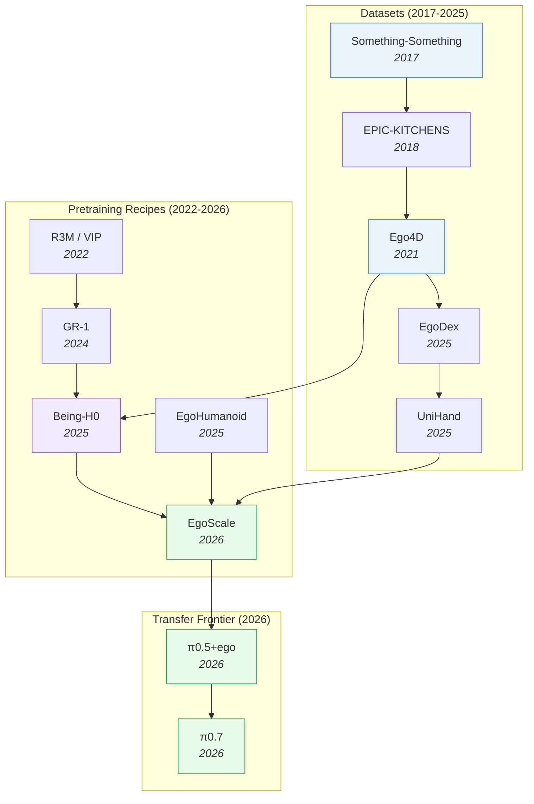

# Egocentric Pretraining & Human Video — Deep Dive

> [!abstract] Overview
> Robot teleoperation data is expensive ([[2212.06817|RT-1]]: 17 months, 13 robots, 130K demos). Egocentric human video is abundant ([[2110.07058|Ego4D]]: 3,670 hours; UniHand: 150M instruction-motion pairs). The 2026 frontier — [[2604.15483|π0.7]], [[2602.16710|EgoScale]], [[2507.15597|Being-H0]], [[2512.22414|π0.5+ego]] — converges on egocentric human video as the dominant pretraining substrate. [[2602.16710|EgoScale]] establishes a measurable scaling law (20,854-hour log-linear validation-loss curve), [[2507.15597|Being-H0]] introduces explicit physical instruction tuning, and [[2512.22414|π0.5+ego]] shows that human-to-robot transfer can **emerge** as a property of diverse pretraining mixtures without explicit kinematic alignment. This note maps the egocentric data → robot pretraining pipeline: datasets, scaling laws, transfer mechanisms (hand→gripper, viewpoint alignment), and the pretraining recipes that turn human video into robot policy.

## Evolution Graph

The field evolved through three phases. **Egocentric datasets** (2017-2025) scaled from [[1706.04261|Something-Something]]'s 108K clips to UniHand's 150M instruction-motion pairs. **Pretraining recipes** (2022-2026) progressed from frozen-encoder transfer (R3M/VIP) to full VLA pretraining on human videos ([[2507.15597|Being-H0]]) to scaling-law-validated egocentric pretraining ([[2602.16710|EgoScale]]). **Transfer frontier** (2026) treats humans as another embodiment in the VLA's pretraining mixture ([[2512.22414|π0.5+ego]]), letting transfer *emerge* without explicit alignment.

| Year | Paper | Contribution |
|------|-------|-------------|
| 2017 | [[1706.04261\|Something-Something]] | First common-sense visual reasoning video benchmark |
| 2021 | [[2110.07058\|Ego4D]] | 3,670 hours egocentric video; first internet-scale ego dataset |
| 2025 | [[2505.11709\|EgoDex]] | Large-scale egocentric video for dexterous manipulation |
| 2025 | [[2507.15597\|Being-H0]] | VLA pretrained on UniHand (150M pairs) via Physical Instruction Tuning |
| 2026 | [[2605.00078\|Being-H0.7]] | Latent World-Action Model: dual-branch future-informed training replaces pixel-space WAM; **99.2%** [[2306.03310\|LIBERO]] |
| 2026 | [[2604.27621\|Robot Learning from Human Videos Survey]] | Taxonomy of LfHV transfer: task / observation / action-oriented; **49–52%** egocentric in modern methods |
| 2025 | [[2602.10106\|EgoHumanoid]] | Robot-free egocentric demonstration → loco-manipulation; **2x** faster than teleop |
| 2026 | [[2602.16710\|EgoScale]] | 20,854-hour log-linear scaling law; **+54%** dexterous manipulation |
| 2026 | [[2512.22414\|π0.5 + ego]] | Human-to-robot transfer emerges in VLAs given diverse pretraining |
| 2026 | [[2604.15483\|π0.7]] | Steerable generalist building on egocentric pretraining frontier |
| 2026 | [[2604.18564\|MultiWorld]] | Multi-agent multi-view video world models for cross-embodiment |
| 2026 | [[2604.07457\|CMP]] | Competence-manifold projection for safe loco-manipulation transfer |
| 2026 | [[2605.09613\|SABER]] | Domain-specific ego+exo retail dataset → VLA post-training; **2.19x** SR gain on [[2511.10276|RoboBenchMart]] |

---

## Part A — Motivation & Data

*Why egocentric pretraining now, the dataset landscape, and the scaling laws that govern it.*

### 1. Why Egocentric Pretraining Now

Egocentric video captures *exactly* what a robot's wrist-mounted camera sees during manipulation: hands entering the frame from below, objects manipulated near the body, viewpoint moving with the actor's head. This kinematic alignment makes egocentric data a near drop-in replacement for robot teleoperation data — without the cost. The 2024–2026 transition wasn't simply "adding egocentric to the pretraining mix" — it redefined *what kind of data scales*: teleoperation produces minutes-per-dollar, egocentric video produces hours-per-dollar.

Three converging forces — **data abundance**, **embodiment alignment**, and **provable scaling** — make egocentric the dominant pretraining substrate for VLAs going into 2026. The field has crossed a measurable tipping point, quantified by [[2604.27621|Robot Learning from Human Videos Survey]] (the hierarchical LfHV taxonomy: ==task-oriented==, ==observation-oriented==, ==action-oriented==).

#### 1.1 Data Abundance

Egocentric video outscales every teleoperation pipeline by orders of magnitude and grows autonomously from internet head-cam footage. The abundance changes the economics of robot foundation models — the data-axis now dominates the architectural one.

- **[[2110.07058|Ego4D]]** — An internet-scale egocentric corpus of **3,670 hours** with **3.85 million** dense narrations and a ==five-task benchmark suite== (episodic memory, hands-and-objects, social interaction, forecasting); first dataset large enough to anchor VLA pretraining at internet scale, now a default first stage for generalist VLAs ([[2604.15483|π0.7]], [[2604.20100|JoyAI-RA]]).
- **[[2604.27621|Robot Learning from Human Videos Survey]]** — A hierarchical LfHV taxonomy by *what the human video supervises* (==task-oriented==, ==observation-oriented==, ==action-oriented==) quantifying the 2024 tipping point: **49%** of observation- and **52%** of action-oriented methods use egocentric viewpoints, and **44%** are deployable from human video alone.
- **Internet-scale corpora** (YouTube head-cam, body-worn datasets) — orders of magnitude larger than [[2310.08864|OXE]]-scale robot data; grow autonomously without curation pipelines. Compound with the [[2602.16710|EgoScale]] curve (§1.3): each doubling of human-video hours yields predictable robot-policy improvement at zero marginal data-collection cost.

#### 1.2 Embodiment Alignment

First-person hand-on-object video matches robot wrist-mounted cameras far better than third-person video, making the pretraining → deployment hop a *fine-tune* rather than a domain shift. This alignment is *why* egocentric pretraining transfers cleanly where pure third-person internet-video pretraining does not.

- **[[2602.10106|EgoHumanoid]]** — A robot-free egocentric-demonstration framework for humanoid loco-manipulation that aligns human data to the robot via a ==VR-based collection rig==, ==depth-based view alignment==, and ==unified 6-DoF delta EE poses==; **+19pp** in-domain SR (**78% vs 59%**), **+51pp** novel-env (**82% vs 31%**), at **~2×** collection speed.
- **[[2512.22414|π0.5+ego]]** — A ==co-training recipe== that integrates egocentric human video directly into a pre-trained VLA's training mixture with the ==same low-level action + high-level subtask objectives== as robot data — no explicit kinematic alignment, the "treat humans as another embodiment" approach; scene generalization **32 → 71%**, Dresser **25 → 50%**, egg-sorting **57 → 78%**.
- **[[2604.15483|π0.7]]** — A **5B**-parameter generalist VLA that conditions on ==multimodal context== — subtask instructions, ==multi-view subgoal images== (WM-generated), and ==episode metadata== — trained on robot + autonomous + egocentric human data under ==Knowledge Insulation==; out-of-the-box matches task-specific fine-tunes on espresso/box-building/laundry-folding.
- **[[2604.27621|LfHV Survey]]** — A field-wide accounting finding that **44%** of action-oriented LfHV methods are deployable from human video alone via ==executable interfaces==, requiring zero robot trajectory data; confirms the structural depth of the alignment convergence.
- **[[2504.13351|Chain-of-Modality]]** — A VLM program-synthesis recipe learning cross-embodiment manipulation programs from ==multimodal human videos== (RGB + EMG + audio) via ==Chain-of-Modality prompting== that reasons over each modality sequentially; force/contact cues from EMG+audio beat vision-only task-plan extraction, deploying cross-embodiment via abstracted API calls.

#### 1.3 Scaling Laws Hold

Egocentric pretraining obeys a *log-linear* scaling curve, making it the first robot-pretraining substrate with a measurable compute-data axis. Before 2026, robot pretraining had no scaling law — the shift changes how the field budgets pretraining runs.

- **[[2602.16710|EgoScale]]** — The first log-linear scaling curve for any robot-pretraining substrate, validated to **20,854 hours**; **+54%** task SR on 22-DoF dexterous hand; **88%** shirt-folding and **55%** bottle-unscrewing from a *single* robot demo; **+30%** cross-embodiment on 7-DoF tri-finger transfer. Two-stage recipe keeps the curve flat. See §3.

**Egocentric Substrate — Decision Matrix**

| Need | Recommended substrate |
|---|---|
| Largest available pretraining corpus | [[2110.07058\|Ego4D]] (**3,670 hr**) |
| Predictable scale-loss curve for budgeting | [[2602.16710\|EgoScale]] recipe over multi-source egocentric |
| Humanoid loco-manipulation transfer | [[2602.10106\|EgoHumanoid]] |
| Dexterous-hand priors (MANO-standardized) | UniHand in [[2507.15597\|Being-H0]] (**150M** pairs) |
| Tactile + egocentric vision in one stack | [[2605.13083\|TouchAnything]] (EgoTouch) |
| Domain-vertical post-training (retail, kitchen) | [[2605.09613\|SABER]] (**2.19×** SR gain on [[2511.10276\|RoboBenchMart]]) |
| Field-wide synthesis & taxonomy | [[2604.27621\|LfHV Survey]] |

> [!star] Key Papers
> - [[2604.27621|LfHV Survey]] — hierarchical taxonomy of human-video supervision (task / observation / action); quantifies the 2024 egocentric tipping point with **49% / 52% / 44%** adoption metrics — the first principled accounting of the shift
> - [[2602.16710|EgoScale]] — establishes log-linear scaling over **20,854 hours**; **+54%** task SR on 22-DoF dexterous hand; first proof that egocentric pretraining has a *measurable* compute-data axis (the field's "Chinchilla moment")
> - [[2110.07058|Ego4D]] — **3,670 hours** canonical foundation across 9 countries; defines the internet-scale tier every subsequent dataset benchmarks against
> - [[2507.15597|Being-H0]] — introduces UniHand: **150M** MANO-standardized motion-instruction pairs purpose-built for VLA training; turns raw egocentric video into trainable action priors
> - [[2602.10106|EgoHumanoid]] — first robot-free egocentric corpus targeting humanoid embodiment alignment; **~2×** collection-speed advantage over teleoperation

> [!tip] Egocentric Is the New Pretraining Substrate
> The economic shift is the load-bearing claim: teleoperation produces minutes-per-dollar, egocentric video produces hours-per-dollar, and [[2602.16710|EgoScale]]'s log-linear curve guarantees that the additional hours actually compound into capability. This is why every 2026 generalist VLA includes egocentric pretraining as a default stage — not as a niche augmentation. Cross-reference [[04_VLA#6. RL Post-Training for VLAs]] for how egocentric pretraining + RL post-training compose, [[06_WAM#2. VideoGen WAMs]] for the WAM-side reuse of the same corpora as video-prediction substrate, and [[10_Contact-Rich-and-Tactile-Control#4.1 Vision-to-Tactile Prediction — Closing the Supervision Bottleneck]] for the tactile axis being added on top via [[2605.13083|TouchAnything]].

---

### 2. Egocentric Datasets

The data foundation. Each dataset specializes in a different scale-modality-coverage trade-off.

#### 2.1 Foundational Visual-Reasoning Datasets

Common-sense action recognition substrates used as low-level verification benchmarks for egocentric pretraining.

- **[[2406.05756|EmbSpatial-Bench]]** — The first benchmark for *egocentric* spatial understanding of LVLMs in 3D embodied scenes, testing ==six egocentric relations== over Matterport3D / AI2-THOR / ScanNet, plus the ==EmbSpatial-SFT== tuning set; zero-shot LVLMs are weak (**49.11%** vs **90.33%** human), SFT lifts MiniGPT-v2 to **78.10%** — the diagnostic egocentric benchmark §7 flags as missing.
- **[[1804.02748|EPIC-KITCHENS]]** — The foundational egocentric action dataset: **55 hours** of *unscripted* kitchen video from **32** participants (**39.6K** action segments, **454.3K** object boxes), yet baselines are weak — **<40%** mAP detection, **20.5%** action recognition, **4.62%** anticipation — exposing how hard fine-grained egocentric understanding is.
- **[[1706.04261|Something-Something]]** — A low-level common-sense verification benchmark of **108,499** crowd-acted clips across **174** fine-grained ==human-object interaction== classes, built via ==natural-language caption-templates== with ==contrastive "pretending" examples==; 2D+3D-CNN baselines top out at **44.9%** top-1 error on 10 classes and **88.5%** on all 174.

#### 2.2 Internet-Scale Egocentric Video

Large, diverse first-person video corpora that anchor the *scale* tier of egocentric pretraining.

- **[[2110.07058|Ego4D]]** — An internet-scale egocentric corpus of **3,670 hours** from **931 wearers** across 9 countries / 74 locations with **3.85 million** dense narrations and ==multimodal data== (audio, ==3D environment meshes==, eye gaze, stereo); its ==five-task benchmark suite== has large headroom (NLQ R@1 IoU **5.47%**, AVD WER ~**60%**). First dataset large enough for VLA pretraining.

#### 2.3 Dexterous-Manipulation-Focused Egocentric Data

Specialist egocentric datasets that target fine motor / dexterous-hand action priors rather than general activity.

- **[[2606.17054|HUG]]** — A multi-fingered grasping model trained on 1M-HUGS, a **1-million-frame** egocentric human-grasp dataset (RGB-D + 3D hand poses via smart glasses), using ==flow-matching== RGB+point-cloud fusion to predict 99-D ==MANO grasp poses==; **66.7%** real SR on HUG-BENCH (**+23pp** over Dex1B), **62.0%** zero-shot in-the-wild.
- **[[2505.11709|EgoDex]]** — An ==Apple Vision Pro== egocentric dataset of **829 hr** / **338,000** demos across **194** tabletop tasks, annotated at **30 Hz** with ==SE(3) poses== for head, arms, and **25** hand joints via ARKit, that benchmarks ==dexterous trajectory prediction==. Flow-matching + diffusion beat BC when K>1; visual goal-conditioning gives **22%** average-distance reduction.
- **UniHand** (curated dataset in **[[2507.15597|Being-H0]]**) — **150M** human-hand motion-instruction pairs in standardized MANO parameters with LLM-generated task descriptions. Purpose-built for VLA training; turns raw egocentric video into trainable action priors.

#### 2.4 Cross-Embodiment Egocentric Demonstrations

Robot-free egocentric corpora collected specifically to bridge the human-robot embodiment gap.

- **[[2606.17385|EgoInfinity]]** — A web-scale 4D hand-object-interaction data engine converting in-the-wild RGB video into agent-agnostic metric trajectories via ==cross-module calibration==, then transferring them through ==SE(3)-equivariant cross-embodiment retargeting==; **0.821** IK success / **2.86 cm** error on Unitree G1, direct cutting/pouring on a dual-arm Franka FR3.
- **[[2606.14665|EgoGuide]]** — A robot-free demonstration-collection system giving demonstrators real-time ==visual-geometric novelty guidance== plus a ==Gated Egocentric Residual Policy== that blends a wrist-only base policy with a head-camera corrective branch via a learned gate; comparable SR with **~50%** fewer demos, **80%** SR on Pepper Sorting, gating raises ego influence under occlusion.
- **[[2602.10106|EgoHumanoid]]** — A robot-free egocentric-demonstration corpus aligned to humanoid loco-manipulation via ==depth-based view alignment== + ==unified 6-DoF delta end-effector poses==; **~2×** faster to collect than teleoperation, **+51pp** novel-environment generalization (**82% vs 31%**); bridges the embodiment gap at *data-collection time* rather than training or policy time.
- **[[2503.13441|PH2D]]** — A task-oriented egocentric demonstration dataset via *consumer-grade VR* (**~3.02M** frames / **~27k** demos), paired with the ==Human Action Transformer (HAT)== co-trained on mixed human/robot data in a **54-dim** state-action space; improves relative OOD generalization **~100%** vs robot-only and collects **~5×** faster than teleop (**4.09s** vs **19.72s** grasping).
- **[[2409.19499|FastUMI]]** — A redesigned, ==hardware-independent Universal Manipulation Interface== with decoupled hardware + first-person-tuned software; ships **10,000+** real demos across **22** tasks. RealSense T265 hits **10.5 mm** error; a ==Depth-Enhanced Diffusion Policy== lifts depth-sensitive tasks (Open Ricecooker **20% → 93.33%**) — scalable embodiment-agnostic collection.

Domain-vertical egocentric (+ exocentric) corpora used as a post-training layer to specialize generalist VLAs.

- **[[2606.04708|VISTA]]** — A data pipeline that adapts human-collected ==UMI fisheye== data for VLA training via ==UMI-VQA== (**8M** pairs) + ==physics-validated trajectory scoring== + ==flow-matching action-expert== co-training; **0.598** avg SR over 20 real tasks (**+7.0** over π0.5, **+28.5** over LingBot-VLA); validated subsets hit **0.65** vs **0.00** for low-score data.
- **[[2605.13083|TouchAnything]]** (EgoTouch) — The **first multi-view egocentric + bimanual dense tactile** dataset: **20 hours** of synchronized head + wrist video with bimanual 3D hand pose *and* dense tactile maps. A shared encoder fuses views with ==view dropout training==, lifting Volumetric IoU **+6.1%** over ego-only and cutting the all-view → ego-only drop **−27.20% → −5.78%**.
- **[[2605.09613|SABER]]** — A retail post-training dataset: **100+ hours** of grocery activity from ==egocentric== + ==exocentric== cameras, with three action streams (==[[2410.11758|LAPA]] latent actions==, Dex-Retargeting, Body Pose). It lifts [[2503.14734|GR00T N1.6]] on [[2511.10276|RoboBenchMart]] **13.4% → 29.3%** mean SR (**2.19×**); `close_fridge` **100%**, `open_fridge` **12% → 82%**.

#### 2.5 Egocentric Full-Body Pose Estimation

Upstream perception that recovers the demonstrator's full-body motion from head-mounted sensors — the body-trajectory signal that embodiment-alignment recipes ([[2602.10106|EgoHumanoid]]) retarget to robot joints.

- **[[2503.23094|FRAME]]** — An egocentric full-body motion estimator using head-mounted stereo fisheye video + on-board ==6D device pose== for a ==floor-aligned reference frame==, trained on the SELF real-world dataset; **47.53 mm** MPJPE (**28%** over prior SOTA), **100%** non-penetration, **3.47 cm/s** foot-slide, real-time ~300 FPS (**2.68 ms**) for VR/AR.
- **[[2308.06493|EgoPoser]]** — A real-time egocentric full-body pose estimator from sparse, intermittent MR head/hand tracking via ==realistic FoV modeling== (simulating out-of-view tracking gaps), ==global motion decomposition==, and calibration-free shape estimation; stable up to **50 m** from origin, **4.08 cm** mean vertex error, over **600 fps** — robust beyond origin-centric mocap.

**Dataset — Decision Matrix**

| Need | Dataset |
|---|---|
| Internet-scale general egocentric pretraining | [[2110.07058\|Ego4D]] (**3,670 hr**) |
| Low-level visual common-sense verification | [[1706.04261\|Something-Something]] |
| Dexterous-manipulation priors (MANO-aligned) | [[2505.11709\|EgoDex]] + UniHand in [[2507.15597\|Being-H0]] (**150M** pairs) |
| Humanoid embodiment alignment | [[2602.10106\|EgoHumanoid]] |
| Multi-view bimanual + dense tactile | [[2605.13083\|TouchAnything]] (EgoTouch) |
| Retail/grocery vertical post-training | [[2605.09613\|SABER]] (**2.19×** SR gain on [[2511.10276\|RoboBenchMart]]) |

> [!star] Key Datasets
> - [[2605.13083|TouchAnything]] — First multi-view egocentric + dense bimanual tactile dataset (**20 hr**, head + wrist + pressure maps); view dropout cuts the ego-only generalization drop from **−27.20% → −5.78%**; bridges egocentric video pretraining and tactile supervision
> - [[2605.09613|SABER]] — Domain-specific egocentric+exocentric data for retail VLA post-training; **2.19x** SR gain on [[2511.10276|RoboBenchMart]]
> - [[2507.15597|Being-H0]] — Introduces UniHand: 150M instruction-motion pairs in standardized MANO
> - [[2505.11709|EgoDex]] — Egocentric dexterous-manipulation video
> - [[2110.07058|Ego4D]] — 3,670-hour internet-scale egocentric video; the modern foundation

> [!tip] Dataset Choice Drives Recipe Choice
> Choosing between [[2110.07058|Ego4D]]'s scale and [[2505.11709|EgoDex]]'s dexterity isn't just a data decision — it constrains the *downstream recipe*. Internet-scale corpora support frozen-feature pretraining and broad VLA generalization; dexterity-focused corpora (UniHand, EgoDex) support action-decoder training; tactile-augmented corpora ([[2605.13083|TouchAnything]]) open a separate force-aware track. Cross-reference [[02_Dataset-Benchmark-Environment#1. Cross-Embodiment Scale Datasets]] for the broader cross-embodiment landscape (Ego4D alongside [[2310.08864|OXE]], DROID, AgiBot), and [[04_VLA#1. Design-Space Principles]] for how dataset choice constrains backbone selection per the [[2412.14058|RoboVLMs]] 600-experiment study.

---

### 3. Scaling Laws for Egocentric Pretraining

The 2026 result that anchors egocentric pretraining as a foundation-model strategy: it obeys a **log-linear scaling law** — the first such curve established for *any* robot-pretraining substrate. This makes the field's compute-data trade-off a tractable optimization for the first time: practitioners can plan against a predictable curve rather than gather "as much as possible" without a stopping rule.

The curve was established by [[2602.16710|EgoScale]] using a two-stage recipe (broad human pretraining → embodiment-aligned mid-training) on **20,854 hours** of heterogeneous egocentric data. Two open questions follow naturally: *how far does this curve extend?*, and *which axes (embodiment, modality, domain) preserve its slope?*

#### 3.1 The Established Curve

[[2602.16710|EgoScale]] proves log-linear scaling on heterogeneous human-video data with predictable real-robot transfer — the result that turns egocentric pretraining from a research curiosity into a *planned* foundation-model stage.

- **[[2602.16710|EgoScale]]** — A *deployment-predictive* log-linear loss curve over **20,854 hours** of heterogeneous egocentric data. **+54%** task SR on 22-DoF dexterous hand; **88%** shirt-folding and **55%** bottle-unscrewing from a single robot demo; **+30%** cross-embodiment on 7-DoF tri-finger transfer. Two-stage recipe keeps the curve flat at scale.

#### 3.2 Open Scaling Frontiers

Questions the [[2602.16710|EgoScale]] curve doesn't yet answer — the next research agenda for egocentric scaling beyond the established 22-DoF dexterous-hand regime.

- **Embodiment-specific curves** — does humanoid loco-manipulation scale at the same slope as dexterous hand manipulation, or does each embodiment need its own curve?
- **Modality-mixed scaling** — adding tactile inputs ([[2605.13083|TouchAnything]]) or force telemetry to the pretraining mix may shift the curve; not yet quantified
- **Long-tail domain coverage** — most egocentric data is kitchen / tabletop; scaling on outdoor, industrial, or healthcare environments is unmeasured
- **Distillation efficiency** — can the EgoScale curve be reproduced with **<20K hours** of higher-quality curated data? (analogous to LLM data-quality scaling laws)

**Scaling — Decision Matrix**

| Need | Recommendation |
|---|---|
| Budget egocentric pretraining (predictable ROI) | [[2602.16710\|EgoScale]] two-stage recipe |
| Maximize cross-embodiment transfer | Broad human pretraining → embodiment-aligned mid-training |
| Single-demo task specialization | [[2602.16710\|EgoScale]]-pretrained backbone + 1-demo fine-tune (**88%** shirt-folding precedent) |
| Push past 20K hours | Open question — no published data beyond the [[2602.16710\|EgoScale]] curve |
| Compute-optimal data sizing | Pick the point on the log-linear curve matching available compute |

> [!star] Key Papers
> - [[2602.16710|EgoScale]] — **20,854-hour** log-linear scaling law for human-to-robot transfer; **+54%** task SR on 22-DoF hand; **88%** shirt-folding from a *single* demo; the first *predictable* scaling axis for robot pretraining — every future generalist will be planned against this curve
> - [[2604.27621|LfHV Survey]] — provides the field-wide context: scaling-law adoption is one prong of the broader 2024 egocentric tipping point, not an isolated result
> - [[2110.07058|Ego4D]] — anchors the lower end of the EgoScale curve with **3,670 hours**; without it the scaling axis would have no foundation tier to start from

> [!tip] The Compute-Data Axis Is Now Measurable
> Before [[2602.16710|EgoScale]], robot pretraining had no scaling law — practitioners gathered "as much data as they could" without a principled stop point. [[2602.16710|EgoScale]]'s log-linear curve enables *compute-optimal* training: pick the data-compute trade-off that maximizes downstream performance per dollar. The open frontier — embodiment-specific curves, modality-mixed scaling, long-tail domain coverage — is now framed as a tractable research agenda. Cross-reference [[04_VLA#1. Design-Space Principles]] for how the [[2412.14058|RoboVLMs]] 600-experiment study mapped the design-space empirically, and [[15_Self-Evolving-VLA-WAM#3. Core Mechanisms of Self-Evolution]] for how self-evolution might *extend* the scaling curve via synthetic-data generation.

---

## Part B — Methods & Integration

*Three generations of pretraining recipes, hand→gripper transfer mechanisms, and integration with WAMs.*

### 4. Pretraining Recipes — Three Generations

How the recipe evolved — from frozen-feature transfer through video pretraining to full VLA-on-human-video.

#### 4.1 Generation 1: Frozen-Feature Transfer (2022)

Train a frozen visual encoder on egocentric video, then attach a separate policy head for robot tasks. Cheap and modular but loses task-relevant information — largely superseded by 2024.

- **R3M / VIP / VC-1** — canonical Generation-1 frozen-encoder recipes. Visual representations only; no action awareness in the pretraining stage. Effective baseline for low-data robot tasks but capped well below modern recipes.
- **[[2308.03620|Vi-PRoM]]** — A visual-pre-training scheme that ==contrastive-pretrains== on **EgoNet** (**~500K** Ego4D human-object-interaction clips) then ==supervised fine-tunes== for semantics + dynamics; EgoNet beats ImageNet (**40.5%** Franka Kitchen, **61.2%** MetaWorld), real robot learns 4 kitchen tasks from 30 demos — early proof ego data > generic images for frozen-feature transfer.

#### 4.2 Generation 2: Video Pretraining + Action Decoder (2024–2025)

Pretrain a video-prediction backbone on internet video (including egocentric), then fine-tune with action heads. The video objective gives spatiotemporal priors; the action head specializes for control.

- **[[2312.13139|GR-1]]** — A pioneering ==GPT-style decoder-only transformer== that does ==language-conditioned video generative pre-training== on **800k** Ego4D clips, then finetunes on CALVIN + real-robot data, jointly predicting actions/future frames. **94.9%** CALVIN multi-task (vs HULC **88.9%**), **+32.1pp** zero-shot unseen-scene, **0.79** real-world transport (vs RT-1 **0.27**).
- **[[2410.06158|GR-2]]** — A Generation-2 ==GPT-style transformer== over tokenized text/video/actions that does ==video-language pre-training on 38M== clips, then fine-tunes with a ==conditional VAE== for diverse action trajectories; **97.7%** multi-task tabletop SR, **79.0%** industrial bin-picking (vs GR-1 **35.9%**), **98.6%** CALVIN single-task with **4.64** task-sequence length.
- **[[2409.20537|HPT]]** — A modular ==stem-trunk-head== transformer pretrained on real-robot + sim + human-video + multi-embodiment data, where embodiment-specific stems tokenize proprioception + vision into a shared trunk via ==cross-attention==; validates robot scaling laws up to **>1B** params, **+10–30%** sim and **+20%** real SR over training from scratch.
- **[[2502.13142|ARM4R]]** — An auto-regressive robotic model pretrained on ==low-level 4D representations== (3D point tracks lifted from monocular human video via depth + tracking) in three stages (human-video pretrain → robotic 4D-tracking → control); **59.47%** RLBench (vs PerAct **55.33%**), **83.1%** real-robot (vs OpenVLA **37.2%**) — 3D point tracks share geometry with EE states.

#### 4.3 Generation 3: Full VLA Pretraining on Human Videos (2025–2026)

The 2026 frontier. Pretrain the entire VLA — vision, language, *and* action — on human videos by treating human hand motions as an action modality.

- **[[2606.17200|ACE-Ego-0]]** — A VLA pretraining framework unifying egocentric human video + robot data via a ==Unified Action Representation== (canonical head-camera frame) and a ==Reliability-Aware Objective== that down-weights noisy human pseudo-actions; **72.8%** RoboCasa GR1, **91.12%** RoboTwin 2.0 Easy, **78.3%** real bimanual ARX (**+6.6%** over π0.5), **4×** gain in data-scarce tasks.
- **[[2606.06194|ActiveMimic]]** (Active Perception) — An active-perception VLA that recovers *synchronized* egocentric camera + bimanual wrist trajectories from human video as a unified ==27-D action vector== via ==mix-of-transformers== (human pretrain → robot fine-tune); **90.1%** Restocking / **91.7%** Finding over robot-pretrained baselines, **79.0%** under flashing light.
- **[[2602.03310|RDT2]]** — A VLA pretrained on **>10,000 hours** of ==redesigned UMI== embodiment-agnostic human demos via a three-stage pipeline (==RVQ== action alignment → ==flow-matching== → one-step diffusion distillation) on Qwen2.5-VL; zero-shot cross-embodiment (**41%** Pick), **77%** cloth-folding (vs π0.5 **36%**), **4×** on unseen objects, **23 Hz** inference.
- **[[2507.15597|Being-H0]]** (Physical Instruction Tuning) — A three-stage VLA: Stage 1 pretrains on UniHand via ==GRQ-VAE== for part-level (wrist + finger) motion tokenization, Stage 2 physical-space alignment, Stage 3 robot-data post-training. **99.8–100%** valid generation rate, beating [[2503.14734|GR00T N1.5]] on MPJPE; **25%** of teleop data matches **50–100%** baselines.
- **[[2605.00078|Being-H0.7]]** (Latent Dual-Branch) — A ==latent world-action model== replacing the pixel WAM, using a ==Mixture-of-Transformers== to align a deployable "prior" branch to a "posterior" branch fed privileged future embeddings, dropped at deploy; **3–4 ms/step**, **99.2%** [[2306.03310|LIBERO]], **62.1%** [[2406.02523|RoboCasa]], **67.5%** real-world Dynamic Scene.
- **[[2602.16710|EgoScale]]** (Two-Stage Mid-Training) — A ==two-stage learning recipe== whose Stage 1 is extensive human pretraining on **20,854 hours** and Stage 2 mid-trains on a smaller embodiment-aligned human-robot dataset that bridges the embodiment gap before final fine-tuning; mid-training is the mechanism keeping the log-linear scaling curve flat at large data volumes.
- **[[2512.22414|π0.5 + ego]]** (Co-Training Recipe) — The simplest ==co-training recipe==, integrating egocentric human video into a pre-trained VLA's mixture with the same loss as robot data and no kinematic alignment, via head-worn + optional wrist cameras with ==6D pose + hand-keypoint estimation==; scene gen **32 → 71%**, Dresser **25 → 50%**, egg-sorting **57 → 78%** — transfer **emerges**.
- **[[2602.10106|EgoHumanoid]]** (Cross-Embodiment Loco-Manipulation) — A robot-free egocentric-demonstration recipe that retargets head-worn-camera demos to humanoid joints via ==depth-based view alignment== + ==unified 6-DoF delta EE poses==; **~2×** faster than teleop, **+19pp** in-domain (**78%**), **+51pp** novel-env (**82%**); human-only reaches **100%** on navigation-dominated subtasks.
- **[[2604.15483|π0.7]]** — A **5B**-parameter steerable-generalist VLA that combines ==multimodal context conditioning== (subtask instructions + multi-view subgoal images + episode metadata), ==Knowledge Insulation==, and ==prompt dropout==; out-of-the-box matches task-specific fine-tunes on dexterous long-horizon tasks and transfers cross-embodiment to a bimanual UR5e with no platform data.
- **[[2604.24681|MoT-HRA]]** (Human-Intention Priors) — A hierarchical policy pretrained on **HA-2.2M**: ==embodiment-agnostic 3D trajectory prediction== → ==latent human-intention model== (MANO) → robot action expert, with ==knowledge insulation==. **66.1%** SimplerEnv avg SR (**+22.3pp** over next-best **43.8%**); **0.136 m ADE** / **34.16°** finger-joint error on Ego4D.
- **[[2511.17366|METIS (VLA)]]** — A multi-source egocentric dexterous VLA that unifies human + robot data into an embodiment-agnostic action space via the ==EgoAtlas== dataset and ==motion-aware dynamics== tokens atop a Prismatic-7B/LLaMA-2 backbone with CoT reasoning; reaches **50%** SR with only **10%** fine-tuning data, beating ACT and OpenVLA on six real dexterous tasks.
- **[[2510.21571|VITRA]]** (Real-Life Human Activity Videos) — An automated pipeline turning *unstructured* human videos into VLA data via ==3D hand+camera pose tracking==, ==atomic-action segmentation==, and VLM instructions atop PaliGemma-2 + a ==Diffusion-Transformer action expert==. Yields a **1M-episode / 26M-frame** dataset; **1.2K** real trajectories then generalize to unseen objects.

**Pretraining Recipe — Decision Matrix**

| If your constraint is... | Generation | Recipe |
|---|---|---|
| Low compute / modular baseline | Gen 1 (frozen-feature) | R3M / VIP / VC-1 |
| Spatiotemporal priors + action head | Gen 2 (video pretrain + decoder) | [[2312.13139\|GR-1]] / [[2410.06158\|GR-2]] |
| Finger-level supervision from human video | Gen 3 (full VLA on human video) | [[2507.15597\|Being-H0]] (GRQ-VAE part-level tokens) |
| Real-time deployment after human pretrain | Gen 3 (latent dual-branch) | [[2605.00078\|Being-H0.7]] (**3–4 ms/step**) |
| Simplest transfer (no kinematic alignment) | Gen 3 (co-training) | [[2512.22414\|π0.5 + ego]] (humans-as-embodiment) |
| Humanoid loco-manipulation from human demos | Gen 3 (cross-embodiment) | [[2602.10106\|EgoHumanoid]] (**~2×** faster than teleop) |
| Steerable generalist SOTA | Gen 3 (co-pretraining stack) | [[2604.15483\|π0.7]] |

> [!star] Key Recipes
> - [[2507.15597|Being-H0]] — Physical Instruction Tuning + GRQ-VAE part-level motion tokens; **99.8-100%** valid generation
> - [[2605.00078|Being-H0.7]] — Egocentric pretraining + latent dual-branch reasoning; replaces pixel WAM with implicit latent prediction; SOTA on [[2306.03310|LIBERO]]/[[2406.02523|RoboCasa]] at 3-4 ms/step
> - [[2602.16710|EgoScale]] — Log-linear scaling law via two-stage human-pretraining + mid-training; **+54%** on 22-DoF dexterous hand
> - [[2512.22414|π0.5 + ego]] — Co-training recipe: humans as another embodiment, transfer emerges from diverse pretraining
> - [[2602.10106|EgoHumanoid]] — Robot-free egocentric demos for humanoid loco-manipulation; **~2x** faster than teleop
> - [[2604.15483|π0.7]] — Steerable generalist VLA building on egocentric pretraining frontier

> [!tip] Co-Train, Don't Align
> The 2026 surprise: explicit kinematic alignment between human and robot hands is *not necessary*. [[2512.22414|π0.5+ego]]'s "treat humans as another embodiment" recipe — feeding human videos into the training mixture with the same loss as robot data — achieves better transfer than aligned approaches. The VLA's diverse pretraining produces embodiment-agnostic representations on its own.

---

### 5. Transfer Mechanisms — Hand → Gripper

The kinematic gap is real: human hands have 22+ DoF; most grippers have 1–7. **Transfer mechanisms** are the bridge — the layer that converts a human-hand action prediction into something a robot end-effector can execute. The field has converged on three architectural strategies, each making a different bet on *where* to absorb the kinematic mismatch: project it explicitly via retargeting and parameterization, learn it implicitly by treating humans as another embodiment, or amortize it across a dedicated mid-training stage.

#### 5.1 Explicit Projection

Map human-hand outputs into gripper space via differentiable retargeting, MANO parameterization, hand-keypoint estimation, or 3D hand-object reconstruction. The kinematic mismatch is solved *at the projection layer* — the policy never sees the raw human hand.

- **[[2606.19333|Do as I Do]]** — A dexterous-data-generation algorithm reconstructing ==3D hand-object interactions== from monocular human video via ==guided-diffusion== object pose estimation, then retargeting them to robot actions through ==dynamics-aware sampling-based optimization== in a GPU simulator; **71%** retargeting SR on 655 in-the-wild trajectories vs **25%** baseline, 10 real tasks.
- **[[2606.01951|Ego-Video Robot Nav]]** — An explicit ==camera-motion projection== pipeline for navigation that estimates 6-DoF egocentric camera motion, ==kinematically projects== it to a ==2-DoF planar action space==, then co-trains a VLA with robot data; human-only nearly fails (**11.1%**) but co-training reaches **100%** seen, **94.4%** with distractors, **75.0%** on untrained positions.
- **[[2511.16661|AINA]]** — A method that learns multi-fingered policies from in-the-wild ==Project Aria Gen 2== smart-glasses human demos with *no robot data*: extract 3D object tracks + fingertip points, ==domain-align== to a robot frame, train ==3D point-cloud policies==, deploy via fingertip→joint IK; **86%** avg SR over 9 tasks from 15 min human video/task.
- **[[2509.22578|EgoDemoGen]]** — An ego viewpoint-generalization framework that ==EgoTrajTransfer==-projects robot action trajectories to novel ego viewpoints (IK-filtered) and ==EgoViewTransfer== synthesizes matching RGB via ==conditional video diffusion== with ==double reprojection==; **+16.9%** sim and **+23.0%** real SR on novel viewpoints — aligns observation *and* action frame together.
- **[[2507.15597|Being-H0]]** — An explicit-projection recipe that applies ==part-level tokenization== via ==GRQ-VAE==, tokenizing wrist and finger motions *separately* on standardized ==MANO parameters== so the gripper inherits structure from the wrist-token stream; **99.8–100%** valid generation, beating [[2503.14734|GR00T N1.5]] on MPJPE, **25%** of teleop data matching **50–100%** baselines.
- **[[2602.22209|WHOLE]]** — A method reconstructing world-grounded 3D articulated hand motion + 6D object trajectories from egocentric video via a ==guided generative diffusion== prior steered by reprojection + ==VLM-derived contact cues==; state-of-the-art local hand-pose and object-pose accuracy under occlusion and out-of-view objects, with temporally smooth world-grounded 4D output.
- **[[2602.09013|VIDEOMANIP]]** — A ==3D hand-object trajectory reconstruction== method from monocular RGB human video (3D meshes + hand poses + metric depth), refined with ==contact optimization== to synthesize multiple demos per video using RGB as the *only* data source; on the dexterous LEAP Hand it reaches **63.75%** grasping (20 objects in IsaacGym) and **62.86%** real-world (7 tasks).
- **[[2602.10106|EgoHumanoid]]** — A ==robot-free egocentric retargeting== method where head-worn demos + ==depth-based view alignment== + ==unified 6-DoF delta EE poses== retarget human body motion to humanoid joints, omitting proprioception in the co-trained VLA; **+51pp** novel-environment SR (**82% vs 31%**) — solves the embodiment hop at *data-collection time*.
- **[[2512.05094|GenMimic]]** — A generated-video-to-humanoid-motion framework that uses ==4D human reconstruction== to extract poses from generated RGB videos, ==retargets== them to 3D keypoints, then trains a ==physics-aware PPO== teacher to track them; **86.77%** sim SR on GenMimicBench (vs GMT **4.29%**, TWIST **2.69%**), deployed on a **23-DoF** Unitree G1.
- **[[2604.07457|CMP]]** — A ==competence-manifold projection== method for safety-critical loco-manipulation that combines a ==Lower-Bounded Safety Estimator== + ==Isomorphic Latent Space== for ==O(1) projection== of unsafe commands onto the closest safe hypersphere; up to **10×** survival in OOD-Geometry sim (**46.9% vs 4.7%**), **100%** real in-distribution, **86.7%** extreme OOD at **2.99 ms**.
- **[[2504.01959|SLeRP]]** — A slot-level placement system imitating a *single* human demo video by parsing objects + slots with ==SAM / DINOv2 / MASt3R==, detecting slots via ==Slot-Net== (image-difference prompts), then mapping to robot actions via a ==2D-to-3D transformation==; beats baselines on 2D-mask + 3D-transform accuracy, generalizing across objects/slots despite synthetic-only training.
- **[[2410.24221|EgoMimic]]** — A unified policy co-trained on human ==egocentric video== + robot demos via normalized hand/gripper data; **2 hr** robot + **1 hr** human beats **3 hr** robot-only (ACT) on bimanual tasks, with human-data diversity driving novel-object generalization — early proof that human ego video is *more* sample-efficient than extra robot data.

#### 5.2 Learned Gap (Treat-as-Embodiment)

No explicit projection layer; let the VLA absorb the kinematic difference through diverse pretraining. The bet is that architectural simplicity wins — emergent embodiment-agnostic representations arise from pretraining diversity when data scale is large enough.

- **[[2606.02745|SeeTraceAct]]** — A VLA using ==Visibility-aware latent planning== over cross-embodiment demo videos: a ==diffusion==-based policy derives a ==visual latent plan== supervised by a trace decoder predicting future EE 2D coordinates *and* validity, handling off-screen EE. **+4.4 pp** on cross-embodiment ROBOCASA-DC (**12.8%** vs **8.4%**), real-world unseen-task SR **37.5% → 50.0%**.
- **[[2512.22414|π0.5 + ego]]** — A "treat humans as another embodiment" ==co-training recipe== that integrates egocentric human video into the pre-trained VLA's mixture with the *same* loss as robot data, via head-worn + optional wrist cameras, with no MANO projection and no kinematic alignment; scene gen **32 → 71%**, Dresser **25 → 50%**, egg-sorting **57 → 78%**; transfer **emerges**.

#### 5.3 Embodiment-Aligned Mid-Training

Insert a dedicated training stage *between* broad human pretraining and final robot fine-tuning. Amortizes the embodiment hop across a smaller human-robot bridge dataset specifically designed for the kinematic alignment.

- **[[2604.20012|EmbodiedMidtrain]]** — A mid-training method quantifying the VLM↔VLA *data*-distribution gap (==Maximum Mean Discrepancy==); a ==data engine== scores VLM samples by proximity to the VLA distribution and mid-trains on the top-K closest. A **1.1B** InternVL3.5 surpasses expert VLA baselines **3–8×** larger across Calvin ABC-D, SimplerEnv Bridge, and LIBERO-10.
- **[[2602.16710|EgoScale]]** — A two-stage recipe whose mid-training keeps the log-linear curve flat at scale: Stage 1 broad human pretraining (**20,854 hours**), Stage 2 mid-training on a smaller embodiment-aligned human-robot dataset bridging the kinematic gap. **+54%** task SR on 22-DoF hand; **88%** shirt-folding from a single robot demo; **+30%** cross-embodiment. See §3.

#### 5.4 Active Vision from Egocentric Video

Rather than absorb the *kinematic* gap, these methods transfer the human's *active-perception* behavior — where to look, when to move the viewpoint — from egocentric video, decoupling the robot's gaze policy from its hand control.

- **[[2602.22461|EgoAVFlow]]** — An active-vision policy framework learning manipulation + viewpoint control from human egocentric video through a shared ==3D flow== embodiment-agnostic interface, with three diffusion models predicting actions, future flow, and viewpoints under a ==visibility-aware denoising reward==; **1.8–2.5×** SR over EgoZero, up to **4×** over Human-Viewpoint Imitation.
- **[[2602.04600|Act-Sense-Act]]** — A non-Markovian active-perception VLA (CoMe-VLA) pretrained on large-scale egocentric human data then robot-fine-tuned in a unified egocentric action space, via a ==Cognitive Auxiliary Head== + ==Dual-Track Memory==; **83.3%** mean SR over five long-horizon tasks (vs OpenVLA-OFT **12.7%**), **72.0→87.3%** as human data scales 400k→800k.
- **[[2506.10968|EyeRobot]]** — An active-gaze robot controlling a gimbal camera via a ==BC-RL perception-action loop== (RL eye policy rewarded by BC hand-policy success) and a ==Foveal Robot Transformer==, trained in ==EyeGym== real-to-sim from 360° video; **87%** towel-search SR over a **210°** workspace at **1.8 s** avg, with emergent gaze-switching beating static/wrist cameras.
- **[[2503.01439|AVR]]** — A bimanual active-vision system with a ==2-DoF gimbal motorized-zoom camera== and VR-projected ==head-tracked egocentric teleoperation==, feeding a ==Diffusion Policy== that jointly predicts actions, gimbal angles, and zoom; **>25%** SR gain on real precision tasks over static-view baselines, **5–17%** sim gain, with dynamic zoom critical for small-hole insertion.

#### 5.5 Embodiment-Agnostic Intermediate Representations

Learn a shared intermediate (skill latent, 3D motion field, semantic action flow) from unlabeled human + robot video, so the policy conditions on dynamics rather than embodiment-specific pixels. The gap is absorbed *inside the representation*, not at a projection layer.

- **[[2606.16202|EgoPhys]]** — A framework constructing deformable-object physical digital twins from single ==egocentric RGB-only video== via a ==codebook-based physics prior== (material prototypes predicting dense spring-stiffness fields) for zero-shot stiffness on unseen objects; **0.015** Chamfer / **0.025** track error, **77.6%** config-error cut in sim-to-real xArm6 manipulation.
- **[[2506.04227|Object-centric]]** — An ==object-centric 3D motion field== action representation learned from human video by predicting dense per-point object motion, via a ==denoising estimator== on **8M** synthetic noisy-RGBD samples then used to label human video for ==diffusion== policies; **>50%** lower 3D-motion error, ~**55%** zero-shot real SR (vs ≲**10%** prior), 2.5 mm insertion.
- **[[2505.08787|UniSkill]]** — A cross-embodiment imitation method that learns ==universal skill representations== from unlabeled human+robot video via ==Inverse / Forward Skill Dynamics== (depth-augmented, FSD as image-editing) encoding inter-frame motion not embodiment; beats GCBC / XSkill on real tabletop, kitchen, LIBERO when prompted by human video, +**15%** from Something-Something V2.
- **[[2505.01288|ViSA-Flow]]** — A ==semantic action flow== intermediate over manipulator-object interactions, pretraining a Transformer generative dynamics prior on human video then fine-tuning on sparse robot demos; **31.4%** CALVIN 5-task chain with only **10%** of robot demos (beating full-data baselines), **56.3%** real two-stage long-horizon — grounding + flow tracking are load-bearing.
- **[[2401.11439|General Flow as Foundation]]** — A scalable affordance predicting universal ==3D flow== (future point trajectories on objects) trained on cross-embodiment RGBD human video, sidestepping the sim-to-real gap; ScaleFlow reaches **3.55 cm** ADE / **4.70 cm** FDE and **81%** zero-shot human-to-robot transfer SR across 18 real tasks, with language-driven semantic control.

#### 5.6 Visual Embodiment-Gap Editing

Close the *visual* gap directly: estimate the human hand pose, inpaint the human arm out of the frame, and overlay a rendered robot arm/gripper that tracks the inferred action. The edited "robotized" video is then used to pretrain or co-train the policy.

- **[[2508.09976|Masquerade]]** — A data-editing pipeline that turns uncurated in-the-wild human video into "robotized" demos (hand-pose estimation + human-arm inpainting + ==virtual bimanual robot overlay==), then co-trains a ==diffusion== policy head with an auxiliary ==2D keypoint regression== loss; **74%** OOD-scene SR across 3 bimanual kitchen tasks (**5–6×** over baselines).
- **[[2505.11920|H2R]]** — A human-to-robot data-augmentation pipeline converting egocentric hand video to robot-centric pixels: ==HaMeR== 3D-hand estimation → robot-arm retargeting + camera alignment → ==SAM== segmentation + ==LaMa== inpainting → rendered-arm composite; **+1.3–10.2%** sim and **+3.3–23.3%** real SR across embodiments, **29.83** CLIP similarity confirming semantic preservation.
- **[[2503.00779|Phantom]]** — A zero-shot approach that trains robots without robots, deploying policies from human video only by inferring EE pose + gripper from depth-refined hand-pose estimation and bridging vision via ==Hand Inpaint== (segment + inpaint human arm, overlay virtual robot); **92%** Pick/Place, 72–**88%** rope/brush, 72–**84%** OOD-scene sweeping on real Franka + Kinova.

#### 5.7 Generative Video Transfer

Treat the human→robot hop as a conditional video-generation problem: a generative model learns fine-grained human-robot correspondence (or uses a human demo as a prompt), and the predicted video is decoded into actions. The generator absorbs the gap by internalizing *how* a task executes.

- **[[2505.20795|Human-Video-Prompt Policy]]** — A generalizable robot-policy method that uses a human demo video as a *prompt*: a fine-tuned ==cross-prediction== video model learns embodiment-transferable task representations, then a ==ProtoDiffusion Contrastive Policy== maps them to dexterous actions; **0.79** positional / **0.73** background SR, **0.47** on a novel skill vs **0.00** baselines.
- **[[2502.16587|Human2Robot]]** — An end-to-end ==conditional video-generation== framework on the **H&R** dataset (2,600 frame-synced human-robot episodes via VR teleop), framing alignment as video prediction → action decoding, with KNN retrieval for human-free seen tasks; **95%** basic-task SR (vs XSkill **53%**, DP **28%**), one-shot **100/80/70/80%** on appearance/position/object/background.

**Transfer Mechanism — Decision Matrix**

| Need | Mechanism |
|---|---|
| Cheapest baseline (post-training stage only) | Direct prediction: [[2507.15597\|Being-H0]] |
| Cross-embodiment via shared latents | Latent action: [[2410.11758\|LAPA]] (in [[2605.09613\|SABER]]) |
| Humanoid loco-manipulation transfer | Trajectory retargeting: [[2602.10106\|EgoHumanoid]] |
| Maximum scaling-law extension | Mid-training alignment: [[2602.16710\|EgoScale]] |
| Emergent transfer (no explicit alignment) | Co-training as embodiment: [[2512.22414\|π0.5 + ego]] |
| RGB-only dexterous training (no teleop hardware) | 3D hand-object reconstruction: [[2602.09013\|VIDEOMANIP]] |
| Safety-critical loco-manipulation transfer | Competence-manifold projection: [[2604.07457\|CMP]] |

> [!star] Key Papers
> - [[2512.22414|π0.5 + ego]] — "Treat humans as another embodiment" recipe; transfer **emerges** from diverse pretraining without explicit kinematic alignment
> - [[2507.15597|Being-H0]] — MANO + GRQ-VAE part-level motion tokens; the canonical explicit-projection approach for hand→gripper transfer
> - [[2604.07457|CMP]] — Competence-manifold projection for safe loco-manipulation transfer; the safety-critical projection method
> - [[2602.09013|VIDEOMANIP]] — 3D hand-object trajectory reconstruction + contact optimization on dexterous LEAP Hand; **63.75%** grasping (20 objects in IsaacGym) and **62.86%** real-world (7 tasks) without any teleoperation hardware — RGB human video as the *only* data source

> [!tip] Three Strategies, One Insight
> All transfer mechanisms ultimately do the same thing: project the high-DoF human hand into a representation the robot policy can consume. Whether the projection is explicit (MANO, keypoints, 3D reconstruction) or learned (treat-as-embodiment), the *amount* of data matters more than the *form* of the projection. [[2602.16710|EgoScale]]'s log-linear law holds across multiple projection schemes — the data axis dominates the architectural one. Cross-reference [[04_VLA#1. Design-Space Principles]] for the data-recipe design space ([[2412.14058|RoboVLMs]] 600-experiment findings) and [[15_Self-Evolving-VLA-WAM#3. Core Mechanisms of Self-Evolution]] for how transfer mechanisms compose with self-evolution loops.

---

### 6. Egocentric Pretraining Meets WAMs

Egocentric video is also the dominant pretraining substrate for video-WAMs (world-action models that predict pixel-space futures). The two pipelines — egocentric VLA pretraining and video-WAM pretraining — converge in 2026 around a shared insight: the same human-video corpora support *both* action priors (egocentric) and spatiotemporal priors (video-WAM), and the most capable generalist VLAs use them as orthogonal objectives on the same data.

This convergence has two architectural patterns: **multi-view models** that absorb egocentric video alongside exocentric streams as a unified input space, and the **co-pretraining recipe** that runs both objectives during VLA training.

#### 6.1 Multi-View Egocentric Models

Video-WAMs designed to ingest egocentric and exocentric video as a unified input space — no special-casing for the head-mounted-camera view. Egocentric video is a *strict subset* of multi-view input, so single-view egocentric is just a degenerate case of the same model.

- **[[2606.07326|AnchorWorld]]** — An egocentric world simulator with ==hybrid-view action control== — TPV pre-training for full-body context then FPV adaptation via ==projection-based action conditioning== + ==evolvable anchor-view customization== (6-DoF pose + evolution prompts as in-context priors); higher scene consistency (CLIP-V, PSNR) and lower camera error (ATE, RTE, RRE) than baselines.
- **[[2604.18564|MultiWorld]]** — A multi-agent multi-view video world model built on ==action-conditioned diffusion== + ==Flow Matching==, where a ==Multi-Agent Condition Module== and ==Global State Encoder== over pretrained ==VGGT== handle variable view counts; from one checkpoint it reaches **FVD 179** vs baselines' **207–245** and **RPE 0.67** vs **0.72–0.75**.
- **[[2506.09995|PlayerOne]]** — An ==egocentric world simulator== generating dynamic video from a single image under high-DoF human-motion control, via ==Part-disentangled Motion Injection== + ==Scene-frame Reconstruction==; **DINO-Score 67.8** (vs Cosmos-14B **51.6**), **MPJPE 127.16** / **FVD 226.12** — an egocentric-first WAM tying first-person camera motion to body control.
- **[[2410.06158|GR-2]]** — A Generation-2 ==GPT-style video-pretraining backbone== pretrained on **38M** clips that ingests egocentric streams as part of its general video corpus, then fine-tunes with action heads + ==conditional VAE== for trajectory diversity; **97.7%** multi-task tabletop SR and **75%** with only **50 demos/task** — the architecture the co-pretraining recipe (§6.2) extends.

#### 6.2 Co-Pretraining Recipe (Egocentric + Video-WAM)

Modern generalist VLAs run *both* pretraining objectives — egocentric action priors + video-WAM spatiotemporal priors — on overlapping corpora. The objectives are orthogonal: egocentric data teaches *what humans do with their hands*; video-WAM data teaches *how the world responds*. Combining them is now the default first-stage recipe.

- **[[2604.15483|π0.7]]** — A **5B**-backbone generalist VLA combining egocentric pretraining (action priors) + video-WAM pretraining (spatiotemporal priors), with ==multimodal context conditioning==, ==multi-view subgoal images== (WM-regenerated), and ==episode metadata== under ==Knowledge Insulation==; the two objectives compose cleanly on overlapping data — neither degrades the other.
- **[[2604.20100|JoyAI-RA]]** — A foundation model replicating the egocentric + video-WAM co-pretraining recipe via ==multi-source pretraining== (web + ==EgoLive egocentric== + sim + real-robot), a ==unified camera-frame action space==, and three-stage ==VLM → VLA → post-training==; **90.48%** / **89.28%** RoboTwin 2.0 Easy/Hard, **63.2%** RoboCasa GR1, **0.74** real AgiBot G1 (vs π0.5 **0.62**).
- **[[2312.13139|GR-1]]** / **[[2410.06158|GR-2]]** — A ==GPT-style video-pretraining + action-decoder== lineage: GR-1 pretrains on **800k** Ego4D clips with joint [ACT]/[OBS] tokens (**94.9%** CALVIN); GR-2 scales to **38M** clips with a ==cVAE action head== (**97.7%** multi-task tabletop SR); the architectural anchor every modern generalist VLA descends from.
- **[[2602.15922|DreamZero]]** — A **14B** pixel-space WAM reusing egocentric corpora, built as an ==autoregressive diffusion transformer== with a ==flow-matching objective== that jointly predicts future frames and actions, plus a ==DreamZero-Flash== variant at **7 Hz**; **62.2%** progress on seen tasks/unseen envs, **39.5%** unseen tasks, **+42%** cross-embodiment from 10–20 min of video.
- **[[2603.16666|Fast-WAM]]** — An action-conditioned ==Mixture-of-Transformer== WAM that decouples video co-training from inference via ==joint flow-matching== over an action expert + video backbone with ==structured attention== blocking future-video leakage, then *removes* the future branch at deploy; **97.6%** LIBERO, **91.8%** RoboTwin at **190 ms** (**4×** faster than imagine-then-execute).

**Stack Choice — Decision Matrix**

| Need | Recommendation |
|---|---|
| Multi-view (ego + exo) WAM input | [[2604.18564\|MultiWorld]] |
| Generalist VLA combining both pretraining stages | [[2604.15483\|π0.7]] or [[2604.20100\|JoyAI-RA]] |
| Foundational video-pretraining + action decoder | [[2312.13139\|GR-1]] / [[2410.06158\|GR-2]] |
| Pixel-space WAM using egocentric corpora | [[2602.15922\|DreamZero]] |
| Real-time action-conditioned WAM | [[2603.16666\|Fast-WAM]] |

> [!star] Key Papers
> - [[2604.18564|MultiWorld]] — Multi-agent multi-view video world models; egocentric video is a strict subset of the model's input space (not a special case)
> - [[2604.15483|π0.7]] — Steerable generalist combining egocentric pretraining + video-WAM pretraining; the current generalist SOTA
> - [[2604.20100|JoyAI-RA]] — Independent replication of the egocentric + video-WAM recipe; confirms the convergence pattern is not a single-lab artifact

> [!tip] The 2026 Stack
> Diverse cross-embodiment pretraining ([[2310.08864|OXE]]) + egocentric human pretraining ([[2110.07058|Ego4D]], [[2505.11709|EgoDex]], UniHand) + video-WAM pretraining (Cosmos, [[2602.15922|DreamZero]]) → flow-matching action head → in-domain post-training. This is the recipe behind [[2604.15483|π0.7]], [[2604.20100|JoyAI-RA]], and the next generation of generalist VLAs. Cross-reference [[06_WAM#2. VideoGen WAMs]] for the video-WAM side of the pipeline (where the same egocentric corpora are reused as pixel-prediction substrate) and [[04_VLA#5. World-Model-Augmented VLAs]] for how world-model-augmented VLAs compose this stack with planning and reasoning layers.

---

## Part C — Open Problems

*Where egocentric pretraining still falls short.*

### 7. Open Problems

Egocentric pretraining has crossed the "it works" threshold ([[2602.16710|EgoScale]]'s log-linear scaling proves the recipe) but coverage outside the 22-DoF kitchen/tabletop regime is sparse. All five problems below trace to the same axis: *distribution coverage*. Each one is what the current pretraining recipe doesn't yet generalize across — embodiments, domains, supervision modes, demographics, or evaluation setups.

- **==Long-tail egocentric distribution==** — [[2110.07058|Ego4D]] / [[1706.04261|Something-Something]] / [[2505.11709|EgoDex]] over-represent ==kitchen + tabletop== tasks. Egocentric data for industrial assembly, surgery, outdoor manipulation is scarce; the long tail is where deployment value lives but training signal doesn't.
- **==Annotation gap for evaluation==** — Pretraining is unsupervised, but evaluation needs ground-truth action labels. ==Diagnostic egocentric benchmarks== (LIBERO-Para-Ego?) don't yet exist; current evaluations conflate pretraining quality with downstream fine-tuning compute.
- **==Embodiment-specific scaling laws==** — [[2602.16710|EgoScale]]'s **20,854-hour** log-linear holds for **22-DoF dexterous hands**. Does it hold for humanoid full-body, mobile manipulators, or quadrupeds? Open. [[2602.10106|EgoHumanoid]] is the closest data point for humanoid loco-manipulation but not a controlled scaling-law study.
- **==Privacy and bias==** — Egocentric video contains personally identifying information (faces in mirrors, screen contents, surroundings) and reflects collector demographics. Trustworthy, privacy-respecting egocentric pretraining is unsolved; no current dataset has rigorous PII removal at scale.
- **==Reasoning vs reflex from human video==** — Most egocentric pretraining teaches motor patterns (reach, grasp, place). Learning *reasoning* from human video (planning sequences, error recovery, tool selection) is a separate, less-studied problem; the action labels rarely include the *intent* annotations needed for reasoning supervision.

**Egocentric Pretraining Failure Modes — Decision Matrix**

| Problem | Remediation Path |
|---|---|
| Need egocentric data outside kitchen/tabletop | Domain-specific collection (e.g. [[2605.09613\|SABER]] for retail); no general solution |
| Need diagnostic eval for egocentric pretraining quality | Research gap — no LIBERO-Para-Ego equivalent exists |
| Need scaling-law evidence for humanoid / mobile / quadruped | [[2602.10106\|EgoHumanoid]] (humanoid loco-manip, not controlled study); [[2604.07457\|CMP]] (safe loco-manip transfer) |
| Need PII-safe egocentric pretraining | No published solution; rely on consent-gated collection per project |
| Need reasoning (not just motor) from human video | [[2605.00078\|Being-H0.7]] (latent dual-branch reasoning, early) — research gap remains |
| Need broader specialist-dataset coverage | See [[02_Dataset-Benchmark-Environment#2. Multi-Modal & Specialist Datasets]] for the dataset landscape |

> [!star] Key Papers — Egocentric Failure Frontier
> - [[2602.16710|EgoScale]] — Canonical log-linear scaling proof at **20,854 hours** for 22-DoF dexterous; also the load-bearing evidence that *current* scaling laws don't extend beyond this regime
> - [[2602.10106|EgoHumanoid]] — Closest humanoid loco-manipulation pretraining at scale; **~2x faster** than teleop and the seed for any future humanoid scaling-law study
> - [[2605.00078|Being-H0.7]] — Latent dual-branch reasoning over human video; the first credible attempt to extract *reasoning* (not just motor patterns) from egocentric pretraining

> [!tip] Distribution Coverage Is the Bottleneck
> [[2602.16710|EgoScale]] proved log-linear scaling holds *within* the 22-DoF dexterous regime on kitchen/tabletop data. The five open problems above cluster around extending that result to *new embodiments* (humanoid, mobile, quadruped), *new domains* (industrial assembly, surgical, outdoor), *new supervision modes* (reasoning, not just motor patterns), and *new collector populations* (demographic diversity + privacy-respecting collection). Each extension likely requires its own diagnostic dataset — and none of those exist yet. Cross-reference [[02_Dataset-Benchmark-Environment#2. Multi-Modal & Specialist Datasets]] (the broader specialist-dataset landscape, where the long-tail gap is also the dominant theme) and [[04_VLA#1. Design-Space Principles]] (where the generalist-VLA recipe consumes egocentric pretraining; the embodiment-specific scaling gap is the bottleneck for the next generation of generalist policies).

---

## Quick-Reference Matrix

| Question | Answer |
|----------|--------|
| Need an egocentric dataset? | [[2110.07058\|Ego4D]] (general), [[2505.11709\|EgoDex]] (dexterous), or [[2605.09613\|SABER]] (domain-specific retail) |
| Need scaling-law-grade pretraining? | [[2602.16710\|EgoScale]] (20,854-hour log-linear) |
| Need full-VLA human pretraining? | [[2507.15597\|Being-H0]] (Physical Instruction Tuning) or [[2605.00078\|Being-H0.7]] (latent dual-branch reasoning) |
| Need a survey of human→robot transfer? | [[2604.27621\|Robot Learning from Human Videos Survey]] (task/observation/action-oriented taxonomy) |
| Need a co-training recipe? | [[2512.22414\|π0.5 + ego]] (treat humans as another embodiment) |
| Need humanoid loco-manipulation? | [[2602.10106\|EgoHumanoid]] (~2x faster than teleop) |
| Need multi-view + egocentric? | [[2604.18564\|MultiWorld]] |
| Need the current generalist SOTA? | [[2604.15483\|π0.7]] (egocentric-pretrained) |
| Need safe loco-manipulation transfer? | [[2604.07457\|CMP]] |

---

## Cross-References

- [[01_Embodied-AI-101]] — Embodied AI basics; egocentric pretraining is a fourth branch alongside VLA / WAM / self-evolving
- [[02_Dataset-Benchmark-Environment]] — Dataset deep-dive ([[2110.07058|Ego4D]], [[2505.11709|EgoDex]], [[1706.04261|Something-Something]] all live here)
- [[04_VLA]] — VLA deep-dive; §1 generalist VLAs ([[2604.15483|π0.7]], [[2512.22414|π0.5+ego]]) build on egocentric pretraining
- [[06_WAM]] — WAM deep-dive; §2 video pretraining for robot policies overlaps egocentric pretraining
- [[07_Latent-World-Models]] — Latent world models; some egocentric-pretrained VLAs use latent prediction
- [[15_Self-Evolving-VLA-WAM]] — Self-evolution; egocentric pretraining provides robust priors that resist forgetting
- [[08_Physics-Aware-Embodied-AI]] — Physics priors complement egocentric pretraining for the 2026 generalist stack
- [[05_VLA-Reasoning-and-CoT]] — Reasoning-augmented VLAs that consume egocentric pretraining

---

*See [[04_VLA]] for the broader VLA design space, [[02_Dataset-Benchmark-Environment]] for dataset details, or [[01_Embodied-AI-101]] to start from the basics.*
