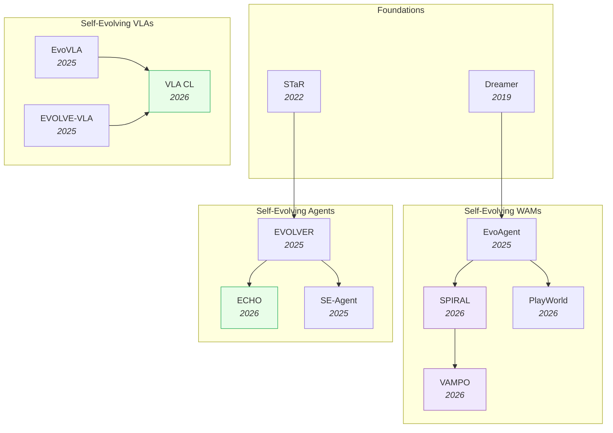
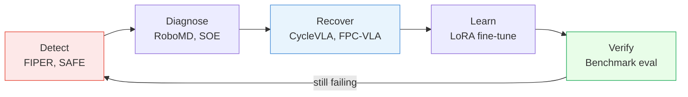

# Self-Evolving VLAs & WAMs — Deep Dive

> [!abstract] Overview
> Self-evolving embodied AI systems autonomously discover failure modes, generate new experience, and improve through real-world or simulated interaction. This note covers three paths to self-evolution: **VLAs** that self-evolve via RL fine-tuning (no world model needed), **WAMs** that self-evolve via imagination loops (world model generates synthetic experience), and **embodied agents** that combine both with persistent memory and curiosity-driven exploration. The key insight: start with a trained world model and add self-evolution — not the other way around.

## Evolution Graph

> [!info] Graph Legend
> - **Blue (foundations)** — pre-2024 foundational papers ([[2203.14465|STaR]], Dreamer)
> - **Purple (WAM thread)** — world-model-driven self-evolution; agent imagines/dreams
> - **Green (VLA + Agent threads)** — VLA RL post-training and agent-level behavior evolution
> - Arrows indicate intellectual lineage, not architectural inheritance

Three threads converge: **WAM self-evolution** (Dreamer → [[2502.05907|EvoAgent]] → [[2603.08403|SPIRAL]] → [[2603.19370|VAMPO]]) leverages world model imagination; **VLA self-evolution** ([[2511.16166|EvoVLA]] → [[2512.14666|EVOLVE-VLA]] → [[2603.03818|VLA CL]]) uses RL fine-tuning without explicit world models; **agent self-evolution** ([[2203.14465|STaR]] → [[2510.16079|EVOLVER]] → [[2601.06794|ECHO]] → [[2508.02085|SE-Agent]]) operates at the behavior level with persistent experience.

---

## Part A — Conceptual Framework

*The key question, the agent/VLA/WAM taxonomy, core mechanisms, and the failure-detection/diagnosis/recovery loop.*

### 1. The Key Question

> [!question] What's the best starting point?
> **Option 1:** Train a self-evolving agent, then add "dreaming" (future state prediction).
> **Option 2:** Take a trained [[07_WAM|world action model]], then add self-evolution.

==Option 2 wins.== A world model already has a robust latent space for generating synthetic future states. Adding memory and continual learning to a system that can already "imagine" is *easier than teaching a reactive agent to dream from scratch* — and the dominant 2025–2026 research output validates this: the strongest self-evolving systems all start from a pretrained dynamics model, a pretrained VLA backbone, or a pretrained agent with persistent memory. A model-free agent's neural pathways map states → actions only; bolting on a world model means rebuilding the architecture.

The "starting point" decision splits the research landscape into three paths — *agent-, VLA-, and WAM-side self-evolution* — each with different data, compute, and integration trade-offs. The remainder of this section maps these three paths and surfaces the canonical paper for each.

#### 1.1 Self-Evolving Agent (Behavior-Level)

Start from a pretrained agent with persistent experience memory; evolve *behavior* (strategies, skill libraries, prompts) rather than weights. Cheapest to bootstrap, but the agent never internalizes the improvement — it relies on external memory at deployment.

- **[[2510.16079|EVOLVER]]** — A method that distills raw interaction trajectories into ==strategic principles== stored in a persistent experience bank; behavior evolves without weight updates.
- **[[2601.06794|ECHO]]** — A co-evolutionary framework in which the agent's policy and its critic are jointly optimized via a ==saturation-aware reward==, the canonical agent-side closed loop.
- **[[2203.14465|STaR]]** — The foundational self-training pattern: ==generate → filter → retrain== on successes.

#### 1.2 Self-Evolving VLA (Policy-Level)

Start from a pretrained VLA backbone; evolve weights via RL post-training, continual learning, or self-correction. The pretrained VLM priors confer ==natural resistance to catastrophic forgetting==, making the VLA path more practical than NLP literature suggested.

- **[[2511.16166|EvoVLA]]** — The first end-to-end self-evolving VLA, overcoming ==stage hallucination== to gain **+10.2pp** sim, **+11.0pp** Sim2Real, and **1.5×** sample efficiency.
- **[[2603.03818|VLA Continual Learning]]** — A study proving pretrained VLAs are *naturally* resistant to forgetting; **2–4×** lower NBT with only **2%** replay data.
- **[[2605.08879|ConSFT]]** — A conservative-SFT objective that down-weights low-confidence transitions via an ==exponential conservative importance weight==, bounding parameter disruption; **34%** LIBERO / **28%** RoboTwin retention vs vanilla-SFT collapse.

#### 1.3 Self-Evolving WAM (Dynamics-Level)

Start from a pretrained world action model; evolve via imagination loops (synthetic rollouts) + RL on the dynamics. The model can *rehearse failure modes in imagination* before they cost real-world interactions — the dream-fidelity bottleneck replaces the data-collection bottleneck.

- **[[2502.05907|EvoAgent]]** — A method that builds a ==self-planning + self-control + self-reflection== loop on [[2301.04104|DreamerV3]], gaining **+105%** on long-horizon tasks.
- **[[2603.08403|SPIRAL]]** — A closed-loop self-improving action-world-model framework whose ==CriticAgent== verifies dream quality before training; **58.72%** EgoPlan, **+3.94%** over GPT-5.1.
- **[[2603.19370|VAMPO]]** — A method that re-frames ==video denoising as an MDP==; ==GRPO== with verifiable ==latent-consistency reward== ties visual quality to action quality; tops **CALVIN ABC→D** task completion over prior VLM/VPM methods.

**Key Question — Decision Matrix**

| Need | Starting Point |
|---|---|
| Cheap bootstrap, no weight updates | Agent path: [[2510.16079\|EVOLVER]] (experience principles) |
| Persistent open-ended curriculum | Agent path: [[2601.06794\|ECHO]] (policy + env co-evolve) |
| Real-robot RL post-training (preserve VLM priors) | VLA path: [[2603.03818\|VLA CL]] + LoRA |
| Bound parameter disruption during SFT | VLA path: [[2605.08879\|ConSFT]] |
| Imagination-driven exploration (no real-world cost) | WAM path: [[2502.05907\|EvoAgent]] or [[2603.08403\|SPIRAL]] |
| RL over video-generation steps | WAM path: [[2603.19370\|VAMPO]] |
| No pretrained backbone available (limited data) | WAM path: [[2301.04104\|DreamerV3]] from scratch |
| Multi-step agent tasks with verifiable rewards | Agent path: [[2506.21669\|SEEA-R1]] (tree-RL + MGRM, **+24%** via MCTS) |

> [!star] Key Papers
> - [[2502.05907|EvoAgent]] — Canonical *WAM path*: continual world model + self-planning/control/reflection; **+105%** long-horizon. The clearest evidence Option 2 wins on dynamics-heavy tasks.
> - [[2511.16166|EvoVLA]] — Canonical *VLA path*: end-to-end self-evolving VLA solving stage hallucination + fragile memory; **+10.2pp** sim SR, **+11.0pp** Sim2Real.
> - [[2510.16079|EVOLVER]] — Canonical *agent path*: experience-distillation lifecycle; behavior evolves without weight updates — the cheapest entry to self-evolution.

> [!tip] Pick Your Substrate Before Your Mechanism
> The starting point dictates the failure mode. *Agent path*: cheap but external memory dominates inference cost; *VLA path*: weights internalize improvement but RL signal is noisy without ground-truth reward; *WAM path*: imagination compounds gains but ==hallucinated dynamics== can corrupt the policy (see §8). Three substrates, three risk profiles — and the 2026 frontier is hybrid: WAM-pretrained backbone + VLA-style RL post-training + agent-style experience memory. Cross-reference [[07_WAM#1. The Design Space]] for the WAM design space the dynamics path inherits, [[05_VLA#9. Self-Evolving & Continual VLAs]] for the VLA path's continual-learning recipes, and [[11_Self-Evolving-AI#4. Self-Evolving Agents]] for the broader self-evolving landscape beyond embodied AI.

---

### 2. Self-Evolving Agent vs VLA vs WAM

The three substrates are *not* mutually exclusive — they're orthogonal points in the dynamics-richness × prior-richness plane. A self-evolving WAM is a *subset* of self-evolving agents (it has a world model on top); a self-evolving VLA sits between (rich VLM priors but may or may not include a world model). ==Not all self-evolving agents can predict the future==, and that asymmetry is what creates the design tension: imagination buys safe exploration but costs latency and risks ==dream hallucination==; pure-policy evolution stays grounded but loses the rehearsal benefit.

This section forces the comparison along three concrete substrates so the rest of Part B (§5 WAM, §6 VLA, §7 Agent) reads as parallel deep-dives rather than overlapping clusters.

#### 2.1 Agent-Side (Model-Free, Behavior-Level)

The broadest substrate. Maps state → action via trial and error with no explicit dynamics model. Evolution operates at the *behavior* level: experience banks, skill libraries, prompts, reasoning traces — not raw weights. Domain-agnostic but lacks imagination.

- **[[2510.16079|EVOLVER]]** — A lifecycle pairing ==offline experience self-distillation== + online interaction + ==GRPO== policy evolution with ==composite reward==; closes the loop without weight updates; **0.382** avg EM across 7 QA benchmarks (Qwen2.5-3B).
- **[[2601.06794|ECHO]]** — A ==Cascaded Evolutionary Rollout== + ==saturation-aware reward== loop with policy and critic co-optimized; **+7.28 pts** avg over GRPO across 4 open-world benchmarks and **+42%** relative on DeepSearch.
- **[[2506.21669|SEEA-R1]]** — A tree-structured RL method with a ==self-trained MGRM== reward model; **+24%** via MCTS; **46.27%** ALFWorld vs GPT-4o's **24%**.
- **[[2601.07055|Dr. Zero]]** — A self-evolving ==proposer-solver framework== whose search agents learn without human training data; ==HRPO== cuts rollout cost **~4×** vs GRPO.

#### 2.2 VLA-Side (Policy-Level, VLM-Pretrained)

A VLM-pretrained policy fine-tuned for embodied action. Self-evolution applies RL post-training + continual learning to *weights*. The pretrained backbone confers a ==broad parameter basin== that LoRA stays within — the surprising-but-replicated result that VLAs resist forgetting.

- **[[2511.16166|EvoVLA]]** — The first end-to-end self-evolving VLA; a ==Stage-Aligned Reward (SAR)== module using ==LLM-generated hard negatives== + ==image-text contrastive scoring== combats stage hallucination; **+10.2pp** sim SR (**69.2%** avg), **+11.0pp** Sim2Real, hallucination **38.5% → 14.8%**.
- **[[2603.03818|VLA Continual Learning]]** — A study showing pretrained VLAs *naturally* resist forgetting; near-zero NBT, **2–4×** lower than non-pretrained, **2%** replay buffer enough.
- **[[2605.08879|ConSFT]]** — A conservative-SFT method that bounds parameter disruption via an exponential conservative weight; **34%** LIBERO / **28%** RoboTwin retention vs vanilla-SFT collapse.
- **[[2603.11653|VLA RL CL]]** — A ==Sequential Fine-Tuning + LoRA + GRPO== recipe run on-policy across 5 lifelong RL benchmarks; **<2%** NBT and oracle-beating zero-shot generalization across OpenVLA / π-0.

#### 2.3 WAM-Side (Model-Based, Dynamics-Level)

A world model that maps $(S_t, A_t) \to (S_{t+1}, R_{t+1})$ — explicit dynamics enable *imagination*: simulate futures in latent or pixel space, rehearse risky actions safely, generate thousands of synthetic rollouts per real interaction. The richest path but bottlenecked on dream fidelity.

- **[[2502.05907|EvoAgent]]** — A self-evolving agent centered on a ==continual world model== over [[2301.04104|DreamerV3]]; **+105%** SR on Minecraft (**21.69%** Gold vs Optimus-1 **10.62%**), **6×** fewer ineffective actions, WM contributes **72%** of gain.
- **[[2603.08403|SPIRAL]]** — A ==think-act-reflect== loop: ==PlanAgent (CoT + DPO) + Action-Conditioned WM + VLM CriticAgent==; CriticAgent rejects bad dreams before ==GRPO== training; **58.72%** EgoPlan, **+3.94%** over GPT-5.1.
- **[[2603.19370|VAMPO]]** — A method framing ==video denoising as an MDP==; ==GRPO== over generation steps via an ==Euler Hybrid sampler== with ==latent-consistency reward==; best avg trajectory length on **CALVIN ABC→D**.
- **[[2506.23468|NavMorph]]** — An ==RSSM-based world model== with gradient-free ==Contextual Evolution Memory==; **+4.1% SR** / **+2.73% SPL** on RxR-CE unseen, CEM **2.1×** faster than gradient-based alternatives.

**Substrate — Decision Matrix**

| | Self-Evolving Agent | Self-Evolving VLA | Self-Evolving WAM |
|---|---|---|---|
| **Type** | Model-free (broadest) | VLM-based policy | Model-based (world model) |
| **Learns** | State → Action via trial and error | Language-conditioned manipulation via RL | Transition dynamics: $S_t, A_t \rightarrow S_{t+1}, R_{t+1}$ |
| **Can "dream"?** | No — reacts after the fact | No (unless WAM-augmented) | Yes — simulates futures in latent/pixel space |
| **Self-evolution** | Improve policy directly | RL post-training + continual learning | Minimize prediction error + policy improvement |
| **Key advantage** | General, domain-agnostic | Rich VLM priors, resistant to forgetting | Imagination for safe exploration |
| **Key risk** | Sample-inefficient; needs many real-world trials | Reward signal noisy without ground-truth | Hallucinated dynamics corrupt policy |
| **Best For** | Open-ended curriculum + verifiable rewards | Real-robot RL with pretrained backbone | Imagination-heavy rehearsal of failure modes |
| **Canonical paper** | [[2510.16079\|EVOLVER]] / [[2601.06794\|ECHO]] | [[2511.16166\|EvoVLA]] / [[2603.03818\|VLA CL]] | [[2502.05907\|EvoAgent]] / [[2603.08403\|SPIRAL]] |

> [!example] The Button Test
> A model-free agent learns "pressing button → reward" but has no concept of the gears behind the button. If the button jams, it's surprised *after* pressing. A VLA might generalize from similar buttons it's seen in training. A WAM *imagines* the jam scenario and plans accordingly.

> [!star] Key Papers
> - [[2510.16079|EVOLVER]] — Defines the agent-side substrate: distill raw trajectories into strategic principles; the cheapest self-evolution loop.
> - [[2603.03818|VLA Continual Learning]] — Defines the VLA-side surprise: pretrained VLAs are *naturally* forgetting-resistant; **2–4×** lower NBT, only **2%** replay needed.
> - [[2502.05907|EvoAgent]] — Defines the WAM-side blueprint: DreamerV3 + self-planning/control/reflection; **+105%** long-horizon improvement validates Option 2.

> [!tip] Three Substrates, Three Failure Modes
> The substrate decision dictates the failure mode you inherit. Agent-side: sample-inefficient — real-world trials dominate the cost curve unless you have verifiable rewards ([[2506.21669|SEEA-R1]]). VLA-side: RL signal is noisy and the backbone can degrade if SFT is unconservative ([[2605.08879|ConSFT]] mitigates). WAM-side: dream hallucination corrupts policy unless filtered ([[2603.08403|SPIRAL]]'s CriticAgent, [[2603.23376|ABot-PhysWorld]]'s Diffusion-DPO). Cross-reference [[05_VLA#9. Self-Evolving & Continual VLAs]] for the VLA self-evolution recipes in depth, [[07_WAM#7. Self-Evolving WAMs]] for the WAM self-evolution paradigms, and [[11_Self-Evolving-AI#5. Self-Evolving Embodied AI]] for the broader landscape beyond embodied AI.

---

### 3. Core Mechanisms of Self-Evolution

A ==self-evolving world action model== simultaneously learns to predict environmental dynamics (world model) and optimize decision-making (action model) through continuous, self-supervised interaction. These are the five core mechanisms:

#### 3.1 World Models as Internal Simulators

The agent maintains a learned dynamics model that simulates trajectories without physical execution — enabling safe exploration, sample-efficient learning via synthetic rollouts, and planning by evaluating many action sequences. The bottleneck is ==dream fidelity==: if the model hallucinates physically impossible transitions, the policy exploits artifacts that don't exist.

- **[[2502.05907|EvoAgent]]** — A self-evolving agent on a ==DreamerV3 backbone== with a continual WM and a self-planning/self-control/self-reflection loop; **+105%** on long-horizon tasks.
- **[[2301.04104|DreamerV3]]** — A model-based RL algorithm that concurrently trains a world model, critic, and actor by ==imagining future trajectories== in latent space, stabilized by ==symlog transforms== + ==KL balance with free bits==; **150+** tasks with *fixed hyperparameters*; the canonical dynamics-model substrate.
- **[[2005.05960|Plan2Explore]]** — A two-phase exploration framework that pursues an ==intrinsic motivation== of ==latent disagreement== (variance across an ==ensemble of predictors==) planned in imagination over a ==PlaNet/Dreamer world model==; zero-shot adaptation matching supervised Dreamer, few-shot in **100–150 episodes**.

#### 3.2 Co-Evolutionary Loops

Policy and world model improve each other in alternating rounds — better WMs produce more realistic synthetic data; better policies explore more diverse states; the cycle compounds. The risk is ==chasing==: the WM models the *previous* policy's distribution, destabilizing training if updates outpace WM retraining.

- **[[2602.12063|VLAW]]** — An ==iterative co-improvement== framework that alternately fine-tunes an ==action-conditioned world model== on real rollouts (failures included) then post-trains the VLA on its ==reward-model-filtered synthetic trajectories==; the field's most-copied co-evolution recipe.
- **[[2605.13775|RoboEvolve]]** — A planner-simulator co-evolutionary loop with a ==CLS-inspired "daytime exploration / nighttime consolidation"== cycle that learns from near-miss failures; **+36.4 abs pts** on EB-ALFRED with only **300** unlabeled seeds vs SFT on **25K** annotated trajectories.
- **[[2603.08403|SPIRAL]]** — A method that adds a ==CriticAgent== filtering hallucinated dynamics before they corrupt the policy; the dream-quality gate inside the co-evolution loop.
- **[[2601.06794|ECHO]]** — A synchronized co-evolutionary loop that jointly optimizes the agent's policy and its critic via a ==saturation-aware reward== rewarding "last-mile" gains; tasks retire and harden as success rate crosses threshold.
- **[[2504.21024|WebEvolver]]** — A co-trained world-model LLM as a ==virtual web server==; ==Multi-Step Look-Ahead (WMLA)== at depth 2 lifts WebVoyager to **51.37%** SR (**+10%** over OpenWebVoyager) and Mind2Web-Live **18.86% → 24.53%**.

#### 3.3 Self-Training and Self-Critique

==Generate candidate solutions → filter for correctness → retrain on successes.== Unlike code generation, embodied "correctness" requires either ground-truth reward or a ==learned verifier== (VLM-as-judge) — the bottleneck that makes self-critique harder than in language tasks.

- **[[2203.14465|STaR]]** — The foundational ==iterative bootstrapping== algorithm that fine-tunes only on ==self-generated rationales leading to correct answers==, plus ==rationalization== from hinted failures; the ==generate → filter → retrain== pattern underlying all later self-critique methods.
- **[[2603.16856|OEL]]** — A reward-free online learning loop that performs ==knowledge extraction== from interaction trajectories then ==on-policy context distillation== into weights via ==token-level reverse KL==; Frozen Lake response length **−30%** while accuracy improves.
- **[[2403.09629|Quiet-STaR]]** — A method that internalizes critique by generating ==reasoning traces within the forward pass==, eliminating the separate evaluation stage.
- **[[2510.16079|EVOLVER]]** — A method that distills raw trajectories into ==strategic principles== persisting across episodes; weights stay frozen, behavior evolves via memory.

#### 3.4 Curiosity-Driven Exploration

The agent self-estimates uncertainty and targets exploration where the model is worst — a self-directed curriculum. The critical pitfall: confusing ==aleatoric uncertainty== (irreducible randomness) with ==epistemic uncertainty== (reducible ignorance) wastes exploration budget on inherently stochastic states.

- **[[2503.01584|SENSEI]]** — A ==Semantic uncertainty + Go-Explore== method targeting the agent's hardest states via VLM-derived novelty signals.
- **[[2005.05960|Plan2Explore]]** — An ==Ensemble disagreement== curiosity signal; the prototype zero-shot exploration recipe.
- **[[2602.20057|AdaWorldPolicy]]** — A method that uses ==WM prediction error== directly as a self-improvement signal; policy updates focus on states with highest WM uncertainty.
- **[[2007.07853|gamma-Progress]]** — A method that weights curiosity by ==temporal discount==; focuses on uncertainties that matter for long-horizon tasks.

#### 3.5 RL Post-Training

After SFT on demonstrations, RL optimizes for task success. ==GRPO== (no critic network, compares trajectory groups) is the canonical recipe for flow-matching VLAs with continuous action spaces. The signal can come from sparse ground-truth, VLM-as-judge, or WM prediction error.

- **[[2603.19370|VAMPO]]** — A method that re-frames ==denoising as an MDP==; policy gradient over video generation steps with a ==latent-consistency reward== tying visual quality to action quality.
- **[[2509.19292|SOE]]** — A ==Variational information bottleneck== that identifies which action dimensions most need improvement; focuses RL compute where it matters; **50.8%** relative SR gain.
- **[[2603.11653|VLA RL Continual Learning]]** — A ==Sequential FT + LoRA + on-policy GRPO== recipe; minimal forgetting (**<2%** NBT) with oracle-beating zero-shot generalization across a task stream.
- **[[2505.05470|Flow-GRPO]]** — A ==GRPO== variant for ==flow-matching policies==: ==Flow-ODE→SDE conversion== for stochastic exploration + ==Denoising Reduction== for **4×** faster sample collection.

**Core Mechanisms — Decision Matrix**

| If you want the agent to... | Lever (mechanism) | Exemplar |
|---|---|---|
| Imagine trajectories without physical execution | Internal simulator | [[2502.05907\|EvoAgent]] / [[2301.04104\|DreamerV3]] |
| Compound policy + WM gains in alternating rounds | Co-evolutionary loop | [[2602.12063\|VLAW]] / [[2605.13775\|RoboEvolve]] |
| Filter hallucinated dreams before they corrupt policy | Critic-gated co-evolution | [[2603.08403\|SPIRAL]] |
| Retrain on self-verified successes | Self-training / self-critique | [[2203.14465\|STaR]] / [[2510.16079\|EVOLVER]] |
| Target exploration at hardest states | Curiosity-driven exploration | [[2503.01584\|SENSEI]] / [[2005.05960\|Plan2Explore]] |
| Optimize for success beyond imitation | RL post-training (GRPO) | [[2603.19370\|VAMPO]] / [[2505.05470\|Flow-GRPO]] |

> [!star] Key Papers
> - [[2602.12063|VLAW]] — Iterative co-improvement of VLA + world model; the canonical co-evolutionary loop
> - [[2503.01584|SENSEI]] — Semantic uncertainty + Go-Explore for curiosity-driven exploration; targets the agent's hardest states
> - [[2203.14465|STaR]] — Foundational self-training loop: generate → filter → retrain; the pattern that underlies all self-critique methods

> [!tip] The Five Levers
> Self-evolution combines all five mechanisms: the world model **imagines** scenarios, curiosity **targets** the hardest ones, RL **optimizes** the policy, self-critique **filters** bad solutions, and co-evolution **compounds** the gains. Each lever alone helps; together they create positive feedback loops.

---

### 4. Failure Detection, Diagnosis & Recovery

Self-evolution requires self-awareness. Before an agent can improve, it must first know *what* went wrong, *where* its policy is weak, and *when* to abandon a failing plan. This section covers the prerequisite layer that makes Sections 5-7 possible: the mechanisms by which agents **detect** failures, **diagnose** their root cause, and **recover** with corrective action.

#### 4.1 Runtime Failure Detection

VLMs and learned classifiers detect task failure in real-time so the agent can abort early. The cluster splits along the *signal type* — internal features, semantic misalignment, OOD score, density-based, multi-detector, calibration, LLM-driven, or human-shared.

- **[[2510.09459|FIPER]]** — A ==Predictive failure detection== method combining ==RND-OE== OOD score + ==Action-Chunk Entropy==, calibrated by ==conformal prediction==; catches failures *before* they happen; **0.78** overall accuracy across 5 sim/real envs.
- **[[2506.09937|SAFE]]** — A multitask failure detector that maps a VLA's own ==internal hidden-state features== through a lightweight ==MLP/LSTM== scorer + ==functional conformal prediction==; provable false-positive guarantees, no external sensor, **<1ms** added inference.
- **[[2410.00371|AHA]]** — An ==Instruction-tuned VLM== + ==FailGen== labeling; AHA-13B beats GPT-4o on AHA-Test (**0.446**) / RoboFail (**0.280**); feedback adds **+22.34%** RL reward synthesis, **+36.7%** TAMP, **+5%** zero-shot data-gen SR.
- **[[2509.16072|I-FailSense]]** — A ==LoRA-adapted VLM== + ==Grounded Arbitration== (per-layer FailSense classifier blocks, ensembled) comparing observed vs ==language-described expected outcomes==; **90.64%** semantic-misalignment detection, **74.28%** sim-to-real.
- **[[2510.01642|FailSafe]]** — An ==Automatic failure-action data pipeline==; FailSafe-VLM **0.9094** detect SR / **0.6522** action cosine; lifts OpenVLA **+22.6%**, OpenVLA-OFT **+8.0%**, π-FAST **+4.0%**, Stack-Cube xArm6 **56% → 76%**.
- **[[2603.11106|RC-NF]]** — A set of ==Robot-conditioned normalizing flows== that learn the joint distribution of successful execution; flags deviations in **<100ms**.
- **[[2503.08558|FAIL-Detect]]** — A ==logpZO== flow-based density + Conformal Prediction detector; **78%** balanced accuracy *without any failure data*.
- **[[2410.14868|Diff-DAgger]]** — A method that repurposes ==diffusion-policy training loss== as an uncertainty signal; **+39%** F1 over ensemble baselines.
- **[[2410.04640|Sentinel]]** — A runtime monitoring framework running two complementary detectors in parallel — ==STAC== (statistical temporal action consistency) for erratic failures + a ==CoT-VQA VLM== for task-progression failures; catches **+18%** more failures than either alone.
- **[[2507.17383|VLA Confidence Calibration]]** — An ==Action-Wise Platt Scaling== method; reduces Expected Calibration Error by **>20%**.
- **[[2407.08735|AESOP]]** — A dual-stage runtime monitor pairing a ==fast embedding anomaly detector== with a slow deliberative LLM, bridged by ==multi-contingency MPC== that keeps recovery options feasible during LLM latency; **100%** recovery on simulated quadrotor anomalies (vs **15%** naive MPC).
- **[[2510.02298|ARMADA]]** — A ==FLOAT detector== (**95%** accuracy) pooled across multiple robots; cuts human intervention by **23.3%**.

#### 4.2 Proactive Self-Correction

Detect and correct errors mid-task — three strategies: subtask backtracking, counterfactual reasoning, speculative verification.

- **[[2601.02295|CycleVLA]]** — A method that decomposes tasks into ==subtask cycles==; detects subtask failure and ==backtracks to last known good state== rather than restarting from scratch.
- **[[2512.24426|CF-VLA]]** — A ==Counterfactual reasoning== method: generates "what if I had done differently?" action sequences and compares predicted outcomes against the current trajectory.
- **[[2511.14148|AsyncVLA]]** — An ==Asynchronous Flow Matching (AFM)== method with a ==confidence rater== masking low-confidence tokens for regeneration; **97.4%** LIBERO avg, **70.8%** WidowX, **74.9%** Google Robot visual-matching.
- **[[2604.02965|SV-VLA]]** — A ==Speculative verification== method: open-loop action plans verified step-by-step against reality before committing.
- **[[2602.21633|SC-VLA]]** — A self-correcting VLA that refines actions mid-task via ==Online Action Refinement== — a ==residual RL== policy guided by ==intrinsic dense rewards== from ==Sparse World Imagination== of short-horizon physical state; **86%** ManiSkill3 avg, **71%** real ARX5 SR.

#### 4.3 OOD & Surprise Detection

WM prediction error as a failure signal — when the world model's prediction diverges from reality, the agent is in uncharted territory. The practical challenge: distinguishing genuine surprises from noise and stochastic dynamics.

- **[[2603.04029|Self-Adapting RL]]** — A method that monitors ==residuals== between predicted and observed next-states; triggers ==targeted self-adaptation== for novel regions instead of global retraining; adapts F1Tenth to friction shift in **8 min**.
- **[[2512.01119|WM Surprise Robustness]]** — A method that filters noisy prediction errors to distinguish ==genuine novelty== from sensor noise + stochastic dynamics; avoids false-alarm adaptation triggers.
- **[[2602.20057|AdaWorldPolicy]]** — A method that uses ==WM prediction error== directly as a gradient signal; focuses policy updates on states where the WM is least confident.

#### 4.4 Active Probing for Weaknesses

Deliberately search for policy failure modes during training rather than waiting for production failures — adversarial probing, information-bottleneck action analysis, or curiosity-driven coverage.

- **[[2412.02818|RoboMD]]** — A method that trains an ==RL adversary== to find the conditions under which the target policy fails; systematically maps the failure landscape.
- **[[2509.19292|SOE]]** — A ==Variational information bottleneck== that identifies action dimensions lacking confidence; surfaces skills needing improvement.
- **[[2503.01584|SENSEI]]** — A method combining ==epistemic uncertainty== with ==Go-Explore== weighting over a ==DreamerV3 world model==; an adaptive policy systematically visits states where the model's predictions and semantic novelty are highest.
- **[[2005.05960|Plan2Explore]]** — A method that extends curiosity to ==zero-shot task adaptation== via a WM pretrained purely through exploration.
- **[[1705.05363|ICM]]** — The Intrinsic Curiosity Module: an ==inverse + forward dynamics== architecture whose ==forward-model prediction error== serves as the intrinsic exploration reward; the foundational curiosity recipe, learning Super Mario with zero extrinsic reward.

#### 4.5 Failure Recovery

After detection, generate recovery plans and learn from failures so they don't recur — combining failure prediction with corrective generation, root-cause analysis, or synthetic failure injection.

- **[[2606.03385|GTP-FA]]** — A closed-loop ==execute-diagnose-update== framework linking grasp choice to task outcome via a ==Failure Attribution Discriminator== + ==diagnosis-driven bidirectional optimization==; up to **+54.0pp** terminal SR in ManiSkill3 and real Franka π0.5 jumping **11.2% → 76.8%** on long-horizon tasks.
- **[[2509.04018|FPC-VLA]]** — A ==dual-model== VLA + ==VLM supervisor== combining ==failure prediction + corrective action generation==; a ==dual-stream action fusion== module (cosine-similarity pose + temporal-decay gripper) smooths recovery; **86.0%** real-world SR, disturbance drop cut **31.3% → 16%**.
- **[[2404.00756|Recover]]** — A ==Neuro-symbolic== framework with an ==OntoThor ontology== + LLM planning; **100%** rule-based failure-detection, **~70%** recovery rate, **100%** safety-issue detection / **93%** recovery, **59% / 33%** task SR on simple/complex tasks.
- **[[2505.12224|RoboFAC]]** — A ==failure analysis + correction== framework — a ==9,440-trajectory failure dataset== with a ==three-level taxonomy== plus a model that acts as an ==external critic== in the VLA loop; **79.10%** analysis score (vs GPT-4o **57.42%**), lifts real-world SR **47.5% → 61.25%**.
- **[[2409.03966|VLM Failure Recovery]]** — An approach using GPT-4o as a ==black-box controller== via ==prompt engineering== (visual markers + relative-position prompts) with detection/correction decoupled; Lego Assembly 3D error **0.005m** (vs **0.016m** OpenVLA), Target Reach **0% → 65.78%**, **116/120** detection / **110/120** analysis.
- **[[2603.13528|Counterfactual Failure Synthesis]]** — A pipeline that synthesizes ==counterfactual failure rollouts== via ==action perturbations== into a generative WM (Ctrl-World), filtered by a ==multi-verifier mechanism== (VLM/IDM/pose/point-track); **120K+** failure-recovery pairs; **46%** real-world closed-loop recovery rate.

**Failure Detection & Recovery — Decision Matrix**

| If you need to... | Approach | Exemplar |
|---|---|---|
| Detect failure *before* it happens | Predictive OOD + action uncertainty | [[2510.09459\|FIPER]] |
| Detect with provable false-positive bounds | Internal features + conformal prediction | [[2506.09937\|SAFE]] / [[2503.08558\|FAIL-Detect]] |
| Detect semantic-misalignment failures | VLM compares observed vs expected outcome | [[2509.16072\|I-FailSense]] / [[2410.00371\|AHA]] |
| Correct mid-task without restarting | Subtask backtracking / counterfactual | [[2601.02295\|CycleVLA]] / [[2512.24426\|CF-VLA]] |
| Detect OOD via world-model surprise | Prediction-residual monitoring | [[2603.04029\|Self-Adapting RL]] / [[2512.01119\|WM Surprise Robustness]] |
| Discover where the policy is weak | Adversarial / info-bottleneck probing | [[2412.02818\|RoboMD]] / [[2509.19292\|SOE]] |
| Generate recovery plans + learn from failures | Failure prediction + corrective generation | [[2509.04018\|FPC-VLA]] / [[2505.12224\|RoboFAC]] |

> [!star] Key Papers
> - [[2510.09459|FIPER]] — Predictive failure detection via OOD + action uncertainty; catches failures *before* they happen, giving the agent time to intervene
> - [[2412.02818|RoboMD]] — Active adversarial probing: trains an RL adversary to systematically discover where the policy fails, mapping the failure landscape
> - [[2601.02295|CycleVLA]] — Proactive mid-task correction via subtask cycling and backtracking; detects and recovers from errors without restarting the entire task

> [!tip] Detection Before Correction
> Self-evolution requires self-awareness. An agent that can't detect failure can't improve from it. The detection mechanism determines what the agent can learn: [[2510.09459|FIPER]] detects WHEN tasks fail, [[2412.02818|RoboMD]] discovers WHERE policies are weak, and [[2503.01584|SENSEI]] finds WHAT the world model doesn't know. Together they form a complete diagnostic stack — temporal detection, spatial localization, and epistemic coverage — that feeds the self-improvement loops in Sections 5-7.

---

## Part B — Self-Evolving Systems by Subject

*Three concrete instantiations: self-evolving WAMs, VLAs, and embodied agents.*

### 5. Self-Evolving WAMs

WAMs have a unique advantage for self-evolution: they already have a learned dynamics model that can generate synthetic experience. The agent "rehearses" in imagination, discovers failure modes, and improves without costly real-world interaction. The cluster splits along *how* the model uses its imagination to drive improvement — reflective planning loops, RL over dynamics, self-play data engines, or continual learning with replay.

#### 5.1 Reflective Planning Loops

The world model generates a plan or rollout; a separate critic (or the agent itself) evaluates the plan against dynamics fidelity or task completeness; failed plans are rejected and regenerated. The critic stage is the load-bearing innovation — without it, hallucinated dynamics propagate into the policy.

- **[[2603.08403|SPIRAL]]** — A ==PlanAgent + Action-Conditioned WM + CriticAgent== loop; CriticAgent rejects bad dreams pre-training; **58.72%** EgoPlan-Bench, **+3.94%** over GPT-5.1, **+6.89%** over fine-tuned Video-LLaMA.
- **[[2502.05907|EvoAgent]]** — A self-evolving architecture centered on a ==continual world model== via a three-part loop — ==self-planning== (LoRA task planner), ==self-control== (monitor prediction error mid-execution), ==self-reflection== (CL-based reflector updates WM + policy post-hoc); **+105%** on long-horizon tasks.
- **[[2506.23468|NavMorph]]** — An ==RSSM-based== self-evolving WM for VLN-CE; World-aware Navigator + Foresight Action Planner; **+4.1% SR** / **+2.73% SPL** on RxR-CE unseen.

#### 5.2 RL on Dynamics & Co-Evolving Loops

Apply policy-gradient RL directly to the world model's generation steps, or co-train policy and world model in alternating rounds so each improves the other. The risk is ==chasing== — the WM models a policy that no longer exists between updates.

- **[[2603.19370|VAMPO]]** — A method that re-frames ==video denoising as an MDP==; ==GRPO== over generation steps via an ==Euler Hybrid sampler== with verifiable ==latent-consistency reward==; best avg trajectory length on **CALVIN ABC→D**.
- **[[2504.21024|WebEvolver]]** — A co-learning framework that trains a web agent alongside a ==world-model LLM as virtual web server==, enabling ==Multi-Step Look-Ahead (WMLA)== at inference; **+10%** over OpenWebVoyager and **51.37%** WebVoyager SR (depth-2 WMLA); canonical alternating co-evolution recipe in the web-agent setting.
- **[[2602.20057|AdaWorldPolicy]]** — A ==Flow-Matching DiT== world model + action expert trained via ==Online Adaptive Learning (AdaOL)==, using ==WM prediction error== as a self-supervised LoRA signal; **0.96** LIBERO-10, recovers under OOD shift at **4Hz** on real robots.
- **[[2511.18810|MergeVLA]]** — A cross-skill model-merging method toward a generalist VLA; **90.2%** LIBERO cross-skill, **62.5%** LIBERO-Plus; direct merging baselines score **0%**.

#### 5.3 Self-Play & Continual Replay

Autonomous data engines that generate their own training data via self-play, plus replay strategies that prevent catastrophic forgetting in long-running continual RL. The substrate for *long-lived* WAM training without curated data.

- **[[2603.09030|PlayWorld]]** — A data engine that feeds autonomous self-play data collection into world-model training, reaching Pearson **0.8766** sim-real correlation and **+65%** real-world SR via in-model fine-tuning.
- **[[2503.01584|SENSEI]]** — A method that distills a ==VLM-derived semantic intrinsic reward== into a ==DreamerV3 world model==, combined with ==epistemic uncertainty== and ==Go-Explore== weighting; downstream tasks learned **orders of magnitude faster** than Plan2Explore.
- **[[2401.16650|WMAR]]** — A ==memory-efficient augmented replay== (FIFO + reservoir) on top of [[2301.04104|DreamerV3]]; forgetting **0.071 vs 0.665** baseline.

**Self-Evolving WAM — Decision Matrix**

| Need | Recommendation |
|---|---|
| Reflective video-plan generation with built-in critic | [[2603.08403\|SPIRAL]] (**58.72%** EgoPlan, **+3.94%** over GPT-5.1) |
| Continual DreamerV3 + self-planning/control/reflection | [[2502.05907\|EvoAgent]] (**+105%** long-horizon) |
| Self-evolving WM for VLN-CE | [[2506.23468\|NavMorph]] (**+4.1% SR** RxR-CE unseen) |
| RL over video-generation steps (denoising as MDP) | [[2603.19370\|VAMPO]] |
| WM prediction error as self-improvement signal | [[2602.20057\|AdaWorldPolicy]] |
| Co-evolving agent + WM in alternating rounds | [[2504.21024\|WebEvolver]] |
| Cross-skill merging toward generalist VLA | [[2511.18810\|MergeVLA]] (**90.2%** cross-skill, **62.5%** LIBERO-Plus) |
| Self-play data engine for WM training | [[2603.09030\|PlayWorld]] (**+65%** real SR via in-model fine-tune) |
| Curiosity-driven WM pretraining (semantic uncertainty) | [[2503.01584\|SENSEI]] |
| Continual RL replay without forgetting | [[2401.16650\|WMAR]] (forgetting **0.071 vs 0.665**) |

> [!star] Key Papers
> - [[2603.08403|SPIRAL]] — Canonical reflective loop: ==PlanAgent + Action-Conditioned WM + CriticAgent== closes the dream-fidelity gap; **58.72%** EgoPlan-Bench beats GPT-5.1 by **+3.94%**.
> - [[2502.05907|EvoAgent]] — Canonical DreamerV3-derived self-evolving WM; the **+105%** long-horizon result is the strongest evidence that Option 2 (start from WAM) works.
> - [[2603.19370|VAMPO]] — Canonical RL-on-dynamics: denoising-as-MDP + ==latent-consistency reward==; ties visual quality directly to action quality during generation.
> - [[2511.18810|MergeVLA]] — Canonical model-merging path to self-evolution: **90.2%** LIBERO cross-skill where naive merging scores **0%**.

> [!tip] Imagination Buys Rehearsal, Critics Buy Safety
> WAMs let the agent rehearse without real-world cost — but raw imagination is dangerous. [[2603.08403|SPIRAL]]'s CriticAgent and [[2502.05907|EvoAgent]]'s self-reflection both add an ==explicit dream-quality gate== before the policy learns from the rollout. Without that gate, ==hallucinated dynamics== (see §8) compound into entropy collapse or value drift. The 2026 pattern: every self-evolving WAM has a critic, replay buffer, or DPO-style filter between dream and policy update. Cross-reference [[07_WAM#7. Self-Evolving WAMs]] for the broader WAM self-evolution paradigms, [[08_Latent-World-Models#3. Broader Latent Prediction Landscape]] for the latent-prediction substrate these imagination loops run over, and [[11_Physics-Aware-Embodied-AI#3. Explicit Physics Losses for Video Generation]] for physics-priors that further reduce dream hallucination.

---

### 6. Self-Evolving VLAs

VLAs can self-evolve *without* an explicit world model — their rich VLM representations from large-scale pretraining provide enough structure for RL-based self-improvement and continual learning. The empirical surprise: pretraining on diverse cross-embodiment data ([[2310.08864|OXE]]: 1M+ trajectories from 22 robot types) creates a broad, well-structured parameter basin. Sequential task fine-tuning with ==LoRA== stays within this basin — the ==low-rank constraint== confines updates to a small subspace, preserving the vast majority of pre-trained parameters. This is the *opposite* of what the NLP literature suggested, and it makes VLA self-evolution far more practical than expected.

The cluster splits along *which side of the SFT-RL recipe* it stabilizes — the conservative-SFT lineage prevents the policy from collapsing under fine-tuning, the continual-RL lineage prevents forgetting across a task stream, and the memory-augmented lineage adds persistent experience storage on top.

#### 6.1 Conservative SFT & Stable Fine-Tuning

Stabilize the SFT side of the recipe to bound parameter disruption — the policy can't self-evolve if downstream fine-tuning collapses the pretrained backbone. The axis: *constrain weight updates without sacrificing target-task performance*.

- **[[2605.08879|ConSFT]]** — An ==exponential conservative importance weight== ω(θ) = exp(−L_SFT(θ) / τ) with ==stop-gradient operator== + ==annealing schedule== on τ; analytically bounds parameter-disruption risk for high-loss transitions; **34%** LIBERO / **28%** RoboTwin retention vs vanilla SFT's collapse. *No prior data, no architectural mods.*
- **[[2501.16664|iRe-VLA]]** — A ==two-stage alternation== between online RL and supervised learning with ==parameter-efficient LoRA + frozen VLM==; canonical stable RL recipe, validated on **Metaworld**, **Franka Kitchen**, and a real **Panda** arm.
- **[[2602.21633|Self-Correcting VLA]]** — A two-stage VLA: ==Sparse World Imagination== augments policy input with short-horizon physical-state predictions, then ==Online Action Refinement== runs ==residual RL== with ==intrinsic dense rewards==; **86%** ManiSkill3 (vs **72%** GR00T N1.5 / **55%** π-0), **−43%** steps vs π-0, **71%** real ARX5 SR.
- **[[2511.00091|PLD]]** — A ==Probe-Learn-Distill== pipeline: ==off-policy residual actors== refine a frozen VLA, then policy-aligned rollouts are ==distilled back via SFT==; **99%** LIBERO SR, **+50%** SimplerEnv, and **24.4%** vs **5.6%** on unseen tasks where policy-aligned data beats human demos.
- **[[2509.22195|Actions as Language]]** — A method that recasts low-level robot actions as ==natural-language descriptions== so VLM→VLA fine-tuning preserves the base model's knowledge: retains **>85%** VQA, *no catastrophic forgetting*, and zero-shot generalizes to multilingual / open-world tasks where tokenization VLAs (OpenVLA, ECoT) fail — stability via the language interface, no co-training.

#### 6.2 Continual RL Across Task Streams

Sequential RL fine-tuning across a stream of tasks without forgetting prior skills — the operational form of self-evolution for a long-lived robot.

- **[[2603.03818|VLA Continual Learning]]** — A study showing pretrained VLAs are *naturally* resistant to forgetting; near-zero NBT, **2–4×** lower than non-pretrained, **2%** replay buffer enough. Forgotten skills recovered in **<10%** of original training steps.
- **[[2603.11653|VLA RL Continual Learning]]** — A systematic study of ==Sequential FT== + ==LoRA== + ==on-policy GRPO== across **5** lifelong RL benchmarks; **<2%** NBT, *preserves and often enhances* ==zero-shot generalization== (final policy beats the multi-task oracle on unseen tasks) across ==OpenVLA== / ==π-0==; proves pretrained VLAs are naturally forgetting-resistant.
- **[[2603.07648|AtomicVLA]]** — A ==think/act mode-switching== method with a ==Skill-Guided MoE (SG-MoE)== routing over ==atomic skill abstractions==; modular experts enable continual learning by *adding* modules without retraining; **96.6%** avg LIBERO, **95.2%** LIBERO-LONG (**+10%** over π-0), only **1.3%** forgetting across the task stream.
- **[[2602.03445|CRL-VLA]]** — A ==Dual-critic architecture==: frozen ==Goal-Conditioned Value (GCV) critic== for stability + trainable ==Monte Carlo critic== for plasticity, regulated by ==PPO + KL== and GCV-consistency; **+0.17** positive Backward Transfer (new tasks improve old) and **0.74** Final Average Return.
- **[[2602.10503|Long-Lived Robots]]** — A ==LifeLong-RFT== recipe: ==interaction-free chunking-level GRPO== with ==Multi-Dimensional Process Reward==; **+8.7%** real Franka SR, **+4.4%** Google Robot, **+19.6%** forward transfer with NBT cut to **1.5** (vs SFT's **6.8**), and adapts with only **20%** of the SFT data.
- **[[2511.16166|EvoVLA]]** — The first end-to-end self-evolving VLA on ==OpenVLA-OFT==; a ==Stage-Aligned Reward== (LLM hard negatives + ==image-text contrastive scoring==) combats *stage hallucination*, plus ==Long-Horizon Memory== + ==Pose-Based Object Exploration== for intrinsic rewards; **+10.2pp** sim, **+11.0pp** Sim2Real, hallucination **38.5% → 14.8%**, **1.5×** sample efficiency.
- **[[2512.14666|EVOLVE-VLA]]** — A ==Test-time training== method via online ==GRPO== with a ==learned task-progress estimator== replacing oracle rewards; **+6.5%** abs LIBERO avg (**89.2% → 95.8%**), **+8.6%** long-horizon, **+17.7%** in 1-shot (**43.6% → 61.3%**), and breaks the 0% barrier for cross-task (**20.8%** unseen-task SR with zero demos).
- **[[2510.12693|ERA]]** — A two-stage framework — ==Embodied Prior Learning== (SFT on a curated reasoning-trace taxonomy) then ==online RL== with ==self-summarization== + ==dense multi-component reward== + ==turn-level optimization==; ERA-3B hits **65.2%** EB-ALFRED / **48.3%** EB-Manipulation, beating GPT-4o by **8.4–19.4pp** and unseen tasks up to **+38pp**.
- **[[2509.15155|Self-Improving EFM]]** — A two-stage post-training framework that pairs online RL with an ==embodied foundation model== using its *self-predicted* ==steps-to-go== as a data-driven reward (no oracle); real LanguageTable SR climbs **~62% → ~88%**, **10%** imitation + **1%** interaction beats BC on **80%**, even acquiring novel skills (BananaTable **~63% → ~85%**).
- **[[2503.18684|OMLA]]** — An ==Online meta-learned LoRA adapters== method: a meta-learning phase learns a task-agnostic adapter prior from past tasks via ==similarity-based sampling==, then fine-tunes on the new task; **0.86** FWT on LIBERO-OBJECT (vs LoRA **0.71**) with **0** BWT (no forgetting), and **84.0%** real pick-and-place SR vs LoRA's **60.0%** at 20 demos.

#### 6.3 Memory-Augmented & Failure-Driven Evolution

Add persistent memory and failure-driven data collection on top of the VLA backbone — evolution operates over external memory + replay rather than weight updates alone. The axis: *trade architectural complexity for sample efficiency*.

- **[[2606.03598|PHASER]]** — A ==Phase-aware semantic experience replay== method for continual VLA via ==phase-centric capacity allocation== + ==multi-modal interference-aware routing== + an ==Auto-PC pipeline== that auto-discovers phase boundaries; up to **+31%** ASR over standard Experience Replay, hitting **87.8%** LIBERO-Goal / **85.8%** LIBERO-Long for OpenVLA-OFT-7B.
- **[[2605.10993|ECHO-VLA]]** — A ==hierarchical hyperbolic memory (HAE)== + autonomous memory consolidation; cone-tree retrieval + virtual-memory interpolation; **+12.8pp** LIBERO-Long.
- **[[2510.02298|ARMADA]]** — A ==FLOAT== (optimal-transport failure detector, **~95%** accuracy) plus ==multi-robot shared control== that routes interventions to free operators, while ==adaptive rewinding== collects high-quality corrective demos; the rewind-collected data lifts SR **+25.9%** and cuts human intervention **23.3%**.
- **[[2603.09030|PlayWorld]]** — An autonomous ==VLM Task Proposer + VLA Executer== self-play loop + ==Stable-Video-Diffusion== backbone finetuned via ==curriculum learning== on diverse contact-rich play; captures failure modes (slips, missed grasps) absent in human data, **Pearson 0.8766** predicted-vs-real SR correlation, **+65%** real-world SR via in-model fine-tune.

**Self-Evolving VLA — Decision Matrix**

| Need | Recommendation |
|---|---|
| End-to-end self-evolving VLA (with stage verification) | [[2511.16166\|EvoVLA]] (**+10.2pp** sim, **+11.0pp** Sim2Real) |
| Sequential RL without forgetting (proven baseline) | [[2603.03818\|VLA CL]] (near-zero NBT, **2%** replay) |
| Conservative SFT for full-param fine-tune | [[2605.08879\|ConSFT]] (**34%** LIBERO retention vs collapse) |
| Online RL + SFT alternation with LoRA | [[2501.16664\|iRe-VLA]] |
| Persistent hierarchical memory (hyperbolic) | [[2605.10993\|ECHO-VLA]] (**+12.8pp** LIBERO-Long) |
| Multi-robot shared-control corrective demos | [[2510.02298\|ARMADA]] |
| Skill abstraction + SG-MoE for many tasks | [[2603.07648\|AtomicVLA]] |
| Lifetime continual deployment | [[2602.10503\|Long-Lived Robots]] / [[2602.03445\|CRL-VLA]] |
| Residual RL data generation | [[2511.00091\|PLD]] |
| Self-play data engine for VLA training | [[2603.09030\|PlayWorld]] |

> [!star] Key Papers
> - [[2511.16166|EvoVLA]] — First end-to-end self-evolving VLA; solves ==stage hallucination== (**38.5% → 14.8%**) + fragile memory; **+10.2pp** sim, **+11.0pp** Sim2Real, **1.5×** sample efficiency.
> - [[2603.03818|VLA Continual Learning]] — The continual-learning surprise: pretrained VLAs are *naturally* forgetting-resistant; **2–4×** lower NBT, only **2%** replay needed; skills recovered in **<10%** of original training steps.
> - [[2605.08879|ConSFT]] — Closes the SFT-side gap: exponential conservative weight bounds parameter disruption; **34%** LIBERO / **28%** RoboTwin retention with no prior data and no architectural mods.
> - [[2605.10993|ECHO-VLA]] — Canonical memory-augmented path: hyperbolic HAE + cone-tree retrieval; **+12.8pp** LIBERO-Long without weight updates.

> [!tip] The Continual Learning Surprise (and How to Compose It)
> Two independent studies ([[2603.03818|VLA CL]], [[2603.11653|VLA RL CL]]) found the same result: VLAs pretrained on diverse data are *naturally* resistant to catastrophic forgetting. You don't need complex continual-learning algorithms — simple sequential RL fine-tuning with ==LoRA== works. This is the opposite of what the NLP literature suggests, and makes VLA self-evolution much more practical than expected. Compose it with [[2605.08879|ConSFT]] for the SFT side and [[2605.10993|ECHO-VLA]] for memory; the three together cover the loop without rebuilding the VLA backbone. Cross-reference [[05_VLA#9. Self-Evolving & Continual VLAs]] for the VLA-side continual recipes in depth, [[07_WAM#7. Self-Evolving WAMs]] for the WAM-side dynamics-evolution counterparts, and [[12_Egocentric-Pretraining-and-Human-Video#1. Why Egocentric Pretraining Now]] for the egocentric pretraining that produces the broad parameter basin in the first place.

---

### 7. Self-Evolving Embodied Agents

Agents that go beyond weight updates to evolve their *behavior* — distilling interaction trajectories into reusable strategies, building skill libraries, and co-evolving with their environments. The cluster organizes by *what gets evolved*: distilled experience principles (memory-only, no weight updates), policy-environment co-evolution (curriculum-driven), or curriculum-guided structural evolution (tree search, environment synthesis).

#### 7.1 Experience Distillation & Memory-Driven Evolution

Distill raw interaction history into reusable structures — strategic principles, experience cards, skill libraries — and condition future behavior on retrieved memory. Weights stay frozen; the agent evolves through accumulated knowledge.

- **[[2606.03374|eMEM]]** — A ==hybrid spatio-temporal memory system== for embodied agents built on a ==biologically-inspired tiered architecture== with a two-phase consolidation pipeline; **80.8** weighted-mean on eMEM-Bench v1, a flat retention curve at **100%** hit rate from 1 hour to 1 year, and a 30-pp drop when ablated to plain RAG.
- **[[2510.16079|EVOLVER]]** — A method that extracts structured ==experience cards== per episode via ==offline self-distillation==, then evolves the policy with ==GRPO + composite reward==; cards accumulate in a persistent bank; **0.382** avg EM scaling monotonically from **0.150** (0.5B) to **0.382** (3B), self-distillation beating external-teacher distillation (**0.370**).
- **[[2508.02085|SE-Agent]]** — A framework that treats reasoning trajectories as ==genotypes== via ==Revision==, ==Recombination==, and ==Refinement==; SOTA on SWE-bench Verified across 5 LLMs with **+112% Pass@1** for Llama-3.1-70b (**15.4% → 32.6%**) and **+80%** for GPT-4o (**22.4% → 40.4%**).
- **[[2508.04700|SEAgent]]** — A self-evolving computer-use agent whose fine-tuned-LVLM ==World State Model== supplies ==step-level rewards==, driving a ==self-evolving curriculum== + ==specialist-to-generalist distillation==; lifts OS-World **11.3% → 34.5%** (**+23.2pp** absolute), beating a specialist ensemble (**32.2%**) and direct generalist training (**30.6%**).
- **[[2604.11306|Hierarchical Episodic Memory]]** — An ==H²-Emv== system that builds a ==hierarchical episodic memory== of recursively summarized nodes online, with ==LLM-estimated decay-based forgetting== and ==feedback-based relevance learning==; **45%** smaller memory, **35%** lower query compute, **+70%** second-round QA accuracy after feedback; deployed on the Armar-7 humanoid.
- **[[2409.00872|SAGE]]** — A ==Three-agent architecture (User / Assistant / Checker)== + ==dual-memory== with ==MemorySyntax== (==Ebbinghaus forgetting curve==); iterative feedback converges to ==Nash equilibrium==; GPT-3.5 Database **2.26×** gain, Qwen-1.8B **+57.7%–100%**, HotpotQA **+20.8%**, ALFWorld Mistral-7b **+17.3%**, RAG memory **−50%**.
- **[[2603.18743|Memento-Skills]]** — A method that externalizes learning into a ==structured-markdown skill library== with ==closed-loop Read–Write Reflective Learning (SRDP)==; ==behavior-aligned skill router (Memento-Qwen)== trained via ==one-step offline RL + multi-positive InfoNCE==; GAIA **+13.7pp** (**52.3% → 66.0%**), HLE **17.9% → 38.7%**; router **Recall@1 0.60** (vs **0.32** BM25).
- **[[2603.05218|KARL]]** — A knowledge agent paired with ==KARLBench== (6 enterprise search regimes), trained via ==OAPL== (large-batch off-policy RL) on an ==agentic synthesis pipeline==; Pareto-optimal vs Claude 4.6 / GPT 5.2 at lower cost/latency, **−37%** search trajectory length, **+37%** unique-document retrieval on BrowseComp-Plus.

#### 7.2 Policy ↔ Environment Co-Evolution

Policy and environment evolve together — environment generates tasks calibrated to the agent's capability frontier; as the agent improves, the environment ramps difficulty. Creates an ==open-ended curriculum== without manual task design.

- **[[2601.06794|ECHO]]** — A loop where policy and critic co-evolve via ==Cascaded Evolutionary Rollout== and a ==saturation-aware reward== rewarding "last-mile" gains; tasks calibrated to the agent's *current capability frontier* retire and harden once SR crosses threshold; **+7.28 pts** avg over GRPO across 4 open-world benchmarks, **+42%** relative on DeepSearch.
- **[[2604.18292|Agent-World]]** — An ==Agentic Environment-Task Discovery== pipeline that mines themes, generates verifiable tools, and synthesizes tasks, reaching **65.4%** τ²-Bench, **55.8%** BFCL V4, and **38.1%** MCP-Mark; scaling 0 → 1,978 envs lifts score **18.4% → 38.5%**.
- **[[2604.18131|Native Evolution]]** — A method for spontaneous ==reward-free self-evolution== via world-knowledge exploration; **+19% abs** SR (40.91% vs 22.04% on WebWalker), **17%** efficiency gain.
- **[[2604.10096|ABot-Claw]]** — A ==decoupled 3-layer== robotic-agent foundation with a ==unified ROS-based interface== for heterogeneous embodiments, ==visual-centric cross-embodiment multimodal memory==, and ==generalist-reward critic== closed-loop feedback; demonstrates cross-embodiment task reassignment when one robot fails (humanoid → quadruped).
- **[[2604.10892|HECTOR]]** — A human-centric hierarchical fleet framework using a ==receding-horizon, automaton-guided search tree== for joint task decomposition / team formation + ==MILP== robot instantiation + ==bidirectional multimodal GUI==; **34.6s** avg mission response at **100%** SR over 8 baselines, **<2.0s** planning scaling to **170 robots / 100 missions / 1509 subtasks**.
- **[[2503.22122|REMAC]]** — A self-reflective multi-robot collaboration framework over a ==three-stage scene-exploration → check-mechanism planning → iterative self-evolution== loop whose ==self-reflection module== runs pre/post-condition checks, shrinking initial plans **35–62%**; **+40%** SR and **+52.7%** execution efficiency over single-robot baselines.

#### 7.3 Curriculum & Structural Self-Evolution

Evolve the *training process itself* — tree-search RL, curriculum-guided exploration, governed module versioning. The structural axis: agents modify what they learn next, not just how they act now.

- **[[2606.05395|VASO]]** — A method that refines LLM-generated robot skills by feeding ==formal-verification counterexamples== back as ==textual gradients==: a skill couples ==temporal-logic (LTL)== with planner-facing interfaces, rewritten from violations; feasibility **89% → 97%** in one iteration, **>90%** safety in 7 steps (vs LAD-VF **~85%**), **92–100%** on unseen prompts.
- **[[2605.09387|NEXUS]]** — A framework that continually learns and refines ==symbolic constraints== for safe embodied planning; the evolved agent hits **75.25%** safe-task SR + **89.30%** unsafe-task refusal on AI2-THOR, lowest jailbreak violation rate (**0.67%**) — continual learning lifts safe SR **+20.07pp** and cuts execution time **44%**.
- **[[2506.21669|SEEA-R1]]** — A tree-structured RL method with a self-trained ==MGRM== reward model; **+24%** via MCTS; **46.27%** ALFWorld MLLM (vs GPT-4o's **24%**), **85.07%** text-only.
- **[[2604.26707|CurEvo]]** — An iterative feedback loop combining ==Curriculum-Guided Self-Evolution + Multi-Dimensional Question Generation + Type-Adaptive Evaluation== over 3 cognitive dimensions; ==adaptive sampling ratios + sample weighting== shift retention from perception → reasoning; **+4.05%** acc on LLaVA-OneVision/NExT-QA across 7 Video-LLM backbones / 4 VideoQA benchmarks.
- **[[2601.07055|Dr. Zero]]** — A self-evolving ==proposer-solver framework== that learns without human data via a ==difficulty-guided curriculum==; ==HRPO== clusters questions by hop-complexity to cut rollout cost **~4×** vs GRPO; **+22.9%** EM on Natural Questions.
- **[[2604.07799|ECM]]** — A system of modular, versioned ==capability modules== whose runtime governance lifts SR **32.4% → 91.3%** over 20 evolution iterations while blocking **100%** of unsafe actions at **2.3 ms** overhead.
- **[[2603.24350|Emergent Self]]** — An analysis of a quadruped trained with ==Soft Actor-Critic== sequentially on (walk / wiggle / bob); ==neuron co-activation== reveals a dominant first-hidden-layer subnetwork with **+16.9 pp** higher mean persistence across behaviors (p < **0.001**) vs constant-task baselines — the "self" as the invariant substrate surviving behavior switches.
- **[[2603.04029|Self-Adapting RL]]** — A method whose ==DreamerV3 prediction residuals== flag OOD dynamics and trigger targeted online WM+policy fine-tuning; real F1Tenth adapts to friction shift in **10K** real-world steps (**8 min**).
- **[[2509.19292|SOE]]** — An action-level probing method using a ==Variational Information Bottleneck== that explores a ==manifold of valid actions==, decoded into temporally consistent ==action chunks==; a ==dual-path plug-in== drops into existing policies (e.g. Diffusion Policy); **50.8%** relative SR gain with fewer rollouts, stable across multiple self-improvement iterations.

**Self-Evolving Agent — Decision Matrix**

| Need | Recommendation |
|---|---|
| Experience-driven lifecycle (no weight updates) | [[2510.16079\|EVOLVER]] (strategic-principle distillation) |
| Open-ended curriculum via env co-evolution | [[2601.06794\|ECHO]] (saturation-aware reward) |
| Scaled environment synthesis (0 → 2K envs) | [[2604.18292\|Agent-World]] (**+~2×** score from env scaling) |
| Reward-free self-evolution via world knowledge | [[2604.18131\|Native Evolution]] (**+19% abs** SR, **17%** efficiency) |
| Tree-RL with verifiable reward + MCTS | [[2506.21669\|SEEA-R1]] (**46.27%** ALFWorld vs GPT-4o's **24%**) |
| Data-free search-agent self-evolution | [[2601.07055\|Dr. Zero]] (HRPO **4×** cheaper than GRPO) |
| Modular versioned capabilities + safety governance | [[2604.07799\|ECM]] (**91.3%** SR, **100%** unsafe blocked, **2.3 ms**) |
| Curriculum-guided video understanding | [[2604.26707\|CurEvo]] |
| Hierarchical episodic memory (forgetting-aware) | [[2604.11306\|Hierarchical Episodic Memory]] |
| Real-world targeted self-adaptation from WM residual | [[2603.04029\|Self-Adapting RL]] (F1Tenth in **8 min**) |
| Action-level VIB probing for self-improvement | [[2509.19292\|SOE]] (**50.8%** relative SR gain) |
| Multi-agent / fleet-scale co-evolution | [[2604.10096\|ABot-Claw]] / [[2604.10892\|HECTOR]] |
| Reflective + memory-augmented agent | [[2409.00872\|SAGE]] |
| External skill / knowledge storage | [[2603.18743\|Memento-Skills]] / [[2603.05218\|KARL]] |

> [!star] Key Papers
> - [[2510.16079|EVOLVER]] — Canonical experience-distillation lifecycle: raw trajectories → strategic principles → behavior evolution without weight updates. The cleanest illustration of agent-side self-evolution.
> - [[2601.06794|ECHO]] — Canonical environment co-evolution: ==saturation-aware reward== ramps difficulty automatically; open-ended curriculum without manual task design.
> - [[2604.18292|Agent-World]] — Canonical scaling result: 0 → 1,978 environments lifts representative tool-use score **18.4% → 38.5%** — the data substrate for agent-level self-evolution.
> - [[2506.21669|SEEA-R1]] — Canonical tree-RL path: MGRM + MCTS beats GPT-4o on ALFWorld (**46.27% vs 24%**); **+34.72% abs** in real-world physical experiments.
> - [[2604.18131|Native Evolution]] — Recent paradigm shift: spontaneous ==reward-free== self-evolution via world-knowledge exploration; **+19% abs** SR on WebWalker.

> [!tip] From Weight Updates to Behavior Evolution
> Self-improving models optimize weights; self-evolving agents optimize *behavior*. The key difference is persistent experience: [[2510.16079|EVOLVER]] and [[2601.06794|ECHO]] show that distilling interaction history into reusable principles is what turns a self-improving model into a self-evolving agent. [[2603.18743|Memento-Skills]] and [[2603.05218|KARL]] extend this with external skill/knowledge storage; [[2604.18292|Agent-World]] proves the substrate scales with environment count, not just model size; [[2604.18131|Native Evolution]] removes the reward-signal requirement entirely. The 2026 arc: from "RL self-improvement" to "world-knowledge-driven evolution" — and the bridge is *memory*, not gradient. Cross-reference [[11_Self-Evolving-AI#4. Self-Evolving Agents]] for the broader self-evolving landscape beyond embodied agents, [[07_WAM#7. Self-Evolving WAMs]] for WAM-driven self-evolution, and [[05_VLA#9. Self-Evolving & Continual VLAs]] for the VLA continual-learning counterpart.

---

## Part C — Open Problems & Failure Modes

*Where self-evolution fails: misevolution, reward hacking, capability drift.*

### 8. Open Problems & Failure Modes

Self-evolution is not guaranteed to converge or remain aligned. The failure modes documented in the literature cluster along two axes: *what goes wrong inside the policy* (forgetting, collapse, drift) versus *what goes wrong in the imagination substrate the policy trains on* (hallucinated dynamics, artifact exploitation). Each cluster has a different remediation path — alignment safeguards for the first, dream-quality filters for the second.

#### 8.1 Value Drift & Alignment Failures

The agent's reward signal silently diverges from designer intent during autonomous improvement — invisible until deployment failure. The axis: *the reward, not the policy, is what fails*.

- **[[2509.26354|Misevolution]]** — A study that identifies ==value drift during autonomous self-improvement== as a novel safety-risk class; systematic biases in the self-reward model (e.g., rewarding confident-looking actions over cautious ones) amplify over improvement rounds until the agent optimizes a proxy that diverges from the true goal — *invisible until deployment failure*.
- **[[2506.07468|SELF-REDTEAM]]** — An ==adversarial self-play== approach as a pre-deployment safety check; the model red-teams itself after each improvement cycle to catch safety regressions before deployment.

#### 8.2 Policy Pathologies (Collapse & Forgetting)

The policy itself degenerates — either narrowing to a brittle deterministic mode (entropy collapse) or losing prior skills as new ones are learned (catastrophic forgetting). The axis: *RL pressure without counter-pressure*.

- **[[2509.15194|EVOL-RL]]** — A method whose ==novelty-driven diversity== alongside performance-based selection prevents *entropy collapse* (RL convergence on a narrow high-reward mode; policy becomes deterministic and brittle to variation) during RL-based self-improvement.
- **Catastrophic forgetting** — gains from one round of self-improvement are lost in the next domain; mitigated by LoRA ([[2603.11653|VLA RL CL]]) and experience replay ([[2401.16650|WMAR]]: forgetting **0.071 vs 0.665** baseline). See §6 for the surprising-but-replicated VLA-side result that pretraining alone provides ==natural== forgetting resistance.

#### 8.3 Imagination Pathologies (Hallucinated Dynamics)

The world model the agent trains on predicts physically impossible futures; the policy exploits artifacts that don't exist in the real world. The axis: *dream fidelity gates self-evolution gains*.

- **[[2603.23376|ABot-PhysWorld]]** — A ==Diffusion-DPO== method on physics-preference pairs that suppresses implausible predictions (object penetration, anti-gravity); the canonical dream-quality filter for VideoGen WAMs. See [[11_Physics-Aware-Embodied-AI#1. Design-Space Principles]] for the full physics-aware design space.
- **Artifact exploitation** — without a critic, agents find unrealistic shortcuts in generated rollouts; [[2603.08403|SPIRAL]]'s ==CriticAgent== (§5.1) and [[2502.05907|EvoAgent]]'s self-reflection (§5.1) are the two operational fixes.

**Failure Mode — Decision Matrix**

| Failure Mode | Risk | Remediation |
|---|---|---|
| Value drift / misevolution | Reward model bias amplifies over rounds; deployment-time failure | [[2506.07468\|SELF-REDTEAM]] (adversarial self-play after each cycle) |
| Catastrophic forgetting | Prior-skill loss across task stream | LoRA + replay ([[2603.11653\|VLA RL CL]]); [[2401.16650\|WMAR]] for [[2301.04104\|DreamerV3]] (forgetting **0.071 vs 0.665**) |
| Entropy collapse | Policy narrows to brittle deterministic mode | [[2509.15194\|EVOL-RL]] (novelty-driven diversity pressure) |
| Hallucinated dynamics | WM predicts physically impossible futures | [[2603.23376\|ABot-PhysWorld]] (Diffusion-DPO); see [[11_Physics-Aware-Embodied-AI#3. Explicit Physics Losses for Video Generation]] |
| Artifact exploitation | Policy exploits unrealistic dream artifacts | Critic in loop: [[2603.08403\|SPIRAL]]'s CriticAgent / [[2502.05907\|EvoAgent]]'s self-reflection |
| Reward hacking | Self-play finds reward shortcuts | [[2506.07468\|SELF-REDTEAM]] (adversarial self-play detection) |
| Inference latency (WM at deploy time) | Imagination loops too slow for real-time control | Strip WM at deploy ([[2603.16666\|Fast-WAM]]); see [[07_WAM#6. Efficient & Action-Centered WAMs]] |
| Cross-domain forgetting | Skills lost when moving to new env | Persistent experience memory ([[2510.16079\|EVOLVER]], [[2605.10993\|ECHO-VLA]]) |

> [!star] Key Papers
> - [[2509.26354|Misevolution]] — Identifies ==value drift during autonomous self-improvement== as a novel safety-risk class; the first paper to name the phenomenon.
> - [[2506.07468|SELF-REDTEAM]] — Canonical pre-deployment safety check: model red-teams itself via adversarial self-play after each improvement cycle.
> - [[2509.15194|EVOL-RL]] — Novelty-driven diversity prevents ==entropy collapse== during RL-based self-improvement; the operational fix for policy narrowing.
> - [[2603.23376|ABot-PhysWorld]] — Canonical dream-quality filter: ==Diffusion-DPO== on physics-preference pairs suppresses implausible WM predictions; the physics-aware safeguard.

> [!tip] The Safety Imperative — Two Distinct Layers
> Self-evolving systems need built-in safety checks at *two* layers: the *reward layer* (detect value drift via [[2509.26354|Misevolution]]; mitigate via [[2506.07468|SELF-REDTEAM]] adversarial self-play) and the *imagination layer* (filter hallucinated dynamics via [[2603.23376|ABot-PhysWorld]] DPO, [[2603.08403|SPIRAL]]'s CriticAgent, or [[2502.05907|EvoAgent]]'s self-reflection). Skipping either layer means a self-evolving system that *appears* to improve until deployment exposes the drift. Cross-reference [[11_Physics-Aware-Embodied-AI#6. Physics Commonsense Benchmarks]] for physics-aware methods that target imagination quality at the source, [[07_WAM#9. Open Problems & Failure Modes]] for the WAM-specific failure modes, and [[11_Self-Evolving-AI#5. Self-Evolving Embodied AI]] for the broader safety-evolution literature beyond embodied AI.

---

## Quick-Reference Matrix

| Question | Answer |
|----------|--------|
| Self-evolving via imagination (WAM path)? | [[2603.08403\|SPIRAL]] + [[2502.05907\|EvoAgent]] |
| Self-evolving via RL post-training (VLA path)? | [[2511.16166\|EvoVLA]] + [[2512.14666\|EVOLVE-VLA]] |
| Self-evolving with persistent memory (Agent path)? | [[2510.16079\|EVOLVER]] + [[2601.06794\|ECHO]] |
| Need curiosity-driven exploration? | [[2503.01584\|SENSEI]] or [[2602.20057\|AdaWorldPolicy]] |
| Need denoising-as-MDP for video WAMs? | [[2603.19370\|VAMPO]] |
| Need failure detection / self-diagnosis? | [[2412.02818\|RoboMD]] + [[2510.09459\|FIPER]] |
| Need continual learning without forgetting? | [[2603.03818\|VLA Continual Learning]] (LoRA + replay) |
| Need safety red-teaming during evolution? | [[2506.07468\|SELF-REDTEAM]] |
| Need to avoid entropy collapse? | [[2509.15194\|EVOL-RL]] (novelty-driven diversity) |
| Best starting point? | Train a WAM first, *then* add self-evolution (Option 2) |

---

## Cross-References

- [[01_Embodied-AI-101]] — VLA vs WAM basics and four learning strategies
- [[05_VLA]] — VLA deep-dive (Section 9 covers self-evolving VLAs)
- [[07_WAM]] — WAM deep-dive (Section 7 covers self-evolving WAMs)
- [[08_Latent-World-Models]] — JEPA evolution lineage; latent world models as self-evolution substrate
- [[11_Physics-Aware-Embodied-AI]] — Physics priors as a stabilizer for self-evolving WAM dreams
- [[06_VLA-Reasoning-and-CoT]] — Reasoning insertion patterns relevant to self-critique and self-correction
- [[12_Egocentric-Pretraining-and-Human-Video]] — Egocentric pretraining provides robust priors that resist forgetting
- [[09_Contact-Rich-and-Whole-Body-Control]] — Force/tactile policies deep-dive; complements failure recovery via force feedback
- [[14_Sim-to-Real-Transfer]] — Sim-to-Real Transfer deep-dive; covers continual adaptation methods
- [[02_Dataset-Benchmark-Environment]] — Benchmarks for evaluating self-evolution

---

*See [[11_Self-Evolving-AI]] for the broader self-evolving AI landscape, or [[08_Latent-World-Models]] for how latent prediction enables imagination loops.*
