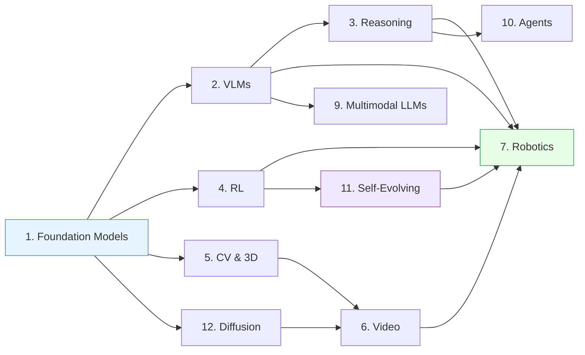

## Research Topics — Index

> [!abstract]
> Complete overview of all 4,709 papers in [[_KnowledgeHub_]], organized into 12 topic areas. Each topic file has curated narrative sections with evolution graphs, grouped sub-topics, key paper highlights, and practical insights.

### Topic Map

### Files

| # | Topic | Key Threads | Papers |
| --- | --- | --- | --- |
| [[01_Foundation-Models]] | ViT, SSL, CLIP, PEFT, theory | ViT → DINO → DINOv2 → I-JEPA | 502 |
| [[02_Vision-Language-Models]] | Grounding, alignment, hallucination, spatial | CLIP → GLIP → Grounding DINO → LISA | 643 |
| [[03_Reasoning-and-Planning]] | CoT, agentic reasoning, visual reasoning, TTS | CoT → STaR → ReAct → R1-style RL | 1003 |
| [[04_Reinforcement-Learning]] | Model-based RL, RLHF, GRPO, agentic RL | Dreamer → DreamerV3; STaR → GRPO → Absolute Zero | 848 |
| [[05_Computer-Vision-and-3D]] | Detection, segmentation, 3D, spatial reasoning | FPN → Grounding DINO; DINO → RieMind | 450 |
| [[06_Video-and-Temporal]] | Video SSL, generation as world models, physics, motion | V-JEPA → V-JEPA 2.1; UniPi → UniSim → WAMs; Force Prompting → Cosmos → NewtonGen | 310 |
| [[07_Robotics-and-Embodied-AI]] | VLAs, WAMs, self-evolving, driving, datasets | RT-1 → RT-2 → OpenVLA → π0 → DreamZero → SPIRAL | 926 |
| [[08_Benchmarks-and-Surveys]] | Cross-cutting surveys and evaluation resources | LIBERO, CALVIN, OXE, Physion → VideoPhy → PhyGenBench → FysicsWorld | 664 |
| [[09_Multimodal-LLMs]] | MLLMs, instruction tuning, omni-modal | InstructBLIP → KOSMOS-2 → PaliGemma → Magma | 835 |
| [[10_Agents-and-Tool-Use]] | LLM agents, tool use, multi-agent, code gen | ReAct → LATS → AgentGym → KARL → Memento-Skills | 246 |
| [[11_Self-Evolving-AI]] | Self-training, bootstrapping, curriculum, meta | STaR → Self-Rewarding → Absolute Zero → SPIRAL | 201 |
| [[12_Diffusion-and-Generation]] | Diffusion, flow matching, image/text, physics-aware | Diffuser → Diffusion Policy → Transfusion → Flow-GRPO → PhysGaussian → NewtonRewards → OmniPhysGS | 405 |

**Total: 4,709 papers** — papers may appear in multiple topic files where relevant.

### Deep-Dive Folders

- `Embodied-AI/` — VLA deep dive, WAM deep dive, latent world models (JEPA), self-evolving VLAs & WAMs
- `_Projects_/01_FirstPublication/` — Self-evolving WAM blueprint and RL vs CL analysis
