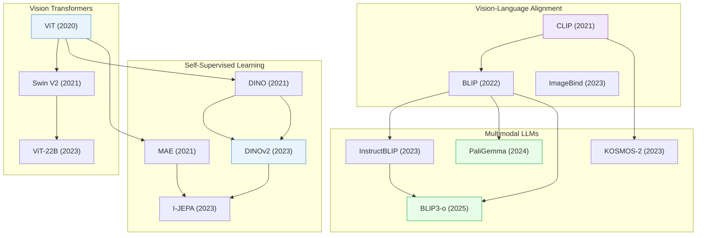

# Foundation Models & Transformers

> [!abstract] Overview
> From ViT to billion-parameter VLMs, foundation models define the backbone of modern AI. This note traces the evolution from vision transformers through self-supervised learning to the large multi-modal models that power VLAs, reasoning systems, and autonomous agents. It also covers the training recipes, attention innovations, and adaptation strategies that make these models practical.

## Evolution Graph

The field evolved through three phases: **architectural proof-of-concept** (2020-2021) where ViT, DINO, and CLIP established that Transformers and contrastive learning could replace CNNs; **self-supervised scaling** (2022-2023) where DINOv2, I-JEPA, and ViT-22B showed label-free pretraining scales to billions of parameters; and **multimodal unification** (2023-2025) where InstructBLIP, PaliGemma, and BLIP3-o merged understanding and generation into single models.

| Year | Paper | Contribution |
|------|-------|-------------|
| 2020 | [[2010.11929\|ViT]] | Proved a pure Transformer on image patches matches CNNs at scale, eliminating convolutional inductive biases |
| 2021 | [[2111.09883\|Swin Transformer V2]] | Scaled vision Transformers to 3B parameters with stable training via residual post-norm and cosine attention |
| 2021 | [[2104.14294\|DINO]] | Self-distillation without labels produces ViT features with emergent object segmentation in attention maps |
| 2021 | [[2111.06377\|MAE]] | Masked 75% of patches and reconstructed pixels; made self-supervised ViT pretraining 3-4x cheaper |
| 2021 | [[2103.00020\|CLIP]] | Contrastive image-text pretraining on 400M web pairs; enabled zero-shot visual recognition via natural language |
| 2022 | [[2201.12086\|BLIP]] | Unified vision-language understanding and generation with bootstrapped caption filtering for noisy web data |
| 2023 | [[2302.05442\|ViT-22B]] | Demonstrated vision models can scale to 22B parameters, achieving 89.5% ImageNet with emergent LLM-like properties |
| 2023 | [[2304.07193\|DINOv2]] | Scaled self-supervised learning to 142M curated images; produced universal visual features competitive with CLIP without text |
| 2023 | [[2301.08243\|I-JEPA]] | Predicted abstract representations instead of pixels; 10x cheaper pretraining with stronger semantic features |
| 2023 | [[2305.05665\|ImageBind]] | Aligned six modalities into one embedding space using images as anchor; enabled emergent cross-modal zero-shot transfer |
| 2023 | [[2302.14045\|KOSMOS-1]] | First MLLM with arbitrarily interleaved image-text inputs; 84.7 CIDEr on COCO, 22% on custom Raven IQ — established the foundational MLLM paradigm |
| 2023 | [[2305.06500\|InstructBLIP]] | Applied instruction tuning to VLMs with instruction-aware visual features; SOTA zero-shot on unseen tasks |
| 2023 | [[2306.14824\|KOSMOS-2]] | Grounded MLLMs to spatial regions via bounding box tokens in text; 78.7% R@1 on Flickr30k phrase grounding |
| 2024 | [[2407.07726\|PaliGemma]] | Open-source 3B VLM matching larger models across 40 tasks; democratized VLM research through efficient transfer |
| 2025 | [[2505.09568\|BLIP3-o]] | Unified image understanding and generation in a single hybrid autoregressive-diffusion architecture |

---

## 1. Vision Transformers

The architectural revolution that brought attention mechanisms to computer vision, replacing CNN inductive biases with scalable self-attention over image patches.

**Foundational Architectures** — The core ViT lineage from patch tokenization to multi-scale hierarchies and extreme scale.
- [[2604.13596|VGGT-Segmentor]], [[2604.02327|SteerViT]], [[2603.29634|MacTok]], [[2602.20160|tttLRM]], [[2512.08924|D4RT]], [[2512.04012|RobustVGGT]], [[2511.13720|JiT (Denoise Transformer)]], [[2510.08568|NovaFlow]], [[2509.23745|LocoFormer]], [[2501.18564|SAM2Act]], [[2401.08541|AIM]], [[2310.00632|WIN-WIN]], [[2307.06304|NaViT]], [[2303.11331|EVA-02]], [[2302.05442|ViT-22B]], [[2212.08013|FlexiViT]], [[2205.14949|HiViT]], [[2111.09883|Swin Transformer V2]], [[2107.03996|LocoTransformer]], [[2010.11929|ViT]]

> [!star] Key Papers
> - [[2010.11929|ViT]] — Split images into 16x16 patches, applied standard Transformer encoder; proved Transformers match CNNs with enough data
> - [[2111.09883|Swin Transformer V2]] — Shifted window attention for efficient high-resolution processing; scaled to 3B parameters
> - [[2302.05442|ViT-22B]] — Largest dense ViT at 22B parameters; demonstrated continued scaling benefits for vision

**Hierarchical & Domain-Specific ViTs** — Specialized adaptations of ViT for high-resolution inputs and domain-specific tasks like medical imaging.
- [[2602.17807|VidEoMT]], [[2505.22195|S2AFormer]], [[2504.17379|GABMIL]], [[2503.19108|EoMT]], [[2403.18361|ViTAR]], [[2310.00632|WIN-WIN]], [[2306.06189|FasterViT]], [[2305.00104|MMViT]], [[2304.06250|RSIR Transformer]], [[2212.07740|TERT]], [[2206.02647|HIPT]], [[2205.14949|HiViT]], [[2205.14756|EfficientViT]], [[2204.01697|MaxViT]], [[2203.16527|ViTDet]], [[2203.11926|FocalNet]], [[2112.11010|MPViT]], [[2112.01526|MViTv2]], [[2111.01236|HRViT]], [[2110.09408|HRFormer]], [[2107.06263|CMT]], [[2107.00641|Focal Transformer]], [[2105.13677|ResT]], [[2104.11227|MViT]]

> [!star] Key Papers
> - [[2206.02647|HIPT]] — Hierarchical self-supervised ViT for gigapixel pathology images; processes whole slide images across multiple magnifications
> - [[2504.17379|GABMIL]] — Extends attention-based multiple instance learning with global spatial context for digital pathology

**Key Surveys** — Comprehensive overviews of the vision transformer landscape.
- [[2604.00965|Transformers for Applied Mathematicians]], [[2309.02031|Efficient ViT Survey]], [[2305.09880|ViT CNN-Transformer Survey]], [[2111.06091|Visual Transformers Survey]], [[2101.01169|Transformers in Vision Survey]], [[2012.12556|Visual Transformer Survey]]

> [!star] Key Papers
> - [[2101.01169|Transformers in Vision Survey]] — Early comprehensive survey that mapped the ViT landscape and catalyzed adoption of Transformers in computer vision
> - [[2309.02031|Efficient ViT Survey]] — Systematic taxonomy of efficiency methods for vision Transformers; essential reference for practical deployment

**Efficient & Adaptive ViTs** — Adapting ViTs with lightweight modules, patch-level optimization, and resolution flexibility.
- [[2603.25744|MuRF]], [[2603.22815|PinPoint]], [[2603.22570|CanViT]], [[2603.22387|EUPE]], [[2602.08683|OneVision-Encoder]], [[2601.08499|EfficientFSL]], [[2512.01738|MSPT]], [[2510.21501|GranViT]], [[2510.18091|APT]], [[2505.23769|TextRegion]], [[2505.21501|PH-Reg]], [[2505.19985|Structured ViT Initialization]], [[2505.17316|Patch-Aligned Training]], [[2504.13059|RoboTwin]], [[2502.01962|META]], [[2501.09333|Prompt-CAM]], [[2412.04073|TransAdapter]], [[2307.09120|LW PLG-ViT]], [[2303.13434|PMTrans]], [[2205.08534|ViT-Adapter]], [[2109.13396|Bridge]], [[2108.05988|TVT]], [[2107.02239|ViX]]

> [!star] Key Papers
> - [[2205.08534|ViT-Adapter]] — Foundational adapter method enabling plain ViTs to handle dense prediction tasks without architectural changes
> - [[2412.04073|TransAdapter]] — Feature-centric unsupervised domain adaptation for ViTs; bridges the gap between pre-trained ViTs and target domains

> [!tip] Scaling vs Efficiency
> ViTs scale well (ViT-22B proves this), but raw scaling is not always practical. Hierarchical designs like Swin and HiViT recover multi-scale features efficiently, while domain-specific adaptations (HIPT for pathology, WIN-WIN for high-res) show that architecture matters as much as scale.

---

## 2. Attention Mechanisms & Architectural Innovations

New attention patterns, normalization strategies, and structural modifications that improve Transformer efficiency, stability, and expressiveness.

**Sparse & Efficient Attention** — Reducing the quadratic cost of self-attention through sparsity, routing, and learned masking.
- [[2603.15619|MoDA]], [[2508.02124|DMA]], [[2505.17083|Scale-invariant Attention]], [[2505.01996|Token Graying]], [[2505.00315|MoSA]], [[2009.06732|Efficient Transformers Survey]]

> [!star] Key Papers
> - [[2505.00315|MoSA]] — Mixture of Sparse Attention with expert-choice routing; content-based learned sparsity
> - [[2508.02124|DMA]] — Fully differentiable dynamic mask sparse attention; hardware-optimized for practical deployment
> - [[2603.15619|MoDA]] — Mixture-of-Depths Attention dynamically allocates compute across tokens and layers

**Activation & Normalization Replacements** — Drop-in replacements for LayerNorm and Softmax that improve training stability or remove normalization entirely.
- [[2603.15031|AttnRes]], [[2512.24880|mHC]], [[2512.10938|Derf]], [[2504.20966|Softpick]], [[2503.10622|DyT]]

> [!star] Key Papers
> - [[2503.10622|DyT]] — Dynamic Tanh as a drop-in replacement for normalization layers; simpler and equally effective
> - [[2504.20966|Softpick]] — Rectified non-sum-to-one normalization; eliminates attention sinks and massive activations

**Residual Connections & Depth** — Rethinking how information flows through deep networks via improved residual strategies and adaptive depth.
- [[2603.15031|AttnRes]], [[2512.24880|mHC]], [[2512.24695|Hope]], [[2507.10524|MoR]]

> [!star] Key Papers
> - [[2507.10524|MoR]] — Mixture-of-Recursions unifies parameter efficiency with adaptive per-token computation depth
> - [[2512.24695|Hope]] — Nested Learning reinterprets deep learning as nested multi-level optimization

**Hybrid Architectures** — Combining Transformers with state-space models, recurrence, or looped computation for improved efficiency.
- [[2605.11689|MoE Configuration Study]], [[2604.21254|Hyperloop Transformers]], [[2601.15275|RayRoPE]], [[2512.20856|Nemotron 3]], [[2507.22448|Falcon-H1]], [[2507.12898|Vidar]], [[2505.16416|Circle-RoPE]], [[2505.05522|CTM]], [[2503.24067|TransMamba]], [[2501.00663|Titans]], [[2311.12424|Looped Transformers]]

> [!star] Key Papers
> - [[2507.22448|Falcon-H1]] — Hybrid-head models integrating parallel Transformer and Mamba blocks; redefines the efficiency-performance frontier
> - [[2501.00663|Titans]] — Learns to memorize at test time via a dedicated neural memory module; bridges short and long-range context

**Theoretical Foundations of Transformers** — Formal analyses of what Transformers compute, how in-context learning works, and connections to established frameworks.
- [[2604.27077|νGPT]], [[2604.00965|Transformers for Applied Mathematicians]], [[2603.17063|Transformers as Bayesian Networks]], [[2509.00421|Prompt Tuning Memory Limits]], [[2507.16003|ICL Implicit Dynamics]], [[2504.13173|Miras]], [[2502.14010|ICL Attention Heads]]

> [!star] Key Papers
> - [[2603.17063|Transformers as Bayesian Networks]] — Proves sigmoid Transformers fundamentally operate as Bayesian networks
> - [[2507.16003|ICL Implicit Dynamics]] — Shows in-context learning in LLMs can be modeled as implicitly solving dynamical systems

> [!tip] The Post-Softmax Era
> 2025 saw a wave of work replacing or augmenting standard softmax attention (Softpick, DyT, Derf) and standard normalization (DyT removes it entirely). These are not incremental — they change how information flows through Transformers and may become default in next-generation architectures.

---

## 3. Self-Supervised Visual Learning

Learning visual representations without labels — the foundation for data-efficient downstream tasks.

**Contrastive & Self-Distillation** — Methods that learn by comparing or distilling representations without labeled data.
- [[2606.04718|CoRe-MoE]], [[2605.29564|VE2VF]], [[2605.03517|LDM SSL]], [[2604.09445|AsymLoc]], [[2604.04310|frax]], [[2603.28480|INSID3]], [[2603.15553|Bootleg]], [[2603.12217|Verifier Point Tracking]], [[2602.00937|CLAMP]], [[2510.08638|Minkowski Representation Hypothesis]], [[2507.19468|DINO-world]], [[2507.14137|Franca]], [[2506.14754|Sparsh-X]], [[2506.10159|VCL]], [[2505.15970|DINOv2 Hierarchy SAE]], [[2503.09867|OH-A-DINO]], [[2502.10385|SimDINO]], [[2410.24090|Sparsh]], [[2406.09294|JEA Scaling Study]], [[2304.07193|DINOv2]], [[2304.03977|EMP-SSL]], [[2110.03374|HCL]], [[2106.09785|EsViT]], [[2105.04553|MoBY]], [[2104.14294|DINO]], [[2104.03602|SiT]], [[2104.02057|MoCo v3]]

> [!star] Key Papers
> - [[2104.14294|DINO]] — Self-distillation with no labels; emergent object segmentation in attention maps
> - [[2304.07193|DINOv2]] — Curated data + distillation produces universal visual features without fine-tuning
> - [[2502.10385|SimDINO]] — Dramatically simplified DINO via coding rate regularization; shows what DINO really needs

**Masked Image Modeling** — Self-supervised methods that mask patches of an image and train the model to reconstruct or predict the missing content, learning rich visual representations without labels.
- [[2603.25597|P-STMAE]], [[2603.22953|ClusterSTM]], [[2505.11129|PhiNet v2]], [[2402.10093|MIM-Refiner]], [[2205.14949|HiViT]], [[2111.09886|SimMIM]], [[2111.06377|MAE]], [[2106.08254|BEiT]]

> [!star] Key Papers
> - [[2111.06377|MAE]] — Masked 75% of patches; proved simple reconstruction objective learns powerful features
> - [[2106.08254|BEiT]] — BERT-style pre-training for vision: predict discrete visual tokens from masked patches

**JEPA & Latent Prediction** — Joint-Embedding Predictive Architectures that predict in representation space rather than pixel space, avoiding reconstruction artifacts.
- [[2605.03413|NEO Theorizer]], [[2605.02134|PV-VAE]], [[2605.00078|Being-H0.7]], [[2603.19312|LeWM]], [[2603.14482|V-JEPA 2.1]], [[2602.11832|JEPA-VLA]], [[2602.11389|Causal-JEPA]], [[2601.14354|VJEPA-Probabilistic]], [[2512.24497|JEPA-WM]], [[2512.19605|KerJEPA]], [[2512.10942|VL-JEPA]], [[2511.08544|LeJEPA]], [[2510.00739|TD-JEPA]], [[2509.14252|LLM-JEPA]], [[2506.09985|V-JEPA 2]], [[2505.03176|seq-JEPA]], [[2504.16591|JEPA for RL]], [[2301.08243|I-JEPA]]

> [!star] Key Papers
> - [[2301.08243|I-JEPA]] — Predicts in latent space instead of pixel space; avoids reconstruction artifacts
> - [[2511.08544|LeJEPA]] — Provable and scalable self-supervised learning framework based on Euclidean latent geometry
> - [[2602.11389|Causal-JEPA]] — Object-centric world model integrating JEPAs with causal reasoning via latent interventions
> - [[2601.14354|VJEPA-Probabilistic]] — Variational/Bayesian JEPA with predictive-information-bottleneck guarantees; filters high-variance nuisance distractors, keeps **R²>0.84** under SNR=-2.2 dB

> [!tip] The JEPA Lineage
> I-JEPA started a family: [[2511.08544|LeJEPA]] (provable foundations) and [[2512.19605|KerJEPA]] (kernel methods) extend the theory, while [[2602.11389|Causal-JEPA]] adds causal reasoning. For the full robotics-oriented lineage (V-JEPA 2 → VL-JEPA → VLA-JEPA), see the JEPA notes in the vault.

**Continual & Semi-Supervised Learning** — Adapting self-supervised models for streaming data, long-tailed distributions, and test-time shifts.
- [[2606.04130|CLAW (Latent Action WM)]], [[2606.03985|Humanoid-GPT]], [[2606.03940|SEAOTTER]], [[2606.03476|Human2Humanoid]], [[2606.02767|HAKF]], [[2605.30350|DynaFLIP]], [[2605.29548|Capacity Interference Retention]], [[2605.27734|Latent Sample-Complexity]], [[2605.26379|LeJEPA World Model]], [[2605.25313|UWM-JEPA]], [[2605.24934|HumanEgo]], [[2605.22671|BehaviorVLA]], [[2605.22629|H-Flow]], [[2605.21258|Structural Latent Points]], [[2605.20811|Demo-JEPA]], [[2605.15725|DiLA]], [[2605.09963|Spatial Prediction SP]], [[2604.18267|MARCO]], [[2604.16391|DeFI]], [[2603.06693|SER]], [[2601.19897|SDFT]], [[2512.15934|IC-SSL]], [[2512.09441|MoP-CIL]], [[2512.01342|InternVideo-Next]], [[2512.00961|GenReward]], [[2511.20844|Pre-train to Gain]], [[2511.17309|MuM]], [[2511.13787|TC2]], [[2511.04131|BFM-Zero]], [[2509.21986|Ego VLA Pretrain]], [[2509.15965|RLinf]], [[2507.23523|H-RDT]], [[2507.10434|CLA]], [[2506.23529|SSTTA]], [[2506.00467|SST]], [[2505.17006|CoMo]], [[2505.05062|ULFine]], [[2504.18904|RoboVerse]], [[2412.04445|Moto]], [[2411.13852|ESRM]], [[2410.21676|Critical Batch Size Scaling]], [[2409.14401|In-Class Data Imbalance]], [[2407.20230|SAPG]], [[2406.17768|EXTRACT]], [[2404.17202|Low-Data SSL Evaluation]], [[2312.10812|LAPO]], [[2311.12244|muLV-Rep]], [[2305.13622|SER]], [[2111.09793|Robotic Interestingness]], [[2101.12195|CADDY]], [[2101.05181|MemAug Image-Goal Nav]], [[1806.09655|CLASP (Action Space)]], [[1805.07914|ILPO]]

> [!star] Key Papers
> - [[2507.10434|CLA]] — Continual Latent Alignment for online continual self-supervised learning; avoids catastrophic forgetting
> - [[2512.15934|IC-SSL]] — In-Context Semi-Supervised Learning: Transformer framework leveraging in-context learning for semi-supervised tasks

**Dataset Distillation & Representation Theory** — Compressing training data and understanding the theoretical properties of learned representations.
- [[2604.03191|Compression Gap]], [[2603.12228|Neural Thickets]], [[2602.15029|Language Symmetry Representations]], [[2602.01905|STELLAR]], [[2601.03220|Epiplexity]], [[2512.19693|Prism Hypothesis]], [[2512.09322|GPSSL]], [[2511.16674|LGM]], [[2510.20994|VESSA]], [[2506.16895|STRUCTURE Alignment]], [[2506.09278|UFM]], [[2505.12477|Joint Embedding vs Reconstruction SSL]], [[2504.10428|PIU Learning]], [[2309.17024|HoloAssist]], [[2203.14712|Assembly101]]

> [!star] Key Papers
> - [[2511.16674|LGM]] — Linear Gradient Matching for dataset distillation in self-supervised models; highly efficient compression
> - [[2601.03220|Epiplexity]] — New information measure beyond entropy for computationally bounded intelligence

**Test-Time Training & Adaptation** — Methods that adapt visual models at inference time to handle distribution shifts.
- [[2606.03127|TTT-VLA]], [[2603.00518|Vision-TTT]], [[2506.23529|SSTTA]], [[2410.02735|OOD-Chameleon]]

> [!star] Key Papers
> - [[2603.00518|Vision-TTT]] — Adapts Test-Time Training for efficient visual representation learning; bridges pre-training and inference

**Anomaly & Domain-Specific Detection** — Self-supervised approaches for anomaly detection and unsupervised domain adaptation.
- [[2601.12964|Cross-Scale Pretraining]], [[2601.05552|UniADet]], [[2502.10694|UDA Simulation Study]], [[2411.15869|SC-CLIP]], [[2407.21311|EUDA]], [[2403.14410|GLC++]], [[2402.14976|Foundation Latent UDA]], [[2312.07871|MLNet]], [[2211.03876|CoNMix]], [[2210.17067|UniOT]], [[2204.07683|SSRT]], [[2111.12941|WinTR]], [[2002.07953|DANCE]]

> [!star] Key Papers
> - [[2601.05552|UniADet]] — Universal vision anomaly detection without language priors; purely visual foundation model approach
> - [[2411.15869|SC-CLIP]] — Training-free self-calibrated CLIP for open-vocabulary segmentation; resolves anomalous attention biases

**SSL Surveys** — Comprehensive reviews of self-supervised visual learning methods and evaluation.
- [[2605.28442|COTRATE]], [[2505.13584|SSL Segmentation Survey]], [[2505.01109|SSL-MIL Pathology Benchmark]], [[2504.07213|E-SSL Survey]], [[2408.17059|SSL for ViT Survey]], [[2305.13689|SSL Survey]]

> [!star] Key Papers
> - [[2305.13689|SSL Survey]] — Comprehensive taxonomy of image-based generative and discriminative self-supervised methods; essential landscape overview
> - [[2408.17059|SSL for ViT Survey]] — Focused survey on self-supervised mechanisms specifically designed for vision Transformers

> [!tip] From Reconstruction to Prediction
> The field moved from pixel reconstruction (MAE, BEiT) to latent prediction (I-JEPA, LeJEPA). Latent prediction avoids wasting capacity on irrelevant pixel details and produces more semantically meaningful features. Meanwhile, continual learning (CLA, IC-SSL) ensures these methods work in non-stationary real-world settings.

---

## 4. Vision-Language Alignment

Connecting visual and textual representations in a shared embedding space, enabling zero-shot transfer and multimodal reasoning.

**Contrastive Alignment** — Learning joint image-text embeddings via contrastive objectives on large-scale paired data.
- [[2602.12215|LDA-1B]], [[2512.11141|ItemizedCLIP]], [[2511.13876|QwenCLIP]], [[2509.01644|OpenVision 2]], [[2507.22062|Meta CLIP 2]], [[2507.18009|GRR-CoCa]], [[2506.03096|FuseLIP]], [[2505.21549|DCLIP]], [[2505.18983|AmorLIP]], [[2505.14204|Perceptual Initialization]], [[2505.11192|FALCON]], [[2505.04601|OpenVision]], [[2505.04410|DeCLIP]], [[2505.03703|Modality Gap Reduction]], [[2504.13181|Perception Encoder]], [[2503.15485|TULIP]], [[2503.06626|DiffCLIP]], [[2502.14786|SigLIP 2]], [[2410.24221|EgoMimic]], [[2406.17639|AlignCLIP]], [[2212.07143|OpenCLIP]], [[2205.01917|CoCa]], [[2111.10050|BASIC]], [[2111.07991|LiT]], [[2103.00020|CLIP]]

> [!star] Key Papers
> - [[2103.00020|CLIP]] — Contrastive pre-training on 400M image-text pairs; enabled zero-shot transfer to any visual task via text prompts
> - [[2205.01917|CoCa]] — Combined contrastive and generative objectives in a single contrastive captioner
> - [[2507.18009|GRR-CoCa]] — Integrates modern LLM architectural features into the CoCa framework for improved multimodal performance

**Multi-Modal Embedding Spaces** — Extending alignment beyond image-text to encompass audio, depth, thermal, and other modalities.
- [[2510.06673|Heptapod]], [[2506.23639|Being-VL]], [[2505.15045|DIFFEMBED]], [[2505.05422|TokLIP]], [[2411.14402|AIMV2]], [[2411.04997|LLM2CLIP]], [[2305.05665|ImageBind]], [[2206.07643|FIBER]]

> [!star] Key Papers
> - [[2305.05665|ImageBind]] — Extended alignment to 6 modalities (image, text, audio, depth, thermal, IMU) via a single embedding space
> - [[2506.23639|Being-VL]] — Unified multimodal understanding via byte-pair encoding applied to visual tokens

**Bootstrapped & Generative Alignment** — Methods that generate or bootstrap training data for vision-language alignment.
- [[2601.09859|TuneCLIP]], [[2506.22434|MiCo]], [[2505.21465|ID-Align]], [[2505.16149|REVEAL]], [[2504.20364|SSL Representation Human Alignment]], [[2503.01776|CSR]], [[2411.15869|SC-CLIP]], [[2301.11915|Part-Aware SSL]], [[2201.12086|BLIP]]

> [!star] Key Papers
> - [[2201.12086|BLIP]] — Pioneered bootstrapped caption filtering for noisy web data; unified VL understanding and generation in one framework
> - [[2503.01776|CSR]] — Sparse coding-based adaptive representations that go beyond Matryoshka for flexible embedding dimensionality

**Region-Level & Fine-Grained Alignment** — Learning region-text correspondences and fine-grained visual-language representations.
- [[2605.18740|Vision-OPD]], [[2512.17012|4D-RGPT]], [[2507.09961|TDCRL]], [[2507.09615|FAIR]], [[2506.23156|Multi-Label Contrastive SSL]], [[2506.15757|WPCL]], [[2506.12698|KDUP]], [[2506.07413|VarCon]], [[2506.04411|DCL Neural Collapse Theory]], [[2505.22196|Aug-Aware SSL Theory]], [[2505.21533|SOP]], [[2505.02278|GCLIP]], [[2504.19627|VCM]], [[2504.17432|UniME]], [[2502.02202|MLCL]], [[2401.09865|SPARC]], [[2206.05836|GLIPv2]], [[2203.12555|GriTS]], [[2112.09106|RegionCLIP]], [[2104.12763|MDETR]]

> [!star] Key Papers
> - [[2401.09865|SPARC]] — Sparse fine-grained contrastive alignment from Google DeepMind; learns region-text correspondences without dense annotations
> - [[2504.17432|UniME]] — Universal multimodal embeddings; SOTA on MMEB benchmark for fine-grained retrieval

> [!tip] Beyond Image-Text Pairs
> CLIP showed that contrastive learning on web-scale data creates powerful zero-shot models. The next frontier (ImageBind, Being-VL, Heptapod) extends this to arbitrary modalities. The key insight: a single well-aligned embedding space transfers better than modality-specific encoders.

---

## 5. Multimodal Large Language Models

LLMs augmented with visual perception — the backbone for modern VLMs and VLAs. These models bridge language understanding with visual grounding, generation, and action.

**Instruction-Tuned VLMs** — General-purpose multimodal models trained to follow instructions across vision-language tasks.
- [[2605.30370|IBNN]], [[2603.25406|MMaDA-VLA]], [[2505.14683|BAGEL]], [[2505.09568|BLIP3-o]], [[2504.13161|Nemotron-CLIMB]], [[2504.10479|InternVL3]], [[2504.00595|Open-Qwen2VL]], [[2407.07726|PaliGemma]], [[2310.03744|LLaVA-1.5]], [[2305.06500|InstructBLIP]], [[2302.14045|KOSMOS-1]]

> [!star] Key Papers
> - [[2407.07726|PaliGemma]] — Sub-3B VLM achieving SOTA on 40 tasks; SigLIP + Gemma connected by linear projection
> - [[2310.03744|LLaVA-1.5]] — Enhanced large multimodal model achieving SOTA with simple architectural improvements
> - [[2505.09568|BLIP3-o]] — Fully open unified multimodal model family excelling in both understanding and generation

**Grounded & Spatial MLLMs** — Models that can localize objects, reference bounding boxes, and reason about spatial relationships.
- [[2602.11635|MathSpatial]], [[2601.13633|EGM]], [[2512.06963|VideoVLA]], [[2306.14824|KOSMOS-2]]

> [!star] Key Papers
> - [[2306.14824|KOSMOS-2]] — Grounded multimodal LLM: generates text with bounding box references
> - [[2601.13633|EGM]] — Enables smaller VLMs to scale test-time inference for visual grounding

**Any-to-Any & Agent-Oriented MLLMs** — Models designed for arbitrary modality conversion or as foundations for autonomous agents.
- [[2511.20085|VICoT-Agent]], [[2502.13130|Magma]], [[2309.05519|NExT-GPT]], [[2303.11381|MM-REACT]]

> [!star] Key Papers
> - [[2309.05519|NExT-GPT]] — Any-to-any multimodal LLM handling text, image, audio, and video
> - [[2502.13130|Magma]] — Foundation model specifically designed for multimodal AI agents

**Visual Reasoning & Thinking** — Methods for enhancing MLLMs with explicit reasoning, chain-of-thought over images, and self-rewarding loops.
- [[2601.13705|LVLM Visual Puzzle Survey]], [[2511.09018|Owl]], [[2510.06783|TTRV]], [[2508.19652|Vision-SR1]], [[2506.23918|Thinking with Images Survey]], [[2505.17022|GoT-R1]], [[2504.17207|APC]], [[2501.04693|FuSe]], [[2412.18194|VLABench]]

> [!star] Key Papers
> - [[2505.17022|GoT-R1]] — Applies RL to unleash reasoning capability of MLLMs for visual generation
> - [[2508.19652|Vision-SR1]] — Self-rewarding RL framework for VLMs via reasoning decomposition
> - [[2510.06783|TTRV]] — First test-time RL framework for decoder-based VLMs

**MLLM Evaluation & Benchmarks** — Reward models, judging frameworks, and benchmarks for evaluating multimodal model quality.
- [[2512.16899|MMRB2]], [[2511.10055|HCM-GRPO]], [[2508.19229|StepWiser]]

> [!star] Key Papers
> - [[2512.16899|MMRB2]] — First comprehensive benchmark for evaluating reward models on multimodal interleaved content
> - [[2508.19229|StepWiser]] — Generative judges that meta-reason about intermediate reasoning steps

**Key Surveys** — Comprehensive surveys mapping the rapidly evolving MLLM landscape.
- [[2504.07951|NMM Scaling Laws]], [[2405.19334|LLM Multimodal Generation Survey]], [[2405.10739|Efficient MLLM Survey]], [[2306.13549|MLLM Survey]], [[2302.01107|Efficient Transformer Training Survey]]

> [!star] Key Papers
> - [[2306.13549|MLLM Survey]] — Foundational survey that defined the taxonomy and evaluation framework for multimodal large language models
> - [[2405.10739|Efficient MLLM Survey]] — Comprehensive guide to making MLLMs practical through efficiency techniques across model, data, and inference

> [!success] The Modern VLM Stack
> ==Frozen vision encoder== (SigLIP or DINOv2) + ==lightweight connector== (linear projection) + ==LLM backbone== (Gemma, Llama) + ==instruction tuning== on diverse V-L tasks. Sub-3B models now achieve SOTA on 40+ tasks; open-source MLLMs match proprietary ones across understanding and generation.

> [!tip] The VLM Stack
> Modern VLMs follow a consistent pattern: frozen vision encoder (often SigLIP or DINOv2) + lightweight connector (linear projection or Q-Former) + LLM backbone. PaliGemma proved this can work at sub-3B scale, while BLIP3-o and LLaVA-1.5 showed that open models can compete with proprietary ones. The frontier is now visual reasoning (GoT-R1, Vision-SR1) and test-time RL (TTRV).

---

## 6. LLM Training & Optimization

Core training recipes, optimizers, scaling laws, and architectural insights for training large language models efficiently.

**Optimizers** — Second-order and novel optimizers that improve over AdamW for large-scale training.
- [[2605.31159|TRB]], [[2605.21699|X-Token]], [[2604.17535|OPSDL]], [[2506.07254|SPlus]], [[2505.23725|MuLoCo]], [[2505.02222|Muon]], [[2502.16982|Muon]], [[2411.08380|EgoVid-5M]], [[2409.16283|Gen2Act]]

> [!star] Key Papers
> - [[2502.16982|Muon]] — Breakthrough: second-order optimizer demonstrating superior training efficiency over AdamW for LLMs
> - [[2505.23725|MuLoCo]] — Muon as inner optimizer for DiLoCo distributed training; significant speedup over AdamW

**Scaling Laws & Training Dynamics** — Understanding how loss curves, learning rates, batch sizes, and training duration interact at scale.
- [[2605.22297|Layerwise LR]], [[2605.02087|MSM]], [[2604.27085|RoundPipe]], [[2604.05091|MegaTrain]], [[2603.27164|daVinci-LLM]], [[2603.26164|DataFlex]], [[2603.21191|BST Scaling Rule]], [[2603.15958|Hyperparameter Scaling Laws]], [[2602.10556|LAP]], [[2512.16913|DAP]], [[2507.12507|Nemotron]], [[2507.07101|Small Batch LLM Training]], [[2505.10559|Neural Thermodynamic Laws]], [[2503.12811|MPL]], [[2405.18392|Compute-Optimal Scaling Laws]], [[2310.18969|ViT Class Embedding Analysis]], [[2309.14322|Transformer Training Instabilities]], [[2308.12952|BridgeData V2]], [[2104.08212|MT-Opt]], [[1812.06162|Large-Batch Training]]

> [!star] Key Papers
> - [[2503.12811|MPL]] — Multi-Power Law accurately predicts training loss across learning rate schedules
> - [[2507.07101|Small Batch LLM Training]] — Small batch sizes (even batch=1) can stably train LLMs; challenges the large-batch orthodoxy

**Inference Acceleration** — Techniques for faster inference through early exit, speculative decoding, and layer skipping.
- [[2507.00754|LUViT]], [[2505.11820|CoLM]], [[2404.16710|LayerSkip]]

> [!star] Key Papers
> - [[2404.16710|LayerSkip]] — Enables accurate early exit and self-speculative decoding for faster LLM inference
> - [[2505.11820|CoLM]] — Chain-of-Model enables incremental scaling and elastic adaptation

**Architecture Search & Discovery** — Automated methods for discovering novel neural network architectures.
- [[2507.18074|ASI-ARCH]], [[2507.02092|EBT]], [[2505.09343|DeepSeek-V3]]

> [!star] Key Papers
> - [[2507.18074|ASI-ARCH]] — Autonomous system that discovers novel transformer architectures via automated search
> - [[2505.09343|DeepSeek-V3]] — Hardware-software co-design strategy achieving SOTA LLM performance

**Interpretability & Internal Representations** — Understanding what models learn internally and how to analyze their representations.
- [[2604.28119|SAE Concept Manifolds]], [[2603.12228|Neural Thickets]], [[2602.06218|SAE-A]], [[2602.00462|LatentLens]], [[2506.15679|Dense SAE Latents]], [[2502.03714|USAE]], [[2502.02013|Layer-by-Layer Representations]], [[2410.20722|ProtoViT]], [[2205.10268|B-cos Networks]]

> [!star] Key Papers
> - [[2502.02013|Layer-by-Layer Representations]] — Intermediate layers often provide superior downstream representations compared to final layers
> - [[2506.15679|Dense SAE Latents]] — Redefines dense latents in Sparse Autoencoders from artifacts to functional features

> [!tip] The Muon Moment
> 2025 may be remembered as the year AdamW lost its monopoly. Muon (and its distributed variant MuLoCo) demonstrated that second-order optimization is practical at LLM scale. Combined with scaling law insights (MPL, small-batch training), the training recipe for LLMs is being fundamentally rewritten.

---

## 7. Efficient Adaptation & Model Composition

Making foundation models practical: parameter-efficient fine-tuning, model merging, prompt tuning, and efficient transfer.

**Prompt Learning** — Adapting foundation models through learned prompts rather than full fine-tuning.
- [[2309.16797|PromptBreeder]], [[2203.05557|CoCoOp]], [[2109.01134|CoOp]]

> [!star] Key Papers
> - [[2109.01134|CoOp]] — Learnable prompts for adapting CLIP without fine-tuning; launched the prompt learning field
> - [[2309.16797|PromptBreeder]] — Self-referential self-improvement via prompt evolution; automates prompt engineering

**LoRA & Parameter-Efficient Fine-Tuning** — Methods that adapt large models by training only a small fraction of parameters.
- [[2604.19254|ShadowPEFT]], [[2507.11851|Gated LoRA]], [[2506.06105|T2L]], [[2504.13292|GrokTransfer]], [[2502.16025|FeatSharp]], [[2410.19878|PEFT Methodologies Survey]], [[2406.10973|ExPLoRA]], [[2312.12148|PEFT Critical Review]]

> [!star] Key Papers
> - [[2506.06105|T2L]] — Text-to-LoRA: hypernetwork that dynamically generates task-specific LoRA adapters from text descriptions
> - [[2507.11851|Gated LoRA]] — Enables pretrained autoregressive LLMs to perform multi-token prediction via gated LoRA modules

**Model Merging & Weight Averaging** — Combining multiple fine-tuned models into a single improved model without retraining.
- [[2605.14386|Darwin]], [[2604.27155|GeoMerge]], [[2602.05943|Orthogonal Model Merging]], [[2510.21223|FDA]], [[2505.12082|PMA]], [[2408.07666|Model Merging in LLMs/MLLMs]], [[2407.13771|Training-Free Model Merging MTDA]], [[1803.05407|SWA]]

> [!star] Key Papers
> - [[1803.05407|SWA]] — Stochastic Weight Averaging: simple technique that finds wider optima and better generalization
> - [[2505.12082|PMA]] — Pre-trained Model Average for effective merging of LLM checkpoints

**Knowledge Distillation** — Compressing large models into smaller ones via teacher-student training or multi-teacher distillation.
- [[2605.03821|RoboAlign-R1]], [[2605.03677|Uni-OPD]], [[2604.28123|PRISM]], [[2604.14084|TIP]], [[2604.01193|SSD Code Generation]], [[2604.00626|On-Policy Distillation Survey]], [[2603.24422|OneSearch-V2]], [[2603.16856|OEL]], [[2602.05449|DisCa]], [[2601.20802|SDPO]], [[2601.18734|OPSD]], [[2508.13167|CoA]], [[2508.04816|CoMAD]], [[2507.05707|Agentic-R1]], [[2506.14728|AgentDistill]], [[2505.13975|DRP]], [[2505.11221|LVLM2P]], [[2505.07675|DHO]], [[2502.21074|CODI]], [[2312.06709|AM-RADIO]], [[2306.08543|MiniLLM]]

> [!star] Key Papers
> - [[2306.08543|MiniLLM]] — Foundational KD method for LLMs using reverse KL divergence; set the standard for language model compression
> - [[2312.06709|AM-RADIO]] — Agglomerative multi-teacher distillation unifying CLIP, DINOv2, and SAM into one vision foundation model
> - [[2506.14728|AgentDistill]] — Training-free agent distillation via generalizable MCP boxes; bridges large and small agent models

**Machine Unlearning & Safety** — Removing specific data influence from trained models for privacy and safety compliance.
- [[2402.15109|MU-Mis]]

> [!star] Key Papers
> - [[2402.15109|MU-Mis]] — Remaining-data-free unlearning via sample contribution suppression; enables privacy compliance without retaining original data

**Continual Pretraining & Domain Adaptation** — Extending foundation models to new domains or tasks through continued training.
- [[2606.02280|LDG]], [[2603.17655|CC-CDFSL]], [[2602.02381|AdaSSL]], [[2601.21725|Procedural Pretraining]], [[2511.13945|Procedural Warm-Up]], [[2509.06806|MachineLearningLM]], [[2507.06187|Delta Learning Hypothesis]], [[2507.00994|MLM vs CLM Pretraining]], [[2504.07745|SF2T]], [[2504.06608|Cross-Domain FSL with DKM]]

> [!star] Key Papers
> - [[2509.06806|MachineLearningLM]] — Continued pretraining framework that enhances LLMs with robust many-shot in-context learning for ML tasks
> - [[2507.06187|Delta Learning Hypothesis]] — Preference tuning on pairs of individually weak outputs can yield strong gains

**Gradient-Free & Evolutionary Optimization** — Optimizing models without gradient computation using evolution strategies.
- [[2602.03120|QES]], [[2511.16652|EGGROLL]], [[2510.10603|EA4LLM]], [[2402.12479|Pruned Networks in Deep RL]]

> [!star] Key Papers
> - [[2510.10603|EA4LLM]] — Demonstrates evolutionary algorithms can effectively optimize LLMs without gradients; opens a new fine-tuning paradigm
> - [[2602.03120|QES]] — Quantized evolution strategies achieving high-precision fine-tuning at low-precision cost; practical gradient-free optimization

**Symmetry & Loss Landscape Theory** — Theoretical understanding of parameter space structure and its implications for training and merging.
- [[2506.13018|NN Parameter Space Symmetry Survey]]

> [!star] Key Papers
> - [[2506.13018|NN Parameter Space Symmetry Survey]] — First comprehensive survey of symmetries in neural network parameter spaces; foundational for understanding model merging and loss landscape geometry

> [!tip] The Adaptation Toolkit
> The modern practitioner's stack: LoRA for efficient fine-tuning, SWA/PMA for merging multiple checkpoints, PromptBreeder for automated prompt optimization, and T2L for on-the-fly adapter generation. The key insight from 2025: you rarely need to fine-tune the full model — the right adapter strategy often matches or exceeds full fine-tuning.

---

## 8. RL for LLM Reasoning

Reinforcement learning applied to improve language model reasoning, self-improvement, and verifiable reward systems.

**RL with Verifiable Rewards** — Training LLMs with RL using automatically verifiable reward signals rather than human feedback.
- [[2604.20733|NPO]], [[2604.20209|SGS]], [[2604.17654|Poly-EPO]], [[2604.02288|SRPO]], [[2512.16649|JustRL]], [[2512.03442|PretrainZero]], [[2511.17473|MR-RLVR]], [[2510.06499|Webscale-RL]], [[2510.01265|RLP]], [[2509.26074|LENS]], [[2508.18588|RhymeRL]], [[2508.14460|DuPO]], [[2508.05004|R-Zero]], [[2506.08388|RLTs]], [[2506.08007|RPT]], [[2506.00103|Writing-Zero]], [[2505.03335|Absolute Zero]], [[2503.23829|RLVR]]

> [!star] Key Papers
> - [[2503.23829|RLVR]] — Extends RL with verifiable rewards beyond math/code to diverse domains
> - [[2510.06499|Webscale-RL]] — Automated pipeline scaling verifiable RL training data to pretraining levels
> - [[2512.16649|JustRL]] — Simplified RL recipe effectively scales a 1.5B model for mathematical reasoning

**Reasoning Models** — LLMs explicitly trained for multi-step reasoning with RL.
- [[2603.02556|VC-STaR]], [[2512.12623|DMLR]], [[2510.00219|Thoughtbubbles]], [[2507.18071|GSPO]], [[2506.10910|Magistral]], [[2505.16993|SeNaTra]], [[2505.11484|SoftCoT++]], [[2505.10320|J1]], [[2503.16219|Open-RS]], [[2503.14858|CRL]], [[2403.09629|Quiet-STaR]], [[2203.14465|STaR]]

> [!star] Key Papers
> - [[2506.10910|Magistral]] — Mistral's first reasoning model using custom RLHF for chain-of-thought
> - [[2505.10320|J1]] — RL-trained LLM-as-a-Judge that incentivizes genuine thinking during evaluation

**LLM-as-a-Judge & Evaluation** — Using LLMs to evaluate other LLMs, with RL to improve judging quality.
- [[2605.12227|dGRPO]], [[2605.07396|ROPD]], [[2603.07079|EOPD]], [[2508.19229|StepWiser]], [[2505.10320|J1]], [[2411.15594|LLM-as-a-Judge]]

> [!star] Key Papers
> - [[2411.15594|LLM-as-a-Judge]] — Comprehensive survey providing formal definitions and unified taxonomy for LLM-based evaluation

**Agentic RL & Search** — RL applied to LLM-based agents for tool use, search, and multi-step task completion.
- [[2603.28963|AutoWorld]], [[2603.26499|AIRA2]], [[2603.12011|RFT LLM Agent Generalization]], [[2603.11327|MR-Search]], [[2602.05842|RWML]], [[2408.10899|ARIO]], [[2403.19417|OAKINK2]]

> [!star] Key Papers
> - [[2603.11327|MR-Search]] — Meta-RL framework enabling LLM search agents to improve via in-context learning
> - [[2603.12011|RFT LLM Agent Generalization]] — Systematic investigation of whether reinforcement fine-tuning improves LLM agent generalization

**Unsupervised & Self-Supervised LLM Alignment** — Aligning language models without explicit human feedback through self-supervised objectives.
- [[2605.11609|AntiSD]], [[2602.20574|GATES]], [[2508.03682|SQLM]], [[2507.06187|Delta Learning Hypothesis]], [[2506.10139|ICM]]

> [!star] Key Papers
> - [[2508.03682|SQLM]] — Self-Questioning Language Models that generate their own training signal; eliminates dependence on human preference data
> - [[2506.10139|ICM]] — Unsupervised elicitation of language model capabilities without labeled examples; reveals latent model knowledge

**Self-Evolving & Self-Improving Agents** — LLM systems that autonomously improve their capabilities through self-play, self-generated data, or evolutionary strategies.
- [[2604.03128|Self-Distilled RLVR]], [[2601.10094|V-Zero]], [[2601.07055|Dr. Zero]], [[2601.05877|iReasoner]], [[2512.20605|Internal RL]], [[2512.06835|DoGe]], [[2512.02472|R-FEW]], [[2511.16672|EvoLMM]], [[2511.16043|Agent0]], [[2511.15661|VisPlay]], [[2511.13054|ViSS-R1]], [[2511.10395|AgentEvolver]], [[2510.16416|SSL4RL]], [[2510.16333|PIVOT]]

> [!star] Key Papers
> - [[2511.16043|Agent0]] — Self-evolving agents from zero data via tool-integrated reasoning; paradigm for autonomous agent improvement
> - [[2511.16672|EvoLMM]] — Self-evolving multimodal models with continuous rewards; bridges RL and self-improvement for vision-language agents
> - [[2601.10094|V-Zero]] — Self-improving multimodal reasoning with zero annotation; proves annotation-free self-improvement is viable

> [!tip] The RL-for-Reasoning Stack
> Post-DeepSeek-R1, the recipe is clear: start with SFT for format, then RL with verifiable rewards for reasoning. Webscale-RL showed you can automate reward data collection at pretraining scale. JustRL proved even a 1.5B model benefits. The frontier is extending verifiable rewards beyond math/code (Writing-Zero, RLVR).

---

## 9. Embodied Foundation Models

Foundation models applied to robotics — VLAs, action pretraining, world models, and sim-to-real transfer.

**Vision-Language-Action Models** — Models that bridge perception, language understanding, and physical action for robot control.
- [[2604.19734|UniT]], [[2604.19730|FASTER]], [[2604.02408|F2F-AP]], [[2603.26666|VLA-OPD]], [[2603.25406|MMaDA-VLA]], [[2603.16195|S-VAM]], [[2603.11653|VLA RL Continual Learning]], [[2602.12062|HoloBrain-0]], [[2602.11832|JEPA-VLA]], [[2602.11236|ABot-M0]], [[2602.10098|VLA-JEPA]], [[2601.18692|LingBot-VLA]], [[2512.15840|LV-P]], [[2512.00975|MM-ACT]], [[2511.07820|SONIC]], [[2510.10274|X-VLA]], [[2509.22652|DAWN]], [[2509.04996|FLOWER]], [[2509.00576|G0]], [[2508.07917|MolmoAct]], [[2506.22242|4D-VLA]], [[2505.08971|PRIOR]], [[2505.03500|TLI]], [[2504.16054|π0.5]], [[2502.14795|Humanoid-VLA]], [[2501.18867|UP-VLA]], [[2501.15830|SpatialVLA]], [[2501.09747|FAST]], [[2501.03575|Cosmos]], [[2412.14058|RoboVLMs]], [[2410.24164|π0]], [[2409.20537|HPT]]

> [!star] Key Papers
> - [[2504.16054|π0.5]] — VLA model enabling mobile robots to perform complex household tasks in entirely new homes
> - [[2512.00975|MM-ACT]] — Unified VLA model integrating text, image, and robot actions into a single multimodal framework
> - [[2508.07917|MolmoAct]] — Action Reasoning Models integrating depth-aware perception with visual reasoning for spatial tasks

**Action Pretraining & Latent Actions** — Learning action representations from video without explicit action labels.
- [[2602.22010|WoG]], [[2601.02427|NitroGen]], [[2512.13030|Motus]], [[2512.10950|E-RayZer]], [[2512.07203|MMRPT]], [[2507.01643|SAILViT]], [[2506.11136|JAFAR]], [[2503.06669|AgiBot World]], [[2410.11758|LAPA]], [[2410.06158|GR-2]], [[2402.15391|Genie]], [[2310.08864|OXE]], [[2310.08576|AVDC]], [[2307.00595|RH20T]], [[2306.10007|RPT]], [[2306.03310|LIBERO]]

> [!star] Key Papers
> - [[2410.11758|LAPA]] — Latent Action Pretraining from videos; learns action representations without action labels
> - [[2310.08576|AVDC]] — Learns manipulation tasks from actionless video via dense visual correspondences

**World Models for Robotics** — Learned simulators that predict future states for planning and policy training.
- [[2604.10333|ZWM]], [[2604.03208|HWM]], [[2604.01985|WAV]], [[2603.29090|HCLSM]], [[2603.28713|DreamLite]], [[2603.12231|Temporal Straightening]], [[2602.11389|Causal-JEPA]], [[2602.06949|DreamDojo]], [[2602.06130|SWIRL]], [[2601.05230|Latent Action World Models]], [[2512.23541|Act2Goal]], [[2512.19693|Prism Hypothesis]], [[2512.09929|OWM]], [[2512.05665|ILVR]], [[2511.21395|Monet]], [[2511.20639|LatentMAS]], [[2511.09057|PAN]], [[2507.19468|DINO-world]], [[2502.14819|PLDM]], [[2411.04983|DINO-WM]], [[2410.00564|JOWA]], [[2005.05960|Plan2Explore]]

> [!star] Key Papers
> - [[2511.09057|PAN]] — World model using Generative Latent Prediction for general, interactable, long-horizon simulation
> - [[2603.12231|Temporal Straightening]] — Geometric regularization for straighter latent trajectories; improves latent planning

**Simulation Environments** — Platforms for training and evaluating robotic manipulation and interaction.
- [[2603.15789|OmniReset]], [[2603.03279|ULTRA]], [[2603.03026|URGT]], [[2603.02959|SS-Text-U]], [[2602.21186|Spa3R]], [[2511.19418|COVT]], [[2510.27606|Spatial-SSRL]], [[2510.08807|Humanoid Everyday]], [[2506.10966|GenManip]], [[2203.01577|HOI4D]], [[2003.08515|SAPIEN]]

> [!star] Key Papers
> - [[2003.08515|SAPIEN]] — Simulated environment with 2,346 articulated objects; foundational platform for robot manipulation research

> [!tip] The VLA Pipeline
> Modern VLAs follow a pattern: large-scale pretraining on internet video (LAPA) or diverse robot data (pi0.5), then RL fine-tuning for specific tasks (VLA RL Continual Learning). World models (PAN, Causal-JEPA) are emerging as the "imagination engine" that enables sample-efficient policy learning without costly real-world interaction.

---

## 10. Emerging Methods

Unconventional approaches that do not fit neatly into the above categories but represent important research directions.

**Neuromorphic & Bio-Inspired Learning** — Learning algorithms inspired by biological neural mechanisms.
- [[2307.04054|Deep-STDP]]

> [!star] Key Papers
> - [[2307.04054|Deep-STDP]] — Spike-timing-dependent plasticity for deep unsupervised learning; explores biologically plausible alternatives to backpropagation

**LLM-Assisted Research Tools** — Using LLMs to automate aspects of the research process itself.
- [[2604.13016|OPD Distillation Study]], [[2604.09258|Nexus]], [[2508.17971|LLM-NAR]], [[2504.17192|PaperCoder]], [[2203.03485|Self-directed Exploratory Planning]]

> [!star] Key Papers
> - [[2504.17192|PaperCoder]] — Multi-agent LLM framework that generates functional code from scientific papers
> - [[2508.17971|LLM-NAR]] — Integrates LLMs with Graph Neural Networks for multi-agent path finding

**Visual Generation & Style Transfer** — Foundation model approaches to image generation, editing, and style-driven synthesis.
- [[2604.09168|ELT]], [[2603.28713|DreamLite]], [[2510.08575|ReSplat]], [[2508.18966|USO]], [[2505.17022|GoT-R1]], [[2505.03233|SynGrasp-1B]], [[2503.20314|Wan]], [[2411.10231|TaylorIR]]

> [!star] Key Papers
> - [[2508.18966|USO]] — Unified style and subject-driven generation via disentangled reward learning; achieves controllable personalization

**Detection & Segmentation Foundations** — Self-supervised and weakly-supervised methods for object detection and segmentation.
- [[2602.23759|Selfment]], [[2507.03302|SemiOVS]], [[2505.06710|SimMIL]], [[2505.01109|SSL-MIL Pathology Benchmark]], [[2412.18273|SBV]], [[2407.11464|Crowd-SAM]], [[2203.16513|PromptDet]], [[2201.02609|GCD]], [[2201.02605|Detic]], [[2104.03344|OVANet]], [[2007.07986|Progressive Knowledge Transfer WSOD]], [[2004.02684|Attribute Mix]], [[2002.07421|EHSOD]], [[2002.04741|POTD]]

> [!star] Key Papers
> - [[2201.02605|Detic]] — Detects 20,000+ classes using only image-level supervision; pioneered scaling open-vocabulary detection with weak labels
> - [[2201.02609|GCD]] — Generalized Category Discovery framework; foundational method for discovering novel categories without full supervision
> - [[2602.23759|Selfment]] — Accurate segmentation learned purely from self-supervision; eliminates annotation dependency for dense prediction

**Geospatial & Location Intelligence** — Applying foundation models to geospatial representation learning.
- [[2505.09651|Location Intelligence Survey]]

> [!star] Key Papers
> - [[2505.09651|Location Intelligence Survey]] — Comprehensive survey bridging deep learning and LLMs for geospatial representation; maps the emerging location intelligence landscape

**Hardware Security & Physical Systems** — Foundation model techniques applied to hardware security and physical unclonable functions.
- [[2403.01299|Photonic PUF ML Resilience]]

> [!star] Key Papers
> - [[2403.01299|Photonic PUF ML Resilience]] — Evaluates ML attack resilience of photonic physically unclonable functions; bridges foundation model techniques and hardware security

**Model Robustness & Bit-Level Attacks** — Studies of architectural fragility and weight-space adversarial attacks that expose fundamental vulnerabilities in deployed DNNs.
- [[2502.07408|DNL]]

> [!star] Key Papers
> - [[2502.07408|DNL]] — Data-free, optimization-free sign-bit flips catastrophically disrupt DNNs; ResNet-50 accuracy drops 99.8% with just 2 flips across 43/48 ImageNet models

**Uncertainty Quantification & Calibration** — Distribution-free statistical methodology for prediction sets, conformal bands, and finite-sample coverage guarantees. Provides foundational tools that downstream safety, OOD detection, and failure-detection systems compose on top of.
- [[2102.06746|Conformal Functional Bands]]

> [!star] Key Papers
> - [[2102.06746|Conformal Functional Bands]] — Split conformal prediction with an L∞ nonconformity measure and data-driven modulation, yielding finite-sample exact prediction bands for functional data without distributional assumptions

> [!tip] Watch List
> PaperCoder and LLM-NAR represent a meta-trend: AI systems that accelerate AI research itself. Deep-STDP explores whether biological learning rules can complement backpropagation. These are early signals of potentially transformative directions.

---

## Cross-References

- [[04_Reinforcement-Learning]] — RL fine-tunes these foundation models for reasoning
- [[02_Vision-Language-Models]] — VLMs built on these foundations
- [[07_Robotics-and-Embodied-AI]] — Foundation models as backbones for VLAs
- [[09_Multimodal-LLMs]] — Detailed coverage of multimodal architectures
- [[03_Reasoning-and-Planning]] — Reasoning methods that build on foundation models

---

*Next: [[02_Vision-Language-Models]] for how these foundations are applied to multi-modal understanding.*