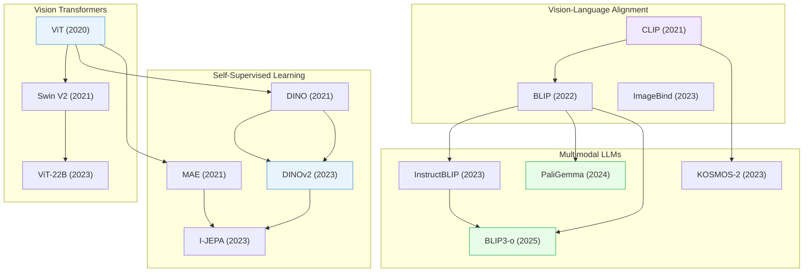

# Foundation Models & Transformers

> [!abstract] Overview
> From ViT to billion-parameter VLMs, foundation models define the backbone of modern AI. This note traces the evolution from vision transformers through self-supervised learning to the large multi-modal models that power VLAs, reasoning systems, and autonomous agents. It also covers the training recipes, attention innovations, and adaptation strategies that make these models practical.

## Evolution Graph

| Node | Paper |
|------|-------|
| ViT | [[2010.11929\|ViT]] |
| Swin V2 | [[2111.09883\|Swin V2]] |
| ViT-22B | [[2302.05442\|ViT-22B]] |
| DINO | [[2104.14294\|DINO]] |
| MAE | [[2111.06377\|MAE]] |
| DINOv2 | [[2304.07193\|DINOv2]] |
| I-JEPA | [[2301.08243\|I-JEPA]] |
| CLIP | [[2103.00020\|CLIP]] |
| BLIP | [[2201.12086\|BLIP]] |
| ImageBind | [[2305.05665\|ImageBind]] |
| InstructBLIP | [[2305.06500\|InstructBLIP]] |
| KOSMOS-2 | [[2306.14824\|KOSMOS-2]] |
| PaliGemma | [[2407.07726\|PaliGemma]] |
| BLIP3-o | [[2505.09568\|BLIP3-o]] |

---

## 1. Vision Transformers

The architectural revolution that brought attention mechanisms to computer vision, replacing CNN inductive biases with scalable self-attention over image patches.

**Foundational Architectures** — The core ViT lineage from patch tokenization to multi-scale hierarchies and extreme scale.
- [[2010.11929|ViT]], [[2111.09883|Swin V2]], [[2302.05442|ViT-22B]], [[2205.14949|HiViT]], [[2310.00632|WIN-WIN]]

> [!star] Key Papers
> - [[2010.11929|ViT]] — Split images into 16x16 patches, applied standard Transformer encoder; proved Transformers match CNNs with enough data
> - [[2111.09883|Swin V2]] — Shifted window attention for efficient high-resolution processing; scaled to 3B parameters
> - [[2302.05442|ViT-22B]] — Largest dense ViT at 22B parameters; demonstrated continued scaling benefits for vision

**Hierarchical & Domain-Specific ViTs** — Specialized adaptations of ViT for high-resolution inputs and domain-specific tasks like medical imaging.
- [[2205.14949|HiViT]], [[2310.00632|WIN-WIN]], [[2206.02647|HIPT]], [[2504.17379|GABMIL]]

> [!star] Key Papers
> - [[2206.02647|HIPT]] — Hierarchical self-supervised ViT for gigapixel pathology images; processes whole slide images across multiple magnifications
> - [[2504.17379|GABMIL]] — Extends attention-based multiple instance learning with global spatial context for digital pathology

**Key Surveys** — Comprehensive overviews of the vision transformer landscape.
- [[2101.01169|Transformers in Vision Survey]], [[2111.06091|Visual Transformers Survey]], [[2305.09880|ViT CNN-Transformer Survey]]

> [!tip] Scaling vs Efficiency
> ViTs scale well (ViT-22B proves this), but raw scaling is not always practical. Hierarchical designs like Swin and HiViT recover multi-scale features efficiently, while domain-specific adaptations (HIPT for pathology, WIN-WIN for high-res) show that architecture matters as much as scale.

---

## 2. Attention Mechanisms & Architectural Innovations

New attention patterns, normalization strategies, and structural modifications that improve Transformer efficiency, stability, and expressiveness.

**Sparse & Efficient Attention** — Reducing the quadratic cost of self-attention through sparsity, routing, and learned masking.
- [[2505.00315|MoSA]], [[2508.02124|DMA]], [[2603.15619|MoDA]], [[2505.17083|Scale-invariant Attention]], [[2505.01996|Token Graying]], [[2009.06732|Efficient Transformers Survey]]

> [!star] Key Papers
> - [[2505.00315|MoSA]] — Mixture of Sparse Attention with expert-choice routing; content-based learned sparsity
> - [[2508.02124|DMA]] — Fully differentiable dynamic mask sparse attention; hardware-optimized for practical deployment
> - [[2603.15619|MoDA]] — Mixture-of-Depths Attention dynamically allocates compute across tokens and layers

**Activation & Normalization Replacements** — Drop-in replacements for LayerNorm and Softmax that improve training stability or remove normalization entirely.
- [[2503.10622|DyT]], [[2504.20966|Softpick]], [[2512.10938|Derf]], [[2603.15031|AttnRes]], [[2512.24880|mHC]]

> [!star] Key Papers
> - [[2503.10622|DyT]] — Dynamic Tanh as a drop-in replacement for normalization layers; simpler and equally effective
> - [[2504.20966|Softpick]] — Rectified non-sum-to-one normalization; eliminates attention sinks and massive activations

**Residual Connections & Depth** — Rethinking how information flows through deep networks via improved residual strategies and adaptive depth.
- [[2603.15031|AttnRes]], [[2512.24880|mHC]], [[2507.10524|MoR]], [[2512.24695|Hope]]

> [!star] Key Papers
> - [[2507.10524|MoR]] — Mixture-of-Recursions unifies parameter efficiency with adaptive per-token computation depth
> - [[2512.24695|Hope]] — Nested Learning reinterprets deep learning as nested multi-level optimization

**Hybrid Architectures** — Combining Transformers with state-space models, recurrence, or looped computation for improved efficiency.
- [[2507.22448|Falcon-H1]], [[2503.24067|TransMamba]], [[2311.12424|Looped Transformers]], [[2501.00663|Titans]]

> [!star] Key Papers
> - [[2507.22448|Falcon-H1]] — Hybrid-head models integrating parallel Transformer and Mamba blocks; redefines the efficiency-performance frontier
> - [[2501.00663|Titans]] — Learns to memorize at test time via a dedicated neural memory module; bridges short and long-range context

**Theoretical Foundations of Transformers** — Formal analyses of what Transformers compute, how in-context learning works, and connections to established frameworks.
- [[2603.17063|Transformers as Bayesian Networks]], [[2507.16003|ICL Implicit Dynamics]], [[2502.14010|ICL Attention Heads]], [[2509.00421|Prompt Tuning Memory Limits]], [[2504.13173|Miras]]

> [!star] Key Papers
> - [[2603.17063|Transformers as Bayesian Networks]] — Proves sigmoid Transformers fundamentally operate as Bayesian networks
> - [[2507.16003|ICL Implicit Dynamics]] — Shows in-context learning in LLMs can be modeled as implicitly solving dynamical systems

> [!tip] The Post-Softmax Era
> 2025 saw a wave of work replacing or augmenting standard softmax attention (Softpick, DyT, Derf) and standard normalization (DyT removes it entirely). These are not incremental — they change how information flows through Transformers and may become default in next-generation architectures.

---

## 3. Self-Supervised Visual Learning

Learning visual representations without labels — the foundation for data-efficient downstream tasks.

**Contrastive & Self-Distillation** — Methods that learn by comparing or distilling representations without labeled data.
- [[2104.14294|DINO]], [[2304.07193|DINOv2]], [[2502.10385|SimDINO]], [[2503.09867|OH-A-DINO]], [[2506.10159|VCL]], [[2507.14137|Franca]]

> [!star] Key Papers
> - [[2104.14294|DINO]] — Self-distillation with no labels; emergent object segmentation in attention maps
> - [[2304.07193|DINOv2]] — Curated data + distillation produces universal visual features without fine-tuning
> - [[2502.10385|SimDINO]] — Dramatically simplified DINO via coding rate regularization; shows what DINO really needs

**Masked Image Modeling** — Self-supervised methods that mask patches of an image and train the model to reconstruct or predict the missing content, learning rich visual representations without labels.
- [[2111.06377|MAE]], [[2106.08254|BEiT]], [[2205.14949|HiViT]]

> [!star] Key Papers
> - [[2111.06377|MAE]] — Masked 75% of patches; proved simple reconstruction objective learns powerful features
> - [[2106.08254|BEiT]] — BERT-style pre-training for vision: predict discrete visual tokens from masked patches

**JEPA & Latent Prediction** — Joint-Embedding Predictive Architectures that predict in representation space rather than pixel space, avoiding reconstruction artifacts.
- [[2301.08243|I-JEPA]], [[2511.08544|LeJEPA]], [[2512.19605|KerJEPA]], [[2602.11389|Causal-JEPA]]

> [!star] Key Papers
> - [[2301.08243|I-JEPA]] — Predicts in latent space instead of pixel space; avoids reconstruction artifacts
> - [[2511.08544|LeJEPA]] — Provable and scalable self-supervised learning framework based on Euclidean latent geometry
> - [[2602.11389|Causal-JEPA]] — Object-centric world model integrating JEPAs with causal reasoning via latent interventions

> [!tip] The JEPA Lineage
> I-JEPA started a family: [[2511.08544|LeJEPA]] (provable foundations) and [[2512.19605|KerJEPA]] (kernel methods) extend the theory, while [[2602.11389|Causal-JEPA]] adds causal reasoning. For the full robotics-oriented lineage (V-JEPA 2 → VL-JEPA → VLA-JEPA), see the JEPA notes in the vault.

**Continual & Semi-Supervised Learning** — Adapting self-supervised models for streaming data, long-tailed distributions, and test-time shifts.
- [[2507.10434|CLA]], [[2505.05062|ULFine]], [[2512.15934|IC-SSL]], [[2506.23529|SSTTA]], [[2411.13852|ESRM]], [[2603.06693|SER]]

> [!star] Key Papers
> - [[2507.10434|CLA]] — Continual Latent Alignment for online continual self-supervised learning; avoids catastrophic forgetting
> - [[2512.15934|IC-SSL]] — In-Context Semi-Supervised Learning: Transformer framework leveraging in-context learning for semi-supervised tasks

**Dataset Distillation & Representation Theory** — Compressing training data and understanding the theoretical properties of learned representations.
- [[2511.16674|LGM]], [[2512.09322|GPSSL]], [[2601.03220|Epiplexity]], [[2504.10428|PIU Learning]], [[2603.12228|Neural Thickets]]

> [!star] Key Papers
> - [[2511.16674|LGM]] — Linear Gradient Matching for dataset distillation in self-supervised models; highly efficient compression
> - [[2601.03220|Epiplexity]] — New information measure beyond entropy for computationally bounded intelligence

**Test-Time Training & Adaptation** — Methods that adapt visual models at inference time to handle distribution shifts.
- [[2603.00518|Vision-TTT]], [[2506.23529|SSTTA]]

> [!star] Key Papers
> - [[2603.00518|Vision-TTT]] — Adapts Test-Time Training for efficient visual representation learning; bridges pre-training and inference

**Anomaly & Domain-Specific Detection** — Self-supervised approaches for anomaly detection and unsupervised domain adaptation.
- [[2601.05552|UniADet]], [[2502.10694|UDA Simulation Study]], [[2411.15869|SC-CLIP]]

> [!star] Key Papers
> - [[2601.05552|UniADet]] — Universal vision anomaly detection without language priors; purely visual foundation model approach
> - [[2411.15869|SC-CLIP]] — Training-free self-calibrated CLIP for open-vocabulary segmentation; resolves anomalous attention biases

> [!tip] From Reconstruction to Prediction
> The field moved from pixel reconstruction (MAE, BEiT) to latent prediction (I-JEPA, LeJEPA). Latent prediction avoids wasting capacity on irrelevant pixel details and produces more semantically meaningful features. Meanwhile, continual learning (CLA, IC-SSL) ensures these methods work in non-stationary real-world settings.

---

## 4. Vision-Language Alignment

Connecting visual and textual representations in a shared embedding space, enabling zero-shot transfer and multimodal reasoning.

**Contrastive Alignment** — Learning joint image-text embeddings via contrastive objectives on large-scale paired data.
- [[2103.00020|CLIP]], [[2212.07143|OpenCLIP]], [[2205.01917|CoCa]], [[2507.18009|GRR-CoCa]]

> [!star] Key Papers
> - [[2103.00020|CLIP]] — Contrastive pre-training on 400M image-text pairs; enabled zero-shot transfer to any visual task via text prompts
> - [[2205.01917|CoCa]] — Combined contrastive and generative objectives in a single contrastive captioner
> - [[2507.18009|GRR-CoCa]] — Integrates modern LLM architectural features into the CoCa framework for improved multimodal performance

**Multi-Modal Embedding Spaces** — Extending alignment beyond image-text to encompass audio, depth, thermal, and other modalities.
- [[2305.05665|ImageBind]], [[2506.23639|Being-VL]], [[2510.06673|Heptapod]]

> [!star] Key Papers
> - [[2305.05665|ImageBind]] — Extended alignment to 6 modalities (image, text, audio, depth, thermal, IMU) via a single embedding space
> - [[2506.23639|Being-VL]] — Unified multimodal understanding via byte-pair encoding applied to visual tokens

**Bootstrapped & Generative Alignment** — Methods that generate or bootstrap training data for vision-language alignment.
- [[2201.12086|BLIP]], [[2411.15869|SC-CLIP]]

> [!star] Key Papers
> - [[2201.12086|BLIP]] — Unified understanding and generation with bootstrapped captioning; self-cleans noisy web data

> [!tip] Beyond Image-Text Pairs
> CLIP showed that contrastive learning on web-scale data creates powerful zero-shot models. The next frontier (ImageBind, Being-VL, Heptapod) extends this to arbitrary modalities. The key insight: a single well-aligned embedding space transfers better than modality-specific encoders.

---

## 5. Multimodal Large Language Models

LLMs augmented with visual perception — the backbone for modern VLMs and VLAs. These models bridge language understanding with visual grounding, generation, and action.

**Instruction-Tuned VLMs** — General-purpose multimodal models trained to follow instructions across vision-language tasks.
- [[2305.06500|InstructBLIP]], [[2310.03744|LLaVA-1.5]], [[2407.07726|PaliGemma]], [[2505.09568|BLIP3-o]]

> [!star] Key Papers
> - [[2407.07726|PaliGemma]] — Sub-3B VLM achieving SOTA on 40 tasks; SigLIP + Gemma connected by linear projection
> - [[2310.03744|LLaVA-1.5]] — Enhanced large multimodal model achieving SOTA with simple architectural improvements
> - [[2505.09568|BLIP3-o]] — Fully open unified multimodal model family excelling in both understanding and generation

**Grounded & Spatial MLLMs** — Models that can localize objects, reference bounding boxes, and reason about spatial relationships.
- [[2306.14824|KOSMOS-2]], [[2601.13633|EGM]], [[2602.11635|MathSpatial]]

> [!star] Key Papers
> - [[2306.14824|KOSMOS-2]] — Grounded multimodal LLM: generates text with bounding box references
> - [[2601.13633|EGM]] — Enables smaller VLMs to scale test-time inference for visual grounding

**Any-to-Any & Agent-Oriented MLLMs** — Models designed for arbitrary modality conversion or as foundations for autonomous agents.
- [[2309.05519|NExT-GPT]], [[2502.13130|Magma]], [[2303.11381|MM-REACT]]

> [!star] Key Papers
> - [[2309.05519|NExT-GPT]] — Any-to-any multimodal LLM handling text, image, audio, and video
> - [[2502.13130|Magma]] — Foundation model specifically designed for multimodal AI agents

**Visual Reasoning & Thinking** — Methods for enhancing MLLMs with explicit reasoning, chain-of-thought over images, and self-rewarding loops.
- [[2505.17022|GoT-R1]], [[2508.19652|Vision-SR1]], [[2511.09018|Owl]], [[2510.06783|TTRV]], [[2504.17207|APC]], [[2506.23918|Thinking with Images Survey]], [[2601.13705|LVLM Visual Puzzle Survey]]

> [!star] Key Papers
> - [[2505.17022|GoT-R1]] — Applies RL to unleash reasoning capability of MLLMs for visual generation
> - [[2508.19652|Vision-SR1]] — Self-rewarding RL framework for VLMs via reasoning decomposition
> - [[2510.06783|TTRV]] — First test-time RL framework for decoder-based VLMs

**MLLM Evaluation & Benchmarks** — Reward models, judging frameworks, and benchmarks for evaluating multimodal model quality.
- [[2512.16899|MMRB2]], [[2511.10055|HCM-GRPO]], [[2508.19229|StepWiser]]

> [!star] Key Papers
> - [[2512.16899|MMRB2]] — First comprehensive benchmark for evaluating reward models on multimodal interleaved content
> - [[2508.19229|StepWiser]] — Generative judges that meta-reason about intermediate reasoning steps

**Key Surveys** — Comprehensive surveys mapping the rapidly evolving MLLM landscape.
- [[2306.13549|MLLM Survey]], [[2405.10739|Efficient MLLM Survey]], [[2405.19334|LLM Multimodal Generation Survey]]

> [!tip] The VLM Stack
> Modern VLMs follow a consistent pattern: frozen vision encoder (often SigLIP or DINOv2) + lightweight connector (linear projection or Q-Former) + LLM backbone. PaliGemma proved this can work at sub-3B scale, while BLIP3-o and LLaVA-1.5 showed that open models can compete with proprietary ones. The frontier is now visual reasoning (GoT-R1, Vision-SR1) and test-time RL (TTRV).

---

## 6. LLM Training & Optimization

Core training recipes, optimizers, scaling laws, and architectural insights for training large language models efficiently.

**Optimizers** — Second-order and novel optimizers that improve over AdamW for large-scale training.
- [[2502.16982|Muon]], [[2505.02222|Muon (practical)]], [[2505.23725|MuLoCo]], [[2506.07254|SPlus]]

> [!star] Key Papers
> - [[2502.16982|Muon]] — Breakthrough: second-order optimizer demonstrating superior training efficiency over AdamW for LLMs
> - [[2505.23725|MuLoCo]] — Muon as inner optimizer for DiLoCo distributed training; significant speedup over AdamW

**Scaling Laws & Training Dynamics** — Understanding how loss curves, learning rates, batch sizes, and training duration interact at scale.
- [[2503.12811|MPL]], [[2405.18392|Compute-Optimal Scaling Laws]], [[2507.07101|Small Batch LLM Training]], [[2505.10559|Neural Thermodynamic Laws]], [[2309.14322|Transformer Training Instabilities]], [[2603.15958|Hyperparameter Scaling Laws]]

> [!star] Key Papers
> - [[2503.12811|MPL]] — Multi-Power Law accurately predicts training loss across learning rate schedules
> - [[2507.07101|Small Batch LLM Training]] — Small batch sizes (even batch=1) can stably train LLMs; challenges the large-batch orthodoxy

**Inference Acceleration** — Techniques for faster inference through early exit, speculative decoding, and layer skipping.
- [[2404.16710|LayerSkip]], [[2505.11820|CoLM]]

> [!star] Key Papers
> - [[2404.16710|LayerSkip]] — Enables accurate early exit and self-speculative decoding for faster LLM inference
> - [[2505.11820|CoLM]] — Chain-of-Model enables incremental scaling and elastic adaptation

**Architecture Search & Discovery** — Automated methods for discovering novel neural network architectures.
- [[2507.18074|ASI-ARCH]], [[2505.09343|DeepSeek-V3]]

> [!star] Key Papers
> - [[2507.18074|ASI-ARCH]] — Autonomous system that discovers novel transformer architectures via automated search
> - [[2505.09343|DeepSeek-V3]] — Hardware-software co-design strategy achieving SOTA LLM performance

**Interpretability & Internal Representations** — Understanding what models learn internally and how to analyze their representations.
- [[2502.02013|Layer-by-Layer Representations]], [[2506.15679|Dense SAE Latents]], [[2603.12228|Neural Thickets]]

> [!star] Key Papers
> - [[2502.02013|Layer-by-Layer Representations]] — Intermediate layers often provide superior downstream representations compared to final layers
> - [[2506.15679|Dense SAE Latents]] — Redefines dense latents in Sparse Autoencoders from artifacts to functional features

> [!tip] The Muon Moment
> 2025 may be remembered as the year AdamW lost its monopoly. Muon (and its distributed variant MuLoCo) demonstrated that second-order optimization is practical at LLM scale. Combined with scaling law insights (MPL, small-batch training), the training recipe for LLMs is being fundamentally rewritten.

---

## 7. Efficient Adaptation & Model Composition

Making foundation models practical: parameter-efficient fine-tuning, model merging, prompt tuning, and efficient transfer.

**Prompt Learning** — Adapting foundation models through learned prompts rather than full fine-tuning.
- [[2109.01134|CoOp]], [[2203.05557|CoCoOp]], [[2309.16797|PromptBreeder]]

> [!star] Key Papers
> - [[2109.01134|CoOp]] — Learnable prompts for adapting CLIP without fine-tuning; launched the prompt learning field
> - [[2309.16797|PromptBreeder]] — Self-referential self-improvement via prompt evolution; automates prompt engineering

**LoRA & Parameter-Efficient Fine-Tuning** — Methods that adapt large models by training only a small fraction of parameters.
- [[2312.12148|PEFT Survey]], [[2506.06105|T2L]], [[2507.11851|Gated LoRA]]

> [!star] Key Papers
> - [[2506.06105|T2L]] — Text-to-LoRA: hypernetwork that dynamically generates task-specific LoRA adapters from text descriptions
> - [[2507.11851|Gated LoRA]] — Enables pretrained autoregressive LLMs to perform multi-token prediction via gated LoRA modules

**Model Merging & Weight Averaging** — Combining multiple fine-tuned models into a single improved model without retraining.
- [[2408.07666|Model Merging Survey]], [[2505.12082|PMA]], [[1803.05407|SWA]]

> [!star] Key Papers
> - [[1803.05407|SWA]] — Stochastic Weight Averaging: simple technique that finds wider optima and better generalization
> - [[2505.12082|PMA]] — Pre-trained Model Average for effective merging of LLM checkpoints

**Machine Unlearning & Safety** — Removing specific data influence from trained models for privacy and safety compliance.
- [[2402.15109|MU-Mis]]

**Continual Pretraining & Domain Adaptation** — Extending foundation models to new domains or tasks through continued training.
- [[2509.06806|MachineLearningLM]], [[2507.00994|MLM vs CLM Pretraining]], [[2507.06187|Delta Learning Hypothesis]]

> [!star] Key Papers
> - [[2509.06806|MachineLearningLM]] — Continued pretraining framework that enhances LLMs with robust many-shot in-context learning for ML tasks
> - [[2507.06187|Delta Learning Hypothesis]] — Preference tuning on pairs of individually weak outputs can yield strong gains

**Gradient-Free & Evolutionary Optimization** — Optimizing models without gradient computation using evolution strategies.
- [[2510.10603|EA4LLM]], [[2602.03120|QES]]

**Symmetry & Loss Landscape Theory** — Theoretical understanding of parameter space structure and its implications for training and merging.
- [[2506.13018|NN Parameter Space Symmetry Survey]]

> [!tip] The Adaptation Toolkit
> The modern practitioner's stack: LoRA for efficient fine-tuning, SWA/PMA for merging multiple checkpoints, PromptBreeder for automated prompt optimization, and T2L for on-the-fly adapter generation. The key insight from 2025: you rarely need to fine-tune the full model — the right adapter strategy often matches or exceeds full fine-tuning.

---

## 8. RL for LLM Reasoning

Reinforcement learning applied to improve language model reasoning, self-improvement, and verifiable reward systems.

**RL with Verifiable Rewards** — Training LLMs with RL using automatically verifiable reward signals rather than human feedback.
- [[2503.23829|RLVR]], [[2506.00103|Writing-Zero]], [[2510.06499|Webscale-RL]], [[2512.16649|JustRL]], [[2508.18588|RhymeRL]], [[2509.26074|LENS]]

> [!star] Key Papers
> - [[2503.23829|RLVR]] — Extends RL with verifiable rewards beyond math/code to diverse domains
> - [[2510.06499|Webscale-RL]] — Automated pipeline scaling verifiable RL training data to pretraining levels
> - [[2512.16649|JustRL]] — Simplified RL recipe effectively scales a 1.5B model for mathematical reasoning

**Reasoning Models** — LLMs explicitly trained for multi-step reasoning with RL.
- [[2506.10910|Magistral]], [[2505.10320|J1]], [[2507.18071|GSPO]]

> [!star] Key Papers
> - [[2506.10910|Magistral]] — Mistral's first reasoning model using custom RLHF for chain-of-thought
> - [[2505.10320|J1]] — RL-trained LLM-as-a-Judge that incentivizes genuine thinking during evaluation

**LLM-as-a-Judge & Evaluation** — Using LLMs to evaluate other LLMs, with RL to improve judging quality.
- [[2411.15594|LLM-as-a-Judge Survey]], [[2505.10320|J1]], [[2508.19229|StepWiser]]

> [!star] Key Papers
> - [[2411.15594|LLM-as-a-Judge Survey]] — Comprehensive survey providing formal definitions and unified taxonomy for LLM-based evaluation

**Agentic RL & Search** — RL applied to LLM-based agents for tool use, search, and multi-step task completion.
- [[2603.11327|MR-Search]], [[2603.12011|RFT LLM Agent Generalization]]

> [!star] Key Papers
> - [[2603.11327|MR-Search]] — Meta-RL framework enabling LLM search agents to improve via in-context learning
> - [[2603.12011|RFT LLM Agent Generalization]] — Systematic investigation of whether reinforcement fine-tuning improves LLM agent generalization

**Unsupervised & Self-Supervised LLM Alignment** — Aligning language models without explicit human feedback through self-supervised objectives.
- [[2506.10139|ICM]]

> [!tip] The RL-for-Reasoning Stack
> Post-DeepSeek-R1, the recipe is clear: start with SFT for format, then RL with verifiable rewards for reasoning. Webscale-RL showed you can automate reward data collection at pretraining scale. JustRL proved even a 1.5B model benefits. The frontier is extending verifiable rewards beyond math/code (Writing-Zero, RLVR).

---

## 9. Embodied Foundation Models

Foundation models applied to robotics — VLAs, action pretraining, world models, and sim-to-real transfer.

**Vision-Language-Action Models** — Models that bridge perception, language understanding, and physical action for robot control.
- [[2504.16054|pi0.5]], [[2512.00975|MM-ACT]], [[2508.07917|MolmoAct]], [[2602.12062|HoloBrain-0]], [[2603.11653|VLA RL Continual Learning]]

> [!star] Key Papers
> - [[2504.16054|pi0.5]] — VLA model enabling mobile robots to perform complex household tasks in entirely new homes
> - [[2512.00975|MM-ACT]] — Unified VLA model integrating text, image, and robot actions into a single multimodal framework
> - [[2508.07917|MolmoAct]] — Action Reasoning Models integrating depth-aware perception with visual reasoning for spatial tasks

**Action Pretraining & Latent Actions** — Learning action representations from video without explicit action labels.
- [[2410.11758|LAPA]], [[2310.08576|AVDC]]

> [!star] Key Papers
> - [[2410.11758|LAPA]] — Latent Action Pretraining from videos; learns action representations without action labels
> - [[2310.08576|AVDC]] — Learns manipulation tasks from actionless video via dense visual correspondences

**World Models for Robotics** — Learned simulators that predict future states for planning and policy training.
- [[2511.09057|PAN]], [[2602.11389|Causal-JEPA]], [[2603.12231|Temporal Straightening]]

> [!star] Key Papers
> - [[2511.09057|PAN]] — World model using Generative Latent Prediction for general, interactable, long-horizon simulation
> - [[2603.12231|Temporal Straightening]] — Geometric regularization for straighter latent trajectories; improves latent planning

**Simulation Environments** — Platforms for training and evaluating robotic manipulation and interaction.
- [[2003.08515|SAPIEN]]

> [!star] Key Papers
> - [[2003.08515|SAPIEN]] — Simulated environment with 2,346 articulated objects; foundational platform for robot manipulation research

> [!tip] The VLA Pipeline
> Modern VLAs follow a pattern: large-scale pretraining on internet video (LAPA) or diverse robot data (pi0.5), then RL fine-tuning for specific tasks (VLA RL Continual Learning). World models (PAN, Causal-JEPA) are emerging as the "imagination engine" that enables sample-efficient policy learning without costly real-world interaction.

---

## 10. Emerging Methods

Unconventional approaches that do not fit neatly into the above categories but represent important research directions.

**Neuromorphic & Bio-Inspired Learning** — Learning algorithms inspired by biological neural mechanisms.
- [[2307.04054|Deep-STDP]]

**LLM-Assisted Research Tools** — Using LLMs to automate aspects of the research process itself.
- [[2504.17192|PaperCoder]], [[2508.17971|LLM-NAR]]

> [!star] Key Papers
> - [[2504.17192|PaperCoder]] — Multi-agent LLM framework that generates functional code from scientific papers
> - [[2508.17971|LLM-NAR]] — Integrates LLMs with Graph Neural Networks for multi-agent path finding

**Visual Generation & Style Transfer** — Foundation model approaches to image generation, editing, and style-driven synthesis.
- [[2508.18966|USO]], [[2505.17022|GoT-R1]]

**Geospatial & Location Intelligence** — Applying foundation models to geospatial representation learning.
- [[2505.09651|Location Intelligence Survey]]

**Hardware Security & Physical Systems** — Foundation model techniques applied to hardware security and physical unclonable functions.
- [[2403.01299|Photonic PUF ML Resilience]]

> [!tip] Watch List
> PaperCoder and LLM-NAR represent a meta-trend: AI systems that accelerate AI research itself. Deep-STDP explores whether biological learning rules can complement backpropagation. These are early signals of potentially transformative directions.

---

## Cross-References

- [[04_Reinforcement-Learning]] — RL fine-tunes these foundation models for reasoning
- [[02_Vision-Language-Models]] — VLMs built on these foundations
- [[07_Robotics-and-Embodied-AI]] — Foundation models as backbones for VLAs
- [[09_Multimodal-LLMs]] — Detailed coverage of multimodal architectures
- [[03_Reasoning-and-Planning]] — Reasoning methods that build on foundation models

---

*Next: [[02_Vision-Language-Models]] for how these foundations are applied to multi-modal understanding.*
