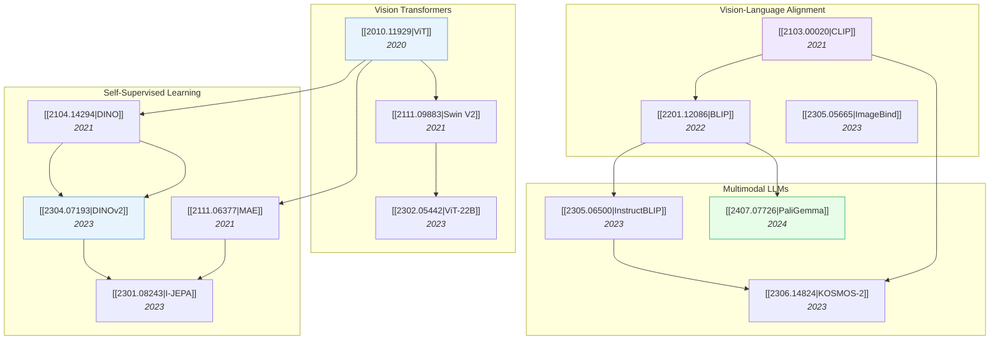

# Foundation Models & Transformers

> [!abstract] Overview
> From ViT to billion-parameter VLMs, foundation models define the backbone of modern AI. This note traces the evolution from vision transformers through self-supervised learning to the large multi-modal models that power VLAs, reasoning systems, and autonomous agents.

## Evolution Graph

---

## 1. Vision Transformers

The architectural revolution that brought attention mechanisms to computer vision.

- [[2010.11929|ViT]] (2020) — the original: split images into ==16x16 patches==, treat them as tokens, apply a standard Transformer encoder. Proved Transformers can match CNNs with enough data
- [[2111.09883|Swin V2]] (2021) — ==shifted window attention== for efficient high-resolution processing; scaled to 3B parameters
- [[2302.05442|ViT-22B]] (2023) — largest dense ViT at ==22B parameters==; demonstrated continued scaling benefits for vision

**Key surveys:** [[2101.01169|Transformers in Vision Survey]], [[2111.06091|Visual Transformers Survey]], [[2305.09880|ViT CNN-Transformer Survey]]

---

## 2. Self-Supervised Visual Learning

Learning visual representations without labels — the foundation for data-efficient downstream tasks.

| Paper | Year | Key Idea |
| --- | --- | --- |
| [[2104.14294\|DINO]] | 2021 | ==Self-distillation== with no labels; emergent object segmentation in attention maps |
| [[2111.06377\|MAE]] | 2021 | ==Masked autoencoder==: mask 75% of patches, reconstruct pixels. Simple and scalable |
| [[2304.07193\|DINOv2]] | 2023 | Curated data + distillation → universal visual features without fine-tuning |
| [[2301.08243\|I-JEPA]] | 2023 | ==Joint-Embedding Predictive Architecture==: predict in representation space, not pixel space |
| [[2106.08254\|BEiT]] | 2021 | BERT-style pre-training for vision: predict discrete visual tokens |

> [!tip] The JEPA Lineage
> I-JEPA → [[2506.09985|V-JEPA 2]] → [[2603.14482|V-JEPA 2.1]] → [[2602.10098|VLA-JEPA]]. See [[04-1_JEPA]] for the full evolution.

---

## 3. Vision-Language Alignment

Connecting visual and textual representations in a shared embedding space.

- [[2103.00020|CLIP]] (2021) — ==contrastive pre-training== on 400M image-text pairs; enabled zero-shot transfer to any visual task via text prompts
- [[2201.12086|BLIP]] (2022) — unified ==understanding and generation== with bootstrapped captioning
- [[2205.01917|CoCa]] (2022) — ==contrastive captioner==: combined contrastive and generative objectives
- [[2305.05665|ImageBind]] (2023) — extended alignment to ==6 modalities== (image, text, audio, depth, thermal, IMU) via a single embedding space
- [[2212.07143|OpenCLIP]] (2022) — open-source CLIP reproduction with ==scaling law analysis==

---

## 4. Multimodal Large Language Models

LLMs augmented with visual perception — the backbone for modern VLMs and VLAs.

- [[2305.06500|InstructBLIP]] (2023) — instruction-tuned BLIP-2 for general-purpose VLM tasks
- [[2306.14824|KOSMOS-2]] (2023) — ==grounded multimodal LLM==: generates text with bounding box references
- [[2407.07726|PaliGemma]] (2024) — ==sub-3B== VLM achieving SOTA on 40 tasks; ==SigLIP + Gemma== connected by linear projection
- [[2309.05519|NExT-GPT]] (2023) — ==any-to-any== multimodal LLM (text, image, audio, video)
- [[2502.13130|Magma]] (2025) — foundation model for ==multimodal AI agents==

> [!warning] Survey Coverage
> The MLLM space moves fast. Key surveys: [[2306.13549|MLLM Survey]] (2023), [[2405.10739|Efficient MLLM Survey]] (2024).

---

## 5. Efficient Training & Adaptation

Making foundation models practical: parameter-efficient fine-tuning, model merging, and efficient architectures.

| Paper | Year | Contribution |
| --- | --- | --- |
| [[2109.01134\|CoOp]] | 2021 | ==Learnable prompts== for adapting CLIP without fine-tuning |
| [[2203.05557\|CoCoOp]] | 2022 | ==Conditional prompts== that generalize to unseen classes |
| [[2312.12148\|PEFT Survey]] | 2023 | Survey of LoRA, adapters, prompt tuning, and other PEFT methods |
| [[2408.07666\|Model Merging Survey]] | 2024 | Survey of combining multiple fine-tuned models |
| [[2009.06732\|Efficient Transformers Survey]] | 2020 | Survey of linear attention, sparse attention, and other efficiency methods |

---

## Cross-References

- [[04_Reinforcement-Learning]] — RL fine-tunes these foundation models for reasoning
- [[02_Vision-Language-Models]] — VLMs built on these foundations
- [[07_Robotics-and-Embodied-AI]] — Foundation models as backbones for VLAs
- [[04-1_JEPA]] — JEPA family evolution from I-JEPA to VLA-JEPA

---

*Next: [[02_Vision-Language-Models]] for how these foundations are applied to multi-modal understanding.*

---

## Complete Paper Listing

### Alignment & Adaptation (1)

| Paper | Year | Summary |
| --- | --- | --- |
| [[2505.12082\|PMA]] | 2025 | Pre-trained Model Average (PMA), developed by researchers at ByteDance Seed, Peking University, and The University of... |

### Efficient Training & Inference (3)

| Paper | Year | Summary |
| --- | --- | --- |
| [[1803.05407\|SWA]] | 2018 | Stochastic Weight Averaging (SWA) is a simple optimization technique that improves the generalization performance of ... |
| [[2402.15109\|MU-Mis]] | 2024 | MU-Mis introduces a machine unlearning method that efficiently removes data influence from deep neural networks witho... |
| [[2506.13018\|NN Parameter Space Symmetry Survey]] | 2025 | This survey paper systematically consolidates fragmented knowledge on parameter space symmetry in neural networks, de... |

### Large Language Models (13)

| Paper | Year | Summary |
| --- | --- | --- |
| [[2404.16710\|LayerSkip]] | 2024 | Meta's LayerSkip accelerates Large Language Model (LLM) inference by enabling accurate early exit and self-speculativ... |
| [[2502.16982\|Muon]] | 2025 | Moonshot AI researchers demonstrate a breakthrough in large language model training efficiency with the Muon optimize... |
| [[2503.12811\|MPL]] | 2025 | Researchers from Tsinghua University and partners derive a Multi-Power Law (MPL) that accurately predicts the trainin... |
| [[2505.02222\|Muon]] | 2025 | Essential AI demonstrates that Muon, a second-order optimizer, offers superior practical efficiency over AdamW for la... |
| [[2505.23725\|MuLoCo]] | 2025 | Mila researchers demonstrate that Muon optimizer significantly outperforms AdamW as the inner optimizer in DiLoCo dis... |
| [[2506.06105\|T2L]] | 2025 | Sakana AI researchers developed Text-to-LoRA (T2L), a hypernetwork that dynamically generates task-specific Low-Rank ... |
| [[2507.00994\|MLM vs CLM Pretraining]] | 2025 | This paper presents a controlled study comparing Masked Language Modeling (MLM) and Causal Language Modeling (CLM) as... |
| [[2507.06187\|Delta Learning Hypothesis]] | 2025 | Proposes the delta learning hypothesis, demonstrating that preference tuning on pairs of individually weak model outp... |
| [[2507.07101\|Small Batch LLM Training]] | 2025 | Researchers from NYU and Columbia demonstrated that small batch sizes, even down to one, can stably and effectively t... |
| [[2507.11851\|Gated LoRA]] | 2025 | A framework developed by researchers at Apple enables pretrained autoregressive large language models to perform mult... |
| [[2507.18074\|ASI-ARCH]] | 2025 | ASI-ARCH, developed by Shanghai Jiao Tong University and collaborators, is an autonomous system that discovers novel ... |
| [[2509.06806\|MachineLearningLM]] | 2025 | A continued pretraining framework, MACHINELEARNINGLM, enhances a general-purpose LLM with robust many-shot in-context... |
| [[2510.10603\|EA4LLM]] | 2025 | EA4LLM introduces a gradient-free method employing Evolution Strategies for optimizing Large Language Models, success... |

### Self-Supervised Learning (9)

| Paper | Year | Summary |
| --- | --- | --- |
| [[2503.09867\|OH-A-DINO]] | 2025 | OH-A-DINO addresses the deficiency of self-supervised vision models and slot-based methods in capturing non-geometric... |
| [[2505.05062\|ULFine]] | 2025 | A framework for long-tailed semi-supervised learning leverages foundation models through prototype adaptive fitting a... |
| [[2506.10139\|ICM]] | 2025 | This paper presents Internal Coherence Maximization (ICM), an unsupervised algorithm for fine-tuning language models ... |
| [[2507.10434\|CLA]] | 2025 | The paper introduces Continual Latent Alignment (CLA), a self-supervised learning strategy designed for online contin... |
| [[2511.16674\|LGM]] | 2025 | The Massachusetts Institute of Technology developed Linear Gradient Matching (LGM), a dataset distillation method for... |
| [[2512.09322\|GPSSL]] | 2025 | This work introduces Gaussian Process Self-Supervised Learning (GPSSL), a framework that integrates Gaussian Processe... |
| [[2512.19605\|KerJEPA]] | 2025 | KERJEPA introduces a generalized framework for Euclidean self-supervised learning, building on LeJEPA by employing va... |
| [[2601.03220\|Epiplexity]] | 2026 | Researchers from Carnegie Mellon University and New York University introduce epiplexity, a new information measure t... |
| [[2601.05552\|UniADet]] | 2026 | Tencent YouTu Lab introduced UniADet, a universal vision anomaly detection framework that operates without a language... |

### Theory & Interpretability (1)

| Paper | Year | Summary |
| --- | --- | --- |
| [[2504.10428\|PIU Learning]] | 2025 | A framework from Yale University enables learning binary classifiers using positive and imperfect unlabeled data thro... |

### Vision Transformers (32)

| Paper | Year | Summary |
| --- | --- | --- |
| [[2205.14949\|HiViT]] | 2022 | HiViT is a hierarchical Vision Transformer architecture designed for efficient Masked Image Modeling pre-training. It... |
| [[2309.14322\|Transformer Training Instabilities]] | 2023 | Researchers at Google DeepMind successfully reproduce and investigate large-scale Transformer training instabilities,... |
| [[2311.12424\|Looped Transformers]] | 2023 | A looped transformer architecture from the University of Wisconsin, Madison, efficiently emulates iterative learning ... |
| [[2501.00663\|Titans]] | 2025 | Titans introduces a new neural memory module that learns to memorize information at test time and effectively combine... |
| [[2502.02013\|Layer-by-Layer Representations]] | 2025 | Intermediate layers in large language models often provide superior representations for downstream tasks compared to ... |
| [[2502.14010\|ICL Attention Heads]] | 2025 | This research from UC Berkeley demonstrates that Function Vector (FV) attention heads are the primary drivers of in-c... |
| [[2503.10622\|DyT]] | 2025 | This research introduces Dynamic Tanh (DyT), a simple element-wise function designed as a drop-in replacement for nor... |
| [[2504.13173\|Miras]] | 2025 | A unified framework from Google Research introduces "Miras" for sequence modeling that reinterprets attention mechani... |
| [[2504.17379\|GABMIL]] | 2025 | Researchers from Eindhoven University of Technology introduce Global ABMIL (GABMIL), an extension of Attention-Based ... |
| [[2504.20966\|Softpick]] | 2025 | Researchers at MBZUAI developed Softpick, a rectified, non-sum-to-one normalization function for transformer attentio... |
| [[2505.00315\|MoSA]] | 2025 | A novel sparse attention mechanism called MoSA (Mixture of Sparse Attention) enables more efficient transformer model... |
| [[2505.01996\|Token Graying]] | 2025 | Researchers at Adelaide University and CSIRO found that the self-attention mechanism in Vision Transformers requires ... |
| [[2505.09343\|DeepSeek-V3]] | 2025 | DeepSeek-V3 showcases how a hardware-software co-design strategy can achieve state-of-the-art large language model pe... |
| [[2505.10559\|Neural Thermodynamic Laws]] | 2025 | This research formulates Neural Thermodynamic Laws (NTL) to provide a mechanistic understanding of large language mod... |
| [[2505.11820\|CoLM]] | 2025 | A new learning paradigm called Chain-of-Model (CoM) enables large language models to scale incrementally and adapt el... |
| [[2506.07254\|SPlus]] | 2025 | From UC Berkeley, SPlus introduces a stable whitening optimizer that improves the efficiency of training large Transf... |
| [[2506.15679\|Dense SAE Latents]] | 2025 | This research redefines dense latents in Sparse Autoencoders (SAEs) from perceived training artifacts to functional f... |
| [[2507.10524\|MoR]] | 2025 | Mixture-of-Recursions (MoR) introduces a unified framework for language models that combines parameter efficiency, ad... |
| [[2507.16003\|ICL Implicit Dynamics]] | 2025 | This research from Google Research demonstrates that In-Context Learning (ICL) in Large Language Models (LLMs) can be... |
| [[2507.22448\|Falcon-H1]] | 2025 | The Falcon LLM Team introduces Falcon-H1, a series of hybrid-head language models that integrate parallel Transformer... |
| [[2508.02124\|DMA]] | 2025 | Trainable Dynamic Mask Sparse Attention (DMA) introduces a fully differentiable and hardware-optimized mechanism to a... |
| [[2509.00421\|Prompt Tuning Memory Limits]] | 2025 | This research provides the first formal proof for the empirically observed memory degradation in transformers with ex... |
| [[2511.08544\|LeJEPA]] | 2025 | LeJEPA (Latent-Euclidean Joint-Embedding Predictive Architecture) introduces a self-supervised learning framework bas... |
| [[2512.10938\|Derf]] | 2025 | Researchers from Princeton, NYU, and Carnegie Mellon introduced Dynamic erf (Derf), a point-wise function that replac... |
| [[2512.15934\|IC-SSL]] | 2025 | Researchers at Duke University introduced In-Context Semi-Supervised Learning (IC-SSL), a Transformer framework desig... |
| [[2512.24695\|Hope]] | 2025 | Nested Learning introduces a paradigm that reinterprets machine learning as nested, multi-level optimization problems... |
| [[2512.24880\|mHC]] | 2025 | Researchers at DeepSeek-AI developed Manifold-Constrained Hyper-Connections (mHC), an architectural modification that... |
| [[2603.00518\|Vision-TTT]] | 2026 | Vision-TTT introduces a visual backbone that adapts Test-Time Training for efficient and expressive visual representa... |
| [[2603.06693\|SER]] | 2026 | Soft Equivariance Regularization (SER) is introduced as a method to enhance self-supervised learning in Vision Transf... |
| [[2603.15031\|AttnRes]] | 2026 | The Kimi Team introduced Attention Residuals (AttnRes) for deep neural networks, which replaces standard residual con... |
| [[2603.15619\|MoDA]] | 2026 | Researchers from Huazhong University of Science & Technology and ByteDance Seed developed Mixture-of-Depths Attention... |
| [[2603.17063\|Transformers as Bayesian Networks]] | 2026 | A formal analysis by Greg Coppola at coppola.ai establishes that the sigmoid Transformer architecture fundamentally o... |

### Other (60)

| Paper | Year | Summary |
| --- | --- | --- |
| [[2003.08515\|2003.08515]] | 2020 | SAPIEN is a simulated environment and dataset designed to advance robot learning for household manipulation by integr... |
| [[2206.02647\|2206.02647]] | 2022 | Chen et al. introduce the Hierarchical Image Pyramid Transformer (HIPT), an architecture designed to process gigapixe... |
| [[2303.11381\|2303.11381]] | 2023 | MM-REACT, a framework developed by Microsoft Azure AI, enables large language models like ChatGPT to understand and r... |
| [[2307.04054\|Deep-STDP]] | 2023 | Researchers at The Pennsylvania State University developed Deep-STDP, an unsupervised learning framework for deep con... |
| [[2309.16797\|2309.16797]] | 2023 | PromptBreeder from Google DeepMind automates prompt engineering for Large Language Models by employing a self-improvi... |
| [[2310.00632\|2310.00632]] | 2023 | Naver Labs Europe introduces WIN-WIN, a training strategy for high-resolution Vision Transformers that utilizes struc... |
| [[2310.03744\|2310.03744]] | 2023 | LLaVA-1.5 presents an enhanced Large Multimodal Model from UW-Madison and Microsoft Research that achieves state-of-t... |
| [[2310.08576\|2310.08576]] | 2023 | The Actions from Video Dense Correspondences (AVDC) framework enables robots to learn and execute tasks solely from a... |
| [[2403.01299\|Photonic PUF ML Resilience]] | 2024 | A study from Southern Methodist University and Anametric, Inc. assessed a photonic Physically Unclonable Function's r... |
| [[2405.18392\|Compute-Optimal Scaling Laws]] | 2024 | Constant learning rates with a short cooldown or Stochastic Weight Averaging can match the performance of cosine sche... |
| [[2405.19334\|LLM Multimodal Generation Survey]] | 2024 | This survey systematically reviews how Large Language Models (LLMs) are integrated into multimodal generation and edi... |
| [[2410.11758\|2410.11758]] | 2024 | Latent Action Pretraining (LAPA), developed by researchers from KAIST, University of Washington, Microsoft Research, ... |
| [[2411.13852\|ESRM]] | 2024 | A study investigates the impact of synthetic data contamination on online continual learning (CL) performance, propos... |
| [[2411.15594\|2411.15594]] | 2024 | Researchers present a comprehensive survey of the "LLM-as-a-Judge" paradigm, providing formal definitions, a unified ... |
| [[2411.15869\|2411.15869]] | 2024 | A training-free method named Self-Calibrated CLIP (SC-CLIP) improves open-vocabulary segmentation by resolving "anoma... |
| [[2502.10385\|2502.10385]] | 2025 | UC Berkeley and Microsoft Research teams introduce SimDINO, a dramatically simplified version of the DINO self-superv... |
| [[2502.10694\|UDA Simulation Study]] | 2025 | This study conducts extensive empirical simulations of several common Unsupervised Domain Adaptation (UDA) algorithms... |
| [[2503.23829\|2503.23829]] | 2025 | Tencent AI Lab and Soochow University developed an approach to extend Reinforcement Learning with Verifiable Rewards ... |
| [[2503.24067\|2503.24067]] | 2025 | A sequence-level hybrid Transformer-Mamba language model, TransMamba, unifies these architectures through shared para... |
| [[2504.16054\|2504.16054]] | 2025 | A Vision-Language-Action model called π0.5 enables mobile robots to perform complex household tasks in entirely new h... |
| [[2504.17192\|2504.17192]] | 2025 | Researchers at KAIST developed PaperCoder, a multi-agent Large Language Model (LLM) framework that generates function... |
| [[2504.17207\|2504.17207]] | 2025 | KAIST and Stanford researchers develop an Abstract Perspective Change framework that enables vision-language models t... |
| [[2505.09568\|2505.09568]] | 2025 | Salesforce Research and collaborators introduce BLIP3-o, a family of unified multimodal models excelling in both imag... |
| [[2505.09651\|Location Intelligence Survey]] | 2025 | This survey paper provides a comprehensive review of geospatial representation learning, covering advancements from d... |
| [[2505.10320\|2505.10320]] | 2025 | FAIR at Meta developed J1, an online reinforcement learning framework that explicitly optimizes chain-of-thought reas... |
| [[2505.17022\|2505.17022]] | 2025 | Researchers from HKU MMLab, CUHK MMLab, Sensetime, and Beihang University develop GoT-R1, a framework that applies re... |
| [[2505.17083\|Scale-invariant Attention]] | 2025 | A novel scale-invariant attention scheme, derived from first principles, enables large language models to generalize ... |
| [[2506.00103\|2506.00103]] | 2025 | Researchers at Quark LLM, Alibaba Group, developed a method to apply Reinforcement Learning with Verifiable Rewards (... |
| [[2506.10159\|2506.10159]] | 2025 | Variational Contrastive Learning (VCL) introduces a probabilistic framework for contrastive representation learning, ... |
| [[2506.10910\|2506.10910]] | 2025 | Mistral AI introduces Magistral, its inaugural reasoning model, which leverages a custom Reinforcement Learning from ... |
| [[2506.23529\|2506.23529]] | 2025 | Korea University and NAVER AI Lab researchers developed a Self-Supervised Test-Time Adaptation (SSTTA) protocol and a... |
| [[2506.23639\|2506.23639]] | 2025 | A framework unifies multimodal understanding by applying a byte-pair encoding (BPE) strategy to visual tokens, which ... |
| [[2506.23918\|Thinking with Images Survey]] | 2025 | A comprehensive survey introduces "Thinking with Images," a new paradigm where AI models use visual representations a... |
| [[2507.18009\|2507.18009]] | 2025 | GRR-CoCa, developed at Rice University, integrates modern architectural features from Large Language Models (LLMs) in... |
| [[2507.18071\|2507.18071]] | 2025 | Group Sequence Policy Optimization (GSPO) introduces a sequence-level approach to importance sampling in reinforcemen... |
| [[2508.07917\|2508.07917]] | 2025 | MolmoAct introduces a class of Action Reasoning Models that integrate depth-aware perception tokens and visual reason... |
| [[2508.17971\|2508.17971]] | 2025 | Beihang University researchers developed LLM-NAR, a framework integrating Large Language Models (LLMs) with Graph Neu... |
| [[2508.18588\|2508.18588]] | 2025 | RhymeRL is an LLM reinforcement learning (RL) system that leverages historical rollout information to accelerate trai... |
| [[2508.18966\|2508.18966]] | 2025 | Researchers from ByteDance's Intelligent Creation Lab developed USO, a unified framework that seamlessly integrates s... |
| [[2508.19229\|2508.19229]] | 2025 | STEPWISER introduces a method for training generative judges that meta-reason about an LLM's intermediate reasoning s... |
| [[2508.19652\|2508.19652]] | 2025 | Vision-SR1 introduces a self-rewarding reinforcement learning framework for Vision-Language Models (VLMs) that guides... |
| [[2510.06499\|2510.06499]] | 2025 | Salesforce AI Research developed an automated Webscale-RL data pipeline to generate 1.2 million verifiable QA pairs f... |
| [[2510.06673\|2510.06673]] | 2025 | Heptapod introduces "next 2D distribution prediction," a novel generative learning paradigm that enables causal Trans... |
| [[2510.06783\|2510.06783]] | 2025 | TTRV introduces the first test-time reinforcement learning framework for decoder-based Vision-Language Models, enabli... |
| [[2511.09018\|2511.09018]] | 2025 | Researchers from the University of Electronic Science and Technology of China and the University of Auckland develope... |
| [[2511.09057\|2511.09057]] | 2025 | PAN, a world model from MBZUAI's Institute of Foundation Models, employs a Generative Latent Prediction (GLP) archite... |
| [[2511.10055\|2511.10055]] | 2025 | Researchers from Tsinghua University and Alibaba Health developed HCM-GRPO, an enhanced reinforcement learning framew... |
| [[2512.00975\|2512.00975]] | 2025 | MM-ACT introduces a unified Vision-Language-Action (VLA) model that integrates text, image, and robot actions into a ... |
| [[2512.16649\|2512.16649]] | 2025 | JustRL introduces a simplified reinforcement learning framework for enhancing 1.5B parameter language models in mathe... |
| [[2512.16899\|2512.16899]] | 2025 | Multimodal RewardBench 2 (MMRB2) introduces the first comprehensive benchmark for evaluating reward models on multimo... |
| [[2601.13633\|2601.13633]] | 2026 | Researchers from NVIDIA, MIT, Oxford, and Tsinghua University developed EGM, a method that enables smaller Visual Lan... |
| [[2601.13705\|LVLM Visual Puzzle Survey]] | 2026 | This survey paper from the National Technical University of Athens and Instituto de Telecomunicações recasts visual p... |
| [[2602.11389\|2602.11389]] | 2026 | Causal-JEPA presents an object-centric world model integrating Joint Embedding Predictive Architectures (JEPAs) with ... |
| [[2602.11635\|2602.11635]] | 2026 | Lu et al. introduce MathSpatial, a unified framework for evaluating and improving mathematical spatial reasoning in M... |
| [[2602.12062\|2602.12062]] | 2026 | HoloBrain-0, a vision-language-action (VLA) foundation model by Horizon Robotics, introduces an integrated framework ... |
| [[2603.11327\|2603.11327]] | 2026 | MR-Search introduces an in-context meta-reinforcement learning framework that enables LLM-based search agents to impr... |
| [[2603.11653\|VLA RL Continual Learning]] | 2026 | Challenging established beliefs, a study on Vision-Language-Action (VLA) models using Reinforcement Learning and Low-... |
| [[2603.12011\|RFT LLM Agent Generalization]] | 2026 | An empirical study from Fudan NLP Lab systematically investigates whether Reinforcement Fine-Tuning (RFT) improves th... |
| [[2603.12228\|2603.12228]] | 2026 | MIT CSAIL researchers Yulu Gan and Phillip Isola propose that large pretrained neural networks exist in a "thicket" r... |
| [[2603.12231\|Temporal Straightening]] | 2026 | Researchers introduced "temporal straightening," a geometric regularization technique that encourages straighter traj... |
