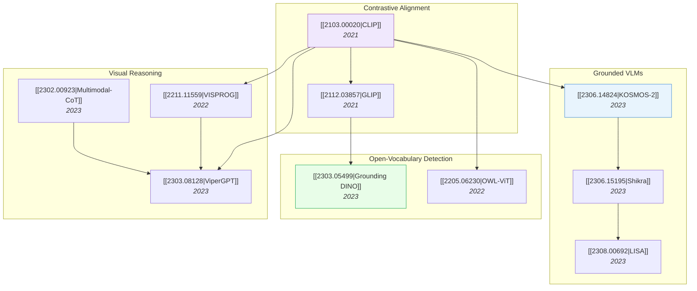

# Vision-Language Models

> [!abstract] Overview
> VLMs bridge visual perception and language understanding, evolving from contrastive alignment (CLIP) to grounded dialogue (KOSMOS-2, Shikra) to visual reasoning (CoT, ViperGPT). This note covers the major architectural paradigms, grounding techniques, and the hallucination problem.

## Evolution Graph

---

## 1. Contrastive Alignment & Open-Vocabulary

The foundational approach: learning shared vision-language embeddings from web-scale data.

- [[2103.00020|CLIP]] (2021) — ==contrastive pre-training== on 400M pairs; enabled zero-shot classification via text prompts
- [[2112.03857|GLIP]] (2021) — ==grounded language-image pre-training==; unified detection and phrase grounding
- [[2206.05836|GLIPv2]] (2022) — extended GLIP to localization + VL understanding in one model
- [[2303.05499|Grounding DINO]] (2023) — married ==DINO== with grounded pre-training for open-set detection
- [[2205.06230|OWL-ViT]] (2022) — simple ViT-based open-vocabulary detector
- [[2306.09683|OWLv2]] (2023) — scaled OWL-ViT with self-training

**Surveys:** [[2306.15880|Open Vocabulary Learning Survey]], [[2307.09220|OVD/OVS Survey]]

---

## 2. Grounded Multimodal LLMs

VLMs that can point to what they're talking about — essential for embodied AI.

| Paper | Year | Key Innovation |
| --- | --- | --- |
| [[2306.14824\|KOSMOS-2]] | 2023 | First grounded MLLM: generates text with ==bounding box references== |
| [[2306.15195\|Shikra]] | 2023 | ==Referential dialogue==: point-and-talk in natural conversation |
| [[2308.00692\|LISA]] | 2023 | ==Reasoning segmentation==: segment objects described in complex queries |
| [[2307.03601\|GPT4RoI]] | 2023 | Instruction tuning on ==regions of interest== |
| [[2104.12763\|MDETR]] | 2021 | ==Modulated detection== for end-to-end multi-modal understanding |

---

## 3. Visual Reasoning & Tool Use

Teaching VLMs to reason step-by-step, often using external tools.

- [[2302.00923|Multimodal-CoT]] (2023) — first ==chain-of-thought reasoning== in multimodal LLMs
- [[2303.08128|ViperGPT]] (2023) — VLM generates ==Python programs== to compose vision modules for reasoning
- [[2211.11559|VISPROG]] (2022) — ==visual programming==: compositional reasoning without training
- [[2303.04671|Visual ChatGPT]] (2023) — VLM orchestrates visual foundation models as tools
- [[2406.09403|VisualSketchPad]] (2024) — ==sketching as visual CoT== for spatial reasoning

> [!tip] The Reasoning Progression
> Simple prompting (CoT) → program generation (ViperGPT) → tool use (Visual ChatGPT) → RL-trained reasoning (Vision-R1). See [[03_Reasoning-and-Planning]] and [[04_Reinforcement-Learning#4. Visual & Multimodal RL]].

---

## 4. The Hallucination Problem

VLMs confidently describe things that aren't in the image — a critical obstacle for embodied AI.

| Paper | Year | Focus |
| --- | --- | --- |
| [[2402.00253\|LVLM Hallucination Survey]] | 2024 | Comprehensive survey of VLM hallucination types and mitigation |
| [[2211.09699\|PromptCap]] | 2022 | ==Prompt-guided captioning== to reduce irrelevant hallucinations |
| [[2410.12735\|CREAM]] | 2024 | ==Consistency regularized self-rewarding== to reduce hallucinated content |

---

## 5. Spatial Understanding in VLMs

A growing focus area bridging VLMs toward embodied tasks.

- [[2401.12168|SpatialVLM]] (2024) — endowed VLMs with ==spatial reasoning capabilities== via 3D-aware training
- [[2406.01584|SpatialRGPT]] (2024) — ==grounded spatial reasoning== in VLMs
- [[2603.15386|RieMind]] (2026) — ==geometry-grounded agentic== framework decoupling perception from reasoning
- [[2603.18892|MultihopSpatial]] (2026) — benchmark revealing ==spatial blind spots== in VLMs

---

## Cross-References

- [[01_Foundation-Models]] — Backbone architectures (ViT, DINO, CLIP)
- [[03_Reasoning-and-Planning]] — Reasoning methods built on VLMs
- [[05_Computer-Vision-and-3D]] — 3D understanding that feeds spatial VLMs
- [[07_Robotics-and-Embodied-AI]] — VLMs as the perception backbone for VLAs
- [[03_VLA|VLA Design Principles]] — How VLM backbones determine VLA performance

---

*Next: [[03_Reasoning-and-Planning]] for how VLMs learn to reason step-by-step.*

---

## Complete Paper Listing

### Contrastive Alignment (125)

| Paper | Year | Summary |
| --- | --- | --- |
| [[2104.02057\|MoCo v3]] | 2021 | This empirical study from Facebook AI Research establishes robust training recipes for self-supervised Vision Transfo... |
| [[2104.13921\|ViLD]] | 2021 | ViLD enables open-vocabulary object detection by distilling knowledge from powerful pre-trained vision-language model... |
| [[2105.04553\|MoBY]] | 2021 | Researchers from Tsinghua University, Xi'an Jiaotong University, and Microsoft Research Asia introduced MoBY, a self-... |
| [[2109.01134\|CoOp]] | 2021 | Context Optimization (CoOp) automates prompt engineering for large pre-trained vision-language models like CLIP by le... |
| [[2111.03930\|Tip-Adapter]] | 2021 | Tip-Adapter offers a training-free method to adapt pre-trained CLIP models for few-shot classification, leveraging a ... |
| [[2111.10050\|BASIC]] | 2021 | Researchers at Google developed BASIC (Batch, Data and Model SIze Combined Scaling), a model for zero-shot transfer l... |
| [[2112.03857\|GLIP]] | 2021 | The Grounded Language-Image Pre-training (GLIP) framework learns object-level, language-aware visual representations ... |
| [[2112.09106\|RegionCLIP]] | 2021 | Researchers from the University of Wisconsin-Madison, Microsoft Research, and Microsoft Cloud + AI developed RegionCL... |
| [[2201.02605\|Detic]] | 2022 | Detic (Detector with Image Classes) trains object detectors for 21,000 classes by effectively integrating image-level... |
| [[2203.05557\|CoCoOp]] | 2022 | Researchers at S-Lab, Nanyang Technological University, developed Conditional Context Optimization (CoCoOp), a method... |
| [[2203.16265\|SeqTR]] | 2022 | SeqTR introduces a universal Transformer-based network that reformulates visual grounding tasks like phrase localizat... |
| [[2203.16513\|PromptDet]] | 2022 | PromptDet presents a framework for open-vocabulary object detection, establishing an annotation-free pipeline that le... |
| [[2205.06230\|OWL-ViT]] | 2022 | Google Research developed OWL-ViT, a simple open-vocabulary object detection method that adapts Vision Transformers, ... |
| [[2206.05836\|GLIPv2]] | 2022 | Researchers at Microsoft, University of Washington, and UCLA developed GLIPv2, a unified grounded vision-language mod... |
| [[2207.01887\|MKT]] | 2022 | Researchers from Shenzhen University, Tsinghua University, and Tencent's YouTu Lab developed the Multi-modal Knowledg... |
| [[2211.10277\|TaskRes]] | 2022 | Task Residual Tuning (TaskRes) introduces a method for efficiently adapting Vision-Language Models by explicitly deco... |
| [[2301.11915\|Part-Aware SSL]] | 2023 | Researchers investigated the capability of self-supervised pretraining methods to learn part-aware representations, f... |
| [[2303.01906\|DPCL]] | 2023 | The Domain Projection and Contrastive Learning (DPCL) framework enables generalized semantic segmentation by projecti... |
| [[2303.05499\|Grounding DINO]] | 2023 | Grounding DINO develops an open-set object detector by integrating deep language-vision fusion into a Transformer-bas... |
| [[2303.13076\|CORA]] | 2023 | CORA, a DETR-style framework, adapts CLIP for open-vocabulary object detection using region prompting and anchor pre-... |
| [[2305.07011\|RO-ViT]] | 2023 | Google Research introduces Region-aware Open-vocabulary Vision Transformers (RO-ViT), a novel pretraining approach fo... |
| [[2305.13689\|SSL Survey]] | 2023 | This comprehensive survey outlines the evolution and current landscape of image-based self-supervised learning, disse... |
| [[2306.03514\|RAM]] | 2023 | The Recognize Anything Model (RAM) presents an image tagging foundation model that leverages large-scale, annotation-... |
| [[2306.09683\|OWLv2]] | 2023 | Google DeepMind's OWLv2 framework achieves state-of-the-art open-vocabulary object detection by successfully scaling ... |
| [[2306.15880\|Open Vocabulary Learning Survey]] | 2023 | This survey provides the first exhaustive review of open vocabulary learning, a paradigm enabling AI systems to recog... |
| [[2307.09220\|OVD/OVS Survey]] | 2023 | A survey from The Hong Kong University of Science and Technology offers a novel taxonomy to comprehensively review Op... |
| [[2307.12813\|DOD]] | 2023 | Researchers introduce Described Object Detection (DOD), a new task that unifies open-vocabulary and referring express... |
| [[2308.05659\|AD-CLIP]] | 2023 | AD-CLIP proposes a data-driven prompt learning framework within CLIP's prompt space, addressing unsupervised domain a... |
| [[2310.05916\|TEXTSPAN]] | 2023 | Researchers from UC Berkeley developed a systematic method to interpret CLIP's image representations by decomposing i... |
| [[2310.15308\|SAM-CLIP]] | 2023 | SAM-CLIP unifies the vision encoders of SAM and CLIP into a single model, enabling state-of-the-art zero-shot semanti... |
| [[2311.09191\|DAC]] | 2023 | The Domain Aligned CLIP (DAC) framework enhances few-shot image classification by adapting large vision-language mode... |
| [[2312.10439\|SIC-CADS]] | 2023 | A method for Open-Vocabulary Object Detection (OVOD), SIC-CADS, integrates global scene understanding from Vision-Lan... |
| [[2401.09865\|SPARC]] | 2024 | Google DeepMind researchers introduce SPARse Fine-grained Contrastive Alignment (SPARC), a pre-training approach that... |
| [[2402.10093\|MIM-Refiner]] | 2024 | MIM-Refiner enhances pre-trained Masked Image Modeling (MIM) vision models by applying a short, efficient contrastive... |
| [[2403.13043\|S2]] | 2024 | Researchers from UC Berkeley and Microsoft Research developed 'Scaling on Scales (S²)', a parameter-free method that ... |
| [[2403.13187\|EvoLLM-JP]] | 2024 | Sakana AI researchers developed Evolutionary Model Merge, an automated framework utilizing evolutionary algorithms to... |
| [[2403.18293\|TDA]] | 2024 | The Training-Free Dynamic Adapter (TDA) enables efficient test-time adaptation for Vision-Language Models (VLMs) by e... |
| [[2405.02797\|VDPG]] | 2024 | VDPG introduces a method for Few-Shot Test-Time Domain Adaptation (FSTT-DA) by generating domain-specific visual prom... |
| [[2405.08593\|NRAA]] | 2024 | The Neighboring Region Attention Alignment (NRAA) framework improves open-vocabulary object detection by explicitly m... |
| [[2405.13532\|VLM Few-Shot Example Selection]] | 2024 | The research demonstrates that few-shot learning with Vision-Language models is highly sensitive to the chosen exampl... |
| [[2405.16417\|CRoFT]] | 2024 | Researchers from Shanghai Jiao Tong University introduced CRoFT, a fine-tuning framework for Vision-Language Pre-trai... |
| [[2406.03303\|Learned Visual Prompts for ViT]] | 2024 | Researchers from Technical University of Munich, Volkswagen AG, and University of Oxford developed a self-supervised ... |
| [[2407.15173\|CLIP Domain Adaptation]] | 2024 | A framework rethinks domain adaptation and generalization for CLIP models by leveraging domain-specific prompts, pseu... |
| [[2408.10787\|UniProj-Det]] | 2024 | UniProj-Det presents a lightweight modular framework for Open-Vocabulary Object Detection training, utilizing a small... |
| [[2408.14371\|SelEx]] | 2024 | SelEx introduces a Generalized Category Discovery (GCD) method for fine-grained classification by fostering 'self-exp... |
| [[2408.17059\|SSL for ViT Survey]] | 2024 | A comprehensive survey details self-supervised learning mechanisms tailored for Vision Transformers, presenting a new... |
| [[2410.16512\|TIPS]] | 2024 | Google DeepMind's TIPS model creates general-purpose image representations by unifying image-text and self-supervised... |
| [[2411.19331\|Talk2DINO]] | 2024 | Talk2DINO, developed by researchers at UNIMORE and ISTI-CNR, combines the fine-grained visual features of DINOv2 with... |
| [[2412.07679\|RADIOv2.5]] | 2024 | RADIOv2.5 from NVIDIA Research establishes new baselines for agglomerative vision foundation models by addressing mul... |
| [[2412.13303\|FastVLM]] | 2024 | FastVLM, an efficient Vision Language Model developed by Apple, employs a novel FastViTHD vision encoder designed for... |
| [[2412.14640\|APT]] | 2024 | The Adaptive Prompt Tuning (APT) framework enhances fine-grained few-shot learning by dynamically refining text promp... |
| [[2412.16334\|dino.txt]] | 2024 | This paper introduces a method to align DINOv2's visual features with text for both image-level and pixel-level tasks |
| [[2412.18273\|SBV]] | 2024 | This paper presents the Sampling Bag of Views (SBV) method for open-vocabulary object detection, which adaptively sam... |
| [[2501.18954\|LLMDet]] | 2025 | LLMDet, from Sun Yat-sen University and Alibaba Group, leverages Large Language Models to provide rich, detailed imag... |
| [[2502.02202\|MLCL]] | 2025 | The Multi-level Supervised Contrastive Learning (MLCL) framework enhances supervised contrastive learning by incorpor... |
| [[2503.00641\|How to Probe]] | 2025 | Post-hoc explanation quality for deep neural networks can be significantly improved by modifying how the classificati... |
| [[2503.01776\|CSR]] | 2025 | Contrastive Sparse Representation (CSR) is proposed as a post-training method to generate adaptive deep embeddings us... |
| [[2503.06626\|DiffCLIP]] | 2025 | King Abdullah University of Science and Technology researchers introduce DiffCLIP, which enhances CLIP models by inco... |
| [[2504.01017\|Web-SSL]] | 2025 | Meta AI and academic researchers demonstrate that scaled self-supervised visual learning achieves comparable performa... |
| [[2504.06120\|HypCD]] | 2025 | The Hyperbolic Category Discovery (HypCD) framework from the Visual AI Lab at the University of Hong Kong addresses g... |
| [[2504.06389\|SemiDAViL]] | 2025 | Researchers at Stony Brook University developed SemiDAViL, the first language-guided semi-supervised domain adaptatio... |
| [[2504.12104\|Logits DeConfusion]] | 2025 | A framework for few-shot learning enhances CLIP's performance by modeling and eliminating inter-class confusion in lo... |
| [[2504.12717\|RaFA]] | 2025 | A post-pre-training framework improves alignment between image and text features in CLIP models through Random Featur... |
| [[2504.14988\|FG-BMK]] | 2025 | The paper introduces FG-BMK, a comprehensive benchmark for evaluating Large Vision-Language Models (LVLMs) on fine-gr... |
| [[2504.16929\|I-Con]] | 2025 | Researchers at MIT, Google, and Microsoft developed I-Con, an information-theoretic framework that unifies over 23 di... |
| [[2504.18158\|E-InMeMo]] | 2025 | E-InMeMo enhances visual in-context learning by introducing learnable, pixel-level perturbations to in-context pairs,... |
| [[2504.19475\|Prisma]] | 2025 | Prisma is an open-source toolkit that adapts mechanistic interpretability methods from language models to vision and ... |
| [[2504.20364\|SSL Representation Human Alignment]] | 2025 | Deep neural networks trained with self-supervised learning develop internal representations that closely align with h... |
| [[2505.02406\|TCPA]] | 2025 | A Token Coordinated Prompt Attention (TCPA) module is proposed to enhance visual prompting for Vision Transformers by... |
| [[2505.04410\|DeCLIP]] | 2025 | A decoupled learning framework enhances CLIP's capabilities for open-vocabulary dense perception tasks by separately ... |
| [[2505.07675\|DHO]] | 2025 | A framework named Dual-Head Optimization (DHO) addresses gradient conflicts in semi-supervised knowledge distillation... |
| [[2505.12477\|Joint Embedding vs Reconstruction SSL]] | 2025 | Researchers introduced a theoretical framework to compare reconstruction-based and joint-embedding self-supervised le... |
| [[2505.13317\|Few-shot SSL]] | 2025 | Nanjing University researchers introduce "Few-shot SSL," a unified framework for comparing semi-supervised learning (... |
| [[2505.13584\|SSL Segmentation Survey]] | 2025 | Thangarajah Akilan and colleagues systematically review over 150 recent publications on self-supervised learning for ... |
| [[2505.14204\|Perceptual Initialization]] | 2025 | Researchers at Vanderbilt University propose a new paradigm for training vision-language models, called perceptual-in... |
| [[2505.15506\|PromptMargin]] | 2025 | PromptMargin, developed by researchers at the Indian Institute of Science, introduces a prompt-tuning framework for a... |
| [[2505.21533\|SOP]] | 2025 | Self-Organizing Visual Prototypes (SOP) introduces a non-parametric framework for unsupervised visual feature learnin... |
| [[2505.22196\|Augmentation-Aware Contrastive Learning Theory]] | 2025 | A new theoretical framework for self-supervised contrastive learning integrates data augmentation's impact into the s... |
| [[2506.00513\|SSAM]] | 2025 | The SSAM framework introduces a self-supervised approach for Test-Time Adaptation in Vision-Language Models by dynami... |
| [[2506.01247\|VS2]] | 2025 | Rutgers University researchers developed Visual Sparse Steering (VS2), a suite of methods that leverage sparse autoen... |
| [[2506.01724\|ALOR]] | 2025 | Active Learning with Open Resources (ALOR) enhances active learning by integrating open-source Vision-Language Models... |
| [[2506.02138\|PA-LRP]] | 2025 | Tel Aviv University researchers develop Positional-Aware LRP (PA-LRP), a framework for Transformer explainability tha... |
| [[2506.02359\|Auto-Labeling]] | 2025 | A method called "Auto-Labeling" uses pre-trained Vision-Language Models (VLMs) to automatically generate pseudo groun... |
| [[2506.02557\|KUEA]] | 2025 | Researchers at The Chinese University of Hong Kong and Shanghai AI Laboratory developed Kernel-based Unsupervised Emb... |
| [[2506.02843\|REAP]] | 2025 | This study reveals that learnable prompts can hinder Vision Transformer generalization in cross-domain few-shot learn... |
| [[2506.03195\|AutoSEP]] | 2025 | Researchers at UCLA developed AutoSEP, a self-supervised prompt learning framework that improves fine-grained image c... |
| [[2506.04005\|SiM]] | 2025 | This research defines and addresses vocabulary-free few-shot learning for Vision-Language Models, where target class ... |
| [[2506.04209\|LIFT]] | 2025 | Researchers at UC Berkeley developed LIFT, a framework for language-image alignment that leverages a fixed, pre-train... |
| [[2506.04411\|DCL Neural Collapse Theory]] | 2025 | This research from Texas A&M University establishes a theoretical duality between self-supervised Decoupled Contrasti... |
| [[2506.04713\|VEST]] | 2025 | VEST (Validation-Enabled Stage-wise Tuning) introduces a novel validation strategy for adapting Vision-Language Model... |
| [[2506.07413\|VarCon]] | 2025 | VarCon (Variational Supervised Contrastive Learning) unifies supervised contrastive learning with variational inferen... |
| [[2506.09691\|VLC Compositionality Inference]] | 2025 | An inference-time approach enhances the Vision-Language Compositionality of dual-encoder models like CLIP and SigLIP ... |
| [[2506.12698\|KDUP]] | 2025 | Researchers from Seoul National University of Science and Technology and Chung-Ang University developed KDUP, a two-s... |
| [[2506.13723\|OTFusion]] | 2025 | OTFusion unifies Vision-Language Models (VLMs) and Vision-only Foundation Models (VFMs) using Optimal Transport to en... |
| [[2506.13925\|HVL]] | 2025 | HVL, a framework developed by researchers from the University of Regina, University of Western Australia, and Univers... |
| [[2506.16673\|MM-LG]] | 2025 | Researchers from Southeast University developed Multimodal Learngene (MM-LG), a framework that extracts generalizable... |
| [[2506.18504\|VLM Generalization Survey]] | 2025 | This survey offers the first comprehensive review of knowledge transfer and generalization strategies for pretrained ... |
| [[2506.22819\|TCA]] | 2025 | Researchers from IIT Delhi and TCS Research Labs developed Test-time Calibration via Attribute Alignment (TCA), a met... |
| [[2506.23156\|Multi-Label Contrastive SSL]] | 2025 | A research effort from Hohai University introduces a self-supervised contrastive learning framework specifically tail... |
| [[2506.23785\|VisTex-OVLM]] | 2025 | VisTex-OVLM is a novel image-prompted object detection method that projects visual exemplars into the text feature sp... |
| [[2506.23822\|LaZSL]] | 2025 | A training-free framework, LaZSL, developed by researchers from MBZUAI and collaborators, enhances interpretable zero... |
| [[2507.00462\|MS-TTA]] | 2025 | Researchers at Xi'an Jiaotong University developed Mean-Shift Guided Test-Time Adaptation (MS-TTA), a training-free m... |
| [[2507.00754\|LUViT]] | 2025 | Language-Unlocked ViT (LUViT) proposes a self-supervised pre-training strategy that synergistically co-adapts Vision ... |
| [[2507.03302\|SemiOVS]] | 2025 | A new framework, SemiOVS, allows semi-supervised semantic segmentation models to utilize abundant out-of-distribution... |
| [[2507.03458\|D&D]] | 2025 | Researchers from Tianjin University and collaborators developed 'Decomposition and Description' (D&D), a method to en... |
| [[2507.03657\|ProtoMM]] | 2025 | Researchers from USTC, NTU, and collaborators developed ProtoMM, a training-free framework that constructs and dynami... |
| [[2507.04380\|Explainability Task Arithmetic]] | 2025 | Researchers at STAIR Lab and ZOZO Research developed a method using task arithmetic to transfer visual explainability... |
| [[2507.04511\|FA]] | 2025 | The paper introduces the "Forced prompt leArning" (FA) framework, a new approach for Out-of-Distribution (OOD) detect... |
| [[2507.08979\|PRISM]] | 2025 | Queen’s University researchers developed PRISM, a data-free and task-agnostic framework that leverages large language... |
| [[2507.09615\|FAIR]] | 2025 | A framework called Fine-grained Alignment and Interaction Refinement (FAIR) enhances the performance of Vision-Langua... |
| [[2507.09961\|TDCRL]] | 2025 | Researchers from the Chinese Academy of Sciences, University of Electronic Science and Technology of China, Universit... |
| [[2507.10442\|VLM Three-Space Analysis]] | 2025 | Researchers from UBC, Vector Institute, IIT Hyderabad, and Microsoft Research India introduce a "three-space analysis... |
| [[2508.01558\|EvoVLMA]] | 2025 | EvoVLMA, developed by the Institute of Automation, Chinese Academy of Sciences, automates the design of training-free... |
| [[2508.02671\|AugPT]] | 2025 | AugPT enhances Vision-Language Model prompt tuning by leveraging internal data augmentation and a self-corrective fil... |
| [[2508.04816\|CoMAD]] | 2025 | CoMAD introduces a multi-teacher self-supervised distillation framework to create compact Vision Transformer models w... |
| [[2508.04942\|ProMIM]] | 2025 | ProMIM is a plug-and-play framework that enhances the generalization of conditional prompt learning in Vision-Languag... |
| [[2508.05547\|VLM Unsupervised Adaptation Survey]] | 2025 | This survey provides a comprehensive, structured overview of unsupervised adaptation methods for Vision-Language Mode... |
| [[2508.12137\|Fine-Grained VLM Tuning]] | 2025 | A research collaboration between CTU and Google DeepMind introduces a fine-tuning pipeline for Vision-and-Language Mo... |
| [[2510.00034\|MOWI]] | 2025 | This review from Nanyang Technological University introduces the Model–Observer–World–Input (MOWI) framework to syste... |
| [[2510.11106\|CZSL Survey]] | 2025 | This survey paper presents the first comprehensive taxonomy for Compositional Zero-Shot Learning (CZSL) methods, cate... |
| [[2601.09859\|TuneCLIP]] | 2026 | Researchers from Texas A&M University developed TuneCLIP, a self-supervised fine-tuning framework for open-weight CLI... |
| [[2601.10497\|MERGETUNE]] | 2026 | MERGETUNE presents a novel "Continued Fine-Tuning" paradigm to recover pre-trained knowledge from Vision-Language Mod... |
| [[2602.06218\|SAE-A]] | 2026 | Researchers introduced the Iso-Energy Assumption and an Aligned Sparse Autoencoder (SAE-A) to dissect the geometric s... |
| [[2602.23759\|Selfment]] | 2026 | Fudan University researchers developed Selfment, a fully self-supervised framework for accurate object segmentation t... |
| [[2603.14609\|GroundSet]] | 2026 | GroundSet, a new cadastral-grounded dataset, was introduced to address deficiencies in fine-grained spatial understan... |

### Hallucination (4)

| Paper | Year | Summary |
| --- | --- | --- |
| [[2504.19254\|uqlm]] | 2025 | Researchers from CVS Health developed a framework and an open-source toolkit (`uqlm`) to quantify uncertainty in Larg... |
| [[2505.05177\|MARK]] | 2025 | A memory-augmented framework called MARK enables continuous learning and knowledge refinement in Large Language Model... |
| [[2508.01781\|LLM Hallucination Taxonomy]] | 2025 | A detailed taxonomy of hallucinations in Large Language Models is presented, formally defining them as an inherent, i... |
| [[2509.03518\|LLM Lying]] | 2025 | Carnegie Mellon University researchers distinguish LLM lying from hallucination, identifying a 'dummy token' rehearsa... |

### Other (1)

| Paper | Year | Summary |
| --- | --- | --- |
| [[2508.15568\|ADAPT]] | 2025 | A method named ADAPT, developed by researchers at Sungkyunkwan University, improves Vision-Language Model robustness ... |
