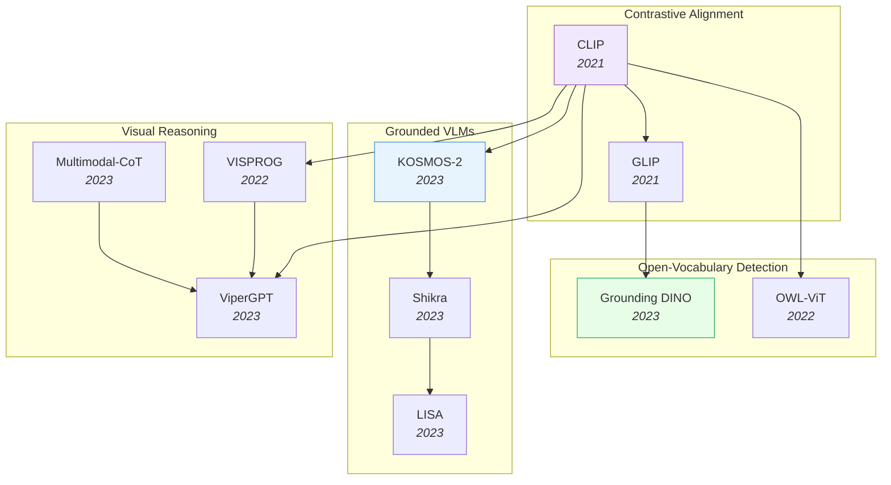

# Vision-Language Models

> [!abstract] Overview
> VLMs bridge visual perception and language understanding, evolving from contrastive alignment (CLIP) to grounded dialogue (KOSMOS-2, Shikra) to visual reasoning (CoT, ViperGPT). This note covers the major architectural paradigms, grounding techniques, and the hallucination problem.

## Evolution Graph

| Node | Paper |
|------|-------|
| CLIP | [[2103.00020\|CLIP]] |
| GLIP | [[2112.03857\|GLIP]] |
| Grounding DINO | [[2303.05499\|Grounding DINO]] |
| OWL-ViT | [[2205.06230\|OWL-ViT]] |
| KOSMOS-2 | [[2306.14824\|KOSMOS-2]] |
| Shikra | [[2306.15195\|Shikra]] |
| LISA | [[2308.00692\|LISA]] |
| ViperGPT | [[2303.08128\|ViperGPT]] |
| Multimodal-CoT | [[2302.00923\|Multimodal-CoT]] |
| VISPROG | [[2211.11559\|VISPROG]] |

---

## 1. CLIP & Core Contrastive Alignment

The foundational approach: learning shared vision-language embeddings from web-scale image-text pairs. CLIP established the paradigm; subsequent work scaled it, opened it, and refined its representations.

- [[2103.00020|CLIP]], [[2111.10050|BASIC]], [[2504.01017|Web-SSL]], [[2505.14204|Perceptual Initialization]], [[2504.12717|RaFA]], [[2503.06626|DiffCLIP]], [[2601.09859|TuneCLIP]], [[2601.10497|MERGETUNE]], [[2505.04410|DeCLIP]], [[2507.00754|LUViT]], [[2506.04209|LIFT]], [[2506.09691|VLC Compositionality Inference]], [[2503.15485|TULIP]]

> [!star] Key Papers
> - [[2103.00020|CLIP]] — Contrastive pre-training on 400M image-text pairs; enabled zero-shot classification via text prompts and launched the VLM era
> - [[2111.10050|BASIC]] — Combined batch, data, and model scaling to push contrastive learning to 85.7% zero-shot ImageNet accuracy
> - [[2505.04410|DeCLIP]] — Decoupled learning framework enhancing CLIP for open-vocabulary dense perception tasks

---

## 2. Self-Supervised Visual Learning

Learning visual representations without labels through contrastive, masked, or joint-embedding objectives — the foundation for data-efficient downstream VLM tasks.

**Contrastive & Joint-Embedding SSL** — Methods that align representations across augmented views or modalities without reconstruction.
- [[2104.02057|MoCo v3]], [[2105.04553|MoBY]], [[2502.02202|MLCL]], [[2506.07413|VarCon]], [[2505.22196|Augmentation-Aware Contrastive Learning Theory]], [[2506.04411|DCL Neural Collapse Theory]], [[2504.16929|I-Con]], [[2506.23156|Multi-Label Contrastive SSL]], [[2505.21533|SOP]], [[2507.09961|TDCRL]], [[2602.11241|Active-Zero]]

> [!star] Key Papers
> - [[2104.02057|MoCo v3]] — Established robust self-supervised training recipes for Vision Transformers; bridged the gap from CNNs to ViTs
> - [[2504.16929|I-Con]] — Information-theoretic framework unifying 23+ contrastive methods under a single loss function

**Masked Image Modeling & Reconstruction** — BERT-style approaches that mask patches and reconstruct, learning dense visual features.
- [[2402.10093|MIM-Refiner]], [[2505.12477|Joint Embedding vs Reconstruction SSL]]

> [!star] Key Papers
> - [[2402.10093|MIM-Refiner]] — Short contrastive refinement converts masked image models into top-performing feature extractors

**SSL Surveys, Theory & Analysis** — Comprehensive overviews and theoretical foundations for self-supervised visual learning.
- [[2305.13689|SSL Survey]], [[2408.17059|SSL for ViT Survey]], [[2505.13584|SSL Segmentation Survey]], [[2505.13317|Few-shot SSL]], [[2504.20364|SSL Representation Human Alignment]], [[2301.11915|Part-Aware SSL]]

> [!star] Key Papers
> - [[2305.13689|SSL Survey]] — Comprehensive survey of image-based self-supervised learning covering contrastive, generative, and self-distillation paradigms
> - [[2408.17059|SSL for ViT Survey]] — Detailed taxonomy of SSL mechanisms tailored specifically for Vision Transformers

**Knowledge Distillation & Compact Models** — Compressing large visual models into efficient representations through multi-teacher distillation.
- [[2508.04816|CoMAD]], [[2505.07675|DHO]]

> [!star] Key Papers
> - [[2508.04816|CoMAD]] — Multi-teacher self-supervised distillation creating compact ViTs with complementary feature qualities

> [!tip] SSL to VLM Pipeline
> Self-supervised features (DINO, MAE, MoCo) provide the visual backbone that CLIP-style alignment then connects to language. The SSL quality directly determines downstream VLM performance — see [[01_Foundation-Models]] for the backbone architectures.

---

## 3. Prompt Learning & Efficient Adaptation

Adapting pre-trained VLMs to downstream tasks without full fine-tuning — through learnable prompts, adapters, and test-time strategies.

**Prompt Tuning for VLMs** — Learning task-specific prompt tokens while keeping the backbone frozen.
- [[2109.01134|CoOp]], [[2203.05557|CoCoOp]], [[2505.02406|TCPA]], [[2505.15506|PromptMargin]], [[2508.02671|AugPT]], [[2508.04942|ProMIM]], [[2506.03195|AutoSEP]], [[2506.02843|REAP]], [[2504.18158|E-InMeMo]], [[2507.04511|FA]], [[2405.16417|CRoFT]], [[2406.03303|Learned Visual Prompts for ViT]]

> [!star] Key Papers
> - [[2109.01134|CoOp]] — Pioneered learnable prompt engineering for CLIP; replaced hand-crafted prompts with optimizable context vectors
> - [[2203.05557|CoCoOp]] — Conditional prompts that generalize to unseen classes by conditioning on image features
> - [[2506.02843|REAP]] — Revealed that learnable prompts can hinder ViT generalization in cross-domain few-shot settings

**Adapters & Residual Tuning** — Lightweight modules that add task-specific capacity alongside frozen pre-trained weights.
- [[2111.03930|Tip-Adapter]], [[2211.10277|TaskRes]], [[2412.14640|APT]], [[2311.09191|DAC]], [[2308.05659|AD-CLIP]]

> [!star] Key Papers
> - [[2111.03930|Tip-Adapter]] — Training-free CLIP adapter using a cache model from few-shot support sets
> - [[2211.10277|TaskRes]] — Decouples task-specific and pre-trained knowledge via residual tuning

**Test-Time Adaptation** — Adapting VLMs at inference time without retraining, using unlabeled test data or dynamic caching.
- [[2403.18293|TDA]], [[2405.02797|VDPG]], [[2506.00513|SSAM]], [[2507.00462|MS-TTA]], [[2506.22819|TCA]], [[2506.04713|VEST]]

> [!star] Key Papers
> - [[2403.18293|TDA]] — Training-free dynamic adapter enabling efficient test-time adaptation via positive/negative caching
> - [[2506.00513|SSAM]] — Self-supervised test-time adaptation for VLMs using dynamic memory alignment

**Domain Adaptation & Generalization** — Transferring VLM knowledge across domains — from source to target distributions.
- [[2407.15173|CLIP Domain Adaptation]], [[2504.06389|SemiDAViL]], [[2303.01906|DPCL]]

> [!star] Key Papers
> - [[2504.06389|SemiDAViL]] — First language-guided semi-supervised domain adaptation framework for VLMs

**Few-Shot & Zero-Shot Transfer** — Maximizing VLM performance with minimal labeled examples.
- [[2405.13532|VLM Few-Shot Example Selection]], [[2504.12104|Logits DeConfusion]], [[2506.04005|SiM]], [[2506.23822|LaZSL]], [[2507.03657|ProtoMM]], [[2507.03458|D&D]]

> [!star] Key Papers
> - [[2405.13532|VLM Few-Shot Example Selection]] — Demonstrated that few-shot VLM performance is highly sensitive to example choice; provides optimal selection strategies
> - [[2506.04005|SiM]] — Addresses vocabulary-free few-shot learning where target class names are unknown at test time

**Model Merging & Evolutionary Adaptation** — Combining multiple fine-tuned VLMs or using evolutionary methods to create stronger models without retraining.
- [[2403.13187|EvoLLM-JP]], [[2508.01558|EvoVLMA]], [[2506.13723|OTFusion]]

> [!star] Key Papers
> - [[2403.13187|EvoLLM-JP]] — Evolutionary Model Merge: automated framework using evolutionary algorithms to combine VLMs across languages and modalities

**Surveys** — Comprehensive reviews of VLM adaptation and generalization strategies.
- [[2506.18504|VLM Generalization Survey]], [[2508.05547|VLM Unsupervised Adaptation Survey]], [[2510.11106|CZSL Survey]]

> [!star] Key Papers
> - [[2506.18504|VLM Generalization Survey]] — First comprehensive review of knowledge transfer and generalization strategies for pre-trained VLMs

> [!tip] The Adaptation Spectrum
> From training-free (Tip-Adapter, TDA) to lightweight prompt tuning (CoOp) to full fine-tuning — the optimal strategy depends on your data budget and domain shift. Test-time adaptation is emerging as a compelling middle ground for deployment.

---

## 4. Open-Vocabulary Detection & Grounding

Detecting and localizing objects described by arbitrary text — not limited to a fixed set of training categories.

**Open-Vocabulary Detectors** — Extending object detection beyond fixed class lists by leveraging VLM embeddings.
- [[2104.13921|ViLD]], [[2112.03857|GLIP]], [[2206.05836|GLIPv2]], [[2303.05499|Grounding DINO]], [[2205.06230|OWL-ViT]], [[2306.09683|OWLv2]], [[2201.02605|Detic]], [[2203.16513|PromptDet]], [[2303.13076|CORA]], [[2305.07011|RO-ViT]], [[2312.10439|SIC-CADS]], [[2405.08593|NRAA]], [[2408.10787|UniProj-Det]], [[2412.18273|SBV]], [[2501.18954|LLMDet]], [[2506.23785|VisTex-OVLM]], [[2507.03302|SemiOVS]]

> [!star] Key Papers
> - [[2303.05499|Grounding DINO]] — Married DINO with grounded pre-training for open-set detection; the go-to open-vocabulary detector
> - [[2112.03857|GLIP]] — Unified detection and phrase grounding via grounded language-image pre-training
> - [[2306.09683|OWLv2]] — Scaled OWL-ViT with self-training to achieve SOTA open-vocabulary detection

**Region-Level Alignment** — Learning fine-grained region-text correspondences beyond global image-text matching.
- [[2112.09106|RegionCLIP]], [[2401.09865|SPARC]], [[2403.13043|S2]], [[2506.12698|KDUP]], [[2507.09615|FAIR]]

> [!star] Key Papers
> - [[2112.09106|RegionCLIP]] — Extended CLIP to region-level representations via region-text pre-training on pseudo-labels
> - [[2401.09865|SPARC]] — Sparse fine-grained contrastive alignment for dense region-level VLM features

**Visual Grounding & Referring** — Localizing specific objects or regions described by natural language expressions.
- [[2203.16265|SeqTR]], [[2307.12813|DOD]], [[2506.02359|Auto-Labeling]], [[2603.14609|GroundSet]]

> [!star] Key Papers
> - [[2203.16265|SeqTR]] — Reformulated grounding as autoregressive coordinate prediction; unified phrase localization and referring expression tasks
> - [[2307.12813|DOD]] — Described Object Detection unifying open-vocabulary and referring expression detection

**Open-Vocabulary Tagging & Recognition** — Assigning arbitrary text labels to images for image-level recognition beyond detection.
- [[2306.03514|RAM]], [[2408.14371|SelEx]], [[2504.06120|HypCD]], [[2508.12137|Fine-Grained VLM Tuning]], [[2504.14988|FG-BMK]]

> [!star] Key Papers
> - [[2306.03514|RAM]] — Recognize Anything Model: image tagging foundation model handling any category via large-scale annotation-free training
> - [[2408.14371|SelEx]] — Generalized Category Discovery via self-expertise for fine-grained classification

**Model Unification & Fusion** — Combining complementary vision models (e.g., SAM + CLIP, DINO + text) into unified systems.
- [[2310.15308|SAM-CLIP]], [[2411.19331|Talk2DINO]], [[2412.16334|dino.txt]], [[2412.07679|RADIOv2.5]], [[2410.16512|TIPS]], [[2412.13303|FastVLM]], [[2506.13925|HVL]], [[2506.16673|MM-LG]], [[2508.12466|Inverse-LLaVA]]

> [!star] Key Papers
> - [[2310.15308|SAM-CLIP]] — Unified SAM and CLIP vision encoders into a single model for zero-shot semantic and panoptic segmentation
> - [[2410.16512|TIPS]] — Unified image-text and self-supervised objectives for general-purpose vision representations

**Segmentation with VLMs** — Leveraging VLM alignment for open-vocabulary or self-supervised semantic segmentation.
- [[2602.23759|Selfment]], [[2303.01906|DPCL]]

> [!star] Key Papers
> - [[2602.23759|Selfment]] — Fully self-supervised framework achieving accurate object segmentation without any labels

**Surveys** — Comprehensive overviews of open-vocabulary detection and segmentation.
- [[2306.15880|Open Vocabulary Learning Survey]], [[2307.09220|OVD/OVS Survey]]

> [!star] Key Papers
> - [[2306.15880|Open Vocabulary Learning Survey]] — First exhaustive review of open vocabulary learning across detection, segmentation, and recognition

> [!tip] From Closed to Open Vocabulary
> The progression ViLD -> GLIP -> Grounding DINO shows how VLM embeddings replaced fixed class heads. The current frontier combines detection with grounding (DOD) and self-training at scale (OWLv2). For embodied AI, open-vocabulary detection is essential — robots encounter objects never seen in training.

---

## 5. Interpretability & Mechanistic Analysis

Understanding what VLMs learn internally — which features matter, how representations are structured, and why models make specific predictions.

**Mechanistic Interpretability** — Dissecting VLM internals through sparse autoencoders, attention analysis, and probing.
- [[2310.05916|TEXTSPAN]], [[2504.19475|Prisma]], [[2602.06218|SAE-A]], [[2506.01247|VS2]], [[2507.10442|VLM Three-Space Analysis]]

> [!star] Key Papers
> - [[2310.05916|TEXTSPAN]] — Systematic method to interpret CLIP's image representations by decomposing them into text-describable components
> - [[2504.19475|Prisma]] — Open-source toolkit adapting mechanistic interpretability methods from language models to vision

**Explainability & Attribution** — Methods for explaining model predictions through attribution maps, saliency, and causal analysis.
- [[2506.02138|PA-LRP]], [[2503.00641|How to Probe]], [[2507.04380|Explainability Task Arithmetic]], [[2503.01776|CSR]], [[2510.00034|MOWI]]

> [!star] Key Papers
> - [[2506.02138|PA-LRP]] — Positional-Aware Layer-wise Relevance Propagation for Transformer explainability accounting for positional encoding effects
> - [[2510.00034|MOWI]] — Model-Observer-World-Input framework systematizing visual explanation and interpretation

**Active Learning & Data Curation** — Intelligent selection of training data using VLM representations.
- [[2506.01724|ALOR]], [[2506.02557|KUEA]]

> [!star] Key Papers
> - [[2506.01724|ALOR]] — Active Learning with Open Resources integrating VLMs for efficient annotation selection

> [!tip] Opening the Black Box
> Mechanistic interpretability for VLMs is still nascent compared to language models. TEXTSPAN showed that CLIP representations are surprisingly decomposable into text-describable components. Tools like Prisma and VS2 are making systematic VLM analysis accessible.

---

## 6. VLM Robustness & Distribution Shift

Making VLMs reliable under distribution shift, adversarial conditions, and out-of-distribution inputs.

- [[2508.15568|ADAPT]], [[2207.01887|MKT]], [[2507.08979|PRISM]]

> [!star] Key Papers
> - [[2508.15568|ADAPT]] — Improves VLM robustness to distribution shifts through adaptive prompting
> - [[2507.08979|PRISM]] — Data-free, task-agnostic framework leveraging LLMs for VLM adaptation without target domain data

> [!tip] Robustness Matters for Deployment
> VLMs trained on web-scraped data are brittle to domain shifts. Methods like ADAPT and test-time adaptation (Section 3) address this — critical for deploying VLMs in robotics or medical imaging where training and deployment distributions diverge.

---

## 7. Grounded Multimodal LLMs

VLMs that can point to what they are talking about — generating text with spatial references like bounding boxes or segmentation masks. Essential for embodied AI and interactive visual dialogue.

- [[2306.14824|KOSMOS-2]], [[2306.15195|Shikra]], [[2308.00692|LISA]], [[2307.03601|GPT4RoI]], [[2104.12763|MDETR]]

> [!star] Key Papers
> - [[2306.14824|KOSMOS-2]] — First grounded MLLM: generates text with bounding box references inline
> - [[2306.15195|Shikra]] — Referential dialogue: point-and-talk in natural conversation
> - [[2308.00692|LISA]] — Reasoning segmentation: segment objects described in complex natural language queries

> [!tip] Grounding = Embodiment Bridge
> Grounded VLMs are the bridge between vision-language understanding and physical action. KOSMOS-2's bounding box generation directly enables VLAs to localize manipulation targets. See [[07_Robotics-and-Embodied-AI]] for how these grounding capabilities feed into robot policies.

---

## 8. Visual Reasoning & Tool Use

Teaching VLMs to reason step-by-step, often by generating programs or invoking external tools rather than producing answers directly.

- [[2302.00923|Multimodal-CoT]], [[2303.08128|ViperGPT]], [[2211.11559|VISPROG]], [[2303.04671|Visual ChatGPT]], [[2406.09403|VisualSketchPad]]

> [!star] Key Papers
> - [[2302.00923|Multimodal-CoT]] — First chain-of-thought reasoning in multimodal LLMs, jointly reasoning over vision and language
> - [[2303.08128|ViperGPT]] — VLM generates Python programs to compose vision modules for reasoning; no task-specific training
> - [[2406.09403|VisualSketchPad]] — Sketching as visual chain-of-thought for spatial reasoning

> [!tip] The Reasoning Progression
> Simple prompting (CoT) -> program generation (ViperGPT) -> tool use (Visual ChatGPT) -> RL-trained reasoning (Vision-R1). See [[03_Reasoning-and-Planning]] and [[04_Reinforcement-Learning#4. Visual & Multimodal RL]].

---

## 9. The Hallucination Problem

VLMs confidently describe things that are not in the image — a critical obstacle for embodied AI and trustworthy deployment.

- [[2402.00253|LVLM Hallucination Survey]], [[2211.09699|PromptCap]], [[2410.12735|CREAM]], [[2504.19254|uqlm]], [[2505.05177|MARK]], [[2508.01781|LLM Hallucination Taxonomy]], [[2509.03518|LLM Lying]], [[2509.12132|Reflection-V]]

> [!star] Key Papers
> - [[2402.00253|LVLM Hallucination Survey]] — Comprehensive survey of VLM hallucination types, causes, and mitigation strategies
> - [[2508.01781|LLM Hallucination Taxonomy]] — Formal taxonomy defining hallucination as an inherent, irreducible phenomenon in LLMs
> - [[2509.03518|LLM Lying]] — Distinguishes intentional LLM "lying" from hallucination via dummy token rehearsal mechanisms

> [!tip] Hallucination vs Lying
> Not all incorrect outputs are created equal. Hallucination arises from distributional gaps; lying (per LLM Lying) involves the model's internal representations contradicting its output. For safety-critical VLM deployment, both failure modes require distinct mitigation strategies.

---

## 10. Spatial Understanding in VLMs

A growing focus area bridging VLMs toward embodied tasks — understanding where things are relative to each other in 3D space.

- [[2401.12168|SpatialVLM]], [[2406.01584|SpatialRGPT]], [[2603.15386|RieMind]], [[2603.18892|MultihopSpatial]]

> [!star] Key Papers
> - [[2401.12168|SpatialVLM]] — Endowed VLMs with spatial reasoning via 3D-aware training data
> - [[2603.15386|RieMind]] — Geometry-grounded agentic framework decoupling perception from spatial reasoning

> [!tip] The Spatial Gap
> Standard VLMs struggle with spatial relations because they are trained on 2D image-text pairs. SpatialVLM and SpatialRGPT address this with 3D-aware training, while RieMind takes an agentic approach. For robotics, spatial understanding is non-negotiable — see [[05_Computer-Vision-and-3D]].

---

## Cross-References

- [[01_Foundation-Models]] — Backbone architectures (ViT, DINO, CLIP)
- [[03_Reasoning-and-Planning]] — Reasoning methods built on VLMs
- [[05_Computer-Vision-and-3D]] — 3D understanding that feeds spatial VLMs
- [[07_Robotics-and-Embodied-AI]] — VLMs as the perception backbone for VLAs
- [[09_Multimodal-LLMs]] — MLLMs that build on VLM foundations

---

*Next: [[03_Reasoning-and-Planning]] for how VLMs learn to reason step-by-step.*
