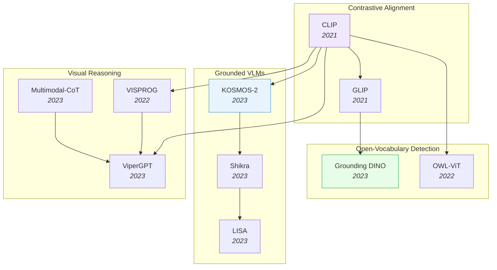

# Vision-Language Models

> [!abstract] Overview
> VLMs bridge visual perception and language understanding, evolving from contrastive alignment (CLIP) to grounded dialogue (KOSMOS-2, Shikra) to visual reasoning (CoT, ViperGPT). This note covers the major architectural paradigms, grounding techniques, and the hallucination problem.

## Evolution Graph

| Node | Paper |
|------|-------|
| CLIP | [[2103.00020\|CLIP]] |
| GLIP | [[2112.03857\|GLIP]] |
| Grounding DINO | [[2303.05499\|Grounding DINO]] |
| OWL-ViT | [[2205.06230\|OWL-ViT]] |
| KOSMOS-2 | [[2306.14824\|KOSMOS-2]] |
| Shikra | [[2306.15195\|Shikra]] |
| LISA | [[2308.00692\|LISA]] |
| ViperGPT | [[2303.08128\|ViperGPT]] |
| Multimodal-CoT | [[2302.00923\|Multimodal-CoT]] |
| VISPROG | [[2211.11559\|VISPROG]] |

---

## 1. CLIP & Core Contrastive Alignment

The foundational approach: learning shared vision-language embeddings from web-scale image-text pairs. CLIP established the paradigm; subsequent work scaled it, opened it, and refined its representations.

- [[2601.10497|MERGETUNE]], [[2601.09859|TuneCLIP]], [[2507.22062|Meta CLIP 2]], [[2507.00754|LUViT]], [[2506.09691|VLC Compositionality Inference]], [[2506.04209|LIFT]], [[2506.03096|FuseLIP]], [[2505.23004|QLIP]], [[2505.21549|DCLIP]], [[2505.18983|AmorLIP]], [[2505.16416|Circle-RoPE]], [[2505.14204|Perceptual Initialization]], [[2505.04601|OpenVision]], [[2505.04410|DeCLIP]], [[2504.12717|RaFA]], [[2504.01017|Web-SSL]], [[2503.15485|TULIP]], [[2503.06626|DiffCLIP]], [[2502.14786|SigLIP 2]], [[2406.17639|AlignCLIP]], [[2111.10050|BASIC]], [[2111.07991|LiT]], [[2103.00020|CLIP]]

> [!star] Key Papers
> - [[2103.00020|CLIP]] — Contrastive pre-training on 400M image-text pairs; enabled zero-shot classification via text prompts and launched the VLM era
> - [[2111.10050|BASIC]] — Combined batch, data, and model scaling to push contrastive learning to 85.7% zero-shot ImageNet accuracy
> - [[2505.04410|DeCLIP]] — Decoupled learning framework enhancing CLIP for open-vocabulary dense perception tasks

---

## 2. Self-Supervised Visual Learning

Learning visual representations without labels through contrastive, masked, or joint-embedding objectives — the foundation for data-efficient downstream VLM tasks.

**Contrastive & Joint-Embedding SSL** — Methods that align representations across augmented views or modalities without reconstruction.
- [[2602.11241|Active-Zero]], [[2602.02381|AdaSSL]], [[2507.09961|TDCRL]], [[2506.23156|Multi-Label Contrastive SSL]], [[2506.07413|VarCon]], [[2506.04411|DCL Neural Collapse Theory]], [[2505.22196|Augmentation-Aware Contrastive Learning Theory]], [[2505.21533|SOP]], [[2505.11815|UniMoCo]], [[2504.16929|I-Con]], [[2502.02202|MLCL]], [[2105.04553|MoBY]], [[2104.02057|MoCo v3]]

> [!star] Key Papers
> - [[2104.02057|MoCo v3]] — Established robust self-supervised training recipes for Vision Transformers; bridged the gap from CNNs to ViTs
> - [[2504.16929|I-Con]] — Information-theoretic framework unifying 23+ contrastive methods under a single loss function

**Masked Image Modeling & Reconstruction** — BERT-style approaches that mask patches and reconstruct, learning dense visual features.
- [[2505.12477|Joint Embedding vs Reconstruction SSL]], [[2402.10093|MIM-Refiner]]

> [!star] Key Papers
> - [[2402.10093|MIM-Refiner]] — Short contrastive refinement converts masked image models into top-performing feature extractors

**SSL Surveys, Theory & Analysis** — Comprehensive overviews and theoretical foundations for self-supervised visual learning.
- [[2505.13584|SSL Segmentation Survey]], [[2505.13317|Few-shot SSL]], [[2504.20364|SSL Representation Human Alignment]], [[2408.17059|SSL for ViT Survey]], [[2305.13689|SSL Survey]], [[2301.11915|Part-Aware SSL]]

> [!star] Key Papers
> - [[2305.13689|SSL Survey]] — Comprehensive survey of image-based self-supervised learning covering contrastive, generative, and self-distillation paradigms
> - [[2408.17059|SSL for ViT Survey]] — Detailed taxonomy of SSL mechanisms tailored specifically for Vision Transformers

**Knowledge Distillation & Compact Models** — Compressing large visual models into efficient representations through multi-teacher distillation.
- [[2508.04816|CoMAD]], [[2505.10526|MASSV]], [[2505.07675|DHO]], [[2412.01282|Align-KD]]

> [!star] Key Papers
> - [[2508.04816|CoMAD]] — Multi-teacher self-supervised distillation creating compact ViTs with complementary feature qualities

> [!tip] SSL to VLM Pipeline
> Self-supervised features (DINO, MAE, MoCo) provide the visual backbone that CLIP-style alignment then connects to language. The SSL quality directly determines downstream VLM performance — see [[01_Foundation-Models]] for the backbone architectures.

---

## 3. Prompt Learning & Efficient Adaptation

Adapting pre-trained VLMs to downstream tasks without full fine-tuning — through learnable prompts, adapters, and test-time strategies.

**Prompt Tuning for VLMs** — Learning task-specific prompt tokens while keeping the backbone frozen.
- [[2508.04942|ProMIM]], [[2508.02671|AugPT]], [[2507.04511|FA]], [[2506.03195|AutoSEP]], [[2506.02843|REAP]], [[2505.15506|PromptMargin]], [[2505.02406|TCPA]], [[2504.18158|E-InMeMo]], [[2409.15310|Visual Prompting MLLM Survey]], [[2406.03303|Learned Visual Prompts for ViT]], [[2405.16417|CRoFT]], [[2304.06712|Visual Prompt Engineering]], [[2203.05557|CoCoOp]], [[2109.01134|CoOp]]

> [!star] Key Papers
> - [[2109.01134|CoOp]] — Pioneered learnable prompt engineering for CLIP; replaced hand-crafted prompts with optimizable context vectors
> - [[2203.05557|CoCoOp]] — Conditional prompts that generalize to unseen classes by conditioning on image features
> - [[2506.02843|REAP]] — Revealed that learnable prompts can hinder ViT generalization in cross-domain few-shot settings

**Adapters & Residual Tuning** — Lightweight modules that add task-specific capacity alongside frozen pre-trained weights.
- [[2504.21447|Shallow ViT Features]], [[2503.06063|Multi-Layer Visual Fusion]], [[2412.14640|APT]], [[2311.09191|DAC]], [[2308.05659|AD-CLIP]], [[2211.10277|TaskRes]], [[2111.03930|Tip-Adapter]]

> [!star] Key Papers
> - [[2111.03930|Tip-Adapter]] — Training-free CLIP adapter using a cache model from few-shot support sets
> - [[2211.10277|TaskRes]] — Decouples task-specific and pre-trained knowledge via residual tuning

**Test-Time Adaptation** — Adapting VLMs at inference time without retraining, using unlabeled test data or dynamic caching.
- [[2507.00462|MS-TTA]], [[2506.22819|TCA]], [[2506.22395|Test-Time VLM Consistency]], [[2506.04713|VEST]], [[2506.00513|SSAM]], [[2408.05674|PS-TTL]], [[2405.02797|VDPG]], [[2403.18293|TDA]]

> [!star] Key Papers
> - [[2403.18293|TDA]] — Training-free dynamic adapter enabling efficient test-time adaptation via positive/negative caching
> - [[2506.00513|SSAM]] — Self-supervised test-time adaptation for VLMs using dynamic memory alignment

**Domain Adaptation & Generalization** — Transferring VLM knowledge across domains — from source to target distributions.
- [[2603.17655|CC-CDFSL]], [[2504.06389|SemiDAViL]], [[2502.17159|RobustMerge]], [[2407.15173|CLIP Domain Adaptation]], [[2303.01906|DPCL]]

> [!star] Key Papers
> - [[2504.06389|SemiDAViL]] — First language-guided semi-supervised domain adaptation framework for VLMs

**Few-Shot & Zero-Shot Transfer** — Maximizing VLM performance with minimal labeled examples.
- [[2601.08499|EfficientFSL]], [[2508.03102|CCA]], [[2507.03657|ProtoMM]], [[2507.03458|D&D]], [[2506.23822|LaZSL]], [[2506.04005|SiM]], [[2504.12104|Logits DeConfusion]], [[2504.06608|Cross-Domain FSL with DKM]], [[2504.06120|HypCD]], [[2503.19903|PS3]], [[2405.13532|VLM Few-Shot Example Selection]]

> [!star] Key Papers
> - [[2405.13532|VLM Few-Shot Example Selection]] — Demonstrated that few-shot VLM performance is highly sensitive to example choice; provides optimal selection strategies
> - [[2506.04005|SiM]] — Addresses vocabulary-free few-shot learning where target class names are unknown at test time

**Model Merging & Evolutionary Adaptation** — Combining multiple fine-tuned VLMs or using evolutionary methods to create stronger models without retraining.
- [[2601.10497|MERGETUNE]], [[2508.01558|EvoVLMA]], [[2506.13723|OTFusion]], [[2403.13187|EvoLLM-JP]]

> [!star] Key Papers
> - [[2403.13187|EvoLLM-JP]] — Evolutionary Model Merge: automated framework using evolutionary algorithms to combine VLMs across languages and modalities

**Surveys** — Comprehensive reviews of VLM adaptation and generalization strategies.
- [[2510.11106|CZSL Survey]], [[2510.09586|VLM Survey 26K]], [[2508.05547|VLM Unsupervised Adaptation Survey]], [[2508.04227|VLM Continual Learning Survey]], [[2506.18504|VLM Generalization Survey]], [[2501.02189|VLM Survey 2025]]

> [!star] Key Papers
> - [[2506.18504|VLM Generalization Survey]] — First comprehensive review of knowledge transfer and generalization strategies for pre-trained VLMs

> [!tip] The Adaptation Spectrum
> From training-free (Tip-Adapter, TDA) to lightweight prompt tuning (CoOp) to full fine-tuning — the optimal strategy depends on your data budget and domain shift. Test-time adaptation is emerging as a compelling middle ground for deployment.

---

## 4. Open-Vocabulary Detection & Grounding

Detecting and localizing objects described by arbitrary text — not limited to a fixed set of training categories.

**Open-Vocabulary Detectors** — Extending object detection beyond fixed class lists by leveraging VLM embeddings.
- [[2507.03302|SemiOVS]], [[2506.23785|VisTex-OVLM]], [[2501.18954|LLMDet]], [[2412.18273|SBV]], [[2408.10787|UniProj-Det]], [[2405.08593|NRAA]], [[2401.17981|MLLM Detection Infusion]], [[2312.10439|SIC-CADS]], [[2306.09683|OWLv2]], [[2305.07011|RO-ViT]], [[2304.04514|DetCLIPv2]], [[2303.13076|CORA]], [[2303.11331|EVA-02]], [[2303.05499|Grounding DINO]], [[2209.09407|DetCLIP]], [[2206.05836|GLIPv2]], [[2205.06230|OWL-ViT]], [[2203.17273|FindIt]], [[2203.16513|PromptDet]], [[2203.12555|GriTS]], [[2201.02605|Detic]], [[2112.03857|GLIP]], [[2104.13921|ViLD]]

> [!star] Key Papers
> - [[2303.05499|Grounding DINO]] — Married DINO with grounded pre-training for open-set detection; the go-to open-vocabulary detector
> - [[2112.03857|GLIP]] — Unified detection and phrase grounding via grounded language-image pre-training
> - [[2306.09683|OWLv2]] — Scaled OWL-ViT with self-training to achieve SOTA open-vocabulary detection

**Region-Level Alignment** — Learning fine-grained region-text correspondences beyond global image-text matching.
- [[2507.09615|FAIR]], [[2506.12698|KDUP]], [[2404.13013|Groma]], [[2403.13043|S2]], [[2401.09865|SPARC]], [[2206.07643|FIBER]], [[2112.09106|RegionCLIP]]

> [!star] Key Papers
> - [[2112.09106|RegionCLIP]] — Extended CLIP to region-level representations via region-text pre-training on pseudo-labels
> - [[2401.09865|SPARC]] — Sparse fine-grained contrastive alignment for dense region-level VLM features

**Visual Grounding & Referring** — Localizing specific objects or regions described by natural language expressions.
- [[2603.16253|EVPV]], [[2603.14609|GroundSet]], [[2603.12382|SPARROW]], [[2603.03857|DeepScan]], [[2603.02556|VC-STaR]], [[2603.00207|VisRef]], [[2602.23959|NV-CoT]], [[2602.23615|HART]], [[2602.22766|CapImagine]], [[2602.22703|GEODPO]], [[2602.16702|SAP]], [[2602.08241|SAYO]], [[2601.10129|LaViT]], [[2601.07645|PlaM]], [[2601.06993|ReFine-RFT]], [[2601.05328|BFD]], [[2601.05244|GREx]], [[2601.00659|CRoPS]], [[2601.00215|Sight to Insight]], [[2512.24297|FIGR]], [[2512.24119|GeoBench]], [[2512.23453|CoFi-Dec]], [[2512.23169|REVEALER]], [[2512.21218|LIVR]], [[2512.16922|NEPA]], [[2512.16584|SkiLa]], [[2510.23603|PixelRefer]], [[2510.21501|GranViT]], [[2510.21311|FineRS]], [[2510.16714|SceneCOT]], [[2510.13800|GS-Reasoner]], [[2510.12798|Rex-Omni]], [[2507.05920|MGPO]], [[2507.00748|Multi-Image Grounding RL]], [[2506.22624|Seg-R1]], [[2506.11991|VGR]], [[2506.02359|Auto-Labeling]], [[2505.02278|GCLIP]], [[2411.09691|TinyGroundingGPT]], [[2410.08021|OneRef]], [[2405.19783|IVM]], [[2403.16999|VisCoT]], [[2403.12966|CoS]], [[2402.04236|CogCoM]], [[2312.14135|V*]], [[2310.11441|SoM]], [[2307.12813|DOD]], [[2301.05226|IPVR]], [[2203.16265|SeqTR]]

> [!star] Key Papers
> - [[2203.16265|SeqTR]] — Reformulated grounding as autoregressive coordinate prediction; unified phrase localization and referring expression tasks
> - [[2307.12813|DOD]] — Described Object Detection unifying open-vocabulary and referring expression detection

**Open-Vocabulary Tagging & Recognition** — Assigning arbitrary text labels to images for image-level recognition beyond detection.
- [[2508.12137|Fine-Grained VLM Tuning]], [[2505.20612|RF100-VL]], [[2504.14988|FG-BMK]], [[2504.06120|HypCD]], [[2408.14371|SelEx]], [[2406.14830|CLIP-Decoder]], [[2309.08912|MP-FGVC]], [[2306.03514|RAM]]

> [!star] Key Papers
> - [[2306.03514|RAM]] — Recognize Anything Model: image tagging foundation model handling any category via large-scale annotation-free training
> - [[2408.14371|SelEx]] — Generalized Category Discovery via self-expertise for fine-grained classification

**Model Unification & Fusion** — Combining complementary vision models (e.g., SAM + CLIP, DINO + text) into unified systems.
- [[2508.12466|Inverse-LLaVA]], [[2508.04987|UniMoS++]], [[2507.01643|SAILViT]], [[2506.16673|MM-LG]], [[2506.13925|HVL]], [[2505.20289|VisTA]], [[2412.16334|dino.txt]], [[2412.13303|FastVLM]], [[2412.07679|RADIOv2.5]], [[2411.19331|Talk2DINO]], [[2411.14402|AIMV2]], [[2411.04997|LLM2CLIP]], [[2410.16512|TIPS]], [[2310.15308|SAM-CLIP]]

> [!star] Key Papers
> - [[2310.15308|SAM-CLIP]] — Unified SAM and CLIP vision encoders into a single model for zero-shot semantic and panoptic segmentation
> - [[2410.16512|TIPS]] — Unified image-text and self-supervised objectives for general-purpose vision representations

**Segmentation with VLMs** — Leveraging VLM alignment for open-vocabulary or self-supervised semantic segmentation.
- [[2602.23759|Selfment]], [[2506.22624|Seg-R1]], [[2303.01906|DPCL]]

> [!star] Key Papers
> - [[2602.23759|Selfment]] — Fully self-supervised framework achieving accurate object segmentation without any labels

**Surveys** — Comprehensive overviews of open-vocabulary detection and segmentation.
- [[2307.09220|OVD/OVS Survey]], [[2306.15880|Open Vocabulary Learning Survey]]

> [!star] Key Papers
> - [[2306.15880|Open Vocabulary Learning Survey]] — First exhaustive review of open vocabulary learning across detection, segmentation, and recognition

> [!tip] From Closed to Open Vocabulary
> The progression ViLD -> GLIP -> Grounding DINO shows how VLM embeddings replaced fixed class heads. The current frontier combines detection with grounding (DOD) and self-training at scale (OWLv2). For embodied AI, open-vocabulary detection is essential — robots encounter objects never seen in training.

---

## 5. Interpretability & Mechanistic Analysis

Understanding what VLMs learn internally — which features matter, how representations are structured, and why models make specific predictions.

**Mechanistic Interpretability** — Dissecting VLM internals through sparse autoencoders, attention analysis, and probing.
- [[2602.06218|SAE-A]], [[2602.00462|LatentLens]], [[2510.02292|VLM-Lens]], [[2507.10442|VLM Three-Space Analysis]], [[2506.11976|VLM Visual-Language Alignment]], [[2506.01247|VS2]], [[2505.22664|VLM Surrogate Grafting]], [[2505.20229|CLIP Attribution SAE]], [[2504.19475|Prisma]], [[2310.05916|TEXTSPAN]]

> [!star] Key Papers
> - [[2310.05916|TEXTSPAN]] — Systematic method to interpret CLIP's image representations by decomposing them into text-describable components
> - [[2504.19475|Prisma]] — Open-source toolkit adapting mechanistic interpretability methods from language models to vision

**Explainability & Attribution** — Methods for explaining model predictions through attribution maps, saliency, and causal analysis.
- [[2510.00034|MOWI]], [[2507.04380|Explainability Task Arithmetic]], [[2506.02138|PA-LRP]], [[2506.01097|Explainability-Guided Token Compression]], [[2503.01776|CSR]], [[2503.00641|How to Probe]], [[2501.13620|VLM Perception-Reasoning Probe]]

> [!star] Key Papers
> - [[2506.02138|PA-LRP]] — Positional-Aware Layer-wise Relevance Propagation for Transformer explainability accounting for positional encoding effects
> - [[2510.00034|MOWI]] — Model-Observer-World-Input framework systematizing visual explanation and interpretation

**Active Learning & Data Curation** — Intelligent selection of training data using VLM representations.
- [[2506.11967|Annotation Bootstrapping]], [[2506.02557|KUEA]], [[2506.01724|ALOR]], [[2412.18072|MMFactory]], [[2412.07012|ProVision]]

> [!star] Key Papers
> - [[2506.01724|ALOR]] — Active Learning with Open Resources integrating VLMs for efficient annotation selection

> [!tip] Opening the Black Box
> Mechanistic interpretability for VLMs is still nascent compared to language models. TEXTSPAN showed that CLIP representations are surprisingly decomposable into text-describable components. Tools like Prisma and VS2 are making systematic VLM analysis accessible.

---

## 6. VLM Robustness & Distribution Shift

Making VLMs reliable under distribution shift, adversarial conditions, and out-of-distribution inputs.

- [[2510.10487|Triangular Consistency]], [[2509.07979|VIRAL]], [[2508.15568|ADAPT]], [[2507.08979|PRISM]], [[2506.22982|CroPA]], [[2505.23745|TrustVLM]], [[2410.17385|COMFORT]], [[2207.01887|MKT]]

> [!star] Key Papers
> - [[2508.15568|ADAPT]] — Improves VLM robustness to distribution shifts through adaptive prompting
> - [[2507.08979|PRISM]] — Data-free, task-agnostic framework leveraging LLMs for VLM adaptation without target domain data

> [!tip] Robustness Matters for Deployment
> VLMs trained on web-scraped data are brittle to domain shifts. Methods like ADAPT and test-time adaptation (Section 3) address this — critical for deploying VLMs in robotics or medical imaging where training and deployment distributions diverge.

---

## 7. Grounded Multimodal LLMs

VLMs that can point to what they are talking about — generating text with spatial references like bounding boxes or segmentation masks. Essential for embodied AI and interactive visual dialogue.

- [[2602.11073|VILAVT]], [[2601.11322|VLM Logic Situational Awareness]], [[2601.05600|SceneAlign]], [[2601.05344|Im2Sim]], [[2601.02771|AbductiveMLLM]], [[2404.13013|Groma]], [[2308.00692|LISA]], [[2307.03601|GPT4RoI]], [[2306.15195|Shikra]], [[2306.14824|KOSMOS-2]], [[2104.12763|MDETR]]

> [!star] Key Papers
> - [[2306.14824|KOSMOS-2]] — First grounded MLLM: generates text with bounding box references inline
> - [[2306.15195|Shikra]] — Referential dialogue: point-and-talk in natural conversation
> - [[2308.00692|LISA]] — Reasoning segmentation: segment objects described in complex natural language queries

> [!tip] Grounding = Embodiment Bridge
> Grounded VLMs are the bridge between vision-language understanding and physical action. KOSMOS-2's bounding box generation directly enables VLAs to localize manipulation targets. See [[07_Robotics-and-Embodied-AI]] for how these grounding capabilities feed into robot policies.

---

## 8. Visual Reasoning & Tool Use

Teaching VLMs to reason step-by-step, often by generating programs or invoking external tools rather than producing answers directly.

- [[2603.07335|VisualScratchpad]], [[2505.19255|VTool-R1]], [[2505.05464|Bring Reason to Vision]], [[2504.09828|FATE]], [[2503.16434|Interactive Sketchpad]], [[2411.19488|ICoT]], [[2411.10440|LLaVA-CoT]], [[2410.16400|VipAct]], [[2406.19934|VIREO]], [[2406.09403|VisualSketchPad]], [[2405.17104|LLM-Optic]], [[2404.07664|PROWL]], [[2403.12488|DetToolChain]], [[2311.05437|LLaVA-Plus]], [[2303.08128|ViperGPT]], [[2303.04671|Visual ChatGPT]], [[2302.00923|Multimodal-CoT]], [[2211.11559|VISPROG]], [[2204.00598|Socratic Models]]

> [!star] Key Papers
> - [[2302.00923|Multimodal-CoT]] — First chain-of-thought reasoning in multimodal LLMs, jointly reasoning over vision and language
> - [[2303.08128|ViperGPT]] — VLM generates Python programs to compose vision modules for reasoning; no task-specific training
> - [[2406.09403|VisualSketchPad]] — Sketching as visual chain-of-thought for spatial reasoning

> [!tip] The Reasoning Progression
> Simple prompting (CoT) -> program generation (ViperGPT) -> tool use (Visual ChatGPT) -> RL-trained reasoning (Vision-R1). See [[03_Reasoning-and-Planning]] and [[04_Reinforcement-Learning#4. Visual & Multimodal RL]].

---

## 9. The Hallucination Problem

VLMs confidently describe things that are not in the image — a critical obstacle for embodied AI and trustworthy deployment.

- [[2602.21054|VAUQ]], [[2602.11858|ZwZ]], [[2602.11737|OA-VCD]], [[2509.12132|Reflection-V]], [[2509.03518|LLM Lying]], [[2508.01781|LLM Hallucination Taxonomy]], [[2507.00898|ONLY]], [[2506.09047|Back-Patching VLM]], [[2505.22651|Sherlock]], [[2505.16151|FRANK]], [[2505.05177|MARK]], [[2504.19254|uqlm]], [[2410.12735|CREAM]], [[2406.01920|CODE]], [[2402.00253|LVLM Hallucination Survey]], [[2310.00754|LURE]], [[2211.09699|PromptCap]]

> [!star] Key Papers
> - [[2402.00253|LVLM Hallucination Survey]] — Comprehensive survey of VLM hallucination types, causes, and mitigation strategies
> - [[2508.01781|LLM Hallucination Taxonomy]] — Formal taxonomy defining hallucination as an inherent, irreducible phenomenon in LLMs
> - [[2509.03518|LLM Lying]] — Distinguishes intentional LLM "lying" from hallucination via dummy token rehearsal mechanisms

> [!tip] Hallucination vs Lying
> Not all incorrect outputs are created equal. Hallucination arises from distributional gaps; lying (per LLM Lying) involves the model's internal representations contradicting its output. For safety-critical VLM deployment, both failure modes require distinct mitigation strategies.

---

## 10. Spatial Understanding in VLMs

A growing focus area bridging VLMs toward embodied tasks — understanding where things are relative to each other in 3D space.

- [[2603.18892|MultihopSpatial]], [[2603.16506|VIEW2SPACE]], [[2603.15386|RieMind]], [[2602.21619|VSR Information Injection Analysis]], [[2602.15950|VLM Spatial Reasoning OCR]], [[2602.15918|EarthSpatialBench]], [[2602.04413|H-GIVR]], [[2602.03916|SpatiaLab]], [[2601.20354|SpatialGenEval]], [[2511.21471|SpatialBench]], [[2510.09606|SpaceVista]], [[2507.07610|SpatialViz-Bench]], [[2506.18385|InternSpatial]], [[2506.03135|OmniSpatial]], [[2505.23747|Spatial-MLLM]], [[2504.15037|MLLM Spatial Reasoning Position Paper]], [[2503.19707|VLM Spatial Reasoning Benchmark]], [[2502.11859|VLM Spatial Abilities Benchmark]], [[2502.03214|iVISPAR]], [[2412.10908|Do VLMs Understand 3D Shapes]], [[2412.07825|3DSRBench]], [[2408.16662|Space3D-Bench]], [[2406.14852|SpatialEval]], [[2406.02537|TopViewRS]], [[2406.01584|SpatialRGPT]], [[2401.12168|SpatialVLM]], [[2205.00363|VSR]]

> [!star] Key Papers
> - [[2401.12168|SpatialVLM]] — Endowed VLMs with spatial reasoning via 3D-aware training data
> - [[2603.15386|RieMind]] — Geometry-grounded agentic framework decoupling perception from spatial reasoning

> [!tip] The Spatial Gap
> Standard VLMs struggle with spatial relations because they are trained on 2D image-text pairs. SpatialVLM and SpatialRGPT address this with 3D-aware training, while RieMind takes an agentic approach. For robotics, spatial understanding is non-negotiable — see [[05_Computer-Vision-and-3D]].

---

## 11. MLLM Architectures & Scaling

Large multimodal models — the workhorses of modern vision-language understanding, spanning from sub-3B efficient designs to unified generation architectures.

**Large-Scale MLLMs** — General-purpose instruction-tuned multimodal models at scale.
- [[2508.11737|Ovis2.5]], [[2507.23278|UniLiP]], [[2507.01949|Kwai Keye-VL]], [[2507.01006|GLM-4.5V]], [[2505.18842|v1]], [[2505.14683|BAGEL]], [[2505.07062|Seed1.5-VL]], [[2504.15271|Eagle 2.5]], [[2504.13180|PerceptionLM]], [[2504.10479|InternVL3]], [[2504.07491|Kimi-VL]], [[2504.00595|Open-Qwen2VL]], [[2410.13733|Arcana]], [[2410.10855|CoreCognition]], [[2410.08202|Mono-InternVL]], [[2409.17146|Molmo]], [[2407.07726|PaliGemma]], [[2306.13549|MLLM Survey]], [[2305.06500|InstructBLIP]], [[2304.07193|DINOv2]], [[2201.12086|BLIP]]

**Efficient & Compressed MLLMs** — Lightweight, fast, or token-efficient multimodal models for practical deployment.
- [[2603.06569|Penguin-VL]], [[2603.00136|TinyVLM]], [[2511.19820|CropVLM]], [[2507.00505|LLaVA-SP]], [[2506.17608|HIRE]], [[2506.12776|NativeRes-LLaVA]], [[2506.10967|CDPruner]], [[2505.24541|Mixpert]], [[2505.05626|PERCEPTLLM]], [[2505.01064|NeaR]], [[2504.05299|SmolVLM]], [[2503.16660|Adaptive Token Reduction]], [[2412.13871|LLaVA-UHD v2]], [[2412.13303|FastVLM]], [[2412.04468|NVILA]]

**Unified Understanding & Generation MLLMs** — Models that jointly handle visual understanding, generation, and editing in a single architecture.
- [[2603.03276|Transfusion]], [[2510.08673|Puffin]], [[2506.22880|DeSa2VA]], [[2506.17202|UniFork]], [[2506.15564|Show-o2]], [[2505.16933|LLaDA-V]], [[2505.05472|Mogao]], [[2504.20996|X-Fusion]], [[2504.06256|MetaQueries]], [[2501.17811|Janus-Pro]], [[2501.00289|D-DiT]], [[2412.03069|TokenFlow]], [[2410.13848|Janus]], [[2408.12528|Show-o]], [[2408.11039|Transfusion]], [[2407.06135|ANOLE]], [[2405.09818|Chameleon]], [[2404.14396|SEED-X]], [[2312.13286|Emu2]], [[2309.05519|NExT-GPT]]

**Multimodal Surveys & Taxonomies** — Comprehensive surveys covering the MLLM landscape.
- [[2510.09586|VLM Survey 26K]], [[2508.04227|VLM Continual Learning Survey]], [[2501.02189|VLM Survey 2025]], [[2412.18619|Multimodal NTP Survey]], [[2405.10739|Efficient MLLM Survey]]

---

## 12. Visual Reasoning with RL

Reinforcement learning applied to VLMs for improving visual reasoning, chain-of-thought, and multimodal decision-making.

**RL-Trained Visual Reasoners** — VLMs fine-tuned with RL for improved visual reasoning and chain-of-thought.
- [[2602.20739|PyVision-RL]], [[2602.12395|Frankenstein RL Analysis]], [[2602.07605|Fine-R1]], [[2510.17045|V-Reason]], [[2509.24251|LVR]], [[2506.07218|Perception-R1]], [[2505.22334|Multimodal RL Cold Start]], [[2505.22019|VRAG-RL]], [[2505.19094|SATORI]], [[2505.17018|SophiaVL-R1]], [[2505.10088|MMRL++]], [[2504.20571|1-shot RLVR]], [[2504.07615|VLM-R1]], [[2503.08497|MMRL]], [[2503.01785|Visual-RFT]]

**VLM Chain-of-Thought & Thinking** — Methods for step-by-step visual reasoning in multimodal models.
- [[2603.23483|SpecEyes]], [[2603.22281|ThinkJEPA]], [[2512.08228|MM-CoT]], [[2511.19221|Percept-WAM]], [[2511.17487|EXTRACT+THINK]], [[2506.08011|ViGaL]], [[2505.18129|V-Triune]], [[2504.18397|UV-CoT]], [[2503.16188|Think or Not Think]], [[2411.19488|ICoT]], [[2411.10440|LLaVA-CoT]]

**VLM Evaluation & Benchmarks** — Evaluation frameworks, benchmarks, and quality assessment for multimodal models.
- [[2603.03944|SCP-Bench]], [[2603.03241|UniG2U-Bench]], [[2602.02140|GAPEVAL]], [[2602.01816|VIA-Bench]], [[2601.16520|TangramPuzzle]], [[2601.12585|MLLM Visualization Literacy]], [[2510.12693|ERA]], [[2510.12603|IVT-LR]], [[2508.02095|VLM4D]], [[2507.20174|LRR-Bench]], [[2507.18342|EgoExoBench]], [[2506.14512|SIRI-Bench]], [[2505.23764|MMSI-Bench]], [[2406.18925|VisArgs]]

**VLM Continual & Incremental Learning** — Adapting VLMs to new tasks and domains without forgetting.
- [[2602.21628|RuCL]], [[2512.12822|LEMON]], [[2505.22453|MM-UPT]], [[2410.19925|MLLM Continual Learning]]

**VLM Alignment & Post-Training** — Aligning VLMs with preferences, safety, or task-specific objectives.
- [[2510.09201|MPO]], [[2509.03113|GACD]], [[2506.17901|PostAlign]], [[2506.08391|SECOND]], [[2506.04277|RSVP]], [[2505.20444|HoPE]], [[2505.20164|VAT]], [[2505.16411|SPIN]], [[2505.07956|LLM-LEx]], [[2504.14200|KeCO]]

**VLM Agents & Tool Use** — VLMs deployed as interactive agents, tool users, or in agentic workflows.
- [[2601.18631|AdaReasoner]], [[2512.15885|JARVIS]], [[2511.21688|G2VLM]], [[2506.11515|Manager]], [[2505.23766|Argus]], [[2505.21497|PosterAgent]], [[2505.21457|ACTIVE-O3]], [[2411.17673|SketchAgent]], [[2410.16400|VipAct]], [[2311.05437|LLaVA-Plus]]

**VLM Efficiency & Inference** — Methods for accelerating VLM inference through token compression, resolution adaptation, and routing.
- [[2602.01984|Delimiter Token Scaling]], [[2507.23070|E-FineR]], [[2507.10302|DisCo]], [[2506.22434|MiCo]], [[2506.21710|FOCUS]], [[2506.09522|ReVisiT]], [[2506.05302|PAM]], [[2506.01850|MoDA]], [[2506.01663|Zoom-Refine]], [[2505.21538|PAM-CVR]], [[2504.17040|DyMU]], [[2503.20680|VoRA]], [[2411.16044|ZoomEye]]

**Multimodal Representation & Embedding** — Learning improved multimodal embeddings and representations.
- [[2511.11007|VisMem]], [[2509.26625|LLM Visual Priors]], [[2507.04590|VLM2Vec-V2]], [[2506.23115|MoCa]], [[2506.17629|CLiViS]], [[2505.19707|MVFT-JI]], [[2505.17812|VaLSe]], [[2504.19627|VCM]], [[2504.17432|UniME]], [[2502.17422|MLLM Small Visual Details]], [[2502.16435|VISFACTOR]]

**Domain-Specific VLMs** — VLMs adapted for specific domains like medicine, science, video, and document understanding.
- [[2603.19235|VEGA-3D]], [[2603.17729|SARE]], [[2603.14497|WorldVLM]], [[2603.14145|MMOU]], [[2603.14117|SIEVE]], [[2603.09030|PlayWorld]], [[2603.00461|ReMoT]], [[2602.24041|AIR]], [[2602.15727|LoRWeB]], [[2602.11144|GENIUS]], [[2602.04884|RAL]], [[2602.03361|Z3D]], [[2602.02951|NUWA]], [[2602.02453|TwC]], [[2602.02004|ClueTracer]], [[2601.23265|PaperBanana]], [[2601.21187|FRISM]], [[2601.19099|m2sv]], [[2601.09430|Video-MSR]], [[2601.04777|GeM-VG]], [[2601.03193|UniCorn]], [[2601.00561|AEGIS]], [[2512.22799|VPTracker]], [[2512.12633|DiG]], [[2512.06281|LaVer]], [[2512.04563|COOPER]], [[2508.13142|EASI]], [[2507.10203|ARL]], [[2507.10202|ECP]], [[2507.01544|MARVIS]], [[2506.17218|Mirage]], [[2506.16112|AutoV]], [[2506.04220|Struct2D]], [[2506.03569|MiMo-VL]], [[2506.03147|UniWorld-V1]], [[2505.23705|Knowledge Insulation VLA]], [[2505.02056|VLM Pseudo-label Calibration]], [[2504.13055|NoisyRollout]], [[2504.10462|SAIL]], [[2503.15621|LLaVA-MORE]], [[2503.01773|ADAPTVIS]], [[2503.01584|SENSEI]]

---

## 13. In-Context & Few-Shot Learning for Vision

In-context learning, few-shot detection, and meta-learning methods applied to visual tasks.

**Few-Shot Object Detection** — Detecting novel object categories from minimal examples using meta-learning or in-context strategies.
- [[2602.12275|OPCD]], [[2505.00147|AdaptMI]], [[2502.14214|ACT]], [[2401.13987|ADAPTER]], [[2401.07629|FPD]], [[2312.04684|LaRS]], [[2311.13601|DINOv]], [[2305.14676|GRILL]], [[2303.14240|BSPG]], [[2201.02609|GCD]], [[2112.02814|Low-Shot Detection Survey]], [[2104.14984|CAT]], [[2004.02684|Attribute Mix]], [[2003.06800|OS2D]], [[2002.04741|POTD]], [[1911.12529|CoAE]], [[1909.13032|Meta R-CNN]], [[1908.01998|Attention-RPN]], [[1811.11507|Siamese Mask R-CNN]], [[1810.09091|SG-One]], [[1806.04728|RepMet]], [[1803.01529|LSTD]]

**In-Context Learning Theory & Mechanisms** — Understanding how Transformers perform in-context learning and meta-optimization.
- [[2603.15975|UMO]], [[2602.00795|DVLA-RL]], [[2512.24766|Dream2Flow]], [[2512.15934|IC-SSL]], [[2510.26493|Context Engineering 2.0]], [[2510.04618|ACE]], [[2509.06806|MachineLearningLM]], [[2507.16003|ICL Implicit Dynamics]], [[2506.07936|MM-ICL Mimicking vs Reasoning]], [[2506.06105|T2L]], [[2505.01812|New News]], [[2502.17666|IC-QL]], [[2502.14010|ICL Attention Heads]], [[2311.12424|Looped Transformers]], [[2309.05858|Mesa-Optimization Transformers]], [[2302.00674|FLAD]], [[2301.08028|Meta-RL Tutorial]], [[2301.02419|eTT]], [[2203.09093|SaFT]]

**VLM Reasoning & Tool Use via ICL** — In-context approaches for visual reasoning, tool use, and task planning.
- [[2602.07605|Fine-R1]], [[2601.08499|EfficientFSL]], [[2508.03102|CCA]], [[2505.10088|MMRL++]], [[2504.20571|1-shot RLVR]], [[2504.09828|FATE]], [[2504.06608|Cross-Domain FSL with DKM]], [[2503.01785|Visual-RFT]], [[2408.05674|PS-TTL]], [[2405.17104|LLM-Optic]], [[2404.07664|PROWL]], [[2403.12488|DetToolChain]], [[2403.10191|GenerateU]], [[2205.01917|CoCa]], [[2204.00598|Socratic Models]]

**Visual Grounding via ICL** — In-context visual grounding, referring, and perception methods.
- [[2603.16253|EVPV]], [[2603.12382|SPARROW]], [[2603.03857|DeepScan]], [[2603.02556|VC-STaR]], [[2603.00207|VisRef]], [[2602.23959|NV-CoT]], [[2602.23615|HART]], [[2602.22766|CapImagine]], [[2602.22703|GEODPO]], [[2602.21497|ECRD]], [[2602.21054|VAUQ]], [[2602.20980|CrystaL]], [[2602.16702|SAP]], [[2602.11858|ZwZ]], [[2602.11737|OA-VCD]], [[2602.11073|VILAVT]], [[2602.08241|SAYO]], [[2601.11322|VLM Logic Situational Awareness]], [[2601.10129|LaViT]], [[2601.07645|PlaM]], [[2601.06993|ReFine-RFT]], [[2601.06521|BabyVision]], [[2601.05600|SceneAlign]], [[2601.05552|UniADet]], [[2601.05344|Im2Sim]], [[2601.05328|BFD]], [[2601.05244|GREx]], [[2601.02771|AbductiveMLLM]], [[2601.02356|Talk2Move]], [[2601.00659|CRoPS]], [[2601.00215|Sight to Insight]], [[2512.24297|FIGR]], [[2512.24119|GeoBench]], [[2512.23453|CoFi-Dec]], [[2512.23169|REVEALER]], [[2512.21218|LIVR]], [[2512.19605|KerJEPA]], [[2512.16584|SkiLa]], [[2510.23603|PixelRefer]], [[2510.21311|FineRS]], [[2510.16714|SceneCOT]], [[2510.13800|GS-Reasoner]], [[2510.12798|Rex-Omni]], [[2411.09691|TinyGroundingGPT]], [[2410.08021|OneRef]], [[2405.19783|IVM]], [[2403.16999|VisCoT]], [[2403.12966|CoS]], [[2402.04236|CogCoM]], [[2312.14135|V*]], [[2310.11441|SoM]], [[2301.05226|IPVR]]

**Additional VLM & Perception Methods** — Cross-cutting papers on VLM training, perception, and multi-modal understanding.
- [[2507.05920|MGPO]], [[2507.00748|Multi-Image Grounding RL]], [[2506.02843|REAP]], [[2505.23769|TextRegion]], [[2505.17316|Patch-Aligned Training]], [[2504.16801|DeGLA]], [[2502.17425|VPT]], [[2502.07503|RINS]], [[2407.01400|GalLoP]], [[2403.19103|PRISM]], [[2209.15639|F-VLM]]

---

## Cross-References

- [[01_Foundation-Models]] — Backbone architectures (ViT, DINO, CLIP)
- [[03_Reasoning-and-Planning]] — Reasoning methods built on VLMs
- [[05_Computer-Vision-and-3D]] — 3D understanding that feeds spatial VLMs
- [[07_Robotics-and-Embodied-AI]] — VLMs as the perception backbone for VLAs
- [[09_Multimodal-LLMs]] — MLLMs that build on VLM foundations

---

*Next: [[03_Reasoning-and-Planning]] for how VLMs learn to reason step-by-step.*
