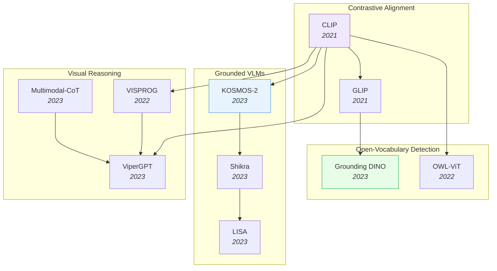

# Vision-Language Models

> [!abstract] Overview
> VLMs bridge visual perception and language understanding, evolving from contrastive alignment (CLIP) to grounded dialogue (KOSMOS-2, Shikra) to visual reasoning (CoT, ViperGPT). This note covers the major architectural paradigms, grounding techniques, and the hallucination problem.

## Evolution Graph

The field progressed from **contrastive alignment** (2021) where CLIP proved image-text pairing at web scale, through **open-vocabulary grounding** (2022-2023) where GLIP, Grounding DINO, and OWL-ViT brought language-driven detection to arbitrary categories, to **grounded reasoning** (2023) where models like LISA and ViperGPT combined spatial understanding with multi-step inference.

| Year | Paper | Contribution |
|------|-------|-------------|
| 2021 | [[2103.00020\|CLIP]] | Contrastive pretraining on 400M image-text pairs; established the paradigm for zero-shot vision-language transfer |
| 2021 | [[2112.03857\|GLIP]] | Unified object detection and phrase grounding; learned object-level language-aware representations for open-vocabulary detection |
| 2022 | [[2205.06230\|OWL-ViT]] | Simple adaptation of contrastive ViT to open-vocabulary detection; unified text- and image-conditioned object finding |
| 2022 | [[2211.11559\|VISPROG]] | Neuro-symbolic visual programming via LLM-generated executable programs; compositional reasoning without task-specific training |
| 2023 | [[2303.05499\|Grounding-DINO]] | Deep language-vision fusion in a DINO detector; 52.5 AP zero-shot on COCO without seeing COCO categories |
| 2023 | [[2306.14824\|KOSMOS-2]] | Grounded MLLM that perceives and generates bounding boxes as location tokens in natural language |
| 2023 | [[2306.15195\|Shikra]] | Enabled referential dialogue by processing and generating spatial coordinates directly within MLLM text output |
| 2023 | [[2308.00692\|LISA]] | Introduced reasoning segmentation -- MLLMs generate pixel-level masks from implicit natural language queries |
| 2023 | [[2303.08128\|ViperGPT]] | LLM generates Python programs orchestrating vision modules; composable zero-shot visual reasoning without training |
| 2023 | [[2302.00923\|Multimodal-CoT]] | Chain-of-thought with vision for sub-1B models; mitigated hallucinated rationales via two-stage reasoning |

---

## 1. CLIP & Core Contrastive Alignment

The foundational approach: learning shared vision-language embeddings from web-scale image-text pairs. CLIP established the paradigm; subsequent work scaled it, opened it, and refined its representations.

- [[2601.10497|MERGETUNE]], [[2601.09859|TuneCLIP]], [[2507.22062|Meta-CLIP-2]], [[2507.00754|LUViT]], [[2506.09691|VLC-Compositionality-Inference]], [[2506.04209|LIFT]], [[2506.03096|FuseLIP]], [[2505.23004|QLIP]], [[2505.21549|DCLIP]], [[2505.18983|AmorLIP]], [[2505.16416|Circle-RoPE]], [[2505.14204|Perceptual-Initialization]], [[2505.04601|OpenVision]], [[2505.04410|DeCLIP]], [[2504.12717|RaFA]], [[2504.01017|Web-SSL]], [[2503.15485|TULIP]], [[2503.06626|DiffCLIP]], [[2502.14786|SigLIP-2]], [[2406.17639|AlignCLIP]], [[2406.06973|RWKV-CLIP]], [[2309.17425|DFN]], [[2309.16671|MetaCLIP]], [[2303.15343|SigLIP]], [[2208.12262|MaskCLIP]], [[2112.04482|FLAVA]], [[2111.10050|BASIC]], [[2111.07991|LiT]], [[2111.07783|FILIP]], [[2111.02114|LAION-400M]], [[2103.00020|CLIP]], [[2010.00747|ConVIRT]], [[2006.06666|VirTex]], [[1612.09161|Visual N-Grams]]

> [!star] Key Papers
> - [[2103.00020|CLIP]] — Contrastive pre-training on 400M image-text pairs; enabled zero-shot classification via text prompts and launched the VLM era
> - [[2111.10050|BASIC]] — Combined batch, data, and model scaling to push contrastive learning to 85.7% zero-shot ImageNet accuracy
> - [[2505.04410|DeCLIP]] — Decoupled learning framework enhancing CLIP for open-vocabulary dense perception tasks

> [!tip] CLIP as the Universal Starting Point
> Nearly every VLM in this vault traces back to CLIP's contrastive pre-training recipe. SigLIP 2 and DeCLIP show the paradigm still evolving five years later, while LiT demonstrated that freezing the image tower and only tuning text can be surprisingly effective for adaptation. The choice of contrastive objective (softmax vs sigmoid, global vs local) cascades into downstream grounding and detection quality.

---

## 2. Self-Supervised Visual Learning

Learning visual representations without labels through contrastive, masked, or joint-embedding objectives — the foundation for data-efficient downstream VLM tasks.

**Contrastive & Joint-Embedding SSL** — Methods that align representations across augmented views or modalities without reconstruction.
- [[2607.00784|LeVLJEPA]], [[2606.02735|S2-VLA]], [[2605.23895|BrainCause]], [[2604.18267|MARCO]], [[2602.11241|Active-Zero]], [[2602.02381|AdaSSL]], [[2507.09961|TDCRL]], [[2506.23156|Multi-Label-Contrastive-SSL]], [[2506.07413|VarCon]], [[2506.04411|DCL-Neural-Collapse-Theory]], [[2505.22196|Aug-Aware-SSL-Theory]], [[2505.21533|SOP]], [[2505.11815|UniMoCo]], [[2504.16929|I-Con]], [[2502.02202|MLCL]], [[2406.17768|EXTRACT]], [[2405.07060|Memory-Maze]], [[2105.04553|MoBY]], [[2104.02057|MoCo-v3]]

> [!star] Key Papers
> - [[2104.02057|MoCo-v3]] — Established robust self-supervised training recipes for Vision Transformers; bridged the gap from CNNs to ViTs
> - [[2504.16929|I-Con]] — Information-theoretic framework unifying 23+ contrastive methods under a single loss function

**Additional Self-Supervised Methods** — Masked image modeling, reconstruction, and knowledge distillation techniques for compact self-supervised visual representations.
- [[2508.04816|CoMAD]], [[2505.12477|Joint-Embedding-vs-Reconstruction-SSL]], [[2505.10526|MASSV]], [[2505.07675|DHO]], [[2412.01282|Align-KD]], [[2402.10093|MIM-Refiner]]

> [!star] Key Papers
> - [[2508.04816|CoMAD]] — Multi-teacher self-supervised distillation creating compact ViTs with complementary feature qualities
> - [[2402.10093|MIM-Refiner]] — Short contrastive refinement converts masked image models into top-performing feature extractors

**SSL Surveys, Theory & Analysis** — Comprehensive overviews and theoretical foundations for self-supervised visual learning.
- [[2510.08807|Humanoid-Everyday]], [[2505.13584|SSL-Segmentation-Survey]], [[2505.13317|Few-shot-SSL]], [[2504.20364|SSL-Representation-Human-Alignment]], [[2408.17059|SSL-for-ViT-Survey]], [[2305.13689|SSL-Survey]], [[2301.11915|Part-Aware-SSL]]

> [!star] Key Papers
> - [[2305.13689|SSL-Survey]] — Comprehensive survey of image-based self-supervised learning covering contrastive, generative, and self-distillation paradigms
> - [[2408.17059|SSL-for-ViT-Survey]] — Detailed taxonomy of SSL mechanisms tailored specifically for Vision Transformers

> [!tip] SSL to VLM Pipeline
> Self-supervised features (DINO, MAE, MoCo) provide the visual backbone that CLIP-style alignment then connects to language. The SSL quality directly determines downstream VLM performance — see [[01_Foundation-Models]] for the backbone architectures.

---

## 3. Prompt Learning & Efficient Adaptation

Adapting pre-trained VLMs to downstream tasks without full fine-tuning — through learnable prompts, adapters, and test-time strategies.

**Prompt Tuning for VLMs** — Learning task-specific prompt tokens while keeping the backbone frozen.
- [[2508.04942|ProMIM]], [[2508.02671|AugPT]], [[2507.04511|FA]], [[2506.03195|AutoSEP]], [[2506.02843|REAP]], [[2505.15506|PromptMargin]], [[2505.02406|TCPA]], [[2504.18158|E-InMeMo]], [[2409.15310|Visual-Prompting-MLLM-Survey]], [[2406.03303|Learned-Visual-Prompts-for-ViT]], [[2405.16417|CRoFT]], [[2309.17024|HoloAssist]], [[2304.06712|Visual-Prompt-Engineering]], [[2210.03117|MaPLe]], [[2203.05557|CoCoOp]], [[2109.01134|CoOp]]

> [!star] Key Papers
> - [[2109.01134|CoOp]] — Pioneered learnable prompt engineering for CLIP; replaced hand-crafted prompts with optimizable context vectors
> - [[2203.05557|CoCoOp]] — Conditional prompts that generalize to unseen classes by conditioning on image features
> - [[2506.02843|REAP]] — Revealed that learnable prompts can hinder ViT generalization in cross-domain few-shot settings

**Adapters & Residual Tuning** — Lightweight modules that add task-specific capacity alongside frozen pre-trained weights.
- [[2605.03677|Uni-OPD]], [[2605.00814|PVM]], [[2604.28123|PRISM]], [[2604.24182|M2-VLA]], [[2604.02327|SteerViT]], [[2504.21447|Shallow-ViT-Features]], [[2503.06063|Multi-Layer-Visual-Fusion]], [[2412.14640|APT]], [[2410.07170|EVA-Explained-Variance-Adaptation]], [[2311.09191|DAC]], [[2308.05659|AD-CLIP]], [[2211.10277|TaskRes]], [[2207.09519|Tip-Adapter]], [[2111.03930|Tip-Adapter]], [[2110.04544|CLIP-Adapter]]

> [!star] Key Papers
> - [[2111.03930|Tip-Adapter]] — Training-free CLIP adapter using a cache model from few-shot support sets
> - [[2211.10277|TaskRes]] — Decouples task-specific and pre-trained knowledge via residual tuning

**Test-Time Adaptation** — Adapting VLMs at inference time without retraining, using unlabeled test data or dynamic caching.
- [[2507.00462|MS-TTA]], [[2506.22819|TCA]], [[2506.22395|Test-Time-VLM-Consistency]], [[2506.04713|VEST]], [[2506.00513|SSAM]], [[2408.05674|PS-TTL]], [[2405.02797|VDPG]], [[2403.18293|TDA]], [[2308.06038|DiffTPT]], [[2209.07511|TPT]]

> [!star] Key Papers
> - [[2403.18293|TDA]] — Training-free dynamic adapter enabling efficient test-time adaptation via positive/negative caching
> - [[2506.00513|SSAM]] — Self-supervised test-time adaptation for VLMs using dynamic memory alignment

**Domain Adaptation, Generalization & Model Merging** — Transferring, merging, or evolving VLM knowledge across domains and models without full retraining.
- [[2603.17655|CC-CDFSL]], [[2601.10497|MERGETUNE]], [[2509.11417|VLA-Pretrain-Preserve]], [[2508.01558|EvoVLMA]], [[2506.13723|OTFusion]], [[2504.06389|SemiDAViL]], [[2502.17159|RobustMerge]], [[2407.15173|CLIP-Domain-Adaptation]], [[2403.13187|EvoLLM-JP]], [[2303.01906|DPCL]]

> [!star] Key Papers
> - [[2504.06389|SemiDAViL]] — First language-guided semi-supervised domain adaptation framework for VLMs
> - [[2403.13187|EvoLLM-JP]] — Evolutionary Model Merge: automated framework using evolutionary algorithms to combine VLMs across languages and modalities

**Few-Shot & Zero-Shot Transfer** — Maximizing VLM performance with minimal labeled examples.
- [[2601.08499|EfficientFSL]], [[2510.08022|FastUMI-100K]], [[2508.03102|CCA]], [[2507.03657|ProtoMM]], [[2507.03458|D&D]], [[2506.23822|LaZSL]], [[2506.04005|SiM]], [[2504.12104|Logits-DeConfusion]], [[2504.06608|Cross-Domain-FSL-with-DKM]], [[2504.06120|HypCD]], [[2503.19903|PS3]], [[2405.13532|VLM-Few-Shot-Example-Selection]], [[2210.03094|VIMA]]

> [!star] Key Papers
> - [[2405.13532|VLM-Few-Shot-Example-Selection]] — Demonstrated that few-shot VLM performance is highly sensitive to example choice; provides optimal selection strategies
> - [[2506.04005|SiM]] — Addresses vocabulary-free few-shot learning where target class names are unknown at test time

**Surveys** — Comprehensive reviews of VLM adaptation, generalization, and open-vocabulary detection/segmentation strategies.
- [[2510.11106|CZSL-Survey]], [[2510.09586|VLM-Survey-26K]], [[2508.05547|VLM-Unsupervised-Adaptation-Survey]], [[2508.04227|VLM-Continual-Learning-Survey]], [[2506.18504|VLM-Generalization-Survey]], [[2501.02189|VLM-SOTA-Survey]], [[2307.09220|OVD/OVS-Survey]], [[2306.15880|Open-Vocabulary-Learning-Survey]]

> [!star] Key Papers
> - [[2506.18504|VLM-Generalization-Survey]] — First comprehensive review of knowledge transfer and generalization strategies for pre-trained VLMs
> - [[2306.15880|Open-Vocabulary-Learning-Survey]] — First exhaustive review of open vocabulary learning across detection, segmentation, and recognition

> [!tip] The Adaptation Spectrum
> From training-free (Tip-Adapter, TDA) to lightweight prompt tuning (CoOp) to full fine-tuning — the optimal strategy depends on your data budget and domain shift. Test-time adaptation is emerging as a compelling middle ground for deployment.

---

## 4. Open-Vocabulary Detection & Grounding

Detecting and localizing objects described by arbitrary text — not limited to a fixed set of training categories.

**Open-Vocabulary Detectors: Region-Text Alignment & Contrastive Methods** — Classic open-vocabulary detectors built on region-level contrastive alignment or distillation from CLIP-style backbones.
- [[2306.09683|OWLv2]], [[2305.07011|RO-ViT]], [[2304.11463|OmniLabel]], [[2304.04514|DetCLIPv2]], [[2303.13076|CORA]], [[2303.11331|EVA-02]], [[2303.05892|OADP]], [[2303.05499|Grounding-DINO]], [[2303.02489|CapDet]], [[2209.09407|DetCLIP]], [[2206.05836|GLIPv2]], [[2205.06230|OWL-ViT]], [[2203.17273|FindIt]], [[2203.16513|PromptDet]], [[2203.12555|GriTS]], [[2201.02605|Detic]], [[2112.03857|GLIP]], [[2104.13921|ViLD]], [[2011.10678|OVR-CNN]]

**Open-Vocabulary Detectors: LLM-Augmented & Efficient Methods** — Recent detectors that leverage MLLMs/LLMs for detection or focus on semi-supervision and inference efficiency.
- [[2603.24454|VLAForge]], [[2507.03302|SemiOVS]], [[2506.23785|VisTex-OVLM]], [[2503.07465|YOLOE]], [[2501.18954|LLMDet]], [[2412.18273|SBV]], [[2408.10787|UniProj-Det]], [[2405.08593|NRAA]], [[2401.17981|MLLM-Detection-Infusion]], [[2401.02361|MM-Grounding-DINO]], [[2312.10439|SIC-CADS]]

> [!star] Key Papers
> - [[2303.05499|Grounding-DINO]] — Married DINO with grounded pre-training for open-set detection; the go-to open-vocabulary detector
> - [[2112.03857|GLIP]] — Unified detection and phrase grounding via grounded language-image pre-training
> - [[2306.09683|OWLv2]] — Scaled OWL-ViT with self-training to achieve SOTA open-vocabulary detection

**Region-Level Alignment** — Learning fine-grained region-text correspondences beyond global image-text matching.
- [[2604.01179|Florence-2-ROS-2-Wrapper]], [[2507.09615|FAIR]], [[2506.12698|KDUP]], [[2404.13013|Groma]], [[2403.13043|S2]], [[2401.09865|SPARC]], [[2302.13996|BARON]], [[2206.07643|FIBER]], [[2112.09106|RegionCLIP]], [[1505.04870|Flickr30k Entities]]

> [!star] Key Papers
> - [[2112.09106|RegionCLIP]] — Extended CLIP to region-level representations via region-text pre-training on pseudo-labels
> - [[2401.09865|SPARC]] — Sparse fine-grained contrastive alignment for dense region-level VLM features

**Referring Expression & Segmentation** — Referring expression comprehension and segmentation.
- [[2607.06553|ReChannel]], [[2603.12382|SPARROW]], [[2601.05244|GREx]], [[2510.23603|PixelRefer]], [[2510.21311|FineRS]], [[2506.22624|Seg-R1]], [[2410.08021|OneRef]], [[2405.19783|IVM]], [[2310.11441|SoM]], [[2306.04356|FGVP]], [[2203.16265|SeqTR]], [[1511.02283|Google Refexp]]

**Open-Vocabulary Detection & Grounding** — Open-vocabulary detection and phrase grounding.
- [[2605.27365|LocateAnything]], [[2603.14609|GroundSet]], [[2510.12798|Rex-Omni]], [[2506.18448|GraspMAS]], [[2506.02359|Auto-Labeling]], [[2307.12813|DOD]]

**Embodied Navigation & Visual Tracking Grounding** — Grounding natural-language instructions into navigation actions, waypoints, and embodied visual tracking.
- [[2607.21571|Sequential-EQA]], [[2607.21400|VoLN]], [[2607.20785|Robostral Navigate]], [[2607.20679|CAT-Nav]], [[2607.20061|ReferTrack]], [[2607.19850|SOPD-SocialNav]], [[2607.14586|SoftNav]], [[2607.13624|VLM Semantic Navigation]], [[2607.13461|JOP-VLN]], [[2607.10383|ABot-N1]], [[2607.08359|FSD-VLN]], [[2607.06882|GemNav]], [[2607.06537|UniLM-Nav]], [[2607.03792|REALM]], [[2607.01043|DART-VLN]], [[2606.31654|DynFly]], [[2606.30696|ViTL]], [[2210.03087|IVLN]], [[2203.02764|Candidate Waypoints Predictor]], [[1811.10092|RCM+SIL]]

**Robotic Manipulation, Grasping & Affordance Grounding** — Grounding language and visual affordances into manipulation, grasping, and action-execution policies.
- [[2607.07897|StiffNET]], [[2606.30632|GROW²]], [[2606.30613|SPARK (Anchored Robotic Keypoints)]], [[2606.02277|RoboSemanticBench]], [[2605.24203|Afford-VLA]], [[2605.14712|IntentVLA]], [[2605.12369|GuidedVLA]], [[2605.02881|MolmoAct2]], [[2604.05697|GraspSense]], [[2603.16860|DreamPlan]], [[2601.08246|FSAG]], [[2511.13327|ZeroDexGrasp]], [[2511.01571|PixelVLA]], [[2510.11689|Phys2Real]], [[2506.05576|TD-TOG]], [[2503.15202|VLM-BT-Failure-Handling]], [[2502.01828|FOREWARN]], [[2407.04689|RAM (Retrieval Affordance Transfer)]], [[2309.16118|D3Fields]]

**Spatial & Scene Grounding** — Grounding VLM reasoning in 3D scene geometry and physical space.
- [[2605.05163|PhysForge]], [[2605.04128|JoyAI-Image]], [[2603.25411|HiSpatial]], [[2602.22703|GEODPO]], [[2512.24119|GeoBench]], [[2510.16714|SceneCOT]], [[2510.13800|GS-Reasoner]]

**Visual Grounding, Referring & Retrieval Methods** — Localizing, verifying, and retrieving specific visual-textual references.
- [[2603.16253|EVPV]], [[2601.07645|PlaM]], [[2512.23169|REVEALER]], [[2510.21501|GranViT]], [[2507.05920|MGPO]], [[2507.00748|Multi-Image-Grounding-RL]], [[2506.11991|VGR]], [[2505.02278|GCLIP]], [[2411.09691|TinyGroundingGPT]], [[2403.16999|VisCoT]], [[2403.12966|CoS]], [[2402.04236|CogCoM]], [[2312.14135|V*]], [[2301.05226|IPVR]]

**Latent & RL-Driven Visual Reasoning** — Reasoning, hallucination mitigation, and self-improvement methods trained via RL or latent chain-of-thought.
- [[2605.15198|ATLAS]], [[2605.11856|UniVLR]], [[2603.03857|DeepScan]], [[2603.02556|VC-STaR]], [[2603.00207|VisRef]], [[2602.23959|NV-CoT]], [[2602.23615|HART]], [[2602.22766|CapImagine]], [[2602.16702|SAP]], [[2602.08241|SAYO]], [[2601.10129|LaViT]], [[2601.06993|ReFine-RFT]], [[2601.05328|BFD]], [[2601.00659|CRoPS]], [[2601.00215|Sight-to-Insight]], [[2512.24297|FIGR]], [[2512.23453|CoFi-Dec]], [[2512.21218|LIVR]], [[2512.16922|NEPA]], [[2512.16584|SkiLa]]

> [!star] Key Papers
> - [[2203.16265|SeqTR]] — Reformulated grounding as autoregressive coordinate prediction; unified phrase localization and referring expression tasks
> - [[2307.12813|DOD]] — Described Object Detection unifying open-vocabulary and referring expression detection

**Open-Vocabulary Tagging & Recognition** — Assigning arbitrary text labels to images for image-level recognition beyond detection.
- [[2508.12137|Fine-Grained-VLM-Tuning]], [[2505.20612|RF100-VL]], [[2504.14988|FG-BMK]], [[2504.06120|HypCD]], [[2408.14371|SelEx]], [[2406.14830|CLIP-Decoder]], [[2309.08912|MP-FGVC]], [[2306.03514|RAM]]

> [!star] Key Papers
> - [[2306.03514|RAM]] — Recognize Anything Model: image tagging foundation model handling any category via large-scale annotation-free training
> - [[2408.14371|SelEx]] — Generalized Category Discovery via self-expertise for fine-grained classification

**Model Unification & Fusion** — Combining complementary vision models (e.g., SAM + CLIP, DINO + text) into unified systems.
- [[2508.12466|Inverse-LLaVA]], [[2508.04987|UniMoS++]], [[2507.01643|SAILViT]], [[2506.16673|MM-LG]], [[2506.13925|HVL]], [[2505.20289|VisTA]], [[2412.16334|dino.txt]], [[2412.13303|FastVLM]], [[2412.07679|RADIOv2.5]], [[2411.19331|Talk2DINO]], [[2411.14402|AIMV2]], [[2411.04997|LLM2CLIP]], [[2410.16512|TIPS]], [[2311.07575|SPHINX (Multi-modal Weight Mixing)]], [[2310.15308|SAM-CLIP]]

> [!star] Key Papers
> - [[2310.15308|SAM-CLIP]] — Unified SAM and CLIP vision encoders into a single model for zero-shot semantic and panoptic segmentation
> - [[2410.16512|TIPS]] — Unified image-text and self-supervised objectives for general-purpose vision representations

**Segmentation with VLMs** — Leveraging VLM alignment for open-vocabulary or self-supervised semantic segmentation.
- [[2605.00891|X2SAM]], [[2602.23759|Selfment]], [[2506.22624|Seg-R1]], [[2311.16241|SemiVL]], [[2303.01906|DPCL]], [[2206.08522|VLMbench]], [[2112.01071|MaskCLIP (Dense CLIP Labels)]]

> [!star] Key Papers
> - [[2602.23759|Selfment]] — Fully self-supervised framework achieving accurate object segmentation without any labels

> [!tip] From Closed to Open Vocabulary
> The progression ViLD -> GLIP -> Grounding DINO shows how VLM embeddings replaced fixed class heads. The current frontier combines detection with grounding (DOD) and self-training at scale (OWLv2). For embodied AI, open-vocabulary detection is essential — robots encounter objects never seen in training.

---

## 5. Interpretability & Mechanistic Analysis

Understanding what VLMs learn internally — which features matter, how representations are structured, and why models make specific predictions.

**Mechanistic Interpretability** — Dissecting VLM internals through sparse autoencoders, attention analysis, and probing.
- [[2607.03973|MANCE]], [[2604.10949|Pseudo-Unification-Probing]], [[2602.06218|SAE-A]], [[2602.00462|LatentLens]], [[2510.02292|VLM-Lens]], [[2507.10442|VLM-Three-Space-Analysis]], [[2506.11976|VLM-Visual-Language-Alignment]], [[2506.01247|VS2]], [[2505.22664|VLM-Surrogate-Grafting]], [[2505.20229|CLIP-Attribution-SAE]], [[2504.19475|Prisma]], [[2310.05916|TEXTSPAN]], [[2208.10431|ProtoPFormer]], [[1806.10574|ProtoPNet]]

> [!star] Key Papers
> - [[2310.05916|TEXTSPAN]] — Systematic method to interpret CLIP's image representations by decomposing them into text-describable components
> - [[2504.19475|Prisma]] — Open-source toolkit adapting mechanistic interpretability methods from language models to vision

**Explainability & Attribution** — Methods for explaining model predictions through attribution maps, saliency, and causal analysis.
- [[2510.00034|MOWI]], [[2507.04380|Explainability-Task-Arithmetic]], [[2506.02138|PA-LRP]], [[2506.01097|Explainability-Guided-Token-Compression]], [[2503.01776|CSR]], [[2503.00641|How-to-Probe]], [[2501.13620|VLM-Perception-Reasoning-Probe]], [[2106.09141|SVO-Probes]], [[1610.02391|Grad-CAM]], [[1512.04150|CAM (Class Activation Mapping)]]

> [!star] Key Papers
> - [[2506.02138|PA-LRP]] — Positional-Aware Layer-wise Relevance Propagation for Transformer explainability accounting for positional encoding effects
> - [[2510.00034|MOWI]] — Model-Observer-World-Input framework systematizing visual explanation and interpretation

**Active Learning & Data Curation** — Intelligent selection of training data using VLM representations.
- [[2506.11967|Annotation-Bootstrapping]], [[2506.02557|KUEA]], [[2506.01724|ALOR]], [[2412.18072|MMFactory]], [[2412.07012|ProVision]]

> [!star] Key Papers
> - [[2506.01724|ALOR]] — Active Learning with Open Resources integrating VLMs for efficient annotation selection

> [!tip] Opening the Black Box
> Mechanistic interpretability for VLMs is still nascent compared to language models. TEXTSPAN showed that CLIP representations are surprisingly decomposable into text-describable components. Tools like Prisma and VS2 are making systematic VLM analysis accessible.

---

## 6. VLM Robustness & Distribution Shift

Making VLMs reliable under distribution shift, adversarial conditions, and out-of-distribution inputs.

- [[2607.10655|AFP]], [[2607.01518|Overthink-Triggered Slowdown Attack]], [[2604.21343|Latent-Denoising-LMM]], [[2604.18867|HyperRobust-VLM]], [[2510.10487|Triangular-Consistency]], [[2509.07979|VIRAL]], [[2508.15568|ADAPT]], [[2507.08979|PRISM]], [[2506.22982|CroPA]], [[2505.23745|TrustVLM]], [[2410.17385|COMFORT]], [[2406.07145|Failure-Landscape-DRL]], [[2211.13854|ComCLIP]], [[2207.01887|MKT]], [[2206.01986|CLIP Openness]]

> [!star] Key Papers
> - [[2604.18867|HyperRobust-VLM]] — Hyperbolic hierarchy-aware adversarial fine-tuning; defends against superclass attacks that transfer to base classes, extends to medical imaging
> - [[2508.15568|ADAPT]] — Improves VLM robustness to distribution shifts through adaptive prompting
> - [[2507.08979|PRISM]] — Data-free, task-agnostic framework leveraging LLMs for VLM adaptation without target domain data

> [!tip] Robustness Matters for Deployment
> VLMs trained on web-scraped data are brittle to domain shifts. Methods like ADAPT and test-time adaptation (Section 3) address this — critical for deploying VLMs in robotics or medical imaging where training and deployment distributions diverge.

---

## 7. Grounded Multimodal LLMs

VLMs that can point to what they are talking about — generating text with spatial references like bounding boxes or segmentation masks. Essential for embodied AI and interactive visual dialogue.

- [[2602.11073|VILAVT]], [[2601.11322|VLM-Logic-Situational-Awareness]], [[2601.05600|SceneAlign]], [[2601.05344|Im2Sim]], [[2601.02771|AbductiveMLLM]], [[2404.13013|Groma]], [[2308.00692|LISA]], [[2307.03601|GPT4RoI]], [[2306.15195|Shikra]], [[2306.14824|KOSMOS-2]], [[2305.11175|VisionLLM]], [[2109.12098|CLIPort]], [[2104.12763|MDETR]]

> [!star] Key Papers
> - [[2306.14824|KOSMOS-2]] — First grounded MLLM: generates text with bounding box references inline
> - [[2306.15195|Shikra]] — Referential dialogue: point-and-talk in natural conversation
> - [[2308.00692|LISA]] — Reasoning segmentation: segment objects described in complex natural language queries

> [!tip] Grounding = Embodiment Bridge
> Grounded VLMs are the bridge between vision-language understanding and physical action. KOSMOS-2's bounding box generation directly enables VLAs to localize manipulation targets. See [[07_Robotics-and-Embodied-AI]] for how these grounding capabilities feed into robot policies.

---

## 8. Visual Reasoning & Tool Use

Teaching VLMs to reason step-by-step, often by generating programs or invoking external tools rather than producing answers directly.

- [[2607.08024|APIVOT]], [[2604.22875|SketchVLM]], [[2603.07335|VisualScratchpad]], [[2505.19255|VTool-R1]], [[2505.05464|Bring-Reason-to-Vision]], [[2504.09828|FATE]], [[2503.16434|Interactive-Sketchpad]], [[2411.19488|ICoT]], [[2411.10440|LLaVA-CoT]], [[2410.16400|VipAct]], [[2406.19934|VIREO]], [[2406.09403|VisualSketchPad]], [[2405.17104|LLM-Optic]], [[2404.07664|PROWL]], [[2403.12488|DetToolChain]], [[2311.05437|LLaVA-Plus]], [[2303.08128|ViperGPT]], [[2303.04671|Visual-ChatGPT]], [[2302.00923|Multimodal-CoT]], [[2211.11559|VISPROG]], [[2204.00598|Socratic-Models]], [[1811.10830|VCR]], [[1811.00491|NLVR2]], [[1709.07871|FiLM]], [[1705.03633|IEP]], [[1704.05526|N2NMN]], [[1612.00837|VQA v2.0]], [[1511.02799|NMN]]

> [!star] Key Papers
> - [[2302.00923|Multimodal-CoT]] — First chain-of-thought reasoning in multimodal LLMs, jointly reasoning over vision and language
> - [[2303.08128|ViperGPT]] — VLM generates Python programs to compose vision modules for reasoning; no task-specific training
> - [[2406.09403|VisualSketchPad]] — Sketching as visual chain-of-thought for spatial reasoning

> [!tip] The Reasoning Progression
> Simple prompting (CoT) -> program generation (ViperGPT) -> tool use (Visual ChatGPT) -> RL-trained reasoning (Vision-R1). See [[03_Reasoning-and-Planning]] and [[04_Reinforcement-Learning#4. Visual & Multimodal RL]].

---

## 9. The Hallucination Problem

VLMs confidently describe things that are not in the image — a critical obstacle for embodied AI and trustworthy deployment.

- [[2607.21556|VCSD]], [[2604.20328|HyLaR]], [[2604.15809|AIF]], [[2602.21054|VAUQ]], [[2602.11858|ZwZ]], [[2602.11737|OA-VCD]], [[2509.12132|Reflection-V]], [[2509.03518|LLM-Lying]], [[2508.01781|LLM-Hallucination-Taxonomy]], [[2507.00898|ONLY]], [[2506.09047|Back-Patching-VLM]], [[2505.22651|Sherlock]], [[2505.16151|FRANK]], [[2505.05177|MARK]], [[2504.19254|uqlm]], [[2410.12735|CREAM]], [[2406.01920|CODE]], [[2402.00253|LVLM-Hallucination-Survey]], [[2401.06209|MMVP]], [[2310.00754|LURE]], [[2305.10355|POPE]], [[2211.09699|PromptCap]], [[1809.02156|CHAIR]]

> [!star] Key Papers
> - [[2402.00253|LVLM-Hallucination-Survey]] — Comprehensive survey of VLM hallucination types, causes, and mitigation strategies
> - [[2508.01781|LLM-Hallucination-Taxonomy]] — Formal taxonomy defining hallucination as an inherent, irreducible phenomenon in LLMs
> - [[2509.03518|LLM-Lying]] — Distinguishes intentional LLM "lying" from hallucination via dummy token rehearsal mechanisms

> [!tip] Hallucination vs Lying
> Not all incorrect outputs are created equal. Hallucination arises from distributional gaps; lying (per LLM Lying) involves the model's internal representations contradicting its output. For safety-critical VLM deployment, both failure modes require distinct mitigation strategies.

---

## 10. Spatial Understanding in VLMs

A growing focus area bridging VLMs toward embodied tasks — understanding where things are relative to each other in 3D space.

- [[2607.21595|VLM-IE3D]], [[2607.21072|ProVisE]], [[2607.15054|ViPS]], [[2607.14543|SafeRelBench]], [[2607.06165|EAGOR]], [[2606.30367|FutureNav]], [[2606.29786|OP3DSG]], [[2605.08064|Proxy3D]], [[2604.26934|World2VLM]], [[2604.20570|GSI-Bench]], [[2603.27967|XVR]], [[2603.25629|LanteRn]], [[2603.25411|HiSpatial]], [[2603.23404|TRACE]], [[2603.18892|MultihopSpatial]], [[2603.16506|VIEW2SPACE]], [[2603.15386|RieMind]], [[2602.21619|VSR-Information-Injection-Analysis]], [[2602.15950|VLM-Spatial-Reasoning-OCR]], [[2602.15918|EarthSpatialBench]], [[2602.06037|GeoThinker]], [[2602.04413|H-GIVR]], [[2602.03916|SpatiaLab]], [[2601.20354|SpatialGenEval]], [[2601.11644|Trust-Spatial]], [[2511.21471|SpatialBench]], [[2510.09606|SpaceVista]], [[2507.07610|SpatialViz-Bench]], [[2506.18385|InternSpatial]], [[2506.03135|OmniSpatial]], [[2505.23747|Spatial-MLLM]], [[2505.00788|SpatialLLM]], [[2504.20024|SpatialReasoner]], [[2504.15037|MLLM-Spatial-Reasoning-Position-Paper]], [[2503.22976|SPAR-7M]], [[2503.19707|VLM-Spatial-Reasoning-Benchmark]], [[2503.13111|MM-Spatial]], [[2502.11859|VLM-Spatial-Abilities-Benchmark]], [[2502.03214|iVISPAR]], [[2412.10908|Do-VLMs-Understand-3D-Shapes]], [[2412.07825|3DSRBench]], [[2408.16662|Space3D-Bench]], [[2406.14852|SpatialEval]], [[2406.02537|TopViewRS]], [[2406.01584|SpatialRGPT]], [[2404.12390|BLINK]], [[2401.12168|SpatialVLM]], [[2307.12981|3D-LLM]], [[2205.00363|VSR]], [[1711.07280|Room-to-Room (R2R)]]

> [!star] Key Papers
> - [[2401.12168|SpatialVLM]] — Endowed VLMs with spatial reasoning via 3D-aware training data
> - [[2603.15386|RieMind]] — Geometry-grounded agentic framework decoupling perception from spatial reasoning

> [!tip] The Spatial Gap
> Standard VLMs struggle with spatial relations because they are trained on 2D image-text pairs. SpatialVLM and SpatialRGPT address this with 3D-aware training, while RieMind takes an agentic approach. For robotics, spatial understanding is non-negotiable — see [[05_Computer-Vision-and-3D]].

**Physical & Spatial Understanding Benchmarks** — Benchmarks and diagnostics measuring whether VLMs/MLLMs reason about physical properties (mass, stability, materials, dynamics) from images and video, not just spatial relations.
- [[2606.03920|VSTAT]], [[2605.30557|SpatialUncertain]], [[2605.22536|SpaceDG]], [[2605.18746|ESI-Bench]], [[2512.19526|QuantiPhy]], [[2510.06251|Physics-Frontier-Diagnostic]], [[2506.08708|PhyBlock]], [[2505.15929|PhyX]], [[2503.21668|Object-Understanding-Cog-Eval]], [[2501.16411|PhysBench]], [[2311.10111|VideoCon]]

**Physics-Grounded Reasoning, Generation & Prediction Methods** — Methods that instill or leverage physical-world priors for reasoning, video generation, and outcome prediction.
- [[2606.06076|MGSD]], [[2606.03988|Imaginative-Perception-Tokens]], [[2606.02551|AFUN]], [[2605.30561|VLM3]], [[2605.29563|ViewSuite]], [[2605.06758|R3L]], [[2602.06033|VLM-Intuitive-Physics]], [[2601.19834|Visual-Generation-Reasoning]], [[2512.17012|4D-RGPT]], [[2511.20280|VLM-Refine-Physics-Video]], [[2506.10778|SlotPi]], [[2502.19868|C-Drag]], [[2311.18259|Ego-Exo4D]]

> [!star] Key Papers
> -  — Probes whether video foundation models implicitly encode dynamic physical properties (mass, friction); a diagnostic complement to PhysGenBench
> - [[2506.08708|PhyBlock]] — Block-stacking benchmark exposing whether MLLMs reason about gravitational stability from images alone

---

## 11. MLLM Architectures & Scaling

Large multimodal models — the workhorses of modern vision-language understanding, spanning from sub-3B efficient designs to unified generation architectures.

**Embodied & Spatially-Grounded Large MLLMs** — Large multimodal models purpose-built for embodied, robotic, or spatial-reasoning deployment.
- [[2607.12894|Hy-Embodied-VLM-1.0]], [[2605.30161|Why-Far-Looks-Up]], [[2605.29074|Embodied3DBench]], [[2605.22816|AwareVLN]], [[2605.22812|GesVLA]], [[2605.21133|Spatial-Brain-Cerebellum]], [[2605.20914|RISE-Self-Evolving-VLM]], [[2605.20246|GROW]], [[2605.18162|SAGE-Spatial-VLM]], [[2605.06234|RobotEQ]], [[2604.07430|HY-Embodied-0.5]], [[2511.16518|MiMo-Embodied]], [[2509.25794|Point-It-Out]], [[2210.05714|VLMaps]]

**General-Purpose MLLMs** — General-purpose instruction-tuned multimodal models at scale, not domain- or embodiment-specific.
- [[2606.30534|Orca]], [[2508.11737|Ovis2.5]], [[2507.23278|UniLiP]], [[2507.01949|Kwai-Keye-VL]], [[2507.01006|GLM-4.5V]], [[2505.18842|v1]], [[2505.14683|BAGEL]], [[2505.07062|Seed1.5-VL]], [[2504.15271|Eagle-2.5]], [[2504.13180|PerceptionLM]], [[2504.10479|InternVL3]], [[2504.07491|Kimi-VL]], [[2504.00595|Open-Qwen2VL]], [[2503.10705|ConDU]], [[2410.21276|GPT-4o]], [[2410.13733|Arcana]], [[2410.10855|CoreCognition]], [[2410.08202|Mono-InternVL]], [[2409.17146|Molmo]], [[2408.03326|LLaVA-OneVision]], [[2407.07895|LLaVA-NeXT-Interleave]], [[2407.07726|PaliGemma]], [[2406.16860|Cambrian-1]], [[2406.07476|VideoLLaMA 2]], [[2406.04325|ShareGPT4Video]], [[2404.16821|InternVL 1.5]], [[2403.05525|DeepSeek-VL]]

**Foundational MLLM Architectures** — Seminal architectures and papers that established the modern MLLM paradigm.
- [[2306.13549|MLLM-Survey]], [[2305.18565|PaLI-X]], [[2305.06500|InstructBLIP]], [[2304.08485|LLaVA]], [[2304.07193|DINOv2]], [[2303.08774|GPT-4]], [[2301.12597|BLIP-2]], [[2210.03347|Pix2Struct]], [[2209.06794|PaLI]], [[2204.14198|Flamingo]], [[2201.12086|BLIP]], [[2102.02779|VL-T5]], [[2005.14165|GPT-3]]

> [!star] Key Papers
> - [[2504.10479|InternVL3]] — Native multimodal pre-training paradigm achieving 72.2 on MMMU; top open-source MLLM competitive with proprietary models
> - [[2409.17146|Molmo]] — Fully open-weight and open-data VLM family proving that SOTA performance does not require proprietary training data
> - [[2505.14683|BAGEL]] — Unified MoT architecture with emergent reasoning; SOTA open-source on understanding and generation benchmarks

**Efficient & Compressed MLLMs** — Lightweight, fast, or token-efficient multimodal models for practical deployment.
- [[2606.30626|DOPD]], [[2604.02317|SIMPLESTREAM]], [[2603.06569|Penguin-VL]], [[2603.00136|TinyVLM]], [[2511.19820|CropVLM]], [[2507.00505|LLaVA-SP]], [[2506.17608|HIRE]], [[2506.12776|NativeRes-LLaVA]], [[2506.10967|CDPruner]], [[2505.24541|Mixpert]], [[2505.05626|PERCEPTLLM]], [[2505.01064|NeaR]], [[2504.05299|SmolVLM]], [[2503.16660|Adaptive-Token-Reduction]], [[2412.13871|LLaVA-UHD-v2]], [[2412.13303|FastVLM]], [[2412.04468|NVILA]], [[2408.01800|MiniCPM-V]], [[2405.13800|Dense Connector]], [[2401.15947|MoE-LLaVA]]

> [!star] Key Papers
> - [[2412.04468|NVILA]] — Scale-then-compress paradigm reducing training cost 5x and enabling VLM fine-tuning under 24GB; real-time robotic deployment on a laptop GPU
> - [[2504.15271|Eagle-2.5]] — 8B model matching 72B+ performance on video understanding via information-first sampling and progressive mixed post-training

**Discrete-Token & Native Autoregressive Unified Architectures** — Unified models built on discrete visual tokens and native autoregressive transformers for joint understanding and generation.
- [[2605.31604|Representation-Forcing]], [[2605.28820|NEO-ov]], [[2605.26656|DV-SFT]], [[2604.02097|LatentUM]], [[2603.03276|Beyond-LLMs]], [[2506.17202|UniFork]], [[2506.15564|Show-o2]], [[2501.17811|Janus-Pro]], [[2412.03069|TokenFlow]], [[2410.13848|Janus]], [[2408.12528|Show-o]], [[2407.06135|ANOLE]], [[2405.09818|Chameleon]], [[2404.14396|SEED-X]]

**Diffusion, Fusion & Agentic Unified Models** — Unified models built on diffusion decoders, cross-modal fusion, or agentic multi-task orchestration.
- [[2607.14187|RxBrain]], [[2607.12800|UniVR]], [[2607.06560|SenseNova-Vision]], [[2605.21931|EvoVid]], [[2605.18678|Lance]], [[2603.29620|Unify-Agent]], [[2510.08673|Puffin]], [[2506.22880|DeSa2VA]], [[2505.16933|LLaDA-V]], [[2505.05472|Mogao]], [[2504.20996|X-Fusion]], [[2504.06256|MetaQueries]], [[2501.00289|D-DiT]], [[2408.11039|Transfusion]], [[2312.13286|Emu2]], [[2309.05519|NExT-GPT]]

> [!star] Key Papers
> - [[2408.12528|Show-o]] — Single transformer unifying understanding and generation via omni-attention that switches between causal and full attention per modality
> - [[2405.09818|Chameleon]] — Early-fusion token-based architecture scaling to 34B parameters; preferred over GPT-4V+ for mixed-modal generation in human evals
> - [[2501.17811|Janus-Pro]] — Decoupled visual encoding resolving the understanding-generation conflict; 80% on GenEval surpassing DALL-E 3

**Multimodal Surveys & Taxonomies** — Comprehensive surveys covering the MLLM landscape.
- [[2605.28774|AXPO]], [[2605.18740|Vision-OPD]], [[2605.15128|MemEye]], [[2510.09586|VLM-Survey-26K]], [[2508.08189|RL-for-Large-Models-Survey]], [[2508.04227|VLM-Continual-Learning-Survey]], [[2501.02189|VLM-SOTA-Survey]], [[2412.18619|Multimodal-NTP-Survey]], [[2406.09905|Nymeria]], [[2405.10739|Efficient-MLLM-Survey]], [[2303.18223|LLM Survey]]

> [!star] Key Papers
> - [[2306.13549|MLLM-Survey]] — Foundational survey synthesizing MLLM architectures, training paradigms, evaluation methods, and the hallucination challenge
> - [[2501.02189|VLM-SOTA-Survey]] — Comprehensive 2025 review covering 95 benchmarks and identifying the shift from trained-from-scratch to LLM-backbone VLMs

> [!tip] The Architecture Convergence
> MLLMs are converging on a shared blueprint: frozen vision encoder + connector + instruction-tuned LLM. The differentiators are now training recipe (native multimodal pre-training in InternVL3 vs post-hoc adaptation) and efficiency (NVILA shows 5x training cost reduction). For unified understanding+generation, the key design choice is whether to use a single token space (Chameleon) or decoupled encoders (Janus-Pro) -- the latter currently wins on quality.

---

## 12. Visual Reasoning with RL

Reinforcement learning applied to VLMs for improving visual reasoning, chain-of-thought, and multimodal decision-making.

**RL Recipes, Reward Design & Policy Optimization for Visual Reasoning** — Core RL algorithms, reward schemes, and policy-optimization recipes for training visual chain-of-thought.
- [[2607.02490|VRRL]], [[2606.25319|V-Zero-Visual]], [[2604.20705|SSL-R1]], [[2604.20328|HyLaR]], [[2604.04917|Vero]], [[2604.03128|Self-Distilled-RLVR]], [[2604.01840|PGPO]], [[2603.28618|PRCO]], [[2603.25629|LanteRn]], [[2603.25077|ToR]], [[2603.24984|MoE-GRPO]], [[2603.22847|PEPO]], [[2602.07605|Fine-R1]], [[2505.19094|SATORI]], [[2505.17018|SophiaVL-R1]], [[2505.10088|MMRL++]], [[2504.20571|1-shot-RLVR]], [[2504.07615|VLM-R1]], [[2503.23905|Hint-GRPO]], [[2503.08497|MMRL]], [[2503.01785|Visual-RFT]], [[2501.12599|Kimi k1.5]]

**Agentic, Analysis & Domain-Specific RL Visual Reasoning** — RL-trained agentic tool-use/GUI models, spatial- or retrieval-specific reasoners, and analyses of what RL training actually improves.
- [[2605.21973|Foresee-to-Ground]], [[2603.24533|UI-Voyager]], [[2602.20739|PyVision-RL]], [[2602.12395|Frankenstein-RL-Analysis]], [[2511.07403|SpatialThinker]], [[2510.17045|V-Reason]], [[2509.24251|LVR]], [[2506.07218|Perception-R1]], [[2505.22334|Multimodal-RL-Cold-Start]], [[2505.22019|VRAG-RL]], [[2311.16502|MMMU]]

> [!star] Key Papers
> - [[2503.01785|Visual-RFT]] — Pioneered RL fine-tuning for visual tasks with verifiable rewards; 24.3% accuracy boost in fine-grained classification
> - [[2505.19094|SATORI]] — Glance-Focus-Think paradigm anchoring RL training in explicit visual grounding; 76.2% on MathVista surpassing GPT-4o

**VLM-Based Reward & Preference Modeling for Robot RL** — Using VLMs to score subgoals, generate preference labels, or shape dense rewards that supervise robot RL and policy adaptation.
- [[2607.13033|DenseReward]], [[2607.01721|CoRe]], [[2607.00483|VLM-AR3L]], [[2606.32027|FPL]], [[2606.31958|SARL]], [[2606.31377|STDR]], [[2606.30698|VL-PR]], [[2603.16065|LRM]], [[2509.19524|StepEval]]

**VLM Chain-of-Thought & Thinking** — Methods for step-by-step visual reasoning in multimodal models.
- [[2605.03782|GLANCE]], [[2605.02735|Silenced-Visual-Latents]], [[2605.02730|PFlowNet]], [[2604.21396|VG-CoT]], [[2604.02073|PLUME]], [[2603.29165|LatentPilot]], [[2603.23483|SpecEyes]], [[2603.23404|TRACE]], [[2603.22281|ThinkJEPA]], [[2512.08228|MM-CoT]], [[2511.19221|Percept-WAM]], [[2511.17487|EXTRACT+THINK]], [[2509.19003|Chain-of-Step]], [[2506.08011|ViGaL]], [[2505.18129|V-Triune]], [[2504.18397|UV-CoT]], [[2503.16188|Think-or-Not-Think]], [[2412.07215|RoboData]], [[2411.19488|ICoT]], [[2411.10440|LLaVA-CoT]]

> [!star] Key Papers
> - [[2411.10440|LLaVA-CoT]] — Autonomous multistage reasoning with stage-wise retracing; 5.8% improvement enabling 11B model to rival larger closed-source MLLMs
> - [[2603.22281|ThinkJEPA]] — Integrates JEPA-style world modeling into VLM chain-of-thought for grounded visual prediction

**Spatial, Temporal & Compositional Reasoning Benchmarks** — Benchmarks targeting spatial, 3D, temporal, video, and compositional reasoning in VLMs.
- [[2604.24300|ReVSI]], [[2603.03944|SCP-Bench]], [[2601.16520|TangramPuzzle]], [[2508.02095|VLM4D]], [[2507.20174|LRR-Bench]], [[2507.18342|EgoExoBench]], [[2506.14512|SIRI-Bench]], [[2505.23764|MMSI-Bench]], [[2502.09621|MME-CoT]], [[2405.16473|M3CoT]], [[2403.14624|MathVerse]], [[2311.17005|MVBench]], [[2311.01620|ACQUIRED]], [[2204.03162|Winoground]]

**General Capability, Embodied & Domain-Specific Benchmarks** — Broad-coverage MLLM capability benchmarks alongside embodied, robotics, and domain-specific evaluation suites.
- [[2607.18062|UniETP]], [[2607.04610|RoboVista]], [[2605.29360|MiraBench]], [[2604.22884|SOUBench]], [[2603.03241|UniG2U-Bench]], [[2602.02140|GAPEVAL]], [[2602.01816|VIA-Bench]], [[2601.12585|MLLM-Visualization-Literacy]], [[2510.12693|ERA]], [[2510.12603|IVT-LR]], [[2502.05086|REASSEMBLE]], [[2406.18925|VisArgs]], [[2404.19205|TableVQA-Bench]], [[2401.07781|T2VScore]], [[2307.06281|MMBench]], [[2306.13394|MME]], [[2305.13786|Perception Test]], [[2210.02506|GameBugDescriptions]], [[2203.10244|ChartQA]]

> [!star] Key Papers
> - [[2603.03944|SCP-Bench]] — Spatial causal prediction benchmark revealing a 23% gap between best MLLMs and humans on unseen spatio-temporal reasoning
> - [[2406.18925|VisArgs]] — Evaluates VLM ability to construct and assess visual arguments, probing beyond factual accuracy into persuasion and reasoning

**VLM Continual & Incremental Learning** — Adapting VLMs to new tasks and domains without forgetting.
- [[2604.18075|DPW]], [[2604.01007|Omni-SimpleMem]], [[2602.21628|RuCL]], [[2512.12822|LEMON]], [[2505.22453|MM-UPT]], [[2410.19925|MLLM-Continual-Learning]]

> [!star] Key Papers
> - [[2410.19925|MLLM-Continual-Learning]] — Systematic quantification of linguistic forgetting in MLLMs; showed mSGM+Rehearsal preserves language abilities during multimodal adaptation
> - [[2512.12822|LEMON]] — Efficient incremental learning for MLLMs via lightweight memory-optimized adaptation

**VLM Alignment & Post-Training** — Aligning VLMs with preferences, safety, or task-specific objectives.
- [[2607.05910|PolicyShiftGuard]], [[2510.09201|MPO]], [[2509.03113|GACD]], [[2506.17901|PostAlign]], [[2506.08391|SECOND]], [[2506.04277|RSVP]], [[2505.20444|HoPE]], [[2505.20164|VAT]], [[2505.16411|SPIN]], [[2505.07956|LLM-LEx]], [[2504.14200|KeCO]]

> [!star] Key Papers
> - [[2510.09201|MPO]] — Multimodal prompt optimization jointly tuning textual and non-textual prompts; outperforms text-only methods by 5+ points with 70% less evaluation budget
> - [[2506.08391|SECOND]] — Training-free contrastive decoding that reduces hallucination while improving general VLM accuracy

**VLM Agents & Tool Use** — VLMs deployed as interactive agents, tool users, or in agentic workflows.
- [[2607.07403|Megamind]], [[2607.06990|Closed-Loop Multi-Robot Manipulation Framework]], [[2607.04438|ResearchStudio-Reel]], [[2606.29538|Resource2Skill]], [[2604.08545|Metis]], [[2604.03016|Agentic-MME]], [[2603.24558|LensWalk]], [[2601.18631|AdaReasoner]], [[2512.15885|JARVIS]], [[2511.21688|G2VLM]], [[2506.11515|Manager]], [[2505.23766|Argus]], [[2505.21497|PosterAgent]], [[2505.21457|ACTIVE-O3]], [[2411.17673|SketchAgent]], [[2410.16400|VipAct]], [[2311.05437|LLaVA-Plus]]

> [!star] Key Papers
> - [[2311.05437|LLaVA-Plus]] — Trains MLLMs to orchestrate a skill repository of vision tools; SOTA on VisiT-Bench with emergent tool composition
> - [[2512.15885|JARVIS]] — JEPA-inspired self-supervised objective giving MLLMs fine-grained visual perception beyond textual descriptions

**VLM Efficiency & Inference** — Methods for accelerating VLM inference through token compression, resolution adaptation, and routing.
- [[2603.22815|PinPoint]], [[2603.22387|EUPE]], [[2602.01984|Delimiter-Token-Scaling]], [[2512.00489|TACS]], [[2507.23070|E-FineR]], [[2507.10302|DisCo]], [[2506.22434|MiCo]], [[2506.21710|FOCUS]], [[2506.09522|ReVisiT]], [[2506.05302|PAM]], [[2506.01850|MoDA]], [[2506.01663|Zoom-Refine]], [[2505.21538|PAM-CVR]], [[2504.17040|DyMU]], [[2503.20680|VoRA]], [[2411.16044|ZoomEye]]

> [!star] Key Papers
> - [[2411.16044|ZoomEye]] — Training-free tree-based image exploration enabling 3B models to outperform GPT-4o on high-resolution benchmarks
> - [[2506.21710|FOCUS]] — Internal MLLM representations for efficient visual cropping; 42% accuracy boost at 3-6.5x less compute than baselines

**Multimodal Representation & Embedding** — Learning improved multimodal embeddings and representations.
- [[2604.12012|TIPSv2]], [[2604.02073|PLUME]], [[2603.22953|ClusterSTM]], [[2511.11007|VisMem]], [[2509.26625|LLM-Visual-Priors]], [[2507.04590|VLM2Vec-V2]], [[2506.23115|MoCa]], [[2506.17629|CLiViS]], [[2505.19707|MVFT-JI]], [[2505.17812|VaLSe]], [[2504.19627|VCM]], [[2504.17432|UniME]], [[2502.17422|MLLM-Small-Visual-Details]], [[2502.16707|ReflectVLM]], [[2502.16435|VISFACTOR]], [[2410.11829|MMFuser]], [[2403.19651|MagicLens]], [[2302.03084|Pic2Word]]

> [!star] Key Papers
> - [[2504.17432|UniME]] — Universal multimodal embeddings via distillation and hard-negative tuning; SOTA on MMEB with 14-18% gains on long-caption retrieval
> - [[2507.04590|VLM2Vec-V2]] — Unified embedding model for videos, images, and documents achieving top scores on the 78-task MMEB-V2 benchmark

**Additional Multimodal & Embodied Methods** — Cross-cutting embodied navigation and other methods that don't fit the section's other buckets.
- [[2607.12630|MTEFR]], [[2607.10991|HUMA]], [[2607.10744|Traj-VLN]]

**Robotic Manipulation & Dexterous Control VLMs** — VLMs and VLAs adapted for grasping, dexterous manipulation, and arm/hand control.
- [[2607.20207|SeededGrasp]], [[2607.18709|RoboInter1.5]], [[2607.13926|S2-VLA]], [[2607.11018|Soft-Trunk Flow Matching]], [[2607.06186|Calf-Integrated Quadruped Manipulator]], [[2607.05883|DexTele]], [[2607.04988|InternVLA-A1.5]], [[2607.04057|PreSIST]], [[2607.00302|Splash]], [[2607.00283|Planning-Critical Occlusion VLM]], [[2606.31909|CoDex]], [[2606.31451|UniTac]], [[2606.31144|Modular VLA Framework]], [[2606.29028|Keypose Exploration]], [[2603.22003|VP-VLA]], [[2603.13825|Explicit-WM-Manipulation]], [[2505.23705|Knowledge-Insulation-VLA]], [[2404.10220|COME-robot]], [[2403.08248|CoPa]], [[2401.12202|OK-Robot]], [[2307.00329|DoReMi]], [[2303.00905|MOO]], [[2204.06252|HULC]]

**Embodied Navigation, Driving, World-Models & HRI** — VLMs adapted for autonomous driving, social/HRI robotics, and robot world-model planning.
- [[2607.19190|Agentic Real2Sim]], [[2607.02417|LIME]], [[2607.01658|DriveTeach-VLA]], [[2607.01287|Adaptive Companionship for Group-Following Robots]], [[2607.00530|Multimodal HRI User Study]], [[2606.30809|GaussLite]], [[2606.28760|VLM Social Robot Navigation Survey]], [[2604.02190|UniDriveVLA]], [[2603.28116|AutoDrive-P3]], [[2603.14497|WorldVLM]], [[2603.10052|OmniGuide]], [[2603.09030|PlayWorld]], [[2603.00461|ReMoT]], [[2602.20119|NovaPlan]], [[2505.19017|WorldEval]], [[2504.09997|GenTe]], [[2503.01584|SENSEI]], [[2410.06237|BUMBLE]]

**Reasoning, Hallucination Mitigation & Efficient Training Methods** — Non-embodied VLM methods for visual reasoning, hallucination suppression, and efficient training/inference.
- [[2603.14117|SIEVE]], [[2602.24041|AIR]], [[2602.15727|LoRWeB]], [[2602.04884|RAL]], [[2602.02453|TwC]], [[2602.02004|ClueTracer]], [[2601.21187|FRISM]], [[2507.10203|ARL]], [[2507.10202|ECP]], [[2506.17218|Mirage]], [[2506.16112|AutoV]], [[2504.13055|NoisyRollout]], [[2504.10462|SAIL]], [[2503.01773|ADAPTVIS]]

**Grounding, Spatial Reasoning & Unified-Model Benchmarks** — Non-embodied grounding, spatial-reasoning, and unified-architecture VLM methods, plus their benchmarks.
- [[2603.19235|VEGA-3D]], [[2603.17729|SARE]], [[2603.14145|MMOU]], [[2602.11144|GENIUS]], [[2602.03361|Z3D]], [[2602.02951|NUWA]], [[2601.23265|PaperBanana]], [[2601.19099|m2sv]], [[2601.09430|Video-MSR]], [[2601.04777|GeM-VG]], [[2601.03193|UniCorn]], [[2601.00561|AEGIS]], [[2512.22799|VPTracker]], [[2512.12633|DiG]], [[2512.06281|LaVer]], [[2512.04563|COOPER]], [[2508.13142|EASI]], [[2507.01544|MARVIS]], [[2506.04220|Struct2D]], [[2506.03569|MiMo-VL]], [[2506.03147|UniWorld-V1]], [[2505.02056|VLM-Pseudo-label-Calibration]], [[2503.15621|LLaVA-MORE]]

> [!tip] RL is Reshaping VLM Training
> The RL-for-vision wave (Visual-RFT, SATORI, VLM-R1) is the biggest shift since instruction tuning. Key insight: verifiable visual rewards (bounding box accuracy, count correctness) work far better than language-only RLHF for grounding. Meanwhile, inference-time scaling via chain-of-thought (LLaVA-CoT) and dynamic zooming (ZoomEye, FOCUS) lets smaller models punch above their weight without retraining.

---

## 13. In-Context & Few-Shot Learning for Vision

In-context learning, few-shot detection, and meta-learning methods applied to visual tasks.

**Modern & Foundation-Model-Adapted Few-Shot Detectors** — Recent few-shot detection methods leveraging foundation-model features, ICL, or adapter-based strategies.
- [[2602.12275|OPCD]], [[2505.00147|AdaptMI]], [[2502.14214|ACT]], [[2401.13987|ADAPTER]], [[2401.07629|FPD]], [[2312.04684|LaRS]], [[2311.13601|DINOv]], [[2305.14676|GRILL]], [[2303.14240|BSPG]], [[2201.02609|GCD]], [[2112.02814|Low-Shot-Detection-Survey]], [[2104.14984|CAT]], [[2004.02684|Attribute-Mix]], [[2003.06800|OS2D]], [[2002.04741|POTD]]

**Foundational Meta-Learning & Metric-Learning Detectors** — Pioneering meta-learning and metric-learning architectures (Siamese networks, attention RPN) for few-shot detection.
- [[1911.12529|CoAE]], [[1909.13032|Meta-R-CNN]], [[1908.01998|Attention-RPN]], [[1811.11507|Siamese-Mask-R-CNN]], [[1810.09091|SG-One]], [[1806.04728|RepMet]], [[1803.01529|LSTD]]

**Chain-of-Thought & Prompting Techniques** — Foundational prompting strategies that elicit step-by-step reasoning from LLMs without additional training.
- [[2305.04091|Plan-and-Solve]], [[2211.01910|APE]], [[2210.03493|Auto-CoT]], [[2205.10625|Least-to-Most]], [[2201.11903|Chain-of-Thought Prompting]]

**Mechanistic Theory of In-Context Learning** — Understanding how Transformers perform in-context learning and meta-optimization internally.
- [[2512.15934|IC-SSL]], [[2510.26493|Context-Engineering-2.0]], [[2510.04618|ACE]], [[2509.06806|MachineLearningLM]], [[2507.16003|ICL-Implicit-Dynamics]], [[2506.07936|MM-ICL-Mimicking-vs-Reasoning]], [[2505.01812|New-News]], [[2502.17666|IC-QL]], [[2502.14010|ICL-Attention-Heads]], [[2412.06464|Gated DeltaNet]], [[2311.12424|Looped-Transformers]], [[2310.15916|Task Vectors]], [[2310.15213|Function Vectors]], [[2309.05858|Mesa-Optimization-Transformers]], [[2301.08028|Meta-RL-Tutorial]], [[2209.11895|Induction Heads]]

**Applied Few-Shot & In-Context Vision/Robotics Methods** — Practical applications of in-context and few-shot learning to vision, manipulation, and detection tasks.
- [[2606.04269|Instant-Fold]], [[2604.26488|LILA]], [[2603.15975|UMO]], [[2602.23339|Retrieve-and-Segment]], [[2602.00795|DVLA-RL]], [[2512.24766|Dream2Flow]], [[2506.06105|T2L]], [[2302.00674|FLAD]], [[2301.02419|eTT]], [[2203.09093|SaFT]]

**Robotic Tool Use & Manipulation via ICL** — In-context and few-shot approaches for robot manipulation, multi-robot control, and embodied task planning.
- [[2606.30457|Behavior Prompting Policy]], [[2604.20348|BiCICLe]], [[2604.02812|Neuro-Symbolic-Robot-Policies]], [[2604.02268|SKILL0]], [[2604.00061|R2X-Multi-Robot-MLLM-Survey]], [[2603.28301|LIBERO-Para]], [[2512.11061|VDAWorld]], [[2511.19684|IndEgo]], [[2501.04693|FuSe]]

**VLM Reasoning & Tool Use via ICL** — In-context approaches for generic visual reasoning, tool use, and task planning.
- [[2606.04433|Stateful-Visual-Encoders]], [[2606.03937|VEPO]], [[2604.08539|OpenVLThinkerV2]], [[2603.01667|Chain-of-Context-Learning]], [[2602.07605|Fine-R1]], [[2601.08499|EfficientFSL]], [[2601.07298|CINEMA]], [[2508.03102|CCA]], [[2505.10088|MMRL++]], [[2504.20571|1-shot-RLVR]], [[2504.09828|FATE]], [[2504.06608|Cross-Domain-FSL-with-DKM]], [[2503.01785|Visual-RFT]], [[2408.05674|PS-TTL]], [[2405.17104|LLM-Optic]], [[2404.07664|PROWL]], [[2403.12488|DetToolChain]], [[2403.10191|GenerateU]], [[2205.01917|CoCa]], [[2204.00598|Socratic-Models]]

**Spatial & Scene Grounding via ICL** — In-context grounding of VLM reasoning in 3D scene geometry and physical space.
- [[2602.22703|GEODPO]], [[2601.05600|SceneAlign]], [[2601.05344|Im2Sim]], [[2601.02356|Talk2Move]], [[2512.24119|GeoBench]], [[2510.16714|SceneCOT]], [[2510.13800|GS-Reasoner]]

**Visual Grounding & Referring via ICL** — In-context visual grounding, referring expression, and detection/segmentation perception methods.
- [[2603.16253|EVPV]], [[2603.12382|SPARROW]], [[2602.11858|ZwZ]], [[2601.07645|PlaM]], [[2601.05552|UniADet]], [[2601.05244|GREx]], [[2512.23169|REVEALER]], [[2510.23603|PixelRefer]], [[2510.12798|Rex-Omni]], [[2411.09691|TinyGroundingGPT]], [[2410.08021|OneRef]], [[2405.19783|IVM]], [[2403.16999|VisCoT]], [[2403.12966|CoS]], [[2402.04236|CogCoM]], [[2312.14135|V*]], [[2310.11441|SoM]], [[2301.05226|IPVR]]

**Latent & RL-Driven Visual Reasoning via ICL** — In-context latent-space reasoning, self-evaluation, and hallucination mitigation methods.
- [[2603.03857|DeepScan]], [[2603.02556|VC-STaR]], [[2603.00207|VisRef]], [[2602.23959|NV-CoT]], [[2602.23615|HART]], [[2602.22766|CapImagine]], [[2602.21497|ECRD]], [[2602.21054|VAUQ]], [[2602.20980|CrystaL]], [[2602.16702|SAP]], [[2602.11737|OA-VCD]], [[2602.11073|VILAVT]], [[2602.08241|SAYO]], [[2601.11322|VLM-Logic-Situational-Awareness]], [[2601.10129|LaViT]], [[2601.06993|ReFine-RFT]], [[2601.06521|BabyVision]], [[2601.05328|BFD]], [[2601.02771|AbductiveMLLM]], [[2601.00659|CRoPS]], [[2601.00215|Sight-to-Insight]], [[2512.24297|FIGR]], [[2512.23453|CoFi-Dec]], [[2512.21218|LIVR]], [[2512.19605|KerJEPA]], [[2512.16584|SkiLa]], [[2510.21311|FineRS]]

**Additional VLM & Perception Methods** — Cross-cutting papers on VLM training, perception, and multi-modal understanding.
- [[2604.12148|ViLL-E]], [[2604.11751|GWM-MPC]], [[2604.11320|CLASP]], [[2604.08626|WildDet3D]], [[2604.08121|Uni-ViGU]], [[2604.06870|RefineAnything]], [[2507.05920|MGPO]], [[2507.00748|Multi-Image-Grounding-RL]], [[2506.02843|REAP]], [[2505.23769|TextRegion]], [[2505.17316|Patch-Aligned-Training]], [[2504.16801|DeGLA]], [[2502.17425|VPT]], [[2502.07503|RINS]], [[2407.01400|GalLoP]], [[2403.19103|PRISM]], [[2209.15639|F-VLM]]

> [!tip] In-Context Learning Beyond Text
> Transformers implement internal gradient-based optimization during their forward pass (Mesa-Optimization), which explains why ICL works for vision too. DINOv showed that purely visual in-context prompts can match text-prompted models for segmentation. The practical upshot: few-shot visual adaptation does not always require fine-tuning -- well-chosen in-context examples can suffice, especially when combined with RL-trained reasoning (Visual-RFT, Fine-R1).

---

## Cross-References

- [[01_Foundation-Models]] — Backbone architectures (ViT, DINO, CLIP)
- [[03_Reasoning-and-Planning]] — Reasoning methods built on VLMs
- [[05_Computer-Vision-and-3D]] — 3D understanding that feeds spatial VLMs
- [[07_Robotics-and-Embodied-AI]] — VLMs as the perception backbone for VLAs
- [[09_Multimodal-LLMs]] — MLLMs that build on VLM foundations

---

*Next: [[03_Reasoning-and-Planning]] for how VLMs learn to reason step-by-step.*
