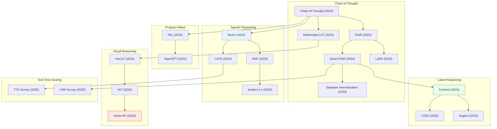

# Reasoning & Planning

> [!abstract] Overview
> AI reasoning has evolved from explicit chain-of-thought prompting to learned internal reasoning (Quiet-STaR), tool-augmented planning (ReAct, LATS), and RL-trained visual reasoning (R1-style models). This note covers the key paradigms and their progression across seven major threads: classic CoT, multimodal CoT, latent/implicit reasoning, agentic planning, program-aided reasoning, visual reasoning, and test-time scaling.

## Evolution Graph

The field evolved through six phases: **explicit CoT prompting** (2022) where chain-of-thought and STaR established step-by-step reasoning; **agentic reasoning** (2022-2023) where ReAct, RAP, and LATS added environment interaction and tree search; **program-aided reasoning** (2022-2023) where PAL and ViperGPT delegated computation to code; **latent reasoning** (2024-2025) where Coconut, CODI, and Huginn moved reasoning into continuous latent space; **visual reasoning** (2024-2025) where VisCoT, VoT, and Vision-R1 grounded CoT in visual perception; and **test-time scaling** (2025) where surveys codified how to allocate more compute at inference for better answers.

| Year | Paper | Contribution |
|------|-------|-------------|
| 2022 | Wei et al. (2022) | Introduced chain-of-thought prompting; showed step-by-step reasoning dramatically improves LLM problem-solving |
| 2022 | [[2203.14465\|STaR]] | Self-taught reasoner bootstrapping its own rationales iteratively; created a flywheel for reasoning improvement |
| 2022 | [[2210.03629\|ReAct]] | Synergized reasoning and acting in a think-act-observe loop; launched the LLM agent paradigm |
| 2022 | [[2211.10435\|PAL]] | Program-aided Language Models offloading computation to a Python interpreter; separated reasoning from calculation |
| 2023 | [[2302.00923\|Multimodal-CoT]] | Chain-of-thought with vision for sub-1B models; mitigated hallucinated rationales via two-stage reasoning |
| 2023 | [[2305.14992\|RAP]] | Treated the LLM as its own world model for lookahead planning within the reasoning-acting framework |
| 2023 | [[2310.04406\|LATS]] | Language Agent Tree Search unifying reasoning, acting, and planning through MCTS over action spaces |
| 2023 | [[2303.08128\|ViperGPT]] | LLM generates Python programs orchestrating vision modules; composable zero-shot visual reasoning |
| 2023 | [[2312.04684\|LaRS]] | Latent reasoning skills for chain-of-thought; learned implicit skill representations to guide reasoning |
| 2024 | [[2403.09629\|Quiet-STaR]] | Extended STaR to think before every token via internal rationales; generalized self-training to token level |
| 2024 | [[2405.14838\|Stepwise Internalization]] | Progressively internalized explicit CoT into implicit reasoning step by step |
| 2024 | [[2407.14414\|System-1.x]] | Balanced fast and slow planning with learned planner routing; adaptive depth of reasoning |
| 2024 | [[2412.06769\|Coconut]] | Trained LLMs to reason in continuous latent space instead of text tokens; eliminated verbalization overhead |
| 2024 | [[2403.16999\|VisCoT]] | Visual chain-of-thought dataset and benchmark; grounded multi-step reasoning in image regions |
| 2024 | [[2404.03622\|VoT]] | Visualization-of-Thought eliciting spatial reasoning in LLMs via mental imagery |
| 2025 | [[2502.21074\|CODI]] | Compressed chain-of-thought into continuous space via self-distillation; efficient implicit reasoning |
| 2025 | [[2502.05171\|Huginn]] | Scaled test-time compute with latent reasoning via recurrent depth; thinking without text tokens |
| 2025 | [[2503.06749\|Vision-R1]] | RL-based incentivization of visual reasoning in MLLMs; extended R1-style training to vision |
| 2025 | [[2503.24235\|Test-Time Scaling Survey]] | Comprehensive survey on what, how, where, and how well test-time scaling works for LLMs |
| 2025 | [[2501.09686\|Large Reasoning Models Survey]] | First systematic survey of RL-based reasoning in LLMs; maps the post-DeepSeek-R1 landscape |

---

## 1. Classic Chain-of-Thought Reasoning

The foundational paradigm: prompting LLMs to produce step-by-step reasoning before answering, then evolving from few-shot to zero-shot and self-bootstrapped variants.

**Few-Shot & Zero-Shot CoT** — The original prompting techniques that unlocked multi-step reasoning in LLMs by providing exemplar chains or simple instructions like "let's think step by step."
- [[2606.03784|ERVLA]], [[2605.29198|GCPO]], [[2605.28421|DenoiseRL]], [[2605.21467|DelTA]], [[2605.16787|RLVR Unlearnability]], [[2605.07396|ROPD]], [[2605.06234|RobotEQ]], [[2603.07079|EOPD]], [[2506.14641\|Zero-shot vs Few-shot CoT]], [[2505.24189\|SLM vs LLM Low-Code Workflows]], [[2505.16854\|TON]], [[2505.01812\|New News]], [[2503.16188\|Think or Not Think]], [[2501.19393\|s1]], [[2411.14405\|Marco-o1]]

> [!star] Key Papers
> - [[2501.19393\|s1]] — Stanford/UW open-source 32B model achieves SOTA reasoning by training on just 1,000 curated examples with budget forcing
> - [[2506.14641\|Zero-shot vs Few-shot CoT]] — Demonstrates that for recent powerful LLMs, zero-shot CoT often outperforms few-shot, challenging the canonical prompting wisdom

**Self-Taught & Bootstrapped Reasoning** — LLMs that iteratively improve their own rationales through self-training loops, learning to reason without human-written chains.
- [[2605.22816|AwareVLN]], [[2605.21931|EvoVid]], [[2605.20914|RISE (Self-Evolving VLM)]], [[2605.14539|CIPO]], [[2605.11609|AntiSD]], [[2604.20209\|SGS]], [[2604.17654\|Poly-EPO]], [[2604.06628\|Reasoning SFT Analysis]], [[2604.03993\|Noisy Supervision Reasoning]], [[2604.03128\|Self-Distilled RLVR]], [[2604.03098\|Self-Guide]], [[2603.24422\|OneSearch-V2]], [[2602.20574|GATES]], [[2602.03143\|SAGE]], [[2601.21725\|Procedural Pretraining]], [[2601.21343\|Self-Improving Pretraining]], [[2512.03442\|PretrainZero]], [[2508.03682\|SQLM]], [[2507.23751\|CoT-Self-Instruct]], [[2505.11614\|RL for Human Decision Explanation]], [[2504.14945\|LUFFY]], [[2504.11343\|RAFT++]], [[2503.03746\|Process-based Self-Rewarding]], [[2502.03387\|LIMO]], [[2405.14838\|Stepwise Internalization]], [[2403.09629\|Quiet-STaR]], [[2401.08190\|MARIO]], [[2312.04684\|LaRS]], [[2203.14465\|STaR]]

> [!star] Key Papers
> - [[2203.14465\|STaR]] — Self-taught reasoner: LLM bootstraps its own rationales iteratively, creating a flywheel for reasoning improvement
> - [[2403.09629\|Quiet-STaR]] — Learns to think before every token via internal rationales, generalizing STaR to the token level
> - [[2405.14838\|Stepwise Internalization]] — Progressively internalizes explicit CoT into implicit reasoning, step by step

**Math & Logical Reasoning** — Specialized reasoning chains for mathematical problem-solving, symbolic logic, and structured deduction.
- [[2605.02073\|Search-Driven Reward RL]], [[2603.18886\|PrincipiaBench]], [[2512.24119\|GeoBench]], [[2507.00432\|Math Reasoning Transferability]], [[2506.21215\|G2-Reasoner]], [[2506.07751\|AbstRaL]], [[2506.02126\|Knowledge vs Reasoning LLM Eval]], [[2505.15134\|Entropy Minimization LLM Reasoning]], [[2505.10557\|MathCoder-VL]], [[2505.07956\|LLM-LEx]], [[2504.21801\|DeepSeek-Prover-V2]], [[2406.09308\|TransNAR]]

> [!star] Key Papers
> - [[2406.09308\|TransNAR]] — Google DeepMind integrates Transformers with GNN-based neural algorithmic reasoners for compositional generalization
> - [[2512.24119\|GeoBench]] — Hierarchical benchmark with formally verified synthetic data for diagnosing geometry reasoning

**Self-Consistency & Verification** — Methods that improve reasoning reliability through multiple sampling, reward-guided search, and process verification.
- [[2604.22074\|CIR/SR Reasoning]], [[2604.20733\|NPO]], [[2604.02288\|SRPO]], [[2603.30036\|CoT Monitorability]], [[2603.23355\|ReVal]], [[2511.10648\|SCS]], [[2511.09158\|CRM]], [[2510.23596\|BR-RM]], [[2510.17472\|Certified Self-Consistency]], [[2510.14901\|Power Sampling]], [[2509.23250\|VL-PRM]], [[2508.15260\|DeepConf]], [[2506.14245\|CoT-Pass@K]], [[2506.09026\|e3]], [[2506.03295\|CFT]], [[2505.23585\|OPO]], [[2505.21493\|VeriFree]], [[2505.14674\|RRM]], [[2505.03318\|UNIFIEDREWARD-THINK]], [[2505.02387\|RM-R1]], [[2504.20595\|ReasonIR]], [[2504.16828\|THINKPRM]], [[2503.04412\|AB-MCTS]], [[2502.06233\|CISC]], [[2501.05366\|Search-o1]], [[2501.01478\|MCTS Process Supervision]], [[2412.18319\|Mulberry]], [[2412.14835\|AR-MCTS]]

> [!star] Key Papers
> - [[2412.14835\|AR-MCTS]] — Active reward-guided MCTS enhances multi-step multimodal reasoning without additional training
> - [[2509.23250\|VL-PRM]] — Vision-language process reward models trained via hybrid data synthesis for step-level verification

**Long CoT & Efficient Reasoning** — Addressing the length problem: surveys and methods for managing very long chains, reducing overthinking, and allocating reasoning compute adaptively.
- [[2605.29438|ElegantVLA]], [[2605.12227|dGRPO]], [[2605.11739|EffOPD]], [[2604.21764\|TRS]], [[2604.05355\|ETR]], [[2602.09276|Reasoning-ID]], [[2511.17487\|EXTRACT+THINK]], [[2511.08577\|TaH]], [[2508.02120\|Efficient R1-style Reasoning Survey]], [[2507.09662\|Concise Adaptive Thinking Survey]], [[2505.16579\|D2R]], [[2505.15612\|LASER]], [[2505.13975\|DRP]], [[2505.13438\|AnytimeReasoner]], [[2505.11896\|AdaCoT]], [[2505.10425\|L2T]], [[2505.00147\|AdaptMI]], [[2504.10903\|Efficient Reasoning Models Survey]], [[2503.23077\|LRM Efficient Inference Survey]], [[2503.21614\|Efficient Reasoning Survey]], [[2503.18866\|BoLT]], [[2503.16419\|Stop Overthinking Survey]], [[2503.09567\|Long CoT Survey]], [[2412.09413\|STILL-2]]

> [!star] Key Papers
> - [[2503.09567\|Long CoT Survey]] — First systematic survey of long chain-of-thought reasoning, covering generation, optimization, and evaluation
> - [[2503.16419\|Stop Overthinking Survey]] — Structured survey on efficient reasoning that maps waste-reduction techniques
> - [[2511.08577\|TaH]] — Think-at-Hard framework selectively activates deep reasoning only at genuinely difficult steps

**Surveys & Taxonomies** — Comprehensive surveys mapping the CoT landscape, benchmarking, and evaluation methodologies.
- [[2603.28545|ManipArena]]

> [!star] Key Papers
> - [[2503.12605\|MCoT Survey]] — First comprehensive survey of multimodal chain-of-thought, analyzing evolution from text-only to vision-language CoT
> - [[2507.06203\|Latent Reasoning Survey]] — Comprehensive multi-institutional survey examining latent reasoning in LLMs across all major approaches

> [!tip] The CoT Paradox
> Classic CoT unlocked reasoning but at a cost: longer chains do not always mean better answers and can introduce "overthinking." The field is now splitting into two directions — latent/implicit reasoning that removes the chain entirely, and efficient reasoning that keeps the chain but prunes it adaptively.

---

## 2. Multimodal & Visual Chain-of-Thought

Extending CoT to jointly reason over vision and language, producing interleaved textual and visual reasoning traces.

**Multimodal CoT Frameworks** — Core methods that enable vision-language models to generate step-by-step reasoning combining text and image understanding.
- [[2410.01345|GemBench]], [[1812.01717|FVD]]

> [!star] Key Papers
> - [[2302.00923\|Multimodal-CoT]] — Extended CoT to vision + language jointly; foundational work for multimodal reasoning chains
> - [[2411.10440\|LLaVA-CoT]] — VLM with structured four-stage reasoning (summary, caption, reasoning, conclusion) that outperforms larger models
> - [[2411.11930\|AtomThink]] — Self-structured CoT annotations for MLLMs using atomic step decomposition

**Visual CoT & Visualization-of-Thought** — Methods that produce visual reasoning artifacts (sketches, attention maps, spatial visualizations) as intermediate steps.
- [[2511.02779\|MIRA]], [[2507.11932\|Hyperphantasia]], [[2507.09876\|ViTCoT]], [[2506.03596\|ControlThinker]], [[2505.15879\|GRIT]], [[2505.15510\|Visual Thoughts]], [[2503.16434\|Interactive Sketchpad]], [[2501.10074\|SpatialCoT]], [[2501.07542\|MVoT]], [[2411.19488\|ICoT]], [[2406.09403\|VisualSketchPad]], [[2405.13872\|IoT]], [[2404.03622\|VoT]], [[2403.16999\|VisCoT]]

> [!star] Key Papers
> - [[2404.03622\|VoT]] — Visualization-of-Thought prompting: spatial reasoning via mental imagery in LLMs
> - [[2406.09403\|VisualSketchPad]] — Equips multimodal LMs with intermediate visual sketch generation for reasoning
> - [[2501.07542\|MVoT]] — Multimodal VoT enables MLLMs to generate interleaved visual reasoning traces

**Interleaved Vision-Text Reasoning** — Architectures that alternate between visual perception and textual reasoning within a single forward pass.
- [[2604.02097\|LatentUM]], [[2603.29165\|LatentPilot]], [[2603.27967\|XVR]], [[2603.16870\|Video Reasoning Chain-of-Steps]], [[2602.04413\|H-GIVR]], [[2602.02453\|TwC]], [[2601.21037\|Thinking in Frames]], [[2601.19686\|Video-KTR]], [[2601.02771\|AbductiveMLLM]], [[2601.02422\|CoCoT]], [[2511.19418\|COVT]], [[2511.19261\|LAST]], [[2511.15703\|VLSR]], [[2511.11113\|VIDEOP2R]], [[2506.03525\|VIDEO-SKOT]], [[2506.00318\|CoF]], [[2505.23766\|Argus]], [[2505.20753\|Griffon-R]], [[2505.18842\|v1]], [[2505.15809\|MMaDA]], [[2505.12434\|VIDEORFT]], [[2504.20199\|FCVC]], [[2412.03548\|AURORA]], [[2411.12591\|VIC]]

> [!star] Key Papers
> - [[2411.12591\|VIC]] — Visual Inference Chain: a "thinking before looking" paradigm for MLLMs
> - [[2412.03548\|AURORA]] — Introduces perception tokens to enable efficient interleaved visual-textual reasoning
> - [[2505.18842\|v1]] — MLLM that natively produces interleaved multimodal chain-of-thought reasoning

**Grounded & Region-Aware CoT** — CoT methods that ground reasoning in specific image regions, bounding boxes, or spatial features.
- [[2604.21396\|VG-CoT]], [[2604.03016\|Agentic-MME]], [[2604.02812\|Neuro-Symbolic Robot Policies]], [[2603.22815\|PinPoint]], [[2603.17729\|SARE]], [[2602.02004\|ClueTracer]], [[2601.21634\|RSGround-R1]], [[2512.24297\|FIGR]], [[2512.15160\|EagleVision]], [[2507.00748\|Multi-Image Grounding RL]], [[2506.11991\|VGR]], [[2506.09965\|VILASR]], [[2506.07235\|VTS-V]], [[2506.04277\|RSVP]], [[2505.14362\|DeepEyes]], [[2505.14231\|UniVG-R1]], [[2503.12799\|GCoT]], [[2503.06520\|Seg-Zero]], [[2501.05452\|ReFocus]], [[2411.16044\|ZoomEye]], [[2410.16400\|VipAct]], [[2403.12966\|CoS]], [[2403.12488\|DetToolChain]], [[2402.04236\|CogCoM]]

> [!star] Key Papers
> - [[2403.12966\|CoS]] — Chain-of-Spot: interactive reasoning that attends to relevant image regions at each step
> - [[2503.12799\|GCoT]] — Grounded CoT integrates explicit visual grounding with chain-of-thought for interpretable reasoning

**Visual Perception-Reasoning Analysis** — Studies dissecting the relationship between perception and reasoning in VLMs.
- [[2604.02190\|UniDriveVLA]], [[2603.22179\|MARCUS]], [[2601.13562\|Reasoning as Modality]], [[2509.25373\|VLM Perception-Cognition Survey]], [[2506.07936\|MM-ICL Mimicking vs Reasoning]], [[2505.14970\|SEC]], [[2504.18397\|UV-CoT]], [[2502.16707\|ReflectVLM]], [[2501.13620\|VLM Perception-Reasoning Probe]], [[2407.19666\|Two-Stage Visual Reasoning]], [[2406.19934\|VIREO]], [[2312.14135\|V*]], [[2301.05226\|IPVR]]

> [!star] Key Papers
> - [[2501.13620\|VLM Perception-Reasoning Probe]] — Cognitively-inspired framework revealing how perception failures cascade into reasoning failures in VLMs
> - [[2312.14135\|V*]] — LLM-guided visual search that addresses the visual information bottleneck in MLLMs

> [!tip] The Multimodal CoT Frontier
> The progression from text-only CoT to multimodal CoT reveals a key insight: vision and language are complementary reasoning modalities. Models that interleave visual tokens (sketches, attention crops, region highlights) with textual reasoning consistently outperform text-only chains on spatial and compositional tasks.

---

## 3. Latent & Implicit Reasoning

Moving reasoning from explicit token chains into continuous latent spaces, enabling models to "think" without generating human-readable text.

**Continuous Latent Reasoning** — Models that perform reasoning in a continuous embedding space rather than discrete token sequences.
- [[2605.12466|Attractor Models]], [[2605.02735|Silenced Visual Latents]], [[2604.22709|Abstract-CoT]], [[2604.18486\|OneVL]], [[2602.05359\|HIVE]], [[2601.10129\|LaViT]], [[2601.09708|Fast-ThinkAct]], [[2601.06803\|Laser]], [[2601.05877\|iReasoner]], [[2512.21218\|LIVR]], [[2512.16584\|SkiLa]], [[2510.23925\|LaCoT]], [[2510.12603\|IVT-LR]], [[2509.24251\|LVR]], [[2505.13308\|LATENTSEEK]], [[2505.12514\|COCONUT]], [[2505.11484\|SoftCoT++]], [[2502.21074\|CODI]], [[2502.03275\|Token Assorted]], [[2412.13171\|CCoT]], [[2412.06769\|Coconut]]

> [!star] Key Papers
> - [[2412.06769\|Coconut]] — Meta FAIR's Chain of Continuous Thought: LLM reasons in continuous latent space, outperforming token-based CoT on multi-step problems
> - [[2505.12514\|COCONUT]] — Theoretical proof that continuous-thought enables LLMs to solve problems intractable for discrete CoT
> - [[2505.11484\|SoftCoT++]] — First framework for scalable test-time reasoning in continuous latent space with speculative decoding

**Depth-Recurrent & Looped Architectures** — Models that increase reasoning depth through weight-sharing loops or recurrence, decoupling compute from parameter count.
- [[2604.11791\|Looped Reasoning Mechanistic Analysis]], [[2604.07822\|Recurrent-Depth Reasoning]], [[2602.07845|RD-VLA]], [[2602.02156\|LoopViT]], [[2510.25741\|Ouro]], [[2510.04871\|TRM]], [[2510.00219\|Thoughtbubbles]], [[2507.02199\|Huginn Latent CoT]], [[2505.05522\|CTM]], [[2502.17416\|Looped Transformers]], [[2502.05171\|Huginn]]

> [!star] Key Papers
> - [[2502.05171\|Huginn]] — Depth-recurrent Transformer that matches larger models through adaptive compute via loop iterations
> - [[2502.17416\|Looped Transformers]] — Google Research shows parameter-efficient looped architectures can match or exceed standard deep Transformers
> - [[2510.25741\|Ouro]] — Looped Language Models with iterative computation embedded directly in pre-training
> - [[2604.11791\|Looped Reasoning Mechanistic Analysis]] — Reveals that looped models spontaneously organize into cyclic fixed points + feedforward-style "stages of inference"; grounds looped design choices empirically

**Implicit Reasoning Mechanics** — Understanding how Transformers internalize and execute reasoning without explicit chains.
- [[2601.10679\|Augmented HRM]], [[2510.09312\|CRV]], [[2510.05069\|SwiReasoning]], [[2509.14252\|LLM-JEPA]], [[2506.08552\|Latent Reasoning Refinement]], [[2505.23653\|Transformer Implicit Reasoning Mechanics]]

> [!star] Key Papers
> - [[2505.23653\|Transformer Implicit Reasoning Mechanics]] — Reveals how Transformers acquire implicit multi-step reasoning through compression of explicit chains
> - [[2510.09312\|CRV]] — Circuit-based Reasoning Verification interprets internal reasoning circuits in LLMs

**Hierarchical & Mixture-of-Experts Reasoning** — Architectures that decompose reasoning into hierarchical levels or route through specialized expert modules.
- [[2601.10825\|Societies of Thought]], [[2507.02092\|EBT]], [[2506.23120\|R2S]], [[2506.21734\|HRM]], [[2506.18945\|Chain-of-Experts]], [[2506.15211\|ProtoReasoning]], [[2506.13331\|MICRO]]

> [!star] Key Papers
> - [[2506.21734\|HRM]] — Hierarchical Reasoning Model structures multi-step reasoning into decomposable hierarchical levels
> - [[2506.13331\|MICRO]] — Mixture of Cognitive Reasoners: modular LLM architecture with specialized reasoning heads

> [!tip] Latent Reasoning vs Explicit CoT
> Latent reasoning removes the token-generation bottleneck: Coconut and Huginn show that "thinking" in embedding space can be faster and more powerful than text-based CoT. The trade-off is interpretability -- latent thoughts cannot be inspected. The emerging compromise (SwiReasoning, SoftCoT++) dynamically switches between latent and explicit modes.

---

## 4. Agentic Reasoning & Planning

LLMs as agents that interleave reasoning with actions -- the bridge to embodied AI. These methods combine deliberation with environment interaction.

**ReAct & Interleaved Reasoning-Acting** — The foundational paradigm of synergizing reasoning and acting in LLMs through think-act-observe loops.
- [[2605.25813|EQA-Decision]], [[2605.22138|SR2AM]], [[2605.15188\|FutureSim]], [[2605.13119\|VLAs-as-Tools]], [[2605.06614\|SkillOS]], [[2602.22010\|WoG]], [[2602.20133\|AdaEvolve]], [[2602.13949\|ERL]], [[2601.12538\|Agentic Reasoning Survey]], [[2601.09295\|MACRO-LLM]], [[2512.23167\|SPIRAL]], [[2510.22832\|HRM-Agent]], [[2508.07976\|ASearcher]], [[2508.03923\|CoAct-1]], [[2507.16815\|ThinkAct]], [[2507.12846|Mind Palace]], [[2507.08664\|INoT]], [[2507.05707\|Agentic-R1]], [[2507.01701\|LbMAS]], [[2506.12508\|AgentOrchestra]], [[2505.16938\|InternAgent]], [[2505.13948|Memory-Centric EQA]], [[2504.21776\|WebThinker]], [[2504.14920\|DyFo]], [[2504.09130\|VisuoThink]], [[2503.19263\|DWIM]], [[2410.08328\|Talker-Reasoner]], [[2305.14992\|RAP]], [[2210.03629\|ReAct]], [[2201.07207\|LLM Zero-Shot Planners]]

> [!star] Key Papers
> - [[2210.03629\|ReAct]] — Synergizing reasoning and acting: think, act, observe, think -- the foundation of all agentic reasoning
> - [[2305.14992\|RAP]] — Reasoning as planning: treats the LLM itself as a world model for lookahead search

**Tree Search & MCTS for Reasoning** — Structured search methods that explore reasoning paths as trees, combining breadth and depth.
- [[2605.06840|Myopic Planning]], [[2407.05530|This&That]]

> [!star] Key Papers
> - [[2310.04406\|LATS]] — Language Agent Tree Search: unifies reasoning, acting, and planning via MCTS
> - [[2407.14414\|System-1.x]] — Balances fast System-1 and slow System-2 reasoning adaptively

**World Models for Reasoning** — Learning predictive models of the environment to support planning and decision-making.
- [[2605.28293|ProRL (Recommendation)]], [[2605.19957|WEM]], [[2605.15153|Pelican-Unified]], [[2605.12090|WAM Survey]], [[2605.09131|MCP-Cosmos]], [[2605.08732|GC-IDM]], [[2605.03413|NEO Theorizer]], [[2605.01772|Anticipation-VLA]], [[2602.05842|RWML]], [[2512.23541|Act2Goal]], [[2511.19684|IndEgo]], [[2506.22007|RoboEnvision]], [[2506.06199|3DFlowAction]], [[2502.05086|REASSEMBLE]], [[2502.01784|VILP]], [[2412.18194|VLABench]], [[2406.13301|ARDuP]], [[2403.13358|QUARD-Auto]], [[2403.09227|BEHAVIOR-1K]], [[2403.04253|R2I]], [[2309.15278|Out of Sight Still in Mind]], [[2210.06407|Language-Table]], [[1910.11956|Franka Kitchen]]

> [!star] Key Papers
> - [[2411.04983\|DINO-WM]] — Task-agnostic world model leveraging frozen DINOv2 for visual planning
> - [[2507.19468\|DINO-world]] — Efficient generalist video world model from Meta FAIR using frozen DINOv2 encoder

**Multi-Agent & Theory of Mind** — Systems where multiple reasoning agents collaborate, and models that reason about other agents' beliefs.
- [[2604.24881|Latent Agents]], [[2603.00142\|ToM Multi-Agent Eval]], [[2602.20687\|NativeEmbodied]], [[2602.08236\|AVIC]], [[2602.08234\|SkillRL]], [[2507.07969\|Q-chunking]], [[2505.22954\|DGM]]

> [!star] Key Papers
> - [[2603.00142\|ToM Multi-Agent Eval]] — Evaluation of multi-agent systems augmented with Theory of Mind, verified by symbolic logic

**Symbolic & PDDL-Based Planning** — Formal planning approaches using symbolic representations and planning domain definition languages.
- [[2606.03385|GTP-FA]], [[2606.03296|SC-Diff Planning]], [[2606.02745|SeeTraceAct]], [[2605.29563|ViewSuite]], [[2605.21061|Driving VLA IK]], [[2605.09387\|NEXUS]], [[2601.11322\|VLM Logic Situational Awareness]], [[2511.10279\|PROPA]], [[2511.04357|GraSP-VLA]], [[2509.14760\|ALIGN3]], [[2509.13351\|PDDL-INSTRUCT]], [[2508.01415|RoboMemory]], [[2409.00215|Intent-Aware Co-Manipulation]], [[2402.15487|RoboEXP]], [[2311.12244|muLV-Rep]], [[2311.11893|CBP]], [[2305.06341|GGCS]], [[2209.07753|Code as Policies]]

> [!star] Key Papers
> - [[2509.13351\|PDDL-INSTRUCT]] — Instruction tuning framework that enhances LLMs' symbolic planning with PDDL

**Navigation & Embodied Spatial Agents** — Spatial reasoning for navigation and embodiment.
- [[2606.03374|eMEM]], [[2605.12689\|3D RL-DWA]], [[2604.11135|AIM]], [[2601.21998\|LingBot-VA]], [[2509.25852\|REVER]], [[2506.17629\|CLiViS]], [[2412.10439\|CogNav]], [[2410.02742\|GLIMO]], [[2409.01652\|ReKep]], [[2407.08693|ECoT]], [[2403.09631\|3D-VLA]], [[2403.08321\|ManiGaussian]], [[2401.05946\|TDB]], [[2311.00530\|LLM Embodied Navigation Survey]], [[2309.15129\|CogEval]]

**3D & Geometric Agent Reasoning** — Agent spatial reasoning grounded in 3D/geometry.
- [[2603.00905\|pySpatial]], [[2506.03642\|SpatialMind]]

**Planning & Spatial Reasoning Methods** — Planning-centric spatial reasoning for agents.
- [[2604.11751|GWM-MPC]], [[2603.08403\|SPIRAL]], [[2603.02511\|Unveiler]], [[2603.02203\|T3RL]], [[2602.23320\|ParamMem]], [[2602.21158\|SELAUR]], [[2602.20739\|PyVision-RL]], [[2602.18374\|ZS-IP]], [[2602.14697\|E-SPL]], [[2602.09463\|SpotAgent]], [[2602.04837\|GEA]], [[2602.02488\|RLAnything]], [[2602.00475\|GRASP]], [[2601.21598\|ATP-Latent]], [[2601.16973\|VisGym]], [[2601.11404\|ACoT-VLA]], [[2512.20605\|Internal RL]], [[2511.16043\|Agent0]], [[2510.22512\|TRL]], [[2509.22643\|VLA-Reasoner]], [[2506.22992\|MARBLE]], [[2505.17685\|FSDrive]], [[2505.13138\|NESYDMS]], [[2505.11409\|VPRL]], [[2505.10468\|AI Agents vs Agentic AI]], [[2505.03181\|AFSFT]], [[2505.01441\|ARTIST]], [[2504.20073\|RAGEN]], [[2504.15369\|Inverse Probabilistic Adaptation]], [[2504.01990\|Foundation Agents Survey]], [[2502.14819\|PLDM]], [[2502.13130\|Magma]], [[2502.02133\|MPC-RL Survey]], [[2412.13810\|CAD-Assistant]], [[2412.05265\|RL Overview]], [[2411.14251\|NLRL]], [[2406.06592\|OmegaPRM]], [[2406.03816\|ReST-MCTS*]], [[2310.10625\|VLP]], [[2302.01877\|AdaptDiffuser]], [[2302.00111\|UniPi]], [[2206.02072\|VSRL]], [[2205.09991\|Diffuser]], [[1912.01603\|Dreamer]], [[1911.10601\|Scaling Active Inference]]

> [!star] Key Papers
> - [[2603.00905\|pySpatial]] — Equips MLLMs with explicit 3D spatial reasoning by generating Python programs for geometric computation
> - [[2506.22992\|MARBLE]] — Multi-step multimodal spatial reasoning benchmark from EPFL and ETH Zurich

> [!tip] From ReAct to World Models
> The progression is clear: ReAct showed LLMs can interleave thinking and acting; LATS added tree-structured search; RAP recognized the LLM itself is a world model. Now DINO-WM and seq-JEPA build proper learned world models, enabling agents to simulate outcomes before acting.

---

## 5. Program-Aided & Tool-Augmented Reasoning

Instead of reasoning in natural language alone, these methods generate executable code or invoke external tools to perform computation, visual analysis, and grounded reasoning.

**Code-as-Reasoning** — Generating Python programs to offload computation from the language model to an interpreter.
- [[2604.16004\|AgentV-RL]], [[2604.11805|Sim2Reason]], [[2512.12623\|DMLR]], [[2512.11061|VDAWorld]], [[2512.08511\|SubagentVL]], [[2507.00417\|ASTRO]], [[2505.20164\|VAT]], [[2505.19255\|VTool-R1]], [[2505.00024\|Nemotron-Research-Tool-N1]], [[2504.13958\|ToolRL]], [[2504.11536\|ReTool]], [[2311.05437\|LLaVA-Plus]], [[2303.08128\|ViperGPT]], [[2211.12588\|PoT]], [[2211.11559\|VISPROG]], [[2211.10435\|PAL]]

> [!star] Key Papers
> - [[2211.10435\|PAL]] — Program-aided language models: offload computation to a Python interpreter, separating reasoning from calculation
> - [[2303.08128\|ViperGPT]] — Compose vision modules via Python programs for visual reasoning without training
> - [[2211.11559\|VISPROG]] — Visual programming: compose vision-and-language modules into executable programs, training-free

**Training-Free Visual Reasoning Frameworks** — Methods that enhance VLM reasoning without additional training through structured prompting or modular composition.
- [[2602.02465\|MentisOculi]], [[2601.21187\|FRISM]], [[2601.14514\|JIT]], [[2601.05172\|CoV]], [[2509.23285|Tool-Light]], [[2506.19807|KnowRL]], [[2505.20289\|VisTA]], [[2505.20046\|REARANK]], [[2505.16151\|FRANK]]

> [!star] Key Papers
> - [[2505.16151\|FRANK]] — Training-free integration of reasoning and reflection capabilities into any VLM
> - [[2601.14514\|JIT]] — MIT/UBC "Just-in-Time" framework showing humans construct simplified mental models for reasoning

> [!tip] Code Beats Language for Computation
> PAL and PoT proved that language models should not do arithmetic -- they should write code that does arithmetic. ViperGPT extended this to vision: compose perception modules via programs. The pattern holds: whenever reasoning involves precise computation or systematic search, delegate to code.

---

## 6. Visual Reasoning (R1-Style & RL-Trained)

RL-trained visual reasoning -- applying the DeepSeek-R1 paradigm to multimodal models. See [[04_Reinforcement-Learning]] for the RL methods themselves.

**Video & Temporal Reasoning** — Visual reasoning over video and temporal dynamics.
- [[2605.21973|Foresee-to-Ground]], [[2602.20159\|VBVR]], [[2602.10675\|TwiFF]], [[2510.27363\|ToolScope]], [[2510.23569\|EgoThinker]], [[2510.23473\|Video-Thinker]], [[2508.18269\|FlowVLA]], [[2508.17692\|Agentic Reasoning Framework Survey]], [[2508.09736\|M3-Agent]], [[2508.04416\|VITAL]], [[2508.03100\|AVATAR]], [[2507.18342\|EgoExoBench]], [[2507.01949\|Kwai Keye-VL]], [[2505.19877|Vad-R1]], [[2505.19000\|VerIPO]], [[2504.08672\|Genius]], [[2503.21776\|Video-R1]]

**Spatial, 3D & Embodied Reasoning** — Reasoning grounded in space, 3D, and embodiment.
- [[2603.25629\|LanteRn]], [[2603.16253\|EVPV]], [[2603.03241\|UniG2U-Bench]], [[2601.04777\|GeM-VG]], [[2512.24125\|GenieReasoner]], [[2512.04563\|COOPER]], [[2509.25794|Point-It-Out]], [[2508.11737\|Ovis2.5]], [[2508.06259\|SIFThinker]], [[2507.20673\|GMPO]], [[2507.13362\|VLM Spatial Reasoning RL]], [[2507.10548\|EmbRACE-3K]], [[2507.08306\|M2-Reasoning]], [[2507.05920\|MGPO]], [[2507.01544\|MARVIS]], [[2506.22434\|MiCo]], [[2506.17218\|Mirage]], [[2506.14512\|SIRI-Bench]], [[2506.08011\|ViGaL]], [[2506.04633\|STARE]], [[2505.23678\|ViGoRL]], [[2505.23590\|Jigsaw-R1]], [[2505.22019\|VRAG-RL]], [[2505.19702\|Point-RFT]], [[2505.15804\|STAR-R1]], [[2505.05800\|3D-CAVLA]], [[2503.20752\|Reason-RFT]], [[2503.12797\|DeepPerception]], [[2503.09527\|CombatVLA]], [[2502.16435\|VISFACTOR]], [[2411.17673\|SketchAgent]], [[2307.03601\|GPT4RoI]], [[2306.15195\|Shikra]], [[2203.07669\|PE2E]]

**Agentic, GUI & Search Reasoning** — RL-trained reasoning for agents, GUIs, tools, and search.
- [[2601.19204\|MATA]], [[2601.13942\|GoG]], [[2601.09667\|MATTRL]], [[2601.07055\|Dr. Zero]], [[2601.03872\|ATLAS]], [[2512.24601\|RLMs]], [[2512.23167\|SPIRAL]], [[2512.17312\|CodeDance]], [[2512.15687\|G2RL]], [[2512.02472\|R-FEW]], [[2510.23595\|MAE]], [[2510.23038\|TIR-Judge]], [[2510.09733\|EVisRAG]], [[2509.25454\|DeepSearch]], [[2509.25140\|ReasoningBank]], [[2509.24726\|Socratic-Zero]], [[2509.15172\|MACA]], [[2509.09284\|Tree-OPO]], [[2509.07969\|Mini-o3]], [[2509.02479\|SimpleTIR]], [[2509.01656\|ReV PT]], [[2508.20722\|rStar2-Agent]], [[2508.14313\|AIRL-S]], [[2508.12109\|Simple o3]], [[2508.10874\|SSRL]], [[2508.02085\|SE-Agent]], [[2507.21848\|EDGE-GRPO]], [[2507.19849\|ARPO]], [[2507.19457\|GEPA]], [[2507.07998\|PyVision]], [[2507.06261\|Gemini 2.5]], [[2507.05255\|OVR]], [[2506.24119\|SPIRAL]], [[2506.13923\|Guide-GRPO]], [[2506.09033\|Router-R1]], [[2505.22954\|DGM]], [[2505.15436\|Adaptive-CoF]], [[2505.08617\|OpenThinkIMG]], [[2505.04588\|ZeroSearch]], [[2504.16129\|MARFT]], [[2504.07934\|ThinkLite-VL]], [[2504.04736\|SWiRL]], [[2503.23383\|ToRL]], [[2503.19470\|ReSearch]], [[2503.09516\|Search-R1]], [[2503.05592\|R1-Searcher]], [[2410.17517\|Maynard-Cross Learning]], [[2406.18505\|LLM-Xavier]], [[2403.12884\|HYDRA]], [[2303.04671\|Visual ChatGPT]]

**Math, Code & Science Reasoning** — Reasoning specialized for math, code, and science.
- [[2602.03806\|COBALT]], [[2507.14172\|SOAR]], [[2506.13284\|AceReason-Nemotron]], [[2505.10557\|MathCoder-VL]], [[2504.21233\|Phi-4-Mini-Reasoning]]

**Efficient & Long-Horizon Reasoning** — Token-efficient and long chain-of-thought reasoning.
- [[2603.22847\|PEPO]], [[2602.04145\|BIS]], [[2602.03120\|QES]], [[2512.23165\|PEFT for RLVR]], [[2512.06104\|CompressARC]], [[2511.19820\|CropVLM]], [[2511.06411\|SofT-GRPO]], [[2510.03222\|Lp-Reg]], [[2510.02752\|Self-Aware RL for LLMs]], [[2510.02245\|ExGRPO]], [[2509.25849\|Knapsack-GRPO]], [[2509.01321\|DEPO]], [[2508.17445\|TreePO]], [[2508.12587\|MCOUT]], [[2508.09726\|GFPO]], [[2507.13348\|VisionThink]], [[2507.12507\|Nemotron]], [[2506.15050\|T-PPO]], [[2506.13585\|MiniMax-M1]], [[2506.13351\|DRO]], [[2506.08388\|RLTs]], [[2506.05316\|DOTS]], [[2506.01939\|High-Entropy Token RLVR]], [[2505.17746\|Fast Quiet-STaR]], [[2505.15966\|Pixel Reasoner]], [[2505.07291\|INTELLECT-2]], [[2505.00949\|Llama-Nemotron]], [[2505.00703\|T2I-R1]], [[2504.21318\|Phi-4-reasoning]], [[2504.16084\|TTRL]], [[2504.15777\|Tina]], [[2504.13818\|PODS]], [[2504.05520\|ADARFT]], [[2504.05299\|SmolVLM]], [[2504.05118\|VAPO]], [[2504.02495\|DeepSeek-GRM]], [[2503.10460\|Light-R1]], [[2502.05234\|TURN]], [[2408.15240\|GenRM]]

**GRPO & Group-Relative Methods** — GRPO and group-relative policy optimization variants.
- [[2602.05547\|MT-GRPO]], [[2506.16141\|GRPO-CARE]], [[2505.22257\|Off-Policy GRPO]], [[2505.16673\|R1-ShareVL]], [[2503.14476\|DAPO]]

**Reward Modeling & Verification** — Reward models, verifiers, and process/verifiable rewards.
- [[2601.05242\|GDPO]], [[2512.22545\|SR-MCR]], [[2511.17473\|MR-RLVR]], [[2511.07317\|RLVE]], [[2510.15242\|DWRL]], [[2510.08696\|LENS]], [[2510.07242\|HERO]], [[2509.24981\|ROVER]], [[2508.14460\|DuPO]], [[2508.05629\|DFT]], [[2507.17746\|RaR]], [[2507.16806\|RLCR]], [[2506.18254\|RLPR]], [[2506.10947\|Spurious Rewards RLVR]], [[2506.07218\|Perception-R1]], [[2506.02096\|SynthRL]], [[2505.24726\|Reflect Retry Reward]], [[2505.19590\|INTUITOR]], [[2505.17018\|SophiaVL-R1]], [[2504.12328\|Reward Model Survey]], [[2503.20783\|Dr. GRPO]], [[2503.13551\|HRM]], [[2503.10291\|VisualPRM]], [[2410.12735\|CREAM]], [[2410.08146\|PAV]], [[2410.01735\|LASeR]]

**Exploration, Entropy & Training Stability** — Entropy, exploration, collapse, and RL training dynamics.
- [[2602.02150\|ECHO]], [[2510.18927\|BAPO]], [[2510.00855\|DyVA]], [[2509.25133\|SIREN]], [[2509.02333\|DCPO]], [[2508.13755\|DARS-Breadth]], [[2506.23061\|DyME]], [[2506.06499\|SPARQ]], [[2505.22617\|Entropy Collapse in RL]], [[2505.20561\|BARL]], [[2505.15660\|AGNOSTOS]], [[2504.10479\|InternVL3]], [[2504.07615\|VLM-R1]], [[2503.07365\|MM-Eureka]], [[2407.10490\|LLM Finetuning Dynamics]]

**Policy Optimization & RLVR Core** — Core RL-with-verifiable-reward and policy optimization methods.
- [[2605.22183|AVP]], [[2605.02881|MolmoAct2]], [[2605.02730|PFlowNet]], [[2604.08539|OpenVLThinkerV2]], [[2603.22570\|CanViT]], [[2603.22117\|RLVR Direction]], [[2603.18656\|SCALe-SFT]], [[2603.17305|Contrastive Reasoning Alignment]], [[2603.14117\|SIEVE]], [[2602.20980\|CrystaL]], [[2602.07605\|Fine-R1]], [[2602.04879\|DPPO]], [[2602.04118\|TinyLoRA]], [[2602.02710\|MaxRL]], [[2602.02605\|ESMA]], [[2602.01816\|VIA-Bench]], [[2602.01058\|PEAR]], [[2602.00170\|Blessing of Dimensionality LLM]], [[2601.20802\|SDPO]], [[2601.19897\|SDFT]], [[2601.18734\|OPSD]], [[2601.15224\|PROGRESSLM]], [[2601.10094\|V-Zero]], [[2601.09536\|Omni-R1]], [[2601.00215\|Sight to Insight]], [[2512.17636\|TRAPO]], [[2512.14693\|URM]], [[2512.13607\|Nemotron-Cascade]], [[2512.12690\|SFT vs RL VLM Study]], [[2511.17502\|RynnVLA-002]], [[2511.01191\|Self-Harmony]], [[2510.25992\|SRL]], [[2510.24684\|SPICE]], [[2510.09001\|DARO]], [[2510.08189\|R-Horizon]], [[2510.03259\|MASA]], [[2510.02263\|RLAD]], [[2510.01623|VLA-R1]], [[2510.01265\|RLP]], [[2509.26626\|RSA]], [[2509.22637\|Variational Reasoning]], [[2509.21128\|RL Squeezes SFT Expands]], [[2509.20357\|RLMT]], [[2509.15194\|EVOL-RL]], [[2509.12132\|Reflection-V]], [[2509.08827\|RL for LRM Survey]], [[2509.07980\|Parallel-R1]], [[2509.06870\|AggLM]], [[2509.03646\|HICRA]], [[2508.12790\|Rubicon]], [[2508.11630\|Thyme]], [[2508.08221\|Lite PPO]], [[2508.05004\|R-Zero]], [[2508.02298\|CAPO]], [[2508.02150\|Self-Supervised RL IF]], [[2507.22607\|VL-Cogito]], [[2507.20766\|RRVF]], [[2507.18391\|IBRO]], [[2507.16814\|SOPHIA]], [[2507.16518\|C2-Evo]], [[2507.10532\|RandomCalculation]], [[2507.09160\|Tactile-VLA]], [[2507.08838\|wd1]], [[2507.01679\|Prefix-RFT]], [[2507.01006\|GLM-4.5V]], [[2506.17219\|RLIF No Free Lunch]], [[2506.14965\|GURU]], [[2506.13056\|Metis-RISE]], [[2506.08989\|SwS]], [[2506.08007\|RPT]], [[2506.04207\|ReVisual-R1]], [[2506.03569\|MiMo-VL]], [[2505.24025\|DINO-R1]], [[2505.21444\|SRT]], [[2505.20686\|A*-PO]], [[2505.19094\|SATORI]], [[2505.18454\|HRPO]], [[2505.18129\|V-Triune]], [[2505.17508\|RPG]], [[2505.16192\|VLM-R3]], [[2505.15045\|DIFFEMBED]], [[2505.14683\|BAGEL]], [[2505.14677\|Visionary-R1]], [[2505.12081\|VisionReasoner]], [[2505.04921\|LMRM Survey]], [[2505.03981\|X-Reasoner]], [[2505.03335\|Absolute Zero]], [[2504.21277\|Reinforced MLLM Survey]], [[2504.20571\|1-shot RLVR]], [[2504.19599\|GVPO]], [[2504.16656\|Skywork R1V2]], [[2504.12216\|d1]], [[2504.11468\|VLAA-Thinker]], [[2504.08837\|VL-Rethinker]], [[2504.07491\|Kimi-VL]], [[2503.24290\|Open-Reasoner-Zero]], [[2503.22020\|CoT-VLA]], [[2503.17352\|OpenVLThinker]], [[2503.16219\|Open-RS]], [[2503.07523\|VisRL]], [[2503.06749\|Vision-R1]], [[2502.09992\|LLaDA]], [[2501.17161\|SFT Memorizes RL Generalizes]], [[2501.11223\|RLM Blueprint]], [[2412.01951\|Sharpening Mechanism]], [[2411.10442\|MPO]], [[2411.04109\|SCPO]], [[2410.18252\|Asynchronous RLHF]], [[2410.15639\|Self-Developing]], [[2410.01679\|VinePPO]], [[2309.05858\|Mesa-Optimization Transformers]], [[2306.13549\|MLLM Survey]], [[2205.10268\|B-cos Networks]]

> [!star] Key Papers
> - [[2503.06749\|Vision-R1]] — First R1-style RL training for VLMs, demonstrating visual reasoning improvement through reinforcement
> - [[2504.07615\|VLM-R1]] — Stable, generalizable R1 training for VLMs across diverse visual tasks
> - [[2603.14117\|SIEVE]] — Self-revisiting visual evidence via RL, +7.85% on V*Bench

**Synthetic Data & Training Pipelines for Visual CoT** — Methods for generating high-quality visual reasoning training data at scale.
- [[2507.00833|HumanoidGen]]

> [!star] Key Papers
> - [[2510.12225\|HoneyBee]] — Meta FAIR's systematic investigation into constructing high-quality visual CoT training data
> - [[2507.12508\|MindJourney]] — Enhances VLMs in spatial reasoning by enabling interactive exploration of visual spaces

> [!success] R1-Style Visual Reasoning Recipe
> ==SFT for format compliance== → ==GRPO with verifiable rewards== (code execution, math verification) → ==Synthetic CoT data at scale== (systematic data curation). The text RL recipe transfers directly to VLMs across visual grounding, spatial reasoning, and image generation tasks.

> [!tip] RL for Vision Reasoning
> The R1 paradigm applied to VLMs shows that RL can train visual reasoning just as effectively as it trains text reasoning. The key bottleneck has shifted from algorithms to data: methods like HoneyBee and Zebra-CoT focus on generating high-quality visual reasoning chains at scale.

---

## 7. Spatial Reasoning

Understanding and reasoning about spatial relationships, 3D geometry, and physical space -- a capability critical for embodied AI and robotics.

**3D & Metric Spatial Benchmarks** — Benchmarks for 3D/metric spatial reasoning.
- [[2605.29074|Embodied3DBench]], [[2605.27367|SpatialBench (SFM)]], [[2605.06758|R3L]], [[2603.16506\|VIEW2SPACE]], [[2601.15275\|RayRoPE]], [[2601.14339\|CityCube]], [[2601.13304\|CausalSpatial]], [[2601.11729\|SpaRRTa]], [[2601.00092\|Spatial4D-Bench]], [[2512.24385\|Spatial Intelligence Roadmap]], [[2512.23365\|SpatialMosaic]], [[2512.19683\|OpenBench]], [[2511.16160\|Video2Layout]], [[2510.18873\|DSI-Bench]], [[2510.11549\|ODI-Bench]], [[2507.21045\|4D Spatial Intelligence Survey]], [[2507.20174\|LRR-Bench]], [[2507.07781|SURPRISE3D]], [[2507.07610\|SpatialViz-Bench]], [[2506.07966\|SpaCE-10]], [[2505.17012\|SpatialScore]], [[2504.15280\|All-Angles Bench]], [[2504.01805\|SpaceR]], [[2503.22976|SPAR-7M]], [[2503.13111|MM-Spatial]], [[2502.11859\|VLM Spatial Abilities Benchmark]], [[2412.10908\|Do VLMs Understand 3D Shapes]], [[2412.07825\|3DSRBench]], [[2411.17735|3D-Mem]], [[2408.16662\|Space3D-Bench]]

**Embodied & Navigation Spatial Benchmarks** — Spatial benchmarks for embodied/navigation.
- [[2605.18746|ESI-Bench]], [[2603.18892\|MultihopSpatial]], [[2506.05997|SRU]], [[2504.09848\|LLM Spatial Intelligence Survey]], [[2012.03912|MultiON]]

**VLM Spatial Reasoning Benchmarks** — General VLM spatial-reasoning benchmarks.
- [[2606.04436|3DThinkVLA]], [[2606.03240|GeoAlign]], [[2605.30557|SpatialUncertain]], [[2605.22570|VGenST-Bench]], [[2605.22536|SpaceDG]], [[2605.22283|SOMA]], [[2605.09963|Spatial Prediction SP]], [[2603.03944\|SCP-Bench]], [[2602.20901\|SpatiaLQA]], [[2602.15950\|VLM Spatial Reasoning OCR]], [[2602.15918\|EarthSpatialBench]], [[2602.03916\|SpatiaLab]], [[2601.20354\|SpatialGenEval]], [[2601.19099\|m2sv]], [[2601.16520\|TangramPuzzle]], [[2601.06521\|BabyVision]], [[2512.20617\|SpatialTree]], [[2512.19526|QuantiPhy]], [[2512.10863\|MMSI-Video-Bench]], [[2511.21471\|SpatialBench]], [[2510.27606\|Spatial-SSRL]], [[2510.09606\|SpaceVista]], [[2508.13142\|EASI]], [[2508.02095\|VLM4D]], [[2505.23764\|MMSI-Bench]], [[2505.05456\|SITE]], [[2503.23765\|STI-Bench]], [[2503.19707\|VLM Spatial Reasoning Benchmark]], [[2410.17385\|COMFORT]], [[2406.14852\|SpatialEval]], [[2406.02537\|TopViewRS]], [[2205.00363\|VSR]]

> [!star] Key Papers
> - [[2505.17012\|SpatialScore]] — Comprehensive benchmark for spatial reasoning covering distances, directions, and layouts
> - [[2601.13304\|CausalSpatial]] — Diagnostic benchmark for causal spatial reasoning in MLLMs
> - [[2601.00092\|Spatial4D-Bench]] — Large-scale multi-task benchmark for 4D spatial reasoning

**3D & Geometric Spatial Reasoning** — Spatial reasoning grounded in 3D and geometry.
- [[2605.30561|VLM3]], [[2605.18162|SAGE (Spatial VLM)]], [[2604.14144\|SpatialEvo]], [[2603.27287\|Uni-World VLA]], [[2603.25411\|HiSpatial]], [[2603.23404\|TRACE]], [[2603.22057|SpatialBoost]], [[2603.19235\|VEGA-3D]], [[2603.19231\|MonoArt]], [[2603.15619\|MoDA]], [[2603.15386\|RieMind]], [[2603.15031\|AttnRes]], [[2603.03026\|URGT]], [[2602.15029\|Language Symmetry Representations]], [[2602.06037|GeoThinker]], [[2601.22231\|PE Spatial Reasoning Analysis]], [[2512.24331\|LVLDrive]], [[2511.06908\|Mono3DVG-EnSD]], [[2511.01618\|Actial]], [[2510.08673\|Puffin]], [[2506.04220\|Struct2D]], [[2505.23747\|Spatial-MLLM]], [[2505.21500\|MVSM]], [[2505.20802\|Leaner Transformers]], [[2505.20279\|VLM-3R]], [[2505.17015\|Multi-SpatialMLLM]], [[2505.12448\|SSR]], [[2505.11907\|OSR-Bench]], [[2505.00788|SpatialLLM]], [[2504.20024|SpatialReasoner]]

**Embodied & Navigation Spatial Reasoning** — Spatial reasoning for embodied agents and navigation.
- [[2604.03208\|HWM]], [[2604.02965\|SV-VLA]], [[2604.02829\|STRNet]], [[2604.02408\|F2F-AP]], [[2603.29090\|HCLSM]], [[2603.25887\|WR-Arena]], [[2512.13660\|RoboTracer]], [[2511.19221\|Percept-WAM]], [[2511.05491\|VST]], [[2505.21465\|ID-Align]], [[2504.12680\|Embodied-R]], [[2503.11089\|EmbodiedVSR]], [[2406.01584\|SpatialRGPT]], [[2401.12168\|SpatialVLM]]

**Spatial Reasoning Benchmarks & Probing** — Benchmarks and analyses probing spatial ability.
- [[2605.30161|Why Far Looks Up]], [[2604.07592\|FESTS]], [[2603.26499\|AIRA2]], [[2603.15975\|UMO]], [[2603.14609\|GroundSet]], [[2603.03857\|DeepScan]], [[2602.21619\|VSR Information Injection Analysis]], [[2602.11144\|GENIUS]], [[2602.03733\|RegionReasoner]], [[2511.20814\|SPHINX]], [[2511.18373\|MASS]], [[2507.01955\|GPT-4o Vision Evaluation]], [[2506.21458\|MINDCUBE]], [[2506.18385\|InternSpatial]], [[2506.06279\|CoMemo]], [[2506.03135\|OmniSpatial]], [[2506.02557\|KUEA]], [[2506.01663\|Zoom-Refine]], [[2505.21497\|PosterAgent]], [[2505.20444\|HoPE]], [[2505.07062\|Seed1.5-VL]], [[2505.05626\|PERCEPTLLM]], [[2504.20648\|SpaRE]], [[2503.19355\|ST-VLM]]

**VLM Spatial Reasoning Methods** — VLM-based spatial reasoning models and methods.
- [[2605.04128|JoyAI-Image]], [[2603.28116\|AutoDrive-P3]], [[2603.17541\|Temporal Trap Analysis]], [[2603.06693\|SER]], [[2603.00518\|Vision-TTT]], [[2602.11073\|VILAVT]], [[2602.01905\|STELLAR]], [[2512.22799\|VPTracker]], [[2512.15934\|IC-SSL]], [[2512.15885\|JARVIS]], [[2512.12633\|DiG]], [[2512.10554\|GETok]], [[2512.10359\|STAR]], [[2512.09322\|GPSSL]], [[2512.08889\|VALOR]], [[2512.07733\|SpatialDreamer]], [[2512.06281\|LaVer]], [[2511.21395\|Monet]], [[2507.14137\|Franca]], [[2507.12006\|FDAM]], [[2507.00505\|LLaVA-SP]], [[2506.23156\|Multi-Label Contrastive SSL]], [[2506.21656\|SpatialReasoner-R1]], [[2506.17202\|UniFork]], [[2506.15679\|Dense SAE Latents]], [[2506.15564\|Show-o2]], [[2506.13925\|HVL]], [[2506.11136\|JAFAR]], [[2506.07138\|STF]], [[2506.04209\|LIFT]], [[2506.02138\|PA-LRP]], [[2505.23769\|TextRegion]], [[2505.22195\|S2AFormer]], [[2505.19985\|Structured ViT Initialization]], [[2505.16993\|SeNaTra]], [[2505.16416\|Circle-RoPE]], [[2505.04601\|OpenVision]], [[2504.19475\|Prisma]], [[2503.20680\|VoRA]], [[2503.01773\|ADAPTVIS]]

> [!star] Key Papers
> - [[2401.12168\|SpatialVLM]] — Google DeepMind equips VLMs with quantitative spatial reasoning via large-scale spatial data
> - [[2406.01584\|SpatialRGPT]] — NVIDIA/UCSD enhance VLMs with grounded spatial reasoning through region-aware representations
> - [[2505.17015\|Multi-SpatialMLLM]] — Meta AI/CUHK create 1.2M multi-frame spatial instruction dataset for cross-view reasoning

**3D Visual Grounding & Scene Understanding** — Connecting language to 3D space through grounding, reconstruction, and scene-level reasoning.
- [[2605.05126|ConsisVLA-4D]], [[2501.04693|FuSe]]

> [!star] Key Papers
> - [[2504.05786\|3D Spatial Reasoning in LLM Survey]] — Comprehensive survey of methods for 3D spatial reasoning in LLMs
> - [[2510.16714\|SceneCOT]] — Step-by-step grounded CoT reasoning within 3D scenes
> - [[2511.21688\|G2VLM]] — Integrates 3D reconstruction and spatial reasoning within a single VLM

> [!tip] The Spatial Reasoning Gap
> Despite enormous progress, benchmarks consistently show VLMs struggle with quantitative spatial reasoning (distances, angles, relative positions). SpatialVLM and SpatialRGPT showed that the fix is data, not architecture: train on millions of spatial QA pairs grounded in 3D reconstructions. The frontier is dynamic 4D reasoning (Spatial4D-Bench, VLM4D).

---

## 8. Test-Time Scaling & Adaptive Compute

The emerging paradigm: spend more compute at inference time to improve reasoning, or learn when to skip reasoning entirely.

**Test-Time Scaling Methods** — Surveys and techniques for allocating additional compute at inference to boost reasoning quality.
- [[2605.19376|GRAM]], [[2605.09537|CAPS (Power Sampling)]], [[2604.16029\|STOP]], [[2604.10333\|ZWM]], [[2604.07725\|Squeeze Evolve]], [[2603.29557\|FlowPIE]], [[2603.00461\|ReMoT]], [[2602.01984\|Delimiter Token Scaling]], [[2601.22628\|TTCS]], [[2601.18795|Reuse FLOPs]], [[2601.18067\|EvolVE]], [[2601.16175\|TTT-Discover]], [[2504.13828\|Cognition Engineering]], [[2504.10449\|M1]], [[2503.24235\|Test-Time Scaling Survey]], [[2503.07572\|MRT]], [[2501.09686\|Large Reasoning Models Survey]]

> [!star] Key Papers
> - [[2503.24235\|Test-Time Scaling Survey]] — Comprehensive survey with unified four-axis taxonomy for TTS methods
> - [[2501.09686\|Large Reasoning Models Survey]] — Survey of RL-based reasoning; maps the post-DeepSeek-R1 landscape
> - [[2604.16029\|STOP]] — Super-Token path pruning for parallel reasoning; +6pp accuracy while cutting token consumption by >70%

**Adaptive Thinking & Selective Reasoning** — Models that learn when to engage deep reasoning versus when to respond quickly.
- [[2604.13016|OPD Distillation Study]], [[2604.11297|MEDS]], [[2604.08865|SPPO]], [[2604.08706|RL Experience Replay for LLMs]], [[2604.03023\|Behavior-Constrained RL]], [[2604.02035\|RL Speculative Trading]], [[2604.02021\|Discrete-Continuous Planning Bridge]], [[2604.01658\|CORAL]], [[2604.01434\|VOIMCP]], [[2604.00061\|R2X Multi-Robot MLLM Survey]], [[2603.30022\|Hybrid LLM-RL Manipulation]], [[2603.28204\|ERPO]], [[2603.19835\|FIPO]], [[2603.18336\|ManiDreams]], [[2602.06556\|LIBERO-X]], [[2602.01166\|LaRA-VLA]], [[2601.18631\|AdaReasoner]], [[2601.07060\|PALM]], [[2601.00969\|V-VLAPS]], [[2601.00561\|AEGIS]], [[2512.09929\|OWM]], [[2511.15613|Uncertainty-Guided Lookback]], [[2511.00758\|ATM]], [[2510.20607\|Compositional Energy Minimization]], [[2510.03827\|LIBERO-PRO]], [[2508.12211\|VLAPS]], [[2505.20258\|ARM]], [[2505.14631\|LHRM]], [[2505.13379\|Thinkless]], [[2504.18471\|AFM]], [[2501.10100\|RWM]], [[2410.21676\|Critical Batch Size Scaling]], [[2410.02355\|AlphaEdit]], [[2203.03485\|Self-directed Exploratory Planning]]

> [!star] Key Papers
> - [[2505.13379\|Thinkless]] — LLM learns when to think versus skip reasoning, saving compute without accuracy loss
> - [[2505.14631\|LHRM]] — Hybrid reasoning models that activate deep thinking only when needed

> [!tip] Think Only When Necessary
> Thinkless and LHRM represent an important insight: most queries do not need multi-step reasoning. The best systems learn a routing policy -- fast System-1 responses for easy inputs, deep System-2 reasoning for hard ones. This mirrors human cognition and dramatically reduces inference cost.

---

## Cross-References

- [[04_Reinforcement-Learning]] — RL methods that train reasoning models
- [[02_Vision-Language-Models]] — VLM foundations for visual reasoning
- [[07_Robotics-and-Embodied-AI]] — Reasoning applied to robot planning
- [[11_Self-Evolving-AI]] — Self-improvement through reasoning bootstrapping
- [[10_Agents-and-Tool-Use]] — Agentic systems built on reasoning

---

*Next: [[05_Computer-Vision-and-3D]] for the perception foundations.*