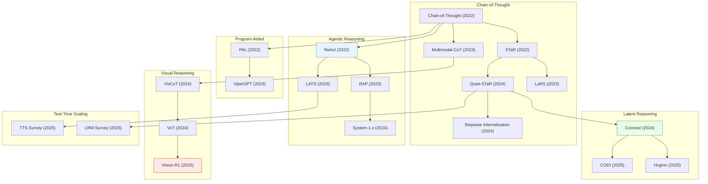

# Reasoning & Planning

> [!abstract] Overview
> AI reasoning has evolved from explicit chain-of-thought prompting to learned internal reasoning (Quiet-STaR), tool-augmented planning (ReAct, LATS), and RL-trained visual reasoning (R1-style models). This note covers the key paradigms and their progression across seven major threads: classic CoT, multimodal CoT, latent/implicit reasoning, agentic planning, program-aided reasoning, visual reasoning, and test-time scaling.

## Evolution Graph

| Node | Paper |
|------|-------|
| Chain-of-Thought | Wei et al. (2022) |
| Multimodal-CoT | [[2302.00923\|Multimodal-CoT]] |
| STaR | [[2203.14465\|STaR]] |
| Quiet-STaR | [[2403.09629\|Quiet-STaR]] |
| Stepwise Internalization | [[2405.14838\|Stepwise Internalization]] |
| LaRS | [[2312.04684\|LaRS]] |
| ReAct | [[2210.03629\|ReAct]] |
| LATS | [[2310.04406\|LATS]] |
| RAP | [[2305.14992\|RAP]] |
| System-1.x | [[2407.14414\|System-1.x]] |
| PAL | [[2211.10435\|PAL]] |
| ViperGPT | [[2303.08128\|ViperGPT]] |
| Coconut | [[2412.06769\|Coconut]] |
| CODI | [[2502.21074\|CODI]] |
| Huginn | [[2502.05171\|Huginn]] |
| VisCoT | [[2403.16999\|VisCoT]] |
| VoT | [[2404.03622\|VoT]] |
| Vision-R1 | [[2503.06749\|Vision-R1]] |
| TTS Survey | [[2503.24235\|Test-Time Scaling Survey]] |
| LRM Survey | [[2501.09686\|Large Reasoning Models Survey]] |

---

## 1. Classic Chain-of-Thought Reasoning

The foundational paradigm: prompting LLMs to produce step-by-step reasoning before answering, then evolving from few-shot to zero-shot and self-bootstrapped variants.

**Few-Shot & Zero-Shot CoT** — The original prompting techniques that unlocked multi-step reasoning in LLMs by providing exemplar chains or simple instructions like "let's think step by step."
- [[2506.14641\|Zero-shot vs Few-shot CoT]], [[2501.19393\|s1]], [[2505.01812\|New News]], [[2505.24189\|SLM vs LLM Low-Code Workflows]], [[2411.14405\|Marco-o1]]

> [!star] Key Papers
> - [[2501.19393\|s1]] — Stanford/UW open-source 32B model achieves SOTA reasoning by training on just 1,000 curated examples with budget forcing
> - [[2506.14641\|Zero-shot vs Few-shot CoT]] — Demonstrates that for recent powerful LLMs, zero-shot CoT often outperforms few-shot, challenging the canonical prompting wisdom

**Self-Taught & Bootstrapped Reasoning** — LLMs that iteratively improve their own rationales through self-training loops, learning to reason without human-written chains.
- [[2203.14465\|STaR]], [[2403.09629\|Quiet-STaR]], [[2405.14838\|Stepwise Internalization]], [[2312.04684\|LaRS]], [[2502.03387\|LIMO]], [[2401.08190\|MARIO]], [[2507.23751\|CoT-Self-Instruct]], [[2504.11343\|RAFT++]], [[2504.14945\|LUFFY]], [[2508.03682\|SQLM]]

> [!star] Key Papers
> - [[2203.14465\|STaR]] — Self-taught reasoner: LLM bootstraps its own rationales iteratively, creating a flywheel for reasoning improvement
> - [[2403.09629\|Quiet-STaR]] — Learns to think before every token via internal rationales, generalizing STaR to the token level
> - [[2405.14838\|Stepwise Internalization]] — Progressively internalizes explicit CoT into implicit reasoning, step by step

**Math & Logical Reasoning** — Specialized reasoning chains for mathematical problem-solving, symbolic logic, and structured deduction.
- [[2406.09308\|TransNAR]], [[2505.07956\|LLM-LEx]], [[2512.24119\|GeoBench]], [[2506.21215\|G2-Reasoner]], [[2506.02126\|Knowledge vs Reasoning LLM Eval]], [[2505.15134\|Entropy Minimization LLM Reasoning]], [[2603.18886\|PrincipiaBench]]

> [!star] Key Papers
> - [[2406.09308\|TransNAR]] — Google DeepMind integrates Transformers with GNN-based neural algorithmic reasoners for compositional generalization
> - [[2512.24119\|GeoBench]] — Hierarchical benchmark with formally verified synthetic data for diagnosing geometry reasoning

**Self-Consistency & Verification** — Methods that improve reasoning reliability through multiple sampling, reward-guided search, and process verification.
- [[2412.14835\|AR-MCTS]], [[2412.18319\|Mulberry]], [[2503.04412\|AB-MCTS]], [[2501.05366\|Search-o1]], [[2509.23250\|VL-PRM]], [[2504.20595\|ReasonIR]], [[2510.14901\|Power Sampling]], [[2508.15260\|DeepConf]]

> [!star] Key Papers
> - [[2412.14835\|AR-MCTS]] — Active reward-guided MCTS enhances multi-step multimodal reasoning without additional training
> - [[2509.23250\|VL-PRM]] — Vision-language process reward models trained via hybrid data synthesis for step-level verification

**Long CoT & Efficient Reasoning** — Addressing the length problem: surveys and methods for managing very long chains, reducing overthinking, and allocating reasoning compute adaptively.
- [[2503.09567\|Long CoT Survey]], [[2503.16419\|Stop Overthinking Survey]], [[2503.21614\|Efficient Reasoning Survey]], [[2503.23077\|LRM Efficient Inference Survey]], [[2504.10903\|Efficient Reasoning Models Survey]], [[2508.02120\|Efficient Reasoning Survey]], [[2507.09662\|Concise Adaptive Thinking Survey]], [[2505.13975\|DRP]], [[2511.08577\|TaH]], [[2511.17487\|EXTRACT+THINK]], [[2505.16579\|D2R]], [[2505.00147\|AdaptMI]]

> [!star] Key Papers
> - [[2503.09567\|Long CoT Survey]] — First systematic survey of long chain-of-thought reasoning, covering generation, optimization, and evaluation
> - [[2503.16419\|Stop Overthinking Survey]] — Structured survey on efficient reasoning that maps waste-reduction techniques
> - [[2511.08577\|TaH]] — Think-at-Hard framework selectively activates deep reasoning only at genuinely difficult steps

**Surveys & Taxonomies** — Comprehensive surveys mapping the CoT landscape, benchmarking, and evaluation methodologies.
- [[2503.12605\|MCoT Survey]], [[2508.17298\|Compositional Visual Reasoning Survey]], [[2509.02350\|Implicit Reasoning Survey]], [[2507.06203\|Latent Reasoning Survey]], [[2505.16782\|Latent CoT Survey]], [[2506.04374\|SLDS LLM Reasoning]], [[2601.06002\|Mole-Syn]], [[2511.20836\|DSPy+HELM]], [[2506.10979\|LLM Unhelpful Thought Recovery]], [[2503.16416\|LLM Agent Eval Survey]]

> [!star] Key Papers
> - [[2503.12605\|MCoT Survey]] — First comprehensive survey of multimodal chain-of-thought, analyzing evolution from text-only to vision-language CoT
> - [[2507.06203\|Latent Reasoning Survey]] — Comprehensive multi-institutional survey examining latent reasoning in LLMs across all major approaches

> [!tip] The CoT Paradox
> Classic CoT unlocked reasoning but at a cost: longer chains do not always mean better answers and can introduce "overthinking." The field is now splitting into two directions — latent/implicit reasoning that removes the chain entirely, and efficient reasoning that keeps the chain but prunes it adaptively.

---

## 2. Multimodal & Visual Chain-of-Thought

Extending CoT to jointly reason over vision and language, producing interleaved textual and visual reasoning traces.

**Multimodal CoT Frameworks** — Core methods that enable vision-language models to generate step-by-step reasoning combining text and image understanding.
- [[2302.00923\|Multimodal-CoT]], [[2411.10440\|LLaVA-CoT]], [[2411.11930\|AtomThink]], [[2505.05464\|Bring Reason to Vision]], [[2503.05255\|CMMCoT]], [[2512.08228\|MM-CoT]], [[2505.14404\|ViC-Bench]], [[2507.16746\|Zebra-CoT]], [[2507.02978\|Inf-Bench]]

> [!star] Key Papers
> - [[2302.00923\|Multimodal-CoT]] — Extended CoT to vision + language jointly; foundational work for multimodal reasoning chains
> - [[2411.10440\|LLaVA-CoT]] — VLM with structured four-stage reasoning (summary, caption, reasoning, conclusion) that outperforms larger models
> - [[2411.11930\|AtomThink]] — Self-structured CoT annotations for MLLMs using atomic step decomposition

**Visual CoT & Visualization-of-Thought** — Methods that produce visual reasoning artifacts (sketches, attention maps, spatial visualizations) as intermediate steps.
- [[2403.16999\|VisCoT]], [[2404.03622\|VoT]], [[2405.13872\|IoT]], [[2406.09403\|VisualSketchPad]], [[2501.07542\|MVoT]], [[2411.19488\|ICoT]], [[2505.15510\|Visual Thoughts]], [[2503.16434\|Interactive Sketchpad]], [[2507.11932\|Hyperphantasia]], [[2511.02779\|MIRA]]

> [!star] Key Papers
> - [[2404.03622\|VoT]] — Visualization-of-Thought prompting: spatial reasoning via mental imagery in LLMs
> - [[2406.09403\|VisualSketchPad]] — Equips multimodal LMs with intermediate visual sketch generation for reasoning
> - [[2501.07542\|MVoT]] — Multimodal VoT enables MLLMs to generate interleaved visual reasoning traces

**Interleaved Vision-Text Reasoning** — Architectures that alternate between visual perception and textual reasoning within a single forward pass.
- [[2411.12591\|VIC]], [[2412.03548\|AURORA]], [[2504.20199\|FCVC]], [[2505.18842\|v1]], [[2505.20753\|Griffon-R]], [[2505.23766\|Argus]], [[2511.15703\|VLSR]], [[2511.19418\|COVT]], [[2601.02422\|CoCoT]], [[2602.04413\|H-GIVR]], [[2602.02453\|TwC]]

> [!star] Key Papers
> - [[2411.12591\|VIC]] — Visual Inference Chain: a "thinking before looking" paradigm for MLLMs
> - [[2412.03548\|AURORA]] — Introduces perception tokens to enable efficient interleaved visual-textual reasoning
> - [[2505.18842\|v1]] — MLLM that natively produces interleaved multimodal chain-of-thought reasoning

**Grounded & Region-Aware CoT** — CoT methods that ground reasoning in specific image regions, bounding boxes, or spatial features.
- [[2403.12966\|CoS]], [[2403.12488\|DetToolChain]], [[2503.12799\|GCoT]], [[2501.05452\|ReFocus]], [[2411.16044\|ZoomEye]], [[2402.04236\|CogCoM]], [[2410.16400\|VipAct]], [[2506.04277\|RSVP]], [[2506.11991\|VGR]], [[2506.07235\|VTS-V]], [[2602.02004\|ClueTracer]], [[2603.17729\|SARE]]

> [!star] Key Papers
> - [[2403.12966\|CoS]] — Chain-of-Spot: interactive reasoning that attends to relevant image regions at each step
> - [[2503.12799\|GCoT]] — Grounded CoT integrates explicit visual grounding with chain-of-thought for interpretable reasoning

**Visual Perception-Reasoning Analysis** — Studies dissecting the relationship between perception and reasoning in VLMs.
- [[2501.13620\|VLM Perception-Reasoning Probe]], [[2407.19666\|Two-Stage Visual Reasoning]], [[2406.19934\|VIREO]], [[2312.14135\|V*]], [[2301.05226\|IPVR]], [[2506.07936\|MM-ICL Mimicking vs Reasoning]], [[2509.25373\|VLM Perception-Cognition Survey]]

> [!star] Key Papers
> - [[2501.13620\|VLM Perception-Reasoning Probe]] — Cognitively-inspired framework revealing how perception failures cascade into reasoning failures in VLMs
> - [[2312.14135\|V*]] — LLM-guided visual search that addresses the visual information bottleneck in MLLMs

> [!tip] The Multimodal CoT Frontier
> The progression from text-only CoT to multimodal CoT reveals a key insight: vision and language are complementary reasoning modalities. Models that interleave visual tokens (sketches, attention crops, region highlights) with textual reasoning consistently outperform text-only chains on spatial and compositional tasks.

---

## 3. Latent & Implicit Reasoning

Moving reasoning from explicit token chains into continuous latent spaces, enabling models to "think" without generating human-readable text.

**Continuous Latent Reasoning** — Models that perform reasoning in a continuous embedding space rather than discrete token sequences.
- [[2412.06769\|Coconut]], [[2502.21074\|CODI]], [[2505.12514\|COCONUT]], [[2505.11484\|SoftCoT++]], [[2502.03275\|Token Assorted]], [[2412.13171\|CCoT]], [[2510.23925\|LaCoT]], [[2512.16584\|SkiLa]], [[2512.21218\|LIVR]], [[2510.12603\|IVT-LR]], [[2601.06803\|Laser]], [[2601.10129\|LaViT]], [[2602.05359\|HIVE]]

> [!star] Key Papers
> - [[2412.06769\|Coconut]] — Meta FAIR's Chain of Continuous Thought: LLM reasons in continuous latent space, outperforming token-based CoT on multi-step problems
> - [[2505.12514\|COCONUT]] — Theoretical proof that continuous-thought enables LLMs to solve problems intractable for discrete CoT
> - [[2505.11484\|SoftCoT++]] — First framework for scalable test-time reasoning in continuous latent space with speculative decoding

**Depth-Recurrent & Looped Architectures** — Models that increase reasoning depth through weight-sharing loops or recurrence, decoupling compute from parameter count.
- [[2502.05171\|Huginn]], [[2502.17416\|Looped Transformers]], [[2507.02199\|Huginn Latent CoT]], [[2510.25741\|Ouro]], [[2510.04871\|TRM]], [[2602.02156\|LoopViT]], [[2505.05522\|CTM]], [[2510.00219\|Thoughtbubbles]]

> [!star] Key Papers
> - [[2502.05171\|Huginn]] — Depth-recurrent Transformer that matches larger models through adaptive compute via loop iterations
> - [[2502.17416\|Looped Transformers]] — Google Research shows parameter-efficient looped architectures can match or exceed standard deep Transformers
> - [[2510.25741\|Ouro]] — Looped Language Models with iterative computation embedded directly in pre-training

**Implicit Reasoning Mechanics** — Understanding how Transformers internalize and execute reasoning without explicit chains.
- [[2505.23653\|Transformer Implicit Reasoning Mechanics]], [[2506.08552\|Latent Reasoning Refinement]], [[2510.05069\|SwiReasoning]], [[2510.09312\|CRV]], [[2601.10679\|Augmented HRM]], [[2509.14252\|LLM-JEPA]]

> [!star] Key Papers
> - [[2505.23653\|Transformer Implicit Reasoning Mechanics]] — Reveals how Transformers acquire implicit multi-step reasoning through compression of explicit chains
> - [[2510.09312\|CRV]] — Circuit-based Reasoning Verification interprets internal reasoning circuits in LLMs

**Hierarchical & Mixture-of-Experts Reasoning** — Architectures that decompose reasoning into hierarchical levels or route through specialized expert modules.
- [[2506.21734\|HRM]], [[2506.18945\|Chain-of-Experts]], [[2506.13331\|MICRO]], [[2507.02092\|EBT]], [[2506.15211\|ProtoReasoning]], [[2506.23120\|R2S]]

> [!star] Key Papers
> - [[2506.21734\|HRM]] — Hierarchical Reasoning Model structures multi-step reasoning into decomposable hierarchical levels
> - [[2506.13331\|MICRO]] — Mixture of Cognitive Reasoners: modular LLM architecture with specialized reasoning heads

> [!tip] Latent Reasoning vs Explicit CoT
> Latent reasoning removes the token-generation bottleneck: Coconut and Huginn show that "thinking" in embedding space can be faster and more powerful than text-based CoT. The trade-off is interpretability -- latent thoughts cannot be inspected. The emerging compromise (SwiReasoning, SoftCoT++) dynamically switches between latent and explicit modes.

---

## 4. Agentic Reasoning & Planning

LLMs as agents that interleave reasoning with actions -- the bridge to embodied AI. These methods combine deliberation with environment interaction.

**ReAct & Interleaved Reasoning-Acting** — The foundational paradigm of synergizing reasoning and acting in LLMs through think-act-observe loops.
- [[2210.03629\|ReAct]], [[2305.14992\|RAP]], [[2201.07207\|LLM Zero-Shot Planners]], [[2503.19263\|DWIM]], [[2504.09130\|VisuoThink]], [[2504.14920\|DyFo]]

> [!star] Key Papers
> - [[2210.03629\|ReAct]] — Synergizing reasoning and acting: think, act, observe, think -- the foundation of all agentic reasoning
> - [[2305.14992\|RAP]] — Reasoning as planning: treats the LLM itself as a world model for lookahead search

**Tree Search & MCTS for Reasoning** — Structured search methods that explore reasoning paths as trees, combining breadth and depth.
- [[2310.04406\|LATS]], [[2407.14414\|System-1.x]], [[2501.19201\|Heima]], [[2502.02339\|AStar]], [[2510.17045\|V-Reason]]

> [!star] Key Papers
> - [[2310.04406\|LATS]] — Language Agent Tree Search: unifies reasoning, acting, and planning via MCTS
> - [[2407.14414\|System-1.x]] — Balances fast System-1 and slow System-2 reasoning adaptively

**World Models for Reasoning** — Learning predictive models of the environment to support planning and decision-making.
- [[2411.04983\|DINO-WM]], [[2505.03176\|seq-JEPA]], [[2506.22355\|Embodied AI World Modeling]], [[2507.19468\|DINO-world]], [[2601.05230\|Latent Action World Models]], [[2602.01630\|Unified World Model Framework]], [[2509.02722\|VLWM]]

> [!star] Key Papers
> - [[2411.04983\|DINO-WM]] — Task-agnostic world model leveraging frozen DINOv2 for visual planning
> - [[2507.19468\|DINO-world]] — Efficient generalist video world model from Meta FAIR using frozen DINOv2 encoder

**Multi-Agent & Theory of Mind** — Systems where multiple reasoning agents collaborate, and models that reason about other agents' beliefs.
- [[2603.00142\|ToM Multi-Agent Eval]], [[2602.20687\|NativeEmbodied]], [[2602.08236\|AVIC]]

> [!star] Key Papers
> - [[2603.00142\|ToM Multi-Agent Eval]] — Evaluation of multi-agent systems augmented with Theory of Mind, verified by symbolic logic

**Symbolic & PDDL-Based Planning** — Formal planning approaches using symbolic representations and planning domain definition languages.
- [[2509.13351\|PDDL-INSTRUCT]], [[2509.14760\|ALIGN3]], [[2601.11322\|VLM Logic Situational Awareness]]

> [!star] Key Papers
> - [[2509.13351\|PDDL-INSTRUCT]] — Instruction tuning framework that enhances LLMs' symbolic planning with PDDL

**Spatial Reasoning for Agents** — Enabling agents to reason about 3D space, object positions, and navigation.
- [[2603.00905\|pySpatial]], [[2506.03642\|SpatialMind]], [[2506.22992\|MARBLE]], [[2506.17629\|CLiViS]]

> [!star] Key Papers
> - [[2603.00905\|pySpatial]] — Equips MLLMs with explicit 3D spatial reasoning by generating Python programs for geometric computation
> - [[2506.22992\|MARBLE]] — Multi-step multimodal spatial reasoning benchmark from EPFL and ETH Zurich

> [!tip] From ReAct to World Models
> The progression is clear: ReAct showed LLMs can interleave thinking and acting; LATS added tree-structured search; RAP recognized the LLM itself is a world model. Now DINO-WM and seq-JEPA build proper learned world models, enabling agents to simulate outcomes before acting.

---

## 5. Program-Aided & Tool-Augmented Reasoning

Instead of reasoning in natural language alone, these methods generate executable code or invoke external tools to perform computation, visual analysis, and grounded reasoning.

**Code-as-Reasoning** — Generating Python programs to offload computation from the language model to an interpreter.
- [[2211.10435\|PAL]], [[2211.12588\|PoT]], [[2303.08128\|ViperGPT]], [[2211.11559\|VISPROG]], [[2311.05437\|LLaVA-Plus]], [[2505.20164\|VAT]], [[2512.12623\|DMLR]]

> [!star] Key Papers
> - [[2211.10435\|PAL]] — Program-aided language models: offload computation to a Python interpreter, separating reasoning from calculation
> - [[2303.08128\|ViperGPT]] — Compose vision modules via Python programs for visual reasoning without training
> - [[2211.11559\|VISPROG]] — Visual programming: compose vision-and-language modules into executable programs, training-free

**Training-Free Visual Reasoning Frameworks** — Methods that enhance VLM reasoning without additional training through structured prompting or modular composition.
- [[2505.16151\|FRANK]], [[2601.05172\|CoV]], [[2601.14514\|JIT]], [[2601.21187\|FRISM]], [[2602.02465\|MentisOculi]]

> [!star] Key Papers
> - [[2505.16151\|FRANK]] — Training-free integration of reasoning and reflection capabilities into any VLM
> - [[2601.14514\|JIT]] — MIT/UBC "Just-in-Time" framework showing humans construct simplified mental models for reasoning

> [!tip] Code Beats Language for Computation
> PAL and PoT proved that language models should not do arithmetic -- they should write code that does arithmetic. ViperGPT extended this to vision: compose perception modules via programs. The pattern holds: whenever reasoning involves precise computation or systematic search, delegate to code.

---

## 6. Visual Reasoning (R1-Style & RL-Trained)

RL-trained visual reasoning -- applying the DeepSeek-R1 paradigm to multimodal models. See [[04_Reinforcement-Learning]] for the RL methods themselves.

**R1-Style Visual Reasoning** — Reinforcement learning applied to train VLMs for multi-step visual reasoning.
- [[2503.06749\|Vision-R1]], [[2504.07615\|VLM-R1]], [[2603.14117\|SIEVE]], [[2508.12587\|MCOUT]], [[2508.11737\|Ovis2.5]], [[2507.06261\|Gemini 2.5]], [[2504.07491\|Kimi-VL]]

> [!star] Key Papers
> - [[2503.06749\|Vision-R1]] — First R1-style RL training for VLMs, demonstrating visual reasoning improvement through reinforcement
> - [[2504.07615\|VLM-R1]] — Stable, generalizable R1 training for VLMs across diverse visual tasks
> - [[2603.14117\|SIEVE]] — Self-revisiting visual evidence via RL, +7.85% on V*Bench

**Synthetic Data & Training Pipelines for Visual CoT** — Methods for generating high-quality visual reasoning training data at scale.
- [[2510.12225\|HoneyBee]], [[2505.05464\|Bring Reason to Vision]], [[2507.12508\|MindJourney]], [[2507.20529\|SpatialVTS]], [[2512.05665\|ILVR]], [[2504.13055\|NoisyRollout]]

> [!star] Key Papers
> - [[2510.12225\|HoneyBee]] — Meta FAIR's systematic investigation into constructing high-quality visual CoT training data
> - [[2507.12508\|MindJourney]] — Enhances VLMs in spatial reasoning by enabling interactive exploration of visual spaces

> [!tip] RL for Vision Reasoning
> The R1 paradigm applied to VLMs shows that RL can train visual reasoning just as effectively as it trains text reasoning. The key bottleneck has shifted from algorithms to data: methods like HoneyBee and Zebra-CoT focus on generating high-quality visual reasoning chains at scale.

---

## 7. Spatial Reasoning

Understanding and reasoning about spatial relationships, 3D geometry, and physical space -- a capability critical for embodied AI and robotics.

**Spatial Reasoning Benchmarks** — Evaluating VLMs' ability to understand distances, directions, object relationships, and 3D layouts.
- [[2205.00363\|VSR]], [[2406.14852\|SpatialEval]], [[2406.02537\|TopViewRS]], [[2410.17385\|COMFORT]], [[2505.05456\|SITE]], [[2505.17012\|SpatialScore]], [[2505.23764\|MMSI-Bench]], [[2502.11859\|VLM Spatial Abilities Benchmark]], [[2503.19707\|VLM Spatial Reasoning Benchmark]], [[2504.15280\|All-Angles Bench]], [[2506.07966\|SpaCE-10]], [[2510.09606\|SpaceVista]], [[2510.11549\|ODI-Bench]], [[2510.18873\|DSI-Bench]], [[2511.21471\|SpatialBench]], [[2512.19683\|OpenBench]], [[2512.23365\|SpatialMosaic]], [[2601.00092\|Spatial4D-Bench]], [[2601.06521\|BabyVision]], [[2601.11729\|SpaRRTa]], [[2601.13304\|CausalSpatial]], [[2601.14339\|CityCube]], [[2601.16520\|TangramPuzzle]], [[2601.19099\|m2sv]], [[2602.03916\|SpatiaLab]], [[2602.15918\|EarthSpatialBench]], [[2602.20901\|SpatiaLQA]], [[2603.03944\|SCP-Bench]], [[2603.16506\|VIEW2SPACE]], [[2508.13142\|EASI]], [[2508.02095\|VLM4D]]

> [!star] Key Papers
> - [[2505.17012\|SpatialScore]] — Comprehensive benchmark for spatial reasoning covering distances, directions, and layouts
> - [[2601.13304\|CausalSpatial]] — Diagnostic benchmark for causal spatial reasoning in MLLMs
> - [[2601.00092\|Spatial4D-Bench]] — Large-scale multi-task benchmark for 4D spatial reasoning

**Spatial Reasoning Models & Methods** — Models and techniques that enhance spatial understanding in VLMs through data, architecture, or inference strategies.
- [[2401.12168\|SpatialVLM]], [[2406.01584\|SpatialRGPT]], [[2503.01773\|ADAPTVIS]], [[2504.20648\|SpaRE]], [[2505.05626\|PERCEPTLLM]], [[2505.11907\|OSR-Bench]], [[2505.12448\|SSR]], [[2505.17015\|Multi-SpatialMLLM]], [[2505.20279\|VLM-3R]], [[2505.21500\|MVSM]], [[2505.23747\|Spatial-MLLM]], [[2506.04220\|Struct2D]], [[2601.22231\|PE Spatial Reasoning Analysis]], [[2602.21619\|VSR Information Injection Analysis]]

> [!star] Key Papers
> - [[2401.12168\|SpatialVLM]] — Google DeepMind equips VLMs with quantitative spatial reasoning via large-scale spatial data
> - [[2406.01584\|SpatialRGPT]] — NVIDIA/UCSD enhance VLMs with grounded spatial reasoning through region-aware representations
> - [[2505.17015\|Multi-SpatialMLLM]] — Meta AI/CUHK create 1.2M multi-frame spatial instruction dataset for cross-view reasoning

**3D Visual Grounding & Scene Understanding** — Connecting language to 3D space through grounding, reconstruction, and scene-level reasoning.
- [[2502.03214\|iVISPAR]], [[2504.05786\|3D Spatial Reasoning in LLM Survey]], [[2504.15037\|MLLM Spatial Reasoning Position Paper]], [[2505.24257\|DISJOINT-3DQA]], [[2505.12312\|ViCA-7B]], [[2505.12363\|ViCA2]], [[2505.21538\|PAM-CVR]], [[2510.13800\|GS-Reasoner]], [[2510.16714\|SceneCOT]], [[2511.04670\|Cambrian-S]], [[2511.21688\|G2VLM]], [[2512.10950\|E-RayZer]], [[2512.12822\|LEMON]], [[2512.13683\|I-Scene]], [[2601.09430\|Video-MSR]], [[2601.13132\|GaussExplorer]], [[2601.16538\|OnlineSI]], [[2601.11442\|Map2Thought]], [[2602.02951\|NUWA]], [[2602.03361\|Z3D]], [[2602.10551\|C2RoPE]], [[2602.19063\|Direction-aware 3D LMM]], [[2602.21186\|Spa3R]], [[2412.14171\|VSI-Bench]]

> [!star] Key Papers
> - [[2504.05786\|3D Spatial Reasoning in LLM Survey]] — Comprehensive survey of methods for 3D spatial reasoning in LLMs
> - [[2510.16714\|SceneCOT]] — Step-by-step grounded CoT reasoning within 3D scenes
> - [[2511.21688\|G2VLM]] — Integrates 3D reconstruction and spatial reasoning within a single VLM

> [!tip] The Spatial Reasoning Gap
> Despite enormous progress, benchmarks consistently show VLMs struggle with quantitative spatial reasoning (distances, angles, relative positions). SpatialVLM and SpatialRGPT showed that the fix is data, not architecture: train on millions of spatial QA pairs grounded in 3D reconstructions. The frontier is dynamic 4D reasoning (Spatial4D-Bench, VLM4D).

---

## 8. Test-Time Scaling & Adaptive Compute

The emerging paradigm: spend more compute at inference time to improve reasoning, or learn when to skip reasoning entirely.

**Test-Time Scaling Methods** — Surveys and techniques for allocating additional compute at inference to boost reasoning quality.
- [[2503.24235\|Test-Time Scaling Survey]], [[2501.09686\|Large Reasoning Models Survey]], [[2504.13828\|Cognition Engineering]], [[2504.10449\|M1]], [[2503.07572\|MRT]]

> [!star] Key Papers
> - [[2503.24235\|Test-Time Scaling Survey]] — Comprehensive survey with unified four-axis taxonomy for TTS methods
> - [[2501.09686\|Large Reasoning Models Survey]] — Survey of RL-based reasoning; maps the post-DeepSeek-R1 landscape

**Adaptive Thinking & Selective Reasoning** — Models that learn when to engage deep reasoning versus when to respond quickly.
- [[2505.13379\|Thinkless]], [[2505.14631\|LHRM]], [[2410.21676\|Critical Batch Size Scaling]], [[2410.02355\|AlphaEdit]], [[2510.20607\|Compositional Energy Minimization]], [[2601.00561\|AEGIS]]

> [!star] Key Papers
> - [[2505.13379\|Thinkless]] — LLM learns when to think versus skip reasoning, saving compute without accuracy loss
> - [[2505.14631\|LHRM]] — Hybrid reasoning models that activate deep thinking only when needed

> [!tip] Think Only When Necessary
> Thinkless and LHRM represent an important insight: most queries do not need multi-step reasoning. The best systems learn a routing policy -- fast System-1 responses for easy inputs, deep System-2 reasoning for hard ones. This mirrors human cognition and dramatically reduces inference cost.

---

## Cross-References

- [[04_Reinforcement-Learning]] — RL methods that train reasoning models
- [[02_Vision-Language-Models]] — VLM foundations for visual reasoning
- [[07_Robotics-and-Embodied-AI]] — Reasoning applied to robot planning
- [[11_Self-Evolving-AI]] — Self-improvement through reasoning bootstrapping
- [[10_Agents-and-Tool-Use]] — Agentic systems built on reasoning

---

*Next: [[05_Computer-Vision-and-3D]] for the perception foundations.*
