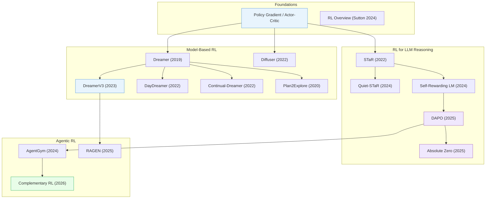

# Reinforcement Learning

> [!abstract] Overview
> RL has evolved from tabular methods to the backbone of modern AI reasoning. This note traces the major threads: foundational methods and theory, model-based RL with learned world models, policy optimization algorithms, RL for LLM reasoning (the post-DeepSeek-R1 paradigm), visual and multimodal RL, reward modeling, agentic RL, RL for robotics, and self-evolving systems. Each thread feeds into the next — world models enable sample-efficient robotics; RLHF enables reasoning LLMs; and agentic RL combines both.

## Evolution Graph

The field evolved through four threads: **model-based RL** (2019-2022) progressed from Dreamer's latent imagination through DayDreamer on real robots to Diffuser's diffusion-based planning; **RL for LLM reasoning** (2022-2025) advanced from STaR's self-taught bootstrapping through Self-Rewarding LMs and DAPO to Absolute Zero's fully zero-data self-play; **agentic RL** (2024-2026) scaled from AgentGym's multi-environment evolution through RAGEN's multi-turn training to Complementary RL's co-evolutionary framework.

| Year | Paper | Contribution |
|------|-------|-------------|
| -- | (foundational concept) | Policy gradient and actor-critic methods; the theoretical backbone of all deep RL |
| 2019 | [[1912.01603\|Dreamer]] | Learned behaviors by latent imagination; pioneered training RL policies entirely within a learned world model |
| 2020 | [[2005.05960\|Plan2Explore]] | Self-supervised exploration via world model disagreement; zero-shot task adaptation without task-specific training |
| 2022 | [[2206.14176\|DayDreamer]] | First deployment of Dreamer on real robots; proved sample-efficient learning from imagination works physically |
| 2022 | [[2211.15944\|Continual-Dreamer]] | Demonstrated world models enable effective continual RL without catastrophic forgetting across sequential tasks |
| 2022 | [[2205.09991\|Diffuser]] | First to use denoising diffusion for RL planning; treated trajectories as data to denoise |
| 2022 | [[2203.14465\|STaR]] | Self-taught reasoner bootstrapping its own rationales; created a self-improvement flywheel for LLM reasoning |
| 2023 | [[2301.04104\|DreamerV3]] | Mastered diverse domains with a single world model architecture; fixed-hyperparameter generalist agent |
| 2024 | [[2412.05265\|RL Overview]] | Kevin Murphy's comprehensive modern overview; the definitive reference for RL fundamentals |
| 2024 | [[2403.09629\|Quiet-STaR]] | Extended STaR to think before every token via internal rationales; token-level self-improvement |
| 2024 | [[2401.10020\|Self-Rewarding LM]] | Single model acts as both generator and judge via iterative DPO; broke the human-feedback bottleneck |
| 2024 | [[2406.04151\|AgentGym]] | Multi-environment agent evolution via behavioral cloning + self-evolution; generalist agent training |
| 2025 | [[2503.14476\|DAPO]] | Open-source RL system at scale for LLM reasoning; decoupled clip-higher and dynamic sampling |
| 2025 | [[2505.03335\|Absolute Zero]] | Zero-data self-play RL; model proposes tasks, solves, verifies via code, and retrains with no human data |
| 2025 | [[2504.20073\|RAGEN]] | Multi-turn RL training for LLM agents; established the paradigm for sustained agent-environment interaction |
| 2026 | [[2603.17621\|Complementary RL]] | Co-evolutionary RL framework where multiple agents improve each other through complementary objectives |

---

## 1. Foundations, Surveys & Theory

The theoretical bedrock of RL — comprehensive overviews, taxonomies, and fundamental theoretical contributions that define the field's vocabulary, scope, and open problems.

**Comprehensive Overviews** — Broad surveys mapping the RL landscape and its major sub-fields.
- [[2604.00626|On-Policy Distillation Survey]], [[2603.25681|LLM Self-Improvement Survey]], [[2603.24517|AVO]], [[2601.12538|Agentic Reasoning Survey]], [[2512.16301|Agentic AI Adaptation Survey]], [[2511.18538|Code Intelligence Survey]], [[2510.02665|MLLM Self-Improvement Survey]], [[2509.08827|RL for LRM Survey]], [[2509.02547|Agentic RL Landscape Survey]], [[2508.08189|RL for Large Models Survey]], [[2506.06981|ForageWorld]], [[2505.04921|LMRM Survey]], [[2505.02665|Slow Thinking LLM Survey]], [[2505.00551|DeepSeek-R1 Replication Survey]], [[2504.21277|Reinforced MLLM Survey]], [[2504.09037|LLM Reasoning Frontiers Survey]], [[2504.03151|Multimodal Reasoning Survey]], [[2503.14576|SocialJax]], [[2502.08938|exp-a-spiel]], [[2501.09686|Large Reasoning Models Survey]], [[2501.09223|LLM Foundations]], [[2501.02189|VLM SOTA Survey]], [[2412.06531|RL Memory Taxonomy]], [[2412.05265|RL Overview]], [[2410.19878|PEFT Methodologies Survey]], [[2408.13296|LLM Fine-Tuning Guide]], [[2408.07666|Model Merging in LLMs/MLLMs]]

> [!star] Key Papers
> - [[2412.05265|RL Overview]] — Sutton's comprehensive modern overview; the definitive reference for RL fundamentals
> - [[2501.09686|Large Reasoning Models Survey]] — First systematic survey of RL-based reasoning in LLMs; maps the post-DeepSeek-R1 landscape
> - [[2508.08189|RL for Large Models Survey]] — Comprehensive mapping of visual RL applied to large multimodal models

**Causal RL** — Connecting causal inference with RL to enable more principled and generalizable decision-making.
- [[2507.14901|Causal Model Reduction]], [[2307.01452|Causal RL Roadmap]], [[2302.05209|Causal RL Methods Survey]], [[2210.13066|DaXBench]], [[2104.03311|PlasticineLab]]

> [!star] Key Papers
> - [[2302.05209|Causal RL Methods Survey]] — First comprehensive taxonomy connecting causal inference with RL

**Continual & Lifelong RL** — Agents that learn across sequential tasks without catastrophic forgetting.
- [[2605.12484|FST]], [[2603.24350|Emergent Self]], [[2603.00903|Continual RL Theory]], [[2506.21872|Continual RL Survey]], [[2503.18684|OMLA]], [[2503.10949|SCDA]], [[2502.15922|Safe EWC]], [[2410.19925|MLLM Continual Learning]], [[2410.07812|TD-VCL]], [[1612.00796|EWC]]

> [!star] Key Papers
> - [[1612.00796|EWC]] — Foundational method for overcoming catastrophic forgetting; Elastic Weight Consolidation remains the baseline for all continual learning
> - [[2506.21872|Continual RL Survey]] — First comprehensive survey dedicated to continual RL; defines the taxonomy and open problems

**Meta-RL** — Learning-to-learn for RL: agents that can quickly adapt to new tasks by leveraging prior experience.
- [[2604.24532|MORL-FB]], [[2604.05112|Vintix II]], [[2601.21845|Constrained Meta-RL]], [[2512.16848|LAMER]], [[2510.20264|OpTI-BFM]], [[2509.24923|Meta-Bandit Exploitation Bias]], [[2509.18389|ICRL Emergence]], [[2508.16027|Transformer Non-Stationary RL]], [[2506.13690|MASP]], [[2506.10085|VITA (Value)]], [[2506.06303|LLM In-Context RL]], [[2506.05426|T2MIR]], [[2506.01299|In-Context Q-Learning]], [[2505.00787|Option Keyboard Basis]], [[2502.04979|Bandit Prompt-Tuning DT]], [[2502.03752|SISL]], [[2502.02869|OmniRL]], [[2305.17250|RaMP]], [[2301.08028|Meta-RL Tutorial]], [[1910.10897|Meta-World]]

> [!star] Key Papers
> - [[2301.08028|Meta-RL Tutorial]] — Definitive tutorial unifying meta-RL definitions and algorithms; essential reference for the sub-field
> - [[2305.17250|RaMP]] — Random-feature Q-basis decoupling reward from dynamics; rapid online task adaptation via linear combination of pre-learned Q-bases

**Evolutionary Strategies vs Deep RL** — Comparative analysis of gradient-free vs gradient-based approaches to policy optimization.
- [[2604.07725|Squeeze Evolve]], [[2602.00170|Blessing of Dimensionality LLM]], [[2509.26354|Misevolution]], [[2509.24372|Evolution Strategies at Scale]], [[2501.15129|EvoRL]], [[2402.06912|ES Linear Policy]], [[2110.01411|DRL vs ES Survey]]

> [!star] Key Papers
> - [[2501.15129|EvoRL]] — JAX-based GPU-accelerated framework achieving 60x speedup for evolutionary RL
> - [[2602.00170|Blessing of Dimensionality LLM]] — Explains why evolution strategies work for LLM fine-tuning with small populations

**Training Dynamics & Scaling** — Understanding what happens during RL training at scale — batch sizing, network pruning, entropy dynamics, and spectral analysis.
- [[2604.01913|Plasticity Sample Weight Decay]], [[2510.13786|Scaling RL Compute]], [[2510.11495|RL After NTP]], [[2510.00553|RL Dynamics Predictability]], [[2509.21128|RL Squeezes SFT Expands]], [[2508.16546|SFT vs RL Spectral Analysis]], [[2508.14881|Compute-Optimal RL Scaling]], [[2507.06187|Delta Learning Hypothesis]], [[2506.15544|Stable Gradients RL]], [[2505.24061|GraMa]], [[2505.22617|Entropy Collapse in RL]], [[2505.17749|Pixel RL Scale GAP]], [[2503.22230|RLHF Data Scaling]], [[2412.11979|AlphaZero Scaling Laws]], [[2412.01951|Sharpening Mechanism]], [[2410.17517|Maynard-Cross Learning]], [[2407.10490|LLM Finetuning Dynamics]], [[2402.12479|Pruned Networks in Deep RL]], [[2104.08212|MT-Opt]], [[1812.06162|Large-Batch Training]]

> [!star] Key Papers
> - [[1812.06162|Large-Batch Training]] — OpenAI's gradient noise scale; foundational for understanding batch size in deep RL
> - [[2505.22617|Entropy Collapse in RL]] — Identifies universal policy entropy collapse in RL for LLMs; a key failure mode to watch for
> - [[2508.16546|SFT vs RL Spectral Analysis]] — Reveals that SFT causes OOD generalization issues that RL avoids, via spectral lens

**SFT vs RL Generalization** — Why RL generalizes where supervised fine-tuning memorizes — a central question for post-training.
- [[2605.11739|EffOPD]], [[2602.10815|RL vs SFT VLM Study]], [[2512.17636|TRAPO]], [[2512.12690|SFT vs RL VLM Study]], [[2501.17161|SFT Memorizes RL Generalizes]]

> [!star] Key Papers
> - [[2501.17161|SFT Memorizes RL Generalizes]] — Landmark finding: SFT makes models memorize training distributions, while RL makes them generalize to unseen problems
> - [[2512.17636|TRAPO]] — Unifies SFT and RL within a single trajectory-level preference optimization framework

**Test-Time Scaling & Compute** — Trading inference compute for better reasoning — search, verification, and adaptive depth at test time.
- [[2601.06748|TT-VLA]], [[2510.08189|R-Horizon]], [[2505.21236|RL Inference Strategies]], [[2503.24235|Test-Time Scaling Survey]], [[2407.14414|System-1.x]]

> [!star] Key Papers
> - [[2503.24235|Test-Time Scaling Survey]] — Unified four-axis taxonomy for the rapidly growing test-time scaling field
> - [[2407.14414|System-1.x]] — Dynamic balancing between fast System-1 and deliberate System-2 processing in LLMs

> [!tip] The SFT vs RL Divide
> The key insight from 2025: SFT teaches models to *reproduce* patterns, RL teaches them to *solve* problems. For reasoning tasks, RL generalizes where SFT memorizes. But SFT remains essential for format/instruction following — the best pipelines use SFT then RL.

**Robust & Adversarial RL** — RL methods designed for worst-case performance under perturbed observations, actions, dynamics, or adversarial co-players. Foundational for safety-critical RL deployment.
- [[2605.14174|VIA]], [[2605.09772|GP-Safe-Exploration]], [[2602.13040|TCRL]], [[2602.11437|DrIGM]], [[2602.05089|Daze]], [[2512.01228|BARPO]], [[2511.09681|SEBA]], [[2510.15382|Robust Zero-Shot RL]], [[2510.14246|DR-RPO]], [[2510.11824|MARL Robustness Study]], [[2509.24130|Sharpness-Aware Prompt]], [[2509.23846|AD-RRL]], [[2509.16950|Multi-Vehicle Backdoor]], [[2508.02948|f-MORNAVI]], [[2507.20068|PERRY]], [[2507.07348|Context Generalization RL]], [[2506.21683|Risk-Averse Total-Reward RL]], [[2506.16590|EBTL]], [[2506.12815|TrojanTO]], [[2506.12622|DR-SAC]], [[2506.11033|Adaptive Shielding]], [[2502.16816|Robust Avg-Reward RL]], [[2412.18781|Offline RL Action Perturbation Eval]], [[2412.10713|RAT]], [[2409.18330|DMC-VB]], [[2406.09976|RMBPO]], [[2406.03862|Behavior Imitation Attack]], [[2404.13009|M-GAPS (Online Policy Opt)]], [[2307.10224|RL-ViGen]], [[2206.00238|DARL]]
- [[2204.12581|RAMBO-RL]]

> [!star] Key Papers
> - [[2602.13040|TCRL]] — Temporal-coupled adversarial training for constrained RL; reduces safety costs by orders of magnitude under worst-case attacks
> - [[2412.10713|RAT]] — Preference-based targeted attacks on DRL; bi-level intention-policy + adversary + state-weighting; doubles as adversarial-training tool

---

## 2. Model-Based RL & World Models

The Dreamer lineage: learning a latent world model, then "dreaming" in it to train a policy. This is the foundation for World Action Models (WAMs) in robotics.

**Dreamer Lineage** — The core trajectory from latent imagination through scalable general agents to real-robot deployment.
- [[2605.04709|ELVIS]], [[2604.02911|DreamTIP]], [[2604.02260|Time-Varying MBRL]], [[2603.18202|R2-Dreamer]], [[2509.24804|DyMoDreamer]], [[2503.21047|CBET-DreamerV3]], [[2502.00466|EDELINE]], [[2501.16443|OC-STORM]], [[2301.04104|DreamerV3]], [[2211.15944|Continual-Dreamer]], [[2206.14176|DayDreamer]], [[1912.01603|Dreamer]]

> [!star] Key Papers
> - [[1912.01603|Dreamer]] — Pioneered latent imagination: learn a world model in latent space, generate synthetic rollouts, train the policy entirely in imagination
> - [[2301.04104|DreamerV3]] — Generalized Dreamer to 130+ diverse domains with a single set of hyperparameters; introduced symlog predictions for stable learning
> - [[2206.14176|DayDreamer]] — First to deploy Dreamer on physical robots (A1 quadruped, UR5 arm), learning from scratch in hours

**Exploration & Curiosity** — Self-supervised exploration strategies that drive world model improvement and zero-shot task adaptation.
- [[2605.22814|Remember to be Curious]], [[2605.03782|GLANCE]], [[2603.28386|COvolve]], [[2603.15789|OmniReset]], [[2603.02008|C-TeC]], [[2602.01619|SUSD]], [[2601.19810|ULEE]], [[2601.19707|QFLEX]], [[2510.24482|COMBRL]], [[2510.14129|Emergent Exploration GCRL]], [[2509.20648|CERMIC]], [[2509.09675|CDE]], [[2509.03771|Co-Evolving MARL]], [[2506.22401|MEX (Primal-Dual)]], [[2506.16396|GoalLadder]], [[2506.05980|AMPED]], [[2506.05634|AutoQD]], [[2506.00138|Virtual Zebrafish RL]], [[2505.19850|DISCOVER]], [[2503.23631|Intrinsic Motivation Human-Agent Study]], [[2503.01584|SENSEI]], [[2502.07279|Exploratory Diffusion RL]], [[2502.05726|ACCEL]], [[2411.13852|ESRM]], [[2408.05804|Single-Goal Contrastive RL]], [[2305.13622|SER]], [[2112.15402|RER]], [[2007.07853|γ-Progress]], [[2005.05960|Plan2Explore]], [[1901.01753|POET]]
- [[1810.12894|RND]], [[1705.05363|ICM]]

> [!star] Key Papers
> - [[2005.05960|Plan2Explore]] — Curiosity-driven exploration in world model latent space; explores to maximize world model improvement, then adapts zero-shot
> - [[2503.01584|SENSEI]] — Semantic exploration with epistemic uncertainty + Go-Explore for versatile world models

**Diffusion & Flow-Based Planning** — Reframing RL as iterative denoising or flow matching over trajectories, enabling flexible conditioning on rewards and constraints.
- [[2606.06049|L-SDPPO]], [[2605.28293|ProRL (Recommendation)]], [[2605.20758|g-car]], [[2605.04568|Dream-MPC]], [[2604.23380|V-GRPO]], [[2604.19730|FASTER]], [[2604.00202|DreamControl-v2]], [[2603.14245|GoldenStart]], [[2603.04333|floq]], [[2602.18015|Flow Actor-Critic]], [[2602.08032|Horizon Imagination]], [[2602.05051|ReFORM]], [[2602.01156|PolicyFlow]], [[2601.00898|DIPOLE]], [[2512.03973|Guided Flow Policy]], [[2510.07650|Value Flows]], [[2510.01068|GPC (RL)]], [[2509.25756|SAC Flow]], [[2509.21942|SIHD]], [[2509.06863|floq (Flow)]], [[2509.04063|ARFM]], [[2508.13904|OFQL]], [[2506.21427|SSCP]], [[2506.12811|FlowRL (Online)]], [[2506.08902|InFOM]], [[2506.07822|RACTD]], [[2506.00895|SCoTS]], [[2505.23527|NF for RL]], [[2505.23062|COMPFLOW]], [[2505.20922|DIMA]]
- [[2505.10881|Prior-Guided Diffusion Planning]], [[2505.01822|AEPO]], [[2205.09991|Diffuser]]

> [!star] Key Papers
> - [[2205.09991|Diffuser]] — Planning as diffusion over trajectories; reframed RL as iterative denoising, enabling flexible conditioning on rewards, constraints, and skills
> - [[2603.04333|floq]] — Explains the empirical success of flow-matching critics in Temporal Difference learning

**JEPA & Latent Prediction for RL** — Joint-Embedding Predictive Architectures adapted for RL, predicting future states in latent space rather than pixel space.
- [[2606.14418|COMET]], [[2601.19336|EAWM]], [[2512.07733|SpatialDreamer]], [[2511.05963|NextLat]], [[2510.00739|TD-JEPA]], [[2508.20294|DALI]], [[2504.16591|JEPA for RL]], [[2502.14819|PLDM]], [[2407.01570|Ego-Foresight]]

> [!star] Key Papers
> - [[2502.14819|PLDM]] — Planning with Latent Dynamics Models from NYU/Meta FAIR; leveraging reconstruction-free latent dynamics for control
> - [[2510.00739|TD-JEPA]] — Temporal-difference JEPA learns policy-conditioned multi-step latents for zero-shot RL; SOTA across 65 tasks, strong on pixel-based observations

**Active Inference** — Perception-action loops grounded in free energy minimization, scaling to continuous control.
- [[1911.10601|Scaling Active Inference]]

> [!star] Key Papers
> - [[1911.10601|Scaling Active Inference]] — First to scale active inference to continuous control domains; bridges free energy theory with practical deep RL

**World Model Theory & Formal Results** — Theoretical foundations proving when and why world models are necessary for generalization.
- [[2606.04130|CLAW (Latent Action WM)]], [[2606.02027|World-Task Factorization]], [[2605.29564|VE2VF]], [[2605.25313|UWM-JEPA]], [[2605.22123|FLORA]], [[2605.12771|PASTA]], [[2605.06732|Training in Imagination]], [[2605.01694|Latent State Design WM]], [[2604.03208|HWM]], [[2604.01985|WAV]], [[2603.29090|HCLSM]], [[2603.28963|AutoWorld]], [[2603.28955|WAM]], [[2602.06130|SWIRL]], [[2602.05842|RWML]], [[2512.09929|OWM]], [[2512.03556|RoboScape-R]], [[2510.21232|Confusing World Models]], [[2510.18135|World-in-World]], [[2506.01622|General Agents World Models]], [[2501.10100|RWM]], [[2408.14472|DWL]], [[2403.04253|R2I]], [[2402.19161|MemoNav]], [[2206.02072|VSRL]], [[2112.01506|REVI]], [[2103.10369|RH-UCRL]]

> [!star] Key Papers
> - [[2506.01622|General Agents World Models]] — Google DeepMind formally proves that agents capable of generalizing to multi-step, goal-directed tasks must build world models

**Offline Model-Based RL** — Learning world models from fixed datasets without further environment interaction, enabling safe policy improvement.
- [[2603.08118|RVL]], [[2602.23770|MAGE]], [[2602.01270|Mixture-of-World Models]], [[2512.08108|Action-Chunk MBRL]], [[2511.19584|MMBench (World Models)]], [[2509.19080|World4RL]], [[2509.13095|SeqWM]], [[2506.08460|MOBODY]], [[2505.15754|Temporally-Extended Actions]], [[2505.15589|Reflexive World Models]], [[2505.13709|Policy-Driven WM Adaptation]], [[2504.16680|RWM-U]], [[2502.19544|Generalist-to-Specialist]], [[2410.00564|JOWA]], [[2406.09976|RMBPO]], [[2310.06253|Objective Mismatch MBRL Survey]], [[2204.12581|RAMBO-RL]], [[1906.08253|MBPO]], [[1803.10122|World Models]]

> [!star] Key Papers
> - [[2504.16680|RWM-U]] — Uncertainty-aware world model for real-robot offline RL; bridges sim-to-real with calibrated uncertainty
> - [[2505.13709|Policy-Driven WM Adaptation]] — Joint WM-policy optimization via Stackelberg dynamics; resolves objective mismatch with state-of-the-art robustness
> - [[2310.06253|Objective Mismatch MBRL Survey]] — Unified taxonomy for decision-aware MBRL; foundational reference for the objective-mismatch problem

**Continual & Online World Models** — World models that update online without catastrophic forgetting, supporting lifelong learning.
- [[2604.08958|WOMBET]], [[2603.04029|Self-Adapting RL]], [[2602.14351|WIMLE]], [[2602.00475|GRASP]], [[2510.04507|WISDOM]], [[2507.09177|Online Agent (OA)]]

> [!star] Key Papers
> - [[2602.00475|GRASP]] — Gradient-based planning enabling world models to solve long-horizon control tasks

> [!tip] Why This Matters for Robotics
> The Dreamer to DayDreamer to DreamerV3 lineage directly enables WAMs like DreamZero. The key insight: learning in imagination is orders of magnitude more sample-efficient than real-world trial-and-error. JEPA-based latent prediction is the next frontier — faster and more robust than pixel-space generation.

---

## 3. Policy Optimization

Direct methods for optimizing policies — from classic PPO through modern GRPO variants, KL-regularized objectives, and tree-structured search. This is the algorithmic engine behind both LLM reasoning and robot control.

**GRPO & Variants** — Group Relative Policy Optimization and its derivatives, the dominant paradigm for RL-based LLM reasoning post-DeepSeek-R1.
- [[2605.27079|TRQAM]], [[2605.21429|roto 2.0]], [[2605.15726|NUDGERL]], [[2605.15458|VideoRLVR]], [[2605.15012|FEST]], [[2605.14539|CIPO]], [[2605.06139|LPO]], [[2604.27998|Latent-GRPO]], [[2604.02288|SRPO]], [[2603.24984|MoE-GRPO]], [[2602.05547|MT-GRPO]], [[2601.20614|DGPO (Difficulty)]], [[2511.06411|SofT-GRPO]], [[2510.20150|Rank-GRPO]], [[2510.19807|Scaf-GRPO]], [[2510.08554|GDPO (Diffusion LM)]], [[2510.04072|SFPO]], [[2509.25849|Knapsack-GRPO]], [[2509.24261|Risk-Sensitive GRPO]], [[2509.06040|BranchGRPO]], [[2508.09726|GFPO]], [[2507.21848|EDGE-GRPO]], [[2506.16141|GRPO-CARE]], [[2506.13923|Guide-GRPO]], [[2505.22257|Off-Policy GRPO]], [[2505.12929|Advantage Reweighting]], [[2505.12366|DisCO (RL)]], [[2505.05470|Flow-GRPO]], [[2504.02546|GPG]], [[2504.00883|vsGRPO]]
- [[2503.20783|Dr. GRPO]], [[2503.14476|DAPO]], [[2502.10550|MIKASA]], [[2301.13261|Blind Nav Agents]], [[2101.05181|MemAug Image-Goal Nav]]

> [!star] Key Papers
> - [[2503.14476|DAPO]] — Open-source large-scale GRPO system; demonstrated that RL at scale produces reasoning capabilities that SFT cannot
> - [[2503.20783|Dr. GRPO]] — Critical analysis of R1-Zero-like training; identifies and fixes key failure modes in GRPO
> - [[2505.22257|Off-Policy GRPO]] — Formalized off-policy extension for GRPO; enables more sample-efficient training

**PPO & Proximal Methods** — PPO-family algorithms adapted for LLM and multimodal model training, with emphasis on credit assignment and stability.
- [[2605.11473|TOPPO]], [[2605.04470|CRAFT Driving]], [[2605.03846|SigLoMa]], [[2605.03363|Hierarchical RL-QP Grasp]], [[2604.20328|DePO]], [[2602.04879|DPPO]], [[2602.02454|World-Gymnast]], [[2511.01331|RobustVLA]], [[2510.03817|TROLL]], [[2510.01656|AsyPPO]], [[2508.17784|PSFT]], [[2508.08221|Lite PPO]], [[2506.15050|T-PPO]], [[2410.01679|VinePPO]], [[2409.16578|FLaRe]], [[1707.06347|PPO]]

> [!star] Key Papers
> - [[2604.20328|DePO]] — Decoupled PPO for hybrid discrete-continuous action spaces; vMF distribution and hyperspherical KL enable stable MLLM latent-reasoning RL
> - [[2410.01679|VinePPO]] — Replaces PPO's learned value function with vine-based credit assignment; more precise step-level rewards
> - [[2506.15050|T-PPO]] — Truncated PPO significantly enhances training efficiency for LLM reasoning

**DPO, Preference & Alignment** — Direct Preference Optimization and its multimodal extensions — aligning models with human preferences without explicit reward models.
- [[2606.16856|VOTP]], [[2605.02087|MSM]], [[2604.02349|OPRIDE]], [[2604.01840|PGPO]], [[2603.28618|PRCO]], [[2603.28204|ERPO]], [[2603.25077|ToR]], [[2603.23355|ReVal]], [[2603.22117|RLVR Direction]], [[2603.21383|PivotRL]], [[2603.19835|FIPO]], [[2603.12595|SPL (Swap)]], [[2602.22703|GEODPO]], [[2602.21346|Alignment-Weighted DPO]], [[2512.16626|SLHF]], [[2511.20629|MapReduce LoRA]], [[2511.15605|SRPO]], [[2511.10985|DPO Data Curation Study]], [[2510.20413|AuxDPO]], [[2510.16333|PIVOT]], [[2510.11194|CDRA]], [[2510.03269|GEB]], [[2509.26346|EditReward]], [[2509.26074|LENS]], [[2509.23802|STAIR]], [[2509.23102|MNPO]], [[2509.14234|CaT]], [[2509.11452|Multi-Objective RL Alignment]], [[2509.07414|LSP]], [[2507.13579|PLUS]]
- [[2507.08068|QRPO]], [[2506.21495|Offline-Online RL for LLMs]], [[2506.16895|STRUCTURE Alignment]], [[2506.10054|Uni-DPO]], [[2506.09508|Efficient Preference RL]], [[2506.08681|IS-DAAs]], [[2506.07127|APO]], [[2506.01183|DRPO]], [[2505.15456|RLPA]], [[2504.16801|DeGLA]], [[2504.15619|AdaViP]], [[2504.12717|RaFA]], [[2503.09561|Strategyproof RLHF]], [[2503.03480|SafeVLA]], [[2502.16852|ONPO]], [[2502.08922|SCIR]], [[2502.07193|One-Pass RLHF]], [[2411.19309|GRAPE]], [[2411.10442|MPO]], [[2411.04109|SCPO]], [[2411.00361|DIPPER]], [[2410.23223|COMAL]], [[2410.12735|CREAM]], [[2410.02355|AlphaEdit]], [[2405.12961|Energy Rank Alignment]], [[2210.05639|DPO]]

> [!star] Key Papers
> - [[2506.21495|Offline-Online RL for LLMs]] — Shows DPO adapted to online or hybrid settings matches full RL performance at lower cost
> - [[2411.10442|MPO]] — Mixed Preference Optimization with scalable automated pipeline for constructing multimodal preferences

**Value & Advantage-Based Methods** — Methods that improve value estimation and advantage computation for more stable and efficient RL training.
- [[2605.05812|LQL]], [[2604.28005|KAE]], [[2604.22074|CIR/SR Reasoning]], [[2604.20627|Occupancy Reward Shaping]], [[2604.14265|VGF]], [[2603.00716|Frozen Policy Iteration]], [[2602.17062|S2Q]], [[2602.02710|MaxRL]], [[2601.20071|Distributional Sobolev RL]], [[2601.14234|QAM]], [[2512.15405|EUBRL]], [[2512.14202|Hyperbolic Deep RL]], [[2512.12046|Eik-QRL]], [[2511.07730|MQE]], [[2510.06714|Dual Goal Representations]], [[2510.06649|ARQ]], [[2510.06647|Gap-Dependent Q-Regret]], [[2510.06540|Superstate MDP RL]], [[2510.02590|MINTO]], [[2509.23962|CANON]], [[2509.22611|QAE]], [[2509.19800|ALP MDP]], [[2509.18714|GBSM]], [[2509.12026|RDM (RL)]], [[2509.06782|Eikonal Value Learner]], [[2509.05193|k-Shifted Successor]], [[2507.20673|GMPO]], [[2507.13181|Spectral Bellman Method]], [[2506.20904|Avg-Reward Sample Complexity]], [[2506.20048|Fitted Distributional Evaluation]]
- [[2506.04398|iS-QL]], [[2505.23150|Categorical Q-Learning]], [[2505.21391|Linear TD Finite Sample]], [[2505.21119|UVU]], [[2505.20686|A*-PO]], [[2505.16548|TC-lambda]], [[2505.16217|Reward-Aware Proto-Representations]], [[2505.15544|differential TD]], [[2505.15311|TBRM]], [[2505.12737|OTA Value Learning]], [[2505.10007|DR Avg-Reward Complexity]], [[2504.19599|GVPO]], [[2504.05118|VAPO]], [[2503.03660|Transformer-Critic SAC]], [[2502.20548|Q-sharp]], [[2502.16944|DVPO]], [[2502.14172|Linear-CTD]]

> [!star] Key Papers
> - [[2504.05118|VAPO]] — Value-model-based RL that reliably enhances LLM performance on challenging math reasoning
> - [[2505.20686|A*-PO]] — A*-search-inspired policy optimization via optimal advantage regression

**Tree Search & MCTS** — Monte Carlo Tree Search integrated with RL for structured exploration during training and inference.
- [[2604.01434|VOIMCP]], [[2602.20809|RGSC]], [[2510.24302|LATR]], [[2509.25454|DeepSearch]], [[2509.15929|MCTS Symbolic Regression]], [[2509.09284|Tree-OPO]], [[2508.17445|TreePO]], [[2506.11902|TreeRL]], [[2410.11234|BA-MCTS]], [[2406.06592|OmegaPRM]], [[2406.03816|ReST-MCTS*]]

> [!star] Key Papers
> - [[2506.11902|TreeRL]] — On-policy RL with tree search for structured exploration; improves sample quality during training
> - [[2406.03816|ReST-MCTS*]] — Automated process reward model generation via MCTS for LLM self-training

**Off-Policy & Sample Efficiency** — Methods that reuse past experience or manage data more efficiently for RL fine-tuning.
- [[2606.04968|ForesightFlow]], [[2606.02313|VLA Aerial Nav GRPO]], [[2605.30226|BORA]], [[2605.30056|CGPO]], [[2605.28527|VLA Value Probing]], [[2605.19282|Pion]], [[2605.14779|CPQL]], [[2605.11151|RankQ]], [[2605.11009|ACSAC]], [[2605.08202|Diffusion OOD Detection]], [[2605.03821|RoboAlign-R1]], [[2605.03065|OGPO]], [[2605.01663|FAN]], [[2605.00416|LWD]], [[2604.26504|HiPAN]], [[2604.23073|RLT]], [[2604.20733|NPO]], [[2604.18978|LoRA-Critic]], [[2603.16860|DreamPlan]], [[2603.12087|QAvatar]], [[2602.20722|BAPO (RL)]], [[2602.18117|FINO]], [[2602.01962|ZOL]], [[2602.00629|OSO-DecQN]], [[2601.20765|C4 (Offline RL)]], [[2601.19030|Linear OPE Coverage]], [[2601.18795|Reuse FLOPs]], [[2601.07821|FARL]], [[2601.04441|SPIN (RL)]], [[2512.19154|Adaptive Stacking]]
- [[2512.02486|DROCO]], [[2510.18927|BAPO]], [[2510.13328|TOSFIT]], [[2510.07730|DEAS]], [[2510.06710|RLinf-VLA]], [[2510.02245|ExGRPO]], [[2510.01161|M2PO]], [[2509.24748|RPEX]], [[2509.24067|ICQL]], [[2509.22601|SPEAR]], [[2509.15981|Uncertainty Policy Regularisation]], [[2509.15965|RLinf]], [[2509.08660|Replicable RL]], [[2509.04501|RL for Model Training Survey]], [[2509.01720|SoLS]], [[2509.01321|DEPO]], [[2508.19900|ASPC]], [[2508.11143|AC3]], [[2507.11269|Data Recycling RL]], [[2507.07986|EXPO]], [[2507.06892|ReMix (RL)]], [[2506.21039|Frontier Experience Replay]], [[2506.18482|Reliability-Adjusted PER]], [[2506.06964|Refit]], [[2506.00917|PSQL]], [[2506.00131|DT-CORL]], [[2505.19281|Online RL Data Attribution]], [[2505.11081|ShiQ]], [[2503.19612|AGRO]], [[2503.02269|Experience Replay Random Reshuffling]]
- [[2502.08021|LSTD-Tournament]], [[2502.07523|CrossQ+WN]], [[2501.15910|Online RL Multi-Model Complexity]], [[2501.01774|Off-Policy LFA Unifying View]], [[2412.09858|RLDG]], [[2412.00798|CRUCB]], [[2407.20230|SAPG]], [[2311.03351|Uni-O4]], [[2306.09459|RATE]], [[1806.10293|QT-Opt]], [[1805.07914|ILPO]], [[1801.01290|SAC]]

> [!star] Key Papers
> - [[2505.11081|ShiQ]] — Off-policy Q-learning for LLM fine-tuning; enables reuse of generated data across iterations
> - [[2509.01321|DEPO]] — Data-Efficient Policy Optimization; significantly improves sample efficiency of RLVR

**Entropy & Diversity Regularization** — Combating mode collapse and entropy collapse in RL-trained models through regularization and diversity-aware objectives.
- [[2604.17654|Poly-EPO]], [[2604.16027|Diversity Collapse Audit]], [[2604.02355|Entropy-Guided Synthesis RL]], [[2603.30036|CoT Monitorability]], [[2603.11682|Entropy-Preserving RL]], [[2603.01741|CPO (Ensemble)]], [[2602.11779|TAMPO]], [[2511.07738|Two-Stage Entropy GRPO]], [[2510.20817|MARA]], [[2510.08549|ERA (Entropy Activation)]], [[2510.05837|EEPO]], [[2510.03222|Lp-Reg]], [[2509.26209|DIVER]], [[2509.25424|Set RL]], [[2509.25133|SIREN]], [[2509.07430|DPH-RL]], [[2509.04784|DQO]], [[2509.02534|Darling]], [[2506.07085|State Entropy Regularization]], [[2506.01939|High-Entropy Token RLVR]], [[2505.23433|Diversity-Aware PO]]

> [!star] Key Papers
> - [[2509.25133|SIREN]] — Selective entropy regularization to mitigate entropy collapse; targets high-uncertainty tokens
> - [[2509.02534|Darling]] — Diversity-Aware RL from Meta FAIR; integrates diversity directly into the RL objective

**KL Divergence & Regularization Theory** — Theoretical and practical work on KL-regularized policy gradients, a fundamental tool in RLHF.
- [[2602.11523|Dual-KL RLHF]], [[2602.01685|WPR]], [[2506.09477|KL Divergence Gradient Pitfalls]], [[2505.17508|RPG]], [[2503.01067|Online-Offline PFT Equivalence]], [[2502.06051|KL-PCB]], [[2502.01203|Multi-Reference RLHF]], [[2411.04625|KL-RLHF Bandit Analysis]]

> [!star] Key Papers
> - [[2506.09477|KL Divergence Gradient Pitfalls]] — Meta FAIR identifies widespread implementation errors in KL divergence gradient estimation; critical for correct RLHF

**Multi-Turn & Agentic Policy Optimization** — Extending RLVR beyond single-turn QA to multi-step, multi-turn, and agentic settings.
- [[2606.05468|FlowPRO]], [[2605.06595|CRONA]], [[2605.02730|PFlowNet]], [[2604.28182|Exploration Hacking]], [[2602.22817|HGPO]], [[2511.02303|Dr. MAMR]], [[2510.14967|IGPO (Info Gain)]], [[2510.11062|AT-GRPO]], [[2510.05592|AgentFlow]], [[2509.22638|FCP]], [[2509.21826|ResT (RL)]], [[2509.21240|Tree-GRPO]], [[2509.07980|Parallel-R1]], [[2509.02333|DCPO]], [[2506.00539|ARIA]], [[2505.10978|GiGPO]], [[2504.20571|1-shot RLVR]], [[2504.20073|RAGEN]]

> [!star] Key Papers
> - [[2504.20073|RAGEN]] — Showed that single-turn RLVR doesn't transfer to multi-step tasks; introduced StarPO for multi-turn RL
> - [[2504.20571|1-shot RLVR]] — Achieves competitive reasoning with just 1 rollout per sample; extreme sample efficiency

**Efficient & Practical RL Training** — Infrastructure, precision tricks, and engineering insights for scaling RL training to production.
- [[2606.12370|MTP-RS]], [[2605.15855|AdaScope]], [[2604.26779|Speculative RL Rollouts]], [[2604.03489|FAB]], [[2603.01639|RL Speculative Decoding]], [[2602.01601|VIP (Rollout)]], [[2510.26788|FP16 RL Training]], [[2510.11696|QeRL]], [[2510.01764|Octax]], [[2510.00819|Stable PG LLM]], [[2509.25762|OPPO]], [[2509.25174|XQC]], [[2509.24305|Async Policy Gradient]], [[2509.23931|AutoPrune]], [[2509.23791|CaRe-BN]], [[2509.22566|Policy Space Compression]], [[2509.21792|FastGRPO]], [[2509.19846|BoreaRL]], [[2509.01920|DSP (Speculative)]], [[2508.17850|GEPO]], [[2507.19234|Virne]], [[2506.02177|GRESO]], [[2505.24034|LlamaRL]], [[2505.15345|Hadamax]], [[2505.07291|INTELLECT-2]], [[2503.18929|TBA]], [[2404.08233|GPBT-PL]], [[2311.12244|muLV-Rep]]

> [!star] Key Papers
> - [[2505.24034|LlamaRL]] — Meta's distributed asynchronous RL framework for large-scale LLM training
> - [[2510.26788|FP16 RL Training]] — Demonstrates FP16 precision works for RL training; halves memory cost

**Hybrid SFT + RL Pipelines** — Methods that combine supervised fine-tuning with RL in unified or staged training recipes.
- [[2605.12483|Teacher-First-OPD]], [[2605.10889|OPD-Diagnostic]], [[2605.03677|Uni-OPD]], [[2605.03269|RLDX-1]], [[2604.28123|PRISM]], [[2604.23747|SFT-then-RL Reaudit]], [[2604.14258|GFT]], [[2603.12248|EBFT]], [[2602.01058|PEAR]], [[2601.21363|Pretrain-Finetune Bridge RL]], [[2601.06993|ReFine-RFT]], [[2512.12690|SFT vs RL VLM Study]], [[2510.10606|ViSurf]], [[2510.01624|SFT-RL Quagmires]], [[2509.23753|Anchored SFT]], [[2508.11408|CHORD]], [[2507.01679|Prefix-RFT]], [[2506.19767|SRFT]], [[2506.13056|Metis-RISE]], [[2506.07527|ReLIFT]], [[2505.18917|Behavior Injection]], [[2505.18116|NFT]], [[2505.03181|AFSFT]], [[2504.14945|LUFFY]], [[2504.11343|RAFT++]]

> [!star] Key Papers
> - [[2510.10606|ViSurf]] — Unified single-stage post-training integrating SFT and RL; avoids the two-stage overhead
> - [[2601.06993|ReFine-RFT]] — Identifies the "Cost of Thinking" where excessive textual reasoning hurts; balances verbal and visual reasoning

**Variational & Information-Theoretic Approaches** — Principled probabilistic methods treating reasoning traces as latent variables or information bottlenecks.
- [[2509.22637|Variational Reasoning]], [[2507.18391|IBRO]], [[2505.18454|HRPO]]

> [!star] Key Papers
> - [[2509.22637|Variational Reasoning]] — Treats thinking traces as latent variables; principled framework for reasoning optimization

**Miscellaneous Policy Methods** — Other notable approaches to policy optimization that cross boundaries.
- [[2606.04923|CHERRL]], [[2603.11346|Human-Human Assist RL]], [[2602.03086|Neural Predictor-Corrector]], [[2602.02722|Entity-Centric HRL]], [[2601.19452|APC-RL]], [[2601.00116|GRL-SNAM]], [[2512.13607|Nemotron-Cascade]], [[2512.03759|ESPO]], [[2512.01374|MiniRL]], [[2512.01047|AutoSpec]], [[2512.00915|PI-MDP]], [[2511.17367|R2PS]], [[2511.08234|Geometric Action Control]], [[2511.05005|MAC-Flow]], [[2510.09541|SPG]], [[2510.02180|GRACE]], [[2510.00911|RiskPO]], [[2509.25055|AlphaSAGE]], [[2509.24981|ROVER]], [[2509.24207|Humanline]], [[2509.21880|RL-ZVP]], [[2509.16606|BayesG]], [[2509.15999|IO-LVM]], [[2509.15207|FlowRL (Reward Matching)]], [[2509.09135|VIP (CT-MARL)]], [[2509.03646|HICRA]], [[2508.17696|FCGrad]], [[2507.18059|Multi-Agent GPO]], [[2506.19997|TRACED]], [[2506.16608|DA-MDP]]
- [[2506.16016|Dual-Objective HJB RL]], [[2506.10138|Planning Mechanistic Description]], [[2506.09434|MARL Diversity Theory]], [[2506.02385|Markov Entanglement]], [[2506.01597|Policy Newton RKHS]], [[2505.22760|Best Response Flow]], [[2505.18763|GenPO]], [[2505.03586|Rainbow Delay Compensation]], [[2502.00560|CAMS]], [[2412.04426|Marvel]], [[2412.04233|HyperMARL]], [[2412.00661|SUBSAMPLE-MFQ]], [[2411.15046|Multi-Agent IRL Rewards]], [[2410.03119|Ring Attractor RL]], [[2409.17411|Semantic Clustering DRL]], [[2405.08036|POW-QMIX]], [[2404.15617|dfPO]], [[2306.05353|Negotiated Reasoning]], [[1312.5602|DQN]]

> [!star] Key Papers
> - [[2509.24207|Humanline]] — Explains why online RL outperforms offline methods from a human cognitive science perspective
> - [[2512.01374|MiniRL]] — Qwen Team's theoretical justification for token-level optimization in sequential decision-making

> [!success] The Post-R1 RL Recipe
> ==SFT warm-up== (instruction following + format compliance) → ==GRPO with verifiable rewards== (math/code execution as signal) → ==Distillation== to smaller models. Stable large-scale GRPO training with decoupled clip-higher and dynamic sampling. Even 1.5B models gain reasoning; zero-data bootstrapping works via self-play RL.

> [!tip] The GRPO Revolution
> Post-DeepSeek-R1, GRPO replaced PPO as the default RL algorithm for LLM reasoning. Key improvements: Dr. GRPO fixes training instabilities, DAPO scales to production, and Off-Policy GRPO enables sample reuse. For new projects, start with DAPO or GRPO-CARE.

---

## 4. RL for LLM Reasoning

The post-DeepSeek-R1 paradigm: using RL (especially GRPO) to teach LLMs to reason step-by-step, often surpassing supervised fine-tuning. This section covers the reasoning methods themselves; policy optimization algorithms are in Section 3.

**Bootstrapped Self-Training** — The STaR lineage: iterative self-improvement where the model generates, filters, and fine-tunes on its own reasoning traces.
- [[2605.28814|BES]], [[2605.27276|SIA]], [[2605.25832|AUTO-ROBOTIST]], [[2605.22217|Survive or Collapse]], [[2605.21931|EvoVid]], [[2605.20246|GROW]], [[2605.20025|AutoResearchClaw]], [[2512.15687|G2RL]], [[2505.21444|SRT]], [[2505.17746|Fast Quiet-STaR]], [[2505.03335|Absolute Zero]], [[2403.09629|Quiet-STaR]], [[2203.14465|STaR]]

> [!star] Key Papers
> - [[2203.14465|STaR]] — Iterative bootstrapping: LLM generates rationales, keeps correct ones, fine-tunes, repeat. 6B GPT-J matches 175B GPT-3
> - [[2403.09629|Quiet-STaR]] — Extends STaR to think before every token, learning internal rationales from general text
> - [[2505.03335|Absolute Zero]] — Zero-data RL: model proposes its own problems, solves them, uses verifiable answers as reward — no human data at all

**Self-Rewarding & Self-Improvement** — Models that generate their own training signal, eliminating external reward models or human annotation.
- [[2605.20914|RISE (Self-Evolving VLM)]], [[2605.11182|On-Policy Distillation Study]], [[2604.27083|CoPD]], [[2604.20209|SGS]], [[2604.03128|Self-Distilled RLVR]], [[2604.03098|Self-Guide]], [[2602.12275|OPCD]], [[2601.21343|Self-Improving Pretraining]], [[2601.20802|SDPO]], [[2601.19897|SDFT]], [[2601.18734|OPSD]], [[2512.05356|Co-Improving AI]], [[2510.14943|LaSeR (RL)]], [[2510.14420|Instructions-RL]], [[2510.02172|RESTRAIN]], [[2509.23863|SPELL]], [[2509.23236|Self-Reflection VLM]], [[2509.15155|Self-Improving EFM]], [[2509.05489|Self-Aligned Reward]], [[2508.14460|DuPO]], [[2508.14029|SvS]], [[2508.05004|R-Zero]], [[2508.00410|Co-rewarding]], [[2507.16663|MLLM Self-Improvement]], [[2506.10139|ICM]], [[2506.08745|CoVo]], [[2506.07468|SELF-REDTEAM]], [[2506.01369|Self-Verify RL]], [[2505.19590|INTUITOR]], [[2504.05812|EMPO]]
- [[2410.15639|Self-Developing]], [[2401.10020|Self-Rewarding LM]]

> [!star] Key Papers
> - [[2401.10020|Self-Rewarding LM]] — LLM generates its own reward signal; eliminates the need for a separate reward model
> - [[2508.05004|R-Zero]] — LLMs self-evolve reasoning via self-generated problems and rewards; fully autonomous

**Chain-of-Thought Reasoning** — Training LLMs to produce explicit step-by-step reasoning, with RL as the training signal.
- [[2606.03937|VEPO]], [[2605.28774|AXPO]], [[2506.07751|AbstRaL]], [[2505.20561|BARL]], [[2505.14631|LHRM]], [[2505.13308|LATENTSEEK]], [[2505.11896|AdaCoT]], [[2505.10425|L2T]], [[2503.24290|Open-Reasoner-Zero]], [[2503.10460|Light-R1]]

> [!star] Key Papers
> - [[2503.24290|Open-Reasoner-Zero]] — First comprehensive open-source reproduction of R1-Zero; reference implementation for the field
> - [[2505.10425|L2T]] — Learning to Think: fine-tunes LLMs to achieve higher reasoning accuracy with significantly fewer tokens

**Adaptive & Efficient Reasoning** — Methods that teach models when and how much to reason, optimizing the compute-accuracy tradeoff.
- [[2605.25477|EXPO-FT]], [[2605.17807|CGPO (RL)]], [[2604.05355|ETR]], [[2604.01658|CORAL]], [[2603.28730|SOLE-R1]], [[2603.27866|Wan-R1]], [[2603.10887|DPS]], [[2602.12113|ARLCP]], [[2601.22628|TTCS]], [[2601.19280|GDRO]], [[2601.18067|EvolVE]], [[2512.06835|DoGe]], [[2512.02472|R-FEW]], [[2512.01127|Mode-Conditioning]], [[2511.07317|RLVE]], [[2510.27419|DeepCompress]], [[2510.25992|SRL]], [[2510.24832|Reasoning Tree Scheduling]], [[2510.23486|Discounted RL Reasoning]], [[2510.09001|DARO]], [[2510.06557|Markovian Thinker]], [[2510.04474|DRPO (Decoupled)]], [[2510.01135|PCL]], [[2510.01037|CurES]], [[2509.25827|DECS]], [[2508.02150|Self-Supervised RL IF]], [[2507.22607|VL-Cogito]], [[2506.18110|AdaBack]], [[2506.03295|CFT]], [[2505.20258|ARM]]
- [[2505.19862|REA-RL]], [[2505.19217|DIET]], [[2505.17312|AdaReasoner (RL)]], [[2505.16315|ACPO]], [[2505.15612|LASER]], [[2505.14970|SEC]], [[2505.14140|RL of Thoughts]], [[2505.13438|AnytimeReasoner]], [[2505.13379|Thinkless]], [[2505.10832|AutoThink]], [[2505.02391|GVM-RAFT]], [[2504.21370|ShorterBetter]], [[2504.05520|ADARFT]], [[2503.16188|Think or Not Think]], [[2502.04463|Efficient Reasoning RL]]

> [!star] Key Papers
> - [[2505.13379|Thinkless]] — RL-based framework that teaches LLMs to skip reasoning when unnecessary; optimizes compute allocation
> - [[2505.13438|AnytimeReasoner]] — Produces usable reasoning at any compute budget; true anytime behavior

**RL Pre-Training** — Applying RL during pre-training rather than just post-training, fundamentally changing how models learn from data.
- [[2606.17024|ExpRL]], [[2512.07203|MMRPT]], [[2512.03442|PretrainZero]], [[2510.01265|RLP]], [[2509.25810|RA3]], [[2509.24375|Reinforcement Mid-Training]], [[2506.08007|RPT]]

> [!star] Key Papers
> - [[2506.08007|RPT]] — Reinforcement Pre-Training: reframes next-token prediction as RL; models learn reasoning during pre-training
> - [[2512.03442|PretrainZero]] — Self-supervised reinforcement active pretraining without human data

**Reasoning-Enhanced LLMs (General)** — Complete reasoning model training pipelines and notable reasoning-enhanced LLMs.
- [[2605.31228|EchoRL]], [[2605.31159|TRB]], [[2605.29198|GCPO]], [[2605.28421|DenoiseRL]], [[2605.22817|VPO]], [[2605.21467|DelTA]], [[2605.16787|RLVR Unlearnability]], [[2605.12227|dGRPO]], [[2605.11609|AntiSD]], [[2605.10663|Evolving-RL]], [[2603.07197|Re-squared]], [[2603.02146|LongRLVR]], [[2603.02091|Synthetic Multi-Hop RL]], [[2602.11549|NRT]], [[2512.18857|CORE (Concept)]], [[2512.13106|TraPO (RL)]], [[2512.01925|Rectifying LLM Thought]], [[2510.22543|FAPO]], [[2510.19363|LoongRL]], [[2510.16614|MERCI]], [[2510.15414|MARSHAL]], [[2510.12264|Belief Deviation Active Reasoning]], [[2510.11686|RepExp]], [[2510.04140|MENTOR]], [[2510.02173|RL4HS]], [[2509.25666|NuRL]], [[2509.23657|RL Cross-Lingual]], [[2509.23330|SIE]], [[2509.10396|IGPO]], [[2509.06949|TraceRL]]
- [[2507.20187|MultiRole-R1]], [[2507.13266|QuestA]], [[2507.12507|Nemotron]], [[2506.18841|LongWriter-Zero]], [[2506.18485|MeRF]], [[2506.17238|ether0]], [[2506.13585|MiniMax-M1]], [[2506.13284|AceReason-Nemotron]], [[2506.08672|RuleReasoner]], [[2506.06632|Easy-to-Hard Curriculum RL]], [[2506.05997|SRU]], [[2506.01413|Instruction-Following RL]], [[2505.24630|FSPO]], [[2505.21908|DRG-SAPPHIRE]], [[2505.21097|Thinker (RL)]], [[2505.20948|CtrlHGen]], [[2505.19914|Enigmata]], [[2505.19641|SynLogic]], [[2505.18499|G1 (Graph Reasoning)]], [[2505.18098|PNLC]], [[2505.16368|SATURN]], [[2505.11792|SIRL]], [[2505.10446|DCoLT]], [[2505.00949|Llama-Nemotron]], [[2504.21318|Phi-4-reasoning]], [[2504.21233|Phi-4-Mini-Reasoning]], [[2504.13828|Cognition Engineering]], [[2503.09501|ReMA]], [[2502.06772|ReasonFlux]]
- [[2501.11223|RLM Blueprint]]

> [!star] Key Papers
> - [[2505.00949|Llama-Nemotron]] — NVIDIA's open-source reasoning models achieving state-of-the-art across benchmarks
> - [[2506.13585|MiniMax-M1]] — Hybrid MoE architecture with Lightning Attention; scales reasoning efficiently
> - [[2501.11223|RLM Blueprint]] — ETH Zurich's comprehensive modular blueprint for Reasoning Language Models

**Search-Augmented Reasoning** — Teaching LLMs to interleave reasoning with external search and retrieval, learned end-to-end via RL.
- [[2603.22293|TIPS (RL)]], [[2602.21728|Explore-on-Graph]], [[2510.07958|A2Search]], [[2510.00861|Erasable RL]], [[2509.24869|Retro-Star]], [[2505.04588|ZeroSearch]], [[2504.21776|WebThinker]], [[2503.19470|ReSearch]], [[2503.09516|Search-R1]], [[2503.05592|R1-Searcher]], [[2109.13202|MiniHack]]

> [!star] Key Papers
> - [[2503.09516|Search-R1]] — RL trains LLMs to autonomously interleave reasoning with search; outperforms pipeline RAG approaches
> - [[2505.04588|ZeroSearch]] — Trains LLMs to use search by simulating search engines with LLMs; zero real search calls needed

**Verification & Process Rewards** — Learning to verify reasoning steps and assign process-level rewards for more reliable training signals.
- [[2605.30290|STV]], [[2601.14209|InT]], [[2512.16917|GAR (Reasoner)]], [[2510.24320|Critique-RL]], [[2509.26628|AttnRL]], [[2508.13755|DARS-Breadth]], [[2506.14245|CoT-Pass@K]], [[2506.09026|e3]], [[2506.05316|DOTS]], [[2504.19162|SPC]], [[2410.08146|PAV]], [[2408.15240|GenRM]], [[2011.07215|SoftGym]]

> [!star] Key Papers
> - [[2408.15240|GenRM]] — Reframes reward modeling as next-token prediction; generative verifiers outperform discriminative ones
> - [[2410.08146|PAV]] — Process Advantage Verifiers measure step-level progress; fine-grained credit assignment

**RLVR Theory & Analysis** — Understanding why and how Reinforcement Learning with Verifiable Rewards works, including failure modes and surprising phenomena.
- [[2604.15306|Shortest Path Generalization]], [[2604.03993|Noisy Supervision Reasoning]], [[2603.22446|Token-Level Shift Analysis]], [[2603.08660|Unsupervised RLVR Scale]], [[2601.22595|Uncertainty Consistency RLVR]], [[2512.23165|PEFT for RLVR]], [[2512.20760|RLCausal]], [[2512.16912|RLVR Clipping Entropy]], [[2512.05962|DMVR]], [[2510.11653|MATH-Beyond]], [[2510.09259|Self-Critique Contamination]], [[2510.03669|Token Hidden Reward]], [[2509.24203|Group-Relative REINFORCE Analysis]], [[2509.22613|RL Planning Theory]], [[2509.21124|Reasoning Potential]], [[2509.21044|RL Activation Intensity]], [[2509.21016|RL Grokking (DELTA)]], [[2509.04259|RL's Razor]], [[2508.21188|Model-Task Alignment]], [[2507.10532|RandomCalculation]], [[2506.19733|RL Transfer Study]], [[2506.17219|RLIF No Free Lunch]], [[2506.10947|Spurious Rewards RLVR]], [[2506.09967|Resa]], [[2506.04723|SPARKLE]], [[2506.04695|RL Training Dynamics Analysis]], [[2506.01347|Negative Reinforcement RLVR]], [[2505.20268|Outcome-Based Online RL]], [[2505.18830|GRPO Negative Gradient]], [[2505.16826|KTAE]]
- [[2505.11711|RL Sparse Subnetwork]], [[2504.13837|RLVR Reasoning Boundary]], [[2408.15332|RL Math Hardness Study]], [[1910.11956|Franka Kitchen]]

> [!star] Key Papers
> - [[2506.10947|Spurious Rewards RLVR]] — Shows RLVR can improve reasoning even with partially spurious rewards; robustness result
> - [[2505.11711|RL Sparse Subnetwork]] — RL fine-tuning consistently activates sparse subnetworks; reveals structural changes in LLMs

**Internalized Reasoning & Latent Thought** — Moving reasoning from explicit text to internal latent representations, enabling faster and more efficient inference.
- [[2601.21598|ATP-Latent]], [[2601.18631|AdaReasoner]], [[2601.13562|Reasoning as Modality]], [[2601.05877|iReasoner]], [[2512.17206|Reasoning Palette]], [[2512.07558|ReLaX]], [[2509.24251|LVR]], [[2509.19170|Noisy Soft Thinking]], [[2509.06160|REER]], [[2505.19092|LatentR3]], [[2505.16552|CoLaR]]

> [!star] Key Papers
> - [[2509.24251|LVR]] — Latent Visual Reasoning: autoregressive reasoning directly within visual representations, bypassing text
> - [[2601.13562|Reasoning as Modality]] — Treats reasoning traces as a separate modality; novel role-separated transformer architecture

> [!tip] The Self-Improving Loop
> The frontier is self-sustaining improvement: STaR to Quiet-STaR to Absolute Zero to R-Zero. Each step removes more human supervision. The endgame is models that propose their own problems, solve them, verify solutions, and improve — no human data at all.

---

## 5. Visual & Multimodal RL

Applying RL (especially GRPO) to teach VLMs to reason visually — a direct extension of the LLM reasoning paradigm to multimodal models. The largest and fastest-growing thread in RL research.

**Video & Temporal Visual R1** — R1-style RL for video/temporal reasoning.
- [[2603.26599|VGGRPO]], [[2511.13054|ViSS-R1]], [[2508.04416|VITAL]], [[2507.01949|Kwai Keye-VL]], [[2505.13934|RLVR-World]], [[2505.12434|VIDEORFT]], [[2503.21776|Video-R1]]

**Spatial & Embodied Visual R1** — R1-style RL for spatial/embodied reasoning.
- [[2512.04069|SpaceTools]], [[2510.08531|SpatialLadder]], [[2508.11737|Ovis2.5]], [[2505.07062|Seed1.5-VL]], [[2503.20752|Reason-RFT]], [[2503.18470|MetaSpatial]], [[2503.12797|DeepPerception]]

**Agentic & Tool Visual R1** — R1-style RL for agentic and tool-use reasoning.
- [[2605.15198|ATLAS]], [[2604.02268|SKILL0]], [[2603.22918|EVA (Video Agent)]], [[2603.02951|CGL]], [[2601.09667|MATTRL]], [[2601.07055|Dr. Zero]], [[2601.03872|ATLAS]], [[2511.20785|LongVT]], [[2511.19773|VISTA-Gym]], [[2510.08480|Video-STAR]], [[2509.18119|MobileRL]], [[2509.02479|SimpleTIR]], [[2509.01656|ReV PT]], [[2508.04389|GuirlVG]], [[2507.19849|ARPO]], [[2506.24119|SPIRAL]], [[2506.09033|Router-R1]], [[2505.15810|GUI-G1]], [[2505.12493|GUI-Shift]], [[2505.12370|SE-GUI]], [[2505.08617|OpenThinkIMG]], [[2504.16129|MARFT]], [[2504.04736|SWiRL]]

**Visual RLVR Methods** — Core visual RL-with-verifiable-reward methods.
- [[2604.20328|HyLaR]], [[2603.23500|UniGRPO]], [[2603.22847|PEPO]], [[2603.09206|MM-Zero]], [[2602.07605|Fine-R1]], [[2602.03120|QES]], [[2601.10094|V-Zero]], [[2601.09536|Omni-R1]], [[2511.01191|Self-Harmony]], [[2510.03259|MASA]], [[2510.02752|Self-Aware RL for LLMs]], [[2510.02263|RLAD]], [[2509.25541|Vision-Zero]], [[2509.15194|EVOL-RL]], [[2509.12132|Reflection-V]], [[2507.20766|RRVF]], [[2507.16814|SOPHIA]], [[2507.16518|C2-Evo]], [[2507.08838|wd1]], [[2507.01006|GLM-4.5V]], [[2506.08989|SwS]], [[2506.07218|Perception-R1]], [[2506.04207|ReVisual-R1]], [[2506.03569|MiMo-VL]], [[2505.24726|Reflect Retry Reward]], [[2505.17018|SophiaVL-R1]], [[2505.16854|TON]], [[2505.15809|MMaDA]], [[2505.14677|Visionary-R1]], [[2505.13031|MindOmni]], [[2505.03981|X-Reasoner]], [[2505.00703|T2I-R1]], [[2504.18397|UV-CoT]], [[2504.16656|Skywork R1V2]], [[2504.16084|TTRL]], [[2504.08837|VL-Rethinker]], [[2504.08672|Genius]], [[2504.07615|VLM-R1]], [[2504.07491|Kimi-VL]], [[2503.17352|OpenVLThinker]], [[2503.07523|VisRL]], [[2503.07365|MM-Eureka]], [[2503.06749|Vision-R1]], [[2503.01785|Visual-RFT]]

> [!star] Key Papers
> - [[2503.06749|Vision-R1]] — First R1-style RL for VLMs with visual CoT; opened the floodgate
> - [[2504.07615|VLM-R1]] — Stable, generalizable R1-style VLM training; the reference open-source implementation
> - [[2505.07062|Seed1.5-VL]] — ByteDance's production-grade multimodal reasoning model; SOTA on 38/60 benchmarks
> - [[2506.03569|MiMo-VL]] — Xiaomi's 7B model achieving SOTA visual reasoning; proves small models can reason

**Visual Grounding & Spatial RL** — Teaching VLMs to ground reasoning in precise visual regions, coordinates, and spatial relationships via RL.
- [[2605.15951|Group Revision]], [[2605.14742|EARL]], [[2603.26499|AIRA2]], [[2603.25629|LanteRn]], [[2603.22435|CaP-X]], [[2603.03197|SpeciaRL]], [[2602.23959|NV-CoT]], [[2602.23615|HART]], [[2602.21655|CCCaption]], [[2602.20630|TraqPoint]], [[2602.11730|STVG-R1]], [[2602.03733|RegionReasoner]], [[2601.21634|RSGround-R1]], [[2601.15224|PROGRESSLM]], [[2601.08834|FD-RL]], [[2601.05688|SketchVL]], [[2601.04777|GeM-VG]], [[2512.20617|SpatialTree]], [[2512.15160|EagleVision]], [[2512.12633|DiG]], [[2512.10554|GETok]], [[2511.05491|VST]], [[2510.27606|Spatial-SSRL]], [[2509.22647|CapRL]], [[2507.13362|VLM Spatial Reasoning RL]], [[2507.08306|M2-Reasoning]], [[2507.05920|MGPO]]
- [[2507.05255|OVR]], [[2506.22624|Seg-R1]], [[2506.21656|SpatialReasoner-R1]], [[2506.21458|MINDCUBE]], [[2506.09965|VILASR]], [[2505.19702|Point-RFT]], [[2505.19255|VTool-R1]], [[2505.19094|SATORI]], [[2505.15879|GRIT]], [[2505.15804|STAR-R1]], [[2505.14231|UniVG-R1]], [[2504.07954|Perception-R1 (RL)]]

> [!star] Key Papers
> - [[2505.15804|STAR-R1]] — State-of-the-art spatial reasoning by anchoring each CoT step to visual regions
> - [[2506.22624|Seg-R1]] — RL-based pixel-level segmentation with reasoning; bridges language and dense prediction
> - [[2505.19702|Point-RFT]] — Explicitly grounds CoT steps to specific visual coordinates; precise spatial reasoning

**Dynamic Visual Attention** — Teaching VLMs to adaptively look at images — zooming, cropping, and selecting visual regions via RL-learned policies.
- [[2603.27494|RL Cropping]], [[2602.11858|ZwZ]], [[2602.08241|SAYO]], [[2601.13942|GoG]], [[2512.03794|AdaptVision]], [[2511.19820|CropVLM]], [[2509.21991|ERGO]], [[2508.06259|SIFThinker]], [[2507.13348|VisionThink]], [[2506.17218|Mirage]], [[2505.24025|DINO-R1]], [[2505.23727|PixelThink]], [[2505.21457|ACTIVE-O3]], [[2505.16192|VLM-R3]], [[2505.15436|Adaptive-CoF]]

> [!star] Key Papers
> - [[2505.16192|VLM-R3]] — Dynamic visual region selection via RL; models learn where to look
> - [[2602.11858|ZwZ]] — "Zooming without Zooming": RL teaches VLMs to mentally zoom without changing input resolution
> - [[2505.24025|DINO-R1]] — Group Relative Query Optimization for vision foundation models; extends RL beyond language heads

**Visual Reasoning Segmentation** — Zero-shot and reasoning-guided segmentation driven by RL rather than supervised masks.
- [[2603.24322|HeuSCM]], [[2603.04002|DPAD]], [[2602.09463|SpotAgent]], [[2510.21311|FineRS]], [[2505.22596|SAM-R1]], [[2505.12081|VisionReasoner]], [[2503.06520|Seg-Zero]]

> [!star] Key Papers
> - [[2503.06520|Seg-Zero]] — Pure RL framework for reasoning segmentation; emergent CoT for segmentation without supervised masks

**Video & Temporal Reasoning** — RL for video understanding, temporal reasoning, and 4D spatial-temporal intelligence.
- [[2605.01324|VideoThinker]], [[2604.16893|EasyVideoR1]], [[2604.04379|RLER]], [[2603.25942|SDRL]], [[2603.00515|MLLM-4D]], [[2603.00461|ReMoT]], [[2602.22932|MSJoE]], [[2602.20913|LongVideo-R1]], [[2601.19686|Video-KTR]], [[2512.22315|VideoZoomer]], [[2512.06810|MMDuet2]], [[2512.03963|TempR1]], [[2511.19524|VideoChat-M1]], [[2511.16669|VANS]], [[2511.06281|VideoSSR]], [[2511.05489|TimeSearch-R]], [[2510.23569|EgoThinker]], [[2510.23473|Video-Thinker]], [[2510.20470|Conan]], [[2510.15440|Evidence Purity Video]], [[2510.07915|MARC]], [[2510.06077|VER (Video Evidence)]], [[2509.24304|FrameThinker]], [[2509.23652|ReWatch-R1]], [[2508.07388|Invert4TVG]], [[2508.06317|URPA]], [[2506.09079|VidBridge-R1]], [[2506.03340|ArrowRL]]
- [[2505.19877|Vad-R1]], [[2505.19000|VerIPO]], [[2504.01805|SpaceR]]

> [!star] Key Papers
> - [[2505.19000|VerIPO]] — Verifier-guided iterative policy optimization for deep, consistent video reasoning
> - [[2603.00515|MLLM-4D]] — Equips MLLMs with 4D spatial-temporal intelligence; perceive and reason over dynamic 3D scenes

**Multi-Image & Document Reasoning** — RL for reasoning across multiple images, documents, and complex visual inputs.
- [[2605.01882|Chart-FR1]], [[2602.00574|Modal-Mixed CoT]], [[2512.24297|FIGR]], [[2510.09733|EVisRAG]], [[2507.00748|Multi-Image Grounding RL]], [[2506.22434|MiCo]], [[2506.14907|PeRL]], [[2505.22019|VRAG-RL]], [[2505.14362|DeepEyes]]

> [!star] Key Papers
> - [[2505.22019|VRAG-RL]] — RL teaches VLMs to understand visually rich documents via retrieval-augmented generation
> - [[2505.14362|DeepEyes]] — VLMs perform "thinking with images" by dynamically integrating visual re-observation into reasoning

**Self-Rewarding & Self-Play** — Self-reward, self-play, and self-critique loops.
- [[2603.08403|SPIRAL]], [[2602.04837|GEA]], [[2512.22545|SR-MCR]], [[2512.18552|SSR]], [[2510.24684|SPICE]], [[2510.23595|MAE]], [[2509.25787|Self-Evolving IQA]], [[2505.23380|UniRL]]

**Visual & Spatial RL** — RL for visual, spatial, and grounded multimodal tasks.
- [[2604.20705|SSL-R1]], [[2603.19370|VAMPO]], [[2603.03857|DeepScan]], [[2603.02511|Unveiler]], [[2602.21992|PanoEnv]], [[2601.19099|m2sv]], [[2601.02356|Talk2Move]], [[2512.23169|REVEALER]], [[2512.17312|CodeDance]], [[2511.18373|MASS]], [[2511.16077|VideoSeg-R1]], [[2511.11113|VIDEOP2R]], [[2510.24285|ViPER]], [[2510.23925|LaCoT]], [[2510.09606|SpaceVista]], [[2509.07969|Mini-o3]], [[2507.16815|ThinkAct]], [[2506.02096|SynthRL]], [[2505.23747|Spatial-MLLM]], [[2505.23678|ViGoRL]], [[2505.23590|Jigsaw-R1]], [[2505.14246|Visual-ARFT]]

**Multimodal Reasoning RL** — RL post-training for multimodal reasoning.
- [[2605.13467|PDCR]], [[2604.03179|Hallucination-as-Cue]], [[2604.00479|MUPO]], [[2603.29493|MemFactory]], [[2603.25720|R-C2]], [[2603.24139|TSRL (Deepfake)]], [[2603.18886|RLLM]], [[2603.17693|SynRL]], [[2603.12149|CDRL (Confidence)]], [[2603.05256|Wiki-R1]], [[2603.01106|DIVA-GRPO]], [[2602.23802|EMO-R3]], [[2602.21628|RuCL]], [[2602.21158|SELAUR]], [[2602.20197|CalibRL]], [[2602.13949|ERL]], [[2602.11241|Active-Zero]], [[2602.08234|SkillRL]], [[2602.02488|RLAnything]], [[2602.02150|ECHO]], [[2601.10825|Societies of Thought]], [[2601.06794|ECHO]], [[2601.02825|SketchThinker-R1]], [[2601.01483|ADPO]], [[2512.24330|SenseNova-MARS]], [[2512.20675|VLM Reward Objectives]]
- [[2512.19554|CARE]], [[2512.19133|WorldRFT]], [[2512.18215|MSSR]], [[2512.16921|AuditDM]], [[2512.14666|EVOLVE-VLA]], [[2512.13644|DexWM]], [[2512.09924|ReViSE]], [[2512.03746|CodeVision]], [[2511.18437|PEARL]], [[2511.16334|OpenMMReasoner]], [[2511.16166|EvoVLA]], [[2511.14759|RECAP]], [[2511.11007|VisMem]], [[2510.26583|Emu3.5]], [[2510.23038|TIR-Judge]], [[2510.22832|HRM-Agent]], [[2510.20607|Compositional Energy Minimization]], [[2510.19307|RIL]], [[2510.19245|See Think Act Shopper]], [[2510.17045|V-Reason]], [[2510.16079|EVOLVER]], [[2510.12693|ERA]], [[2510.11369|Reasoning as Representation]], [[2510.10603|EA4LLM]], [[2510.09285|VPPO]], [[2510.08558|Early Experience]], [[2510.08191|Training-Free GRPO]], [[2510.02240|RewardMap]]
- [[2510.01132|Multi-turn Agentic RL Guide]], [[2509.26626|RSA]], [[2509.25848|VAPO (Vision-Anchored)]], [[2509.24527|Dreamer 4]], [[2509.22643|VLA-Reasoner]], [[2509.21871|AesCoT]], [[2509.01055|VerlTool]], [[2508.20722|rStar2-Agent]], [[2508.13167|CoA]], [[2508.11630|Thyme]], [[2508.10874|SSRL]], [[2508.09736|M3-Agent]], [[2508.07976|ASearcher]], [[2508.05612|Shuffle-R1]], [[2508.03680|Agent Lightning]], [[2507.21053|FPO]], [[2507.20879|DriveAgent-R1]], [[2507.20534|Kimi K2]], [[2507.07969|Q-chunking]], [[2507.06448|PAPO]], [[2507.02092|EBT]], [[2506.21669|SEEA-R1]], [[2506.18369|RePIC]], [[2506.10943|SEAL]], [[2506.06122|ROLL]], [[2506.01713|SRPO (Reflection)]], [[2506.01078|GThinker]], [[2505.23585|OPO]], [[2505.23224|MMBoundary]]
- [[2505.22651|Sherlock]], [[2505.22453|MM-UPT]], [[2505.22334|Multimodal RL Cold Start]], [[2505.19223|LLaDA 1.5]], [[2505.18600|CoZ]]

> [!star] Key Papers
> - [[2505.22453|MM-UPT]] — Unsupervised Post-Training for multimodal LLMs; self-improvement without any human labels
> - [[2506.02096|SynthRL]] — Automated pipeline synthesizing increasingly challenging visual reasoning tasks for RL training
> - [[2602.02488|RLAnything]] — Completely dynamic RL system enabling self-improvement across arbitrary visual domains

**RL-Distilled Compact Models** — Distilling RL-trained reasoning into smaller, deployable models.
- [[2510.12798|Rex-Omni]], [[2505.11221|LVLM2P]], [[2504.15777|Tina]], [[2504.11468|VLAA-Thinker]], [[2504.07934|ThinkLite-VL]]

> [!star] Key Papers
> - [[2504.07934|ThinkLite-VL]] — Visual reasoning models achieving SOTA with significantly fewer parameters via distillation
> - [[2504.15777|Tina]] — Highly cost-effective approach to visual reasoning; proves RL-distilled small models are viable

**Visual Planning & Tool Use** — RL teaches VLMs to plan visually, use tools, and generate executable visual programs.
- [[2604.01600|MM-ReCoder]], [[2603.14117|SIEVE]], [[2602.11073|VILAVT]], [[2511.19661|CodeV]], [[2508.13587|Chart-to-Code RL]], [[2505.20289|VisTA]], [[2505.11409|VPRL]]

> [!star] Key Papers
> - [[2505.11409|VPRL]] — Visual Planning via RL: multi-step reasoning solely through sequences of images
> - [[2511.19661|CodeV]] — Code-based visual agent with Tool-Aware Policy Optimization; addresses unfaithful visual reasoning

**Embodied Visual Reasoning** — RL for visual reasoning in physically grounded, 3D settings — bridging perception and action.
- [[2602.00795|DVLA-RL]], [[2512.13660|RoboTracer]], [[2511.20814|SPHINX]], [[2511.20351|HVS]], [[2508.07804|Pose-RFT]], [[2507.10548|EmbRACE-3K]], [[2506.08011|ViGaL]], [[2504.12680|Embodied-R]]

> [!star] Key Papers
> - [[2504.12680|Embodied-R]] — Enables foundation models to perform embodied spatial reasoning by combining CoT with physical grounding
> - [[2507.10548|EmbRACE-3K]] — 3,000 embodied reasoning tasks in photorealistic environments; benchmark for embodied visual RL

**Multimodal Benchmarks for RL** — Benchmarks specifically designed to evaluate RL-trained visual reasoning.
- [[2602.08346|ThinkWithImages-PRMBENCH]], [[2509.26601|MENLO]], [[2506.14965|GURU]], [[2505.24760|REASONING GYM]], [[2505.15966|Pixel Reasoner]], [[2504.15279|VisuLogic]]

> [!star] Key Papers
> - [[2504.15279|VisuLogic]] — Evaluates true visual reasoning (not text shortcuts) through carefully designed visual logic puzzles
> - [[2505.24760|REASONING GYM]] — 100+ procedurally generated environments with verifiable rewards; the gym for RL reasoning research

**General Multimodal RL Infrastructure** — Cross-cutting tools, frameworks, and analysis for multimodal RL research.
- [[2604.24661|ACO-MoE]], [[2603.18656|SCALe-SFT]], [[2602.20739|PyVision-RL]], [[2602.14697|E-SPL]], [[2602.12395|Frankenstein RL Analysis]], [[2602.04145|BIS]], [[2601.05242|GDPO]], [[2601.00215|Sight to Insight]]

> [!star] Key Papers
> - [[2602.12395|Frankenstein RL Analysis]] — Mechanistic analysis of how RL improves VLMs; reveals which components change and why
> - [[2601.00215|Sight to Insight]] — Identifies that visual perception, not reasoning, primarily limits multimodal LLM performance

> [!tip] The Visual RL Explosion
> After Vision-R1 (March 2025), visual RL papers appeared at a rate of 10+ per week. The core recipe is simple: GRPO + VLM + verifiable visual task. The frontier is dynamic visual attention (learning *where* to look) and latent visual reasoning (reasoning without generating text).

---

## 6. Reward Modeling & Verification

Learning and designing reward signals for RL training — from hand-crafted rewards through learned reward models to reasoning-based verification. The quality of the reward model is the ceiling for RL performance.

**Process Reward Models** — Models that evaluate individual reasoning steps rather than just final answers, enabling fine-grained credit assignment.
- [[2605.02073|Search-Driven Reward RL]], [[2604.24583|Perceval]], [[2604.03037|ARM]], [[2601.21872|WebArbiter]], [[2601.18533|RLVRR]], [[2512.03126|SymVAE]], [[2510.06217|TaTToo]], [[2509.26578|CRM (Conditional Reward)]], [[2509.23250|VL-PRM]], [[2509.19199|iStar]], [[2506.23235|EndoRM]], [[2506.13888|VL-GenRM]], [[2506.02095|CycleReward]], [[2505.11227|RL Induces PRM]], [[2505.02387|RM-R1]], [[2504.16828|THINKPRM]], [[2504.15275|PURE]], [[2504.02495|DeepSeek-GRM]], [[2503.13551|HRM]], [[2503.10291|VisualPRM]]

> [!star] Key Papers
> - [[2504.02495|DeepSeek-GRM]] — Self-Principled Critique Tuning: point-wise reward models with self-generated principles
> - [[2504.16828|THINKPRM]] — Generative PRM enabling LLMs to provide verbalized, step-level evaluation
> - [[2506.23235|EndoRM]] — Reveals powerful reward models are already latent within any LLM; no separate training needed

**Reward Model Surveys & Analysis** — Understanding what reward models learn, how they fail, and how to improve them.
- [[2604.07480|Active RM Inference]], [[2512.23461|DIR (Reward)]], [[2510.17793|Foundational Evaluators]], [[2510.15839|Correlated Reward Models]], [[2510.02850|BayesianRouter]], [[2509.21798|CARB]], [[2506.07326|Reward Model Interpretability]], [[2504.12328|Reward Model Survey]], [[2504.06020|Reward Decomposition RLHF]], [[2503.15477|Reward Model Teacher Analysis]]

> [!star] Key Papers
> - [[2504.12328|Reward Model Survey]] — Comprehensive survey consolidating RM research in the LLM era; introduces unified taxonomy

**Outcome & Reasoning Reward Models** — Reward models that evaluate full reasoning chains and final outcomes, including self-rewarding and reasoning-based approaches.
- [[2606.03980|Skill-RM]], [[2604.16004|AgentV-RL]], [[2604.11626|RationalRewards]], [[2603.16253|EVPV]], [[2603.02115|Robometer]], [[2602.16802|RefEval]], [[2602.12116|P-GenRM]], [[2512.21919|SWE-RM]], [[2512.05111|ARM-Thinker]], [[2511.10648|SCS]], [[2511.09158|CRM]], [[2511.01758|RLAC]], [[2510.23596|BR-RM]], [[2510.15242|DWRL]], [[2510.08696|LENS]], [[2510.07242|HERO]], [[2509.22807|MTRec]], [[2509.21319|RLBFF]], [[2507.18624|RLCF]], [[2507.07375|SMORM]], [[2507.03112|RLVER]], [[2507.01352|Skywork-Reward-V2]], [[2506.03637|RewardAnything]], [[2505.22338|Text2Grad]], [[2505.15801|VerifyBench]], [[2505.15034|RL Tango]], [[2505.14674|RRM]], [[2505.03318|UNIFIEDREWARD-THINK]], [[2503.17338|Reward Features Model]]
- [[2502.00814|Rc-BT]], [[2408.10858|CenRA]]

> [!star] Key Papers
> - [[2604.16004|AgentV-RL]] — Forward/Backward bidirectional agentic verifier with Python-tool integration; beats 70B INF-ORM by 25.2pp on MATH500 with only 4B params
> - [[2505.03318|UNIFIEDREWARD-THINK]] — First unified reasoning reward model; evaluates all modalities with explicit chain-of-thought
> - [[2506.03637|RewardAnything]] — Reward models that follow natural language principles; infinitely customizable
> - [[2510.07242|HERO]] — Integrates sparse verifier signals with dense generative rewards; best of both worlds

**Reward Design for Images & Vision** — Reward signals specifically designed for visual tasks — perceptual quality, visual grounding, and image reasoning.
- [[2605.06507|MARBLE-RL]], [[2604.27505|Edit-R1]], [[2603.25108|MSRL]], [[2603.22228|SpatialReward (Verifiable)]], [[2603.01694|MVR]], [[2602.24233|SpatialReward]], [[2602.11393|Visual Motion Pref Modeling]], [[2602.11124|PhyCritic]], [[2601.04033|REACT (Video)]], [[2512.22647|FinPercep-RM]], [[2512.08889|VALOR]], [[2511.00609|PreferThinker]], [[2510.01010|ImageDoctor]], [[2509.23909|EditScore]], [[2509.16127|BaseReward]], [[2509.15607|PRIMT]], [[2506.06970|MAPLE]], [[2505.18531|Generative RLHF-V]], [[2505.02835|R1-Reward]], [[2302.08242|Reward Tuning CV]]

> [!star] Key Papers
> - [[2302.08242|Reward Tuning CV]] — Pioneered applying RL reward tuning to computer vision tasks

**Self-Evolving Reward Models** — Reward models that improve themselves over time without additional human annotation.
- [[2511.19900|Agent0-VL]], [[2511.16672|EvoLMM]], [[2510.14176|ARM-FM]]

> [!star] Key Papers
> - [[2511.19900|Agent0-VL]] — Self-evolving vision-language agent integrating tool usage into reward learning

**Calibration & Safety** — Reward models that are well-calibrated, safe, and resistant to reward hacking.
- [[2605.12474|Rubric-RL-Diagnostic]], [[2604.12086|Robust Reward Hacking]], [[2604.04648|Caution BoN]], [[2602.04755|LLM Abstention]], [[2511.17879|GAPT]], [[2507.16806|RLCR]], [[2505.16186|SafeKey]], [[2503.02623|Rewarding Doubt]], [[2412.09544|POWER-DL]]

> [!star] Key Papers
> - [[2505.16186|SafeKey]] — Enhances safety for Large Reasoning Models without sacrificing reasoning performance
> - [[2507.16806|RLCR]] — Calibration Rewards: trains LLMs to know what they know and express appropriate confidence

**Reward-Free & Verifier-Free RL** — Methods that bypass explicit reward models entirely, using self-consistency, code execution, or other verification proxies.
- [[2506.18254|RLPR]], [[2506.10128|ViCrit]], [[2505.21493|VeriFree]]

> [!star] Key Papers
> - [[2505.21493|VeriFree]] — Trains LLMs for general reasoning without any verifier; uses self-generated training signal
> - [[2506.18254|RLPR]] — Verifier-free RL that enables reasoning without external verification

> [!tip] The Reward Model Hierarchy
> Outcome rewards (right/wrong) are simple but coarse. Process rewards (step-by-step) are precise but expensive. Reasoning reward models (UNIFIEDREWARD-THINK, RRM) get the best of both: dense step-level signal from a model that reasons about reasoning. The endgame is EndoRM — the reward model is already inside the LLM.

---

## 7. Agentic RL

RL for multi-turn, tool-using, and self-evolving agents — the bridge between reasoning models and autonomous systems. These agents don't just answer questions; they take actions, observe results, and adapt.

**Multi-Turn Agent Frameworks** — RL training for agents that interact with environments over multiple steps, using tools and APIs.
- [[2604.23626|GraphPlanner]], [[2604.06268|RAGEN-2]], [[2603.17621|Complementary RL]], [[2603.05218|KARL]], [[2603.05044|WebFactory]], [[2602.23008|EMPO-squared]], [[2602.17930|MIRA (RL)]], [[2602.14926|MAC-AMP]], [[2512.20092|Memory-T1]], [[2512.09706|CrossHA]], [[2512.04388|Conductor]], [[2511.22235|CES Scheduler]], [[2511.07327|IterResearch]], [[2510.18798|WebSeer]], [[2510.10197|Environment Tuning]], [[2509.08755|AgentGym-RL]], [[2508.14040|ComputerRL]], [[2507.21046|Self-Evolving Agents Survey]], [[2507.17842|Shop-R1]], [[2507.04103|LLM Web Agent Diagnosis]], [[2505.23885|OWL (Workforce)]], [[2505.22648|WebDancer]], [[2505.19591|Puppeteer (Agent)]], [[2504.20997|LLM-PSRL]], [[2504.20073|RAGEN]], [[2504.16078|LLM Greedy Agents]], [[2504.03206|CURIO]], [[2503.11739|CoLLMLight]]
- [[2406.04151|AgentGym]]

> [!star] Key Papers
> - [[2406.04151|AgentGym]] — Cross-environment agent training with behavioral cloning + reward-weighted RL
> - [[2603.17621|Complementary RL]] — Co-evolutionary loop between policy actor and experience extractor; 1.3x performance with 2x fewer actions
> - [[2603.05218|KARL]] — Off-policy RL for knowledge agents; Pareto-optimal on enterprise search, 37% shorter trajectories

**Self-Evolving Agents** — Agents that improve their own strategies, generate their own curricula, and bootstrap their own training data.
- [[2606.03963|AgenticRL]], [[2605.15155|SDAR]], [[2605.06614|SkillOS]], [[2604.20987|Co-Evolve Agents]], [[2603.25111|SEVerA]], [[2603.24533|UI-Voyager]], [[2603.18743|Memento-Skills]], [[2603.07642|Helix (Scientific)]], [[2602.21633|SC-VLA]], [[2602.20133|AdaEvolve]], [[2602.06508|World-VLA-Loop]], [[2602.00359|A-EVOLVE]], [[2601.03192|MemRL]], [[2511.16043|Agent0]], [[2511.10395|AgentEvolver]], [[2511.03773|Experience Synthesis (Mexp)]], [[2510.18821|Search Self-play]], [[2510.13220|EvoTest]], [[2510.09577|Dyna-Mind]], [[2510.08529|CoMAS]], [[2510.05571|EvoPresent]], [[2508.04700|SEAgent]], [[2506.11442|ReVeal (Agent)]]

> [!star] Key Papers
> - [[2603.18743|Memento-Skills]] — Skill library as external memory; agents evolve without parameter updates, +13.7pp on GAIA
> - [[2511.16043|Agent0]] — Fully autonomous agent that self-improves through experience without human feedback

**Retrieval-Augmented Agents** — RL teaches agents to effectively retrieve and reason over external knowledge.
- [[2511.07328|Q-RAG]], [[2510.27566|Interact-RAG]], [[2510.07794|HiPRAG]], [[2509.01092|REFRAG]], [[2505.24332|DeepDiver]], [[2505.20046|REARANK]], [[2505.14069|ReasonRAG]], [[2505.09316|InForage]], [[2505.07233|DynamicRAG]], [[2505.04588|ZeroSearch]], [[2504.21776|WebThinker]], [[2503.19470|ReSearch]], [[2503.09516|Search-R1]], [[2503.05592|R1-Searcher]], [[2501.15228|MMOA-RAG]]

> [!star] Key Papers
> - [[2504.21776|WebThinker]] — Equips LRMs with autonomous web search during deep reasoning

**Embodied Agent RL** — RL for physically grounded agents that plan and act in 3D environments.
- [[2604.21232|ReCAPA]], [[2604.08883|HTNav]], [[2603.30022|Hybrid LLM-RL Manipulation]], [[2602.23320|ParamMem]], [[2602.21198|Reflective Test-Time Planning]], [[2602.00551|APEX (Aerial)]], [[2601.16175|TTT-Discover]], [[2601.10744|LMEE]], [[2511.21083|Dual-Agent VIO]], [[2511.01107|SLAP]], [[2510.10181|Dejavu]], [[2510.09951|Hippocampus Actor-Critic]], [[2509.23203|CE-Nav]], [[2507.22028|S2E (Navigation)]], [[2506.23061|DyME]], [[2506.00070|Robot-R1]], [[2505.06182|APPLE (Active Perception)]], [[2412.05718|RLZero]]

> [!star] Key Papers
> - [[2602.21198|Reflective Test-Time Planning]] — Embodied LLMs learn to plan via RL-driven reflection at test time

**Agent Infrastructure & Benchmarks** — Frameworks, environments, and evaluation tools for agentic RL.
- [[2602.04118|TinyLoRA]], [[2511.21395|Monet]], [[2511.17473|MR-RLVR]], [[2511.15661|VisPlay]], [[2505.24760|REASONING GYM]], [[2406.18505|LLM-Xavier]]

> [!star] Key Papers
> - [[2406.18505|LLM-Xavier]] — Empirical study of LLMs constructing mental models of RL environments; probes LLM world understanding

**RL for Code & Tool Agents** — Teaching agents to write and use code, tools, and APIs through RL.
- [[2603.13348|AutoTool]], [[2512.08511|SubagentVL]], [[2512.04563|COOPER]], [[2511.01618|Actial]], [[2510.23272|AesCoder]], [[2510.14635|ATGen]], [[2510.01832|SCRIBES]], [[2509.22824|Critique-Coder]], [[2509.22644|WebGen-Agent]], [[2509.22114|SK2Decompile]], [[2509.17325|CodeGym]], [[2509.01684|ML Engineering RL Agents]], [[2508.21107|UTRL]], [[2508.05433|MLES]], [[2508.04865|Agnostics]], [[2507.14111|CUDA-L1]], [[2507.11948|Kevin]], [[2507.00417|ASTRO]], [[2506.15701|Compiler-R1]], [[2506.09820|CoRT]], [[2505.23387|Afterburner]], [[2505.22704|REAL (Code)]], [[2505.21668|R1-Code-Interpreter]], [[2505.16053|RLAF]], [[2505.12723|OORL]], [[2505.12285|CALM (Heuristic Design)]], [[2505.07773|ZeroTIR]], [[2504.08600|SQL-R1]]

> [!star] Key Papers
> - [[2507.00417|ASTRO]] — Three-stage framework teaching LLMs structured tool reasoning via RL

**RL for Human Decision Explanation** — Using RL to model and explain human decision-making processes.
- [[2603.25968|EEG Reward AV]], [[2505.11614|RL for Human Decision Explanation]], [[2502.12530|Policy-to-Language]]

> [!star] Key Papers
> - [[2505.11614|RL for Human Decision Explanation]] — Novel use of RL to train LLMs as cognitive models of human decision-making; bridges AI and cognitive science

**Adversarial Multi-Agent RL & Red-Teaming** — RL where agents are trained as adversaries — to mine failures, induce targeted behaviors, or stress-test other policies. Companion to robust RL; closely related to [[07_Robotics-and-Embodied-AI|adversarial robustness in VLAs]].
- [[2604.05595|DAERT]], [[2602.06854|SEMA]], [[2602.00528|LLM Poker Study]], [[2510.10937|Neutral Adversarial Policy]], [[2510.08255|ShapeLLM (Opponent)]], [[2510.02286|DialTree]], [[2510.01264|HARL-A]], [[2509.18891|Point Prompt Defender]], [[2508.02027|Dual-DM]], [[2503.21983|RL Trust Attacks]], [[2501.01830|Auto-RT]], [[1903.10654|FAILMAKER-ADVRL]]

> [!star] Key Papers
> - [[2604.05595|DAERT]] — RL-based diversity-aware red-teaming against VLAs; bridges adversarial RL with VLA failure-mining (5.85% π0 success under attack)
> - [[1903.10654|FAILMAKER-ADVRL]] — Foundational MADDPG-based adversarial RL; balances adversarial and personal rewards to produce realistic failure scenarios
> - [[2510.01264|HARL-A]] — Heterogeneous multi-agent adversarial RL framework in IsaacLab; team-specific critics resolve zero-sum value collapse

> [!tip] The Self-Evolving Connection
> Agentic RL connects directly to self-evolving AI: agents that use RL to improve their own strategies, generate their own curricula, and bootstrap their own training data. The trajectory: AgentGym to RAGEN to Agent0 to Memento-Skills.

---

## 8. RL + Robotics

RL methods designed for or applied to physical robot learning — sample efficiency, safety, and real-world deployment constraints make robotics RL fundamentally different from LLM RL.

**VLA RL Post-Training** — Applying RL to fine-tune Vision-Language-Action models beyond what imitation learning alone achieves.
- [[2605.13959|WarmPrior]], [[2605.13276|D-VLA]], [[2605.13105|PAIR-VLA]], [[2605.09410|RePO-VLA]], [[2604.17706|OmniVLA-RL]], [[2604.08168|ViVa]], [[2604.05614|GPLA]], [[2604.02523|Tune to Learn]], [[2603.28116|AutoDrive-P3]], [[2603.27670|ProgressVLA]], [[2603.27164|daVinci-LLM]], [[2603.26666|VLA-OPD]], [[2603.25406|MMaDA-VLA]], [[2603.15600|Active Critic RL]], [[2603.13925|SmoothVLA]], [[2602.12281|Scaling Verification VLA]], [[2602.01789|RFS]], [[2509.25852|REVER]], [[2509.23745|LocoFormer]], [[2509.19301|ResFiT]], [[2509.09674|SimpleVLA-RL]], [[2508.18269|FlowVLA]], [[2506.08440|TGRPO]], [[2505.19789|RL for VLA Study]], [[2505.18719|VLA-RL]], [[2505.17016|RIPT-VLA]], [[2505.16517|ManipLVM-R1]], [[2505.03238|RobotxR1]], [[2504.04259|ORCA Hand]], [[2503.16806|DyWA]]
- [[2502.14795|Humanoid-VLA]], [[2212.07740|TERT]], [[2107.03996|LocoTransformer]]

> [!star] Key Papers
> - [[2604.17706|OmniVLA-RL]] — Flow-GSPO: reformulates flow matching as SDE for stable online RL; 97.6% on LIBERO with faster convergence than PPO/GRPO
> - [[2505.18719|VLA-RL]] — First systematic RL framework for VLAs; showed RL post-training consistently improves over SFT
> - [[2506.08440|TGRPO]] — Trajectory-wise GRPO adapted for VLA fine-tuning; bridges LLM RL and robot RL

**Model-Based Robot RL** — World-model-based approaches for sample-efficient robot learning.
- [[2604.18161|DDCG]], [[2604.02260|Time-Varying MBRL]], [[2603.18336|ManiDreams]], [[2602.09022|WorldCompass]], [[2505.16394|Raw2Drive]], [[2505.13925|TR-DRL]], [[2504.16680|RWM-U]], [[2502.13144|RAD]], [[2501.10100|RWM]], [[2410.00564|JOWA]], [[2207.07560|SkiMo]], [[2206.14176|DayDreamer]]

> [!star] Key Papers
> - [[2603.18336|ManiDreams]] — World model generates diverse manipulation scenarios; dream-based RL for dexterous tasks

**MPC + RL for Control** — Combining Model Predictive Control with learned RL policies for structured, physically-grounded control.
- [[2510.06179|DiffMPC]], [[2507.21533|MPAIL]], [[2505.20829|Unified Force-Position Control]], [[2504.06662|RAMBO]], [[2502.02133|MPC-RL Survey]]

**RL for LLM-Guided Robotics** — RL methods where LLMs guide robot behavior through reasoning, planning, or reward specification.
- [[2606.03441|PerchRL]], [[2606.03335|DGPO]], [[2605.27046|Thermal-Aware Residual]], [[2605.26478|SDPG]], [[2605.26452|Koopman-CBF SAC]], [[2605.21688|Microfiber Shape Control]], [[2605.19924|RoHIL]], [[2605.19919|ZPRL]], [[2604.03023|Behavior-Constrained RL]], [[2604.02021|Discrete-Continuous Planning Bridge]], [[2603.13707|REFINE-DP]], [[2603.02203|T3RL]], [[2602.15827|PHP]], [[2602.06556|LIBERO-X]], [[2602.02605|ESMA]], [[2602.02481|FPO++]], [[2602.01166|LaRA-VLA]], [[2512.01996|Humanoid Loco 15min]], [[2512.00961|GenReward]], [[2506.08052|ReCogDrive]], [[2505.22642|FastTD3]], [[2505.06776|FALCON (Loco-Manipulation)]], [[2504.13818|PODS]], [[2502.13130|Magma]], [[2502.10894|UAN]], [[2502.01143|ASAP]], [[2407.07788|BiGym]], [[2403.13358|QUARD-Auto]], [[2302.04659|ManiSkill2]], [[2107.04034|RMA]]
- [[2003.01239|Evolutionary Meta-Learning Legged]]

> [!star] Key Papers
> - [[2502.13130|Magma]] — Microsoft's foundation model unifying multimodal understanding with physical action generation
> - [[2603.02203|T3RL]] — Test-Time Training for RL: adapts robot policies online using world model gradients

**Sim-to-Real & Transfer** — Bridging the gap between simulation and physical deployment for robot RL.
- [[2606.05880|TAGA]], [[2605.19033|RLFTSim]], [[2605.09789|DRIS]], [[2604.24916|asRoBallet]], [[2604.24018|Sim2Real Betting]], [[2604.23702|QuietWalk]], [[2604.07457|CMP]], [[2602.23253|SPARR]], [[2601.22550|Exo-Plore]], [[2512.05094|GenMimic]], [[2510.18060|SPACeR (RL)]], [[2509.18648|SPiDR]], [[2508.21065|Learning on the Fly]], [[2508.12252|Robot Trains Robot]], [[2508.10538|MLM]], [[2507.06905|ULC]], [[2504.18904|RoboVerse]], [[2503.10949|SCDA]], [[2502.20396|Humanoid Sim2Real Dex]], [[2502.17666|IC-QL]], [[2411.14251|NLRL]], [[2411.06782|QuadWBG]], [[2403.17367|RoboDuet]], [[2403.16967|VBC]], [[2201.02373|Mirror Learning]]

> [!star] Key Papers
> - [[2201.02373|Mirror Learning]] — Unifying theoretical framework for diverse policy optimization methods; connects RL algorithms under one roof

**RL Infrastructure & Scaling** — Engineering and scaling RL systems for real-world robot deployment.
- [[2604.08706|RL Experience Replay for LLMs]], [[2604.06943|Sustainable Transfer RL]], [[2604.04539|FlashSAC]], [[2604.01158|SMASH]], [[2603.03279|ULTRA]], [[2512.20605|Internal RL]], [[2510.22512|TRL]], [[2510.11103|SO(3) Action Representations]], [[2505.24864|ProRL]], [[2009.12293|robosuite]]

> [!star] Key Papers
> - [[2505.24864|ProRL]] — NVIDIA's Prolonged RL for expanding LLM reasoning to complex robot planning domains

**Contrastive & Self-Supervised RL** — Self-supervised methods that learn useful representations for RL without labeled rewards.
- [[2604.11805|Sim2Reason]], [[2604.05931|Saliency-Guided Policy]], [[2603.17305|Contrastive Reasoning Alignment]], [[2602.11832|JEPA-VLA]], [[2511.16407|LAOF]], [[2511.04131|BFM-Zero]], [[2510.16416|SSL4RL]], [[2510.13704|Simplicial Embeddings]], [[2508.07452|SCORER]], [[2507.14748|Identifiable Skill Learning]], [[2506.11967|Annotation Bootstrapping]], [[2503.14858|CRL]], [[2502.05454|TRA]], [[2106.05526|SSRL]]

> [!star] Key Papers
> - [[2510.16416|SSL4RL]] — Reinterprets self-supervised learning tasks as intrinsic verifiable rewards for RL
> - [[2506.11967|Annotation Bootstrapping]] — Recasts visual pre-training as RL; learns annotation policies that improve downstream performance

**Offline & Batch RL** — Learning policies from fixed datasets without further interaction, critical for safety-sensitive robot applications.
- [[2603.22201|NMR]], [[2602.18025|Cross-Embodiment Offline RL]], [[2511.07820|SONIC]], [[2509.26605|BRIDGE (RL)]], [[2509.06870|AggLM]], [[2508.03100|AVATAR]], [[2505.23871|ADG]], [[2505.22866|SORL]], [[2505.22151|Oryx]], [[2505.18595|MisoDICE]], [[2505.15418|GPO (Partial Obs)]], [[2505.14975|SAW]], [[2505.08078|Batch Online RL Study]], [[2504.11453|Clean Slate Offline RL]], [[2410.21151|BraVE]], [[2410.18252|Asynchronous RLHF]], [[2410.01735|LASeR]], [[2108.03298|Robomimic]]

> [!star] Key Papers
> - [[2508.03100|AVATAR]] — Off-policy RL framework enhancing reasoning from static experience buffers
> - [[2410.01735|LASeR]] — Multi-Armed Bandits for dynamic reward model selection; adapts to changing task requirements

> [!tip] The RL for Robotics Recipe
> The proven pipeline: pre-train with imitation learning, then post-train with RL (VLA-RL, TGRPO). For sample efficiency, use a world model (DayDreamer, RWM-U). For deployment, combine MPC structure with learned RL policies.

> [!success] Failure-Mining ↔ Avoidance ↔ WAM-Eval Cross-Recipe
> The same loop appears in robotics and driving:
> - RL failure-search: [[2412.02818|RoboMD]] (manipulation), [[2604.05595|DAERT]] (VLA linguistic), [[2509.03771|Co-Evolving MARL]] (curiosity), [[1903.10654|FAILMAKER-ADVRL]] (driving NPCs)
> - Failure-avoidance: [[2601.07821|FARL]] regularizes the policy to avoid mined failures
> - WAM-as-eval: [[2506.00613|WorldGym]] turns the world model into the evaluator; [[2510.21232|Confusing World Models]] formalizes when WMs themselves are confusable
> - Non-RL VLA red-team: [[2604.22591|RedVLA]], [[2603.12510|Q-DIG]], [[2604.01618|Tex3D]], [[2511.12149|AttackVLA]], [[2510.13237|EDPA]], [[2506.03350|GCG-VLA]], [[2411.18676|ERT]], [[2411.13587|VLA Adversarial Vulnerabilities]] — see [[07_Robotics-and-Embodied-AI|07 §2 Adversarial Robustness]]

> [!note] Open Research Wedge
> Two intersection cells are conspicuously empty:
> - **(RL scene-adversary) × (VLA target)**: DAERT trains an RL adversary on language; RedVLA / Tex3D attack the scene without RL. No paper yet trains a *physics-grounded RL adversary that perturbs the 3D scene* against a VLA target.
> - **(RL failure-search) × (WAM target)**: WorldGym evaluates inside a WAM; Confusing World Models perturbs WM dynamics statically. No paper closes the loop with an RL adversary that searches the WAM's latent state space for confusing trajectories at training time. Natural intersection of the two cells above and a candidate research direction.

---

## 9. Miscellaneous RL Applications

RL methods applied to specialized domains and cross-cutting applications that span multiple categories.

**LLM Post-Training & Distillation** — General post-training methodologies and knowledge distillation approaches using RL.
- [[2604.11297|MEDS]], [[2604.08865|SPPO]], [[2604.01193|SSD Code Generation]], [[2603.19266|Explanatory Inversion]], [[2603.10160|ReMix]], [[2512.22238|Mask Teacher Distill]], [[2512.18552|SSR]], [[2512.17636|TRAPO]], [[2512.16918|AdaTooler-V]], [[2512.13043|GTR-Turbo]], [[2512.04072|SkillFactory]], [[2512.02834|TACO]], [[2512.01119|World Model Surprise Robustness]], [[2512.00536|Dataset Distillation RL]], [[2511.14565|Masked IRL]], [[2511.09515|WMPO]], [[2511.00091|PLD]], [[2510.25889|piRL]], [[2510.25801|Metis-SPECS]], [[2510.15047|SPA]], [[2510.12710|Reflective Self-Adaptation]], [[2510.00406|VLA-RFT]], [[2509.26226|ThinkingFree]], [[2509.23958|RLIR]], [[2509.19292|SOE]], [[2509.18830|DexSkin]], [[2509.16965|TVKD]], [[2509.15937|VLAC]], [[2508.12790|Rubicon]], [[2508.05629|DFT]]
- [[2508.02298|CAPO]], [[2507.17746|RaR]], [[2506.12851|KungfuBot]], [[2505.22094|ReinFlow]], [[2505.16581|Distilled Policy Ensembles]], [[2505.07538|Selftok]], [[2505.01441|ARTIST]], [[2505.00024|Nemotron-Research-Tool-N1]], [[2504.18471|AFM]], [[2504.18053|DREAM]], [[2504.13958|ToolRL]], [[2504.13055|NoisyRollout]], [[2504.12216|d1]], [[2504.11536|ReTool]], [[2503.23383|ToRL]], [[2503.07572|MRT]], [[2503.03746|Process-based Self-Rewarding]], [[2502.21321|LLM Post-Training Survey]], [[2502.02316|DIME]], [[2501.13926|CoT Image Generation]], [[2501.01478|MCTS Process Supervision]], [[2412.02818|RoboMD]], [[2409.18869|Emu3]], [[2405.10292|VLM-RL Fine-Tuning]], [[2403.12884|HYDRA]], [[2401.05946|TDB]], [[2310.06114|UniSim]], [[2203.03485|Self-directed Exploratory Planning]]

> [!star] Key Papers
> - [[2502.21321|LLM Post-Training Survey]] — Comprehensive survey of post-training for LLMs; maps the full SFT-to-RL pipeline
> - [[2508.12790|Rubicon]] — Extends RLVR to subjective and open-ended tasks; broadens RL beyond math/code

**RL for Structured Prediction** — RL applied to ranking, retrieval, and other structured output tasks.
- [[2604.08545|Metis]], [[2604.02035|RL Speculative Trading]], [[2603.07020|RESCHED]], [[2602.11057|PRAM]], [[2512.23333|CME-CAD]], [[2510.11121|RFTHGS]], [[2510.10509|MARS-Sep]], [[2510.04080|PoLi-RL]], [[2510.03257|Triple-BERT]], [[2509.22558|StepORLM]], [[2509.15927|AIGB-Pearl]], [[2508.14313|AIRL-S]], [[2506.08898|POCCO]], [[2506.04195|MACS]], [[2505.23131|DOPPLER]], [[2505.20046|REARANK]], [[2505.19053|Structured RL CO]], [[2505.13445|RISE]]

> [!star] Key Papers
> - [[2505.13445|RISE]] — RL trains LLMs to iteratively search and refine; generalizes beyond single-shot generation

**RL for Safety & Alignment** — Methods ensuring RL-trained models remain safe, truthful, and aligned with human values.
- [[2603.23889|COX]], [[2603.01214|Opinion Alignment Reasoning]], [[2602.17078|Safe CT-MARL]], [[2602.15817|FGE]], [[2602.05323|GAS (Safe RL)]], [[2601.19612|SOOPER]], [[2512.11391|NSPO]], [[2510.12312|Deep SPI]], [[2510.08240|WaltzRL]], [[2509.25727|B2R]], [[2509.20357|RLMT]], [[2509.15172|MACA]], [[2509.03518|LLM Lying]], [[2508.01561|GenZ-LTL]], [[2507.16806|RLCR]], [[2507.14987|AlphaAlign]], [[2507.00971|TARS]], [[2506.19807|KnowRL]], [[2506.08062|FairDICE]], [[2506.04245|CI-CoT]], [[2506.01167|Differentiable LTL]], [[2505.21852|PLS]], [[2505.20065|SafeDPO]], [[2505.16186|SafeKey]], [[2505.15795|RLRE]], [[2505.10947|Lyapunov RL Stability]], [[2504.04675|HypRL]], [[2503.18991|DR-IRL]], [[2502.10138|OPSE-LCMDP]]
- [[2410.19933|RePO]], [[1901.09184|Action Robust RL]]

> [!star] Key Papers
> - [[2509.20357|RLMT]] — Model-rewarded Thinking: uses model's own confidence as reward for improved truthfulness

**RL-Enhanced Multimodal Architectures** — Novel architectures that fundamentally integrate RL into their design rather than using it as post-training.
- [[2604.08539|OpenVLThinkerV2]], [[2603.01696|CIM]], [[2602.04884|RAL]], [[2602.03806|COBALT]], [[2602.03143|SAGE]], [[2602.02605|ESMA]], [[2511.10279|PROPA]], [[2507.00432|Math Reasoning Transferability]], [[2506.13351|DRO]], [[2506.08388|RLTs]], [[2505.18129|V-Triune]], [[2505.16673|R1-ShareVL]]

> [!star] Key Papers
> - [[2505.18129|V-Triune]] — Triple unified RL system enabling VLMs to simultaneously improve reasoning, grounding, and perception
> - [[2602.04884|RAL]] — Reinforced Attention Learning: optimizes internal attention distributions via RL post-training

**RL + Generation** — RL for improving image generation, 3D generation, and creative outputs.
- [[2605.15055|DiffusionOPD]], [[2605.10759|RAM]], [[2604.24171|POCA]], [[2604.19406|HP-Edit]], [[2604.10962|ScoRe-Flow]], [[2603.28718|Stepwise-Flow-GRPO]], [[2603.21175|RSA-FT]], [[2603.21138|Generative ZSL RL]], [[2603.18991|CRAFT (Diff)]], [[2603.16769|GDPO-SR]], [[2603.15616|GlyphPrinter]], [[2603.06043|Understanding-Driven Reward]], [[2603.05900|RePO (Molecular)]], [[2603.03072|TikZilla]], [[2603.01163|BeautyGRPO]], [[2603.00526|Mesh-Pro]], [[2602.16548|RIDER]], [[2601.02256|VAR RL]], [[2601.02036|GDRO (Diff)]], [[2512.24146|D2-Align]], [[2512.21514|DiverseGRPO]], [[2512.18766|MaskFocus]], [[2512.10949|RL Text-to-3D Study]], [[2512.08153|TreeGRPO]], [[2512.07733|SpatialDreamer]], [[2512.04784|PaCo-RL]], [[2511.20256|Adv-GRPO]], [[2511.18719|ViPO]], [[2511.18378|CompGen]], [[2511.00511|ID-Crafter]]
- [[2510.22319|GRPO-Guard]], [[2510.14255|IPRO]], [[2510.13418|Mask-GRPO]], [[2510.08425|DGPO (Diffusion)]], [[2510.02880|MaskGRPO]], [[2510.01982|G2RPO Flow]], [[2510.01540|Diffusion-LPO]], [[2510.01399|DISCO (T2I)]], [[2510.00502|Diffusion EM Alignment]], [[2510.00430|PromptLoop]], [[2509.25774|PCPO]], [[2509.22485|GCPO (RL)]], [[2509.16500|RLGF]], [[2509.16117|DiffusionNFT]], [[2509.15031|AutoEdit]], [[2508.04324|TempFlow-GRPO]], [[2508.01119|RL Image Editing]], [[2506.17007|Soft Operators Robust RL]], [[2506.10741|PosterCraft]], [[2506.10353|Motion-R1]], [[2506.08011|ViGaL]], [[2505.21478|FlowRL (T2I Pipeline)]], [[2505.20793|Rendering-Aware RL SVG]], [[2505.20131|MolEditRL]], [[2505.20107|MVC-ZigAL]], [[2505.18547|Diffusion Blend]], [[2505.17540|RePrompt]], [[2505.17534|CoRL (Multimodal)]], [[2505.17017|Image-Gen RL Study]]
- [[2502.01384|SEPO]], [[2502.00639|RLR Optimizer]]

> [!star] Key Papers
> - [[2512.07733|SpatialDreamer]] — Uses active mental imagery via RL to incentivize spatial reasoning in generative models
> - [[2506.08011|ViGaL]] — RL-based game play for learning generalizable visual reasoning; bridges generation and understanding

**Continual & Test-Time RL** — RL methods that continue learning at deployment time or adapt to distribution shifts.
- [[2604.11768|GC-PFO]], [[2604.11138|ViserDex]], [[2603.02203|T3RL]], [[2602.21198|Reflective Test-Time Planning]], [[2601.16175|TTT-Discover]]

> [!star] Key Papers
> - [[2601.16175|TTT-Discover]] — Test-time training enabling LLMs to learn and adapt to novel patterns during inference

**RL + Program Synthesis** — RL for theorem proving, code generation, and formal verification.
- [[2510.11769|GAR]], [[2509.23285|Tool-Light]], [[2504.21801|DeepSeek-Prover-V2]], [[2503.16219|Open-RS]]

> [!star] Key Papers
> - [[2504.21801|DeepSeek-Prover-V2]] — RL-enhanced formal theorem proving with recursive proof search and subgoal decomposition

> [!tip] RL is Everywhere
> RL is no longer just a training method — it's becoming an architectural principle. From attention optimization (RAL) to pre-training (RPT) to test-time adaptation (TTT-Discover), RL permeates every layer of modern AI systems.

---

## Cross-References

- [[07_Robotics-and-Embodied-AI]] — VLAs, WAMs, and embodied systems (RL is the training backbone)
- [[11_Self-Evolving-AI]] — Broader self-evolving paradigm
- [[06_Video-and-Temporal]] — Video generation as world modeling
- [[01_Foundation-Models]] — Transformer/LLM foundations that RL fine-tunes

---

*Next: [[01_Foundation-Models]] for the Transformer/LLM foundations that RL fine-tunes.*
