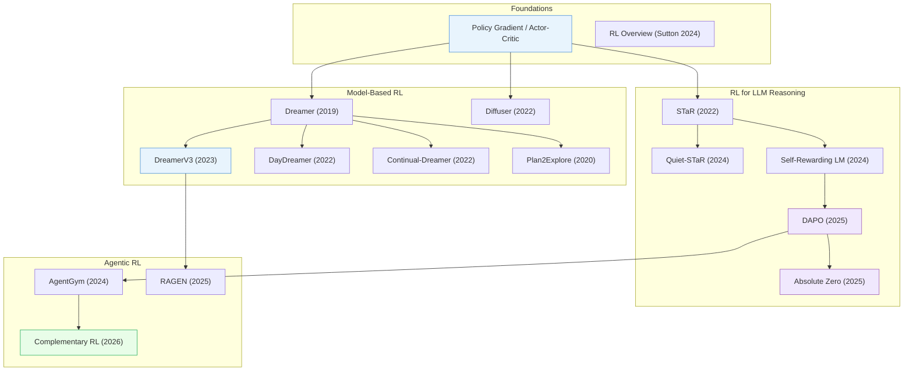

# Reinforcement Learning

> [!abstract] Overview
> RL has evolved from tabular methods to the backbone of modern AI reasoning. This note traces the major threads: foundational methods and theory, model-based RL with learned world models, policy optimization algorithms, RL for LLM reasoning (the post-DeepSeek-R1 paradigm), visual and multimodal RL, reward modeling, agentic RL, RL for robotics, and self-evolving systems. Each thread feeds into the next — world models enable sample-efficient robotics; RLHF enables reasoning LLMs; and agentic RL combines both.

## Evolution Graph

The field evolved through four threads: **model-based RL** (2019-2022) progressed from Dreamer's latent imagination through DayDreamer on real robots to Diffuser's diffusion-based planning; **RL for LLM reasoning** (2022-2025) advanced from STaR's self-taught bootstrapping through Self-Rewarding LMs and DAPO to Absolute Zero's fully zero-data self-play; **agentic RL** (2024-2026) scaled from AgentGym's multi-environment evolution through RAGEN's multi-turn training to Complementary RL's co-evolutionary framework.

| Year | Paper | Contribution |
|------|-------|-------------|
| -- | (foundational concept) | Policy gradient and actor-critic methods; the theoretical backbone of all deep RL |
| 2019 | [[1912.01603\|Dreamer]] | Learned behaviors by latent imagination; pioneered training RL policies entirely within a learned world model |
| 2020 | [[2005.05960\|Plan2Explore]] | Self-supervised exploration via world model disagreement; zero-shot task adaptation without task-specific training |
| 2022 | [[2206.14176\|DayDreamer]] | First deployment of Dreamer on real robots; proved sample-efficient learning from imagination works physically |
| 2022 | [[2211.15944\|Continual-Dreamer]] | Demonstrated world models enable effective continual RL without catastrophic forgetting across sequential tasks |
| 2022 | [[2205.09991\|Diffuser]] | First to use denoising diffusion for RL planning; treated trajectories as data to denoise |
| 2022 | [[2203.14465\|STaR]] | Self-taught reasoner bootstrapping its own rationales; created a self-improvement flywheel for LLM reasoning |
| 2023 | [[2301.04104\|DreamerV3]] | Mastered diverse domains with a single world model architecture; fixed-hyperparameter generalist agent |
| 2024 | [[2412.05265\|RL Overview]] | Kevin Murphy's comprehensive modern overview; the definitive reference for RL fundamentals |
| 2024 | [[2403.09629\|Quiet-STaR]] | Extended STaR to think before every token via internal rationales; token-level self-improvement |
| 2024 | [[2401.10020\|Self-Rewarding LM]] | Single model acts as both generator and judge via iterative DPO; broke the human-feedback bottleneck |
| 2024 | [[2406.04151\|AgentGym]] | Multi-environment agent evolution via behavioral cloning + self-evolution; generalist agent training |
| 2025 | [[2503.14476\|DAPO]] | Open-source RL system at scale for LLM reasoning; decoupled clip-higher and dynamic sampling |
| 2025 | [[2505.03335\|Absolute Zero]] | Zero-data self-play RL; model proposes tasks, solves, verifies via code, and retrains with no human data |
| 2025 | [[2504.20073\|RAGEN]] | Multi-turn RL training for LLM agents; established the paradigm for sustained agent-environment interaction |
| 2026 | [[2603.17621\|Complementary RL]] | Co-evolutionary RL framework where multiple agents improve each other through complementary objectives |

---

## 1. Foundations, Surveys & Theory

The theoretical bedrock of RL — comprehensive overviews, taxonomies, and fundamental theoretical contributions that define the field's vocabulary, scope, and open problems.

**Comprehensive Overviews** — Broad surveys mapping the RL landscape and its major sub-fields.
- [[2604.00626|On-Policy Distillation Survey]], [[2603.25681|LLM Self-Improvement Survey]], [[2603.24517|AVO]], [[2601.12538|Agentic Reasoning Survey]], [[2512.16301|Agentic AI Adaptation Survey]], [[2511.18538|Code Intelligence Survey]], [[2510.02665|MLLM Self-Improvement Survey]], [[2509.08827|RL for LRM Survey]], [[2509.02547|Agentic RL Survey]], [[2508.08189|RL for Large Models Survey]], [[2505.04921|LMRM Survey]], [[2505.02665|Slow Thinking LLM Survey]], [[2505.00551|DeepSeek-R1 Replication Survey]], [[2504.21277|Reinforced MLLM Survey]], [[2504.09037|LLM Reasoning Frontiers Survey]], [[2504.03151|Multimodal Reasoning Survey]], [[2501.09686|Large Reasoning Models Survey]], [[2501.09223|LLM Foundations]], [[2501.02189|VLM Survey 2025]], [[2412.05265|RL Overview]], [[2410.19878|PEFT Methodologies Survey]], [[2408.13296|LLM Fine-Tuning Guide]], [[2408.07666|Model Merging Survey]]

> [!star] Key Papers
> - [[2412.05265|RL Overview]] — Sutton's comprehensive modern overview; the definitive reference for RL fundamentals
> - [[2501.09686|Large Reasoning Models Survey]] — First systematic survey of RL-based reasoning in LLMs; maps the post-DeepSeek-R1 landscape
> - [[2508.08189|RL for Large Models Survey]] — Comprehensive mapping of visual RL applied to large multimodal models

**Causal RL** — Connecting causal inference with RL to enable more principled and generalizable decision-making.
- [[2307.01452|Causal RL Survey 2307]], [[2302.05209|Causal RL Survey 2023]]

> [!star] Key Papers
> - [[2302.05209|Causal RL Survey 2023]] — First comprehensive taxonomy connecting causal inference with RL

**Continual & Lifelong RL** — Agents that learn across sequential tasks without catastrophic forgetting.
- [[2603.24350|Emergent Self]], [[2506.21872|Continual RL Survey]], [[2410.19925|MLLM Continual Learning]], [[1612.00796|EWC]]

> [!star] Key Papers
> - [[1612.00796|EWC]] — Foundational method for overcoming catastrophic forgetting; Elastic Weight Consolidation remains the baseline for all continual learning
> - [[2506.21872|Continual RL Survey]] — First comprehensive survey dedicated to continual RL; defines the taxonomy and open problems

**Meta-RL** — Learning-to-learn for RL: agents that can quickly adapt to new tasks by leveraging prior experience.
- [[2301.08028|Meta-RL Tutorial]]

> [!star] Key Papers
> - [[2301.08028|Meta-RL Tutorial]] — Definitive tutorial unifying meta-RL definitions and algorithms; essential reference for the sub-field

**Evolutionary Strategies vs Deep RL** — Comparative analysis of gradient-free vs gradient-based approaches to policy optimization.
- [[2604.07725|Squeeze Evolve]], [[2602.00170|Blessing of Dimensionality LLM]], [[2509.26354|Misevolution]], [[2509.24372|Evolution Strategies at Scale]], [[2501.15129|EvoRL]], [[2402.06912|ES Linear Policy]], [[2110.01411|DRL vs ES Survey]]

> [!star] Key Papers
> - [[2501.15129|EvoRL]] — JAX-based GPU-accelerated framework achieving 60x speedup for evolutionary RL
> - [[2602.00170|Blessing of Dimensionality LLM]] — Explains why evolution strategies work for LLM fine-tuning with small populations

**Training Dynamics & Scaling** — Understanding what happens during RL training at scale — batch sizing, network pruning, entropy dynamics, and spectral analysis.
- [[2509.21128|RL Squeezes SFT Expands]], [[2508.16546|SFT vs RL Spectral Analysis]], [[2507.06187|Delta Learning Hypothesis]], [[2505.22617|Entropy Collapse in RL]], [[2412.01951|Sharpening Mechanism]], [[2410.17517|Maynard-Cross Learning]], [[2407.10490|LLM Finetuning Dynamics]], [[2402.12479|Pruned Networks in Deep RL]], [[1812.06162|Large-Batch Training]]

> [!star] Key Papers
> - [[1812.06162|Large-Batch Training]] — OpenAI's gradient noise scale; foundational for understanding batch size in deep RL
> - [[2505.22617|Entropy Collapse in RL]] — Identifies universal policy entropy collapse in RL for LLMs; a key failure mode to watch for
> - [[2508.16546|SFT vs RL Spectral Analysis]] — Reveals that SFT causes OOD generalization issues that RL avoids, via spectral lens

**SFT vs RL Generalization** — Why RL generalizes where supervised fine-tuning memorizes — a central question for post-training.
- [[2512.17636|TRAPO]], [[2512.12690|SFT vs RL VLM Study]], [[2501.17161|SFT Memorizes RL Generalizes]]

> [!star] Key Papers
> - [[2501.17161|SFT Memorizes RL Generalizes]] — Landmark finding: SFT makes models memorize training distributions, while RL makes them generalize to unseen problems
> - [[2512.17636|TRAPO]] — Unifies SFT and RL within a single trajectory-level preference optimization framework

**Test-Time Scaling & Compute** — Trading inference compute for better reasoning — search, verification, and adaptive depth at test time.
- [[2510.08189|R-Horizon]], [[2503.24235|Test-Time Scaling Survey]], [[2407.14414|System-1.x]]

> [!star] Key Papers
> - [[2503.24235|Test-Time Scaling Survey]] — Unified four-axis taxonomy for the rapidly growing test-time scaling field
> - [[2407.14414|System-1.x]] — Dynamic balancing between fast System-1 and deliberate System-2 processing in LLMs

> [!tip] The SFT vs RL Divide
> The key insight from 2025: SFT teaches models to *reproduce* patterns, RL teaches them to *solve* problems. For reasoning tasks, RL generalizes where SFT memorizes. But SFT remains essential for format/instruction following — the best pipelines use SFT then RL.

---

## 2. Model-Based RL & World Models

The Dreamer lineage: learning a latent world model, then "dreaming" in it to train a policy. This is the foundation for World Action Models (WAMs) in robotics.

**Dreamer Lineage** — The core trajectory from latent imagination through scalable general agents to real-robot deployment.
- [[2604.02911|DreamTIP]], [[2604.02260|Time-Varying MBRL]], [[2503.21047|CBET-DreamerV3]], [[2301.04104|DreamerV3]], [[2211.15944|Continual-Dreamer]], [[2206.14176|DayDreamer]], [[1912.01603|Dreamer]]

> [!star] Key Papers
> - [[1912.01603|Dreamer]] — Pioneered latent imagination: learn a world model in latent space, generate synthetic rollouts, train the policy entirely in imagination
> - [[2301.04104|DreamerV3]] — Generalized Dreamer to 130+ diverse domains with a single set of hyperparameters; introduced symlog predictions for stable learning
> - [[2206.14176|DayDreamer]] — First to deploy Dreamer on physical robots (A1 quadruped, UR5 arm), learning from scratch in hours

**Exploration & Curiosity** — Self-supervised exploration strategies that drive world model improvement and zero-shot task adaptation.
- [[2603.28386|COvolve]], [[2603.15789|OmniReset]], [[2509.03771|Co-Evolving MARL]], [[2503.23631|Intrinsic Motivation Human-Agent Study]], [[2503.01584|SENSEI]], [[2502.05726|ACCEL]], [[2411.13852|ESRM]], [[2408.05804|Single-Goal Contrastive RL]], [[2305.13622|SER]], [[2112.15402|RER]], [[2007.07853|gamma-Progress]], [[2005.05960|Plan2Explore]], [[1901.01753|POET]], [[1810.12894|RND]], [[1705.05363|ICM]]

> [!star] Key Papers
> - [[2005.05960|Plan2Explore]] — Curiosity-driven exploration in world model latent space; explores to maximize world model improvement, then adapts zero-shot
> - [[2503.01584|SENSEI]] — Semantic exploration with epistemic uncertainty + Go-Explore for versatile world models

**Diffusion & Flow-Based Planning** — Reframing RL as iterative denoising or flow matching over trajectories, enabling flexible conditioning on rewards and constraints.
- [[2604.00202|DreamControl-v2]], [[2603.04333|floq]], [[2205.09991|Diffuser]]

> [!star] Key Papers
> - [[2205.09991|Diffuser]] — Planning as diffusion over trajectories; reframed RL as iterative denoising, enabling flexible conditioning on rewards, constraints, and skills
> - [[2603.04333|floq]] — Explains the empirical success of flow-matching critics in Temporal Difference learning

**JEPA & Latent Prediction for RL** — Joint-Embedding Predictive Architectures adapted for RL, predicting future states in latent space rather than pixel space.
- [[2512.07733|SpatialDreamer]], [[2504.16591|JEPA for RL]], [[2502.14819|PLDM]]

> [!star] Key Papers
> - [[2502.14819|PLDM]] — Planning with Latent Dynamics Models from NYU/Meta FAIR; leveraging reconstruction-free latent dynamics for control

**Active Inference** — Perception-action loops grounded in free energy minimization, scaling to continuous control.
- [[1911.10601|Scaling Active Inference]]

> [!star] Key Papers
> - [[1911.10601|Scaling Active Inference]] — First to scale active inference to continuous control domains; bridges free energy theory with practical deep RL

**World Model Theory & Formal Results** — Theoretical foundations proving when and why world models are necessary for generalization.
- [[2604.03208|HWM]], [[2604.01985|WAV]], [[2603.29090|HCLSM]], [[2603.28963|AutoWorld]], [[2603.28955|WAM]], [[2602.06130|SWIRL]], [[2512.09929|OWM]], [[2506.01622|General Agents World Models]], [[2501.10100|RWM]], [[2206.02072|VSRL]]

> [!star] Key Papers
> - [[2506.01622|General Agents World Models]] — Google DeepMind formally proves that agents capable of generalizing to multi-step, goal-directed tasks must build world models

**Offline Model-Based RL** — Learning world models from fixed datasets without further environment interaction, enabling safe policy improvement.
- [[2505.13709|Policy-Driven WM Adaptation]], [[2504.16680|RWM-U]], [[2410.00564|JOWA]], [[2310.06253|Objective Mismatch MBRL Survey]], [[1803.10122|World Models]]

> [!star] Key Papers
> - [[2504.16680|RWM-U]] — Uncertainty-aware world model for real-robot offline RL; bridges sim-to-real with calibrated uncertainty
> - [[2505.13709|Policy-Driven WM Adaptation]] — Joint WM-policy optimization via Stackelberg dynamics; resolves objective mismatch with state-of-the-art robustness
> - [[2310.06253|Objective Mismatch MBRL Survey]] — Unified taxonomy for decision-aware MBRL; foundational reference for the objective-mismatch problem

**Continual & Online World Models** — World models that update online without catastrophic forgetting, supporting lifelong learning.
- [[2604.08958|WOMBET]], [[2603.04029|Self-Adapting RL]], [[2602.00475|GRASP]], [[2507.09177|Online Agent (OA)]]

> [!star] Key Papers
> - [[2602.00475|GRASP]] — Gradient-based planning enabling world models to solve long-horizon control tasks

> [!tip] Why This Matters for Robotics
> The Dreamer to DayDreamer to DreamerV3 lineage directly enables WAMs like DreamZero. The key insight: learning in imagination is orders of magnitude more sample-efficient than real-world trial-and-error. JEPA-based latent prediction is the next frontier — faster and more robust than pixel-space generation.

---

## 3. Policy Optimization

Direct methods for optimizing policies — from classic PPO through modern GRPO variants, KL-regularized objectives, and tree-structured search. This is the algorithmic engine behind both LLM reasoning and robot control.

**GRPO & Variants** — Group Relative Policy Optimization and its derivatives, the dominant paradigm for RL-based LLM reasoning post-DeepSeek-R1.
- [[2604.02288|SRPO]], [[2603.24984|MoE-GRPO]], [[2602.05547|MT-GRPO]], [[2511.06411|SofT-GRPO]], [[2509.25849|Knapsack-GRPO]], [[2509.06040|BranchGRPO]], [[2508.09726|GFPO]], [[2507.21848|EDGE-GRPO]], [[2506.16141|GRPO-CARE]], [[2506.13923|Guide-GRPO]], [[2505.22257|Off-Policy GRPO]], [[2505.05470|Flow-GRPO]], [[2504.00883|vsGRPO]], [[2503.20783|Dr. GRPO]], [[2503.14476|DAPO]]

> [!star] Key Papers
> - [[2503.14476|DAPO]] — Open-source large-scale GRPO system; demonstrated that RL at scale produces reasoning capabilities that SFT cannot
> - [[2503.20783|Dr. GRPO]] — Critical analysis of R1-Zero-like training; identifies and fixes key failure modes in GRPO
> - [[2505.22257|Off-Policy GRPO]] — Formalized off-policy extension for GRPO; enables more sample-efficient training

**PPO & Proximal Methods** — PPO-family algorithms adapted for LLM and multimodal model training, with emphasis on credit assignment and stability.
- [[2602.04879|DPPO]], [[2508.17784|PSFT]], [[2508.08221|Lite PPO]], [[2506.15050|T-PPO]], [[2410.01679|VinePPO]]

> [!star] Key Papers
> - [[2410.01679|VinePPO]] — Replaces PPO's learned value function with vine-based credit assignment; more precise step-level rewards
> - [[2506.15050|T-PPO]] — Truncated PPO significantly enhances training efficiency for LLM reasoning

**DPO, Preference & Alignment** — Direct Preference Optimization and its multimodal extensions — aligning models with human preferences without explicit reward models.
- [[2604.01840|PGPO]], [[2603.28618|PRCO]], [[2603.28204|ERPO]], [[2603.25077|ToR]], [[2603.23355|ReVal]], [[2603.22117|RLVR Direction]], [[2603.21383|PivotRL]], [[2603.19835|FIPO]], [[2602.22703|GEODPO]], [[2511.15605|SRPO]], [[2510.16333|PIVOT]], [[2509.26346|EditReward]], [[2509.26074|LENS]], [[2509.14234|CaT]], [[2509.11452|Multi-Objective RL Alignment]], [[2509.07414|LSP]], [[2507.08068|QRPO]], [[2506.21495|Offline-Online RL for LLMs]], [[2506.16895|STRUCTURE Alignment]], [[2504.16801|DeGLA]], [[2504.15619|AdaViP]], [[2504.12717|RaFA]], [[2502.08922|SCIR]], [[2411.19309|GRAPE]], [[2411.10442|MPO]], [[2411.04109|SCPO]], [[2410.12735|CREAM]], [[2410.02355|AlphaEdit]], [[2210.05639|DPO]]

> [!star] Key Papers
> - [[2506.21495|Offline-Online RL for LLMs]] — Shows DPO adapted to online or hybrid settings matches full RL performance at lower cost
> - [[2411.10442|MPO]] — Mixed Preference Optimization with scalable automated pipeline for constructing multimodal preferences

**Value & Advantage-Based Methods** — Methods that improve value estimation and advantage computation for more stable and efficient RL training.
- [[2602.02710|MaxRL]], [[2507.20673|GMPO]], [[2505.20686|A*-PO]], [[2504.19599|GVPO]], [[2504.05118|VAPO]]

> [!star] Key Papers
> - [[2504.05118|VAPO]] — Value-model-based RL that reliably enhances LLM performance on challenging math reasoning
> - [[2505.20686|A*-PO]] — A*-search-inspired policy optimization via optimal advantage regression

**Tree Search & MCTS** — Monte Carlo Tree Search integrated with RL for structured exploration during training and inference.
- [[2604.01434|VOIMCP]], [[2509.25454|DeepSearch]], [[2509.09284|Tree-OPO]], [[2508.17445|TreePO]], [[2506.11902|TreeRL]], [[2406.06592|OmegaPRM]], [[2406.03816|ReST-MCTS*]]

> [!star] Key Papers
> - [[2506.11902|TreeRL]] — On-policy RL with tree search for structured exploration; improves sample quality during training
> - [[2406.03816|ReST-MCTS*]] — Automated process reward model generation via MCTS for LLM self-training

**Off-Policy & Sample Efficiency** — Methods that reuse past experience or manage data more efficiently for RL fine-tuning.
- [[2510.18927|BAPO]], [[2510.02245|ExGRPO]], [[2509.04501|GRAPE]], [[2509.01321|DEPO]], [[2505.11081|ShiQ]], [[2503.19612|AGRO]], [[2503.02269|Experience Replay Random Reshuffling]]

> [!star] Key Papers
> - [[2505.11081|ShiQ]] — Off-policy Q-learning for LLM fine-tuning; enables reuse of generated data across iterations
> - [[2509.01321|DEPO]] — Data-Efficient Policy Optimization; significantly improves sample efficiency of RLVR

**Entropy & Diversity Regularization** — Combating mode collapse and entropy collapse in RL-trained models through regularization and diversity-aware objectives.
- [[2603.30036|CoT Monitorability]], [[2510.20817|MARA]], [[2510.03222|Lp-Reg]], [[2509.25133|SIREN]], [[2509.02534|Darling]], [[2506.01939|High-Entropy Token RLVR]]

> [!star] Key Papers
> - [[2509.25133|SIREN]] — Selective entropy regularization to mitigate entropy collapse; targets high-uncertainty tokens
> - [[2509.02534|Darling]] — Diversity-Aware RL from Meta FAIR; integrates diversity directly into the RL objective

**KL Divergence & Regularization Theory** — Theoretical and practical work on KL-regularized policy gradients, a fundamental tool in RLHF.
- [[2506.09477|KL Divergence Gradient Pitfalls]], [[2505.17508|RPG]]

> [!star] Key Papers
> - [[2506.09477|KL Divergence Gradient Pitfalls]] — Meta FAIR identifies widespread implementation errors in KL divergence gradient estimation; critical for correct RLHF

**Multi-Turn & Agentic Policy Optimization** — Extending RLVR beyond single-turn QA to multi-step, multi-turn, and agentic settings.
- [[2509.22638|FCP]], [[2509.07980|Parallel-R1]], [[2509.02333|DCPO]], [[2504.20571|1-shot RLVR]], [[2504.20073|RAGEN]]

> [!star] Key Papers
> - [[2504.20073|RAGEN]] — Showed that single-turn RLVR doesn't transfer to multi-step tasks; introduced StarPO for multi-turn RL
> - [[2504.20571|1-shot RLVR]] — Achieves competitive reasoning with just 1 rollout per sample; extreme sample efficiency

**Efficient & Practical RL Training** — Infrastructure, precision tricks, and engineering insights for scaling RL training to production.
- [[2510.26788|FP16 RL Training]], [[2505.24034|LlamaRL]], [[2505.07291|INTELLECT-2]], [[2404.08233|GPBT-PL]]

> [!star] Key Papers
> - [[2505.24034|LlamaRL]] — Meta's distributed asynchronous RL framework for large-scale LLM training
> - [[2510.26788|FP16 RL Training]] — Demonstrates FP16 precision works for RL training; halves memory cost

**Hybrid SFT + RL Pipelines** — Methods that combine supervised fine-tuning with RL in unified or staged training recipes.
- [[2603.12248|EBFT]], [[2602.01058|PEAR]], [[2601.06993|ReFine-RFT]], [[2512.12690|SFT vs RL VLM Study]], [[2510.10606|ViSurf]], [[2507.01679|Prefix-RFT]], [[2506.13056|Metis-RISE]], [[2505.03181|AFSFT]], [[2504.14945|LUFFY]], [[2504.11343|RAFT++]]

> [!star] Key Papers
> - [[2510.10606|ViSurf]] — Unified single-stage post-training integrating SFT and RL; avoids the two-stage overhead
> - [[2601.06993|ReFine-RFT]] — Identifies the "Cost of Thinking" where excessive textual reasoning hurts; balances verbal and visual reasoning

**Variational & Information-Theoretic Approaches** — Principled probabilistic methods treating reasoning traces as latent variables or information bottlenecks.
- [[2509.22637|Variational Reasoning]], [[2507.18391|IBRO]], [[2505.18454|HRPO]]

> [!star] Key Papers
> - [[2509.22637|Variational Reasoning]] — Treats thinking traces as latent variables; principled framework for reasoning optimization

**Miscellaneous Policy Methods** — Other notable approaches to policy optimization that cross boundaries.
- [[2512.13607|Nemotron-Cascade]], [[2512.01374|MiniRL]], [[2509.24981|ROVER]], [[2509.24207|Humanline]], [[2509.03646|HICRA]]

> [!star] Key Papers
> - [[2509.24207|Humanline]] — Explains why online RL outperforms offline methods from a human cognitive science perspective
> - [[2512.01374|MiniRL]] — Qwen Team's theoretical justification for token-level optimization in sequential decision-making

> [!success] The Post-R1 RL Recipe
> ==SFT warm-up== (instruction following + format compliance) → ==GRPO with verifiable rewards== (math/code execution as signal) → ==Distillation== to smaller models. Stable large-scale GRPO training with decoupled clip-higher and dynamic sampling. Even 1.5B models gain reasoning; zero-data bootstrapping works via self-play RL.

> [!tip] The GRPO Revolution
> Post-DeepSeek-R1, GRPO replaced PPO as the default RL algorithm for LLM reasoning. Key improvements: Dr. GRPO fixes training instabilities, DAPO scales to production, and Off-Policy GRPO enables sample reuse. For new projects, start with DAPO or GRPO-CARE.

---

## 4. RL for LLM Reasoning

The post-DeepSeek-R1 paradigm: using RL (especially GRPO) to teach LLMs to reason step-by-step, often surpassing supervised fine-tuning. This section covers the reasoning methods themselves; policy optimization algorithms are in Section 3.

**Bootstrapped Self-Training** — The STaR lineage: iterative self-improvement where the model generates, filters, and fine-tunes on its own reasoning traces.
- [[2512.15687|G2RL]], [[2505.21444|SRT]], [[2505.17746|Fast Quiet-STaR]], [[2505.03335|Absolute Zero]], [[2403.09629|Quiet-STaR]], [[2203.14465|STaR]]

> [!star] Key Papers
> - [[2203.14465|STaR]] — Iterative bootstrapping: LLM generates rationales, keeps correct ones, fine-tunes, repeat. 6B GPT-J matches 175B GPT-3
> - [[2403.09629|Quiet-STaR]] — Extends STaR to think before every token, learning internal rationales from general text
> - [[2505.03335|Absolute Zero]] — Zero-data RL: model proposes its own problems, solves them, uses verifiable answers as reward — no human data at all

**Self-Rewarding & Self-Improvement** — Models that generate their own training signal, eliminating external reward models or human annotation.
- [[2604.03128|Self-Distilled RLVR]], [[2604.03098|Self-Guide]], [[2602.12275|OPCD]], [[2601.21343|Self-Improving Pretraining]], [[2601.20802|SDPO]], [[2601.19897|SDFT]], [[2601.18734|OPSD]], [[2512.05356|Co-Improving AI]], [[2509.23236|Self-Reflection VLM]], [[2509.15155|Self-Improving EFM]], [[2508.14460|DuPO]], [[2508.05004|R-Zero]], [[2507.16663|MLLM Self-Improvement]], [[2506.10139|ICM]], [[2506.07468|SELF-REDTEAM]], [[2505.19590|INTUITOR]], [[2410.15639|Self-Developing]], [[2401.10020|Self-Rewarding LM]]

> [!star] Key Papers
> - [[2401.10020|Self-Rewarding LM]] — LLM generates its own reward signal; eliminates the need for a separate reward model
> - [[2508.05004|R-Zero]] — LLMs self-evolve reasoning via self-generated problems and rewards; fully autonomous

**Chain-of-Thought Reasoning** — Training LLMs to produce explicit step-by-step reasoning, with RL as the training signal.
- [[2506.07751|AbstRaL]], [[2505.20561|BARL]], [[2505.14631|LHRM]], [[2505.13308|LATENTSEEK]], [[2505.11896|AdaCoT]], [[2505.10425|L2T]], [[2503.24290|Open-Reasoner-Zero]], [[2503.10460|Light-R1]]

> [!star] Key Papers
> - [[2503.24290|Open-Reasoner-Zero]] — First comprehensive open-source reproduction of R1-Zero; reference implementation for the field
> - [[2505.10425|L2T]] — Learning to Think: fine-tunes LLMs to achieve higher reasoning accuracy with significantly fewer tokens

**Adaptive & Efficient Reasoning** — Methods that teach models when and how much to reason, optimizing the compute-accuracy tradeoff.
- [[2604.05355|ETR]], [[2604.01658|CORAL]], [[2603.28730|SOLE-R1]], [[2603.27866|Wan-R1]], [[2601.22628|TTCS]], [[2601.19280|GDRO]], [[2601.18067|EvolVE]], [[2512.06835|DoGe]], [[2512.02472|R-FEW]], [[2511.07317|RLVE]], [[2510.25992|SRL]], [[2510.09001|DARO]], [[2510.01135|PCL]], [[2508.02150|Self-Supervised RL IF]], [[2507.22607|VL-Cogito]], [[2506.03295|CFT]], [[2505.20258|ARM]], [[2505.15612|LASER]], [[2505.14970|SEC]], [[2505.13438|AnytimeReasoner]], [[2505.13379|Thinkless]], [[2504.05520|ADARFT]], [[2503.16188|Think or Not Think]]

> [!star] Key Papers
> - [[2505.13379|Thinkless]] — RL-based framework that teaches LLMs to skip reasoning when unnecessary; optimizes compute allocation
> - [[2505.13438|AnytimeReasoner]] — Produces usable reasoning at any compute budget; true anytime behavior

**RL Pre-Training** — Applying RL during pre-training rather than just post-training, fundamentally changing how models learn from data.
- [[2512.07203|MMRPT]], [[2512.03442|PretrainZero]], [[2510.01265|RLP]], [[2509.25810|RA3]], [[2506.08007|RPT]]

> [!star] Key Papers
> - [[2506.08007|RPT]] — Reinforcement Pre-Training: reframes next-token prediction as RL; models learn reasoning during pre-training
> - [[2512.03442|PretrainZero]] — Self-supervised reinforcement active pretraining without human data

**Reasoning-Enhanced LLMs (General)** — Complete reasoning model training pipelines and notable reasoning-enhanced LLMs.
- [[2507.12507|Nemotron]], [[2506.13585|MiniMax-M1]], [[2506.13284|AceReason-Nemotron]], [[2505.00949|Llama-Nemotron]], [[2504.21318|Phi-4-reasoning]], [[2504.21233|Phi-4-Mini-Reasoning]], [[2504.13828|Cognition Engineering]], [[2502.06772|ReasonFlux]], [[2501.11223|RLM Blueprint]]

> [!star] Key Papers
> - [[2505.00949|Llama-Nemotron]] — NVIDIA's open-source reasoning models achieving state-of-the-art across benchmarks
> - [[2506.13585|MiniMax-M1]] — Hybrid MoE architecture with Lightning Attention; scales reasoning efficiently
> - [[2501.11223|RLM Blueprint]] — ETH Zurich's comprehensive modular blueprint for Reasoning Language Models

**Search-Augmented Reasoning** — Teaching LLMs to interleave reasoning with external search and retrieval, learned end-to-end via RL.
- [[2505.04588|ZeroSearch]], [[2504.21776|WebThinker]], [[2503.19470|ReSearch]], [[2503.09516|Search-R1]], [[2503.05592|R1-Searcher]]

> [!star] Key Papers
> - [[2503.09516|Search-R1]] — RL trains LLMs to autonomously interleave reasoning with search; outperforms pipeline RAG approaches
> - [[2505.04588|ZeroSearch]] — Trains LLMs to use search by simulating search engines with LLMs; zero real search calls needed

**Verification & Process Rewards** — Learning to verify reasoning steps and assign process-level rewards for more reliable training signals.
- [[2508.13755|DARS-Breadth]], [[2506.14245|CoT-Pass@K]], [[2506.09026|e3]], [[2506.05316|DOTS]], [[2410.08146|PAV]], [[2408.15240|GenRM]]

> [!star] Key Papers
> - [[2408.15240|GenRM]] — Reframes reward modeling as next-token prediction; generative verifiers outperform discriminative ones
> - [[2410.08146|PAV]] — Process Advantage Verifiers measure step-level progress; fine-grained credit assignment

**RLVR Theory & Analysis** — Understanding why and how Reinforcement Learning with Verifiable Rewards works, including failure modes and surprising phenomena.
- [[2604.03993|Noisy Supervision Reasoning]], [[2512.23165|PEFT for RLVR]], [[2509.04259|RL's Razor]], [[2507.10532|RandomCalculation]], [[2506.17219|RLIF No Free Lunch]], [[2506.10947|Spurious Rewards RLVR]], [[2506.09967|Resa]], [[2505.11711|RL Sparse Subnetwork]]

> [!star] Key Papers
> - [[2506.10947|Spurious Rewards RLVR]] — Shows RLVR can improve reasoning even with partially spurious rewards; robustness result
> - [[2505.11711|RL Sparse Subnetwork]] — RL fine-tuning consistently activates sparse subnetworks; reveals structural changes in LLMs

**Internalized Reasoning & Latent Thought** — Moving reasoning from explicit text to internal latent representations, enabling faster and more efficient inference.
- [[2601.21598|ATP-Latent]], [[2601.18631|AdaReasoner]], [[2601.13562|Reasoning as Modality]], [[2601.05877|iReasoner]], [[2509.24251|LVR]]

> [!star] Key Papers
> - [[2509.24251|LVR]] — Latent Visual Reasoning: autoregressive reasoning directly within visual representations, bypassing text
> - [[2601.13562|Reasoning as Modality]] — Treats reasoning traces as a separate modality; novel role-separated transformer architecture

> [!tip] The Self-Improving Loop
> The frontier is self-sustaining improvement: STaR to Quiet-STaR to Absolute Zero to R-Zero. Each step removes more human supervision. The endgame is models that propose their own problems, solve them, verify solutions, and improve — no human data at all.

---

## 5. Visual & Multimodal RL

Applying RL (especially GRPO) to teach VLMs to reason visually — a direct extension of the LLM reasoning paradigm to multimodal models. The largest and fastest-growing thread in RL research.

**R1-Style Visual Reasoning** — Applying the DeepSeek-R1 recipe (GRPO + verifiable rewards) to vision-language models for visual chain-of-thought reasoning.
- [[2604.02268|SKILL0]], [[2603.26599|VGGRPO]], [[2603.23500|UniGRPO]], [[2603.22847|PEPO]], [[2603.09206|MM-Zero]], [[2602.07605|Fine-R1]], [[2602.03120|QES]], [[2601.10094|V-Zero]], [[2601.09667|MATTRL]], [[2601.09536|Omni-R1]], [[2601.07055|Dr. Zero]], [[2601.03872|ATLAS]], [[2511.16901|AVST-Zero]], [[2511.13054|ViSS-R1]], [[2511.01191|Self-Harmony]], [[2510.03259|MASA]], [[2510.02752|Self-Aware RL for LLMs]], [[2510.02263|RLAD]], [[2509.25541|Vision-Zero]], [[2509.15194|EVOL-RL]], [[2509.12132|Reflection-V]], [[2509.02479|SimpleTIR]], [[2509.01656|ReV PT]], [[2508.11737|Ovis2.5]], [[2508.04416|VITAL]], [[2507.20766|RRVF]], [[2507.19849|ARPO]], [[2507.16814|SOPHIA]], [[2507.16518|C2-Evo]], [[2507.08838|wd1]], [[2507.01949|Kwai Keye-VL]], [[2507.01006|GLM-4.5V]], [[2506.24119|SPIRAL]], [[2506.09033|Router-R1]], [[2506.08989|SwS]], [[2506.07218|Perception-R1]], [[2506.04207|ReVisual-R1]], [[2506.03569|MiMo-VL]], [[2505.24726|Reflect Retry Reward]], [[2505.17018|SophiaVL-R1]], [[2505.16854|TON]], [[2505.15809|MMaDA]], [[2505.14677|Visionary-R1]], [[2505.13934|RLVR-World]], [[2505.13031|MindOmni]], [[2505.12434|VIDEORFT]], [[2505.08617|OpenThinkIMG]], [[2505.07062|Seed1.5-VL]], [[2505.03981|X-Reasoner]], [[2505.00703|T2I-R1]], [[2504.18397|UV-CoT]], [[2504.16656|Skywork R1V2]], [[2504.16129|MARFT]], [[2504.16084|TTRL]], [[2504.08837|VL-Rethinker]], [[2504.08672|Genius]], [[2504.07615|VLM-R1]], [[2504.07491|Kimi-VL]], [[2504.04736|SWiRL]], [[2503.21776|Video-R1]], [[2503.20752|Reason-RFT]], [[2503.17352|OpenVLThinker]], [[2503.12797|DeepPerception]], [[2503.07523|VisRL]], [[2503.07365|MM-Eureka]], [[2503.06749|Vision-R1]], [[2503.01785|Visual-RFT]]

> [!star] Key Papers
> - [[2503.06749|Vision-R1]] — First R1-style RL for VLMs with visual CoT; opened the floodgate
> - [[2504.07615|VLM-R1]] — Stable, generalizable R1-style VLM training; the reference open-source implementation
> - [[2505.07062|Seed1.5-VL]] — ByteDance's production-grade multimodal reasoning model; SOTA on 38/60 benchmarks
> - [[2506.03569|MiMo-VL]] — Xiaomi's 7B model achieving SOTA visual reasoning; proves small models can reason

**Visual Grounding & Spatial RL** — Teaching VLMs to ground reasoning in precise visual regions, coordinates, and spatial relationships via RL.
- [[2603.26499|AIRA2]], [[2603.25629|LanteRn]], [[2603.22435|CaP-X]], [[2602.23959|NV-CoT]], [[2602.23615|HART]], [[2602.03733|RegionReasoner]], [[2601.21634|RSGround-R1]], [[2601.15224|PROGRESSLM]], [[2601.04777|GeM-VG]], [[2512.20617|SpatialTree]], [[2512.15160|EagleVision]], [[2512.12633|DiG]], [[2512.10554|GETok]], [[2511.05491|VST]], [[2510.27606|Spatial-SSRL]], [[2507.13362|VLM Spatial Reasoning RL]], [[2507.08306|M2-Reasoning]], [[2507.05920|MGPO]], [[2507.05255|OVR]], [[2506.22624|Seg-R1]], [[2506.21656|SpatialReasoner-R1]], [[2506.21458|MINDCUBE]], [[2506.09965|VILASR]], [[2505.19702|Point-RFT]], [[2505.19255|VTool-R1]], [[2505.19094|SATORI]], [[2505.15879|GRIT]], [[2505.15804|STAR-R1]], [[2505.14231|UniVG-R1]]

> [!star] Key Papers
> - [[2505.15804|STAR-R1]] — State-of-the-art spatial reasoning by anchoring each CoT step to visual regions
> - [[2506.22624|Seg-R1]] — RL-based pixel-level segmentation with reasoning; bridges language and dense prediction
> - [[2505.19702|Point-RFT]] — Explicitly grounds CoT steps to specific visual coordinates; precise spatial reasoning

**Dynamic Visual Attention** — Teaching VLMs to adaptively look at images — zooming, cropping, and selecting visual regions via RL-learned policies.
- [[2602.11858|ZwZ]], [[2602.08241|SAYO]], [[2601.13942|GoG]], [[2511.19820|CropVLM]], [[2508.06259|SIFThinker]], [[2507.13348|VisionThink]], [[2506.17218|Mirage]], [[2505.24025|DINO-R1]], [[2505.23727|PixelThink]], [[2505.21457|ACTIVE-O3]], [[2505.16192|VLM-R3]], [[2505.15436|Adaptive-CoF]]

> [!star] Key Papers
> - [[2505.16192|VLM-R3]] — Dynamic visual region selection via RL; models learn where to look
> - [[2602.11858|ZwZ]] — "Zooming without Zooming": RL teaches VLMs to mentally zoom without changing input resolution
> - [[2505.24025|DINO-R1]] — Group Relative Query Optimization for vision foundation models; extends RL beyond language heads

**Visual Reasoning Segmentation** — Zero-shot and reasoning-guided segmentation driven by RL rather than supervised masks.
- [[2602.09463|SpotAgent]], [[2510.21311|FineRS]], [[2505.12081|VisionReasoner]], [[2503.06520|Seg-Zero]]

> [!star] Key Papers
> - [[2503.06520|Seg-Zero]] — Pure RL framework for reasoning segmentation; emergent CoT for segmentation without supervised masks

**Video & Temporal Reasoning** — RL for video understanding, temporal reasoning, and 4D spatial-temporal intelligence.
- [[2603.00515|MLLM-4D]], [[2603.00461|ReMoT]], [[2601.19686|Video-KTR]], [[2510.23569|EgoThinker]], [[2510.23473|Video-Thinker]], [[2505.19000|VerIPO]], [[2504.01805|SpaceR]]

> [!star] Key Papers
> - [[2505.19000|VerIPO]] — Verifier-guided iterative policy optimization for deep, consistent video reasoning
> - [[2603.00515|MLLM-4D]] — Equips MLLMs with 4D spatial-temporal intelligence; perceive and reason over dynamic 3D scenes

**Multi-Image & Document Reasoning** — RL for reasoning across multiple images, documents, and complex visual inputs.
- [[2602.00574|Modal-Mixed CoT]], [[2512.24297|FIGR]], [[2510.09733|EVisRAG]], [[2507.00748|Multi-Image Grounding RL]], [[2506.22434|MiCo]], [[2505.22019|VRAG-RL]], [[2505.14362|DeepEyes]]

> [!star] Key Papers
> - [[2505.22019|VRAG-RL]] — RL teaches VLMs to understand visually rich documents via retrieval-augmented generation
> - [[2505.14362|DeepEyes]] — VLMs perform "thinking with images" by dynamically integrating visual re-observation into reasoning

**Multimodal Self-Improvement** — VLMs that improve themselves from their own outputs, without external reward models or human feedback.
- [[2603.29493|MemFactory]], [[2603.22179|MARCUS]], [[2603.19370|VAMPO]], [[2603.18886|RLLM]], [[2603.17693|SynRL]], [[2603.08403|SPIRAL]], [[2603.03857|DeepScan]], [[2603.02511|Unveiler]], [[2602.21992|PanoEnv]], [[2602.21628|RuCL]], [[2602.21158|SELAUR]], [[2602.13949|ERL]], [[2602.11241|Active-Zero]], [[2602.08234|SkillRL]], [[2602.04837|GEA]], [[2602.02488|RLAnything]], [[2602.02150|ECHO]], [[2601.19099|m2sv]], [[2601.10825|Societies of Thought]], [[2601.06794|ECHO]], [[2601.03054|IBISAgent]], [[2601.02356|Talk2Move]], [[2512.24330|SenseNova-MARS]], [[2512.23169|REVEALER]], [[2512.22545|SR-MCR]], [[2512.20675|VLM Reward Objectives]], [[2512.19133|WorldRFT]], [[2512.18552|SSR]], [[2512.17312|CodeDance]], [[2512.14666|EVOLVE-VLA]], [[2512.13644|DexWM]], [[2512.09924|ReViSE]], [[2512.03746|CodeVision]], [[2511.18373|MASS]], [[2511.16166|EvoVLA]], [[2511.16077|VideoSeg-R1]], [[2511.14759|RECAP]], [[2511.11113|VIDEOP2R]], [[2511.11007|VisMem]], [[2510.26583|Emu3.5]], [[2510.24684|SPICE]], [[2510.24285|ViPER]], [[2510.23925|LaCoT]], [[2510.23595|MAE]], [[2510.23038|TIR-Judge]], [[2510.22832|HRM-Agent]], [[2510.20607|Compositional Energy Minimization]], [[2510.19307|RIL]], [[2510.19245|See Think Act Shopper]], [[2510.17045|V-Reason]], [[2510.16079|EVOLVER]], [[2510.12693|ERA]], [[2510.10603|EA4LLM]], [[2510.09606|SpaceVista]], [[2510.08558|Early Experience]], [[2510.08191|Training-Free GRPO]], [[2510.01132|Multi-turn Agentic RL Guide]], [[2509.26626|RSA]], [[2509.24527|Dreamer 4]], [[2509.22643|VLA-Reasoner]], [[2509.07969|Mini-o3]], [[2509.01055|VerlTool]], [[2508.20722|rStar2-Agent]], [[2508.13167|CoA]], [[2508.11630|Thyme]], [[2508.10874|SSRL]], [[2508.09736|M3-Agent]], [[2508.07976|ASearcher]], [[2508.03680|Agent Lightning]], [[2507.21053|FPO]], [[2507.20534|Kimi K2]], [[2507.16815|ThinkAct]], [[2507.07969|Q-chunking]], [[2507.02092|EBT]], [[2506.21669|SEEA-R1]], [[2506.10943|SEAL]], [[2506.06122|ROLL]], [[2506.02096|SynthRL]], [[2505.23747|Spatial-MLLM]], [[2505.23678|ViGoRL]], [[2505.23590|Jigsaw-R1]], [[2505.23585|OPO]], [[2505.23380|UniRL]], [[2505.23224|MMBoundary]], [[2505.22651|Sherlock]], [[2505.22453|MM-UPT]], [[2505.22334|Multimodal RL Cold Start]], [[2505.19223|LLaDA 1.5]], [[2505.18600|CoZ]], [[2505.14246|Visual-ARFT]]

> [!star] Key Papers
> - [[2505.22453|MM-UPT]] — Unsupervised Post-Training for multimodal LLMs; self-improvement without any human labels
> - [[2506.02096|SynthRL]] — Automated pipeline synthesizing increasingly challenging visual reasoning tasks for RL training
> - [[2602.02488|RLAnything]] — Completely dynamic RL system enabling self-improvement across arbitrary visual domains

**RL-Distilled Compact Models** — Distilling RL-trained reasoning into smaller, deployable models.
- [[2510.12798|Rex-Omni]], [[2505.11221|LVLM2P]], [[2504.15777|Tina]], [[2504.11468|VLAA-Thinker]], [[2504.07934|ThinkLite-VL]]

> [!star] Key Papers
> - [[2504.07934|ThinkLite-VL]] — Visual reasoning models achieving SOTA with significantly fewer parameters via distillation
> - [[2504.15777|Tina]] — Highly cost-effective approach to visual reasoning; proves RL-distilled small models are viable

**Visual Planning & Tool Use** — RL teaches VLMs to plan visually, use tools, and generate executable visual programs.
- [[2603.14117|SIEVE]], [[2602.11073|VILAVT]], [[2511.19661|CodeV]], [[2505.20289|VisTA]], [[2505.11409|VPRL]]

> [!star] Key Papers
> - [[2505.11409|VPRL]] — Visual Planning via RL: multi-step reasoning solely through sequences of images
> - [[2511.19661|CodeV]] — Code-based visual agent with Tool-Aware Policy Optimization; addresses unfaithful visual reasoning

**Embodied Visual Reasoning** — RL for visual reasoning in physically grounded, 3D settings — bridging perception and action.
- [[2602.00795|DVLA-RL]], [[2512.13660|RoboTracer]], [[2511.20814|SPHINX]], [[2511.20351|HVS]], [[2507.10548|EmbRACE-3K]], [[2506.08011|ViGaL]], [[2504.12680|Embodied-R]]

> [!star] Key Papers
> - [[2504.12680|Embodied-R]] — Enables foundation models to perform embodied spatial reasoning by combining CoT with physical grounding
> - [[2507.10548|EmbRACE-3K]] — 3,000 embodied reasoning tasks in photorealistic environments; benchmark for embodied visual RL

**Multimodal Benchmarks for RL** — Benchmarks specifically designed to evaluate RL-trained visual reasoning.
- [[2602.08346|ThinkWithImages-PRMBENCH]], [[2506.14965|GURU]], [[2505.24760|REASONING GYM]], [[2505.15966|Pixel Reasoner]], [[2504.15279|VisuLogic]]

> [!star] Key Papers
> - [[2504.15279|VisuLogic]] — Evaluates true visual reasoning (not text shortcuts) through carefully designed visual logic puzzles
> - [[2505.24760|REASONING GYM]] — 100+ procedurally generated environments with verifiable rewards; the gym for RL reasoning research

**General Multimodal RL Infrastructure** — Cross-cutting tools, frameworks, and analysis for multimodal RL research.
- [[2603.18656|SCALe-SFT]], [[2602.20739|PyVision-RL]], [[2602.14697|E-SPL]], [[2602.12395|Frankenstein RL Analysis]], [[2602.04145|BIS]], [[2601.05242|GDPO]], [[2601.00215|Sight to Insight]]

> [!star] Key Papers
> - [[2602.12395|Frankenstein RL Analysis]] — Mechanistic analysis of how RL improves VLMs; reveals which components change and why
> - [[2601.00215|Sight to Insight]] — Identifies that visual perception, not reasoning, primarily limits multimodal LLM performance

> [!tip] The Visual RL Explosion
> After Vision-R1 (March 2025), visual RL papers appeared at a rate of 10+ per week. The core recipe is simple: GRPO + VLM + verifiable visual task. The frontier is dynamic visual attention (learning *where* to look) and latent visual reasoning (reasoning without generating text).

---

## 6. Reward Modeling & Verification

Learning and designing reward signals for RL training — from hand-crafted rewards through learned reward models to reasoning-based verification. The quality of the reward model is the ceiling for RL performance.

**Process Reward Models** — Models that evaluate individual reasoning steps rather than just final answers, enabling fine-grained credit assignment.
- [[2604.03037|ARM]], [[2509.23250|VL-PRM]], [[2506.23235|EndoRM]], [[2506.13888|VL-GenRM]], [[2506.02095|CycleReward]], [[2505.02387|RM-R1]], [[2504.16828|THINKPRM]], [[2504.02495|DeepSeek-GRM]], [[2503.13551|HRM]], [[2503.10291|VisualPRM]]

> [!star] Key Papers
> - [[2504.02495|DeepSeek-GRM]] — Self-Principled Critique Tuning: point-wise reward models with self-generated principles
> - [[2504.16828|THINKPRM]] — Generative PRM enabling LLMs to provide verbalized, step-level evaluation
> - [[2506.23235|EndoRM]] — Reveals powerful reward models are already latent within any LLM; no separate training needed

**Reward Model Surveys & Analysis** — Understanding what reward models learn, how they fail, and how to improve them.
- [[2604.07480|Active RM Inference]], [[2506.07326|Reward Model Interpretability]], [[2504.12328|Reward Model Survey]]

> [!star] Key Papers
> - [[2504.12328|Reward Model Survey]] — Comprehensive survey consolidating RM research in the LLM era; introduces unified taxonomy

**Outcome & Reasoning Reward Models** — Reward models that evaluate full reasoning chains and final outcomes, including self-rewarding and reasoning-based approaches.
- [[2604.16004|AgentV-RL]], [[2604.11626|RationalRewards]], [[2603.16253|EVPV]], [[2603.02115|Robometer]], [[2511.10648|SCS]], [[2511.09158|CRM]], [[2511.01758|RLAC]], [[2510.23596|BR-RM]], [[2510.15242|DWRL]], [[2510.08696|LENS]], [[2510.07242|HERO]], [[2506.03637|RewardAnything]], [[2505.14674|RRM]], [[2505.03318|UNIFIEDREWARD-THINK]]

> [!star] Key Papers
> - [[2604.16004|AgentV-RL]] — Forward/Backward bidirectional agentic verifier with Python-tool integration; beats 70B INF-ORM by 25.2pp on MATH500 with only 4B params
> - [[2505.03318|UNIFIEDREWARD-THINK]] — First unified reasoning reward model; evaluates all modalities with explicit chain-of-thought
> - [[2506.03637|RewardAnything]] — Reward models that follow natural language principles; infinitely customizable
> - [[2510.07242|HERO]] — Integrates sparse verifier signals with dense generative rewards; best of both worlds

**Reward Design for Images & Vision** — Reward signals specifically designed for visual tasks — perceptual quality, visual grounding, and image reasoning.
- [[2512.08889|VALOR]], [[2302.08242|Reward Tuning CV]]

> [!star] Key Papers
> - [[2302.08242|Reward Tuning CV]] — Pioneered applying RL reward tuning to computer vision tasks

**Self-Evolving Reward Models** — Reward models that improve themselves over time without additional human annotation.
- [[2511.19900|Agent0-VL]], [[2511.16672|EvoLMM]]

> [!star] Key Papers
> - [[2511.19900|Agent0-VL]] — Self-evolving vision-language agent integrating tool usage into reward learning

**Calibration & Safety** — Reward models that are well-calibrated, safe, and resistant to reward hacking.
- [[2507.16806|RLCR]], [[2505.16186|SafeKey]], [[2412.09544|POWER-DL]]

> [!star] Key Papers
> - [[2505.16186|SafeKey]] — Enhances safety for Large Reasoning Models without sacrificing reasoning performance
> - [[2507.16806|RLCR]] — Calibration Rewards: trains LLMs to know what they know and express appropriate confidence

**Reward-Free & Verifier-Free RL** — Methods that bypass explicit reward models entirely, using self-consistency, code execution, or other verification proxies.
- [[2506.18254|RLPR]], [[2506.10128|ViCrit]], [[2505.21493|VeriFree]]

> [!star] Key Papers
> - [[2505.21493|VeriFree]] — Trains LLMs for general reasoning without any verifier; uses self-generated training signal
> - [[2506.18254|RLPR]] — Verifier-free RL that enables reasoning without external verification

> [!tip] The Reward Model Hierarchy
> Outcome rewards (right/wrong) are simple but coarse. Process rewards (step-by-step) are precise but expensive. Reasoning reward models (UNIFIEDREWARD-THINK, RRM) get the best of both: dense step-level signal from a model that reasons about reasoning. The endgame is EndoRM — the reward model is already inside the LLM.

---

## 7. Agentic RL

RL for multi-turn, tool-using, and self-evolving agents — the bridge between reasoning models and autonomous systems. These agents don't just answer questions; they take actions, observe results, and adapt.

**Multi-Turn Agent Frameworks** — RL training for agents that interact with environments over multiple steps, using tools and APIs.
- [[2604.06268|RAGEN-2]], [[2603.17621|Complementary RL]], [[2603.05218|KARL]], [[2507.21046|Self-Evolving Agents Survey]], [[2504.20073|RAGEN]], [[2406.04151|AgentGym]]

> [!star] Key Papers
> - [[2406.04151|AgentGym]] — Cross-environment agent training with behavioral cloning + reward-weighted RL
> - [[2603.17621|Complementary RL]] — Co-evolutionary loop between policy actor and experience extractor; 1.3x performance with 2x fewer actions
> - [[2603.05218|KARL]] — Off-policy RL for knowledge agents; Pareto-optimal on enterprise search, 37% shorter trajectories

**Self-Evolving Agents** — Agents that improve their own strategies, generate their own curricula, and bootstrap their own training data.
- [[2603.25111|SEVerA]], [[2603.24533|UI-Voyager]], [[2603.18743|Memento-Skills]], [[2602.21633|SC-VLA]], [[2602.20133|AdaEvolve]], [[2602.06508|World-VLA-Loop]], [[2602.00359|A-EVOLVE]], [[2511.16043|Agent0]], [[2511.10395|AgentEvolver]], [[2508.04700|SEAgent]]

> [!star] Key Papers
> - [[2603.18743|Memento-Skills]] — Skill library as external memory; agents evolve without parameter updates, +13.7pp on GAIA
> - [[2511.16043|Agent0]] — Fully autonomous agent that self-improves through experience without human feedback

**Retrieval-Augmented Agents** — RL teaches agents to effectively retrieve and reason over external knowledge.
- [[2509.01092|REFRAG]], [[2505.20046|REARANK]], [[2505.04588|ZeroSearch]], [[2504.21776|WebThinker]], [[2503.19470|ReSearch]], [[2503.09516|Search-R1]], [[2503.05592|R1-Searcher]]

> [!star] Key Papers
> - [[2504.21776|WebThinker]] — Equips LRMs with autonomous web search during deep reasoning

**Embodied Agent RL** — RL for physically grounded agents that plan and act in 3D environments.
- [[2603.30022|Hybrid LLM-RL Manipulation]], [[2602.23320|ParamMem]], [[2602.21198|Reflective Test-Time Planning]], [[2601.16175|TTT-Discover]], [[2506.23061|DyME]]

> [!star] Key Papers
> - [[2602.21198|Reflective Test-Time Planning]] — Embodied LLMs learn to plan via RL-driven reflection at test time

**Agent Infrastructure & Benchmarks** — Frameworks, environments, and evaluation tools for agentic RL.
- [[2602.04118|TinyLoRA]], [[2511.21395|Monet]], [[2511.17473|MR-RLVR]], [[2511.15661|VisPlay]], [[2505.24760|REASONING GYM]], [[2406.18505|LLM-Xavier]]

> [!star] Key Papers
> - [[2406.18505|LLM-Xavier]] — Empirical study of LLMs constructing mental models of RL environments; probes LLM world understanding

**RL for Code & Tool Agents** — Teaching agents to write and use code, tools, and APIs through RL.
- [[2512.08511|SubagentVL]], [[2512.04563|COOPER]], [[2511.01618|Actial]], [[2507.00417|ASTRO]]

> [!star] Key Papers
> - [[2507.00417|ASTRO]] — Three-stage framework teaching LLMs structured tool reasoning via RL

**RL for Human Decision Explanation** — Using RL to model and explain human decision-making processes.
- [[2505.11614|RL for Human Decision Explanation]]

> [!star] Key Papers
> - [[2505.11614|RL for Human Decision Explanation]] — Novel use of RL to train LLMs as cognitive models of human decision-making; bridges AI and cognitive science

> [!tip] The Self-Evolving Connection
> Agentic RL connects directly to self-evolving AI: agents that use RL to improve their own strategies, generate their own curricula, and bootstrap their own training data. The trajectory: AgentGym to RAGEN to Agent0 to Memento-Skills.

---

## 8. RL + Robotics

RL methods designed for or applied to physical robot learning — sample efficiency, safety, and real-world deployment constraints make robotics RL fundamentally different from LLM RL.

**VLA RL Post-Training** — Applying RL to fine-tune Vision-Language-Action models beyond what imitation learning alone achieves.
- [[2604.17706|OmniVLA-RL]], [[2604.08168|ViVa]], [[2604.05614|GPLA]], [[2604.02523|Tune to Learn]], [[2603.27670|ProgressVLA]], [[2603.27164|daVinci-LLM]], [[2603.26666|VLA-OPD]], [[2603.25406|MMaDA-VLA]], [[2603.28116|AutoDrive-P3]], [[2602.01789|RFS]], [[2509.19301|ResFiT]], [[2509.09674|SimpleVLA-RL]], [[2508.18269|FlowVLA]], [[2506.08440|TGRPO]], [[2505.18719|VLA-RL]], [[2505.17016|RIPT-VLA]], [[2504.04259|ORCA Hand]], [[2503.16806|DyWA]], [[2502.14795|Humanoid-VLA]]

> [!star] Key Papers
> - [[2604.17706|OmniVLA-RL]] — Flow-GSPO: reformulates flow matching as SDE for stable online RL; 97.6% on LIBERO with faster convergence than PPO/GRPO
> - [[2505.18719|VLA-RL]] — First systematic RL framework for VLAs; showed RL post-training consistently improves over SFT
> - [[2506.08440|TGRPO]] — Trajectory-wise GRPO adapted for VLA fine-tuning; bridges LLM RL and robot RL

**Model-Based Robot RL** — World-model-based approaches for sample-efficient robot learning.
- [[2604.02260|Time-Varying MBRL]], [[2603.18336|ManiDreams]], [[2504.16680|RWM-U]], [[2501.10100|RWM]], [[2410.00564|JOWA]], [[2207.07560|SkiMo]], [[2206.14176|DayDreamer]]

> [!star] Key Papers
> - [[2603.18336|ManiDreams]] — World model generates diverse manipulation scenarios; dream-based RL for dexterous tasks

**MPC + RL for Control** — Combining Model Predictive Control with learned RL policies for structured, physically-grounded control.
- [[2502.02133|MPC-RL Survey]]

**RL for LLM-Guided Robotics** — RL methods where LLMs guide robot behavior through reasoning, planning, or reward specification.
- [[2604.03023|Behavior-Constrained RL]], [[2604.02021|Discrete-Continuous Planning Bridge]], [[2603.02203|T3RL]], [[2602.06556|LIBERO-X]], [[2602.02605|ESMA]], [[2602.01166|LaRA-VLA]], [[2504.13818|PODS]], [[2502.13130|Magma]]

> [!star] Key Papers
> - [[2502.13130|Magma]] — Microsoft's foundation model unifying multimodal understanding with physical action generation
> - [[2603.02203|T3RL]] — Test-Time Training for RL: adapts robot policies online using world model gradients

**Sim-to-Real & Transfer** — Bridging the gap between simulation and physical deployment for robot RL.
- [[2604.07457|CMP]], [[2502.17666|IC-QL]], [[2411.14251|NLRL]], [[2201.02373|Mirror Learning]]

> [!star] Key Papers
> - [[2201.02373|Mirror Learning]] — Unifying theoretical framework for diverse policy optimization methods; connects RL algorithms under one roof

**RL Infrastructure & Scaling** — Engineering and scaling RL systems for real-world robot deployment.
- [[2604.06943|Sustainable Transfer RL]], [[2604.04539|FlashSAC]], [[2604.01158|SMASH]], [[2603.03279|ULTRA]], [[2512.20605|Internal RL]], [[2510.22512|TRL]], [[2505.24864|ProRL]], [[2009.12293|robosuite]], [[2604.08706|RL Experience Replay for LLMs]]

> [!star] Key Papers
> - [[2505.24864|ProRL]] — NVIDIA's Prolonged RL for expanding LLM reasoning to complex robot planning domains

**Contrastive & Self-Supervised RL** — Self-supervised methods that learn useful representations for RL without labeled rewards.
- [[2602.11832|JEPA-VLA]], [[2510.16416|SSL4RL]], [[2506.11967|Annotation Bootstrapping]], [[2503.14858|CRL]], [[2604.11805|Sim2Reason]]

> [!star] Key Papers
> - [[2510.16416|SSL4RL]] — Reinterprets self-supervised learning tasks as intrinsic verifiable rewards for RL
> - [[2506.11967|Annotation Bootstrapping]] — Recasts visual pre-training as RL; learns annotation policies that improve downstream performance

**Offline & Batch RL** — Learning policies from fixed datasets without further interaction, critical for safety-sensitive robot applications.
- [[2509.06870|AggLM]], [[2508.03100|AVATAR]], [[2410.18252|Asynchronous RLHF]], [[2410.01735|LASeR]], [[2511.07820|SONIC]], [[2603.22201|NMR]]

> [!star] Key Papers
> - [[2508.03100|AVATAR]] — Off-policy RL framework enhancing reasoning from static experience buffers
> - [[2410.01735|LASeR]] — Multi-Armed Bandits for dynamic reward model selection; adapts to changing task requirements

> [!tip] The RL for Robotics Recipe
> The proven pipeline: pre-train with imitation learning, then post-train with RL (VLA-RL, TGRPO). For sample efficiency, use a world model (DayDreamer, RWM-U). For deployment, combine MPC structure with learned RL policies.

---

## 9. Miscellaneous RL Applications

RL methods applied to specialized domains and cross-cutting applications that span multiple categories.

**LLM Post-Training & Distillation** — General post-training methodologies and knowledge distillation approaches using RL.
- [[2604.01193|SSD Code Generation]], [[2603.10160|ReMix]], [[2512.16918|AdaTooler-V]], [[2512.18552|SSR]], [[2512.17636|TRAPO]], [[2512.02834|TACO]], [[2512.01119|World Model Surprise Robustness]], [[2511.14565|Masked IRL]], [[2511.09515|WMPO]], [[2511.00091|PLD]], [[2510.25889|piRL]], [[2510.15047|SPA]], [[2510.12710|Reflective Self-Adaptation]], [[2510.00406|VLA-RFT]], [[2509.23958|RLIR]], [[2509.19292|SOE]], [[2509.18830|DexSkin]], [[2509.15937|VLAC]], [[2508.12790|Rubicon]], [[2508.05629|DFT]], [[2508.02298|CAPO]], [[2507.17746|RaR]], [[2506.12851|KungfuBot]], [[2505.22094|ReinFlow]], [[2505.07538|Selftok]], [[2505.01441|ARTIST]], [[2505.00024|Nemotron-Research-Tool-N1]], [[2504.18471|AFM]], [[2504.18053|DREAM]], [[2504.13958|ToolRL]], [[2504.13055|NoisyRollout]], [[2504.12216|d1]], [[2504.11536|ReTool]], [[2503.23383|ToRL]], [[2503.07572|MRT]], [[2503.03746|Process-based Self-Rewarding]], [[2502.21321|LLM Post-Training Survey]], [[2502.02316|DIME]], [[2501.13926|CoT Image Generation]], [[2501.01478|MCTS Process Supervision]], [[2412.02818|RoboMD]], [[2409.18869|Emu3]], [[2405.10292|VLM-RL Fine-Tuning]], [[2403.12884|HYDRA]], [[2401.05946|TDB]], [[2310.06114|UniSim]], [[2203.03485|Self-directed Exploratory Planning]], [[2604.08865|SPPO]], [[2604.11297|MEDS]]

> [!star] Key Papers
> - [[2502.21321|LLM Post-Training Survey]] — Comprehensive survey of post-training for LLMs; maps the full SFT-to-RL pipeline
> - [[2508.12790|Rubicon]] — Extends RLVR to subjective and open-ended tasks; broadens RL beyond math/code

**RL for Structured Prediction** — RL applied to ranking, retrieval, and other structured output tasks.
- [[2604.02035|RL Speculative Trading]], [[2508.14313|AIRL-S]], [[2505.20046|REARANK]], [[2505.13445|RISE]], [[2604.08545|Metis]]

> [!star] Key Papers
> - [[2505.13445|RISE]] — RL trains LLMs to iteratively search and refine; generalizes beyond single-shot generation

**RL for Safety & Alignment** — Methods ensuring RL-trained models remain safe, truthful, and aligned with human values.
- [[2509.20357|RLMT]], [[2509.15172|MACA]], [[2509.03518|LLM Lying]], [[2507.16806|RLCR]], [[2505.16186|SafeKey]], [[2506.19807|KnowRL]]

> [!star] Key Papers
> - [[2509.20357|RLMT]] — Model-rewarded Thinking: uses model's own confidence as reward for improved truthfulness

**RL-Enhanced Multimodal Architectures** — Novel architectures that fundamentally integrate RL into their design rather than using it as post-training.
- [[2602.04884|RAL]], [[2602.03806|COBALT]], [[2602.03143|SAGE]], [[2602.02605|ESMA]], [[2511.10279|PROPA]], [[2507.00432|Math Reasoning Transferability]], [[2506.13351|DRO]], [[2506.08388|RLTs]], [[2505.18129|V-Triune]], [[2505.16673|R1-ShareVL]], [[2604.08539|OpenVLThinkerV2]]

> [!star] Key Papers
> - [[2505.18129|V-Triune]] — Triple unified RL system enabling VLMs to simultaneously improve reasoning, grounding, and perception
> - [[2602.04884|RAL]] — Reinforced Attention Learning: optimizes internal attention distributions via RL post-training

**RL + Generation** — RL for improving image generation, 3D generation, and creative outputs.
- [[2512.07733|SpatialDreamer]], [[2506.08011|ViGaL]], [[2604.10962|ScoRe-Flow]]

> [!star] Key Papers
> - [[2512.07733|SpatialDreamer]] — Uses active mental imagery via RL to incentivize spatial reasoning in generative models
> - [[2506.08011|ViGaL]] — RL-based game play for learning generalizable visual reasoning; bridges generation and understanding

**Continual & Test-Time RL** — RL methods that continue learning at deployment time or adapt to distribution shifts.
- [[2603.02203|T3RL]], [[2602.21198|Reflective Test-Time Planning]], [[2601.16175|TTT-Discover]], [[2604.11138|ViserDex]], [[2604.11768|GC-PFO]]

> [!star] Key Papers
> - [[2601.16175|TTT-Discover]] — Test-time training enabling LLMs to learn and adapt to novel patterns during inference

**RL + Program Synthesis** — RL for theorem proving, code generation, and formal verification.
- [[2504.21801|DeepSeek-Prover-V2]], [[2503.16219|Open-RS]], [[2509.23285|Tool-Light]]

> [!star] Key Papers
> - [[2504.21801|DeepSeek-Prover-V2]] — RL-enhanced formal theorem proving with recursive proof search and subgoal decomposition

> [!tip] RL is Everywhere
> RL is no longer just a training method — it's becoming an architectural principle. From attention optimization (RAL) to pre-training (RPT) to test-time adaptation (TTT-Discover), RL permeates every layer of modern AI systems.

---

## Cross-References

- [[07_Robotics-and-Embodied-AI]] — VLAs, WAMs, and embodied systems (RL is the training backbone)
- [[11_Self-Evolving-AI]] — Broader self-evolving paradigm
- [[06_Video-and-Temporal]] — Video generation as world modeling
- [[01_Foundation-Models]] — Transformer/LLM foundations that RL fine-tunes

---

*Next: [[01_Foundation-Models]] for the Transformer/LLM foundations that RL fine-tunes.*
