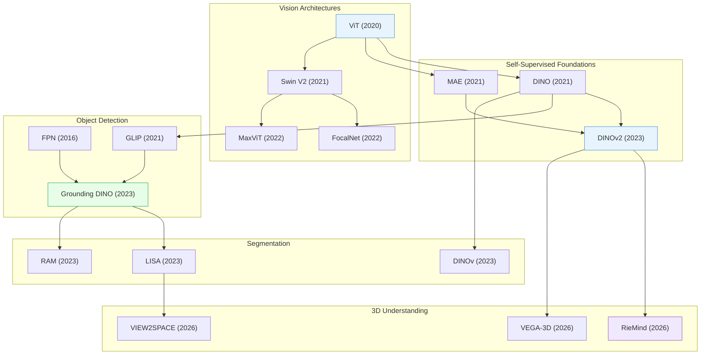

# Computer Vision & 3D Understanding

> [!abstract] Overview
> From feature pyramids to open-vocabulary detection to 3D scene understanding, this note covers the perception stack that underpins embodied AI. The key trends: (1) moving from closed-set recognition to open-world, grounded, and 3D-aware perception, (2) self-supervised pre-training replacing supervised ImageNet features, (3) Vision Transformers replacing CNNs across every sub-task, and (4) efficient architectures enabling real-time deployment.

- [[2604.11302|3D-ALP]]

- [[2604.10953|DRL-3DBP]]

- [[2511.01294|Kinematify]]

## Evolution Graph

The field evolved through four phases: **backbone design** (2016-2022) where ViT, Swin V2, FocalNet, and FPN established the architectural vocabulary; **self-supervised feature learning** (2021-2023) where DINO, MAE, and DINOv2 eliminated label dependence; **open-vocabulary perception** (2021-2023) where GLIP, Grounding DINO, LISA, and RAM made detection and segmentation language-driven; and **3D spatial reasoning** (2023-2026) where RieMind, VEGA-3D, and VIEW2SPACE pushed models from 2D recognition into metric 3D understanding.

| Year | Paper | Contribution |
|------|-------|-------------|
| 2016 | [[1612.03144\|FPN]] | Top-down feature pyramid with lateral connections; foundational multi-scale architecture for object detection |
| 2020 | [[2010.11929\|ViT]] | Proved pure Transformers on image patches match CNNs; foundational backbone for all downstream architectures |
| 2021 | [[2104.14294\|DINO]] | Self-distillation without labels; ViT attention maps emerge as object segmenters |
| 2021 | [[2111.06377\|MAE]] | Masked 75% of image patches and reconstructed pixels; scalable self-supervised pretraining at 3-4x lower cost |
| 2021 | [[2111.09883\|Swin Transformer V2]] | Scaled window attention to 3B parameters with stable training; solved the low-to-high resolution transfer gap |
| 2021 | [[2112.03857\|GLIP]] | Unified detection and phrase grounding; learned object-level language-aware representations for open-vocabulary transfer |
| 2022 | [[2203.11926\|FocalNet]] | Attention-free focal modulation for efficient long-range interactions; SOTA on detection and segmentation with lower cost |
| 2022 | [[2204.01697\|MaxViT]] | Multi-axis attention combining blocked local and dilated global interactions with linear complexity |
| 2023 | [[2304.07193\|DINOv2]] | Scaled self-supervised learning to 142M images; universal visual features rivaling CLIP without text supervision |
| 2023 | [[2303.05499\|Grounding DINO]] | Deep language-vision fusion in DINO detector; 52.5 AP zero-shot on COCO for open-set detection |
| 2023 | [[2308.00692\|LISA]] | Reasoning segmentation via LLM; generates pixel masks from implicit natural language queries |
| 2023 | [[2306.03514\|RAM]] | Open-vocabulary image tagging foundation model trained on annotation-free web data; 86.0 mAP on OpenImages |
| 2023 | [[2311.13601\|DINOv]] | Visual in-context prompting for unified segmentation; open-set generalization via purely visual cues |
| 2026 | [[2603.15386\|RieMind]] | Geometry-grounded agent decoupling perception from reasoning via 3D Scene Graph tools; +16% on VSI-Bench |
| 2026 | [[2603.19235\|VEGA-3D]] | Integrates video diffusion priors for dense geometric cues; improves MLLM spatial reasoning without 3D supervision |
| 2026 | [[2603.16506\|VIEW2SPACE]] | Benchmark for multi-view reasoning from sparse observations; grounded CoT with visual evidence training |

---

## 1. Vision Transformer Architectures

The backbone revolution: Vision Transformers replaced CNNs as the default architecture for nearly all perception tasks. The design space spans pure transformers (ViT), hierarchical multi-scale architectures (Swin, MPViT), CNN-transformer hybrids (CMT, ViT-CoMer), and efficiency-focused designs for high-resolution or resource-constrained deployment.

**Foundational Architectures** — The original ViT and its hierarchical extensions that introduced multi-scale feature processing to transformers.
- [[2312.17686|BMViT]], [[2204.01697|MaxViT]], [[2112.11010|MPViT]], [[2112.01526|MViTv2]], [[2111.09883|Swin Transformer V2]], [[2105.13677|ResT]], [[2010.11929|ViT]], [[2603.25744|MuRF]]

> [!star] Key Papers
> - [[2010.11929|ViT]] — Proved a pure Transformer can match CNNs on image classification; launched the ViT era
> - [[2111.09883|Swin Transformer V2]] — Scaled to 3B parameters with shifted-window attention; established the hierarchical ViT blueprint

**CNN-Transformer Hybrids** — Combine convolutional inductive biases (locality, translation equivariance) with transformer global attention for better speed-accuracy tradeoffs.
- [[2403.11999|HIRI-ViT]], [[2403.07392|ViT-CoMer]], [[2107.06263|CMT]]

> [!star] Key Papers
> - [[2403.07392|ViT-CoMer]] — Convolutional multi-scale feature interaction inside ViT; strong on detection and segmentation without extra FPN

**Attention Innovations** — Novel attention mechanisms that improve efficiency, multi-scale coverage, or token allocation within vision transformers.
- [[2604.02327|SteerViT]], [[2508.02124|DMA]], [[2507.00505|LLaVA-SP]], [[2505.22195|S2AFormer]], [[2308.12216|SG-Former]], [[2304.06250|RSIR Transformer]], [[2203.11926|FocalNet]], [[2107.00641|Focal Transformer]]

> [!star] Key Papers
> - [[2203.11926|FocalNet]] — Attention-free focal modulation; achieves strong results without self-attention, proving attention is not the only path

**Efficient & Scalable ViTs** — Architectures optimized for throughput, memory, and deployment on resource-constrained hardware.
- [[2603.22570|CanViT]], [[2510.18091|APT]], [[2505.20802|Leaner Transformers]], [[2307.09120|LW PLG-ViT]], [[2306.06189|FasterViT]], [[2205.14756|EfficientViT]], [[2107.02239|ViX]], [[2103.15358|ViL]]

> [!star] Key Papers
> - [[2306.06189|FasterViT]] — NVIDIA's hybrid design with hierarchical attention; Pareto-optimal across speed and accuracy
> - [[2510.18091|APT]] — Adaptive Patch Transformers that dynamically reduce spatial tokens; accelerates ViTs without retraining

**Resolution Flexibility** — Methods enabling a single ViT to handle arbitrary resolutions or aspect ratios at inference time.
- [[2403.18361|ViTAR]], [[2403.13298|RoPE-Mixed]], [[2307.06304|NaViT]], [[2212.08013|FlexiViT]]

> [!star] Key Papers
> - [[2307.06304|NaViT]] — Processes images at native resolution and aspect ratio; eliminates distortion from forced resizing

**Dense Prediction Adaptation** — Adapters and modifications that turn plain ViTs into strong backbones for detection, segmentation, and depth estimation without pre-training changes.
- [[2603.15031|AttnRes]], [[2502.01962|META]], [[2412.18090|MPI Tuning]], [[2205.08534|ViT-Adapter]], [[2203.16527|ViTDet]]

> [!star] Key Papers
> - [[2203.16527|ViTDet]] — Proved plain non-hierarchical ViTs can rival specialized architectures on detection when paired with simple FPN

**Positional Encoding & Internal Representations** — Studies on how ViTs encode position, semantics, and hierarchy internally.
- [[2602.10551|C2RoPE]], [[2601.15275|RayRoPE]], [[2601.05328|BFD]], [[2510.08638|Minkowski Representation Hypothesis]], [[2310.18969|ViT Class Embedding Analysis]]

> [!star] Key Papers
> - [[2510.08638|Minkowski Representation Hypothesis]] — Showed DINOv2 internally represents visual concepts in a Minkowski-like geometric structure

**Surveys** — Comprehensive reviews of vision transformer architectures, designs, and trends.
- [[2309.02031|Efficient ViT Survey]], [[2305.09880|ViT CNN-Transformer Survey]], [[2111.06091|Visual Transformers Survey]], [[2101.01169|Transformers in Vision Survey]]

> [!star] Key Papers
> - [[2101.01169|Transformers in Vision Survey]] — First comprehensive survey of ViTs; established the taxonomy that later surveys build on
> - [[2309.02031|Efficient ViT Survey]] — Focused review of efficiency techniques for ViTs; essential for deployment-oriented work

> [!tip] Choosing a ViT Backbone
> For general-purpose tasks, start with DINOv2 features. For detection, use ViTDet or ViT-CoMer. For efficiency-constrained deployment, FasterViT and EfficientViT offer the best speed-accuracy tradeoffs.

---

## 2. Self-Supervised Visual Representation Learning

Learning powerful visual features without labels. Self-supervised pre-training now produces features that surpass ImageNet-supervised representations across nearly all downstream tasks, and forms the backbone for open-vocabulary detection, segmentation, and 3D understanding.

**Self-Distillation (DINO family)** — Learn representations by training a student network to match an exponential moving-average teacher, producing features with emergent segmentation properties.
- [[2304.07193|DINOv2]], [[2106.09785|EsViT]], [[2104.14294|DINO]], [[2104.03602|SiT]]

> [!star] Key Papers
> - [[2104.14294|DINO]] — Self-distillation with no labels; attention maps spontaneously segment objects
> - [[2304.07193|DINOv2]] — Curated data + distillation at scale; the current best general-purpose visual encoder

**Masked Image Modeling** — Reconstruct masked patches to learn rich spatial representations, analogous to masked language modeling in NLP.
- [[2304.03977|EMP-SSL]], [[2111.09886|SimMIM]], [[2111.06377|MAE]], [[2106.08254|BEiT]]

> [!star] Key Papers
> - [[2111.06377|MAE]] — Elegantly simple: mask 75% of patches, reconstruct pixels; scales effortlessly
> - [[2106.08254|BEiT]] — Predicts discrete visual tokens instead of pixels; bridged BERT-style pre-training to vision

**Predictive Architectures (JEPA)** — Predict abstract representations (not pixels) of masked regions, forcing the model to learn high-level semantics over low-level texture.
- [[2512.16922|NEPA]], [[2301.08243|I-JEPA]]

> [!star] Key Papers
> - [[2301.08243|I-JEPA]] — Joint-Embedding Predictive Architecture; learns semantic features by predicting representations, not pixel reconstructions

**Autoregressive & Multi-Crop** — Pre-training via autoregressive prediction of visual tokens or multi-crop contrastive learning at scale.
- [[2401.08541|AIM]], [[2303.11331|EVA-02]], [[2302.05442|ViT-22B]]

> [!star] Key Papers
> - [[2401.08541|AIM]] — Apple's autoregressive image model; proved autoregressive pre-training scales for vision just as for language
> - [[2302.05442|ViT-22B]] — 22B parameter ViT; established feasibility of scaling vision models to LLM-scale

**Foundation Model Unification** — Distilling or merging multiple vision foundation models into a single encoder.
- [[2412.07679|RADIOv2.5]], [[2312.06709|AM-RADIO]]

> [!star] Key Papers
> - [[2312.06709|AM-RADIO]] — Unifies CLIP, DINOv2, and SAM into one student model; best of all worlds in a single forward pass

**Domain-Specific Adaptation** — Adapting self-supervised models to specialized visual domains with limited labels.
- [[2511.20844|Pre-train to Gain]], [[2510.20994|VESSA]], [[2505.22196|Augmentation-Aware Contrastive Learning Theory]], [[2505.13584|SSL Segmentation Survey]], [[2406.09294|DINOv2]], [[2404.17202|Low-Data SSL Evaluation]]

> [!star] Key Papers
> - [[2510.20994|VESSA]] — Self-supervised adaptation to new visual domains without any labels; practical for medical/industrial deployment

**Initialization & Training Recipes** — Methods to improve ViT training stability, speed, or final performance through structured initialization or learning rate schedules.
- [[2507.17634|WSM]], [[2505.19985|Structured ViT Initialization]]

> [!star] Key Papers
> - [[2505.19985|Structured ViT Initialization]] — Embeds convolutional inductive biases into ViT attention at init; bridges the CNN-ViT gap on small datasets
> - [[2507.17634|WSM]] — Decay-free learning rate schedule via checkpoint merging; simplifies LLM pre-training with +1.3 avg benchmark improvement

> [!tip] The SSL Hierarchy
> DINO/DINOv2 for general-purpose features. MAE for tasks needing spatial detail (depth, segmentation). I-JEPA for semantic-level understanding. AM-RADIO if you need all properties in one model.

---

## 3. Object Detection

From closed-set detectors to open-vocabulary, language-grounded detection. The trajectory: multi-scale feature extraction (FPN) established the paradigm, transformer detectors eliminated hand-crafted components, and grounded pre-training opened detection to arbitrary categories described in natural language.

**Multi-Scale Feature Extraction** — Architectures that build and aggregate multi-resolution feature pyramids for detecting objects at varying scales.
- [[1803.01534|PANet]], [[1612.03144|FPN]]

> [!star] Key Papers
> - [[1612.03144|FPN]] — Feature Pyramid Networks: the multi-scale backbone that underlies nearly all modern detectors

**Open-Vocabulary & Grounded Detection** — Detect objects specified by free-form text or image-level labels, breaking the closed-category assumption.
- [[2604.02759|OMNI-PoseX]], [[2604.01179|Florence-2 ROS 2 Wrapper]], [[2603.14609|GroundSet]], [[2602.23759|Selfment]], [[2510.12798|Rex-Omni]], [[2506.23785|VisTex-OVLM]], [[2501.18954|LLMDet]], [[2412.16334|dino.txt]], [[2410.13842|D-FINE]], [[2410.08021|OneRef]], [[2408.10787|UniProj-Det]], [[2404.13013|Groma]], [[2404.09216|DetCLIPv3]], [[2404.07664|PROWL]], [[2403.10191|GenerateU]], [[2401.09865|SPARC]], [[2312.10439|SIC-CADS]], [[2307.12813|DOD]], [[2306.09683|OWLv2]], [[2305.07011|RO-ViT]], [[2304.04514|DetCLIPv2]], [[2303.13076|CORA]], [[2303.05499|Grounding DINO]], [[2209.15639|F-VLM]], [[2209.09407|DetCLIP]], [[2206.07643|FIBER]], [[2206.05836|GLIPv2]], [[2205.06230|OWL-ViT]], [[2203.17273|FindIt]], [[2203.16513|PromptDet]], [[2201.02605|Detic]], [[2112.09106|RegionCLIP]], [[2112.03857|GLIP]], [[2104.13921|ViLD]], [[2104.12763|MDETR]]

> [!star] Key Papers
> - [[2303.05499|Grounding DINO]] — Married DINO features with grounded pre-training; the go-to open-set detector
> - [[2112.03857|GLIP]] — Grounded language-image pre-training; unified detection and phrase grounding

**Few-Shot & Low-Shot Detection** — Detecting novel object categories from very few examples, combining metric learning, attention, and co-excitation strategies.
- [[2408.05674|PS-TTL]], [[2303.14240|BSPG]], [[2207.01887|MKT]], [[2203.09093|SaFT]], [[2203.07669|PE2E]], [[2112.02814|Low-Shot Detection Survey]], [[2104.14984|CAT]], [[2003.06800|OS2D]], [[2002.04741|POTD]], [[1911.12529|CoAE]], [[1909.13032|Meta R-CNN]], [[1908.01998|Attention-RPN]], [[1811.11507|Siamese Mask R-CNN]], [[1806.04728|RepMet]], [[1803.01529|LSTD]]

> [!star] Key Papers
> - [[2104.14984|CAT]] — Cross-Attention Transformer for one-shot detection; models bidirectional query-target relationships
> - [[2003.06800|OS2D]] — One-stage one-shot detection integrating correlation matching with spatial alignment in a single network

**Weakly-Supervised Detection** — Train detectors using only image-level labels instead of bounding box annotations, dramatically reducing annotation cost.
- [[2007.07986|Progressive Knowledge Transfer WSOD]], [[2002.07421|EHSOD]]

> [!star] Key Papers
> - [[2002.07421|EHSOD]] — End-to-end hybrid-supervised detection combining full and weak annotations

**Small Object & Crowded Scene Detection** — Specialized methods for detecting tiny or heavily overlapping objects where standard detectors fail.
- [[2507.12006|FDAM]], [[2504.13469|HMPE]], [[2504.09819|Density-Guided Object Detection]], [[2407.11464|Crowd-SAM]], [[2309.11069|Dynamic Tiling]], [[2308.10677|Visual Crowd Analysis Survey]]

> [!star] Key Papers
> - [[2504.13469|HMPE]] — HeatMap Embedding for small object detection; dynamically allocates attention to tiny targets

**Reward & RL-Tuned Detection** — Methods applying reinforcement learning or reward-based optimization to improve detection and visual grounding.
- [[2504.07615|VLM-R1]], [[2503.01785|Visual-RFT]], [[2302.08242|Reward Tuning CV]]

> [!star] Key Papers
> - [[2503.01785|Visual-RFT]] — Adapts RL fine-tuning to vision tasks with verifiable rewards; +24.3% on fine-grained classification, +21.9 mAP on few-shot detection
> - [[2302.08242|Reward Tuning CV]] — Google's framework for directly optimizing non-differentiable vision metrics via RL; +15.1% mAP on detection

**LLM-Assisted Detection & Automation** — Leveraging LLMs for detection chain-of-thought, auto-labeling, and specialized visual understanding tasks.
- [[2510.21311|FineRS]], [[2506.07850|SAM2Auto]], [[2506.02359|Auto-Labeling]], [[2503.23508|Real-LOD]], [[2412.18273|SBV]], [[2411.19331|Talk2DINO]], [[2405.17104|LLM-Optic]], [[2405.08593|NRAA]], [[2403.12488|DetToolChain]], [[2401.17981|MLLM Detection Infusion]], [[2401.07629|FPD]]

> [!star] Key Papers
> - [[2403.12488|DetToolChain]] — Detection-specific chain-of-thought with a visual toolkit; enables zero-shot detection via prompting alone
> - [[2510.21311|FineRS]] — Coarse-to-fine pipeline with RL for ultra-small object reasoning and segmentation in 4K images

**Surveys** — Comprehensive reviews of open-vocabulary detection and segmentation.
- [[2307.09220|OVD/OVS Survey]], [[2306.15880|Open Vocabulary Learning Survey]]

> [!star] Key Papers
> - [[2306.15880|Open Vocabulary Learning Survey]] — Comprehensive survey of open-vocabulary methods across detection, segmentation, and recognition
> - [[2307.09220|OVD/OVS Survey]] — Focused review of open-vocabulary detection and segmentation; maps the rapid transition from closed-set to open-world

> [!tip] Detection in Practice
> For open-vocabulary needs, Grounding DINO is the standard. For few-shot scenarios, combine a strong DINO/DINOv2 backbone with metric-learning heads. For small objects, add Dynamic Tiling or HMPE on top of any base detector.

---

## 4. Segmentation & Recognition

From class-specific masks to open-world, language-guided segmentation. Modern segmentation leverages VLM reasoning to handle arbitrary queries ("the object the person is pointing at") rather than fixed category lists.

**Language-Guided Segmentation** — Segment objects described by natural language queries, combining VLM reasoning with pixel-level prediction.
- [[2601.05244|GREx]], [[2601.03054|IBISAgent]], [[2507.06261|Gemini 2.5]], [[2506.22880|DeSa2VA]], [[2506.22624|Seg-R1]], [[2506.04277|RSVP]], [[2505.12081|VisionReasoner]], [[2503.06520|Seg-Zero]], [[2310.11441|SoM]], [[2308.00692|LISA]], [[2203.16265|SeqTR]]

> [!star] Key Papers
> - [[2308.00692|LISA]] — Reasoning segmentation: handles complex referring expressions that require multi-step inference
> - [[2503.06520|Seg-Zero]] — Reasoning-chain guided segmentation via cognitive RL; combines chain-of-thought with pixel predictions

**Open-Vocabulary Recognition & Tagging** — Recognize or tag arbitrary categories in images without being restricted to a fixed label set.
- [[2603.28480|INSID3]], [[2505.04410|DeCLIP]], [[2311.13601|DINOv]], [[2310.15308|SAM-CLIP]], [[2310.05916|TEXTSPAN]], [[2306.03514|RAM]], [[2203.12555|GriTS]]

> [!star] Key Papers
> - [[2306.03514|RAM]] — Recognize Anything Model: strong multi-label image tagging at scale
> - [[2311.13601|DINOv]] — Extends in-context prompting to generic segmentation using pure visual exemplars

**High-Resolution & Efficient Segmentation** — Architectures designed for segmentation at high spatial resolution without excessive compute, maintaining fine boundary detail.
- [[2505.16993|SeNaTra]], [[2504.18158|E-InMeMo]], [[2503.19108|EoMT]], [[2111.01236|HRViT]], [[2110.09408|HRFormer]]

> [!star] Key Papers
> - [[2505.16993|SeNaTra]] — NVIDIA's content-aware spatial grouping inside ViTs; groups semantically related tokens for efficient segmentation

**Feature Enhancement for Dense Prediction** — Methods that sharpen or enhance foundation model features to produce precise segmentation boundaries.
- [[2602.01905|STELLAR]], [[2601.12964|Cross-Scale Pretraining]], [[2512.10554|GETok]], [[2506.13925|HVL]], [[2506.11136|JAFAR]], [[2412.03069|TokenFlow]]

> [!star] Key Papers
> - [[2506.11136|JAFAR]] — Enhances frozen encoder features to produce sharp, high-resolution segmentation without fine-tuning

**One-Shot Segmentation** — Segment novel categories from a single annotated example using similarity guidance or prototype matching.
- [[1810.09091|SG-One]]

> [!star] Key Papers
> - [[1810.09091|SG-One]] — Similarity guidance network for one-shot segmentation; halved parameters while exceeding prior methods by 5+ mIoU

**Video & Temporal Segmentation** — Segmentation methods that extend to video sequences, combining spatial precision with temporal consistency.
- [[2603.12382|SPARROW]], [[2511.16077|VideoSeg-R1]], [[2506.07850|SAM2Auto]], [[2506.05302|PAM]]

> [!star] Key Papers
> - [[2511.16077|VideoSeg-R1]] — First RL-based framework for video object segmentation; explicit reasoning chains for temporal tracking
> - [[2603.12382|SPARROW]] — Dual-prompt grounding with tracked features; +8.9 J&F on MeViS for temporally consistent segmentation

**Semi-Supervised Segmentation** — Segmentation with limited labeled data, leveraging language anchors or open-vocabulary models.
- [[2507.03302|SemiOVS]], [[2402.06912|ES Linear Policy]]

> [!star] Key Papers
> - [[2507.03302|SemiOVS]] — Uses open-vocabulary models for pseudo-labels on out-of-distribution data; +12.6% mIoU in low-label settings

> [!tip] Segmentation Stack
> Use Grounding DINO for detection + SAM for masks in most applications. For complex language queries, LISA adds reasoning. For domain-specific needs, JAFAR sharpens frozen features without retraining.

---

## 5. 3D Scene Understanding

The frontier of perception: giving AI models true 3D spatial awareness. This capability is critical for embodied AI, where robots must reason about object positions, spatial relationships, and scene geometry from limited viewpoints.

**3D Spatial Reasoning** — Methods that enable VLMs and agents to reason about 3D spatial relationships, layouts, and multi-hop spatial queries.
- [[2603.27967|XVR]], [[2603.27287|Uni-World VLA]], [[2603.25411|HiSpatial]], [[2603.23404|TRACE]], [[2603.18892|MultihopSpatial]], [[2603.16506|VIEW2SPACE]], [[2603.15386|RieMind]], [[2603.00905|pySpatial]], [[2603.00515|MLLM-4D]], [[2602.19063|Direction-aware 3D LMM]], [[2602.11236|ABot-M0]], [[2601.22231|PE Spatial Reasoning Analysis]], [[2601.16538|OnlineSI]], [[2601.14339|CityCube]], [[2601.13304|CausalSpatial]], [[2601.11729|SpaRRTa]], [[2601.11442|Map2Thought]], [[2601.05172|CoV]], [[2601.00092|Spatial4D-Bench]], [[2512.24331|LVLDrive]], [[2512.23365|SpatialMosaic]], [[2512.19683|OpenBench]], [[2512.12822|LEMON]], [[2511.01618|Actial]], [[2510.18873|DSI-Bench]], [[2510.16714|SceneCOT]], [[2510.13800|GS-Reasoner]], [[2510.11549|ODI-Bench]], [[2510.08673|Puffin]], [[2507.20174|LRR-Bench]], [[2507.12508|MindJourney]], [[2507.07610|SpatialViz-Bench]], [[2507.05258|REA]], [[2507.02978|Inf-Bench]], [[2506.23120|R2S]], [[2506.18385|InternSpatial]], [[2506.14512|SIRI-Bench]], [[2506.07966|SpaCE-10]], [[2506.04633|STARE]], [[2506.04220|Struct2D]], [[2506.03642|SpatialMind]], [[2506.03135|OmniSpatial]], [[2505.24257|DISJOINT-3DQA]], [[2505.23747|Spatial-MLLM]], [[2505.21500|MVSM]], [[2505.20279|VLM-3R]], [[2505.17015|Multi-SpatialMLLM]], [[2505.17012|SpatialScore]], [[2505.12448|SSR]], [[2505.12363|ViCA2]], [[2505.12312|ViCA-7B]], [[2505.11907|OSR-Bench]], [[2504.05786|3D Spatial Reasoning in LLM Survey]], [[2504.01805|SpaceR]], [[2412.10908|Do VLMs Understand 3D Shapes]], [[2412.07825|3DSRBench]], [[2410.06468|SPACE]], [[2408.16662|Space3D-Bench]]

> [!star] Key Papers
> - [[2603.15386|RieMind]] — 3D Scene Graph + agentic framework; decouples perception from reasoning, achieving 89.5% on VSI-Bench
> - [[2603.16506|VIEW2SPACE]] — Benchmark for sparse multi-view spatial reasoning; +77% accuracy with grounded chain-of-thought

**Geometry Estimation & Reconstruction** — Estimate depth, surface normals, or full 3D reconstructions from single images or sparse views.
- [[2604.08532|SelfEvo]], [[2604.07105|Genie Sim PanoRecon]], [[2604.02696|VBGS-SLAM]], [[2604.02329|Generative World Renderer]], [[2603.30045|OmniRoam]], [[2603.29089|WorldFlow3D]], [[2603.26599|VGGRPO]], [[2603.24581|Latent-WAM]], [[2603.22275|GLD]], [[2603.19235|VEGA-3D]], [[2603.19231|MonoArt]], [[2603.18524|3DreamBooth]], [[2603.03026|URGT]], [[2602.21992|PanoEnv]], [[2602.21186|Spa3R]], [[2602.03361|Z3D]], [[2601.13132|GaussExplorer]], [[2512.15160|EagleVision]], [[2512.13683|I-Scene]], [[2512.10950|E-RayZer]], [[2511.21688|G2VLM]], [[2511.06908|Mono3DVG-EnSD]], [[2510.08575|ReSplat]], [[2510.01183|EvoWorld]]

> [!star] Key Papers
> - [[2603.19235|VEGA-3D]] — Video diffusion as a latent world simulator producing dense geometric cues
> - [[2603.19231|MonoArt]] — End-to-end monocular articulated object reconstruction; handles non-rigid objects

**Feature Matching & Correspondence** — Match local features across views for 3D reconstruction, visual localization, and structure-from-motion pipelines.
- [[2604.04055|DINO-VO]], [[2506.09278|UFM]], [[2306.13643|LightGlue]]

> [!star] Key Papers
> - [[2306.13643|LightGlue]] — Adaptive deep feature matching that prunes easy pairs early; fast and accurate for real-time SLAM

**3D Diffusion Policies** — Use 3D point cloud representations with diffusion-based action generation for robotic manipulation.
- [[2604.03181|MV-VDP]], [[2603.24393|3D-MIX]], [[2603.13825|Explicit World Model Zero-Shot Manipulation]], [[2512.19133|WorldRFT]], [[2510.12276|Spatial Forcing]], [[2506.22242|4D-VLA]], [[2505.06451|Adaptive Wiping]], [[2505.05800|3D-CAVLA]], [[2501.15830|SpatialVLA]], [[2412.07755|SAT]], [[2409.01652|ReKep]], [[2403.09631|3D-VLA]], [[2403.08321|ManiGaussian]], [[2403.03954|DP3]], [[2209.05451|PerAct]]

> [!star] Key Papers
> - [[2403.03954|DP3]] — 3D Diffusion Policy: generalizable visuomotor policy from point clouds; enables sim-to-real without camera calibration

**3D World Simulation** — Systems that generate, simulate, or reason about 3D environments as interactive world models for embodied agents and autonomous driving.
- [[2604.04707|OpenWorldLib]], [[2604.01001|EgoSim]], [[2603.28887|OccSim]]

**Spatial Intelligence Surveys** — Comprehensive reviews of 4D spatial intelligence, encompassing 3D understanding across time.
- [[2512.24385|Spatial Intelligence Roadmap]], [[2507.21045|4D Spatial Intelligence Survey]], [[2506.20134|3D World Models Survey]], [[2504.15280|All-Angles Bench]], [[2504.15037|MLLM Spatial Reasoning Position Paper]], [[2504.09848|LLM Spatial Intelligence Survey]], [[2412.14171|VSI-Bench]], [[2603.22057|SpatialBoost]]

> [!star] Key Papers
> - [[2507.21045|4D Spatial Intelligence Survey]] — Five-level hierarchical taxonomy for 4D reconstruction; the most structured overview of spatial intelligence
> - [[2512.24385|Spatial Intelligence Roadmap]] — Maps the multi-modal pre-training trajectory from single-modality to unified foundation models for autonomous systems

> [!tip] 3D for Robotics
> 3D understanding is the missing link between VLMs and physical manipulation. RieMind and VEGA-3D show that explicit geometric grounding dramatically improves robot task performance. See [[07_Robotics-and-Embodied-AI]].

---

## 6. Domain Adaptation & Transfer Learning

Transferring visual models across domains, merging multiple fine-tuned models, and adapting to new distributions without full retraining. Critical for deploying perception in real-world environments that differ from training data.

**Transformer-Based Domain Adaptation** — Methods that leverage ViT architectures for unsupervised domain adaptation, exploiting self-attention's ability to capture domain-invariant features.
- [[2604.02911|DreamTIP]], [[2508.04987|UniMoS++]], [[2412.04073|TransAdapter]], [[2407.21311|EUDA]], [[2405.02797|VDPG]], [[2404.15817|VT-ADA]], [[2402.14976|Foundation Latent UDA]], [[2312.07871|MLNet]], [[2308.05659|AD-CLIP]], [[2303.13434|PMTrans]], [[2204.07683|SSRT]], [[2111.12941|WinTR]], [[2110.03374|HCL]], [[2109.06165|CDTrans]], [[2108.05988|TVT]], [[2002.07953|DANCE]]

> [!star] Key Papers
> - [[2108.05988|TVT]] — Transferable Vision Transformer: pioneered attention-based domain alignment for ViTs
> - [[2407.21311|EUDA]] — Uses frozen DINOv2 features for efficient unsupervised domain adaptation; no fine-tuning needed

**Source-Free & Low-Data Adaptation** — Adapt to a target domain when source data is unavailable due to privacy or storage constraints.
- [[2507.09961|TDCRL]], [[2507.00462|MS-TTA]], [[2506.00513|SSAM]], [[2406.10973|ExPLoRA]], [[2403.14410|GLC++]], [[2403.03421|LEAD]], [[2303.07110|GLC]], [[2303.01906|DPCL]], [[2211.03876|CoNMix]], [[2210.17067|UniOT]], [[2104.03344|OVANet]]

> [!star] Key Papers
> - [[2406.10973|ExPLoRA]] — Parameter-efficient extended pre-training that adapts ViTs to new visual domains with minimal data

**Model Merging** — Combine multiple fine-tuned models into a single multitask model without retraining, by operating on parameter deltas.
- [[2601.10497|MERGETUNE]], [[2510.21223|FDA]], [[2507.04380|Explainability Task Arithmetic]], [[2503.08998|Model Merging Survey]], [[2403.13257|MergeKit]], [[2403.01753|MuDSC]], [[2311.03099|DARE]], [[2306.01708|TIES-Merging]], [[2211.10277|TaskRes]]

> [!star] Key Papers
> - [[2306.01708|TIES-Merging]] — Three-step approach to resolve sign conflicts and redundancy when merging fine-tuned model parameters
> - [[2403.13257|MergeKit]] — Open-source toolkit that made model merging practical and accessible

**OOD Generalization & Robustness** — Predicting and improving model performance on out-of-distribution data.
- [[2604.02260|Time-Varying MBRL]], [[2603.21191|BST Scaling Rule]], [[2602.02140|GAPEVAL]], [[2511.13787|TC2]], [[2504.13292|GrokTransfer]], [[2410.02735|OOD-Chameleon]], [[2404.04452|ViT Domain Robustness Survey]], [[2305.18712|Transfer Score]]

> [!star] Key Papers
> - [[2410.02735|OOD-Chameleon]] — Meta-learning framework that automatically selects the best OOD generalization strategy for a given distribution shift
> - [[2504.13292|GrokTransfer]] — Accelerates grokking via embedding transfer from weaker models; eliminates delayed generalization

**VLM-Based Adaptation** — Adapting vision-language models (CLIP and variants) to new domains via prompting, fine-tuning, or representation learning.
- [[2512.09441|MoP-CIL]], [[2507.09615|FAIR]], [[2507.03657|ProtoMM]], [[2504.12104|Logits DeConfusion]], [[2504.10428|PIU Learning]], [[2504.06389|SemiDAViL]], [[2503.08497|MMRL]], [[2503.06626|DiffCLIP]], [[2411.04997|LLM2CLIP]], [[2407.15173|CLIP Domain Adaptation]], [[2407.07726|PaliGemma]], [[2407.01400|GalLoP]], [[2309.08912|MP-FGVC]]

> [!star] Key Papers
> - [[2411.04997|LLM2CLIP]] — Integrates LLM text understanding into CLIP; +15.8 points on long-text retrieval over EVA02
> - [[2407.07726|PaliGemma]] — Google's sub-3B VLM achieving strong transfer across 40 tasks; proves small VLMs can rival large ones

**Surveys** — Reviews of domain adaptation and VLM generalization.
- [[2508.05547|VLM Unsupervised Adaptation Survey]], [[2506.18504|VLM Generalization Survey]], [[2506.02843|REAP]]

> [!star] Key Papers
> - [[2410.02735|OOD-Chameleon]] — Meta-learning framework that predicts which OOD generalization strategy will work best for a given shift

> [!tip] Adaptation Strategy
> If source data is available, use TVT or TransAdapter. If source-free, use CoNMix. For combining specialists, TIES-Merging + MergeKit. For unknown domain shifts, OOD-Chameleon selects the right strategy automatically.

---

## 7. Few-Shot & Zero-Shot Learning

Learning from minimal examples or no examples at all. These methods enable visual systems to generalize to novel categories with 1-10 labeled samples per class, or transfer across visual domains with very limited target data.

**Cross-Domain Few-Shot Learning** — Few-shot learning where support and query sets come from different visual domains, requiring both category and domain transfer.
- [[2603.17655|CC-CDFSL]], [[2504.06608|Cross-Domain FSL with DKM]], [[2502.14214|ACT]], [[2401.13987|ADAPTER]]

> [!star] Key Papers
> - [[2401.13987|ADAPTER]] — Adaptive Transformer Networks for cross-domain few-shot; integrates domain alignment into the few-shot pipeline
> - [[2603.17655|CC-CDFSL]] — Self-supervised regularization framework achieving strong cross-domain few-shot transfer

**Efficient Few-Shot Methods** — Architectures and tuning strategies that minimize compute and data requirements for few-shot learning.
- [[2601.08499|EfficientFSL]], [[2301.02419|eTT]]

> [!star] Key Papers
> - [[2601.08499|EfficientFSL]] — Provides a principled framework for few-shot learning efficiency across backbone sizes and shot counts

**Few-Shot with Auxiliary Data** — Leverage additional unlabeled or weakly-labeled data sources to improve few-shot performance.
- [[2504.09828|FATE]], [[2408.05674|PS-TTL]], [[2302.00674|FLAD]]

> [!star] Key Papers
> - [[2302.00674|FLAD]] — Models auxiliary dataset selection as a Multi-Armed Bandit; automatically discovers which extra data helps

**Generalized Category Discovery** — Discover novel categories in unlabeled data while simultaneously classifying known ones, without knowing the number of new categories in advance.
- [[2506.23822|LaZSL]], [[2506.04713|VEST]], [[2201.02609|GCD]]

> [!star] Key Papers
> - [[2201.02609|GCD]] — Formalized generalized category discovery; a more realistic setting than traditional zero-shot learning

**Semantic Augmentation** — Data augmentation at the semantic level for few-shot scenarios, generating novel training combinations from attribute decompositions.
- [[2004.02684|Attribute Mix]]

> [!star] Key Papers
> - [[2004.02684|Attribute Mix]] — Semantic data augmentation via attribute-level feature mixing; +3.1% on CUB-200 without extra inference cost

> [!tip] Few-Shot Checklist
> Check domain gap first: same-domain few-shot is largely solved by DINOv2 + linear probe. Cross-domain few-shot (ADAPTER, CC-CDFSL) remains challenging. For discovering entirely new categories, use GCD.

---

## 8. Interpretability & Analysis

Understanding what vision models learn, explaining their decisions, and providing transparent reasoning. Essential for deploying vision systems in safety-critical applications.

**Interpretable Architectures** — Models designed from the ground up to produce human-understandable explanations of their predictions.
- [[2501.09333|Prompt-CAM]], [[2311.04157|INTR]], [[2205.10268|B-cos Networks]], [[2604.10982|Psi-Map]]

> [!star] Key Papers
> - [[2205.10268|B-cos Networks]] — Inherently interpretable deep networks via B-cos transform; explanations emerge from the architecture itself
> - [[2311.04157|INTR]] — Interpretable Transformer for fine-grained classification using prototype-based attention

**Sparse Autoencoders for Vision** — Decompose vision model representations into interpretable, sparse feature directions.
- [[2505.15970|DINOv2 Hierarchy SAE]], [[2502.16435|VISFACTOR]], [[2502.03714|USAE]]

> [!star] Key Papers
> - [[2505.15970|DINOv2 Hierarchy SAE]] — Discovers that DINOv2 implicitly learns hierarchical visual concepts (texture, parts, objects) in its layers

**Image Retrieval & Explainability** — Methods for retrievable and explainable visual representations.
- [[2411.10231|TaylorIR]]

> [!star] Key Papers
> - [[2411.10231|TaylorIR]] — 1x1 pixel-wise patch embeddings with TaylorShift attention; 60% memory reduction for transformer-based super-resolution

> [!tip] Interpretability in Practice
> B-cos Networks and INTR offer built-in explanations. For post-hoc analysis of frozen models, sparse autoencoders (USAE, DINOv2 Hierarchy SAE) reveal what features encode without modifying the model.

---

## 9. Efficient Training & Data

Practical methods for training vision models efficiently: dataset pruning, continual learning, knowledge distillation, and parameter-efficient fine-tuning. These techniques determine whether a method is publishable versus deployable.

**Dataset Curation & Pruning** — Select the most informative training examples to reduce dataset size without sacrificing model quality.
- [[2205.09329|Dataset Pruning]], [[2604.11386|ComSim]]

> [!star] Key Papers
> - [[2205.09329|Dataset Pruning]] — Optimization-based pruning using influence functions; reduces training data while maintaining accuracy

**Knowledge Distillation** — Transfer knowledge from large teacher models to smaller, deployable student models.
- [[2306.08543|MiniLLM]], [[2604.10856|BridgeSim]]

> [!star] Key Papers
> - [[2306.08543|MiniLLM]] — Reverse KL divergence + on-policy optimization for LLM distillation; produces higher-precision student models

**Continual Learning** — Learn new tasks sequentially without forgetting previous knowledge.
- [[2305.13622|SER]]

> [!star] Key Papers
> - [[2305.13622|SER]] — Strong Experience Replay with dual consistency loss; prevents catastrophic forgetting during sequential task learning

**Parameter-Efficient Fine-Tuning** — Adapt large pre-trained vision models to downstream tasks by updating only a small fraction of parameters.
- [[2505.21501|PH-Reg]], [[2402.02242|V-PEFT Bench]]

> [!star] Key Papers
> - [[2402.02242|V-PEFT Bench]] — Comprehensive benchmark of visual PEFT methods; reveals which adapter designs actually matter

**Weakly-Supervised Pre-Training** — Pre-train on weakly-labeled data (e.g., image-level tags for pixel-level tasks) to scale annotation-efficient learning.
- [[2505.06710|SimMIL]], [[2604.08626|WildDet3D]], [[2604.11674|AffordSim]]

> [!star] Key Papers
> - [[2505.06710|SimMIL]] — Propagates bag-level labels to instances for MIL pre-training; improves pathology classification without pixel annotations

**Adversarial Robustness** — Understanding and improving model resilience to adversarial perturbations.
- [[2506.21046|dSVA]], [[2604.11138|ViserDex]]

> [!star] Key Papers
> - [[2506.21046|dSVA]] — Exploits self-supervised ViT features for adversarial attacks; outperforms prior methods by 13.7% on average transferability

**High-Resolution Processing** — Efficient methods for handling high-resolution inputs that would otherwise exceed memory or compute budgets.
- [[2207.13050|Efficient High-Resolution Survey]]

> [!star] Key Papers
> - [[2207.13050|Efficient High-Resolution Survey]] — First comprehensive survey of efficient high-resolution deep learning; categorizes five families of approaches

> [!tip] Efficiency Stack
> Prune your dataset (Dataset Pruning) -> pre-train with SSL (DINOv2/MAE) -> fine-tune with PEFT (V-PEFT Bench recipes) -> distill for deployment (AM-RADIO/MiniLLM). Each stage compounds savings.

---

## Cross-References

- [[01_Foundation-Models]] — ViT and self-supervised backbones
- [[02_Vision-Language-Models]] — VLMs built on these visual features
- [[06_Video-and-Temporal]] — Extending spatial perception to temporal understanding
- [[07_Robotics-and-Embodied-AI]] — 3D perception for robotic manipulation

---

*Next: [[06_Video-and-Temporal]] for extending perception across time.*
