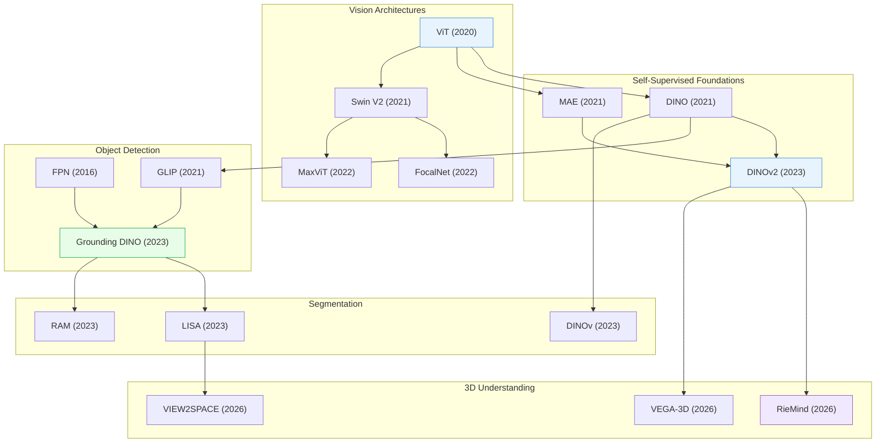

# Computer Vision & 3D Understanding

> [!abstract] Overview
> From feature pyramids to open-vocabulary detection to 3D scene understanding, this note covers the perception stack that underpins embodied AI. The key trends: (1) moving from closed-set recognition to open-world, grounded, and 3D-aware perception, (2) self-supervised pre-training replacing supervised ImageNet features, (3) Vision Transformers replacing CNNs across every sub-task, and (4) efficient architectures enabling real-time deployment.

## Evolution Graph

| Node | Paper |
|------|-------|
| ViT | [[2010.11929\|ViT]] |
| DINO | [[2104.14294\|DINO]] |
| MAE | [[2111.06377\|MAE]] |
| DINOv2 | [[2304.07193\|DINOv2]] |
| Swin V2 | [[2111.09883\|Swin Transformer V2]] |
| FocalNet | [[2203.11926\|FocalNet]] |
| MaxViT | [[2204.01697\|MaxViT]] |
| FPN | [[1612.03144\|FPN]] |
| GLIP | [[2112.03857\|GLIP]] |
| Grounding DINO | [[2303.05499\|Grounding DINO]] |
| LISA | [[2308.00692\|LISA]] |
| RAM | [[2306.03514\|RAM]] |
| DINOv | [[2311.13601\|DINOv]] |
| RieMind | [[2603.15386\|RieMind]] |
| VEGA-3D | [[2603.19235\|VEGA-3D]] |
| VIEW2SPACE | [[2603.16506\|VIEW2SPACE]] |

---

## 1. Vision Transformer Architectures

The backbone revolution: Vision Transformers replaced CNNs as the default architecture for nearly all perception tasks. The design space spans pure transformers (ViT), hierarchical multi-scale architectures (Swin, MPViT), CNN-transformer hybrids (CMT, ViT-CoMer), and efficiency-focused designs for high-resolution or resource-constrained deployment.

**Foundational Architectures** — The original ViT and its hierarchical extensions that introduced multi-scale feature processing to transformers.
- [[2010.11929|ViT]], [[2111.09883|Swin Transformer V2]], [[2105.13677|ResT]], [[2112.11010|MPViT]], [[2204.01697|MaxViT]]

> [!star] Key Papers
> - [[2010.11929|ViT]] — Proved a pure Transformer can match CNNs on image classification; launched the ViT era
> - [[2111.09883|Swin Transformer V2]] — Scaled to 3B parameters with shifted-window attention; established the hierarchical ViT blueprint

**CNN-Transformer Hybrids** — Combine convolutional inductive biases (locality, translation equivariance) with transformer global attention for better speed-accuracy tradeoffs.
- [[2107.06263|CMT]], [[2403.07392|ViT-CoMer]], [[2403.11999|HIRI-ViT]]

> [!star] Key Papers
> - [[2403.07392|ViT-CoMer]] — Convolutional multi-scale feature interaction inside ViT; strong on detection and segmentation without extra FPN

**Attention Innovations** — Novel attention mechanisms that improve efficiency, multi-scale coverage, or token allocation within vision transformers.
- [[2107.00641|Focal Transformer]], [[2203.11926|FocalNet]], [[2308.12216|SG-Former]], [[2304.06250|RSIR Transformer]], [[2505.22195|S2AFormer]], [[2507.00505|LLaVA-SP]]

> [!star] Key Papers
> - [[2203.11926|FocalNet]] — Attention-free focal modulation; achieves strong results without self-attention, proving attention is not the only path

**Efficient & Scalable ViTs** — Architectures optimized for throughput, memory, and deployment on resource-constrained hardware.
- [[2205.14756|EfficientViT]], [[2306.06189|FasterViT]], [[2307.09120|LW PLG-ViT]], [[2107.02239|ViX]], [[2510.18091|APT]], [[2505.20802|Leaner Transformers]], [[2103.15358|ViL]]

> [!star] Key Papers
> - [[2306.06189|FasterViT]] — NVIDIA's hybrid design with hierarchical attention; Pareto-optimal across speed and accuracy
> - [[2510.18091|APT]] — Adaptive Patch Transformers that dynamically reduce spatial tokens; accelerates ViTs without retraining

**Resolution Flexibility** — Methods enabling a single ViT to handle arbitrary resolutions or aspect ratios at inference time.
- [[2403.18361|ViTAR]], [[2212.08013|FlexiViT]], [[2307.06304|NaViT]], [[2403.13298|RoPE-Mixed]]

> [!star] Key Papers
> - [[2307.06304|NaViT]] — Processes images at native resolution and aspect ratio; eliminates distortion from forced resizing

**Dense Prediction Adaptation** — Adapters and modifications that turn plain ViTs into strong backbones for detection, segmentation, and depth estimation without pre-training changes.
- [[2205.08534|ViT-Adapter]], [[2203.16527|ViTDet]], [[2502.01962|META]], [[2412.18090|MPI Tuning]]

> [!star] Key Papers
> - [[2203.16527|ViTDet]] — Proved plain non-hierarchical ViTs can rival specialized architectures on detection when paired with simple FPN

**Positional Encoding & Internal Representations** — Studies on how ViTs encode position, semantics, and hierarchy internally.
- [[2601.05328|BFD]], [[2310.18969|ViT Class Embedding Analysis]], [[2510.08638|Minkowski Representation Hypothesis]]

> [!star] Key Papers
> - [[2510.08638|Minkowski Representation Hypothesis]] — Showed DINOv2 internally represents visual concepts in a Minkowski-like geometric structure

**Surveys** — Comprehensive reviews of vision transformer architectures, designs, and trends.
- [[2101.01169|Transformers in Vision Survey]], [[2111.06091|Visual Transformers Survey]], [[2305.09880|ViT CNN-Transformer Survey]], [[2309.02031|Efficient ViT Survey]]

> [!tip] Choosing a ViT Backbone
> For general-purpose tasks, start with DINOv2 features. For detection, use ViTDet or ViT-CoMer. For efficiency-constrained deployment, FasterViT and EfficientViT offer the best speed-accuracy tradeoffs.

---

## 2. Self-Supervised Visual Representation Learning

Learning powerful visual features without labels. Self-supervised pre-training now produces features that surpass ImageNet-supervised representations across nearly all downstream tasks, and forms the backbone for open-vocabulary detection, segmentation, and 3D understanding.

**Self-Distillation (DINO family)** — Learn representations by training a student network to match an exponential moving-average teacher, producing features with emergent segmentation properties.
- [[2104.14294|DINO]], [[2304.07193|DINOv2]], [[2106.09785|EsViT]], [[2104.03602|SiT]]

> [!star] Key Papers
> - [[2104.14294|DINO]] — Self-distillation with no labels; attention maps spontaneously segment objects
> - [[2304.07193|DINOv2]] — Curated data + distillation at scale; the current best general-purpose visual encoder

**Masked Image Modeling** — Reconstruct masked patches to learn rich spatial representations, analogous to masked language modeling in NLP.
- [[2111.06377|MAE]], [[2106.08254|BEiT]], [[2111.09886|SimMIM]], [[2304.03977|EMP-SSL]]

> [!star] Key Papers
> - [[2111.06377|MAE]] — Elegantly simple: mask 75% of patches, reconstruct pixels; scales effortlessly
> - [[2106.08254|BEiT]] — Predicts discrete visual tokens instead of pixels; bridged BERT-style pre-training to vision

**Predictive Architectures (JEPA)** — Predict abstract representations (not pixels) of masked regions, forcing the model to learn high-level semantics over low-level texture.
- [[2301.08243|I-JEPA]], [[2512.16922|NEPA]]

> [!star] Key Papers
> - [[2301.08243|I-JEPA]] — Joint-Embedding Predictive Architecture; learns semantic features by predicting representations, not pixel reconstructions

**Autoregressive & Multi-Crop** — Pre-training via autoregressive prediction of visual tokens or multi-crop contrastive learning at scale.
- [[2401.08541|AIM]], [[2302.05442|ViT-22B]], [[2303.11331|EVA-02]]

> [!star] Key Papers
> - [[2401.08541|AIM]] — Apple's autoregressive image model; proved autoregressive pre-training scales for vision just as for language
> - [[2302.05442|ViT-22B]] — 22B parameter ViT; established feasibility of scaling vision models to LLM-scale

**Foundation Model Unification** — Distilling or merging multiple vision foundation models into a single encoder.
- [[2312.06709|AM-RADIO]]

> [!star] Key Papers
> - [[2312.06709|AM-RADIO]] — Unifies CLIP, DINOv2, and SAM into one student model; best of all worlds in a single forward pass

**Domain-Specific Adaptation** — Adapting self-supervised models to specialized visual domains with limited labels.
- [[2510.20994|VESSA]], [[2404.17202|Low-Data SSL Evaluation]], [[2511.20844|Pre-train to Gain]]

> [!star] Key Papers
> - [[2510.20994|VESSA]] — Self-supervised adaptation to new visual domains without any labels; practical for medical/industrial deployment

**Initialization & Training Recipes** — Methods to improve ViT training stability, speed, or final performance through structured initialization or learning rate schedules.
- [[2505.19985|Structured ViT Initialization]], [[2507.17634|WSM]]

> [!tip] The SSL Hierarchy
> DINO/DINOv2 for general-purpose features. MAE for tasks needing spatial detail (depth, segmentation). I-JEPA for semantic-level understanding. AM-RADIO if you need all properties in one model.

---

## 3. Object Detection

From closed-set detectors to open-vocabulary, language-grounded detection. The trajectory: multi-scale feature extraction (FPN) established the paradigm, transformer detectors eliminated hand-crafted components, and grounded pre-training opened detection to arbitrary categories described in natural language.

**Multi-Scale Feature Extraction** — Architectures that build and aggregate multi-resolution feature pyramids for detecting objects at varying scales.
- [[1612.03144|FPN]], [[1803.01534|PANet]]

> [!star] Key Papers
> - [[1612.03144|FPN]] — Feature Pyramid Networks: the multi-scale backbone that underlies nearly all modern detectors

**Open-Vocabulary & Grounded Detection** — Detect objects specified by free-form text or image-level labels, breaking the closed-category assumption.
- [[2112.03857|GLIP]], [[2303.05499|Grounding DINO]], [[2306.09683|OWLv2]], [[2201.02605|Detic]], [[2404.07664|PROWL]]

> [!star] Key Papers
> - [[2303.05499|Grounding DINO]] — Married DINO features with grounded pre-training; the go-to open-set detector
> - [[2112.03857|GLIP]] — Grounded language-image pre-training; unified detection and phrase grounding

**Few-Shot & Low-Shot Detection** — Detecting novel object categories from very few examples, combining metric learning, attention, and co-excitation strategies.
- [[1803.01529|LSTD]], [[1806.04728|RepMet]], [[1811.11507|Siamese Mask R-CNN]], [[1911.12529|CoAE]], [[2002.04741|POTD]], [[2003.06800|OS2D]], [[2104.14984|CAT]], [[2303.14240|BSPG]], [[2203.07669|PE2E]], [[2203.09093|SaFT]], [[2408.05674|PS-TTL]], [[2112.02814|Low-Shot Detection Survey]]

> [!star] Key Papers
> - [[2104.14984|CAT]] — Cross-Attention Transformer for one-shot detection; models bidirectional query-target relationships
> - [[2003.06800|OS2D]] — One-stage one-shot detection integrating correlation matching with spatial alignment in a single network

**Weakly-Supervised Detection** — Train detectors using only image-level labels instead of bounding box annotations, dramatically reducing annotation cost.
- [[2002.07421|EHSOD]], [[2007.07986|Progressive Knowledge Transfer WSOD]]

> [!star] Key Papers
> - [[2002.07421|EHSOD]] — End-to-end hybrid-supervised detection combining full and weak annotations

**Small Object & Crowded Scene Detection** — Specialized methods for detecting tiny or heavily overlapping objects where standard detectors fail.
- [[2309.11069|Dynamic Tiling]], [[2504.09819|Density-Guided Object Detection]], [[2504.13469|HMPE]], [[2507.12006|FDAM]], [[2308.10677|Visual Crowd Analysis Survey]]

> [!star] Key Papers
> - [[2504.13469|HMPE]] — HeatMap Embedding for small object detection; dynamically allocates attention to tiny targets

> [!tip] Detection in Practice
> For open-vocabulary needs, Grounding DINO is the standard. For few-shot scenarios, combine a strong DINO/DINOv2 backbone with metric-learning heads. For small objects, add Dynamic Tiling or HMPE on top of any base detector.

---

## 4. Segmentation & Recognition

From class-specific masks to open-world, language-guided segmentation. Modern segmentation leverages VLM reasoning to handle arbitrary queries ("the object the person is pointing at") rather than fixed category lists.

**Language-Guided Segmentation** — Segment objects described by natural language queries, combining VLM reasoning with pixel-level prediction.
- [[2308.00692|LISA]], [[2503.06520|Seg-Zero]], [[2601.05244|GREx]]

> [!star] Key Papers
> - [[2308.00692|LISA]] — Reasoning segmentation: handles complex referring expressions that require multi-step inference
> - [[2503.06520|Seg-Zero]] — Reasoning-chain guided segmentation via cognitive RL; combines chain-of-thought with pixel predictions

**Open-Vocabulary Recognition & Tagging** — Recognize or tag arbitrary categories in images without being restricted to a fixed label set.
- [[2306.03514|RAM]], [[2311.13601|DINOv]], [[2203.12555|GriTS]]

> [!star] Key Papers
> - [[2306.03514|RAM]] — Recognize Anything Model: strong multi-label image tagging at scale
> - [[2311.13601|DINOv]] — Extends in-context prompting to generic segmentation using pure visual exemplars

**High-Resolution & Efficient Segmentation** — Architectures designed for segmentation at high spatial resolution without excessive compute, maintaining fine boundary detail.
- [[2110.09408|HRFormer]], [[2111.01236|HRViT]], [[2503.19108|EoMT]], [[2505.16993|SeNaTra]]

> [!star] Key Papers
> - [[2505.16993|SeNaTra]] — NVIDIA's content-aware spatial grouping inside ViTs; groups semantically related tokens for efficient segmentation

**Feature Enhancement for Dense Prediction** — Methods that sharpen or enhance foundation model features to produce precise segmentation boundaries.
- [[2506.11136|JAFAR]], [[2601.12964|Cross-Scale Pretraining]]

> [!star] Key Papers
> - [[2506.11136|JAFAR]] — Enhances frozen encoder features to produce sharp, high-resolution segmentation without fine-tuning

**One-Shot Segmentation** — Segment novel categories from a single annotated example using similarity guidance or prototype matching.
- [[1810.09091|SG-One]]

> [!tip] Segmentation Stack
> Use Grounding DINO for detection + SAM for masks in most applications. For complex language queries, LISA adds reasoning. For domain-specific needs, JAFAR sharpens frozen features without retraining.

---

## 5. 3D Scene Understanding

The frontier of perception: giving AI models true 3D spatial awareness. This capability is critical for embodied AI, where robots must reason about object positions, spatial relationships, and scene geometry from limited viewpoints.

**3D Spatial Reasoning** — Methods that enable VLMs and agents to reason about 3D spatial relationships, layouts, and multi-hop spatial queries.
- [[2603.15386|RieMind]], [[2603.16506|VIEW2SPACE]], [[2603.18892|MultihopSpatial]], [[2408.16662|Space3D-Bench]], [[2410.06468|SPACE]], [[2412.07825|3DSRBench]], [[2412.10908|Do VLMs Understand 3D Shapes]], [[2506.03135|OmniSpatial]], [[2506.04633|STARE]], [[2506.14512|SIRI-Bench]], [[2506.18385|InternSpatial]], [[2507.07610|SpatialViz-Bench]], [[2507.20174|LRR-Bench]]

> [!star] Key Papers
> - [[2603.15386|RieMind]] — 3D Scene Graph + agentic framework; decouples perception from reasoning, achieving 89.5% on VSI-Bench
> - [[2603.16506|VIEW2SPACE]] — Benchmark for sparse multi-view spatial reasoning; +77% accuracy with grounded chain-of-thought

**Geometry Estimation & Reconstruction** — Estimate depth, surface normals, or full 3D reconstructions from single images or sparse views.
- [[2603.03026|URGT]], [[2603.19231|MonoArt]], [[2603.19235|VEGA-3D]]

> [!star] Key Papers
> - [[2603.19235|VEGA-3D]] — Video diffusion as a latent world simulator producing dense geometric cues
> - [[2603.19231|MonoArt]] — End-to-end monocular articulated object reconstruction; handles non-rigid objects

**Feature Matching & Correspondence** — Match local features across views for 3D reconstruction, visual localization, and structure-from-motion pipelines.
- [[2306.13643|LightGlue]], [[2506.09278|UFM]]

> [!star] Key Papers
> - [[2306.13643|LightGlue]] — Adaptive deep feature matching that prunes easy pairs early; fast and accurate for real-time SLAM

**3D Diffusion Policies** — Use 3D point cloud representations with diffusion-based action generation for robotic manipulation.
- [[2403.03954|DP3]]

> [!star] Key Papers
> - [[2403.03954|DP3]] — 3D Diffusion Policy: generalizable visuomotor policy from point clouds; enables sim-to-real without camera calibration

**Spatial Intelligence Surveys** — Comprehensive reviews of 4D spatial intelligence, encompassing 3D understanding across time.
- [[2507.21045|4D Spatial Intelligence Survey]]

> [!tip] 3D for Robotics
> 3D understanding is the missing link between VLMs and physical manipulation. RieMind and VEGA-3D show that explicit geometric grounding dramatically improves robot task performance. See [[07_Robotics-and-Embodied-AI]].

---

## 6. Domain Adaptation & Transfer Learning

Transferring visual models across domains, merging multiple fine-tuned models, and adapting to new distributions without full retraining. Critical for deploying perception in real-world environments that differ from training data.

**Transformer-Based Domain Adaptation** — Methods that leverage ViT architectures for unsupervised domain adaptation, exploiting self-attention's ability to capture domain-invariant features.
- [[2108.05988|TVT]], [[2109.06165|CDTrans]], [[2111.12941|WinTR]], [[2204.07683|SSRT]], [[2303.13434|PMTrans]], [[2404.15817|VT-ADA]], [[2407.21311|EUDA]], [[2412.04073|TransAdapter]]

> [!star] Key Papers
> - [[2108.05988|TVT]] — Transferable Vision Transformer: pioneered attention-based domain alignment for ViTs
> - [[2407.21311|EUDA]] — Uses frozen DINOv2 features for efficient unsupervised domain adaptation; no fine-tuning needed

**Source-Free & Low-Data Adaptation** — Adapt to a target domain when source data is unavailable due to privacy or storage constraints.
- [[2211.03876|CoNMix]], [[2406.10973|ExPLoRA]]

> [!star] Key Papers
> - [[2406.10973|ExPLoRA]] — Parameter-efficient extended pre-training that adapts ViTs to new visual domains with minimal data

**Model Merging** — Combine multiple fine-tuned models into a single multitask model without retraining, by operating on parameter deltas.
- [[2306.01708|TIES-Merging]], [[2311.03099|DARE]], [[2403.01753|MuDSC]], [[2403.13257|MergeKit]], [[2503.08998|Model Merging Survey]], [[2510.21223|FDA]]

> [!star] Key Papers
> - [[2306.01708|TIES-Merging]] — Three-step approach to resolve sign conflicts and redundancy when merging fine-tuned model parameters
> - [[2403.13257|MergeKit]] — Open-source toolkit that made model merging practical and accessible

**OOD Generalization & Robustness** — Predicting and improving model performance on out-of-distribution data.
- [[2410.02735|OOD-Chameleon]], [[2504.13292|GrokTransfer]], [[2511.13787|TC2]], [[2404.04452|ViT Domain Robustness Survey]]

> [!star] Key Papers
> - [[2410.02735|OOD-Chameleon]] — Meta-learning framework that predicts which OOD generalization strategy will work best for a given shift

> [!tip] Adaptation Strategy
> If source data is available, use TVT or TransAdapter. If source-free, use CoNMix. For combining specialists, TIES-Merging + MergeKit. For unknown domain shifts, OOD-Chameleon selects the right strategy automatically.

---

## 7. Few-Shot & Zero-Shot Learning

Learning from minimal examples or no examples at all. These methods enable visual systems to generalize to novel categories with 1-10 labeled samples per class, or transfer across visual domains with very limited target data.

**Cross-Domain Few-Shot Learning** — Few-shot learning where support and query sets come from different visual domains, requiring both category and domain transfer.
- [[2401.13987|ADAPTER]], [[2504.06608|Cross-Domain FSL with DKM]], [[2603.17655|CC-CDFSL]], [[2502.14214|ACT]]

> [!star] Key Papers
> - [[2401.13987|ADAPTER]] — Adaptive Transformer Networks for cross-domain few-shot; integrates domain alignment into the few-shot pipeline
> - [[2603.17655|CC-CDFSL]] — Self-supervised regularization framework achieving strong cross-domain few-shot transfer

**Efficient Few-Shot Methods** — Architectures and tuning strategies that minimize compute and data requirements for few-shot learning.
- [[2301.02419|eTT]], [[2601.08499|EfficientFSL]]

> [!star] Key Papers
> - [[2601.08499|EfficientFSL]] — Provides a principled framework for few-shot learning efficiency across backbone sizes and shot counts

**Few-Shot with Auxiliary Data** — Leverage additional unlabeled or weakly-labeled data sources to improve few-shot performance.
- [[2302.00674|FLAD]], [[2504.09828|FATE]], [[2408.05674|PS-TTL]]

> [!star] Key Papers
> - [[2302.00674|FLAD]] — Models auxiliary dataset selection as a Multi-Armed Bandit; automatically discovers which extra data helps

**Generalized Category Discovery** — Discover novel categories in unlabeled data while simultaneously classifying known ones, without knowing the number of new categories in advance.
- [[2201.02609|GCD]]

> [!star] Key Papers
> - [[2201.02609|GCD]] — Formalized generalized category discovery; a more realistic setting than traditional zero-shot learning

**Semantic Augmentation** — Data augmentation at the semantic level for few-shot scenarios, generating novel training combinations from attribute decompositions.
- [[2004.02684|Attribute Mix]]

> [!tip] Few-Shot Checklist
> Check domain gap first: same-domain few-shot is largely solved by DINOv2 + linear probe. Cross-domain few-shot (ADAPTER, CC-CDFSL) remains challenging. For discovering entirely new categories, use GCD.

---

## 8. Interpretability & Analysis

Understanding what vision models learn, explaining their decisions, and providing transparent reasoning. Essential for deploying vision systems in safety-critical applications.

**Interpretable Architectures** — Models designed from the ground up to produce human-understandable explanations of their predictions.
- [[2205.10268|B-cos Networks]], [[2311.04157|INTR]], [[2501.09333|Prompt-CAM]]

> [!star] Key Papers
> - [[2205.10268|B-cos Networks]] — Inherently interpretable deep networks via B-cos transform; explanations emerge from the architecture itself
> - [[2311.04157|INTR]] — Interpretable Transformer for fine-grained classification using prototype-based attention

**Sparse Autoencoders for Vision** — Decompose vision model representations into interpretable, sparse feature directions.
- [[2502.03714|USAE]], [[2505.15970|DINOv2 Hierarchy SAE]], [[2502.16435|VISFACTOR]]

> [!star] Key Papers
> - [[2505.15970|DINOv2 Hierarchy SAE]] — Discovers that DINOv2 implicitly learns hierarchical visual concepts (texture, parts, objects) in its layers

**Image Retrieval & Explainability** — Methods for retrievable and explainable visual representations.
- [[2411.10231|TaylorIR]]

> [!tip] Interpretability in Practice
> B-cos Networks and INTR offer built-in explanations. For post-hoc analysis of frozen models, sparse autoencoders (USAE, DINOv2 Hierarchy SAE) reveal what features encode without modifying the model.

---

## 9. Efficient Training & Data

Practical methods for training vision models efficiently: dataset pruning, continual learning, knowledge distillation, and parameter-efficient fine-tuning. These techniques determine whether a method is publishable versus deployable.

**Dataset Curation & Pruning** — Select the most informative training examples to reduce dataset size without sacrificing model quality.
- [[2205.09329|Dataset Pruning]]

> [!star] Key Papers
> - [[2205.09329|Dataset Pruning]] — Optimization-based pruning using influence functions; reduces training data while maintaining accuracy

**Knowledge Distillation** — Transfer knowledge from large teacher models to smaller, deployable student models.
- [[2306.08543|MiniLLM]]

**Continual Learning** — Learn new tasks sequentially without forgetting previous knowledge.
- [[2305.13622|SER]]

> [!star] Key Papers
> - [[2305.13622|SER]] — Strong Experience Replay with dual consistency loss; prevents catastrophic forgetting during sequential task learning

**Parameter-Efficient Fine-Tuning** — Adapt large pre-trained vision models to downstream tasks by updating only a small fraction of parameters.
- [[2402.02242|V-PEFT Bench]], [[2505.21501|PH-Reg]]

> [!star] Key Papers
> - [[2402.02242|V-PEFT Bench]] — Comprehensive benchmark of visual PEFT methods; reveals which adapter designs actually matter

**Weakly-Supervised Pre-Training** — Pre-train on weakly-labeled data (e.g., image-level tags for pixel-level tasks) to scale annotation-efficient learning.
- [[2505.06710|SimMIL]]

**Adversarial Robustness** — Understanding and improving model resilience to adversarial perturbations.
- [[2506.21046|dSVA]]

**High-Resolution Processing** — Efficient methods for handling high-resolution inputs that would otherwise exceed memory or compute budgets.
- [[2207.13050|Efficient High-Resolution Survey]]

> [!tip] Efficiency Stack
> Prune your dataset (Dataset Pruning) -> pre-train with SSL (DINOv2/MAE) -> fine-tune with PEFT (V-PEFT Bench recipes) -> distill for deployment (AM-RADIO/MiniLLM). Each stage compounds savings.

---

## Cross-References

- [[01_Foundation-Models]] — ViT and self-supervised backbones
- [[02_Vision-Language-Models]] — VLMs built on these visual features
- [[06_Video-and-Temporal]] — Extending spatial perception to temporal understanding
- [[07_Robotics-and-Embodied-AI]] — 3D perception for robotic manipulation

---

*Next: [[06_Video-and-Temporal]] for extending perception across time.*
