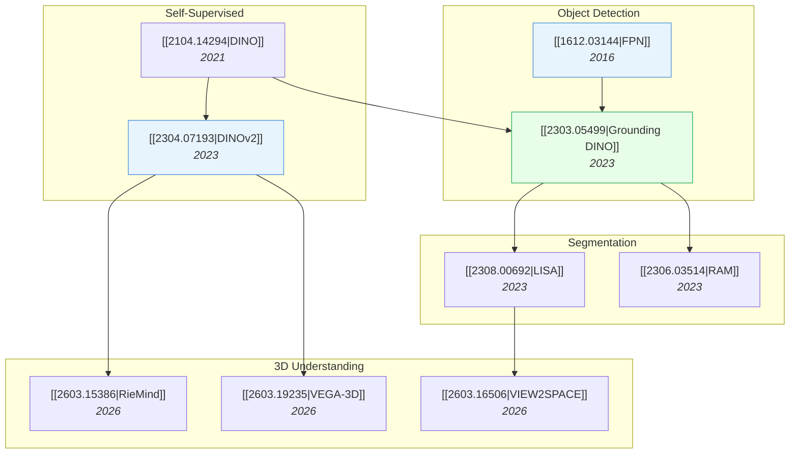

# Computer Vision & 3D Understanding

> [!abstract] Overview
> From feature pyramids to open-vocabulary detection to 3D scene understanding, this note covers the perception stack that underpins embodied AI. The key trend: moving from closed-set recognition to open-world, grounded, and 3D-aware perception.

## Evolution Graph

---

## 1. Object Detection Evolution

From fixed-category detectors to open-vocabulary grounded detection.

| Paper | Year | Key Advance |
| --- | --- | --- |
| [[1612.03144\|FPN]] | 2016 | ==Feature Pyramid Network==: multi-scale feature extraction |
| [[1803.01534\|PANet]] | 2018 | ==Path aggregation== for instance segmentation |
| [[2201.02605\|Detic]] | 2022 | Detecting ==20K classes== using image-level supervision |
| [[2112.03857\|GLIP]] | 2021 | ==Grounded language-image pre-training== for detection |
| [[2303.05499\|Grounding DINO]] | 2023 | Married ==DINO + grounded pre-training== for open-set detection |
| [[2306.09683\|OWLv2]] | 2023 | Scaled open-vocabulary detection with self-training |

---

## 2. Self-Supervised Visual Features

Learning powerful representations without labels — the backbone for everything downstream.

- [[2104.14294|DINO]] (2021) — ==self-distillation== with emergent segmentation in attention maps
- [[2111.06377|MAE]] (2021) — ==masked autoencoding==: simple, scalable pre-training
- [[2304.07193|DINOv2]] (2023) — curated data + distillation → universal visual features
- [[2301.08243|I-JEPA]] (2023) — predict representations, not pixels (see [[04-1_JEPA]])

---

## 3. Segmentation & Recognition

From class-specific to open-world segmentation with language guidance.

- [[2308.00692|LISA]] (2023) — ==reasoning segmentation==: segment objects described in complex natural language queries
- [[2306.03514|RAM]] (2023) — ==recognize anything==: strong multi-label image tagging
- [[2503.06520|Seg-Zero]] (2025) — ==reasoning-chain guided segmentation== via cognitive RL

---

## 4. 3D Scene Understanding

The frontier: giving AI models true 3D spatial awareness.

- [[2603.15386|RieMind]] (2026) — ==3D Scene Graph + agentic framework==; decouples perception from reasoning, **89.5%** on VSI-Bench
- [[2603.19235|VEGA-3D]] (2026) — video diffusion as a ==Latent World Simulator== for dense geometric cues
- [[2603.16506|VIEW2SPACE]] (2026) — benchmark for ==sparse multi-view spatial reasoning==; **+77%** accuracy with grounded CoT
- [[2603.18892|MultihopSpatial]] (2026) — revealed ==spatial blind spots== in VLMs; only **40.6% Acc@50IoU**
- [[2403.03954|DP3]] (2024) — ==3D Diffusion Policy==: generalizable visuomotor policy from 3D representations

> [!tip] 3D for Robotics
> 3D understanding is the missing link between VLMs and physical manipulation. RieMind and VEGA-3D show that explicit geometric grounding dramatically improves robot task performance. See [[07_Robotics-and-Embodied-AI]].

---

## 5. Domain Adaptation & Robustness

Transferring visual models across domains without re-training.

| Paper | Year | Approach |
| --- | --- | --- |
| [[2108.05988\|TVT]] | 2021 | ==Transferable Vision Transformer== for domain adaptation |
| [[2109.06165\|CDTrans]] | 2021 | ==Cross-domain Transformer== for unsupervised adaptation |
| [[2404.04452\|ViT Domain Robustness Survey]] | 2024 | Survey of ViT robustness across domains |

---

## Cross-References

- [[01_Foundation-Models]] — ViT and self-supervised backbones
- [[02_Vision-Language-Models]] — VLMs built on these visual features
- [[06_Video-and-Temporal]] — Extending spatial perception to temporal understanding
- [[07_Robotics-and-Embodied-AI]] — 3D perception for robotic manipulation

---

*Next: [[06_Video-and-Temporal]] for extending perception across time.*

---

## Complete Paper Listing

### 3D Understanding (5)

| Paper | Year | Summary |
| --- | --- | --- |
| [[2306.13643\|LightGlue]] | 2023 | LightGlue presents an adaptive deep feature matching approach that achieves comparable or superior accuracy to SuperG... |
| [[2506.09278\|UFM]] | 2025 | A single transformer-based model, Unified Flow & Matching (UFM), integrates optical flow and wide-baseline matching, ... |
| [[2507.21045\|4D Spatial Intelligence Survey]] | 2025 | Researchers from Nanyang Technological University, HKUST, and Texas A&M University present a survey introducing a new... |
| [[2603.03026\|URGT]] | 2026 | Researchers at KAUST developed the Ultra Resolution Geometry Transformer (URGT) for joint depth and surface normal es... |
| [[2603.19231\|MonoArt]] | 2026 | Researchers at S-Lab, Nanyang Technological University developed MonoArt, an end-to-end framework for reconstructing ... |

### Domain Adaptation (18)

| Paper | Year | Summary |
| --- | --- | --- |
| [[2108.05988\|TVT]] | 2021 | Researchers from the University of Texas at Arlington and Kuaishou Technology developed TVT, a framework for unsuperv... |
| [[2109.06165\|CDTrans]] | 2021 | Researchers from Alibaba Group and Shandong University developed CDTrans, a pure Transformer-based framework for Unsu... |
| [[2111.12941\|WinTR]] | 2021 | Researchers from Beijing Institute of Technology, Tsinghua University, and Inceptio Tech developed WinTR, a Transform... |
| [[2204.07683\|SSRT]] | 2022 | A new framework, Safe Self-Refinement for Transformer-based Domain Adaptation (SSRT), integrates Vision Transformers ... |
| [[2211.03876\|CoNMix]] | 2022 | CoNMix, developed by researchers at the Indian Institute of Science, introduces a three-stage framework for source-fr... |
| [[2303.13434\|PMTrans]] | 2023 | PMTrans introduces a Patch-Mix Transformer that constructs an intermediate domain to bridge source and target in Unsu... |
| [[2306.01708\|TIES-Merging]] | 2023 | TIES-MERGING introduces a three-step approach to combine multiple fine-tuned models into a single multitask model by ... |
| [[2404.04452\|ViT Domain Robustness Survey]] | 2024 | This review systematically categorizes and analyzes existing research on Vision Transformers (ViTs) in Domain Adaptat... |
| [[2404.15817\|VT-ADA]] | 2024 | Research from Jilin University introduces Vision Transformer-based Adversarial Domain Adaptation (VT-ADA), integratin... |
| [[2404.17202\|Low-Data SSL Evaluation]] | 2024 | A comparative evaluation reveals how Self-Supervised Learning (SSL) methods perform in low-data regimes (50,000-300,0... |
| [[2406.10973\|ExPLoRA]] | 2024 | ExPLoRA introduces a parameter-efficient extended pre-training methodology that effectively adapts Vision Transformer... |
| [[2407.21311\|EUDA]] | 2024 | A framework for efficient unsupervised domain adaptation, EUDA, leverages a frozen self-supervised DINOv2 Vision Tran... |
| [[2410.02735\|OOD-Chameleon]] | 2024 | OOD-Chameleon introduces a meta-learning framework for predicting the most suitable out-of-distribution (OOD) general... |
| [[2412.04073\|TransAdapter]] | 2024 | TransAdapter, a new Unsupervised Domain Adaptation (UDA) framework developed at Ozyegin University, enhances Vision T... |
| [[2503.08998\|Model Merging Survey]] | 2025 | A comprehensive review from University of Georgia researchers synthesizes and categorizes model merging approaches ac... |
| [[2504.13292\|GrokTransfer]] | 2025 | A method called GrokTransfer accelerates the "grokking" phenomenon in neural networks by transferring embeddings from... |
| [[2511.13787\|TC2]] | 2025 | Researchers from the Institute of Software Chinese Academy of Sciences and the University of Chinese Academy of Scien... |
| [[2511.20844\|Pre-train to Gain]] | 2025 | This work explores how self-supervised pre-training (SSL) can enhance deep learning model robustness to noisy labels ... |

### Few-Shot & Zero-Shot (11)

| Paper | Year | Summary |
| --- | --- | --- |
| [[2004.02684\|Attribute Mix]] | 2020 | Attribute Mix, from Shanghai Jiaotong University and Huawei Noah's Ark Lab, presents a semantic data augmentation fra... |
| [[2201.02609\|GCD]] | 2022 | The Visual Geometry Group (VGG) at Oxford introduces Generalized Category Discovery (GCD), a new problem setting wher... |
| [[2301.02419\|eTT]] | 2023 | Researchers from Fudan University and Tencent developed an efficient Transformer Tuning (eTT) method for few-shot lea... |
| [[2302.00674\|FLAD]] | 2023 | A method for Few-shot Learning with Auxiliary Data (FLAD) that models dataset selection as a Multi-Armed Bandit (MAB)... |
| [[2401.13987\|ADAPTER]] | 2024 | ADAPTER (Adaptive Transformer Networks) introduces a method for cross-domain few-shot learning by integrating Transfo... |
| [[2408.05674\|PS-TTL]] | 2024 | PS-TTL enhances few-shot object detection by enabling detectors to adapt to novel classes during the testing phase wi... |
| [[2502.14214\|ACT]] | 2025 | Researchers from Jilin University introduce Asymmetric Co-Training (ACT), a method for Source-Free Few-Shot Domain Ad... |
| [[2504.06608\|Cross-Domain FSL with DKM]] | 2025 | A cross-domain few-shot learning method based on domain knowledge mapping is introduced, which dynamically adjusts kn... |
| [[2504.09828\|FATE]] | 2025 | The FATE framework addresses semi-supervised learning with extremely limited labeled data by introducing a two-stage ... |
| [[2601.08499\|EfficientFSL]] | 2026 | EfficientFSL, developed by researchers from Fudan, Tsinghua, and East China University of Science and Technology, pre... |
| [[2603.17655\|CC-CDFSL]] | 2026 | CC-CDFSL, developed at Huazhong University of Science and Technology, presents a self-supervised regularization frame... |

### Object Detection (39)

| Paper | Year | Summary |
| --- | --- | --- |
| [[1612.03144\|FPN]] | 2016 | Feature Pyramid Networks (FPNs) introduce an architecture that efficiently constructs a multi-scale feature pyramid w... |
| [[1803.01529\|LSTD]] | 2018 | A Low-Shot Transfer Detector (LSTD) is introduced, which enables object detection with as few as 1-10 annotated examp... |
| [[1803.01534\|PANet]] | 2018 | Researchers from The Chinese University of Hong Kong, Peking University, SenseTime, and Tencent developed PANet, a ne... |
| [[1806.04728\|RepMet]] | 2018 | IBM Research AI developed RepMet, a Distance Metric Learning (DML) approach that jointly learns an embedding space an... |
| [[1811.11507\|Siamese Mask R-CNN]] | 2018 | Researchers at the University of Tübingen introduced the task of one-shot instance segmentation and proposed Siamese ... |
| [[1911.12529\|CoAE]] | 2019 | The Co-Attention and Co-Excitation (CoAE) framework, developed by researchers from National Tsing Hua University and ... |
| [[2002.04741\|POTD]] | 2020 | Researchers from Huazhong University of Science and Technology and Shenzhen Institutes of Advanced Technology develop... |
| [[2002.07421\|EHSOD]] | 2020 | EHSOD, an end-to-end hybrid-supervised framework, combines fully and weakly annotated data to perform object detectio... |
| [[2003.06800\|OS2D]] | 2020 | The OS2D (One-Stage One-Shot Object Detection) model integrates feature extraction, correlation matching, spatial ali... |
| [[2007.07986\|Progressive Knowledge Transfer WSOD]] | 2020 | A progressive knowledge transfer framework significantly improves weakly supervised object detection by iteratively r... |
| [[2103.15358\|ViL]] | 2021 | Microsoft researchers developed the Multi-Scale Vision Longformer (ViL), a Vision Transformer architecture that effic... |
| [[2104.14984\|CAT]] | 2021 | The paper introduces CAT, a Cross-Attention Transformer framework, to improve one-shot object detection by modeling b... |
| [[2105.13677\|ResT]] | 2021 | Researchers at Nanjing University introduced ResT, an efficient multi-scale Vision Transformer that integrates CNN-li... |
| [[2107.00641\|Focal Transformer]] | 2021 | The Focal Transformer presents a novel focal self-attention mechanism that efficiently captures both fine-grained loc... |
| [[2107.06263\|CMT]] | 2021 | Researchers from the University of Sydney and Huawei Noah's Ark Lab introduce CMT, a hybrid neural network architectu... |
| [[2112.02814\|Low-Shot Detection Survey]] | 2021 | Researchers from Zhejiang University conducted a comprehensive survey of deep learning for Low-Shot Object Detection ... |
| [[2112.11010\|MPViT]] | 2021 | Researchers from ETRI and KAIST developed MPViT, a Vision Transformer architecture that enhances multi-scale feature ... |
| [[2203.07669\|PE2E]] | 2022 | Researchers from MEGVII Technology, Shanghai Jiao Tong University, and the University of Hong Kong developed a progre... |
| [[2203.09093\|SaFT]] | 2022 | Researchers from Carnegie Mellon University and Microsoft Research Asia developed the Semantic-aligned Fusion Transfo... |
| [[2203.11926\|FocalNet]] | 2022 | Focal Modulation Networks introduce an attention-free mechanism for vision backbones that models input-dependent long... |
| [[2203.16527\|ViTDet]] | 2022 | This research from Facebook AI Research demonstrates that plain, non-hierarchical Vision Transformer (ViT) backbones ... |
| [[2205.08534\|ViT-Adapter]] | 2022 | A pre-training-free adapter, the ViT-Adapter, enables plain Vision Transformers (ViTs) to perform dense prediction ta... |
| [[2205.14756\|EfficientViT]] | 2022 | EfficientViT introduces a family of Vision Transformers for high-resolution dense prediction, utilizing a multi-scale... |
| [[2303.14240\|BSPG]] | 2023 | The Base-class Suppression and Prior Guidance (BSPG) network improves one-shot object detection by mitigating base-cl... |
| [[2304.06250\|RSIR Transformer]] | 2023 | The RSIR Transformer, developed at Southwest Jiaotong University, introduces Random Sampling Windows (RS-Win) and Imp... |
| [[2306.06189\|FasterViT]] | 2023 | Researchers at NVIDIA developed FasterViT, a new family of vision models that combine convolutional layers and a nove... |
| [[2307.09120\|LW PLG-ViT]] | 2023 | This paper introduces Light-Weight PLG-ViT, an efficient vision transformer architecture designed for resource-constr... |
| [[2308.10677\|Visual Crowd Analysis Survey]] | 2023 | Researchers from the Qatar Mobility Innovations Center and Qatar University present a comprehensive survey categorizi... |
| [[2308.12216\|SG-Former]] | 2023 | SG-Former introduces a hierarchical Vision Transformer that employs self-guided, evolving token reallocation to achie... |
| [[2309.11069\|Dynamic Tiling]] | 2023 | Dynamic Tiling introduces a model-agnostic and inference-data-centric approach for small object detection, adaptively... |
| [[2403.07392\|ViT-CoMer]] | 2024 | ViT-CoMer introduces a Vision Transformer backbone that integrates convolutional multi-scale feature interaction for ... |
| [[2403.11999\|HIRI-ViT]] | 2024 | HIRI-ViT, a five-stage Vision Transformer architecture from HiDream.ai, introduces a principled approach to efficient... |
| [[2403.13298\|RoPE-Mixed]] | 2024 | This paper from NAVER AI Lab systematically investigates the application of Rotary Position Embedding (RoPE) to Visio... |
| [[2404.07664\|PROWL]] | 2024 | Researchers from Fraunhofer IKS and Technical University of Munich developed PROWL, a plug-and-play framework for zer... |
| [[2412.18090\|MPI Tuning]] | 2024 | Goto et al. introduce Multi-Point Positional Insertion (MPI) tuning, a parameter-efficient fine-tuning method that en... |
| [[2502.01962\|META]] | 2025 | META (Memory Efficient Transformer Adapter) enhances Vision Transformer performance for dense prediction tasks by exp... |
| [[2504.09819\|Density-Guided Object Detection]] | 2025 | This paper from the City University of Hong Kong presents a unified framework for object detection in crowded scenes ... |
| [[2504.13469\|HMPE]] | 2025 | The HeatMap Embedding (HMPE) framework enhances Transformer-based models for small object detection by dynamically al... |
| [[2507.12006\|FDAM]] | 2025 | Researchers from Beijing Institute of Technology and RIKEN AIP developed Frequency-Dynamic Attention Modulation (FDAM... |

### Segmentation (11)

| Paper | Year | Summary |
| --- | --- | --- |
| [[1810.09091\|SG-One]] | 2018 | Researchers developed SG-One, a unified network for one-shot semantic segmentation that uses a similarity guidance me... |
| [[2104.14294\|DINO]] | 2021 | This research from Facebook AI Research (FAIR), Inria, and Sorbonne University investigates self-supervised learning ... |
| [[2110.09408\|HRFormer]] | 2021 | Researchers from UCAS, ICT, Peking University, MSRA, and Baidu developed HRFormer, a high-resolution transformer arch... |
| [[2111.01236\|HRViT]] | 2021 | HRViT is a multi-scale high-resolution Vision Transformer designed for semantic segmentation, integrating HRNet's mul... |
| [[2311.13601\|DINOv]] | 2023 | DINOv is a unified visual segmentation framework that extends in-context prompting to generic vision tasks using pure... |
| [[2312.06709\|AM-RADIO]] | 2023 | The AM-RADIO framework unifies diverse Vision Foundation Models (VFMs) like CLIP, DINOv2, and SAM into a single stude... |
| [[2503.19108\|EoMT]] | 2025 | Research across three European universities demonstrates that standard Vision Transformers (ViTs) can perform image s... |
| [[2505.16993\|SeNaTra]] | 2025 | NVIDIA researchers developed SeNaTra, a Vision Transformer that integrates content-aware spatial grouping directly in... |
| [[2506.11136\|JAFAR]] | 2025 | A new method named JAFAR enhances features from foundation vision encoders, enabling them to produce sharp, high-reso... |
| [[2601.05244\|GREx]] | 2026 | Fudan University researchers created new generalized referring expression tasks (GREx) for segmentation, comprehensio... |
| [[2601.12964\|Cross-Scale Pretraining]] | 2026 | Researchers at Carnegie Mellon University Africa introduced a spatial affinity component for cross-scale pretraining,... |

### Vision Architectures (17)

| Paper | Year | Summary |
| --- | --- | --- |
| [[2010.11929\|ViT]] | 2020 | Google Research's Vision Transformer (ViT) demonstrates that a pure Transformer architecture can achieve state-of-the... |
| [[2101.01169\|Transformers in Vision Survey]] | 2021 | This survey provides a comprehensive overview of Transformer models in computer vision, systematically organizing the... |
| [[2104.03602\|SiT]] | 2021 | The SiT (Self-supervised vIsion Transformer) framework, developed at the University of Surrey, introduces Group Maske... |
| [[2106.08254\|BEiT]] | 2021 | BEIT adapts BERT's masked language modeling for Vision Transformers by predicting discrete "visual tokens" of masked ... |
| [[2106.09785\|EsViT]] | 2021 | EsViT integrates efficient multi-stage Vision Transformers with a non-contrastive region-matching task to achieve sta... |
| [[2107.02239\|ViX]] | 2021 | Researchers from IIT Bombay developed "Vision X-formers," a family of vision transformer architectures that integrate... |
| [[2111.06091\|Visual Transformers Survey]] | 2021 | This survey paper provides a comprehensive review of over one hundred Visual Transformers, organizing them into a sys... |
| [[2111.06377\|MAE]] | 2021 | Masked Autoencoders (MAE), developed by Facebook AI Research (FAIR), introduce a self-supervised learning approach fo... |
| [[2111.09883\|Swin Transformer V2]] | 2021 | Swin Transformer V2, developed by Microsoft Research Asia, successfully scales vision models to 3 billion parameters ... |
| [[2111.09886\|SimMIM]] | 2021 | Microsoft Research Asia and collaborators introduce SimMIM, a streamlined framework for masked image modeling that em... |
| [[2204.01697\|MaxViT]] | 2022 | MaxViT, a hierarchical vision transformer, introduces a Multi-Axis Self-Attention module that efficiently combines bl... |
| [[2506.21046\|dSVA]] | 2025 | The Beijing Institute of Technology research presents dSVA, a generative adversarial attack leveraging self-supervise... |
| [[2510.08638\|Minkowski Representation Hypothesis]] | 2025 | Researchers at the Kempner Institute, Harvard University, and collaborators investigated DINOv2's internal representa... |
| [[2510.18091\|APT]] | 2025 | Researchers from Carnegie Mellon University and KAIST developed Adaptive Patch Transformers (APT) to accelerate Visio... |
| [[2510.20994\|VESSA]] | 2025 | VESSA enables visual foundation models to specialize in new, label-scarce domains through a self-supervised adaptatio... |
| [[2512.16922\|NEPA]] | 2025 | Researchers from the University of Michigan, NYU, Princeton, and University of Virginia developed Next-Embedding Pred... |
| [[2601.05328\|BFD]] | 2026 | Bi-Orthogonal Factor Decomposition (BFD) is introduced as a framework to quantitatively disentangle positional, seman... |

### Other (33)

| Paper | Year | Summary |
| --- | --- | --- |
| [[2205.09329\|Dataset Pruning]] | 2022 | Researchers from UTS and Baidu Research introduce an optimization-based dataset pruning method that leverages influen... |
| [[2205.10268\|B-cos Networks]] | 2022 | B-cos Networks introduce a method for building inherently interpretable deep neural networks by integrating a B-cos t... |
| [[2207.13050\|Efficient High-Resolution Survey]] | 2022 | Researchers from Aarhus University provide the first comprehensive survey on efficient high-resolution deep learning,... |
| [[2212.08013\|FlexiViT]] | 2022 | FlexiViT, developed by Google Research, introduces a method to train a single Vision Transformer model capable of eff... |
| [[2301.08243\|I-JEPA]] | 2023 | I-JEPA presents a Joint-Embedding Predictive Architecture (JEPA) for self-supervised image learning that predicts abs... |
| [[2302.05442\|ViT-22B]] | 2023 | A Vision Transformer with 22 billion parameters, ViT-22B, was successfully trained, establishing the feasibility of s... |
| [[2303.11331\|EVA-02]] | 2023 | EVA-02 introduces a Transformer-based visual representation that achieves state-of-the-art performance across diverse... |
| [[2304.03977\|EMP-SSL]] | 2023 | EMP-SSL introduces an approach to dramatically accelerate self-supervised learning by processing numerous overlapping... |
| [[2304.07193\|DINOv2]] | 2023 | Meta AI's DINOv2 learns robust, general-purpose visual features without supervision, achieving state-of-the-art 'out-... |
| [[2305.09880\|ViT CNN-Transformer Survey]] | 2023 | This survey paper provides a comprehensive review and systematic taxonomy of Vision Transformers (ViTs) and particula... |
| [[2305.13622\|SER]] | 2023 | A new method called Strong Experience Replay (SER) improves continual learning by incorporating dual consistency loss... |
| [[2306.08543\|MiniLLM]] | 2023 | MiniLLM introduces a knowledge distillation method for generative large language models, leveraging reverse Kullback-... |
| [[2307.06304\|NaViT]] | 2023 | NaViT, developed by Google DeepMind, is a Vision Transformer that processes images at their native resolutions and as... |
| [[2309.02031\|Efficient ViT Survey]] | 2023 | Researchers from Sapienza University of Rome and The University of Sydney present a comprehensive survey of efficient... |
| [[2310.18969\|ViT Class Embedding Analysis]] | 2023 | Researchers at Goethe University Frankfurt developed a framework for Vision Transformers (ViTs) that projects interna... |
| [[2311.03099\|DARE]] | 2023 | This paper unveils extreme redundancy in Supervised Fine-Tuning (SFT) delta parameters of large language models, prop... |
| [[2311.04157\|INTR]] | 2023 | The INTR model introduces a simple, inherently interpretable Transformer for fine-grained image classification by hav... |
| [[2401.08541\|AIM]] | 2024 | Researchers at Apple developed Autoregressive Image Models (AIM), a scalable pre-training approach for large vision m... |
| [[2402.02242\|V-PEFT Bench]] | 2024 | Researchers from Shanghai Jiao Tong University and collaborators introduce a comprehensive survey and the V-PEFT Benc... |
| [[2403.01753\|MuDSC]] | 2024 | Merging under Dual-Space Constraints (MuDSC) is a training-free framework that combines multiple pre-trained neural n... |
| [[2403.13257\|MergeKit]] | 2024 | Arcee's MergeKit provides an open-source, efficient, and user-friendly toolkit that facilitates the merging of Large ... |
| [[2403.18361\|ViTAR]] | 2024 | ViTAR introduces a Vision Transformer architecture capable of efficiently processing images of arbitrary resolution b... |
| [[2411.10231\|TaylorIR]] | 2024 | Researchers from DFKI and the University of Kaiserslautern-Landau developed TaylorIR, an approach for transformer-bas... |
| [[2501.09333\|Prompt-CAM]] | 2025 | PROMPT-CAM introduces class-specific prompts into frozen Vision Transformers to accurately localize fine-grained visu... |
| [[2502.03714\|USAE]] | 2025 | This paper presents Universal Sparse Autoencoders (USAEs), a method for jointly learning a shared, interpretable conc... |
| [[2505.06710\|SimMIL]] | 2025 | The SimMIL framework from Shanghai Jiao Tong University and Fudan University introduces a weakly supervised pre-train... |
| [[2505.15970\|DINOv2 Hierarchy SAE]] | 2025 | This research investigates whether the DINOv2 vision foundation model implicitly learns hierarchical visual concepts ... |
| [[2505.19985\|Structured ViT Initialization]] | 2025 | Researchers at the Australian Institute for Machine Learning (AIML) introduced a structured initialization method for... |
| [[2505.20802\|Leaner Transformers]] | 2025 | This research demonstrates that many existing transformer models are unnecessarily large, proposing that depth can be... |
| [[2505.21501\|PH-Reg]] | 2025 | Researchers at the University of Hong Kong developed Post Hoc Registers (PH-Reg), an efficient self-distillation fram... |
| [[2505.22195\|S2AFormer]] | 2025 | The S2AFormer architecture features a Strip Self-Attention (SSA) mechanism that jointly compresses spatial and channe... |
| [[2507.17634\|WSM]] | 2025 | Warmup-Stable and Merge (WSM) introduces a decay-free learning rate schedule for LLM pre-training that achieves the b... |
| [[2510.21223\|FDA]] | 2025 | Functional Dual Anchors (FDAs) introduce a method for model merging that operates by modeling knowledge in the input-... |
