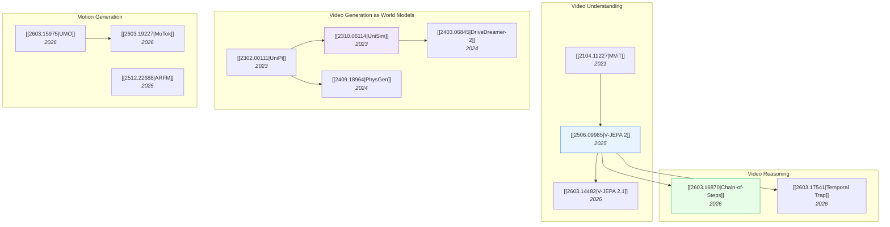

# Video & Temporal Understanding

> [!abstract] Overview
> Video models are evolving from passive understanding (classification, QA) toward active generation (world simulation, motion synthesis). The key convergence: ==video generation models are becoming world models== — they learn physics, causality, and dynamics from temporal data, enabling both content creation and robotic planning.

## Evolution Graph

---

## 1. Video Understanding

From video classification to self-supervised video representation learning.

- [[2104.11227|MViT]] (2021) — ==multiscale vision transformers== for video; pooling attention across spatiotemporal scales
- [[2506.09985|V-JEPA 2]] (2025) — self-supervised video model trained on ==1M+ hours==; learned world model enables zero-shot robotic control via MPC
- [[2603.14482|V-JEPA 2.1]] (2026) — added ==Dense Predictive Loss== for fine-grained spatial features; **+35%** on object interaction anticipation

> [!tip] The JEPA Connection
> V-JEPA 2 → V-JEPA 2.1 → VL-JEPA → VLA-JEPA. See [[04-1_JEPA]] for the complete lineage.

---

## 2. Video Generation as World Models

The paradigm shift: video generation models that simulate ==physically plausible futures==, becoming the foundation for planning and control.

| Paper | Year | Innovation |
| --- | --- | --- |
| [[2302.00111\|UniPi]] | 2023 | First to use ==text-guided video generation== as universal policy |
| [[2310.06114\|UniSim]] | 2023 | Learned ==interactive real-world simulator== from video data |
| [[2403.06845\|DriveDreamer-2]] | 2024 | LLM-enhanced ==driving video generation==; **FID of 25.0** |
| [[2409.18964\|PhysGen]] | 2024 | ==Physics-grounded== image-to-video generation via perception-simulation-rendering |
| [[2503.18938\|AdaWorld]] | 2025 | ==Adaptable world models== with latent actions; **FVD of 767.0** |
| [[2510.01183\|EvoWorld]] | 2025 | ==Evolving panoramic world generation== with explicit 3D memory |

> [!warning] Video World Models → WAMs
> This cluster directly feeds into [[04_WAM|World Action Models]]. The key insight: if you can generate video of the future, you can plan by imagining outcomes. Papers like [[2602.15922|DreamZero]], [[2603.17240|GigaWorld-Policy]], and [[2603.16666|Fast-WAM]] all build on video generation as their world modeling backbone.

---

## 3. Motion Generation

Synthesizing human and robot motion — bridging video understanding with physical action.

- [[2603.15975|UMO]] (2026) — ==unified in-context learning== for diverse motion tasks; adapted pretrained DiT via meta-operation embeddings; **FID of 9.460**
- [[2603.19227|MoTok]] (2026) — ==diffusion-based discrete motion tokenizer==; decoupled semantics from kinematics; **FID from 0.061 to 0.029**
- [[2512.22688|ARFM]] (2025) — ==autoregressive flow matching== for motion prediction
- [[2512.24766|Dream2Flow]] (2025) — bridged ==video generation and 3D object flow== for open-world manipulation

---

## 4. Video Reasoning

Understanding *why* things happen in video, not just *what* happens.

- [[2603.16870|Chain-of-Steps]] (2026) — discovered that reasoning in diffusion video models unfolds across ==denoising steps==, not frames; **+2%** via training-free ensemble
- [[2603.17541|Temporal Trap]] (2026) — revealed that Video-SFT ==degrades image understanding== despite improving video metrics; proposed Hybrid-Frame Strategy
- [[2603.14145|MMOU]] (2026) — benchmark requiring ==joint audio-visual reasoning==; best model (**64.2%**) far below human (**84.3%**)

---

## Cross-References

- [[01_Foundation-Models]] — Vision Transformer backbones for video
- [[04-1_JEPA]] — V-JEPA family: video SSL → dense features → VLA
- [[04_WAM]] — Video generation as the basis for World Action Models
- [[07_Robotics-and-Embodied-AI]] — Video models for robotic planning

---

*Next: [[07_Robotics-and-Embodied-AI]] — where all these threads converge.*

---

## Complete Paper Listing

### Motion Generation (2)

| Paper | Year | Summary |
| --- | --- | --- |
| [[2603.15975\|UMO]] | 2026 | The UMO framework unifies diverse 3D human motion generation tasks by adapting a pretrained Diffusion Transformer (Di... |
| [[2603.19227\|MoTok]] | 2026 | Researchers from Nanyang Technological University and The Chinese University of Hong Kong developed MoTok, a diffusio... |

### Video Generation (11)

| Paper | Year | Summary |
| --- | --- | --- |
| [[2409.18964\|PhysGen]] | 2024 | PhysGen, developed by researchers at the University of Illinois Urbana-Champaign, integrates rigid-body physics simul... |
| [[2503.18938\|AdaWorld]] | 2025 | AdaWorld introduces a novel approach to world model learning that extracts context-invariant latent actions from unla... |
| [[2509.24527\|Dreamer 4]] | 2025 | Google DeepMind's Dreamer 4 introduces a scalable and efficient world model that enables learning complex control tas... |
| [[2510.26433\|CoLA-World]] | 2025 | Co-Evolving Latent Action World Models (CoLA-World) introduces a unified framework that jointly trains latent action ... |
| [[2511.08585\|Visual World Roadmap]] | 2025 | Researchers from Carnegie Mellon University, Nanyang Technological University, and Kuaishou Technology present a conc... |
| [[2512.09924\|ReViSE]] | 2025 | The ReViSE framework from HKUST, Zhejiang University, Fudan University, and Tongyi Lab enables video models to perfor... |
| [[2512.22688\|ARFM]] | 2025 | Autoregressive Flow Matching (ARFM) presents a generalized framework for probabilistic motion prediction, capable of ... |
| [[2602.01960\|GVP-WM]] | 2026 | The research introduces Grounding Video Plans with World Models (GVP-WM), a method for converting physically inconsis... |
| [[2603.08403\|SPIRAL]] | 2026 | Researchers developed SPIRAL, a closed-loop framework for generating controllable, long-horizon videos conditioned on... |
| [[2603.16870\|Video Reasoning Chain-of-Steps]] | 2026 | This research investigates how diffusion-based video models perform reasoning, proposing and empirically validating a... |
| [[2603.18524\|3DreamBooth]] | 2026 | 3DreamBooth introduces a framework for generating high-fidelity, 3D-consistent videos of customized subjects by integ... |

### Video Understanding (36)

| Paper | Year | Summary |
| --- | --- | --- |
| [[2104.11227\|MViT]] | 2021 | Multiscale Vision Transformers (MViT) integrate multiscale feature hierarchies into Transformer models, achieving com... |
| [[2112.01526\|MViTv2]] | 2021 | Facebook AI Research introduces MViTv2, an enhanced Multiscale Vision Transformer architecture that refines the pooli... |
| [[2312.17686\|BMViT]] | 2023 | Researchers from Queen Mary University of London and Samsung AI Center Cambridge developed BMViT, an encoder-only Mul... |
| [[2503.19355\|ST-VLM]] | 2025 | ST-VLM, a Vision-Language Model, is developed using a kinematic instruction tuning framework to enable precise spatio... |
| [[2503.21776\|Video-R1]] | 2025 | Researchers introduced Video-R1, the first framework to apply a rule-based reinforcement learning paradigm for enhanc... |
| [[2503.23765\|STI-Bench]] | 2025 | STI-Bench introduces a novel benchmark to evaluate Multimodal Large Language Models (MLLMs) for precise spatial-tempo... |
| [[2504.07745\|SF2T]] | 2025 | Researchers introduce Self-supervised Fragment Fine-Tuning (SF2T), a method to improve fine-grained video understandi... |
| [[2504.13180\|PerceptionLM]] | 2025 | The PerceptionLM project introduces open-access Vision-Language Models, comprehensive datasets, and a benchmark for d... |
| [[2504.15271\|Eagle 2.5]] | 2025 | NVIDIA researchers develop an efficient long-context vision-language model capable of processing extended video seque... |
| [[2504.16072\|DAM]] | 2025 | NVIDIA and UC Berkeley researchers introduce DAM (Describe Anything Model), a vision-language architecture that gener... |
| [[2505.11129\|PhiNet v2]] | 2025 | PhiNet v2 introduces a mask-free, brain-inspired vision foundation model for video, utilizing a Transformer architect... |
| [[2505.12434\|VIDEORFT]] | 2025 | A framework named VIDEORFT, developed by researchers from Beijing Institute of Technology and Shenzhen University, en... |
| [[2505.13934\|RLVR-World]] | 2025 | The Tsinghua University Machine Learning Group developed RLVR-World, a framework that fine-tunes pre-trained language... |
| [[2506.00318\|CoF]] | 2025 | Chain-of-Frames (CoF) is a method that trains video Large Language Models to produce reasoning traces explicitly refe... |
| [[2506.03525\|VIDEO-SKOT]] | 2025 | The VIDEO-SKILL-COT (VIDEO-SKOT) framework enhances Multimodal Large Language Models for video reasoning by automatic... |
| [[2506.05302\|PAM]] | 2025 | The Perceive Anything Model (PAM) extends the Segment Anything Model 2 (SAM 2) framework to achieve comprehensive reg... |
| [[2506.07850\|SAM2Auto]] | 2025 | SAM2Auto introduces a fully automated and training-free pipeline for video annotation, leveraging robust object detec... |
| [[2506.09985\|V-JEPA 2]] | 2025 | FAIR at Meta developed V-JEPA 2, a self-supervised video model that learns a general world model from over 1 million ... |
| [[2507.01949\|Kwai Keye-VL]] | 2025 | Kuaishou Group's Keye Team developed Kwai Keye-VL, an 8-billion-parameter multimodal foundation model that achieves l... |
| [[2507.04590\|VLM2Vec-V2]] | 2025 | VLM2Vec-V2, developed by researchers from Salesforce Research and collaborating universities, introduces a unified mu... |
| [[2507.05258\|REA]] | 2025 | Researchers at the University of Illinois Urbana-Champaign developed the Reasoning about Environments and Actions (RE... |
| [[2507.09876\|ViTCoT]] | 2025 | ViTCoT introduces a Video-Text Interleaved Chain-of-Thought paradigm for Multimodal Large Language Models (MLLMs), in... |
| [[2507.10302\|DisCo]] | 2025 | DisCo introduces a visual encapsulation method for video Multimodal Large Language Models (MLLMs) that generates sema... |
| [[2511.11113\|VIDEOP2R]] | 2025 | This research introduces VIDEOP2R, a process-aware reinforcement fine-tuning framework for Large Video Language Model... |
| [[2511.13054\|ViSS-R1]] | 2025 | ViSS-R1 introduces a self-supervised reinforcement learning framework to enhance visual understanding in Multimodal L... |
| [[2511.16077\|VideoSeg-R1]] | 2025 | VideoSeg-R1 introduces the first framework to integrate reinforcement learning (RL) with large language models for re... |
| [[2511.16901\|AVST-Zero]] | 2025 | Researchers introduce R-AVST, the first dataset specifically designed for fine-grained audio-visual spatio-temporal r... |
| [[2511.18373\|MASS]] | 2025 | A new framework, MASS (Motion-Aware Spatial–temporal Grounding), and its accompanying benchmark, MASS-Bench, enable V... |
| [[2511.19261\|LAST]] | 2025 | The LAST framework enhances generalist Vision-Language Models (VLMs) with advanced 3D spatial understanding and long ... |
| [[2512.10359\|STAR]] | 2025 | Tsinghua University researchers developed the "STAR" framework, which augments Multimodal Large Language Models (MLLM... |
| [[2512.10863\|MMSI-Video-Bench]] | 2025 | Researchers from Shanghai AI Laboratory and several universities developed MMSI-Video-Bench, a holistic and human-ann... |
| [[2603.12382\|SPARROW]] | 2026 | Researchers at Khalifa University developed SPARROW, a framework designed to improve temporal referential consistency... |
| [[2603.14145\|MMOU]] | 2026 | NVIDIA and University of Maryland researchers developed MMOU, a benchmark with 15,000 questions from nearly 9,000 lon... |
| [[2603.14482\|V-JEPA 2.1]] | 2026 | V-JEPA 2.1, developed by FAIR at Meta, introduces innovations in self-supervised video learning to produce high-quali... |
| [[2603.17541\|Temporal Trap Analysis]] | 2026 | Researchers at SJTU, HKUST, and other institutions uncovered a "temporal trap" in multimodal large language models (M... |
| [[2603.17693\|SynRL]] | 2026 | SynRL introduces a post-training framework that uses programmatically generated synthetic videos with verifiable grou... |
