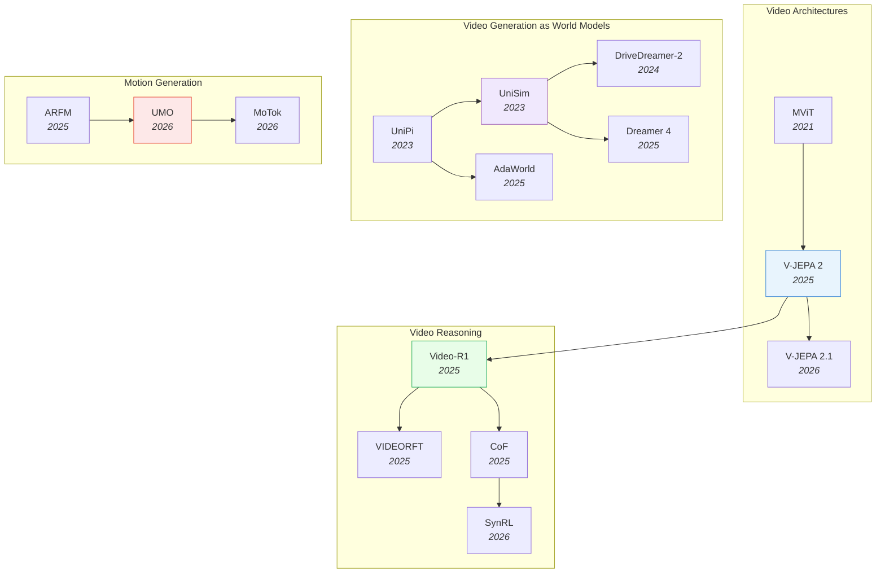

# Video & Temporal Understanding

> [!abstract] Overview
> Video models are evolving from passive understanding (classification, QA) toward active generation (world simulation, motion synthesis). The key convergence: ==video generation models are becoming world models== — they learn physics, causality, and dynamics from temporal data, enabling both content creation and robotic planning. Meanwhile, a parallel revolution in video reasoning is teaching MLLMs to think temporally through RL-based post-training and chain-of-thought methods.

## Evolution Graph

The field evolved through four parallel tracks: **video architectures** (2021-2026) progressed from hand-designed multiscale pooling (MViT) to self-supervised world models (V-JEPA 2/2.1); **video-as-world-model** (2023-2025) moved from proving the concept (UniPi, UniSim) to scalable latent-action imagination (Dreamer 4, AdaWorld); **video reasoning** (2025-2026) unlocked temporal understanding via RL post-training (Video-R1, VIDEORFT) and frame-aware CoT (CoF, SynRL); and **motion generation** (2025-2026) converged on unified diffusion architectures for diverse motion tasks (UMO, MoTok).

| Year | Paper | Contribution |
|------|-------|-------------|
| 2021 | [[2104.11227\|MViT]] | Introduced multiscale pooling attention for spatiotemporal Transformers; 6.8x fewer FLOPs than ViViT-L at parity |
| 2023 | [[2302.00111\|UniPi]] | First to use text-guided video generation as a universal policy; bridged video generation and robot control |
| 2023 | [[2310.06114\|UniSim]] | Learned interactive real-world simulator from heterogeneous video data; enabled zero-shot sim-to-real transfer |
| 2024 | [[2403.06845\|DriveDreamer-2]] | LLM-controlled driving video world model; synthetic data improves 3D detection and tracking |
| 2025 | [[2506.09985\|V-JEPA-2]] | Self-supervised world model from 1M+ hours of video; enables zero-shot robotic control via MPC |
| 2025 | [[2503.18938\|AdaWorld]] | Context-invariant latent actions for adaptable world models; 70.5% human success rate on LIBERO |
| 2025 | [[2509.24527\|Dreamer-4]] | First offline diamond acquisition in Minecraft; scalable world model with 21 fps real-time inference |
| 2025 | [[2503.21776\|Video-R1]] | First rule-based RL framework for video temporal reasoning; 37.1% on VSI-Bench surpassing GPT-4o |
| 2025 | [[2505.12434\|VIDEORFT]] | Reinforced fine-tuning with semantic-consistency rewards; outperforms GPT-4o on video reasoning |
| 2025 | [[2506.00318\|CoF]] | Frame-aware reasoning traces with explicit temporal grounding; SOTA on VSI-Bench and Video-MME |
| 2025 | [[2512.22688\|ARFM]] | Autoregressive flow matching as a generalized framework for probabilistic motion prediction across domains |
| 2026 | [[2603.14482\|V-JEPA-2.1]] | Added Dense Predictive Loss for fine-grained spatial features; +35% on object interaction anticipation |
| 2026 | [[2603.17693\|SynRL]] | Synthetic video post-training teaches temporal primitives; 21x data efficiency over model-generated data |
| 2026 | [[2603.15975\|UMO]] | Unified in-context learning for diverse motion tasks via pretrained DiT; emergent multi-person interaction |
| 2026 | [[2603.19227\|MoTok]] | Diffusion-based discrete motion tokenizer decoupling semantics from kinematics; FID reduced to 0.025 |

---

## 1. Video Understanding Architectures

From video classification to self-supervised video representation learning. The trajectory moves from hand-designed multiscale pooling to self-supervised world models that learn physics from raw video.

**Multiscale Vision Transformers** — Specialized Transformer architectures that capture spatiotemporal information across multiple scales for video classification and action localization.
- [[2603.11691|STAIRS-Former]], [[2602.17807|VidEoMT]], [[2602.10094|4RC]], [[2512.08924|D4RT]], [[2511.19684|IndEgo]], [[2408.02272|COM-Kitchens]], [[2312.17686|BMViT]], [[2203.13116|EgoPAT3D]], [[2112.01526|MViTv2]], [[2104.11227|MViT]], [[1804.02748|EPIC-KITCHENS]], [[1711.07971|Non-local Networks]]

> [!star] Key Papers
> - [[2104.11227|MViT]] — Introduced multiscale pooling attention for video Transformers; foundational architecture for the family
> - [[2112.01526|MViTv2]] — Refined pooling mechanism and added decomposed relative position embeddings; strong on both classification and detection

**Self-Supervised Video Models** — Learn general video representations from unlabeled data, progressing toward world models that support zero-shot downstream transfer.
- [[2607.21576|SDM]], [[2607.09024|GenCeption]], [[2607.08436|EgoWAM]], [[2607.06856|Gen4U]], [[2606.02058|TIDES]], [[2605.22629|H-Flow]], [[2605.15618|V-JEPA-Robustness-Study]], [[2605.02134|PV-VAE]], [[2604.26488|LILA]], [[2603.22281|ThinkJEPA]], [[2603.14482|V-JEPA-2.1]], [[2603.12217|Verifier-Point-Tracking]], [[2602.11832|JEPA-VLA]], [[2512.11782|MatAnyone-2]], [[2512.01342|InternVideo-Next]], [[2511.20886|V2-SAM]], [[2507.19468|DINO-world]], [[2507.14793|FERNN]], [[2506.09985|V-JEPA-2]], [[2505.17006|CoMo]], [[2505.11129|PhiNet-v2]], [[2502.11831|V-JEPA (Intuitive Physics)]], [[2303.16727|VideoMAE V2]], [[2203.12601|R3M]], [[1504.08023|Visual Representation Anticipation]]

> [!star] Key Papers
> - [[2506.09985|V-JEPA-2]] — Self-supervised model trained on 1M+ hours of video; learned world model enables zero-shot robotic control via MPC
> - [[2603.14482|V-JEPA-2.1]] — Added Dense Predictive Loss for fine-grained spatial features; +35% on object interaction anticipation

**Video-Language Foundation Models** — Large-scale models that jointly process video and language for fine-grained understanding, captioning, and long-context comprehension.
- [[2606.03920|VSTAT]], [[2604.02317|SIMPLESTREAM]], [[2604.02073|PLUME]], [[2603.22953|ClusterSTM]], [[2602.08683|OneVision-Encoder]], [[2601.17868|VidLaDA]], [[2512.17012|4D-RGPT]], [[2507.04590|VLM2Vec-V2]], [[2507.01949|Kwai-Keye-VL]], [[2506.22880|DeSa2VA]], [[2506.16691|LaVi]], [[2506.10967|CDPruner]], [[2505.22654|VScan]], [[2504.16072|DAM]], [[2504.15271|Eagle-2.5]], [[2504.13180|PerceptionLM]], [[2412.04468|NVILA]], [[2408.03326|LLaVA-OneVision]], [[2407.07895|LLaVA-NeXT-Interleave]], [[2406.07476|VideoLLaMA 2]], [[2406.04325|ShareGPT4Video]], [[2405.13800|Dense Connector]], [[2204.14198|Flamingo]]

> [!star] Key Papers
> - [[2504.15271|Eagle-2.5]] — Efficient 8B model processing 512 video frames; achieves 72.4% on Video-MME, rivaling 72B+ models
> - [[2504.16072|DAM]] — Region-level video captioning via focal prompts; SOTA across 7 benchmarks

**Foundational Video & Egocentric Datasets** — Large-scale video corpora that have shaped video understanding research, from action-recognition datasets that taught models physical common sense to egocentric video foundations for embodied AI.
- [[2607.19745|EgoRecovery]], [[2607.14183|Open-AoE]], [[2607.06403|LingBot-VLA 2.0]], [[2606.32009|Human-as-Humanoid]], [[2606.30598|HOPformer]], [[2606.28133|Bridging Action VLA]], [[2603.15847|FEEL]], [[2511.15622|SA-FARI]], [[2509.04443|EMMA]], [[2507.12440|EgoVLA]], [[2505.11709|EgoDex]], [[2503.13441|PH2D]], [[2502.04144|HD-EPIC]], [[2411.19167|HOT3D]], [[2411.08380|EgoVid-5M]], [[2410.24221|EgoMimic]], [[2402.13349|Aria-Everyday-Activities]], [[2312.05251|HaMeR]], [[2308.13561|Project Aria]], [[2203.14712|Assembly101]], [[2203.01577|HOI4D]], [[2110.07058|Ego4D]], [[2107.13411|Egocentric Future Prediction Survey]], [[2104.11181|H2O]], [[2005.00343|EPIC-KITCHENS (Collection & Baselines)]], [[1806.07011|VirtualHome]], [[1706.04261|Something-Something]]

> [!star] Key Papers
> - [[2110.07058|Ego4D]] — 3,670 hours of egocentric video from 931 wearers across 9 countries; foundational dataset for first-person perception and the basis for Being-H0/EgoScale-style VLA pretraining
> - [[1706.04261|Something-Something]] — 108,499 clips across 174 fine-grained action classes; pioneered contrastive action templates to force models to learn physical common sense rather than superficial cues

**Active Vision & Camera Control** — Robotic and embodied methods that treat camera motion or gaze as an intent-driven action rather than a passive byproduct of navigation or manipulation.
- [[2607.02417|LIME]], [[2605.07943|TAVIS]], [[2506.10968|EyeRobot]]

> [!tip] The JEPA Connection
> V-JEPA 2 and V-JEPA 2.1 represent the video branch of the JEPA family. The lineage runs V-JEPA 2 --> V-JEPA 2.1 --> VL-JEPA --> VLA-JEPA. The full lineage is documented in the JEPA notes.

---

## 2. Video Reasoning & Temporal Understanding

Understanding *why* things happen in video, not just *what* happens. This section covers RL-based post-training, chain-of-thought reasoning, and spatiotemporal grounding methods that push Video-LLMs beyond perception toward genuine temporal reasoning.

**RL Post-Training for Video Reasoning** — Reinforcement learning frameworks that teach Video-LLMs temporal reasoning capabilities through rule-based rewards, self-supervised signals, or synthetic data.
- [[2605.22570|VGenST-Bench]], [[2605.21973|Foresee-to-Ground]], [[2605.21931|EvoVid]], [[2605.15458|VideoRLVR]], [[2605.14733|Video-Zero]], [[2605.06094|VISD]], [[2605.01324|VideoThinker]], [[2604.26707|CurEvo]], [[2604.20473|Video-ToC]], [[2604.16893|EasyVideoR1]], [[2604.04379|RLER]], [[2603.28730|SOLE-R1]], [[2603.27866|Wan-R1]], [[2603.22918|EVA-Video-Agent]], [[2603.17693|SynRL]], [[2603.01694|MVR]], [[2602.22932|MSJoE]], [[2602.20913|LongVideo-R1]], [[2602.20159|VBVR]], [[2602.05986|RISE-Video]], [[2601.19686|Video-KTR]], [[2601.04153|Diffusion-DRF]], [[2512.22315|VideoZoomer]], [[2512.06810|MMDuet2]], [[2512.03963|TempR1]], [[2512.03043|OneThinker]], [[2511.20785|LongVT]], [[2511.19524|VideoChat-M1]], [[2511.13054|ViSS-R1]]
- [[2511.11113|VIDEOP2R]], [[2511.06281|VideoSSR]], [[2511.05489|TimeSearch-R]], [[2510.23473|Video-Thinker]], [[2510.20470|Conan]], [[2510.15440|Evidence-Purity-Video]], [[2510.08480|Video-STAR]], [[2510.07915|MARC]], [[2510.06077|VER-Video-Evidence]], [[2509.24304|FrameThinker]], [[2509.23958|RLIR]], [[2509.23652|ReWatch-R1]], [[2508.04416|VITAL]], [[2508.03100|AVATAR]], [[2506.09079|VidBridge-R1]], [[2506.03340|ArrowRL]], [[2505.13934|RLVR-World]], [[2505.12434|VIDEORFT]], [[2503.21776|Video-R1]], [[2502.01784|VILP]], [[2309.15278|Out-of-Sight-Still-in-Mind]]

> [!star] Key Papers
> - [[2503.21776|Video-R1]] — First rule-based RL framework for video temporal reasoning; 37.1% on VSI-Bench surpassing GPT-4o
> - [[2505.12434|VIDEORFT]] — Reinforced fine-tuning with semantic-consistency rewards; outperforms GPT-4o on video reasoning benchmarks
> - [[2603.17693|SynRL]] — Synthetic video post-training achieves 21x data efficiency over model-generated data

**Chain-of-Thought for Video** — Methods that extend textual CoT reasoning to the video domain, explicitly grounding reasoning steps in specific frames or temporal segments.
- [[2607.15278|HDR]], [[2603.25942|SDRL]], [[2603.24558|LensWalk]], [[2603.17312|Recurrent-VLM-Reasoning]], [[2603.16870|Video-Reasoning-Chain-of-Steps]], [[2601.21037|Thinking-in-Frames]], [[2512.00805|SpecTemp]], [[2507.09876|ViTCoT]], [[2506.03525|VIDEO-SKOT]], [[2506.00318|CoF]]

> [!star] Key Papers
> - [[2506.00318|CoF]] — Frame-aware reasoning traces with explicit temporal grounding; SOTA on VSI-Bench and Video-MME
> - [[2603.16870|Video-Reasoning-Chain-of-Steps]] — Discovered that reasoning in diffusion video models unfolds across denoising steps, not frames

**Spatiotemporal Grounding & Perception** — Architectures for precise spatial and temporal localization in video, including segmentation, tracking, and pixel-grounded language understanding.
- [[2607.08537|Whareformer]], [[2605.00891|X2SAM]], [[2604.12148|ViLL-E]], [[2604.02829|STRNet]], [[2603.23404|TRACE]], [[2603.12382|SPARROW]], [[2603.12254|AutoGaze]], [[2602.20630|TraqPoint]], [[2602.11730|STVG-R1]], [[2512.10359|STAR]], [[2511.19261|LAST]], [[2511.18373|MASS]], [[2511.16077|VideoSeg-R1]], [[2508.09736|M3-Agent]], [[2508.07388|Invert4TVG]], [[2508.06317|URPA]], [[2507.10302|DisCo]], [[2507.05258|REA]], [[2506.07850|SAM2Auto]], [[2506.05302|PAM]], [[2504.07745|SF2T]], [[2503.19355|ST-VLM]], [[2408.00714|SAM 2]]

> [!star] Key Papers
> - [[2506.05302|PAM]] — Extends SAM 2 to full region-level understanding (recognize, explain, caption, segment); 1.2-2.4x faster
> - [[2511.18373|MASS]] — Motion-aware spatial-temporal grounding for physics reasoning; +8.7% over prior SOTA on physics tasks
> - [[2603.12382|SPARROW]] — Temporal referential consistency via target-specific tracked features; +8.9 J&F on MeViS RVOS

**Embodied Video Memory** — Systems that build persistent, structured memory from egocentric video streams so agents can reason and plan over accumulated past experience.
- [[2607.14252|MEMORA]], [[2607.09759|ReflectWorld-MM]]

**Temporal Traps & Failure Analysis** — Studies revealing fundamental limitations and failure modes of current Video-LLMs, especially around the tension between image and video capabilities.
- [[2603.17541|Temporal-Trap-Analysis]], [[2603.14145|MMOU]], [[2511.13787|TC2]], [[2006.00626|EGTEA-Gaze+]]

> [!star] Key Papers
> - [[2603.17541|Temporal-Trap-Analysis]] — Revealed that Video-SFT degrades image understanding despite improving video metrics; proposed Hybrid-Frame Strategy
> - [[2603.14145|MMOU]] — Joint audio-visual reasoning benchmark; best model (64.2%) far below human (84.3%)

**Benchmarks & Evaluation** — Dedicated benchmarks measuring video spatial intelligence, fine-grained temporal reasoning, and spatial-temporal interactions.
- [[2605.03941|iWorld-Bench]], [[2605.03276|VEBench]], [[2604.25276|OmniVTG]], [[2604.21873|Physics-Video-Grounding-Bench]], [[2602.18884|TPRU]], [[2601.04033|REACT-Video]], [[2512.14698|TimeLens]], [[2512.10863|MMSI-Video-Bench]], [[2507.18342|EgoExoBench]], [[2503.23765|STI-Bench]], [[2501.11340|GenVidBench]], [[2311.17005|MVBench]], [[2311.01620|ACQUIRED]], [[2305.13786|Perception Test]]

> [!star] Key Papers
> - [[2503.23765|STI-Bench]] — Best model (Gemini-2.5-Pro) scores only 41.4% on precise spatial-temporal understanding
> - [[2512.10863|MMSI-Video-Bench]] — MLLMs achieve 38.0% vs. 96.4% human accuracy on video spatial intelligence

> [!tip] RL is the Unlock for Video Reasoning
> The pattern across Video-R1, VIDEORFT, ViSS-R1, and SynRL is clear: RL post-training consistently boosts temporal reasoning where SFT alone plateaus. Combine with frame-aware CoT (CoF, ViTCoT) for grounded reasoning traces. Watch for the temporal trap -- naive Video-SFT can hurt image understanding.

---

## 3. Video Generation as World Models

The paradigm shift: video generation models that simulate ==physically plausible futures==, becoming the foundation for planning and control. These models bridge content creation and robotic planning by learning physics, causality, and dynamics from temporal data.

**Foundational Video World Models** — Systems that treat video generation as world simulation, learning to produce physically coherent future states from observation.
- [[2607.11643|Xiaomi-Robotics-U0]], [[2607.08770|LongE2V]], [[2607.08766|OPSD-V]], [[2607.07675|LingBot-Video]], [[2607.07534|LingBot-World-Infinity]], [[2607.06291|AlayaWorld]], [[2607.06216|MoWorld]], [[2607.03964|Worldscape-MoE]], [[2607.02642|GigaWorld-1]], [[2606.32028|DVG-WM]], [[2606.28804|ViPSim]], [[2606.18610|SC3-Eval]], [[2606.04463|OSCAR]], [[2606.02800|Cosmos-3]], [[2606.01027|τ0-WM]], [[2605.28820|NEO-ov]], [[2605.28816|Gamma-World]], [[2605.25874|WBench]], [[2605.23993|Nano-World-Models]], [[2605.18678|Lance]], [[2605.15725|DiLA]], [[2605.15178|SANA-WM]], [[2605.08279|LaWM]], [[2605.03821|RoboAlign-R1]], [[2604.18564|MultiWorld]], [[2604.08995|Matrix-Game-3.0]], [[2604.07209|INSPATIO-WORLD]], [[2604.04913|DeltaWorld]], [[2604.04707|OpenWorldLib]], [[2604.04502|Veo-Act]]
- [[2604.01421|EgoFlow]], [[2604.01001|EgoSim]], [[2603.30045|OmniRoam]], [[2603.26599|VGGRPO]], [[2603.25716|HyDRA]], [[2603.17117|MosaicMem]], [[2602.17259|FRAPPE]], [[2602.10717|SDA]], [[2602.10102|VideoWorld-2]], [[2602.07050|Interpreting-Physics-Video-WM]], [[2601.20540|LingBot-World]], [[2512.08269|EgoX]], [[2510.01183|EvoWorld]], [[2509.15536|SAMPO]], [[2502.20694|WorldModelBench]], [[2411.02385|PhyWorld]], [[2409.18964|PhysGen]], [[2406.16862|Dreamitate]], [[2403.06845|DriveDreamer-2]], [[2311.17982|VBench]], [[2310.06114|UniSim]], [[2304.13723|VP2]], [[2302.00111|UniPi]], [[2210.02396|TECO]], [[2203.01914|Playable-Environments]], [[2101.12195|CADDY]], [[1806.09655|CLASP-Action-Space]], [[1507.08750|Action-Conditional-Video-Prediction]]

> [!star] Key Papers
> - [[2302.00111|UniPi]] — First to use text-guided video generation as a universal policy; bridges video generation and robot control
> - [[2310.06114|UniSim]] — Learned interactive real-world simulator from video data; key inspiration for the WAM paradigm

**Latent-Action & Scalable World Models** — World models that extract latent action representations from unlabeled video, enabling RL-based agent training entirely within imagination.
- [[2607.11397|WALA]], [[2604.10333|ZWM]], [[2510.26433|CoLA-World]], [[2509.24527|Dreamer-4]], [[2506.09995|PlayerOne]], [[2505.13934|RLVR-World]], [[2503.18938|AdaWorld]], [[2501.03575|Cosmos]], [[2402.15391|Genie]]

> [!star] Key Papers
> - [[2509.24527|Dreamer-4]] — First offline diamond acquisition in Minecraft; scalable world model with real-time 21 fps inference
> - [[2503.18938|AdaWorld]] — Context-invariant latent actions for adaptable world models; FVD of 767.0

**Video Generation for Planning & Grounding** — Methods that use generated video as a planning medium, grounding visual plans in physically feasible actions.
- [[2607.13017|FlowWAM]], [[2607.12800|UniVR]], [[2607.06558|RynnWorld-Teleop]], [[2607.06018|RoboTALES]], [[2606.29908|SWAM]], [[2605.18233|MIGA]], [[2604.09330|VAG]], [[2604.06168|Action-Images]], [[2604.03181|MV-VDP]], [[2603.08403|SPIRAL]], [[2603.03195|CoWVLA]], [[2602.20119|NovaPlan]], [[2602.01960|GVP-WM]], [[2512.24766|Dream2Flow]], [[2512.06628|MIND-V]], [[2511.16669|VANS]], [[2506.22007|RoboEnvision]], [[2506.00613|WorldGym]], [[2407.05530|This&That]]

> [!star] Key Papers
> - [[2602.01960|GVP-WM]] — Converts physically inconsistent video plans into feasible action sequences via latent-space trajectory optimization
> - [[2603.08403|SPIRAL]] — Closed-loop self-improving framework for controllable, long-horizon video generation

**Foundational Text-to-Video Diffusion Models** — Early open-source diffusion architectures that established the base recipe for high-quality text-to-video generation, later extended by controllable and physics-aware variants.
- [[2408.06072|CogVideoX]], [[2310.20700|SEINE]], [[2308.06571|ModelScopeT2V]], [[2210.02303|Imagen Video]]

**Evaluation & Detection of Generated Video** — Metrics and benchmarks that assess text-to-video generation quality/alignment or detect AI-generated video content, forming the evaluation counterpart to the generation methods above.
- [[2405.19707|DeMamba]], [[2401.07781|T2VScore]]

**Controllable Video Synthesis** — Dedicated architectures for high-fidelity, subject-driven, or reason-informed video editing and generation.
- [[2607.15038|Wan-Streamer v0.3]], [[2607.04443|Wan-Streamer v0.2]], [[2605.13724|AnyFlow]], [[2605.02641|Mamoda2.5]], [[2604.07348|MoRight]], [[2604.02296|VOID]], [[2603.25188|AnyID]], [[2603.18524|3DreamBooth]], [[2603.17051|Astrolabe]], [[2602.05449|DisCa]], [[2512.09924|ReViSE]], [[2512.06674|RunawayEvil]], [[2511.00511|ID-Crafter]], [[2510.08131|Motion-Controllable-Video-Diffusion]], [[2507.17744|Yume]], [[2506.18701|Matrix-Game]], [[2504.12369|WorldMem]], [[2503.20314|Wan]], [[2502.02492|VideoJAM]], [[2501.08325|GameFactory]], [[2501.08316|APT]], [[2412.03568|The-Matrix]], [[2407.08737|VADER]], [[2312.00777|VideoBooth]], [[2307.04725|AnimateDiff]], [[2306.01872|Video Adapter]], [[2304.01186|Follow-Your-Pose]], [[2212.11565|Tune-A-Video]]

> [!star] Key Papers
> - [[2603.18524|3DreamBooth]] — 3D-consistent subject-driven video generation; Chamfer Distance of 0.0177
> - [[2512.09924|ReViSE]] — Reason-informed video editing via self-reflective learning; +32% on RVE-Bench

**Surveys & Roadmaps** — Comprehensive overviews of the video-to-world-model progression.
- [[2604.15911|Efficient-Video-Diffusion-Survey]], [[2603.28489|Video-Gen-as-WM-Survey]], [[2603.25887|WR-Arena]], [[2603.23497|WildWorld]], [[2603.22212|Omni-WorldBench]], [[2511.08585|Visual-World-Roadmap]], [[2504.21853|Interactive-Generative-Video-Survey]]

> [!star] Key Papers
> - [[2511.08585|Visual-World-Roadmap]] — Four-generation taxonomy from video generators to planning-capable world simulators
> - [[2504.21853|Interactive-Generative-Video-Survey]] — Maps the emerging interactive-video-generation paradigm where users steer model rollouts in real time, bridging T2V and world-simulation

> [!tip] Video World Models Feed WAMs
> This cluster directly feeds into World Action Models. If you can generate video of the future, you can plan by imagining outcomes. UniPi and UniSim established the pattern; Dreamer 4 and AdaWorld scale it. See [[04_Reinforcement-Learning]] for RL inside world models and [[07_Robotics-and-Embodied-AI]] for the embodied applications.

**Controllable Video Synthesis (Schematic Perception)** — Architectures for fine-grained controllability over motion, identity, lighting, camera, and dynamics in video generation. This is the "basic schematic perception" tier of physics cognition: models that respect user-supplied constraints (drag points, trajectories, force vectors, identities) without yet learning physical laws from scratch.
- [[2607.01962|NeoMap]], [[2511.00503|Diff4Splat]], [[2507.01099|Geometry-aware-4D-Robot-Video]], [[2506.20703|Generative-Blocks-World]], [[2506.19798|CoCo4D]], [[2506.15673|UniRelight]], [[2506.03150|IllumiCraft]], [[2505.20287|MotionPro]], [[2504.21855|ReVision]], [[2503.24379|Any2Caption]], [[2503.14485|Lux-Post-Facto]], [[2502.03639|3DPointReg-I2V]], [[2412.15214|LeviTor]], [[2412.11785|InterDyn]], [[2412.11224|GenLit]], [[2412.09551|delta-Diffusion]], [[2412.02700|Motion-Prompting]], [[2412.02168|Generative-Photography]], [[2412.00148|Motion-Modes]], [[2411.17440|Identity-Preserving-T2V]], [[2411.16804|InTraGen]], [[2411.10836|AnimateAnything]], [[2411.04989|SG-I2V]], [[2410.22979|LumiSculpt]], [[2410.13830|DreamVideo-2]], [[2409.00558|Compositional-3D-Video]], [[2408.11475|TrackGo]], [[2407.21705|Tora]], [[2406.17758|MotionBooth]], [[2406.16863|FreeTraj]], [[2406.15339|Image-Conductor]], [[2406.09905|Nymeria]], [[2406.01188|UniAnimate]], [[2405.20222|MOFA-Video]], [[2403.20193|Motion-Inversion]], [[2403.17920|TC4D]], [[2403.15249|SMA]], [[2403.07420|DragAnything]], [[2402.03162|Direct-a-Video]], [[2401.15977|Motion-I2V]], [[2312.17681|FlowVid]], [[2312.03641|MotionCtrl]], [[2312.00845|VMC]], [[2311.17117|Animate-Anyone]], [[2310.08465|MotionDirector]], [[2310.05922|FLATTEN]], [[2309.07906|Generative-Image-Dynamics]], [[2308.08089|DragNUWA]], [[2306.02018|VideoComposer]], [[2305.13840|Control-A-Video]], [[2302.05543|ControlNet]]

> [!star] Key Papers
> - [[2302.05543|ControlNet]] — Foundational conditional control framework for diffusion (image-level), the architectural ancestor of every controllable video method below
> - [[2308.08089|DragNUWA]] — Trajectory-controllable video generation via drag-style point trajectories; defined the user-interaction pattern many later T2V tools adopted
> - [[2407.21705|Tora]] — First trajectory-oriented Diffusion Transformer (DiT) for video generation; brought DiT-scale architectures to controllable T2V
> - [[2511.00503|Diff4Splat]] — Feed-forward 4D scene generation as deformable 3D Gaussian fields with explicit camera control; 60x faster than per-scene optimization while preserving geometric integrity

**Physics-Aware Video Generation** — Video diffusion / flow models that condition on or learn from physical knowledge (forces, materials, kinematics, simulator outputs). The bridge between schematic controllable video and full world simulators: papers here aim for *physically plausible* motion rather than just controllable motion.
- [[2606.28128|PhysisForcing]], [[2603.18639|PhysVideo]], [[2603.09094|CoECT]], [[2603.06408|Physical-Simulator-In-the-Loop-Video]], [[2603.05449|RealWonder]], [[2603.03485|Phys4D]], [[2601.18577|Self-Refining-Video-Sampling]], [[2601.05848|Goal-Force]], [[2601.03665|PhysVideoGenerator]], [[2512.24551|PhyGDPO]], [[2512.10927|FoundationMotion]], [[2512.10675|Veo-Robotics]], [[2511.20280|VLM-Refine-Physics-Video]], [[2511.17450|Sketch-Guided-Plan-Verification]], [[2510.02284|KineMask]], [[2509.21541|ControlHair]], [[2509.21309|NewtonGen]], [[2507.06830|Physics-Grounded-Motion-Forecasting]], [[2506.06440|Vid2Sim]], [[2505.21653|DiffPhy]], [[2505.19386|Force-Prompting]], [[2504.01204|Articulated-Kinematics-Distillation]], [[2503.21442|RainyGS]], [[2503.20822|Synthetic-Video-Physical-Fidelity]], [[2503.20654|AccidentSim]], [[2503.17973|PhysTwin]], [[2503.04720|FluidNexus]], [[2502.19868|C-Drag]], [[2501.18982|OmniPhysGS]], [[2501.16550|PhysAnimator]], [[2412.17804|GausSim]], [[2411.19381|Sketch-Animation-Diffusion]], [[2411.14423|PhysFlow]], [[2411.11343|TVML]], [[2411.02394|AutoVFX]], [[2410.08257|NeuMA]], [[2410.07155|Trans4D]], [[2409.07179|Phy124]], [[2408.10453|Kubrick]], [[2406.04338|Physics3D]], [[2406.01476|DreamPhysics]], [[2405.16849|Sync4D]], [[2405.15056|ElastoGen]], [[2405.13557|MotionCraft]], [[2404.13026|PhysDreamer]], [[2404.09833|Video2Game]], [[2312.00583|DeformGS]], [[2311.12631|GPT4Motion]], [[2309.17444|LVD]], [[2309.17024|HoloAssist]], [[2304.14369|NCLaw]]

> [!star] Key Papers
> - [[2505.19386|Force-Prompting]] — Force vectors as a controllable generation prompt; first to enable physics-driven I2V where users specify push/drag interactions
> - [[2509.21309|NewtonGen]] — Neural Newtonian Dynamics (physics-informed neural ODEs) integrated into T2V; explicit Newtonian motion control with **0.98** Physical Invariance Score vs Sora's **0.65**
> - [[2501.18982|OmniPhysGS]] — General physics-based dynamics for 3D Gaussians via learnable constitutive models; ensemble of 12 expert constitutive networks + custom PyTorch MPM solver
> - [[2406.04338|Physics3D]] — Distills physical properties (Young's modulus, viscosity, plasticity) into 3D Gaussians via video diffusion priors; canonical recipe for material-from-pixels
> - [[2503.17973|PhysTwin]] — Single-image-to-physical-twin pipeline; estimates material parameters and rigging that re-simulate under arbitrary forces

**Active World Simulators (Physics)** — The next tier above physics-aware generation: models that act as full interactive world simulators with action conditioning, RL alignment, or world-model-driven physics rewards. Includes Cosmos, Genie, UniSim, GAIA-1 and their physics-aware descendants.
- [[2607.10781|Training-Free Norm Injection]], [[2607.01060|RoboWorld]], [[2604.24764|World-R1]], [[2603.24506|PhyGenesis]], [[2603.03505|PhyPrompt]], [[2511.03997|PhysCorr]], [[2511.00062|Physical-AI-World-Sim]], [[2510.21840|V-JEPA-2-Physics-Reward]], [[2509.24702|Implausibility-Reasoning-Video-Gen]], [[2508.10858|PhysHPO]], [[2506.23135|RoboScape]], [[2506.18655|RDPO]], [[2506.01103|DeepVerse]], [[2505.23656|VideoREPA]], [[2505.21996|VRAG-WM]], [[2505.09723|EnerVerse-AC]], [[2504.15397|MirrorVerse]], [[2504.13129|Science-T2I]], [[2503.18945|Aether]]
- [[2503.08153|WISA]], [[2502.02088|IPO]], [[2501.13918|VideoAlign]], [[2501.09038|Physics-IQ]], [[2412.20404|Open-Sora]], [[2412.08410|DrivePhysica]], [[2412.02617|AIF-Dynamic-T2V]], [[2412.00596|PhyT2V]], [[2410.18072|WorldSimBench]], [[2410.13571|DriveDreamer4D]], [[2410.10076|VideoAgent]], [[2410.05582|Gen-Drive]], [[2408.07009|Imagen-3]], [[2404.05014|MagicTime]], [[2401.09985|WorldDreamer]], [[2309.17080|GAIA-1]], [[1907.06987|Kinetics-700]]

> [!star] Key Papers
> - [[2501.09038|Physics-IQ]] — Definitive evaluation of whether generative video models learn physical principles; showed visual realism does not imply physics understanding
> - [[2309.17080|GAIA-1]] — Wayve's 9B autoregressive driving world model; foundational result that internet-scale video pretraining yields a useful driving world simulator
> - [[2410.18072|WorldSimBench]] — First benchmark explicitly framing video generators as world simulators; introduced explicit/implicit evaluation pipeline

**Physics-Aware Video Benchmarks** — Diagnostic benchmarks specifically built to expose physics violations in video generators (gravity, collision, conservation, optics, materials). These are the evaluation backbone of the physics-cognition agenda.
- [[2606.24256|TailOR]], [[2606.04811|Dream.exe]], [[2603.19607|Physion-Eval]], [[2602.13294|VisPhyWorld]], [[2602.06033|VLM-Intuitive-Physics]], [[2601.18340|Beyond-Rigid]], [[2601.15282|Embodied-World-Video-Gen-Bench]], [[2512.12756|FysicsWorld]], [[2512.06963|VideoVLA]], [[2512.04221|MoReGen]], [[2510.11512|LikePhys]], [[2510.08398|VideoVerse]], [[2510.07550|TRAVL]], [[2510.06251|Physics-Frontier-Diagnostic]], [[2510.02311|IDPP]], [[2507.15824|PhysVidBench]], [[2506.10975|GenWorld]], [[2506.09849|IntPhys-2]], [[2506.02794|PhysGaia]], [[2506.00022|PHYSICS-Dataset]], [[2505.24182|MVPBench]], [[2505.22566|Universal-Visuo-Tactile]], [[2505.15929|PhyX]], [[2505.00337|T2VPhysBench]], [[2505.00209|TRAJAN]], [[2503.23715|HOIGen-1M]], [[2503.21755|VBench-2.0]], [[2503.21668|Object-Understanding-Cog-Eval]], [[2503.14378|Impossible-Videos]], [[2502.05503|PhyCoBench]], [[2412.01800|PhysGame]], [[2411.13609|VAMP]], [[2406.18522|ChronoMagic-Bench]], [[2406.11802|PhyBench]], [[2406.03520|VideoPhy]], [[2311.10111|VideoCon]], [[2306.15668|Physion++]], [[2106.08261|Physion]], [[2012.04293|CRAFT]], [[1910.01442|CLEVRER]], [[1803.07616|IntPhys]]

> [!star] Key Papers
> - [[2106.08261|Physion]] — Foundational benchmark that defined the model-vs-human physical-prediction gap; basis for Physion++ and many follow-ups
> - [[2406.03520|VideoPhy]] — First benchmark explicitly evaluating physical commonsense in T2V models; revealed even SOTA generators score far below human accuracy
> - [[2506.09849|IntPhys-2]] — Updated version of the influential intuitive-physics benchmark; richer scenarios for testing object permanence, continuity, and solidity
> - [[2510.08398|VideoVerse]] — Tests "world model capability" via hidden-semantics prompts; reveals open-vs-closed-source gap on Mechanics/Interaction/Material dimensions even when basic T2V is comparable
> - [[2512.12756|FysicsWorld]] — Unified full-modality benchmark for any-to-any (image+video+audio+text) understanding/generation/reasoning; CMCS strategy filters out unimodal shortcuts

> [!tip] Physics Cognition Tiers
> Three tiers across this expansion of §3: (1) **schematic perception** — controllable video (DragNUWA, ControlNet, Tora, motion prompting) where users specify constraints; (2) **passive physics cognition** — physics-aware T2V/I2V (Force Prompting, NewtonGen, OmniPhysGS, Physics3D, PhysTwin, PhysGaussian) that learns implicit or explicit physics from data; (3) **active cognition** — full world simulators (Cosmos, GAIA-1, Genie, Physics-IQ-aligned models, PhyGenesis) that close the action loop. Most ICML/NeurIPS 2025 effort is in tier 2; the frontier is moving to tier 3 with V-JEPA reward signals, PhysWorld digital twins, and physics-informed neural ODEs (NewtonGen). Benchmarks (FysicsWorld, VideoVerse, LikePhys) are catching up faster than generators — the world-model gap is now well-quantified.

---

## 4. Motion Generation

Synthesizing human and robot motion — bridging video understanding with physical action. The field is converging on unified architectures that handle diverse motion tasks through a single model rather than task-specific pipelines.

**Unified Motion Architectures** — Single models that handle multiple motion generation tasks (text-to-motion, motion prediction, motion editing) through shared representations.
- [[2604.24833|MotionBricks]], [[2604.11251|CLAW]], [[2604.08121|Uni-ViGU]], [[2603.19227|MoTok]], [[2603.15975|UMO]], [[2506.13040|MAMMA]], [[1711.00937|VQ-VAE]]

> [!star] Key Papers
> - [[2603.15975|UMO]] — Unified in-context learning for diverse motion tasks via meta-operation embeddings on a pretrained DiT; FID of 9.460
> - [[2603.19227|MoTok]] — Diffusion-based discrete motion tokenizer decoupling semantics from kinematics; FID from 0.061 to 0.029

**Motion Prediction & Flow** — Autoregressive and flow-based methods for predicting future motion trajectories and bridging video generation with 3D object manipulation.
- [[2512.24766|Dream2Flow]], [[2512.22688|ARFM]], [[2409.19499|FastUMI]], [[2409.16283|Gen2Act]], [[2312.07531|WHAM]], [[2304.08488|VRB]], [[2204.13662|ARCTIC]]

> [!star] Key Papers
> - [[2512.22688|ARFM]] — Autoregressive flow matching as a generalized framework for probabilistic motion prediction
> - [[2512.24766|Dream2Flow]] — Bridges video generation and 3D object flow; enables open-world manipulation with up to 8/10 success rate

> [!tip] Motion as the Missing Link
> Motion generation connects video understanding (perceiving dynamics) with robotics (producing actions). UMO and MoTok show that diffusion-based approaches unify diverse motion tasks. Dream2Flow demonstrates how video generation models can directly produce 3D motion representations for robot control.

---

## Cross-References

- [[01_Foundation-Models]] — Vision Transformer backbones for video
- [[04_Reinforcement-Learning]] — RL inside world models (Dreamer 4, RLVR-World)
- [[05_Computer-Vision-and-3D]] — 3D perception for spatial video understanding
- [[07_Robotics-and-Embodied-AI]] — Video models for robotic planning and control
- [[12_Diffusion-and-Generation]] — Diffusion architectures underlying video generation

---

*Next: [[07_Robotics-and-Embodied-AI]] — where video understanding, world models, and motion generation converge for embodied intelligence.*